Slab-Body P-Bass Authentication & Valuation Guide

1.  [01Introduction: The Bass That Changed Everything](#intro)
2.  [021951, 1952 & 1953, How They Differ](#historical-context)
3.  [03Mismatched Neck & Body Dates: What It Means](#mismatched-dates)
4.  [04The Body, Finish & Visual Aging](#body-finish)
5.  [↳ The Butterscotch Blonde Finish](#butterscotch)
6.  [↳ Tan Lines Under the Hardware](#tan-lines)
7.  [↳ Nail Holes in the Finish](#nail-holes)
8.  [↳ Body Routing & Tool Marks](#routing)
9.  [05The Neck: Construction & Authentication](#neck)
10.  [↳ Truss Rod: Flat-Head Only](#truss-rod)
11.  [↳ The Walnut Plug](#walnut-plug)
12.  [↳ Black Dot Fret Markers](#fret-markers)
13.  [↳ Body Stamps, Neck Heel & D Stamp](#stamps)
14.  [06Headstock: Logo, Tuners & String Tree](#headstock)
15.  [07The Pickup: Construction & Specs](#pickup)
16.  [08The Finger Rest (Tug Bar)](#finger-rest)
17.  [09Pickup Cover & Bridge Cover](#covers)
18.  [10The Bridge: Saddles, Serial Number & Patent Pending](#bridge)
19.  [↳ Slotted vs. Phillips Screws](#screws)
20.  [11Controls: Knobs, Pots & Capacitor](#controls)
21.  [12The Output Jack](#output-jack)
22.  [13Ferrules on the Back of the Body](#ferrules)
23.  [14The Neck Plate](#neck-plate)
24.  [15Tone: The Sound of the Early P-Bass](#tone)
25.  [16Famous Players](#players)
26.  [17Complete Specifications Table](#specs)
27.  [18Authentication Checklist](#checklist)
28.  [19Valuation & Current Market](#valuation)
29.  [20Comparisons to Contemporaries](#comparisons)

## Introduction: The Bass That Changed Everything

In late 1951, Leo Fender did something no one in the music industry believed was possible, or even necessary. He took the upright double bass, an instrument that had defined the low end of American music for a century, and reimagined it as a solid-body electric instrument that a single player could carry to a gig under one arm. The instrument he shipped to dealers beginning in late 1951 and continued refining through 1952 and 1953 was the Fender Precision Bass, and it was not merely a new product. It was the beginning of an entirely new chapter in the history of popular music.

The **early slab-body Fender Precision Bass**, covering production from late 1951 through 1953, is now recognized as one of the most historically significant instruments ever manufactured. It predates the Stratocaster. It predates the modern music industry's infrastructure of studios, amplifiers, and live sound reinforcement that would eventually be built around it. This guide covers all three years of the original slab-body run together, because the construction philosophy, the authentication details, and the collecting criteria are largely shared across 1951, 1952, and 1953 production, with important and specific differences noted where they exist.

For the vintage collector, these instruments represent one of the most rewarding, and most challenging, authentication exercises in the Fender world. The details that define a genuine example are extraordinarily specific, and many of them changed year to year, even *within* a single year of production. This guide covers every authentication point in exhaustive detail.

If you own an early Fender Precision Bass and want an expert evaluation, [Joe's Vintage Guitars makes it easy to sell your guitar nationwide](/), free market appraisals, no pressure, and we arrange all shipping from anywhere in the US.

**Call or text: (602) 900-6635**, same-day responses, no pressure, no obligation.

## 1951, 1952 & 1953, How They Differ

While the three years of early slab-body production share the same fundamental design and construction DNA, there are meaningful differences between them that affect both authentication and market value. Understanding where a specific instrument falls within this production window is not an academic exercise. It directly affects how you read the details and what you expect to find.

**1951 (late production):** The very earliest Precision Basses, produced in the final months of 1951, are the rarest of the slab-body era. These instruments are almost indistinguishable from early 1952 production in most respects. Hardware is entirely slotted-head. Serial numbers are low, typically stamped on the bridge plate. The "Patent Applied For" or "Patent Pending" language appears on both the headstock decal and the bridge plate. Bodies are solid ash with the earliest, lightest versions of the blonde nitrocellulose finish.

**1952:** The most commonly discussed year in the slab-body era, 1952 production saw a transition mid-year from slotted to Phillips-head screws in some hardware positions. The serial number range expands considerably. Construction details remain consistent with late 1951 production in most respects, though very minor variations in body contouring and hardware sourcing appear across the year.

**1953:** By 1953 the instrument was well established and production was more consistent. Phillips-head screws are more uniformly present by this point in production. The finish, hardware, and electronics remain largely the same as 1952. Some 1953 instruments show a slightly more contoured body than the earliest examples; Fender was beginning to experiment with ergonomic refinements that would culminate in the fully contoured Stratocaster body of 1954. The "Patent Pending" language begins transitioning to an actual patent number on some late 1953 examples.

## Mismatched Neck & Body Dates: What It Means

The Fender Precision Bass used throughout this guide as our photographic reference is itself a perfect illustration of one of the most important and most misunderstood aspects of early Fender production: **mismatched neck and body dates**. This particular instrument has a neck dated to 1952 and a body dated to 1953, and it left the Fender factory that way. It is not a parts bass, and it has not been tampered with. It is exactly how Fender built instruments during this period.

#### About the Bass in These Photos

The instrument photographed throughout this guide has a **1952 neck** paired with a **1953 body**, assembled at the Fender factory in Fullerton, California as a unit. This is a factory-original combination, not a later marriage of parts. Depending on how you date it, this bass can legitimately be called either a 1952 or a 1953 Fender Precision Bass.

It is accompanied in the featured photograph by a 1953 Fender Bassman amplifier with the original owner's name painted on the pickguard and the grill cloth, a remarkable period survivor.

Fender in the early 1950s did not assemble instruments from a perfectly synchronized production line the way a modern factory might. Necks and bodies were built in separate batches, finished independently, and then brought together for final assembly when a sufficient supply of both was on hand. The result is that the date stamp on a body and the pencil date on a neck heel can be, and very commonly are, anywhere from a few weeks to several months apart on a completely original, factory-assembled instrument.

A difference of **under twelve months** between a neck date and a body date on an early Fender instrument is entirely consistent with authentic factory production. This is not a red flag. It is not evidence of a parts swap. It is how Fender built guitars and basses in this period, and experienced collectors and authenticators expect to see it. What would be unusual, and genuinely worth scrutinizing, is a date discrepancy of more than roughly twelve months, or dates that don't make sense relative to the instrument's serial number range.

When you encounter a 1951 to 1953 Precision Bass with a neck dated a few months earlier or later than the body, do not dismiss the instrument. Instead, verify that both dates are consistent with the serial number, that both are in the correct format and location for the period, and that the overall picture of the instrument, finish, hardware, electronics, is internally consistent. A neck date of late 1952 and a body date of early 1953 on the same instrument is perfectly normal and says nothing negative about the instrument's originality.

## The Body, Finish & Visual Aging

<h3 id="butterscotch">The Butterscotch Blonde Finish</h3>

The finish on an early Fender Precision Bass is one of its most immediately recognizable features. Fender referred to the color as **"Blonde,"** but in the seven decades since these instruments were built, the original nitrocellulose lacquer has aged to a color that collectors almost universally describe as **butterscotch**. The amber tones in the nitro have deepened over time, producing a warm, honey-golden appearance that varies from instrument to instrument depending on UV exposure and storage.

A fresh example straight from the factory would have appeared considerably lighter, almost cream or pale yellow. The butterscotch appearance you see today is entirely a product of age and nitro chemistry. A bass with a finish that appears too bright, too white, or suspiciously consistent in color across the entire body should be examined carefully for evidence of a refinish.

The finish was applied directly over the bare ash body. Ash was Fender's wood of choice in this period, typically a two-piece body with the grain running in complementary directions. The pronounced grain of the ash is often clearly visible through the translucent finish, giving each instrument a unique visual texture.

<h3 id="tan-lines">Tan Lines: The Finish Under the Hardware</h3>

One of the most important authentication details on any original early Precision Bass is the presence of **tan lines**, areas of the body finish that were protected from UV exposure by the hardware and pickguard for decades, retaining the original lighter, creamier color as it appeared when new. These areas are found under the pickguard, under the bridge cover, under the pickup cover, and under the neck plate, and they contrast visibly with the darker, more amber-toned finish in the exposed areas.

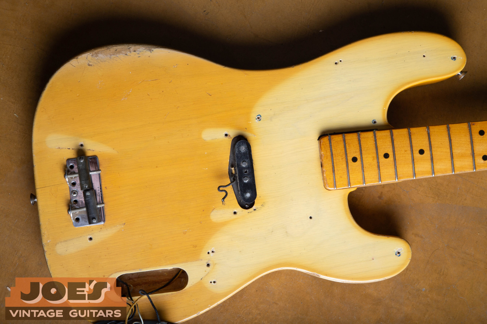

Remove the pickguard from an all-original early P-Bass and you will typically find a noticeably lighter area of finish beneath it, sometimes strikingly so. A body that shows *uniform* finish coloration under the hardware, no tan lines whatsoever, warrants careful scrutiny, as it suggests the hardware was removed at some point or the finish is not original.

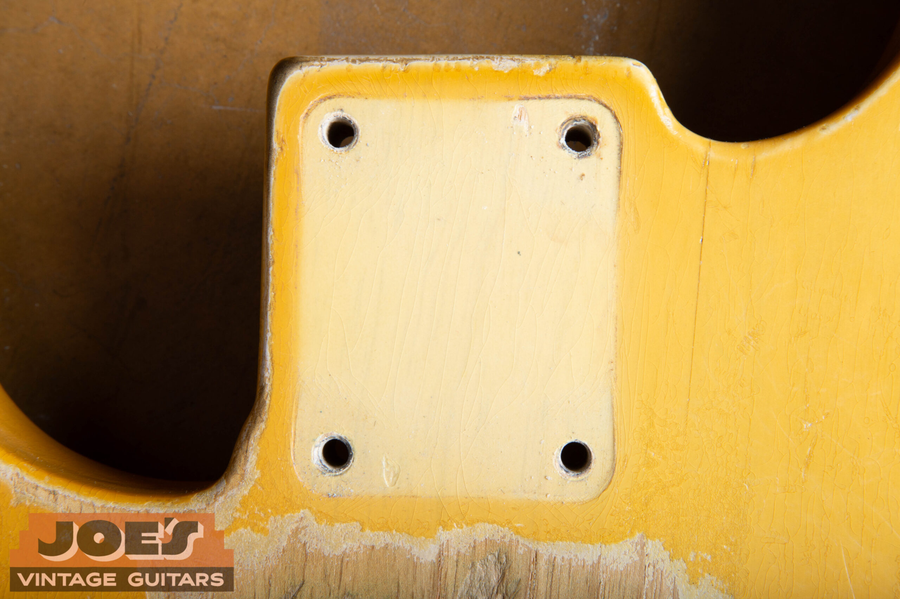

<h3 id="nail-holes">Nail Holes in the Finish</h3>

One of the most frequently overlooked details of original Fender finishes from this era is the presence of **small nail holes**, tiny puncture marks in the finish, typically found on the body sides or inconspicuous areas. Bodies were hung on nails or hooks while the finish was sprayed and allowed to dry, and once the nail was removed it left a small hole punched through the finish down to bare wood. Critically, because the nail was removed *after* finishing, these holes will show **bare wood at the center**, not filled with finish. The finish forms a clean, sharp-edged crater around the hole, with the raw wood visible in the center.

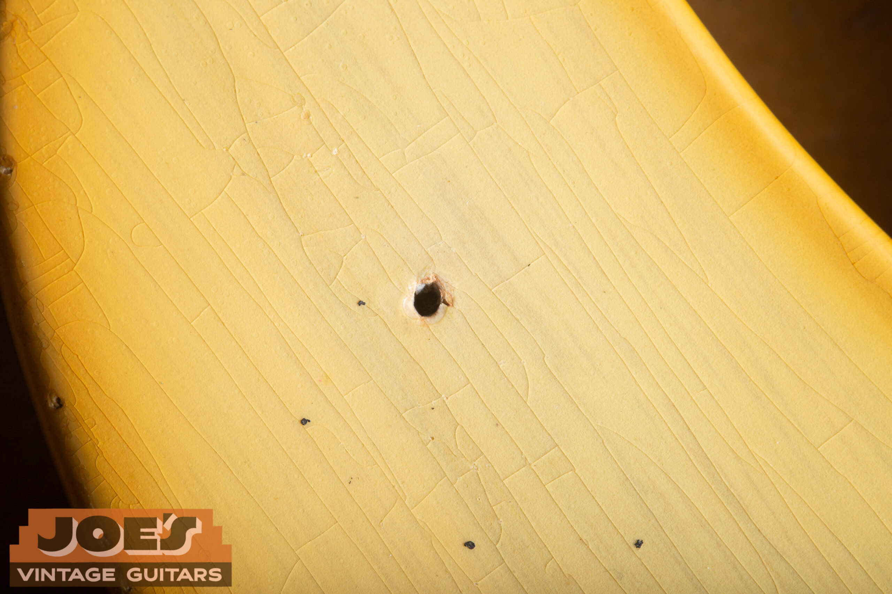

<h3 id="routing">Body Routing &amp; Tool Marks</h3>

The control cavity routing was done by hand-guided router, and it shows. Look carefully at the cavity walls and you will often see slight irregularities: faint lines, minor steps, or ridges left by the router as it was guided through the cut. These tool marks are entirely normal and expected on a genuine instrument. A control cavity with perfectly smooth, machine-perfect walls should prompt you to consider whether the body has been refinished or the cavity re-routed.

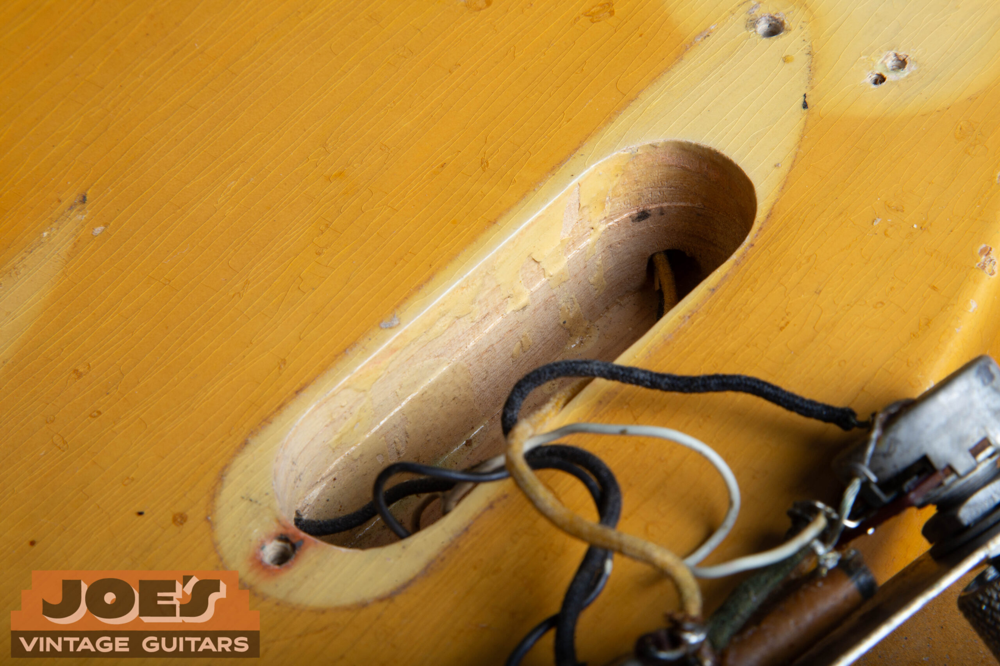

## The Neck: Construction, Details & Authentication

The neck on an early Fender Precision Bass is a **one-piece maple neck**, the fretboard is not a separate piece of rosewood or maple glued on top, but is simply the top surface of the same maple neck blank, radiused and fretted directly. This construction method was a Fender hallmark in the early years of production and is one of the clearest distinguishing characteristics of pre-1959 Fender instruments. The neck profile is a pronounced C-shape with substantial girth, particularly at the first few positions.

<h3 id="truss-rod">The Truss Rod: Flat-Head Access Only</h3>

The truss rod on an early Precision Bass is adjusted via a slot in the headstock that accepts a **flat-head screwdriver, not Phillips, not hex/Allen key**. This is a critical authentication point. If you encounter a bass represented as early 1950s production with a Phillips-head or hex-key truss rod adjustment, that neck is not correct for the instrument.

<h3 id="walnut-plug">The Walnut Plug on the Headstock</h3>

One of the most distinctive and instantly recognizable details of a pre-CBS Fender maple-board neck is the **small walnut plug** set into the face of the headstock just behind the nut. This dark walnut insert was used to fill the channel through which the truss rod was installed during manufacture. On a genuine early P-Bass neck, it is clearly visible as a dark wood insert contrasting against the lighter maple.

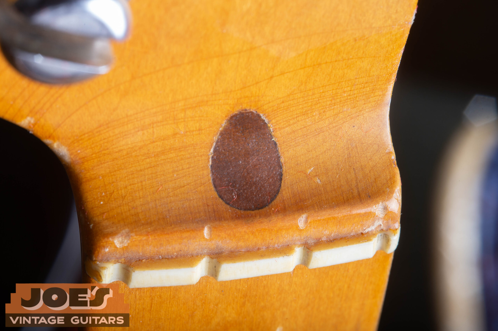

<h3 id="fret-markers">Fret Markers: Black Dots</h3>

The position markers on an early Precision Bass fretboard are small **black dot inlays** set into the maple, not the white dots or pearl dots found on later instruments. They appear as distinctly dark circles at the standard fret positions. This detail changed in later Fender production, making the black dots a useful period-correct identifier.

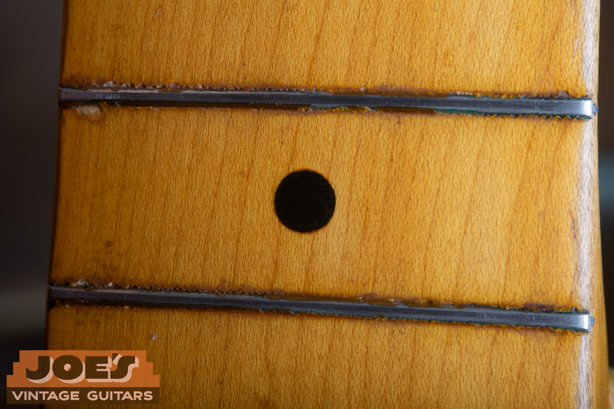

<h3 id="stamps">Body Stamps, Neck Heel Dates &amp; the D Stamp</h3>

The neck pocket will often contain an **ink stamp** indicating the month and year the body was completed (e.g., "7-52" for July 1952). The underside of the neck heel carries a **pencil date written by the factory worker** who assembled the neck, handwritten and entirely consistent with genuine Fender production practice. As discussed above, the neck date and body date will frequently be a few months apart on an all-original instrument.

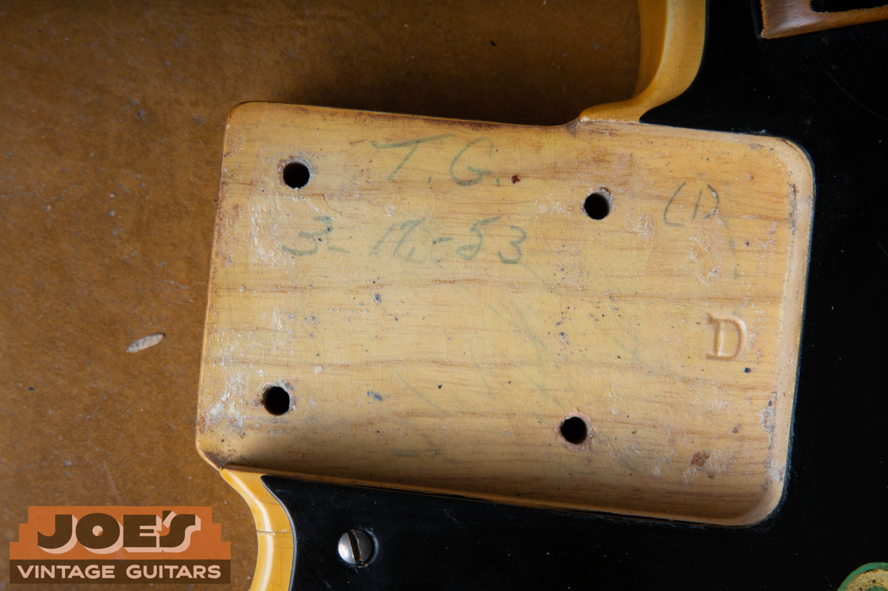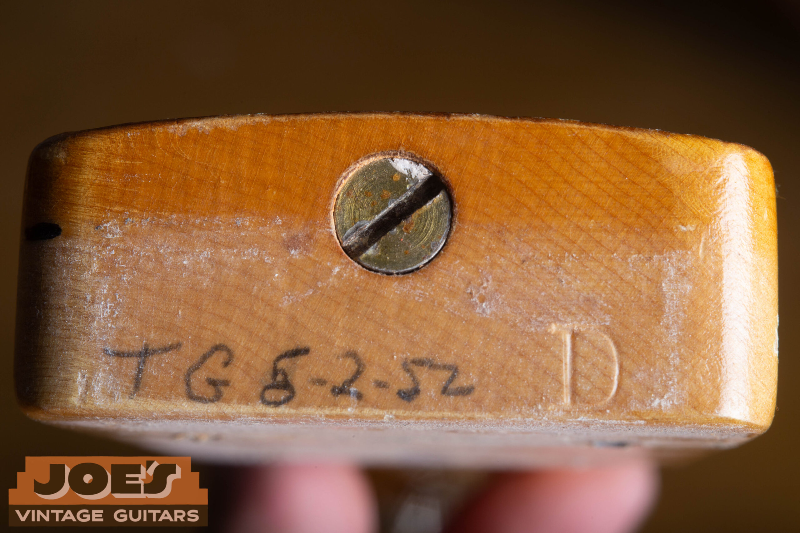

Some examples also carry a **"D" stamp** in the neck pocket or on the neck heel. The most commonly accepted interpretation is that it refers to a body or neck dimension specification or a particular worker's code. Its presence is consistent with authentic production and is not a cause for concern.

## The Headstock: Logo, Tuners & String Tree

The headstock of an early Precision Bass carries a **silver foil decal logo** with the Fender script in a specific style different from logos used in later production. The decal reads "Fender" in the distinctive script with "PRECISION BASS" in block letters below, and **"PATENT PENDING"** printed beneath that. The "Patent Pending" designation is significant: on instruments produced before the design patent was granted (Des. 169,062, granted March 4, 1953), you will see "Patent Applied For." On some late 1953 examples the actual patent number begins to appear.

The **string tree** is a small **circular (round disc) style**, not the butterfly string tree found on later Fender instruments. This round disc sits between the nut and the first set of tuning machines to maintain downward string pressure.

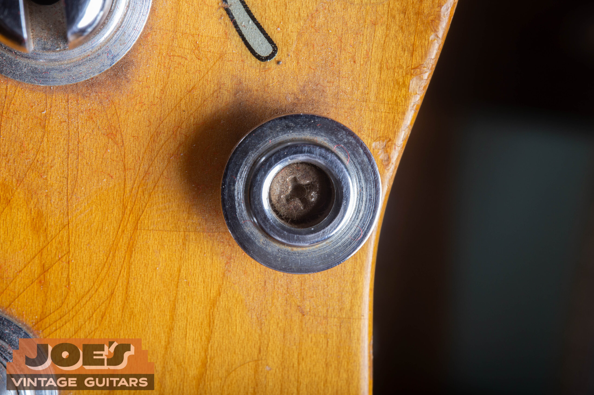

The **tuning machines** are individual open-gear units, one per string, each secured to the headstock with **four slotted screws**. The tuner buttons are large and flat, made of **bare metal**, not plastic. These large flat metal buttons are a defining visual characteristic of the earliest Precision Basses and distinguish them clearly from the later Kluson-style tuners with their oval plastic or celluloid buttons that appeared on subsequent production. The underside of the tuner housing, visible on the reverse of the headstock, shows the individual machine plate with its mounting holes, the string post with its threading hole, and age-appropriate oxidation consistent with the rest of the instrument's hardware.

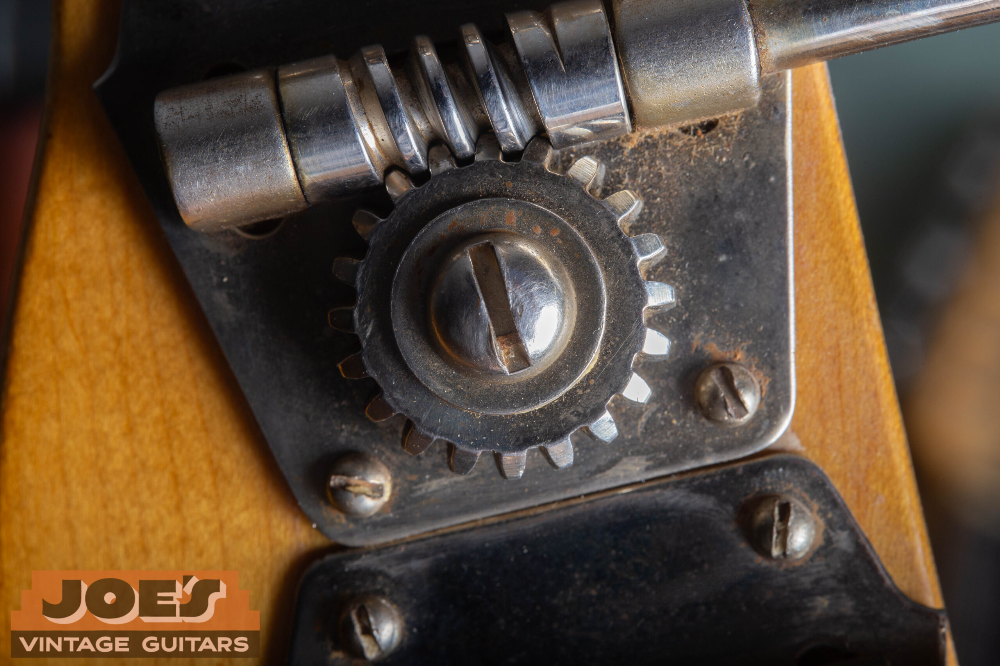

## The Pickup: Construction, Details & Specs

The pickup on an early Fender Precision Bass is the **earlier single-coil style**, predating the larger rectangular pickup that came later in the production run. This is not the familiar split-coil humbucking pickup Fender introduced in 1957, and it is not the later rectangular single-coil either. The pickup housing and pole piece arrangement are distinctive to this early period and are one of the clearest visual dating markers on the instrument.

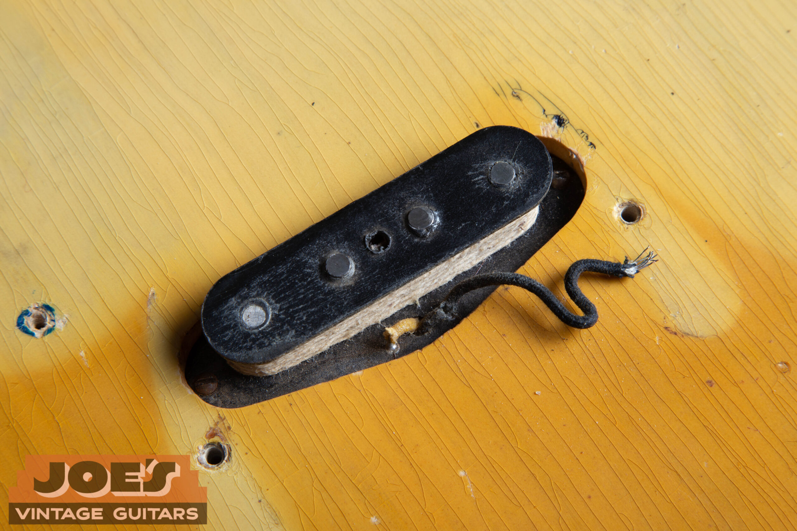

The coil wire is wrapped in **white string or thread**, a cotton or fiber wrapping applied over the coil windings for protection. This white string wrapping is one of the most immediately distinguishing visual characteristics of the original pickup. The leads exiting the pickup are insulated in **yellow and black cloth braid**. If the leads are modern plastic-insulated wire, the pickup has been rewound or replaced.

There is **no pickup cover** on these early instruments; the pickup sits exposed in its mounting position, visible in the body. This is unlike some later production where a chrome cover was fitted. The pickup is secured by **two long slotted screws with springs**; the springs sit between the pickup housing and the body, allowing height adjustment by tightening or loosening the mounting screws.

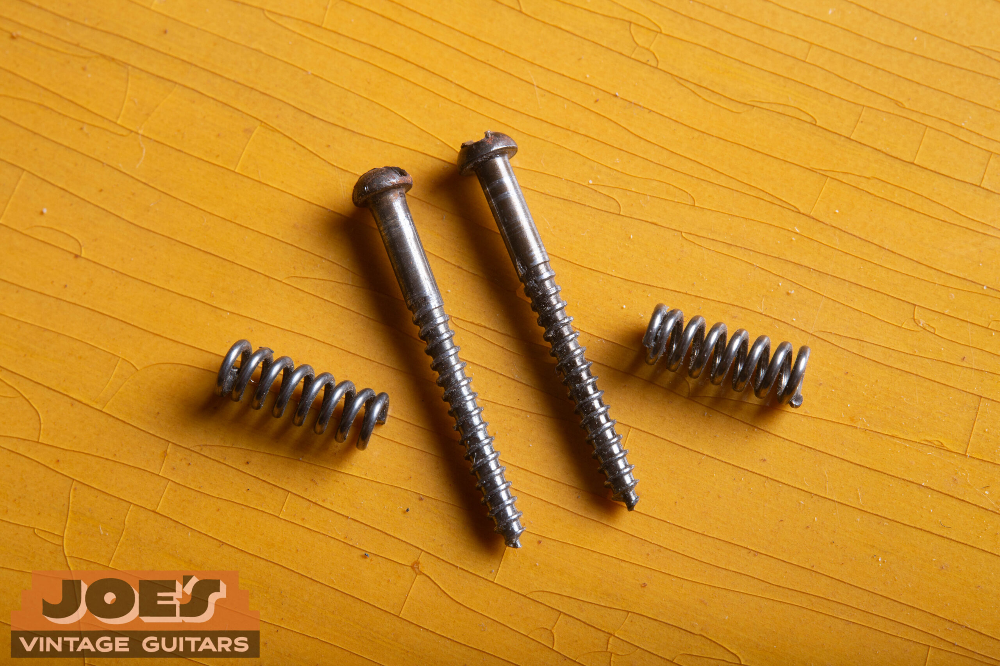

These early instruments do **not** have a pickup cover. The pickup sits fully exposed in its routed cavity. A chrome cover fitted over the pickup on one of these basses has been added after the fact and is not original to the instrument.

The pickup typically measures in the range of **10,000 to 13,000 ohms (10k to 13k Ω) DC resistance**. A reading of infinite resistance indicates a broken coil. Significantly out-of-range readings suggest the coil has been rewound.

## The Finger Rest (Tug Bar)

One detail that is often missing on player-used examples, and therefore frequently overlooked, is the **finger rest**, also called the "tug bar." On the early Fender Precision Bass, this is a small rectangular piece of **wood painted black**, mounted on the pickguard below the strings (on the bass side of the pickup). Its intended purpose was to give the player's thumb a place to rest while plucking the strings with the fingers, a technique imported directly from upright bass playing.

The fact that it is **wood painted black** rather than molded plastic is a period-specific detail worth noting. Later Fender instruments transitioned to plastic finger rests, but the earliest Precision Basses used this painted wooden piece. Its presence on an original instrument is a significant positive for a collector, as it is easily lost and rarely replaced when missing.

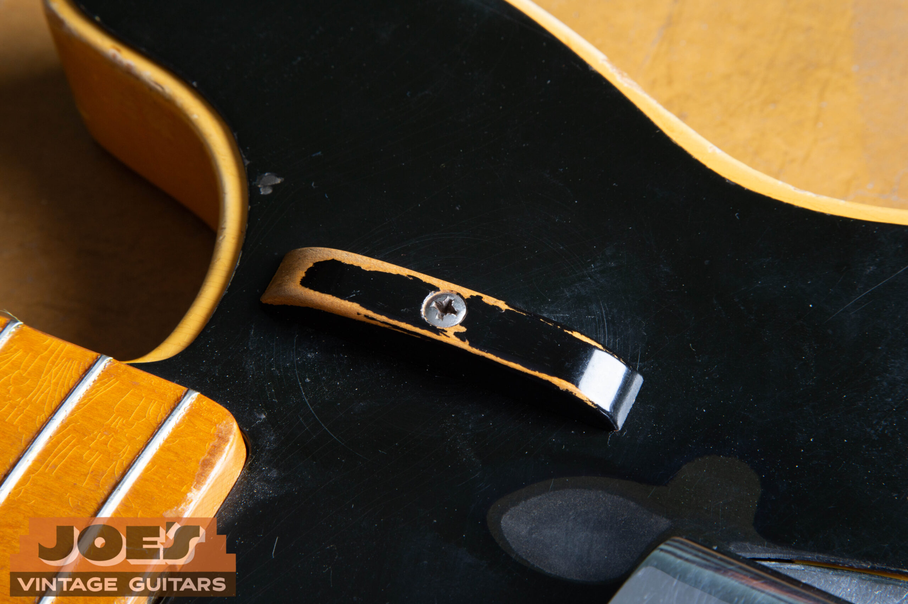

## The Bridge Cover

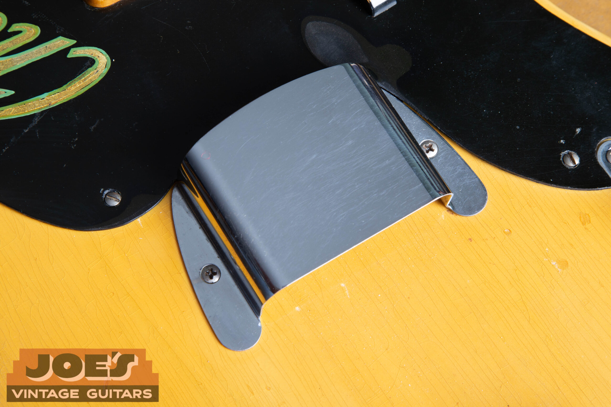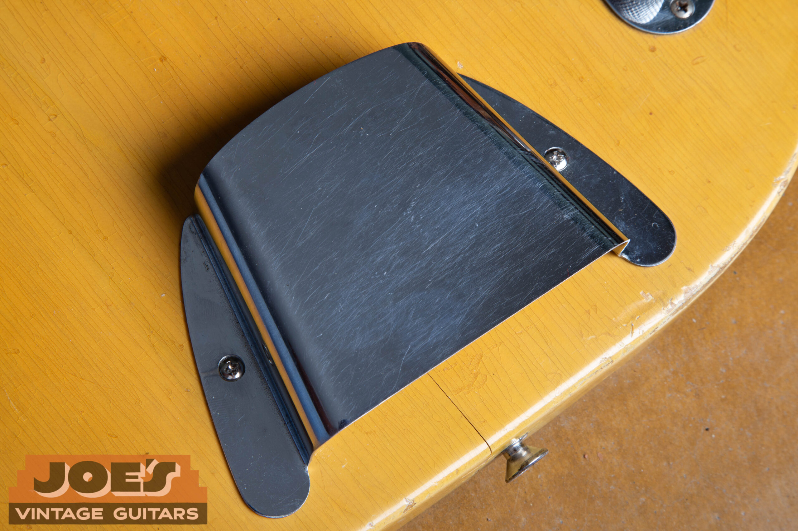

The **bridge cover** is a large elongated chrome-plated metal cover that snaps or screws over the bridge assembly. It is even more frequently missing than the pickup cover, as it physically interferes with the right-hand technique of many bass players. Removing the bridge cover from an all-original instrument will reveal the lighter tan-line finish area on the body beneath it.

## The Bridge: Saddles, Serial Number & Patent Pending

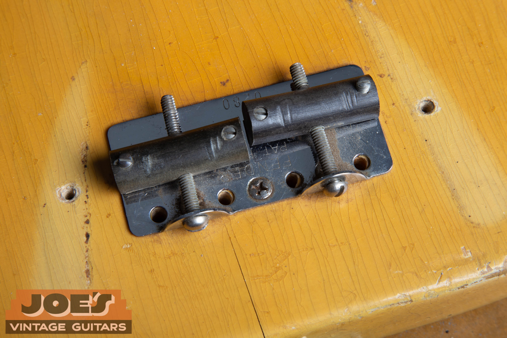

The bridge on an early Fender Precision Bass is a pressed steel plate, chrome plated, with individual saddles for each string. The bridge plate carries the instrument's **serial number stamped directly into the chrome plate**, a critical authentication detail. On early Fender instruments, the serial number is found on the bridge plate, not the neck plate. In addition, the bridge plate carries the marking **"PATENT PENDING"**, stamped into the plate and consistent with the headstock decal language.

For more detail on reading and interpreting Fender serial numbers, see our [complete Fender serial number guide](/fender-guitars-serial-number-guide/).

The saddles on these early Precision Basses are individual **barrel-shaped pieces of pressed fiber**, not steel, not brass. The pressed fiber material has a distinctive matte, slightly grainy appearance and typically a tan to dark tan color after decades. Original fiber saddles should show **consistent, uniform aging** across all four. Replacement saddles of a different material, steel, brass, or synthetic, are immediately identifiable and indicate the bridge has been modified.

<h3 id="screws">Slotted vs. Phillips Screws: Dating Within the Production Run</h3>

In **early production (late 1951 through early 1952)**, Fender used **slotted-head screws throughout**. As 1952 production continued into 1953, Fender transitioned to **Phillips-head screws** in some or all positions. This transition helps narrow a bass's production date: all slotted = likely earlier production; all Phillips = likely 1953; mixed = transitional period or possible replacements. Check the tuner mounting screws, neck plate screws, pickguard screws, and bridge cover screws carefully.

## Controls: Knobs, Pots & Capacitor

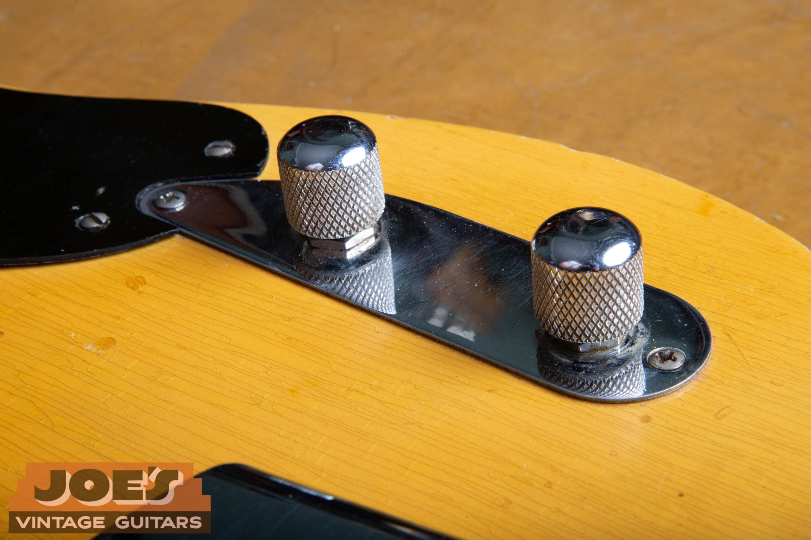

The control knobs on an early Precision Bass are large, **chrome-plated domed knobs with a knurled (cross-hatched) surface** around the lower portion of the dome, sometimes called "bonnet" knobs or "dome knobs." They differ in both shape and finish from the flat-top or hat-top knobs of later Fender instruments. There are two dome knobs: one volume, one tone, mounted on the black pickguard.

The potentiometers feature **ink date codes stamped on the back of each pot body**. On the earliest Precision Basses, Fender sourced its pots primarily from **Clarostat**, not CTS, which became more common in later Fender production. Clarostat pots carry their own manufacturer code in the standard EIA date code format. These date codes should be consistent with the instrument's production date. They should not post-date the instrument, and should be within a reasonable window (pots typically sat in Fender's inventory for weeks to a few months before use). Finding CTS-coded pots in a bass of this era is a signal that the electronics may have been partially or fully replaced.

The tone capacitor is a **paper-in-oil capacitor**, a cylindrical or slightly tubular component quite different from the ceramic disc, orange flat "chicklet," or electrolytic capacitors found in later production or replacement parts. The paper-in-oil construction was standard for high-quality passive audio circuits of this era and is a period-correct detail that distinguishes original electronics from later work.

## The Output Jack

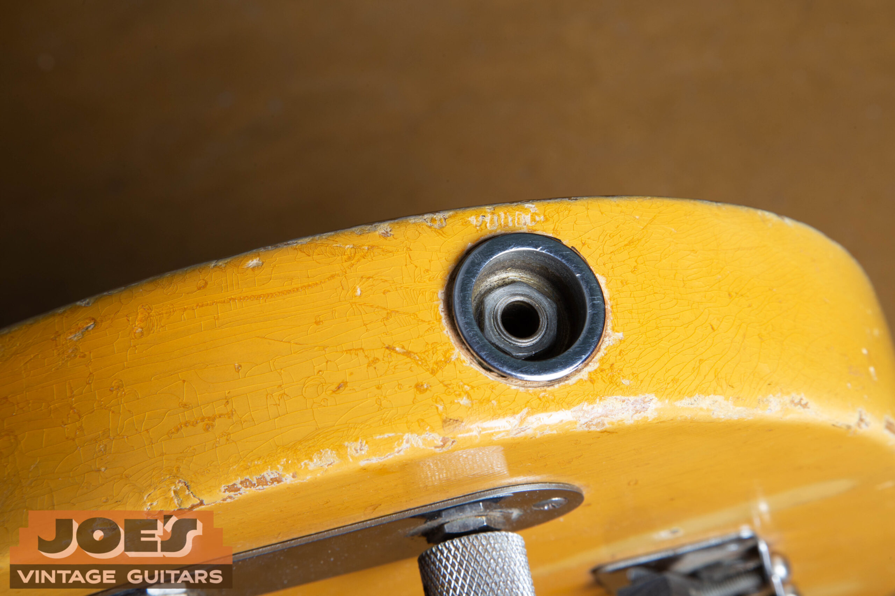

The output jack on an early Precision Bass is a standard mono jack mounted on the side of the body in a chrome cup or plate. The wiring from the jack back to the controls should be cloth-insulated wire consistent with the period. Modern plastic-insulated wiring at the jack is a sign of past modification or replacement.

## The Ferrules on the Back of the Body

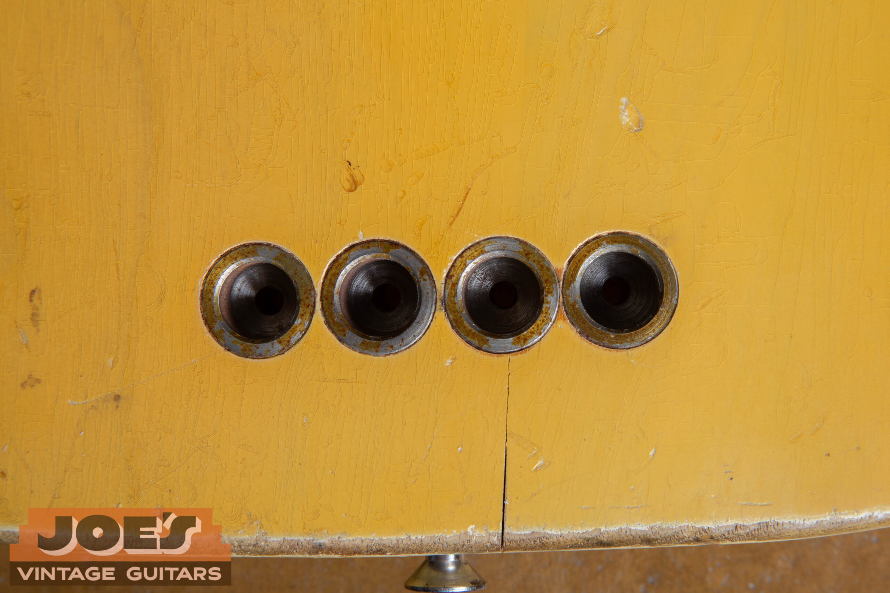

The early Precision Bass is a **string-through-body** instrument, the strings pass through holes drilled through the body from the bridge, and the ball ends are anchored by **four chrome-plated ferrules** set into the back of the body. Original ferrules should show age-appropriate patina and be firmly seated. Replaced ferrules or enlarged holes are indicators of past modification.

## The Neck Plate

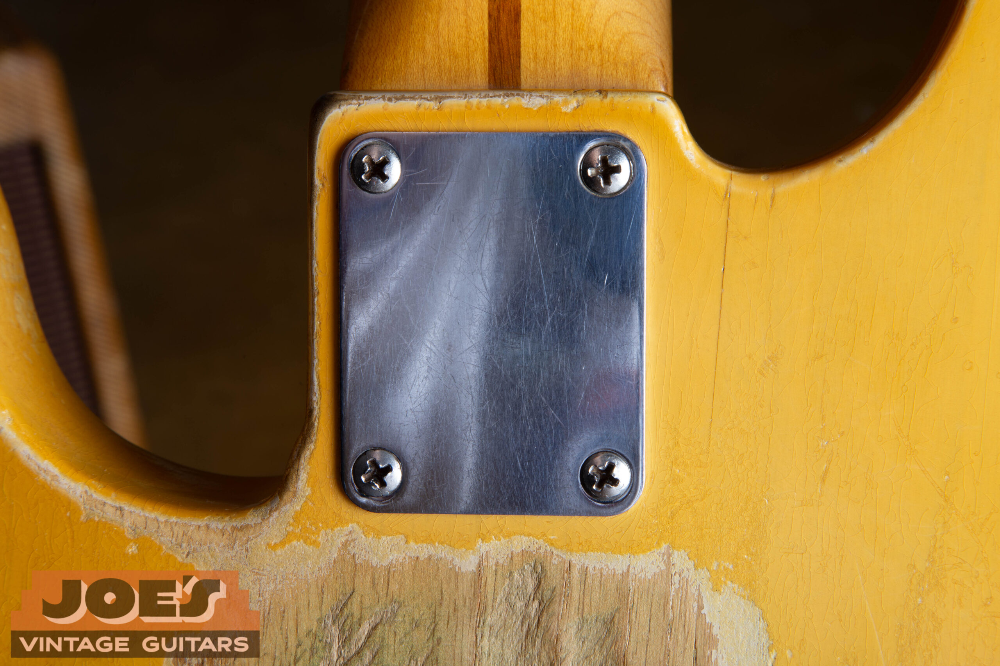

The neck plate on an early Precision Bass is a **plain, unmarked chrome plate** with four bolts, no model name, no serial number. This is a critical distinction from later Fender production where the serial number migrated to the neck plate. Removing the neck plate from an all-original instrument will reveal the tan line on the body finish beneath it.

## Tone: The Sound of the Early Precision Bass

Players and engineers who have worked with early Precision Basses frequently describe the tone as having an almost upright-bass quality in the lower register, a deep, woody fundamental with a natural decay that sits beautifully in a mix without needing equalization.

The tone of an early slab-body Precision Bass is genuinely unlike the sound of any later instrument, including the split-coil P-Bass that followed it. The single-coil pickup, the all-maple neck, the ash body, the string-through-body construction, and the simple passive tone circuit combine to produce a sound that is simultaneously rounder and more fundamental, with a slightly more prominent midrange and a high-frequency character that is sweeter and less aggressive than the later instrument.

### How the Construction Affects the Tone

The **ash body** is a bright, resonant tonewood with excellent sustain and a pronounced upper-midrange character, a fundamentally different tonal foundation than the alder body Fender later adopted. The **all-maple neck** adds brightness and articulation, dense and hard, transmitting vibration efficiently and contributing snap and clarity to the attack of each note. The combination of ash and maple creates a brighter, more focused tonal balance, tempered by the warmth of the single-coil pickup and passive tone circuit.

The **string-through-body construction** increases the down-pressure of the strings on the saddles and improves the transfer of string vibration into the body, contributing to the instrument's sustain and the "singing" decay character many players describe. The **small frets** encourage a lighter touch; fretting too hard will cause the string to go sharp, cultivating the nuanced, even technique that translates beautifully in both jazz and early rock and roll.

### In the Studio and on Stage

The early Precision Bass found its way into recording studios almost immediately. Engineers quickly learned that the P-Bass sat in a mix in a way the upright bass never quite did. The defined low-frequency fundamentals locked with the kick drum, the midrange cut through without muddiness, and the consistent volume and sustain made it possible to record clean, punchy bass parts with minimal equalization. On stage, it transformed the role of the bass player, now audible with the same presence as the guitar and piano players.

## Famous Players of the Early Precision Bass

**Monk Montgomery**, the bassist for Lionel Hampton's orchestra, is widely credited as the first professional musician to play the Fender Precision Bass in a touring and recording context, adopting one in 1953. His endorsement was enormously influential.

**Bill Black**, Elvis Presley's original bassist, played a Fender Precision Bass on the foundational Sun Records recordings that defined early rock and roll. The sound of Black's P-Bass on tracks like "Heartbreak Hotel" is embedded in the sonic DNA of popular music.

**Roy Johnson** and **Lloyd Trotman** were among the early New York session bassists who adopted the instrument, helping to establish the electric bass as a studio staple. **James Jamerson**, though more closely associated with the later split-coil P-Bass, developed his foundational technique on early Fender instruments, and his Motown recordings demonstrated what the instrument was capable of in virtuoso hands.

#### Own a Vintage Fender Bass?

Joe buys vintage Fender instruments **nationwide**, free same-day appraisal, fair cash offer, and we arrange all shipping. No pressure, ever.

## Complete Specifications: 1951 to 1953 Fender Precision Bass

| Specification | Detail |
| --- | --- |
| Years of Production | Late 1951, 1952, 1953 (slab-body era) |
| Body Wood | Solid ash, typically 2-piece bookmatched |
| Body Finish | Nitrocellulose lacquer, "Blonde" (aged butterscotch) |
| Body Style | Single-cutaway slab body, minimal contouring |
| Neck Wood | One-piece maple (fretboard integral to neck blank) |
| Neck Profile | Pronounced C-shape, substantial girth at lower positions |
| Scale Length | 34 inches (864 mm) |
| Fretboard | Maple, integral with neck, no separate board |
| Fret Markers | Black dot inlays (not white, not pearl) |
| Number of Frets | 20 |
| Fret Size | Small/vintage, narrow and low |
| Truss Rod Adjustment | Flat-head screwdriver slot at headstock face |
| Truss Rod Cover | Walnut plug, headstock face behind nut |
| Headstock Logo | Silver foil decal, Fender script, "Patent Pending" (early) / patent number (late 1953) |
| String Tree | Circular (round disc) style |
| Tuning Machines | Individual open-gear units; secured with 4 slotted screws; large flat metal buttons (not plastic) |
| Tuner Underside | Individual housing plates, patinated chrome, visible string post and thread hole |
| Finger Rest | Small piece of wood painted black, mounted on pickguard below strings |
| Pickup Type | Early single-coil style, earlier and smaller than the later rectangular pickup |
| Pickup Cover | None, pickup is exposed; no cover on these early instruments |
| Pickup Wrapping | White string/cotton thread over coil windings |
| Pickup Leads | Yellow and black cloth braid |
| Pickup Mounting | 2 long slotted screws with springs (height-adjustable) |
| Pickup DC Resistance | Approx. 10,000 to 13,000 ohms (10k to 13k Ω) |
| Bridge Cover | Chrome-plated metal, snaps/screws over bridge |
| Controls | 1 Volume, 1 Tone |
| Control Knobs | Domed knurled chrome ("dome" / "bonnet" knobs) |
| Potentiometers | Clarostat (typical for early 1950s Fender); ink EIA date code stamped on back of pot body |
| Capacitor | Paper-in-oil capacitor (cylindrical/tubular form factor) |
| Pickguard | Single-ply black plastic |
| Bridge Plate | Pressed steel, chrome plated |
| Bridge Saddles | Individual barrel-shaped pressed fiber, tan to dark tan, not metal |
| Serial Number Location | Stamped on bridge plate (not neck plate) |
| Bridge Plate Stamp | "Patent Pending" in addition to serial number |
| String Anchoring | String-through-body |
| Ferrules | 4x chrome-plated, rear of body, one per string |
| Hardware Screws | Slotted (early production) → Phillips (later 1952 through 1953) |
| Neck Attachment | 4-bolt, plain chrome neck plate (no model name or serial number) |
| Factory Markings | Ink body date stamp in neck pocket; pencil neck date on heel; possible "D" stamp |
| Neck/Body Date Variance | Up to ~12 months difference is factory-normal and not a concern |
| Finish Details | Nail holes punched through finish to bare wood (nail removed after spraying); tan lines under all hardware on original examples |
| Control Cavity | Hand-routed; tool marks (lines/steps) visible on cavity walls |

## Authentication Checklist

Authentication is the sum of all details being consistent with each other and with known production standards. No single point is definitive on its own.

### Finish & Body

-   Finish is aged nitrocellulose, butterscotch/amber in exposed areas, lighter under hardware
-   **Tan lines present** under pickguard, covers, and neck plate
-   Control cavity walls show **hand-router tool marks**
-   **Nail holes present** with **bare wood** at center, nail removed after spraying, so no finish inside the hole
-   Body wood is ash with pronounced grain visible through finish
-   Single-ply **black pickguard** with period-correct screws
-   **Finger rest** (wood painted black) present on pickguard

### Neck & Headstock

-   **One-piece maple neck** with integral fretboard, no separate fretboard piece
-   **Black dot position markers**, not white, not pearl
-   **Small, low vintage frets**
-   **Walnut plug clearly visible** on headstock face behind nut
-   Truss rod is **flat-head slot**, not Phillips, not hex/Allen
-   Silver foil logo with **"Patent Pending"** (or patent number on late 1953)
-   **Circular (round disc) string tree**
-   Original open-gear tuners with **large flat metal buttons** (not plastic) secured with **4 slotted screws** each
-   Tan line under neck plate when removed
-   Body date stamp and neck heel pencil date **consistent within ~12 months** of each other

### Hardware & Bridge

-   **Serial number on bridge plate**, not on neck plate
-   **"Patent Pending" stamp on bridge plate**
-   Saddles are **individual barrel-shaped pressed fiber**, tan/dark tan color, not metal
-   Screws: **slotted (early)** or **Phillips (later)**, consistent across instrument
-   Four original chrome **ferrules on back of body**, firmly seated
-   Plain chrome **neck plate with no model name or serial number**

### Pickup & Electronics

-   **No pickup cover**, pickup is exposed; a chrome cover is a post-factory addition
-   Pickup is the **early single-coil style**, earlier and smaller than the later rectangular version
-   Pickup coil wrapped in **white string/thread**
-   Pickup leads are **yellow and black cloth braid**
-   Pickup mounting uses **two long slotted screws with springs**
-   DC resistance in range of **10k to 13k Ω**
-   **Pot date codes ink-stamped on back** of pot bodies; manufacturer should be **Clarostat** for this era, consistent with production year
-   **Paper-in-oil capacitor** in tone circuit, not ceramic disc, not orange flat "chicklet"
-   **Domed knurled chrome knobs**, correct dome profile, fine knurling

## Valuation & Current Market

The market value of an early slab-body Fender Precision Bass depends almost entirely on originality and condition. A completely original, all-matching example in Excellent condition is one of the most valuable instruments in the vintage Fender market. The same instrument with a refinish, a replaced pickup, or non-original electronics can lose **fifty percent or more** of its collector value.

All-original 1951 to 1953 Fender Precision Basses in Excellent to Very Good condition have sold at auction and through dealers in the range of **$20,000 to $40,000 or more**, with exceptional examples exceeding these figures. Player-grade examples with modifications can sell in the $8,000 to $15,000 range. The market has strengthened consistently as the supply of genuinely all-original examples has dwindled.

The single biggest value killer is a **refinish**. Another is a **replaced neck or body**. If yours still has its original single-coil with white string wrapping and cloth leads, that is a significant part of what you are sitting on. Don't do anything to it before talking to an expert.

#### Get a Free Expert Appraisal, Nationwide

Not sure what your early Precision Bass is worth? Joe buys vintage Fender instruments across the country. Submit photos and receive an honest market valuation and cash offer the same day. No obligation.

## Comparisons to Contemporaries

The early Precision Bass shares a lot with the [1952 Fender Telecaster](/post/1952-fender-telecaster-authentication-guide/). Both share the blonde nitrocellulose finish, maple neck with black dot markers, walnut headstock plug, domed knurled knobs, and the slotted/Phillips screw transition. Many of the authentication details in this guide apply equally to the contemporaneous Telecaster, and collectors who specialize in one instrument typically develop expertise in both.

For collectors interested in other early Fender solid-body instruments, our [vintage Hardtail Stratocaster guide](/post/hardtail-stratocaster-vintage-guide/) covers authentication details for another landmark Fender instrument. And our [Fender serial number guide](/fender-guitars-serial-number-guide/) provides the foundation for dating any instrument in the Fender catalog.

#### Related Guides from Joe's Vintage Guitars

-   [1952 Fender Telecaster Authentication Guide](/post/1952-fender-telecaster-authentication-guide/)
-   [Hardtail Stratocaster Vintage Guide](/post/hardtail-stratocaster-vintage-guide/)
-   [Fender Guitars Serial Number Guide](/fender-guitars-serial-number-guide/)
-   [Sell My Fender Guitar, How It Works](/sell-my-fender-guitar/)
-   [Free Vintage Guitar Appraisal Nationwide](/)

## Final Thoughts

The early slab-body Fender Precision Bass is more than a vintage instrument. It is a piece of history, an object that was there at the start of modern popular music. Every detail tells part of that story: the hand-guided router marks in the control cavity, the pencil date on the neck heel written by a factory worker in Fullerton seven decades ago, the nail holes where the body hung drying between finish coats, the white string wrapped carefully around the coil of a pickup that would go on to define how bass guitar sounds.

The bass used throughout this guide, with its 1952 neck and 1953 body, is itself a perfect illustration of how these instruments were actually built. It is not a hybrid or a parts bass. It is exactly what Fender made: a hand-assembled instrument built from parts produced in batches, put together by workers who penciled the date on the neck heel and stamped it on the body, and sent out the door to be played. That story is written all over the instrument if you know where to look.

If you have questions about a specific instrument, or if you own an early Precision Bass and want a professional assessment of its authenticity and market value, [reach out to Joe's Vintage Guitars](/). We have the expertise and the market knowledge to give you an honest, accurate valuation, wherever you are in the country.

© Joe's Vintage Guitars  ·  [joesvintageguitarsaz.com](/)  ·  Mesa, AZ  ·  (602) 900-6635

We buy vintage guitars and basses nationwide, Gibson, Fender, Martin, Gretsch, Guild & more.
