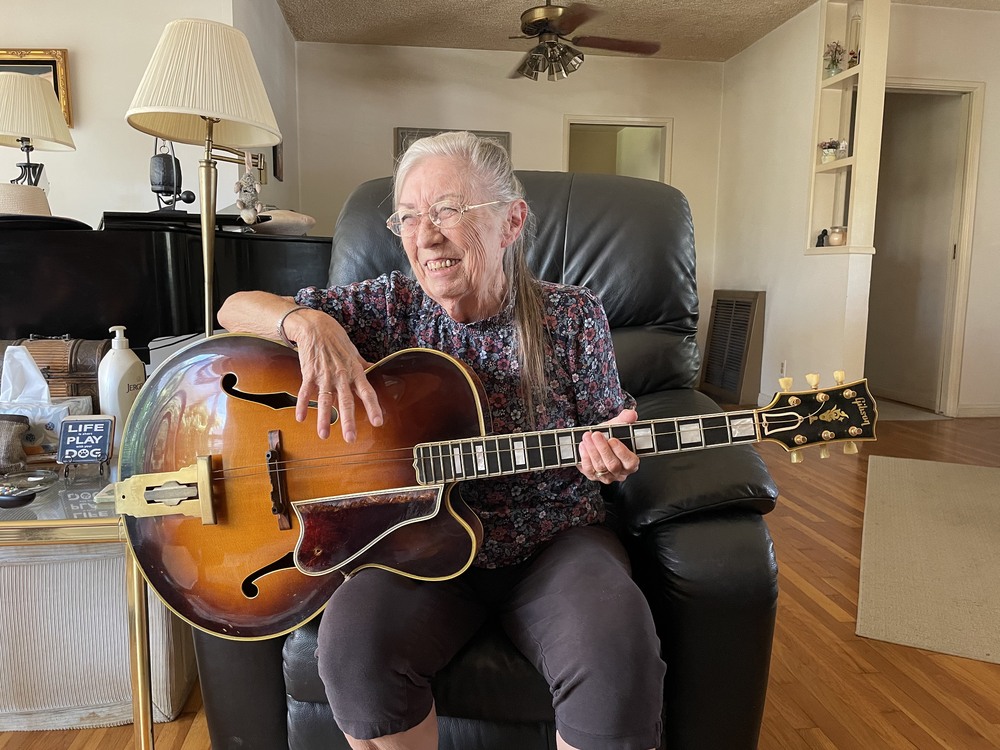
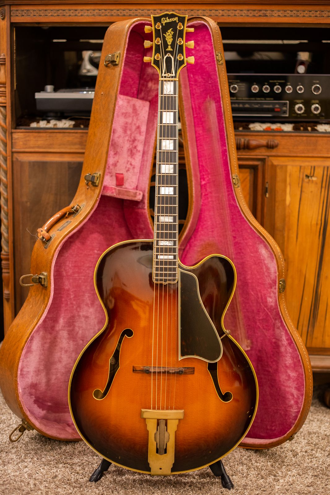
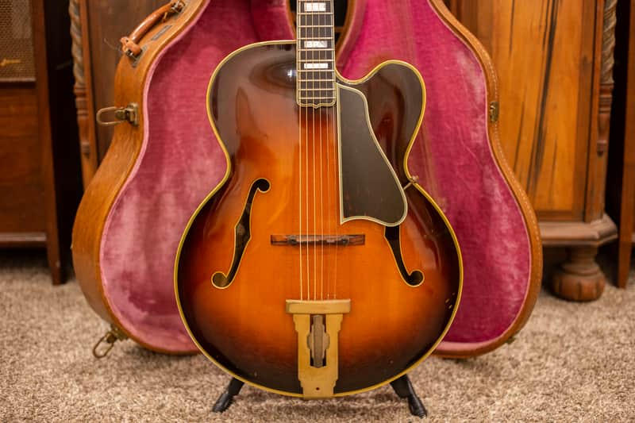
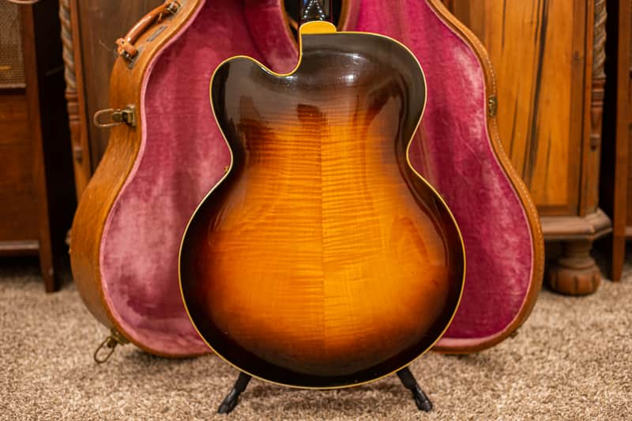
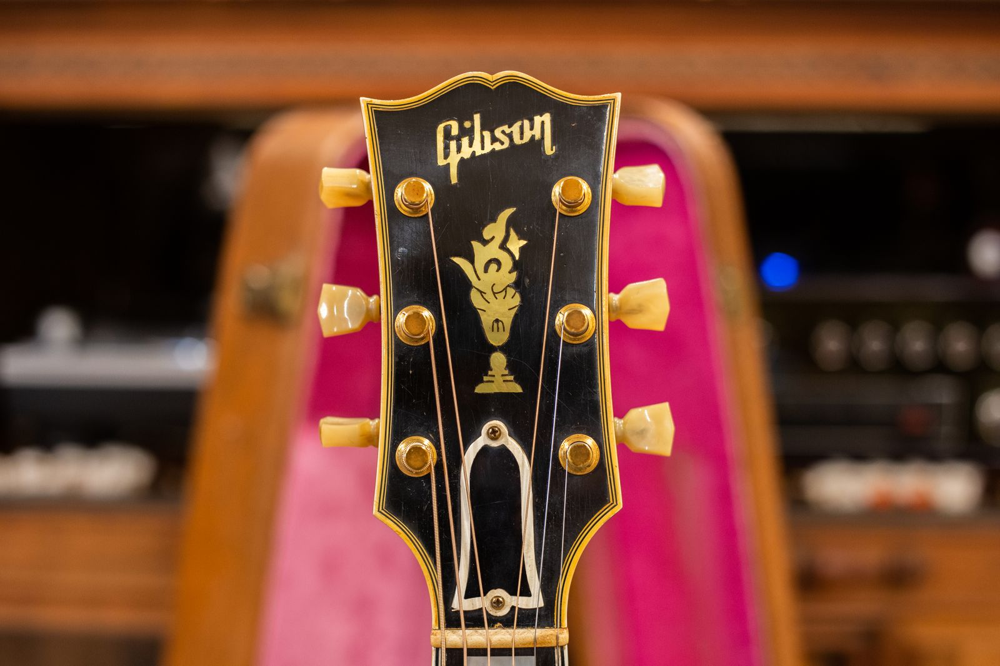
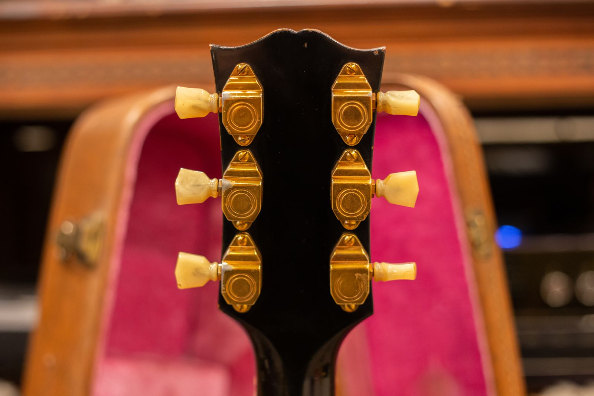

The first picture says more than a serial number ever could. She is smiling, seated in her home, with her father's 1954 Gibson L-5C across her lap.

She asked me not to use her name, and I am honoring that request. What she did want to share was the guitar's story. Her father worked as a session musician in California. According to his daughter, he was friends with Les Paul and Chet Atkins.

> It was my dad's guitar. He was a California session musician, and he was friends with Les Paul and Chet Atkins.

That is the story she shared with me. The honest details are already enough.

<figure>

<figcaption>The original owner's daughter with the 1954 Gibson L-5C that belonged to her father, a California session musician.</figcaption>

</figure>

#### On this page

1. [A Guitar That Stayed With the Family](#a-guitar-that-stayed-with-the-family)
2. [The 1954 Gibson L-5C](#the-1954-gibson-l-5c)
3. [What I See in This Guitar](#what-i-see-in-this-guitar)
4. [The Story Is Still With It](#the-story-is-still-with-it)

## A Guitar That Stayed With the Family

An instrument can tell you plenty through its finish, hardware, construction, and wear. It cannot tell you who sat behind it in a California studio or what songs passed through the room. That part has to come from the people who were there.

In this case, the story stayed with the guitar. It came from the daughter of the original owner, and she remembers it as her father's working instrument. He was a California session musician, and the guitar remained with his family long after those sessions were over.

I handle a lot of vintage Gibsons. The guitars that stay with me are the ones where the family history is still attached. Every guitar has a story, but not every story survives the years as clearly as this one did.

<figure>

<figcaption>The 1954 Gibson L-5C in its fitted hardshell case with pink lining.</figcaption>

</figure>

## The 1954 Gibson L-5C

The L-5 was already one of Gibson's most important professional archtops by 1954. The acoustic L-5C paired a full-depth carved body with a graceful Florentine cutaway, giving a player better access to the upper frets without turning the guitar into an electric model.

This was a serious working musician's instrument. The large carved spruce top, figured maple back, ebony fingerboard, pearl block inlays, elaborate headstock, and gold-plated hardware all placed it near the top of Gibson's line. The appointments were luxurious, but the point was still to make music.

<figure>

<figcaption>The full front of the 1954 Gibson L-5C, with its sunburst carved top, Florentine cutaway, block inlays, and gold hardware.</figcaption>

</figure>

The model name matters here. An L-5C is the cutaway acoustic version of the L-5, while the L-5CES is the factory electric model with pickups. If you are comparing another instrument, my [Gibson L-5 guide](/post/gibson-l5-ces-value-guide/) explains how the model developed and which features changed over time.

## What I See in This Guitar

The first thing that catches my eye is the sunburst. It opens into warm amber at the center of the top and moves to a dark brown edge that follows the body shape. The pointed Florentine cutaway, bound f-holes, large tortoise-style pickguard, pearl block inlays, and flowerpot headstock inlay give it the unmistakable look of a top-grade Gibson archtop.

<figure>

<figcaption>The figured maple back carries the sunburst from a bright amber center to a dark outer edge.</figcaption>

</figure>

The maple back has broad figuring that becomes more visible as the light moves across it. Up top, the pearl Gibson script and flowerpot inlay sit inside a multiply-bound headstock. The gold tuners and their aged buttons fit the rest of the guitar's formal look.

<figure>

<figcaption>The bound headstock with Gibson's pearl script logo, flowerpot inlay, and gold hardware.</figcaption>

</figure>

<figure>

<figcaption>The back of the headstock and its six gold-plated tuners.</figcaption>

</figure>

I also see normal age and use. There are fine marks in the finish, wear on the hardware, and small signs that this guitar was handled rather than stored as decoration. Confirming finish, repairs, replaced parts, and structural condition requires an in-person inspection.

If you are trying to date an old Gibson of your own, start with my [Gibson serial number guide](/how-to-read-gibson-serial-numbers/). The number is useful, but it should always agree with the model, construction, hardware, and other period details.

## The Story Is Still With It

The most valuable part of an original-owner guitar is not always something you can photograph. It is knowing where the instrument came from and who played it before it reached you.

This L-5C belonged to a working California musician. Decades later, his daughter could still sit with it across her lap and tell us whose guitar it was. That continuity is rare. It turns an already impressive 1954 Gibson into one family's piece of musical history.

I am grateful she trusted me with the story and allowed me to share her photograph while keeping her name private.

If your family has an old Gibson with a story of its own, you can begin with a [free appraisal](/free-appraisal/) or read about how I [buy vintage Gibson guitars](/sell-my-gibson-guitar/). Send the photographs, but tell me the history too. That is often the part worth preserving most.
