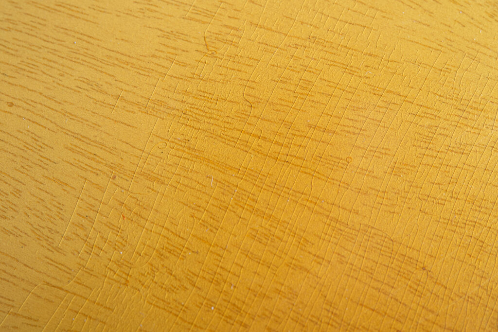
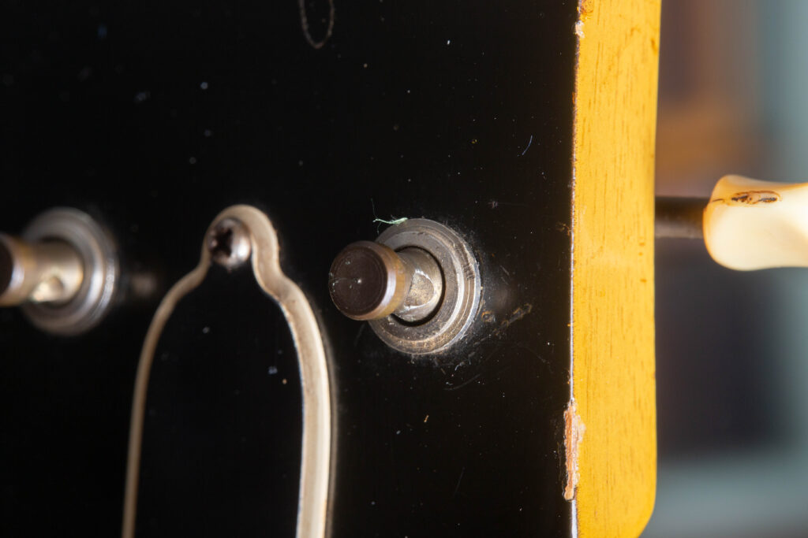

1958 Gibson Les Paul Special in original TV Yellow. This high-value vintage guitar showcases the iconic translucent “limed mahogany” finish and dual P-90 soapbar pickups. Note the short-seam wraparound tailpiece and black top-hat knobs, the hallmarks of a “Golden Era” piece.

In the golden age of Gibson craftsmanship, the **1955 to 1958 Single Cut Les Paul Special** was the “sweet spot” of the catalog. Positioned between the student-grade Junior and the high-end Goldtop, it offered the dual-pickup versatility of a professional instrument with a simplified, “slab” mahogany design. Today, it is a high-value vintage guitar that collectors want for its “limed mahogany” look and aggressive P-90 growl.

If you are looking to buy or [sell a vintage Les Paul](/), understanding these authentication specifications is critical. At **Joe’s Vintage Guitars**, we’ve seen how even small parts swaps can impact the market value of a vintage instrument by thousands of dollars. If you are wonderinf what your guitar is worth, don’t hesitate to reach out to us for a [free appraisal.](/free-appraisal/)

Below is a complete guide to authenticating your single cut Les Paul Special from 1955-1958.

## The “Limed Mahogany” TV Yellow Finish

The “TV Yellow” finish is one of the most misunderstood in guitar history. It wasn’t just yellow paint; it was a multi-step process.

-   **The Look:** Gibson applied a white grain filler to the mahogany body, followed by a translucent yellow-tinted lacquer.
    
-   **The Key Check:** On an original 50s finish, you must be able to **see the wood grain through the yellow**. If the finish looks thick and opaque, it’s likely a refinish.
    
-   **Fun Fact:** Legend says this color was designed for the “Golden Era” of black-and-white television. White guitars would “glow” too brightly under studio lights, but this specific yellow appeared as a perfect, glare-free white on screen.
    

Check out the natural weather checking on this 1956 TV Yellow Les Paul Special. This translucent, wheat-colored nitrocellulose lacquer is what we call “limed mahogany,” a process that uses a white grain filler to let the mahogany’s texture shine through. For high-value vintage guitar collectors, this specific pattern of finish checking is a primary indicator of an original 50s Gibson finish.

## Hardware & Bridge Authentication

The hardware is usually the first place to look for unoriginal parts.

-   **The Wraparound Tailpiece:** A true 50s Special uses a **nickel-plated wraparound tailpiece** featuring a **short seam** (a casting line on the side).
    
-   **Intonation Allen Screws:** Look closely at the back of the tailpiece near the posts. You should see two small **Allen screws** used for intonation.
    
    > **Red Flag:** If these screws are missing, the bridge is likely a “stop-tail” from a different model or a modern replacement, significantly lowering the “dead-original” collector value.
    
-   **Studs:** The bridge is held by two **nickel-plated studs**. These should show natural aging, a dull, grayish patina. If they are mirror-shiny, they aren’t from the 50s.
    

To the untrained eye, it’s just a bridge. But to a collector, these are the “fingerprints” of a high-value vintage guitar. This view of the 1957 Les Paul Special tailpiece reveals two critical authentication marks: the short seam (the visible casting line on the side) and the original intonation Allen screws.

## Electronics, Pickups, and Routing

Under the hood is where you find the soul of a vintage Gibson.

-   **P-90 Soapbar Pickups:** These should have **black covers**. Original 50s P-90s are famous for their raw, mid-range punch.
    
-   **Neck Pickup Route:** If you remove the neck pickup, inspect the routing in the mahogany. Original factory routes from this era often show a **distinct “step” or slight unevenness** in the sidewalls. Modern “reissue” models have perfect, computer-cut routes.
    

To authenticate a high-value vintage guitar like this 1957 Special, you have to look for the “fingerprints” left by the Kalamazoo factory workers. This specific neck pickup route reveals two critical markers: the slim internal channel and the visible end of the neck tenon.  
In the late 1950s, Gibson’s construction involved a long-tenon neck joint that extended deep into the body for maximum resonance and stability. Seeing that tenon wood exposed within the route is a major indicator of an original, unrepaired body. Furthermore, the specific shape and depth of the slim channel are unique to the hand-guided pin routers used during this period. If these structural landmarks are missing or look overly symmetrical, as they often do on modern CNC-cut reissues, it is a significant red flag for originality.

-   **Bumblebee Capacitors:** Inside the control cavity, look for the black capacitors with colorful stripes, the **Bumblebee caps**.
    

If the P-90 pickups are the heart of a 1950s Special, these Bumblebee capacitors are the soul. Named for their iconic black bodies and colorful stripes, these paper-in-oil capacitors are known for the way they roll off high frequencies, holding a musical, “creamy” tone that modern components struggle to replicate.  
While these are a hallmark of “Golden Era” electronics, it is important to note for authentication that they were not necessarily standard on the earliest 1955 models. Many early 1955 Specials left the Kalamazoo factory with “Grey Tiger” or other wax-coated capacitors before the Bumblebee became the consistent standard in 1956. If you are looking to sell a high-value vintage guitar, the presence of original, untouched Bumblebees, or the era-correct 1955 alternatives, is a major factor in professional appraisal and market value.

-   **The Pots:** The potentiometers (the dials) should say **USA** and feature the small **diamond logo** from **CRL (Centralab)**.
    

When identifying a high-value vintage guitar, the potentiometers (or “pots”) serve as a primary birth certificate for the instrument. This 1958 Les Paul Special features the industry-standard Centralab (CRL) pots, recognizable by the small, distinct diamond logo and the bold “USA” stamp on the casing.  
These components are essential for authenticating “Golden Era” Gibsons. Beyond the logo, collectors look for the source codes stamped into the side of the pot to verify the exact week and year of manufacture. At Joe’s Vintage Guitars, we closely inspect these codes and the original solder joints to make sure the electronics haven’t been tampered with or replaced. If your guitar lacks these specific CRL markings, it may indicate a later service part or a modern replacement, which directly impacts the professional appraisal value.

-   **p-90 “Grommet” and Tape:** Look on the back of the pickup for the **rubber grommet** where the wires pass through the back plate of the pickup and the original **masking tape** used to cover the joint of the lead wires.
    

When you’re authenticating a high-value vintage guitar, the smallest details are often the most telling. This rare look at the back of a 1958 P-90 pickup reveals the “Golden Era” fingerprints that collectors look for: the little rubber grommet used to guide the wires through the baseplate and the original masking tape covering the lead wires.  
At Joe’s Vintage Guitars, we check these internal components because they are nearly impossible to replicate with 100% accuracy. The specific texture of that 50s masking tape and the way the lead wires are bundled are key indicators that the electronics are original to the 1958 production run. If you’re looking to sell a vintage instrument, these tiny hardware markers are what separate a factory-original piece from one that has been serviced or modified over the decades.

## The Neck, Headstock, and Plastics

-   **The Tuners:** These should be **3-on-a-strip Kluson Deluxe** tuners.
    

To verify a high-value vintage guitar from the late 1950s, the tuning machines are a primary focus for authentication. These original Kluson Deluxe “3-on-a-strip” tuners are the correct spec for a 1958 Special. Notice the “Kluson Deluxe” branding stamped clearly into the metal housing.

-   **Brass Posts:** The metal posts that hold the strings are made of **brass**. Over time, brass darkens and turns a deep bronze/black. If the posts are “super shiny” or look like chrome, they are almost certainly modern replacements.
    

For those looking to authenticate a high-value vintage guitar, the tuner posts offer a nearly foolproof “birthmark.” Original Kluson Deluxe tuners from the “Golden Era” were manufactured with brass posts. Over the course of seven decades, this brass reacts with the environment, darkening from a bright gold to a deep, dark bronze or charcoal patina.  
At Joe’s Vintage Guitars, we specifically look for this oxidation. If the posts on a 1955 to 1958 Special are “super shiny,” mirror-bright, or appear to be chrome-plated, they are almost certainly modern replacements. This natural darkening is an “honest” sign of age that is difficult for forgers to replicate convincingly, making it a critical detail for any professional appraisal.

-   **Tuner Buttons:** The plastic buttons should have a slightly “creamy” or aged look.
    

When authenticating a high-value vintage guitar from 1955, the condition of the plastic is a major tell. These original Kluson Deluxe “3-on-a-strip” tuners feature buttons that have taken on a beautiful, creamy hue over time. Look closely for the “shrunk” or slightly “melted” appearance; this is a natural result of the original 1950s plastic components slowly breaking down and outgassing over 70 years.

-   **The Nut:** Look for a **nylon nut**. It should have a slightly translucent, organic appearance, not the bright white of modern plastic.
    

-   **Fret Nibs:** On a guitar that hasn’t been refretted, the neck binding actually “climbs” up the side of each fret end, forming what collectors call **“nibs.”**
    

When inspecting the neck of a high-value vintage guitar, the small plastic “nibs” at the end of each fret are a primary indicator of originality. On this 1958 Les Paul Special, you can see how the cream-colored binding was hand-shaped at the Kalamazoo factory to climb over the edge of the fret wire.  
At Joe’s Vintage Guitars, we look for these nibs as proof that the guitar still carries its factory-installed frets. Because a standard refret usually involves leveling the binding flush with the wood, the presence of these tiny plastic bumps is a major green flag for collectors. If the frets on a 1958 model go all the way to the edge of the binding without these nibs, the guitar has likely been refretted, a detail that is essential for an honest professional appraisal.

-   **Inlays and Dots:** The **Pearl dots** on the fretboard should have a “wavy” look and may show some **greening** from age. The **side dots** (on the binding) should be a dark, translucent **tortoise shell** material.
    

When you’re examining a high-value vintage guitar for professional appraisal, the material of the fretboard inlays is a silent witness to its era. This 1958 Les Paul Special features the correct mother-of-pearl dots, which should exhibit a “wavy” or variegated internal texture rather than the flat, uniform look of modern plastic.

-   **Logos & Serial Number:** The “Gibson” logo is **Mother of Pearl**, while the “Les Paul Special” logo is a **gold silk-screen**. The **Serial Number** on the back of the headstock is stamped in **black ink** and may be slightly faded.
    

When you’re performing a professional appraisal on a high-value vintage guitar, the serial number is the first place to look for signs of a refinish or a fake. On this 1958 Les Paul Special, the serial number is applied with a black ink stamp directly onto the finish. Unlike modern Gibson guitars where the numbers are impressed or stamped into the wood before finishing, these “Golden Era” numbers sit on the surface.  
At Joe’s Vintage Guitars, we look closely at these stamps for the correct font and “haloing” of the ink. Because the ink is on top of the lacquer, it is common to see a little bit of fading or wear over seven decades. If a serial number is stamped into the wood on a 1958 model, it is an immediate red flag that the neck may not be original or that the guitar has been heavily modified.

-   **Plastics:** The **pickguard** is a **5-ply (Black/White/Black)** laminate. The **poker chip** (the ring around the toggle switch) must be **black with gold writing**, though the gold often fades to a dull yellow. The **switch tip** itself should be a deep **orange/amber**.
    

When you’re performing a professional appraisal on a high-value vintage guitar, the pickguard is often a silent witness to its authenticity. This 1957 Les Paul Special features the correct 5-ply black-and-white laminate guard. Unlike the single-ply guards found on the Junior models of the same era, the Special was a step up in the catalog, and this multi-layered plastic reflects that premium status.  
At Joe’s Vintage Guitars, we inspect these edges for the correct beveling and layer thickness. Over nearly 70 years, the white layers often take on a slightly “creamy” or yellowed tint, contrasting against the deep black. If you see a 3-ply guard or a single-ply black guard on a 1957 Special, it’s a major red flag that the part has been replaced, which can significantly impact the collector value.

-   **Output Jack:** The plate on the side where you plug in should be **black plastic**, not metal.
    

While many high-end Gibson models of the 1950s utilized cream or metal plates, the Les Paul Special stayed true to its aesthetic with a black plastic output jack plate. For collectors performing a professional appraisal on a high-value vintage guitar, the material and mounting of this plate are key authentication marks.  
At Joe’s Vintage Guitars, we inspect these plates for the correct thickness and the specific “sheen” of 1950s plastic. It should be secured by four nickel screws that exhibit a dull, grayish patina. If you find a metal plate or a cream-colored plastic replacement on a TV Yellow Special, it is a clear indicator of a later modification. These small, often-overlooked components are essential to ensuring an instrument remains in “dead-original” factory condition.

## The Case: Alligator and Bronze

While some Les Paul Specials came in the “Pink and Brown” Lifton cases, most Specials were sold in an **alligator-pattern chipboard case**.

The vast majority of Les Paul Specials were sold in these alligator-pattern chipboard cases. For a collector performing a professional appraisal, finding one of these original cases is like finding the original box for a rare toy. It completes the “provenance” of the instrument.  
At Joe’s Vintage Guitars, we look for the specific texture and patina of this 50-year-old chipboard. Though they were never meant to offer the heavy-duty protection of a hardshell case, their lightweight design and unmistakable “vibe” make them a popular accessory for any “dead-original” 1950s Gibson. If you’re looking to sell a vintage instrument, having the correct era-accurate case can significantly boost the final market value.

-   **The Plaque:** Look inside for a small **bronze Gibson plaque** featuring a **star logo**. This is a hallmark of an original 50s accessory.
    

While the exterior of an alligator chipboard case has undeniable vibe, the true proof of authenticity lies inside. This close-up reveals the small bronze-looking Gibson plaque that was a standard feature for original 1950s cases. Notice the iconic star logo accompanying the Gibson script. This specific design is a hallmark of “Golden Era” accessories and is highly sought after by collectors.  
At Joe’s Vintage Guitars, we check for this plaque during a professional appraisal because it confirms the case is a period-correct factory piece rather than a generic vintage substitute. For a high-value vintage guitar like a 1955 to 1958 Special, having the original case with its star plaque intact adds a significant layer of provenance and market value.

## TV Yellow Timeline: Les Paul Special Changes Over the Years

## Year-by-Year Evolution: 1955 to 1958

Critical Authentication Changes for the TV Yellow Les Paul Special

| Production Year | Key Specification Changes | Collector's Authentication Note |
| --- | --- | --- |
| 1955 | 
-   **Opaque "Wheat" Finish:** Early 1955 models feature a creamier, more opaque TV Yellow than later years.
-   **Debut Specifications:** Introduction of the **short-seam tailpiece**, **dual P-90 soapbars**, and **brass tuner posts**.
-   **Logo & Silk Screen:** Standardized Mother of Pearl Gibson logo with gold "Les Paul Special" silk screen.

 | The "Wheat" era. Look for less grain "telegraphing" through the lacquer compared to '56 to '58 models. |
| 1956 | 

-   **Finish Translucency:** The "Limed Mahogany" process is refined; the **mahogany wood grain** becomes much more visible through the lacquer.
-   **Electronics Standardization:** Consistent use of **Bumblebee capacitors** and **CRL (Centralab) pots** becomes the factory norm.

 | No major structural changes this year, but the aesthetic "TV Yellow" look reaches its iconic, translucent peak. |
| 1957 | 

-   **Neck Profile Variation:** Necks often began to feel slightly more "substantial" or "chunky" than the typical early '55 carves.
-   **Production Consistency:** High standards of craftsmanship maintained for the single-cut slab design before the body style transition.

 | A prime year for the single-cut design. Ensure the **nylon nut** and **poker chip** details match the '57 aesthetic. |
| 1958 | 

-   **Major Body Redesign:** Early '58 models are the final **Single-Cutaway** units. Late '58 marks the shift to the **Double-Cutaway** body style.
-   **Neck Joint Evolution:** The transition to double-cut necessitates a new, thinner neck joint design.

 | The rarest single-cut year. These final single-cut units are in demand for having the most evolved 1950s features. |

Selling a "Golden Era" Gibson? [Get an Expert Appraisal.](/free-appraisal/)

Trust the technical expertise of Joe’s Vintage Guitars in Mesa, AZ.

## Dating Your “Golden Era” Les Paul Special

To accurately date a 1955 to 1958 Les Paul Special, professional appraisers look for a convergence of three specific codes: the serial number, the potentiometer codes, and the Factory Order Number (FON). If you need helpo dating your Gibson, check out our [Gibson serial number lookup.](/how-to-read-gibson-serial-numbers/)

### 1\. Dating by Serial Number

During this era, Gibson used a simple ink-stamped system on the back of the headstock.

-   **The Format**: The first digit of the ink stamp represents the last digit of the year of manufacture.
    
-   **1955**: Serial numbers will begin with a **5** (e.g., 5 1234).
    
-   **1956**: Serial numbers will begin with a **6** (e.g., 6 1234).
    
-   **1957**: Serial numbers will begin with a **7** (e.g., 7 1234).
    
-   **1958**: Serial numbers will begin with an **8** (e.g., 8 1234).
    
-   **Note**: Because the ink is applied on top of the lacquer, it may show slight wear or “haloing,” which is an excellent sign of authenticity.
    

### 2\. Dating by Potentiometer (Pot) Codes

The control pots inside the back cavity act as a “time stamp” for the guitar’s electronics.

-   **The Manufacturer**: Most Specials from this era use **Centralab (CRL)** pots, identified by the small diamond logo and “USA” stamp.
    
-   **The Code**: Look for a 7-digit source code beginning with **134** (the manufacturer code for Centralab).
    
-   **Reading the Date**: The 4th and 5th digits represent the year, and the 6th and 7th digits represent the week of that year.
    
-   **Example**: A code reading **134812** indicates the pot was manufactured in the **12th week of 1958**.
    
-   **Verification**: Original solder joints are essential; if the solder looks “fresh” or sloppy, the pots may have been replaced, which impacts the total value.
    

### 3\. Dating by Factory Order Number (FON)

While the serial number identifies the finished instrument, the Factory Order Number (FON) tracks the “batch” of wood as it moved through the factory.

-   **Location**: The FON is usually stamped in blue or red ink inside the control cavity or under a pickup.
    
-   **1955-1958 Codes**: During this period, the FON usually begins with a letter prefix that denotes the year:
    
    -   **W** = 1955
        
    -   **X** = 1956
        
    -   **Y** = 1957
        
    -   **U/V** = 1958
        
-   **The Batch**: The four digits following the letter represent the specific production batch, helping to confirm that the body and neck were manufactured in the same timeframe as the final assembly.
    

## The Sound of the Greats: Iconic Players of the Single-Cut Special

The 1955 to 1958 Les Paul Special has a sound of its own that has made it a favorite for well-known players across nearly every genre of music. From the “chunky” neck profile to the growling P-90 pickups, these artists have used the “Golden Era” Special to define their signature sounds.

### Rock & Classic Rock Icons

-   **Keith Richards (The Rolling Stones):** Perhaps the most famous user, “Keef” has used TV Yellow Specials extensively throughout his career to achieve that biting, mid-focused Stones crunch.
    
-   **Mick Jones (The Clash):** A pillar of the punk-rock sound, Jones frequently relied on the slab-body mahogany Special for its aggressive attack and reliability on stage.
    
-   **Bob Marley:** While famous for his modified Junior, Marley also used Specials; his well-known “Mesa-style” setup often highlighted the natural resonance of 1950s mahogany.
    
-   **Johnny Thunders (New York Dolls):** Thunders made the TV Yellow finish synonymous with the gritty, raw energy of the 70s glam and punk scenes.
    

### Blues & Roots Masters

-   **John Lee Hooker:** The “Boogie Man” himself was often seen with a 1950s Special, utilizing the P-90s to create his deep, percussive, and atmospheric blues tones.
    
-   **Hubert Sumlin:** Known for his work with Howlin’ Wolf, Sumlin’s idiosyncratic style was often voiced through the thick, “chewy” midrange of a set-neck Gibson Special.
    
-   **Junior Kimbrough:** A master of the North Mississippi Hill Country Blues, Kimbrough used the raw power of the Special to drive his hypnotic, droning blues rhythms.
    

### Modern & Alternative Innovators

-   **Billie Joe Armstrong (Green Day):** While known for “Fern,” Armstrong has a massive collection of vintage Gibsons and often uses 1950s Specials for studio tracking to get that authentic “Golden Era” punch.
    
-   **Jeff Tweedy (Wilco):** A dedicated collector of vintage gear, Tweedy often uses mid-50s Specials for their “dry,” airy tonality that only 70-year-old tonewood can provide.
    
-   **Britt Daniel (Spoon):** Daniel relies on the percussive nature of the P-90 and the slab body to create the tight, rhythmic textures that define Spoon’s sound.
    

### Country & Americana Specialists

-   **Vince Gill:** As one of the most respected guitarists in Nashville, Gill often turns to his vintage Specials for their “honky-tonk” bite and incredible sustain.
    
-   **Lucinda Williams:** Williams often uses the Special for its warm, soulful resonance, which perfectly complements her Americana and roots-rock arrangements.
    

## The “Value Hierarchy”: Understanding What Hits the Bottom Line

Authenticity is the currency of the vintage market. While every 1950s Gibson carries inherent value, the following modifications act as a sliding scale for market price.

### 1\. Major Structural & Finish Modifications

-   **Routed for Humbuckers:** This is one of the most significant value detractors. Since the “Golden Era” Les Paul Special was designed for P-90s, routing the wood for larger humbuckers is an irreversible structural change that can decrease value by **30% to 50%**.
    
-   **Refinishes:** An original TV Yellow finish is the hallmark of this model. Stripping the original nitrocellulose lacquer for a modern refinish, even a high-quality one, typically cuts the guitar’s value in half.
    
-   **Headstock Repairs:** Because of the mahogany neck’s “short grain” design, headstock breaks are common. A clean, professionally stabilized repair is a common sight, but it usually results in a **40% to 50% reduction** in market value compared to an unbroken neck.
    
-   **Neck Resets & Structural Cracks:** While a necessary “maintenance” item for some 70-year-old instruments, a neck reset must be done perfectly to avoid value loss. Unrepaired body cracks or significant structural damage further degrade the “collector grade” status of the piece.
    

### 2\. Hardware & Electronics Changes

-   **Bridge & Tailpiece Modifications:** Many players in the 70s replaced the original wraparound tailpiece with a **Tune-o-matic (TOM) bridge** for better intonation. This requires drilling new holes into the mahogany slab, which is a major red flag for collectors and significantly hurts the value.
    
-   **Replaced P-90 Pickups:** The heart of the 1958 Special is the original P-90 set. If these have been swapped for modern “boutique” pickups or later Gibson units, the value drops. Original 1950s pickups with their specific baseplate markings and rubber grommets are essential for a top-tier appraisal.
    
-   **Replaced Tuners (Enlarged Holes):** Swapping original Kluson strips for “Grover” or “Schaller” tuners often involved enlarging the peghead holes or drilling extra mounting holes. These “extra holes” are a permanent scar on the headstock and hurt the value slightly more than a simple “drop-in” tuner replacement.
    
-   **Changed Electronics:** Replacing the original **Centralab (CRL) pots** or **Bumblebee capacitors** with modern components is a common “player” upgrade that collectors despise. Original solder joints are a key indicator of an untouched, high-value circuit.
    

### 3\. Parts & Cosmetic Deterioration

-   **Missing or Replaced Small Parts:** While less severe than a refinish, missing original **knobs, switch tips, or truss rod covers** can still subtract hundreds (or thousands) from the total price, as sourcing period-correct replacements is expensive and difficult.
    
-   **Binding Deterioration:** The plastic binding on 1950s Gibsons can sometimes “rot” or crumble due to outgassing. While this is a natural aging process, severe deterioration that requires a full neck re-binding will often mean the loss of the original **fret nibs**, impacting the “originality” score of the neck.
    

## The Sonic Fingerprint: Why the 1950s Les Paul Special Sounds So Good

The tone of a vintage Les Paul Special isn’t just about the pickups; it’s a perfect storm of construction, materials, and 70 years of aging.

### 1\. The Foundation: All-Mahogany Slab Construction

-   **The “Slab” Body:** Unlike the Les Paul Standard, which has a carved maple cap, the Special is a solid “slab” of mahogany. This creates a warmer, more mid-focused “grunt” without the bright “snap” provided by maple.
    
-   **Set-Neck Design:** The neck is glued into the body (a set-neck) rather than bolted on. This makes for a clean transfer of vibration, giving you the long sustain that Gibson is known for.
    
-   **24.75″ Scale Length:** This shorter scale length (compared to Fender’s 25.5″) puts less tension on the strings, making them easier to “bend” and contributing to a thicker, “chewier” tonal character.
    

### 2\. The Neck and Fingerboard

-   **The “Baseball Bat” Neck:** The substantial, thick neck profile of the late ’50s isn’t just for feel. More mass in the neck generally leads to more resonance and a “bigger” acoustic voice.
    
-   **Rosewood Fretboard:** The dark rosewood adds a touch of sweetness and “softness” to the high-end attack, balancing the aggressive nature of the P-90 pickups.
    

### 3\. Hardware and Finish

-   **The Wraparound Bridge:** This is a key “secret weapon” for tone. Because the strings wrap directly around the tailpiece, which is anchored by two heavy studs into the mahogany, the energy transfer to the body is incredibly efficient.
    
-   **Nitrocellulose Lacquer:** This thin, “breathable” finish doesn’t choke the wood like modern poly finishes do. Over decades, it sinks into the grain, allowing the guitar to resonate more freely.
    

### 4\. Electronics and Age

-   **P-90 Soapbar Pickups:** These high-output single coils are the heart of the Special. They offer the clarity of a single-coil but with a thick, growling midrange that “punches” through a mix better than almost any other pickup.
    
-   **Bumblebee Caps & Pots:** Original **Bumblebee capacitors** and **Centralab pots** provide a musical, “creamy” high-end roll-off. The original wiring loom ensures the signal path remains as it was intended in the “Golden Era.”
    
-   **Aged Tonewood:** After 70 years, the moisture content in the mahogany has stabilized, and the resins have hardened. This “old wood” sound, often described as “dry” or “airy,” is something modern guitars simply cannot replicate.
    

## Les Paul Special Single-Cut Specifications (1955-1958)

## Gibson Les Paul Special Specifications (1955 to 1958)

| Specification | Historical Detail (Golden Era) |
| --- | --- |
| **Body Wood** | Solid mahogany, slab construction (no maple cap) |
| **Body Style** | Single cutaway, flat top (not carved) |
| **Neck Wood** | One-piece mahogany |
| **Neck Joint** | Set neck, long tenon (deep body joint) |
| **Fingerboard** | Rosewood with pearl or celluloid dot inlays |
| **Fretboard Radius** | 12" radius |
| **Neck Profile** | Chunky rounded profile, substantial (.90"+ at 1st fret typical) |
| **Scale Length** | 24.75" (Gibson standard) |
| **Nut Width** | 1-11/16" (1.6875") |
| **Frets** | Vintage small wire, 22 frets |
| **Pickups** | Two P-90 single-coil "soapbar" pickups |
| **Pickup Output** | Approximately 7.5-8.5k ohms DC resistance per pickup |
| **Magnets** | Alnico V bar magnets (typical) |
| **Pickup Covers** | Black plastic |
| **Bridge/Tailpiece** | Wraparound compensated bridge |
| **Tuners** | Kluson Deluxe single-line, single-ring, plastic buttons |
| **Truss Rod** | Gibson adjustable hex truss rod |
| **Truss Rod Cover** | Bell-shaped with thick white outline |
| **Controls** | Two volume, two tone, three-way toggle switch |
| **Knobs** | Black knobs |
| **Switch Tip** | Amber or black plastic tip |
| **Capacitors** | "Bumblebee" .022mfd paper-in-oil capacitors |
| **Wiring** | Wire with braided metal external cover |
| **Binding** | Single-ply binding on neck only |
| **Finish** | Nitrocellulose lacquer |
| **Available Colors** | TV Yellow (limed mahogany) |
| **Weight Range** | 7.5 to 9 lbs (typically 8 to 8.5 lbs) |
| **Case** | Alligator chipboard or brown hardshell with pink interior (when included) |

Have a vintage Gibson matching these specs?

[Get a professional appraisal at Joe's Vintage Guitars.](/free-appraisal/)

## The Joe’s Vintage Guitars Difference: Proven Authentication Expertise

When you are looking to sell a high-value vintage guitar, the most important factor is the expertise of the person evaluating it. At **Joe’s Vintage Guitars**, we don’t just read about these instruments. We have handled, inspected, and authenticated them at the highest level of the market.

### Over 40 Single-Cut Specials Personally Authenticated

Joe, the owner of Joe’s Vintage Guitars, has personally authenticated over 40 original 1955 to 1958 Gibson Les Paul Specials. This deep, “hands-on” experience is what allows us to spot the difference between a “dead-original” specimen and a clever conversion or a modified “player’s” guitar.

### Our Multi-Point Inspection Process

Because we have seen dozens of these instruments, our authentication process goes far beyond the surface:

-   **Blacklight Testing**: we use UV light to verify the original nitrocellulose lacquer and look for hidden headstock repairs or finish touch-ups.
    
-   **Potentiometer & Solder Analysis**: We have an encyclopedic knowledge of Centralab (CRL) date codes and factory-correct solder patterns.
    
-   **Route & Cavity Forensics**: We know exactly what the 1950s Kalamazoo factory routing looks like, from the slim neck channels to the visible tenon ends.
    
-   **Hardware Forensic Verification**: We verify everything from the brass tuner posts to the “short-seam” on the wraparound tailpieces.
    
-   **Finish Inspection:** While blacklight testing can immediately highlight a serious issue or newer refin, older or pro refins can sometimes pass the blacklight test. It takes a trained eye to truly tell if a finish is 100% original.

### Why Expertise Matters for Your Sale

If you have a vintage guitar, you deserve an appraisal based on years of hands-on experience, not guesswork. Whether your guitar is a pristine 1955 “Wheat” finish or a well-loved 1958 single-cut, our history of authenticating over 40 of these specific models ensures you get the most accurate and honest valuation possible.

This full-body shot captures the classic look of a 1958 Les Paul Special in its TV Yellow finish. As one of the final single-cutaway units produced before the transition to the double-cut design later that year, this guitar is a good example of late 1950s slab-body construction. From the all-mahogany construction that gives it its warmth to the set-neck design that adds sustain, it was built to be played hard.  
At Joe’s Vintage Guitars, we have personally authenticated over 40 of these single-cut Specials, and seeing one in this “dead-original” condition is always a highlight. Whether it’s the vintage small wire frets, the black pickup covers, or the original wiring with braided metal covers, this 1958 model shows off Gibson’s mid-century build quality. For the collector or the player, nothing else sounds quite like the “dry,” resonant tone of 70-year-old mahogany paired with original P-90 punch.

## Expert Q&A: The Single-Cut Gibson Les Paul Special (1955 to 1958)

**Q: What is the main difference between a Les Paul Junior and a Les Paul Special?** **A:** While both are “slab” body mahogany guitars, the Special was the upmarket version. It features two P-90 pickups instead of one, a bound fingerboard, and a 5-ply pickguard. It also sports the Mother of Pearl “Gibson” logo on the headstock rather than a silk-screened one.

**Q: Why do some 1955 Specials look more “yellow” than others?** **A:** The very first 1955 models often featured an opaque “Wheat” finish that was creamier and more solid. By 1956, Gibson refined the “Limed Mahogany” process, resulting in the more translucent TV Yellow where the wood grain is clearly visible through the lacquer.

**Q: What are “Bumblebee” capacitors, and should my 1955 Special have them?** **A:** Bumblebees are black paper-in-oil capacitors with colorful stripes. While they became the standard in 1956, many 1955 models originally shipped with “Grey Tiger” or wax-coated capacitors. Their presence depends on exactly when in 1955 the guitar was wired.

**Q: How does a headstock repair affect the market value of a 1958 Special?** **A:** A headstock break is a major “value hit.” Even if the repair is stable and professional, it typically reduces the guitar’s market value by **40% to 50%** compared to an unbroken example.

**Q: What does “TV Yellow” actually mean?** **A:** Legend suggests the color was designed to look “white” on black-and-white television screens without the glare of a true white finish. In Gibson’s catalogs, however, the finish was officially referred to as “Limed Mahogany.”

**Q: Why would someone route a vintage Special for humbuckers?** **A:** During the 1970s and 80s, many players wanted the high-output sound of a Les Paul Standard. This required physically carving more wood out of the pickup cavities. Today, this is considered a significant detraction that hurts the value by **30% to 50%**.

**Q: My tuners are shiny and silver. Are they original?** **A:** Likely not. Original 1950s Kluson tuners used **brass posts** that oxidize to a dark bronze or matte black over time. If the posts are bright silver or chrome, they are almost certainly modern replacements.

**Q: What is a “neck reset,” and is it bad for the value?** **A:** A neck reset is a structural maintenance procedure where the neck is removed and reglued at a better angle to improve playability. While it can be necessary for a “player,” collectors prefer an original factory joint. A cleanly done reset is always better than a poorly playing guitar, but an untouched joint is the “gold standard.”

**Q: Are the “alligator” cases as valuable as the brown Lifton cases?** **A:** Generally, no. The brown-and-pink Lifton hardshell cases are much rarer and more expensive. However, the alligator chipboard case is the historically correct accessory for most Specials and is essential for a “complete” collector’s package.

**Q: Does it matter if my 1958 Special has a black ink-stamped serial number?** **A:** Yes. It is vital. In 1958, Gibson used black ink stamps on top of the lacquer. If the serial number is impressed into the wood, it indicates the guitar was made after 1961 or has been modified.

**Q: What are “fret nibs,” and why are they missing on my guitar?** **A:** Nibs are small plastic bumps where the neck binding climbs over the end of the fret. They are a sign of factory-original frets. If they are missing, the guitar has likely been refretted, which is a common “maintenance” item but should be noted in a professional appraisal.
