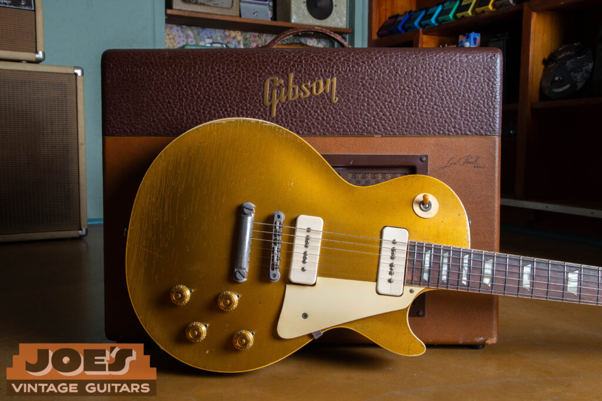

A stunning example of the 1956 Les Paul Goldtop leaning against its companion Gibson Les Paul amplifier from the same era. This year is the only one where you’ll find the P-90 “Soapbar” pickups paired with the first full-production run of the ABR-1 Tune-o-matic bridge, a combination that many purists consider the best of Gibson’s “Golden Era” engineering.

The 1956 Goldtop is a favorite among players because it’s the only full production year to combine the grit of P-90 pickups with the precision of the ABR-1 bridge. If you’re evaluating one of these guitars, every tiny detail matters. Below is the technical breakdown. If you need help dating your Gibson, check out our [Gibson serial number lookup](/how-to-read-gibson-serial-numbers/). If you’d like to [sell your Gibson](/sell-my-gibson-guitar/), feel free to reach out for a competitive and hassle-free offer!

## The Headstock & Neck

-   **The Gibson Logo:** This is a Mother of Pearl inlay with the classic mid-50s font. You’re looking for an open “b” and “o,” with a thickness and “dot” over the “i” that is specific to the era.
    

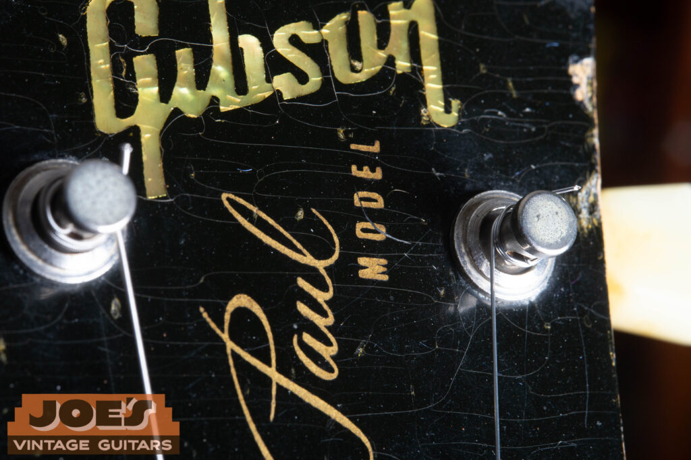

A detailed look at the 1956 headstock geometry. Note the specific mid-50s Mother of Pearl “Gibson” inlay featuring the characteristic open “b” and “o,” alongside the crisp “Les Paul Model” silkscreen. On an original 1956 example, the vertical alignment and spacing between these two elements are distinct “tells” that separate a factory-original finish from a later reissue or restoration.

-   **“Les Paul Model” Silkscreen:** This gold script sits between the tuner rows. On a ’56, it’s usually positioned slightly closer to the logo than the truss rod cover.
    
-   **The Ink-Stamped Serial:** Flip the guitar over and check the back of the headstock. A genuine 1956 serial is **ink-stamped** in black, never impressed into the wood. The sequence should always start with a “**6**” followed by a space and then 4 or 5 digits (e.g., 6 1234). Take a hard look at the font; Gibson used a very specific, slightly “blocky” typeface in the mid-50s that is a dead giveaway when compared to the thinner or more modern fonts found on fakes and reissues.

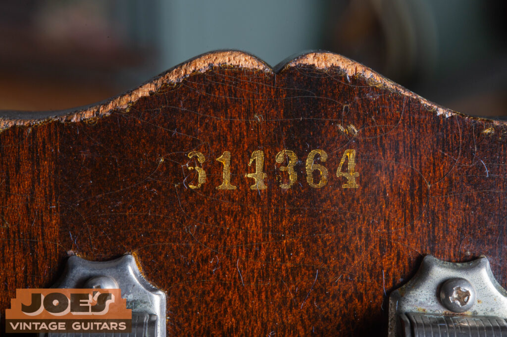

A detailed look at a genuine 1956 serial number. In this era, Gibson used a yellow ink stamp rather than impressing the numbers into the wood. The “6” prefix is the first thing to check, but the real authentication is in the font itself. Notice the specific “blocky” weight of the numbers. Modern reissues and fakes often use a font that is either too thin or too perfectly aligned. On an original ’56, the ink may show slight fading or “haloing” into the lacquer, the result of seventy years of aging.

-   **Truss Rod Cover:** A traditional bell-shaped, 2-ply (Black/White) plastic cover. You should see a very thin, distinct white border around the edge.
    

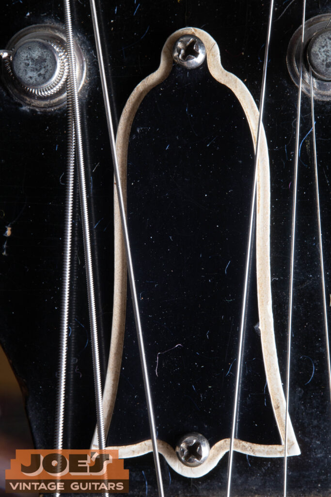

A close-up of the 1956-era truss rod cover. Authentic mid-50s covers are a “bell” shape made from two-ply (black over white) plastic. On a genuine ’56, you’ll notice a very thin, even white border peeking out from beneath the black layer. Even the slight oxidation on the original mounting screws can be a key indicator of an undisturbed, factory-original assembly.

-   **The Nut:** Original 1956 examples used **Nylon 6/6**. It has a specific off-white, slightly translucent look, not the bright white of modern plastic or the grain of bone.
    

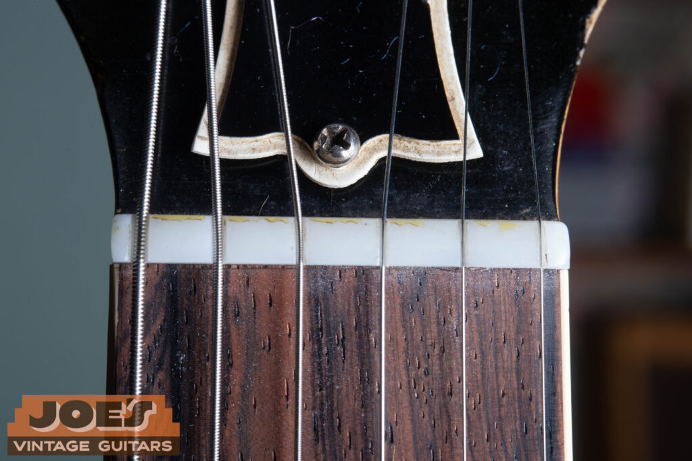

A detailed view of a factory-original 1956 nut. In this era, Gibson utilized a specific Nylon 6/6 material that possesses a unique, slightly translucent off-white hue. Unlike the stark white of modern plastic or the granular texture of bone, an original ’56 nut has a “soft” aged appearance. Seeing this material intact, with its original tool marks and yellowed patina, is a major green flag for an unmolested vintage headstock.

-   **Tuners:** These are **Kluson Deluxe “Single Line”** tuners (the text runs in one vertical line). Crucially, the back of the gear housing must feature the **“Patent Applied”** stamp. The cream “tulip” buttons should have a waxy, aged appearance.
    

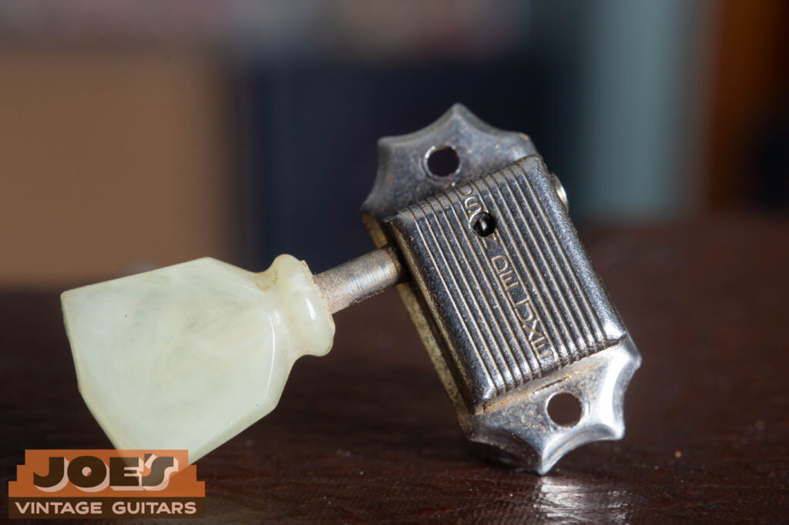

A detailed look at the 1956-correct Kluson Deluxe tuner. Authentication begins with the “Single Line” branding, where the text runs vertically down the center of the housing, but the real proof is in the “Patent Applied” stamp on the back. Also, take note of the “tulip” button; on an original ’56, the cream plastic often takes on a slightly translucent, waxy patina and may show minor shrinkage from decades of natural outgassing.

## Body, Finish & Inlays

-   **“Bullion Gold” Nitro:** Gibson used actual bronze powder in the lacquer. Over 70 years, this metal oxidizes, causing the finish to turn green in areas of arm wear or within the weather checking.
    
-   **“Thin” Cutaway Binding:** Look into the Florentine cutaway. In 1956, the binding is thin enough that you can see a sliver of the maple cap edge below it. If the binding is thick and hides the maple/mahogany seam, be suspicious.
    
-   **Cellulose Nitrate Inlays:** These trapezoid inlays should have a “swirly,” marbled texture and very sharp corners. Modern reissues often get the corners too rounded.
    

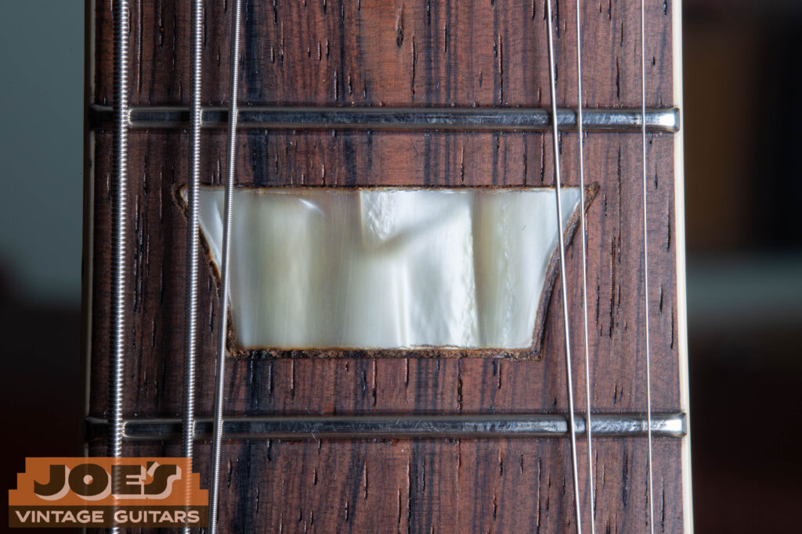

A close-up view of the period-correct trapezoid inlays used in 1956. These are made of Cellulose Nitrate, which develops a distinct “swirly” or marbled grain over time, a texture that modern plastic simply cannot replicate. Note the sharp corners and the tell-tale gaps or “shrinkage lines” around the edges. Because Cellulose Nitrate gasses off and shrinks over many decades, seeing a slight separation between the inlay and the Brazilian Rosewood is actually a strong indicator of an original, 70-year-old part.

-   **The Neck Joint:** If you pull the neck pickup, you should see the **Long Tenon** extending deep into the cavity, a hallmark of ’50s sustain.
    

## Hardware & Plastics

-   **The “No-Wire” ABR-1:** The bridge should be a nickel-plated Tune-o-matic with **no retainer wire** holding the saddles. It sits on two thin, nickel-plated thumbwheels.
    

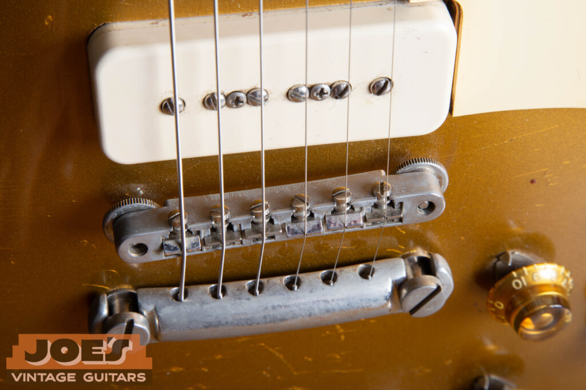

A close-up look at the nickel-plated ABR-1 Tune-o-matic bridge, the big upgrade of the 1956 model year. Notice the absence of a retainer wire across the saddle adjustment screws. This “no-wire” design is specific to the mid-to-late 1950s; Gibson didn’t add the retainer wire to keep saddles from falling out until the early 1960s. Seeing this bridge, combined with the thin thumbwheels it sits on, is a hallmark of a period-correct ’56 Goldtop setup.

-   **Tailpiece:** A lightweight, thin-walled **aluminum stopbar**. If it feels heavy or “clunky,” it’s likely a zinc replacement.
    
-   **The “Poker Chip” & Switch:** The 3-way Switchcraft toggle is capped with an **Amber Catalin tip** (which darkens with age). The “Rhythm/Treble” ring features gold-embossed lettering.
    

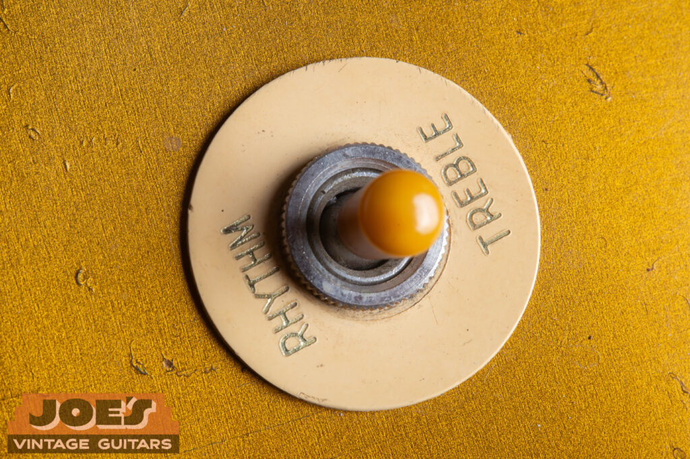

The selector assembly on a ’56 tells a subtle story of aging. The original Switchcraft 3-way toggle is fitted with a Catalin tip that typically oxidizes from a pale cream to a deep, translucent amber over the decades. It’s surrounded by the “poker chip,” the Rhythm/Treble indicator, which features gold-embossed text. On a genuine vintage example, look for the way the lettering is pressed into the plastic, often showing a bit of “bleeding” or softening in the gold paint that modern laser-etched reissues just don’t capture.

-   **Knobs & “Finger Bleeders”:** You should find Gold “Top Hat” (Bonnet) knobs. Underneath each one is a sharp **metal pointer washer**, needed for that period-correct look.
    

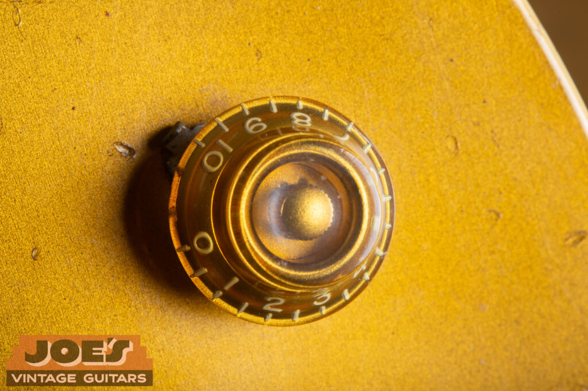

A detailed look at the gold “Top Hat” (or Bonnet) knobs and the notorious pointer washers underneath. These nickel-plated pointers were surprisingly sharp, earning them their nickname from generations of players, and sit nearly flush against the body.

-   **Pickguard & Covers:** The guard and the P-90 “Soapbar” covers are made of cream **Royalite** plastic. The covers should have a soft, matte texture rather than a high-gloss modern shine.
    

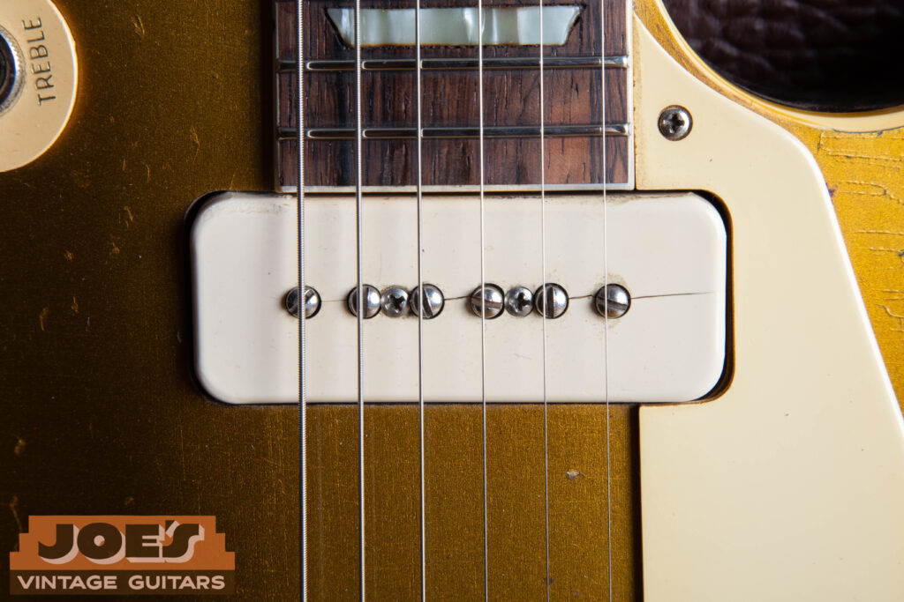

A detailed look at the neck P-90 “soapbar” pickup. Notice the fine hairline split running through the pole pieces, a common occurrence on original 1950s covers. These were manufactured from Royalite plastic, which naturally becomes brittle and shrinks over seven decades. While a “clean” cover is nice, these minor stress cracks are often a “green flag” for collectors, providing visual proof that the plastic is an original, 70-year-old part rather than a modern, more flexible replacement.

## Internal Electronics & Control Cavity

-   **Stepped Control Routing:** This is the ultimate internal test. Because of the way Gibson routed the mahogany to follow the carved maple top, the floor of the control cavity will have a **distinct ledge or “step.”** It is never perfectly flat.
    
-   **Tool “Chew” Marks:** Look for rough marks where the router bit entered or exited the wood. A perfectly smooth cavity is usually a sign of modern CNC work.
    
-   **Bumblebee Capacitors:** A genuine ’56 will have **Sprague “Bumblebee”** caps (.022uF 400V) with their characteristic colored bands.
    

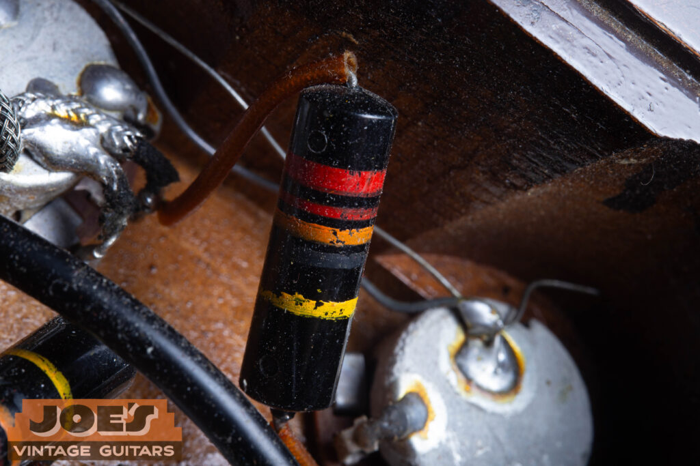

A close look at the legendary Sprague .022uF 400V “Bumblebee” capacitor. These paper-in-oil caps are the secret sauce behind the smooth, musical roll-off of a vintage ’56 Goldtop. When authenticating, look for the characteristic color bands and the slightly “waxy” or dusty texture that comes with 70 years of sitting in a mahogany cavity. If you see modern “drop” capacitors or bright, clean reissues, it’s a sign the harness has been tampered with.

-   **Pot Codes:** Check the side of the 500k pots. You want to see codes starting with **137** (CTS) or **134** (Centralab) followed by “6” for the year.
    

## The Case & Final Checks

-   **The “California Girl” Case:** Most ’56s shipped in a **Lifton hardshell**. It’s brown faux-leather on the outside with a bright pink or crushed gold velvet interior. Look for the small metal Lifton logo plate.
    

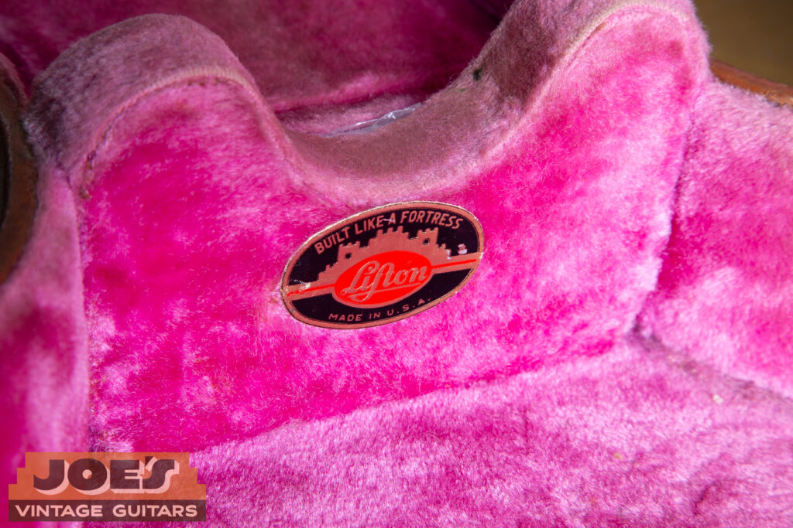

A detailed view of the original metal brand plate found on the “California Girl” case. While many believe the name refers to the tan-and-pink color scheme, the nickname actually stems from the specific hourglass “curvy” silhouette of the case itself. On an original 1956 case, look for this small, weathered badge near the handle. It’s the mark of the Lifton construction that protected these Goldtops when they left the factory in Kalamazoo.

-   **Headstock Pitch:** A true 1950s Gibson has a **17-degree** headstock angle.
    
-   **The UV Test:** Under a black light, original ’50s nitrocellulose will glow a **“sickly” neon green**. If it glows purple or doesn’t react, it’s likely a refinish.
    

## Professional Authentication: The Joe’s Vintage Advantage

Authenticating a 1956 Goldtop is about more than checking off a list. It’s about knowing the “feel” of 70-year-old nitrocellulose and the specific resonance of a long-tenon mahogany neck. At Joe’s Vintage Guitars, we don’t stop at the surface. We perform a full “under the hood” inspection on every instrument, from verifying the 17-degree headstock pitch to using UV black light testing to confirm the lacquer is factory-original. If you’ve discovered a vintage Gibson and need to know exactly what you have, our [Professional Appraisal Services](/free-appraisal/) provide the documentation and peace of mind you need. And if you’re ready to see your instrument go to a home where its history will be truly respected, we are always buying. You can [sell your vintage guitar](/) directly to us for a fair, transparent, and competitive offer, no games, just a shared passion for the Golden Era.

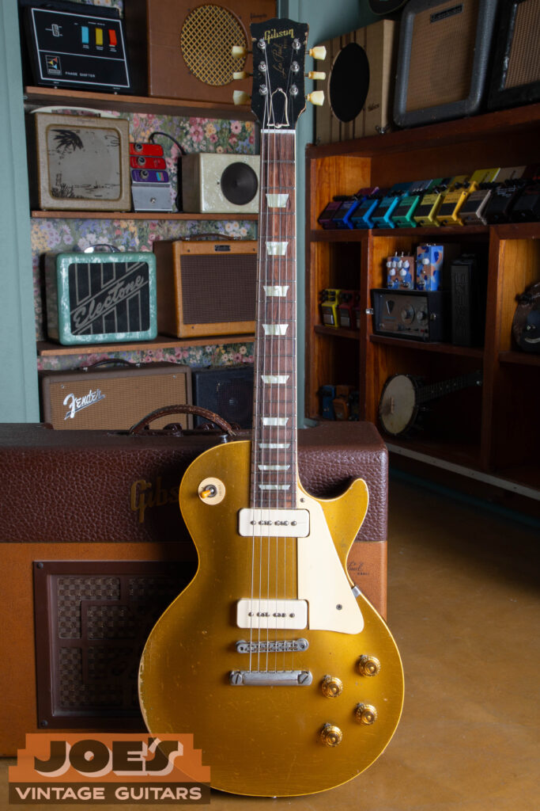

This is the guitar that defined an era. In this full-body view, you can see why the ’56 is the “Goldilocks” of vintage Les Pauls, offering the raw soul of the early 50s with the professional intonation that players wanted. From the way the bullion gold finish has aged into a deep, metallic bronze to the proportions of the single-cutaway body, a genuine 1956 Les Paul is easy to spot once you know what to look for. If you’re holding onto one of these and want to make sure its history is documented and valued correctly, we’re here to help.
