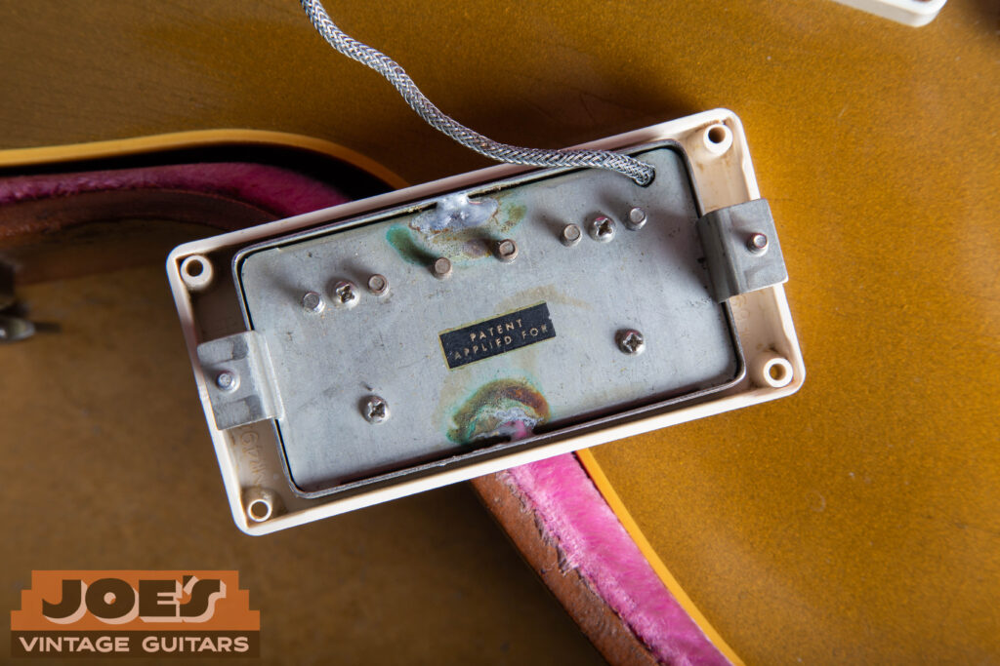
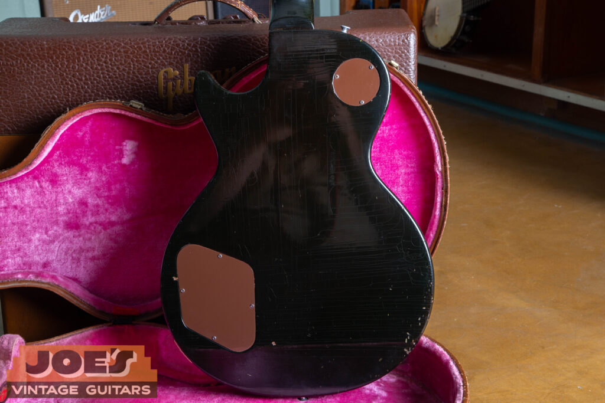
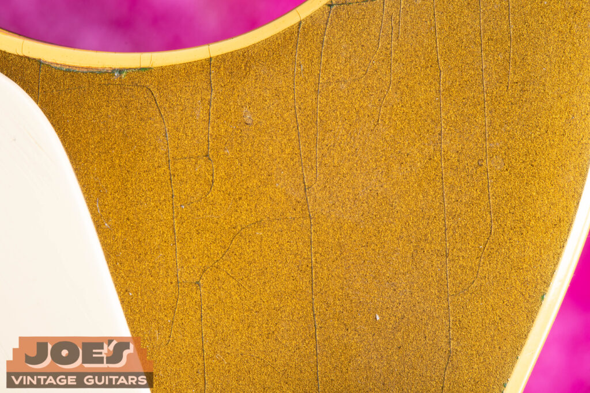
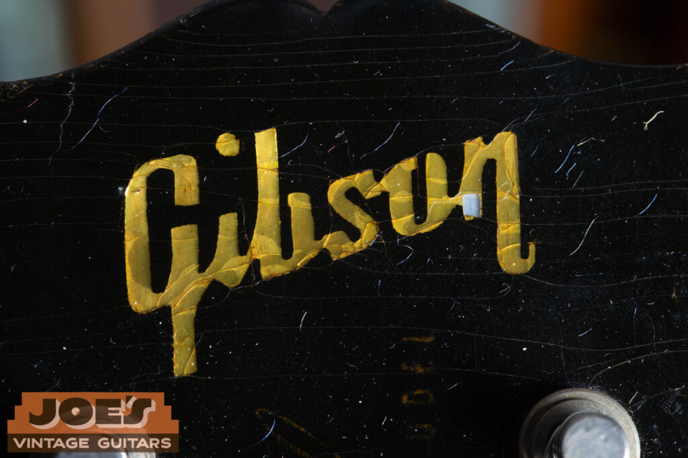
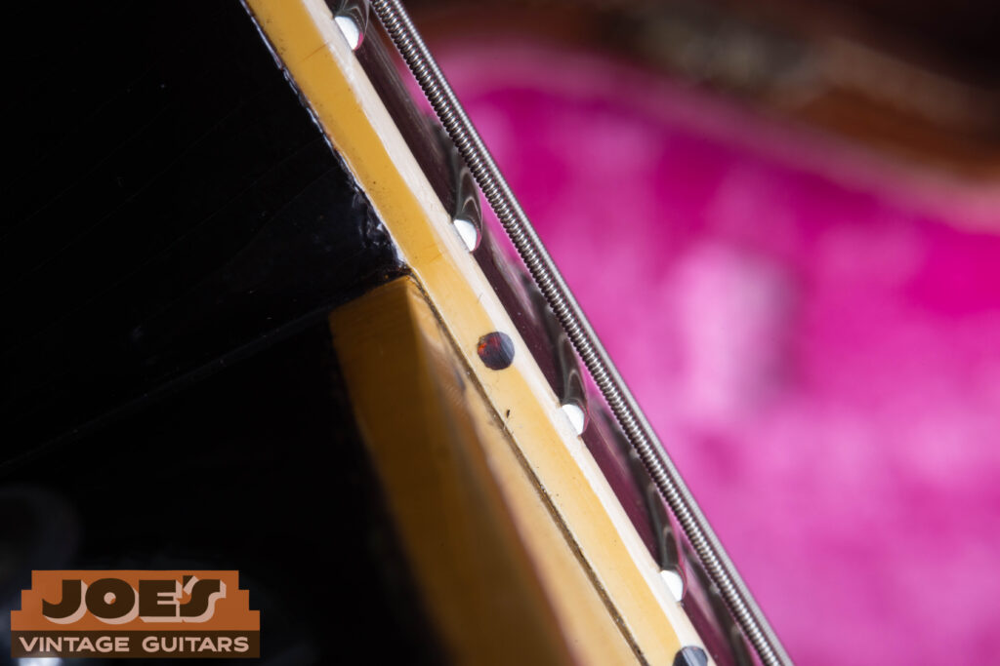
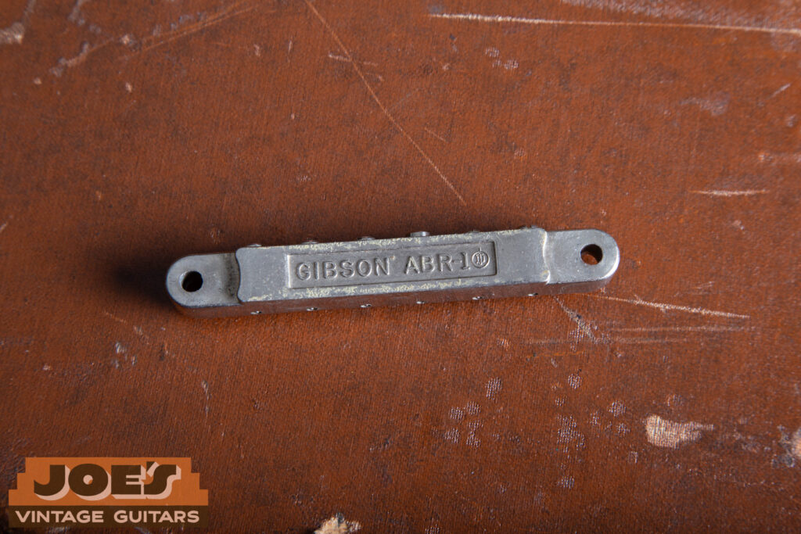
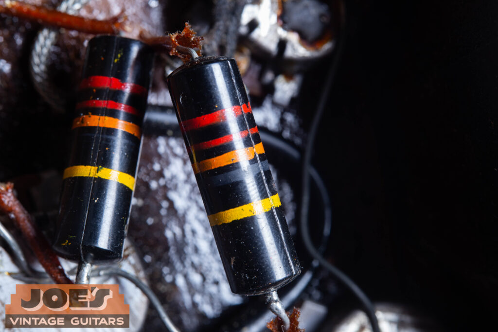
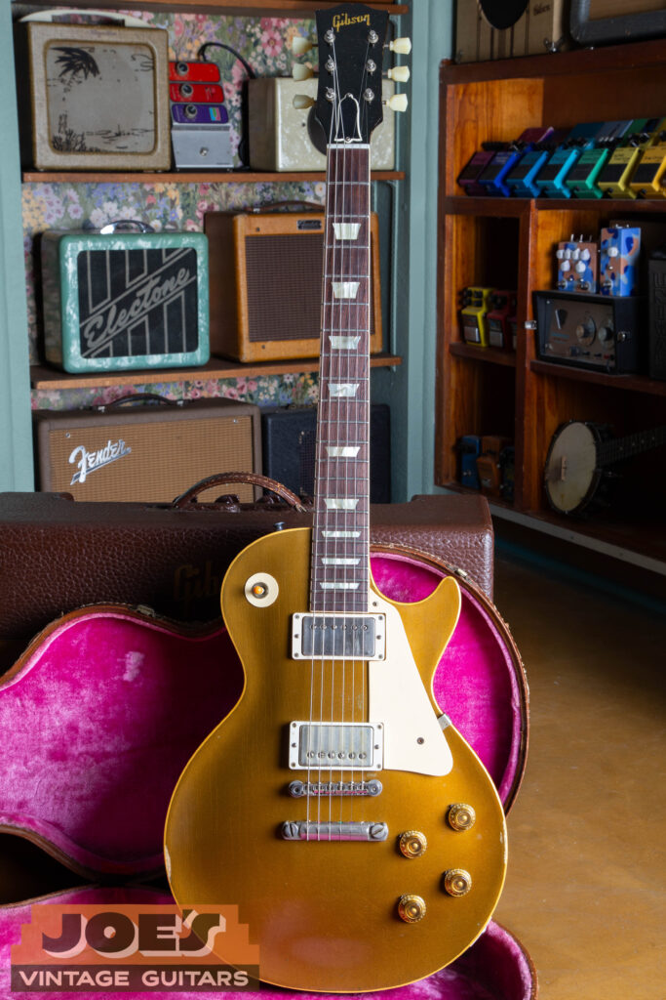

## Table Of Contents

-   [The “Year One” Humbucker Shift: PAFs & M-69 Rings](#humbucker-shift)
-   [Body, Finishes, and the “Dark Back”](#body-finishes)
-   [Headstock, Neck & The “Golden Era” Logo](#headstock-neck)
-   [Hardware & Plastics: No-Wire ABR-1 & Klusons](#hardware-plastics)
-   [Internal “Smoking Guns”: Bumblebees & Stepped Routes](#internal-smoking-guns)
-   [Serial Numbers & The “California Girl” Case](#serial-numbers)
-   [1956 vs. 1957: Key Technical Differences](#technical-differences)
-   [Professional Authentication: The Joe’s Vintage Advantage](#joe-advantage)

his 1957 Standard sits at the big transition point in Gibson history. While it keeps the classic single-cutaway mahogany body and maple cap, the move to Seth Lover’s PAF humbuckers changed the sound of the instrument for good. This particular example features an incredibly deep “Dark Back” stain, perhaps the darkest I’ve ever seen, creating a strong contrast against the metallic gold top. From the “no-wire” ABR-1 bridge to the aged nickel covers, this is a clean example of 1950s Kalamazoo work.

If 1956 was the year Gibson sorted out the hardware, 1957 was the year they got the sound right. This is the point where the P-90 was set aside in favor of Seth Lover’s “Patent Applied For” (PAF) humbucking pickups. Because the 1957 Goldtop brings such a big jump in market value, knowing the small “tells” of a genuine ’57 is the difference between a sound investment and a costly mistake.

If you need assistance in dating yout Gibson, check out our [serial number guide](/how-to-read-gibson-serial-numbers/). If you’d like to [sell a Gibson](/sell-my-gibson-guitar/), please contact us for a competitive offer!

<h2 id="humbucker-shift">The “Year One” Humbucker Shift: PAFs & M-69 Rings</h2>

The most obvious differentiator for ’57 is the move to humbuckers. When authenticating these, we look for the brushed nickel covers with soft, slightly rounded edges. Unlike modern reissues that are often too “sharp,” an original 1957 cover has a specific “cloudy” patina that is nearly impossible to fake. Underneath, you’re looking for the black “L” tool marks on the feet and the **PAF decal** on the baseplate.

Flipping over a 1957 humbucker reveals the DNA of the “Golden Era.” Two major keys here are the square-shaped mounting feet featuring the distinct black “L” tool marks (a result of the original manufacturing stamps) and the “M-69” nomenclature molded into the underside of the cream pickup ring. While later reissues try to replicate these, the specific texture of the original Butyrate plastic and the “cloudy” aging of the baseplate are unmistakable markers of an authentic ’57 assembly.

-   **M-69 Pickup Rings:** The rings themselves are a critical authentication point. Look for the “M-69” stamp on the underside of the mounting rings.
    
-   **Color Transitions:** While most 1957 Goldtops feature the iconic **cream** plastic rings, it is important to note that very early ’57 models can occasionally be found with **black** plastic rings, as Gibson was still transitioning away from the 1956 aesthetics.
    
-   **Plastic Texture:** Much like the other plastics on the guitar, these rings should show evidence of light shrinking or “bowing” over time, a signature of the original Butyrate material.
    

<h2 id="body-finishes">Body, Finishes, and the “Dark Back”</h2>

While many ’57s share the light mahogany back of the ’56, this was the breakout year for the **“Dark Back.”** This is a deep, chocolate-brown stain that can sometimes look black in low light.

While the “Dark Back” became a signature look in 1957, this particular example is likely the darkest mahogany stain I have ever encountered on a vintage Goldtop. It’s a good example of the era’s hand-applied finishes: nearly opaque at first glance, but with a rich, translucent depth that reveals the mahogany grain when caught by the light. When you’re authenticating a ’57, you’re looking for this specific chocolate-brown hue; if it’s a “solid” black paint that hides the grain entirely, it’s likely been oversprayed or refinished. As you can see from the photo, sometimes the difference between dark brown and black is hard to pinpoint!

-   **Bullion Gold Top:** Expect to see “greening” in the lacquer checks where the bronze powder has oxidized over 70 years.
    

A detailed view of the bullion gold finish on a 1957 Standard. The network of weather checking, the fine lines in the nitrocellulose, occurs naturally as the wood expands and contracts over decades. Looking closely at the top of the frame, you can see the distinctive “greening” effect. This is caused by the real bronze powder in the original lacquer formula reacting to moisture and skin contact, oxidizing into a dark copper or green hue. It’s a chemical signature of a true mid-50s Gibson that modern metallic paints simply cannot replicate.

-   **Thin Cutaway Binding:** Look into the Venetian cutaway. You should clearly see the maple cap “peek” through the thin binding, a hallmark of mid-50s Kalamazoo construction.
    
-   **Cellulose Nitrate Inlays:** These trapezoid markers often show **noticeable shrinkage**. If you see a slight gap or “dirt line” around the sharp corners of the inlay, that’s actually a great sign of an original, gassing-off 1950s part.
    

<h2 id="headstock-neck">Headstock, Neck & The “Golden Era” Logo</h2>

The “face” of a 1957 Les Paul holds several of the most critical markers for authentication. Because this was a period of high consistency at the Kalamazoo factory, any deviation in these specific specs is a reason to look closer.

-   **Mother of Pearl Logo:** The “Gibson” logo is a genuine Mother of Pearl inlay. Authenticity is found in the font, specifically the “open b and o” and the way the “G” and “n” are styled. The inlay should sit flush with the headstock face, though seventy years of lacquer shrinkage often reveals a slight “ghost” outline around the pearl.
    

A detailed look at the 1957 headstock reveals the honest aging that collectors crave. Notice the dense network of finish checking spiderwebbing across the black lacquer above the Mother of Pearl “Gibson” logo, a clear sign of the original nitrocellulose gassing off over seven decades. Below it, the gold “Les Paul Model” silkscreen shows significant fading; on a genuine ’57, this metallic paint often loses its luster or “thins” out, rather than staying perfectly crisp like a modern reissue. These “imperfections” are the fingerprints of an unmolested vintage instrument.

-   **“Les Paul Model” Silkscreen:** This gold script is silkscreened onto the headstock, typically positioned centered between the top four tuners. On an original ’57, the gold paint has a specific metallic luster that often develops a fine, shattered checking pattern over time. The silkscreen can oftentimes be very faded as well.
    
-   **Tortoise Side Dots:** A subtle but reliable tell for a 1957. While the fretboard inlays are cellulose nitrate, the **side dot markers** on the neck binding are actually made of a dark **reddish tortoise shell** material. Under a bright light or a jeweler’s loupe, you should see a deep, translucent red swirl rather than the flat black found on some modern reissues or fakes.
    

A detailed view of the side dots on a 1957 Goldtop. While they often appear black in low light, these original markers were actually crafted from a dark, reddish tortoise shell material. Under a bright light or a jeweler’s loupe, you can see the distinctive deep red hue and subtle swirling that modern black plastic markers simply cannot replicate. Finding these “red” dots is a major “green flag” for an unmolested, factory-original 1950s neck.

-   **The 17-Degree Pitch:** Every ’57 Standard was built with a steep 17-degree headstock angle. This angle is a major part of the Les Paul’s resonance and sustain, but it also makes the headstock vulnerable; always check for “smile” cracks or repairs behind the nut during your inspection.
    

<h2 id="hardware-plastics">Hardware & Plastics: No-Wire ABR-1 & Klusons</h2>

-   **“No-Wire” ABR-1:** The bridge should be a nickel-plated Tune-o-matic without a retainer wire. If there is a wire holding the saddles in, it’s a later early-60s part. It should be stamped “GIBSON ABR-1” on the back.
    

A look at the underside of a correct 1957 ABR-1 bridge. Authentic 1950s bridges feature a clean “ABR-1” stamp on the base and do not have the retainer wire found on later early-60s versions. On an original ’57, you are looking for this specific nickel plating that has aged with a dull, “cloudy” luster rather than the bright, bluish chrome found on modern replacements.

-   **Nylon 6/6 Nut:** Still the industry standard in ’57, this material is waxy and slightly translucent. Modern plastic is too white; bone is too granular.
    
-   **“Single Line” Klusons:** Check the back of the tuner housing for the vertical “Kluson Deluxe” branding and remove the tuner to check the underside for the **“Patent Applied”** stamp.
    
-   **The “Poker Chip”:** The selector ring should have gold-embossed lettering that looks “pressed” into the cream plastic.
    

<h2 id="internal-smoking-guns">Internal “Smoking Guns”: Bumblebees & Stepped Routes</h2>

To truly verify a ’57, you have to look “under the hood.”

-   **The Stepped Route:** The control cavity floor must have a physical “step” or ledge. A flat floor is a dead giveaway of a modern CNC-routed body.
    
-   **Bumblebee Capacitors:** You’re looking for the Sprague .022uF 400V “Bumblebees” with their distinct color-coded stripes.
    

To truly verify a ’57, you have to look “under the hood” at the electronics. These original Sprague “Bumblebee” capacitors, rated at .022uF 400V, are a big part of that 1950s Gibson tone. When authenticating, I’m looking for the specific way these color-coded stripes have aged; the plastic casing often develops a slightly dull or “matted” texture over seven decades that modern reproductions just can’t quite mimic.

-   **Long Tenon:** In the neck pickup cavity, the neck wood should extend significantly into the body route for maximum resonance.
    

<h2 id="serial-numbers">Serial Numbers & The “California Girl” Case</h2>

The serial number should be a **yellow or black ink stamp** starting with a “**7**” (e.g., 7 1234). The font is a specific, blocky mid-50s typeface. This guitar typically paired with the **“California Girl” case**, so named for its color scheme: a tanned brown exterior over a bright pink interior.

<h2 id="technical-differences">1956 vs. 1957: Key Technical Differences</h2>

While a 1956 and 1957 Goldtop might look identical from a distance, they represent two very different chapters in Gibson’s engineering history. 1956 was the year Gibson perfected the hardware “chassis,” but 1957 was the year they changed the engine.

| Feature | 1956 Les Paul Standard | 1957 Les Paul Standard |
| --- | --- | --- |
| Pickups | Twin P-90 Single Coils | Twin PAF Humbuckers |
| Pickup Covers | Cream Plastic "Soapbars" | Brushed Nickel (Cloudy Patina) |
| Primary Innovation | Perfecting Intonation (ABR-1) | Eliminating 60-cycle Hum |
| Pickup Rings | N/A (Direct Body Mount) | Cream or Black M-69 "Butyrate" |
| Internal Routing | Shallow P-90 Routes | Deep "Stepped" Humbucker Floor |

<h2 id="joe-advantage">Professional Authentication: The Joe’s Vintage Advantage</h2>

Authenticating a 1957 Les Paul Standard requires an eye for the smallest details, from the “Patent Applied” stamp on the tuners to the tool marks in a “stepped” control cavity. At Joe’s Vintage Guitars, we specialize in the “Golden Era” of Gibson production. We provide full UV black light testing and professional internal inspections to verify every solder joint and screw.

If you’ve come across a ’57 Goldtop and need a definitive answer on its history, our **[Professional Appraisal Services](/free-appraisal/)** are the industry standard. Ready to move your instrument to its next home? You can **[sell your vintage guitar](/)** to us with confidence, knowing you are getting a fair, expert valuation from a shop that knows these guitars well.

Seeing a Goldtop from this era in its entirety really puts the “Year of the Humbucker” into perspective. By this point, the Les Paul had reached its pre-1960 peak, combining the solid ABR-1 bridge stability introduced the year prior with the power of Seth Lover’s PAF pickups. Whether it’s the way the bullion gold finish has matured into a deep metallic bronze or the “dark back” mahogany peeking around the edges, a genuine ’57 has a character that modern reissues can’t quite match. If you own one and want to make sure it’s looked after, we’re here to help.
