Among vintage electric guitars, few have the following of the **1959 Gibson ES-335TD**. Collectors and players often call it the “Holy Grail,” and 1959 was the year Ted McCarty’s semi-hollow design really came together. It was the year Gibson corrected the structural teething or “fragility” issues of the inaugural 1958 models while keeping the massive, hand-shaped neck profiles and the “Long-Magnet” PAF humbuckers that define the Golden Era sound. From the **“Mickey Mouse” ear** cutaways to the transition of the **4-ply maple top**, a ’59 was built for the harmonic “bloom” and sustain that modern CNC machines still struggle to match. Whether you are a “Tone Chaser” or an investor, knowing the details, from the **spring-loaded Stone cases** to the **tortoiseshell side dots**, is what tells you what you are looking at. If you need help dating your Gibson, check out our [**Gibson Serial Number Tool.**](/how-to-read-gibson-serial-numbers/) If you are curious about the value of your Gibson, reach out for a [**free appraisal!**](/free-appraisal/)

## Jump to a Section

### 1959 Gibson ES-335 Authentication Log

-   [01\. The Body:](#body-evolution) "Mickey Mouse" Ears & Structural Evolution
-   [02\. The Neck:](#neck-architecture) "Holy Grail" Profiles & 4° Pitch
-   [03\. The Tuners:](#tuner-specs) Single-Line Klusons & Mummification
-   [04\. Hardware:](#hardware-details) No-Wire ABR-1 & Plastic Heel Buttons
-   [05\. Electronics:](#paf-electronics) Long-Magnet PAFs & Zebra Bobbins
-   [06\. Markings:](#markings-decoding) Decoding the Orange Label & "S" Code
-   [07\. Finishing Touches:](#plastics-knobs) Bonnets, Long Guards & Catalin Tips
-   [08\. The Case:](#case-identification) Stone vs. Lifton "California Girl" Designs
-   [09\. Notable Players:](#notable-players) Architects of the 335 Sound

<h2 id="body-evolution">The Body: Iconic “Mickey Mouse” Ears & Structural Evolution</h2>

The 1959 model year is most famous for its **symmetrical double-cutaway body**, featuring the rounded, bulbous horns affectionately known by collectors as **“Mickey Mouse ears.”** These ears are more pronounced and circular than the “pointy” ears seen in the mid-1960s.

### The Shift to 4-Ply Maple Laminates

One of the most significant technical upgrades in 1959 was the change in top construction.

-   **The 1958 Problem:** Early 1958 models featured a thinner 3-ply maple top. While resonant, these tops were fragile; the wood frequently cracked around the output jack due to the pressure of the instrument cable.
-   **The 1959 Solution:** Gibson moved to a **thicker 4-ply maple laminate**. This increased structural integrity and provided a more stable mounting surface for the electronics, virtually eliminating the cracking issues of the previous year.

> Note: This shift was done gradually. 1959 ES-335s with thin tops do exist. Generally speaking, thin top ES-335s are slightly more desirable than their thicker top counterparts. To see if your guitar is a thin top, look at the edge of the f-hole and count the layers of wood.

### Neck Binding and Standardized Aesthetics

While many 1958 models shipped without neck binding (giving them a more “workhorse” look), **1959 was the year neck binding became standard**. This single-ply cream binding provided a smooth transition between the fretboard and the neck, adding a touch of luxury that defined the “Golden Era” aesthetic.

### Finish Options: Sunburst vs. Natural

The 1959 ES-335 was finished in **Nitrocellulose lacquer**, a thin, breathable finish that ages beautifully over time.

-   **Sunburst:** The classic “Tobacco” or “Iced Tea” bursts were the standard.
-   **Natural (Blonde):** Significantly rarer and highly coveted by investors. Only 71 Natural finish 335s were produced in 1959, making them some of the most expensive vintage guitars on the market today.

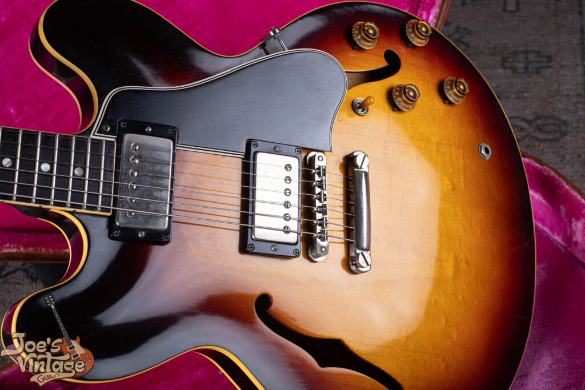

This 1959 Gibson ES-335 showcases the incredible depth and luster of an original nitrocellulose lacquer finish in near-museum condition. Finding a sunburst finish from this era without significant weather checking or fading is a rarity that drastically impacts the market value for collectors.

### Tone Impact: The Semi-Hollow “Snap”

The magic of the ’59 tone lies in its internal architecture. The combination of the **thicker 4-ply top** and the **solid maple center block** creates a unique sonic profile:

-   **Sustain:** The center block allows the strings to vibrate with the longevity of a Les Paul.
-   **Woody Resonance:** The hollow “wings” of the body add an airiness and “bloom” to the notes that you can’t get from a solid piece of wood.
-   **The 1959 Neck Profile:** This year is also famous for the **“Long Tenon”** neck joint and the “chunky” ’59 neck profile, which many players claim adds to the overall resonance and “snap” of the instrument.

<h2 id="neck-architecture">The Neck: The “Holy Grail” Architecture</h2>

The 1959 neck is widely considered the gold standard of electric guitar ergonomics. It represents a specific window in Gibson’s history before the company shifted toward the ultra-thin “Slim Taper” profiles of 1960.

### The “1959 Profile”: Deep Dive into the Feel

Collectors and players often refer to the ’59 neck as the **“Full Rounded”** or **“Chunky C”** profile. To understand why it is so coveted, one has to look at the specific dimensions and the “hand-shaped” nature of the era:

-   **The “Palm-Fill” Factor:** Unlike modern “shredder” necks that can feel flat, the 1958 and 1959 profiles have significant “shoulder,” the area of the wood that curves away from the fretboard. This fills the natural cavity of the palm, reducing hand fatigue during long sessions.
-   **Gradual Taper:** A hallmark of the 1959 build is the consistent increase in depth as you move toward the body.
    -   **At the 1st Fret:** Usually measures approximately **.900″ (22.86mm)**.
    -   **At the 12th Fret:** Usually swells to a full **1.00″ (25.4mm)**.
-   **The Transition Period:** While 1958 necks were often even “boulder-like,” the 1959 version refined the shape just enough to be fast without losing the mass required for superior resonance and sustain.

> **Pro Tip for Collectors:** Because these necks were hand-sanded at the Parsons Street factory, no two ’59 necks are identical. Some “late ’59s” actually began to transition toward the thinner 1960 spec, making the “Early-to-Mid ’59” the most sought-after for those seeking the true chunky feel.

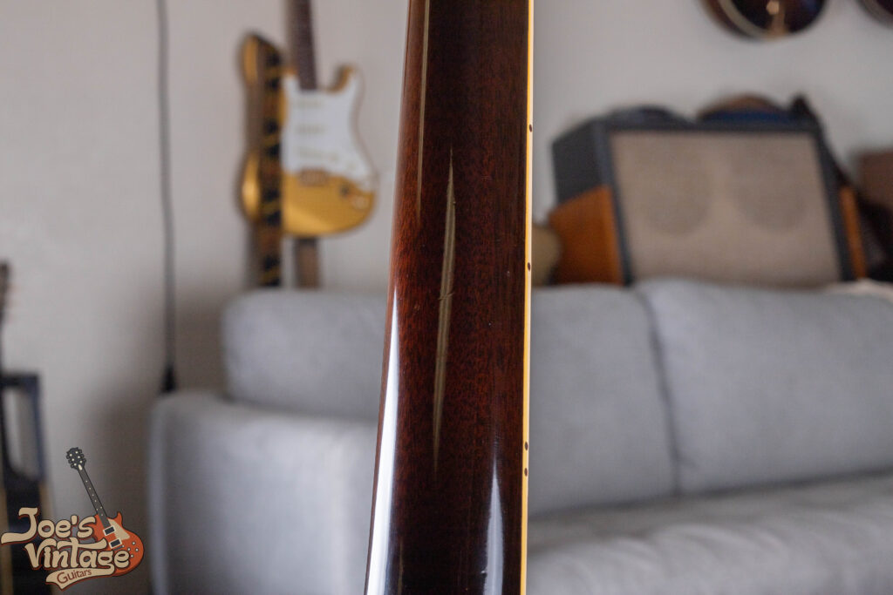

The back of this 1959 ES-335 neck shows how well it has been kept. Retaining its original gloss with almost no “buckle rash” or finish thinning, it features the “chunky” ’59 rounded profile that defines this golden era of Gibson production

### Neck Angle: The Secret to Low Action & Sustain

One of the most critical technical evolutions in 1959 was the adjustment of the **neck set pitch**.

-   **The 1958 “Shallow” Angle:** Many 1958 models featured a shallow 3° neck angle. This often forced the ABR-1 bridge to be screwed all the way down to the wood, leaving players with **zero room for adjustment** if they wanted a lower, faster action.
-   **The 1959 “Increased” Angle:** Gibson increased the pitch to approximately 4°. This seemingly small change had a massive impact:
    -   **Precision Setup:** It allowed the bridge to sit higher off the body while still maintaining **ultra-low action** at the frets.
    -   **Increased Downward Pressure:** A steeper angle creates more “break angle” over the bridge saddles. This hammers the string energy directly into the maple center block, resulting in the “snap” and harmonic complexity that defines the ’59 sound.

### Material Specs: Nylon, Nitrate, and Tortoise

The fine details of the 1959 neck are the primary “tells” used to authenticate these six-figure instruments.

-   **The Nut (Nylon 6/6):** Rather than bone or modern synthetics, Gibson used **Nylon 6/6**. This material is self-lubricating, which prevents “pinging” during tuning and provides a smoother, “rounder” attack on open strings.
-   **The Fretboard Inlays:** The dots on the face of the fingerboard are **Cellulose Nitrate**. While these age to a beautiful creamy yellow, they are a solid material.

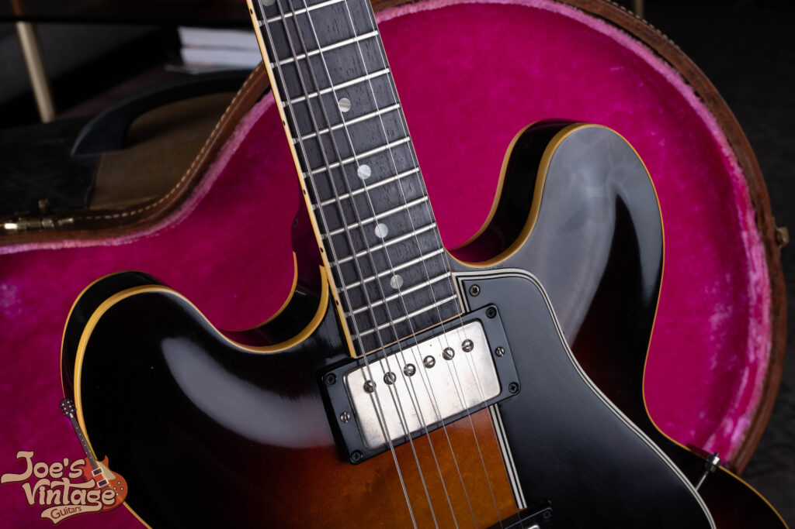

The simple pearloid dots on a dark, rich Brazilian rosewood board are the hallmarks of the 1958 and 1959 ES-335. Unlike the later “block” inlays, these dots signify the most coveted production years. This particular example shows no “lifting” or shrinking of the pearloid, a key indicator of a guitar kept in a climate-controlled environment.

-   **The Side Markers (The Authenticator’s Secret):** If you look at the **side dots** embedded in the cream binding, you won’t see flat black plastic. Authentic 1959 side markers are made of **dark tortoiseshell-patterned celluloid**. Under light, these show a subtle, mottled swirl, a detail often missed by low-end reissues.

<h2 id="tuner-specs">The Tuners: “Single Line” Kluson Deluxe</h2>

If the body is the heart and the neck is the soul, the tuners are the “ID card” of a 1959 Gibson. For collectors, the hardware on the headstock tells a story of period-correct manufacturing that is nearly impossible to fake without specialized knowledge.

### The Anatomy of a “Single Line” Kluson

In 1959, Gibson exclusively used **Kluson Deluxe** tuners with the iconic “Tulip” or “Keystone” buttons. To the untrained eye, all vintage tuners look similar, but the 1959 spec is defined by its **stamping**:

-   **The “Single Line” Marker:** If you look at the vertical metal casing (the gear housing) on the back of the headstock, the words **KLUSON DELUXE** are stamped in a single vertical line running straight down the center.
-   **The Evolution:** This distinguishes them from earlier “No Line” tuners (1952 to 1956) and later “Double Line” tuners (starting in 1964), where the brand name was split into two parallel lines.
-   **Single Ring vs. Double Ring:** 1959 was also the era of the **“Single Ring”** button. This refers to the single plastic ring or “bushing” where the tuner shaft meets the plastic tulip button. In 1960, Gibson transitioned to “Double Ring” tuners, making the single-ring version a hallmark of the ’59 aesthetic.

### The “Mummification” Phenomenon (Button Decay)

One of the most authentic, and frustrating, traits of original 1959 tuners is the chemical instability of the **Celluloid (Nylon)** buttons.

-   **Chemical Breakdown:** The specific plastic formula used in the late 1950s is prone to “off-gassing.” Over decades, the buttons undergo a process collectors call **“mummifying.”** They turn a translucent amber, develop a shrunken, Raisin-like texture, and eventually become brittle enough to crumble into dust between your fingers.
-   **The Authentication “Tell”:** If you encounter a “pristine” 1959 ES-335 with buttons that look like bright, smooth plastic, they are almost certainly **replacements** (often “Uncle Lou” or “Fake 58” high-end replicas). While this is not true 100% of the time, it is usually true.
-   **Originality vs. Playability:** While original “shrunken” buttons prove the guitar’s vintage pedigree, they are often unusable for actual gigging. Many owners store the original “Single Lines” in the case and install modern aged replacements to ensure the guitar stays in tune.

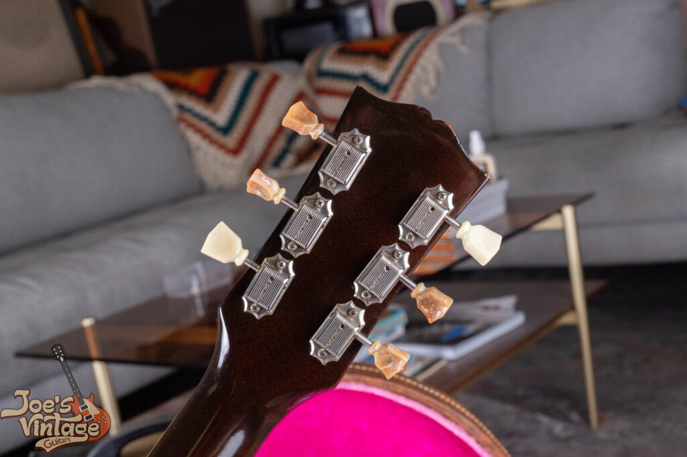

This 1959 ES-335 provides a perfect visual lesson in vintage preservation. Here we see the original “single ring” Kluson tuners in a unique state of transition: four of the original celluloid buttons have “mummified,” a natural off-gassing process that causes them to shrink and crumble over decades. In perfect contrast, two buttons were replaced years ago with stable, period-correct material. Seeing this side-by-side helps collectors and sellers identify the authentic aging process of 1950s Gibson hardware.

<h2 id="hardware-details">Hardware: The “No-Wire” ABR-1 and the Plastic Heel Button</h2>

The hardware of a 1959 ES-335 isn’t just about looks; it is a big part of where the guitar’s sustain comes from. In the late fifties, Gibson was using specific alloys and designs that modern manufacturers spend a lot of money trying to replicate through “Reverse Engineering.”

### The “No-Wire” ABR-1: Pure Mechanical Transfer

The bridge on a 1959 ES-335 is the iconic **ABR-1 Tune-o-matic**. However, the 1959 version has a quirk that terrifies modern players but delights purists:

-   **The Missing Retainer Wire:** In 1959, there was no “safety wire” running across the intonation screws to hold the saddles in place. These are known as **“No-Wire” bridges**.
-   **The “Drop” Risk:** If you break a string during a performance, the individual saddle can, and often does, fall right out of the bridge. While inconvenient, this is a primary indicator of a **period-correct 1959 assembly**.
-   **Tonal Benefit:** Purists argue that the absence of the wire eliminates “bridge rattle,” a common buzz found on later 1960s models, allowing for a purer transfer of string energy to the posts.

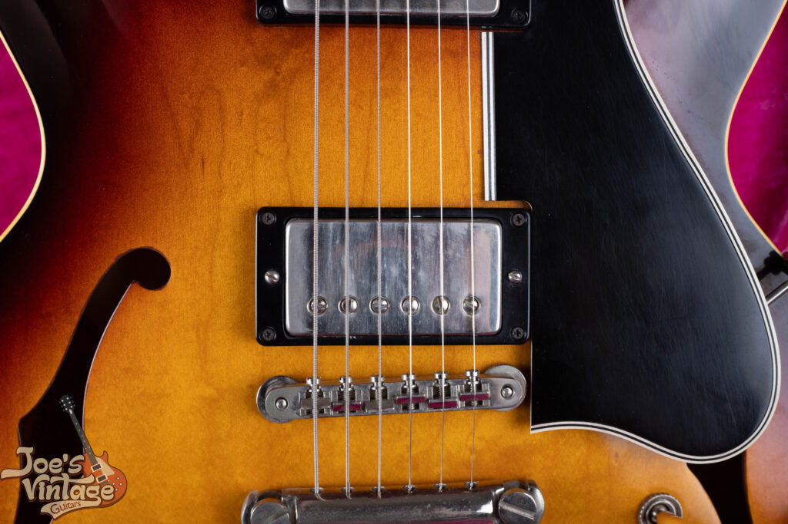

A hallmark of the 1959 ES-335 is the original ABR-1 “no-wire” bridge. Produced before Gibson added the retainer wire in the early 1960s to prevent saddles from falling out during string changes, these bridges are highly prized for their historical accuracy and tonal transfer. This example retains its original nickel plating and shows the correct “GIBSON ABR-1” casting on the underside, essential markers of an unmolested Golden Era instrument.

### The Lightweight Aluminum Stopbar

While the bridge was nickel-plated brass, the **Tailpiece** was a different beast entirely.

-   **Aluminum vs. Zinc:** Original 1959 tailpieces were cast from **Lightweight Aluminum**. Modern “Standard” Gibson line tailpieces are often made of heavy die-cast zinc.
-   **The “Featherweight” Test:** If you hold an original ’59 tailpiece in your hand, it feels impossibly light, almost like plastic. This low-mass design is essential for the “woody” resonance of the ES-335; it allows the top to vibrate more freely than a heavy zinc bar would.

### The “Secret” Detail: The Cream Plastic Heel Button

One of the most specific visual “tells” of a Golden Era ES-335 is the mismatched strap buttons. Most people expect two metal buttons, but the 1959 spec is unique:

-   **The Neck Heel:** Located on the back of the neck heel is a **Cream-colored Plastic strap button**.
-   **The Rear Bout:** The strap button at the base of the guitar (near the input jack) remains the standard **Nickel-plated metal** type.
-   **Production Timeline:** While this is a signature 1959 trait, it wasn’t exclusive to that year. This plastic button was the factory standard throughout 1958 and 1959, continued through 1960, and can even be spotted on some models as late as **1962**.
-   **The “Aging” Look:** Because these are plastic, they often take on a “yellowed” or “amber” hue over 60+ years, contrasting sharply against the nickel hardware nearby.

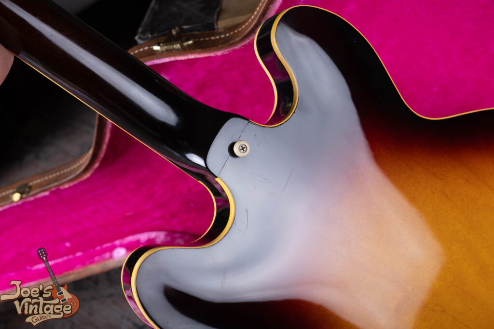

A subtle but vital detail for any 1959 ES-335 is the original white plastic strap button. In the late 1950s, Gibson utilized these plastic buttons before transitioning to the more common metal versions in the early 1960s. Seeing an original, un-cracked plastic button in this location is a fantastic indicator that the guitar has been handled with care and hasn’t been subjected to the typical “player mods” of the 1970s.

<h2 id="paf-electronics">Electronics: The “Long-Magnet” PAF Humbuckers</h2>

If the 1959 ES-335 is the “Holy Grail,” the **PAF (Patent Applied For)** pickups are the heart of it. In 1959, Gibson’s humbuckers were as good as they got, resulting in a pickup that many describe as having a “3D” harmonic richness, a sound that is both airy and aggressive. I am actively looking for PAF equipped Gibson guitars. If you have a [**guitar you’d like to sell**](/), please reach out!

### The “Long-Magnet” Era and 42AWG Wire

The 1959 PAF is defined by its internal components, which differ significantly from the “T-Top” or “Patent Number” pickups that followed in the 1960s:

-   **Alnico Magnets:** 1959 was the peak of the **“Long Magnet”** era (roughly 2.5 inches). These magnets, typically Alnico 2, 4, or 5, provide a stronger magnetic field than the “short magnets” introduced in late 1960. This results in more sustain and a “bloom” to the notes.
-   **Purple Enamel Wire:** The coils were hand-wound with **42 AWG plain enamel wire**, recognizable by its distinct dark purple or deep maroon hue. Because the winding machines were stopped by “feel” or a timer rather than a digital counter, 1959 PAFs vary in output (usually ranging from **7.5k Ohms** to **8.9k Ohms**), giving each guitar a unique voice.
-   **The Tone:** The bridge pickup in a ’59 ES-335 is often described as a **“Telecaster on Steroids.”** It possesses the clarity and “snap” of a single-coil but with the thickness and hum-cancellation of a humbucker.

### The “Double White” and “Zebra” Phenomenon

While most PAFs have black plastic bobbins hidden under their nickel covers, 1959 was a transition year for Gibson’s plastic suppliers.

-   **The Color Shift:** Due to a shortage of black pigment at the supplier, Gibson began using cream-colored bobbins. This led to three variations:
    1.  **Double Black:** The standard version.
    2.  **Zebra:** One black and one cream bobbin.
    3.  **Double White:** Both bobbins are cream/white
-   **The “Mojo” Factor:** **Double White PAFs** are the most desirable for collectors. While they technically sound the same as black PAFs, their rarity and the striking look they provide (if the covers are removed) add thousands of dollars to the guitar’s market value.

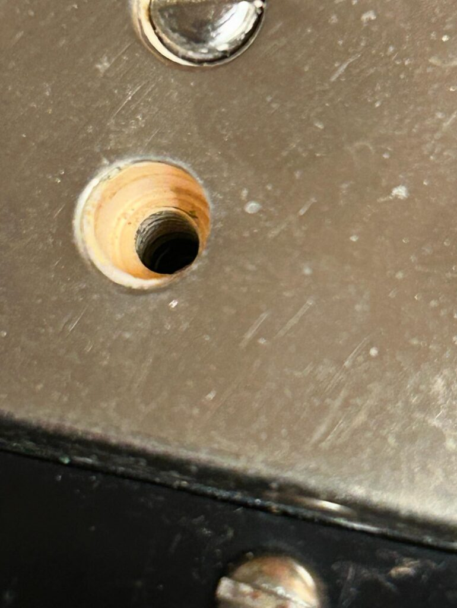

To verify the pedigree of this 1959 ES-335, we’ve carefully removed a single pole piece screw to reveal the highly coveted white butyrate bobbin underneath the original nickel cover. While “Double Whites” and “Zebras” are the holy grail for 1959-1960 collectors, we strongly advise against beginners attempting this check. These vintage bobbin leads are extremely fragile; one slipped screwdriver or over-turned screw can break a coil wire, potentially devaluing a $5,000+ pickup in seconds.

### How to Authenticate a 1959 PAF

Authenticating a six-figure ’59 ES-335 requires looking for specific “forensic” details on the pickups:

1.  **The Decal:** Look for the **“Patent Applied For”** decal on the baseplate. On an original, the “gold” lettering should have a slight metallic flake, and the “A” in “Applied” usually looks slightly different under a loupe compared to modern fakes.
2.  **Tooling Marks:** Genuine PAF baseplates have two small “L-shaped” tooling marks (indentations) on the mounting legs.
3.  **The “Circle in a Square”:** Looking at the bobbin holes where the wires enter, you should see a clear **“Circle-in-a-Square”** pattern in the plastic mold.
4.  **The Bobbin Screws:** Original screws used to hold the bobbins to the baseplate should be small, brass, and show era-appropriate oxidation.

> Note: DO NOT remove the metal pickup covers just to authenticate your pickup. You will hurt the value of your guitar!

While this specific pickup isn’t currently mounted in our featured ES-335, it serves as a perfect reference for what a legitimate 1959-spec ‘Patent Applied For’ humbucker should look like. Note the specific ‘L-shaped’ tooling marks on the mounting legs and the slightly yellowed edges of the ‘Patent Applied For’ decal. For any ES-335 from the Golden Era, these internal details are the difference between a standard vintage guitar and a top-tier collector piece.

<h2 id="markings-decoding">Markings: Decoding the “S” Code and the Orange Label</h2>

To the uninitiated, the numbers inside a 1959 ES-335 look like random bookkeeping. To a seasoned collector, they are the DNA of the instrument. In 1959, Gibson utilized a dual-identification system: the **Serial Number** (for the finished product) and the **Factory Order Number (FON)** (for the production batch). If you need more help with Gibson serial numbers, check out our **[Gibson Serial Number Decoder.](/how-to-read-gibson-serial-numbers/)**

### The Orange Oval Label: The “Birth Certificate”

Visible through the upper (bass-side) f-hole, the **Orange Oval Label** is the most recognizable internal marking of a Golden Era Gibson.

-   **The Serial Number:** For a 1959 ES-335, the serial number will typically fall within the **A28881 to A32285** range.
-   **The “A” Prefix:** The “A” stands for “Artist,” a prefix Gibson used for its high-end models from 1947 until early 1961.
-   **The Handwriting:** On an authentic ’59, the serial number and model name (“ES-335TD” or “ES-335TDN” for Natural) were handwritten in black ink. Over time, this ink can fade or “bleed” into the orange paper, a sign of genuine aging that is difficult to replicate with modern printers.

> Note: The serial number and FON can tell you the year, but if you want to know how rare your specific year, model and finish is, check out out [**Gibson Shipping Totals**](/post/gibson-shipping-totals-1948-1979/) guide.

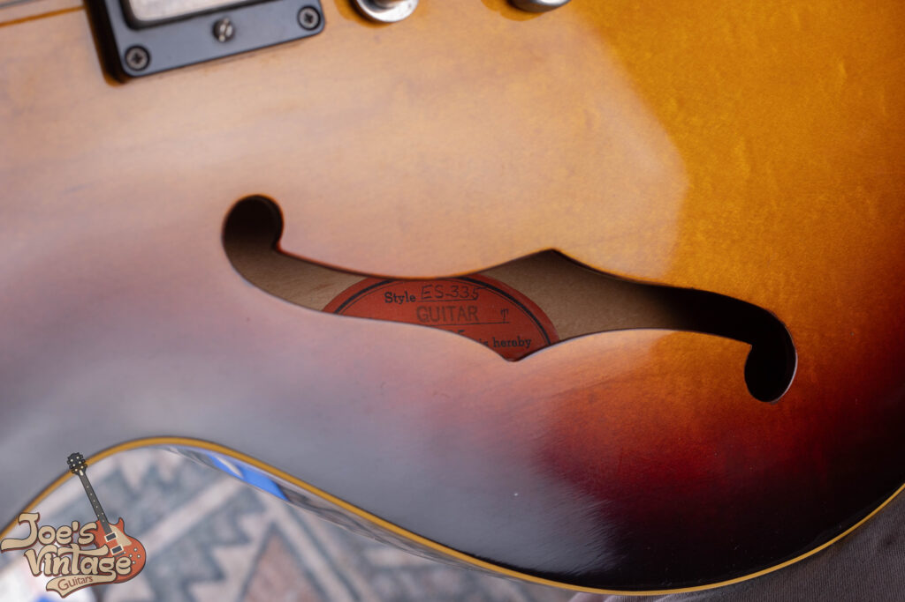

Visible through the bass-side f-hole, the orange oval label is a cornerstone for authenticating a 1959 ES-335. On an example this clean, the label remains bright and legible, lacking the heavy “tea-staining” or peeling often seen in guitars kept in humid environments. Note the “Union Made” text and the specific hand-inked serial number prefix, details that collectors and appraisers use to pinpoint the exact production month.

### The Factory Order Number (FON): The “S” Prefix

While the orange label was applied when the guitar was completed and ready to ship, the **Factory Order Number (FON)** was stamped onto the raw wood of the back *before* the guitar was even assembled. You can find this stamped in blue or black ink, visible through the lower (treble-side) f-hole.

-   **The 1959 “S” Code:** Gibson used a letter-prefix system to denote the year of production. For 1959, that letter is **“S”**.
    -   *Example:* An FON might look like **S 1234 5**.
    -   **S** = 1959 (1958 used “T”, 1960 used “R”).
    -   **1234** = The Batch Number (usually 3 or 4 digits).
    -   **5** = The Ranking Number (the specific guitar within that batch).
-   **The “Cross-Over” Rareity:** Occasionally, you may find a guitar with a 1958 “T” FON but a 1959 serial number. This indicates the body was built in late ’58 but didn’t leave the factory until 1959, often resulting in the desirable “Mickey Mouse” ears but perhaps a slightly thinner ’58-spec top.

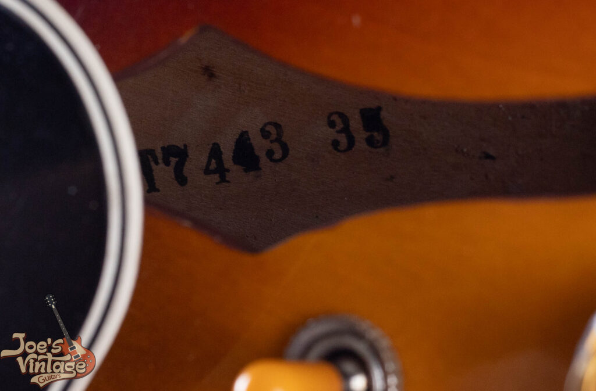

While this ES-335 was completed and shipped in 1959, the Factory Order Number (FON) stamped inside the body reveals it was actually started in late 1958. This is a critical distinction for tone purists: because of its 1958 origin, this guitar features the thinner three-ply maple top specification typical of the first-year 335s. This “transitional” combination of 1958 construction with the refined 1959 neck profile makes it one of the most resonant and sought-after variations in the history of the model.

### Authentication Tips: What to Look For

When verifying these markings, the “font” is everything. Gibson used specific rubber stamps and ink types that have a distinct “softness” to the edges.

-   **Ink Sink:** On a genuine ’59, the FON ink should look like it has “soaked” into the grain of the maple back over 60+ years. If the stamp looks sitting “on top” of the wood with razor-sharp edges, proceed with caution.
-   **The Label Glow:** Under a UV (Blacklight) test, an original orange label will not “glow” or fluoresce brightly like modern white paper. It should look dark and dull, as the paper lacks the chemical brighteners found in modern stocks.

<h2 id="plastics-knobs">The Finishing Touches: “Bonnet” Knobs and the Long Guard</h2>

The plastics of a 1959 ES-335 are not just cosmetic; they are specific parts of the era. For the 1959 model year, these components followed a “long-profile” aesthetic that was drastically shortened just a year later.

### The Knobs: Gold “Bonnet Knobs”

In 1959, Gibson used the classic “Bonnet” knobs.

-   **The Design:** These are made of clear butyrate plastic with gold paint sprayed into the underside.
-   **The “Glow”:** Because the paint is on the inside, the clear plastic top creates a “lens” effect, giving the gold a deep, metallic shimmer that modern translucent plastic replicas often fail to catch.
-   **No Inserts:** It is vital to note that 1959 knobs **do not** have the metal “Reflector” inserts on top. Those did not appear until mid-to-late 1960. A true ’59 should have a smooth, rounded, clear top.
-   **The Dial Indicators (Thumb Cutters):** Beneath the knobs, you will find the nickel-plated “pointers.” In 1959, these were quite sharp, leading many players to nickname them “thumb cutters.”

### The Pickguard: The “Long Guard” Era

The pickguard is one of the easiest ways to spot a 1959 ES-335 from across a room.

-   **Extended Length:** 1959 was the final full year of the **“Long Guard.”** This pickguard extends past the bridge and all the way down to the bridge pickup’s mounting ring.
-   **The 1960 Change:** In late 1960, Gibson shortened the design so that the guard ended between the two pickups. Therefore, a “Short Guard” on a 1959 model is a red flag for a replacement, or a very late-year transition piece.
-   **Material and Ply:** The guard is made of 5-ply (Black/White/Black/White/Black) celluloid nitrate.
-   **The “Wide Bevel”:** Authentic ’59 guards feature a very wide, steep bevel on the edge. Because they were hand-finished, you can often see subtle chatter marks from the scraping tool along the white layers of the bevel.

> **Tip:** If you’d like to compare the long vs. short pickguards and the reflector vs. bonnet knobs, compare this 1959 ES-335 to **[this 1962 Gibson ES-335](/post/1962-gibson-es-335-guide/)**

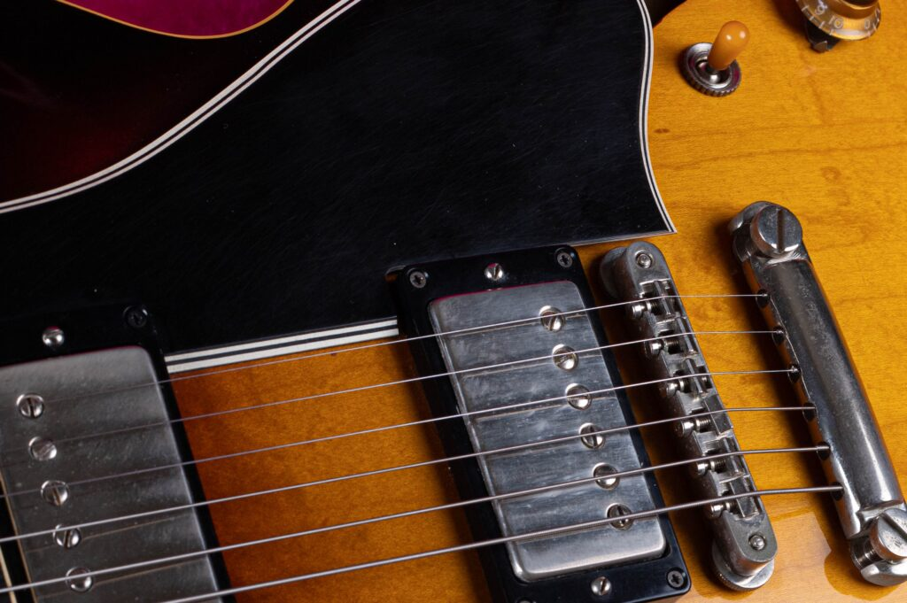

One of the most striking features of this 1959 ES-335 is the original “long” pickguard. This specific style was used from the model’s debut in 1958 until early 1961, and is easily identified by the way the plastic extends significantly past the bridge toward the tailpiece. Collectors highly prize the long guard for its classic silhouette and historical accuracy.  
Want to see the difference for yourself? Scroll down a little bit and click on our 1962 ES-335 link if you’d like to compare the short and long pickguards side-by-side to help identify your own guitar.

### The Switch Tip: The “Catalin” Amber

The toggle switch tip on a 1959 ES-335 is another telling detail.

-   **Material:** These were made of **Catalin** (a brand of thermosetting polymer).
-   **The Color:** While they started out off-white, Catalin reacts to UV light and oxygen by turning a deep, rich **amber or “butterscotch” color**.
-   **The Seam:** Genuine 1959 tips will show a very faint mold seam running across the top. Modern “aged” tips often lack this or have a seam that is too pronounced.

<h2 id="case-identification">The Case: “Stone” vs. Lifton</h2>

The final piece of the 1959 puzzle isn’t the guitar itself, but the “home” it lived in for the last 60+ years. In 1959, Gibson utilized two primary suppliers for their high-end hardshell cases: **Lifton** and **Stone**. While they are visually very similar, knowing the mechanical differences is key for a collector’s inventory.

### Shared Aesthetics: Brown and Pink

At a glance, these cases are often indistinguishable because they share the iconic **“California Girl”** color palette:

-   **Exterior:** A dark brown, faux-leather covering.
-   **Interior:** A vibrant, plush **pink “hot magenta”** crushed velvet lining.
-   **The Logo:** Both manufacturers typically placed their brand logo inside the case (often on the accessory pocket lid).

The brass Lifton badge is not just a logo. It’s a hallmark of the “Golden Era.” For a 1959 ES-335, the presence of an original Lifton “California Girl” case (so named for its brown exterior and bright pink interior) can add significant value to the overall package. This badge, featuring the famous “Built Like a Fortress” tagline, confirms that the guitar has been shielded by the industry standard of the 1950s. When we evaluate a vintage Gibson at Joe’s Vintage Guitars, the condition of this badge and the case’s internal plush lining are key factors in our top-dollar offers.

While the Lifton is often the first thing people think of, many 1959 ES-335s were originally paired with these high-quality Stone cases. This original metal logo plate from the Stone Case Co. of Brooklyn, N.Y., is a hallmark of authenticity. At Joe’s Vintage Guitars, we pay close attention to these original accessories because they significantly increase the historical and market value of a ’59 Dot Neck.

### Spotting the “Stone” Case

While not necessarily rarer than the Lifton, the **Stone Case Company** (of Brooklyn) version has a distinct build quality that sets it apart if you know where to look.

-   **The Latch System:** The most reliable way to identify a Stone case is the hardware. They typically feature a **spring-loaded, briefcase-style main latch**. When you slide the button, the latch “pops” open with a mechanical snap.
-   **The Value:** A 1959 ES-335 paired with a Stone case is considered a highly desirable, period-correct historical pairing that collectors value just as highly as the Lifton.

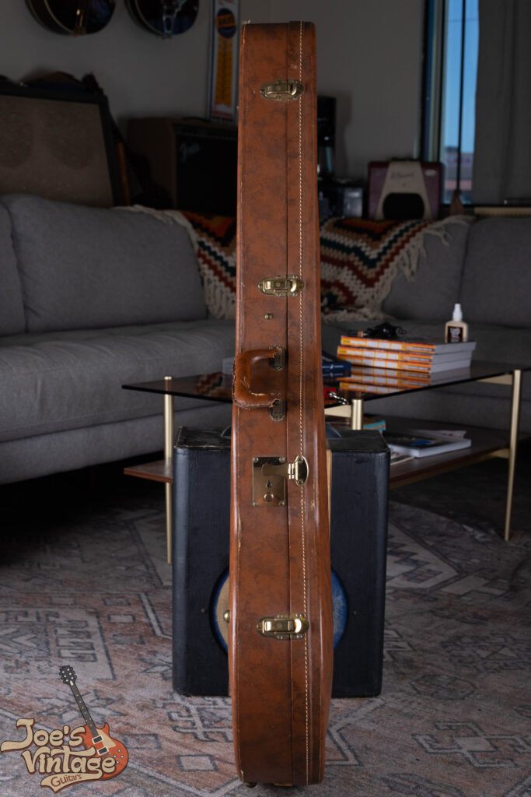

While many 1959 ES-335s shipped in Lifton cases, the Stone Case Co. examples are equally iconic and rugged. A defining feature of these cases is the spring-loaded, briefcase-style latch shown here. Unlike the standard flip-latches seen on later models, these provide a satisfying mechanical ‘snap’ that is synonymous with late-50s Gibson protection. Finding these latches fully functional and without heavy corrosion is a clear sign that the instrument inside has been stored in a dry, safe environment for decades.

### The Lifton Case

The **Lifton** brand is the name most synonymous with the 1950s Gibson era, famous for their “Built Like a Fortress” marketing.

-   **The Latch System:** Unlike the spring-loaded Stone hardware, a Lifton case usually features **standard mechanical flip-latches**. These require you to manually lift the loop off the catch.
-   **The Build:** Lifton cases are known for their specific arched-top profile and are often slightly heavier than the Stone counterparts.

### Key Authentication Markers for 1959 Cases

Regardless of the manufacturer, a genuine 1959 case should show specific signs of “honest” aging:

-   **The Handle:** Original 1959 handles were made of **stitched leather** over a metal core. A plastic handle usually indicates a later 1960s replacement.
-   **The “GHOST” Imprint:** On a genuine vintage case, you will often see “imprints” of the guitar’s ABR-1 bridge and tuners pressed into the lid’s pink lining, a physical record of the instrument’s life.

> Note: Gibson used the same color scheme and construction for many different cases. To see an example of a Lifton case, but for a Les Paul, check out our [**1957 Gibson Les Paul Goldtop guide.**](/post/1957-les-paul-goldtop-guide/)

<h2 id="notable-players">Notable Players: The Architects of the 335 Sound</h2>

The 1959 Gibson ES-335 isn’t just a museum piece; it is the engine behind some of the most influential recordings in music history. While many players use 335s, a select few are synonymous with the specific power and “bloom” of the 1959 model.

### Larry Carlton: “Mr. 335”

If Clapton proved the 335 could rock, Larry Carlton proved it could do everything else.

-   **The Fusion Master:** Carlton’s 1969 model is his most famous, but he is the world’s leading ambassador for the 335 platform, frequently utilizing ’59-spec instruments for their superior “snap” and note separation.
-   **The “Room 335” Tone:** His playing on Steely Dan’s *The Royal Scam* and his solo work showcased the ’59’s ability to be sophisticated, jazzy, and biting all at once.

### Warren Haynes: The Modern Torchbearer

A master of slide and soulful blues-rock, Warren Haynes (Gov’t Mule, Allman Brothers Band) is a dedicated devotee of the 1959 dot-neck.

-   **The “Live” Factor:** Haynes relies on the 1959 profile for its sustain. Because the ’59 has that thicker 4-ply top and solid center block, it allows him to hold notes indefinitely at stage volumes, a hallmark of his “singing” lead style.

### Other Essential ’59 Disciples

-   **Otis Rush:** A pioneer of the West Side Chicago blues sound, Rush’s use of a 1959 ES-335 (often played left-handed and upside down) created a piercing, soulful vibrato that influenced everyone from Peter Green to Stevie Ray Vaughan.
-   **Dave Grohl:** While he is famous for his Trini Lopez signature (which is based on the 335 shape), Grohl frequently uses vintage ’58 and ’59 335s in the studio for their structural stability and “thick” harmonic content.

## Ready to Learn the True Value of Your Vintage Gibson?

Whether you are holding a museum-grade **1959 Gibson ES-335** with original “mummified” tuners or a well-loved player’s piece, understanding the specific “Golden Era” details is the first step in protecting your investment. At **Joe’s Vintage Guitars**, we don’t just buy and sell instruments; we preserve the history of the “Dot Neck” era.

If you are looking for a transparent, expert evaluation for your instrument, please visit my **[Sell My Gibson Guitar](/sell-my-gibson-guitar/)** page to see how I offer top-market value without the stress of auctions. You can also learn more about my lifelong passion for these instruments on my **[About Me](/about-me/)** page. If you have questions about a specific serial number, FON, or part, don’t hesitate to **[Contact Me](/contact-me/)** directly. I am always happy to chat about vintage gear and help you navigate the process with total confidence.
