<nav class="es355-nav-sidebar" id="es355NavSidebar" aria-label="Article section navigation">
  
<strong>ES-355 Guide</strong>

  <a href="#" onclick="window.scrollTo({top:0,behavior:'smooth'});return false;" class="es355-nav-link top">&uarr; Top of Page</a>
  
The Guitar

  <a href="#es355-what" class="es355-nav-link">The Short Version</a>
  <a href="#es355-lineup" class="es355-nav-link">Flagship of the 335 Family</a>
  <a href="#es355-mono-stereo" class="es355-nav-link">Mono or Stereo</a>
  <a href="#es355-body" class="es355-nav-link">The Body</a>
  <a href="#es355-neck" class="es355-nav-link">Neck, Ebony &amp; Split-Diamond</a>
  <a href="#es355-electronics" class="es355-nav-link">Gold-Cover PAFs</a>
  <a href="#es355-hardware" class="es355-nav-link">Bigsby, Grovers &amp; Gold</a>
  <a href="#es355-finish" class="es355-nav-link">Cherry &amp; Honest Wear</a>
  <a href="#es355-timeline" class="es355-nav-link">Year by Year</a>
  <a href="#es355-players" class="es355-nav-link">Who Played One</a>
  
Dating &amp; Authentication

  <a href="#es355-dating" class="es355-nav-link">Dating Your ES-355</a>
  <a href="#es355-authenticate" class="es355-nav-link">Reading One Like a Dealer</a>
  <a href="#es355-mods" class="es355-nav-link">Mods and Red Flags</a>
  <a href="#es355-checklist" class="es355-nav-link">The Checklist</a>
  
Value

  <a href="#es355-value" class="es355-nav-link">What It Is Worth</a>
  <a href="#es355-selling" class="es355-nav-link">Thinking of Selling</a>
  <a href="#es355-faq" class="es355-nav-link">FAQ</a>
</nav>

<button class="es355-nav-btn" id="es355NavBtn" onclick="toggleEs355Nav()" aria-expanded="false" aria-controls="es355NavPanel" type="button">
  &#9776; Jump To Section
</button>

  
<strong>ES-355 Guide</strong>

  <a href="#" onclick="window.scrollTo({top:0,behavior:'smooth'});closeEs355Nav();return false;" class="es355-nav-link top">&uarr; Top of Page</a>
  
The Guitar

  <a href="#es355-what" onclick="closeEs355Nav()" class="es355-nav-link">The Short Version</a>
  <a href="#es355-lineup" onclick="closeEs355Nav()" class="es355-nav-link">Flagship of the 335 Family</a>
  <a href="#es355-mono-stereo" onclick="closeEs355Nav()" class="es355-nav-link">Mono or Stereo</a>
  <a href="#es355-body" onclick="closeEs355Nav()" class="es355-nav-link">The Body</a>
  <a href="#es355-neck" onclick="closeEs355Nav()" class="es355-nav-link">Neck, Ebony &amp; Split-Diamond</a>
  <a href="#es355-electronics" onclick="closeEs355Nav()" class="es355-nav-link">Gold-Cover PAFs</a>
  <a href="#es355-hardware" onclick="closeEs355Nav()" class="es355-nav-link">Bigsby, Grovers &amp; Gold</a>
  <a href="#es355-finish" onclick="closeEs355Nav()" class="es355-nav-link">Cherry &amp; Honest Wear</a>
  <a href="#es355-timeline" onclick="closeEs355Nav()" class="es355-nav-link">Year by Year</a>
  <a href="#es355-players" onclick="closeEs355Nav()" class="es355-nav-link">Who Played One</a>
  
Dating &amp; Authentication

  <a href="#es355-dating" onclick="closeEs355Nav()" class="es355-nav-link">Dating Your ES-355</a>
  <a href="#es355-authenticate" onclick="closeEs355Nav()" class="es355-nav-link">Reading One Like a Dealer</a>
  <a href="#es355-mods" onclick="closeEs355Nav()" class="es355-nav-link">Mods and Red Flags</a>
  <a href="#es355-checklist" onclick="closeEs355Nav()" class="es355-nav-link">The Checklist</a>
  
Value

  <a href="#es355-value" onclick="closeEs355Nav()" class="es355-nav-link">What It Is Worth</a>
  <a href="#es355-selling" onclick="closeEs355Nav()" class="es355-nav-link">Thinking of Selling</a>
  <a href="#es355-faq" onclick="closeEs355Nav()" class="es355-nav-link">FAQ</a>

<h2 id="es355-what">The Short Version</h2>

The Gibson ES-355 was the top of the thinline mountain. When Gibson introduced the semi-hollow ES-335 in 1958 it started a whole family, and the ES-355 sat at the very top of it, above the mid-line ES-345 and well above the plain 335. It has the same double-cutaway body and the same solid maple center block, but it is dressed like a Les Paul Custom: an ebony fingerboard with pearl block inlays, a split-diamond headstock, gold hardware everywhere, multi-ply binding, cherry red finish, and a Bigsby vibrato standard. In 1959 it cost about 550 dollars, which was roughly double the price of a base ES-335.

At Joe's Vintage Guitars we buy and sell these guitars, and a clean 1959 355 is one of my favorite things to get on the bench. This guide is the same walk-through I do in the shop: where the 355 came from, the single most important thing to understand about it (whether it is mono or stereo), how I date one, how I tell an original from a modified one, and what a 1959 is really worth. The photos throughout are a real 1959 ES-355 from our shop, a cherry mono model with its factory Bigsby, and I will point out its details as we go, including a couple of honest notes about it.

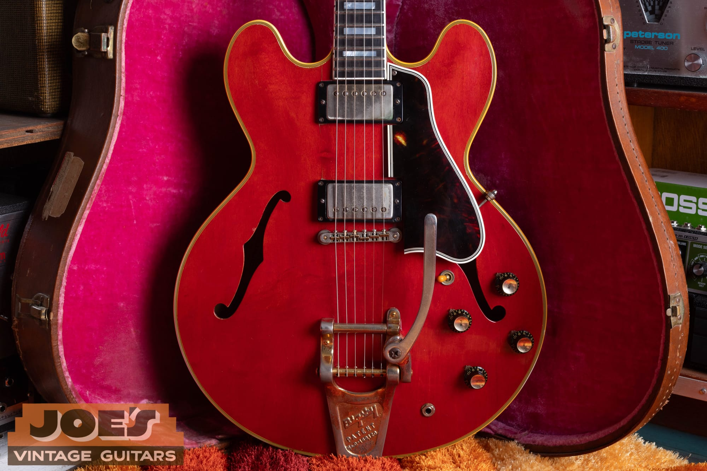

Our 1959 ES-355. This is the mono version, with two volumes and two tones and no Vari-tone switch, and the gold Bigsby that was standard on a 355 in 1959. The gold plating has worn down to bare brass in the places a hand and a strap touch it, which is exactly what six decades of honest playing looks like.

<h2 id="es355-lineup">The Flagship of the 335 Family</h2>

To understand the 355 you have to picture the family it belongs to. In 1958 Ted McCarty and his team at Gibson introduced the ES-335, and the idea behind it was clever: put a solid block of maple down the center of a thin, hollow body. The block fights the feedback that plagued full hollowbodies at volume, while the hollow wings on either side keep some of the warmth and bloom of an archtop. It was a new kind of guitar, neither solid nor hollow, and it became one of the most successful designs Gibson ever made.

Gibson quickly built a three-model ladder on that body. The **ES-335** was the workingman's version, with a rosewood board, dot inlays, single-ply binding, and nickel hardware. The **ES-345**, from spring 1959, added split-parallelogram inlays, gold hardware, and Gibson's new stereo and Vari-tone electronics. The **ES-355** sat on top of both. It got the ebony board and pearl blocks, the split-diamond headstock inlay shared with the Les Paul Custom and the Super 400, gold hardware, the fanciest multi-ply binding of the three, a Bigsby, and cherry red as its standard color.

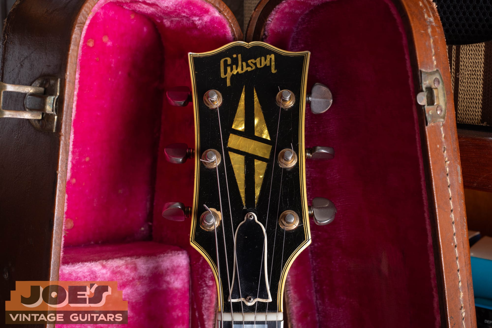

The fastest way to know you are looking at a 355 and not a 335 or 345 is the headstock. The 335 and 345 wear a simple pearl crown. The 355 gets this five-piece split-diamond inlay and a pearl Gibson logo on a black, multi-bound headstock, the same top-tier peghead Gibson used on its most expensive guitars.

A quick word on the dates, because people state them sloppily. The very first ES-355s shipped in 1958, only about ten of them, all mono. The model reached full production and its catalog debut in 1959. So a 1959 355 is a genuine first-generation instrument, and it arrived slightly ahead of the mid-tier 345. It was a low-production luxury item from the start. Where the 335 sold in the thousands, the 355 sold in the low hundreds. If you want to see the plainer, and today more valuable, sister model, our [1959 Gibson ES-335 authentication guide](/post/1959-gibson-es-335-authentication-guide/) is the companion to this one, and it is worth reading both side by side.

<h2 id="es355-mono-stereo">Mono or Stereo, and Why It Matters</h2>

Here is the single most important thing to understand about any ES-355, and the thing that most affects how it plays and what it is worth: it was built in two very different electronic versions.

The **ES-355TD** is the mono version. Two humbuckers, two volumes, two tones, a three-way toggle, one output jack. Its wiring is identical to an ES-335. It is simple, quiet, and it sounds like what you expect a great semi-hollow to sound like.

The **ES-355TD-SV** is the Stereo Vari-tone version, and it was the standard catalog spec. The two pickups are wired to separate channels and sent out in stereo through a Y-cord to two amplifiers. On top of that it carries the **Vari-tone**, a six-position rotary switch mounted up on the treble bout next to the toggle. Position one is a straight bypass, and positions two through six are notch filters, each scooping a different band of midrange using a bank of capacitors and a large choke, or inductor, mounted inside the body under the lead pickup. Gibson marketed it as a world of tones at your fingertips.

In practice a lot of players never warmed to it. The Vari-tone notches thin the sound out, the stereo rig is a hassle, and many owners simply left the switch on position one or had the whole system disconnected. That reaction matters, because it is the reason a mono 355 is the more desirable guitar today. A mono 355 is, in effect, a dressed-up 335: the beautiful body and gold cosmetics, with clean and simple wiring that players actually want.

Our guitar is a mono ES-355TD. You can count it on the front: four knobs down on the lower bout, two volumes and two tones, and a toggle, with no Vari-tone rotary and no choke inside. Here is a fact that surprises people. Even though stereo was the standard catalog spec, in 1959 the mono version actually outsold it, roughly 177 mono guitars to 123 stereo. Mono did not become genuinely scarce until around 1961. So a 1959 mono 355 is both a first-year guitar and the configuration most players reach for. If you have ever wondered why a "fancier" stereo guitar can be worth less than a plain one, this is the beginning of that story, and I finish it down in the value section.

<h2 id="es355-body">The Body: A Multi-Bound Thinline</h2>

The 355 body is the same basic architecture as the rest of the family. It is a thinline, about one and three-quarter inches deep at the rim, sixteen inches across, built from laminated maple with a solid maple block running from the neck joint to the tailblock. The double cutaways of this era have the rounded, bulbous horns that collectors nickname **"Mickey Mouse ears."** Those ears got less rounded and more pointed as the 1960s went on, so the full, round horns are a first-generation tell.

What separates the 355 from the 335 at the body is the dress. The 335 wears a single-ply binding. The 355 wears the fanciest binding of the three models, a multi-ply stack on the top that is commonly described as seven-ply, with bound back and, importantly, **bound f-holes**. A plain 335 has unbound f-holes. When you see a cream line tracing the edge of each f-hole, you are looking at a 345 or a 355.

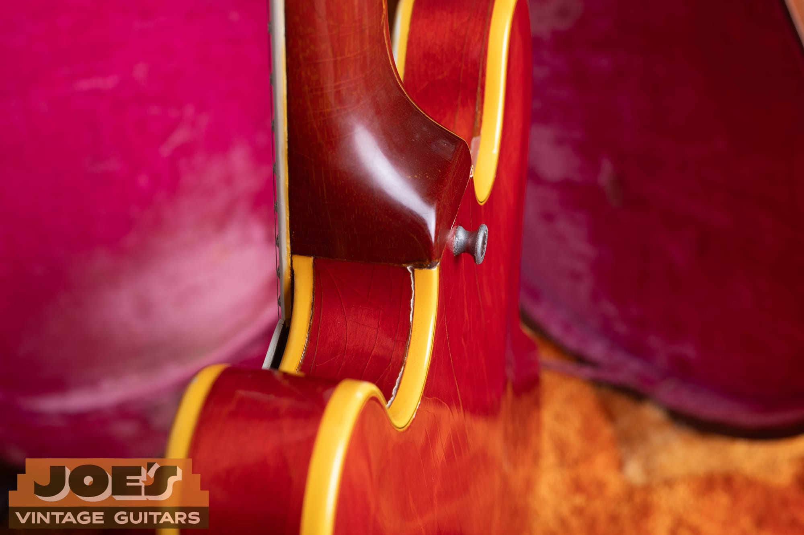

The multi-ply binding on the cutaway of our 355. Count the layers: a thick cream outer strip, then a stack of black and white lines. This is the sort of detail Gibson reserved for its top instruments, and it is one of the quickest ways to separate a 355 from a plain 335 even from across the room.

That thin, hollow-winged body over a solid center block is where the sound comes from. The block gives the guitar sustain and tightness closer to a Les Paul, while the hollow wings add air and a woody bloom you cannot get from a slab of solid wood. It is a versatile voice, at home in blues, jazz, R&B, and rock, which is a big part of why the design has never gone out of style.

<h2 id="es355-neck">The Neck, the Ebony Board, and the Split-Diamond</h2>

The 355 neck is a one-piece mahogany neck with a long tenon that extends under the neck pickup, a build detail of the good early years. The 1959 profile is a substantial, rounded handful, the fat neck era before Gibson slimmed things down heading into 1960. Nut width is the standard one and eleven-sixteenths inches, and the scale is the usual Gibson twenty-four and three-quarters.

The fingerboard is where the 355 shows its class. Where the 335 and 345 use rosewood, the 355 uses **ebony**, a dense, jet-black board, with **large pearl block inlays** running its length. Unlike the 335, which started with dots and only moved to blocks in 1962, the 355 wore blocks from the very first guitar. There is no dot-neck 355 to hunt for; if it is a real 355, it has blocks and an ebony board.

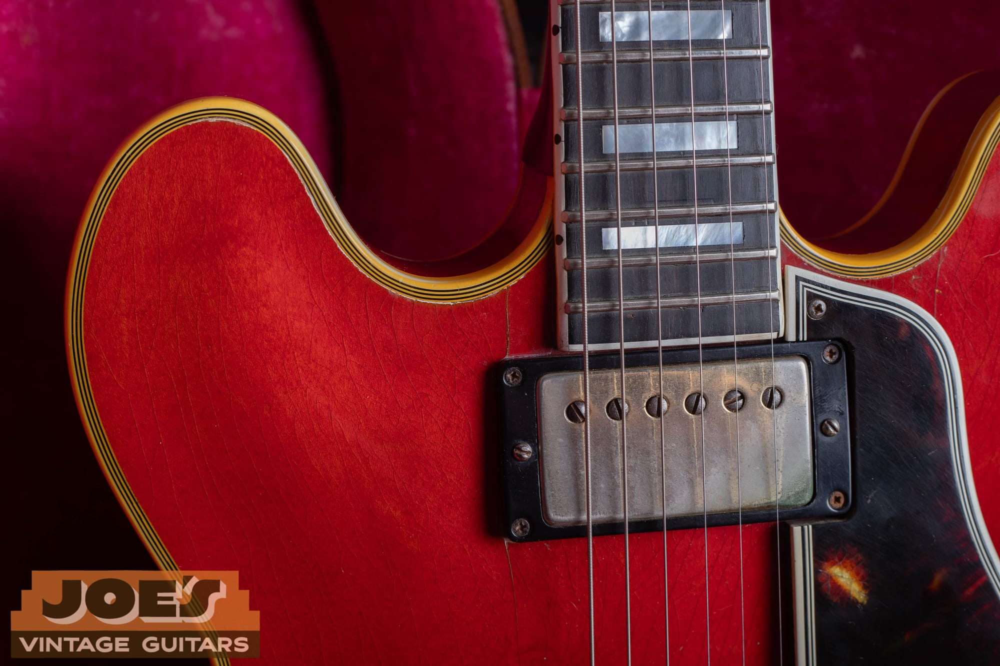

The ebony board and pearl blocks of our 1959, with the bound edge and small side dots in the binding. Ebony and blocks, together with the split-diamond headstock and gold hardware, are the package that says top of the line.

Up at the headstock you get the split-diamond pearl inlay we already looked at, plus the multi-ply binding around a black face. The truss rod cover on our guitar is the plain black bell shape of the era. All of it, the ebony, the blocks, the split-diamond, and the gold, is borrowed from Gibson's most expensive instruments, and it is what you are paying the premium for over a 335.

<h2 id="es355-electronics">Gold-Cover PAF Humbuckers</h2>

A 1959 ES-355 carries two of Gibson's **PAF humbuckers**, the Patent Applied For pickup that made the late-1950s Les Paul a legend, here with **gold-plated covers** to match the rest of the hardware. These are the same sought-after pickups whether they sit in a Les Paul, a 335, or a 355, and they are a huge part of what a Golden Era Gibson is about: a rich, three-dimensional voice that is warm and cutting at the same time.

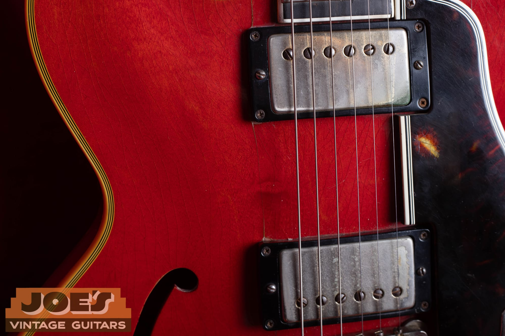

The two humbuckers on our 355. These left the factory with gold covers, and you can see the gold has worn through to the nickel underneath, with a little green patina at the edges. That is what an honest, played PAF cover looks like after sixty-five years. The covers are on, and they are staying on, which brings me to the single most important rule with these pickups.

Do not pull the covers to see the bobbins. I know the temptation. Everyone wants to know if there is a coveted "double white" or "zebra" bobbin underneath, and a 1959 can legitimately have black, zebra, or double-white bobbins because Gibson ran short of black bobbin material from about spring 1959 into 1960. But the leads on these vintage coils are fragile, and one slip of a screwdriver can kill a pickup that is worth thousands of dollars. If you must check, a careful peek through an empty mounting-screw hole tells you a lot without touching the cover. For the full walk-through of PAF construction, decals, magnets, and how to spot a fake, our [Gibson PAF and Patent Number pickup guide](/post/gibson-paf-patent-number-pickup-guide/) is the companion to this section.

One more thing to know, because it comes up on later 355s: gold-cover PAF stock lasted a long time on the low-volume gold-hardware models. Gibson switched most guitars from the PAF decal to a Patent Number decal in mid-to-late 1962, but documented factory PAFs show up on 345s and 355s as late as 1964 and 1965. On a genuine 1959, though, you should simply see two PAFs.

<h2 id="es355-hardware">The Bigsby, the Grovers, and the Gold</h2>

The tailpiece is the heart of 355 authentication, so slow down here. In 1959 the 355 came standard with a **Bigsby vibrato**, the long-arm, gold-plated unit. This is the opposite of most Gibsons, where a Bigsby is usually an aftermarket add. On a 1959 355 the Bigsby is correct and expected. A factory stop-tail 355 does exist, but it is a special-order rarity, with fewer than a handful known from 1959, and it is actually worth more than a Bigsby guitar precisely because it is so unusual. Our guitar wears its genuine gold Bigsby, stamped with the Bigsby logo and the patent number, worn down to brass from decades of a picking hand resting on it. There is no "Custom Made" plaque on the top, the plate Gibson used to cover the stop-tail stud holes on Bigsby guitars, which largely became standard around 1961, so a clean early Bigsby 355 like this one often has no plaque at all.

The tuners are another 355 tell. Where the 335 used Kluson tuners, the deluxe 355 used gold **Grover Rotomatics**, and ours has them, with the gold worn thin and the wear matching the rest of the hardware. Gibson stayed with gold Grovers on the 355 until about 1963, when it switched to gold ribbed-back Klusons. The bridge is a gold **ABR-1 Tune-o-matic**, and on a 1959 it is the "no-wire" style, without the little retaining wire across the saddles that Gibson added a few years later.

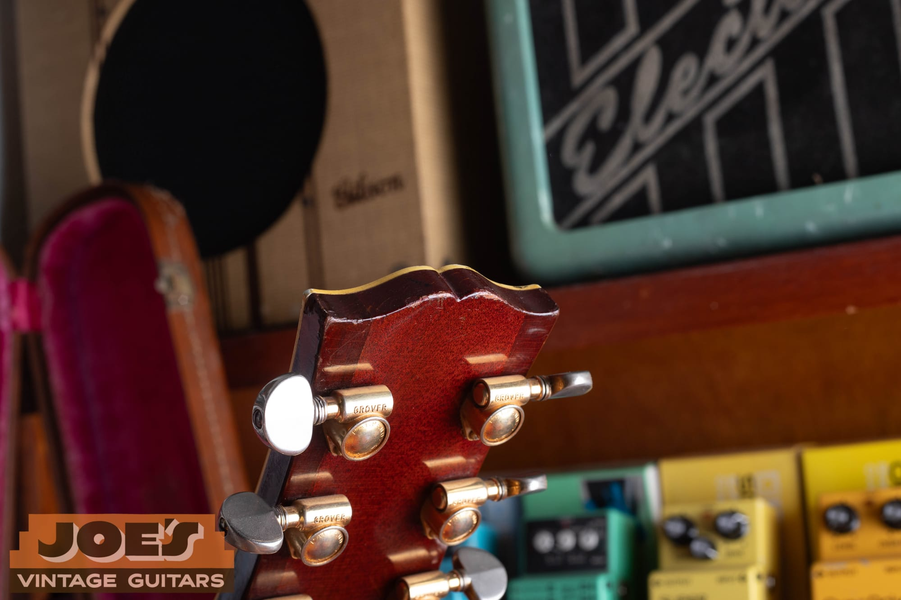

The gold Grover Rotomatic tuners on our 355, with GROVER stamped across the backs and the gold worn thin. The deluxe 355 used gold Grovers where the plain 335 used Klusons, and the even wear here, matching the rest of the hardware, is a good sign they have been on this guitar a very long time.

I will give you one honest note about our guitar here. The knobs are black reflector knobs, the kind with a metal reflector cap in the top. Reflector knobs became standard around 1960. A 1959 should wear plain bonnet knobs without the reflector, so on this guitar the knobs read a hair later than the rest of it. Knobs are one of the most-swapped parts on any old Gibson, so this is most likely a simple, long-ago knob change, and it is the kind of small, honest detail I would rather point out than paper over. The amber switch tip, by contrast, is the correct period Catalin.

<h2 id="es355-finish">Cherry Red and Honest Wear</h2>

Cherry red was the standard finish on the 355, and in 1958 and 1959 it was essentially the only regular color. Gibson did not add sunburst and natural as catalog options until 1960, which makes a 1959 355 in any color other than cherry a genuine rarity, only a handful of blondes and a couple of black ones are known from the era.

The cherry Gibson used is an aniline dye, and it ages in a very particular way. Under years of light it fades from a deep red toward a browner, washed-out "watermelon" red, and it fades unevenly, staying darker under the pickguard and the tailpiece where the light never reached. That uneven fade, along with fine lacquer checking, is one of the best signs that a finish is original and not a respray.

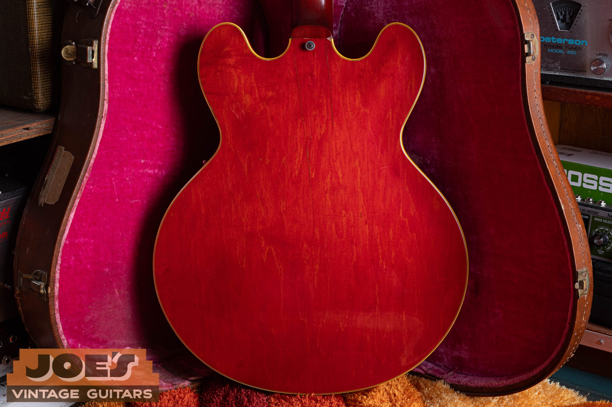

The back of our 355. The cherry has that honest, aged look, with a web of fine checking across the finish and the wear you expect on a guitar that was played and not put under glass. Original finish in this kind of honest, un-messed-with condition is worth protecting, because once a real finish is sprayed over, it does not come back.

<h2 id="es355-timeline">Year by Year, 1958 to 1965</h2>

The 355 changed steadily through the good years. Knowing roughly when each change happened lets you sanity-check a guitar in a couple of minutes.

- **1958:** Model launches, only about ten guitars, all mono. Cherry, gold hardware, ebony board and blocks, split-diamond headstock, Bigsby, PAFs with gold covers, gold Grover tuners, big neck, long pickguard, bonnet knobs.
- **1959:** Full production. The Stereo Vari-tone ES-355TD-SV arrives alongside the mono model, and mono actually outships stereo this year. Still the fat 1959 neck, PAFs, Bigsby, gold Grovers, cherry only.
- **1960:** The neck slims down. The pickguard shortens so it no longer runs past the bridge. Sunburst and natural are added as options. Bonnet knobs give way to reflector knobs. The sideways Vibrola starts appearing as an option.
- **1961:** The sideways Vibrola largely replaces the Bigsby as standard. Mono becomes genuinely scarce as stereo takes over. The A-prefix serial system ends in February, and serial numbers move to an impressed stamp on the back of the headstock. The "Custom Made" plaque convention over the stud holes is standard now.
- **1962:** Slimmer necks. The PAF decal begins giving way to the Patent Number decal on most models, though gold-cover PAFs linger on the 345 and 355.
- **1963:** The Maestro lyre Vibrola, with its engraved coverplate, replaces the sideways unit. Gold Grover tuners give way to gold ribbed-back Klusons.
- **1964 to 1965:** The cutaway horns lose their round Mickey Mouse shape. Patent Number pickups are standard, though gold PAF stock is documented this late on the 355. In 1965 the nut narrows from one and eleven-sixteenths to a slimmer one and nine-sixteenths, the change that marks the end of the most desirable vintage era.

<h2 id="es355-players">Who Played One</h2>

The name most tied to the ES-355 is **B.B. King**, and the story is worth getting right. King named his guitars "Lucille" after a 1949 fire in a Twist, Arkansas dance hall, which had started when two men fought over a woman by that name. He ran back into the burning building for his thirty-dollar Gibson, and every guitar after that was a Lucille. His guitars changed over the years, from a Fender and an early Gibson up through 335s and 345s, but he settled on the ES-355 through the 1960s, and it became his signature look. Gibson's official B.B. King Lucille, introduced in 1980, was based on the stereo Vari-tone 355, with two changes King asked for: no f-holes to fight feedback, and a maple neck.

**Chuck Berry** is the other giant associated with the 355. A cherry 355 was his lifelong stage guitar, and he was buried with one in 2017. One honest correction, though, since it comes up: his foundational 1950s Chess recordings like "Johnny B. Goode" were cut on an earlier Gibson ES-350T, not a 355. He moved to the 355 later and stayed with it. **Keith Richards** played a black 355 in the early-to-mid 1960s Rolling Stones, and famously played Chuck Berry's own 355 in the film *Hail! Hail! Rock 'n' Roll*. Beyond those, the 355 shows up in the hands of players across the map, from bluesmen like **Freddie King** and **Otis Rush** to **Alex Lifeson**, **Johnny Marr**, **Noel Gallagher**, and **Gary Moore**. One name to keep off the list is Alvin Lee, whose famous "Big Red" is a 335, not a 355.

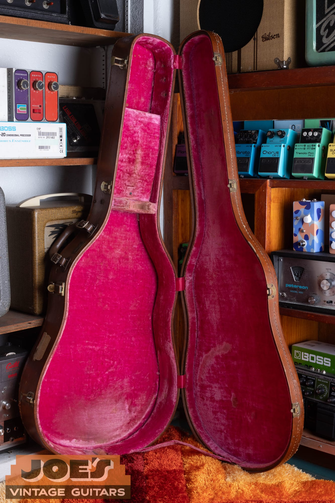

Our 1959 in its case. This is the guitar B.B. King made famous and Chuck Berry took to the stage for fifty years, and a clean first-generation example still carries all of that history with it.

<h2 id="es355-dating">Dating Your ES-355</h2>

Dating a 1959 355 is where a lot of people go wrong, so let me be exact about it.

On a 1958, 1959, or 1960 thinline, the serial number lives in **one place only: the orange oval label** inside the body, readable through the bass-side f-hole, with the serial and the model name hand-inked in black. There is **no serial stamped on the back of the headstock on a 1959.** That headstock stamp did not start until 1961. If someone tells you to read a 1959's serial off the back of the peghead, they are describing a 1961 or later guitar. Get this one right and you are ahead of most people looking at these.

The 1959 serials run roughly from **A-28881 to about A-32284**, an A followed by five digits. That A-number was shared sequentially across all of Gibson's upper-line hollowbodies of the era, so a 1959 355 can carry a number very close to a 1959 L-5 or Super 400. The ranges overlap a little at the year boundaries, so treat them as a guide, not a stopwatch. For the full breakdown and a lookup, see our [Gibson serial number guide](/how-to-read-gibson-serial-numbers/).

There is a second number, the **Factory Order Number**, or FON, stamped in ink inside the body near the treble f-hole. It uses a letter for the year, counting down, so **S is 1959** (T was 1958, R was 1960, Q was 1961). The FON was stamped on the raw wood before assembly, so it is applied earlier than the serial, and it is completely normal for a 1959-serial guitar to carry a 1958 "T" FON. When the two disagree, go by the serial number and just describe both. If you want to know how rare your specific year and configuration is, our [Gibson shipping totals](/post/gibson-shipping-totals-1948-1979/) guide has the production numbers.

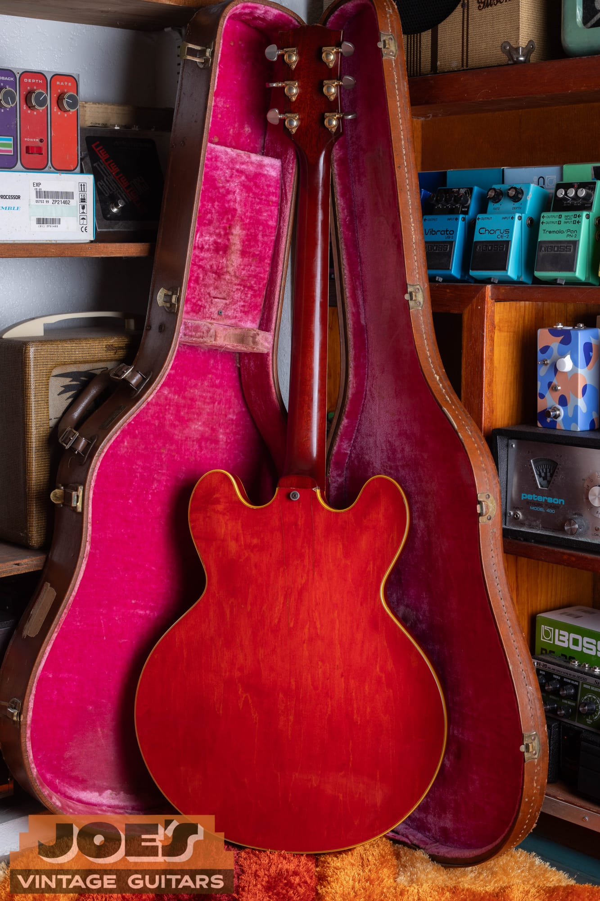

The back of our guitar's neck and headstock. Note the plain transition from neck to headstock with no volute, the small carved ridge Gibson added in 1969. No volute is one more quick confirmation that you are looking at a 1960s-or-earlier neck and not a later one.

<h2 id="es355-authenticate">Reading One Like a Dealer</h2>

When a 355 comes across my bench, I read it the same way every time, working from the easy checks to the hard ones. Here is that walk-through.

Start with the model identity. Ebony board, pearl blocks, split-diamond headstock, gold hardware, bound f-holes, multi-ply binding. Miss any of those and you may be looking at a 345, a 335, or a converted guitar rather than a 355. Then confirm the era with the features: rounded Mickey Mouse ears, a long pickguard that runs past the bridge, a big neck, and gold Grover tuners all say late fifties.

Next, sort out mono versus stereo, because it changes both the guitar and its value. Four knobs and a toggle with no rotary switch is a mono ES-355TD. A six-position rotary knob up on the treble bout, a stereo output jack, and a heavy choke mounted inside the body under the lead pickup is a stereo ES-355TD-SV. If the guitar has an empty rotary hole, a dead switch, or a mono jack where a stereo one should be, you may be looking at a stereo guitar that was converted to mono, which I cover in the next section.

Then check the tailpiece story carefully. A Bigsby is correct for a 1959. If the guitar has a stop-tailpiece, look hard, because a real factory stop-tail 355 is a rare and valuable thing, but a Bigsby that was removed and replaced with a stop-tail to chase 335 money is a fake upgrade, and the giveaway is filled Bigsby screw holes near the tail. If there is a "Custom Made" plaque, that is normal on a Bigsby guitar and it covers the stop-tail stud holes underneath, though on a pure 1959 you will often find no plaque and either no stud holes or just two tiny locating pin holes.

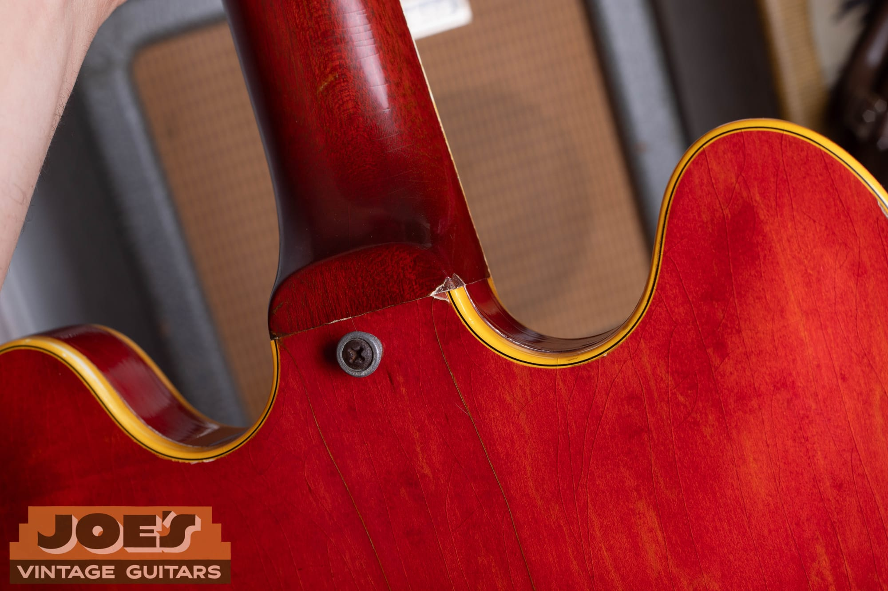

The bound f-hole and heavy, honest checking on our guitar's top. Little details like a bound f-hole, the correct binding count, and a finish that checks and fades the way real nitrocellulose does are exactly what I am reading when I authenticate one of these.

Finally, the pickups and the wiring. Gold-cover PAFs are correct, worn gold is honest, and I confirm them without pulling covers. Inside, period-correct mono guitars use Centralab pots with late-1950s date codes and Sprague "Bumble Bee" capacitors, and a stereo guitar should still have its choke and its shielding cans. None of these is a single pass-fail test. Authentication is about the whole picture agreeing with itself, and that is the value of having someone who handles these look at your specific guitar.

<h2 id="es355-mods">Mods and Red Flags</h2>

A 355 can be modified in a lot of ways, and each one takes a bite out of value. Roughly in order of how much they hurt:

- **Refinish.** The biggest one. A respray can cut value nearly in half or more. Watch for a suspiciously deep, even, opaque red, overspray in the f-holes or on the label, muddy or sanded-through binding, and the absence of honest checking, or fake, too-even checking.
- **Missing or swapped PAFs.** Because gold-cover PAFs are valuable, plenty of 355s have quietly lost theirs to a Les Paul, with cheaper pickups dropped in. An honest, unmolested pair is a real part of the value.
- **Headstock break.** Gibson's angled mahogany headstock breaks easily, and even a clean, stable repair hurts value on a guitar at this level. Always look closely behind the nut and at the back of the headstock.
- **Stereo converted to mono.** Very common, since so many players disliked the Vari-tone. It makes the guitar a modified guitar, and it does not turn a stereo 355 into a valuable factory mono. The right move is to save the original stereo harness in the case.
- **Vari-tone removed or bypassed.** Lighter than a full conversion and more reversible, but still a change from original.
- **Replaced Bigsby, or a converted tailpiece.** A swapped or wrong vibrato, or a stop-tail added into a Bigsby guitar.
- **Replaced tuners and changed knobs.** Individually minor, but they add up.

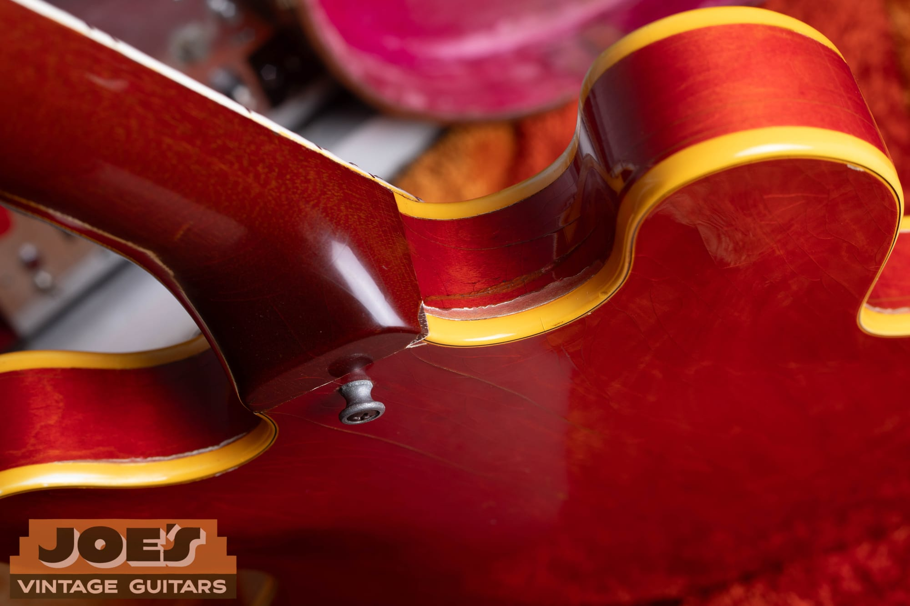

The neck heel and body binding on our 355. When I appraise a guitar, this is the kind of area I check for touch-ups, crack repairs, and finish that does not match, since the neck joint and heel are common spots for both honest wear and hidden work.

The important thing is not that a modified guitar is bad. Plenty of great players are modified, and there is nothing wrong with owning or selling one. What matters is that it be described honestly, because the difference between an all-original 355 and a modified one is large, and buyers at this level know exactly what they are paying for.

<h2 id="es355-checklist">The Quick Checklist</h2>

Here is the short version you can run through in a couple of minutes:

- **Is it really a 355?** Ebony board, pearl blocks, split-diamond headstock, gold hardware, bound f-holes, multi-ply binding.
- **Mono or stereo?** Four knobs and no rotary is mono. A six-way rotary, stereo jack, and internal choke is stereo Vari-tone.
- **Right era?** Rounded Mickey Mouse ears, long pickguard, big neck, gold Grover tuners, no headstock volute.
- **Serial and FON:** Orange label through the bass f-hole, an A plus five digits for 1958 to 1960, with an "S" FON inside for 1959. No headstock serial on a 1959.
- **Tailpiece:** Bigsby is correct. A stop-tail is rare and special, but check for filled Bigsby holes.
- **Pickups:** Gold-cover PAFs, honest wear, covers left on.
- **Finish:** Cherry that fades unevenly to watermelon, with real checking. Watch for respray.
- **Originality:** No headstock break, original harness, original tuners and knobs, no added routing.

<h2 id="es355-value">What a 1959 ES-355 Is Worth</h2>

Now the question everyone asks. These are mid-2026 numbers, and the usual caution applies: the market for guitars at this level is thin, asking prices run ahead of actual sold prices, and condition and originality move the number more than anything else. Treat these as ranges, not quotes.

An all-original, excellent **1959 ES-355TD mono** in cherry, with its factory Bigsby, generally runs in the **30,000 to 45,000 dollar** range. Recent asking prices on clean mono examples have sat in the high thirties. The rare bird, a factory **mono with a stop-tailpiece**, one of only a few known, pushes higher, into **45,000 to 60,000 dollars or more**, because it is essentially a fancier 335 with pure mono tone.

An all-original **1959 ES-355TD-SV stereo Vari-tone** is softer, roughly **22,000 to 38,000 dollars**. The stereo and Vari-tone content is the least popular configuration with players, and it discounts the guitar something like 15 to 30 percent versus an equivalent mono. Modifications come off the top of these numbers: a refinish takes 45 to 60 percent, missing or replaced PAFs take 30 to 45 percent, a headstock repair takes 30 to 45 percent, a stereo-to-mono conversion takes 20 to 30 percent, and smaller changes like replaced tuners or knobs are minor on their own but add up. Several issues at once can leave a guitar worth only a quarter to a third of an all-original example.

Now for the counterintuitive part I promised. Even though the 355 was the fancy, expensive flagship when new, today it usually sells for **less than a plain 1959 ES-335 dot-neck**. A clean 1959 335 dot-neck runs from roughly **45,000 to 80,000 dollars and up**, while the 355 sits in the twenties to fifties and the 345 lower still. Why the flip? Players and collectors love the 335's simple mono tone, its stop-tailpiece, and its clean looks. The 355's stereo and Vari-tone electronics are seen as gimmicky and noisy, and most 355s carry a Bigsby when players prefer a stop-tail. The gold hardware, ebony board, and split-diamond do not overcome those preferences. The one big exception is the rare factory mono 355, which the market rewards precisely because it strips the unpopular electronics away. It is a good reminder that in vintage guitars, what players actually want beats what looked most expensive on the showroom floor.

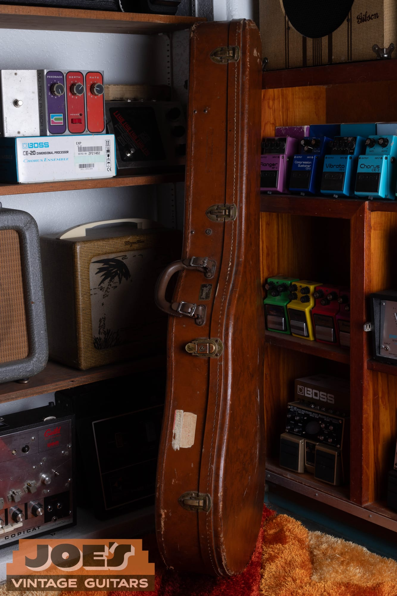

The original brown case with its pink plush lining, the "California Girl" look of a Golden Era Gibson. An original case in good shape is part of the package and adds real value, so hang onto it.

<h2 id="es355-selling">Thinking of Selling Your ES-355</h2>

If you have an ES-355 and you are thinking about selling, the most valuable thing you can do is leave it alone. Do not refinish it, do not have the gold hardware re-plated, do not convert the electronics, and do not swap the pickups for something that sounds better to modern ears. Every bit of honest wear and every original part is part of the value, and once an original finish or an original PAF is gone, it does not come back. If your guitar has already been changed, that is fine too, and the right move is simply to describe it honestly.

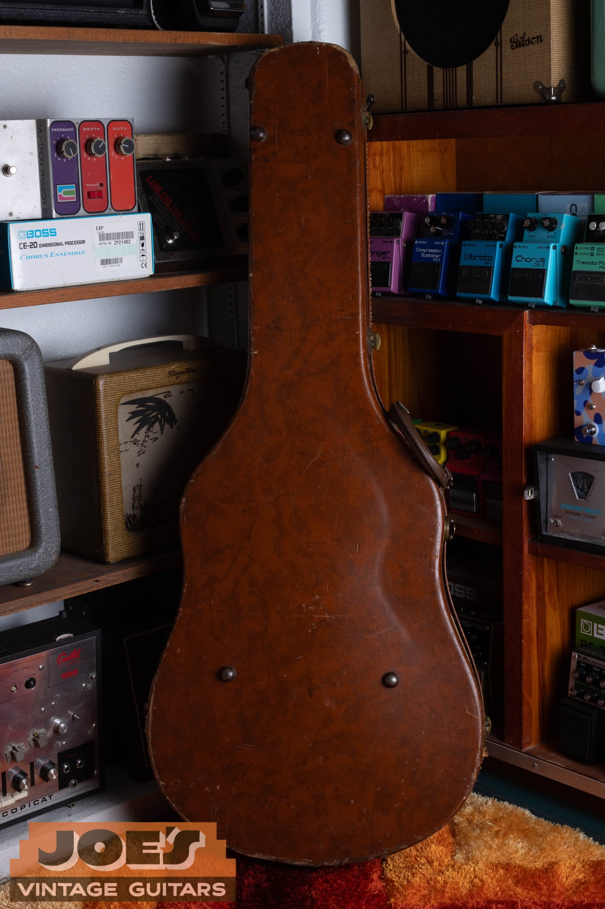

The case our 1959 came in. Little things like the correct period case, the original hang tag, or the receipt all add to the story and the value when it comes time to sell.

At Joe's Vintage Guitars we buy vintage Gibson ES-355s, ES-345s, ES-335s, and the rest of the electric line, and we pay top dollar for clean, original examples. Send us photos through our [free appraisal](/free-appraisal/) page, including the front, the back, the headstock front and back, the serial label through the bass f-hole, and close-ups of the pickups, the bridge, the tailpiece, the control layout, and any wear, and we will tell you exactly what you have and what it is worth. You can also [contact me directly](/contact-me/) with questions, and if you have decided to move it, our guide to [selling a vintage Gibson](/sell-my-gibson-guitar/) walks through the process. Whether you sell to us or not, you deserve a straight answer from someone who handles these guitars, and that is what we give.

<h2 id="es355-faq">Frequently Asked Questions</h2>

**What is the difference between a Gibson ES-355 and an ES-335?**

They share the same body and center-block construction, but the 355 was the top-of-the-line model and the 335 was the entry point. The 355 has an ebony fingerboard with pearl block inlays, a split-diamond headstock inlay, gold hardware, fancier multi-ply binding, bound f-holes, a Bigsby vibrato standard, and cherry finish, and it was offered with stereo Vari-tone electronics. The 335 has a rosewood board with dot inlays, nickel hardware, single-ply binding, unbound f-holes, and simple mono wiring. In 1959 the 355 cost about double a base 335.

**What is the difference between an ES-355TD and an ES-355TD-SV?**

The ES-355TD is the mono version, with two volumes, two tones, a three-way toggle, and one output jack, wired just like a 335. The ES-355TD-SV is the Stereo Vari-tone version, which sends the two pickups to separate amplifier channels in stereo and adds a six-position Vari-tone rotary switch that filters the tone. Mono is the simpler and, today, more desirable configuration.

**How can I tell what year my Gibson ES-355 is?**

Start with the features, then confirm with the numbers. Rounded cutaway horns, a long pickguard, a big neck, and gold Grover tuners point to the late 1950s. On a 1958 to 1960 guitar the serial is on the orange oval label inside the body, readable through the bass-side f-hole, as an A followed by five digits, and 1959 runs roughly A-28881 to A-32284. There is no serial on the back of the headstock until 1961. The Factory Order Number stamped inside uses S for 1959, and it can read a year earlier than the serial, which is normal.

**Is my 1959 Gibson ES-355 worth more if it is mono or stereo?**

Mono. Even though stereo Vari-tone was the standard catalog spec, most players never liked the stereo rig and the tone-scooping Vari-tone, so today a mono ES-355TD is the more desirable and more valuable configuration. A mono 355 is essentially a dressed-up 335 with the wiring players actually want.

**Should a 1959 ES-355 have a Bigsby or a stop-tailpiece?**

A Bigsby. The 355 came standard with a gold Bigsby vibrato in 1959, so a Bigsby is correct and expected, not an aftermarket add. A genuine factory stop-tail 355 does exist but is a special-order rarity, and it is actually worth more than a Bigsby guitar. Beware of a Bigsby that was removed and replaced with a stop-tail, which you can spot by filled Bigsby mounting holes near the tail.

**What is a 1959 Gibson ES-355 worth?**

In mid-2026, an all-original, excellent 1959 ES-355TD mono in cherry generally runs from about 30,000 to 45,000 dollars, with the rare factory mono stop-tail higher, and an all-original stereo Vari-tone version softer, roughly 22,000 to 38,000 dollars. Refinishing, replaced pickups, a headstock repair, or a stereo-to-mono conversion each take a substantial bite out of that. The market is thin and asking prices run ahead of sold prices, so the only real way to know is to have your specific guitar appraised.

**Why is a fancy ES-355 worth less than a plain ES-335 dot-neck?**

Because players and collectors prize the 335 dot-neck's simple mono tone, stop-tailpiece, and clean looks, while the 355's stereo Vari-tone electronics are seen as gimmicky and most 355s carry a Bigsby rather than a stop-tail. A clean 1959 335 dot-neck can run 45,000 to 80,000 dollars and up, while a 1959 355 sits in the twenties to fifties. The one exception is the rare factory mono 355, which the market rewards for having the simple tone players want.

