1966 · Pre-CBS roots, CBS-era arrival

CBS bought Fender in January 1965, but the factory didn't flip a switch the day the deal closed. Production changes rolled out slowly. By 1966 the line was working through transitional parts. The small headstock was on its way out and the larger CBS headstock was in. Clay dots gave way to pearloid. A handful of other small spec changes were quietly happening behind the scenes, and those changes are exactly what separate a 1966 Stratocaster from the pre-CBS guitars on one side and the heavier, more obviously CBS instruments that arrived later on the other.

That in-between status is why so many players and collectors love these guitars. A clean original 1966 still has the nitrocellulose lacquer, the hand-wound staggered pickups, the thin C-shape neck, and the comfortable pre-CBS body. It just wears the bolder headstock and the new visual identity on top. This guide walks through every authentication detail, every spec worth verifying, and the quiet little tells that point to a real, untouched 1966.

<h2 id="overview">Quick Reference: 1966 Stratocaster Specs</h2>

<h2 id="body">The Body, Finish, and the CBS Color Question</h2>

The 1966 Stratocaster body is alder on sunbursts and almost every custom color. Blonde finishes were sometimes ash. Bodies are typically two or three pieces, well matched, with wood that's noticeably lighter than what you find on later 70s Strats. A clean 1966 usually weighs between 7 lb 4 oz and 7 lb 12 oz. Anything north of 8 lbs should raise an eyebrow on a guitar this old.

The shape and contours are still the comfortable pre-CBS profile. Forearm contour and tummy cut are deep and generous, shaped with the same care they got in the Leo era. CBS didn't start shallowing out those contours until later in the decade, so a real 1966 should still feel like it was carved by the same hands that built a 1963 or 1964.

Finishes are sprayed in **nitrocellulose lacquer**. Polyester didn't arrive on Stratocasters until roughly 1968. A 1966 in original finish will check, crack, and yellow the way a 60-year-old nitro instrument should. Sunbursts amber up. Whites turn a creamy ivory. Reds fade, sometimes dramatically. If a 1966 has a glassy, plastic-feeling finish with no checking anywhere, you're almost certainly looking at a refinish.

### The Unsprayed Area Under the Pickguard

Here's a factory detail worth knowing if you've never seen it. Pull the pickguard off an original sunburst 1966 and you'll often find that the red band of the three-tone wasn't sprayed under the guard at all. The factory cut a corner that nobody was ever going to see, skipping the red on the masked-off area to save paint and shave time off the finishing line. The area under the pickguard reads as a two-tone yellow-to-brown burst instead of the full three-tone you see on the exposed top of the body. It's one of the cleanest tells of an honest factory finish. A refinished body sprayed by a pro will almost always have the red band carried all the way through, since nobody refinishing a guitar today is trying to replicate a 1960s production shortcut. Pop the pickguard, see what's underneath, and you'll know.

<figure>

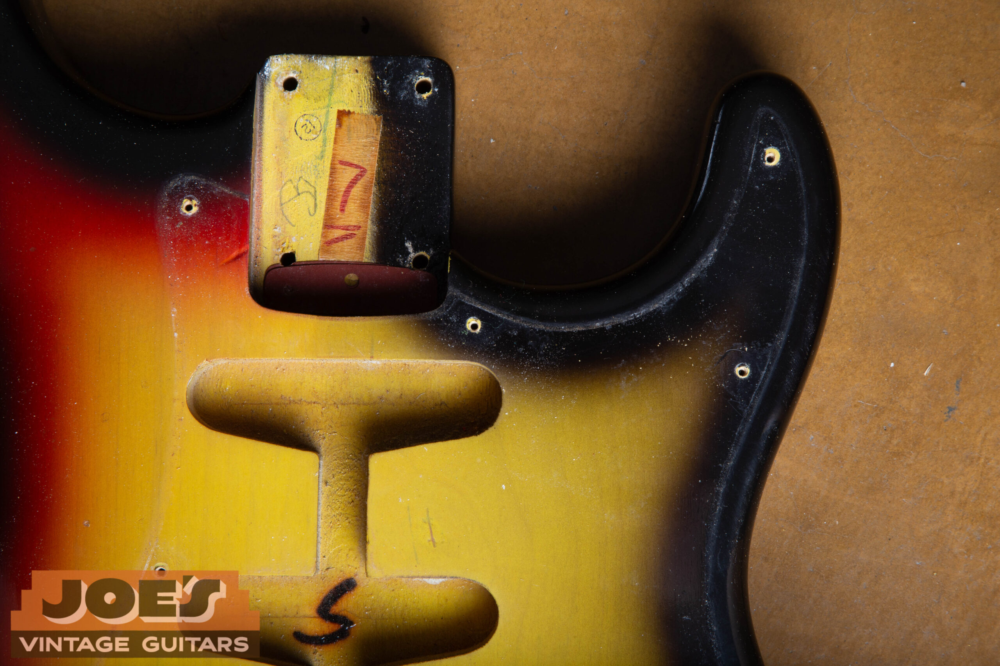

<figcaption>Two-tone under the pickguard: the red band was never sprayed where the guard would cover it</figcaption>

</figure>

#### The Paint Stick Shadow

One of the most important authentication tells on a 1966 Stratocaster lives inside the neck pocket. During finishing, bodies were mounted on a wooden paint stick screwed into the neck pocket. When the body was sprayed, the area beneath that paint stick stayed masked from overspray. Pull the neck off an original 1966 and you should see a clean shadow or silhouette in the neck pocket where the stick sat. Usually it's a roughly rectangular bare-wood area on an otherwise sealed and color-coated pocket. A body that's been refinished in the pocket, or one that's been routed or modified, won't show this shadow.

<figure>

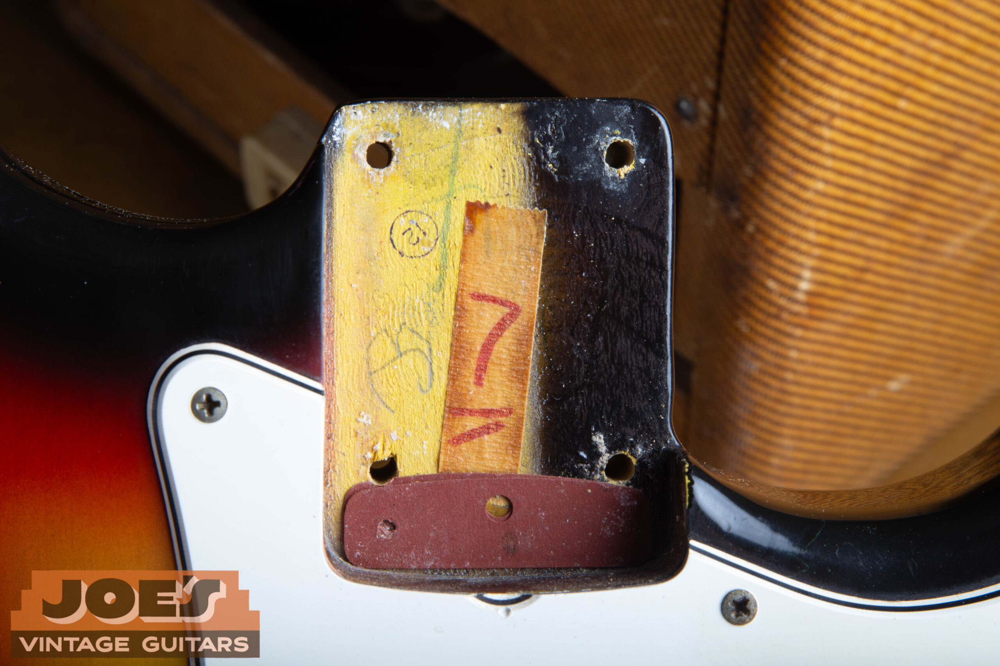

<figcaption>Paint stick shadow in the neck pocket, with the dark red fiber shim sitting in place</figcaption>

</figure>

### Dark Red Shims in the Neck Pocket

Fender used neck shims in this period to set the proper neck angle. The shims you commonly find under the heel of a 1966 Stratocaster neck are dark red or maroon vulcanized fiber, sometimes called "fish paper." They're thin and hard. Some examples have a single shim, others have two stacked. The presence of a correct dark red fiber shim is a quiet authentication detail that's easy to overlook. Modern reproductions of these shims exist, so a shim alone doesn't guarantee originality, but the absence of one combined with neck pocket modifications is a flag.

<h2 id="neck">The Neck</h2>

The 1966 Stratocaster neck is a thin, comfortable C-shape. Necks from this period feel meaningfully slimmer than the boatlike profiles of 1957 or 1958, and they're even thinner than the typical 1962 D-shape. Most measure around .80" at the first fret and roughly .88" to .92" at the twelfth, with some variance. The feel is fast and modern compared to earlier Strats, which is part of what makes these instruments so playable.

The fretboard is rosewood **veneer** over maple. The slab board era ended in mid-1962, which we cover in detail in our [1962 Fender Stratocaster authentication guide](/post/1962-fender-stratocaster-authentication-guide/). By 1966 you are firmly in the veneer board era, and the rosewood is thinner and shows through to the maple at the side dot line. The wood species itself is **East Indian rosewood**. Fender completed the factory transition away from Brazilian rosewood in mid-1965, so by the time 1966 production was running, Indian rosewood was the standard. An Indian board on a 1966 is entirely factory correct and what you should expect to see. The grain tends to be tight, straight, and deep brown, sometimes with a slight purple cast. Documented Brazilian-board 1966s do exist as rare outliers from leftover stock, but they're the exception. If a seller is leaning on "Brazilian rosewood" as a marketing point on a stock 1966, treat the claim with skepticism unless they can prove it.

The frets are vintage thin, with a narrower crown than the medium-jumbo wire that became common decades later. Original frets on a clean 1966 will show wear patterns at the first few positions and at the third, fifth, and seventh, where players spend most of their time. A 1966 with bone-flat, unworn frets has almost certainly been refretted at some point.

<figure>

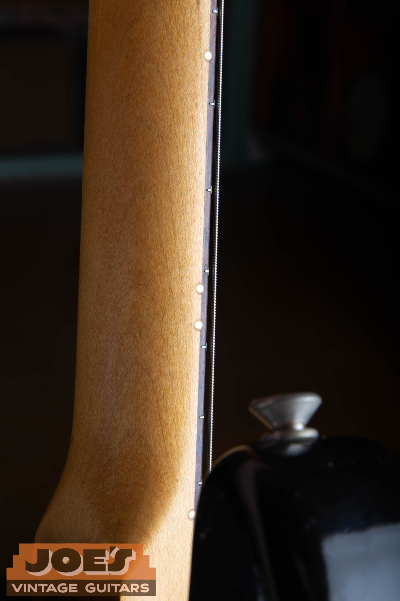

<figcaption>Pearloid side dots, standard on a 1966 neck</figcaption>

</figure>

### The Back of the Neck

This is a small but important detail that gets misreported constantly. A 1966 Stratocaster with a rosewood fretboard **does not have a skunk stripe** on the back of the neck, and there's no walnut butterfly plug above the nut on the back of the headstock. In this era Fender installed the truss rod from the front of the neck blank, then glued the rosewood veneer over the top to cover it. The back of a 1966 neck is a clean, uniform, seamless piece of maple from heel to headstock. The skunk stripe didn't return to rosewood-board Fender necks until 1971, when Fender switched to the bullet truss rod system and rear-loaded the rod again. If a 1966 you're looking at has a skunk stripe and a butterfly plug on a rosewood-board neck, the neck is either a maple-board reissue, a 1971-or-later neck, or has been swapped. This is one of the cleanest at-a-glance authentication tells you can use.

### The Neck Heel Date Stamp

Flip the neck off the body and look at the heel. By 1966, Fender was stamping the neck date in green or black ink directly onto the heel. The format you should see on a 1966 reads something like:

13 MAR 66 B

<figure>

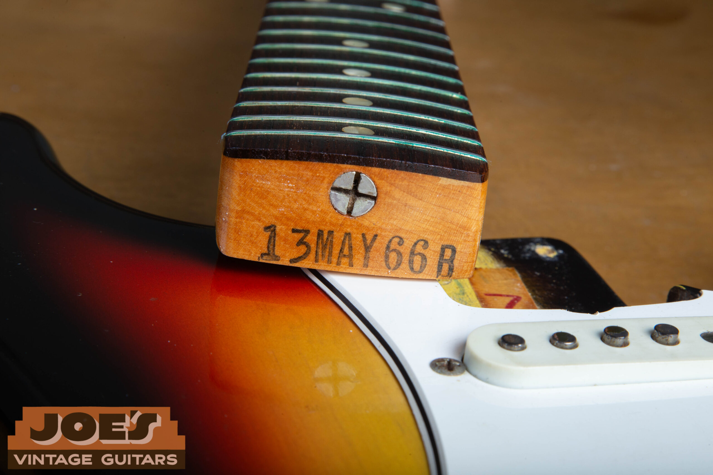

<figcaption>Real neck heel stamp: 13 MAR 66 B (model 13, March, 1966, 1 5/8" nut)</figcaption>

</figure>

The first two digits are the model code. On a Stratocaster from this window (late 1965 through late 1967) the correct code is **13**. Don't let anyone tell you a "3" leading the stamp is correct for a Strat in this era. That single-digit "3" was used for the Telecaster and Esquire. A 1966 Stratocaster neck heel should read 13. The middle three letters are the month abbreviated. The next two digits are the year. The final letter is the neck shape and nut-width profile code. The vintage Fender width codes are fixed and worth memorizing:

-   **A**: 1 1/2" nut width (narrowest, uncommon)
-   **B**: 1 5/8" nut width (by far the most common 1966 Strat width)
-   **C**: 1 3/4" nut width (wider, less common)
-   **D**: 1 7/8" nut width (widest, rare)

If you ever see a 1966 advertised with a 1 11/16" nut width and a "B" code stamp, the seller is mixing up vintage Fender codes with modern American Standard or Gibson measurements. The vintage Fender "B" stamp means 1 5/8" exactly. Faded or partially worn neck stamps are normal. If the stamp looks freshly applied, deeply inked, or reads in a font that doesn't match period examples, the neck has likely been replaced or restamped.

<h2 id="headstock">The Headstock and the CBS Transition</h2>

This is where the 1966 Stratocaster announces itself visually. By the time 1966 production was fully underway, the small headstock was gone. Fender widened the headstock outline in late 1965, so virtually every Stratocaster shipped in 1966 has the larger, more upright CBS-style headstock. A handful of very early 1966 examples with small headstocks exist, but they're the exception, and they generally represent leftover small-headstock blanks being finished out. For a side-by-side look at the small-headstock instrument that immediately preceded the CBS era, see our [1963 Fender Stratocaster authentication guide](/post/1963-fender-stratocaster-authentication-guide/).

### The Transition Logo

The logo on a 1966 Stratocaster is the gold "transition" decal. It's gold with a thin black drop shadow, reading *FENDER* in script with *STRATOCASTER* beneath it. Just below that, in smaller text, you should see the patent number block and "WITH SYNCHRONIZED TREMOLO." This is the same logo that started in late 1964 and ran until the CBS "Bold" black logo replaced it around late 1967 to 1968. The 1966 logo should be gold, applied under the finish, showing some yellowing or aging consistent with the rest of the neck. A pristine, untextured logo on a guitar with otherwise heavy wear is a red flag.

<figure>

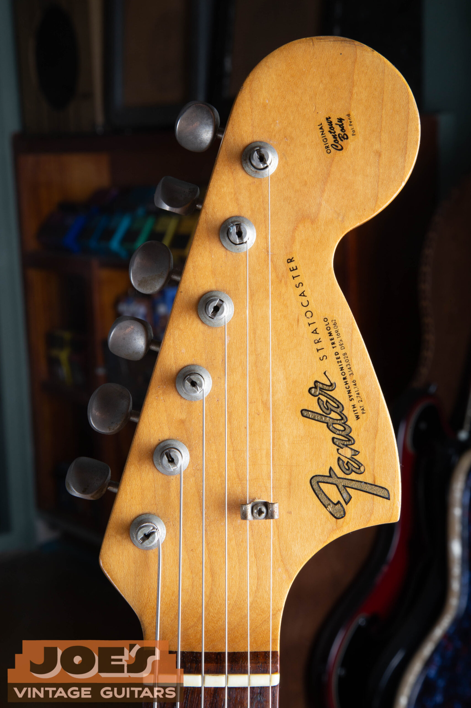

<figcaption>Large CBS headstock with the gold transition logo</figcaption>

</figure>

### Tuners

1966 Strats use **Kluson Deluxe** tuners with the double-line "Kluson Deluxe / Kluson Deluxe" stamping running down the back of the housing. Single-line Klusons were phased out by mid-1964, so by 1966 the double-line stamp is universal. The buttons should be aged ivory or cream, not bright white. Shafts and gears should turn smoothly. Replacement tuners are one of the most common modifications on these guitars, so check the back of the headstock for plug marks or extra screw holes that might indicate Schaller or Grover replacements at some point in the guitar's history.

### String Tree

The string tree on a 1966 is the "butterfly" or round string retainer for the first and second strings, mounted to the headstock with a single screw and a small plastic spacer underneath. There's only one string tree on a 1966 Stratocaster. The second string tree for the third and fourth strings didn't appear on Strats until the 1970s.

<h2 id="pickups">Pickups and Electronics</h2>

Underneath the pickguard is where a 1966 Stratocaster shows most of its personality. Every component matters here, for authentication and for tone.

### The Pickups

1966 Stratocaster pickups are **gray-bottom** with staggered AlNiCo V pole pieces. The bobbins are gray vulcanized fiberboard. The wire is dark purple/maroon **plain enamel**, hand-wound, with DC resistance generally falling between 5.8k and 6.2k ohms. The lighter amber-orange heavy formvar wire that wound the earlier black-bottom pickups was phased out in late 1964 and early 1965 alongside the move from black bottoms to gray. By 1966 it's plain enamel across the board. Cloth lead wires exit through the bottom of the bobbin. Original 1966 pickup bobbins often have date stamps or initials in pencil from the winders, visible if you carefully pop off the pickup covers, though you should never do this casually since it can damage the wax potting. Our [Fender pickup dating guide](/fender-pickup-dates/) covers these date stamps and the formvar-to-enamel wire change that tracks the same era.

The staggered pole pattern on a 1966 follows the original Fender staggering with the G-string pole sitting noticeably taller than the others. That staggering was designed for the wound G strings that were standard at the time. The pole magnets themselves are AlNiCo V and they should look slightly oxidized or matte gray, not shiny or bright.

<figure>

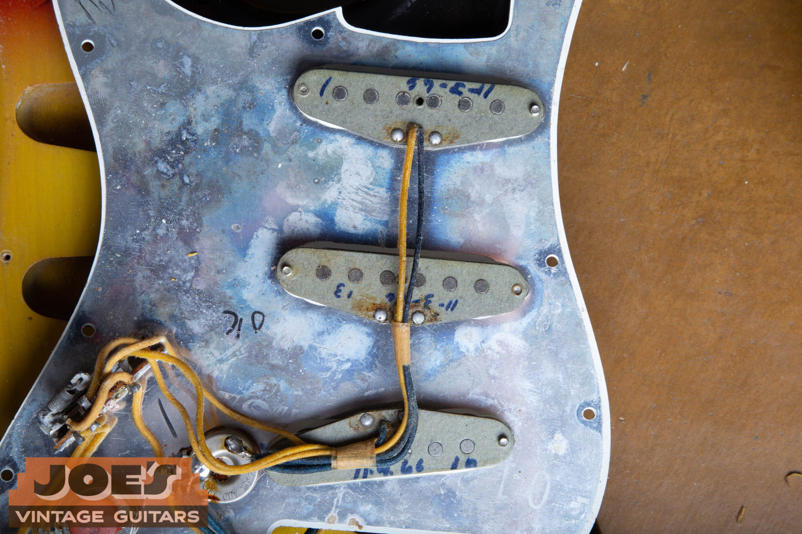

<figcaption>Factory-correct gray bobbin with the winder's date in blue marker</figcaption>

</figure>

### The Three-Way Switch

The pickup selector switch on a 1966 Stratocaster is a **three-way** Centralab switch. Neck, middle, bridge. The famous "in-between" positions (positions 2 and 4 on a modern 5-way) were available to clever players by balancing the switch between detents, but the factory switch only had three official positions. Fender didn't adopt the 5-way switch as standard until 1977. If the guitar you're looking at has a 5-way switch installed, it's a later modification, and the original 3-way should ideally come with the guitar.

### The Capacitor

By 1966 the tone capacitor is a ceramic disc rated at **.1 microfarads (0.1 µF)** at 50V. These are the larger flat "pancake" style ocher/tan ceramic discs, often stamped "SK .1X 50V" or similar markings, soldered between the tone pot and ground. Fender used the .1 mfd value on Stratocasters throughout the 1960s. The smaller .047 mfd disc cap that some people associate with vintage Strats didn't become standard on the model until roughly 1968 to 1970, when Fender shifted to the lower value to brighten the tone roll-off. An original .1 mfd pancake cap is a small but consistent authentication detail. Replacement caps are common on guitars that have had work done, so finding the original .1 still in place is a good sign.

### Cloth Wiring

All internal wiring on a 1966 Stratocaster is **cloth-covered pushback** wire. The hot leads from the pickups are typically white with a colored tracer, and ground wires run in unsleeved cloth-covered stranded wire. The shield wire wrapping the tone circuit is bare. PVC plastic-jacketed wire didn't appear on Stratocaster harnesses until much later, so any plastic-insulated wire on a supposedly original 1966 harness is a replacement.

### Pot Codes

The potentiometers on a 1966 Strat are 250k audio taper, made by either CTS or Stackpole. They carry a six or seven digit source-date code stamped on the side of the can.

-   **CTS code:** begins with 137. So a CTS pot from the 14th week of 1966 reads 1376614 or 137 6614.
-   **Stackpole code:** begins with 304. So a Stackpole pot from the 36th week of 1966 reads 3046636 or 304 6636.

<figure>

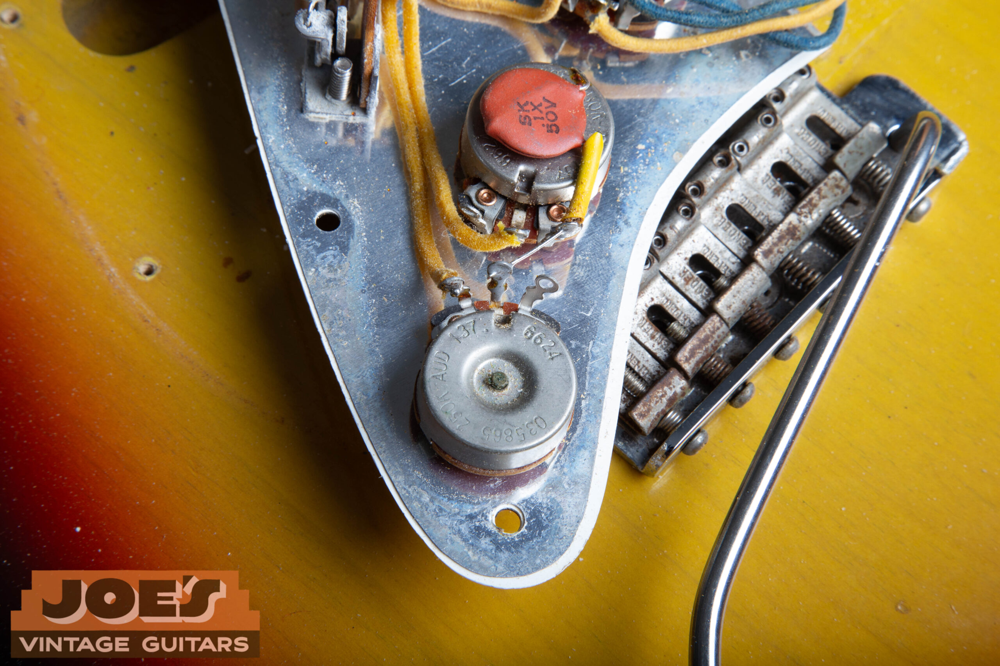

<figcaption>CTS pot stamped 1376624: manufacturer 137, year 66, week 24</figcaption>

</figure>

Read the code as MANUFACTURER (3 digits) + YEAR (last digit or last 2 digits) + WEEK (2 digits). On 1966 pots you're looking for codes that read 66XX in the year-week section, where XX is between 01 and 52. Pots are sometimes a slightly different vintage than the body and neck since Fender bought them in batches, but they should generally land in the same window or slightly earlier than the guitar's neck date. A pot dated 1968 on an otherwise 1966 guitar means someone replaced the harness.

Harness checks out? Let's verify the rest.

If your guitar has the gray-bottom pickups, the cloth pushback wiring, the .1 mfd pancake cap, and an original CTS or Stackpole pot dated to 1966, you're looking at a real one. Skip the auction-site hassle and get a secure, competitive cash offer from a vintage Fender specialist who reads these guitars for a living.

[Get a Free Appraisal](/free-appraisal/)

<h2 id="bridge">The Bridge and Hardware</h2>

### Saddles

The bridge saddles on a 1966 Stratocaster are individual stamped steel saddles, plated in nickel chrome, with **"FENDER PAT. PEND."** stamped on the top of each one. These are the same threaded, formed-steel saddles Fender had been using since the 1950s. The patent pending stamp persisted on Stratocaster saddles well into the late 1960s before being phased out. By the very late 1960s and into the 1970s, Fender saddles became unmarked, then eventually went to the heavier diecast block saddles. So on a 1966 you should see "FENDER PAT. PEND." on every saddle. The stamp is small, but it's clearly visible under good light. Reproduction saddles exist but they're usually distinguishable on close inspection.

<figure>

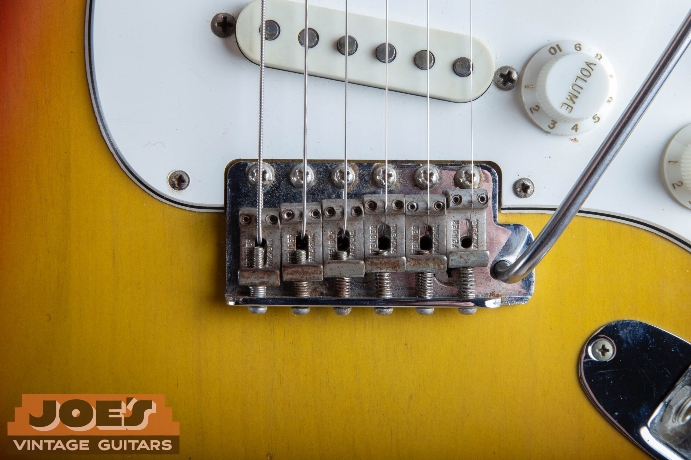

<figcaption>FENDER PAT. PEND. stamping on every original 1966 saddle</figcaption>

</figure>

### Tremolo Block and Springs

The tremolo block on a 1966 is solid steel. The block sits in the body rout with three to five springs hooked between it and the spring claw. Five springs was standard from the factory, but many players removed two or three for a lighter feel. The spring claw is plain steel, attached with two long wood screws. Modifications here are common since players adjust the trem feel constantly, but the block and claw should be original Fender parts.

### Tremolo Arm and Tip

The tremolo arm is a threaded steel rod with a tone-matched **aged white** plastic tip. The tip should be slightly yellowed and may show wear from contact with the pickguard or knobs. Replacement tips are extremely common since these get lost.

### The Chrome Bridge Cover (Ashtray)

The chrome bridge cover, sometimes called the "ashtray," is a separate piece from the trem cover on the back of the body. It clips over the bridge saddles on top of the guitar. Stratocasters shipped with one from the factory in 1966, but the cover was so universally removed by players (it blocks palm muting and gets in the way of right-hand technique) that finding a 1966 with its original bridge cover still in the case is unusual. Most 1966 Strats lost theirs decades ago. When one does turn up, the chrome should match the rest of the hardware in patina and the inside of the cover often shows the same paint shadow on the body underneath as the rest of the masked finish areas.

<figure>

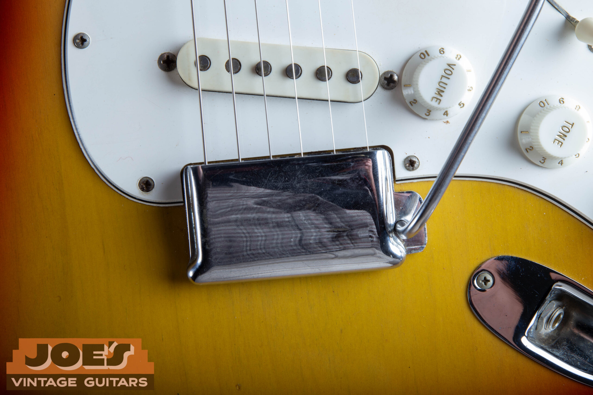

<figcaption>The original chrome bridge cover, rarely seen still with the guitar</figcaption>

</figure>

### Tremolo Cover Plate

The trem cover on the back of the body is a single-ply white plastic plate with two access holes for the strings. It mounts with six screws. By the 1970s Fender switched to a chrome stamped-steel cover, but in 1966 it should still be the single-ply plastic piece, generally aged to a soft ivory to match the pickguard.

### Neck Plate

The four-bolt neck plate on a 1966 is the **F-plate**, the plate with the large "F" Fender logo stamped into it and the serial number stamped above the F. Serial numbers on a 1966 generally land in the **110000 to 200000** range, but Fender wasn't strict about pulling plates in order. Plates were grabbed out of bins as guitars were built, so you'll see 1966 guitars with serials a little lower or a little higher than that window, and the same serial range overlaps with both 1965 and 1967 production. The serial number alone is never the answer. Use the neck heel date, the pot codes, and the rest of the components together to land on a year. For a full breakdown of how Fender serials track to production years across every Fender model, see our [complete Fender serial number guide](/fender-guitars-serial-number-guide/).

<figure>

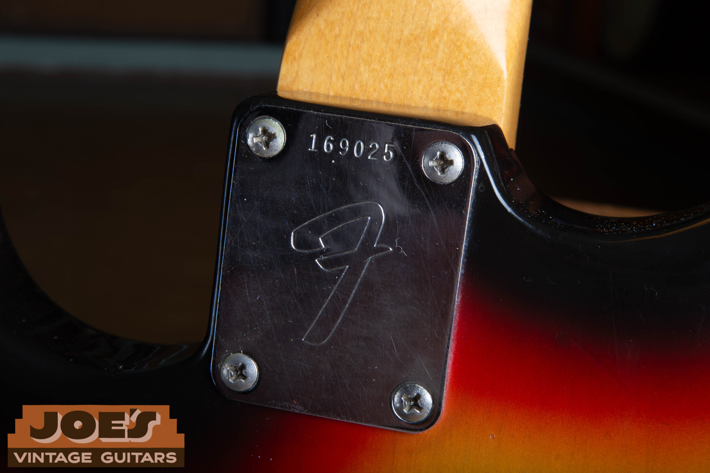

<figcaption>F-plate with serial 169025, squarely inside the 1966 range</figcaption>

</figure>

<h2 id="pickguard">Pickguard, Knobs, and Plastics</h2>

The pickguard is **3-ply white ABS plastic**, with eleven mounting screws. The shrinking, flammable nitrocellulose celluloid "mint green" guards that show up on early 1960s Strats had been discontinued by mid-1965. By 1966 the factory was building Stratocasters with multi-ply white ABS guards. The 1966 ABS guard ages to a warm cream, parchment, or light ivory color over decades of UV and oxidation exposure, but it doesn't turn the distinct pistachio or olive green that nitrate guards do, and it doesn't shrink or warp the same way. The bevel at the edge is roughly 45 degrees and reveals the black middle ply between two outer white plies.

This is one of the most commonly misreported details on 1966 Stratocasters. If a 1966 you're looking at has a green-tinted, shrinking, or warped guard with that nitrate camphor smell, it's either a leftover early 1965 part, a swapped earlier guard, or a reproduction nitrate guard installed by a previous owner who wanted the "vintage look." An original factory 1966 guard is white ABS aged to cream.

### Knobs

The three control knobs are aged white ABS plastic with the molded skirt and the embossed numbers around the perimeter. They're labeled "Tone, Tone, Volume" from the lower position up, with the volume knob nearest the bridge. The skirts age to a soft cream and should sit in the same color family as the pickguard. The embossed numbers are often worn down on the volume knob in particular, where decades of finger contact have softened or partly erased them. That wear is normal and expected on an honest player-grade 1966. The switch tip is aged white plastic to match.

<h2 id="dating">Putting It All Together: A 1966 Dating Walkthrough</h2>

Authenticating a 1966 Stratocaster comes down to confirming that every datable component lands in the right window. No single data point makes a guitar real. The combination is what counts.

#### The 1966 authentication checklist

-   Neck heel stamp dated in 1966 (any month)
-   Pots dated in 1966 or very late 1965 (CTS 137 66XX or Stackpole 304 66XX)
-   Pickup bobbins, if openable, dated in 1965 or 1966
-   Large CBS headstock with transition logo (gold, patent numbers visible)
-   Double-line Kluson Deluxe tuners
-   Pearloid dots and pearloid side dots
-   East Indian rosewood veneer fretboard
-   Gray-bottom staggered pickups with plain enamel wire
-   Original .1 mfd ceramic disc "pancake" cap
-   Cloth-covered pushback wiring
-   3-way Centralab switch
-   11-screw 3-ply white ABS pickguard (aged to cream, not pistachio)
-   "FENDER PAT. PEND." stamped saddles
-   F-stamped neck plate, four-bolt
-   Paint stick shadow in the neck pocket
-   Dark red fiber shim under the neck heel
-   Date markings on the body in the neck pocket (often pencil or stamped, year often "66")
-   Nitrocellulose finish with appropriate checking and yellowing
-   Seamless maple back on the neck, no skunk stripe, no butterfly plug

Think your '66 matches the full checklist?

If most or all of those boxes are checked, you've got a real one. We make fair, professional offers on real 1966 Stratocasters every week, in sunburst, custom color, clean, or honestly played. Let's verify it together.

[Sell Your 1966 Strat](/sell-my-fender-guitar/)

<h2 id="cases">Cases</h2>

The standard case shipped with a 1966 Stratocaster is the **black rectangular Tolex case** that the vintage community generally calls the "black square case." It's squared off at the corners with a slim profile, covered in pebbled black Tolex vinyl, lined inside with bright orange or rust-colored crushed plush. The handle is brown leather with two reinforcement studs. There are two metal latches on the front and a center key lock. The Fender branding is a raised, tail-less "Fender" logo badge in plastic or metal, riveted or pinned directly onto the exterior of the case lid. That's an easy at-a-glance ID. The stenciled or stamped white block-letter logos belong to the earlier brown and blonde Tolex cases or to much later reissues, not to a factory-correct 1966 black case.

Inside the lid you usually find a small printed cardboard "Fender Fine Electric Instruments" tag or a polish cloth pocket. The case interior smell of any clean original is unmistakable, that mix of plush, glue, and decades-old Tolex. Replacement reissue cases don't smell the same.

### The Bulwin "Eyeglass" Case

Far less commonly, a 1966 Stratocaster will turn up in what collectors call a **Bulwin** case, sometimes misspelled "Bolewin." This is a distinctive case style with a contoured, rounded profile shaped a little like a pair of eyeglasses or a peanut, upholstered in black Tolex with a different interior plush than the rectangular cases. Bulwin cases are scarce in 1966 Stratocaster country, and finding a 1966 still in its original Bulwin case is a real rarity. They show up more frequently with Jazzmasters and Jaguars, but a small number of Strats were cased this way too. A correct Bulwin case adds meaningful value to a clean 1966.

<figure>

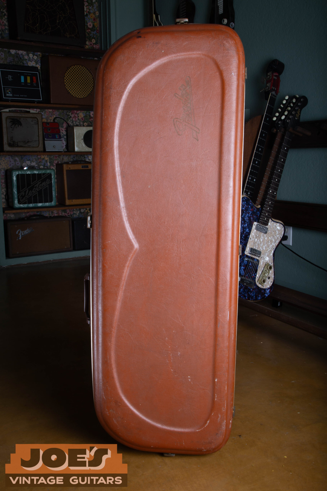

<figcaption>The contoured Bulwin "eyeglass" case, rarely paired with a Strat</figcaption>

</figure>

### Tweed

Tweed cases (Strat-style, with red lining) were a 1950s and very early 1960s thing on Stratocasters and were not factory issued with 1966 Strats. If a 1966 turns up in a tweed case, the case is either a later reissue, a vintage case from an older guitar that someone re-paired, or a custom order, which would be extremely unusual.

<h2 id="colors">Custom Colors</h2>

1966 is one of the great custom color years for Stratocasters. CBS continued the custom color program Leo had been running, and while the color chart shifted slightly each year, the menu in 1966 was wide. Sunburst was the standard finish. Any non-sunburst color was a paid option, typically a five percent upcharge over the standard list price.

A few notes on individual colors. Lake Placid Blue is the rich, slightly purple-tinted dark blue metallic. It fades to a lighter, greenish blue over decades. Candy Apple Red has a gold or silver undercoat depending on the year, with red translucent lacquer over the top. The 1966 Candy Apples were over silver more often than gold, but variation exists. Fiesta Red is the famous bright orange-red that fades to a salmon or coral over time. Olympic White yellows to a cream or even a buttery ivory. Surf Green is a mint-tinged sea-foam green, lighter and cooler than Foam Green, which leans more yellow and opaque. The two get confused sometimes, but they're distinct entries on the chart.

The metallic colors (Lake Placid Blue, Candy Apple Red, Burgundy Mist, Inca Silver, Shoreline Gold, the Firemists, Blue Ice, Charcoal Frost) were applied with a metallic basecoat, color coat, and clear lacquer top coat. They're typically more fragile and more prone to flaking and clearcoat issues than the solid colors. The solid colors (Dakota Red, Fiesta Red, Olympic White, Daphne Blue, Sonic Blue, Black, Foam Green, Surf Green) were sprayed directly over a yellow or white primer.

#### Refins, overspray, and color fraud

Custom color 1966 Stratocasters bring serious money, and that money attracts serious fakery. The most common scams are sunburst guitars stripped and refinished in a desirable custom color, or original colors over-sprayed because the original finish was checked or worn. Look for a paint stick shadow in a neck pocket that matches the body color, check the bottom of the neck pocket for paint in the pickup routes that matches the top of the body, examine the screw holes around the pickguard for original color showing inside the hole, and pull the trem cover to check for paint over-spray inside the cavity. A real factory custom color was sprayed before final assembly, so paint should be in places that would be impossible to recreate without disassembling and refinishing. When in doubt, get a knowledgeable second opinion before paying custom-color money for a custom-color guitar.

<h2 id="players">Players Who Defined the Sound</h2>

The 1966 Stratocaster lived through a big year for electric guitar. Hendrix didn't get to Monterey until June 1967, but his early Strats included examples from this era, and the sound he chased on Are You Experienced was already a 1966 Strat sound. David Gilmour, Eric Clapton in his post-Cream years, Ritchie Blackmore, and Rory Gallagher all logged time on Strats from this exact window. Lots of session players in Nashville and Los Angeles were quietly using these guitars for everything from country dates to Motown overdubs to surf tracking sessions.

The reason the 1966 has stayed relevant for so long is that the guitar is a well-balanced instrument. The neck is thin and fast for lead work, the pickups are bright but not brittle, and the trem still has the smooth feel of the original Fender design. It's a guitar that does almost everything well, which is exactly why it was useful to so many different players across so many different styles.

<h2 id="market">Market Notes</h2>

### What Drives the Value of a 1966 Stratocaster?

Three things drive the offer on any 1966 Stratocaster: factory finish, condition, and originality of components. Here's how the market generally sorts them.

Documented factory custom colors (Lake Placid Blue, Candy Apple Red, Fiesta Red, Olympic White, Sonic Blue, Daphne Blue, Burgundy Mist, the Firemists) with 100% original finish, untouched solder joints, original pickups, original frets, original pickguard, and original case. These are the guitars that bring the strongest offers, and they're the ones we're most actively looking for.

Original Sunburst finishes with honest player wear, original hardware, original electronics, original neck and body, and a matching case. The bread and butter of the vintage Fender market. Strong demand, strong offers, easy transactions.

Old refinishes, replaced pickups, repro pickguard, refret, an added 5-way switch, or modifications to the body or neck. The value comes down meaningfully compared to clean originals, but we still buy these every week. A 1966 with modifications is still a 1966.

1966 Stratocasters span a wide market range depending on color, condition, and originality. Sunburst examples in clean original condition command strong money but sit below the pre-CBS years (1962 to 1964). Custom colors push the value much higher, with documented original factory finishes in Lake Placid Blue, Fiesta Red, Olympic White, and Sonic Blue being especially sought after. The rare metallics like Firemist Gold or Blue Ice command real premiums when they show up clean and unmolested. For year-by-year pricing benchmarks across the entire Stratocaster timeline, our [vintage Fender Stratocaster value guide](/vintage-fender-stratocaster-value-guide/) goes deeper into where each year of Strat tends to land.

Condition matters enormously. A 1966 with original pickups, original frets, original solder joints, original pickguard, original case, and clean documentation can easily fetch double or triple what the same guitar would bring with replacement pickups, a refret, repro pickguard, and a hardshell that doesn't match.

If you're looking at a 1966 to buy, prioritize untouched electronics, an unmodified body, an original neck with a clean heel date, and an original case. If you're looking to [sell a Fender Stratocaster](/sell-my-fender-guitar/) from this era, document everything you know about the guitar's history, take detailed photos of the components and date stamps, and find a buyer who actually understands what they're looking at. We do this every week.

<h2 id="faq">FAQ</h2>

### How do I tell a 1966 Stratocaster from a 1965 or 1967?

The bridge is the year-to-year continuity, but the small details shift. Compared to a 1965, the 1966 will more reliably have the large CBS headstock (1965s span both small and large), pearloid dots are standard (some early 1965s still had clay), and the F-stamped neck plate is consistent (early 1965s didn't have it). Compared to a 1967, the 1966 still has the gold transition logo (the bold black CBS logo arrived around late 1967), and it still has nitrocellulose finish (poly came in 1968 on Strats). Pot codes are the cleanest dating tool when they're original to the guitar.

### Are 1966 Strat pickups really hand-wound?

Yes. Fender didn't transition to fully automated winding until later. 1966 pickups were wound on Leesona winding machines operated by hand by the winders, who controlled traverse and tension. That's why output and tone vary even within a single guitar from this period. The variation is part of why these pickups sound the way they do.

### Is the Bulwin case a guarantee the guitar is original?

No. The case is a meaningful detail and adds value, but cases get separated from guitars all the time. A Bulwin case paired with a sketchy guitar is just a sketchy guitar with a nice case. Authentication has to rest on the instrument itself, not the box it came in.

### What is the difference between the 1966 transition logo and the later CBS logo?

The transition logo is gold with black trim and includes patent numbers and the "WITH SYNCHRONIZED TREMOLO" line. The CBS "bold" logo that replaced it around late 1967 is solid black with a thicker outline and no gold. The 1966 will always wear the gold transition logo unless it's been replaced.

### Why does my 1966 Strat weigh less than a modern Strat?

Alder bodies from this era were typically lighter than what comes out of modern Fender custom shops. Lumber supply, drying methods, and CNC routing tolerances have all shifted over the decades. Most 1966s land between 7 lb 4 oz and 7 lb 12 oz, which is significantly lighter than the typical 8.5 lb modern Strat.

### Should I clean original solder joints to "improve" the connections?

Please do not. Original solder joints are part of the guitar's identity. Reflowing them, replacing wire, or "tidying up" the harness destroys value. If a 1966 has its original solder joints intact, leave them alone. If something has failed and needs repair, take it to someone who specializes in vintage Fender repair and ask them to do the work in a way that preserves originality.

<h2 id="shipping">How to Safely Ship a High-Value Vintage Stratocaster</h2>

The single biggest reason owners hesitate to sell a five-figure vintage guitar is the fear of shipping. We hear it constantly. The good news is that this part of the process is the easiest one to solve.

When you sell an instrument to Joe's Vintage Guitars, we handle the logistics end to end. You don't buy a label. You don't estimate value for declarations. You don't chase down a box. Here's what the process actually looks like:

-   You get a **fully insured, pre-paid overnight shipping label** covering the agreed-upon value of the guitar.
-   We walk you through detuning the strings to the correct slack tension so the neck is not under load during transit.
-   Packing gets a phone call: supporting the neck inside the case, padding the headstock, immobilizing the case inside an outer carton, and double-boxing where appropriate.
-   No packing materials on hand? We can ship them to you ahead of the pickup.
-   The guitar moves on overnight freight to our Mesa shop, where we inspect, confirm condition matches the photos, and release payment promptly.

This is the same process we use for guitars coming in from across the country every week. If you want to talk through shipping logistics before you commit to anything, just ask. We'd rather answer twenty questions up front than have you worry about it for six months.

### Selling or Appraising a 1966 Stratocaster?

Joe's Vintage Guitars buys 1966 Stratocasters in every condition, every color, and every configuration. Inherited a custom color example? Sorting through an estate? Have a sunburst project that needs the right home? We make fair, professional offers on clean originals and on guitars that have been modified or refinished. Joe has been buying, authenticating, and selling vintage Fenders out of Mesa for years, and you can read more about our background on the [about page](/about-me/).

[**Request a free appraisal →**](/free-appraisal/)  
Want to know what the buying process looks like before you reach out? Visit our [sell my Fender guitar](/sell-my-fender-guitar/) page. For dating help, our [Fender serial number guide](/fender-guitars-serial-number-guide/) and our [vintage Fender Stratocaster value guide](/vintage-fender-stratocaster-value-guide/) cover every year of Strat production. For pre-CBS authentication walkthroughs that complement this one, the [1963 Stratocaster guide](/post/1963-fender-stratocaster-authentication-guide/) and the [1962 Stratocaster guide](/post/1962-fender-stratocaster-authentication-guide/) are both worth a read.
