Authentication Guide · Gibson Semi-Hollow · 1966

The complete year-specific reference for dating and authenticating a genuine 1966 Gibson ES-335: Patent Number pickups, transitional hardware, serial numbers, and every detail that separates a real example from a fake or misrepresented instrument

-   [Why 1966 Is a Transitional Year](#why1966)
-   [At-a-Glance Specifications](#specs)
-   [Serial Numbers & Dating](#serial)
-   [Headstock, Logo & Truss Rod Cover](#headstock)
-   [Neck, Nut, Fingerboard & Inlays](#neck)
-   [Body, Horns & Binding](#body)
-   [Pickguard & Controls](#pickguard)
-   [Patent Number Pickups](#pickups)
-   [ABR-1 Bridge & Tailpiece](#bridge)
-   [Tuners, Knobs & Switch Tip](#hardware)
-   [Orange Label & Interior](#label)
-   [Neck Tenon & Routing](#tenon)
-   [Chrome Plating & Aging](#chrome)
-   [Case & Case Candy](#case)
-   [Fakes, Reissues & Modifications](#fakes)
-   [Authentication Checklist](#checklist)
-   [Related Resources](#links)

<h2 id="why1966">Why 1966 Is a Transitional Year</h2>

The 1966 Gibson ES-335 sits in an often misunderstood spot in the model's history. It isn't the celebrated "dot neck" of 1958 to 1961, and it isn't the CBS-era instrument of the early 1970s. It's a mid-CBS-acquisition guitar that keeps most of what made the ES-335 great while showing the first signs of the cost and quality changes that picked up through the late 1960s. To date one correctly you have to know both what it still was and what it was starting to become. For context on how production year affects value across Gibson's electric guitar range, see our guide on [how year of manufacture affects vintage Gibson value](/post/how-the-year-of-manufacture-of-your-vintage-gibson-guitar-affects-its-price/).

CBS acquired Fender in 1965; Gibson's ownership change, to Norlin through Chicago Musical Instruments (CMI), came later, in 1969. So a 1966 ES-335 is still a **pre-Norlin Kalamazoo guitar**, built by the same craftsmen and to fundamentally the same standards as the early 1960s examples, just with hardware and materials that were already evolving. The pickups are no longer PAFs but are excellent Patent Number humbuckers; the bridge saddles are in transition; the tuners may still be Klusons. It's a genuine vintage guitar with real collector value, and one that takes attention to specific year-defining details to authenticate correctly.

**1\. Are the bridge saddles nylon?** They should be. Nylon saddles are correct for a 1966, and chrome saddles point to a replaced bridge or a later guitar.

**2\. Are the pickups pre-T-top Patent Number humbuckers?** Gibson moved to the T-top bobbin gradually between 1965 and 1967, so a 1966 can turn up either way and neither is automatically wrong. Most 1966s carry the earlier Patent Number pickups; authenticating these is covered in detail in Section 08.

**3\. Does the serial number confirm 1966?** Gibson's 1960s serial system has quirks and overlaps. Knowing what a genuine 1966 number looks like, and why it can appear faint, helps a lot.

<h2 id="specs">At-a-Glance Specifications</h2>

<h2 id="serial">Serial Numbers & Dating</h2>

Gibson's serial number system in the mid-1960s is more reliable than Fender's contemporary system but still has quirks and overlaps that require understanding. The serial number alone can confirm a guitar is consistent with 1966 production, but it must be cross-referenced with the orange label and physical features to build a complete dating case.

### The Ink Stamp on the Back of the Headstock

The 1966 ES-335's serial number is **impressed (stamped) directly into the wood** of the headstock back. The number is physically indented into the mahogany beneath the finish. It is also inked onto the orange label inside the body. The impression in the wood is the primary reference.

The impressed serial can be difficult to read on darker-lacquered headstocks because the finish fills the impression over time. **If the serial number on a claimed 1966 ES-335 is hard to read, that is not necessarily suspicious.** Raking a light across the surface at a low angle reveals the physical impression in the wood even when it reads faintly. What warrants scrutiny is a serial that appears to have been added recently or looks inconsistent with the surrounding finish.

Angling a flashlight across the headstock back at a low angle (raking light) often makes a faint stamp dramatically more readable. The stamp sits on the lacquer surface and may be partially filled with finish overspray from subsequent coats. A side-lighting technique reveals the physical impression in the finish even when the ink has faded significantly.

<figure>

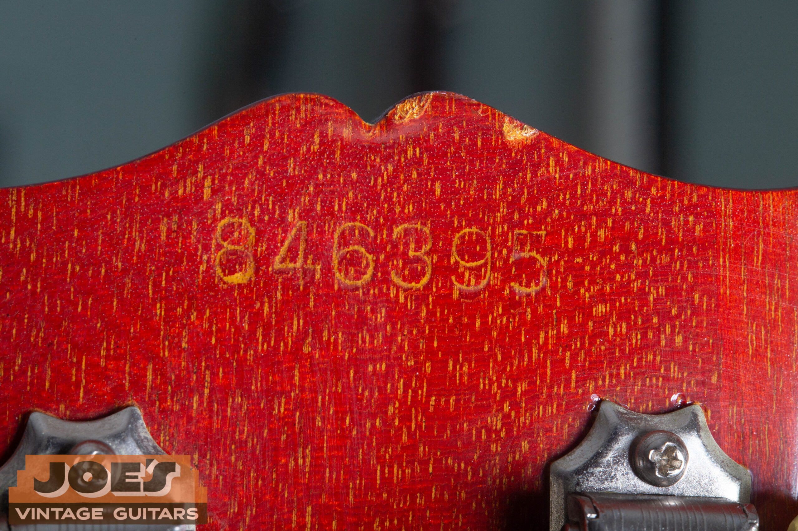

<figcaption><strong>Serial number on the back of a 1966 Gibson ES-335 headstock.</strong> The number is physically impressed (stamped) into the wood beneath the finish. It can be difficult to read when finish has filled the impression, raking a light across the surface reveals the indentation. The same serial number appears inked on the orange oval label inside the body.</figcaption>

</figure>

### 1966 Serial Ranges

Gibson used a 6-digit serial number system during this period with no letter prefix. The approximate range for 1966 production is **300000 to 420000**, though this range overlaps significantly with late 1965 and early 1967 production due to Gibson's batch-production numbering practices. A number in the 300000 to 420000 range tells you "mid-1960s" with confidence; pinning it to specifically 1966 requires the orange label and physical feature confirmation. For a complete breakdown of Gibson's serial number systems across all eras, see our [Gibson serial number dating guide](/how-to-read-gibson-serial-numbers/).

Gibson serial numbers in the 1960s were not strictly sequential by production date. Numbers were assigned in batches and instruments of the same model built weeks or months apart can have numbers that appear out of sequence. Never date a mid-1960s Gibson by serial number alone. Always cross-reference with the orange label date, the FON (factory order number) if present inside the body, and the physical specification details covered in this guide.

### Factory Order Numbers (FON)

Some 1966 ES-335s have a **Factory Order Number (FON)** ink-stamped inside the body, visible through the f-holes. The FON is a production batch identifier reflecting when the guitar was built. It is not always present, its absence is not a red flag. When it is present and consistent with the orange label serial, it adds supporting dating confidence.

<h2 id="headstock">Headstock, Logo & Truss Rod Cover</h2>

### Headstock Shape & Inlay

The 1966 ES-335 headstock is the **standard Gibson "open book" or "crown" shape**, a symmetrical split-diamond form that Gibson used across its electric guitar range throughout the 1960s. The headstock face is veneered with holly (a white hardwood) over the underlying mahogany. The **crown inlay** at the top of the headstock is mother-of-pearl, set into the holly veneer.

On an original 1966, the crown inlay should sit flush with the headstock surface. Lifted or re-glued inlays that show gaps at the edges indicate either damage or a headstock that has been worked on. The pearl of the crown inlay ages with a characteristic depth and slight iridescence that reproduction inlays, which are typically plastic or lower-grade pearl, do not replicate convincingly.

### The "Gibson" Logo

The 1966 ES-335 carries a **pearloid "Gibson" logo** on the headstock face, set into the holly veneer. This is an important authentication distinction: the pearloid logo sits flush with the headstock surface, with the surrounding finish flowing over it. Under a loupe, the logo and its inlay channel are visible. A decal logo on a claimed 1966 indicates either a later instrument or a headstock that has been altered.

<figure>

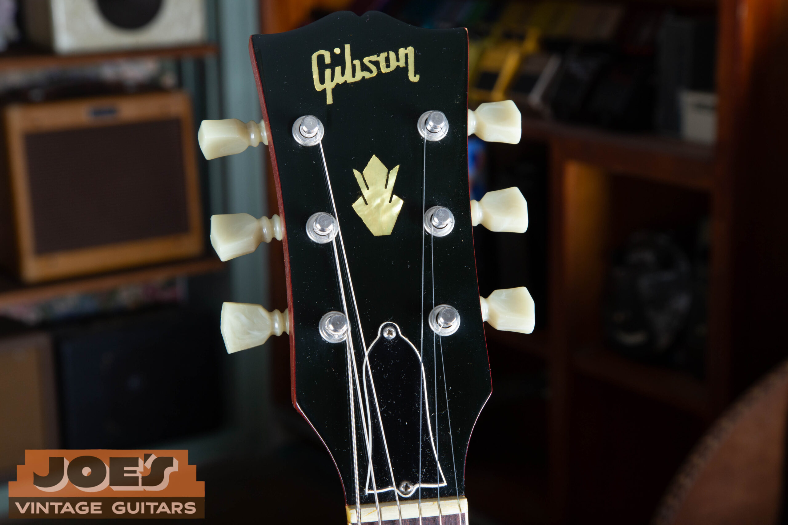

<figcaption><strong>1966 Gibson ES-335 headstock.</strong> The pearloid Gibson logo and crown inlay are clearly visible, along with the blank bell-shaped truss rod cover with its narrow bezel. The six Kluson Deluxe double-line tuners with their plastic tulip buttons are also correct for this year.</figcaption>

</figure>

### Truss Rod Cover

The 1966 ES-335 uses a **bell-shaped truss rod cover**, a black plastic cover with a slightly wider bottom that narrows toward the top, secured by two screws. The cover is **blank**, no text. It also features a **narrow raised bezel** around its perimeter, a detail specific to this era of Gibson truss rod cover. This is the standard format for mid-1960s Gibsons.

-   ShapeBell-shaped, wider at the bottom, tapering to a rounded top. Earlier Gibson guitars used a diamond-shaped cover; the bell shape is correct for 1966.
-   MaterialBlack plastic. Should show age-appropriate brittleness at the edges and screw holes on a 60-year-old original, not crisp and fresh-looking.
-   Text**Blank**, no text. Both screws should show consistent aging with the surrounding headstock finish. One fresh-looking screw on an otherwise aged guitar is a service indicator.
-   ScrewsTwo screws secure the cover. The screw slots should show consistent oxidation and tool marks from original factory installation.

<h2 id="neck">Neck, Nut, Fingerboard & Inlays</h2>

### Neck Construction & Profile

The 1966 ES-335 neck is **mahogany, set into the body** with Gibson's long-tenon joint. By 1966, Gibson's neck profiles were beginning to transition from the slimmer profiles of 1963 to 1965 toward the fuller profiles of the late 1960s and early 1970s. A 1966 neck is generally a comfortable medium C-to-D profile, slimmer than a 1968 to 1969 example but slightly fuller than a 1964. This is not a precisely defined specification since profiles varied somewhat from instrument to instrument even within the same year.

### The Nut

The 1966 ES-335 uses a **white nylon (or white plastic) nut**, not bone. Gibson transitioned away from bone nuts in the early-to-mid 1960s, and by 1966 the white nylon nut was standard across the electric guitar range. This is a detail that surprises some buyers who assume bone is always more "original" on vintage Gibsons, on a 1966, it is not. A bone nut on a claimed 1966 ES-335 suggests a replacement nut.

The original nylon nut should show wear consistent with 60 years of string contact, subtle grooves in the string slots, slight yellowing of the white material, and consistent patina with the surrounding headstock finish. A bright white, crisp-edged nut is likely a replacement.

### Fingerboard & Binding

The fingerboard is **rosewood**, bound on both edges with a single ply of cream/white binding. This binding is a structural and aesthetic detail, the bound fingerboard is one of the features that distinguishes the ES-335 from more budget-oriented Gibson semi-hollows of the period.

The rosewood on a genuine 1966 will show a natural grain pattern. Modern rosewood replacements or refretted necks with resurfaced boards may show different color uniformity or grain character.

### Fret Nibs, A Critical Authentication Detail

One of the most important and revealing authentication details on a 1966 ES-335 is the presence of **fret nibs**, small projections of binding material that extend over the ends of the frets at the edge of the fingerboard. These are a direct result of Gibson's manufacturing sequence: the fingerboard was bound *before* the frets were installed. The fret ends were then filed flush with the top of the binding, leaving a small nib of binding material visible at each fret end.

Fret nibs are present on all factory-original Gibson necks from this era. Their importance as an authentication tool is this: **when a vintage guitar is refretted, the fret nibs are almost always destroyed**. New frets are pulled, the slots are cleaned, new frets are installed and dressed. In this process the binding nibs are nearly always filed away as part of leveling and dressing the new frets.

If a claimed 1966 ES-335 has intact, well-defined fret nibs at every fret position, the frets are almost certainly original. This is one of the fastest and most reliable single checks for fret originality. Worn nibs (from normal playing) are fine and expected, *absent* nibs strongly suggest a refret. Some partial nib loss from wear at the most-played positions (first through fifth frets) is normal on a played guitar.

<figure>

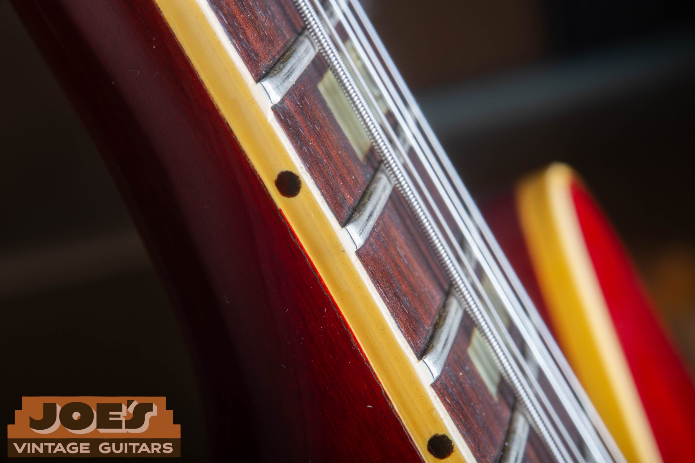

<figcaption><strong>Fret nibs on a 1966 Gibson ES-335.</strong> The small projections of binding material extending over each fret end are the clearest single indicator of original, unrefretted frets. Because Gibson bound the fingerboard before installing the frets, the binding nibs remain intact as long as the frets have never been pulled. Refrets almost always destroy these nibs during the leveling and dressing process. Present fret nibs across all positions, as seen here, confirm original frets with a high degree of confidence.</figcaption>

</figure>

### Block Inlays

The 1966 ES-335 has **small rectangular block inlays** in the fingerboard, not dots. Gibson switched the ES-335 from dot inlays to block inlays in 1962; the dot-neck ES-335s of 1958 to 1961 are a separate and generally more valuable category. All 1962 and later ES-335s through this era use the block inlay format. The blocks are cellulose nitrate plastic, usually called pearloid or celluloid, set flush with the fingerboard surface. They are not real mother-of-pearl, and a listing claiming solid pearl blocks on a 1960s ES-335 has the material wrong.

Genuine pearl inlays show a layered, iridescent quality that catches light differently at different angles. Plastic or epoxy replacement inlays are typically more uniform in appearance and don't show the same depth. At the headstock end of the neck (first position), look at the blocks under raking light, original pearl should show natural layering and variation across the block's surface.

<figure>

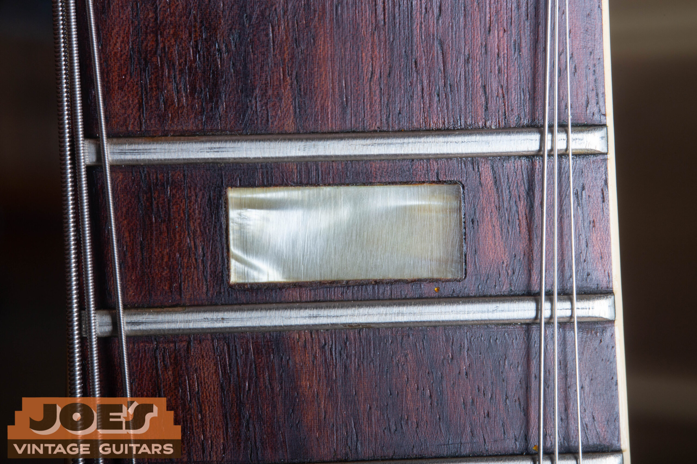

<figcaption><strong>Mother-of-pearl block inlay on a 1966 Gibson ES-335.</strong> The block inlays on a 1966 ES-335 are mother-of-pearl, a natural material with a characteristic layered iridescence that catches light differently at different angles. Genuine pearl shows depth and natural variation across the face of each block. Plastic or epoxy reproduction inlays are more uniform in their reflectivity and don't show the same natural layering under close inspection.</figcaption>

</figure>

### Side Dot Inlays, Tortoise, Not White

This is one of the most consistently overlooked details on mid-1960s Gibsons: the **side dot position markers on the neck edge are tortoise-colored**, a dark reddish swirl pattern, not white. Gibson used tortoise-colored plastic side dots throughout the 1960s on the ES-335. The switch to white side dots occurred later.

A claimed 1966 ES-335 with white side dots has either a replacement neck or has had the side dots replaced. The tortoise color is subtle and can appear darker or lighter depending on how much the plastic has aged, but it should never be the bright white of a modern replacement. Under a flashlight, genuine tortoise dots show a dark reddish swirling pattern, the characteristic tortoise shell appearance.

<figure>

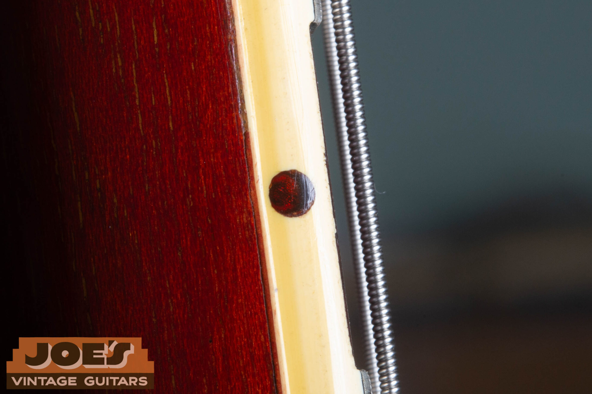

<figcaption><strong>Tortoise-colored side dot on a 1966 Gibson ES-335.</strong> The amber/brown tortoise color of the side position markers is one of the most commonly overlooked authentication details on mid-1960s Gibsons, and one of the most reliable. A claimed 1966 with white side dots has either a replacement neck or replaced side dots. Under a flashlight the genuine tortoise plastic shows a dark reddish swirl pattern distinctly different from the bright white of a modern replacement.</figcaption>

</figure>

<h2 id="body">Body, Horns & Binding</h2>

### Construction

The ES-335 body is a **thinline semi-hollow double-cutaway**, maple top, back, and sides with a solid maple center block running the full length of the body internally. This center block eliminates the feedback problems of fully hollow instruments while retaining some acoustic resonance. The body thickness is 1¾ inches, unchanged from the original 1958 specification.

The internal construction, specifically the routing and the way the center block meets the top and back, is a detail visible through the f-holes that can help authenticate or raise questions about a guitar. Genuine 1966 bodies should show consistent, period-correct construction without evidence of internal repairs, added bracing, or routing that doesn't match factory specifications.

### Horn Shape, A Subtle but Real Difference

The cutaway horn shape on the ES-335 evolved gradually over the instrument's production history, and the 1966 horns are detectably different from the horns of the earliest examples. The **1958 to 1961 "dot neck" ES-335s have rounder, more gently curved horns**. By the mid-1960s the horns had become slightly more **pointed and angular** at the tips, a subtle change that is most visible when comparing an early example directly to a mid-to-late 1960s example side by side.

This is not a dramatic visual difference and should not be the only basis for dating or authentication, but it is a consistent period indicator. A claimed 1966 with noticeably round, blunt horn tips may warrant a closer look at whether the body is actually from an earlier period.

<figure>

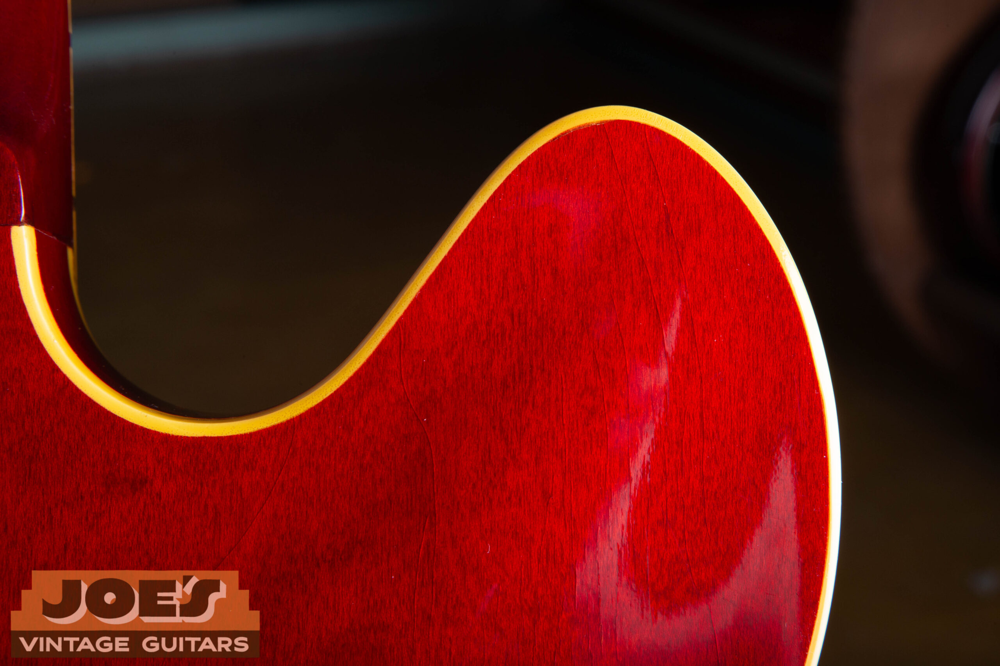

<figcaption><strong>Cutaway horn on a 1966 Gibson ES-335.</strong> The horn tips on a 1966 ES-335 are visibly more pointed than the rounder, blunter horns of the 1958 to 1961 dot-neck era. This gradual evolution in body geometry is a supporting dating indicator, not dramatic enough to date a guitar on its own, but consistent and detectable when you know what to look for.</figcaption>

</figure>

### Binding

The body has **single-ply cream binding on both the top and back edges**. Binding condition varies widely. Mint unplayed examples exist with binding still looking fresh, while heavily played examples show checking and yellowing. What matters is that the binding character is consistent throughout the instrument.

The f-holes are also bound, a distinctive ES-335 detail. The binding around the f-holes is particularly vulnerable to cracking and lifting over time; original bound f-holes that show period-consistent aging but no signs of re-gluing or replacement are a positive indicator.

<h2 id="pickguard">Pickguard & Controls</h2>

### Multi-Layer Pickguard

The 1966 ES-335 pickguard is a **multi-layer laminated unit**, the layered construction is visible at the edge as a sandwich of alternating materials (typically black/white/black or similar). This is distinctly different from a single-ply guard, and the layering is immediately visible at the cut edge of the pickguard. The guard is mounted on a metal bracket that attaches to the body. It does not screw directly into the top.

Original 1966 pickguards will show age-appropriate warping, shrinkage, and checking of the laminate at the edges. The guard may have pulled slightly away from its original flat shape. A perfectly flat, crisp-edged, multi-layer guard on a claimed 1966 is more likely a replacement than an original.

<figure>

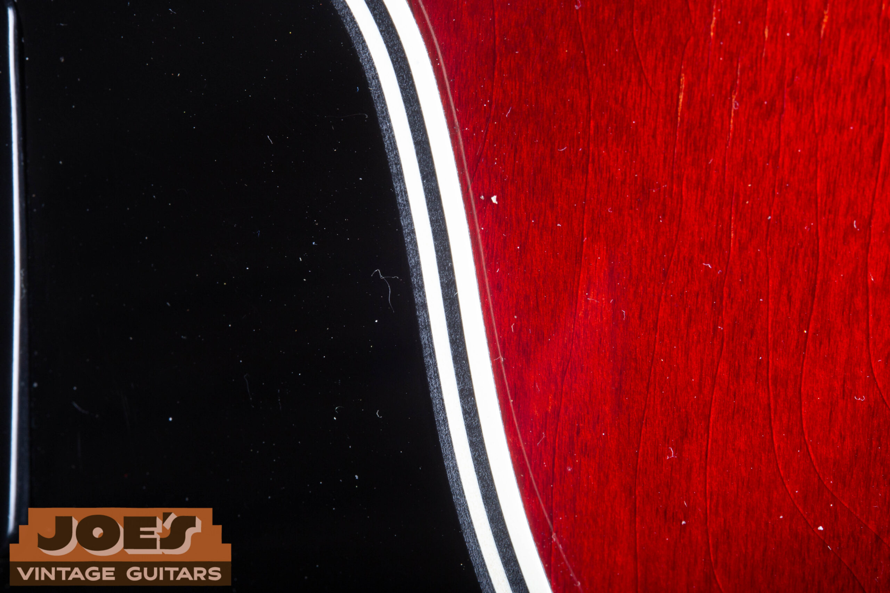

<figcaption><strong>Multi-layer pickguard edge detail, 1966 Gibson ES-335.</strong> The laminated construction of the period-correct pickguard is clearly visible at the cut edge, alternating layers of material creating a distinctive sandwich. This layered construction is unique to the multi-ply guard; a single-ply replacement shows a uniform edge without layering.</figcaption>

</figure>

<figure>

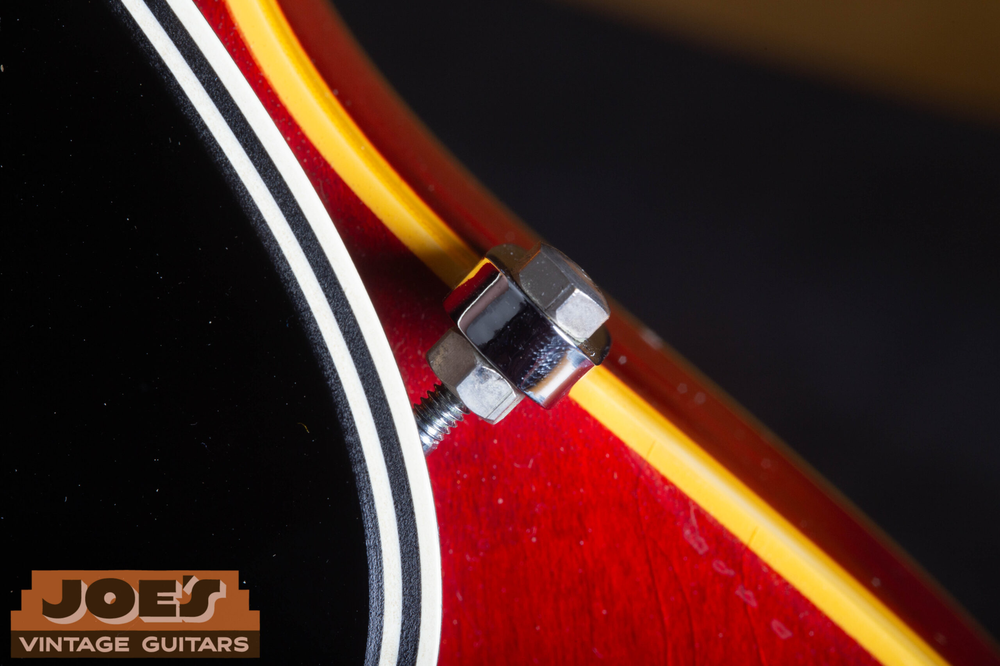

<figcaption><strong>Chrome pickguard mounting bracket on a 1966 Gibson ES-335.</strong> The pickguard is mounted on a chrome metal bracket that attaches to the body rather than screwing directly into the top. The bracket hardware should show chrome aging consistent with the rest of the instrument. A replacement bracket with fresh chrome on an otherwise aged guitar is a quick tell.</figcaption>

</figure>

### Controls Layout

The ES-335 has a standard layout of **four controls (two volume, two tone) and a three-way toggle switch**. The toggle is mounted on the upper bout. The output jack is on the side of the body, recessed into a barrel-style jack cup. All wiring on a genuine 1966 uses coaxial wire with a metal braid outer shield.

Potentiometers (pots) carry manufacturer date codes. CTS was the most common supplier for 1966 Gibson guitars. A pot code reading "137 6625" indicates CTS (code 137), made in 1966, week 25, approximately mid-June 1966. Read all four pots (three controls plus the toggle switch wafer if accessible) and confirm they all read from approximately the same period. A pot reading significantly later than the others indicates a replacement.

The "bumblebee" capacitors associated with late-1950s Gibsons gave way to the Sprague "Black Beauty," which ran through to about 1969, so a Black Beauty is period-correct in a 1966. Ceramic disc caps and "Vitamin Q" style units also turn up. The specific capacitor type on a 1966 ES-335 is less diagnostic than on a late-1950s instrument, what matters is that it's not a modern orange drop cap or other obviously anachronistic component.

<h2 id="pickups">Patent Number Pickups</h2>

<figure>

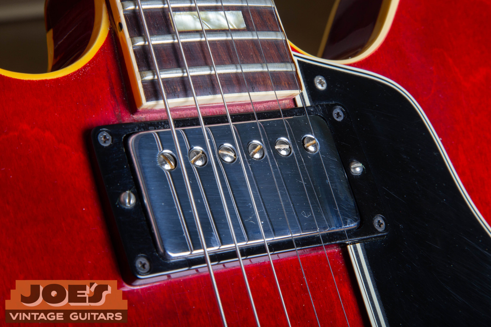

<figcaption><strong>Patent Number humbucker on a 1966 Gibson ES-335.</strong> The chrome-covered humbucker pickup is one of the ES-335's defining visual elements. On a 1966, this is a pre-T-top Patent Number humbucker, not a PAF, not a T-top. The chrome cover aging, the adjustable and non-adjustable pole piece rows, and the base plate sticker are all key authentication points covered in detail below.</figcaption>

</figure>

The pickups on a 1966 ES-335 are among the most important and scrutinized authentication points on the guitar. Understanding exactly what they are, and what they are not, is essential.

### The Pickup Evolution: PAF → Patent Sticker → Patent Number

Gibson's humbucker pickup went through three distinct phases in the first decade of production:

-   PAF Era**~1957 to 1962.** "Patent Applied For" sticker on the base plate. The gold label. Hand-wound with varying specifications. Generally considered the most tonally complex and desirable. NOT present on 1966 instruments.
-   Patent Sticker Era**~1962 to 1965.** The PAF sticker replaced with a black sticker reading the patent number. Still largely hand-wound with similar specs to late PAFs. Transitional era. NOT present on 1966.
-   Patent Number Era**~1962 to late 1960s.** A **black sticker reading "Patent No 2,737,842"** on the base plate. This is what a genuine 1966 ES-335 has. Pre-T-top winding and construction. Genuinely excellent pickups that are often underrated.
-   T-Top Era**Phased in gradually between 1965 and 1967, standard through about 1975.** Named for the raised T moulded into the top of each bobbin, visible from the adjustable-pole side with the cover off. More consistent winding, different sonic character. Most 1966s predate it, but the changeover overlaps the year.

### Authenticating 1966 Patent Number Pickups

Pickup swaps are extremely common on vintage Gibsons, PAFs especially are highly desirable and frequently transplanted. For production volume context, our [Gibson shipping totals 1948 to 1979](/post/gibson-shipping-totals-1948-1979/) shows how many ES-335s were built each year. Confirming that the pickups in a claimed 1966 ES-335 are original and period-correct requires checking multiple details:

-   Base plate stickerA **black sticker reading "Patent No 2,737,842"** on the base plate, this is the correct form for 1966. On a 1966, you should see the sticker.
-   Magnet type**Alnico magnet**, not ceramic. Genuine pre-T-top Patent Number pickups use Alnico II or Alnico V magnets. Ceramic magnets (which are stronger and harder to the touch) indicate a later or replacement pickup. A small rare-earth magnet held near the pickup will be attracted to Alnico; ceramic pickups interact differently.
-   Pole piecesOne row of **adjustable pole pieces** (slotted screws) and one row of **non-adjustable slugs**, the standard Gibson humbucker configuration. Both rows are only visible with the cover removed.
-   DC resistanceTypically **7.5k to 8.5k ohms** per pickup on period-correct examples. Readings significantly outside this range suggest a rewind. Both pickups should read in roughly the same range, a dramatic mismatch indicates one may be a replacement.
-   Lead wires**Coaxial lead wires with a metal braid outer shield** over a cloth-covered inner conductor. Plastic-insulated lead wires indicate a replacement pickup or a rewound unit.
-   Cover solderThe pickup cover is **held by solder**, not screws. The cover is soldered to the base plate at two points. Undisturbed original factory solder at these joints is a strong indicator the cover has never been removed. Re-flowed or disturbed solder is not automatically disqualifying but should be noted, as it indicates the cover has been off at some point.
-   T-top checkThe T-top coil former (visible from the adjustable-pole side with the cover removed) indicates 1967 or later production. However, **you do not need to remove the cover** to make this assessment, and on an original unplayed example you should avoid disturbing the solder. If you have suspicions about pickup replacement, check instead whether the pickup aging and wiring condition matches the rest of the guitar. Mismatched wear, different lead wire style, or solder that looks re-flowed are more practical tells than pulling the cover.

<figure>

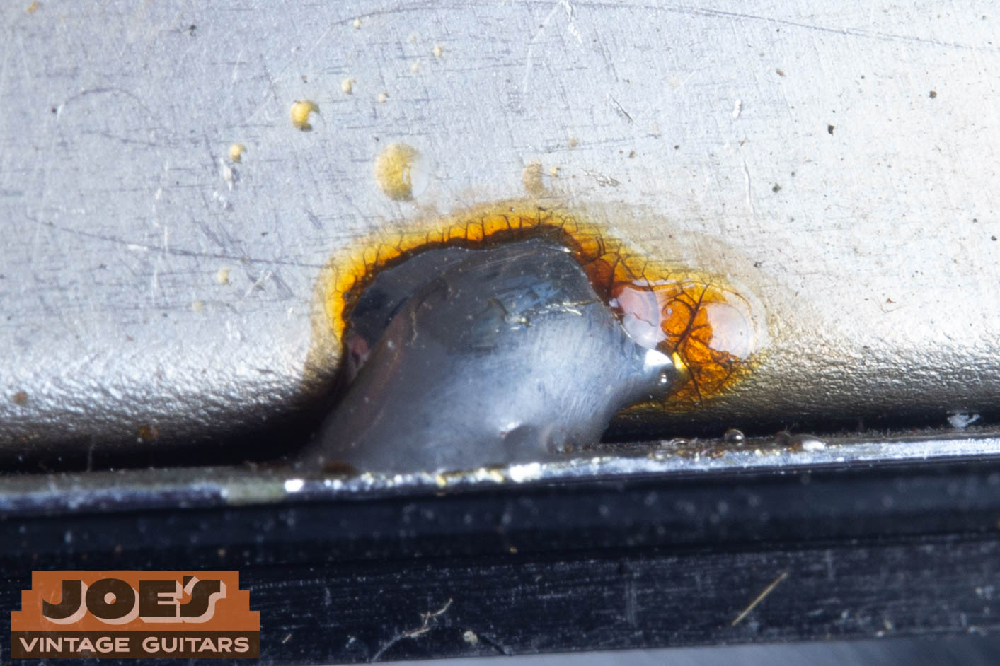

<figcaption><strong>Undisturbed factory solder on a 1966 Gibson ES-335 pickup cover.</strong> The solder joints that secure the chrome pickup cover to the base plate are original and undisturbed. The cover is held by solder at two points, not screws. Factory solder from 1966 shows a characteristic texture distinct from fresh or re-flowed work. Undisturbed solder strongly suggests the pickup is all-original and the cover has never been removed.</figcaption>

</figure>

<figure>

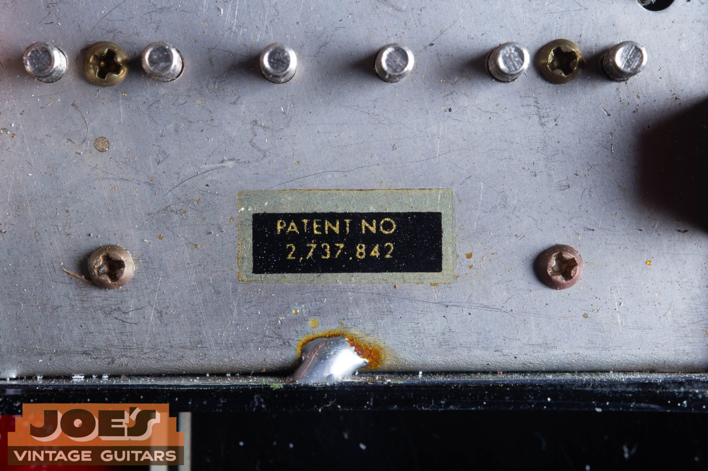

<figcaption><strong>Patent Number sticker on a 1966 Gibson ES-335 humbucker base plate.</strong> The black sticker reading "Patent No 2,737,842" is the defining identifier of the Patent Number era pickup. The sticker replaced the gold PAF label of the late 1950s to early 1960s. Its condition and aging should be consistent with the age of the pickup and guitar.</figcaption>

</figure>

Because PAF pickups are significantly more valuable than Patent Number units, there is an active market in misrepresenting Patent Number pickups as PAFs, removing the patent number sticker and replacing it with a gold PAF sticker. Always verify the sticker type, the magnet type, and the coil former before accepting any pickup identification claim.

<h2 id="bridge">ABR-1 Bridge & Tailpiece</h2>

### The ABR-1 Tune-o-matic Bridge

The 1966 ES-335 uses the **ABR-1 Tune-o-matic bridge**, the original Gibson adjustable bridge design introduced in 1954. The "ABR-1" designation is cast or stamped on the **back of the bridge**, which is a key authentication detail. The bridge sits on two threaded posts that screw into anchors in the top; height is adjusted by raising or lowering these posts.

-   "ABR-1" markingLook on the back of the bridge (the side facing the tailpiece). "ABR-1" should be legible, cast or stamped into the metal. Later Nashville-style Tune-o-matics are dimensionally different and do not have this marking in the same location. An ABR-1 is narrower and sits on smaller posts than the Nashville bridge.
-   Retainer wireA thin metal retainer wire runs through the saddle adjustment screws, holding the saddles in position on the bridge chassis. This wire is **present on all authentic ABR-1 bridges through approximately 1975** and is one of the fastest ways to confirm an original or period-correct bridge. A bridge without the retainer wire on a claimed 1966 is either a replacement or has had the wire removed.
-   Posts and anchorsThe bridge posts on a 1966 ES-335 have **thumbwheel adjusters** that allow height adjustment by hand. The posts thread into anchors set into the maple top. Original posts and anchors will show consistent aging and chrome wear with the rest of the hardware.

<figure>

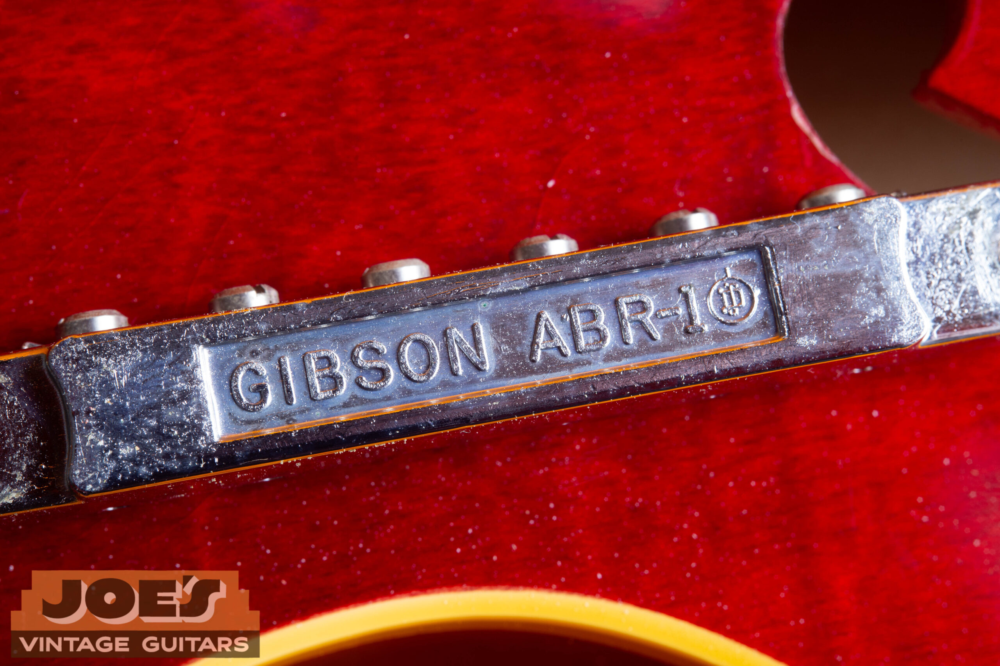

<figcaption><strong>Back of the ABR-1 Tune-o-matic bridge on a 1966 Gibson ES-335.</strong> The "ABR-1" stamp on the back of the bridge is a key authentication point, the original narrow-post ABR-1 bridge differs dimensionally from the later Nashville-style Tune-o-matic. A Nashville bridge requires different post spacing and leaves evidence of re-drilling if it has replaced an ABR-1. This stamp, visible on the tailpiece-facing side of the bridge, confirms the original bridge type.</figcaption>

</figure>

### Bridge Saddles, The 1966 Transition

The 1966 ES-335 uses **nylon/plastic saddles** on the ABR-1 bridge. The ABR-1 arrived in 1954 with metal saddles; Gibson moved to nylon around 1961 to 1962 and ran nylon through approximately 1969 to 1970, when they switched to chrome-plated saddles. A 1966 should always have nylon saddles, chrome saddles on a claimed 1966 indicate either a bridge replacement or a later instrument.

Nylon saddles can show string contact grooves and occasional cracking or chipping over time, this is period-authentic aging. Check that all six saddles are the same type; a mix of nylon and metal saddles indicates a partial replacement.

<figure>

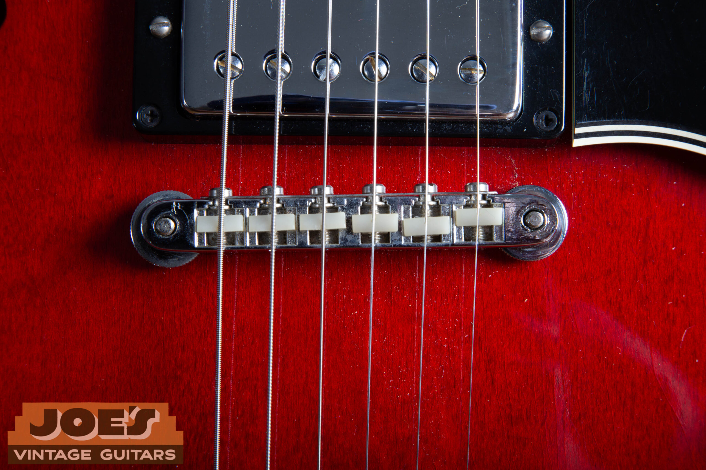

<figcaption><strong>ABR-1 Tune-o-matic bridge with nylon saddles on a 1966 Gibson ES-335.</strong> Nylon/plastic saddles are correct for all 1966 production, Gibson did not switch to chrome-plated saddles until approximately 1969 to 1970. The thin metal retainer wire threading through the saddle adjustment screws is also present and correct. "ABR-1" is stamped on the reverse side of this bridge.</figcaption>

</figure>

### Trapeze Tailpiece

The 1966 ES-335 uses a **trapeze tailpiece**, a hinged, bracket-style tailpiece that attaches to the strap button on the end of the body and angles up to anchor the strings above the top. This is the correct tailpiece for the ES-335 in 1966.

<figure>

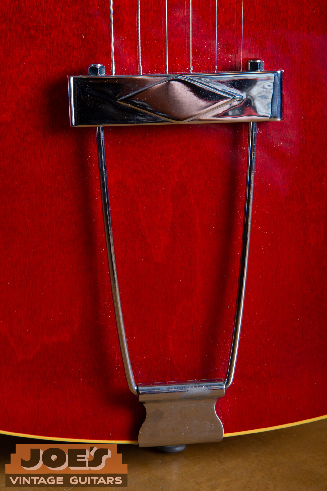

<figcaption><strong>Trapeze tailpiece on a 1966 Gibson ES-335.</strong> The trapeze tailpiece is the correct configuration for the ES-335 in 1966. It attaches at the end strap button and angles up to anchor the strings above the top. The hardware condition should be consistent with the rest of the instrument.</figcaption>

</figure>

The trapeze tailpiece hardware and finish should show aging consistent with the rest of the instrument. The hinge mechanism and string bar should move freely and show no evidence of replacement or non-original hardware.

<h2 id="hardware">Tuners, Knobs & Switch Tip</h2>

### Kluson Deluxe Double-Line Tuners with Double-Ring Buttons

The 1966 ES-335 is fitted with **Kluson Deluxe "double-line" tuners**, named for the fact that "KLUSON DELUXE" is stamped **twice**, in two parallel vertical columns down the back of each gear housing. This distinguishes them from the single-line Klusons Gibson used through the 1950s and into the early 1960s, where the same words appear once, and from the earlier no-text housings. Gibson moved to double-line stampings around 1964.

The tuner buttons on this era of Kluson are **plastic tulip buttons** in the **"double-ring" style**, named for the two concentric raised rings moulded into the collar. Gibson switched from single-ring to double-ring buttons around the middle of 1960. These are plastic, not metal: metal oval buttons are the Fender-fitted Kluson style, not the Gibson one. Old tulip buttons shrink, crack and yellow with age, and that ageing is what you want to see.

<figure>

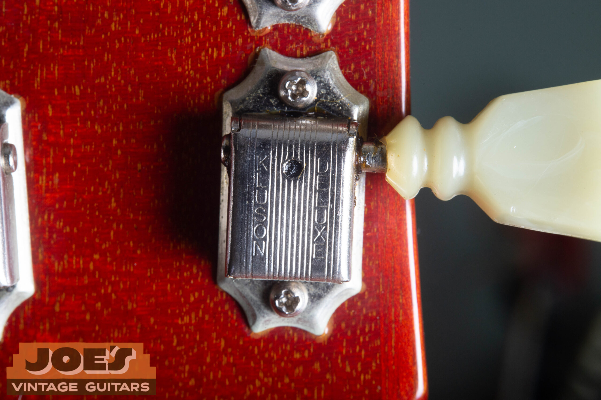

<figcaption><strong>Back of a Kluson Deluxe double-line tuner on a 1966 Gibson ES-335.</strong> "KLUSON DELUXE" stamped twice, in two parallel columns down the gear housing back, is the defining identifier for this era of tuner. The single-line version, where the same words appear once, is what Gibson used through the 1950s and into the early 1960s before the change around 1964. Chrome aging on the housing should be consistent with the rest of the hardware.</figcaption>

</figure>

<figure>

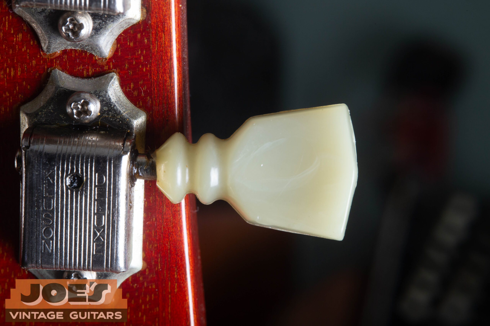

<figcaption><strong>Double-ring tuner button on a 1966 Gibson ES-335 Kluson Deluxe.</strong> The two concentric raised rings moulded into the collar are the defining feature of the "double-ring" style correct for this era. These are plastic tulip buttons, not metal; Gibson went from single-ring to double-ring around mid-1960. All six should show consistent, matched ageing, with the shrinkage and yellowing old tulip plastic always develops.</figcaption>

</figure>

Gibson began transitioning some models to Grover Rotomatic tuners in the mid-1960s, and some 1966 ES-335s left the factory with Grovers rather than Klusons. If your example has Grover Rotomatics, the enclosed, oval-housing tuners, and they appear original (no added mounting holes, consistent aging, no evidence of Kluson holes being filled), this can be a correct factory specification rather than a modification. The double-line Klusons with double-ring buttons described here are the more common 1966 tuner, but Grovers are not automatically a red flag.

### Top Hat / Reflector Knobs

The volume and tone controls on the 1966 ES-335 use **"top hat" knobs**, also called "reflector knobs." These have a two-part construction: a reflector "hat" top sitting in a metal skirt. The top color varies by finish, **black tops on cherry-finish guitars, amber/gold tops on sunburst guitars**. The example shown in the photos has black tops, correct for a cherry-finish instrument.

<figure>

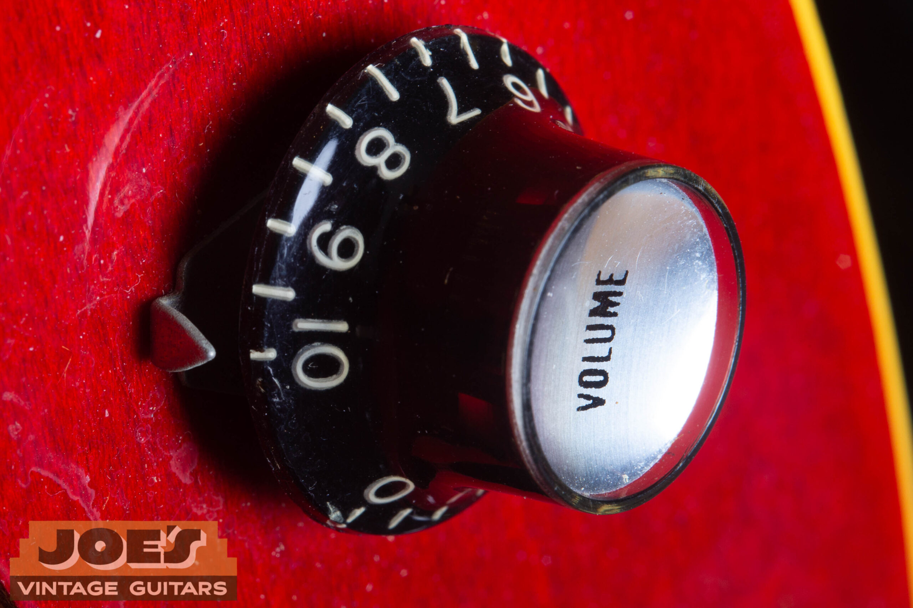

<figcaption><strong>Top hat / reflector knob on a 1966 Gibson ES-335 (cherry finish).</strong> The black reflector top is correct for cherry-finish ES-335s, amber/gold tops appear on sunburst examples. All four knobs on a genuine all-original instrument should show matching tops and consistent skirt condition.</figcaption>

</figure>

All four knobs should match in both top color and skirt condition. A mismatched top color or one knob with a noticeably different appearance suggests a replacement.

Earlier ES-335s used "speed knobs", a different, more dome-shaped style. The top hat/reflector style is correct for the mid-1960s.

### Toggle Switch Tip

The pickup selector toggle switch tip on the 1966 ES-335 is **white plastic with a visible mold seam running around the top portion** of the tip. This seam is a characteristic of the injection-molded plastic tip used in the mid-1960s. It's where the two halves of the mold met during manufacturing, leaving a slight raised line that is visible and can be felt. This mold seam is a period-authentic manufacturing artifact.

<figure>

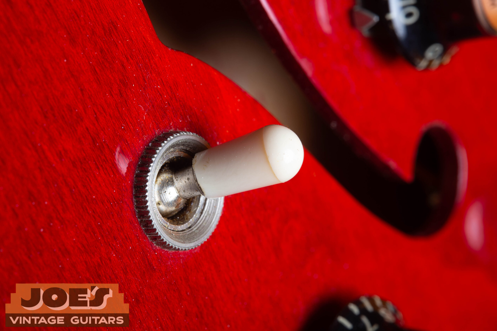

<figcaption><strong>Toggle switch tip on a 1966 Gibson ES-335.</strong> The white plastic switch tip shows the characteristic mold seam, a slight raised line running around the upper portion of the tip where the two halves of the injection mold met during manufacturing. This seam is a period-authentic manufacturing artifact. The white plastic should show consistent aging with the nut and any other white plastic components on the guitar, not bright white after 60 years.</figcaption>

</figure>

Replacement switch tips, which are widely available and commonly swapped, may or may not have the same seam. Compare the color and aging of the tip to the nut and any other white plastic components on the guitar. All white plastics on an all-original guitar should show consistent, matched aging: they should not be blindingly white after 60 years, but neither should they be drastically different from each other.

### Strap Button

The strap buttons on the 1966 ES-335 are **aluminum with a chrome screw**. The aluminum button itself is noticeably less shiny than the chrome hardware elsewhere on the guitar. Do not expect them to match the bridge or tuner chrome. One button is on the lower bout end pin and one is on the upper shoulder.

<figure>

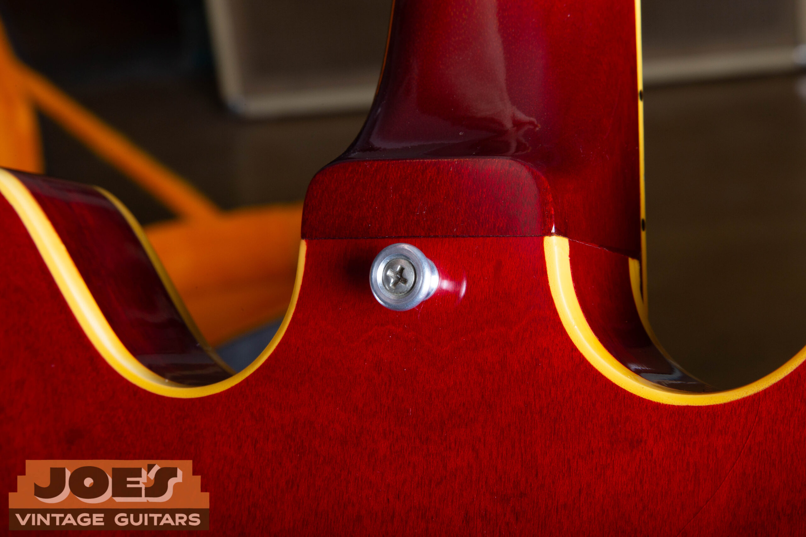

<figcaption><strong>Strap button at the upper shoulder of a 1966 Gibson ES-335.</strong> The aluminum button is intentionally less shiny than the chrome bridge and tuner hardware, this is correct and not an indication of a replacement. The button is secured with a chrome screw. Do not expect the strap buttons to match the reflectivity of the other chrome hardware on the instrument.</figcaption>

</figure>

<h2 id="label">Orange Label & Interior</h2>

### The Orange Oval Label

Inside the body of the 1966 ES-335, visible through the bass-side f-hole, is the **orange oval paper label**, one of the most important authentication and dating references on any Gibson from this period. The orange label replaced the earlier white labels and tan labels and was used by Gibson through the 1960s and into the 1970s.

-   ColorOrange, unmistakably orange on a genuine example. Not red, not yellow, not tan.
-   ShapeOval. The label includes "UNION MADE" and "HEREBY GUARANTEED" text, these are period-specific details to look for on a genuine 1966 label.
-   Model designation"STYLE ES-335 TDC", the suffixes stand for Thinline, Dual pickup, Cutaway. This model designation should match the instrument you're looking at.
-   Serial numberThe serial number is printed on the label and should match the ink stamp on the back of the headstock. A mismatch between label and headstock serial is a significant red flag.
-   Kalamazoo, MichiganThe label reads "Made in Kalamazoo, Michigan, U.S.A.", correct for all pre-1984 Gibson electric guitars. Nashville production began in 1974 for some models; by 1984 Kalamazoo had closed. A 1966 label should read Kalamazoo.

<figure>

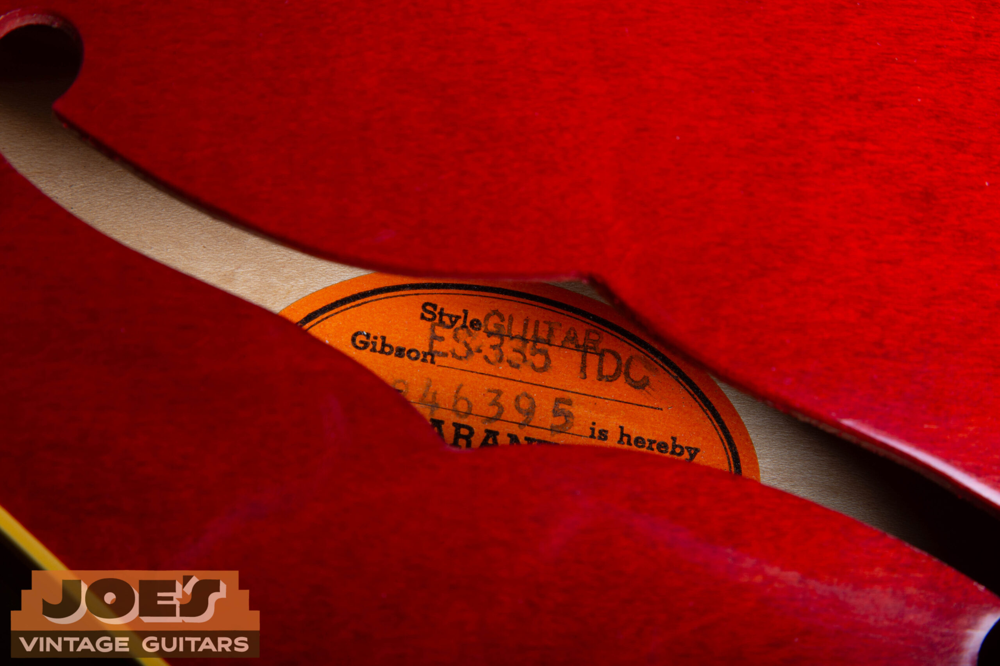

<figcaption><strong>Orange oval label inside a 1966 Gibson ES-335, visible through the bass-side f-hole.</strong> The orange oval reads "STYLE ES-335 TDC" with the serial number printed below. "Made in Kalamazoo, Michigan, U.S.A." confirms pre-1984 production. The serial number on this label should match the number impressed into the back of the headstock, a mismatch between the two is a significant red flag. The label's aging, adhesion, and flatness against the interior are all authentication indicators.</figcaption>

</figure>

Orange labels can be removed and reinserted through the f-hole, and labels from scrapped or parts guitars are sometimes used to give fraudulent credibility to a different body. A label that appears too clean, too flat, or shows evidence of being re-glued is suspicious. The label should show age-consistent yellowing, slight adhesive bleed, and should lie flat against the interior of the body in a way consistent with having been there since 1966.

<h2 id="tenon">Neck Tenon & Routing</h2>

### The Long Tenon Neck Joint

The ES-335's neck is attached to the body with Gibson's **long tenon mortise-and-tenon joint**, the tenon (the protruding tongue of the neck heel) extends significantly into the body cavity, providing a large gluing surface area. This long tenon is a structural feature of 1960s Gibson construction and differs from the shorter tenon joints used on some later and less expensive instruments.

The long tenon is visible by removing the neck pickup, it can be seen extending into the body cavity from the neck pickup route. A tight, gap-free joint with no evidence of shimming or re-setting is correct. A neck that sits oddly, requires a dramatically lowered bridge, or shows evidence of shimming or re-setting may have been removed and reset at some point, which is not disqualifying but should be disclosed.

<figure>

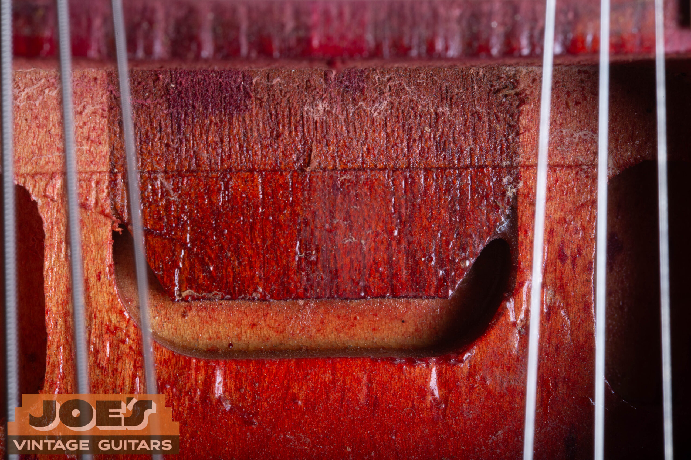

<figcaption><strong>Neck tenon visible through the neck pickup cavity of a 1966 Gibson ES-335.</strong> With the neck pickup removed, the long tenon extending from the neck heel into the body cavity is clearly visible. This long gluing surface is a structural hallmark of Kalamazoo-era Gibson construction. A tight, gap-free joint with no evidence of shimming confirms the original neck-body relationship.</figcaption>

</figure>

### Pickup Routing, The Deeper Humbucker Channel

One of the more technically specific authentication details on the 1966 ES-335 is the **routing pattern for the pickups**. Because the ES-335's f-hole semi-hollow construction requires routing through the maple top into the body cavity, the pickup routes have specific dimensions and depths. The critical detail for humbuckers is the **additional channels routed on the sides of the pickup route for the pickup height adjustment screws**.

When a humbucker pickup is installed in the ES-335, the adjustable pole piece screws extend down through the pickup baseplate. The routing on the sides of the pickup cavity includes deeper channels that allow the pickup height adjustment screws to travel their full range without the mounting ring contacting the wood. This deeper routing channel is visible through the pickup route when the pickup is removed.

<figure>

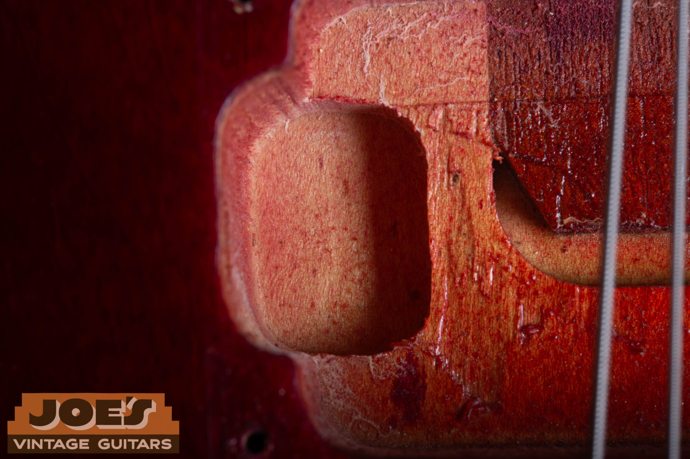

<figcaption><strong>Pickup route on a 1966 Gibson ES-335 showing the side channels for pickup height adjustment screws.</strong> The main pickup cavity is visible along with the additional channels cut into the sides, these allow the pickup mounting ring height adjustment screws to travel their full range. This factory routing pattern is specific to the ES-335 humbucker configuration and confirms original construction.</figcaption>

</figure>

The presence of these side channels in the correct locations confirms factory-original ES-335 body routing. Bodies that have been improperly modified will show evidence of non-standard routing or filled channels.

<h2 id="chrome">Chrome Plating & Aging</h2>

The hardware on a 1966 ES-335, bridge, tailpiece, tuners, pickup covers, strap buttons, switch ring, truss rod cover screws, is all chrome-plated. The aging pattern of original 60-year-old chrome is one of the most reliable overall authentication indicators, and one that is very difficult to fake convincingly.

### How Original 1966 Chrome Ages

Genuine mid-1960s Gibson chrome on a well-played example shows a characteristic **consistent dulling**, the chrome loses its mirror-bright quality and develops a patina. However, **mint unplayed examples do exist**, including the guitar shown in the photos throughout this guide, where the chrome remains bright and largely unaged. On such an example, the key authentication indicator is not the level of aging but the **consistency**: all hardware should look equally new or equally aged. A mix of fresh and tarnished hardware on the same guitar is the red flag, not brightness itself. This aging is not random: it follows the natural pattern of corrosion and environmental exposure, which means areas protected from handling (like the underside of the bridge) age more slowly than areas in contact with hands (like the top of the tailpiece bar).

-   Consistent patinaAll chrome hardware on an all-original guitar should show **matched, consistent aging**. Hardware that is dramatically brighter or more tarnished than the surrounding pieces suggests replacement. The bridge, tailpiece, and tuner housings should all show the same general level of age.
-   No pitting on originalsOriginal 1966 Gibson chrome typically shows a uniform dulling without heavy pitting or flaking, the mid-1960s chrome plating quality was generally good. Heavy pitting more often indicates lower-quality plating (common on import reproductions) or extreme environmental exposure.
-   Reproduction hardware tellsReproduction chrome hardware is almost always either too bright (freshly plated) or artificially aged in a way that is too uniform, real aging follows contour, contact, and protection patterns. Artificially aged hardware tends to look consistently dull across all surfaces, whereas genuine age produces variation.
-   Where aging concentratesAreas with regular hand contact, the tailpiece top surface, the bridge thumbwheels, the tuner buttons and housing backs, show more significant wear than protected areas. This differential wear pattern is authentic and should be present.

<h2 id="case">Case & Case Candy</h2>

### The 1966 Gibson ES-335 Case

The correct original case for a 1966 ES-335 is a **black hardshell case** with the Gibson logo badge on the exterior. The exterior covering is black, with metal latch and handle hardware. The interior is **yellow/gold plush**, a warm yellow fabric that lines the interior including the body cavity, the neck rest, and the accessory compartment.

This yellow interior is a very specific detail. It is **not crushed velvet** (which appeared on later cases) and not the purple, red, or green interiors of other periods. The yellow/gold plush is correct for mid-1960s Gibson cases and is one of the fastest case authentication checks. The color should be unmistakably yellow-to-gold. Mint examples will retain a brighter yellow; played examples may show compression and deepening of the color over time.

<figure>

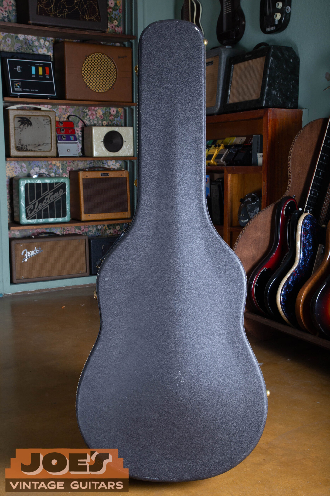

<figcaption><strong>Exterior of the original 1966 Gibson ES-335 hardshell case.</strong> The correct case for a 1966 ES-335 is a black hardshell with the Gibson logo badge on the lid, chrome-plated latch and handle hardware, and a contoured shape following the ES-335's double-cutaway body. The exterior covering, badge design, and hardware all age in period-consistent ways, a case that looks significantly newer or older than the guitar it accompanies warrants a closer look at whether the pairing is original.</figcaption>

</figure>

<figure>

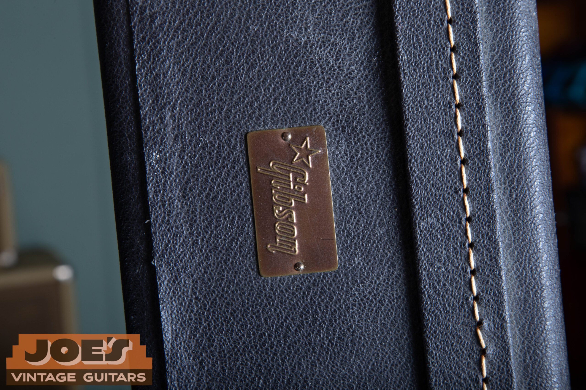

<figcaption><strong>Gibson logo plaque on the exterior of a 1966 ES-335 case.</strong> The black hardshell case carries a Gibson logo badge on the exterior lid. The badge design and overall case construction are period-specific, a matching original case is a strong provenance indicator.</figcaption>

</figure>

<figure>

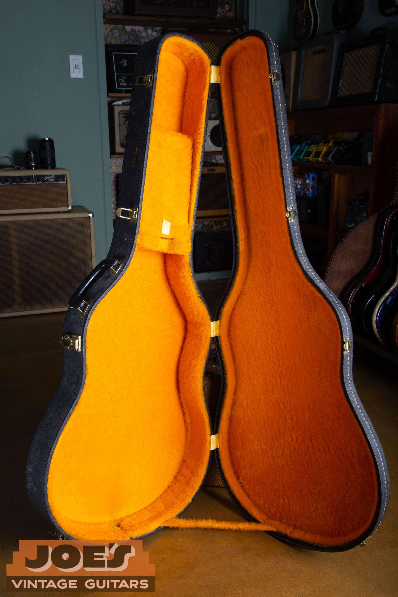

<figcaption><strong>Interior of an original 1966 Gibson ES-335 case.</strong> The warm yellow/gold plush lining is the defining interior detail for mid-1960s Gibson cases. This is not crushed velvet (which appeared on earlier cases) and not the purple or red interiors of other periods, it is unmistakably yellow/gold. The plush should show compression and aging consistent with 60 years of use. The neck rest, body cavity, and accessory compartment all carry this same yellow interior.</figcaption>

</figure>

A matching-period case with consistent aging, the correct interior color, and a Gibson logo badge is strong supporting evidence of an unbroken chain of custody from the factory. Cases can be swapped, but a case that matches the guitar in age, interior condition, and period-correct fittings is significantly more compelling than a guitar presented without a case or with an obviously mismatched one.

### Case Candy, A Complete Original Set

The ES-335 was shipped from Gibson with a collection of accompanying literature and accessories, collectively known as "case candy", stored in the case's accessory compartment. A complete original set of case candy for a 1966 ES-335 is exceptionally rare and represents the guitar as it left the Kalamazoo factory in 1966. Each piece is an individual authentication point as well as a piece of Gibson's manufacturing and commercial history.

<figure>

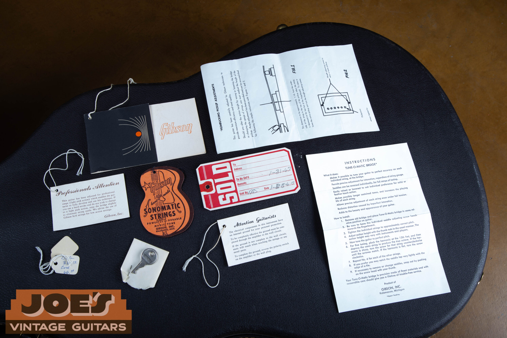

<figcaption><strong>Complete original case candy for a 1966 Gibson ES-335.</strong> All eight pieces of the original factory documentation and accessories are present here, an extraordinarily rare survival after nearly 60 years. From left to right: the Tune-o-matic instructions, humbucking pickup instruction sheet, "Attention Guitarists" electrical ground tag, Gibson Sonomatic strings hang tag, Gibson instruction booklet, the "adjusted for professional usage, light pick action" tag, the original case key in its envelope, and the original dealer price tag. Each piece is documented individually in the sections below.</figcaption>

</figure>

### Tune-o-matic Instructions Sheet

A folded instruction sheet covering how to use and adjust the Tune-o-matic bridge, intonation adjustment, height adjustment, and saddle positioning. Printed on period paper stock with period typography. The paper should show age-consistent yellowing and any handling marks consistent with having been in the case since 1966.

### Humbucking Pickup Instructions Sheet

An instruction sheet covering pickup height adjustment for the humbucking pickups, explaining how to set the correct distance from the strings for optimal output and tone. Period typography and paper stock. This document is specific to humbucker-equipped models.

### "Attention Guitarists" Electrical Ground Tag

A small tag reading approximately "Attention Guitarists, All electrical components in this instrument have an internal ground." This document addressed player concerns about electrical noise and hum from grounding, confirming that Gibson had internally grounded all electrical components in the instrument. Its presence is specific to the 1960s production era and is a period-authentic detail.

### Gibson Handmade Sonomatic Strings Tag

A hang tag indicating which Gibson Sonomatic strings were used on the instrument at the factory. This is not string packaging, it is a tag documenting the specific string specification Gibson set the guitar up with before shipping. Its presence confirms the guitar left the factory with documentation of its original string setup.

### Gibson Instruction Booklet

A small booklet covering general guitar care, tuning, and operation. Gibson produced these for inclusion with new instruments throughout the 1960s. The 1966 version has period-specific typography, printing, and content. The booklet should show age-consistent yellowing and any handling evidence consistent with having been in the case since 1966, not crisp and fresh from a stash of new-old-stock documents.

### "This Guitar Has Been Adjusted" Tag

A tag reading approximately: *"This guitar has been adjusted for professional usage, light pick action."* This tag was attached to instruments that received factory setup before shipping, indicating the action had been set to Gibson's "light pick action" specification. The presence of this specific tag is consistent with factory-fresh delivery condition and is a significant completeness indicator.

### Original Case Key in Envelope

The original case key, typically in a small paper envelope. Gibson cases from this era had a keyed latch. The key is a simple barrel-style key. The presence of the original key in its original envelope is a completeness indicator, the envelope should show the same age as the other case candy, not fresh paper. This is increasingly rare as keys get lost, separated, or the cases are eventually opened with substitute tools.

### Original Price Tag

The original dealer price tag from the point of sale. Unlike the factory documents above, the price tag would have been attached by the selling dealer, so its format varies by retailer, but it reflects the period retail pricing for the ES-335 in 1966. The presence of an original price tag is one of the strongest provenance indicators available: it connects the guitar to a specific time and place of purchase. The paper, font, and price should all be consistent with a mid-1960s retail transaction.

<h2 id="fakes">Fakes, Reissues & Modifications</h2>

### Gibson ES-335 Reissues

Gibson has produced numerous ES-335 reissues, including the Memphis-era ES-335s, the Custom Shop 1964 ES-335 reissues, and various Historic Collection examples. These are well-made instruments but are not 1966 originals. For comparison with earlier ES-335 specifications, see our [1959 ES-335 authentication guide](/post/1959-gibson-es-335-authentication-guide/) and [1962 ES-335 authentication guide](/post/1962-gibson-es-335-guide/). Key differentiators from all reissues include:

-   **Serial number format:** From 1977 Gibson used an 8-digit impressed serial with no letter prefix, where digits 1 and 5 give the year, digits 2 to 4 the day of the year, and digits 6 to 8 the production rank. A genuine 1966 has a plain 6-digit number on the headstock back.
-   **Orange label:** Reissue labels use modern printing and modern paper, visible under UV light and to a trained eye. The Kalamazoo address only appears on genuine pre-1984 instruments.
-   **Headstock logo:** A genuine 1966 has a pearloid logo set flush into the veneer. Reissues use printed or waterslide logos that may approximate the period look but show modern application techniques under magnification.
-   **Pickup stickers:** Genuine Patent Number stickers show age-consistent yellowing and adhesion. Reissue pickup base plates use different markings entirely.
-   **Tortoise side dots:** Many reissues use white side dots, incorrect for a mid-1960s original.

### Import Fakes

High-quality ES-335 fakes, particularly from Asia, have become more sophisticated in recent years. Close inspection generally reveals tells:

-   **Wood and finish:** Genuine 1966 bodies show grain telegraphing through the finish and checking patterns consistent with nitrocellulose aging. Modern fakes often use polyester or polyurethane finishes that don't check.
-   **Chrome quality:** Import fake hardware is typically too bright (over-plated) or shows uniform artificial aging without the differential wear pattern of genuine 60-year-old chrome.
-   **Pickup base plates:** Fake Patent Number stickers are often too pristine or incorrectly positioned on the base plate.
-   **Fret nibs:** Fakes rarely have fret nibs, this single detail eliminates the vast majority of ES-335 fakes quickly.
-   **Tortoise side dots:** Fakes almost universally use white side dots.

### Common Modifications on Genuine 1966 ES-335s

-   **Pickup swaps:** The most common. Either original pickups replaced with PAFs for "upgrade" purposes, or pickups replaced with later T-tops after originals were damaged. Always verify pickup dates against the guitar's date.
-   **Refret:** Very common on played examples. Loss of fret nibs is the primary evidence. Period-correct refret wire and retained original fret slots is the best-case scenario.
-   **Tuner replacement:** Grover Rotomatics are the most common swap. Added mounting holes or filled Kluson holes are the tell.
-   **Refinish:** Extremely common on cherry-finish examples (the dye fades). A refinished ES-335 loses significant value. Check under the pickguard bracket, inside the f-holes, and at the pickup routes for original finish traces.
-   **Knob replacement:** Top hat knobs are commonly replaced. Check for consistent aging across all four knobs and with the other hardware.
-   **Bridge/tailpiece replacement:** ABR-1 bridges are sometimes replaced with Nashville-style bridges (requires drilling new post holes, a destructive modification). The retainer wire is often missing on replacement ABR-1 bridges sourced from non-period stock.

<h2 id="checklist">Authentication Checklist</h2>

Use this checklist as a starting framework. No single item is definitive, authentication requires the complete picture.

Serial Number & Label

-   **6-digit serial in ~300000 to 420000 range, ink-stamped on back of headstock**
-   Serial may be faint, use raking light to read; faintness alone is not suspicious
-   Orange oval label inside body (bass f-hole), reads "STYLE ES-335 T" and "Kalamazoo, Michigan"
-   Serial number on label matches headstock stamp
-   FON (factory order number) inside body consistent with 1966 if present

Headstock

-   Crown inlay is mother-of-pearl, flush with headstock surface
-   Gibson logo is pearloid, flush with headstock surface (NOT a decal)
-   Bell-shaped truss rod cover is blank with no text
-   Nut is white nylon/plastic, NOT bone (bone = replacement on a 1966)

Neck & Fingerboard

-   **Fret nibs present at all fret positions, confirms original frets**
-   Block inlays (rectangular), NOT dots (dots = pre-1962)
-   Block inlays are cellulose nitrate pearloid, the correct 1960s material, not solid mother-of-pearl
-   **Side dots are tortoise/amber-brown colored, NOT white**
-   Fingerboard binding is single-ply cream/white
-   Rosewood fingerboard shows period-consistent grain and color

Body

-   Double-cutaway semi-hollow, 1¾" body depth
-   Horn tips are slightly pointed (more so than 1958 to 1961 examples)
-   Single-ply body binding shows age-consistent checking and patina
-   F-holes are bound; binding shows consistent aging
-   Finish checking consistent with 60-year-old nitrocellulose (if applicable)

Pickguard & Controls

-   Multi-layer laminated pickguard, layers visible at cut edge
-   Pickguard mounted on bracket (not screwed directly to top)
-   Pot codes consistent with 1966 (e.g., CTS 137 66XX)
-   All braid-covered coaxial wiring throughout, no plastic-insulated wire
-   No modern capacitors (orange drops, etc.)

Pickups

-   **Black "Patent No 2,737,842" sticker on pickup base plate, NOT a gold PAF sticker, NOT an engraved number**
-   Alnico magnet (not ceramic), confirm with small test magnet
-   Adjustable and non-adjustable pole piece rows both present
-   DC resistance approximately 7.5k to 8.5k ohms per pickup
-   Braid-covered coaxial lead wires
-   **NOT T-tops, no T-shaped coil former visible from adjustable-pole side**

Bridge & Tailpiece

-   "ABR-1" marked on back of bridge
-   **Retainer wire present holding saddles on bridge**
-   Saddles are nylon/plastic, chrome saddles indicate 1969 to 1970 or later bridge
-   Trapeze tailpiece, correct for 1966 ES-335
-   Bridge post thumbwheels allow height adjustment

Tuners, Knobs & Hardware

-   Kluson Deluxe double-line tuners ("KLUSON" / "DELUXE" on two lines on gear back)
-   Double-ring plastic tulip buttons, consistent matched ageing across all six
-   Top hat / reflector knobs, amber top, chrome skirt, all four match
-   White plastic switch tip with mold seam visible around top portion
-   Aluminum strap buttons with chrome screw, noticeably less shiny than chrome hardware; this is correct
-   All chrome hardware shows consistent, matched patina

Case & Case Candy

-   Black hardshell case with Gibson logo badge
-   **Yellow/gold plush interior, NOT crushed velvet, NOT purple/red**
-   Tune-o-matic instruction sheet present
-   Humbucking pickup instruction sheet present
-   "Attention Guitarists" electrical ground tag present
-   Gibson Sonomatic strings hang tag present
-   Gibson instruction booklet present
-   "Adjusted for professional usage, light pick action" tag present
-   Original case key in original envelope
-   Original dealer price tag present

<h2 id="links">Related Resources</h2>

**1966 Gibson ES-335 Authentication Guide**

This reference draws on A.R. Duchossoir's *Gibson Electrics*, Walter Carter's *Gibson Guitars: 100 Years of an American Icon*, documented production examples, collector forum research, and hands-on inspection of authenticated 1966 instruments. Feature transition dates are approximate, Gibson's production changes were phased, and transitional examples exist throughout all periods of change.

Always verify against the physical instrument. Not a substitute for hands-on expert examination for high-value transactions.
