

1967 · The CBS transition in full swing

CBS had owned Fender for two full years by the time this guitar was built, and by 1967 the changes were showing up on the assembly line one at a time. The large headstock was now standard on every Stratocaster. The gold transition logo was still in place. Nitrocellulose lacquer was still going on the bodies. And the tuners were quietly switching over from the double-line Kluson Deluxe keys to Fender's own "F" stamped tuners right in the middle of the year. A 1967 Strat is the sound and feel of a pre-CBS guitar wearing the new CBS clothes, which is exactly why players still chase them.

The example in this guide is a clean three-tone sunburst with a neck stamped 13 SEP 67 B and the serial number 204663 on the plate. Both of those numbers point at the same year, which is the first thing you want to see. Below I walk through every authentication detail on this guitar, every spec worth verifying, and the small tells that separate a real, untouched 1967 from a parts guitar or a refin wearing the wrong story.

On This Page

1.  [Quick Reference: 1967 Specs](#overview)
2.  [The Body, Finish, and Wear](#body)
3.  [The Neck](#neck)
4.  [The Headstock and the CBS Transition](#headstock)
5.  [Pickups and Electronics](#pickups)
6.  [The Bridge and Hardware](#bridge)
7.  [Pickguard, Knobs, and Plastics](#pickguard)
8.  [A 1967 Dating Walkthrough](#dating)
9.  [Cases](#cases)
10.  [Custom Colors](#colors)
11.  [Players Who Defined the Sound](#players)
12.  [Market Notes](#market)
13.  [FAQ](#faq)
14.  [How to Safely Ship One](#shipping)

<figure>

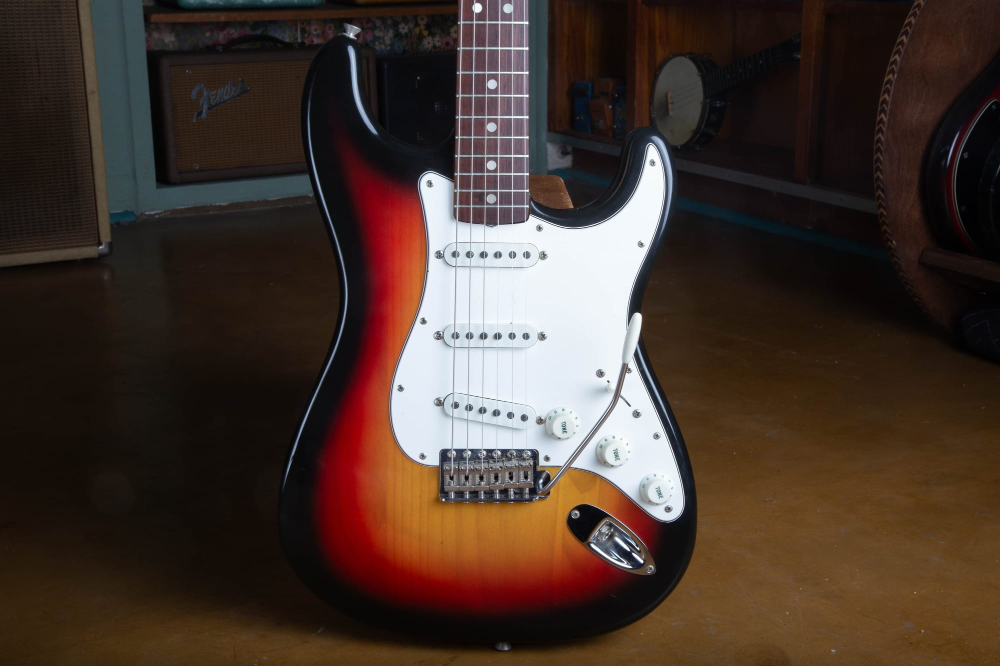

<figcaption>A correct 1967 Stratocaster in three-tone sunburst, rosewood board, aged white guard.</figcaption>

</figure>

<h2 id="overview">Quick Reference: 1967 Stratocaster Specs</h2>

Here is the short version before we get into the detail. A factory-correct 1967 Stratocaster should show most or all of the following:

-   **Body:** Alder on sunburst and most colors, ash under blonde. Nitrocellulose finish.
-   **Weight:** Typically 7 lb 4 oz to 8 lb.
-   **Neck:** Thin C profile maple neck, roughly .80" at the first fret.
-   **Fingerboard:** East Indian rosewood veneer over maple. A maple cap option returned mid 1967.
-   **Headstock:** Large CBS outline, gold transition logo with patent numbers.
-   **Tuners:** Fender "F" stamped keys on later 1967 guitars, double-line Kluson Deluxe on earlier ones.
-   **Pickups:** Staggered AlNiCo V single coils, gray-bottom fiber bobbins, plain enamel wire.
-   **Electronics:** Three-way switch, .1 mfd ceramic disc cap, 250k pots, cloth pushback wire.
-   **Bridge:** Steel synchronized tremolo, "FENDER PAT. PEND." stamped saddles.
-   **Neck plate:** Four-bolt F plate, serials generally in the 180000 to 210000 range.
-   **Pickguard:** Three-ply white ABS, 11 screws, aged to cream.

<h2 id="body">The Body, Finish, and Wear</h2>

The 1967 Stratocaster body is alder on sunbursts and nearly every custom color. Blonde finishes were sometimes ash. Bodies are usually two or three pieces of well matched wood, noticeably lighter than what came out of the factory in the mid 1970s. A clean 1967 tends to weigh between 7 lb 4 oz and about 8 lb. Anything much heavier than that on a guitar this old is worth a second look.

The contours are still generous. The forearm bevel and the tummy cut on the back are deep and comfortable, carved the same way they were before CBS arrived. Those contours did not get shallow until later in the decade, so a real 1967 should still feel like it came off the same bench as a 1964 or 1965.

Finishes are sprayed in **nitrocellulose lacquer**. Polyester did not arrive on Stratocasters until 1968, so a 1967 in original finish will check, crack, and yellow the way a nitro guitar of this age should. Sunbursts amber up, the reds in the burst deepen, and whites turn to cream. This particular guitar has honest play wear and finish checking through the clear, which is what you want to see. A 1967 with a thick, glassy, plastic-feeling finish and no checking anywhere has almost certainly been refinished.

<figure>

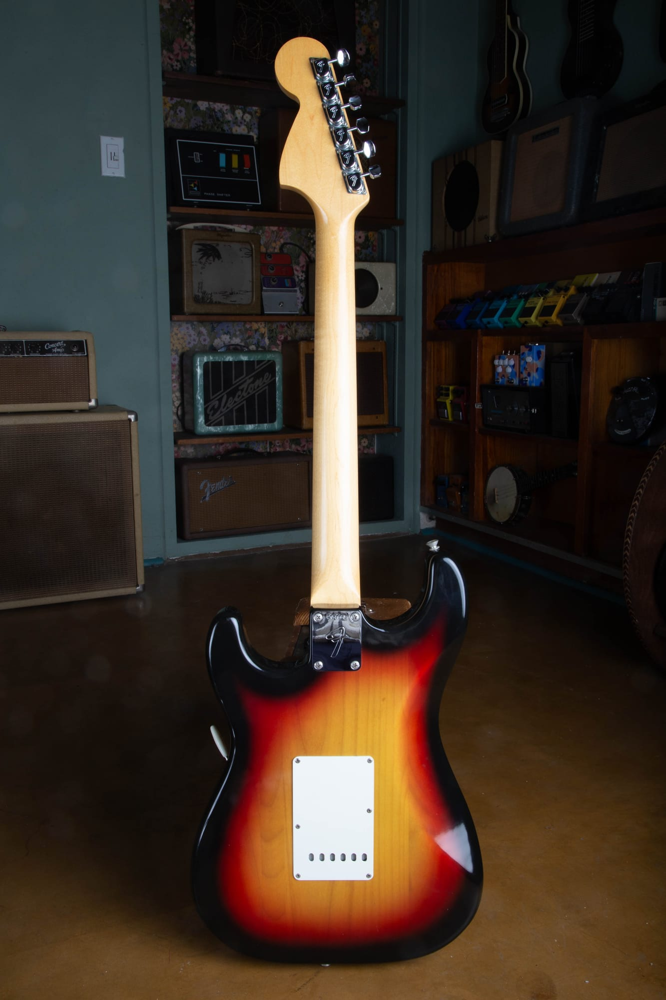

<figcaption>The back tells its own story: smooth maple neck, F plate, and the single-ply white tremolo cover.</figcaption>

</figure>

### The Unsprayed Area Under the Pickguard

Here is a factory detail worth knowing. On an original sunburst from this era, the factory often did not carry the red band of the three-tone all the way under the pickguard. The finishers masked the area the guard would cover and skipped a step nobody was ever going to see, which saved paint and time on the line. Pull the guard and the covered area frequently reads as a two-tone yellow to brown burst instead of the full three-tone on the exposed top. It is one of the cleaner tells of an honest factory finish. A professional refinish almost always carries the color all the way through, because nobody refinishing a guitar today is trying to copy a 1960s production shortcut.

#### The Paint Stick Shadow

One of the most useful tells lives inside the neck pocket. During finishing, each body was mounted on a wooden paint stick screwed into the neck pocket, so the wood under that stick stayed masked from the color and clear. Pull the neck off an original 1967 and you should find a rough bare-wood shadow in the pocket where the stick sat, usually a squarish patch on an otherwise sealed and colored pocket. A body that has been refinished in the pocket, routed, or modified will not show a clean shadow like this.

<figure>

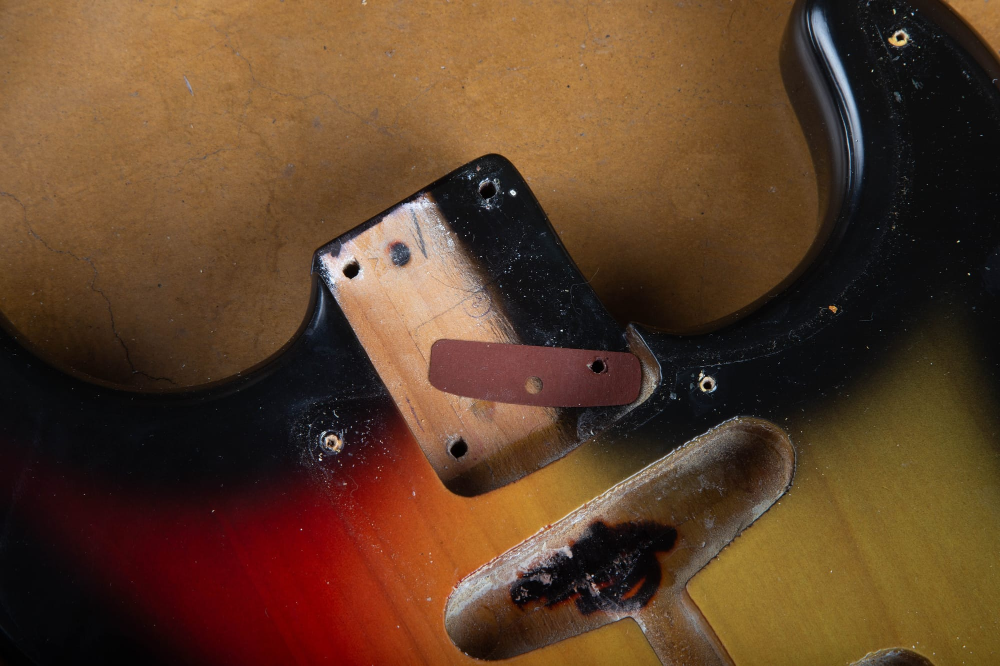

<figcaption>Inside the neck pocket: the bare-wood paint stick area and a dark red fiber shim sitting where the factory left it.</figcaption>

</figure>

### Dark Red Shims in the Neck Pocket

Fender used shims in this period to set the neck angle. The shim you commonly find under the heel of a 1967 neck is dark red or maroon vulcanized fiber, sometimes called fish paper. It is thin and hard. Some guitars have one, some have two stacked. A correct dark red fiber shim is a quiet detail that is easy to overlook. Repro shims exist, so a shim by itself does not prove anything, but the combination of an original shim, a clean paint stick shadow, and untouched screw holes is a strong sign the neck and body have been together a long time.

<figure>

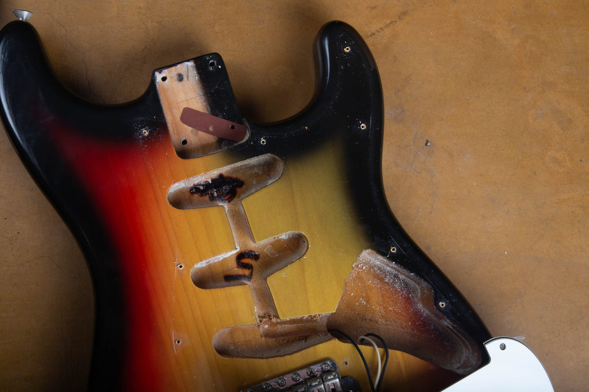

<figcaption>The routs are clean and the finish is worn honestly, with color in places a refinisher could not reach without taking the guitar apart.</figcaption>

</figure>

<h2 id="neck">The Neck</h2>

The 1967 Stratocaster neck is a thin, comfortable C shape. It feels meaningfully slimmer than the big necks of the late 1950s and a touch thinner than a typical early 1960s D profile. Most measure around .80" at the first fret and roughly .88" to .92" at the twelfth, with some variance. It is a fast, modern feeling neck, which is a big part of why these guitars stayed in working players' hands for decades.

The fingerboard on this guitar is rosewood **veneer** over maple. The thick slab board ended back in mid 1962, so by 1967 you are firmly in the thin veneer era, and the rosewood is **East Indian**, not Brazilian. Fender finished the switch away from Brazilian in mid 1965, so an Indian board is exactly what a stock 1967 should have. If a seller is leaning hard on "Brazilian rosewood" as a selling point on a stock 1967, treat it with skepticism unless they can prove it.

One thing that is new for 1967: Fender brought back the maple fingerboard as an option in the middle of the year. A 1967 with the **maple cap** board is a real factory configuration, not a red flag. This example is the standard rosewood board, which is what the great majority of 1967s wear, but if you run into a maple 1967 do not assume it is wrong. Just know that a maple cap neck is built differently, which matters for the skunk stripe question below.

The frets are vintage thin, narrower than the medium jumbo wire that came later. Original frets on a played 1967 will show wear in the first few positions and around the third, fifth, and seventh frets where hands spend most of their time. A 1967 with tall, flat, unworn frets has probably been refretted.

<figure>

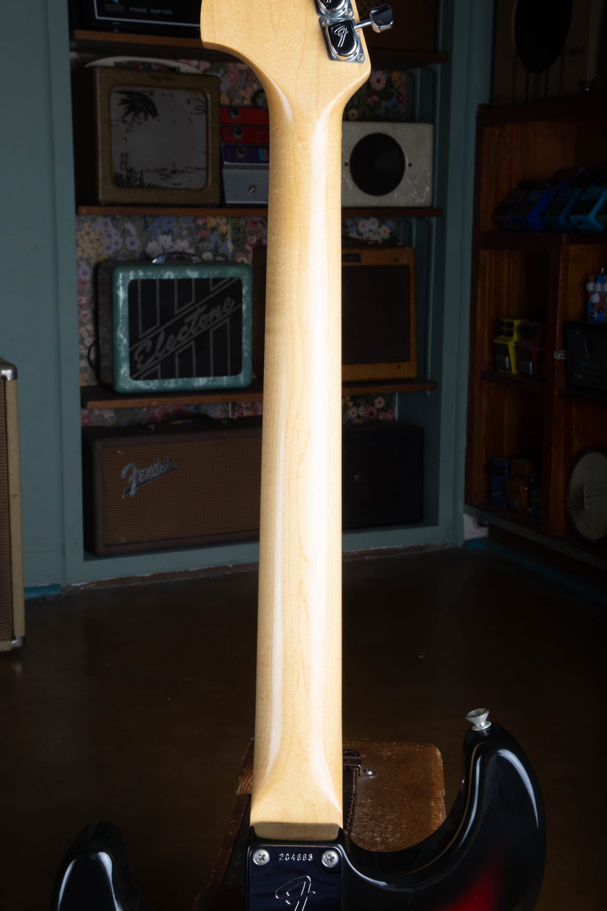

<figcaption>Smooth, unbroken maple back, no skunk stripe. That is exactly right for a rosewood-board 1967.</figcaption>

</figure>

### The Back of the Neck

This detail gets misreported constantly. A 1967 Stratocaster with a **rosewood** board does **not** have a skunk stripe on the back of the neck, and there is no walnut plug above the nut. In this era Fender installed the truss rod from the front of the neck blank and then glued the rosewood veneer over the top to cover it, so the back is a clean, unbroken piece of maple from heel to headstock. The skunk stripe did not come back to rosewood-board necks until 1971, when Fender moved to the bullet truss rod and loaded the rod from the back again. The one exception in 1967 is a maple cap neck: because the maple board is glued on top and the rod goes in from behind, a maple cap 1967 does have a skunk stripe and a walnut plug. On a rosewood 1967 like this one, a skunk stripe means the neck is not what it should be.

### The Neck Heel Date Stamp

Pull the neck and look at the heel. By 1967 Fender was stamping the neck date in ink directly on the heel. The stamp on this guitar reads:

13 SEP 67 B

<figure>

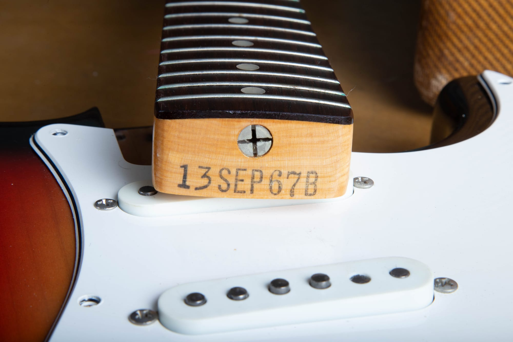

<figcaption>Neck heel stamp: 13 SEP 67 B, meaning model 13 (Stratocaster), September, 1967, 1 5/8" nut.</figcaption>

</figure>

Read it left to right. The first two digits are the model code. On a Stratocaster from this window the correct code is **13**. Do not let anyone tell you a leading single "3" is right for a Strat here, because that "3" was the Telecaster and Esquire code. The middle letters are the month. The next two digits are the year. The final letter is the nut width code, and the vintage Fender width codes are worth memorizing:

-   **A:** 1 1/2" nut (narrowest, uncommon)
-   **B:** 1 5/8" nut (by far the most common 1967 Strat width)
-   **C:** 1 3/4" nut (wider, less common)
-   **D:** 1 7/8" nut (widest, rare)

So the "B" on this heel means a 1 5/8" nut, exactly. If you see a 1967 advertised with a 1 11/16" nut and a "B" stamp, the seller is mixing vintage Fender codes with modern measurements. Faded or partly worn stamps are normal on real guitars. A stamp that looks freshly inked or reads in the wrong font points to a replaced or restamped neck.

<figure>

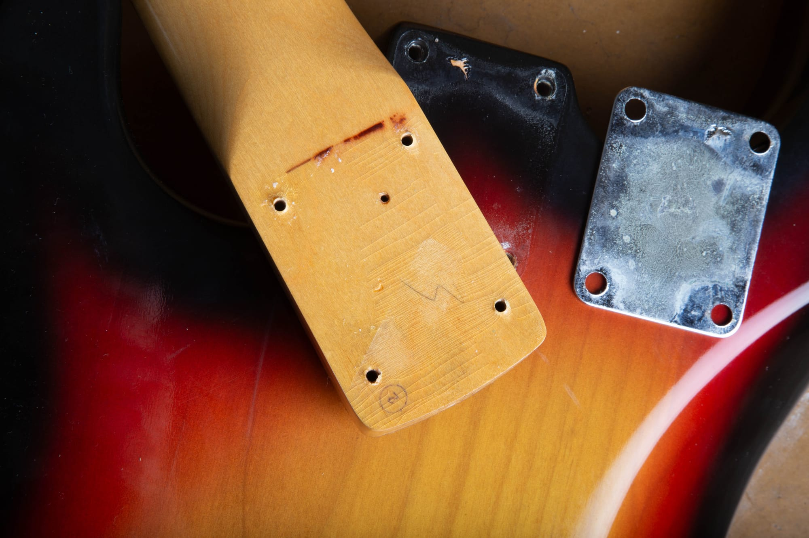

<figcaption>The heel also carries period pencil and crayon assembly marks, the kind of small factory evidence that is hard to fake.</figcaption>

</figure>

<h2 id="headstock">The Headstock and the CBS Transition</h2>

This is where the 1967 announces itself. By 1967 the small headstock was gone from the line, so essentially every Stratocaster shipped that year has the larger, more upright CBS-style headstock. If you want the side-by-side with the small-headstock guitar that came just before this, our [1966 Stratocaster guide](/post/1966-fender-stratocaster-authentication-guide/) covers the exact moment the outline changed.

### The Transition Logo

The logo on a 1967 Stratocaster is the gold "transition" decal: gold script with a thin black drop shadow, reading *Fender* with *Stratocaster* beside it, plus the patent number block and "WITH SYNCHRONIZED TREMOLO" underneath. You should also see the small "Original Contour Body" line on the treble side, which this guitar has. This is the same logo Fender used from late 1964 until the bold black CBS logo replaced it around late 1967 into 1968. On a real 1967 the gold logo sits under the finish and shows aging consistent with the rest of the neck. A crisp, bright logo on a guitar with heavy wear everywhere else is a flag.

<figure>

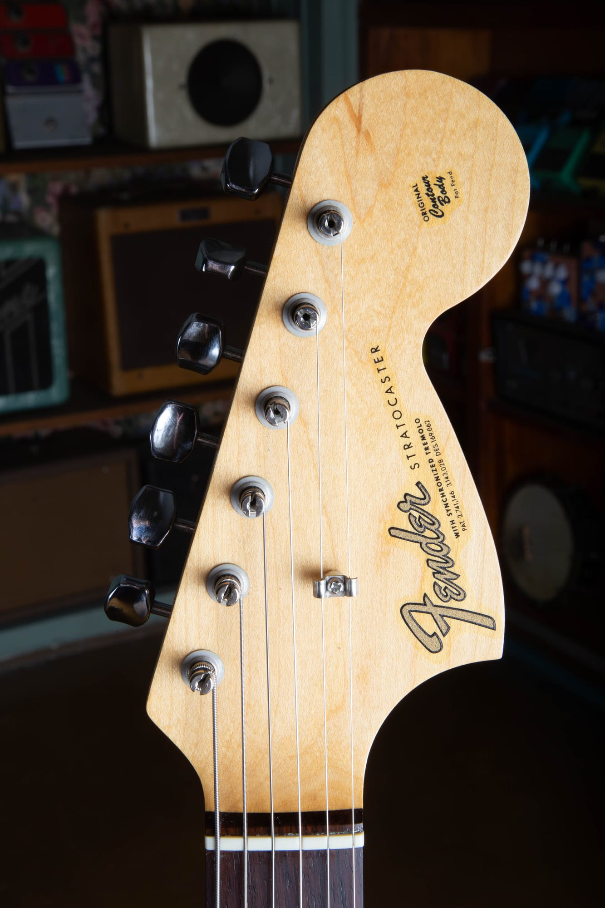

<figcaption>Large CBS headstock, gold transition logo, patent numbers, and the "Original Contour Body" line on the treble side.</figcaption>

</figure>

### Tuners

Tuners are the detail that dates this guitar to later in 1967. Early 1967 Strats still wear **double-line Kluson Deluxe** tuners with the twin "Kluson Deluxe" stamping down the housing. During 1967 Fender began switching to its own **"F" stamped tuners**, the ones with the big "F" on the back of each cover and an octagonal button, and by 1968 those were standard. This guitar has the F tuners, which fits a September 1967 build right at the changeover. Seeing F tuners on a guitar with a late-1967 neck date is correct. Seeing them on a guitar dated early 1967 or before would be a reason to look harder. As always, check the back of the headstock for extra screw holes or plug marks that would point to a later tuner swap.

<figure>

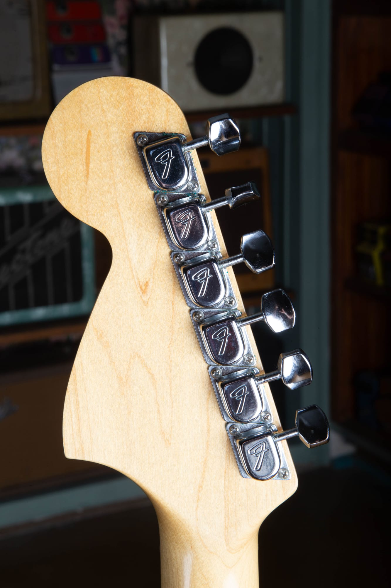

<figcaption>Fender "F" stamped tuners, phased in during 1967. The F on each cover is the quick tell.</figcaption>

</figure>

### String Tree

There is a single "butterfly" round string retainer for the first and second strings, mounted with one screw and a small metal spacer underneath. A 1967 has only one string tree. The second tree for the third and fourth strings did not show up on Strats until the 1970s.

<h2 id="pickups">Pickups and Electronics</h2>

Under the pickguard is where a 1967 Stratocaster shows most of its personality, and where a lot of authentication happens.

### The Pickups

By 1967 the pickups are staggered AlNiCo V single coils on gray vulcanized fiber bobbins. The wire is dark plain enamel, hand wound, with DC resistance generally between about 5.8k and 6.2k ohms. Fender was finishing the change from black-bottom to gray-bottom flatwork through late 1967, so a guitar built in this window can turn up with either, and neither is wrong on its own. The staggered pole pattern has the G-string pole standing taller than the rest, which was set up for the wound G strings of the day. The magnets should look slightly matte or oxidized, not bright and shiny.

<figure>

<figcaption>The harness lifted out: three staggered single coils, cloth pushback wire, the ceramic disc cap, three pots, and the three-way switch.</figcaption>

</figure>

### The Three-Way Switch

The pickup selector on a 1967 is a **three-way** switch. Neck, middle, bridge. The famous in-between tones came from balancing the switch between detents, but the factory switch only had three official positions. Fender did not make the five-way switch standard until 1977. A five-way in a 1967 is a later modification, and ideally the original three-way comes with the guitar.

### The Capacitor

The tone cap in 1967 is a ceramic disc rated at **.1 microfarads (0.1 uF)**. These are the flat ceramic discs you can see soldered into the harness in the photo above. Fender ran the .1 mfd value on Stratocasters through most of the 1960s. The smaller .047 mfd cap that people associate with later Strats did not become standard until roughly 1968 to 1970. Finding the original disc cap still in place is a small but consistent sign the harness has not been reworked.

### Cloth Wiring

All the internal wiring is **cloth-covered pushback** wire. Hot leads are typically white with a colored tracer, ground runs in unsleeved cloth. Plastic-jacketed PVC wire did not appear in Stratocaster harnesses until much later, so any plastic-insulated wire in a supposedly original 1967 harness is a replacement.

### Pot Codes

The pots are 250k audio taper, made by CTS or Stackpole, with a six or seven digit source-date code stamped on the can. Our [Fender pot code guide](/fender-pot-codes/) explains how to read the maker and date digits.

-   **CTS** codes begin with 137. A CTS pot from the 14th week of 1967 reads 137 6714.
-   **Stackpole** codes begin with 304. A Stackpole pot from the 36th week of 1967 reads 304 6736.

Read the code as manufacturer (three digits), then year, then week. On a 1967 guitar you are looking for a 67XX year-week section. Fender bought pots in batches, so they can date a little earlier than the guitar itself, which is normal. A pot dated 1969 on an otherwise 1967 guitar means the harness was worked on.

Harness checks out? Let's verify the rest.

If your guitar has staggered gray-bottom pickups, cloth pushback wire, a .1 mfd disc cap, and CTS or Stackpole pots dated to 1967, you are looking at a real one. Skip the auction-site hassle and get a secure, competitive cash offer from a vintage Fender specialist who reads these guitars for a living.

[Get a Free Appraisal](/free-appraisal/)

<h2 id="bridge">The Bridge and Hardware</h2>

### Saddles

The bridge saddles are individual stamped steel saddles, nickel chrome plated, each stamped **"FENDER PAT. PEND."** on top. These are the same threaded formed-steel saddles Fender had used since the 1950s. The patent pending stamp ran on Stratocaster saddles well into the late 1960s before it was dropped, so a 1967 should show it on every saddle. The stamp is small but clear under good light. Repro saddles exist and are usually distinguishable up close.

<figure>

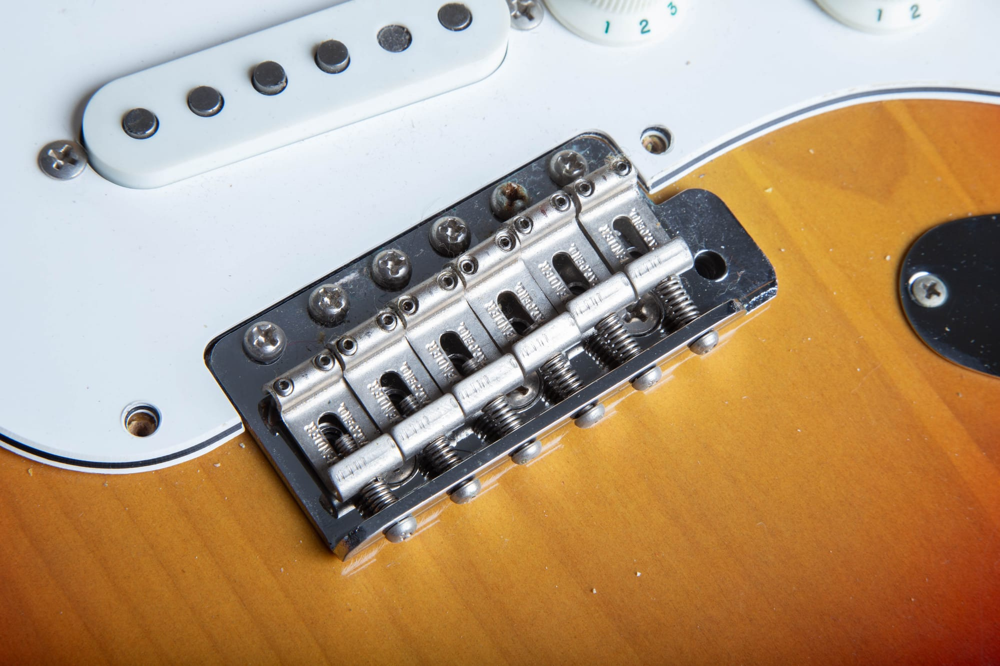

<figcaption>"FENDER PAT. PEND." on each steel saddle, correct for a 1967.</figcaption>

</figure>

### Tremolo Block and Springs

The tremolo block is solid steel, sitting in the body rout with three to five springs hooked between it and the claw. Five springs was the factory setup, but plenty of players pulled two or three for a lighter feel. The claw is plain steel with two long wood screws. Spring changes are common because players adjust the trem feel constantly, but the block and claw should be original Fender parts.

### Tremolo Arm and Tip

The tremolo arm is a threaded steel rod with an aged white plastic tip. The tip should be slightly yellowed and often shows contact wear. Replacement tips are extremely common because these get lost.

### The Chrome Bridge Cover

Stratocasters shipped from the factory in 1967 with the chrome bridge cover, the piece often called the "ashtray." It clips over the saddles on top of the body. Players removed them almost universally because they block palm muting, so finding a 1967 that still has its original cover is unusual. When one does turn up, the chrome should match the rest of the hardware in patina.

### Tremolo Cover Plate

The tremolo cover on the back of the body is a single-ply white plastic plate with two string access holes, held on by six screws. Fender switched to a chrome steel cover in the 1970s, but in 1967 it should still be the single-ply plastic piece, usually aged to a soft ivory that matches the pickguard.

<figure>

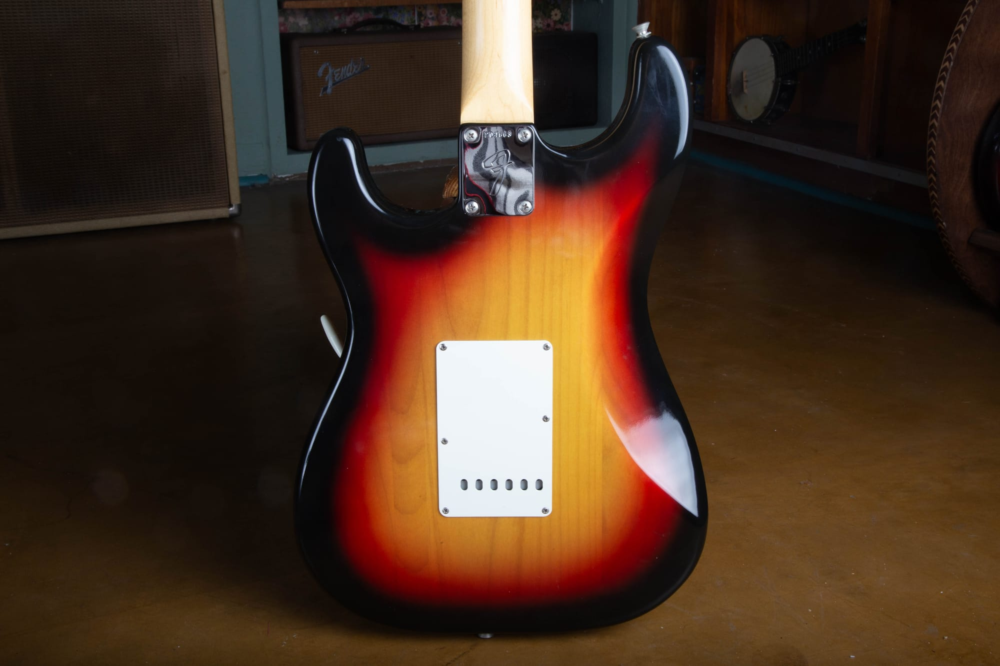

<figcaption>The single-ply white plastic tremolo cover, correct for 1967. Fender moved to a chrome steel plate in the 1970s.</figcaption>

</figure>

### Neck Plate

The four-bolt neck plate on a 1967 is the **F plate**, with the large "F" logo stamped into it and the serial number above the F. The serial on this guitar is **204663**, which sits squarely in the 1967 range. Fender was not strict about pulling plates in order, so serials can land a little higher or lower and the ranges overlap year to year, but the neck date and the serial on this guitar agree, which is what you want. The serial number alone never dates a Fender. Use the neck heel date, the pot codes, and the hardware together. Our [complete Fender serial number guide](/fender-guitars-serial-number-guide/) breaks down how the serials track to production years across every model.

<figure>

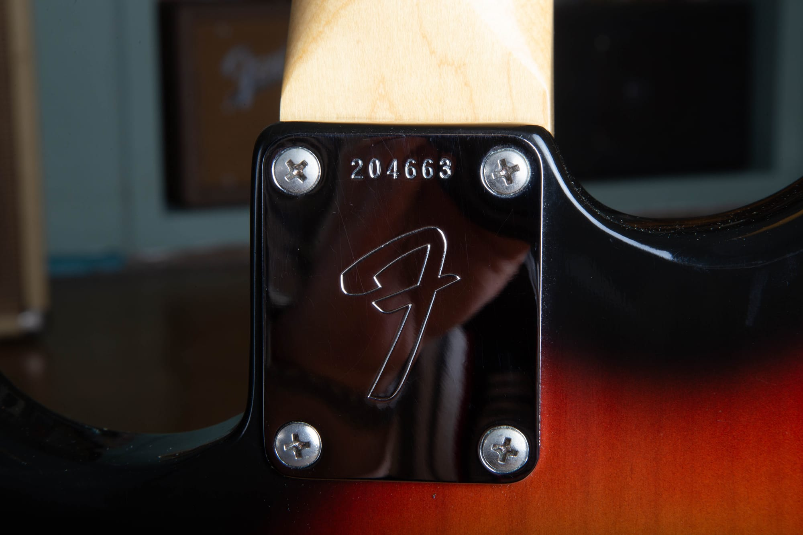

<figcaption>F plate stamped 204663, in the 1967 range and consistent with the September 1967 neck date.</figcaption>

</figure>

<figure>

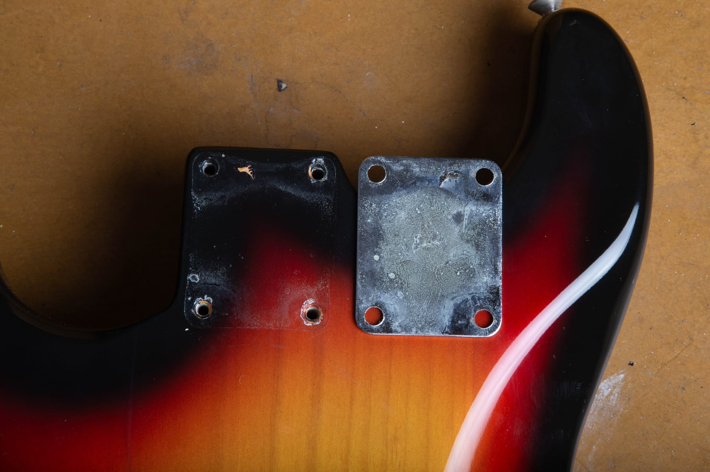

<figcaption>Plate off: original screw holes with no plugs or overdrilling, and honest patina on the back of the plate.</figcaption>

</figure>

<h2 id="pickguard">Pickguard, Knobs, and Plastics</h2>

The pickguard is **three-ply white ABS**, with 11 mounting screws. The green nitrate "mint" guards from the early 1960s were gone by 1965, so a 1967 came from the factory with the multi-ply white ABS guard. It ages to a warm cream, parchment, or light ivory over decades of light and oxidation, but it does not turn the pistachio or olive green that nitrate guards do, and it does not shrink or warp the same way. The beveled edge is roughly 45 degrees and shows the black middle ply between two white plies.

This is one of the most commonly misreported details. If a 1967 has a green, shrinking, or warped guard with a camphor smell, it is either a swapped earlier part or a repro nitrate guard someone installed for the vintage look. An original 1967 guard is white ABS aged to cream, like the one on this guitar.

### Knobs

The three knobs are aged white ABS with the molded skirt and embossed numbers. They read Tone, Tone, Volume from the low position up, with the volume knob nearest the bridge. The skirts age to a soft cream in the same color family as the guard. The numbers on the volume knob in particular often wear down where fingers ride, and that wear is normal on an honest player. The switch tip is aged white plastic to match.

<h2 id="dating">Putting It All Together: A 1967 Dating Walkthrough</h2>

Authenticating a 1967 comes down to confirming that every datable part lands in the right window. No single data point makes a guitar real. The combination is what counts, and on this guitar the combination lines up.

#### The 1967 authentication checklist

-   Neck heel stamp dated in 1967 (this one reads 13 SEP 67 B)
-   Serial in the 1967 range on a four-bolt F plate (this one is 204663)
-   Pots dated in 1967 or very late 1966 (CTS 137 67XX or Stackpole 304 67XX)
-   Large CBS headstock with the gold transition logo and patent numbers
-   Fender "F" tuners on a later 1967 build, or double-line Klusons on an earlier one
-   East Indian rosewood veneer board, or the correct maple cap option
-   Seamless maple neck back with no skunk stripe (on a rosewood-board neck)
-   Staggered gray-bottom pickups with plain enamel wire
-   Original .1 mfd ceramic disc cap
-   Cloth-covered pushback wiring
-   Three-way switch
-   11-screw three-ply white ABS pickguard, aged to cream
-   "FENDER PAT. PEND." stamped steel saddles
-   Single-ply white plastic tremolo backplate
-   Paint stick shadow and a dark red fiber shim in the neck pocket
-   Nitrocellulose finish with age-appropriate checking and yellowing

Think your '67 checks these boxes?

If most or all of them line up, you have a real one. We make fair, professional offers on real 1967 Stratocasters every week, in sunburst, in custom color, clean, or honestly played. Let's verify it together.

[Sell Your 1967 Strat](/sell-my-fender-guitar/)

<h2 id="cases">Cases</h2>

The case that shipped with a 1967 Stratocaster is the **black rectangular case** the vintage community calls the "black square case." It is squared off at the corners with a slim profile, covered in pebbled black Tolex, and lined inside with bright orange or rust plush. The handle is brown leather, there are two latches and a center lock, and the Fender badge is a raised, tail-less logo pinned to the lid. The stenciled white block logos belong to the earlier brown and blonde cases or to much later reissues, not to a correct 1967 black case.

Inside you often find the case candy: a printed "Fender Musical Instruments" polish cloth, the tremolo arm, a coiled cable, and sometimes a strap and paperwork. Finding a 1967 that still has its case and its candy together adds real value and tells you the guitar has been cared for.

<figure>

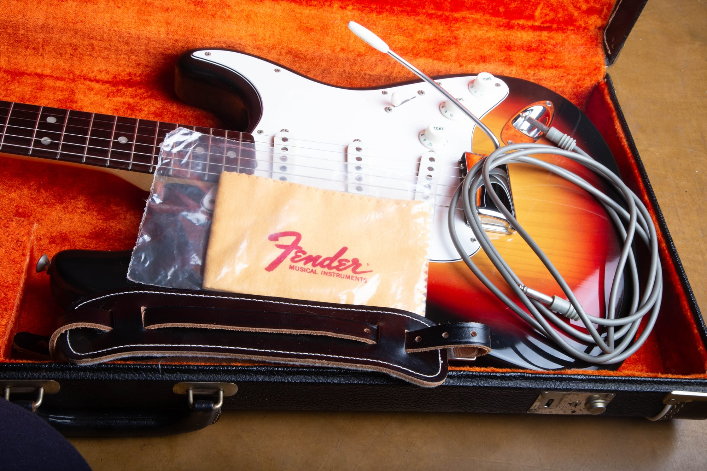

<figcaption>Original black case with orange plush and the case candy: polish cloth, cable, strap, and trem arm.</figcaption>

</figure>

<h2 id="colors">Custom Colors</h2>

Sunburst was the standard finish in 1967. Any non-sunburst color was a paid option, usually a five percent upcharge over list. CBS kept the custom color program running, and the 1967 chart was wide: Lake Placid Blue, Candy Apple Red, Fiesta Red, Olympic White, Sonic Blue, Daphne Blue, Dakota Red, Foam Green, Surf Green, black, and the metallics like Burgundy Mist, Inca Silver, Shoreline Gold, and the Firemists.

Custom color 1967s bring serious money, and that money brings fakery. The usual scams are a sunburst stripped and refinished into a desirable color, or a real color oversprayed to hide wear. Check for a paint stick shadow in the pocket that matches the body color, look for color in the pickup routes that matches the top, check the pickguard screw holes for original color inside, and pull the trem cover to look for overspray in the cavity. A real factory color was sprayed before assembly, so paint ends up in places you cannot recreate without taking the guitar apart and refinishing it. When custom color money is on the table, get a knowledgeable second opinion. Our [Fender custom color authentication guide](/post/fender-custom-color-authentication-guide/) walks through the finish forensics in depth.

<figure>

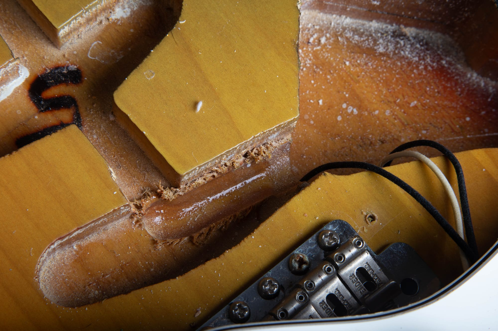

<figcaption>Original finish runs right up to the cavity edges. A stripped and refinished body usually comes up clean or oversprayed in exactly these spots.</figcaption>

</figure>

<h2 id="players">Players Who Defined the Sound</h2>

The 1967 Stratocaster lived through a huge year for electric guitar. Hendrix played Monterey in June 1967 and set a Strat on fire there, and the guitars he was chasing his early sound on came from exactly this window. David Gilmour, Ritchie Blackmore, Rory Gallagher, and plenty of session players in Nashville and Los Angeles all logged serious time on Strats from these years, cutting everything from country dates to psychedelic overdubs.

The reason the 1967 has stayed relevant is that it is a genuinely well balanced guitar. The neck is thin and fast, the pickups are bright without being brittle, and the synchronized tremolo still has the smooth feel of the original Fender design. It does almost everything well, which is why so many different players reached for one.

<h2 id="market">Market Notes</h2>

### What Drives the Value of a 1967 Stratocaster?

Three things drive the offer on any 1967: factory finish, condition, and originality of the parts.

Documented factory custom colors with 100% original finish, untouched solder, original pickups, original frets, original guard, and the original case bring the strongest offers, and they are the ones we look hardest for. Original sunbursts with honest wear, original hardware and electronics, and a matching case are the bread and butter of the vintage Fender market: strong demand, clean transactions. Guitars with an old refinish, replaced pickups, a repro guard, a refret, or an added five-way come down in value against clean originals, but we still buy them every week. A modified 1967 is still a 1967.

Where a given guitar lands depends on color, condition, and originality. Sunburst 1967s in clean original shape command strong money but sit below the pre-CBS years of 1962 to 1964. Custom colors push the number much higher, with documented Lake Placid Blue, Fiesta Red, Olympic White, and Sonic Blue especially wanted, and the rare metallics bringing real premiums when they show up clean. For year-by-year benchmarks across the whole Stratocaster timeline, our [vintage Fender Stratocaster value guide](/vintage-fender-stratocaster-value-guide/) goes deeper.

Condition matters enormously. A 1967 with original pickups, original frets, original solder, original guard, and its case can easily bring double or triple what the same guitar makes with replaced pickups, a refret, a repro guard, and a case that does not match. If you are buying, prioritize untouched electronics, an unmodified body, an original neck with a clean heel date, and the original case. If you are looking to [sell a Fender Stratocaster](/sell-my-fender-guitar/) from this era, document what you know, photograph the components and date stamps, and find a buyer who understands what they are looking at.

<h2 id="faq">FAQ</h2>

### How do I tell a 1967 Stratocaster from a 1966 or 1968?

Work from the parts that changed. Against a 1966, the 1967 is more likely to have the Fender "F" tuners coming in later in the year (a 1966 has double-line Klusons), and the maple cap board option is back for 1967. Against a 1968, the 1967 still has the gold transition logo and nitrocellulose finish, while 1968 brought the bold black CBS logo and polyester finish. Pot codes and the neck heel date are the cleanest tools when the parts are original to the guitar.

### Are the F tuners correct for a 1967?

Yes, on a later 1967 guitar. Fender switched from double-line Kluson Deluxe tuners to its own "F" stamped keys during 1967, and by 1968 the F tuners were standard. On a guitar with a September 1967 neck date like this one, the F tuners are exactly right. They would be a question mark on a guitar dated early 1967 or before.

### Does a 1967 have a skunk stripe?

Not on a rosewood-board neck. The truss rod went in from the front and the rosewood veneer covered it, so the maple back is smooth and unbroken. The one exception is the maple cap option that returned in mid 1967: those necks are built with the board glued on top and the rod loaded from behind, so they do have a skunk stripe and a walnut plug. A skunk stripe on a rosewood 1967 is wrong.

### Is the serial number enough to date it?

No. Fender serials overlap from year to year and the plates were pulled from bins, not in strict order. A serial like 204663 points at 1967, but you confirm the year with the neck heel date, the pot codes, and the hardware. When those all agree, you have your answer.

### Should I clean or reflow the original solder joints?

Please do not. Original solder joints are part of the guitar's identity, and reflowing them or replacing wire to "tidy up" the harness destroys value. If something has actually failed, take it to someone who specializes in vintage Fender work and ask them to repair it in a way that preserves originality.

<h2 id="shipping">How to Safely Ship a High-Value Vintage Stratocaster</h2>

The single biggest reason owners hesitate to sell a five-figure vintage guitar is the fear of shipping. We hear it constantly. The good news is that this is the easiest part of the whole process to solve.

When you sell an instrument to Joe's Vintage Guitars, we handle the logistics end to end. You do not buy a label. You do not estimate value for declarations. You do not chase down a box. Here is what it actually looks like:

-   You get a **fully insured, pre-paid overnight shipping label** covering the agreed value of the guitar.
-   We walk you through detuning the strings to the right slack so the neck is not under load in transit.
-   Packing gets a phone call: supporting the neck in the case, padding the headstock, immobilizing the case inside an outer carton, and double-boxing where it makes sense.
-   No packing materials on hand? We can ship them to you ahead of the pickup.
-   The guitar moves on overnight freight to our Mesa shop, where we inspect it, confirm the condition matches the photos, and release payment promptly.

This is the same process we use for guitars coming in from across the country every week. If you want to talk through shipping before you commit to anything, just ask. We would rather answer twenty questions up front than have you worry about it for six months.

### Selling or Appraising a 1967 Stratocaster?

Joe's Vintage Guitars buys 1967 Stratocasters in every condition, every color, and every configuration. Inherited a custom color example? Sorting through an estate? Have a sunburst project that needs the right home? We make fair, professional offers on clean originals and on guitars that have been modified or refinished. Joe has been buying, authenticating, and selling vintage Fenders out of Mesa for years, and you can read more on the [about page](/about-me/).

[**Request a free appraisal →**](/free-appraisal/)  
Want to see what the buying process looks like first? Visit our [sell my Fender guitar](/sell-my-fender-guitar/) page. For dating help, our [Fender serial number guide](/fender-guitars-serial-number-guide/) and [vintage Fender Stratocaster value guide](/vintage-fender-stratocaster-value-guide/) cover every year of Strat production. For the guitars on either side of this one, the [1966 Stratocaster guide](/post/1966-fender-stratocaster-authentication-guide/) and the pre-CBS [1963 Stratocaster guide](/post/1963-fender-stratocaster-authentication-guide/) are both worth a read.
