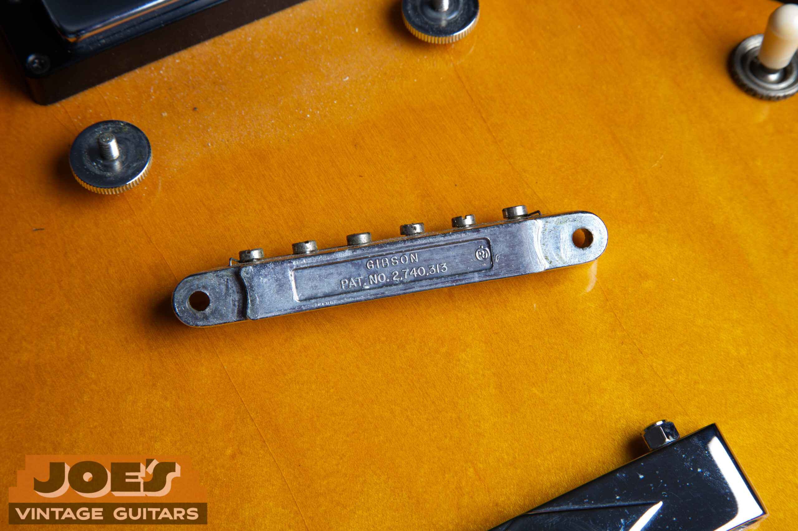
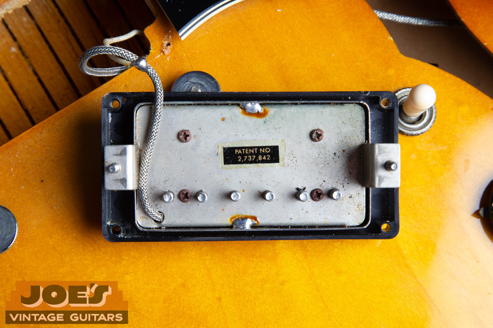
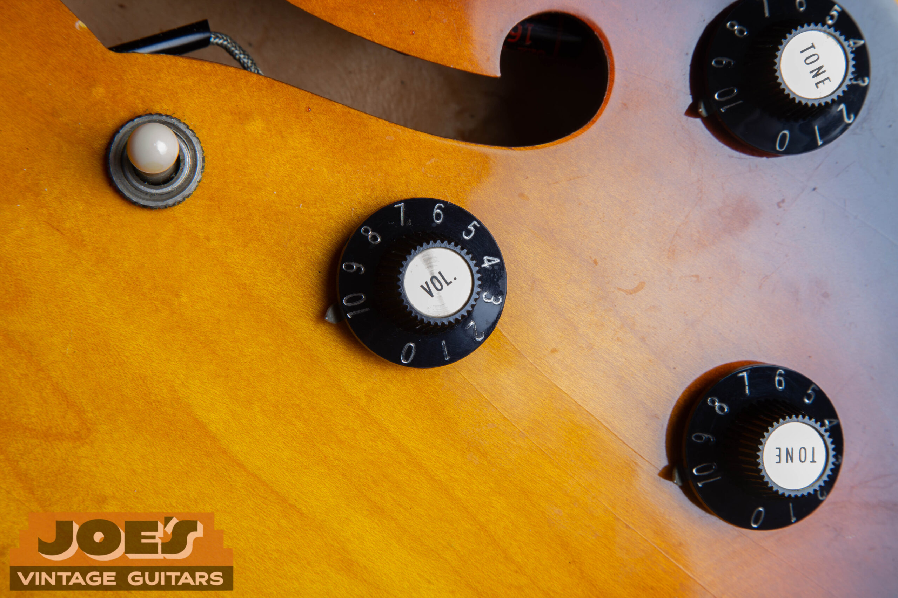
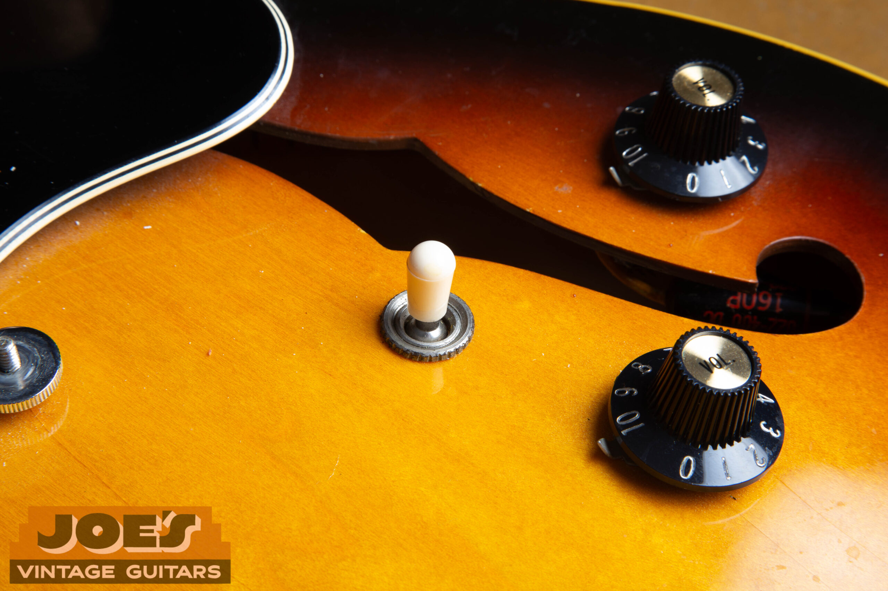
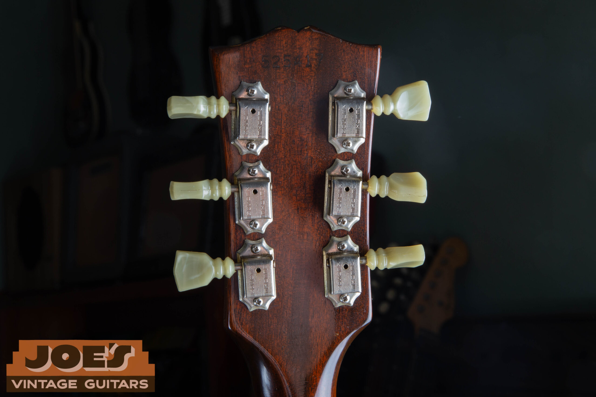

## The 1968 Gibson ES-335: A Collector's Guide

1.  [The 1968 Color Palette](#color-palette)
2.  [Hardware and Electronics](#hardware)
3.  [The Case: The "Marigold" Interior](#the-case)
4.  [Collector Sentiment and Market Value](#market-value)
5.  [Frequently Asked Questions](#faq)

1968 is the last year of the one-piece mahogany neck and the long tenon joint on an ES-335. That alone makes it worth a serious look. Pricing still sits well below the pre-'65 examples that get all the attention, which is why a clean 1968 is one of the better buys in the vintage semi-hollow market right now. We handle these regularly at [Joe's Vintage Guitars](/) and know what separates a clean example from one that's been quietly parted out.

The details that define a 1968, from headstock inlay transitions to potentiometer date codes, are the same details serious buyers use to authenticate a purchase. The breakdown below covers them all. If you're trying to date your own instrument, our guide to [reading Gibson serial numbers](/how-to-read-gibson-serial-numbers/) is the companion piece to this one. Gibson's [production records for 1948 to 1979](/post/gibson-shipping-totals-1948-1979/) show 1968 as one of the higher-volume years for the ES-335. Examples surface regularly. Originality varies widely.

<h2 id="color-palette">The 1968 Color Palette</h2>

Sunburst and Cherry dominated the shipping ledgers in 1968, but Gibson got adventurous with finishes that year. The unusual colors are where the collector money is. A Pelham Blue or Polaris White 1968 ES-335 is a very different guitar from a clean Cherry.

| Finish Name | Rarity | Notes |
| --- | --- | --- |
| Cherry | Common | The classic 1960s Gibson look. The nitrocellulose topcoat holds the red pigment well, so most surviving examples are still bright. |
| Sunburst | Common | Typically a Tobacco or Iced Tea burst. The 1968 version tends to have a tighter perimeter of dark paint than earlier years. |
| Sparkling Burgundy | Uncommon | A metallic finish. The lacquer yellows over decades and shifts the red-metallic toward a Bullion Gold or copper tone. |
| Walnut | Rare (Late '68) | Became standard in 1969 to 1970 to compete with the Gretsch look. A few late-1968 examples are out there. |
| Pelham Blue | Ultra-Rare | Almost always a special order. The lacquer yellows over time and shifts the blue toward teal, so a true period example often reads closer to seafoam than the factory color. |
| Polaris White | Ultra-Rare | Usually seen on SGs or Firebirds. A handful of 1968 ES-335s left the factory in Polaris White. Finding one is a serious score. |
| Black (Ebony) | Ultra-Rare | Often a jazz player order, or a specific stage look. Usually paired with a white pickguard for contrast. |

<h2 id="hardware">Hardware and Electronics</h2>

Authentication on a 1968 ES-335 means looking well past the finish. The components are where the real evidence is. Get familiar with these and you'll know whether the guitar in front of you is what the seller says it is.

### The "No-i-Dot" Logo

1968 is when Gibson started dropping the dot over the *i* in the headstock script inlay. The change wasn't immediate or universal. Early 1968 guitars still carry the dot. Later ones don't. So you can't use a dot-less logo as definitive proof of a 1968 on its own. Pair it with a 1 9/16″ nut, one-piece neck, and correct pot codes, though, and the picture comes together fast. Treat the no-dot logo as a supporting detail, not a smoking gun.

### Chrome Hardware Throughout

Nickel plating was gone from Gibson's parts list by 1968. Every piece of hardware should be **chrome**: pickup covers, trapeze tailpiece, ABR-1 bridge. Nickel hardware on a supposedly original 1968 is a flag. Something's been swapped, or "restored."

<figure>

<figcaption>Back of the ABR-1 bridge on a 1968 ES-335. Note the chrome plating and Patent Number stamping.</figcaption>

</figure>

### Potentiometer Codes: The Birth Certificate

The pots are the most reliable dating tool on any vintage Gibson. Look on the back of each pot for the stamped code 137-68XX:

-   **137** is CTS (Chicago Telephone Supply), the manufacturer
-   **68** is the year of production, 1968
-   **XX** is the week of manufacture

Four pots with matching codes pointing to the same week of 1968 is about as clean a provenance confirmation as a vintage guitar can offer. Cross-reference the pot dates against the headstock stamp using the same logic in our [Gibson serial number decoding guide](/how-to-read-gibson-serial-numbers/) and you've got a tight authentication.

### T-Top Pickups and Capacitors

By 1968 Gibson had moved past the hand-wound PAFs and early Patent Number pickups of the late 1950s and early '60s. What you'll find in a 1968 ES-335 are **Patent Number T-tops**, named for the raised T moulded into the **top** of each bobbin, visible from the adjustable-pole side with the cover off. They carry a "Patent No" sticker on the baseplate instead of the "Patent Applied For" decal of the earlier units.

T-tops don't have the mystique of PAFs. They've got their own following anyway. The output is consistent and articulate, which is exactly what a lot of jazz and blues players want, since the warmer bloom of a PAF can blur certain voicings.

<figure>

<figcaption>Back of a 1968 Gibson Patent Number pickup showing the "Patent No." sticker. This is the key identifier distinguishing T-tops from earlier PAF and transitional examples.</figcaption>

</figure>

On the cap side, you'll typically see either **Black Beauty Spragues** or the rounder "pancake" style disc caps paired with these pickups. Both feed into the cleaner, more articulate voice of the T-top era.

### Controls and Knobs

Two small details separate a correct 1968 from a later example: the **witch hat knobs** and the **white switch tip**. The witch hat, sometimes called a bell knob, was Gibson's standard from around 1967: a taller, tapered cone with a metal top. It is a different part from the top hat / reflector knob that ran from 1960 to 1967, and the two get conflated constantly. The toggle switch tip on an original 1968 will be **white plastic**. Not amber, not black. Replacement tips in amber or later-style materials are a cheap swap and still get missed by buyers who aren't paying close attention.

<figure>

<figcaption>Original witch hat knobs, the correct style for a 1968 ES-335. Not to be confused with the earlier top hat / reflector knob.</figcaption>

</figure>

<figure>

<figcaption>White toggle switch tip, an often-overlooked originality indicator. Amber or black tips indicate a replacement.</figcaption>

</figure>

### Tuners

Factory tuners were **Kluson Deluxe** units with double-ring plastic buttons and double-line text. "KLUSON DELUXE" appears **twice**, in two parallel vertical columns down the back of the housing; Gibson made that change around 1964. Single-line Klusons, where the words appear once, or later-style replacements are a flag that the originals are gone.

<figure>

<figcaption>Back of the headstock showing original Kluson Deluxe double-line tuners with double-ring plastic buttons. Correct factory spec for a 1968 ES-335.</figcaption>

</figure>

**Authentication note:** One hardware inconsistency on its own doesn't make a guitar a forgery. Wrong pot codes, nickel plating, single-line Klusons, an amber switch tip: any of these means the guitar has been partially parted out or restored at some point. Price accordingly and document everything. If you're unsure, a [free appraisal from a specialist](/free-appraisal/) is the fastest way to get clarity before you buy or sell.

<h2 id="the-case">The Case: The "Marigold" Interior</h2>

An original matching case adds real money to a vintage guitar. It tells a buyer the instrument has mostly stayed together and didn't spend decades getting passed around the used gear circuit.

-   **Interior color:** The standard lining was a vibrant *Marigold / Orange plush*, one of the most recognizable case interiors in vintage guitar circles. Faded orange or a replaced lining is common and does affect desirability.
-   **Exterior:** Black tolex with a small Gibson logo badge near the handle, though placement and presence vary by supplier. Both *Lifton* and *Victoria* cases were used in this period. The differences between them are their own rabbit hole for case collectors.
-   **Hardware:** Nickel-plated latches with a black interior lining on the lid panel. Original latches that still snap crisply are a bonus, since they're often bent or replaced after decades of use.

A case and guitar that have clearly lived together, with matching patina and the orange plush still holding the impression of the guitar's shape, tells you the example is undisturbed. Buyers pay a premium for that kind of continuity.

<h2 id="market-value">Collector Sentiment and Market Value</h2>

From a market standpoint, 1968 sits in a spot in the ES-335 lineup that works in the owner's favor. Worth understanding if you're thinking about a purchase or about [selling your vintage Gibson](/sell-my-gibson-guitar/).

### How 1968 Sits in the ES-335 Timeline

Start with the full lineage. The earliest examples, covered in our [1959 ES-335 authentication guide](/post/1959-gibson-es-335-authentication-guide/) and our [1962 ES-335 guide](/post/1962-gibson-es-335-guide/), are the most collectible. PAF pickups, wider nut widths, prices regularly above $30,000. The 1968 keeps the key structural pieces (one-piece neck, long tenon) but trades the PAF for T-tops and the wider nut for a slightly narrower one. The price drops accordingly.

### The "Narrow Neck" Factor

The 1968 nut width of 1 9/16″ is narrower than the 1 11/16″ on 1958 to 1964 examples. That does suppress value relative to the earlier instruments. The 1968 neck profile is often **round and deep**, though, which a lot of modern players prefer over the flatter "blade" necks Gibson started shipping in 1966. The narrower width matters less than the depth once you're actually playing the thing.

### The Last-of-Its-Kind Premium

1968 was the **final production year for the one-piece mahogany neck and the long tenon joint**. That makes it the last of the classic ES-335 construction era. Collector awareness of this has grown, and 1968 models have been appreciating faster than the 1969 to 1975 examples that followed. The [Gibson shipping data from 1948 to 1979](/post/gibson-shipping-totals-1948-1979/) also shows 1968 as a transitional year in output volume, which helps explain why the construction changes happened so quickly after.

### The Entry Point Argument

The 1968 ES-335 is still one of the strongest buys in the vintage semi-hollow market. Genuine late-Kalamazoo construction, a wide range of finishes to chase, and pricing that's still within reach for serious players who want the real thing. If you own one and want to know what it would actually bring today, [our free appraisal](/free-appraisal/) gives you a real number with no obligation.

-   [1959 Gibson ES-335 Authentication Guide](/post/1959-gibson-es-335-authentication-guide/)
-   [1962 Gibson ES-335 Guide](/post/1962-gibson-es-335-guide/)
-   [How to Read Gibson Serial Numbers](/how-to-read-gibson-serial-numbers/)
-   [Gibson Shipping Totals: 1948 to 1979](/post/gibson-shipping-totals-1948-1979/)
-   [Sell My Gibson Guitar, How It Works](/sell-my-gibson-guitar/)

<h2 id="faq">Frequently Asked Questions</h2>

How can I tell if a 1968 Gibson ES-335 is all original?

Read the potentiometer codes stamped on the back of each pot. The format is 137-68XX, where 137 is CTS (the manufacturer), 68 is 1968, and the last two digits are the week of production. Four pots from the same week of 1968 is strong authentication. Cross-check with the headstock serial number using our [Gibson serial number guide](/how-to-read-gibson-serial-numbers/). Then run through the hardware: chrome plating throughout, double-line Kluson Deluxe tuners, witch hat knobs, white plastic toggle tip. Misses on any of those mean parts have been swapped.

What is the difference between a 1968 and a 1969 Gibson ES-335?

1968 was the final year of the one-piece mahogany neck and the long tenon joint on the ES-335. Starting in 1969 Gibson moved to a multi-piece neck and shorter tenon, which most collectors see as a real construction downgrade. The result: 1968 examples generally bring a premium over 1969 to 1975 models and appreciate faster. Walnut also started appearing in late 1968 and became the standard finish in 1969.

How much is a 1968 Gibson ES-335 worth?

Value depends on condition, originality, and finish. A clean, fully original Cherry or Sunburst example in excellent condition typically trades in the $6,000 to $14,000 range. Rare finishes like Pelham Blue, Polaris White, or Ebony bring significant premiums. For a precise number on a specific instrument, [request a free appraisal](/free-appraisal/). Generic online estimates almost never account for the hardware and finish details that actually move the price.

How do I decode the serial number on my 1968 Gibson ES-335?

Gibson's 1960s serial numbers are tricky because the same number ranges got reused across multiple years. Our full [guide to reading Gibson serial numbers](/how-to-read-gibson-serial-numbers/) walks through the formats from this era. For a 1968 specifically, always confirm the serial number date against the pot codes inside the control cavity. That combination is far more reliable than either data point alone.

What's the best way to sell a 1968 Gibson ES-335?

Start with an accurate appraisal from someone who actively buys and sells vintage Gibsons. Not a general music store estimate, and not an online price guide. We [purchase vintage Gibson guitars directly](/sell-my-gibson-guitar/), which means no consignment wait, no seller fees, and a price based on actual current market data. Get our [free appraisal](/free-appraisal/) first so you know exactly what you have before you make any decisions.

How does the 1968 ES-335 compare to the 1959 or 1962 models?

The 1958 to 1964 ES-335s, covered in detail in our [1959 authentication guide](/post/1959-gibson-es-335-authentication-guide/) and our [1962 guide](/post/1962-gibson-es-335-guide/), have the wider 1 11/16″ nut, PAF or early Patent Number pickups, and the long tenon. The 1968 keeps the long tenon and one-piece neck but has a narrower 1 9/16″ nut and T-top pickups instead of PAFs. On playability, the 1968 neck is often rounder and deeper than the flatter mid-60s profiles, which is part of why players gravitate to it. On price, a 1968 typically sells for a fraction of a comparable 1959 or 1962.

We deal in authenticated, properly documented vintage Gibsons. If you're looking to add to a collection or want a fair appraisal on something you already own, give us a call.
