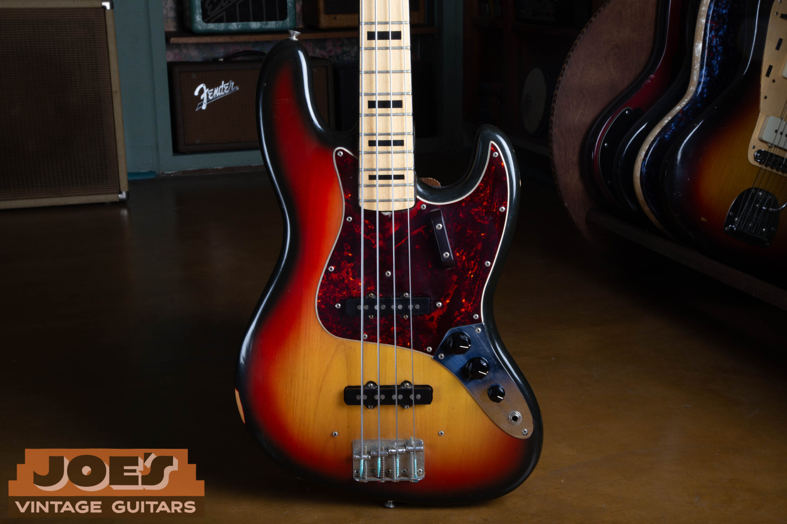
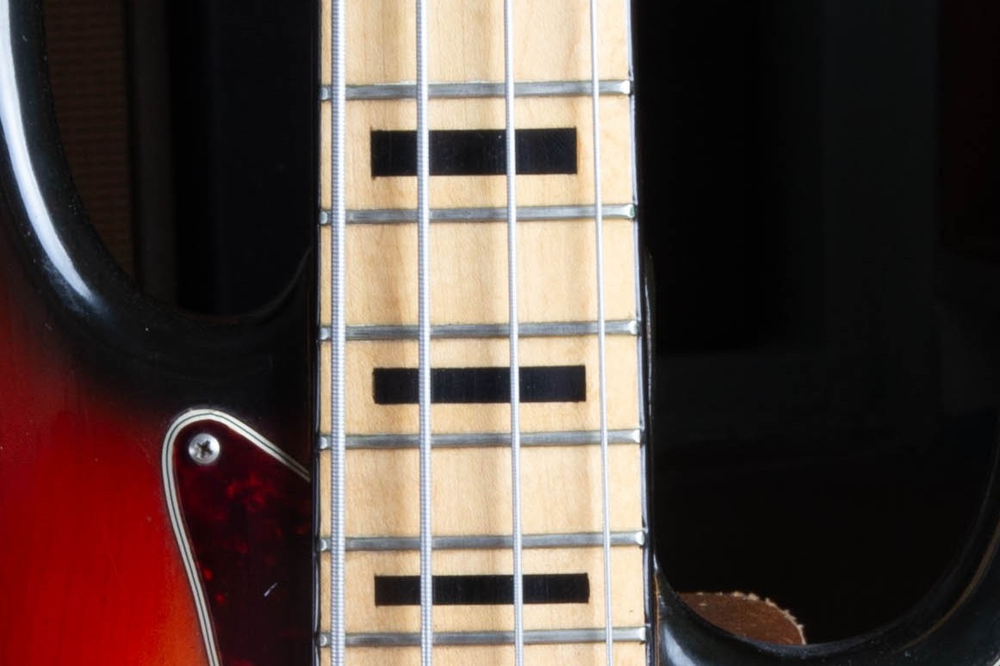
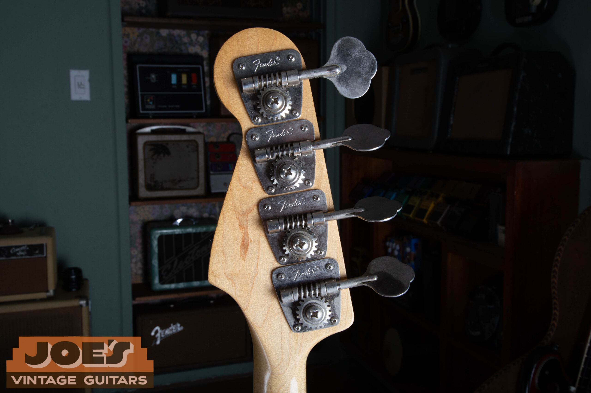
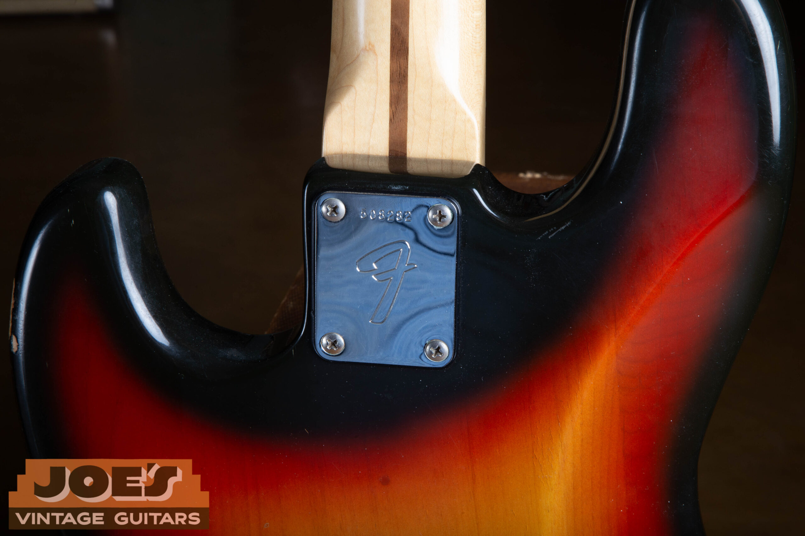
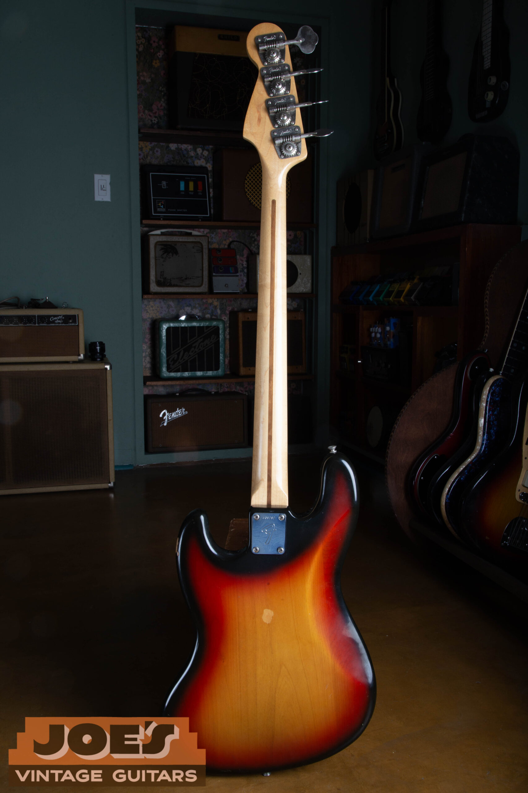

In the late '60s, a kid named Jim wore the grooves off his records chasing one thing: that low-end voice. The growl under "Foxy Lady." The melodic ache under "Ramble On." That rubber-band snap that turned a Sly Stone hook into a moving target. He didn't just want a bass. He wanted the bass those guys played. So in late 1973, his parents put a brand-new Fender Jazz Bass under the Christmas tree. 3-color sunburst, maple fingerboard, black block inlays, the works. Fifty-plus years later, that same bass tells you most of what you need to know about CBS-era Fender. And, as it turns out, it tells you something surprising about Fender's brand-new Vintera III series, too.

#### On this page

1.  [The Bass Heroes That Sealed the Deal](#bass-heroes)
2.  [Christmas Morning, 1973](#christmas-1973)
3.  [Why a 1973 Jazz Bass Hits Different](#why-a-73)
4.  [The Specs That Make a '73](#specs)
5.  [How It Plays, How It Sounds](#how-it-plays)
6.  [Authenticating a 1973 Jazz Bass](#authenticating)
7.  [The Vintera III Surprise](#vintera-iii)
8.  [Side by Side: '73 vs. Vintera III](#side-by-side)
9.  [Jim's Bass, Today](#jims-bass-today)
10.  [Every Vintage Bass Was Once New](#vintage-was-once-new)
11.  [Free Appraisal](#appraisal)

<h2 id="bass-heroes">The Bass Heroes That Sealed the Deal</h2>

Before Jim ever held one, the Jazz Bass was already the instrument he'd played a thousand times in his head. It had only been on the market since 1960, but by the back half of that decade it had become the alternative voice of rock and soul. Sleeker than a Precision. More articulate. Slimmer neck. A second pickup that gave you a whole new color of tone. For a teenager with a record player and good ears, the players who picked one up were the ones rewriting what bass guitar could even do.

### Noel Redding, Jimi Hendrix Experience

Redding was a guitar player drafted into bass duty, and you can hear it. His Jazz Bass on *Are You Experienced* and *Axis: Bold as Love* is rhythmic, percussive, sometimes melodic to the point of taking lead. To a kid in 1968, that was permission. The bass didn't have to sit politely in the back. It could push.

### John Paul Jones, Led Zeppelin

Jones came up out of British session work and into Zeppelin in 1968, often with a Jazz Bass slung low. The lyrical descending line under "Ramble On." The dirty pocket of "What Is and What Should Never Be." Those parts taught a generation that a Jazz Bass could be both a melody instrument and a sledgehammer.

### Larry Graham, Sly & the Family Stone

Graham more or less invented the modern slap technique on a Jazz Bass, born of necessity when his band lost their drummer and he had to *be* the kick and the snare himself. By the time Jim was studying records like *Stand!* and *There's a Riot Goin' On*, that thumb-and-pluck attack was a sound nobody else was making on a Precision.

### Jack Casady, Jefferson Airplane

Casady's playing on *Surrealistic Pillow* and *After Bathing at Baxter's* is bass guitar as exploration. Long melodic lines. Harmonic detail. A willingness to wander. He bonded with the Jazz Bass for the same reason every musician on this list did: the two-pickup voicing gave him room to *say* something.

All four of these guys reached for a Jazz Bass for the reasons Jim wanted one. The narrower nut. The dual-pickup palette. The articulation. The look of it. By 1973, a Jazz Bass wasn't just a Fender. It was a statement of intent.

<figure>

<figcaption>The CBS-era headstock that announced you weren't holding a '60s Fender anymore.</figcaption>

</figure>

<h2 id="christmas-1973">Christmas Morning, 1973</h2>

Jim's parents had been listening for years. They'd heard the records playing through the bedroom door, watched their son save up for a beat-up shortscale to learn on, and figured out that this wasn't a phase. So when the holidays came around in 1973 they did the thing every working musician dreams a parent will do. They walked into a Fender dealer and bought him the real thing. Brand new, off the rack, in the exact spec he'd been daydreaming about.

3-color sunburst body. Maple neck with a matching **maple fingerboard**. **Black block inlays** with bound edges, one of the most striking and unmistakably '70s Fender looks ever to leave Fullerton. Two of those classic Jazz Bass single-coil pickups, three knobs, four-saddle bridge, and the big '70s headstock with the bold black CBS-era "Fender" decal. It was, and still is, one of the most visually arresting basses Fender has ever shipped. And in 1973 it was sitting under a Christmas tree in suburban America, waiting for a kid who already knew exactly what to do with it.

#### Why this exact spec mattered

The maple-board, blocks-and-binding Jazz Bass had only been available for a few years by 1973. Fender introduced bound, blocked Jazz fingerboards in 1966, and the all-maple variant followed not long after. The **black-block-on-maple** combination, high contrast, bold, completely unlike the dot-on-rosewood look of the '60s Jazz Basses, became one of the defining visuals of CBS-era Fender. To a player who came up watching his heroes through 1969, this was the version of the Jazz Bass that *looked* like the future.

<figure>

<figcaption>Two single-coil pickups, three knobs, and the period-correct knob set we sourced for Jim's bass.</figcaption>

</figure>

<h2 id="why-a-73">Why a 1973 Jazz Bass Hits Different</h2>

To get why a '73 is its own animal, and not just "an old Jazz Bass," you have to understand the moment. CBS had bought Fender from Leo in January of 1965, and by 1973 the company was deep into what collectors now call the **CBS era**. The bigger headstocks. The heavier bodies. The thicker polyester finishes that some folks lovingly call "skating-rink poly." None of that was a bug. It was the look and feel of a brand growing up under new corporate ownership.

Here's the thing, though. For the Jazz Bass, that era produced an instrument that punches in a way nothing else does. The bodies tend toward heavier alder (occasionally ash), which gives you a percussive low-mid thump that pre-CBS Jazz Basses don't always have. The pickups of the period are voiced for cut and growl, and that signature Jazz Bass *bark* you hear when you favor the bridge pickup is essentially a 1970s sonic invention, even though the instrument itself dates back to 1960. Visually, with the bound maple board and the blocks, the '73 is the year that Fender's Jazz Bass finally caught up to its own swagger.

<figure>

<figcaption>Black blocks on maple, framed by white binding. A classic '70s Fender look.</figcaption>

</figure>

<h2 id="specs">The Specs That Make a '73</h2>

If you're trying to authenticate a 1973 Jazz Bass, this is the silhouette you should be looking for. Year-by-year minutiae matter because Fender was running small changes constantly, but the broad strokes for '73 are well-established.

#### Body

Solid alder, 3-color sunburst gloss polyester. Heavier than '60s examples. 9 to 10+ lbs is common.

#### Neck

One-piece maple, "C"-shape with a touch more meat than '60s necks. 34" scale, 1.5" nut.

#### Fingerboard

Maple, 7.25" radius, bound in white, with black block inlays. 20 frets.

#### Pickups

Two single-coil Jazz Bass pickups, period-voiced for punch and articulation, with that signature bridge-pickup growl.

#### Controls

Volume / Volume / Tone on a chrome control plate. The stacked-knob layout was discontinued back in '62.

#### Bridge

Vintage-style 4-saddle with steel saddles. Strings through the bridge, anchored to the body.

#### Tuners

Fender-stamped open-gear tuning machines. Big, smooth, basically indestructible.

#### Pickguard

3-ply or 4-ply, often tortoiseshell or black/white/black, with the period-correct screw pattern.

<figure>

<figcaption>Vintage 4-saddle bridge, original steel saddles.</figcaption>

</figure>

<figure>

<figcaption>Fender-stamped open-gear tuners. Big, smooth, basically indestructible.</figcaption>

</figure>

<h2 id="how-it-plays">How It Plays, How It Sounds</h2>

Plug a real '73 Jazz Bass into a clean tube amp and the first thing you notice is the **weight** of the note. Not just low end. *Density.* The combination of a heavier body, the maple neck and board, and the thick poly finish creates a fundamental that hits hard and decays slow. That's why these basses cut through dense rock mixes the way they do.

Roll back to the neck pickup and you get warmth. Round, woody, almost upright-like, perfect for that Motown-meets-AOR fingerstyle that defined a lot of '70s recordings. Crank both pickups full and balance to center for the nasal, hollow, mid-scooped Jazz Bass *quack*, the sound that anchors more records than most players realize. Favor the bridge pickup and you get the **growl**. Aggressive. Articulate. Unmistakable. It's the voice Jaco would later push to its limits, but it was already sitting there in 1973 under Jim's fingertips.

The neck is the other story. By '73 the C-profile had filled out a bit from its slimmer '60s shape. There's something to grab onto, especially up the neck, but it never feels like a baseball bat. The 7.25" radius wants you to play with a vintage touch (string-bending demands relief), and the vintage frets give you just enough height to dig in without choking out. It's a bass that *asks* to be played with the side of your thumb on the pickup cover and a deliberate right hand. You play it the way the records sound.

<figure>

<figcaption>The neck plate. The artifact that anchors a vintage Fender's date and authenticity.</figcaption>

</figure>

<h2 id="authenticating">Authenticating a 1973 Jazz Bass</h2>

Before you write a check on a "real" '73, here's the short list of things to verify. None of these is conclusive by itself (Fender's own production was inconsistent enough that a perfectly genuine bass can have a quirk or two), but all of them together should tell a coherent story.

#### What you want to see

-   An **F-stamped 6-digit neck-plate serial** (the CBS F-plate era), read together with the **neck-heel date**. These two are your most reliable dating tools. Fender serials overlap heavily from year to year and can't be pinned to a single year on their own, so treat the published serial ranges as an approximate corroborator, not proof. The serial should land somewhere in the early-'70s neighborhood, but let the F-plate and the heel date carry the call. Cross-reference with our [Fender serial number guide](/fender-guitars-serial-number-guide/), and don't rely on any single source.
-   A neck date pencil-marked or stamped at the heel that reads 1972 or 1973. This is the date you lean on, since it's tied to the actual neck rather than a plate that got grabbed out of a bin.
-   Pot codes on the volume and tone potentiometers that read "137" (CTS) followed by a year/week stamp consistent with late '72 or 1973.
-   Period-correct Fender-stamped tuners and original-era Phillips screws, not the slotted screws of the pre-CBS years.
-   An original poly finish that, on close inspection, looks "thick." Sometimes you'll see it pooled around the cutaways. That's not a flaw, that's just the era.
-   A pickguard with the right screw count and material for the year.

#### What should make you slow down

-   Mismatched dates between neck, body, pots, and pickups. Could be a parts bass, could be an undisclosed refret or refinish history, could be worse.
-   A "1973" with a thin nitro-style finish. CBS-era Jazz Basses are poly. Period.
-   Black-block inlays that sit oddly proud of the board, look freshly installed, or have a glossy plastic sheen the rest of the neck doesn't share. Possible reissue or replacement neck.
-   A weight that's *too* light for an early-'70s Jazz Bass without documentation. Sub-9 lbs is unusual for the era.
-   Pickup covers, bridge cover, or thumb rest that look NOS but show zero installation marks. Usually a tell that the parts are aftermarket reproductions.

#### If in doubt, get it appraised

A '73 Jazz Bass in honest, all-original condition is a different animal from a refinished or partsed-together bass, both in sound and in value. If you're buying, selling, or insuring one, get eyes on it. [Reach out for a free vintage Fender appraisal](/free-appraisal/) and we'll walk through it together.

<h2 id="vintera-iii">An Unexpected Surprise: The Vintera III Early '70s Jazz Bass</h2>

Here's the part of the story that surprised *me*, and I'll be straight with you. I deal in vintage instruments, not new production. I spend my days with original-finish Fenders from the '50s, '60s, and '70s, and I'd be lying if I told you I usually unwind by plugging into the latest reissue. But Fender just dropped the **Vintera III** series, and the lineup includes a [**Vintera III Early '70s Jazz Bass**](https://www.fender.com/products/vintera-iii-early-70s-jazz-bass?variant=48003309240542) in 3-color sunburst with a maple fingerboard, binding, and block inlays. On paper, it's a direct period-correct recreation of the exact bass that sat under Jim's tree in 1973. So when one rolled across my bench last month, I plugged it in. Just out of curiosity.

I was not expecting what I heard.

### The neck shape

The early '70s "C" profile on the Vintera III isn't a generic vintage carve. It's **chunky at the nut and thickens slightly toward the 12th fret**, which is exactly the way an early-'70s Fender neck should feel in your hand. Whoever specced this neck was paying attention. It doesn't feel like a modern bass. It feels like a '73.

### The pickups

This is where I expected to be let down, and where I genuinely wasn't. Fender voiced the Vintera III pickups specifically to capture that early-'70s Jazz Bass character. The warm-but-punchy fundamental. The slight grit on the bridge pickup. The way both-pickups-on flattens to that nasal Jazz Bass quack. A/B'd against Jim's '73, the Vintera III is not identical (no production guitar in 2026 is going to be), but it's *shockingly close*. Close enough that I had to stop A/B'ing for a minute and just play, because the gap was small enough to disappear when I wasn't actively listening for it.

### The feel and vibe

Vintage-tall frets. 7.25" radius. Period-correct hardware, including the vintage-style 4-saddle bridge with slotted steel saddles and reverse-style tuners. The body weight on the Vintera III runs on the lighter side, and that's worth talking about. The '70s Jazz Bass reputation for being a boat anchor isn't the whole story. The era produced everything from 11-pound bricks to genuinely resonant 9-pound players, and the lighter examples are the ones collectors chase the hardest. Jim's bass, for what it's worth, weighs exactly **9.01 lbs** on the shop scale. Right in that sweet spot. Fender appears to have specced the Vintera III against the *best* of the era, not the worst, and you can hear it. Played acoustically, unplugged, the resonance and attack are genuinely in the right neighborhood.

<h2 id="side-by-side">Side by Side: The 1973 vs. the Vintera III Early '70s</h2>

| Spec | 1973 Fender Jazz Bass | Vintera III Early '70s Jazz Bass |
| --- | --- | --- |
| Body | Solid alder, 3-color sunburst, gloss poly | Solid alder, 3-color sunburst, gloss poly |
| Neck shape | Early '70s "C," fuller than '60s carve | Early '70s "C," chunky at nut, thickens to 12th |
| Fingerboard | Maple, bound, black block inlays, 7.25" | Maple, bound, black block inlays, 7.25" (sunburst spec) |
| Frets | Vintage | Vintage-tall |
| Pickups | Two period single-coil Jazz Bass pickups | Two early-'70s-voiced single-coil Jazz Bass pickups |
| Controls | Vol / Vol / Tone | Vol / Vol / Tone |
| Bridge | Vintage 4-saddle, steel saddles | Vintage 4-saddle, slotted steel saddles |
| Tuners | Fender-stamped open-gear | Vintage-style reverse tuners |
| Country of origin | Fullerton, California, USA | Ensenada, Mexico |
| Price (today) | $4,000 to $7,500 depending on condition and originality | $1,499 street |

None of this means the Vintera III replaces the original. A 1973 in honest, all-original condition has 50+ years of played-in resonance, history, and provenance baked in, and there's a value to *that bass having existed in the world for that long* that you can't manufacture. But I plugged in this Vintera III, and after a couple of minutes I just sat back and went, "yeah. They got it."

<h2 id="jims-bass-today">Jim's Bass, Today</h2>

Jim still has the bass. He never gigged it. Never wanted to. He played it for himself, in living rooms and dens and quiet evenings, across more than half a century. The result is one of the most remarkable original-condition '73 Jazz Basses we've ever had through the shop. The poly is intact. The original frets are still under the strings. The maple board has darkened to a warm amber under the lacquer, throwing the black blocks into even sharper relief than they had back in 1973. The headstock decal is crisp. The pickguard isn't shrunk or yellowed past where it should be at this age. In nearly every way that matters, it's still the instrument his parents bought him.

<figure>

<figcaption>The bass today, front. Sunburst still vibrant, board aged into a warm amber.</figcaption>

</figure>

<figure>

<figcaption>And back. Original poly, original neck plate, fifty-plus years on.</figcaption>

</figure>

The only change Jim ever made was a small one. At some point in the early years, he swapped the stock control knobs for a set of knurled metal ones, a common period-appropriate tweak among bassists who liked a different feel under their fingertips. When the bass came through our shop, we sourced a period-correct set of original-style knobs and returned it to factory configuration. Other than that, this is the bass exactly as it left Fullerton in 1973.

That's the magic of a story like this one. A single bass, in a single home, played and loved by a single person for half a century. The Vintera III gets remarkably close to the real thing. The neck profile, the pickup voicing, the feel under your hands, the vibe when you plug in. Fender nailed all of it. Honestly, it's the nearest a player can get to a '73 Jazz Bass without owning one. What the original has on top of that is what only time and use can give an instrument. The slow-aged wood. The decades of settled resonance. The way every part of it has been broken in by being played. And in Jim's case, fifty years of his life played into it. That part can't be reissued.

<h2 id="vintage-was-once-new">Every Vintage Bass Was Once New</h2>

Here's something worth sitting with. Every vintage Fender you've ever wanted started its life as a brand-new instrument. Jim's '73 wasn't a "vintage Jazz Bass" on Christmas morning of 1973. It was a fresh-off-the-line Fender. No wear. No checking. No provenance. No story. The fifty-plus years he poured into it are what made it the instrument we're talking about today.

The same will be true of the Vintera III sitting on the wall at a Fender dealer this afternoon. A well-built bass is a future heirloom waiting for its first chapter, and Fender is absolutely building well in 2026. So buy it new. Play it on tour, in your living room, in your basement studio, on your front porch on a summer evening. Take it to family birthdays. Hand it to your kid the first time they ask. In 2076 that bass won't be a "reissue" anymore. It'll be a 50-year-old Fender Jazz Bass with your fingerprints on it, the maple board darkened the way Jim's has, the poly checked in the spots only your hands could check it, and a story your grandkids will tell.

So if you're sitting on the fence between hunting down an unobtainable original and buying a quality modern instrument you can actually afford to play hard, buy the new one. Play it. The years will do their work. They always do.

<h2 id="appraisal">Thinking About a Vintage Jazz Bass?</h2>

Whether you've inherited a CBS-era Fender, you're shopping for one, or you've owned one for forty years and want to know what it's worth today, getting a real set of expert eyes on it changes everything. We do free, no-obligation appraisals on vintage Fender basses and guitars, and we're always interested in original-owner stories like Jim's.

### Free Vintage Fender Appraisal

Have a vintage Jazz Bass, Precision, Strat, or Tele? Send us photos and we'll walk you through what you have, what era it's from, and what it's worth in today's market.

Looking for more like this? Read our [vintage guitar deep-dives](/blog/), or check our [Fender serial number guide](/fender-guitars-serial-number-guide/) to date your own bass or guitar.
