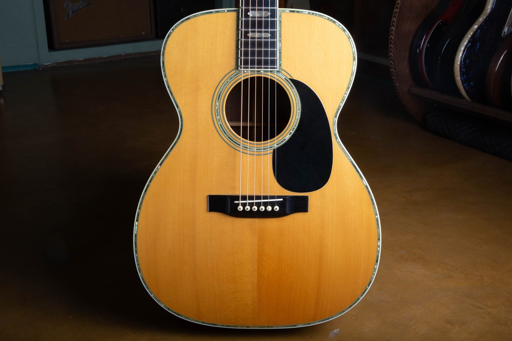
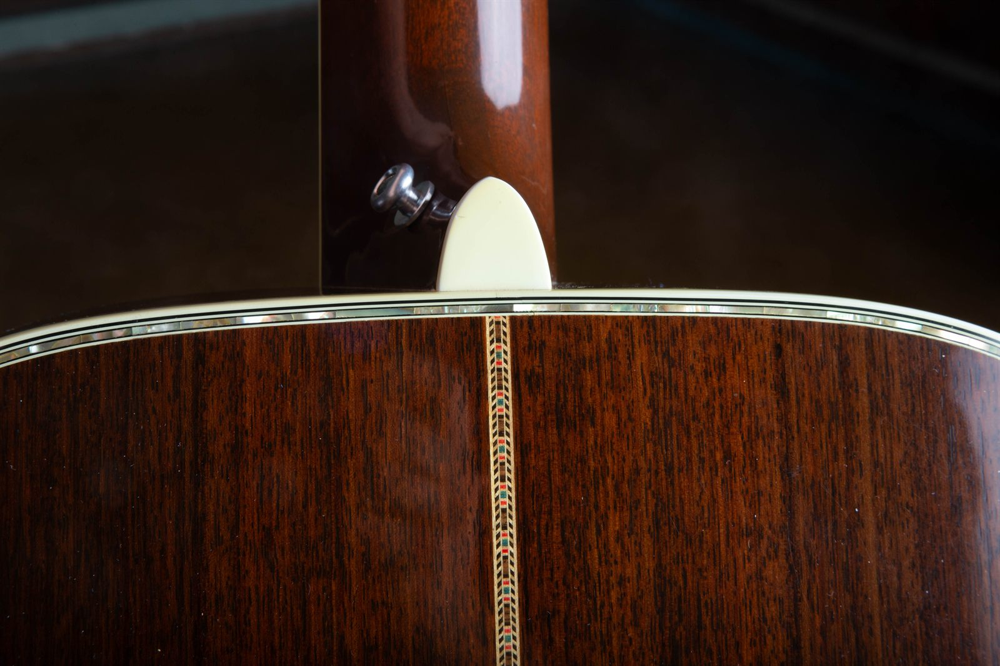
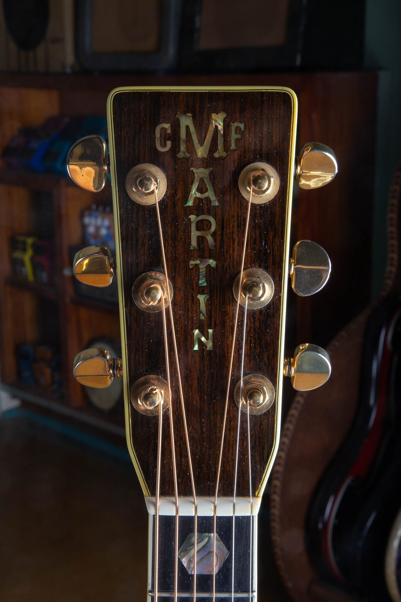
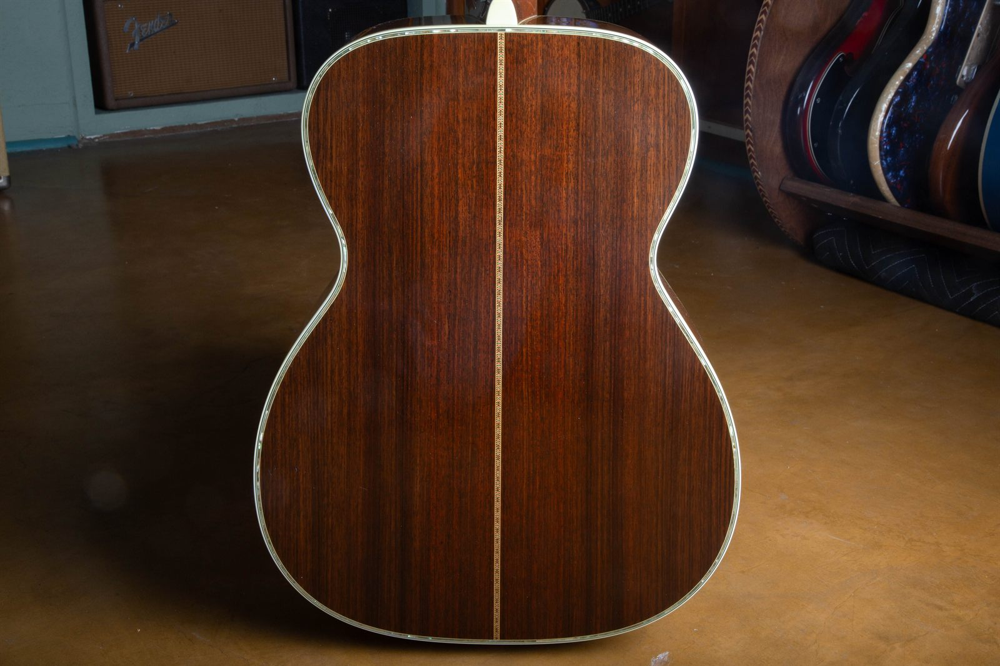
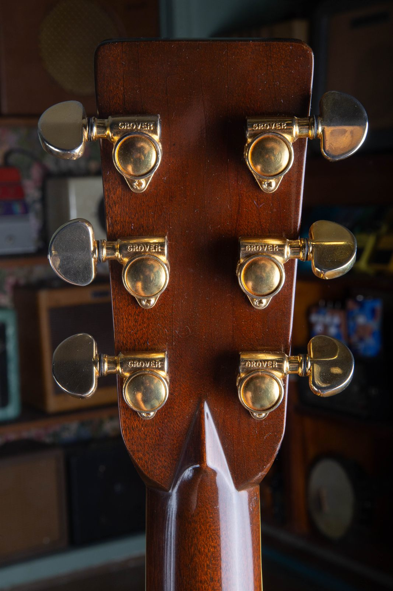
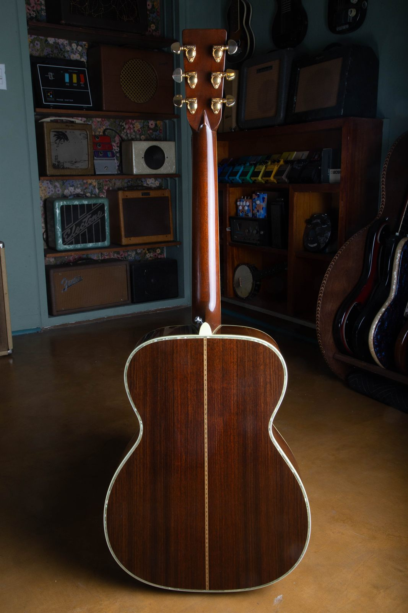

Martin has been building the 000-45 since 1906, and in almost 120 years the factory has made fewer of them than a popular dreadnought model gets through in a slow month. Martin's own archives put the count at **341 guitars from 1906 through 2005**. That figure is the whole span, not just the pre-war years, and it already includes every reissue built after the model came back in 1970.

Worth splitting apart, because the two eras get confused constantly. Mike Longworth's production records put the original pre-war run at roughly 265 guitars, which leaves somewhere in the neighborhood of 76 built across the thirty-five years after the reissue. Either way you cut it, this is a model Martin has made in ones and twos for most of its life.

The 1970s were the thinnest part of that run. Style 45 had been dead since 1942, and when Martin brought it back it came back cautiously, a few instruments at a time, usually against a specific order. Dealers who handle these routinely describe single years in the middle 1970s as one-guitar and three-guitar years.

The one in these photos is a 1976, a 14-fret example with a solid headstock, and it came through the shop wearing every bit of the abalone that makes a Style 45 what it is. Below is the full spec sheet, the history behind why a 1976 example exists at all, how to check one against the guitar it most often gets confused with, and what the market actually pays.

<figure>

<figcaption><strong>The reason people want these.</strong> Abalone runs the full perimeter of the top and rings the soundhole. Nothing else in the Martin catalog gets pearl treatment this heavy, and no other appointment is this hard to fake convincingly.</figcaption>

</figure>

<h2 id="quick-answer">The Short Version</h2>

If you only read one part of this, read the table.

| Question | Answer |
| --- | --- |
| **Body size** | 000, also called Auditorium. Roughly 15 inches across the lower bout |
| **Neck joint** | 14 frets clear of the body, solid headstock |
| **Scale length** | 24.9 inches, Martin's short scale |
| **Nut width** | 1 11/16 inches |
| **Top** | Solid Sitka spruce |
| **Back and sides** | Solid East Indian rosewood |
| **What makes it a 45** | Abalone pearl bordering the top, the back, the sides, and the rosette |
| **Fingerboard** | Bound ebony, abalone hexagon inlays at frets 1, 3, 5, 7, 9, 12, 15, and 17 |
| **Headstock** | Rosewood face with the vertical pearl C.F. Martin inlay |
| **Tuners** | Gold Grover |
| **1976 serial range** | 371,829 to 388,800 |
| **Total ever built (1906 to 2005)** | 341, reissues included |
| **Of those, pre-war (1906 to 1942)** | Roughly 265, leaving about 76 post-1970 |
| **Rough value, clean and original** | Low to middle five figures. See the [value section](#value) |

<h2 id="what-it-is">What A 000-45 Is</h2>

Martin model names are two facts stuck together. The part before the hyphen is the body. The part after it is the trim level.

**000** is the body. It is Martin's Auditorium size, about 15 inches wide at the lower bout and around 4 1/8 inches deep, which puts it a good deal smaller and shallower than a D-size dreadnought. It gives up some bass and volume and hands back balance, note separation, and a body that sits comfortably against a seated player. Fingerpickers have preferred the 000 over the dreadnought for as long as both have existed.

**45** is the trim, and it is the top of Martin's ladder. Every step up the numbers adds decoration: an 18 is mahogany with modest binding, a 28 is rosewood with more, a 42 adds pearl to the top, and a 45 wraps pearl around the top, the back, and the sides, then adds a bound ebony fingerboard with the long inlay pattern and the vertical pearl logo on the headstock. There is nothing above it.

Put those together and a 000-45 is the most decorated version of a mid-size Martin. It has never been a volume product. It was expensive when it was new and it was ordered by people who wanted the best thing on the wall.

For the wider family context, compare this pearl-trim flagship with the Style 15, 17, 18, 21, 28, 40, 42, and 45 instruments in the [vintage Martin 0, 00, and 000 guitar guide](/post/martin-0-00-000-history-authentication-value-guide/).

<figure>

<figcaption><strong>A 1976 000-45, front on.</strong> The 000 body reads narrow-waisted and compact next to a dreadnought. The 14-fret neck joint and the solid headstock are the standard configuration for the model in this era, as opposed to the 12-fret slot-head 000-45S.</figcaption>

</figure>

<h2 id="history">How Style 45 Came Back</h2>

Style 45 stopped in 1942. The war took the materials and the labor, and Martin dropped every pearl-bordered model from the line. For twenty-six years the company built nothing with abalone around the top.

The revival started with the dreadnought. Martin put the D-45 back into production in **1968**, driven by a vintage market that had begun paying serious money for the pre-war examples. The smaller Style 45 bodies followed, and the **000-45 returned in 1970**.

Returned is a generous word for what happened. The model went back on the price list, but the factory built them in ones and twos. A dealer selling a 1975 example describes it as one of three made that year. Another 1970s guitar has been advertised as the only one from its year. The numbers vary by source and by how you count special orders, but every account points the same direction: a 1970s 000-45 is an instrument that a specific person asked for, not something that sat in a shop waiting for a buyer.

That is the context a 1976 example lives in. The same year, Martin introduced the HD-28, which brought scalloped bracing back to a production model for the first time since 1944 and told you exactly where the company's head was at: the vintage market had gotten loud enough that Bethlehem was listening to it. A 000-45 built in 1976 is a guitar made in that moment, using the modern factory's woods and methods, wearing the pre-war catalog's decoration.

<h2 id="specs">Full Specifications</h2>

| Feature | 1976 Martin 000-45 |
| --- | --- |
| Body size | 000 (Auditorium), roughly 15 inches at the lower bout |
| Body depth | About 4 1/8 inches |
| Neck joint | 14th fret, solid (non-slotted) headstock |
| Scale length | 24.9 inches |
| Nut width | 1 11/16 inches |
| Top | Solid Sitka spruce, natural gloss |
| Bracing | X-braced, non-scalloped for this year |
| Back and sides | Solid East Indian rosewood |
| Neck | Mahogany, with a hollow square steel tube reinforcement, non-adjustable |
| Fingerboard | Ebony, bound |
| Inlays | Abalone hexagons at frets 1, 3, 5, 7, 9, 12, 15, 17 |
| Top trim | Abalone pearl border around the full perimeter, abalone rosette |
| Back trim | Abalone pearl border around the full perimeter |
| Side trim | Abalone pearl along the top edge of the sides |
| Binding | Grained ivoroid |
| Backstrip | Multi-color wood marquetry, the Style 45 zipper pattern |
| Headstock face | Rosewood, bound, vertical pearl C.F. Martin inlay |
| Bridge | Ebony belly bridge, drop-in saddle |
| Bridge pins | White with pearl dots |
| Pickguard | Black, glued to the top |
| Tuners | Gold Grover, enclosed |
| Serial location | Stamped on the neck block, visible through the soundhole |

A note on three of those rows, because they are the ones people query.

**Non-scalloped bracing** is correct for 1976 and is not a defect. Martin stopped scalloping in late 1944 and did not put it back on a production model until the HD-28 arrived in 1976. A 000-45 from this year should have straight-profile braces. If yours has scalloped braces, either it left the factory as a special order or somebody has been inside it.

**East Indian rosewood** is also correct and is also not a defect. Martin moved off Brazilian rosewood in late 1969, somewhere around serial 254498. Every 1970s rosewood Martin is Indian. Any 1976 guitar advertised as Brazilian deserves a hard look and a second opinion.

**The neck rod does not adjust.** Martin replaced the steel T-bar with a hollow square tube in 1967 and used that tube until 1985, when the modern adjustable rod arrived. There is no nut to turn on a 1976 guitar, and no amount of hunting inside the soundhole will find one. This matters when you go to buy: the square tube is less stiff than the T-bar it replaced, so guitars from this window have a reputation for pulling into an up-bow and staying there. Sight the neck before you commit, because the fix is a neck reset rather than a quarter turn of a wrench.

<h2 id="details">Reading This One Detail By Detail</h2>

<h3 id="pearl">The Pearl</h3>

Style 45 pearl is not a stripe of inlay on the top and nothing else. It runs the full perimeter of the top, the full perimeter of the back, along the top edge of the sides, and around the rosette. On pre-war guitars it also surrounds the fingerboard extension and the end piece.

This matters for authentication because the back and side pearl is the part nobody bothers to fake. Adding a pearl ring to a top is a job a good repair shop can do. Rebinding an entire guitar in abalone, including the sides, is a rebuild. If you are looking at a listing with pearl on the top but plain binding on the back, you are not looking at a 45.

<figure>

<figcaption><strong>Where the money went.</strong> Abalone along the back edge and the side edge, ivoroid binding, and the Style 45 zipper backstrip in the middle. This shot is the single most useful photo to ask a seller for.</figcaption>

</figure>

<h3 id="headstock">The Headstock</h3>

The headstock face is rosewood, bound in ivoroid, and carries the vertical pearl **C.F. Martin** inlay. That block-letter vertical logo dates to the 1930s and is used only on the highest trim levels. On a 45 it is inlaid pearl, not a decal and not a stamp. Catch it at an angle and the letters flash the same way the body trim does, because they are cut from the same material.

The abalone hexagons start at the first fret. Count them: 1, 3, 5, 7, 9, 12, 15, and 17. That long pattern starting down at the first fret is the Style 45 giveaway on the fingerboard. A Style 42 starts higher up the neck, and a 28 has plain dots.

The reissue-era guitars use hexagons rather than the snowflakes found on pre-war examples. That is a real and useful difference, and it is one of the fastest ways to sort a 1970s guitar from a 1930s one in a photo.

<figure>

<figcaption><strong>Vertical pearl C.F. Martin.</strong> Inlaid, not printed. The bound rosewood face and the gold Grovers are both correct for a Style 45 in this era, and the hexagon at the first fret starts the long inlay pattern.</figcaption>

</figure>

<h3 id="back">The Back And Sides</h3>

Two-piece East Indian rosewood, with the zipper backstrip splitting the seam. Indian rosewood of this period usually reads straighter-grained and browner-purple than the wilder, redder Brazilian it replaced, though grain alone is a weak test and plenty of people get it wrong. The reliable answer is the calendar: a 1976 Martin is Indian, full stop.

<figure>

<figcaption><strong>Pearl around the whole back.</strong> This is the appointment that separates a 45 from everything below it, and it is the one that makes upgrading a lesser guitar into a fake 45 economically pointless.</figcaption>

</figure>

<h3 id="hardware">Bridge And Tuners</h3>

The bridge is ebony, belly style, with a **drop-in saddle**. Martin shortened the saddle slot in 1965, so a long saddle running out to the ends of the bridge would be wrong here and would suggest the bridge has been replaced with an older or reproduction part.

The tuners are gold Grovers, enclosed, stamped GROVER on the housings. Original for a Style 45 in this era. Gold plating wears through at the button and the housing edge, and honest wear there is a good sign. Bright, unworn gold on a guitar with a played-in fingerboard usually means replacements.

<figure>

<figcaption><strong>Gold Grovers, stamped and enclosed.</strong> Check the back of the headstock for filled holes or an extra ring of unfaded finish, which is what a tuner swap leaves behind.</figcaption>

</figure>

<h2 id="authentication">Authenticating One</h2>

<h3 id="serial">Start With The Serial</h3>

Martin stamps the serial number on the neck block, inside the body, readable through the soundhole with a mirror and a light. The model number is stamped there too. Both should be crisp and both should agree with each other.

For 1976, the serial range runs **371,829 to 388,800**. A small block of numbers from 259,996 to 260,020 was also used that year, which is the sort of thing that trips people up if they are working from a partial chart. You can check any Martin serial against the full year-by-year table on our [Martin serial number lookup](/martin-serial-and-model-numbers/), or against [Martin's own serial number lookup tool](https://www.martinguitar.com/customer-service-2/support-serial-number-lookup.html).

Two things to watch for at the neck block:

- **The model stamp should say 000-45.** If the stamp says 000-28 and the guitar is covered in pearl, you have found your answer.
- **The stamp should not look recut, sanded, or refinished around.** Martin's stamps are pressed into raw wood. Fresh, shallow, or suspiciously clean lettering is worth a specialist's eyes.

<h3 id="upgrade">The Upgraded 000-28 Problem</h3>

Almost no 1970s Martin gets faked from scratch. What actually happens is an upgrade: somebody takes a 000-28, which Martin built in real numbers, and dresses it toward a 45.

The economics of that job are what protect you. Adding a pearl top ring is achievable. Doing the back, the sides, the fingerboard binding, the long hexagon inlay pattern, and a vertical pearl headstock logo is a rebuild that costs more than the difference in value, and it leaves evidence everywhere.

Here is what an upgrade looks like against the real thing:

| Detail | Factory 000-45 | Upgraded 000-28 |
| --- | --- | --- |
| Top pearl | Full perimeter, even width, tight to the binding | Often present, sometimes the only pearl on the guitar |
| Back pearl | Full perimeter | Usually missing, or a later addition with visible fill lines |
| Side pearl | Present along the top edge of the sides | Almost always missing |
| Fingerboard | Bound ebony, hexagons from the 1st fret | Unbound, dots at 5, 7, 9, 12, 15 |
| Headstock | Bound rosewood face, vertical pearl logo | Unbound, decal or gold Martin logo |
| Neck block stamp | 000-45 | 000-28 |
| Outer binding | Grained ivoroid | Grained ivoroid on both, so the binding material alone proves nothing |
| Purfling inside the binding | Abalone strips in routed channels, with multi-ply black and ivoroid borders | Plain black and white lines, or pearl dropped into a recut channel |
| Finish under the pearl | Uniform, no witness lines | Sanded-through edges, mismatched sheen, overspray |

Two rows there deserve to be read together, because people mix them up. The **binding** is the outer strip you can see from the edge, and a 1970s 000-28 and 000-45 both use grained ivoroid, so it settles nothing. The **purfling** is the layered material sitting inside the binding, and that is where the two models genuinely part ways. A 000-28 has plain black and white lines. A 000-45 has real abalone strips laid into routed channels with multi-ply black and ivoroid borders around them, on the top, the back, and the sides.

That distinction is what makes a conversion visible. To fake a 45 you have to widen or recut the purfling channel to take pearl, and that work leaves traces: uneven channel width, filled router lines, binding that reads too narrow or too wide against the pearl, purfling layers that do not match from the top to the back. Run a magnifier along the channel in raking light and follow it around the whole guitar. Factory work stays consistent the entire way around. Aftermarket work almost never does, and it usually gets sloppiest at the waist and the end block, where the bend is hardest.

The neck block stamp and the side pearl together will settle nearly every case, and the purfling channel settles the rest. We walked through the same logic for the other Martin that gets converted constantly in our [Martin D-18E and D-28E authentication guide](/post/martin-d18e-vs-d28e-authentication-guide/), where the giveaway is bracing rather than trim.

<h3 id="checklist">Bench Checklist</h3>

Run these in order. It takes about ten minutes with a mirror, a flashlight, and a magnifier.

1. **Read the neck block.** Serial and model number. Confirm the year against a serial chart and confirm the model says 000-45.
2. **Confirm the pearl goes all the way around.** Top, back, and sides. Missing side pearl is the loudest single red flag.
3. **Follow the purfling channel with a magnifier.** All the way around, in raking light. Even channel width, consistent layer count, no filled router lines. This is the step that catches a good conversion.
4. **Count the fingerboard inlays.** Eight positions starting at the first fret, in hexagons for this era.
5. **Check the headstock.** Bound rosewood face, inlaid vertical pearl logo, not a decal.
6. **Check the saddle.** Drop-in, not long. A long saddle on a 1976 means a replaced bridge.
7. **Look at the bracing through the soundhole.** X-braced, straight profile. Scalloping is not standard for this year.
8. **Sight the neck and check the bridge.** Remember there is no adjustable rod in a 1976. A bellied top, a lifting bridge, or an up-bow neck is common and repairable, but it moves the price.
9. **Blacklight the finish.** Original 1970s lacquer fluoresces differently from later overspray, and a refinish takes a big bite out of value on a pearl guitar.

If steps 1, 2, and 3 all check out, the guitar is real. The rest of the list is about condition, and condition is where the number gets decided.

<h2 id="value">What It Is Worth</h2>

The honest starting point is that this is a thin market. A handful of transactions set the price for the entire model year, so treat any number as a working range rather than a quote.

Clean, all-original 1970s 000-45s have carried dealer asking prices in the **$13,000 to $15,000** range in recent years. A 1976 example sold through a well-known vintage dealer at $13,900, and a 1975 example, described as one of three from its year, has been offered at just under $15,000. Guitars that are less clean fall away from that quickly. A 1983 000-45 has sold for around $6,500, which shows how much the number depends on year, condition, and how much of the guitar is still the guitar.

| Condition | Rough range |
| --- | --- |
| Clean, all original, no structural repairs | $13,000 to $16,000 |
| Playing wear, minor cosmetic issues, all original parts | $10,000 to $13,000 |
| Professionally repaired crack, neck reset, replaced saddle or pins | $7,500 to $11,000 |
| Refinished, replaced bridge, replaced tuners, or a top crack through the pearl | $5,000 to $8,000 |

**What moves the number inside a range:**

- **The pearl.** Damage that runs through abalone inlay is expensive and often visible forever. It hurts more here than a comparable crack would hurt a D-28.
- **Originality of the parts.** Tuners, saddle, nut, bridge pins, pickguard. Each swap is a small deduction and together they add up fast.
- **Finish.** A refinish is the single biggest hit. On a pearl guitar it is also very hard to do without damaging trim, so refinished 45s are penalized hard.
- **Structural history.** A neck reset and a cleat repair are normal maintenance on a 50-year-old guitar, and a well-documented repair by a known shop costs much less value than an unexplained one.
- **The case.** These shipped in a Martin hardshell case. The original case is worth real money on a rare model.
- **Documentation.** Original receipt, the original owner's name, correspondence with the factory about a special order. On a model built in ones and twos, provenance is not decoration, it is evidence.

For the wider picture on how these factors interact, we covered them model-agnostically in [7 factors that determine a vintage guitar's value](/post/is-your-vintage-guitar-valuable-7-factors-that-determine-its-value/), and specifically for this brand in [how to determine the value of your old Martin acoustic guitar](/post/how-to-determine-the-value-of-your-old-martin-acoustic-guitar/). If you want to sanity-check a number against a published source, our take on the [Blue Book of Guitar Values and the Vintage Guitar Price Guide](/post/blue-book-of-guitar-values-and-vintage-guitar-price-guide/) explains what those books are good for and where they fall down.

<h2 id="compare">How It Compares</h2>

Where a 1976 000-45 sits relative to its neighbors is worth spelling out, because the gaps are not intuitive.

| Guitar | Roughly what it takes | Why |
| --- | --- | --- |
| 1976 Martin 000-28 | Low thousands | Same body, same woods, ordinary trim, built in quantity |
| 1976 Martin 000-45 | Low to middle five figures | Same guitar underneath, wearing every appointment Martin offered, built in single digits per year |
| 1976 Martin D-45 | Middle five figures | Dreadnought demand plus Style 45 trim |
| 1968 to 1969 Martin D-45 | $35,000 to $55,000 | First years of the reissue, and the last with Brazilian rosewood |
| Pre-war Martin 000-45 | Six figures | Brazilian rosewood, Adirondack top, snowflake inlays, tiny original run |
| Pre-war Martin D-45 | $450,000 to $675,000 | The most collected flat-top acoustic there is |

Those dreadnought figures come from our [Martin D-28, D-18, and D-45 dreadnought value guide](/martin-d-28-d-18-d-45-dreadnought-value-guide/), which breaks the D models down era by era.

The pattern worth noticing: the jump from a 000-28 to a 000-45 in the same year is enormous, and it is driven almost entirely by rarity and decoration rather than by anything structural. Underneath the pearl, a 1976 000-45 is built like the rest of Martin's 1976 rosewood line. That is not a knock on it. It means you can predict how it will sound before you pick it up, and it means the premium you are paying is a collector premium with its eyes open.

<figure>

<figcaption><strong>The whole back.</strong> Mahogany neck, rosewood body, and abalone around the perimeter. Fifty years on, this one has stayed straight and clean.</figcaption>

</figure>

<h2 id="faq">Frequently Asked Questions</h2>

**How many Martin 000-45s were made in 1976?**

Martin has not published a public year-by-year figure for this model, and the dealers who handle them cite single-digit numbers for the mid-1970s: one guitar in 1974, three in 1975. The reliable figure is the total. Martin's archives put it at 341 000-45s built between 1906 and 2005, and that number covers everything, pre-war and reissue alike. Since Longworth's records place the pre-war run at roughly 265, the entire post-1970 reissue era accounts for something like 76 guitars spread over thirty-five years. Single-digit years are exactly what you would expect from that math.

**Is a 1976 000-45 Brazilian rosewood?**

No. Martin moved to East Indian rosewood in late 1969, around serial 254498. Every 1970s Martin rosewood guitar is Indian. If a listing says a 1976 is Brazilian, ask for the serial and check it.

**Why does mine have straight braces instead of scalloped?**

Because that is correct. Martin stopped scalloping in late 1944 and did not return to it on a production model until the HD-28 in 1976. Straight braces on a 1976 000-45 are factory standard.

**What is the difference between a 000-45 and a 000-45S?**

The S models are the 12-fret versions with a slotted headstock, built on the older body pattern. The plain 000-45, like the one shown here, is the 14-fret solid-headstock guitar. Both are rare, and the S versions are rarer still.

**Is a 1970s 000-45 a good player, or just a collector piece?**

It is a genuinely good 000. Non-scalloped 1970s Martins get criticized for being stiff when new, but a 50-year-old top has had five decades to open up, and the 000 body was always the balanced, fingerstyle-friendly one in the line. The reason to hesitate is the value, not the sound. Many owners of rare pearl guitars end up playing something cheaper and keeping this one in the case.

**How do I find the year of my Martin?**

Read the serial number stamped on the neck block through the soundhole, then look it up. Our [Martin serial number lookup](/martin-serial-and-model-numbers/) has the complete year-by-year table from 1898 forward, along with the model number stamps.

<h2 id="selling">If You Have One</h2>

Rare pearl-trimmed Martins are exactly the kind of guitar that gets undersold, because the people who inherit them usually have no idea that the difference between the 28 and the 45 on the neck block stamp is worth five figures. If a 000-45 has come to you, find out what it is before you list it anywhere.

We buy vintage Martins outright and we look at them properly, which on a model like this means reading the neck block, checking the pearl all the way around, and being straight with you about what any repair history does to the number. Send photos through our [free guitar appraisal](/free-appraisal/) page, or go directly to our [sell my Martin guitar](/sell-my-martin-guitar/) page for a cash offer. If you would rather hold out for the top of the market, we also handle [consignment](/consignment/), which usually makes sense on instruments this thin on the ground.

If it is one piece of a bigger estate, we have written up every option honestly in [how to sell a large guitar collection](/post/how-to-sell-a-large-guitar-collection-every-option-honestly-explained/), and the general ground rules are in [what to consider when selling a vintage guitar](/post/what-to-consider-when-selling-a-vintage-guitar/). Either way, feel free to just [get in touch](/contact-me/) and ask. We answer questions about guitars we are not buying all the time.

**Sources and further reading:** the Style 45 history and the 341-guitar total come from [Guitar Player's history of Martin's 45-series](https://www.guitarplayer.com/gear/martin-45-series-acoustic-guitars), quoting Martin archivist Jason Ahner reading the factory's own production totals: from the first 000-45 in 1906 up to 2005, Martin built 341 of them. The roughly 265 figure for the pre-war run traces to Mike Longworth's *Martin Guitars: A History*, the standard reference for Martin production records. The dated spec changes, including the Brazilian to Indian rosewood switch, the 1965 saddle change, and the 1967 to 1985 square tube neck rod, are documented on [Vintage Guitars Info's Martin reference](https://guitarhq.com/martin.html). Serial ranges are from Martin's published records, mirrored on our own [Martin serial number lookup](/martin-serial-and-model-numbers/).
