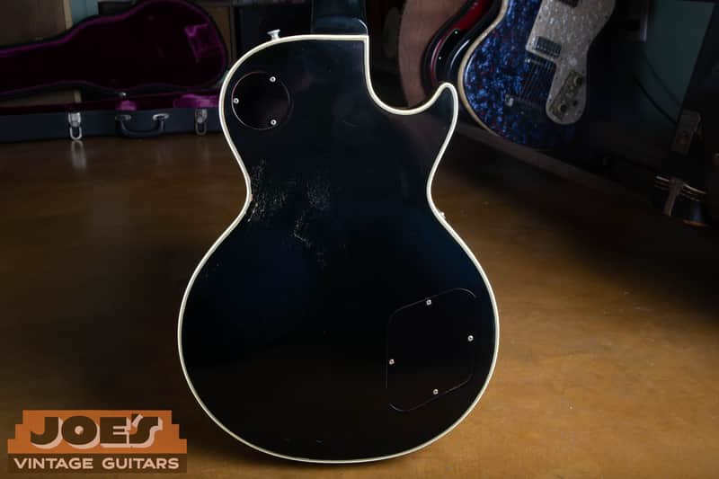
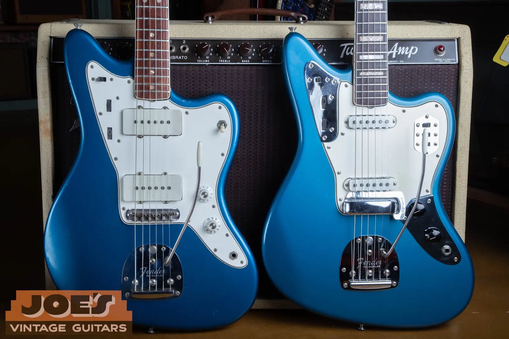

A vintage left-handed guitar is not automatically worth less or more than the same model in a right-handed version. Handedness changes both sides of the market: there are fewer examples available, but there are also fewer buyers. The final value depends on which force is stronger for that exact guitar.

> **The short answer:** Common left-handed models may sell a little slower or need sharper pricing. Rare, factory-original lefties from desirable years can equal or exceed a comparable right-handed guitar when the right collector is looking.

| Value Factor | Typical Effect |
| --- | --- |
| Rarity | Usually favors the lefty |
| Buyer pool | Usually favors the righty |
| Factory build | Matters more than orientation alone |
| Originality | Parts and finish drive value |
| Best evidence | Comparable sold examples |
| Fast sale | May require broader exposure |

## Rarity and Demand Pull in Opposite Directions

Manufacturers produced far fewer left-handed guitars during the vintage era. That makes a factory-original left-handed example unusual, and sometimes extremely unusual. But rarity is not the same thing as demand. A right-handed guitar can be shown to nearly every player who wants that model; a left-handed guitar needs a much smaller group of qualified buyers.

> A left-handed vintage guitar can be rarer and harder to sell at the same time.

This is why blanket rules fail. A left-handed version of a famous, heavily collected model may attract a premium. A left-handed version of a less popular model can sit longer even if fewer were made.

## When a Vintage Lefty Can Be Worth More

- **It left the factory that way.** A documented factory-left-handed guitar is a different proposition from a right-handed guitar that was later converted.
- **The underlying model is already desirable.** Rarity helps most when collectors already want the model, year, finish, and specifications.
- **It is original.** Original finish, pickups, hardware, tuners, electronics, and case can matter more than handedness.
- **The provenance is convincing.** Factory records, a clean ownership history, receipts, and period photographs can give buyers confidence.
- **A motivated left-handed buyer is waiting.** Scarcity matters when two people want the same hard-to-replace guitar.

*A rare factory lefty can have real collector appeal, but the audience is specialized. Photo from [Joe's Vintage Guitars' Reverb listing](https://reverb.com/item/96201337-lefty-gibson-les-paul-custom-1969-black).*

## When a Vintage Lefty May Be Worth Less or Take Longer to Sell

The smaller buyer pool becomes a bigger issue when the model itself has limited demand, the guitar has major changes, or the seller needs a quick sale. A converted right-handed guitar can also lose value because the conversion may involve a changed nut, bridge or saddle, controls, pickguard, strap buttons, bracing, or finish work.

There is an important difference between *price* and *liquidity*. A rare lefty may be worth strong money and still take months to find its buyer. If the sale has to happen quickly, the accepted price may be lower than the patient retail value.

*Two right-handed vintage Fender offsets from Joe's photo archive. Model, year, configuration, and originality should be matched before handedness is adjusted.*

## Compare the Same Guitar, Not Just the Same Decade

Start with verified sales of the same model and year range in comparable condition. Then look for true left-handed sales. Asking prices are useful clues, but they are not proof of value. [Reverb's Price Guide](https://reverb.com/price-guide), for example, says its values are based on sold listings.

| Question | What to Compare | Reason It Affects Value |
| --- | --- | --- |
| Is it factory left-handed? | Build details, serial number, factory records, and period-correct construction | A conversion is not valued like a factory-left-handed guitar. |
| Is the comparison truly similar? | Model, year, finish, pickups, originality, repairs, and condition | These differences often outweigh handedness. |
| Did it actually sell? | Completed sales instead of optimistic asking prices | Sold prices show what a buyer agreed to pay. |
| How quickly must it sell? | Patient retail value versus an immediate cash offer | A smaller buyer pool affects time as well as price. |

Exact value still requires inspecting the individual guitar.

## How Joe Values a Vintage Left-Handed Guitar

We first identify the exact model and production period, then determine whether the guitar was built left-handed or converted later. Next comes originality: finish, pickups, pots, hardware, tuners, repairs, case, and provenance. Only then do we compare recent sales and consider how broad the likely buyer pool will be.

The result should be a range, not a magic number: an insurance or patient retail value, a realistic private-sale value, and a faster-sale value can all be different.

## Have a Vintage Left-Handed Guitar?

Send clear photos of the front, back, headstock, serial number, electronics, and case. Joe can help identify what you have and give you a straightforward, current assessment.

[Request a Free Appraisal](/free-appraisal/) or [Ask Joe](/contact-me/).
