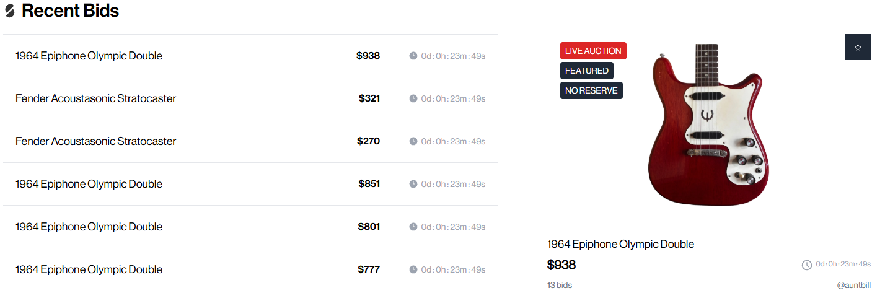

In this guide

1.  [The hidden fee categories](#fees)
2.  [Quick comparison](#comparison)
3.  [Reverb](#reverb)
4.  [eBay](#ebay)
5.  [Traditional auction houses](#auction-houses)
6.  [StringTree](#stringtree)
7.  [The risk side of the ledger](#risks)
8.  [How to pick a platform](#how-to-pick)
9.  [Why structure beats percentage](#structural-model)
10.  [FAQ](#faq)

If you own a vintage guitar worth real money, picking the wrong online platform can cost you four figures before the box ships. The number on a marketplace's pricing page is almost never what lands in your account after a sale clears, and the spread between the old default channels and the curated platforms has gotten wider every year I've been doing this. Here's what each of the major channels actually charges, plus where the failure modes live.

Anyone who has moved an expensive instrument online in the last few years already knows the listed commission is the start of a longer math problem, not the end of one. You also pay processing fees. Sometimes cross-border fees. Promoted-listing spend, if you actually want the listing to surface in a crowded category. Then chargebacks, "item not as described" claims, your own photo time, return shipping you eat when the buyer ghosts, and a steady drumbeat of scammers aimed at high-value gear. The platforms that look cheap on the homepage can wind up being the most expensive once the dust settles.

I've sold guitars on every channel below. Some I still use. A couple I won't touch anymore for anything over a couple grand. What follows is the honest walkthrough. What each channel actually charges when you add the line items together. The failure modes that don't show up in the marketing copy. Why I've moved a meaningful chunk of inventory over to StringTree in the last year, alongside the buying I still do [out of my Phoenix shop](/about-me/). For vintage and collectible stuff specifically, the math from five years ago doesn't hold anymore. The platform gaining share fastest isn't the one most sellers would have guessed.

<h2 id="fees">The Fees That Never Make It Into the Headline Number</h2>

Before the platform-by-platform walkthrough, a quick map of the fee categories that show up everywhere. When somebody tells you a site "only charges 5 percent," the first question to ask is which 5 percent.

Stack all four together and a sticker rate of 5 percent turns into 11 or 12 percent in practice. On a $6,000 guitar that's the difference between netting $5,700 and netting $5,280. Same listing, same buyer, just a different platform.

<h2 id="comparison">Quick Comparison at a Glance</h2>

Short version. Each row is the realistic all-in seller cost on a $5,000 vintage guitar as of 2026, not the marketing number off the pricing page.

A quick note on the fees and buyer counts throughout this guide. They are current as of mid 2026 and they change. Platforms adjust their rates and their reported buyer numbers regularly, so before you list, check the current rates on whichever platform you pick.

| Platform | Seller fee | Processing | Real all in cost | Best for |
| --- | --- | --- | --- | --- |
| **StringTree** | 0% | Handled by buyer's premium | ~0% to seller | Vintage, collectible, high value |
| **Reverb** | 5% (capped $500) | 3.19% + $0.49 | ~8 to 9% | Used gear in general |
| **eBay (guitars)** | 6.35% (cap on excess) | Included in fee | ~6.5 to 8% | Broad reach, lower value items |
| **eBay (amps, drums, other)** | 13.25% | Included in fee | 13 to 16% | Anything not categorized as guitar or bass |
| **Heritage / Christie's / Sotheby's** | 10 to 25% commission | Plus catalog, insurance, photography | ~15 to 30% | Six figure pieces only |

<h2 id="reverb">Reverb</h2>

### Reverb

Reverb is where most guitar sellers list first. The audience is huge, the search filters are built for instruments, and the buyer side trusts the platform enough to drop real money on a serial number they've never seen in person. The cost has crept up quietly over the last several years though, and most sellers I talk to underestimate where the real number lands.

#### The real fee math

Reverb charges 5 percent on the total order including shipping, capped at $500 per transaction. Reverb Payments takes another 3.19 percent plus $0.49 on top (2.99 percent plus $0.49 if you're a Preferred Seller). So a $5,000 sale with $100 shipping breaks down roughly like this:

-   Selling fee: $255 (5 percent of $5,100)
-   Processing fee: $162.78 (3.19 percent of $5,100, plus $0.49)
-   Total fees: about $418, or 8.2 percent of the gross

That's before any Reverb Bump (their promoted-listing tool, where you bid a percentage of the sale price for placement), the 1 percent international fee on cross-border sales, or the 2.5 percent currency conversion on non-USD payouts. In busier categories, skipping Bump means your listing buries.

#### What works

-   Guitar-focused audience that searches with intent
-   Decent shipping label integration and buyer protection
-   The $500 fee cap helps a lot above $10,000
-   Reverb Safe Shipping for high value items

#### What hurts

-   Effective rate is 8 to 9 percent, not 5
-   Bump fees on top in competitive categories
-   You write your own copy and take your own photos
-   "Item not as described" returns are routine and expensive

<h2 id="ebay">eBay</h2>

### eBay

eBay deserves more nuance than it usually gets. For guitars and basses specifically, eBay negotiated a much lower category rate years ago to compete with Reverb, and on paper that rate is one of the best in the business. The catch is that everything else in the music instrument space, including amps, pedals, drums, brass, woodwinds, keyboards, and pro audio, sits at the standard 13.25 percent.

#### The real fee math (guitars and basses)

-   6.35 percent final value fee on total order up to $7,500, then 2.35 percent above
-   $0.30 per order
-   Payment processing rolled into the final value fee
-   Capped at $350 for non-store, $250 for store subscribers

That makes a guitar one of the cheaper things you can sell on eBay. On a $5,000 sale you're looking at roughly $317.50 in fees, or 6.4 percent. Genuinely competitive.

#### The real fee math (everything else)

-   13.25 percent final value fee on most other instrument categories
-   $0.30 per order
-   2.35 percent above $7,500
-   Below Standard sellers pay an extra 6 percent. Promoted Listings add 2 to 20 percent more if you use them.

So a vintage amp head selling for $5,000 will cost the seller around $663 before any promoted-listing spend. More than double what the same dollar value would cost in the guitar category, and most sellers don't realize the gap until the payout statement lands.

#### What works

-   Enormous buyer pool, 132 million active buyers
-   Guitars and basses get a genuinely low rate
-   Best price discovery for common items
-   International shipping is well integrated

#### What hurts

-   Non-guitar categories pay double the rate
-   Buyer protection is famously seller-hostile
-   $20 dispute fee per chargeback
-   Bait-and-switch return scams are a known cost of doing business

<h2 id="auction-houses">Traditional Online Auction Houses (Heritage, Christie's, Sotheby's)</h2>

### Traditional auction houses

The big houses get romantic press for landing seven-figure hammer prices on famous instruments. What's less discussed is the consignor's side of the math. Seller commissions at the major houses run 10 to 25 percent of hammer, depending on the category and the relationship. You also pay catalog photography, insurance through the consignment window, marketing, and storage if your piece doesn't sell. Unsold fees themselves run around 1.5 percent of the average of the high and low estimates.

Minimums matter too. Most major houses won't accept a consignment under $5,000, and for an instrument to be worth the effort of being properly cataloged it usually needs to be a $25,000-plus piece. For a Mary Kaye Strat or a pre-war D-45, the numbers can pencil out. For most vintage gear, the all-in cost eats whatever benefit the wider audience was supposed to provide.

#### What works

-   Provenance and pedigree halo for marquee items
-   International buyer reach
-   Bidding tension at the very top of the market

#### What hurts

-   10 to 25 percent commission plus a stack of side fees
-   Catalog and insurance costs apply whether or not it sells
-   Multi-month timelines from consignment to payout
-   Minimums exclude most vintage instruments

<h2 id="stringtree">StringTree</h2>

### StringTree 0% seller fee

[StringTree](https://www.stringtree.co/) took the old assumption that selling vintage instruments online has to cost the seller something and just discarded it. The platform is structured as a curated auction marketplace built specifically for vintage, collectible, and high-value gear. The fee structure surprises most sellers the first time they see it. The seller pays nothing. Buyers pay a flat 5 percent buyer's premium on top of the hammer price, and that's what covers the platform.

That's a real zero, not a marketing zero. No selling fee, no listing fee, no payment-processing skim, and no mandatory promoted-listing system you have to bid into to be seen. If a guitar hammers at $8,500, the seller gets $8,500 less whatever shipping arrangement was agreed up front.

**What the trajectory looks like.** StringTree launched in late 2024 with six partner dealers and a single proof-of-concept auction. Less than a year later, the company is reporting a waitlist of over 100 stores wanting on, bid counts climbing on every successive cycle, and a feature set that's expanded from a single auction format to include Showrooms for collection display and asynchronous offers. *Vintage Guitar Magazine* covered the launch. Established vintage dealers like J. Rieck Music list there publicly. This isn't a sleepy auction site that's going to disappear next quarter. It's where a meaningful chunk of the serious vintage dealer community is moving inventory.

<figure>

<figcaption>A live StringTree auction for a 1964 Epiphone, showing the bid activity, time remaining, and curated listing layout the platform uses for every consignment.</figcaption>

</figure>

**The math, on the same $5,000 instrument used above:**

-   Reverb: about $418 in fees, seller nets ~$4,582
-   eBay (guitar category): about $317, seller nets ~$4,683
-   eBay (amp, drum, keyboard, etc.): about $663, seller nets ~$4,337
-   Heritage / Christie's at 15 percent: $750 plus catalog and insurance, seller nets ~$4,200 if you're lucky
-   **StringTree: $0 in seller fees, seller nets $5,000**

#### Where the structure actually matters

Fees on their own don't tell the whole story. The piece that matters most for vintage sellers is the curation and the listing production. The team reviews submissions before anything goes live, which keeps fakes and lowball window-shoppers out. Their content team then writes the editorial listing copy and handles professional product photography. As a seller, you submit the instrument and they build the listing.

That flips how Reverb and eBay work. There, you spend the afternoon doing your own photo shoot, write your own copy, fight for keyword placement, and then bid into promoted-listing fees just to be seen. StringTree's process moves that whole workload onto the platform.

#### How the auction format works

-   **Submit for review.** The team evaluates the instrument and confirms a reserve if you want one.
-   **Listing creation.** Their content team writes the long-form description and handles photography.
-   **Seven day countdown.** A pre-bid window lets potential buyers ask questions and post comments. Upvotes on questions help build anticipation.
-   **Bidding opens.** All bidder profiles are linked to their bid activity, which keeps the bidding transparent and discourages shill activity.
-   **Secure transaction.** Payment runs through StringTree's checkout. The seller ships once payment clears.

The seven-day window matters more than it looks on paper. Most marketplaces are a buy-it-now scroll where listings either sell or just sit there. The countdown format generates real attention, and the competitive bidding at the close is where the price actually gets discovered on a vintage piece.

#### Showrooms

StringTree's Showrooms feature is worth flagging separately. It lets stores, collectors, and dealers upload entire inventory or full collections, accept private escalating offers, or push any item to live auction with one click. The asynchronous offer model means each new bid has to exceed the last one, which builds auction-style pressure without putting a countdown clock on it. For dealers managing active inventory, and for collectors wanting to test the water on a piece without committing to a full seven-day public auction, that middle ground is useful.

#### What works

-   True zero fee for the seller, no asterisks
-   Professional listing copy and editorial photography included at no cost
-   Curation keeps fakes, scammers, and tire-kickers out
-   Auction format generates real bid competition and price discovery
-   Secure escrow-style payment handling protects against chargebacks
-   Buyer pool is growing month over month as more dealers list
-   Buyer's premium is a flat 5 percent, easy for buyers to budget
-   Showrooms feature lets dealers manage entire inventories in one place

#### Things to know

-   Curated supply, so the focus is on vintage and collectible, not used pedals or modern production guitars
-   Seven day auction cycle vs instant buy-it-now, though the trade-off is real bidding tension at the close

<h2 id="risks">The Risk Side of the Ledger</h2>

Fee comparisons usually stop at the percentage. They shouldn't. The actual cost of selling vintage gear online has to include the failure modes, and those vary wildly by platform. Short list of what tends to go wrong:

### "Item not as described" returns

The single most expensive thing that happens to vintage sellers on Reverb and eBay. A buyer claims the guitar isn't what was described, opens a case, and the platform sides with the buyer by default. The seller eats return shipping, often finds a swapped part or fresh damage when the box comes back, and ends up out the original sale plus the round-trip freight. Curated marketplaces with authentication review knock this down significantly because the listing description is built by the platform, not by the seller.

### Chargebacks

A buyer pays, takes delivery, then files a chargeback with their card issuer two months later claiming they never received it or the item was misrepresented. eBay's dispute fee on a chargeback alone is $20, on top of whatever you lose on the refund. The longer payment-to-payout windows on curated auction platforms cut this exposure because the platform holds funds and verifies delivery before paying the seller.

### Listing theft

Scammers scrape real vintage listings and repost them under suspiciously low prices on other channels. The legitimate seller doesn't lose money directly, but the buyer pool gets polluted and trust in the whole category takes a hit. Curated platforms where the listing is built and hosted by the platform itself are harder to scrape convincingly than open marketplaces.

### Authentication disputes

Vintage guitars come with serial number questions. Refin questions. Replaced part questions. Date code questions. On a self-serve platform, those debates live between the buyer and the seller, and they become disputes the moment the buyer disagrees with the seller's read. On a curated platform, those questions get resolved before the listing ever goes live.

**The platforms most likely to pay you what the headline number says** are the ones with the lowest dispute volume per sale, not the ones with the lowest commission. A 0 percent fee with a 1 percent dispute rate beats a 5 percent fee with a 10 percent dispute rate every time you run the numbers.

<h2 id="how-to-pick">How to Actually Pick a Platform for What You Are Selling</h2>

Quick framework, no math required. Worth flagging upfront that the fastest path on anything you'd rather not list yourself is still [a direct appraisal with a vintage dealer](/free-appraisal/). That's what I do every week out of the shop, and it skips the listing process entirely. Beyond that route, the price band matters:

-   **Under $500, common gear.** Reverb or eBay are fine. Fees hurt less in absolute dollars at this end, and the audience volume matters more than curation.
-   **$500 to $2,000, common-to-uncommon vintage.** Reverb if you have time to manage your own listing, photos, and message queue. StringTree if you'd rather have the platform produce the listing for you and skip the seller fees entirely.
-   **$2,000 to $10,000, vintage or collectible.** StringTree's bread and butter. The auction format is purpose-built for this band, the zero seller fee meaningfully changes the net, and the curated listings move faster than open marketplace clutter.
-   **$10,000 to $50,000, high-end vintage.** StringTree first. The big auction houses become technically viable here but the fees still rarely beat a curated zero-fee auction at this price, and the timeline is months faster.
-   **$50,000-plus or museum-grade.** Heritage and Christie's start to make sense for the marquee marketing reach, accepting that 15 percent or more of hammer is going to the house. StringTree is also accepting consignments in this range as the platform scales.

<h2 id="structural-model">Why the Structure Matters More Than the Percentage</h2>

The thing that took the longest to figure out, after years of selling on every channel above, is that the headline fee on its own is misleading. A platform's structure tells you a lot more about what you actually keep than its commission rate does.

Self-serve marketplaces like Reverb and eBay push all of the work and all of the risk onto the seller. The seller writes the listing, takes the photos, optimizes for search, answers every message, handles disputes, eats chargebacks, and pays the fee on top of all of it. That model worked when there was no alternative. There is now.

Curated auction platforms flip the equation. The platform builds the listing, vets the buyer pool, generates real bid tension through a defined window, holds funds in escrow, and takes its cut on the buyer side rather than the seller side. StringTree's about page spells it out: zero seller fees, 5 percent buyer's premium, curated supply, content-driven listings.

For vintage gear specifically, where authenticity questions and condition grading and price-finding are all real concerns, the curated model is just a better fit for the actual problem. Buyer trust goes up, dispute rates come down, and the seller keeps more of the gross than under any of the legacy options. That's why the vintage dealer community has started shifting inventory in this direction, and why the bid counts climb with every new auction cycle. The advantage compounds. More sellers pull in more buyers, more buyers push hammer prices up, and because nothing gets clawed back on the seller side, none of that growth comes out of your end.

### If you've got something vintage to sell

Two paths from here. If you'd rather skip the listing process and get a number directly from a dealer who buys vintage outright, that's what I do out of the shop in Phoenix. If you'd rather list at auction on a curated platform, StringTree is worth a look.

[Get a free appraisal from Joe](/free-appraisal/)

<h2 id="faq">Frequently Asked Questions</h2>

### Does StringTree really charge nothing to the seller?

Yes. The platform monetizes through a 5 percent buyer's premium added on top of the hammer price and paid by the winning bidder at checkout. No seller commission, no listing fee, no payment-processing skim against the seller's payout.

### How does StringTree handle authentication?

Submissions go through a review process before they're approved for listing. The editorial team builds the description and works with the seller on provenance, serial number details, and condition notes. It's one of the bigger functional differences from self-serve marketplaces, and it's why disputes are rare on the platform.

### What kinds of instruments are a fit for StringTree?

Vintage, collectible, and high-value pieces are the core inventory. That covers pre-CBS Fenders, golden-era Gibsons, [pre-war Martins](/sell-my-martin-guitar/) through the 50s and 60s Martin line, vintage Gretsch, Rickenbacker, vintage tube amps, rare pedals and effects, and similar gear with real collector interest. Modern off-the-shelf production guitars are usually a better fit for Reverb or eBay.

### What if my instrument does not sell at auction?

You can set a reserve at submission, so the instrument only sells if bidding clears your floor. Unsold items at StringTree don't generate the catalog and storage fees that the traditional auction houses charge on a failed sale.

### How does the 5 percent buyer's premium affect what I get?

It doesn't come out of your payout. The premium is added on top of the hammer price at the buyer's checkout, so it doesn't reduce what the seller nets. A $5,000 hammer means the seller's payout is $5,000 (less any agreed shipping) and the buyer's total at checkout is $5,250.

### How is this different from Reverb's auction feature?

Reverb's auctions still incur Reverb's standard 5 percent selling fee plus payment processing, and you handle the listing yourself. On StringTree the auction format is the whole platform, the seller pays no fee, the listings are produced by the platform's content team, and the auction window is built to generate bid tension at the close.

### How long does a typical sale take from submission to payout?

The auction itself runs on a seven-day window once it's approved and live. Payment clears through StringTree's checkout after the close, and the seller ships once funds are confirmed. End to end is usually a couple of weeks. Faster than the traditional auction houses, slower than a buy-it-now site.

### Is StringTree actually growing, or is it still a startup?

Young, founded in 2024, but growing fast. The launch went out with six partner dealers and a single proof-of-concept auction. Less than a year later the company was reporting a 100-plus store waitlist, growing bid counts on every successive cycle, and a Showrooms feature that pulled in collectors and dealers managing whole inventories. *Vintage Guitar Magazine* covered the launch and serious dealers like J. Rieck Music are now listing there regularly. The buyer pool is small enough that competition for good listings is healthy, but large enough that high-quality pieces are routinely closing at or near retail.
