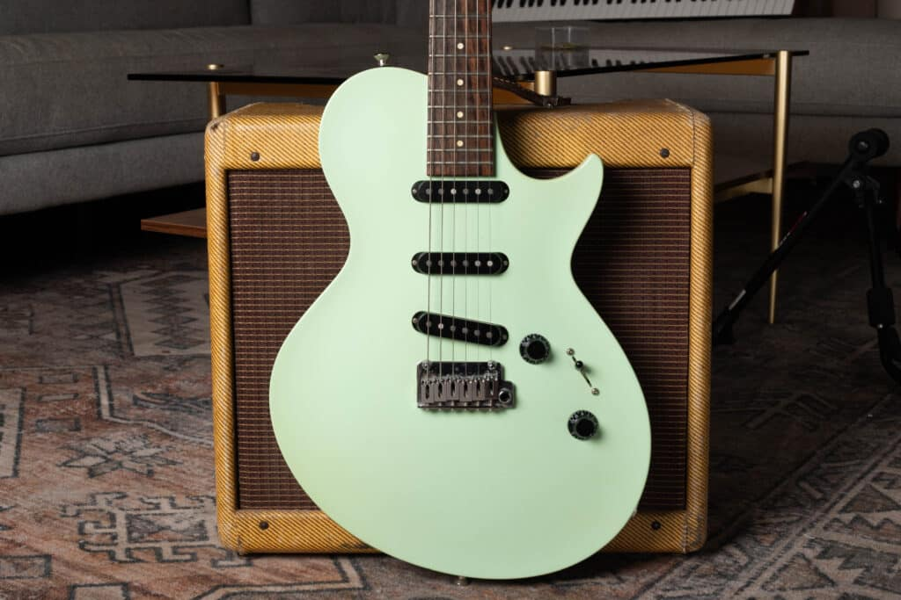
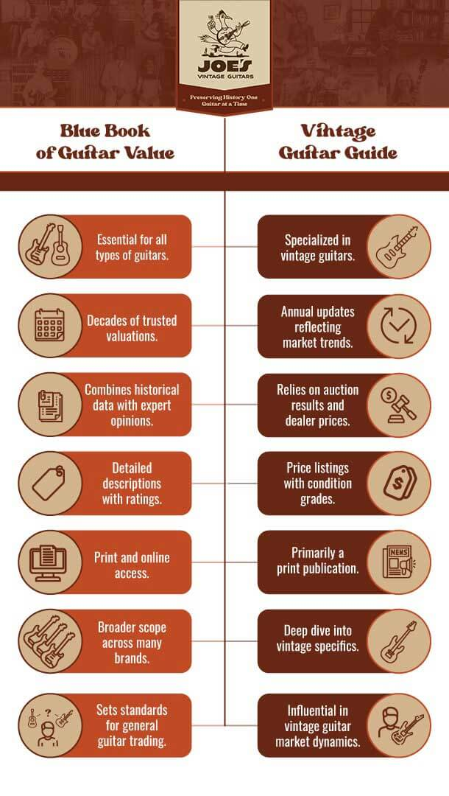
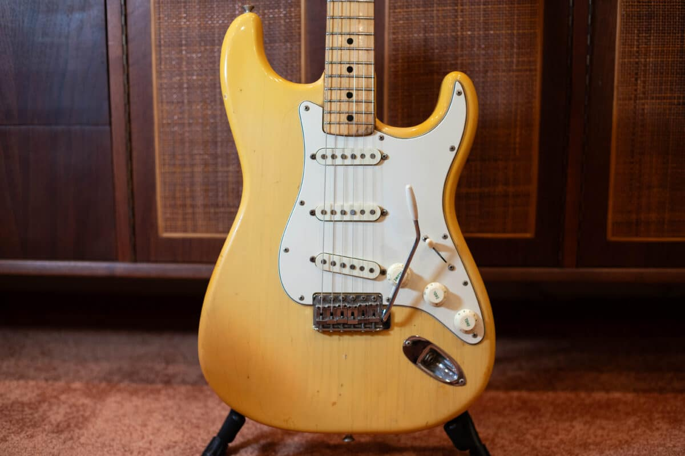

Table Of Contents

-   [How Accurate are the Blue Book of Guitar Values and Vintage Guitar Price Guide?](#how-accurate-are-the-blue-book-of-guitar-values-and-vintage-guitar-price-guide)
-   [The Official Vintage Guitar Price Guide](#the-official-vintage-guitar-price-guide)
-   [The Blue Book of Guitar Values, and Online Resource for Guitar Values](#the-blue-book-of-guitar-values-and-online-resource-for-guitar-values)
-   [What is the Best Way to Value Your Guitar?](#what-is-the-best-way-to-value-your-guitar)
-   [The Details Significantly Affect the Value of a Vintage Guitar](#the-details-significantly-affect-the-value-of-a-vintage-guitar)

The front of the body of a Collings 360st

<h2 id="how-accurate-are-the-blue-book-of-guitar-values-and-vintage-guitar-price-guide">How Accurate are the Blue Book of Guitar Values and Vintage Guitar Price Guide?</h2>

<h3 id="the-official-vintage-guitar-price-guide">The Official Vintage Guitar Price Guide</h3>

If you have been spending time determining the value of your guitar, chances are that you’ve run across the Vintage Guitar Price Guide at least in passing. The Vintage guitar price guide, which is published by Vintage Guitar Magazine and is updated yearly, has been around since 1989. This price guide takes into consideration purchase and sales information from many top guitar dealers around the country and has been a trusted source for guitar valuations for decades. Over my years of guitar buying and selling, I have found the Vintage Guitar Price Guide to be quite accurate overall especially when I am dealing with a guitar that is in excellent condition. In fact, even with all of the knowledge and resources I have gained over years of guitar buying and selling, I still buy a vintage guitar price guide every year! Click the link to buy the Price Guide! [**Vintage Guitar Price Guide**](https://store.vintageguitar.com/price-guide.html).  
  

<h3 id="the-blue-book-of-guitar-values-and-online-resource-for-guitar-values">The Blue Book of Guitar Values, and Online Resource for Guitar Values</h3>

The Blue Book of Guitar Values is a website that offers a paid monthly service for access to a database of guitar values. In order to determine if the service is useful, I signed up for the paid version and used it for a while. I was actually surprised to find that is was quite useful and accurate, although it does undervalue some higher end rare vintage guitars. The website is easy to navigate and it does has A TON of guitar models available for valuation. So far I haven’t found a single model, even obscure ones that did not show up when searched on the site. Overall, this was a useful resource that I would recommend if you don’t want to use the Vintage Guitar Price Guide. Overall though, I do feel that the Vintage Guitar Price Guide is overall more accurate. Click the link if you are interested in the **[Blue Book of Guitar Values!](https://bluebookofguitarvalues.com/ "Blue book of guitar values")**

<h3 id="what-is-the-best-way-to-value-your-guitar">What is the Best Way to Value Your Guitar?</h3>

<h4 id="the-details-significantly-affect-the-value-of-a-vintage-guitar">The Details Significantly Affect the Value of a Vintage Guitar</h4>

While anybody can look up a guitar in a book or search for it online, if you are not an experienced guitar buyer or collector, you are very likely to miss important information or make a mistake when identifying your guitar. Like the great guys at [**Emerald City Guitars**](https://emeraldcityguitars.com/ " Emerald City Guitars") always say, with vintage, the details really do matter! Color, originality and provenance are just three of the many many factors that can significantly influence the price of your instrument. At Joe’s Vintage Guitars, we provide customers with [**free, detailed appraisals**](/free-appraisal/ "Vintage Guitar Appraisal Expert") based upon our professional assessment of your guitar and the sum of every important detail that could affect its’ value. If you find yourself wondering about the value of your guitar, please don’t hesitate to contact us for your free appraisal!
