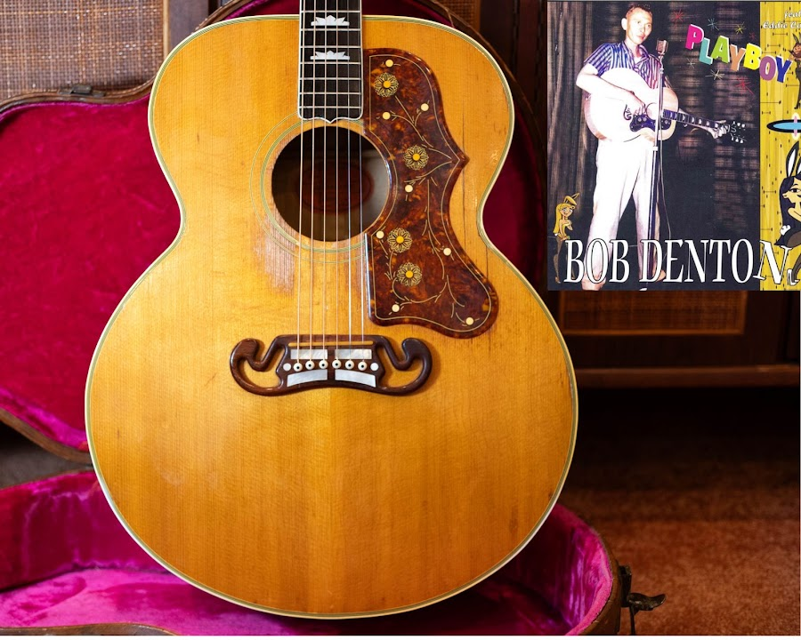
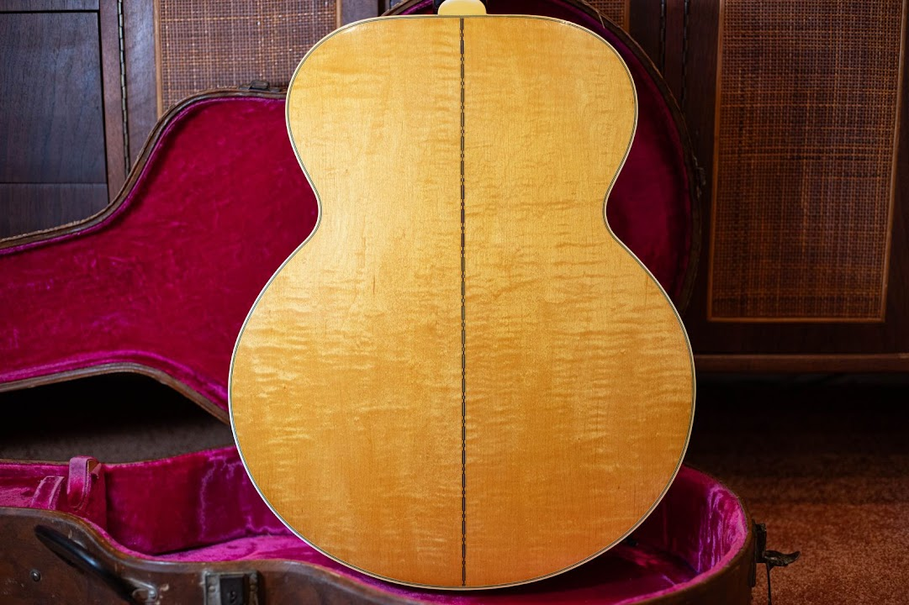
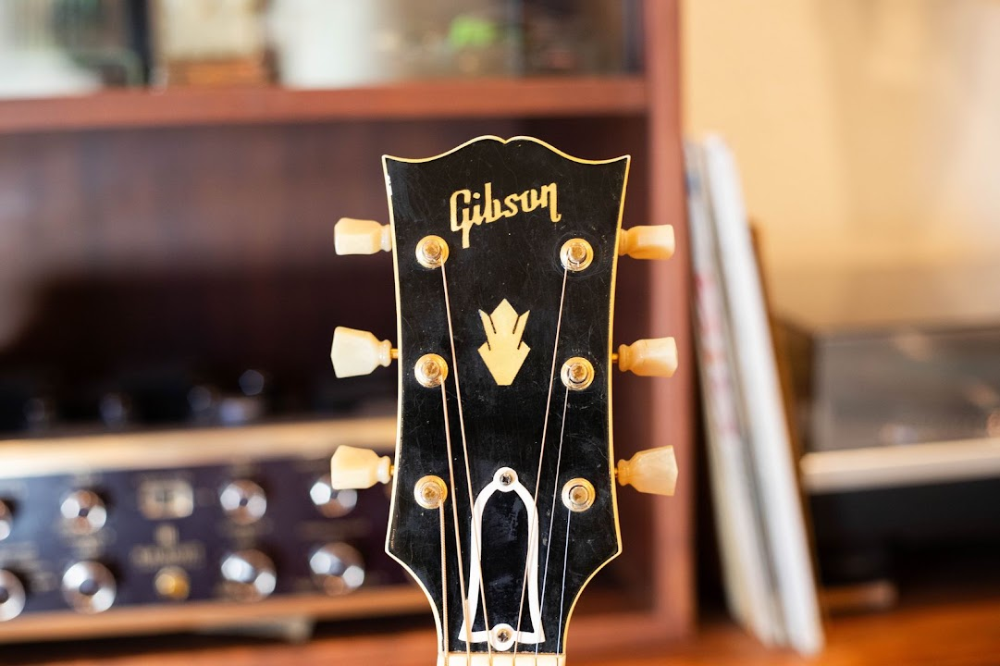
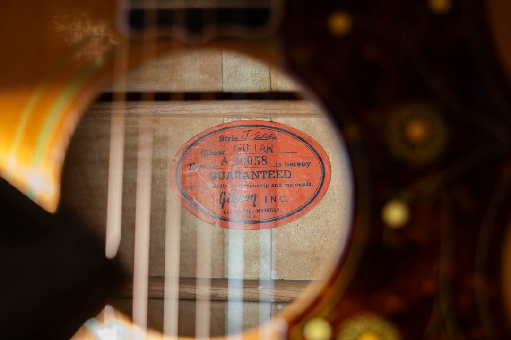
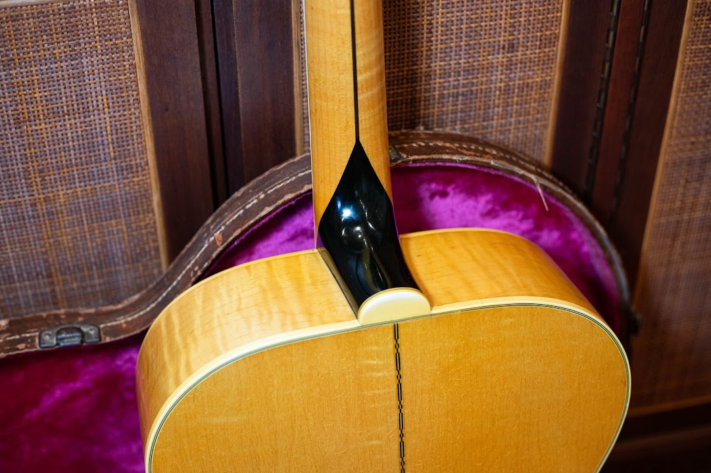
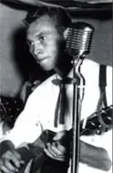
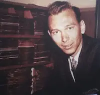
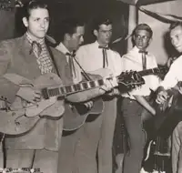
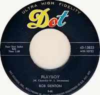
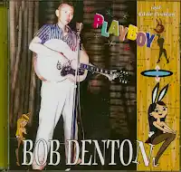

This 1957 Gibson J-200 came to me with a name attached to it: Bob Denton.

Denton sang and played guitar in the country and rockabilly scene around Phoenix and Southern California. He was also one of Eddie Cochran's early friends. The important part of their story is not a vague “associated with” claim. Denton helped Eddie get started, and Eddie later played guitar on Denton's records.

> The guitar dates to the same year Denton and Cochran recorded together for Dot.

I have not seen a dated stage photo or session sheet that puts this exact J-200 on a named recording. I am not going to turn the family or ownership history into more than the evidence can carry. The guitar is attributed to Denton. The recording connection between Denton and Cochran is documented.

If you are working on a Gibson from this period, my [guide to dating Gibson guitars by serial number and Factory Order Number](/how-to-read-gibson-serial-numbers/) explains where to look and why the number is only the starting point.

<figure>

<figcaption>The natural-finish 1957 J-200, shown with Bob Denton artwork. The Denton ownership is attributed provenance.</figcaption>

</figure>

## A Closer Look at the 1957 J-200

The top has aged into a warm amber. The floral pickguard, graduated crown inlays, gold-colored tuners, moustache bridge, and wide super-jumbo body are all visible in the photographs. The maple back shows strong figure. There is finish checking and honest playwear across the guitar.

<figure>

<figcaption>The figured maple back, with wear and finish checking visible in the supplied photograph.</figcaption>

</figure>

<figure>

<figcaption>The bound headstock, pearl crown, and gold-colored tuners.</figcaption>

</figure>

<figure>

<figcaption>The orange Gibson label inside the body.</figcaption>

</figure>

<figure>

<figcaption>The rear of the neck joint and heel, photographed in the pink-lined case.</figcaption>

</figure>

Those are observations from photographs. They are not a hands-on originality report. I would want the guitar on the bench before making claims about finish, repairs, replaced parts, or structural condition. That is why I use a [complete vintage-guitar inspection beyond the serial number](/post/what-a-serial-number-cant-tell-you/) before making an originality call.

## Bob Denton Helped Eddie Cochran Get Started

Denton was leading the Shamrock Valley Boys when a teenage Eddie Cochran approached the band and asked to play. Denton introduced him to Hank Cochran, a country singer and songwriter. Eddie and Hank were not related, but the shared last name gave them an act: the Cochran Brothers.

Denton and Eddie became close friends. They also shared manager Jerry Capehart. When Denton landed a deal with Dot Records in 1957, Eddie played guitar on the first session at Gold Star Studios. “On My Mind Again” and “Always Late” came out together as Dot 15573.

Eddie helped again on “Love Me, So I'll Know” and “I'm Sending You This Record.” Denton and Cochran later sang together on “Thinkin' About You,” and an informal “Sick & Tired” catches the two of them sounding like what they were: friends making a record.

<figure>

<figcaption>Bob Denton singing and playing guitar at a microphone.</figcaption>

</figure>

<figure>

<figcaption>A young Bob Denton.</figcaption>

</figure>

<figure>

<figcaption>Bob Denton, far right, playing alongside Eddie Cochran, far left.</figcaption>

</figure>

## Bob Denton on Record

<figure>

<figcaption>Bob Denton's “Playboy” on Dot, 45-15833.</figcaption>

</figure>

<figure>

<figcaption>“Playboy” collection artwork featuring Bob Denton with an acoustic guitar.</figcaption>

</figure>

You can hear the records through these YouTube searches:

- [Bob Denton — “On My Mind Again”](https://www.youtube.com/results?search_query=Bob+Denton+On+My+Mind+Again+1957)
- [Bob Denton — “Always Late”](https://www.youtube.com/results?search_query=Bob+Denton+Always+Late+1957)
- [Bob Denton — “Love Me, So I'll Know”](https://www.youtube.com/results?search_query=Bob+Denton+Love+Me+So+I%27ll+Know)
- [Bob Denton — “I'm Sending You This Record”](https://www.youtube.com/results?search_query=Bob+Denton+I%27m+Sending+You+This+Record)
- [Bob Denton and Eddie Cochran — “Thinkin' About You”](https://www.youtube.com/results?search_query=Bob+Denton+Eddie+Cochran+Thinkin%27+About+You)
- [Bob Denton and Eddie Cochran — “Sick & Tired”](https://www.youtube.com/results?search_query=Bob+Denton+Eddie+Cochran+Sick+and+Tired)

## A Flagship Gibson With a Life Behind It

The part I can say with confidence is that the story fits the year. This J-200 was built in 1957, during [Gibson's highly collectible postwar period](/post/how-the-year-of-manufacture-of-your-vintage-gibson-guitar-affects-its-price/). That is the same year Eddie Cochran played on Denton's first Dot session.

The guitar does not need a made-up studio story. Bob Denton's real place in Eddie's early career is interesting enough.

If you have a vintage Gibson with a history of its own, send clear photographs through my [free vintage-guitar appraisal](/free-appraisal/). I would be glad to take a look and tell you what I see.
