<nav class="esh-nav-sidebar" id="eshNavSidebar" aria-label="Article section navigation">
  
<strong>Sheraton Guide</strong>

  <a href="#" onclick="window.scrollTo({top:0,behavior:'smooth'});return false;" class="esh-nav-link top">&uarr; Top of Page</a>
  
The Guitar

  <a href="#esh-what" class="esh-nav-link">The Short Version</a>
  <a href="#esh-history" class="esh-nav-link">Epiphone and Gibson</a>
  <a href="#esh-family" class="esh-nav-link">Where It Fits</a>
  <a href="#esh-built" class="esh-nav-link">How It Was Built</a>
  <a href="#esh-timeline" class="esh-nav-link">Year by Year</a>
  <a href="#esh-players" class="esh-nav-link">Who Played One</a>
  
Dating &amp; Authentication

  <a href="#esh-dating" class="esh-nav-link">Dating Your Sheraton</a>
  <a href="#esh-authenticate" class="esh-nav-link">Authentication</a>
  <a href="#esh-mods" class="esh-nav-link">Mods and Fakes</a>
  <a href="#esh-condition" class="esh-nav-link">Condition Issues</a>
  <a href="#esh-checklist" class="esh-nav-link">The Checklist</a>
  
Value

  <a href="#esh-reissue" class="esh-nav-link">Vintage or Reissue</a>
  <a href="#esh-value" class="esh-nav-link">What It Is Worth</a>
  <a href="#esh-selling" class="esh-nav-link">Thinking of Selling</a>
  <a href="#esh-faq" class="esh-nav-link">FAQ</a>
</nav>

<button class="esh-nav-btn" id="eshNavBtn" onclick="toggleEshNav()" aria-expanded="false" aria-controls="eshNavPanel" type="button">
  &#9776; Jump To Section
</button>

  
<strong>Sheraton Guide</strong>

  <a href="#" onclick="window.scrollTo({top:0,behavior:'smooth'});closeEshNav();return false;" class="esh-nav-link top">&uarr; Top of Page</a>
  
The Guitar

  <a href="#esh-what" onclick="closeEshNav()" class="esh-nav-link">The Short Version</a>
  <a href="#esh-history" onclick="closeEshNav()" class="esh-nav-link">Epiphone and Gibson</a>
  <a href="#esh-family" onclick="closeEshNav()" class="esh-nav-link">Where It Fits</a>
  <a href="#esh-built" onclick="closeEshNav()" class="esh-nav-link">How It Was Built</a>
  <a href="#esh-timeline" onclick="closeEshNav()" class="esh-nav-link">Year by Year</a>
  <a href="#esh-players" onclick="closeEshNav()" class="esh-nav-link">Who Played One</a>
  
Dating &amp; Authentication

  <a href="#esh-dating" onclick="closeEshNav()" class="esh-nav-link">Dating Your Sheraton</a>
  <a href="#esh-authenticate" onclick="closeEshNav()" class="esh-nav-link">Authentication</a>
  <a href="#esh-mods" onclick="closeEshNav()" class="esh-nav-link">Mods and Fakes</a>
  <a href="#esh-condition" onclick="closeEshNav()" class="esh-nav-link">Condition Issues</a>
  <a href="#esh-checklist" onclick="closeEshNav()" class="esh-nav-link">The Checklist</a>
  
Value

  <a href="#esh-reissue" onclick="closeEshNav()" class="esh-nav-link">Vintage or Reissue</a>
  <a href="#esh-value" onclick="closeEshNav()" class="esh-nav-link">What It Is Worth</a>
  <a href="#esh-selling" onclick="closeEshNav()" class="esh-nav-link">Thinking of Selling</a>
  <a href="#esh-faq" onclick="closeEshNav()" class="esh-nav-link">FAQ</a>

<h2 id="esh-what">The Short Version</h2>

The Epiphone Sheraton is one of the best-kept secrets in vintage guitars. It is a thinline, semi-hollow, double-cutaway electric that Gibson built in Kalamazoo, Michigan, in the same factory and on the same benches as the Gibson ES-335, starting in 1958. It is the fancier of the two. Where the 335 is plain and businesslike, the Sheraton is loaded with pearl and abalone: a flowering vine inlaid up the headstock, big block markers down the neck, and multi-ply binding on almost every edge. It looks like a jazz box that dressed up for a night out, and it plays like the Gibson cousin it is.

At Joe's Vintage Guitars we buy and sell vintage Epiphones from the Kalamazoo years, and we are always glad to see a clean Sheraton. If you have one you are thinking about selling, we give straight [nationwide appraisals](/free-appraisal/) and pay top dollar for original guitars. This guide is the same walk-through we do on the bench: where the Sheraton came from, how it changed from year to year, how we tell an original from a modified one, how to read the serial number, and what a real Sheraton is worth today. Every photo below is a 1961 Sheraton that came through our shop.

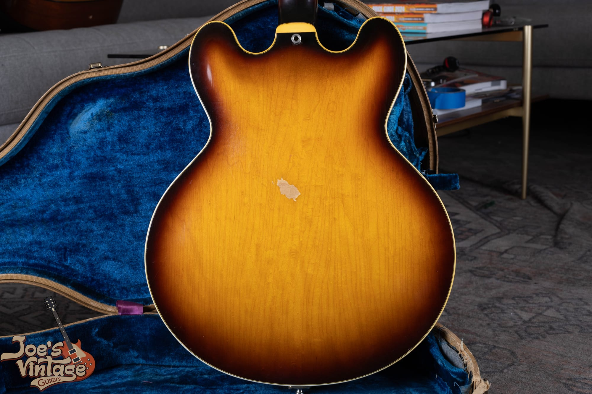

Our 1961 Sheraton in tobacco sunburst. Mini-humbuckers, a Bigsby vibrato over a tune-o-matic bridge, and that unmistakable flowering-vine headstock. This is the guitar that teaches you the whole story, so we will keep coming back to it.

<h2 id="esh-history">Epiphone and Gibson: How a Rival Became a Cousin</h2>

To understand the Sheraton you have to understand that Epiphone was not always Gibson's little brother. It started as the House of Stathopoulo, a family instrument business brought to New York by Anastasios Stathopoulo, and it took the name Epiphone in the late 1920s under his son Epaminondas, who everyone called Epi. Through the 1930s and into the 1940s Epiphone was Gibson's fiercest rival in the archtop world. The two companies fought a public battle over who made the biggest, loudest, most beautiful jazz guitar, and Epiphone's Emperor and Deluxe went toe to toe with Gibson's Super 400 and L-5. This was a real fight between equals.

Epi Stathopoulo died in 1943, and without him the company slowly came apart through the 1940s and early 1950s, hurt by labor troubles and a move away from New York. By 1957 Epiphone was for sale, and Gibson's parent company, Chicago Musical Instruments, bought it for a reported twenty thousand dollars. The story that gets told is that Gibson mostly wanted Epiphone's upright bass business and got the whole guitar company along with it. Whatever the motive, the purchase was not about building a budget brand. It let Gibson sell professional-grade instruments through music stores that did not hold a Gibson franchise, which meant a dealer across the street from a Gibson shop could still stock a serious American electric.

Gibson relaunched Epiphone in 1958 as a full line built in Kalamazoo, and the Sheraton was the star of the new thinline electrics, though the first examples did not actually ship until 1959. That is the twist worth remembering: the guitar that looks like a plush jazz instrument was actually born the same year, in the same building, as the ES-335, and it carries a lot of the same DNA. For a look at Epiphone's original solidbody from these same years, our [vintage Epiphone Crestwood guide](/post/vintage-epiphone-crestwood-value-history-guide/) covers the other side of the Kalamazoo Epiphone story.

<h2 id="esh-family">Where the Sheraton Fits in the Line</h2>

Gibson's Epiphone thinlines all share a body and separate out by appointments and pickups, and people mix them up constantly. Knowing the family keeps you from overpaying for the wrong model or selling a Sheraton as if it were a plainer guitar.

- **Sheraton.** The top of the thinline line. Semi-hollow with a center block, the ornate flowering-vine headstock, block-and-triangle pearl inlays, multi-ply binding, and gold hardware on many examples. This is the Epiphone counterpart to a dressed-up ES-335 or ES-355.
- **Riviera.** The Sheraton's plainer sibling, introduced a few years later. Same semi-hollow body and mini-humbuckers, but simpler markers and a simpler headstock. Think of it as the Epiphone answer to a standard ES-335.
- **Casino.** Fully hollow, no center block, with P-90 single coils. This is the Epiphone version of the ES-330, and it is the one the Beatles made famous. It is a different animal from the Sheraton, even though the outline is close.
- **Century, Zephyr, and the archtops.** The rest of the Kalamazoo Epiphone catalog, from student electrics to full jazz boxes.

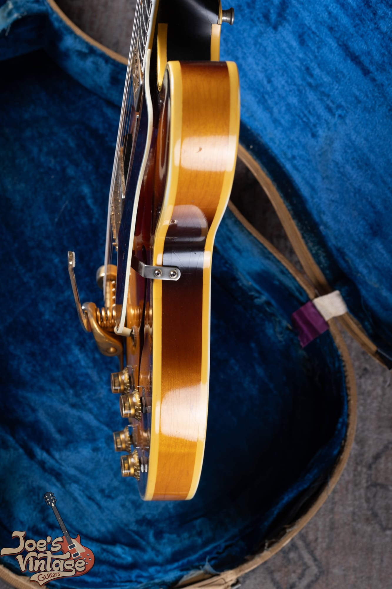

The Sheraton from the side, resting in its case. You can see the shallow thinline body, the bound f-hole, the tune-o-matic bridge, and the Bigsby. It is a semi-hollow, so there is a solid maple block running down the center under the top, which is what gives these guitars their sustain and their resistance to feedback compared to a fully hollow Casino.

<h2 id="esh-built">How It Was Built</h2>

The Sheraton body is laminated maple, not solid carved wood. That is not a shortcut, it is the design. A laminated top on a semi-hollow electric is more stable, feeds back less, and gives the guitar the tight, focused voice that made the whole thinline format a success. Inside the body runs a solid maple center block, the same idea Gibson used on the 335, so the strings drive a solid piece of wood while the wings stay hollow and resonant. The body is thin, a little under two inches deep, which is why these guitars sit so comfortably against you. The earliest Kalamazoo Sheratons even used Epiphone's own multi-piece neck, a holdover from the New York factory, before Gibson settled into its standard mahogany neck early in the 1960s.

Everything above the wood is where the Sheraton earns its name. The headstock wears a flowering-vine inlay in pearl and abalone, one of the prettiest headstock treatments Gibson's Kalamazoo shop ever produced, with the Epiphone name in pearl script above it. The bound rosewood fingerboard carries large block markers, and the body, neck, headstock, and f-holes all get multiple plies of binding. None of this is on an ES-335. This is the ornamentation that separated the Epiphone from its plainer Gibson twin, and it is the first thing that tells you that you are looking at a Sheraton and not a Riviera.

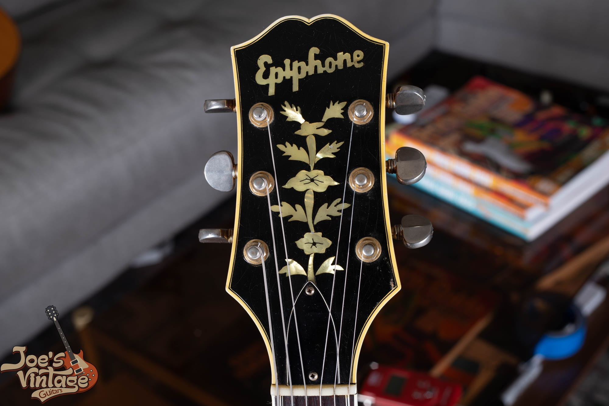

The flowering-vine headstock inlay, sometimes called the tree of life, with the pearl Epiphone script above it. This inlay is the signature of the Sheraton, and it is one of the fastest ways to separate a Sheraton from the plainer Riviera, which does not have it. Multi-ply binding wraps the edge of the headstock, and a center stripe runs down the back.

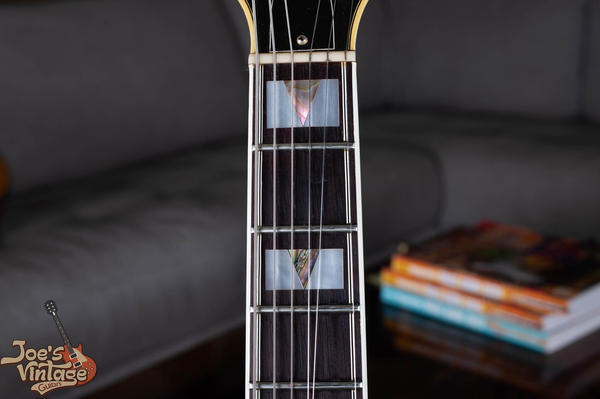

The block-and-triangle pearl inlays on the bound rosewood board. These big markers are correct for the Sheraton and are another quick model check. On the plainer thinlines you see smaller dot or parallelogram inlays, so the size and shape of the markers help you place the guitar in the line at a glance.

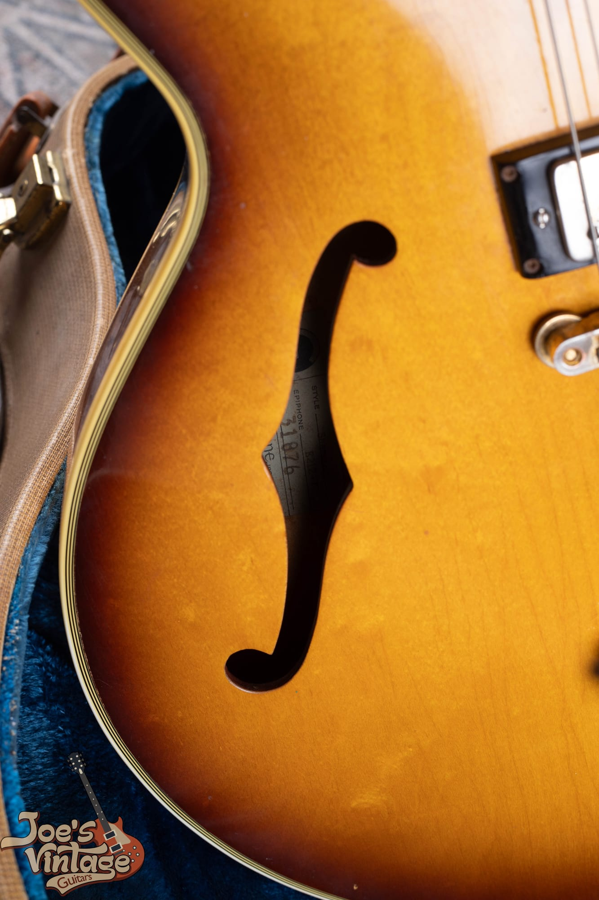

A bound f-hole and the shallow body. Notice how many plies of binding wrap the top edge. That binding is celluloid, and on any guitar of this age it is worth checking closely, because celluloid can shrink and crack over decades. On this example it is intact and clean.

<h2 id="esh-timeline">Year by Year</h2>

The Sheraton changed in small, datable steps through the Kalamazoo years, and knowing those steps is how you place a guitar in its era and catch one that has been assembled from the wrong parts.

<h3>1958 to 1960: The New York Pickup Years</h3>

The earliest Sheratons carried Epiphone's own New York pickups, single-coil units left over from the New York factory that Gibson kept using on the first Kalamazoo Epiphones. They have a bright, slightly gritty voice that is different from anything in the Gibson line. These first Sheratons are the ones collectors chase hardest, both because they are the earliest and because the New York pickup gives them a sound of their own. The Frequensator tailpiece, an Epiphone signature with a long trapeze on one side and a short one on the other, was the standard tailpiece.

<h3>1961 to 1962: The Mini-Humbucker Arrives</h3>

Around 1961 the Sheraton switched from the New York pickup to the Gibson mini-humbucker, the small, focused humbucking pickup that would define the Epiphone sound for the rest of the decade. The mini reads as a metal-covered pickup with a single row of six pole screws sitting in a black ring, and it is narrower than a full-size Gibson humbucker. That changeover happened right around 1961, which puts a guitar from that year on the seam between the two eras. Our Sheraton is a 1961 with mini-humbuckers, which is exactly what you would expect from the year the pickup arrived.

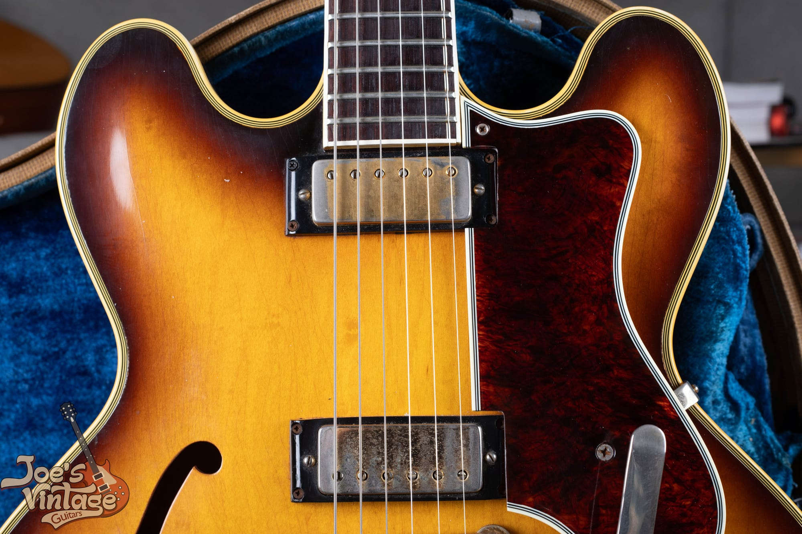

The two mini-humbuckers on our 1961. One row of six pole screws, a metal cover, and a black mounting ring, all narrower than a full humbucker. This is the pickup that took over from the New York single coil right around this year, and its bright, tight, cutting tone is a big part of why players who know these guitars seek them out.

<h3>1962 Onward: Refinements Through the Decade</h3>

Through the 1960s the Sheraton kept its shape and its fancy dress while small details moved: tuner styles, hardware finish, knob styles, and wiring all shifted in the small ways Gibson changed everything in this era. The guitar stayed in the Kalamazoo catalog until the end of the decade. In 1970 Gibson moved Epiphone production to Japan, and the American-made Sheraton came to a close. We will come back to what happened after that in the reissue section, because it matters enormously to value.

<h2 id="esh-players">Who Played One</h2>

The Sheraton's most famous champion is the bluesman John Lee Hooker, who played one for decades and became so associated with the model that Epiphone built a John Lee Hooker signature Sheraton in his honor. His endorsement did more than anything to keep the Sheraton name alive through the lean years. A generation later Noel Gallagher of Oasis reintroduced the model to a rock audience with his Union Jack-painted Sheraton, one of the defining images of the Britpop years. Jazz players took to it too, and the short version is that the Sheraton has always been a working musician's guitar with a dressy face. That combination is a lot of its charm.

<h2 id="esh-dating">Dating Your Sheraton</h2>

Kalamazoo Epiphones were dated much the same way as Kalamazoo Gibsons, which is both a help and a headache. Where you find the number depends on the year. The earliest thinlines, from 1958 through 1960, carry an A-prefix number on a paper label inside the body, and from about 1961 the serial moved to an ink stamp on the back of the headstock, which is where you find it on our guitar. Many examples also carry a factory order number stamped where you can read it through an f-hole, and those batch codes used a letter for the year. One tell worth knowing, because it separates a real Kalamazoo guitar from a later import in a second, is that a genuine vintage Sheraton has no "Made in USA" stamped under the serial. That stamp is a later feature.

The trouble is that Gibson's serial systems of the late 1950s and 1960s reused numbers and overlapped years, so the serial alone is never the final word. You match the number to a known range and then confirm it with the features. Because the systems are shared, our [Gibson serial number guide](/how-to-read-gibson-serial-numbers/) applies directly to a Kalamazoo Epiphone.

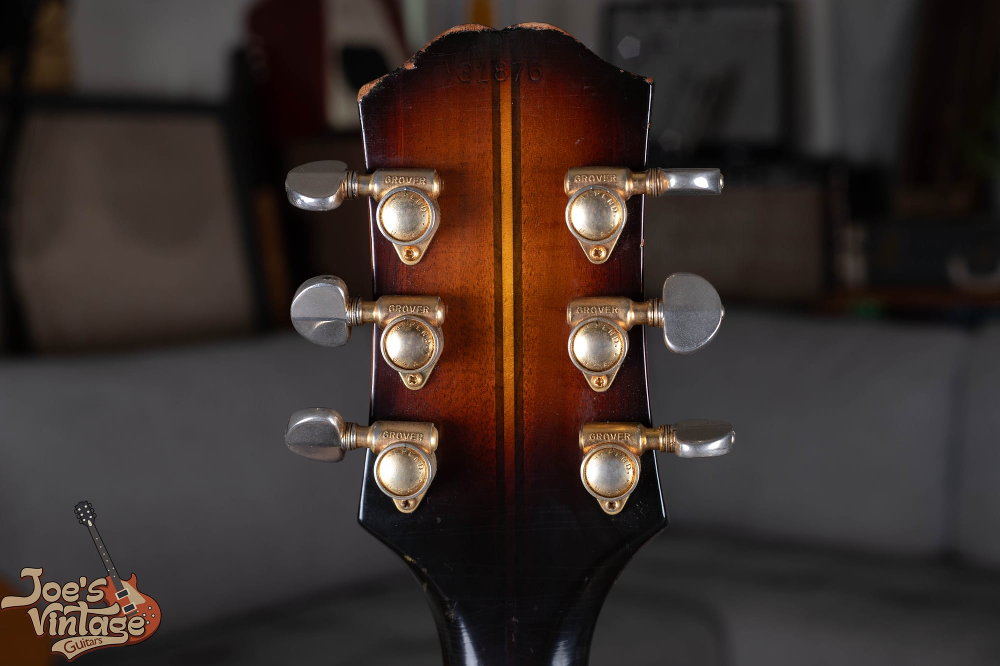

The back of the headstock on our 1961, with the ink-stamped serial number up top and a set of Grover tuners with metal buttons. The features are what confirm the year: the mini-humbuckers, the tuner style, the hardware, and the tailpiece all have to agree with the number. When the serial says one year and the parts say another, the parts usually win, because a number can be faked or transplanted and a whole guitar cannot.

The single most useful feature check for a Sheraton is the pickup. New York single coils point to roughly 1958 through 1960. Mini-humbuckers point to 1961 and later. After that you read the tuners, the hardware finish, the knobs, and the wiring the same way you would date any Kalamazoo guitar of the period.

<h2 id="esh-authenticate">Reading a Sheraton Like a Dealer</h2>

Authentication is not one test. It is the question of whether every part of the guitar tells the same story. A Sheraton has a serial, a set of pickups, a bridge, a tailpiece, a set of tuners, inlays, and a wiring harness, and each of those has a date range. When they all point to the same window, the guitar is honest. When one points somewhere else, you have found either a repair or a story that does not add up.

Start with the pickups, because they are the biggest single value driver on a Sheraton and the most common thing to be swapped. Confirm that a guitar sold as an early New York pickup Sheraton actually wears New York pickups and has not had mini-humbuckers or modern humbuckers dropped in, and that the routes under the pickups match what should be there. Then read the solder: original factory joints are even and consistent, while fresh, blobby, or re-melted joints tell you someone has been inside.

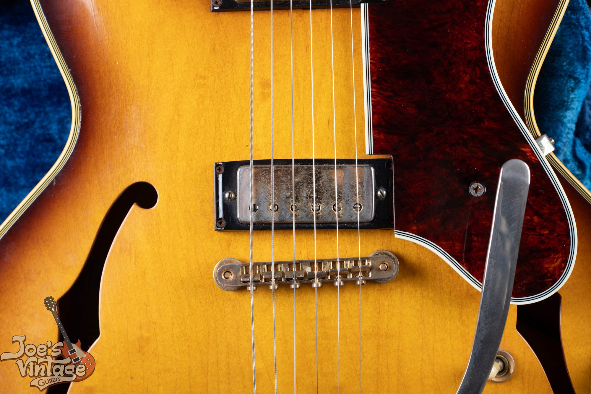

The bridge mini-humbucker and the tune-o-matic bridge on our 1961. A period tune-o-matic with the right saddles is correct here. Reading the bridge, the pickups, and the tailpiece together, and checking that each one is right for the year, is most of the work of authenticating one of these guitars.

Then look at the tailpiece, which is where our guitar has a story to tell. The standard Sheraton tailpiece was the Frequensator, the split trapeze that is one of Epiphone's signatures. Our 1961 instead wears a Bigsby vibrato, and that is worth understanding clearly, because it is exactly the kind of detail that separates buyers who know these guitars from buyers who do not.

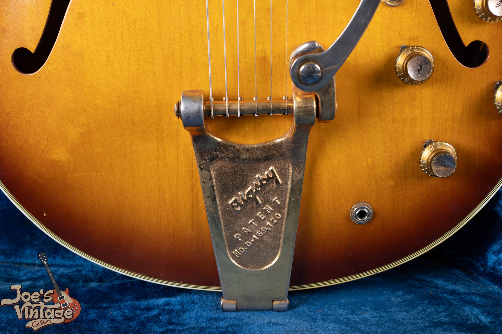

The Bigsby on our Sheraton, with the maker's engraving right on the plate. A Bigsby is a real vintage vibrato and a musical upgrade, but on a Sheraton it is not the tailpiece that left the factory, so a careful buyer checks whether it replaced an original Frequensator and whether the swap left any extra holes. That is not a knock on the guitar, it is simply part of reading it honestly.

<h2 id="esh-mods">Modifications and Fakes That Change the Value</h2>

Most of the value questions on a vintage Sheraton come down to a short list of common changes. None of these makes a guitar worthless, but every one of them changes the number, and a guitar sold as all original when it is not is the expensive mistake to avoid.

- **Changed pickups.** Swapping the New York single coils or the mini-humbuckers for something else is the classic Sheraton modification. It changes the sound and the originality both, and dropping in a full-size humbucker usually means the top has been routed, which is not reversible. Confirm the pickups are correct for the year and unmolested.
- **Converted tailpiece.** A Bigsby or a stop tailpiece in place of the original Frequensator is common. The factory vibrato option in these years was Epiphone's own Tremotone, so a Bigsby is usually an aftermarket addition rather than a factory choice. Look for filled or extra holes, and price the guitar as a converted example, not as a factory-original one.
- **Refinish.** A resprayed top or a refinished sunburst is one of the biggest single hits to value. Look for overspray in the f-holes and under the pickguard, color on the binding, a logo that looks soft or drowned, and the absence of the fine finish checking a sixty-year-old nitro finish should show.
- **Replaced tuners.** Original tuners with no extra screw holes matter. Added holes from a tuner swap are a permanent mark.
- **Reissue sold as vintage.** A Japanese or Korean Sheraton II described as a vintage Kalamazoo guitar is the modification that costs a buyer the most, because the price gap is enormous. The tells are in the reissue section below.

<h2 id="esh-condition">Condition Issues to Check</h2>

The Kalamazoo guitars of this era share a few weak points, and a Sheraton is no exception. The one to know first is the headstock. Gibson and Epiphone used an angled headstock and a mahogany neck, and that combination breaks if the guitar takes a fall, especially a tip-over in its case. A repaired headstock break is not the end of the world, and a clean old repair can be perfectly stable, but it is a real value factor and it must be disclosed, so check the back of the headstock and the area behind the nut carefully under good light.

The celluloid binding is the next thing. Light shrinkage and checking are normal on a sixty-year-old guitar and are not a crisis. Active, spreading binding shrinkage that pulls away from the wood is a real hit, because the cure is skilled, expensive work. Beyond that we check the neck angle, since a floating bridge that has been jacked up high can hide a neck that needs resetting, and we look for finish checking, buckle wear on the back, and any separation along the bound edges. Honest playwear does not scare us. Refinishes, headstock breaks, changed pickups, and heavy binding trouble are what move the price.

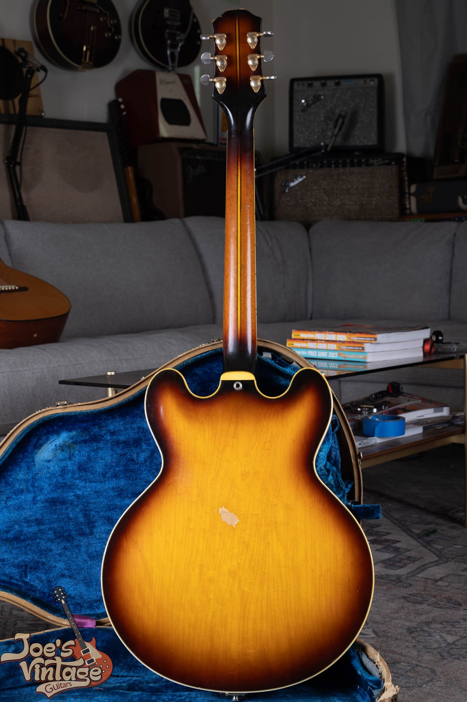

The back of our 1961. Laminated maple, a set neck, and honest finish with the kind of light wear a well-cared-for sixty-year-old guitar earns. A clean, original back like this, with no sign of a headstock repair or a neck reset, is exactly what we want to see.

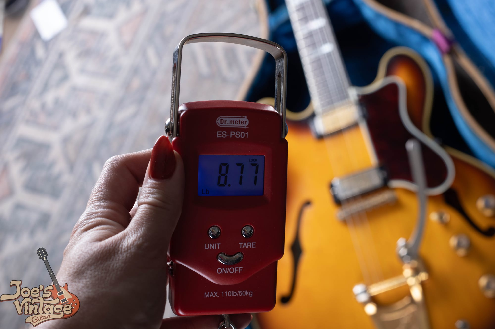

We weigh every guitar, and this Sheraton came in at 8.77 pounds. That is normal for a semi-hollow of this size, and it is a useful data point, because a wildly heavy or light reading can be a clue that something inside the guitar has been changed.

<h2 id="esh-checklist">The Sheraton Authentication Checklist</h2>

Here is the short version you can run through with a flashlight and a screwdriver:

1. **Model.** The flowering-vine headstock inlay and the big block-and-triangle markers say Sheraton, not the plainer Riviera. Confirm you have the model the seller claims.
2. **Serial number.** Find the ink stamp on the back of the headstock, and the factory order number inside if present. Does the number fit the claimed year, keeping in mind the era's number reuse?
3. **Pickups.** New York single coils point to 1958 through 1960. Mini-humbuckers point to 1961 and later. Are they correct for the year, and are the routes and mounting holes unmolested?
4. **Tailpiece.** A Frequensator is the original tailpiece. A Bigsby or stop tailpiece means you check for filled or extra holes and price it as a conversion.
5. **Bridge.** A period tune-o-matic with the right saddles for the year.
6. **Tuners.** Correct for the period, with no extra screw holes from a swap.
7. **Finish.** Check the f-holes and under the pickguard for overspray, and look for age-appropriate checking.
8. **Structure.** Headstock back and neck for any break or repair, binding condition, and neck angle.
9. **Solder and wiring.** Original, undisturbed joints, or evidence someone has been inside.
10. **The coherence test.** Every point should tell the same story. One outlier is a question. Several outliers is a modified or assembled guitar.

If you get partway down this list and something stops adding up, that is the moment to get a second opinion before money changes hands.

<h2 id="esh-reissue">Vintage or Reissue: Telling Them Apart</h2>

This is the most important section for anyone trying to figure out what they have, because the word Sheraton covers guitars that are worth wildly different amounts. After the American line ended in 1970, Epiphone production moved to Japan for the 1970s and early 1980s, and then in the mid-1980s the model came back as the Korean-made Sheraton II, which has been in the catalog in one form or another ever since. There is also a high-end Elitist Sheraton built in Japan, a John Lee Hooker signature, and the current import Sheraton. All of them are good guitars. None of them is a Kalamazoo vintage instrument, and the price gap runs into many thousands of dollars.

The tells are quick once you know them:

- **Country-of-origin and serial format.** A Kalamazoo Sheraton has an ink-stamped Gibson-style serial. A reissue has a modern serial, often with a letter prefix and a factory code, and a Made in Japan, Made in Korea, or Made in China stamp.
- **The Sheraton II tailpiece.** Most Sheraton II guitars left the factory with a stop tailpiece or a tune-o-matic and stopbar, not the Frequensator, and the II designation itself is a modern-era marker.
- **Hardware and pots.** Modern pots with recent date codes, modern tuners, and modern pickup construction all give a reissue away when you look inside.
- **Overall feel.** The vintage guitar has nitrocellulose finish checking, aged pearl, and the wear patterns of a real sixty-year-old instrument, none of which a newer guitar can fake convincingly.

Do not let anyone tell you a four-hundred-dollar Korean Sheraton II is a vintage guitar, and do not undersell a real Kalamazoo Sheraton because it shares a name with the imports. If you are not sure which one you have, that is exactly what an appraisal is for.

<h2 id="esh-value">What a Vintage Epiphone Sheraton Is Worth</h2>

Vintage Sheraton values move with the year, the pickups, the finish, the condition, and above all the originality. The ranges below are for the Kalamazoo years and reflect current dealer asking prices and price-guide figures for honest guitars. They are a starting point for a conversation, not a substitute for looking at your actual guitar, because a single modification or a refinish can move the number by thousands.

| Segment | Player or modified | All-original, excellent |
| --- | --- | --- |
| 1958 to 1960, New York pickups | about $5,000 to $8,000 | about $10,000 to $16,000 |
| 1961 to 1965, mini-humbuckers | about $4,000 to $6,500 | about $8,000 to $12,000 |
| Late 1960s Kalamazoo | about $3,500 to $5,500 | about $6,000 to $9,000 |

A few things sit outside the table. A rare Natural, or blonde, finish carries a strong premium over sunburst, because far fewer were made. Gruhn's shipping data records only around 689 Sheratons leaving Kalamazoo across the entire 1959 to 1969 run, with sunburst outnumbering Natural by roughly four to one, so a clean early blonde can bring well beyond the sunburst figures above. All-original New York pickups, an original Frequensator, an original case, and any documented history all push a guitar toward the top of its range. A refinish, changed pickups, a converted tailpiece, a headstock repair, or a refret all pull it down.

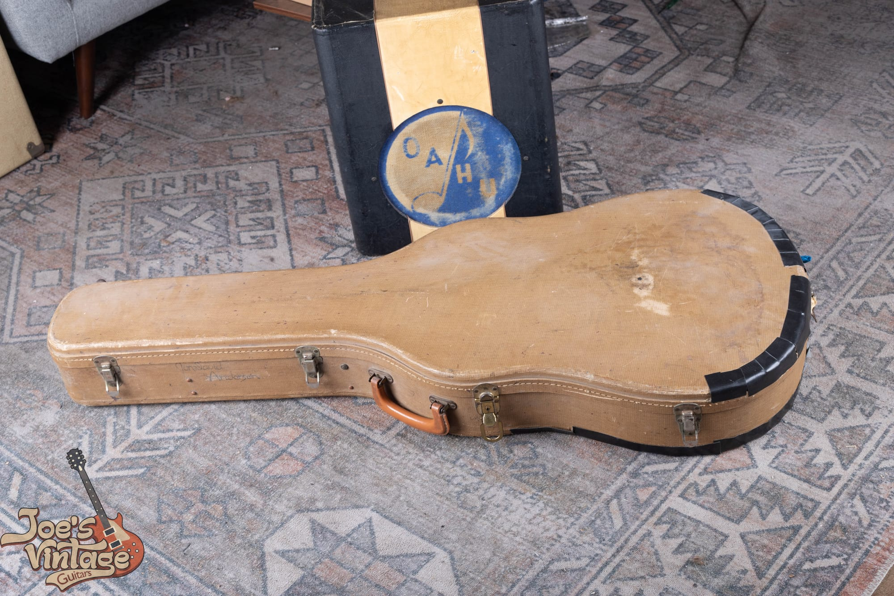

The original case matters more than people expect. A correct period case protects the guitar and is part of the package a collector wants, and a Sheraton that still has its case is worth more than the same guitar without one.

Here is the context that makes the Sheraton so interesting to value: it is the affordable way into a real Kalamazoo semi-hollow. A comparable 1958 to 1964 Gibson ES-335 sells for a good deal more than a Sheraton from the same bench, often two to three times as much, and an early dot-neck 335 more still. The Epiphone was built in the same factory, in the same years, in far smaller numbers and with more decoration, and it still sells for a fraction of the Gibson. If you love the format but not the Gibson price, this is the guitar. Our [1959 ES-335 authentication guide](/post/1959-gibson-es-335-authentication-guide/) and our [1962 ES-335 guide](/post/1962-gibson-es-335-guide/) show where the Gibson side of that comparison sits.

<h2 id="esh-selling">Thinking of Selling Your Sheraton</h2>

If you have a Sheraton and you are considering selling it, the most valuable thing you can do is resist the urge to improve it. Do not refinish it, do not swap the pickups for something that sounds better to modern ears, and do not convert the tailpiece. Every bit of honest wear and every original part is part of the value, and once an original finish or an original pickup is gone, it does not come back.

At Joe's Vintage Guitars we buy vintage Epiphone Sheratons, Rivieras, Casinos, and the rest of the Kalamazoo line, and we pay top dollar for clean, original examples. Send us photos through our [free appraisal](/free-appraisal/) page, including the front, the back, the headstock front and back, the serial number, and close-ups of the pickups, the tailpiece, and any wear, and we will tell you exactly what you have and what it is worth. You can also [contact us directly](/contact-me/) with questions. Whether you decide to sell to us or not, you deserve a straight answer from someone who handles these guitars, and that is what we give.

<h2 id="esh-faq">Frequently Asked Questions</h2>

**What is an Epiphone Sheraton?**

The Epiphone Sheraton is a thinline, semi-hollow, double-cutaway electric guitar that Gibson built in Kalamazoo, Michigan, starting in 1958, after Gibson's parent company bought Epiphone in 1957. It shares its body format with the Gibson ES-335 but wears far more decoration, including a flowering-vine headstock inlay, block pearl markers, and multi-ply binding. It is the top of Epiphone's thinline line.

**How can I tell what year my Epiphone Sheraton is?**

Start with the ink-stamped serial number on the back of the headstock and the factory order number inside the body, and match them to known Gibson-Epiphone ranges, then confirm with the features. The biggest tell is the pickup: New York single coils point to about 1958 to 1960, and mini-humbuckers point to 1961 and later. Because the era's serial numbers were reused, the features decide the year when the number is ambiguous.

**What is the difference between the New York pickups and the mini-humbuckers?**

New York pickups are Epiphone's own single-coil pickups, held over from the New York factory and used on the earliest Kalamazoo Sheratons, with a bright and slightly gritty voice. Mini-humbuckers are the smaller Gibson humbucking pickups that replaced them around 1961, with a tighter, more focused tone and no hum. Swapping one for the other changes both the sound and the originality, so the pickups are a key value and dating point.

**Is the Epiphone Sheraton the same as the Gibson ES-335?**

They are close cousins, not the same guitar. Both are thinline semi-hollows with a center block, built in the same Kalamazoo factory starting in 1958. The Sheraton is more ornate, with fancier inlays and binding, and it used Epiphone's New York pickups and then mini-humbuckers, while the 335 used full-size Gibson pickups. The Sheraton typically sells for a fraction of a comparable vintage 335.

**What is my vintage Epiphone Sheraton worth?**

A Kalamazoo Sheraton in honest, all-original condition generally falls somewhere between about $6,000 and $16,000 depending on the year, the pickups, and the finish, with the earliest New York pickup guitars and the rare Natural finish at the top and later mini-humbucker guitars lower. A modified or refinished example sells for less, often in the $4,000 to $6,500 range. Condition and originality matter more than anything else, so the only way to know is to have it appraised.

**Is a Bigsby on a Sheraton original?**

Usually not. The standard Sheraton tailpiece was the Frequensator, so a Bigsby or a stop tailpiece is generally a later change. That does not ruin a guitar, and a genuine vintage Bigsby is a musical upgrade, but it is a conversion, so a careful buyer checks for filled or extra holes and prices the guitar accordingly.

**Is a modern Epiphone Sheraton II worth as much as a vintage one?**

No. The Sheraton II and the current imports are good guitars, but they were built in Japan, Korea, or China from the 1980s on, and they are worth a small fraction of a vintage Kalamazoo Sheraton. You can spot a reissue by its modern serial format, its country-of-origin stamp, its non-Frequensator tailpiece, and its modern pots and pickups. Do not confuse a few-hundred-dollar import with a Kalamazoo original.

