<nav class="fcc-nav-sidebar" id="fccNavSidebar" aria-label="Article section navigation">
  
<strong>Custom Color Guide</strong>

  <a href="#" onclick="window.scrollTo({top:0,behavior:'smooth'});return false;" class="fcc-nav-link top">&uarr; Top of Page</a>
  
The Colors

  <a href="#fcc-why" class="fcc-nav-link">Why It Matters</a>
  <a href="#fcc-what" class="fcc-nav-link">What Counts</a>
  <a href="#fcc-history" class="fcc-nav-link">History</a>
  <a href="#fcc-chart" class="fcc-nav-link">Chart &amp; Swatches</a>
  
Factory Forensics

  <a href="#fcc-stack" class="fcc-nav-link">The Finish Stack</a>
  <a href="#fcc-undercoats" class="fcc-nav-link">Undercoats</a>
  <a href="#fcc-sunburst" class="fcc-nav-link">Over Sunburst</a>
  <a href="#fcc-nails" class="fcc-nav-link">Nails &amp; Paint Stick</a>
  <a href="#fcc-dowels" class="fcc-nav-link">Dowel Holes</a>
  <a href="#fcc-pocket" class="fcc-nav-link">Neck Pocket</a>
  <a href="#fcc-guard" class="fcc-nav-link">Under the Pickguard</a>
  <a href="#fcc-headstock" class="fcc-nav-link">Matching Headstocks</a>
  <a href="#fcc-plastics" class="fcc-nav-link">Pickguards &amp; Plastic</a>
  
Judgment Calls

  <a href="#fcc-aging" class="fcc-nav-link">How Colors Age</a>
  <a href="#fcc-blacklight" class="fcc-nav-link">Blacklight</a>
  <a href="#fcc-refin" class="fcc-nav-link">Refinish Tells</a>
  <a href="#fcc-factory-refin" class="fcc-nav-link">Factory Refins</a>
  <a href="#fcc-checklist" class="fcc-nav-link">Bench Protocol</a>
  <a href="#fcc-value" class="fcc-nav-link">Value</a>
  <a href="#fcc-faq" class="fcc-nav-link">FAQ</a>
</nav>

<button class="fcc-nav-btn" id="fccNavBtn" onclick="toggleFccNav()" aria-expanded="false" aria-controls="fccNavPanel" type="button">
  &#9776; Jump To Section
</button>

  
<strong>Custom Color Guide</strong>

  <a href="#" onclick="window.scrollTo({top:0,behavior:'smooth'});closeFccNav();return false;" class="fcc-nav-link top">&uarr; Top of Page</a>
  
The Colors

  <a href="#fcc-why" onclick="closeFccNav()" class="fcc-nav-link">Why It Matters</a>
  <a href="#fcc-what" onclick="closeFccNav()" class="fcc-nav-link">What Counts</a>
  <a href="#fcc-history" onclick="closeFccNav()" class="fcc-nav-link">History</a>
  <a href="#fcc-chart" onclick="closeFccNav()" class="fcc-nav-link">Chart &amp; Swatches</a>
  
Factory Forensics

  <a href="#fcc-stack" onclick="closeFccNav()" class="fcc-nav-link">The Finish Stack</a>
  <a href="#fcc-undercoats" onclick="closeFccNav()" class="fcc-nav-link">Undercoats</a>
  <a href="#fcc-sunburst" onclick="closeFccNav()" class="fcc-nav-link">Over Sunburst</a>
  <a href="#fcc-nails" onclick="closeFccNav()" class="fcc-nav-link">Nails &amp; Paint Stick</a>
  <a href="#fcc-dowels" onclick="closeFccNav()" class="fcc-nav-link">Dowel Holes</a>
  <a href="#fcc-pocket" onclick="closeFccNav()" class="fcc-nav-link">Neck Pocket</a>
  <a href="#fcc-guard" onclick="closeFccNav()" class="fcc-nav-link">Under the Pickguard</a>
  <a href="#fcc-headstock" onclick="closeFccNav()" class="fcc-nav-link">Matching Headstocks</a>
  <a href="#fcc-plastics" onclick="closeFccNav()" class="fcc-nav-link">Pickguards &amp; Plastic</a>
  
Judgment Calls

  <a href="#fcc-aging" onclick="closeFccNav()" class="fcc-nav-link">How Colors Age</a>
  <a href="#fcc-blacklight" onclick="closeFccNav()" class="fcc-nav-link">Blacklight</a>
  <a href="#fcc-refin" onclick="closeFccNav()" class="fcc-nav-link">Refinish Tells</a>
  <a href="#fcc-factory-refin" onclick="closeFccNav()" class="fcc-nav-link">Factory Refins</a>
  <a href="#fcc-checklist" onclick="closeFccNav()" class="fcc-nav-link">Bench Protocol</a>
  <a href="#fcc-value" onclick="closeFccNav()" class="fcc-nav-link">Value</a>
  <a href="#fcc-faq" onclick="closeFccNav()" class="fcc-nav-link">FAQ</a>

<h2 id="fcc-why">Why Custom Color Authentication Matters</h2>

Take two 1964 Stratocasters, identical in every way except the paint. The sunburst example is a wonderful vintage guitar. The Fiesta Red example is the same wonderful guitar plus a serious premium, and for the rarest colors that premium can run to multiples of the sunburst price. Nothing else on a vintage Fender moves the number as far as an original custom color.

That kind of money attracts paint. Refinishing a faded sunburst in Lake Placid Blue has been a temptation since the 1970s, and some of those repaints have now been on the guitar for fifty years, aging and checking and wearing convincingly. Add in the honest refinishes done with no intent to deceive, the partial oversprays, and Fender's own factory refinish program, and the population of "custom color" Fenders in the wild is much larger than the number Fullerton actually shipped.

At Joe's Vintage Guitars we authenticate custom color Fenders week in and week out, and the good news is that the factory left fingerprints everywhere. Fender was a production shop, not a boutique. Bodies were stained, sealed, undercoated, sprayed, and handled in specific ways that changed over the years in well-documented steps, and a refinisher has to get every one of those steps right, in the right order, with the right materials, for the right year. Almost nobody does. This guide walks through the whole story: the history and the charts, the undercoat changes, the assembly line marks, how the colors age, and the tells we look for first. Every photo below is a guitar that came through our shop.

One note before we start. Finish authentication is one leg of the stool. Serial numbers, neck dates, pot codes, and hardware all need to agree with the paint, and our [Fender serial number guide](/fender-guitars-serial-number-guide/) covers that side of the equation. Here we are talking about the finish itself.

<h2 id="fcc-what">What Counts as a Fender Custom Color</h2>

In Fender's language, a custom color was any factory finish other than the standard one for that model. For most models the standard finish was sunburst. For the Telecaster and Esquire it was blonde, and for a few budget models it was Desert Sand or sunburst depending on the year. Order anything else and you paid extra for it, typically 5% over list price.

That definition has two consequences people miss. First, blonde is a custom color on everything except the Telecaster family. A blonde Stratocaster (the "Mary Kaye" look), a blonde Jazzmaster, or a blonde Jazz Bass all counted as custom orders and carry custom color premiums today. Second, sunburst is never a custom color, no matter how pretty the burst is.

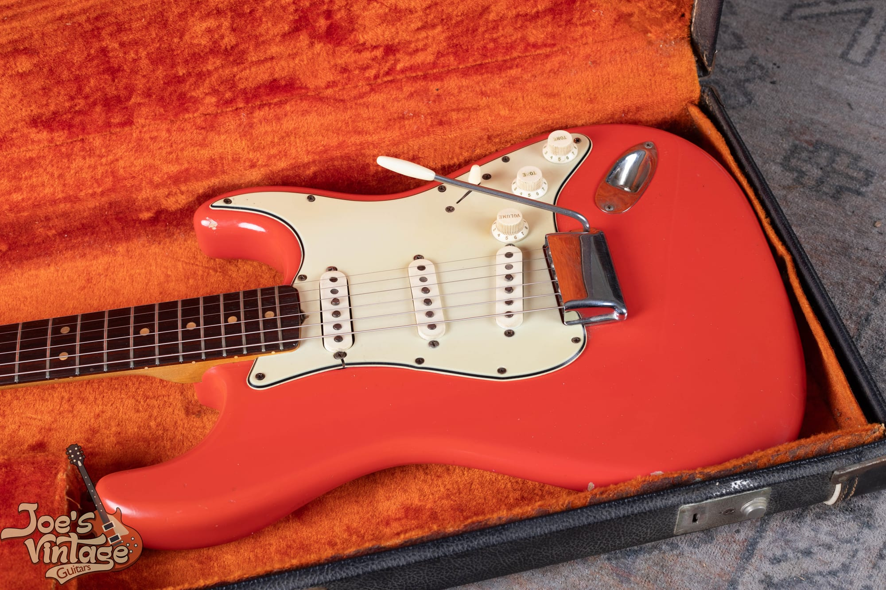

A 1964 Stratocaster in Fiesta Red, the color that started the custom color craze. Note the correct greenish "mint" nitrate pickguard of the pre-CBS years. Everything on a custom color guitar has to agree: the color, the plastic, the hardware, and the wear all belong to the same era.

The colors themselves were not exotic. Almost every named Fender custom color was pulled straight off an automotive paint chart, DuPont colors mixed for Cadillac, Ford, Chevrolet, Buick, Mercury, Lincoln, Oldsmobile, Pontiac, and even DeSoto. Lake Placid Blue was a 1958 Cadillac color. Fiesta Red came off the 1956 Ford Thunderbird. Surf Green was a 1957 Chevrolet color. Leo Fender ran a lean operation, and buying paint that the local automotive supplier already stocked was exactly his style. The full sourcing table below lists the DuPont code and donor car for every chart color.

<h2 id="fcc-history">A Short History of Fender Custom Colors</h2>

Custom finishes existed at Fender from the very beginning. Scattered 1950s Telecasters, Esquires, Precision Basses, and Stratocasters survive in black, red, gold, and other one-off colors, sprayed because a player or dealer asked and paid. By 1956 Fender's sales literature formalized the arrangement, offering instruments in custom DuPont Duco finishes for 5% over list.

The late 1950s turned an option into a phenomenon. The story goes that George Fullerton had a local paint store mix the red that became Fiesta Red in 1958 or so, and once players like Hank Marvin of The Shadows appeared with red Strats, demand took off, especially overseas. Through the late fifties, though, there was still no printed menu. You asked for a color and Fullerton's paint department did its best.

The first official custom color chart arrived in 1960: a printed card of fourteen named colors plus blonde, each keyed to a DuPont paint code. From then on the offering was standardized, and the chart itself was revised in documented steps that are extremely useful for authentication:

-   **1960:** the first chart. Fourteen colors plus Blonde, listed in the table below.
-   **1963:** Candy Apple Red Metallic joins the chart, the first color Fender mixed in-house rather than borrowed from Detroit, built from a metallic base coat under translucent red. Slow-selling Shell Pink drops off the menu around the same time, which is why original Shell Pink instruments are extraordinarily rare.
-   **1965:** the first CBS-era revision. Six colors are dropped (Shoreline Gold, Burgundy Mist, Daphne Blue, Sherwood Green, Surf Green, and Inca Silver) and six new metallics take their place: Blue Ice, Charcoal Frost, Firemist Gold, Firemist Silver, Ocean Turquoise, and Teal Green.
-   **1969 into the 1970s:** the chart shrinks to a handful of survivors. Lake Placid Blue and Candy Apple Red hold on until about 1973, the Firemists and Ocean Turquoise to about 1971, and only Olympic White and Black carry the custom color banner deep into the following decade as the thick polyester era takes over.

A 1966 Jazzmaster in Lake Placid Blue. The offset models were custom color billboards in the 1960s, and surf bands ordered them in quantity. Lake Placid Blue stayed on the chart from 1960 into the early 1970s, longer than almost any other color.

Why does the chart history matter? Because a color has to exist in the year the guitar was built. A "1961 Candy Apple Red" Stratocaster is wearing a color Fender did not offer until 1963. A "1967 Burgundy Mist" Jazzmaster is wearing a color that left the chart in 1965. Neither is impossible in the absolute sense, since Fender occasionally sprayed off-menu, but every mismatch between the color and the chart moves the burden of proof steeply against the guitar.

<h2 id="fcc-chart">The Custom Color Charts, Year by Year</h2>

Here is the working reference we use: every chart color with its DuPont paint code, its chemical binder type, the automobile it was mixed for, and its active years. Chart years mark when a color was officially offered; Fender used up old stock and honored odd requests, so real guitars straggle a year or so past the edges.

One disclaimer before the swatches: the color chips below are screen approximations, mixed to get you in the neighborhood of each color and nothing more. Real examples vary with the paint batch, sixty years of fading, and the amber of the clear coat, and no two monitors agree either. Use the swatches to get the idea, and identify actual guitars against protected areas and known originals, never against a screen.

| Color | Type | DuPont Code | Car Year, Make & Model Source | Active Years |
| --- | --- | --- | --- | --- |
| Blonde | Translucent Nitro | In-house | Fender proprietary formulation | 1950s-1970s |
| Black | Solid Nitro (Duco) | 1711 | Universal Automotive Black (All Makes) | 1960-1984 |
| Olympic White | Solid Acrylic (Lucite) | 2818-L | 1958-1962 Cadillac | 1960-1980 |
| Fiesta Red | Solid Nitro (Duco) | 2219-H | 1956 Ford Thunderbird | 1960-1969 |
| Dakota Red | Solid Nitro (Duco) | 2590-H | 1958 Cadillac | 1960-1969 |
| Shell Pink | Solid Nitro (Duco) | 2371 | 1956 DeSoto | 1960-1963 |
| Daphne Blue | Solid Nitro (Duco) | 2804 | 1958 Cadillac | 1960-1965 |
| Sonic Blue | Solid Nitro (Duco) | 2295 | 1956 Cadillac | 1960-1972 |
| Lake Placid Blue Metallic | Metallic Acrylic (Lucite) | 2876-L | 1958 Cadillac | 1960-1973 |
| Sherwood Green Metallic | Metallic Nitro (Duco) | 2526-H | 1957 Mercury | 1960-1965 |
| Foam Green | Solid Nitro (Duco) | 2253 | 1956 Buick | 1960-1969 |
| Surf Green | Solid Nitro (Duco) | 2461 | 1957 Chevrolet | 1960-1965 |
| Burgundy Mist Metallic | Metallic Acrylic (Lucite) | 2936-L | 1959 Oldsmobile | 1960-1965 |
| Shoreline Gold Metallic | Metallic Acrylic (Lucite) | 2935-L | 1959-1960 Pontiac | 1960-1965 |
| Inca Silver Metallic | Metallic Acrylic (Lucite) | 2436-L | 1957-1959 Chevrolet Corvette | 1960-1965 |
| Candy Apple Red Metallic | Translucent Nitro | In-house | Fender proprietary formulation (silver, then gold base) | 1963-1973 |
| Blue Ice Metallic | Metallic Acrylic (Lucite) | 4692L | 1965-1966 Ford | 1965-1969 |
| Charcoal Frost Metallic | Metallic Acrylic (Lucite) | 4618L | 1965-1966 Lincoln Continental | 1965-1969 |
| Ocean Turquoise Metallic | Metallic Acrylic (Lucite) | 4607L | 1965 Mercury | 1965-1971 |
| Teal Green Metallic | Metallic Acrylic (Lucite) | 4297L | 1965-1968 Lincoln | 1965-1969 |
| Firemist Gold Metallic | Metallic Acrylic (Lucite) | 4579L | 1964-1965 Cadillac Eldorado | 1965-1971 |
| Firemist Silver Metallic | Metallic Acrylic (Lucite) | 4576L | 1964 Cadillac Eldorado | 1965-1971 |

Now a warning about reading that Type column, because it kills a myth that gets repeated everywhere. People say Fender's solid colors were DuPont Duco nitrocellulose and the metallics were DuPont Lucite acrylic, as if it were a rule. It was not. The paint department picked formulations by what was available and what dried on schedule, and the chart proves it: Olympic White, a solid pastel, is an acrylic (Lucite 2818-L), while Sherwood Green Metallic, as metallic as they come, is a nitrocellulose Duco.

This chemistry matters on the bench. Acrylic lacquer has a stable, slightly elastic polymer structure, so it resists checking and it does not yellow under light on its own. On an acrylic color, the aging you see is happening almost entirely in the clear nitrocellulose topcoat Fender sprayed over it. And when the factory skipped that clear coat to move bodies out the door faster, which was common in 1962 and 1963, the acrylic color underneath had nothing to amber and nothing to crack. A stark white, check-free 1962 Olympic White body is not an automatic aftermarket refinish. Read the layers before you read the verdict.

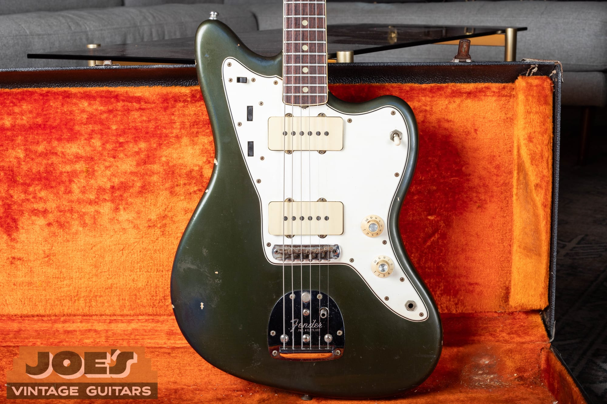

A 1965 Jazzmaster in Charcoal Frost Metallic, one of the six metallics added in the 1965 chart revision. Aged clear coat pushes this color toward a murky gray-green that gets misidentified constantly. If someone offers you a "1962 Charcoal Frost" anything, the chart says otherwise.

<h2 id="fcc-stack">How Fender Built a Custom Color Finish</h2>

To authenticate the finish you need to know how it went on, layer by layer, because every layer is checkable at chips, screw holes, and cavity edges. On a 1960s custom color body the full stack, from the wood up, looks like this:

1.  **The body blank.** Alder for most custom colors, ash for blonde and some early bodies. Ash got a grain filler; alder did not need one.
2.  **Stain dip and sealer.** Fender dipped alder and ash bodies in a yellow aniline dye stain, then sealed them. From 1955 to about mid-1962 the sealer was Sherwin-Williams Homoclad, a clear penetrating oil-based sealer. From roughly mid-1962 on it was Fullerplast, a catalyzed reactive poly-vinyl sealer from Fuller-O'Brien. Get this straight, because it is misstated constantly: both sealers are chemically transparent and colorless. The yellow-amber surface you see in neck pockets and cavities is the dye stain under the clear sealer, not the sealer itself.
3.  **Undercoat.** Most custom colors got an opaque undercoat, and the undercoat color changed over the years. This is such a useful tell that it gets its own section below.
4.  **Color coats.** A DuPont color coat, Duco nitrocellulose or Lucite acrylic depending on the color and the batch (see the chart section for why the tidy solids-versus-metallics rule is wrong), and for Candy Apple Red a metallic base followed by translucent red.
5.  **Clear coats.** Clear nitrocellulose over the color on most instruments. The clear is what ambers with age and shifts the apparent color, and Fender sometimes skipped it entirely to speed production, especially in 1962 and 1963. On matching headstocks the logo decal went on last, over the clear.

The same 1965 Candy Apple Red Strat from the top of this page with its guard off. Study how a real one looks: the color coats cover the face fully but get thin and dusty inside the routes, the neck pocket goes to yellow where the paint stick sat, and fifty years of dust sits undisturbed in the corners. Nothing here has ever been "cleaned up," and that is exactly the point.

The Charcoal Frost Jazzmaster with its neck off. The pale stripe up the middle of the pocket is the shadow of the factory paint stick, and the glassy yellow surface inside it is the aniline dye stain under clear Fullerplast sealer, complete with factory pencil scribbles. Color creeps in from the edges only. This is the anatomy lesson refinishers fail.

Two big-picture points about this stack. First, Fender sprayed bodies fast and hung them to dry; runs, dust, light orange peel, and lazy coverage in hidden areas are all normal and even reassuring. Second, the stack is a sequence, and the sequence is the fingerprint. Silver showing under red at a chip is a story that makes sense on a 1965 Candy Apple Red guitar. Red sitting directly on bare wood is not.

<h2 id="fcc-undercoats">Undercoats Through the Years: Desert Sand, White, Silver, and Gold</h2>

Ask any longtime dealer where they look first on a custom color Fender and most will say the same thing: find a chip and read the layers. The undercoat under the color is the hardest thing for a refinisher to fake correctly because it changed over the years, it varied by color, and most refinishers do not even know it should be there.

Here is the timeline we work from:

-   **Late 1950s:** the paint department frequently primed custom bodies with whatever suitable opaque paint was on hand, and on many late-fifties Fiesta Red and other custom bodies that meant Desert Sand, the beige stock color of the Musicmaster and Duo-Sonic line. A 1958 to 1960 Fiesta Red guitar chipping to a beige undercoat is textbook.
-   **Early 1960s onward:** white becomes the standard undercoat under most custom colors. Lake Placid Blue, Dakota Red, Fiesta Red, and most of the chart colors of the sixties typically sit on an opaque white base. On light colors like Olympic White, the color coat and undercoat are both white, which produces a wear pattern we cover in the aging section.
-   **Candy Apple Red, 1963 to 1965:** Fender's recipe called for a metallic base under the translucent red, and the original process used a **silver** metallic base, typically Inca Silver, the Chevrolet color already sitting on Fender's shelf. Transparent red over silver is what gives early CAR its vibrant, light-reflecting quality. Chips on an early example show bright silver under the red.
-   **Candy Apple Red, after the 1965 CBS transition through 1973:** the base shifts to **gold** metallic, and the red reads slightly darker, warmer, sometimes almost brownish next to an early silver-base example. Chips on later CAR instruments show gold. A "1963" CAR guitar chipping to gold, or a late-sixties CAR chipping to silver, has a date problem somewhere.
-   **All eras:** exceptions exist, and they run in both directions. Some bodies got color straight over the sealer with no undercoat at all, especially in the rushed CBS ramp-up of 1964 to 1966. Missing an undercoat is a yellow flag, not a death sentence, and we show a real example below.

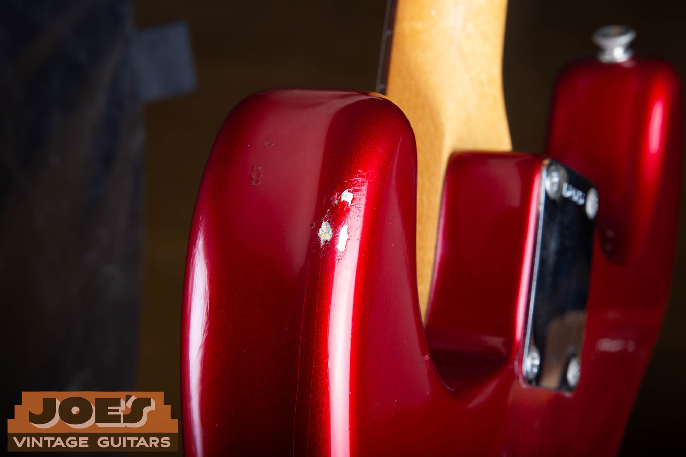

Chips on the horn of the 1965 Candy Apple Red Strat break to bright silver, correct for the original silver-base recipe that ran from 1963 into 1965. On a later CBS-era example we would expect gold here instead, and the red itself would carry a warmer, browner cast. One small chip just told us the paint recipe, and the recipe has a date.

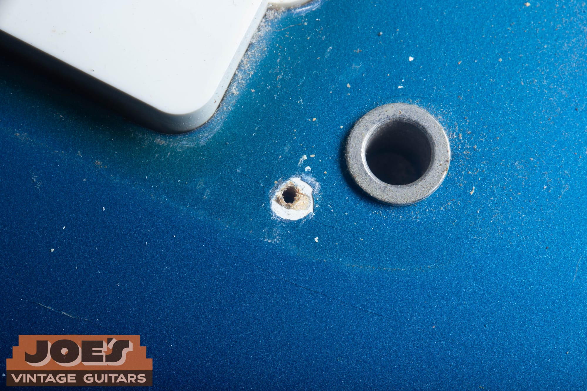

A pickguard screw hole on a 1966 Lake Placid Blue Jazzmaster. The chipped rim breaks to clean white, the standard undercoat beneath sixties Lake Placid Blue. Screw holes are the easiest honest window into the stack because the plastic hid them from touch-up brushes.

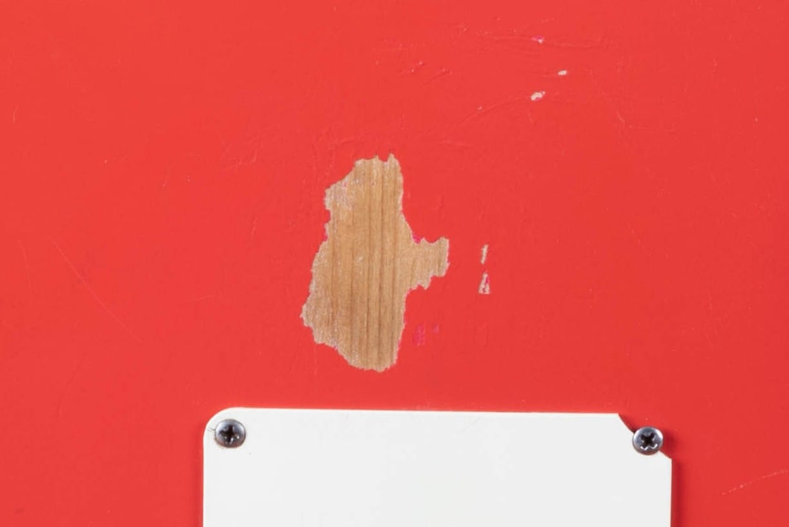

And here is the counterexample that keeps everyone humble: chipping on the back of a 1964 Fiesta Red Stratocaster that breaks straight to bare wood. No white undercoat, no sealer line, just red on wood, and the guitar is factory original. It is the same instrument whose bare neck pocket appears in the pocket section below, built in the years when Fender was shipping guitars faster than its own process. One layer never decides the case by itself; the whole guitar has to agree.

<h2 id="fcc-sunburst">Custom Color Over Sunburst</h2>

Here is a fact that surprises owners constantly: some factory custom color Fenders have a complete or partial sunburst underneath the color. In the mid sixties especially, when a custom order came in, the factory sometimes pulled a body from regular sunburst stock and sprayed the custom color right over it. Peek under the pickguard of some untouched mid-sixties Candy Apple Red and Lake Placid Blue guitars and you will find sunburst yellow, and even the darker burst shading, hiding at the edges of routes and pockets where the later color did not fully cover.

So sunburst under a custom color is not automatically a refinish, and a refinisher who strips a body "back to original sunburst" may in fact be destroying a factory custom color story. Direction matters, though. Factory work is custom color over sunburst, sprayed before the guitar was assembled, with the same aged clear over everything. Custom color over a WORN sunburst, with color bridging weather checks or filling belt-buckle scars, is paint applied decades after the fact, and the blacklight section below will catch it.

There is a dating wrinkle buried inside this practice, and it is worth knowing cold. In mid-1964 Fender changed its sunburst recipe to the opaque, sharply defined "target" burst, with hard-edged color bands designed to hide grain flaws in CBS-era wood, and that burst was built on a semi-transparent white primer coat sprayed over the yellow stain. So when you chip-check a mid-sixties custom color that went over stock sunburst, the burst peeking out at route edges has to be the right burst: opaque red and dark bands over a whitish primer, the target profile. A soft, fully transparent fifties-style burst hiding under a "1966" Candy Apple Red is a timeline that does not add up, and timelines that do not add up are how resprays get caught.

<h2 id="fcc-nails">Nail Holes and the Paint Stick</h2>

Fender had to hold a wet body somehow, and how they held it changed in well-documented steps that split the vintage era into three readable periods.

**The nail era, 1950 to late 1962.** Freshly sprayed bodies were rested on small finishing nails driven into the face and back so they could dry flat on racks without touching anything. When the guitar was assembled the nails came out, leaving three or four small bare holes in places the hardware would cover: under the pickguard (commonly near the neck pocket), under the bridge or trem plate, and around the control area. On an original finish from this era, you must find open, unfilled nail holes with finish flowing up to their rims. No nail holes on a fifties or early-sixties body means the surface has been sanded and resprayed. It is one of the fastest refin checks there is.

**The transition, late 1962 to late 1964.** Around December 1962 the factory started bolting a wooden stick into the neck pocket screw holes and holding the body by the stick while spraying, which is what created the pocket shadow covered in the next section. Here is the detail almost everyone gets wrong: the stick did not retire the nails. The spray room did not yet have vertical hanging trees to dry stick-mounted bodies, so freshly sprayed bodies still went flat onto nail-supported drying racks. That overlap is a gift to authenticators. A factory-original 1963 or early-to-mid 1964 body should show BOTH marks: a paint stick shadow in the neck pocket and open, paint-free nail holes on the body face. A 1963 body with a beautiful stick shadow and no nail holes anywhere is a major refinish warning, no matter how good the pocket looks.

**The hanging era, late 1964 onward.** Once the drying trees arrived, the nails faded out and bodies dried hanging by their sticks. Stragglers with nail holes show up well into 1965, and our Candy Apple Red Strat below is one of them. A nail hole on a 1965 body is normal. A 1958 body with no nail holes is not.

A factory nail hole hiding under the guard of the 1965 Candy Apple Red Strat, chipped at the rim to show the silver base. Note the route edge at the left of the frame, where the red simply stops and the yellow-sealed wood takes over. Every mark here was made by the factory and then buried under a pickguard for sixty years.

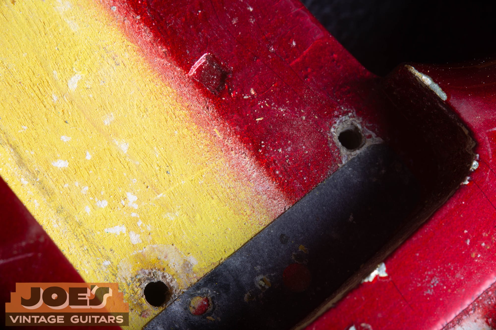

The same guitar's neck pocket at an angle. The floor is sealed yellow wood, the red arrives only as feathered overspray from the edges, and the corners hold their original grime. A refinished pocket looks painted; a factory pocket looks masked, because it was.

<h2 id="fcc-dowels">Pin Router Dowel Holes: Tooling Fingerprints</h2>

Before a body ever saw paint, it saw the pin router. Fender shaped body blanks by clamping a metal template to the raw wood and running the pair against a manual pin router, and the template's alignment pins seated in small holes drilled into the blank. When shaping was done, those pin holes were plugged with wooden dowels, sanded flush, and finished right over. Every vintage Fender body carries them, and they are among the least-known and hardest-to-fake originality marks on the instrument.

Where to look on a Stratocaster: one dowel sits near the neck plate, up toward the upper horn cutaway, and a second sits slightly off center along the bottom edge of the body near the strap button.

The reason dowels matter for authentication is how they age. A dowel is a separate plug of wood with its own grain, and it shrinks at a different rate than the body around it. Over decades, the circular boundary of the plug telegraphs through Fender's thin lacquer as a faint ring you can catch under raking light, sometimes with fine shrinkage lines breaking the topcoat right at the edge. Original finish, original dowel, visible ring. An aftermarket sanding job flattens the telegraphed outline, and a thick modern refinish, polyester especially, buries or distorts it entirely. When the dowels have vanished under glass-smooth paint on a "factory original custom color," the finish went on long after the factory.

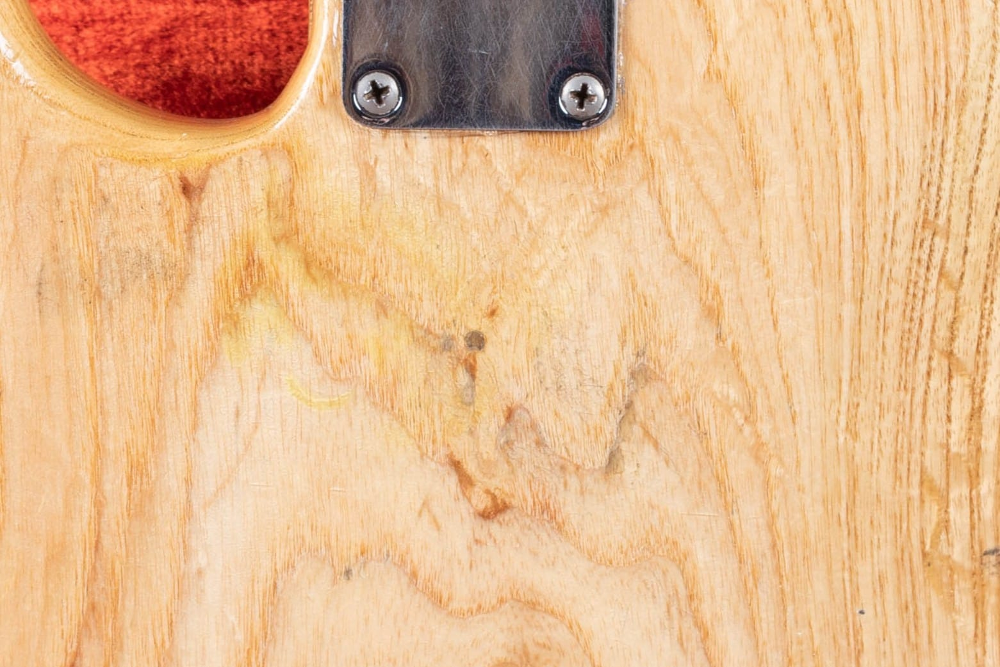

The pin router dowel on a 1960 Precision Bass, dead easy to spot because this bass was refinished natural, which makes it a perfect teaching example. On a guitar wearing its original finish the plug hides under the color, and what you are hunting for is that same circle showing as a faint outline telegraphing through the finish under raking light.

<h2 id="fcc-pocket">Reading the Neck Pocket</h2>

Pull the neck on a sixties custom color Fender (carefully, and only if you are comfortable doing so) and the pocket reads like a build sheet. Here is what belongs there:

-   **The stick shadow.** From late 1962 on, a bare or sealer-only zone where the paint stick blocked the color, with overspray feathering in from the sides. The shadow is often a crisp stripe.
-   **The yellow floor.** The bare zone is not raw white wood; it is wood that took the factory's yellow dye dip, sitting under a water-clear sealer film, Homoclad before mid-1962 and Fullerplast after. The gloss is the sealer; the yellow is the dye. It is not yellow on every single body, since the dip got skipped now and then, but it almost always is.
-   **Factory markings.** Pencil or marker model codes ("JM" for Jazzmaster below), scribbled numbers, date stamps or pencil dates in various spots through the years. Refinishers sand these away, so their presence is worth a lot.
-   **Shims.** Fender fitted rust-red fiberboard shims at the pocket end of many instruments, offsets especially, to set neck angle. An untouched shim sitting in undisturbed finish is another good sign nobody has been in there with sandpaper.

This is the money shot of custom color authentication: the neck pocket of a 1966 Lake Placid Blue Jazzmaster. The paint stick left a clean yellow stripe of sealed wood, the factory wrote "JM" on it in marker so the body went down the right line, blue overspray creeps in at both edges, and the original red-brown fiber shim is still glued in place at the pocket end. You cannot fake this combination convincingly, and almost nobody tries.

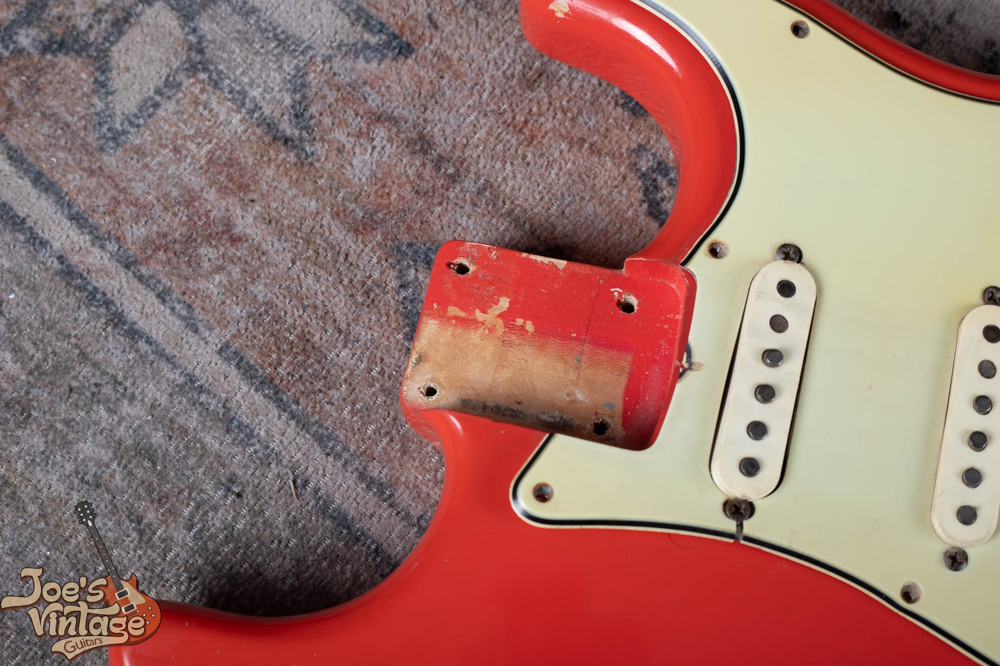

The 1964 Fiesta Red Strat's pocket tells a scrappier story: bare wood with no Fullerplast and no undercoat, just Fiesta Red feathering in from the edges. This guitar left the factory this way. In 1964 and 1965 Fender was shipping guitars as fast as it could build them, and steps got skipped. Knowing which shortcuts the factory actually took, and when, is half the game.

A 1966 Olympic White Jaguar's pocket: stick shadow, factory crayon numbers, a shim, and at the pocket edge you can see the white paint band sitting under clear coat that has ambered to cream everywhere else. Four separate originality tells in one three-inch rectangle.

<h2 id="fcc-guard">What Belongs Under the Pickguard</h2>

The pickguard is a time capsule lid. The factory knew the guard would cover the middle of the body forever, so nobody wasted paint or effort there, and what you find when you lift it should look lazy in very specific ways.

-   **Spray shadows.** Color that is thick and even out where the world could see it, going thin, dusty, or missing entirely in the middle of the guard footprint, with sealed yellow wood showing around the routes.
-   **Factory rough routing.** Fender's routers tore and chattered, and the crumbs and fuzz they left were sprayed over, not cleaned up. Debris locked under paint at route edges is one of the best originality signs on any Fender.
-   **Nail holes** on bodies through late 1964, plus stragglers after, as covered above.
-   **Undisturbed grime.** Sixty years of dust has a look. A spotless, uniformly glossy surface under a guard is a surface somebody has been improving.

Guard off the 1966 Lake Placid Blue Jazzmaster. Out at the edge, full wet color. Under the guard, the blue goes thin and the yellow sealed body shows through around the routes. The sprayer covered what showed and moved on to the next body, exactly as the line demanded. A refinisher, working on one precious guitar with the guard off, covers everything evenly, and that evenness is the tell.

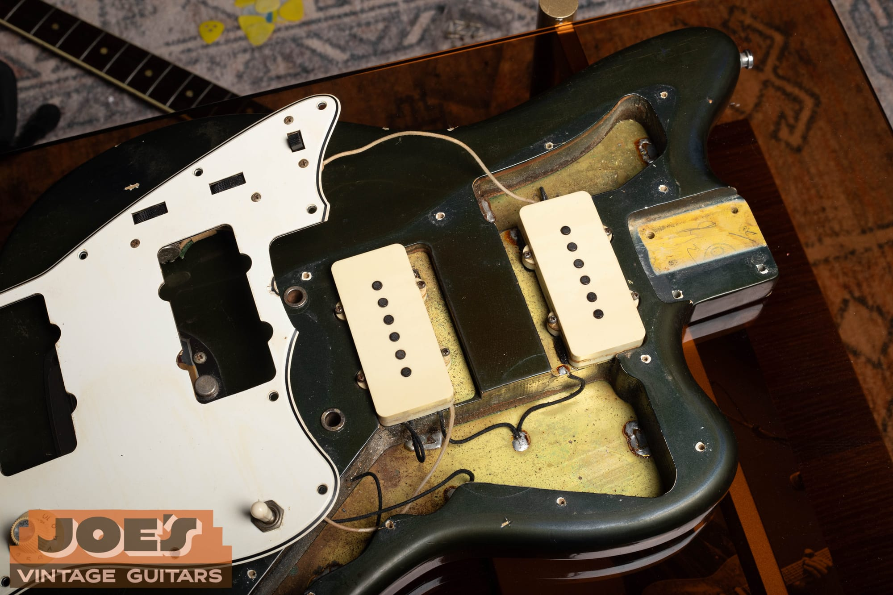

Same lesson on the 1965 Charcoal Frost Jazzmaster: lift the guard and the "finished" body becomes an honest factory workpiece, with sealed yellow wood everywhere the customer would never look. When a custom color guitar looks this unfinished in the hidden zones, that is authenticity, not damage.

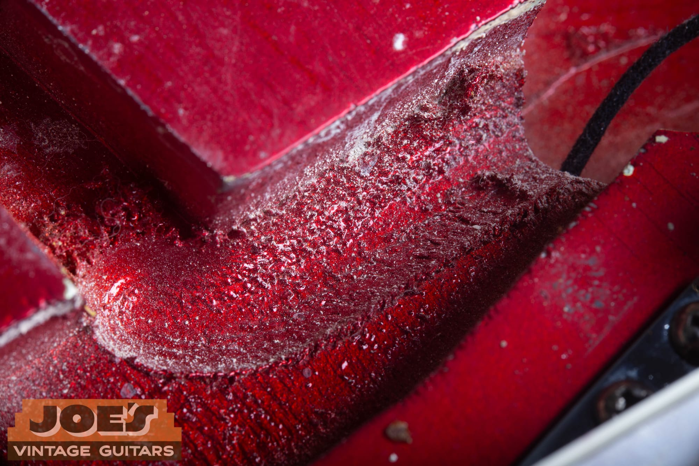

The worm route beside the bridge pickup on the 1965 Candy Apple Red Strat. The factory router tore this channel out and the sprayer painted right over the wreckage, sealing the debris under the color. This is what you want to see. A refinisher sands the routes smooth before spraying, and smooth, clean-edged routes on a "factory" custom color are a serious problem.

<h2 id="fcc-headstock">Matching Headstocks and Decal Sequencing</h2>

Fender's rule of thumb, and ours: on the offset models, a sixties custom color usually came with a matching painted headstock; on Stratocasters and Telecasters it almost never did.

From about 1963 onward, Jazzmasters, Jaguars, and Jazz Basses in custom colors normally received headstocks painted to match the body. The very earliest custom color offsets (and most custom Strats, Teles, and Precisions of any year) kept the plain maple-face headstock. Matching headstocks on Strats and Teles exist, mostly special orders and export instruments, but they are rare enough that each one has to prove itself.

On a genuine matching headstock the factory order never varied: maple, then sealer, then the opaque custom color, then the clear nitrocellulose, and then the water-slide decal applied on top of the clear. The decal going on last is the detail to burn into memory, because refinishers get it wrong in both directions. A period water-slide sits on the surface with a feathered, tapered edge you can barely catch with a fingernail, and it has aged right along with the lacquer under it. A decal buried underneath the clear coat means the headstock was resprayed and re-decaled in the wrong order. A modern vinyl decal with raised, hard-cut edges instead of the feathered edge of a water-slide is a replacement no matter where it sits. Either one means the headstock finish is not what it claims to be.

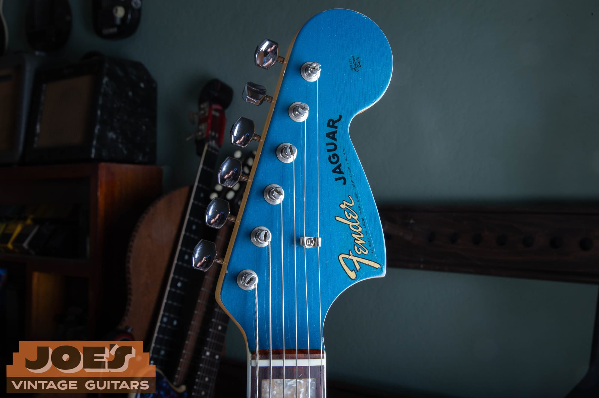

The matching headstock on a 1966 Lake Placid Blue Jaguar, with the gold transition logo applied over the clear coat exactly as the factory did it: color, then clear, then decal on top. A decal buried under the lacquer, or a headstock color that does not match the body's aging, means the headstock has been redone.

The matching headstock on a 1966 Lake Placid Blue Jazz Bass. Two things to study: the checking runs through color and clear together, and the whole headstock has shifted toward teal exactly as far as the body has. Matching means matching in age, not just in color.

On a matching headstock, check that the face shows the same checking pattern and the same amber shift as the body, that wear at the edges breaks through the same layer stack, and that the logo is the correct style for the year (gold transition logos in the mid sixties, for example). A refinished body with an original matching headstock, or the reverse, will disagree with itself under close light.

<h2 id="fcc-plastics">Pickguards and Plastic on Custom Colors</h2>

Custom color guitars shipped with the standard pickguard for the model and year, and the guard material is datable all by itself. Early-sixties Stratocasters wore three-ply nitrate celluloid guards, the famous "mint green" guards, and nitrate ages like the unstable film stock it is related to: the guards shrink, curl at the edges, turn greener with the decades, and give off a faint camphor smell when rubbed warm. In mid-1965 Fender switched to three-ply non-nitrate white vinyl plastic, which stays flat, stays white, and smells of nothing. A crisp flat white guard on a "1962" body, or a shrunken mint guard on a 1967, is the parts bin talking. The plastic is a supporting witness: if the guard is wrong for the year, or its screw holes do not line up with the body's, or its footprint does not match the spray shadow underneath, the guitar has been apart and altered.

Tortoiseshell deserves its own paragraph, because it trips up buyers constantly. Tortoise was the standard dress for sunburst and blonde offsets and basses. On the factory line it was never paired with a custom color, with one sole exception: Olympic White. We have handled genuine Olympic White instruments wearing factory tortoise, including the Stratocaster below and the Jaguar whose neck pocket appears earlier in this guide. Every other pairing, a Fiesta Red or Lake Placid Blue body under a tortoise guard, signals swapped parts or an aftermarket respray until proven otherwise, and the refinished Jazz Bass in the refinish section shows how that story usually ends.

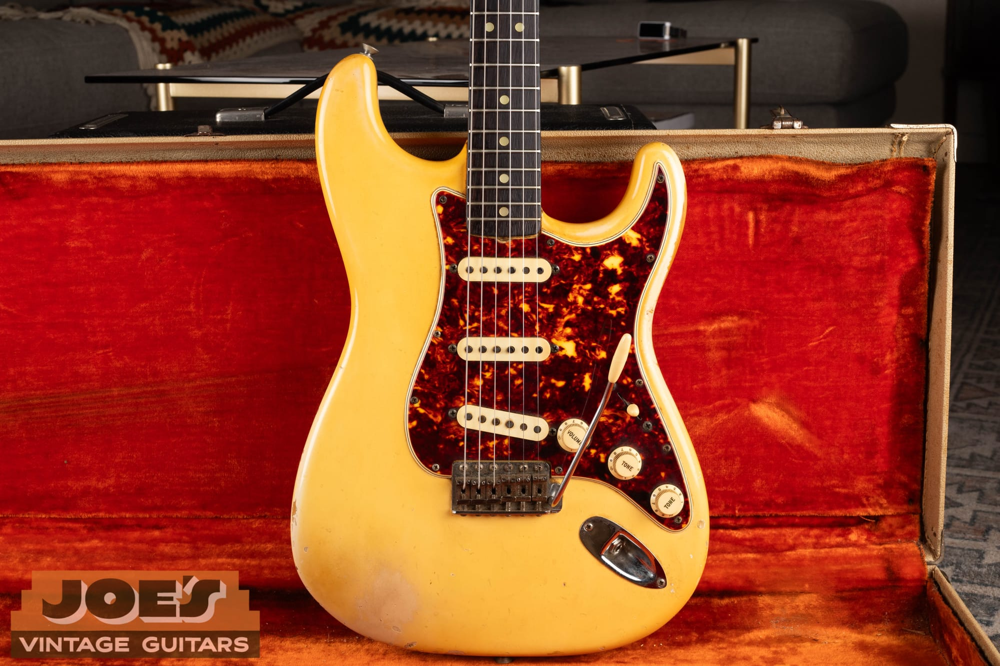

A 1965 Olympic White Stratocaster wearing a seldom-seen tortoise guard. The body has ambered to cream, the guard is correct to the period, and the rest of the guitar agrees with both. Tortoise over a custom color should always slow you down, and Olympic White is the one factory exception where it can turn out to be right.

<h2 id="fcc-aging">How Custom Colors Age</h2>

Fender topped most custom colors with clear nitrocellulose, and clear nitro does two things over sixty years: it turns amber and it shrinks. Both are your friends, because both are nearly impossible to fake coherently across a whole instrument. The color coat underneath behaves by its own chemistry: Lucite acrylic colors are stable and slightly elastic, so they resist checking and hold their hue, which means on an acrylic color nearly all the visible aging is happening in the clear coat above it.

The amber shift changes the apparent color, and knowing the shifts keeps you from misidentifying a real color or getting talked into a fake one. Here is how every chart color moves:

-   **Blonde** ambers from near-white to the honeyed butterscotch everyone associates with fifties Telecasters, and it grows more transparent as it thins, so the ash grain reads stronger every decade.
-   **Black** is the most stable color on the chart. It has no hue to shift, so its aging is all texture: checking, dulling gloss, and edge wear.
-   **Olympic White** goes cream, ivory, or full butterscotch depending on light exposure, and every bit of that amber lives in the nitro clear, because the white beneath is a stable acrylic. Case queens stay whiter, players' guitars go golden, and the 1962 and 1963 bodies that skipped the clear coat never yellow at all. A stark white, check-free Olympic White from those years can be completely original.
-   **Fiesta Red** holds its hue well, warming slightly toward orange under aged clear, and hard sun can soften it toward coral. Calling a warmed Fiesta a Dakota, or the reverse, is a weekly mistake in online listings.
-   **Dakota Red** deepens with age, and under heavily ambered clear it can read maroon or almost brownish.
-   **Shell Pink** is the most fugitive color Fender ever offered. The pink fades toward beige and off-white while the amber clear pushes what survives toward peach, and plenty of honest Shell Pink guitars get dismissed as bad refins because nobody believes the color.
-   **Daphne Blue** takes on a greenish hue as the clear ambers, sliding toward a pale seafoam that gets confused with Sonic and Surf.
-   **Sonic Blue** does the same one shade lighter, though case-kept examples stay a soft, whitish baby blue.
-   **Lake Placid Blue** shifts green, sometimes far enough to pass for teal or to be mistaken for Sherwood Green or Ocean Turquoise. The bass below is a textbook case.
-   **Sherwood Green** darkens toward olive and can read nearly black in dim light, with the metallic flake the only giveaway.
-   **Foam Green** warms toward sage and olive as the yellow builds up over it.
-   **Surf Green** famously warms from mint toward a yellowed seafoam green. A Surf that looks "too green" is often just an honest one.
-   **Burgundy Mist** is doubly unstable: the clear ambers over it while the purple itself fades in UV, so old examples drift toward a brownish, root-beer gray.
-   **Shoreline Gold** deepens and reads brassier with age.
-   **Inca Silver** under ambering clear reads champagne, and aged Inca gets mislabeled as Shoreline Gold or Firemist Gold constantly.
-   **Candy Apple Red** deepens and darkens as the clear ambers over the translucent red, with early silver-base examples staying brighter than the warmer gold-base versions that followed.
-   **Blue Ice** ambers from icy silver-blue toward a pale green-champagne that gets called everything except its real name.
-   **Charcoal Frost** drifts toward gray-green and gets misnamed constantly.
-   **Ocean Turquoise** deepens and leans greener with age, closing the gap on Teal Green.
-   **Teal Green** darkens toward forest green, and separating an aged Teal from an aged Ocean Turquoise usually takes a protected-area comparison.
-   **Firemist Gold** deepens toward bronze.
-   **Firemist Silver** ambers toward pale champagne, and telling it from Inca Silver or a light Firemist Gold from across the room is a fool's errand. Check the protected areas.

The back of a 1966 Lake Placid Blue Jazz Bass, worn to the wood across half the slab. Look at the borders of the wear: a thin line of white undercoat rims every hole in the color, and the surviving blue has ambered to green-teal. Layer order on full display: wood, then white, then blue, then amber clear, each ring wearing away in sequence.

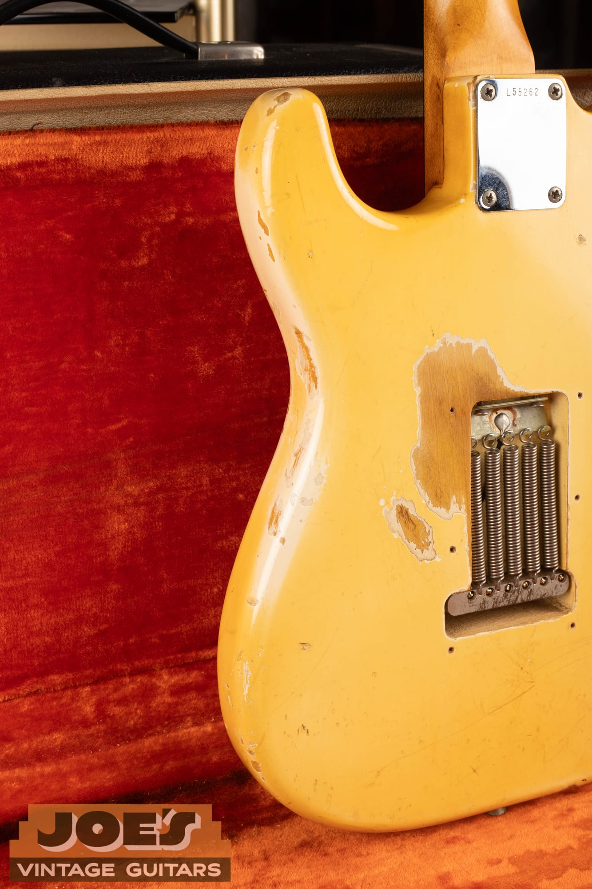

The back of the 1965 Olympic White Strat teaches the subtlest version of the layer lesson. The exposed top surface has ambered to butterscotch, but where wear cuts through, the paint gets whiter, because the undercoat never saw the sun and never had clear coat over it. White under cream sounds backwards until you understand the stack, and refinishers routinely get it backwards.

Shrinking is the other half. As nitro shrinks it cracks into the fine web collectors call checking, and on a sixties Fender some checking is close to inevitable. On acrylic color coats under nitro clear (most of the metallics, plus acrylic solids like Olympic White) the checking lives mainly in the clear layer and often reads as fine parallel lines you feel with a fingernail more than see head-on. On all-nitro finishes the checking runs deeper, through color and clear together.

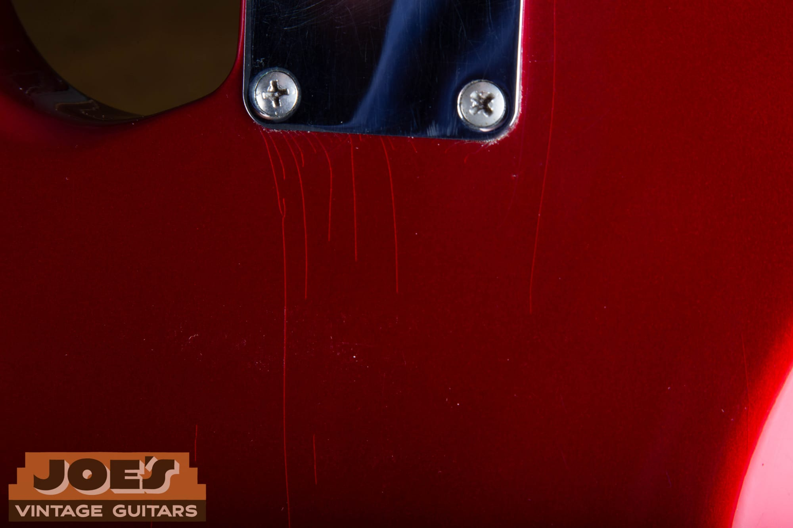

Checking lines streaming down from the neck plate of the 1965 Candy Apple Red Strat, red-on-red and easy to miss without raking light. Checking should run through the clear and color consistently, in patterns that follow temperature history, and it should never stop at a repaired zone. A sixty-year-old custom color with zero checking anywhere gets the blacklight next.

One more aging tell: protected zones. Finish under the guard, under control plates, and inside cavities saw no sunlight, so original color hides there in its youngest state. The Lake Placid Jazzmaster photos above show it clearly, with brighter blue in the guard footprint. When a seller's "Lake Placid Blue" is the same shade everywhere, including under the plastic, all of it went on at the same time, recently.

<h2 id="fcc-blacklight">The Blacklight Test</h2>

A 365nm ultraviolet lamp in a dark room is the single most useful tool we own for finish work. Old nitrocellulose clear coats fluoresce with a warm, slightly greenish-yellow glow that modern lacquers and touch-up materials do not reproduce. Under UV, an untouched original finish glows evenly across the whole body. Overspray, touch-ups, and full repaints show as dull, dark, or cold patches, and clear coats with modern optical brighteners jump out blue-white.

How we run the test: dark room, lamp at an angle, and work the edges first. Refinishers blend their work into edges, cavities, and the headstock face, and edges are where fresh material meets old. Check around every chip that "should" be there, along the guard line, around the neck plate, and across the face of a matching headstock. Then pull the guard and compare the hidden finish to the exposed finish; they aged differently in visible light but they should still both read as old lacquer under UV.

Two honest limits. First, a fifty-year-old refinish is itself old lacquer now, and it can glow convincingly, which is why the process tells in the sections above matter as much as the lamp. Second, the reverse: a factory finish that got a small period touch-up at the dealer is still a 95% original guitar. The lamp gives you data, not a verdict. Weigh it with everything else.

<h2 id="fcc-refin">Telltale Signs of a Refinish</h2>

Now the rogues' gallery. Most refinished "custom color" Fenders give themselves away with the same handful of mistakes, and every one below came through our shop.

**The color is wrong.** Not wrong as in ugly. Wrong as in it matches nothing Fender offered, or it matches a color from the wrong years. When a blue is too purple for Lake Placid, too dark for Sonic, too even for an aged anything, stop and compare against known originals, not against memory.

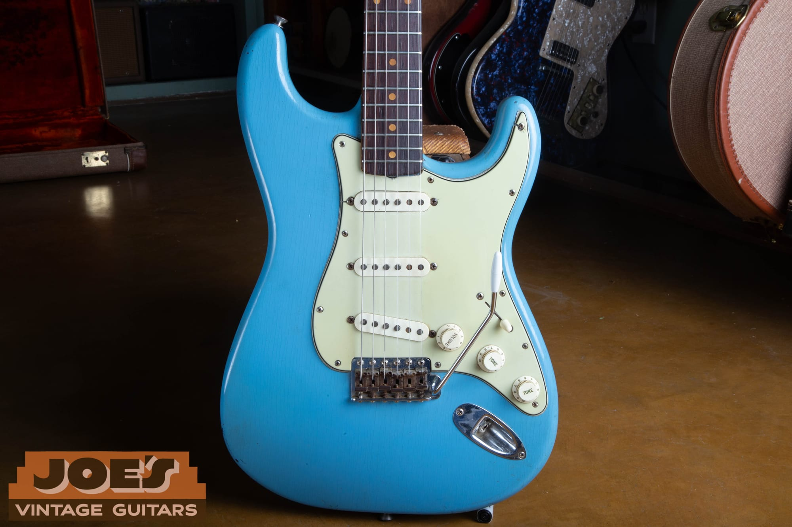

A refinished 1960 Stratocaster. Pretty guitar, and the blue is close enough to fool a hopeful eye, but it matches no Fender chart color: too bright for a sixty-year-old Sonic, too pale for Daphne, no metallic for Lake Placid. Under the guard the story ended fast, with no nail holes anywhere on a body that absolutely must have them. Refinished, and priced accordingly when we sold it.

**The texture and edges are wrong.** Fender sprayed thin lacquer on assembled-line fixtures. Refins show orange peel, high gloss in cavities, softened body contours from sanding, and finish piling up around hardware, especially the neck plate, where masking or spraying around the plate leaves a ridge or bulge.

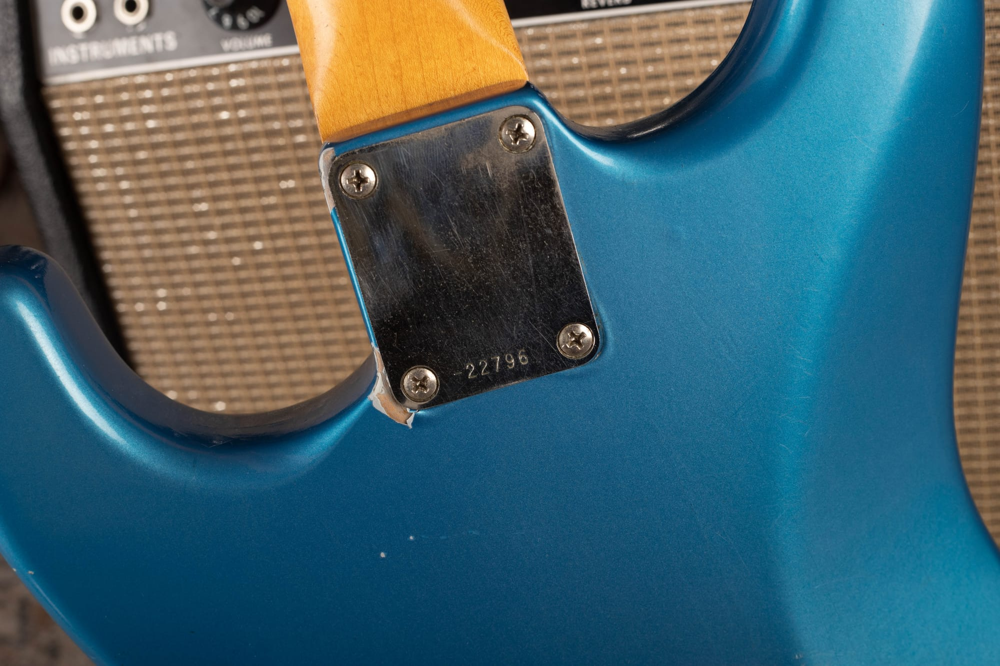

A 1960s Strat refin caught by its neck plate. The finish bulges and ridges around the plate outline because the plate was on the guitar when the paint went on, something the factory never did. The chip at the plate's corner breaks to grey automotive primer, a material Fender never used. Two independent condemnations in one photo.

**The stack is wrong.** No undercoat where one belongs, grey primer, color over bare sanded wood, or color over damage. Combine with parts logic: wrong guard material, wrong era plastic, missing matching headstock on a custom offset.

A 1961 stack-knob Jazz Bass, refinished in black. Count the problems: the wear breaks straight from black to bare wood with no undercoat and no sealer line; a custom color Jazz Bass of this era should almost certainly wear a matching headstock and this one does not; and the tortoise guard on a "custom color" bass is the wrong pairing to begin with. Any one of these invites questions. All three together is an answer.

**The process marks are missing.** This is the deepest tell, because it cannot be faked backwards. Sanding a body for respray erases nail holes, erases pocket shadows, erases pencil marks, and cleans out route debris, and the refinisher then has to not paint the pocket (they always paint the pocket), leave the routes torn (they always smooth them), and reproduce dusty spray shadows under the guard (they never do). When the hidden zones of a "custom color" Fender look tidier than the visible zones, the finish is new. The factory's laziness is your best friend.

<h2 id="fcc-factory-refin">Factory Refinishes and the Repair Department's Marks</h2>

There is a third category between original and refinished, and it is the trickiest one on the bench: the factory refinish. Fender operated a repair and refinish service for dealers and customers, and a steady stream of guitars went back to Fullerton over the years for new finishes, custom colors included. Those guitars were done by the same paint department, with the same materials, the same undercoats, and the same process marks as new production. A factory refin can pass the stack test, the process test, and the blacklight test, because it is a factory finish. It just is not the guitar's first one.

What gives them away is that the repair department kept books, and it kept them in wood. When the factory disassembled a guitar for service work, it needed the right neck back on the right body after stripping and spraying, so parts got marked. Any of the following means factory hands touched the guitar after it first shipped:

-   **Soldering iron serial brands.** The guitar's serial number burned into raw wood with a hot tool, most famously on the back of the neck heel and sometimes in the neck pocket or body cavities. The form varies: sometimes it is a clean stamp, but often it is done freehand with a soldering iron as a distinctive little run of burned dots spelling out the number. In our experience this mark almost always means the guitar went back to Fender for service, usually finish work.
-   **Matching batch stamps.** A four-digit tracking number stamped into the flat butt of the neck heel and again into the neck pocket floor. The same four digits in both places is a factory service pairing, stamped so the two parts found each other on the way back through the shop.
-   **Color abbreviation stamps.** The paint department often stamped the new color's abbreviated name straight into bare cavity wood as a guide for the spray booth: C.A.R., B. MIST, O.W., L.P.B., and so on. A color code stamped under the finish it describes is a refinish work order written by Fender itself.
-   **R&R and FRR stamps.** Mid-sixties factory service work often carries a black ink R&R stamp, for Repair and Refinish, and you will sometimes see it written out alongside the color the guitar was going back to be sprayed. By the late seventies and eighties this had evolved into a circled FRR stamp with a four-digit date code reading week-week-year-day, so a mark like 0304 decodes as the third week of the year, 1980, Thursday.

The back of the neck heel on a 1956 Stratocaster, with the serial number burned in by a Fender soldering iron. This guitar went back to Fullerton in the late fifties and came home blonde, a custom color on a Stratocaster. The finish is factory in every testable way, and without this mark it may well have passed as all original. With it, the guitar is an honest, documented factory refinish, which is a different guitar at a different price.

How do you catch a factory refin beyond the burn mark? Anachronisms. The finish is factory quality but its details belong to the year of the REFINISH, not the year of the guitar: a 1956 body wearing a paint recipe or undercoat that did not exist until 1959, a color that postdates the neck date, or process marks from the wrong era. Factory refins are honorable guitars with real collector interest, worth more than an aftermarket repaint and less than an untouched original, and they must be represented as exactly what they are.

<h2 id="fcc-checklist">The Nine-Step Bench Protocol</h2>

Here is the sequence we actually run when a custom color Fender hits the bench, in the order we run it. You can do most of it with a screwdriver, a flashlight, a 10x loupe, and patience.

1.  **Component dating.** Record the neck plate serial, the neck heel date stamp, the potentiometer codes, and the pickup markings, and cross-reference them against each other. The color has to be possible for the build date per the chart above, and our [Fender serial number guide](/fender-guitars-serial-number-guide/) covers this side of the work.
2.  **Blacklight before disassembly.** Evaluate the whole instrument under 365nm UV in a darkened room while it is still together. Map the warm amber and greenish-yellow fluorescence of original clear coat, and note every dark patch of touch-up or repair for closer inspection once it is apart.
3.  **Controlled disassembly.** Remove the neck, lift the pickguard and fold it to the side rather than pulling it, so the original solder joints never take strain, and remove the tremolo assembly on trem models. Nothing gets forced and nothing gets cleaned.
4.  **Neck pocket archaeology.** Verify the paint stick shadow and its boundaries, the factory crayon and marker codes, intact sealer of the right era (Homoclad before mid-1962, Fullerplast after) over the yellow dye, and the original fiberboard shim where the model calls for one.
5.  **Cavity shadows and debris.** Confirm the color thins to dusty spray shadows and exposed yellow sealer inside the guard footprint and routes, and look for pin router tooling scars and torn wood fibers sealed under the original paint.
6.  **Paint stack stratigraphy.** Inspect chips and wear spots under 10x magnification and confirm the layers transition in factory order: bare wood, then the dye dip, then clear sealer, then the correct undercoat for the color and year, then color, then clear nitro.
7.  **Dowel hole verification.** Locate the pin router template dowels on the body, and the one on the headstock face under the G and D tuners, and check under raking light for the telegraphed circular outlines and the natural shrinkage lines breaking the topcoat at their edges.
8.  **Headstock lamination check.** On matching headstocks, confirm the water-slide decal sits on top of the clear coat with the feathered, tapered edge of a period decal, not buried under the lacquer and not a hard-edged vinyl reproduction.
9.  **Diagnostic synthesis.** Weigh the cumulative evidence. Individual factory anomalies happen on real guitars, but missing multiple core handling marks (sanded-smooth routes, a fully painted neck pocket, filled nail holes, grey auto primer in the stack) points one direction, and it is not toward Fullerton.

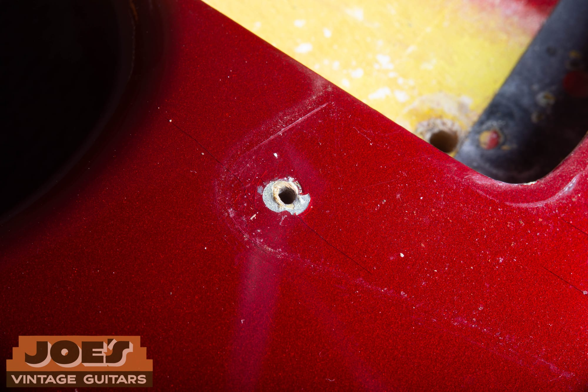

Step 6 in practice: one pickguard screw hole on the 1965 Candy Apple Red Strat, and the whole stack answers at once. Silver ringing the chip, red over it, sealed yellow wood in the route beyond. Ten seconds with a loupe and a flashlight, and the guitar has already survived the test most refinishes fail.

<h2 id="fcc-value">What a Real Custom Color Is Worth</h2>

Original custom color Fenders sit at the top of the vintage market, and the premium scales with the rarity of the color, the model, and the year. Common-but-loved colors like Lake Placid Blue, Candy Apple Red, and Olympic White bring strong premiums over sunburst. The short-lived colors, your Shell Pinks, Burgundy Mists, Foam Greens, and Shorelines, bring the kind of numbers that make authentication worth every minute of this article. Our [Stratocaster value guide](/vintage-fender-stratocaster-value-guide/) and [Telecaster value guide](/vintage-fender-telecaster-value-guide/) break down the model-by-model market.

The other side of the coin: a refinished guitar is worth a fraction of an original one, usually somewhere between a third and two thirds depending on the model, and a fake custom color bought at a real custom color price is the most expensive mistake in this hobby. Factory refins land in between and deserve honest, documented representation.

If you own a custom color Fender and want a straight answer on what it is and what it is worth, send us photos through our [free appraisal](/free-appraisal/) page, including shots under the guard and of any chips if you are comfortable taking things apart, and we will tell you exactly what we see. And if you are thinking about selling, we buy custom color Fenders at the top of the market; the process starts on our [sell my Fender](/sell-my-fender-guitar/) page. Whatever you do, do not "improve" a worn original finish. Every chip in these photos is evidence, and evidence is value.

<h2 id="fcc-faq">Frequently Asked Questions</h2>

**What is a Fender custom color?**

Any factory finish other than the standard finish for the model, which was sunburst for most models and blonde for the Telecaster family. Fender charged about 5% extra for it, and from 1960 on the choices were printed on an official chart of named, mostly automotive, DuPont colors.

**How can I tell which custom color my Fender is?**

Compare a protected area, like the finish under the pickguard or a control plate, against known original examples, and remember that the clear coat ambers with age: Lake Placid Blue shifts green, Olympic White goes cream, and Charcoal Frost drifts gray-green. The undercoat at a chip helps too, since the base color and the year narrow the possibilities.

**Is sunburst under my custom color a sign of a refinish?**

Not by itself. In the mid 1960s Fender regularly pulled sunburst bodies from stock and sprayed custom colors over them, so factory guitars can show sunburst in the neck pocket and under the guard. On bodies from mid-1964 on, that hidden burst should be the opaque target style over a whitish primer. It becomes a refinish tell only when the color sits over wear, damage, or checking, which means it was applied years later.

**Does a missing undercoat mean my Fender is refinished?**

No single missing step condemns a guitar. Fender skipped undercoats and even sealer on some bodies, especially during the rushed 1964 to 1966 CBS transition, and we have handled factory-original examples with color straight over bare wood. Judge the whole guitar: process marks, aging, blacklight, and parts together.

**What is the paint stick shadow in the neck pocket?**

From late 1962, Fender held bodies during spraying with a wooden stick bolted into the neck pocket screw holes. The stick masked the pocket, leaving a bare, sealer-yellow zone with color only feathering in at the edges, often with factory pencil or marker model codes on it. Nail holes from the drying racks continued alongside the stick shadow into late 1964, so a 1963 body should show both marks. Before the stick era, bodies rested on nails alone.

**Do custom color Fenders have matching headstocks?**

The offsets usually do: custom color Jazzmasters, Jaguars, and Jazz Basses from about 1963 on normally came with headstocks painted to match, with the decal applied over the clear coat. Stratocasters and Telecasters almost never did, so a matching headstock on those models needs strong proof, and a missing matching headstock on a mid-sixties custom offset needs an explanation.

**Is a tortoiseshell pickguard wrong on a custom color Fender?**

Usually, yes. Tortoise was standard dress for sunburst and blonde, and the factory line never paired it with a custom color, with one sole exception: Olympic White. On any other custom color, a tortoise guard signals swapped parts or an aftermarket respray until the guitar proves otherwise.

**What does a burned-in serial number on the neck heel mean?**

It means the guitar went back to Fender for factory service, almost always finish work. Workers burned the serial into the neck heel with a soldering iron so the neck and body stayed together through the shop. The result is a factory refinish: factory materials and methods, but not the guitar's original finish, and it should be valued and described that way.

**Should I refinish my worn custom color Fender?**

No. A worn original custom color is worth far more than a freshly refinished one, and every chip and worn edge is part of the proof of originality. Clean it, play it, and leave the finish alone.

