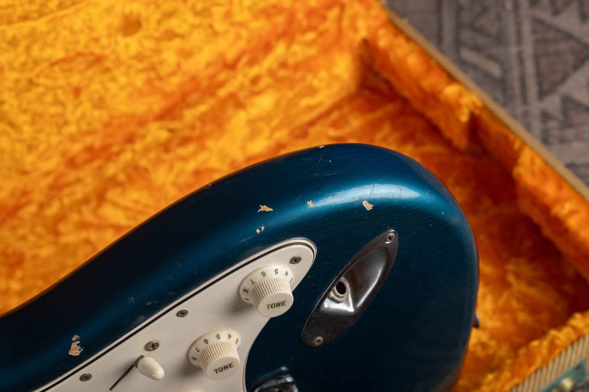

1.  [Why Custom Color Authentication Matters](#fcc-why)
2.  [What Counts as a Fender Custom Color](#fcc-what)
3.  [A Short History of Fender Custom Colors](#fcc-history)
4.  [The Custom Color Charts, Year by Year](#fcc-chart)
5.  [How Fender Built a Custom Color Finish](#fcc-stack)
6.  [Undercoats Through the Years: Desert Sand, White, Gold, and Silver](#fcc-undercoats)
7.  [Custom Color Over Sunburst](#fcc-sunburst)
8.  [Nail Holes and the Paint Stick](#fcc-nails)
9.  [Reading the Neck Pocket](#fcc-pocket)
10.  [What Belongs Under the Pickguard](#fcc-guard)
11.  [Matching Headstocks](#fcc-headstock)
12.  [Pickguards and Plastic on Custom Colors](#fcc-plastics)
13.  [How Custom Colors Age](#fcc-aging)
14.  [The Blacklight Test](#fcc-blacklight)
15.  [Telltale Signs of a Refinish](#fcc-refin)
16.  [Factory Refinishes and the Soldering Iron Mark](#fcc-factory-refin)
17.  [The Full Authentication Checklist](#fcc-checklist)
18.  [What a Real Custom Color Is Worth](#fcc-value)
19.  [Frequently Asked Questions](#fcc-faq)

<h2 id="fcc-why">Why Custom Color Authentication Matters</h2>

Take two 1964 Stratocasters, identical in every way except the paint. The sunburst example is a wonderful vintage guitar. The Fiesta Red example is the same wonderful guitar plus a serious premium, and for the rarest colors that premium can run to multiples of the sunburst price. Nothing else on a vintage Fender moves the number as far as an original custom color.

That kind of money attracts paint. Refinishing a faded sunburst in Lake Placid Blue has been a temptation since the 1970s, and some of those repaints have now been on the guitar for fifty years, aging and checking and wearing convincingly. Add in the honest refinishes done with no intent to deceive, the partial oversprays, and Fender's own factory refinish program, and the population of "custom color" Fenders in the wild is much larger than the number Fullerton actually shipped.

At Joe's Vintage Guitars we authenticate custom color Fenders week in and week out, and the good news is that the factory left fingerprints everywhere. Fender was a production shop, not a boutique. Bodies were stained, sealed, undercoated, sprayed, and handled in specific ways that changed over the years in well-documented steps, and a refinisher has to get every one of those steps right, in the right order, with the right materials, for the right year. Almost nobody does. This guide walks through the whole story: the history and the charts, the undercoat changes, the assembly line marks, how the colors age, and the tells we look for first. Every photo below is a guitar that came through our shop.

One note before we start. Finish authentication is one leg of the stool. Serial numbers, neck dates, pot codes, and hardware all need to agree with the paint, and our [Fender serial number guide](/fender-guitars-serial-number-guide/) covers that side of the equation. Here we are talking about the finish itself.

<h2 id="fcc-what">What Counts as a Fender Custom Color</h2>

In Fender's language, a custom color was any factory finish other than the standard one for that model. For most models the standard finish was sunburst. For the Telecaster and Esquire it was blonde, and for a few budget models it was Desert Sand or sunburst depending on the year. Order anything else and you paid extra for it, typically 5% over list price.

That definition has two consequences people miss. First, blonde is a custom color on everything except the Telecaster family. A blonde Stratocaster (the "Mary Kaye" look), a blonde Jazzmaster, or a blonde Jazz Bass all counted as custom orders and carry custom color premiums today. Second, sunburst is never a custom color, no matter how pretty the burst is.

A 1964 Stratocaster in Fiesta Red, the color that started the custom color craze. Note the correct greenish "mint" nitrate pickguard of the pre-CBS years. Everything on a custom color guitar has to agree: the color, the plastic, the hardware, and the wear all belong to the same era.

The colors themselves were not exotic. Almost every named Fender custom color was pulled straight off an automotive paint chart, mostly DuPont colors mixed for Cadillac, Ford, Chevrolet, Oldsmobile, and Pontiac. Lake Placid Blue was a Cadillac color. Fiesta Red came from the Ford Thunderbird line. Surf Green was a Chevrolet color. Leo Fender ran a lean operation, and buying paint that the local automotive supplier already stocked was exactly his style.

<h2 id="fcc-history">A Short History of Fender Custom Colors</h2>

Custom finishes existed at Fender from the very beginning. Scattered 1950s Telecasters, Esquires, Precision Basses, and Stratocasters survive in black, red, gold, and other one-off colors, sprayed because a player or dealer asked and paid. By 1956 Fender's sales literature formalized the arrangement, offering instruments in custom DuPont Duco finishes for 5% over list.

The late 1950s turned an option into a phenomenon. The story goes that George Fullerton had a local paint store mix the red that became Fiesta Red in 1958 or so, and once players like Hank Marvin of The Shadows appeared with red Strats, demand took off, especially overseas. Through the late fifties, though, there was still no printed menu. You asked for a color and Fullerton's paint department did its best.

The first official custom color chart arrived in 1960: a printed card of fourteen named colors plus blonde, each keyed to a DuPont paint code. From then on the offering was standardized, and the chart itself was revised in documented steps that are extremely useful for authentication:

-   **1960:** the first chart. Fourteen colors plus Blonde, listed in the table below.
-   **1961 to 1962:** Shell Pink quietly disappears, making original Shell Pink instruments extraordinarily rare.
-   **1963:** Candy Apple Red Metallic joins the chart, the first color Fender created rather than borrowed, built from a metallic base coat under translucent red.
-   **1965:** the first CBS-era revision. Most of the softer early-sixties colors disappear around this time (Shoreline Gold, Burgundy Mist, Daphne Blue, Sherwood Green, Surf Green, Foam Green, and Inca Silver) and six new metallics arrive: Blue Ice, Charcoal Frost, Firemist Gold, Firemist Silver, Ocean Turquoise, and Teal Green.
-   **1969 to the early 1970s:** the chart shrinks to a handful of survivors, and by the mid seventies the classic custom color program is effectively over, replaced by thick polyester-era standard finishes.

A 1966 Jazzmaster in Lake Placid Blue. The offset models were custom color billboards in the 1960s, and surf bands ordered them in quantity. Lake Placid Blue stayed on the chart from 1960 into the early 1970s, longer than almost any other color.

Why does the chart history matter? Because a color has to exist in the year the guitar was built. A "1961 Candy Apple Red" Stratocaster is wearing a color Fender did not offer until 1963. A "1967 Burgundy Mist" Jazzmaster is wearing a color that left the chart in 1965. Neither is impossible in the absolute sense, since Fender occasionally sprayed off-menu, but every mismatch between the color and the chart moves the burden of proof steeply against the guitar.

<h2 id="fcc-chart">The Custom Color Charts, Year by Year</h2>

Here is the working reference we use. Years are approximate to the chart revisions, since Fender used up old paint stock and honored odd requests, but they are accurate to within a year in almost every case.

| Color | Type | On the charts | Notes |
| --- | --- | --- | --- |
| Blonde | Translucent solid | 1950s through the 1970s | Standard on Telecaster and Esquire, custom on everything else |
| Black | Solid | 1960 into the 1970s | Rarer in the early sixties than most people expect |
| Olympic White | Solid | 1960 into the 1970s | Ages to cream or butterscotch as the clear coat ambers |
| Fiesta Red | Solid | About 1958 to 1969 | Pre-dates the first chart; the classic export color |
| Dakota Red | Solid | 1960 to 1969 | Deeper and darker than Fiesta |
| Shell Pink | Solid | 1960 to about 1961 | Dropped almost immediately; genuinely rare |
| Daphne Blue | Solid | 1960 to 1965 | Dropped in the 1965 revision |
| Sonic Blue | Solid | 1960 into the early 1970s | Often confused with Daphne; slightly whiter and colder |
| Lake Placid Blue Metallic | Metallic | 1960 to the early 1970s | Borrowed from Cadillac; shifts green as the clear ambers |
| Sherwood Green Metallic | Metallic | 1960 to 1965 | Deep forest metallic |
| Foam Green | Solid | 1960 to 1965 | Softer and greener than Surf |
| Surf Green | Solid | 1960 to 1965 | Chevrolet color; pale mint |
| Burgundy Mist Metallic | Metallic | 1960 to 1965 | Oldsmobile color; a top-tier rarity on any model |
| Shoreline Gold Metallic | Metallic | 1960 to 1965 | Pontiac color; fine metallic gold |
| Inca Silver Metallic | Metallic | 1960 to 1965 | Fine silver metallic |
| Candy Apple Red Metallic | Metallic over base | 1963 to the early 1970s | Fender's own recipe; gold base early, silver base later |
| Blue Ice Metallic | Metallic | 1965 to about 1969 | 1965 addition |
| Charcoal Frost Metallic | Metallic | 1965 to about 1969 | 1965 addition; often misread once the clear ambers |
| Ocean Turquoise Metallic | Metallic | 1965 into the late 1960s | 1965 addition |
| Teal Green Metallic | Metallic | 1965 to about 1969 | 1965 addition |
| Firemist Gold Metallic | Metallic | 1965 to the early 1970s | 1965 addition; Cadillac Firemist paint |
| Firemist Silver Metallic | Metallic | 1965 to the early 1970s | 1965 addition |

As a general rule the solid colors were DuPont Duco nitrocellulose lacquers and the metallics were DuPont Lucite acrylic lacquers, with Fender spraying its own clear nitrocellulose topcoats over either kind. There are exceptions, and paint batches varied, but that split explains a lot of how these finishes wear and check, which we will get to below.

A 1965 Jazzmaster in Charcoal Frost Metallic, one of the six metallics added in the 1965 chart revision. Aged clear coat pushes this color toward a murky gray-green that gets misidentified constantly. If someone offers you a "1962 Charcoal Frost" anything, the chart says otherwise.

<h2 id="fcc-stack">How Fender Built a Custom Color Finish</h2>

To authenticate the finish you need to know how it went on, layer by layer, because every layer is checkable at chips, screw holes, and cavity edges. On a 1960s custom color body the full stack, from the wood up, looks like this:

1.  **The body blank.** Alder for most custom colors, ash for blonde and some early bodies. Ash got a grain filler; alder did not need one.
2.  **Stain and sealer.** Sunburst-bound bodies were stained yellow first. From about 1963, bodies were sealed with Fullerplast, a catalyzed clear sealer that reads as a glassy, pale yellow film wherever you see raw-looking wood in pockets and routes. Before Fullerplast, Fender used simpler lacquer sealer coats.
3.  **Undercoat.** Most custom colors got an opaque undercoat, and the undercoat color changed over the years. This is such a useful tell that it gets its own section below.
4.  **Color coats.** Duco nitro for the solids, Lucite acrylic for the metallics, and for Candy Apple Red a metallic base followed by translucent red.
5.  **Clear coats.** Clear nitrocellulose over everything, including over the metallics and over the headstock decal on matching headstocks. The clear is what ambers with age and shifts the apparent color.

The same 1965 Candy Apple Red Strat from the top of this page with its guard off. Study how a real one looks: the color coats cover the face fully but get thin and dusty inside the routes, the neck pocket goes to yellow where the paint stick sat, and fifty years of dust sits undisturbed in the corners. Nothing here has ever been "cleaned up," and that is exactly the point.

The Charcoal Frost Jazzmaster with its neck off. The pale stripe up the middle of the pocket is the shadow of the factory paint stick, and the glassy yellow surface inside it is Fullerplast sealer over raw alder, complete with factory pencil scribbles. Color creeps in from the edges only. This is the anatomy lesson refinishers fail.

Two big-picture points about this stack. First, Fender sprayed bodies fast and hung them to dry; runs, dust, light orange peel, and lazy coverage in hidden areas are all normal and even reassuring. Second, the stack is a sequence, and the sequence is the fingerprint. Silver showing under red at a chip is a story that makes sense on a 1965 Candy Apple Red guitar. Red sitting directly on bare wood is not.

<h2 id="fcc-undercoats">Undercoats Through the Years: Desert Sand, White, Gold, and Silver</h2>

Ask any longtime dealer where they look first on a custom color Fender and most will say the same thing: find a chip and read the layers. The undercoat under the color is the hardest thing for a refinisher to fake correctly because it changed over the years, it varied by color, and most refinishers do not even know it should be there.

Here is the timeline we work from:

-   **Late 1950s:** the paint department frequently primed custom bodies with whatever suitable opaque paint was on hand, and on many late-fifties Fiesta Red and other custom bodies that meant Desert Sand, the beige stock color of the Musicmaster and Duo-Sonic line. A 1958 to 1960 Fiesta Red guitar chipping to a beige undercoat is textbook.
-   **Early 1960s onward:** white becomes the standard undercoat under most custom colors. Lake Placid Blue, Dakota Red, Fiesta Red, and most of the chart colors of the sixties typically sit on an opaque white base. On light colors like Olympic White, the color coat and undercoat are both white, which produces a wear pattern we cover in the aging section.
-   **Candy Apple Red, 1963 to about 1964:** Fender's recipe called for a metallic base under the translucent red, and the earliest CAR guitars used a **gold** metallic base. Chips on a 1963 or 1964 CAR instrument show warm gold under the red.
-   **Candy Apple Red, about 1965 onward:** the base switches to **silver**, and the red reads slightly cooler and brighter. Chips on a 1965 and later CAR instrument show silver. A "1963" CAR guitar chipping to silver, or a "1966" chipping to gold, has a date problem somewhere.
-   **All eras:** exceptions exist, and they run in both directions. Some bodies got color straight over the sealer with no undercoat at all, especially in the rushed CBS ramp-up of 1964 to 1966. Missing an undercoat is a yellow flag, not a death sentence, and we show a real example below.

Chips on the horn of the 1965 Candy Apple Red Strat break to bright silver, exactly right for a CAR instrument from 1965 on. On a 1963 or 1964 example we would expect gold here instead. One small chip just told us the paint recipe, and the recipe has a date.

A pickguard screw hole on a 1966 Lake Placid Blue Jazzmaster. The chipped rim breaks to clean white, the standard undercoat beneath sixties Lake Placid Blue. Screw holes are the easiest honest window into the stack because the plastic hid them from touch-up brushes.

And here is the counterexample that keeps everyone humble: a 1967 Lake Placid Blue Stratocaster whose chips break to amber sealer, not white. Late sixties production got inconsistent about undercoats, and this guitar is factory original. One layer never decides the case by itself; the whole guitar has to agree.

<h2 id="fcc-sunburst">Custom Color Over Sunburst</h2>

Here is a fact that surprises owners constantly: some factory custom color Fenders have a complete or partial sunburst underneath the color. In the mid sixties especially, when a custom order came in, the factory sometimes pulled a body from regular sunburst stock and sprayed the custom color right over it. Peek under the pickguard of some untouched mid-sixties Candy Apple Red and Lake Placid Blue guitars and you will find sunburst yellow, and even the darker burst shading, hiding at the edges of routes and pockets where the later color did not fully cover.

So sunburst under a custom color is not automatically a refinish, and a refinisher who strips a body "back to original sunburst" may in fact be destroying a factory custom color story. Direction matters, though. Factory work is custom color over sunburst, sprayed before the guitar was assembled, with the same aged clear over everything. Custom color over a WORN sunburst, with color bridging weather checks or filling belt-buckle scars, is paint applied decades after the fact, and the blacklight section below will catch it.

<h2 id="fcc-nails">Nail Holes and the Paint Stick</h2>

Fender had to hold a wet body somehow, and how they held it changed in one well-documented shift that splits the vintage era in two.

**The nail era, 1950 to about 1963.** Freshly sprayed bodies were rested on small finishing nails driven into the face and back so they could dry without touching anything. When the guitar was assembled the nails came out, leaving three or four small bare holes in places the hardware would cover: under the pickguard (commonly near the neck pocket), under the bridge or trem plate, and around the control area. On an original pre-1963 finish, you must find open, unfilled nail holes with finish flowing up to their rims. No nail holes on a fifties or early sixties body means the surface has been sanded and resprayed. It is one of the fastest refin checks there is.

**The paint stick era, about 1963 onward.** The factory switched to bolting a wooden stick into the neck pocket screw holes and holding the body by the stick while spraying. The stick masked the pocket, which is why mid-sixties and later Fenders show the "pocket shadow" we cover in the next section. As with everything Fender, the transition was not a clean line. Bodies with nail holes show up into 1964 and 1965, and our Candy Apple Red Strat below is one of them. A nail hole on a 1965 body is normal. A 1958 body with no nail holes is not.

A factory nail hole hiding under the guard of the 1965 Candy Apple Red Strat, chipped at the rim to show the silver base. Note the route edge at the left of the frame, where the red simply stops and the yellow-sealed wood takes over. Every mark here was made by the factory and then buried under a pickguard for sixty years.

The same guitar's neck pocket at an angle. The floor is sealed yellow wood, the red arrives only as feathered overspray from the edges, and the corners hold their original grime. A refinished pocket looks painted; a factory pocket looks masked, because it was.

<h2 id="fcc-pocket">Reading the Neck Pocket</h2>

Pull the neck on a sixties custom color Fender (carefully, and only if you are comfortable doing so) and the pocket reads like a build sheet. Here is what belongs there:

-   **The stick shadow.** From about 1963 on, a bare or sealer-only zone where the paint stick blocked the color, with overspray feathering in from the sides. The shadow is often a crisp stripe.
-   **Fullerplast yellow.** The bare zone is not raw white wood; it is wood under a glassy, pale yellow sealer film.
-   **Factory markings.** Pencil or marker model codes ("JM" for Jazzmaster below), scribbled numbers, date stamps or pencil dates in various spots through the years. Refinishers sand these away, so their presence is worth a lot.
-   **Shims.** Fender fitted rust-red fiberboard shims at the pocket end of many instruments, offsets especially, to set neck angle. An untouched shim sitting in undisturbed finish is another good sign nobody has been in there with sandpaper.

This is the money shot of custom color authentication: the neck pocket of a 1966 Lake Placid Blue Jazzmaster. The paint stick left a clean yellow stripe of sealed wood, the factory wrote "JM" on it in marker so the body went down the right line, blue overspray creeps in at both edges, and the original red-brown fiber shim is still glued in place at the pocket end. You cannot fake this combination convincingly, and almost nobody tries.

The 1964 Fiesta Red Strat's pocket tells a scrappier story: bare wood with no Fullerplast and no undercoat, just Fiesta Red feathering in from the edges. This guitar left the factory this way. In 1964 and 1965 Fender was shipping guitars as fast as it could build them, and steps got skipped. Knowing which shortcuts the factory actually took, and when, is half the game.

A 1966 Olympic White Jaguar's pocket: stick shadow, factory crayon numbers, a shim, and at the pocket edge you can see the white paint band sitting under clear coat that has ambered to cream everywhere else. Four separate originality tells in one three-inch rectangle.

<h2 id="fcc-guard">What Belongs Under the Pickguard</h2>

The pickguard is a time capsule lid. The factory knew the guard would cover the middle of the body forever, so nobody wasted paint or effort there, and what you find when you lift it should look lazy in very specific ways.

-   **Spray shadows.** Color that is thick and even out where the world could see it, going thin, dusty, or missing entirely in the middle of the guard footprint, with sealed yellow wood showing around the routes.
-   **Factory rough routing.** Fender's routers tore and chattered, and the crumbs and fuzz they left were sprayed over, not cleaned up. Debris locked under paint at route edges is one of the best originality signs on any Fender.
-   **Nail holes** on pre-1963 (and some later) bodies, as covered above.
-   **Undisturbed grime.** Sixty years of dust has a look. A spotless, uniformly glossy surface under a guard is a surface somebody has been improving.

Guard off the 1966 Lake Placid Blue Jazzmaster. Out at the edge, full wet color. Under the guard, the blue goes thin and the yellow sealed body shows through around the routes. The sprayer covered what showed and moved on to the next body, exactly as the line demanded. A refinisher, working on one precious guitar with the guard off, covers everything evenly, and that evenness is the tell.

Same lesson on the 1965 Charcoal Frost Jazzmaster: lift the guard and the "finished" body becomes an honest factory workpiece, with sealed yellow wood everywhere the customer would never look. When a custom color guitar looks this unfinished in the hidden zones, that is authenticity, not damage.

The worm route beside the bridge pickup on the 1965 Candy Apple Red Strat. The factory router tore this channel out and the sprayer painted right over the wreckage, sealing the debris under the color. This is what you want to see. A refinisher sands the routes smooth before spraying, and smooth, clean-edged routes on a "factory" custom color are a serious problem.

<h2 id="fcc-headstock">Matching Headstocks</h2>

Fender's rule of thumb, and ours: on the offset models, a sixties custom color usually came with a matching painted headstock; on Stratocasters and Telecasters it almost never did.

From roughly 1962-63 onward, Jazzmasters, Jaguars, and Jazz Basses in custom colors normally received headstocks painted to match the body, with the decal applied on top of the color and clear nitro sprayed over the decal. The very earliest custom color offsets (and most custom Strats, Teles, and Precisions of any year) kept the plain maple-face headstock. Matching headstocks on Strats and Teles exist, mostly special orders and export instruments, but they are rare enough that each one has to prove itself.

The matching headstock on a 1966 Lake Placid Blue Jaguar, with the gold transition logo sitting on top of the blue and under the clear. The decal order matters: color, then decal, then clear. A decal floating on top of the clear coat, or a headstock color that does not match the body's aging, means the headstock has been redone.

The matching headstock on a 1966 Lake Placid Blue Jazz Bass. Two things to study: the checking runs through color and clear together, and the whole headstock has shifted toward teal exactly as far as the body has. Matching means matching in age, not just in color.

On a matching headstock, check that the face shows the same checking pattern and the same amber shift as the body, that wear at the edges breaks through the same layer stack, and that the logo is the correct style for the year (gold transition logos in the mid sixties, for example). A refinished body with an original matching headstock, or the reverse, will disagree with itself under close light.

<h2 id="fcc-plastics">Pickguards and Plastic on Custom Colors</h2>

Custom color guitars shipped with the standard pickguard for the model and year: greenish mint nitrate three-ply guards on early sixties Strats giving way to white plastic around 1965, white or pearloid guards on the offsets, and so on. The plastic is a supporting witness. If the guard is wrong for the year, or its screw holes do not line up with the body's, or its footprint does not match the spray shadow underneath, the guitar is telling you it has been apart and altered.

Tortoiseshell deserves its own paragraph, because it trips up buyers constantly. Tortoise guards belong on sunburst and blonde instruments. On custom colors they are almost never correct, with one soft exception: they do turn up on genuine custom color guitars now and then, and Olympic White wears the combination more than any other color. We have handled real Olympic White instruments with factory tortoise guards, including the two below. So treat tortoise on a custom color as a question to answer, not a verdict. On some colors, though, the odds are so long that the question usually answers itself, and the refinished Jazz Bass in the refinish section is a perfect example.

A 1965 Olympic White Stratocaster wearing a seldom-seen tortoise guard. The body has ambered to cream, the guard is correct to the period, and the rest of the guitar agrees with both. Tortoise over a custom color should always slow you down, and Olympic White is the color where it most often turns out to be right.

<h2 id="fcc-aging">How Custom Colors Age</h2>

Fender topped its custom colors with clear nitrocellulose, and clear nitro does two things over sixty years: it turns amber and it shrinks. Both are your friends, because both are nearly impossible to fake coherently across a whole instrument.

The amber shift changes the apparent color, and knowing the shifts keeps you from misidentifying a real color or getting talked into a fake one:

-   **Olympic White** goes cream, ivory, or full butterscotch depending on light exposure. Case queens stay whiter; players' guitars go golden.
-   **Lake Placid Blue** shifts green, sometimes far enough to pass for teal or to be mistaken for Sherwood Green or Ocean Turquoise. The bass below is a textbook case.
-   **Sonic Blue and Daphne Blue** pick up a green cast the same way.
-   **Charcoal Frost** drifts toward gray-green and gets misnamed constantly.
-   **Candy Apple Red** deepens and darkens as the clear ambers over the translucent red.
-   **Blonde** ambers from near-white to the honeyed butterscotch everyone associates with fifties Telecasters.

The back of a 1966 Lake Placid Blue Jazz Bass, worn to the wood across half the slab. Look at the borders of the wear: a thin line of white undercoat rims every hole in the color, and the surviving blue has ambered to green-teal. Layer order on full display: wood, then white, then blue, then amber clear, each ring wearing away in sequence.

The back of the 1965 Olympic White Strat teaches the subtlest version of the layer lesson. The exposed top surface has ambered to butterscotch, but where wear cuts through, the paint gets whiter, because the undercoat never saw the sun and never had clear coat over it. White under cream sounds backwards until you understand the stack, and refinishers routinely get it backwards.

Shrinking is the other half. As nitro shrinks it cracks into the fine web collectors call checking, and on a sixties Fender some checking is close to inevitable. On metallic colors, where acrylic color sits under nitro clear, the checking often reads as fine parallel lines you feel with a fingernail more than see head-on.

Checking lines streaming down from the neck plate of the 1965 Candy Apple Red Strat, red-on-red and easy to miss without raking light. Checking should run through the clear and color consistently, in patterns that follow temperature history, and it should never stop at a repaired zone. A sixty-year-old custom color with zero checking anywhere gets the blacklight next.

One more aging tell: protected zones. Finish under the guard, under control plates, and inside cavities saw no sunlight, so original color hides there in its youngest state. The Lake Placid Jazzmaster photos above show it clearly, with brighter blue in the guard footprint. When a seller's "Lake Placid Blue" is the same shade everywhere, including under the plastic, all of it went on at the same time, recently.

<h2 id="fcc-blacklight">The Blacklight Test</h2>

A 365nm ultraviolet lamp in a dark room is the single most useful tool we own for finish work. Old nitrocellulose clear coats fluoresce with a warm, slightly greenish-yellow glow that modern lacquers and touch-up materials do not reproduce. Under UV, an untouched original finish glows evenly across the whole body. Overspray, touch-ups, and full repaints show as dull, dark, or cold patches, and clear coats with modern optical brighteners jump out blue-white.

How we run the test: dark room, lamp at an angle, and work the edges first. Refinishers blend their work into edges, cavities, and the headstock face, and edges are where fresh material meets old. Check around every chip that "should" be there, along the guard line, around the neck plate, and across the face of a matching headstock. Then pull the guard and compare the hidden finish to the exposed finish; they aged differently in visible light but they should still both read as old lacquer under UV.

Two honest limits. First, a fifty-year-old refinish is itself old lacquer now, and it can glow convincingly, which is why the process tells in the sections above matter as much as the lamp. Second, the reverse: a factory finish that got a small period touch-up at the dealer is still a 95% original guitar. The lamp gives you data, not a verdict. Weigh it with everything else.

<h2 id="fcc-refin">Telltale Signs of a Refinish</h2>

Now the rogues' gallery. Most refinished "custom color" Fenders give themselves away with the same handful of mistakes, and every one below came through our shop.

**The color is wrong.** Not wrong as in ugly. Wrong as in it matches nothing Fender offered, or it matches a color from the wrong years. When a blue is too purple for Lake Placid, too dark for Sonic, too even for an aged anything, stop and compare against known originals, not against memory.

A refinished 1960 Stratocaster. Pretty guitar, and the blue is close enough to fool a hopeful eye, but it matches no Fender chart color: too bright for a sixty-year-old Sonic, too pale for Daphne, no metallic for Lake Placid. Under the guard the story ended fast, with no nail holes anywhere on a body that absolutely must have them. Refinished, and priced accordingly when we sold it.

**The texture and edges are wrong.** Fender sprayed thin lacquer on assembled-line fixtures. Refins show orange peel, high gloss in cavities, softened body contours from sanding, and finish piling up around hardware, especially the neck plate, where masking or spraying around the plate leaves a ridge or bulge.

A 1960s Strat refin caught by its neck plate. The finish bulges and ridges around the plate outline because the plate was on the guitar when the paint went on, something the factory never did. The chip at the plate's corner breaks to grey automotive primer, a material Fender never used. Two independent condemnations in one photo.

**The stack is wrong.** No undercoat where one belongs, grey primer, color over bare sanded wood, or color over damage. Combine with parts logic: wrong guard material, wrong era plastic, missing matching headstock on a custom offset.

A 1961 stack-knob Jazz Bass, refinished in black. Count the problems: the wear breaks straight from black to bare wood with no undercoat and no sealer line; a custom color Jazz Bass of this era should almost certainly wear a matching headstock and this one does not; and the tortoise guard on a "custom color" bass is the wrong pairing to begin with. Any one of these invites questions. All three together is an answer.

**The process marks are missing.** This is the deepest tell, because it cannot be faked backwards. Sanding a body for respray erases nail holes, erases pocket shadows, erases pencil marks, and cleans out route debris, and the refinisher then has to not paint the pocket (they always paint the pocket), leave the routes torn (they always smooth them), and reproduce dusty spray shadows under the guard (they never do). When the hidden zones of a "custom color" Fender look tidier than the visible zones, the finish is new. The factory's laziness is your best friend.

<h2 id="fcc-factory-refin">Factory Refinishes and the Soldering Iron Mark</h2>

There is a third category between original and refinished, and it is the trickiest one on the bench: the factory refinish. Fender operated a repair and refinish service for dealers and customers, and a steady stream of guitars went back to Fullerton over the years for new finishes, custom colors included. Those guitars were done by the same paint department, with the same materials, the same undercoats, and the same process marks as new production. A factory refin can pass the stack test, the process test, and the blacklight test, because it is a factory finish. It just is not the guitar's first one.

What gives them away are Fender's own bookkeeping marks. When the factory disassembled a guitar for service work, it needed the neck and body to end up back together, so workers burned the guitar's serial number into the wood with a soldering iron, most famously on the back of the neck heel, sometimes in the body cavities. A serial number branded into the heel means factory work, and in our experience that work was almost always finish work.

The back of the neck heel on a 1956 Stratocaster, with the serial number burned in by a Fender soldering iron. This guitar went back to Fullerton in the late fifties and came home blonde, a custom color on a Stratocaster. The finish is factory in every testable way, and without this mark it may well have passed as all original. With it, the guitar is an honest, documented factory refinish, which is a different guitar at a different price.

How do you catch a factory refin beyond the burn mark? Anachronisms. The finish is factory quality but its details belong to the year of the REFINISH, not the year of the guitar: a 1956 body wearing a paint recipe or undercoat that did not exist until 1959, a color that postdates the neck date, or process marks from the wrong era. Factory refins are honorable guitars with real collector interest, worth more than an aftermarket repaint and less than an untouched original, and they must be represented as exactly what they are.

<h2 id="fcc-checklist">The Full Authentication Checklist</h2>

Here is the sequence we actually run when a custom color Fender hits the bench. You can do most of it with a screwdriver, a flashlight, and patience.

1.  **Date the guitar first.** Serial number, neck date, pot codes. The color must be possible for the build year per the chart above. Our [Fender serial number guide](/fender-guitars-serial-number-guide/) walks through the dating side.
2.  **Identify the color honestly.** Compare protected areas, not exposed ones, against known originals, and account for amber shift before naming the color.
3.  **Find chips and read the stack.** Sealer, undercoat, color, clear, in the right order with the right undercoat for the color and year. Gold under early CAR, silver under later CAR, white under most sixties colors, Desert Sand under late-fifties reds.
4.  **Check the era handling marks.** Nail holes before about 1963; paint stick pocket shadow after. Factory pencil, marker, or stamp markings in the pocket and cavities.
5.  **Pull the guard.** Spray shadows, sealed yellow wood at the routes, debris under paint, undisturbed grime, brighter protected color.
6.  **Judge the headstock.** Matching on custom offsets from about 1963 on, decal under the clear, aging that agrees with the body.
7.  **Check the plastic.** Correct guard material and construction for the year, screw holes that line up, tortoise only where tortoise belongs.
8.  **Read the aging.** Amber shift, checking through all layers, wear that exposes layers in the right order, protected zones younger than exposed ones.
9.  **Blacklight everything.** Even warm fluorescence, no dead patches, edges and headstock especially.
10.  **Look for factory refin marks.** Burned serial numbers on the heel and in cavities, and date-impossible combinations of factory-correct details.
11.  **Weigh the whole guitar.** Single anomalies happen on real guitars, and single correct details happen on fakes. Authentication is the totality, never one test.

Step 3 in practice: one pickguard screw hole on the 1965 Candy Apple Red Strat, and the whole stack answers at once. Silver ringing the chip, red over it, sealed yellow wood in the route beyond. Ten seconds with a flashlight, and the guitar has already survived the test most refinishes fail.

<h2 id="fcc-value">What a Real Custom Color Is Worth</h2>

Original custom color Fenders sit at the top of the vintage market, and the premium scales with the rarity of the color, the model, and the year. Common-but-loved colors like Lake Placid Blue, Candy Apple Red, and Olympic White bring strong premiums over sunburst. The short-lived colors, your Shell Pinks, Burgundy Mists, Foam Greens, and Shorelines, bring the kind of numbers that make authentication worth every minute of this article. Our [Stratocaster value guide](/vintage-fender-stratocaster-value-guide/) and [Telecaster value guide](/vintage-fender-telecaster-value-guide/) break down the model-by-model market.

The other side of the coin: a refinished guitar is worth a fraction of an original one, usually somewhere between a third and two thirds depending on the model, and a fake custom color bought at a real custom color price is the most expensive mistake in this hobby. Factory refins land in between and deserve honest, documented representation.

If you own a custom color Fender and want a straight answer on what it is and what it is worth, send us photos through our [free appraisal](/free-appraisal/) page, including shots under the guard and of any chips if you are comfortable taking things apart, and we will tell you exactly what we see. And if you are thinking about selling, we buy custom color Fenders at the top of the market; the process starts on our [sell my Fender](/sell-my-fender-guitar/) page. Whatever you do, do not "improve" a worn original finish. Every chip in these photos is evidence, and evidence is value.

<h2 id="fcc-faq">Frequently Asked Questions</h2>

**What is a Fender custom color?**

Any factory finish other than the standard finish for the model, which was sunburst for most models and blonde for the Telecaster family. Fender charged about 5% extra for it, and from 1960 on the choices were printed on an official chart of named, mostly automotive, DuPont colors.

**How can I tell which custom color my Fender is?**

Compare a protected area, like the finish under the pickguard or a control plate, against known original examples, and remember that the clear coat ambers with age: Lake Placid Blue shifts green, Olympic White goes cream, and Charcoal Frost drifts gray-green. The undercoat at a chip helps too, since the base color and the year narrow the possibilities.

**Is sunburst under my custom color a sign of a refinish?**

Not by itself. In the mid 1960s Fender regularly pulled sunburst bodies from stock and sprayed custom colors over them, so factory guitars can show sunburst in the neck pocket and under the guard. It becomes a refinish tell only when the color sits over wear, damage, or checking, which means it was applied years later.

**Does a missing undercoat mean my Fender is refinished?**

No single missing step condemns a guitar. Fender skipped undercoats and even sealer on some bodies, especially during the rushed 1964 to 1966 CBS transition, and we have handled factory-original examples with color straight over bare wood. Judge the whole guitar: process marks, aging, blacklight, and parts together.

**What is the paint stick shadow in the neck pocket?**

From about 1963, Fender held bodies during spraying with a wooden stick bolted into the neck pocket screw holes. The stick masked the pocket, leaving a bare, sealer-yellow zone with color only feathering in at the edges, often with factory pencil or marker model codes on it. Before the stick era, bodies rested on nails instead, which left small nail holes under the pickguard and bridge.

**Do custom color Fenders have matching headstocks?**

The offsets usually do: custom color Jazzmasters, Jaguars, and Jazz Basses from about 1963 on normally came with headstocks painted to match, decal under the clear coat. Stratocasters and Telecasters almost never did, so a matching headstock on those models needs strong proof, and a missing matching headstock on a mid-sixties custom offset needs an explanation.

**Is a tortoiseshell pickguard wrong on a custom color Fender?**

Usually. Tortoise belongs with sunburst and blonde, and on most custom colors it signals swapped parts or a refinished body. The soft exception is Olympic White, where factory tortoise pairings genuinely exist. Treat tortoise on a custom color as a reason to look closer, not an automatic verdict.

**What does a burned-in serial number on the neck heel mean?**

It means the guitar went back to Fender for factory service, almost always finish work. Workers burned the serial into the neck heel with a soldering iron so the neck and body stayed together through the shop. The result is a factory refinish: factory materials and methods, but not the guitar's original finish, and it should be valued and described that way.

**Should I refinish my worn custom color Fender?**

No. A worn original custom color is worth far more than a freshly refinished one, and every chip and worn edge is part of the proof of originality. Clean it, play it, and leave the finish alone.

