Evolution & Reference Guide · Fender Offset · 1958 to 1971

Every specification change documented year by year: gold guard to tort, slab to veneer, clay to pearl to blocks, spaghetti to transition logo, Klusons to F-tuners, and the custom color and pickguard reference

<nav class="post-toc-inline" aria-label="Table of contents">

-   [Introduction & Context](#intro)
-   [Body, Finish & Controls](#body)
-   [Neck, Fingerboard & Inlays](#neck)
-   [Pickguards: The Full Story](#pickguard)
-   [Custom Colors & Pickguard Pairing](#customcolors)
-   [Pickups & Electronics](#pickups)
-   [Bridge, Tremolo & Hardware](#bridge)
-   [Logos, Tuners & Knobs](#logos)
-   [Serial Numbers & Dating](#serial)

</nav>

<h2 id="intro">Introduction & Context</h2>

The Fender Jazzmaster debuted in late 1958 as the most expensive and feature-rich guitar in the Fender lineup, a deliberate attempt by Leo Fender to capture the jazz market with a guitar that felt different from the Telecaster and Stratocaster in every meaningful way. It was the first Fender production guitar with a rosewood fingerboard, the first with an offset-waist body, and the first with the elaborate dual-circuit rhythm/lead switching system that remains one of the most distinctive electronics setups in electric guitar history.

Jazz guitarists largely ignored it, preferring Gibson hollowbodies. But the Jazzmaster found an enthusiastic audience among surf musicians in the early 1960s, who prized its floating tremolo and bright, resonant tone. By the mid-1960s it had become a fixture on California stages, and decades later it would be adopted by indie, shoegaze, and alternative players who valued its tonal complexity and unconventional feel.

This guide documents every specification change the Jazzmaster underwent between its 1958 introduction and 1971, covering the full pre-CBS golden era and the early CBS period. Understanding these changes precisely is essential for accurate dating, authentication, and valuation.

**Pre-CBS (1958 to early 1965):** Built under Leo Fender's ownership at the Fullerton, California factory. Generally considered the most desirable and collectible production period. Guitars from this era command significant premiums over later examples.

**CBS Era (January 1965 to 1971):** CBS Corporation acquired Fender on January 5, 1965. Changes began immediately but were gradual. The first truly CBS-influenced guitars didn't appear until mid-to-late 1965. By 1967 to 1968 the character of the instrument had shifted substantially.

<h2 id="body">Body, Finish & Controls</h2>

### Body Construction

The Jazzmaster body is **alder** throughout the production run, the same tonewood used on the Stratocaster from 1956 onward. The offset-waist design is the Jazzmaster's most distinctive visual feature: the upper and lower bouts are offset from each other rather than symmetrical, creating a body that balances differently when playing seated compared to a Strat or Tele. The body has a single forearm contour cut on the upper bass side, less pronounced than the Stratocaster's double contour.

Body dimensions remained essentially constant throughout 1958 to 1971. The body is slightly larger and heavier than a Stratocaster.

### Standard Finish

The standard production finish throughout the entire run was **3-color sunburst**, yellow center transitioning to orange then dark brown/black at the edges. The sunburst always received a white pickguard (see Section 04). Custom colors were available at an additional charge of 5% over list price; these are covered in detail in Section 05.

The finish medium was **nitrocellulose lacquer** throughout the pre-CBS era. CBS-era guitars transitioned to **polyester finish** starting approximately 1967 to 1968. Poly finishes are thicker, more resistant to checking, and have a distinctly different aging character than nitro, a meaningful dating and authenticity indicator.

### The Dual-Circuit Control System

The Jazzmaster's electronics are its most complex feature, and the one most likely to be misunderstood or partially non-functional on older examples. The guitar has two entirely separate circuits operated by a single slide switch on the upper horn.

-   Rhythm circuitActivated by pushing the upper-horn slide switch toward the neck. Engages **only the neck pickup** and bypasses all lower-bout controls entirely. The rhythm circuit has its own volume and tone roller wheels on the upper bout, preset to a warm, dark "jazz" tone. Designed to allow a guitarist to set a rhythm tone independently and flip back to it instantly.
-   Lead circuitThe standard playing position with the slide switch pushed away from the neck. Uses the **lower bout controls**, master volume and tone knobs, and a **3-way toggle** selecting bridge pickup, both pickups, or neck pickup.
-   Output jackAn angled jack on the lower bout with a distinctive **oval chrome jack plate**, unique to the Jazzmaster and Jaguar. The angled position makes cable routing more natural when playing seated.

<figure>

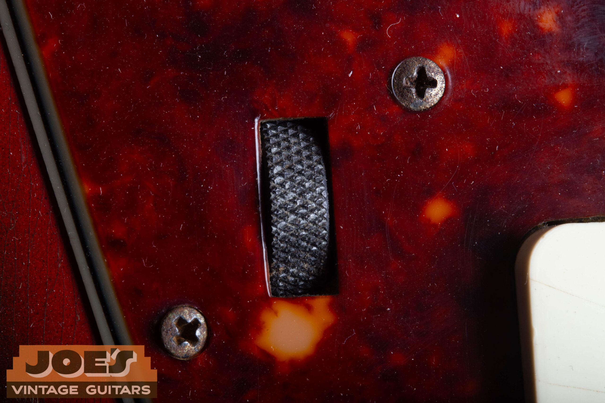

<figcaption><strong>Rhythm circuit volume roller knob on a Fender Jazzmaster.</strong> The chrome-edged roller wheel design for the rhythm circuit tone and volume controls remained unchanged throughout the entire 1958 to 1971 production run, one of the few specifications that never changed. The rollers allow the player to preset a rhythm tone and volume without looking down, flipping back to it instantly by engaging the upper-bout slide switch.</figcaption>

</figure>

-   PotsLead circuit uses **1MΩ potentiometers**, unusually high value, contributing to the Jazzmaster's bright, open tonal character in lead mode. Rhythm circuit uses 50kΩ or 1MΩ pots depending on year.
-   Shielding The pickup and electronics cavities are lined with **aluminum shielding**, an extension of the gold anodized pickguard's original shielding function. This shielding remained after the pickguard material changed. It is part of the hum-reduction system along with the reverse-wound/reverse-polarity pickup configuration.

### Knob Evolution

-   1958 to mid 1965**Stratocaster-style knobs**, the standard white dome knobs used across the Fender line, with a flat top and chrome-tipped set screw. Used on the lead circuit volume and tone controls.
-   Mid 1965 onward**"Witch hat" knobs**, a distinctive Jazzmaster-specific knob style: white plastic with a chrome domed top, taller and thinner than the Strat-style dome knob. Introduced mid-1965 and immediately identifiable as a CBS-era indicator. The name comes from their silhouette resemblance to a witch's hat.
-   Rhythm rollersThe tone and volume roller wheels on the upper bout remained **consistent throughout production**, a chrome-edged roller design unchanged from 1958 to 1971.

<figure>

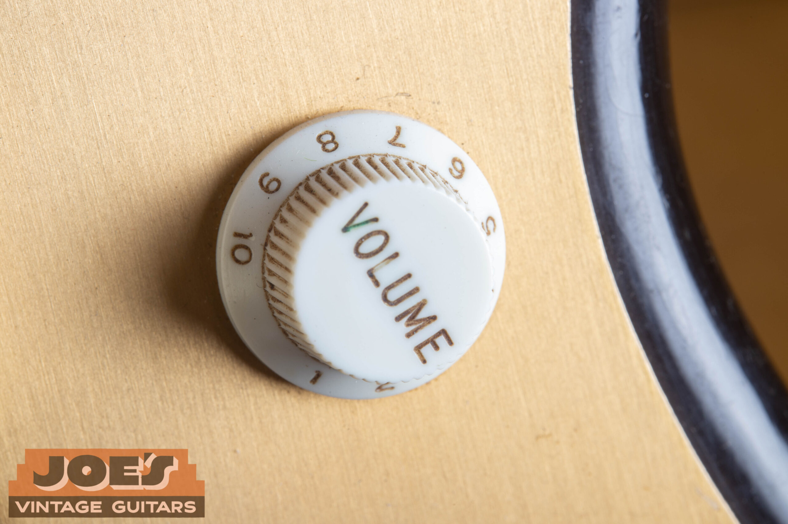

<figcaption><strong>Strat-style skirted dome knob (1958 to mid 1965).</strong> The white dome knob with flat top and set screw was the original Jazzmaster lead circuit knob, shared with the Stratocaster and Telecaster of the era. Present on all pre-CBS Jazzmasters and early CBS examples through mid-1965.</figcaption>

</figure>

<figure>

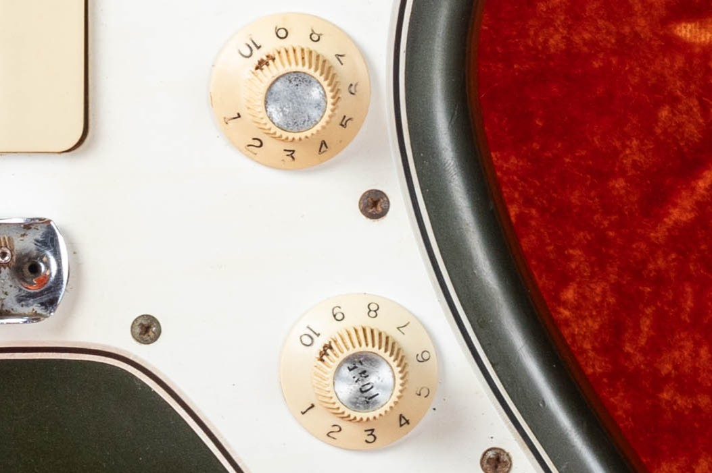

<figcaption><strong>Witch hat knobs (mid 1965 to 1971).</strong> Taller, narrower white plastic with a chrome domed top, a Jazzmaster-specific design introduced mid-1965. Their arrival is one of the clearest CBS-era markers on the instrument. Any Jazzmaster with witch hat knobs was built after mid-1965.</figcaption>

</figure>

<h2 id="neck">Neck, Fingerboard & Inlays</h2>

### A Historic First: The Jazzmaster and the Rosewood Fingerboard

The Jazzmaster holds a significant place in Fender history: it was the **first Fender production guitar to feature a rosewood fingerboard**, introduced in 1958. The Telecaster and Stratocaster followed with rosewood options in 1959. This makes a 1958 Jazzmaster the earliest rosewood-necked Fender you can buy, which matters to a lot of collectors.

### Slab vs. Veneer Rosewood, The Most Important Dating Point

The single most significant neck specification change in the Jazzmaster's history is the transition from slab to veneer rosewood fingerboard. This is the first thing any knowledgeable buyer checks, and it divides the pre-CBS era into two clearly defined periods.

-   Slab board  
    1958 to early 1962A **thick, flat-bottomed rosewood slab** approximately 4.8mm deep, glued onto a flat-milled maple neck. The flat bottom is the defining characteristic, visible at the headstock end where the rosewood meets the nut. Brazilian rosewood typically used. Commands a significant premium over veneer examples. The Jazzmaster was the *first* Fender to get the slab board and, notably, also the *first to transition away from it*.
-   Veneer board  
    Spring 1962 onwardA **thin curved veneer (~2mm)** whose underside follows the radius of the neck, requiring a curved top on the neck blank. The Jazzmaster was the first Fender model to make this switch, beginning in approximately spring 1962, ahead of the Stratocaster and Telecaster transitions. Veneer boards continued through end of production.

The Jazzmaster switched to veneer rosewood in spring 1962, several months before the Stratocaster (mid-1962) and the Telecaster (1959 had already moved to slab; veneer came later). This makes the Jazzmaster's fingerboard transition an important reference point for understanding the overall Fender production timeline.

### Fingerboard Inlay Evolution

The Jazzmaster went through three distinct inlay periods between 1958 and 1971, each with a specific character that serves as an immediate dating indicator:

-   Clay dots  
    1958 to late 1964A light brown, chalky dot with a dull, non-reflective matte surface. "Clay" is collector terminology. The material is actually a composite, not actual clay, but the warm brown color and complete absence of shine is distinctive and unmistakable. Clay dots are **the defining feature of the most collectible pre-CBS Jazzmasters**.
-   Pearl dots  
    Late 1964 to mid 1966Faux pearloid plastic dots, brighter, whiter, and reflective compared to clay. The transition happened late 1964, making this a "transition era" specification. These appeared alongside the transition logo and are associated with the late pre-CBS period.
-   Block inlays  
    Mid 1966 onwardLarge rectangular pearloid block inlays replaced the dots in approximately mid-1966, alongside the introduction of neck binding. Block inlays continued through the end of the 1971 production run. This is the **standard CBS-era Jazzmaster neck appearance**.

<figure>

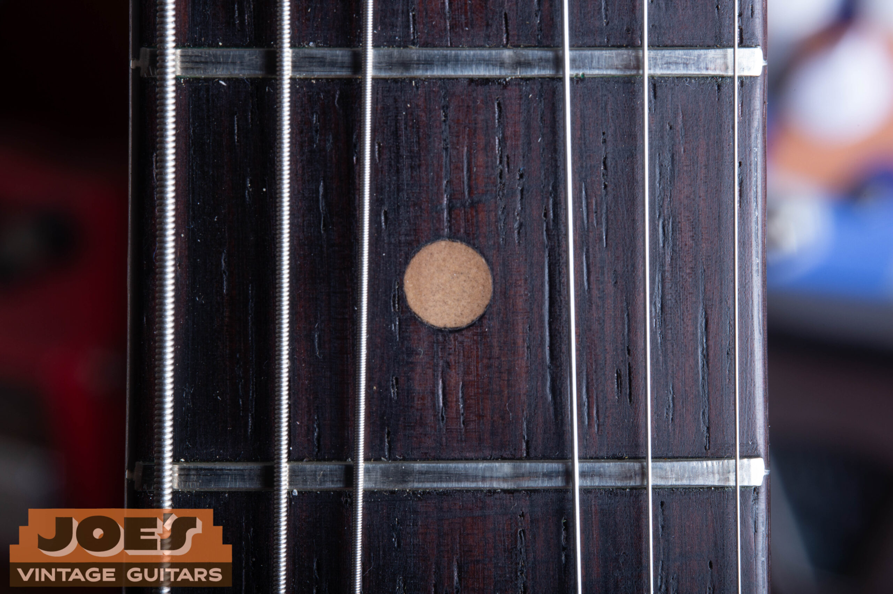

<figcaption><strong>Clay dot (1958 to late 1964).</strong> Dull, light brown, completely non-reflective. The absence of any sheen is the key identifier. Present on all pre-CBS Jazzmasters through late 1964.</figcaption>

</figure>

<figure>

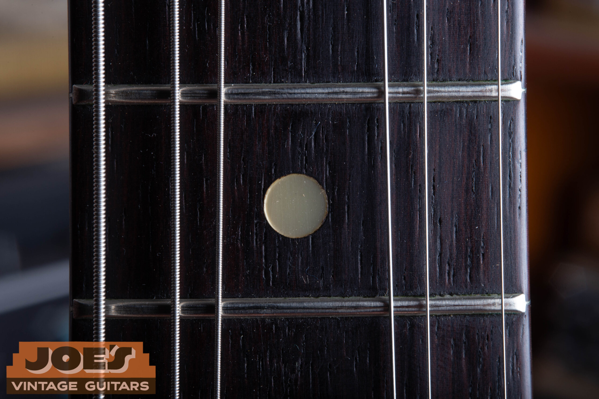

<figcaption><strong>Pearloid dot (late 1964 to mid 1966).</strong> Bright, white, and reflective, a clear contrast to the clay dot. Transition-era specification bridging the pre-CBS and CBS periods.</figcaption>

</figure>

<figure>

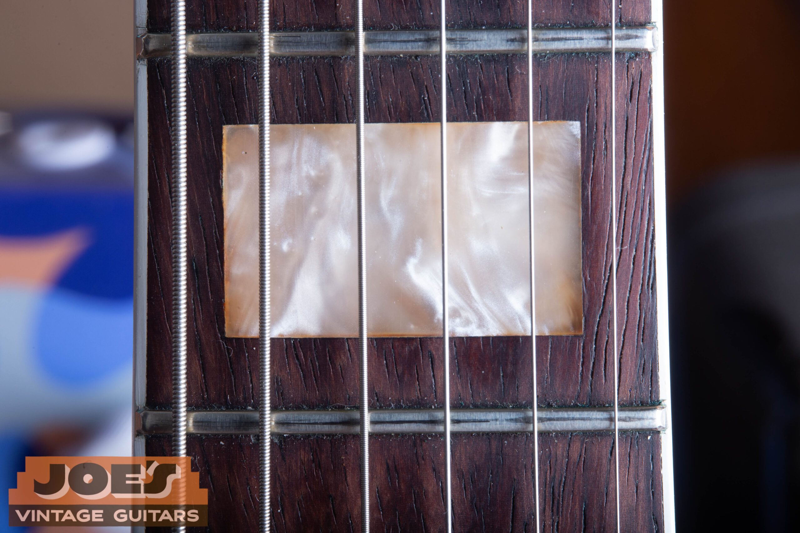

<figcaption><strong>Block inlay (mid 1966 to 1971).</strong> Large rectangular pearloid blocks on a bound fingerboard. The standard CBS-era Jazzmaster neck appearance. Any Jazzmaster with block inlays is a post-mid-1966 instrument.</figcaption>

</figure>

### Neck Binding

Neck binding, a white plastic binding strip applied to the fingerboard edges, was introduced on the Jazzmaster in **late 1965**, coinciding with the early CBS-era changes. The bound neck with pearloid dots lasted only briefly before block inlays arrived in mid-1966. All bound-neck Jazzmasters are CBS-era instruments. An unbound neck is correct for all pre-CBS examples and for CBS-era guitars through late 1965.

### Truss Rod Access

Throughout the entire 1958 to 1971 production run, the Jazzmaster truss rod adjusts at the **body end of the neck (the heel)**, not at the headstock. This requires removing the neck to access the adjustment nut. Headstock truss rod access did not appear on Fender instruments until 1971. Any claimed pre-1971 Jazzmaster with headstock truss rod access has a non-original neck.

### Neck Dating

Necks are dated directly on the wood at the heel. The method changed over the production run:

-   1958 to 1962**Pencil-written** month and year at the heel butt, handwritten by the neck builder. Format: "2-59" for February 1959. Note: many mid-1959 to 1960 necks have no date at all.
-   Mid 1962 onward**Rubber-stamped code** with more information. Format: "4JAN63B" where 4 = Jazzmaster model number, JAN = January, 63 = 1963, B = standard nut width (1-5/8").

<h2 id="pickguard">Pickguards: The Full Story</h2>

The Jazzmaster pickguard is one of the guitar's most visually distinctive and historically interesting features. Its large size, covering most of the body top, integrates the rhythm circuit controls as part of an aluminum-shielded upper plate, making it unlike any other Fender pickguard. The material and style changed three times between 1958 and 1971.

### Era 1: Gold Anodized Aluminum (1958 to Mid 1959)

The first Jazzmasters carried a **gold anodized aluminum pickguard**, a continuation of the material Fender had used on student-model Musicmaster and Duo-Sonic guitars since 1956. The gold aluminum served a functional purpose beyond aesthetics: it provided significant electromagnetic shielding for the wide, hum-sensitive Jazzmaster pickups. The aluminum pickguard is secured by **nine screws**.

Guitars with the original gold anodized guard are known among collectors as **"gold guard" Jazzmasters** and are the rarest and most valuable examples. The gold guard era lasted approximately from the last quarter of 1958 through mid-1959, roughly six to nine months of production. Gold guard Jazzmasters are found primarily in sunburst finish; some early custom colors may also have gold guards.

<figure>

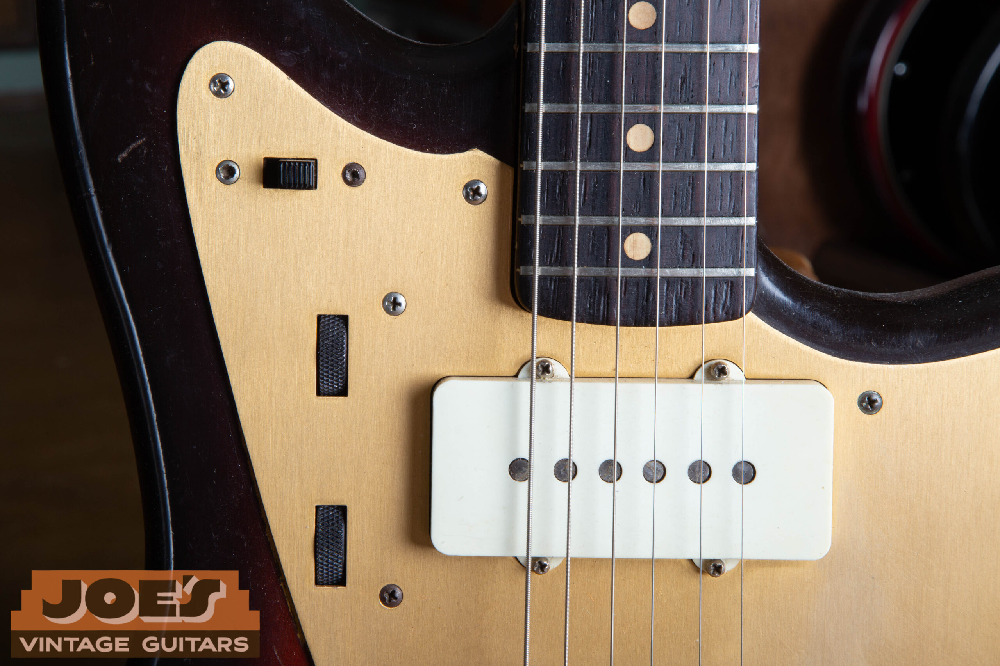

<figcaption><strong>Gold anodized aluminum pickguard on a 1959 Fender Jazzmaster.</strong> The gold guard era lasted only from late 1958 through mid-1959, roughly six to nine months of production. The aluminum served as electromagnetic shielding for the wide, hum-sensitive Jazzmaster pickups. Note the 9-screw attachment pattern, which changed to 13 screws when the celluloid tortoiseshell guard replaced it. Gold guard Jazzmasters are the rarest and most valuable examples of the model.</figcaption>

</figure>

<figure>

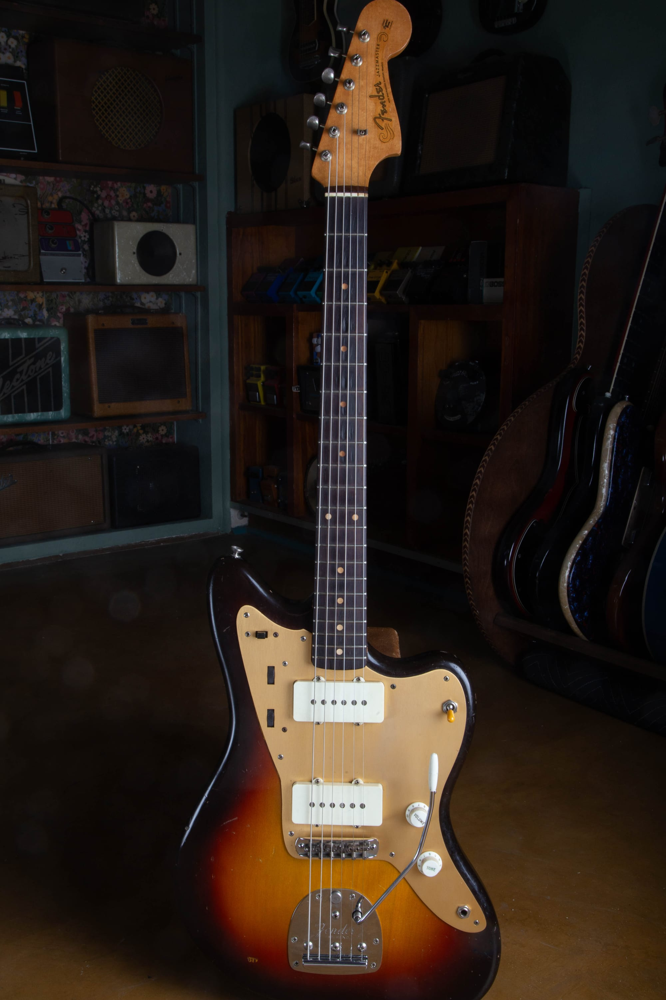

<figcaption><strong>A complete, original 1959 gold guard Jazzmaster.</strong> The full guitar shows the gold anodized aluminum guard against 3-color sunburst, with clay dot inlays, an amber switch tip, and a spaghetti logo, all correct for a first-year example. The gold guard shipped for only about six to nine months, from late 1958 through mid-1959, so an all-original example like this is the rarest and most collectible version of the model.</figcaption>

</figure>

<figure>

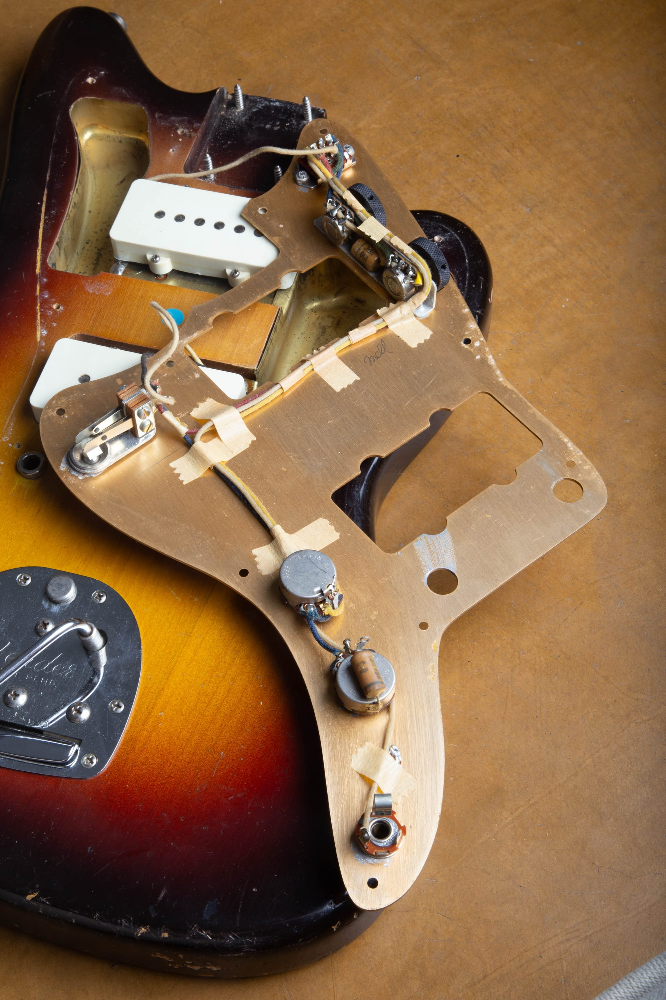

<figcaption><strong>The gold guard lifted away from the body.</strong> The gold anodized aluminum was functional, not just decorative: the full plate acts as electromagnetic shielding for the wide, hum-sensitive Jazzmaster pickups, working alongside the reverse-wound, reverse-polarity pickup pair. The rhythm-circuit roller wheels, slide switch, pots, and tone cap all mount to the guard, and the cloth-covered wiring and gold-sprayed control cavity are correct for the era.</figcaption>

</figure>

Because gold guard Jazzmasters command substantial premiums, replacement gold anodized guards (available from parts suppliers) are sometimes fitted to later guitars. Verify the guard with the neck heel date, pot codes, and body date. All must be consistent with 1958 to early 1959 production for a genuine gold guard example.

<figure>

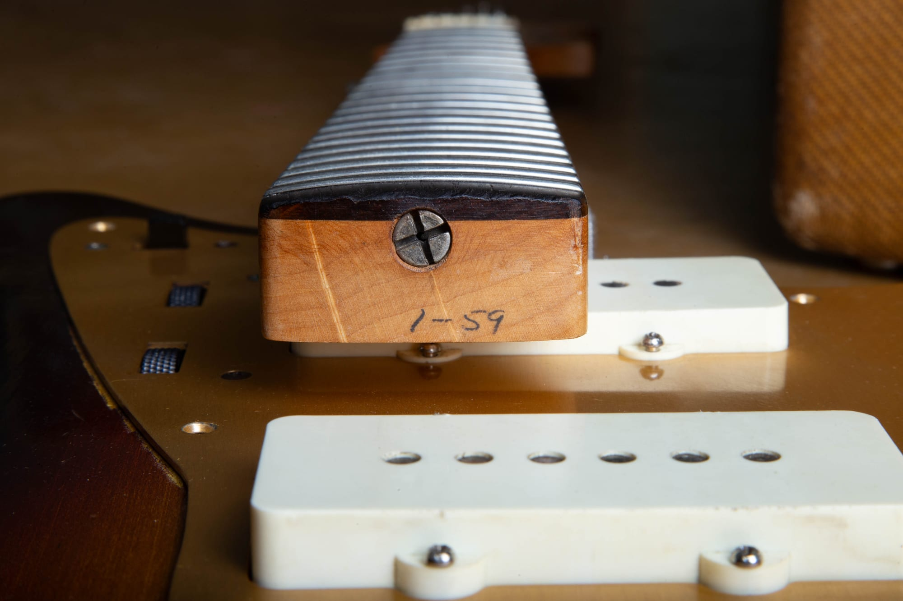

<figcaption><strong>The neck date that confirms the guard: a penciled "1-59."</strong> The neck butt end on this guitar is penciled "1-59," January 1959, exactly the window when the gold guard was still in production. This is the cross-check that matters: a genuine gold guard example should carry a neck heel date, body cavity date, and pot codes that all line up with late 1958 to early 1959. The body-end truss rod nut, visible here, is correct for the entire 1958 to 1971 run.</figcaption>

</figure>

### Era 2: Celluloid Tortoiseshell (Mid 1959 to Late 1964)

In mid-to-late 1959, Fender replaced the gold anodized guard with a **4-layer celluloid tortoiseshell pickguard**, tortoiseshell on top, then white, black, and white. This is the classic Jazzmaster look most associated with the 1960s surf era. The tortoiseshell celluloid was also used on the Precision Bass in 1959.

<figure>

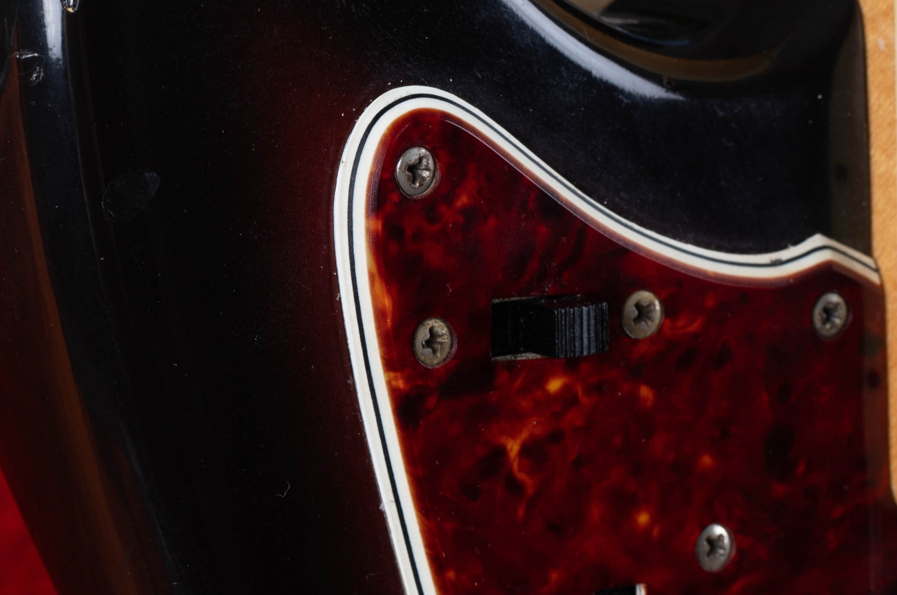

<figcaption><strong>Multi-ply tortoiseshell pickguard edge detail on a Fender Jazzmaster.</strong> The 4-layer construction is clearly visible at the cut edge: tortoiseshell on top, then white, black, and white. This layered construction is present on celluloid (mid 1959 to late 1964) and plastic (late 1964 to 1971) versions. The material can be identified by the celluloid's tendency to warp and shrink versus the plastic's dimensional stability.</figcaption>

</figure>

Celluloid is notorious for its instability: it shrinks, warps, and can become brittle over 60+ years. Original celluloid guards are frequently cracked, warped, or have shrunk noticeably. This is period-authentic behavior, not a quality flaw. The guard changed from **nine screws** (gold guard era) to **thirteen screws** from 1959 onward, as Fender added screws to combat the celluloid's tendency to warp.

An important exception: **custom color guitars** received white celluloid pickguards (not tortoiseshell) when the tortoiseshell era began. See Section 05 for the full custom color / pickguard pairing reference.

### Era 3: Plastic Tortoiseshell (Late 1964 to 1971)

Around late 1964, Fender switched from celluloid to a more stable **plastic (ABS or vinyl) tortoiseshell pickguard**. The material change was practical. Celluloid was fire-hazardous during manufacturing and temperamental in use. The plastic guard maintains the same visual appearance but does not warp and shrink the way celluloid does.

Collectors generally consider the plastic guard less visually attractive than the celluloid; the tortoiseshell pattern is often more uniform and less rich-looking. The transition from celluloid to plastic is a late pre-CBS / transition-era specification marker. The tortoiseshell pattern also changed slightly in the late 1960s, becoming more brown-red with black swirls and fewer white chunks compared to the earlier red-dominant celluloid pattern.

### Pickguard Material Summary

| Period | Material | Screws | Sunburst | Custom Colors |
| --- | --- | --- | --- | --- |
| **1958 to mid 1959** | Gold anodized aluminum | 9 | Gold guard | Gold guard (early) |
| **Mid 1959 to late 1961** | Celluloid tortoiseshell (4-ply) | 13 | Tortoiseshell | White celluloid |
| **Late 1961 to late 1964** | Celluloid tortoiseshell (4-ply) | 13 | Tortoiseshell | White celluloid (mint green aging) |
| **Late 1964 to 1971** | Plastic tortoiseshell (3-ply) | 13 | Tortoiseshell | White plastic |

<h2 id="customcolors">Custom Colors & Pickguard Pairing</h2>

Custom colors were available on the Jazzmaster from its introduction, at a 5% premium over the standard list price. The lineup expanded and contracted over the years, and the correct pickguard for a given color changed depending on production period. This section provides a complete reference.

### The Pickguard Rule for Custom Colors

The key rule: **sunburst Jazzmasters always received the tortoiseshell (or gold aluminum) guard; custom color Jazzmasters generally received a white guard**, but this has nuance by era.

-   1958 to mid 1959All Jazzmasters (sunburst and custom color) shipped with **gold anodized aluminum** pickguards. This is the one era where custom colors also had gold guards.
-   Mid 1959 to late 1961Sunburst received **tortoiseshell celluloid**. Custom colors received **white celluloid**. Note: non-matching headstocks on custom colors were standard until approximately spring 1962.
-   Spring 1962 onwardSame as above, sunburst with tortoiseshell, custom colors with white, but custom colors now had **matching painted headstocks** as standard. White guards on custom colors will show the characteristic mint-green aging of celluloid over time.
-   Late 1964 to 1971Sunburst with plastic tortoiseshell. Custom colors with **white plastic** guard (does not age to mint green the way celluloid does).

### Matching Headstocks

Custom color Jazzmasters available with a headstock painted to match the body, a significant value premium that collectors call a **matching headstock**. On Jazzmasters, **all custom colors except Blonde received matching painted headstocks**, Blonde guitars retained a natural maple headstock. Non-matching headstocks on non-blonde custom colors were standard only through approximately spring 1962; from spring 1962 onward matching headstocks are correct for all non-blonde custom colors. Always verify that a claimed matching headstock shows the same aging and lacquer character as the body finish, a fresh-looking headstock on an otherwise aged body is a red flag.

### Custom Color Reference

The following colors were available on the Jazzmaster at various points during 1958 to 1971. Availability varied by year; not all colors were offered throughout the entire run. Colors marked with (M) indicate matching headstock was standard; colors without (M) had non-matching natural maple headstocks on most examples.

<figure>

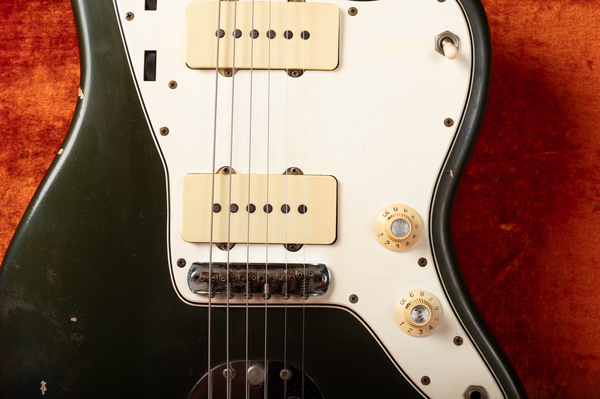

<figcaption><strong>Charcoal Frost Metallic Jazzmaster with original white pickguard.</strong> Custom color Jazzmasters received white guards, not tortoiseshell. The white celluloid guard ages to a characteristic mint green over time on pre-CBS examples. This metallic custom color also shows the matching painted headstock that was standard on all custom colors except Blonde from approximately spring 1962 onward.</figcaption>

</figure>

<figure>

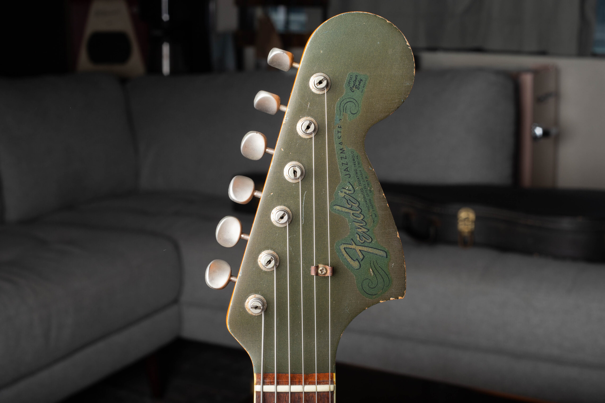

<figcaption><strong>Matching headstock on a custom color Fender Jazzmaster.</strong> All custom colors except Blonde received headstocks painted to match the body. This matching headstock is a factory original specification, not a modification, and adds significant value. Non-matching headstocks on non-blonde custom colors indicate either a very early (pre-spring 1962) example or a refinished/replaced headstock.</figcaption>

</figure>

When custom color Jazzmasters were painted at the Fullerton factory, the body was hung on a **paint stick inserted into the neck pocket** during spraying. The stick masked a small area of the neck pocket floor, leaving a shadow of bare wood or lighter finish where the stick blocked the paint. This **"paint stick shadow"** in the neck pocket is a period-authentic detail found on genuine factory custom color guitars, particularly from approximately late 1962 onward. Its presence in the neck pocket, showing the characteristic shape of the stick under the finish, is a positive authentication indicator for custom colors.

<figure>

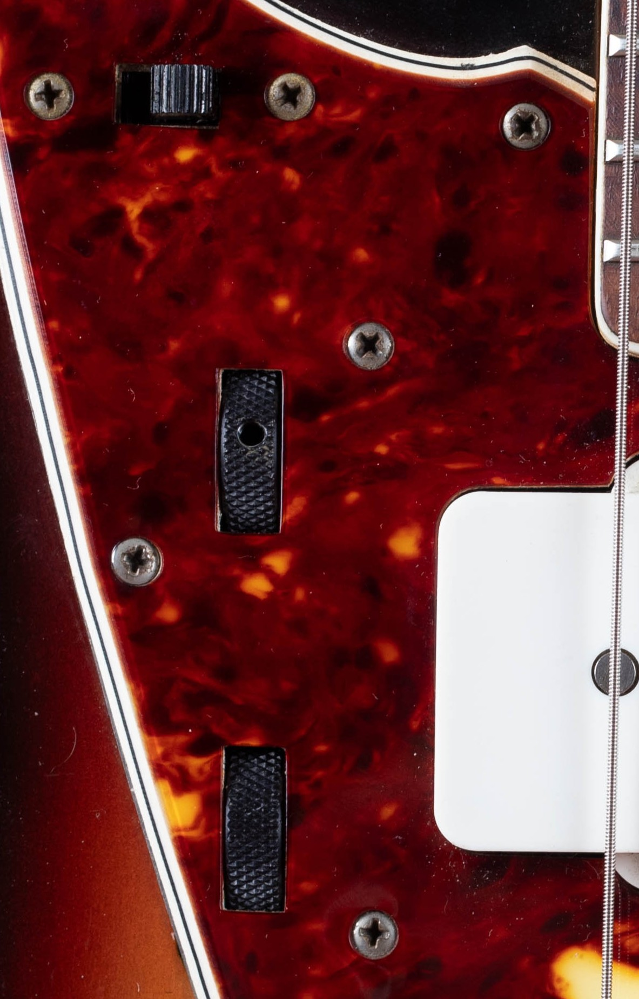

<figcaption><strong>Rhythm circuit controls on a Fender Jazzmaster.</strong> The upper-bout chrome plate houses the rhythm circuit: a slide switch to engage it, and two roller wheels for independent tone and volume preset. When the slide switch is engaged, the lower-bout controls are bypassed entirely and only the neck pickup plays through the rhythm preset. The roller wheel design remained unchanged throughout the entire 1958 to 1971 production run.</figcaption>

</figure>

Many Fender custom colors fade dramatically with age. Sonic Blue, Seafoam Green, and Surf Green are among the most extreme faders. A heavily played example may look almost white or pale gray today. Daphne Blue fades toward a chalky gray-blue. Lake Placid Blue is more stable but can shift. When evaluating a faded guitar, UV light examination and checking unfaded areas under the pickguard or at the neck pocket help assess the original color and confirm the finish is original.

<h2 id="pickups">Pickups & Electronics</h2>

### The Jazzmaster Pickup, Design & Concept

The Jazzmaster pickup is entirely unlike any other Fender pickup. Rather than a tall, narrow coil (Stratocaster) or a compact rectangular unit (Telecaster), the Jazzmaster pickup is a **wide, flat, low-inductance single coil** with a large aperture that senses the vibrating string over a wider zone. This design produces a warmer, rounder tone with more midrange presence and less high-frequency edge than a Stratocaster pickup, closer to a humbucker in some ways despite being a single coil.

The two pickups are **reverse-wound and reverse-polarity** relative to each other (RWRP), meaning that when both are engaged in the lead circuit's middle position, they achieve partial hum-cancellation, a feature Fender marketed prominently in 1958.

<figure>

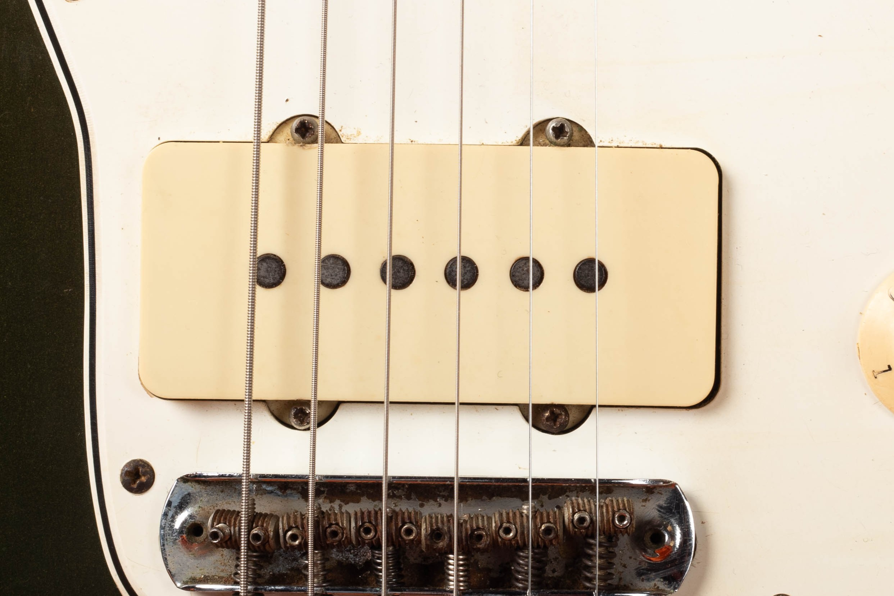

<figcaption><strong>Fender Jazzmaster pickup, 1966.</strong> The wide, flat pickup has a <strong>plastic cover</strong>, not chrome, that mounts to the body and sits flush with the pickguard surface. The pole pieces are visible from above, sitting flush rather than standing proud of the cover, and they are level rather than staggered. Pickup height is adjusted via screws through the body. The large aperture of the pickup coil is what gives the Jazzmaster its characteristic warm, wide-sensing tone.</figcaption>

</figure>

The pickup covers are **plastic** (not chrome) and mount directly to the body, not to the pickguard. The covers are flush with the pickguard surface, giving a clean integrated appearance. The pole pieces are visible from above and sit flush with the cover rather than standing proud of it. Pickup height is adjusted via screws that go through the body from below.

### Pickup Bottom Color, A Dating Indicator

The color of the pickup base (bobbin bottom) changed during production and is a useful dating reference:

-   1958 to ~1964**Black fiber flatwork** on the bobbin bottom. Consistent with pre-CBS and early transition production. Visible when the pickup is removed from the pickguard route.
-   ~1964 onwardFender began switching to gray bobbin bottoms starting around 1964, though the transition was gradual and both black and gray bottoms can appear on instruments from this period.

<figure>

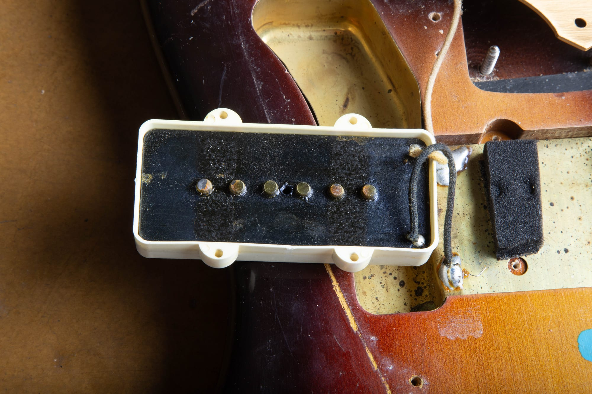

<figcaption><strong>Black fiber flatwork on a 1959 pickup bottom.</strong> Removed and flipped over, the neck pickup shows the black fiber flatwork used from 1958 to roughly 1964, a useful pre-CBS dating indicator, along with cloth lead wire and the six pole pieces. The dark block beside it is the open-cell foam that spring-loads the pickup upward against the strings, the same foam that decomposes into "foam rot" on most surviving examples.</figcaption>

</figure>

### Foam Under Pickups, The "Foam Rot" Problem

Original Jazzmaster pickups were installed with a piece of **open-cell foam beneath each pickup** to spring-load them upward against the strings, a tension-based height adjustment system. This foam is critical to proper pickup function but is also notoriously unstable over time.

After 50 to 60 years, the original foam typically **decomposes completely**, collapsing, hardening, or crumbling into nothing. When the foam fails, the pickups drop down into their routes, reducing output and changing the instrument's tone significantly. This is known as "foam rot" in the vintage Jazzmaster community and is one of the most common condition issues on vintage examples.

Checking for and replacing deteriorated foam (with appropriate modern open-cell foam cut to size) is standard maintenance, not a modification. The presence of the original deteriorated foam, or evidence of its prior presence, is an authenticity indicator. The absence of any foam (original or replacement) explains why a vintage Jazzmaster may sound weak or dull.

<figure>

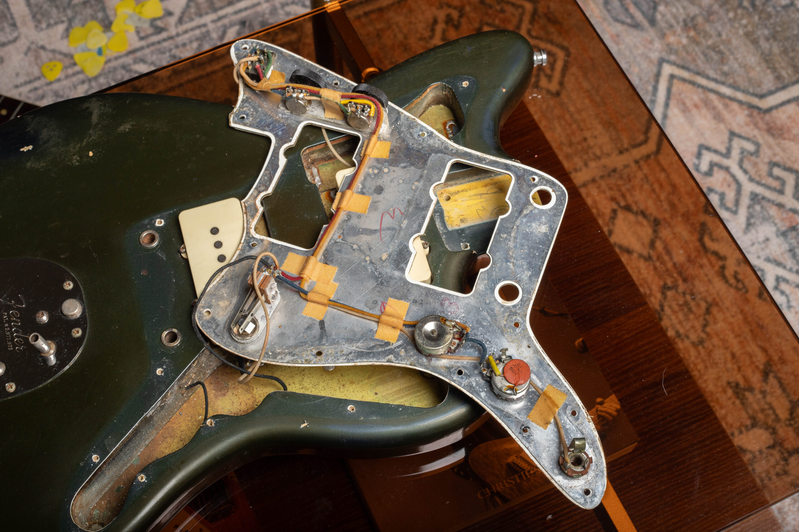

<figcaption><strong>Wiring behind the pickguard on a 1966 Fender Jazzmaster.</strong> The aluminum shielding that lines the cavities is visible, along with the lead circuit volume and tone controls and the pickup wiring. The dual-circuit design means there is more wiring complexity than a Stratocaster or Telecaster; the rhythm circuit's independent controls connect via a separate path from the lead circuit. All wiring should be cloth-covered on pre-CBS examples.</figcaption>

</figure>

### Body Dates

The body date on a Jazzmaster is **penciled** in the **bridge pickup cavity**, visible through the pickguard route. This date reflects when the body was routed and is a valuable independent dating reference, particularly for 1958 to 1965 guitars. Cross-reference with neck date and pot codes for a complete picture.

<h2 id="bridge">Bridge, Tremolo & Hardware</h2>

### The Floating Bridge

The Jazzmaster uses a **floating bridge**, a chrome unit with six individual threaded barrel saddles that sits in two posts but is *not mechanically anchored* to them. The bridge rests on the posts by gravity and string tension alone and can rock slightly with tremolo use. This floating design is integral to the Jazzmaster tremolo system's function.

<figure>

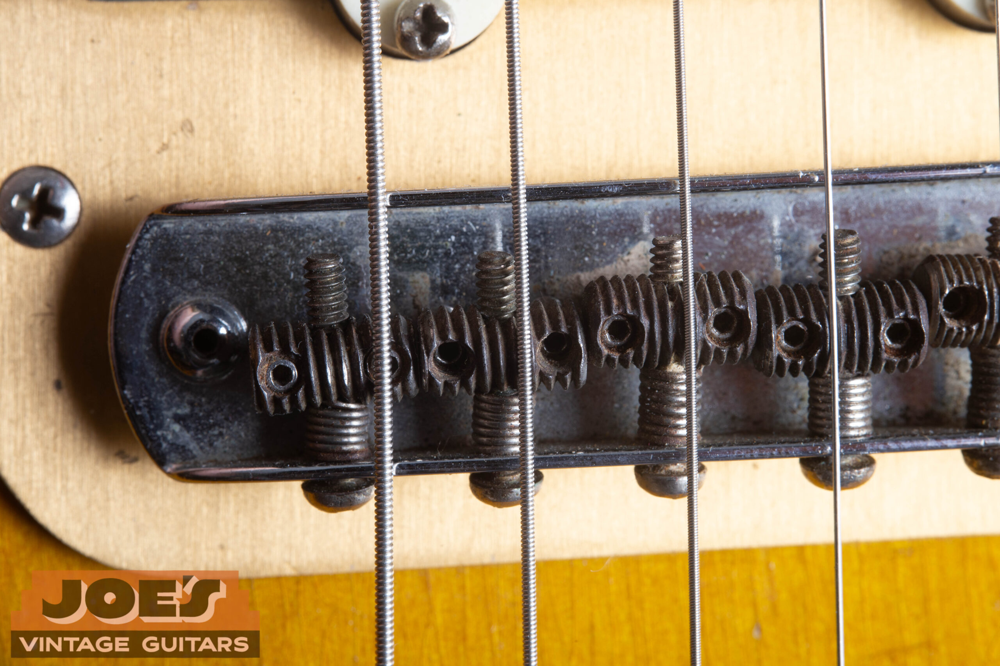

<figcaption><strong>Floating bridge with threaded barrel saddles on a 1959 Fender Jazzmaster.</strong> The six individual threaded cylindrical saddles are unique to the Jazzmaster and Jaguar. Each saddle is a small chrome cylinder with a thread that allows intonation adjustment. The bridge sits in two posts but is not anchored. It floats on string and spring tension. String slippage from the saddle grooves is a known characteristic of this design.</figcaption>

</figure>

The barrel saddles are individually adjustable for intonation and are threaded cylinders, quite different from the flat saddles of a Telecaster or the ABR-1 of a Gibson. The floating bridge is notorious for allowing strings to slip out of saddle grooves, particularly with aggressive playing or light string gauges. Many players address this with aftermarket saddle replacements or by substituting a [Mustang](/post/fender-mustang-history-value/) bridge.

### The Floating Tremolo System

The tremolo is a separate unit from the bridge, a vibrato tailpiece that anchors and actuates the strings while the bridge floats. The tremolo features:

-   Trem-lock buttonA thumb-operated button on the tremolo body that mechanically locks the tremolo in position, allowing the player to continue playing in tune even if a string breaks. A unique engineering solution that remained constant throughout the production run.
-   Tremolo armA chrome rod that **pushes into** the tremolo body. It is a press-fit, not threaded. The arm has a distinctive gentle bend and is lighter and more responsive than a Stratocaster tremolo arm. Vintage arms are commonly missing. Replacements are widely available.
-   "Pat. Pend." vs "Patent" markingEarly tremolo units (1958 to approximately 1961) are marked **"Pat. Pend."** (patent pending). Later units have the full **patent number** stamped on them. The Pat. Pend. trem is a pre-CBS era dating indicator.

<figure>

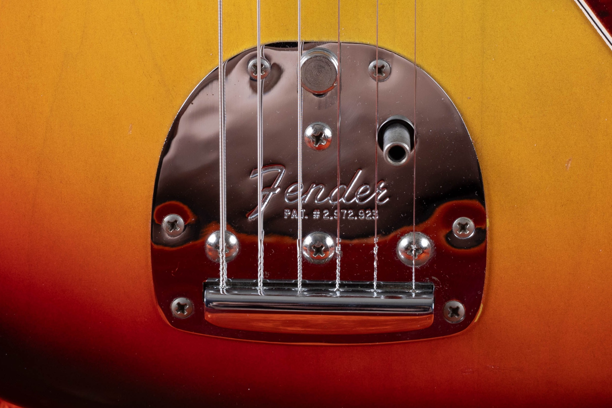

<figcaption><strong>Fender Jazzmaster floating tremolo.</strong> The tremolo body, trem-lock thumb button, and arm socket are all visible here. The trem-lock button mechanically freezes the tremolo in position, a practical feature allowing the player to continue in tune after a string break. Early examples have "Pat. Pend." stamped on the tremolo body; later units show the full patent number.</figcaption>

</figure>

<h2 id="logos">Logos, Tuners & Knobs</h2>

The logo, tuners, and knobs each changed on their own schedule, so read together they help pin down a Jazzmaster's era. The same visual checks across the whole Fender line, including the headstock patent numbers, are collected in [dating a Fender by its parts](/fender-physical-features/).

### Headstock Logo Evolution

-   1958 to mid 1964  
    "Spaghetti" logoThe classic thin, flowing cursive "Fender" script in silver/chrome. Named for its resemblance to wet spaghetti noodles. Applied as a water-slide decal on top of the finish, protected by a clear topcoat. The most collectible logo era. Early 1958 examples have no patent numbers on the decal; patent numbers were added gradually through 1959 to 1960.
-   Mid 1964 to 1967  
    "Transition" logoA heavier, thicker gold Fender logo, wider letterforms than the spaghetti logo, with a slightly different feel. Applied in gold with black outline. Named for its association with the CBS transition period. Applied to guitars from approximately mid-1964 through 1967.
-   Late 1967 to 1971  
    "CBS" black logoThe fully CBS-era logo, black printing, different letterforms. Applied from approximately late 1967 onward. The "Jazzmaster" model name also changed to a bolder block-letter style around this time.

### Tuner Evolution

-   1958 to ~1959  
    No-line KlusonsKluson Deluxe tuners with **no text** on the gear housing back, blank. The earliest Jazzmaster tuner specification.
-   ~1960 to ~1964  
    Single-line KlusonsKluson Deluxe with **"KLUSON DELUXE"** on a single line on the gear housing back. All-metal housings and buttons.

<figure>

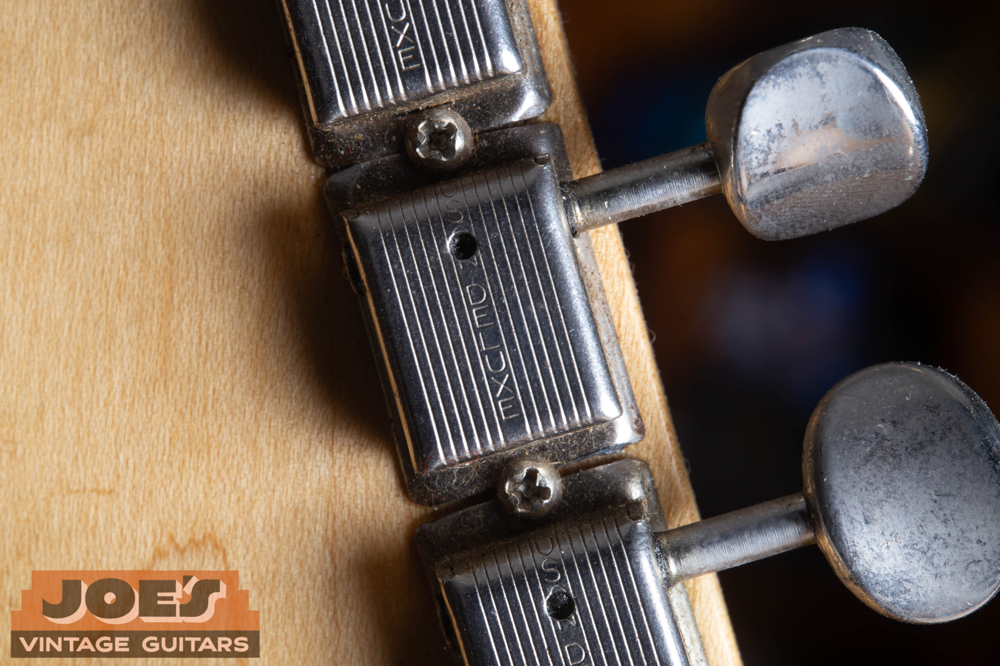

<figcaption><strong>Single-line Kluson Deluxe tuners on a 1959 Fender Jazzmaster.</strong> "KLUSON DELUXE" on a single line across the gear housing back. Used on Jazzmasters from approximately 1960 to 1964. All-metal housing and buttons.</figcaption>

</figure>

<figure>

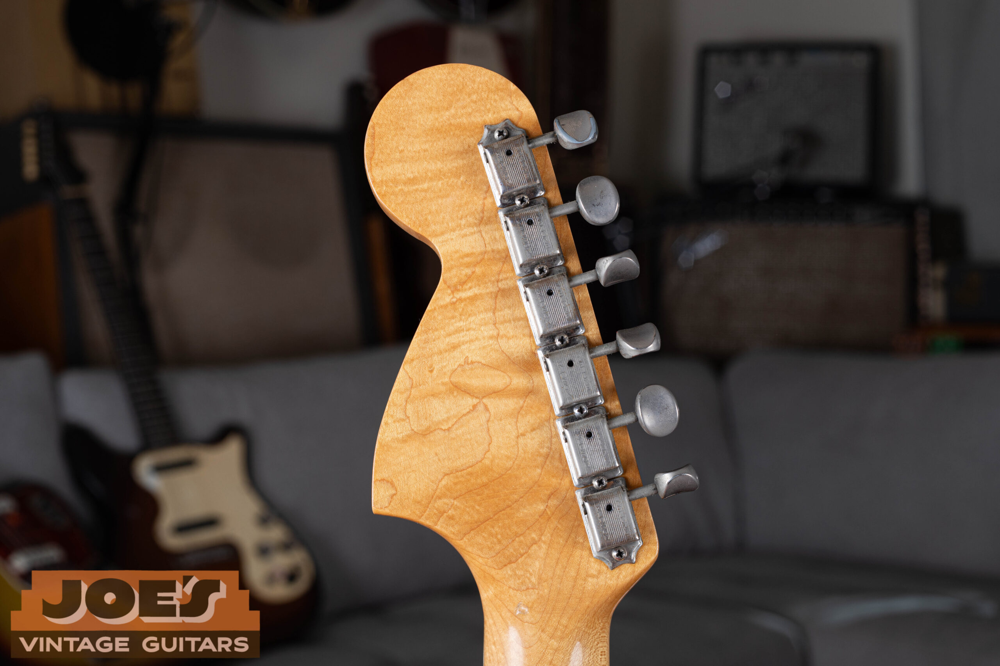

<figcaption><strong>Double-line Kluson Deluxe tuners on a Fender Jazzmaster.</strong> "KLUSON" on the first line and "DELUXE" on the second, a brief transitional specification appearing approximately 1964 through late 1965 before the F-tuners took over.</figcaption>

</figure>

-   ~1964 to late 1965  
    Double-line KlusonsKluson Deluxe with **"KLUSON" on first line, "DELUXE" on second line**. Brief transitional specification.
-   Late 1965 to 1971  
    Fender "F" tunersFender-branded (Schaller-made) tuners with a stylized "F" on the buttons. A completely different look from the open-back Kluson. A clear CBS-era indicator. Kluson to F-tuner is one of the most visible single changes on the guitar.

<figure>

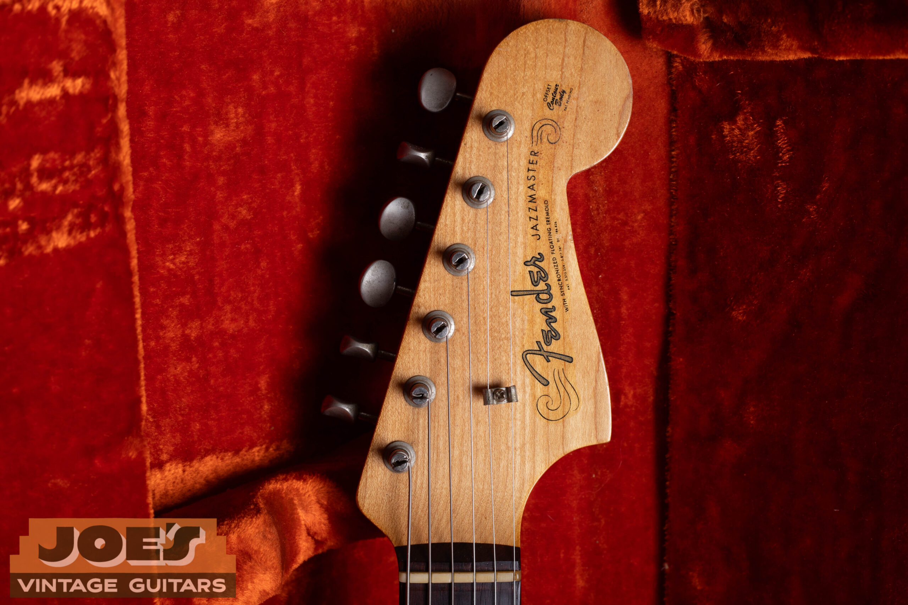

<figcaption><strong>1960s Fender Jazzmaster headstock with spaghetti logo.</strong> The thin, flowing cursive "Fender" script in silver/chrome is the defining pre-CBS logo. It runs from 1958 through approximately mid-1964. The logo is applied as a water-slide decal <strong>on top of the finish</strong>, then protected by a clear topcoat over it. Clay dots, single-line Kluson tuners, and the unbound fingerboard are also visible here, a complete pre-CBS specification.</figcaption>

</figure>

### Switch Tip Evolution

The toggle switch tip on the Jazzmaster's lead circuit selector changed in appearance during production and is a useful period indicator:

-   1958 to ~1960  
    Amber tipThe earliest Jazzmasters (approximately 1958 to 1960) have a distinctive **amber/yellowish-brown switch tip**, a warm, translucent color unique to the first few years of production. This amber tip is uncommon and highly specific to the gold guard and early tort guard era. An intact original amber switch tip is a strong indicator of a genuinely early example.
-   ~1961 onward  
    White/cream tipBy approximately 1961 the switch tip had transitioned to a **whiter plastic**, lighter and less amber than the earliest examples. This whiter tip was used for the remainder of the production run through 1971. The degree of whiteness can vary with age and UV exposure.

<figure>

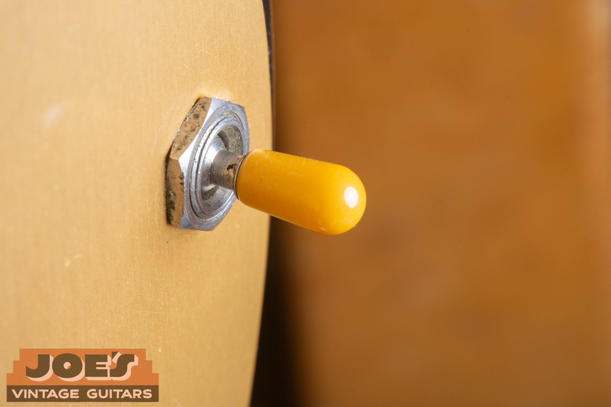

<figcaption><strong>Amber switch tip on a 1959 Fender Jazzmaster.</strong> The warm, translucent amber color of the lead circuit toggle tip is specific to approximately 1958 to 1960 production only. By around 1961 the tip had transitioned to a whiter plastic. An intact original amber tip is a strong dating indicator for an early gold guard or early tort guard example and is rarely seen on later instruments.</figcaption>

</figure>

### Headstock Shape

The Jazzmaster headstock shape remained essentially consistent from 1958 through approximately mid-1967, the familiar large offset shape with six tuners in a row. Around mid-1967 the headstock was modified to the slightly different shape used on post-1965 Stratocasters. This is a subtle change not as dramatic as the Stratocaster's well-known headstock enlargement but visible in direct comparison.

<figure>

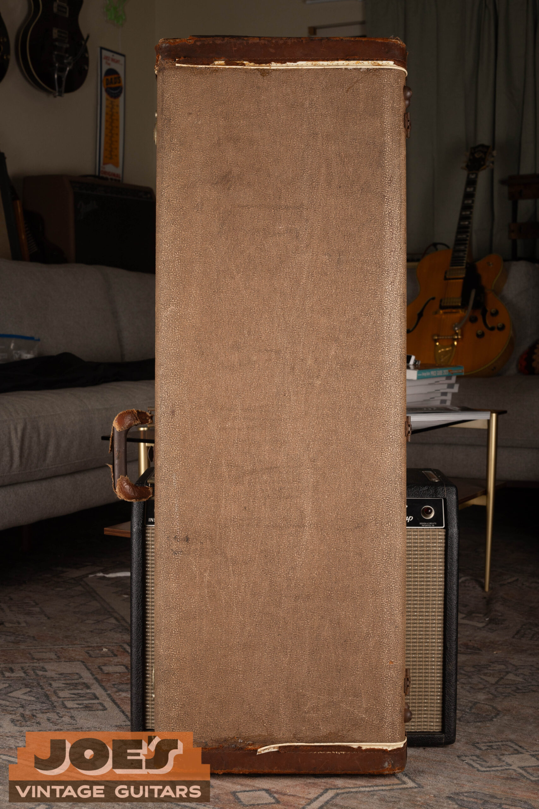

<figcaption><strong>Brown Tolex Jazzmaster case.</strong> The correct case for 1958 through approximately 1963 to 1964. Brown exterior Tolex with period-appropriate interior lining. Tweed cases also appear on the very earliest 1958 to 1959 examples before brown Tolex became standard.</figcaption>

</figure>

<figure>

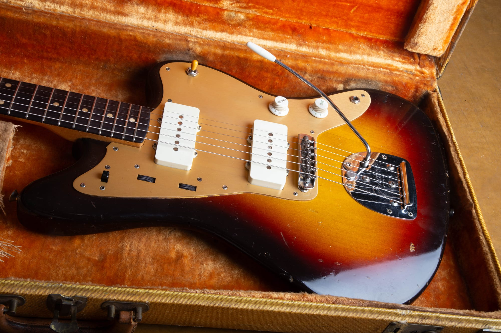

<figcaption><strong>A 1959 gold guard Jazzmaster in its original tweed case.</strong> The earliest Jazzmasters shipped in a tweed case with orange plush lining before brown Tolex became standard around 1960. Finding a gold guard example still with its correct tweed case, like this one, adds real weight to the guitar's originality and provenance. The gold guard, clay dots, and amber switch tip are all visible and period correct.</figcaption>

</figure>

<figure>

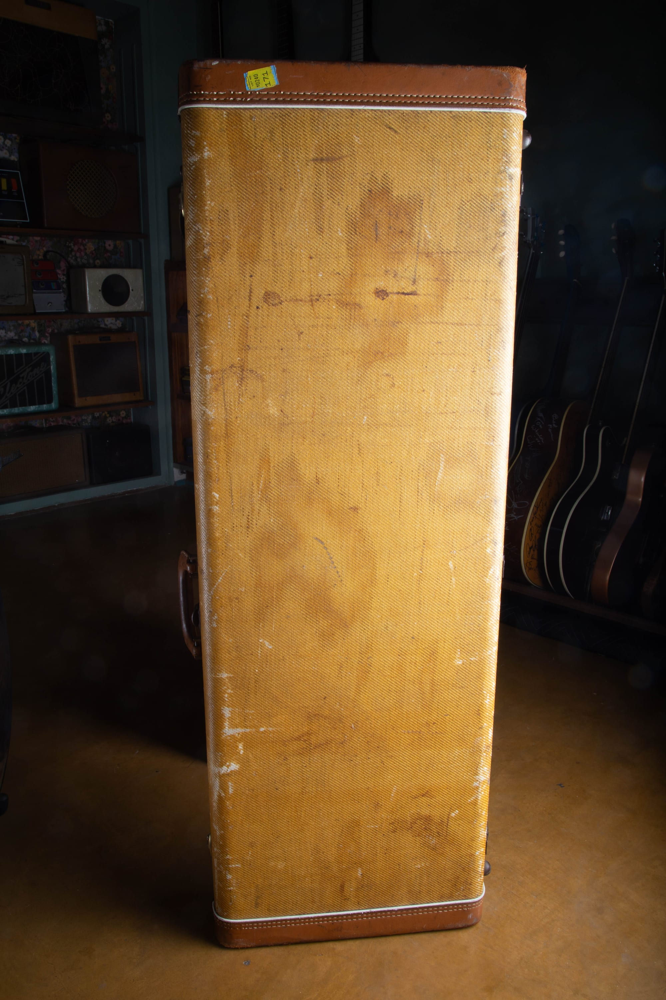

<figcaption><strong>The tweed case exterior.</strong> Tan tweed with leather ends and a leather handle, the correct case for the earliest 1958 to 1959 Jazzmasters. Brown Tolex replaced tweed around 1960, so an original tweed case is itself a dating clue and is increasingly hard to find intact.</figcaption>

</figure>

<figure>

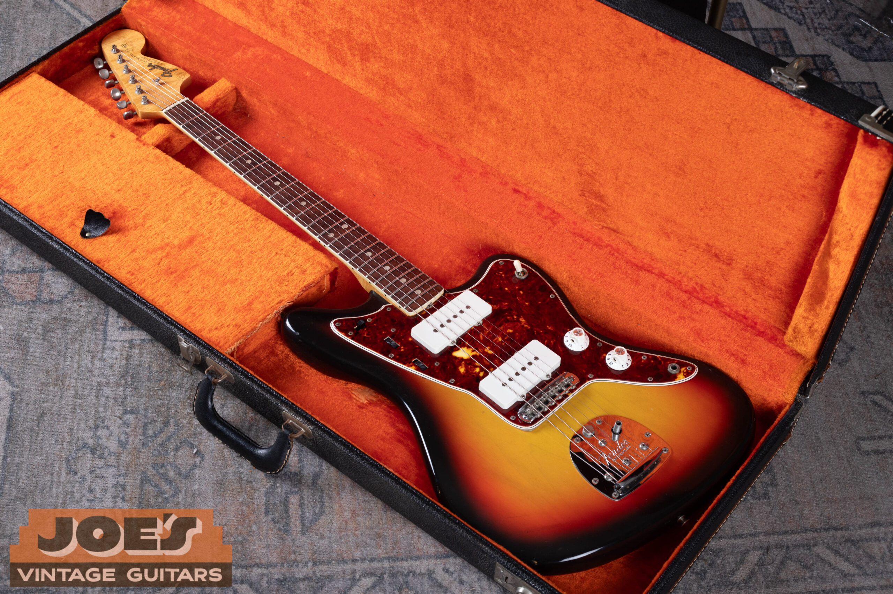

<figcaption><strong>1966 Fender Jazzmaster in original black Tolex case with orange interior.</strong> Black Tolex replaced brown as the standard Fender case from approximately 1964 to 1965. The orange interior is correct for mid-1960s examples. The guitar-body shaped cavity, neck rest, and accessory compartment all show period-correct construction.</figcaption>

</figure>

<h2 id="serial">Serial Numbers & Dating</h2>

Jazzmaster serial numbers are located on the **neck plate** on the back of the guitar, not on the headstock as on Gibson. The neck plate is a four-bolt chrome plate securing the neck to the body. Serial number formats changed over the production run. For the complete year-by-year charts, see the [full Fender serial number guide](/fender-guitars-serial-number-guide/); to read the neck heel date itself, penciled through spring 1962 and rubber-stamped after, see [how to date a Fender neck](/fender-neck-dates/).

<figure>

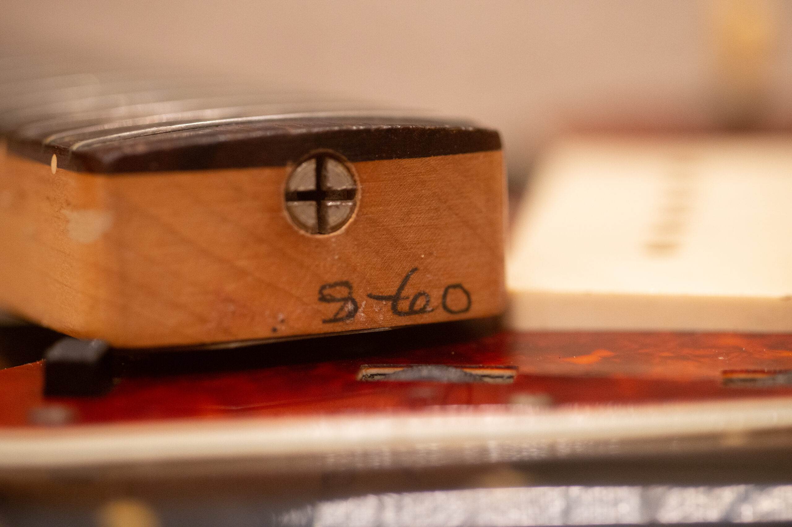

<figcaption><strong>Pencil neck date on a 1960 Fender Jazzmaster.</strong> From 1958 through spring 1962, Fender workers penciled the month and year directly onto the neck heel butt end. Many mid-1959 to 1960 necks have no date at all. A pencil date (or absence of date) at the heel confirms pre-spring-1962 production.</figcaption>

</figure>

<figure>

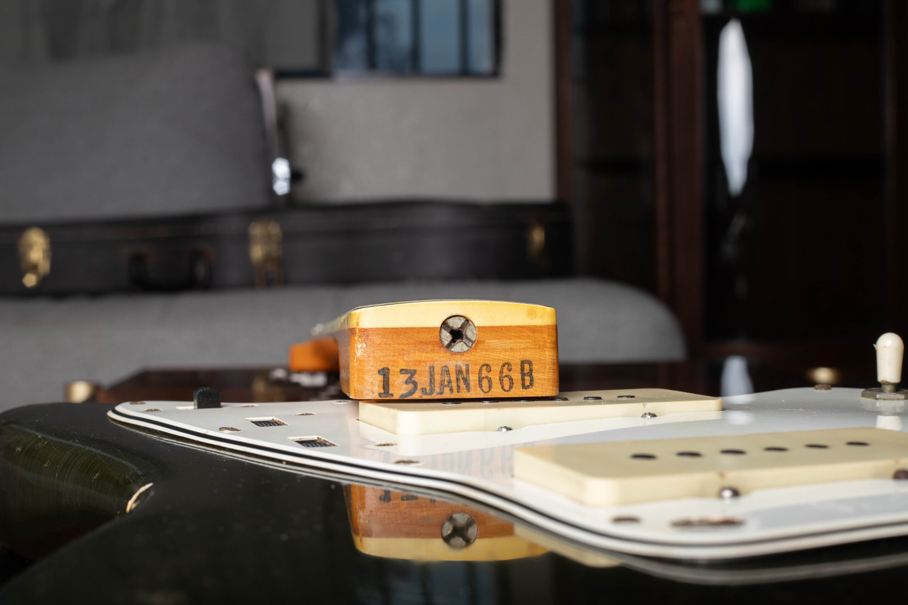

<figcaption><strong>Rubber-stamped neck heel date on a 1966 Fender Jazzmaster.</strong> From spring 1962 onward, neck dates were applied as a rubber-stamped code: model number, month abbreviation, year, and nut width code (e.g. "4JAN63B"). A rubber-stamped code confirms spring 1962 or later production.</figcaption>

</figure>

| Format | Approximate Years | Example | Notes |
| --- | --- | --- | --- |
| **5-digit (no prefix)** | 1958 to 1963 | 30,000 to 99,999 | Shared with other Fender models. Range overlaps significantly; serial alone cannot distinguish model. |
| **L prefix + 5 digits** | 1963 to 1965 | L00001 to L99999 | "L" prefix applied to all Fender models in this period. L-series Jazzmasters are late pre-CBS and transition era. |
| **6 digits above large "F"** | 1965 to late 1976 | 100000 to 999999 | The large stylized "F" on the neck plate is a clear CBS-era indicator. Six-digit format used throughout. |

<figure>

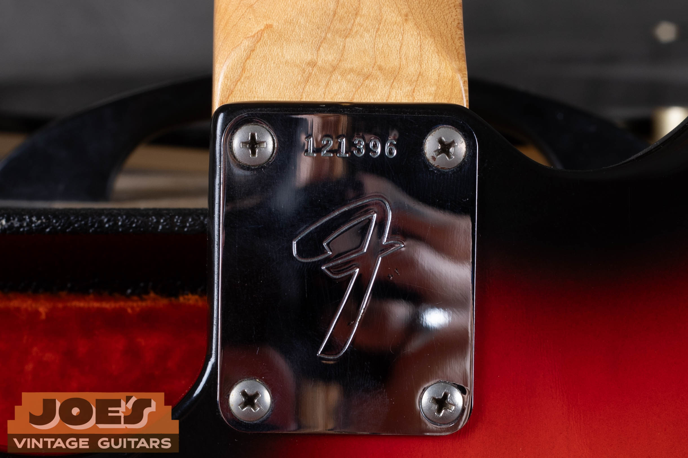

<figcaption><strong>CBS-era "F" neck plate on a Fender Jazzmaster.</strong> The large stylized "F" on the neck plate is an immediate CBS-era indicator. All Jazzmasters built from 1965 onward have this plate. The 6-digit serial number appears above the F. Pre-CBS guitars have a plain neck plate without the F logo.</figcaption>

</figure>

Fender serial numbers in the 1960s were batch-assigned and not strictly sequential by production date. A serial number places a guitar in a general range; precise dating requires cross-referencing the neck heel date, body cavity date, and pot codes. Relying solely on a serial number for precise year dating is a common and costly mistake.

<figure>

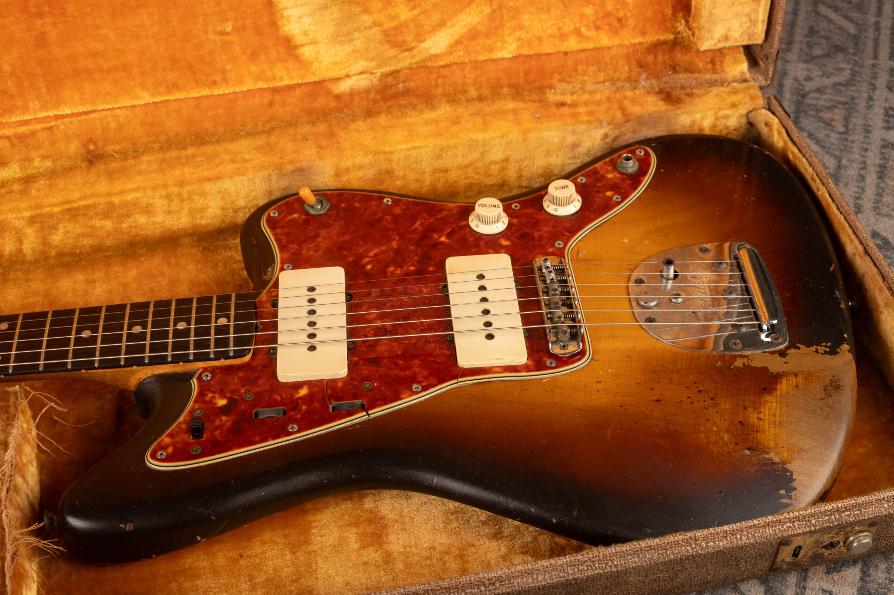

<figcaption><strong>1962 Fender Jazzmaster with original brown Tolex case.</strong> A complete early-1962 example, the slab-to-veneer transition year. An unmodified Jazzmaster in its original case is increasingly rare. This represents the model at the end of its most collectible era, just before the veneer fingerboard arrived in spring 1962.</figcaption>

</figure>

<figure>

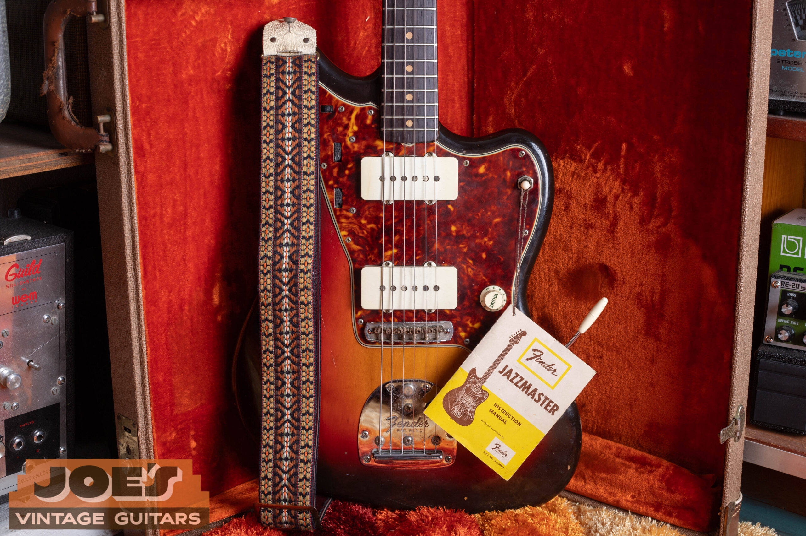

<figcaption><strong>1960s Fender Jazzmaster with original manual and period strap.</strong> Original paperwork (owner's manuals, hang tags, and case candy) adds meaningfully to the completeness and provenance of a vintage instrument. The presence of the original Fender manual dates the guitar's purchase to the 1960s and is increasingly rare to find intact.</figcaption>

</figure>
