<nav class="fmg-nav-sidebar" id="fmgNavSidebar" aria-label="Article section navigation">
  
<strong>Mustang Guide</strong>

  <a href="#" onclick="window.scrollTo({top:0,behavior:'smooth'});return false;" class="fmg-nav-link top">&uarr; Top of Page</a>
  
The Guitar

  <a href="#fmg-what" class="fmg-nav-link">The Short Version</a>
  <a href="#fmg-family" class="fmg-nav-link">The Student Line</a>
  <a href="#fmg-built" class="fmg-nav-link">How It Was Built</a>
  <a href="#fmg-switching" class="fmg-nav-link">Pickups and Switching</a>
  <a href="#fmg-vibrato" class="fmg-nav-link">The Dynamic Vibrato</a>
  <a href="#fmg-timeline" class="fmg-nav-link">Year by Year</a>
  <a href="#fmg-competition" class="fmg-nav-link">Competition Mustangs</a>
  <a href="#fmg-cobain" class="fmg-nav-link">Cobain and After</a>
  
Dating &amp; Authentication

  <a href="#fmg-dating" class="fmg-nav-link">Dating Your Mustang</a>
  <a href="#fmg-authenticate" class="fmg-nav-link">Authentication</a>
  <a href="#fmg-mods" class="fmg-nav-link">Mods and Red Flags</a>
  <a href="#fmg-checklist" class="fmg-nav-link">The Checklist</a>
  
Value

  <a href="#fmg-reissue" class="fmg-nav-link">Vintage or Reissue</a>
  <a href="#fmg-value" class="fmg-nav-link">What It Is Worth</a>
  <a href="#fmg-selling" class="fmg-nav-link">Thinking of Selling</a>
  <a href="#fmg-faq" class="fmg-nav-link">FAQ</a>
</nav>

<button class="fmg-nav-btn" id="fmgNavBtn" onclick="toggleFmgNav()" aria-expanded="false" aria-controls="fmgNavPanel" type="button">
  &#9776; Jump To Section
</button>

  
<strong>Mustang Guide</strong>

  <a href="#" onclick="window.scrollTo({top:0,behavior:'smooth'});closeFmgNav();return false;" class="fmg-nav-link top">&uarr; Top of Page</a>
  
The Guitar

  <a href="#fmg-what" onclick="closeFmgNav()" class="fmg-nav-link">The Short Version</a>
  <a href="#fmg-family" onclick="closeFmgNav()" class="fmg-nav-link">The Student Line</a>
  <a href="#fmg-built" onclick="closeFmgNav()" class="fmg-nav-link">How It Was Built</a>
  <a href="#fmg-switching" onclick="closeFmgNav()" class="fmg-nav-link">Pickups and Switching</a>
  <a href="#fmg-vibrato" onclick="closeFmgNav()" class="fmg-nav-link">The Dynamic Vibrato</a>
  <a href="#fmg-timeline" onclick="closeFmgNav()" class="fmg-nav-link">Year by Year</a>
  <a href="#fmg-competition" onclick="closeFmgNav()" class="fmg-nav-link">Competition Mustangs</a>
  <a href="#fmg-cobain" onclick="closeFmgNav()" class="fmg-nav-link">Cobain and After</a>
  
Dating &amp; Authentication

  <a href="#fmg-dating" onclick="closeFmgNav()" class="fmg-nav-link">Dating Your Mustang</a>
  <a href="#fmg-authenticate" onclick="closeFmgNav()" class="fmg-nav-link">Authentication</a>
  <a href="#fmg-mods" onclick="closeFmgNav()" class="fmg-nav-link">Mods and Red Flags</a>
  <a href="#fmg-checklist" onclick="closeFmgNav()" class="fmg-nav-link">The Checklist</a>
  
Value

  <a href="#fmg-reissue" onclick="closeFmgNav()" class="fmg-nav-link">Vintage or Reissue</a>
  <a href="#fmg-value" onclick="closeFmgNav()" class="fmg-nav-link">What It Is Worth</a>
  <a href="#fmg-selling" onclick="closeFmgNav()" class="fmg-nav-link">Thinking of Selling</a>
  <a href="#fmg-faq" onclick="closeFmgNav()" class="fmg-nav-link">FAQ</a>

<h2 id="fmg-what">The Short Version</h2>

The Fender Mustang arrived in 1964 as the top of Fender's student line, and for years that was all anyone thought it was: a cheap, short-scale guitar for kids and beginners. That reputation is exactly why it is now one of the most interesting vintage Fenders to buy and sell. A student guitar in 1964 is a genuine pre-CBS or early CBS Fender in 2026, built in the same Fullerton factory as the Stratocaster, with a switching system nothing else in the catalog had and a floating vibrato that was designed for this model and no other. Then punk and indie rock got hold of it, Kurt Cobain made a Competition Mustang the most famous guitar of the 1990s, and the prices followed.

At Joe's Vintage Guitars we buy and sell vintage Mustangs, and we are always looking to add clean 1960s and early 1970s examples to the collection. If you have one you are thinking about selling, we give straight [nationwide appraisals](/free-appraisal/) and pay top dollar for original guitars. This guide is the same walk-through we do on the bench: what the short-scale family is, how the Mustang changed from year to year, what the Competition finishes are, how we tell an original from a modified one, how to read the serial number, and what a real Mustang is worth in today's market. Every photo below is a guitar that came through our shop in Mesa.

If you want the compact version, our [guide to dating a Fender Mustang](/fender-mustang-dating-guide/) runs the whole 1964 to 1982 timeline as a single year-by-year table with the fastest visual check for each change.

<h2 id="fmg-family">Fender's Student Line</h2>

The Mustang did not arrive alone, and understanding where it sat in Fender's lineup is the first step to valuing one correctly. Fender built a family of short-scale, entry-level guitars, and they get confused for one another constantly. A Duo-Sonic gets sold as a Mustang, a Musicmaster gets called a Mustang, and the price differences are real.

- **Musicmaster.** The bottom of the line, introduced in 1956. One pickup, no vibrato. The plainest and least valuable of the family.
- **Duo-Sonic.** A step up, also from 1956. Two pickups, no vibrato. Mechanically the Mustang without the tremolo.
- **Mustang.** Introduced in 1964 as the top of the student range. Two pickups, the special slide-switch circuit, and the Dynamic Vibrato. It was the first Fender student model to get a vibrato, and that is the single feature that separates it from a Duo-Sonic.
- **Bronco.** A later single-pickup model from 1967, sold with a small amp as a package. One pickup plus a vibrato.

When the Mustang launched in 1964, Fender redesigned the Duo-Sonic and Musicmaster at the same time, into the Duo-Sonic II and Musicmaster II, so all three share the same compact offset body and the same two scale lengths from that year forward. The quickest way to tell a Mustang from its cheaper siblings is the bridge: only the Mustang wears the chrome Dynamic Vibrato with its "Fender Dynamic Vibrato" engraving. If the guitar has two pickups and a hardtail bridge with no vibrato, it is a Duo-Sonic, not a Mustang, and it is worth less.

<h2 id="fmg-built">How the Mustang Was Built</h2>

The Mustang is a solid-body electric with a compact offset waist, a bolt-on maple neck, and a rosewood fingerboard. The body is a solid slab (poplar on most examples, with other hardwoods turning up across the long production run), routed for two pickups and finished in nitrocellulose lacquer through the vintage era. It is a real Fullerton-built Fender, not a corner-cut import, and that is the point buyers sometimes miss.

Two things about the build matter most for authentication. The first is scale length. The Mustang was offered in two: a 22.5 inch short scale and a 24 inch medium scale. The 24 inch quickly became the standard and the far more common seller, so a genuine 22.5 inch example is the less usual find. Fender also specified nut width with a letter code that shows up in the neck stamp, where "A" is the narrow 1 and 1/2 inch nut and "B" is the wider and generally more desirable 1 and 5/8 inch nut.

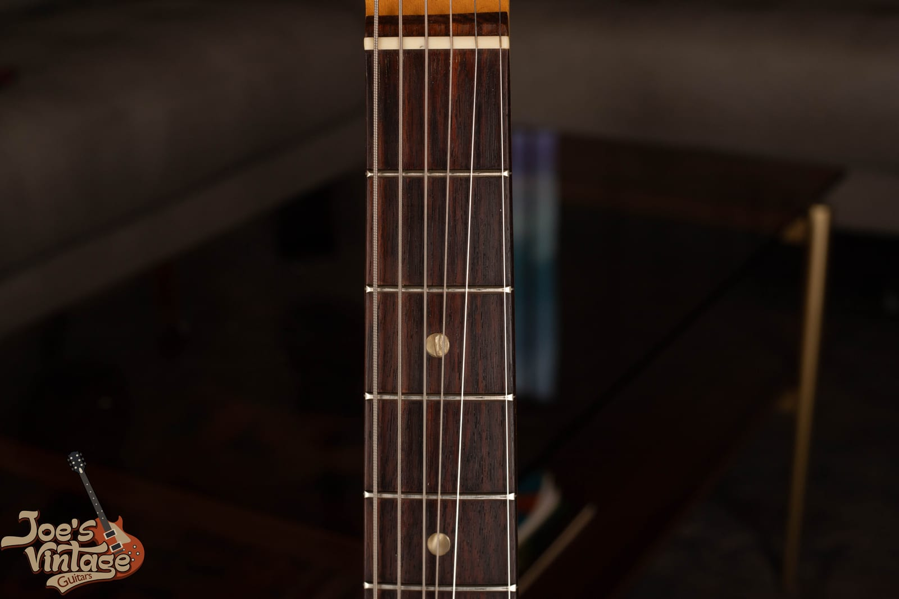

The rosewood fingerboard on a vintage Mustang. This is the round-laminate, or "veneer," board, which is curved on its underside where it meets the maple. That detail matters: the Mustang launched in 1964, well after Fender switched away from the flat "slab" boards it used until mid-1962, so a true slab-board Mustang is not a factory configuration. The dot inlays are pearloid on effectively every Mustang, with the older clay dots only a possibility on the very earliest 1964 examples.

The second detail is the fingerboard itself, shown above. Because the Mustang came along after the slab-to-veneer transition, its board is always the veneer type. If someone shows you a Mustang and calls the board a "slab," either the term is being used loosely or the neck is not original to the model. We will come back to that in the authentication section.

<h2 id="fmg-switching">The Pickups and the Slide Switches</h2>

Here is the feature that makes a Mustang a Mustang, and the one most owners cannot explain: the two slide switches above the pickups. A Mustang has two single-coil pickups mounted at a slight angle, fully covered so you do not see individual pole pieces the way you do on a Stratocaster. Above them sit two three-position slide switches, and each switch controls one pickup.

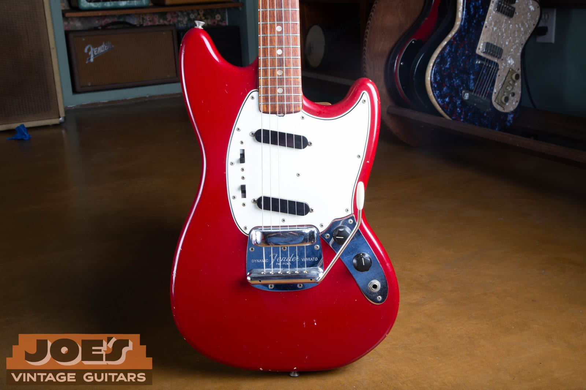

A 1965 Mustang in Dakota Red, laid out the way every Mustang is: two angled single-coil pickups, the two slide switches up on the pickguard above the neck pickup, the volume and tone knobs and the jack on the lower chrome plate, and the Dynamic Vibrato at the bridge. Those two small black switches are the whole trick, and you can see there is one for each pickup.

Each switch has an on position, an off position in the middle, and a second on position that flips that pickup's phase. That gives you more combinations than a normal two-pickup guitar. Throw both switches the same direction and the pickups run together in phase, the full, normal Mustang sound. Throw them opposite directions and the pickups fight each other out of phase, the thin, hollow, nasal honk that players either love or never touch. Put one switch in the center and you are on a single pickup. It is a clever, cheap, genuinely useful little system.

One thing to know for authentication: the stock Mustang circuit is wired in parallel, in phase or out of phase, and it does not do a series (humbucking) mode from the factory. A Mustang that has been rewired for series is a common modification, not an original feature, so a "series" Mustang has been inside. That is not automatically a problem, but it is a thing to notice and to price.

<h2 id="fmg-vibrato">The Dynamic Vibrato</h2>

The Fender Dynamic Vibrato was built for the Mustang and appears on no other vintage Fender. It is a floating unit: the tailpiece is sprung, and the bridge itself rocks on the same baseplate, so the bridge moves with the strings when you use the arm. In theory that keeps the intonation truer than a fixed bridge with a moving tailpiece. In practice players complain about tuning stability and the bridge rocking out of position, which is why so many vintage Mustangs turn up with the vibrato blocked, swapped, or fitted with an aftermarket bridge. Kurt Cobain, for the record, used the stock vibrato hard and did not seem to mind.

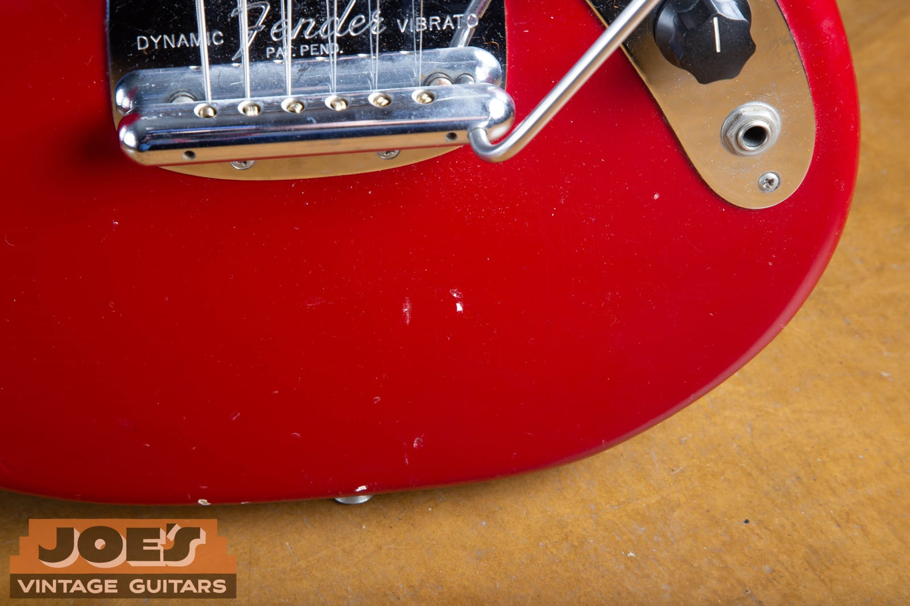

The Dynamic Vibrato on a 1965 Mustang, engraved "Fender Dynamic Vibrato Pat. Pend." That "Pat. Pend." wording is a dating tell. The earliest units read "Pat. Pend.," and around 1967 the engraving changed to carry a patent number instead. So a Pat. Pend. plate points to roughly 1964 to 1966, and a patent-number plate points to 1967 and later. The chrome bridge cover, often called the ashtray, was a smooth unmarked chrome piece and is usually long gone by the time a guitar reaches us.

Verifying that the vibrato is complete and original matters to value. The threaded vibrato arm goes missing constantly, the springs get swapped, and the whole assembly gets replaced with reissue or aftermarket units. An intact, correct, period Dynamic Vibrato with its original arm adds real money over a guitar that is missing pieces or wearing a modern bridge.

<h2 id="fmg-timeline">Year by Year</h2>

The Mustang changed in small, datable steps across its 1964 to 1982 run. Here is the high-level orientation table, with the details unpacked below and in the dating section. Treat the boundaries as approximate, because Fender used up parts in bins and transitions overlapped.

| Years | Headstock and logo | Finish and pickguard | What to notice |
| --- | --- | --- | --- |
| 1964 to 1965 | Small headstock, gold transition logo, "Offset Contour Body" decal | Dakota Red, Daphne Blue, Olympic White; guard color paired to the finish | Pre-CBS feel, L-series or early F-plate serials, Pat. Pend. vibrato |
| Late 1965 to 1966 | Enlarged CBS headstock, transition logo | Same three standard colors | F-plate serials, still Pat. Pend. vibrato |
| 1967 | CBS headstock, transition into black logo | Same colors | Vibrato changes to a patent number, "Offset Contour Body" decal dropped |
| 1968 | CBS headstock, black logo | Competition racing stripes arrive; standard colors continue | Earliest Competition stripes wrap around the body |
| 1969 | CBS headstock, black logo | Competition Red, Blue, and Orange with matching painted headstocks | Matching headstock is an early Competition feature |
| 1970 to 1971 | CBS headstock, black logo, natural headstock face | Competition finishes continue, now stripes on the front only | Natural (unpainted) headstock becomes standard |
| 1972 to 1973 | CBS headstock, black logo | Competition finishes winding down, sunburst and standard colors | Competition option gone by about 1973 |
| 1974 to 1982 | CBS headstock, black logo | Sunburst, natural, and standard colors, thicker finishes | Final run, plainer specs, lowest vintage values |

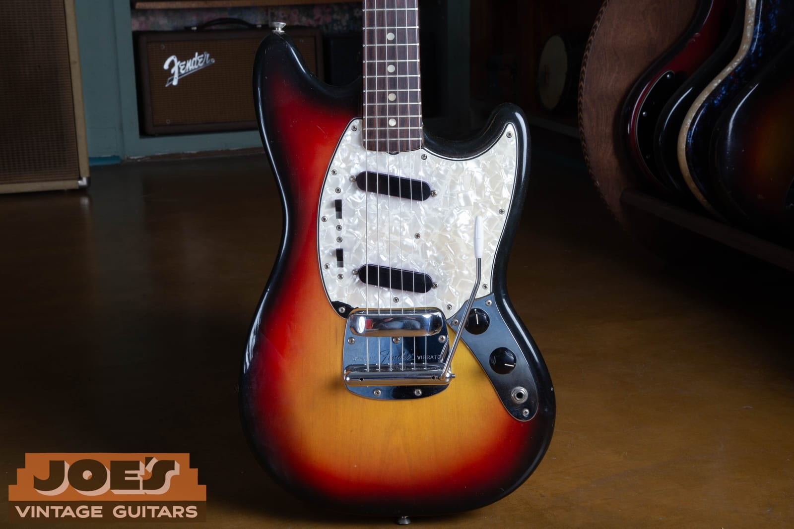

A 1972 Mustang in three-color sunburst with a pearloid pickguard, a clean example of the standard, non-Competition CBS-era guitar. By the early 1970s the Mustang had settled into its final form, and honest examples like this are one of the more affordable ways into a real vintage Fender.

<h3>The Early Years: 1964 to 1966</h3>

Everything that drives the higher Mustang valuations comes out of this window. A 1964 or 1965 Mustang is a pre-CBS or transition-era Fender, built to the same standards as the era's Stratocaster and Jaguar. Early cars wear the smaller headstock, the gold transition logo, a nitrocellulose finish in one of the three standard student colors, and the "Offset Contour Body" line on the headstock decal. Serial numbers run from the pre-CBS L-series into the big "F" neck plate that took over in late 1965.

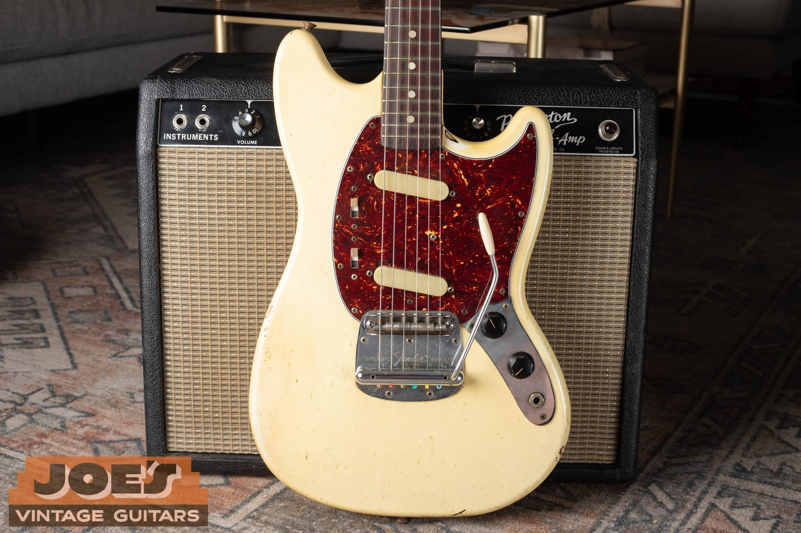

An early Olympic White Mustang. Look at the pickguard: it is tortoiseshell, and that is not random. On vintage Mustangs the guard color was paired to the body finish, and tortoiseshell celluloid was the guard Fender put on Olympic White guitars, while Dakota Red and Daphne Blue guitars got a white pearloid guard. That pairing is one of the fastest originality checks on an early Mustang. A tortoise guard on a red or blue body, or a white guard on an Olympic White body, is telling you the guard has been swapped or the guitar has been refinished.

The three standard colors in this era were Dakota Red, Daphne Blue, and Olympic White. All three used nitrocellulose lacquer that ages, checks, and ambers the way collectors want to see. A clean, unmolested early Mustang in one of these colors, with its matching-era guard and an intact Pat. Pend. vibrato, is the sweet spot of the standard (non-Competition) Mustang market.

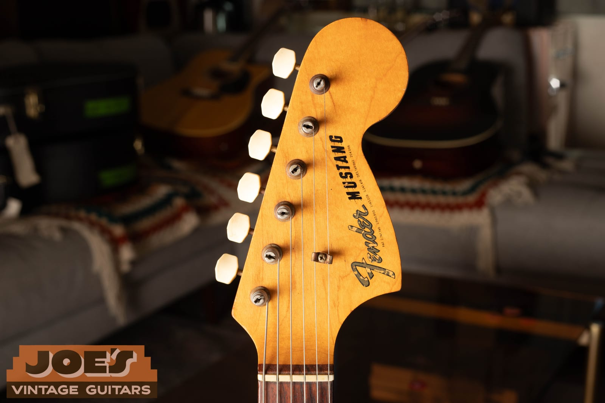

The headstock decal reads "Fender" in script with "Mustang" beneath it. This is the gold transition logo, which ran from the mid-1960s until the bold black CBS logo took over around 1967 to 1968. On the earliest examples you will also find a small "Offset Contour Body" line and a block of patent numbers under the logo, and Fender dropped the "Offset Contour Body" line around 1967. That single line is a handy pre-1967 versus post-1967 tell before you even pull the neck. Our guide to [dating a Fender by its parts](/fender-physical-features/) covers the logo styles and the headstock patent numbers in full.

<h3>The CBS Years: 1966 to Early 1970s</h3>

CBS bought Fender in January 1965, and the changeover on the Mustang shows up mostly in the headstock and the logo. Fender enlarged the headstock in late 1965, so from 1966 on the Mustang carries the larger CBS-era headstock, the same change that hit the Stratocaster and the offset models on the same timeline. The gold transition logo gave way to the bold black logo around 1967 to 1968, and the "Offset Contour Body" decal line disappeared in that same window. Build quality stayed high into the late 1960s, and these are excellent, affordable vintage Fenders that often get overlooked next to their pre-CBS siblings.

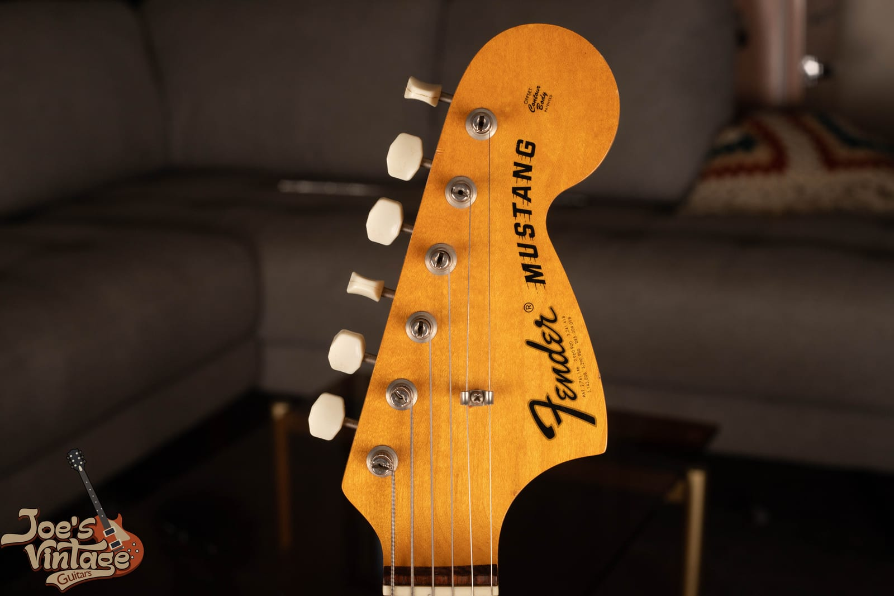

The larger CBS headstock on a 1971 Mustang, wearing the bold black logo over a natural maple face. Compare it to the smaller early headstock and gold logo above: the size and the logo color together place a Mustang on one side or the other of the mid-1960s CBS transition before you look at anything else.

<h2 id="fmg-competition">The Competition Mustangs</h2>

The most collectible vintage Mustangs are the Competition models, and they are the ones that carry Kurt Cobain's shadow. Starting around 1968 and 1969, Fender offered the Mustang in a "Competition" finish package inspired by the muscle-car look of the era: a diagonal racing stripe across the body, a matching painted headstock on the early examples, and a pearloid pickguard. The option ran until roughly 1973.

The Competition colors were Competition Red, Competition Blue, and Competition Orange. There is a common point of confusion worth clearing up: Fender's own catalog listed the blue one as "Competition Burgundy," but the guitars are blue, not burgundy, so that is a catalog label rather than a fourth color. The stripes were finished to complement the body, and the earliest 1968 examples had stripes that wrapped around the body, while from late 1968 on the stripes are on the front only. The matching painted headstock ran from the introduction into about 1969 or 1970, after which a natural, unpainted headstock became standard on Competition Mustangs.

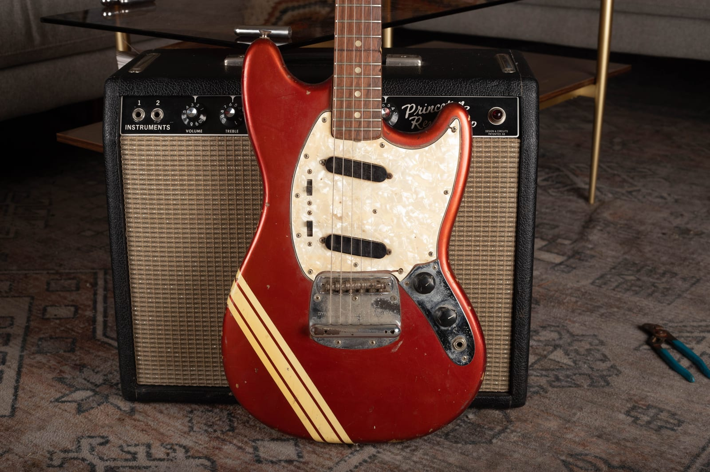

A Competition Red Mustang. Competition Red is the most common of the three Competition colors, which makes it the most attainable, while Competition Orange is by far the rarest and Competition Blue carries the Cobain premium. This particular guitar is a well-loved player with real finish wear, and that is worth pointing out: a Competition finish is what a buyer is paying up for, so condition of the stripes and originality of the finish matter more here than on a plain Mustang. A refinished Competition guitar has lost the exact thing that made it special.

Within the Competition family, the value ladder runs Orange at the top for rarity, then Blue for rarity plus the Nirvana association, then Red as the most affordable way into a real Competition Mustang. A 1969 example with the original matching painted headstock sits above a later natural-headstock car, all else equal. As always, an original finish beats a repaint every time, and on a Competition guitar the gap is wide.

<h2 id="fmg-cobain">Kurt Cobain and the Mustang's Second Life</h2>

You cannot tell the modern Mustang story without Kurt Cobain. Cobain played left-handed Mustangs through Nirvana's biggest years, most famously a 1969 Competition model in Lake Placid Blue, and he loved the guitar's cheap, awkward, fight-you character. His attachment to both the Mustang and the Jaguar led him to work with Fender in the early 1990s on the Jag-Stang, a hybrid of the two that Fender still builds. When Cobain's own 1969 Competition Mustang from the "Smells Like Teen Spirit" video came to auction, it sold for roughly 4.5 million dollars, and later changed hands again for close to 7 million, which makes it one of the most valuable guitars ever sold.

That is the part sellers need to hear clearly, because it is where people talk themselves into fantasy numbers. Cobain's specific guitar is priceless because it is Cobain's guitar. That value does not transfer. A regular 1969 Competition Mustang, even the same color, is worth its own market value and not Nirvana money. What the Cobain association actually did was lift the entire Mustang market, especially the Competition finishes and especially Competition Blue, out of the bargain bin and into real collector territory. He was not the only one, either: the Mustang has been a favorite of players from David Byrne and Thurston Moore to PJ Harvey and Liz Phair, which kept it culturally alive long after it stopped being a beginner's guitar.

<h2 id="fmg-dating">Dating Your Mustang</h2>

Dating a Mustang is the same triangulation we use on any vintage Fender: the neck plate serial number gives you a range, and the neck-heel date and pot codes confirm it. No single stamp is the final word, because plates and parts moved around the factory.

The serial number lives on the neck plate on the back of the body. Pre-CBS Mustangs from 1964 and 1965 wear the L-series plate (an "L" followed by five digits), which is the most desirable early window. In late 1965 Fender switched to the large neck plate with an embossed "F" below the serial, and that F-plate ran through the rest of the vintage era. Rough F-plate ranges break down like this, and they can be off by a year or more:

| Serial range | Approximate year |
| --- | --- |
| 100000 to 110000 | Late 1965 |
| 110000 to 200000 | 1966 |
| 200000 to 210000 | 1967 |
| 210000 to 250000 | 1968 |
| 250000 to 280000 | 1969 |
| 280000 to 300000 | 1970 |
| 300000 to 340000 | 1971 |
| 340000 to 370000 | 1972 |
| 370000 to 520000 | 1973 |

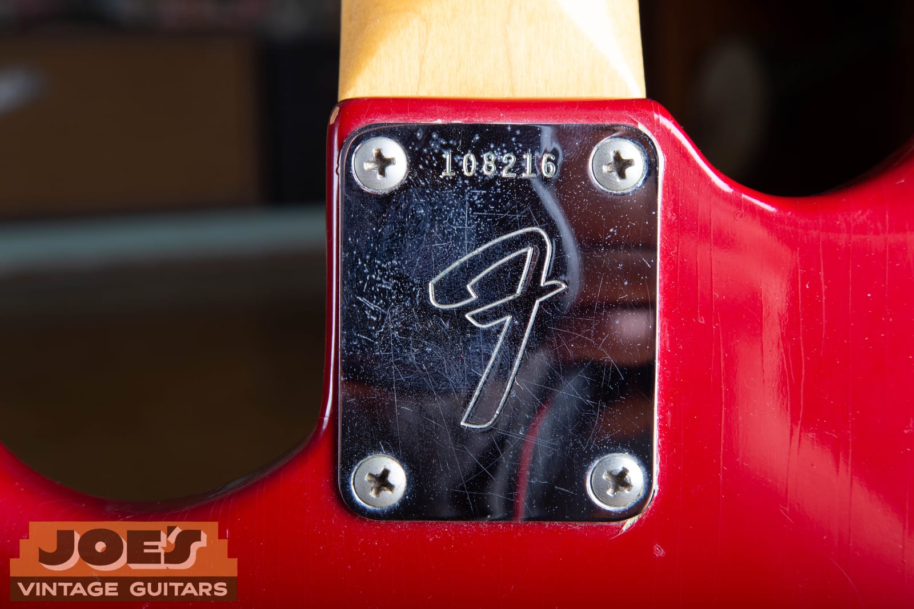

The F neck plate on this Dakota Red Mustang reads 108216, which puts it in the 100000 to 110000 band, or late 1965. The features agree: gold transition logo, Pat. Pend. vibrato, white pearloid guard on a red body, and a veneer rosewood board with pearloid dots. When the plate and the features tell the same story, you have a coherent guitar.

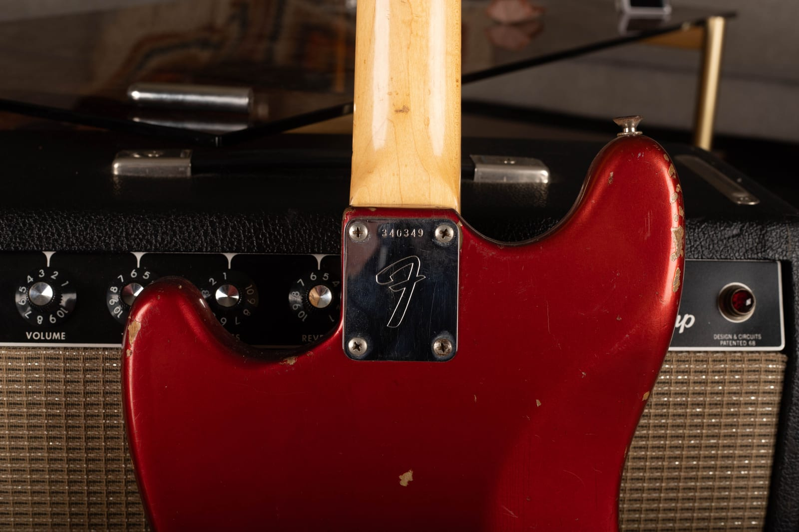

A later F plate for comparison, this one reading 340349, which lands in the 340000 to 370000 band, or about 1972. This is the Competition Red guitar from earlier in the guide, and 1972 fits it: black logo, natural headstock, front-only racing stripe. Notice how the same style of plate spans years that are worth very different money, which is exactly why the serial is a starting point and not a conclusion.

For a deeper walk through Fender numbering, including the L-series, F-plate, and later systems, use our [Fender serial number guide and lookup tool](/fender-guitars-serial-number-guide/). The most reliable date of all comes from pulling the neck and reading the pencil or stamped date on the heel, then confirming it against the source-date codes on the potentiometers, and that is exactly the kind of inspection we do as part of a free appraisal.

<h2 id="fmg-authenticate">Reading a Mustang Like a Dealer</h2>

Authentication is not one test. It is the question of whether every part of the guitar tells the same story. A Mustang has a serial, two pickups, a switching circuit, a Dynamic Vibrato, a logo, a pickguard, a set of tuners, and a wiring harness, and each of those has a date range and a correct spec. When they all point to the same window, the guitar is honest. When one points somewhere else, you have found either an old repair or a story that does not add up.

The strongest independent check beyond the serial is the potentiometer date code. Vintage pots carry a stamped source-date code where the first three digits identify the maker and the digits after that give the year and week the pot was made. Two pots with matching dates that agree with the serial and the features are a strong sign of an untouched guitar. A pot only dates the part, so it tells you the earliest the guitar could have been built, not the exact day, but it is far harder to fake than a neck plate.

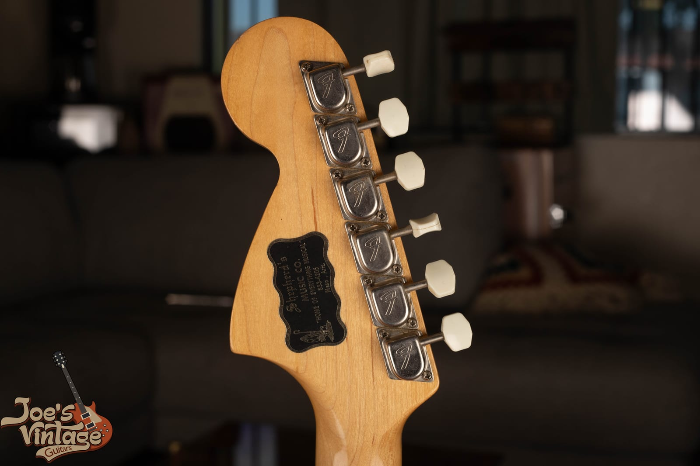

The back of the headstock is where several tells live at once: the tuner brand and stamps, the single string tree on the treble strings, the shape of the headstock, and the way the finish ages on the maple. Original tuners with no extra screw holes, a correct string tree, and a finish that matches the neck date all point to an unmodified guitar. Extra holes, mismatched tuners, or a refinished neck are where the questions start.

Then look at the solder and the finish. Original factory solder joints are even and consistent. Fresh, blobby, or re-melted joints on a pickup lead, a pot, or the jack mean someone has been inside, which is your cue to ask what was changed. On the finish, check the pickup and control cavities and under the pickguard for overspray, and look for age-appropriate checking in the lacquer. The goal is not to find a museum piece with zero history. It is to know exactly what you are looking at and to price it accordingly.

<h2 id="fmg-mods">Modifications and Red Flags</h2>

Most of the value questions on a vintage Mustang come down to a short list of common changes. None of these makes a guitar worthless, but every one of them changes the number, and a guitar sold as all original when it is not is the expensive mistake to avoid.

- **Refinish.** The single biggest hit to value, and the most important thing to get right on a Competition guitar, where the finish is the whole point. Look for overspray in the cavities, color on the edges of the pickguard, filled or missing holes, and the absence of the fine checking an old nitro finish should show.
- **Swapped or wrong pickguard.** Remember the pairing: tortoiseshell guard for Olympic White, white pearloid for Dakota Red and Daphne Blue, and pearloid on the Competition models. A guard that does not match the body finish, or a flat modern plastic guard standing in for the layered vintage celluloid, is a swap. Vintage celluloid guards also shrink and warp with age, which reproductions do not.
- **Non-original vibrato or bridge.** The Dynamic Vibrato gets blocked, swapped for a Mastery or other aftermarket bridge, or replaced with a reissue unit, and the threaded arm goes missing. Original and complete adds value; a modern bridge or a missing arm subtracts it. Watch for extra holes if a completely different bridge was installed.
- **Rewired circuit.** A Mustang rewired for series operation, or with the slide switches replaced, has been modified away from the stock parallel circuit. Verify the switches and harness are original if originality matters to you.
- **Replaced pickups or added humbucker.** Cobain-style bridge humbucker conversions are common and require routing or a modified pickguard, which is permanent. Original covered single-coils that match the era are what you want to see.
- **A slab-board neck or a wrong-scale neck.** Because the Mustang always used a veneer rosewood board and came in specific scales, a board or neck that does not fit the model is a sign the neck is not original to the guitar, or the guitar is assembled from parts.
- **A reissue sold as vintage.** The one that costs a buyer real money. The tells are in the next section, and they are not subtle once you know them.

<h2 id="fmg-checklist">The Authentication Checklist</h2>

Here is the short version you can run through with a screwdriver and a flashlight:

1. **Serial number.** Read the neck plate. L-series is 1964 to 1965. F-plate places it from late 1965 on by the ranges above. Does it fit the features?
2. **Headstock and logo.** Small headstock with a gold transition logo and an "Offset Contour Body" decal line is early. Large CBS headstock with a bold black logo is 1967 to 1968 and later.
3. **Vibrato engraving.** "Pat. Pend." is roughly 1964 to 1966. A patent number is 1967 and later. Is the unit complete, with its arm?
4. **Pickguard pairing.** Tortoiseshell on Olympic White, white pearloid on Dakota Red and Daphne Blue, pearloid on Competition models. Does the guard match the finish, and is it layered vintage celluloid?
5. **Fingerboard.** Veneer rosewood with pearloid dots. Clay dots only on the earliest 1964 cars. A "slab" board is a red flag.
6. **Switching.** Two three-position slide switches, stock parallel circuit. Any series wiring is a mod.
7. **Pots and solder.** Do the pot date codes agree with the serial, and is the solder original and undisturbed?
8. **Finish.** Check the cavities and pickguard edges for overspray, and look for age-appropriate checking. On a Competition guitar, is the finish original?
9. **Neck and hardware.** Original tuners and string tree with no extra holes, correct neck-heel date, no signs of a refit.
10. **The coherence test.** Every point should tell the same story. One outlier is a question. Several outliers is a modified or assembled guitar.

If you get partway down this list and something stops adding up, that is the moment to get a second opinion before money changes hands.

<h2 id="fmg-reissue">Vintage or Reissue</h2>

Fender never really let the Mustang die, and today a guitar sold as a "Mustang" can be any of several very different instruments. Telling a vintage original from a reissue is the check that protects a buyer from overpaying.

- **Japanese reissues (from 1990).** Fender's Japanese factory reissued the Mustang starting around 1990, modeled on the 1969 Competition look, in 24 inch scale only. Models carry names like MG-69 and MG-73, and the neck or serial is marked "Made in Japan" (MIJ) or "Crafted in Japan" (CIJ). That country-of-origin marking, plus modern pots and a modern serial format, separates it from a U.S. vintage F-plate guitar immediately.
- **Kurt Cobain Signature Mustang (2012).** A tribute with an alder body, an angled single-coil in the neck and a Seymour Duncan humbucker direct-mounted in the bridge, an Adjusto-Matic bridge over the Dynamic Vibrato, and Cobain's journal art on the neck plate, usually in Fiesta Red. The bridge humbucker, the tune-o-matic-style bridge, and the neck-plate art make it obvious it is not a vintage Mustang.
- **Jag-Stang.** Cobain's early-1990s hybrid of the Jaguar and Mustang, reissued since. Basswood body, a Jaguar-ish shape, a single-coil neck pickup and a humbucker bridge. It is a distinct model, not a Mustang.
- **Modern U.S. and Mexican lines.** American Performer, Player and Player II, and Vintera all wear modern fingerboard radii, updated switching, and current serial numbers, which set them apart from a vintage original at a glance.

None of these is a vintage guitar, and the price gap between a two-thousand-dollar reissue and a real 1960s or early-1970s Mustang is large. If you are not sure which one you have, that is exactly what an appraisal is for.

<h2 id="fmg-value">What a Vintage Mustang Is Worth</h2>

Vintage Mustang values move with the year, the finish, the condition, and above all the originality. The ranges below reflect current dealer asking prices and recent sales for guitars in honest, all-original condition. They are a starting point for a conversation, not a substitute for looking at your actual guitar, because a single modification or a refinish can move the number by a lot. Published price guides tend to run at the high end of what these actually trade for, so treat any single number with some skepticism.

| Segment | Player or modified | All-original, excellent |
| --- | --- | --- |
| Pre-CBS standard color, 1964 to 1965 | about $1,500 to $2,800 | about $2,800 to $5,000 |
| CBS standard color, 1966 to early 1970s | about $1,200 to $2,200 | about $2,200 to $3,800 |
| Competition finish, 1969 to 1973 | about $2,500 to $4,500 | about $4,500 to $9,000 |

A few things sit outside the table. Competition Orange is the rarest of the three Competition colors and can run above the range, a 1969 with an original matching painted headstock commands a premium over a later natural-headstock car, and Competition Blue carries extra weight from the Cobain association. A genuine 22.5 inch short-scale example is less common than the 24 inch and can draw its own interest. On the other end, a refinished guitar, a swapped-in modern bridge, a missing vibrato arm, or an added humbucker each pull the number down, and on a Competition guitar a refinish erases most of the premium.

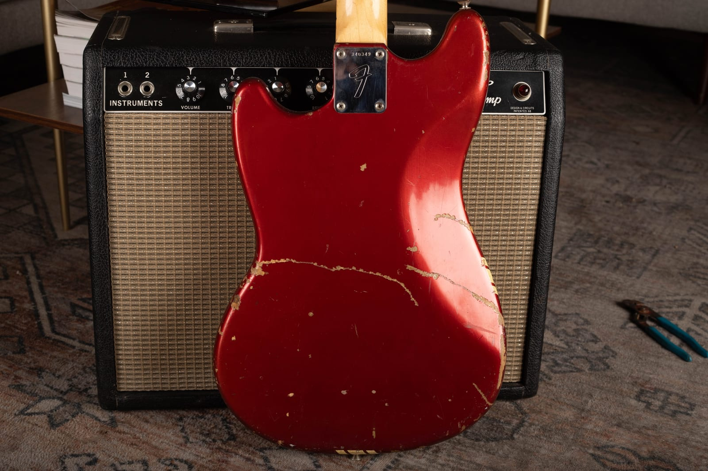

Honest wear like this is not the enemy of value the way a refinish is. Buckle rash, finish checking, and playwear are the marks of a guitar that got used, and on an original-finish Competition Mustang that story is part of the appeal. What moves the price down hard is a repaint, replaced parts, and structural repairs, not the honest scars of sixty years of playing.

For context on how to use published values without leaning on them too hard, our [Blue Book and price-guide overview](/post/blue-book-of-guitar-values-and-vintage-guitar-price-guide/) explains the difference between asking prices and real sales. And for the wider offset and student-Fender world, our [Fender Jaguar guide](/post/vintage-fender-jaguar-guide/) and [Jazzmaster evolution guide](/post/fender-jazzmaster-evolution-guide-1958-1971/) trace the models the Mustang shares its DNA with.

<h3>Original Cases and Case Candy</h3>

The original case and its contents add real, measurable value to a vintage Mustang, and they are the first thing to check before you even open the lid. Fender shipped these in a black tolex hardshell case with a plush orange interior through the vintage era, and the "case candy" that lived in the pocket adds up: the threaded vibrato arm, the chrome bridge cover, the owner's manual, the warranty card and hangtags, and any dealer paperwork.

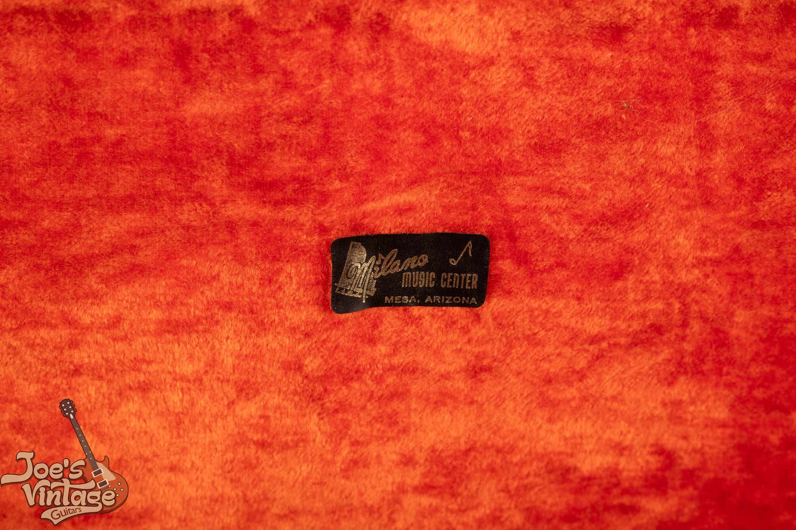

The orange-lined case for our Competition Blue Mustang, with a period dealer sticker from Milano Music Center in Mesa, Arizona, a nice local touch for a Mesa shop like ours. A dealer sticker is part of a guitar's history: it helps document where the instrument started life and adds character to the package.

The original "Fender Competition Mustang" owner's manual. Case candy like this, the manual, the warranty card, the vibrato arm, and the bridge cover, is easy to lose over sixty years, so a full and correct set adds a premium to an already original guitar. If you inherited a Mustang and there is a booklet, a warranty card, or an old receipt in the case pocket, keep it: it is part of the value.

<h2 id="fmg-selling">Thinking of Selling Your Mustang</h2>

If you have a vintage Mustang and you are considering selling it, the most valuable thing you can do is resist the urge to "fix it up." Do not refinish it, do not swap the vibrato for something that stays in tune better, do not rewire it, and do not fill the scars. Every bit of honest wear and every original part is part of the value, and once an original finish or an original part is gone, it does not come back. This goes double for a Competition guitar, where the finish is the whole game.

At Joe's Vintage Guitars we buy vintage Fender Mustangs, Duo-Sonics, Musicmasters, and the rest of the short-scale family, and we pay top dollar for clean, original examples. Send us photos through our [free appraisal](/free-appraisal/) page, including the front, the back, the headstock, the neck plate, and close-ups of the pickups, switches, and vibrato, and we will tell you exactly what you have and what it is worth. You can also [contact us directly](/contact-me/) with questions, or read more about how we [buy vintage Fender guitars](/sell-my-fender-guitar/). Whether you decide to sell to us or not, you deserve a straight answer from someone who handles these guitars, and that is what we give.

<h2 id="fmg-faq">Frequently Asked Questions</h2>

**What is a Fender Mustang?**

The Fender Mustang is a short-scale, solid-body electric guitar that Fender introduced in 1964 as the top of its student line, above the Musicmaster and Duo-Sonic. It has two single-coil pickups, a pair of three-position slide switches that give it a distinctive in-phase and out-of-phase voice, and the floating Dynamic Vibrato that was built for this model. Launched as a beginner's guitar, it later became a collectible favorite of punk and indie players, most famously Kurt Cobain.

**What years were Fender Mustangs made?**

The original Fender Mustang ran from 1964 to 1982. Fender reissued the model in Japan starting around 1990, and it remains in production today in various forms, so the key distinction for value is between a vintage original from the 1964 to 1982 run and a later reissue.

**How can I tell what year my Fender Mustang is?**

Start with the neck plate serial number and match it to a known range: the pre-CBS L-series is 1964 to 1965, and the large F-plate runs from late 1965 through the rest of the vintage era. Then confirm the year with the features, including the headstock size, the logo style, the "Offset Contour Body" decal, the vibrato engraving (Pat. Pend. early, a patent number from about 1967), and the pickguard. The most reliable date comes from the neck-heel stamp and the potentiometer date codes, which a professional appraisal can read for you.

**What is a Competition Mustang?**

A Competition Mustang is a Mustang finished in Fender's "Competition" package, offered from about 1968 or 1969 to 1973. It has a diagonal racing stripe across the body, a pearloid pickguard, and, on early examples, a matching painted headstock. The colors were Competition Red, Competition Blue, and Competition Orange. Competition Mustangs are the most collectible vintage Mustangs, with Orange the rarest and Blue carrying a premium from the Kurt Cobain association.

**What is my vintage Fender Mustang worth?**

An all-original standard-color Mustang from the 1960s generally falls in the range of about $2,200 to $5,000 in excellent condition, with pre-CBS 1964 and 1965 examples at the top of that band. All-original Competition Mustangs run higher, roughly $4,500 to $9,000 and up, with Orange and matching-headstock 1969 examples the priciest. Refinishes, replaced parts, and a missing vibrato arm all lower the number, so the only way to know is to have it appraised.

**What is the difference between the 22.5 inch and 24 inch scale Mustang?**

The Mustang was offered in a 22.5 inch short scale and a 24 inch medium scale. The 24 inch became the standard and is far more common, while a genuine 22.5 inch example is the less usual find. The shorter scale means lower string tension and an easier reach, which is part of why the Mustang appealed to younger and smaller-handed players, and later to anyone who liked its slinky feel. Fender's nut-width letter code, "A" for the narrow nut and "B" for the wider one, is separate from the scale but shows up in the neck stamp.

**What do the two slide switches on a Mustang do?**

Each slide switch controls one pickup and has three positions: on, off, and on with the phase reversed. Throw both switches the same way and the pickups play together in phase for the normal Mustang sound. Throw them opposite ways and the pickups run out of phase for a thin, hollow tone. Put a switch in the center and that pickup is off. The stock circuit is wired in parallel, not series, so a Mustang wired for series has been modified.

**Did Kurt Cobain play a Fender Mustang?**

Yes. Kurt Cobain played left-handed Mustangs through Nirvana's peak years, most famously a 1969 Competition model in Lake Placid Blue, and his love of the Mustang and the Jaguar led to the Fender Jag-Stang hybrid. His own 1969 Competition Mustang later sold at auction for millions of dollars. That value belongs to his specific guitar and does not transfer to other Mustangs, but the association lifted the whole Competition Mustang market.

**Is a reissue or Japanese Mustang worth as much as a vintage one?**

No. Reissues are good guitars, but they are worth a fraction of a vintage original. Japanese-built reissues from 1990 on are marked "Made in Japan" or "Crafted in Japan" and carry modern serials and pots, and modern U.S. and Mexican Mustangs have updated radii and switching. A real 1960s or early-1970s U.S. Mustang with an L-series or F-plate serial is a different instrument at a different price, so confirming which one you have is the whole point of an appraisal.

