## The Original Fender Pink Paisley Telecaster: A Complete Collector's Guide

Not many guitars in Fender's catalog look this strange and stay this collectible. The **1968 and 1969 Pink Paisley Telecaster** came out of CBS-era Fender as a commercial gamble aimed at the psychedelic market, and it paid off in ways the company hadn't expected. Original examples in honest condition now bring serious money on the vintage market. If you have one and you're thinking about selling, you can [sell your Fender guitar here](/sell-my-fender-guitar/) or [request a free appraisal](/free-appraisal/) to find out what it's worth.

Below is what you need to know to authenticate one, useful if you're chasing a potential buy, checking something you already own, or just curious how these guitars were built.

1969 Fender Pink Paisley Telecaster. The metallic foil finish and pinkish-red edge burst are immediately visible even after 55-plus years.

## 1\. Naming, Origins, and the Summer of Love

Here's a detail that trips up even experienced collectors: Fender never actually called it the "Pink Paisley." The **1968 catalog name was "Paisley Red."** The "pink" label stuck because of how the finish ages. The original red-pink pigment fades and shifts under decades of UV exposure, and most surviving examples now read pretty clearly pink to the eye.

The guitar launched alongside the **Blue Flower Telecaster** in 1968, both models timed to ride the cultural moment that had peaked with the Summer of Love the previous year. CBS management wanted to capture younger buyers drawn to psychedelia. The practical result was a decision to literally wallpaper a Telecaster.

**Body Wood Choice:** Most original Paisley Telecasters use *Basswood* bodies rather than Fender's usual Ash or Alder. The reasoning was practical. Basswood has a tight, subtle grain that wouldn't print through or distort the decorative foil paper. The body was chosen as a canvas, not for tone.

## 2\. The "Wallpaper" Finish: Chemistry, Construction, and Aging

The finish is where most authentication work happens. It isn't paint, and it isn't a printed graphic. It's a layered assembly of adhesive, decorative metallic foil, an edge spray, and a thick clear polyester coat. Each layer ages in a specific, identifiable way, and that's what makes forensic authentication possible.

### The Cling-Foil Material

Fender sourced the decorative foil from the **Borden Chemical Company**, marketed under the trade name *Cling-Foil*. It was an aluminum-based metallic foil with a paisley pattern printed on it, basically the same product sold commercially as decorative shelf or contact paper in the late 1960s. Fender bonded it to the flat top and back surfaces of the body with adhesive.

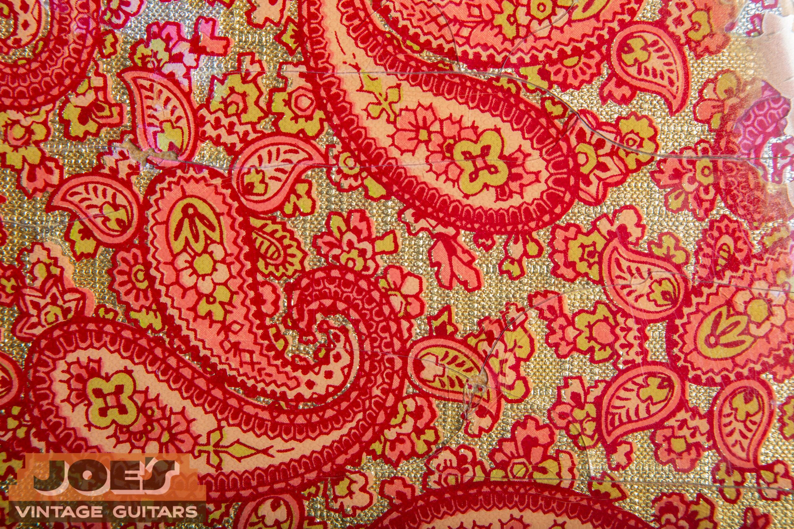

Close-up of the original Cling-Foil surface on a 1968 example. Note the reflective metallic sheen of the aluminum base layer beneath the printed paisley pattern.

### The Edge Burst

The foil couldn't wrap around the contoured edges of the body cleanly, so Fender sprayed a **pinkish-red metallic halo burst** around the perimeter to hide the seams. On a genuine original, the edge burst ages along with the rest of the body. If it looks fresher than the foil, you're probably looking at a repair or a repro.

### How the Finish Ages: Three Signatures

**Lifting and Bubbling.** Aluminum foil was never an ideal long-term surface for wood adhesive to bond to. Over decades, the bond breaks down in spots and the foil lifts or bubbles. This is common on surviving examples, and it's actually a positive authentication signal. A suspiciously flat, perfectly bonded surface deserves more scrutiny, not less.

**The Shatter Effect.** The clear coat is a thick, brittle polyester. It isn't nitrocellulose, and the two finishes fail very differently. Nitro checks in fine hairline networks. Polyester shatters, fragmenting into large, glass-like chunks. Clean, un-cracked examples are extremely rare. Fine hairline checking on a claimed original is a red flag, because it suggests a refinish in nitro.

**UV Fluorescence.** Under a blacklight, original vintage polyester reacts with a specific signature tied to the era's polyester chemistry and the original pink pigment. Modern reissue finishes fluoresce differently, and the variance is usually obvious to an experienced eye.

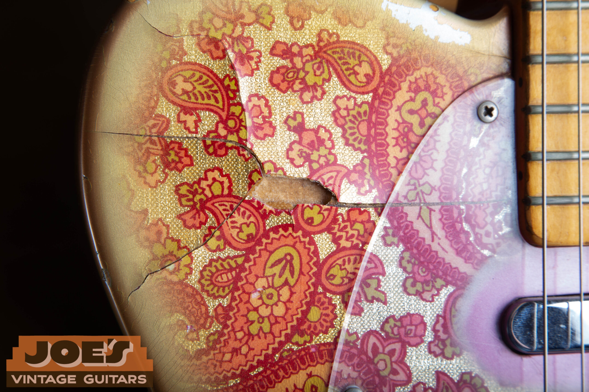

A missing chunk of the Cling-Foil paper on the 1969. Completely typical wear for this model. The foil delaminates and can be lost entirely in high-wear areas, which is a positive authenticity indicator rather than a problem.

**Authentication Warning:** Many of these guitars were stripped and refinished during the 1970s, when the psychedelic look was considered outdated. A significant percentage of "Paisley Telecasters" encountered today are CBS-era Telecasters that have been refinished with a later reproduction of the foil. The shattering pattern, foil bubbling, UV response, and the "puzzle piece" test (covered later) are all essential checks before any serious money changes hands.

## 3\. Neck Construction: The Fastest Way to Tell 1968 From 1969

The neck is the easiest place to tell the two model years apart. Fender changed neck construction in this window, and the difference is immediately visible once you know what you're looking at.

### 1968: Maple Cap Fretboard

Most 1968 models have a **maple cap fretboard**. That's a separate thin piece of maple glued on top of the neck blank. With this construction, you'll see **no "skunk stripe"** on the back of the neck, and **no walnut plug** on the headstock face.

### 1969: One-Piece Maple Neck

By 1969, Fender had returned to the traditional one-piece maple neck. Truss rod cavity routed from the back, filled with a **walnut "skunk stripe"** running heel to headstock, with a matching **walnut plug** visible at the headstock face.

### Date Stamps, Fretboard Dots, and Ink Colors

Date stamps were applied in **black ink** for 1968 and through early 1969. Mid-to-late 1969 saw a transition to **green ink**. Both years used **black dot position markers** on the maple fretboard. If you need help decoding the neck stamp or serial number on your instrument, our [Fender serial number guide](/fender-guitars-serial-number-guide/) walks through every CBS-era dating system in detail.

<figure>

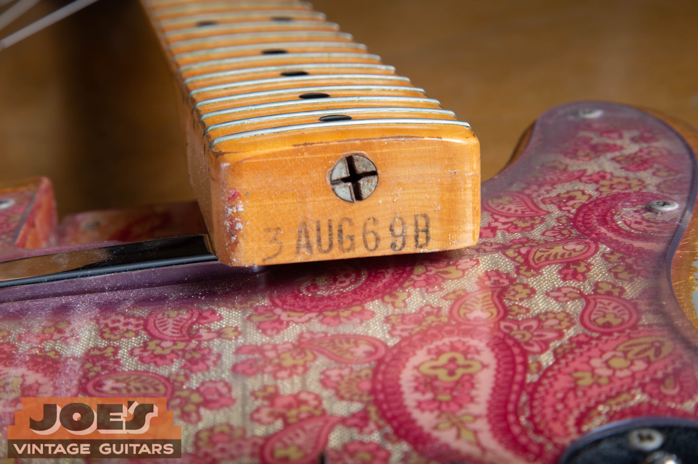

<figcaption>Black ink heel stamp on the 1969 neck. Early 1969 examples use black ink; late 1969 transitions to green.</figcaption>

</figure>

<figure>

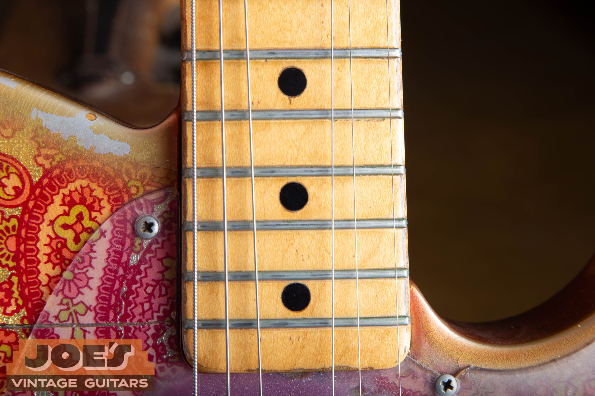

<figcaption>Black dot position markers on the maple fretboard, identical on both 1968 and 1969 models.</figcaption>

</figure>

### The CBS Black Logo

The headstock carries the CBS-era "black logo": "Fender" in large black letters with a gold outline, "Telecaster" in bold black block lettering below, and patent numbers underneath that. This is distinct from the pre-CBS gold transition logos and the later 1970s decals. Our guide to [dating a Fender by its parts](/fender-physical-features/) lays out the logo styles and patent-number blocks by era. If the logo doesn't look right, the neck probably isn't right either.

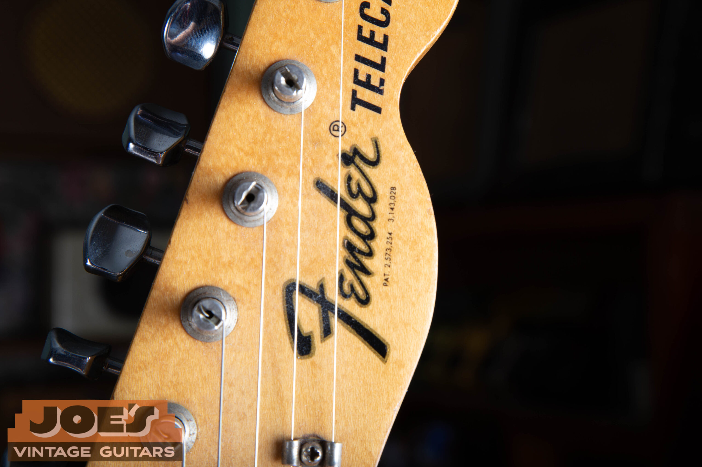

The CBS black logo on the 1969 headstock. "Fender" in large black letters with gold outline, "Telecaster" in bold block lettering with patent numbers below.

## 4\. Hardware, Electronics, and the 1966 Pot Code

The hardware on these guitars is a snapshot of CBS-era Fender's parts bin circa 1966 to 1968, and knowing the specific components matters a lot when you're authenticating one.

### Knobs

Both years use **chrome-plated brass knurled flat-top knobs**, sometimes called "skirted" knobs. These replaced the 1950s-style domed "top hat" knobs and are specific to the CBS era. The knurling pattern and the flat top are the identifying features.

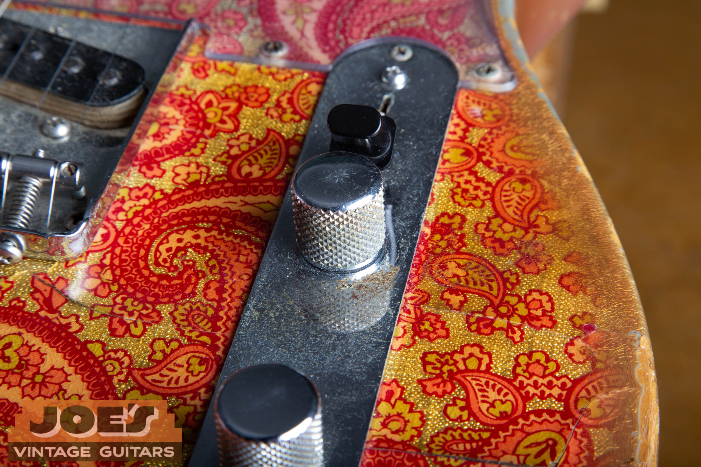

The CBS-era chrome knurled flat-top knob. Compare it to an earlier 1950s dome-top knob and the flat top with knurling is the instant identifier.

### Bridge and Saddles

The bridge is the classic Telecaster **"ashtray" plate** with **three threaded steel saddles**. The threaded barrel saddles allow adjustable string spacing but are prone to oxidation and surface rust after decades of exposure. Light oxidation on the saddles is actually a positive authentication indicator. Perfectly polished saddles on a claimed original deserve a second look.

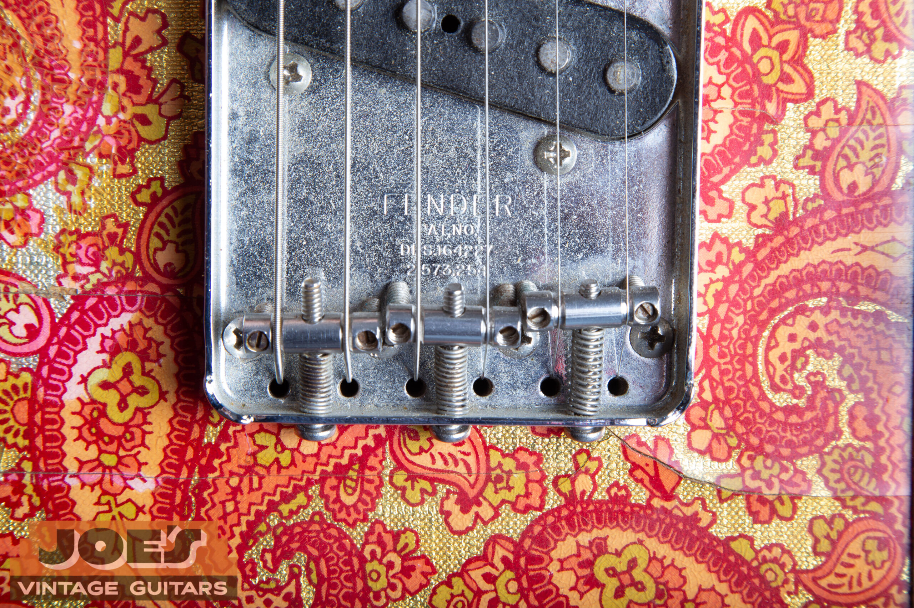

The "ashtray" bridge plate and threaded steel saddles on the 1969. Note the surface oxidation on the saddles, expected and correct on an original instrument.

### The Plexiglass Pickguard

One of the components that stands out most is the thick clear **Plexiglass (Lucite) pickguard**. The underside was back-sprayed with pink paint around the pickup cavity and control areas to keep the pink color scheme visible through the transparent material. On original vintage examples, this back-sprayed paint typically bubbles or flakes off the plastic over time. It's a signature that's difficult to fake convincingly.

<figure>

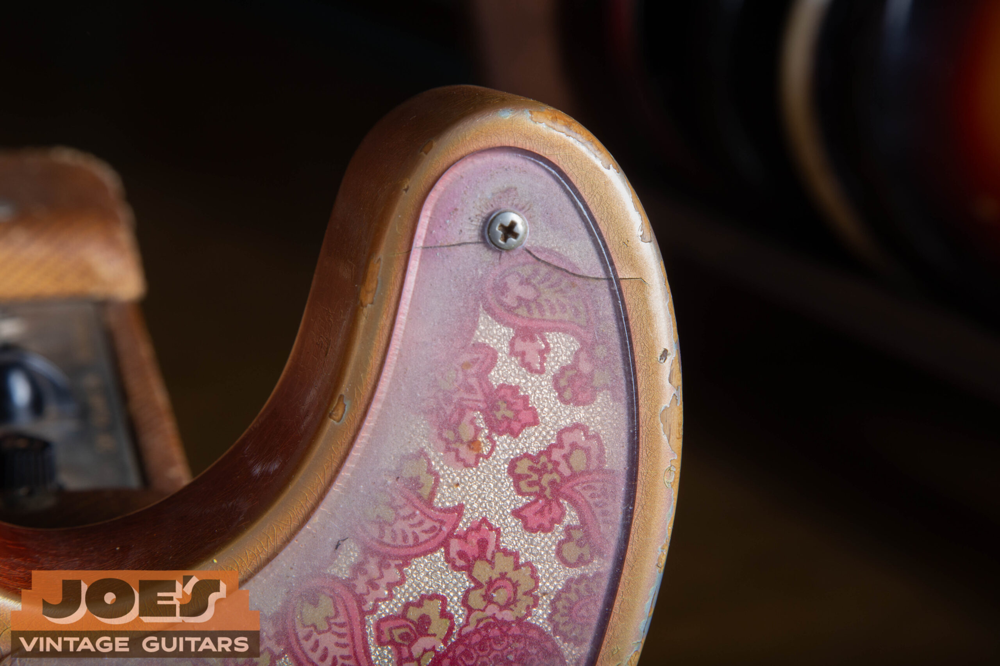

<figcaption>The clear Lucite pickguard. The pink back-spray is visible through the transparent plastic. Look for bubbling or flaking on originals.</figcaption>

</figure>

<figure>

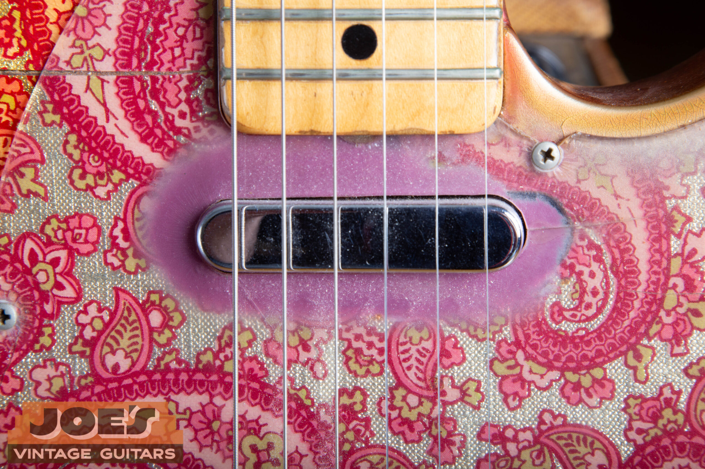

<figcaption>The pinkish-red paint back-sprayed around the neck pickup on the underside of the 1968 pickguard. This paint ages, cracks, and lifts on originals.</figcaption>

</figure>

### Potentiometers: The 1966 Date Code Situation

**The 137-66 Code:** Fender bought a large supply of **CTS potentiometers in 1966** and worked through that inventory for several years. The EIA date code on original Paisley pots reads **137-66XX**, meaning CTS-manufactured in 1966. This applies to both 1968 and 1969 guitars. Finding 1966-dated pots in a claimed 1969 Paisley is completely correct, not a sign of replacements.

The pots are **1 Megohm (1MΩ)**, a CBS-era spec that gives the guitar its *bright, glassy top end.* Earlier 1950s Telecasters used 250kΩ pots, which rolled off more treble before it reached the output jack.

### Wiring

By late 1968, **PVC plastic-coated wire** had become the factory standard, replacing the older cloth-covered wire. Early 1968 examples may show a mix of both. Later 1968 and all 1969 examples should show predominantly PVC coating.

### Tuners

Both years use **chrome "F"-stamped tuning machines**. These are Fender's own units, with the big "F" stamped into the back of each chrome housing, not into the button. They're specific to the CBS era and were used across many Fender models in this period.

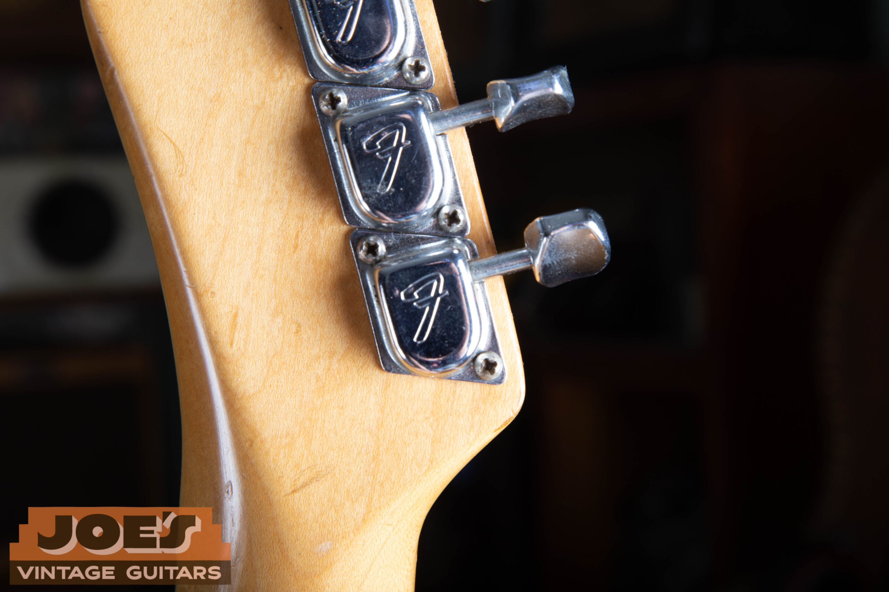

Chrome "F"-stamped tuning machines on the 1969. The "F" stamp on the back of the housing is the CBS-era identifier, correct on both 1968 and 1969 examples.

## 5\. The "Puzzle Piece": The Single Most Important Authentication Test

This is the test that separates informed buyers from people who get burned. It works on a simple principle. The finish under the neck plate was sealed off from light, air, and physical wear from the moment the guitar left the factory floor.

-   The pink burst under the plate will be more vibrant and saturated than the rest of the body, which has been UV-exposed for decades.
-   The polyester clear coat under the plate will be smooth and un-shattered. It was never exposed to the thermal cycling and mechanical stress that causes polyester to fail.
-   The transition line should be sharp and precise, matching the exact shape of the four-bolt "F" stamped neck plate.

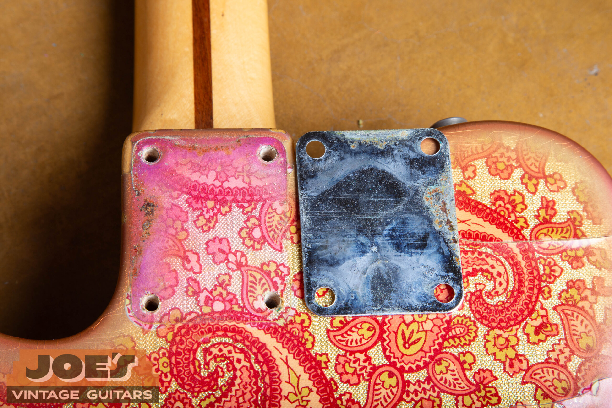

The "puzzle piece" shadow on the 1969 with the neck plate removed. The protected finish is visibly more vibrant and un-shattered than the surrounding body, which is exactly what a genuine original should show.

**Red Flag:** If the finish under the neck plate shows the same cracking, shattering, or UV-fade pattern as the rest of the body, the finish was almost certainly applied *after* the guitar left the factory. For the protection shadow to exist, the clear coat had to be in place before the neck plate was bolted on at the factory.

## 6\. Buyer's Authentication Checklist

#### Finish Checks

-   Polyester clear coat shows shattering or large crack fragments, not fine checking
-   Foil shows localized lifting or bubbling in some areas
-   Edge burst shows age-consistent fading and patina
-   UV blacklight shows period-correct fluorescence profile
-   Fine crazing or checking in the clear coat (indicates nitro, not original polyester)
-   Perfectly flat, un-bubbled foil (possible recent re-glue or replacement)

#### Neck Plate / Puzzle Piece

-   Clean, vibrant finish shadow under neck plate matching the plate shape precisely
-   Un-shattered clear coat in the protected zone only
-   Shattering or aging pattern continuous under the plate, same as surrounding body
-   Fresh-looking finish everywhere including under plate (recent refinish)

#### Electronics and Hardware

-   Pots date-coded 137-66XX (CTS 1966) with 1MΩ values
-   Clear Lucite pickguard with period-appropriate pink back-spray (may be flaking)
-   Threaded steel saddles with light oxidation
-   Chrome "F"-stamped tuning machines
-   Newer-era pot codes (post-1969) or 250kΩ pots (wrong era)
-   Replacement pickguard without aged back-spray

#### Neck Dating

-   Black ink heel stamp (1968 and early 1969)
-   Green ink heel stamp (late 1969 only)
-   Maple cap construction with no skunk stripe (1968)
-   One-piece maple with skunk stripe present (1969)
-   Neck construction inconsistent with claimed year

## 7\. Specification Comparison: 1968 vs. 1969

| Feature | 1968 Specification | 1969 Specification |
| --- | --- | --- |
| Neck Construction | Maple cap fretboard, no skunk stripe | One-piece maple, walnut skunk stripe |
| Headstock Plug | None | Walnut plug present |
| Heel Stamp Ink | Black ink | Black ink (early) or green ink (late) |
| Potentiometers | CTS 1MΩ, 137-66XX date code | CTS 1MΩ, 137-66XX date code |
| Knobs | Knurled flat-top chrome brass | Knurled flat-top chrome brass |
| Bridge Saddles | Threaded steel barrel saddles | Threaded steel barrel saddles |
| Tuners | Chrome "F"-stamped | Chrome "F"-stamped |
| Body Wood | Basswood (primary) | Basswood (primary) |
| Fretboard Dots | Black | Black |
| Wiring | Mix of cloth and PVC | PVC-coated (standard) |

## 8\. Notable Players

### James Burton

**James Burton** is the most historically significant Paisley Tele player. He played a **1969 example** extensively as lead guitarist on tour with **Elvis Presley**. The visual pairing of Burton, Elvis's Las Vegas-era show, and the pink paisley guitar is one of the most recognizable in American popular music. Burton's playing on that guitar can be heard across some of the defining live recordings of Elvis's career.

### Brad Paisley

**Brad Paisley** uses his **1968 Paisley Tele** (nicknamed *"Old Pink"*) as his signature instrument. It appears across most of his recorded output and is probably the most-photographed surviving 1968 example in existence.

### Noel Gallagher and Geddy Lee

**Noel Gallagher** of Oasis has been photographed with a Paisley Telecaster, and **Geddy Lee** of Rush plays a **1968 Paisley Telecaster Bass**. The bass was the four-string variant produced in the same foil finish during the same brief production window.

## 9\. Rarity, Survival Rate, and Market Context

Production numbers were extremely limited. Fender never officially documented them, but vintage specialists generally place total production at somewhere **between 300 and 400 units**. By the mid-1970s the psychedelic aesthetic had fallen completely out of fashion, and **a significant percentage of original Paisleys were stripped or refinished** into plain sunburst or solid-color guitars during that period. Truly original, unmodified examples are now scarce, and the market price reflects that.

**Market Note:** Fender has produced reissues over the decades, most notably through the Japanese Fender catalog since the 1980s. The reissues are excellent guitars in their own right, but they're not the same collector proposition as an original CBS-era example. Verify production era before any significant purchase.

Further reading

-   [1959 Fender Telecaster authentication guide](/post/1959-fender-telecaster-authentication-guide/)
-   [1952 Fender Telecaster authentication guide](/post/1952-fender-telecaster-authentication-guide/)
-   [Fender Jazzmaster evolution guide, 1958 to 1971](/post/fender-jazzmaster-evolution-guide-1958-1971/)
-   [Fender guitar serial number dating guide](/fender-guitars-serial-number-guide/)

## The Bottom Line

The 1968 and 1969 Fender Pink Paisley Telecasters are simultaneously ridiculous and magnificent. Fender took its most workmanlike instrument and wallpapered it in decorative aluminum foil, then somehow produced something that has outlasted the cultural moment that inspired it by more than half a century. The shattered polyester, the bubbling foil, the UV-faded pink that collectors hunt for? Those are exactly the wear signatures the factory finish was always going to produce.

If you have one, you should understand what you have. If you're looking for one, study the details above until they're second nature. The guitars that survive in original condition are rare enough that there's real money at stake. There's also real history. [Browse our current inventory](/) to see what original examples look like, or [get a free appraisal](/free-appraisal/) if you think you have one.
