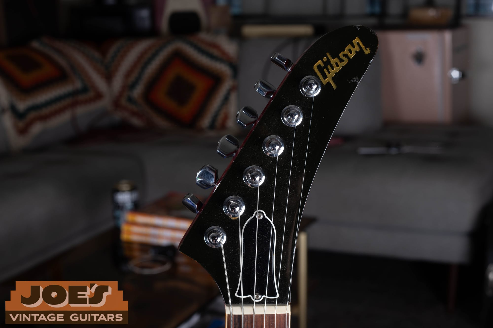
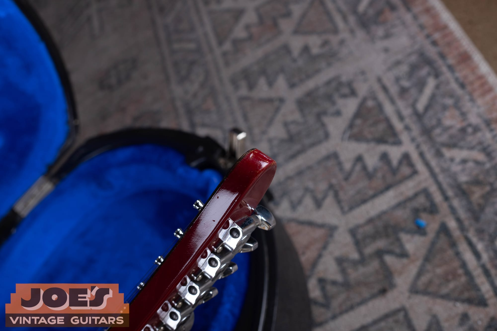
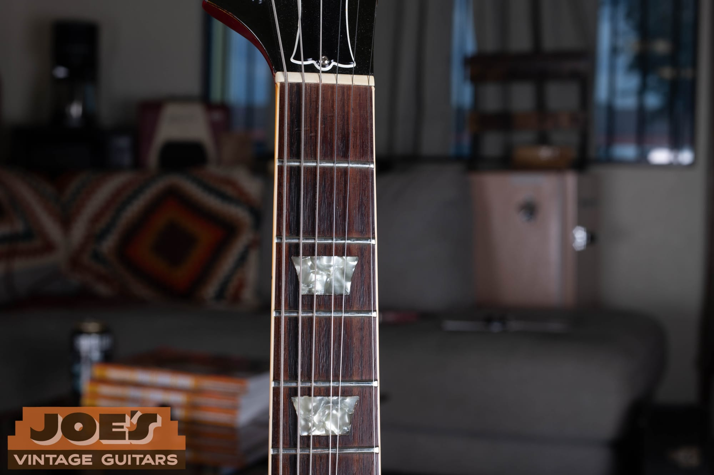
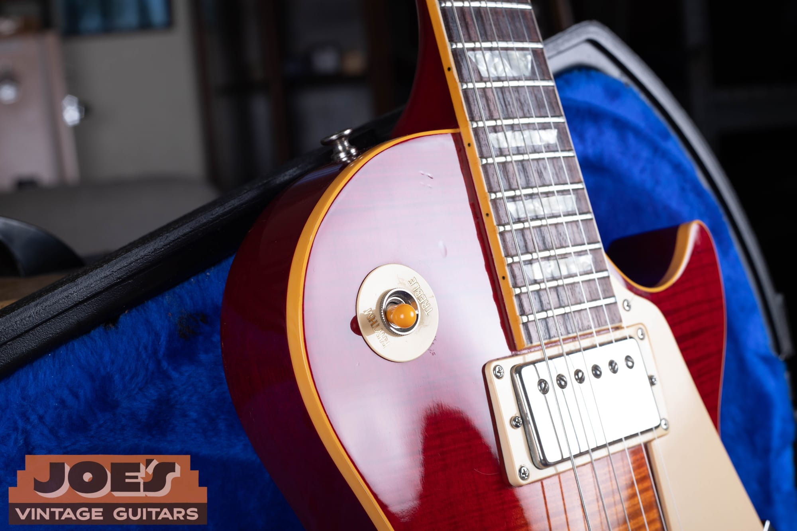
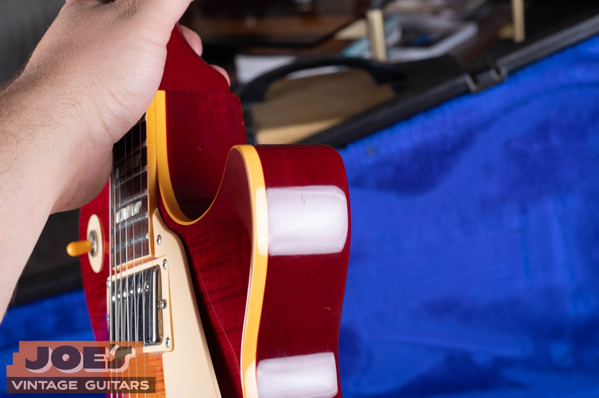
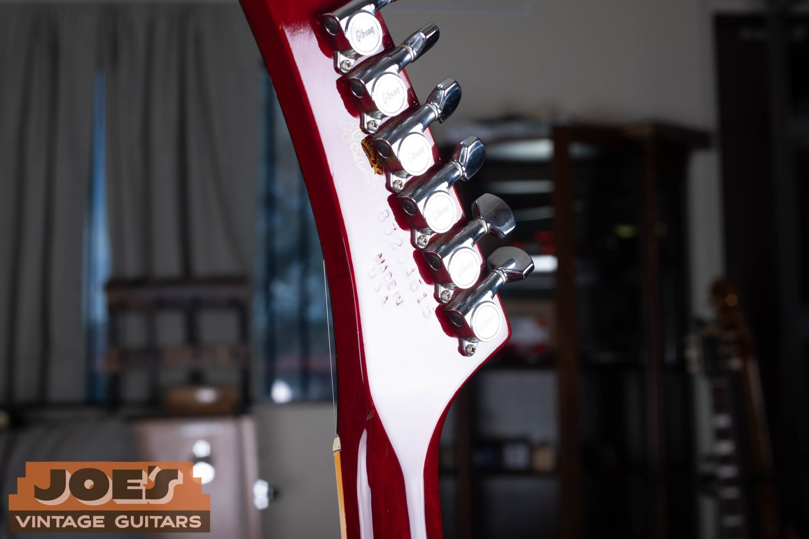
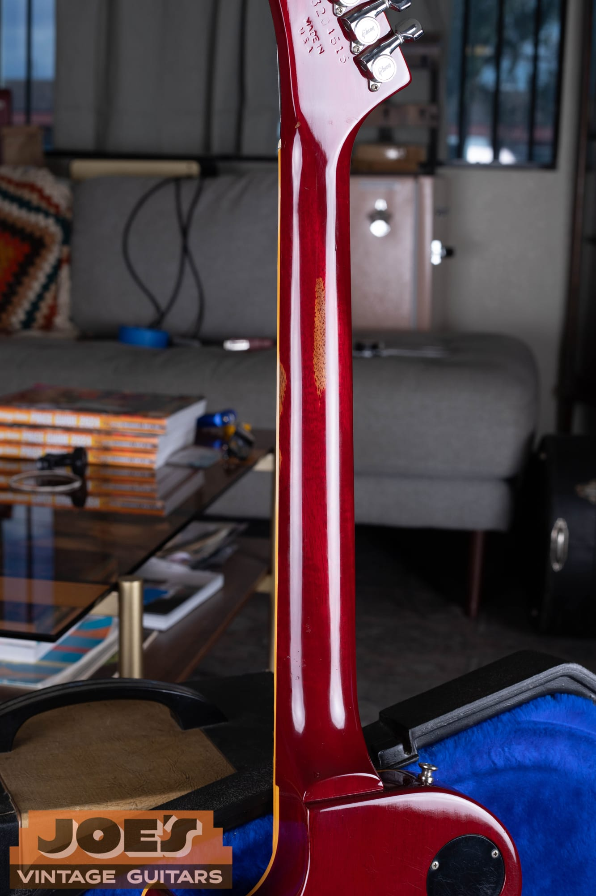
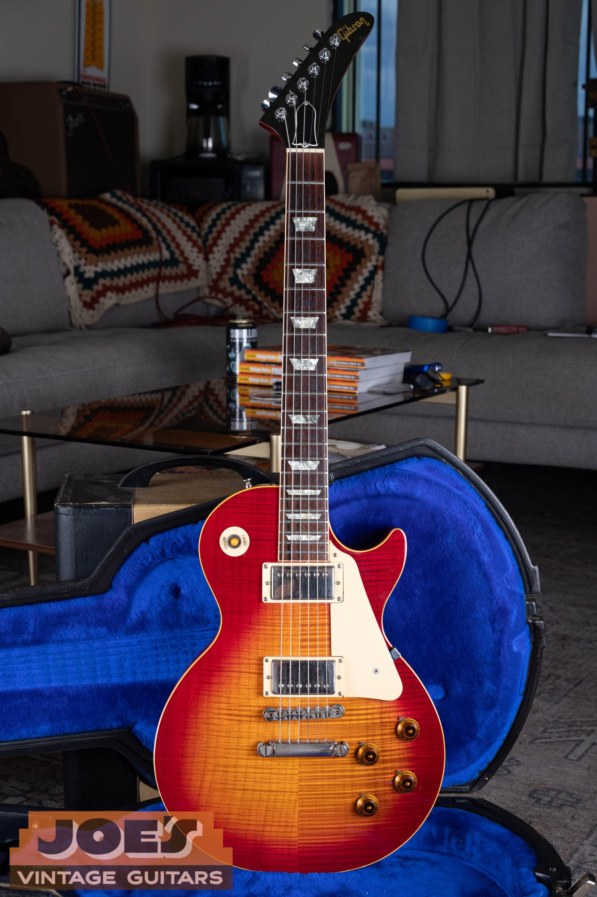
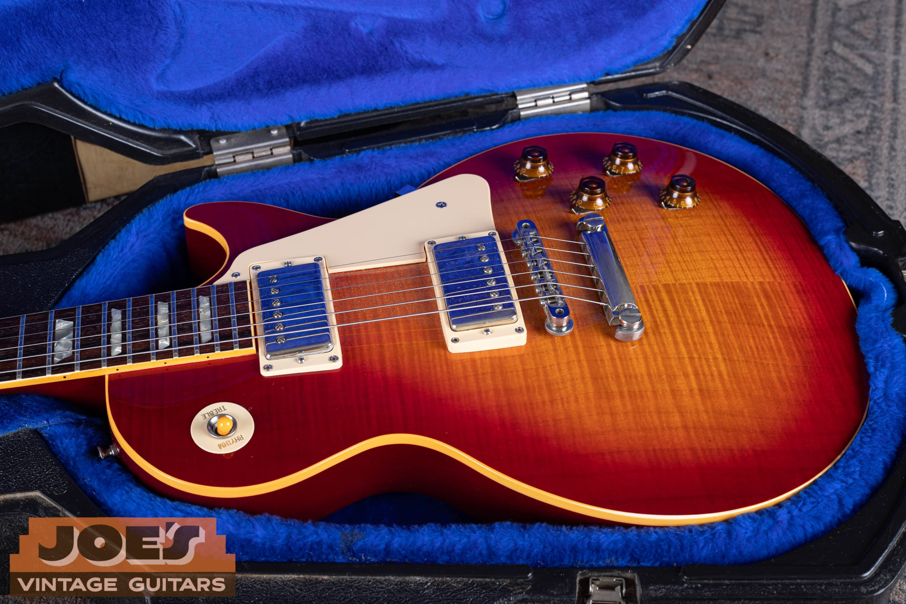
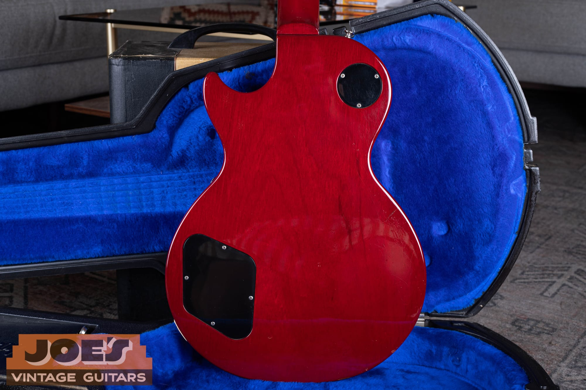

Collector's Reference · Gibson Custom Shop, Mid-1980s

The full story of Gibson's Explorer-headstock Les Paul Standard,
the specs, the rumors, and how to tell a real one from its production cousin

-   [Overview](#overview)
-   [What XPL Actually Means](#what-xpl-actually-means)
-   [Who Was Aldo Nova](#who-was-aldo-nova)
-   [Why Gibson Built It](#why-gibson-built-it)
-   [How Many Were Made](#how-many-were-made)
-   [Specifications](#specifications)
-   [How to Identify a Genuine Example](#how-to-identify-a-genuine-example)
-   [A Closer Look at Our 1984 Example](#a-closer-look-at-our-1984-example)
-   [What It Is Worth](#what-it-is-worth)
-   [Related Resources](#related-resources)

## Overview

Every so often a guitar comes along that stops people in their tracks the moment they see the headstock. The Gibson "Aldo Nova" Les Paul is one of those guitars. From the body down it is a traditional single-cutaway Les Paul Standard: mahogany back, carved and flamed maple top, cherry sunburst, two humbuckers, a bound rosewood board with trapezoid inlays. Then your eye reaches the top of the neck and finds a sharp, drooping Explorer headstock where the familiar open-book shape should be. It is the kind of detail that looks wrong for about two seconds and then looks fantastic.

Gibson never cataloged a guitar called the "Aldo Nova." The name is a collector nickname, attached to the model because the Canadian rocker Aldo Nova played one and, by his own account, had a hand in the design. Gibson's own name for the treatment was XPL, short for Explorer, the term the company used in the mid-1980s whenever it grafted an Explorer-style headstock onto another body. The example you see throughout this guide, and the one most people mean when they say "Aldo Nova Les Paul," is the rarest version: a Gibson Custom Shop single-cutaway Standard with that Explorer headstock, built in tiny numbers around 1983 and 1984.

Because so few were made and so little was documented, this model has collected more than its share of legend over the last forty years. This guide separates what is known from what gets repeated, walks through the specifications, and shows you how to tell the genuine Custom Shop version from the production double-cutaway that shares the XPL name.

## What XPL Actually Means

Here is the single most useful thing to understand about this guitar, because it clears up most of the confusion online. "XPL" is not a model. It is Gibson's shorthand for the Explorer headstock, and in the mid-1980s Gibson put that headstock on more than one guitar. When people say "Les Paul XPL," they could be talking about either of two very different instruments.

*The feature that names the guitar. The Explorer, or XPL, headstock replaces the usual open-book Gibson shape with the sharp, drooping profile taken from the Explorer and Firebird. Black face, gold Gibson logo, blank bell truss rod cover, six tuners in a line.*

The **single-cutaway Custom Shop Standard**, the guitar in these photos, is the one collectors call the Aldo Nova. It is a normal Les Paul Standard body, carved flamed-maple top, single cutaway, wearing the Explorer headstock. It carries a "Custom Shop Edition" mark on the back of the headstock and was built in very small numbers. This is the rare and valuable one.

The **double-cutaway Les Paul XPL** is a different animal. Gibson listed a double-cutaway model, variously known as the Les Paul XPL, the Les Paul DC, the DC-400, or the Spirit II XPL, from about 1984 to 1987. It has a symmetrical double-cutaway body, the same Explorer headstock, chrome hardware, and it usually left the factory with a Kahler locking tremolo. Finishes ran to Ferrari Red and Heritage sunbursts. These were regular production guitars rather than Custom Shop pieces. They are uncommon today, but they are not in the same league of rarity as the single-cut, and they are worth a fraction of what the Custom Shop version brings.

So the quick test is the body. One cutaway and a "Custom Shop Edition" stamp means you are looking at the rare Aldo Nova. Two cutaways, usually with a Kahler tremolo, means you are looking at the production DC. Both are honest 1980s Gibsons. Only one of them is the guitar this article is really about.

## Who Was Aldo Nova

Aldo Nova was born Aldo Caporuscio in Montreal on November 13, 1956, to Italian immigrant parents. He took the stage name as a teenager and broke through in 1982 with his self-produced debut album, *Aldo Nova*, which reached number 8 on the Billboard 200 and went double platinum in the United States. The single that carried it was "Fantasy," a track that opens with a helicopter, a burst of machine-gun sound effects, and one of the more recognizable hard-rock guitar riffs of the era. It hit number 23 on the Hot 100 and number 3 on the Mainstream Rock chart, and its video was in heavy rotation in the first years of MTV.

On record and on stage, Nova was a Les Paul player. He is most associated with a wine-red Les Paul Custom and a tobacco-burst Standard, both loaded with DiMarzio Super Distortion pickups, which is exactly the hot, compressed humbucker sound you hear on "Fantasy." By his own telling, that relationship with the Les Paul led to a conversation with Gibson about building something with an Explorer headstock, and the XPL Standard was the result.

There is more to his career than one hit. Nova went on to a long life as a writer and producer. He wrote the main riff for Jon Bon Jovi's "Blaze of Glory" in 1990, and he co-produced Celine Dion's 1996 album *Falling into You*, which won the Grammy for Album of the Year. But it is the 1982 image, the guitar and the pyro and the jumpsuit, that a certain generation of players remembers, and it is why his name stuck to this guitar.

## Why Gibson Built It

To understand why a pointed headstock ended up on a Les Paul, you have to remember where Gibson was in 1984. The company was near the end of the Norlin era, its longest stretch of corporate ownership and, by most accounts, its most troubled. Sales were down, the historic Kalamazoo, Michigan plant closed for good in June 1984, and in January 1986 Norlin sold Gibson to the investor group led by Henry Juszkiewicz that runs it to this day.

*The drooping point of the Explorer headstock. In 1984 this was Gibson chasing the pointed, hot-rodded look that was selling for the California builders.*

At the same time, the market had moved. Kramer, Jackson, and Charvel were selling every pointy, locking-tremolo superstrat they could build, and a traditional single-cutaway Les Paul was starting to look old-fashioned to a teenager watching MTV. Gibson's answer was a wave of modernized designs meant to look tougher and more current: hot ceramic Dirty Fingers pickups, Kahler tremolos, and pointed Explorer headstocks bolted onto familiar bodies. The XPL treatment was part of that push. The Explorer headstock also let Gibson lean on one of its own shapes, the same silhouette used on the Explorer and Firebird, rather than borrowing from anyone else.

The Custom Shop single-cutaway Aldo Nova sits at the intersection of two things happening at once inside Gibson: an early, still-informal Custom Shop willing to build small artist-driven runs, and a company-wide effort to make the Les Paul look like it belonged in 1984. The result is a guitar that is pure vintage Les Paul from the binding down and pure MTV-era Gibson from the nut up.

## How Many Were Made

This is where the legend takes over, so it is worth being careful about what is actually known.

Aldo Nova himself has said the number is twelve. In interviews he has described the guitar as one he designed and Gibson built for him, that only twelve were made in the world, and that he still owns the first one. Other longtime dealers and collectors put the figure a little higher, at fewer than twenty known examples. At least one 1986 Custom Shop example, finished in Polaris White, is documented as one of about twenty-five produced. Those numbers do not all agree, and they may be describing slightly different runs or years.

What is fair to say is this: Gibson did not publish production totals for these, the Custom Shop paperwork from the mid-1980s is thin, and no serial-number ledger has surfaced that settles the question. Anyone who quotes you an exact count is repeating a story, not citing a record. The honest version is that these were built in very small numbers, somewhere in the low dozens across all years and colors, which puts them among the rarest Gibsons of the decade.

The way they were sold adds to the fog. The common account is that the batch was spread among Gibson's top dealers rather than sold through normal channels, with one reportedly bought new from a shop in Rochester, New York in 1984. Rick Nielsen of Cheap Trick, one of the best-known guitar collectors alive, owns one, and the usual story is that he bought his from Gruhn Guitars in Nashville in the mid-1990s. Nova's telling is that the rest simply went to Nielsen. Both versions get repeated, and they are not really compatible, which tells you how much of this history lives in memory rather than on paper.

## Specifications

Because so few were made and Custom Shop guitars of this period were built to order, you should treat any spec list as a strong tendency rather than a hard rule. Individual examples vary in pickups, hardware color, and finish. The list below describes the single-cutaway Custom Shop Standard as it is most often seen, and matches the 1984 example pictured in this guide.

| Feature | Specification |
| --- | --- |
| Model | Les Paul Standard with XPL (Explorer) headstock, Gibson Custom Shop |
| Years | Approximately 1983 to 1984 for sunburst examples, with a small 1986 Polaris White run |
| Body | Solid mahogany back with a carved, figured maple top, single cutaway |
| Top binding | Single-ply cream |
| Finish | Cherry sunburst over flamed maple, with a translucent cherry back, sides, and neck; nitrocellulose lacquer |
| Neck | Set mahogany, rounded profile |
| Fingerboard | Bound rosewood, pearloid trapezoid inlays, 22 frets |
| Scale | 24.75 inches |
| Headstock | Explorer (XPL) shape, black face, gold Gibson logo, bell-shaped truss rod cover |
| Tuners | Chrome enclosed tuners with Gibson-stamped covers, six in a line |
| Pickups | Two humbuckers, chrome covers, cream mounting rings |
| Controls | Two volume, two tone, three-way toggle |
| Bridge | Nashville Tune-o-Matic with a separate stopbar tailpiece |
| Hardware finish | Chrome |
| Markings | "Custom Shop Edition" decal, "Made in U.S.A.," and an impressed eight-digit serial on the back of the headstock |

A few of these deserve a closer look.

*From the nut down, this is a Les Paul Standard. Bound rosewood board, pearloid trapezoid inlays, and the rounded 1980s Gibson neck. Nothing about the playing surface tells you the headstock is unusual.*

The **top** is the giveaway that this is a Standard underneath, not a stripped-down model. It is a carved, figured maple cap with real flame, finished in a cherry sunburst that fades from cherry-red edges to an amber center. The back, sides, and neck are a translucent cherry that lets the mahogany grain show through, which is a common Gibson look for the period and reads very differently from an opaque finish.

*The control area is classic Les Paul: a three-way toggle with a gold Rhythm and Treble ring, an amber toggle tip, and amber top-hat knobs with numbered skirts. Two volumes and two tones, wired the traditional way.*

The **hardware on this example is chrome**, not gold, and it wears two chrome-covered humbuckers with cream rings. This matters because you will read forum posts describing gold hardware, three pickups, or a fine-tuner tailpiece on "the" Aldo Nova. Those descriptions come from other examples or from guesswork. The lesson is to describe the guitar in front of you rather than the guitar on the internet, because this run was not built to a single fixed spec.

*The profile shows the carved maple cap sitting on the mahogany body, with a single-ply cream binding around the top. This is standard Les Paul construction, which is a large part of why the guitar plays and sounds like a Les Paul rather than an oddity.*

## How to Identify a Genuine Example

The Aldo Nova is rare enough, and valuable enough, that it is worth knowing what a real one shows. Use several of these together rather than relying on any single point.

**Start with the back of the headstock.** A genuine Custom Shop example carries a gold "Custom Shop Edition" decal, a "Made in U.S.A." stamp, and an impressed eight-digit serial number. That decal is the fastest confirmation that you are looking at the small Custom Shop run and not a later parts guitar or a converted production model.

*The provenance is on the back of the headstock: the gold "Custom Shop Edition" script, the impressed serial, and "Made in U.S.A." Chrome enclosed tuners with Gibson-stamped covers finish the picture.*

**Read the serial number.** Gibson's eight-digit format from this era encodes the date. The first and fifth digits together give the year, and the middle digits give the day of the year. On our example the serial reads as a 1984, which lines up with the finish, the hardware, and the known production window. If you want to work through the format yourself, our [Gibson serial number guide](/how-to-read-gibson-serial-numbers/) walks through it step by step.

*The impressed eight-digit serial and "Made in U.S.A." stamp. Read together with the finish and hardware, the number places this guitar in 1984.*

**Confirm the body is a single cutaway.** As covered above, a double-cutaway body means you have the production DC XPL, not the Custom Shop Standard. It is the most common mix-up, and the difference in value is large.

**Check that the top is a carved, figured maple cap.** The Aldo Nova is built on a real Standard, so it should have the carved maple top and cherry sunburst, not a flat or plain top. Combine that with the Explorer headstock and the Custom Shop decal and you have a consistent story.

**Be realistic about spec variation.** Because these were small-batch Custom Shop builds, do not reject a guitar simply because its pickups or hardware do not match some other example you have seen. Look instead for the things that were consistent: the single-cut Standard body, the Explorer headstock, the Custom Shop Edition mark, a period-correct serial, and honest, matching wear across the whole instrument. For a guitar at this value, and with this much folklore attached, a written opinion from someone who can handle it in person is worth getting before money changes hands.

## A Closer Look at Our 1984 Example

The guitar photographed throughout this guide is a 1984 that came through the shop, and it is a clean, honest example of everything described above. It is finished in cherry sunburst over a nicely flamed maple top, with the translucent cherry back, sides, and neck that are correct for the period.

*The whole guitar in one look. A cherry sunburst Les Paul Standard from the binding down, with the Explorer headstock up top. That combination is the entire idea of the model.*

It is a two-pickup guitar with chrome-covered humbuckers and cream rings, a cream pickguard, amber top-hat knobs, and the gold Rhythm and Treble poker chip around the toggle. The bridge is a Nashville Tune-o-Matic with a separate stopbar. All of the hardware is chrome, including the enclosed Gibson-stamped tuners on the Explorer headstock.

*Two chrome humbuckers, cream rings, a cream guard, and the amber knobs. Wired as a normal Les Paul, this guitar sounds like one, which is the quiet surprise of the model.*

The back tells the same story as the front: translucent cherry over mahogany, with the usual Les Paul control cavity and switch covers. There is light play wear and some finish scratches consistent with a guitar that was owned and enjoyed for forty years, along with a worn spot on the back of the neck, but nothing that changes what it is.

*The translucent cherry back over mahogany. Standard Les Paul cavities and covers, with the honest wear of a guitar that spent forty years being played.*

Guitars like this one are the reason the shop exists. It is a real piece of Gibson's strangest and most interesting decade, it is genuinely rare, and it has a story that people actually recognize the moment you say the name.

## What It Is Worth

Value is the hardest part to pin down, for the same reason the production numbers are hard to pin down: almost none of these trade, so there is very little sales data to build on. When a guitar surfaces once every couple of years, the last price is more of a curiosity than a market.

A few things are clear. The Custom Shop single-cutaway Aldo Nova is worth many times what the production double-cutaway XPL brings, so the first step in any valuation is confirming which one you actually have. Prices for the rare single-cut have climbed steadily over the last decade as the story has spread and as 1980s Gibsons in general have been rediscovered by collectors, and asking prices have reached well into five figures. But condition, originality, finish, and provenance move the number a great deal, and a headline price attached to one example does not automatically transfer to another.

If you own one, or think you might, the sensible move is to have it looked at rather than to trust a forum thread or a single old listing. You can start with a free, no-obligation [appraisal request](/free-appraisal/), and if you decide to move it, our guide to what these bring and how the market works lives in the [vintage Gibson Les Paul value guide](/vintage-gibson-les-paul-market-value-guide/). We also buy them outright: see [sell my Gibson](/sell-my-gibson-guitar/) for how that works.

## Related Resources

More vintage Gibson references from the shop.

-   [How to Read Gibson Serial Numbers](/how-to-read-gibson-serial-numbers/), the full dating guide, including the eight-digit format used on this guitar.
-   [Vintage Gibson Les Paul Value Guide](/vintage-gibson-les-paul-market-value-guide/), how Les Paul values are set and what different eras bring.
-   [Sell My Gibson Guitar](/sell-my-gibson-guitar/), how to sell a vintage Gibson to the shop.
-   [Free Vintage Guitar Appraisal](/free-appraisal/), send photos and details for a no-obligation opinion.

This reference is compiled from Aldo Nova's own published statements, documented examples that have sold through Gibson dealers and specialists, and the guitar in our own photos. Because Gibson did not publish production data for these Custom Shop pieces, some points in their history are genuinely disputed, and this guide tries to flag those rather than smooth them over. Always verify against the physical instrument, and get a hands-on opinion before any high-value purchase.
