

The original Gibson ES-225 family was shipped from 1955 through 1959. Every version is a fully hollow, single-cutaway thinline with a bound rosewood fingerboard and one or two black P-90 pickups. The single-pickup ES-225T places its pickup in the middle of the body. The two-pickup ES-225TD joined it in 1956.

Gibson introduced three thin-bodied electrics in 1955: the upscale Byrdland, the mid-priced ES-350T, and the ES-225T for what the 1956 catalog called the popular price field. The Byrdland reached prototype and serial production first, so the ES-225 should not be called Gibson's first thinline. It was the accessible member of that first-year group and the immediate sales leader. Gibson's ledger records 470 ES-225-family shipments in 1955, compared with three Byrdlands.

The ES-225 connects two Gibson eras. Its outline comes from the full-depth ES-175 family, while its shallow rim anticipates the ES-335 and ES-330. It also uses the long combined bridge and tailpiece associated with early Les Pauls. That mixture makes the model easy to recognize from across a room, but harder to authenticate from one photograph.

For family context, compare the [complete Gibson ES-125 guide](/post/gibson-es-125-guide/), the [1959 to 1962 ES-330 guide](/post/complete-dot-neck-es-330-guide-1959-1962/), and the [Gibson Byrdland authentication guide](/post/gibson-byrdland-authentication-guide/). Those pages show where the ES-225 overlaps with neighboring models and where the physical construction separates them.

This guide treats originality as a chain of evidence. A factory order number can support a year. It cannot prove that the pickups, finish, or hardware left Kalamazoo together. A period-correct part can still be a later transplant. Conversely, a missing paper label or a late-1959 bridge is not automatically a problem. The whole guitar has to tell one coherent story.

  
Original run<strong>1955 to 1959</strong>Five shipment years with normal factory overlap.

  
Core variants<strong>T · TD · TN · TDN</strong>One or two pickups, in sunburst or natural.

  
Best first date clue<strong>FON inside</strong>Look through the treble-side f-hole before judging hardware.

<strong>Joe Tip</strong>Start with the body, pickup layout, and factory order number, not the tuners or knobs. Small parts are easy to replace. The factory architecture is much harder to fake cleanly.

<h2 id="quick-identification">Quick Identification Checklist</h2>

A vintage ES-225 should present the following basic combination before the finer inspection begins:

- **Thin, fully hollow body:** The shallow rim does not contain an ES-335-style center block.
- **Single Florentine cutaway:** The pointed cutaway is part of the model's ES-175-derived outline.
- **Bound top, back, and fingerboard:** The f-holes themselves are not bound.
- **Black dog-ear P-90 pickup or pickups:** One centered pickup on the T, or neck and bridge pickups on the TD.
- **One-piece mahogany neck:** Paired with a bound rosewood fingerboard and pearl dot inlays.
- **Pearl Gibson headstock logo:** Together with six individual Kluson Deluxe tuners.
- **Long combined bridge and tailpiece on most examples:** A short trapeze and separate adjustable bridge can be correct on some late-1959 guitars.
- **Sunburst or Natural finish:** Natural guitars add the N suffix and have blonde laminated maple top, back, and rims.

These features identify the family. They do not prove that an individual guitar is original. The FON, routes, finish, hardware footprints, electronics, solder, and repair evidence must agree.

<h2 id="model-decoder">How to Read the ES-225 Model Name</h2>

The suffixes describe the factory configuration, not a quality grade. Catalogs, labels, and dealer listings may use spaces or omit a hyphen. Punctuation alone is not an authentication clue.

| Factory designation | Pickup layout | Controls | Finish | Original era |
| --- | --- | --- | --- | --- |
| **ES-225T** | One P-90, centered | Master volume and tone | Sunburst | 1955 to 1959 |
| **ES-225TD** | Two P-90s | Two volumes, two tones, 3-way switch | Sunburst | 1956 to 1959 |
| **ES-225TN** | One P-90, centered | Master volume and tone | Natural | Generally 1956 to 1959 |
| **ES-225TDN** | Two P-90s | Two volumes, two tones, 3-way switch | Natural | 1956 to 1959 |

The decoder is simple: **ES** means Electric Spanish, **225** is the model number, **T** means thinline, **D** means double pickup when present, and **N** means Natural finish when present.

<strong>Bench Note: the middle pickup is intentional</strong>On an ES-225T, the P-90 belongs between the conventional neck and bridge positions. That placement is the model's most immediate visual clue and part of its voice. Do not mistake it for a relocated neck pickup.

<figure>

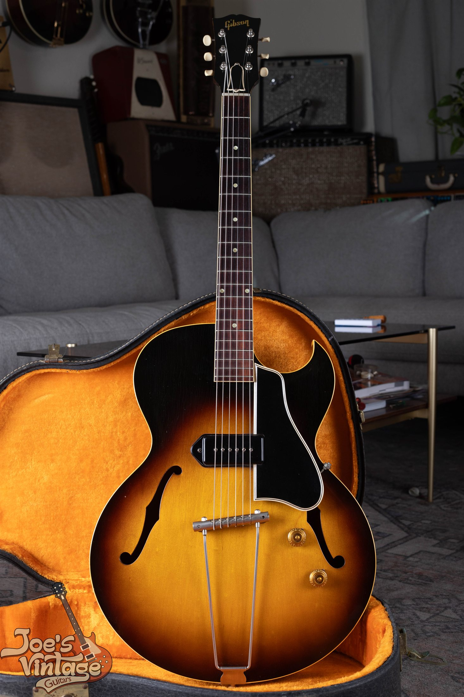

<figcaption><strong>1958 ES-225T.</strong> The single P-90 is centered, with two amber bonnet knobs and the long combined bridge and tailpiece.</figcaption>

</figure>

<figure>

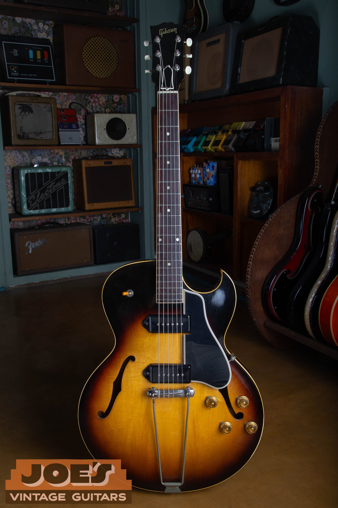

<figcaption><strong>1956 ES-225TD.</strong> Two P-90s, four controls, and a selector switch distinguish the D version.</figcaption>

</figure>

<figure>

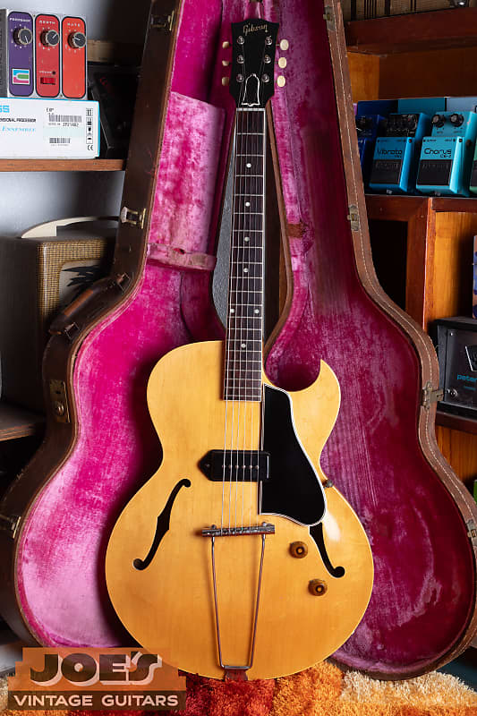

<figcaption><strong>1958 ES-225TN.</strong> The T layout remains, while the N suffix identifies the factory Natural finish. Owners often call this color blonde, but Natural is the factory suffix.</figcaption>

</figure>

<h2 id="year-by-year">The Gibson ES-225 Year by Year</h2>

Gibson used parts in batches and changed specifications gradually. Treat these dates as working ranges, then confirm any individual guitar with its physical evidence.

### 1955: FON prefix W

The one-pickup ES-225T arrives alongside the Byrdland and ES-350T as the popular-priced member of Gibson's new thin-bodied group. Its P-90 sits in the middle position, and the strings top-wrap over Gibson's long combined bridge and tailpiece. Shipping ledgers show two Natural examples, but the regular Natural option is generally associated with 1956 onward.

### 1956: FON prefix V

Gibson adds the ES-225TD with neck and bridge P-90s, a three-way selector, and four controls. Natural-finish guitars carry an N suffix: ES-225TN and ES-225TDN. This is the year the family becomes a complete range.

### 1957: FON prefix U

Both pickup layouts and both catalog finishes continue. Neck shape, fret feel, tuner details, plastics, and electronic date codes can vary within the year. The model name alone should never be used as a parts checklist.

### 1958: FON prefix T

The familiar one- and two-pickup versions remain, still fully hollow and ordinarily equipped with the long bridge and tailpiece. In the wider Gibson line, the semi-hollow ES-335 arrives. That makes the ES-225's center-block-free construction an increasingly important distinction.

### 1959: FON prefix S

Some late examples receive a shorter ES-330-style trapeze and a separate adjustable bridge on a rosewood base. The older long unit also appears in 1959, including in catalog material, so either arrangement can be period-correct when the rest of the evidence agrees. Production ends as the ES-330 and expanded ES-125 thinline line take over.

<strong>Transition rule</strong>A clean 1959 guitar with the old long bridge and tailpiece is not automatically earlier, and a 1959 guitar with the short trapeze is not automatically modified. Catalog photography, parts-bin overlap, and factory sequence do not change on January 1.

<h2 id="shipping-totals">Recorded ES-225 Shipping Totals</h2>

These figures are Gibson shipment totals grouped by finish for the ES-225 family. They are not a surviving-population census, and they do not separate T from TD.

| Year | Sunburst | Natural | Combined | FON prefix |
| --- | ---: | ---: | ---: | --- |
| 1955 | 468 | 2 | 470 | W |
| 1956 | 1,648 | 157 | 1,805 | V |
| 1957 | 1,753 | 229 | 1,982 | U |
| 1958 | 1,291 | 326 | 1,617 | T |
| 1959 | 1,395 | 248 | 1,643 | S |
| **Recorded total** | **6,555** | **962** | **7,517** | Not applicable |

The figures come from [Joe's transcription of Gibson shipping totals](/post/gibson-shipping-totals-1948-1979/). "Shipped" and "built" are not interchangeable. A guitar could be completed in one period and shipped in another.

The ledger's two Natural shipments in 1955 predate the commonly cited 1956 catalog introduction. They may represent special-order work, early examples, or ledger timing. They prove that exceptions exist. They do not establish a regular 1955 Natural specification by themselves.

<h2 id="specifications">Core Construction and Original Specification</h2>

### Body and dimensions

The body is fully hollow, with a single Florentine cutaway and no solid center block. The 1956 catalog prints a 16¼-inch width, 20¼-inch body length, and 1⅝-inch depth. The 1959 catalog gives 1¾ inches, and measured examples are commonly reported at about 1¾ inches. Treat 1⅝ versus 1¾ as a documented catalog and measurement discrepancy, not proof of a body-depth transition.

### Materials

Laminated maple is used for the top, back, and rims. The neck is mahogany, and the bound fingerboard is rosewood. Top and back edges are bound. The f-holes are left unbound. On a Natural example, the maple back and sides should remain visibly blonde rather than reading as a dark mahogany body.

### Neck and frets

The nominal scale is Gibson's 24¾ inches. The neck carries 20 nickel-silver frets, pearl dot inlays, a nylon nut, and an adjustable truss rod. Neck carve and fret feel evolve through the run and should be compared with other Gibsons from the same year, not with one ideal profile.

### Electronics

The pickup is a black dog-ear P-90 with individually adjustable pole screws. The T has one volume and one tone. The TD adds independent volume and tone pairs plus a three-way toggle.

### Hardware

Expected appointments include nickel-plated hardware, individual Kluson Deluxe tuners with cream plastic buttons, amber bonnet knobs, and a black multi-ply raised pickguard. Most examples use the long combined bridge and tailpiece.

### Finish

Sunburst is standard. Natural carries the N suffix and is much less common in the ledgers. Both are nitrocellulose lacquer finishes and should be evaluated for age, touch-up, overspray, and complete refinishing. Gibson's designation is Natural even when owners and dealers describe the appearance as blonde.

<figure>

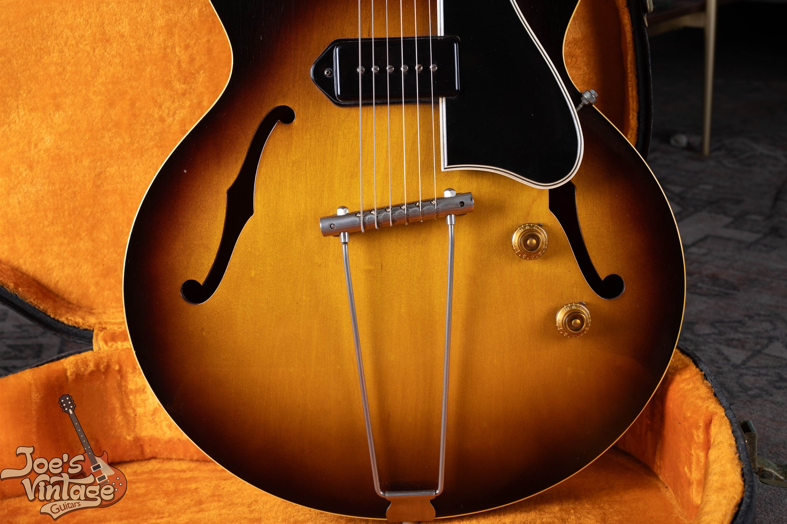

<figcaption>A mature 1958 ES-225T specification: bound top, unbound f-holes, center-mounted dog-ear P-90, two knobs, and long top-wrap bridge and tailpiece.</figcaption>

</figure>

<figure>

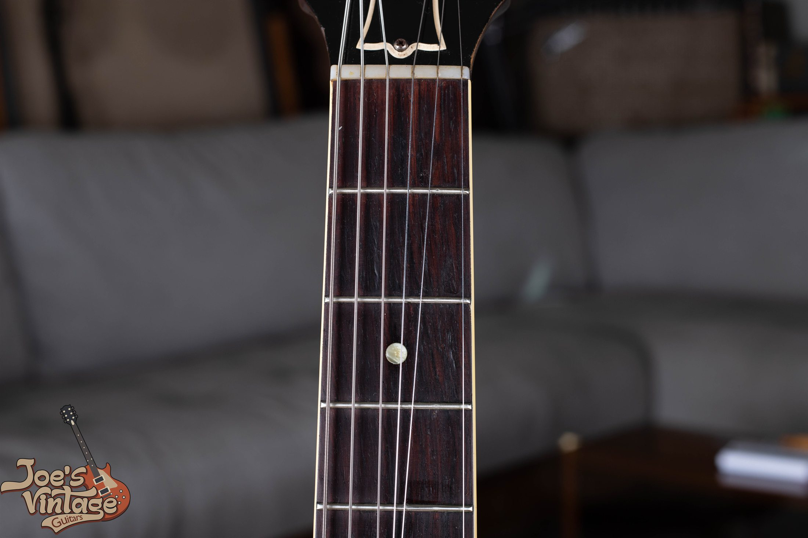

<figcaption>Bound rosewood board and pearl dot markers are a key step above the plainer ES-125 trim.</figcaption>

</figure>

<figure>

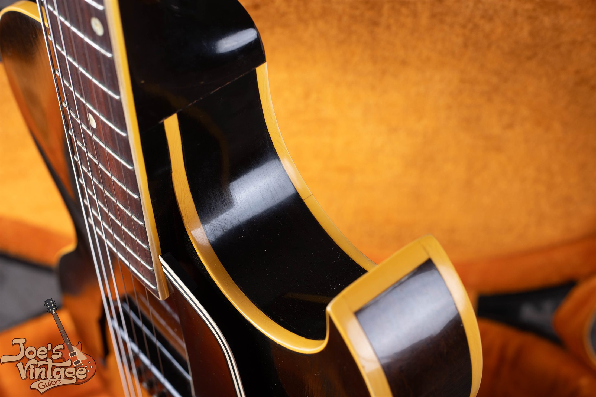

<figcaption>The sharp Florentine cutaway and bound top and back edges are structural identification clues.</figcaption>

</figure>

<figure>

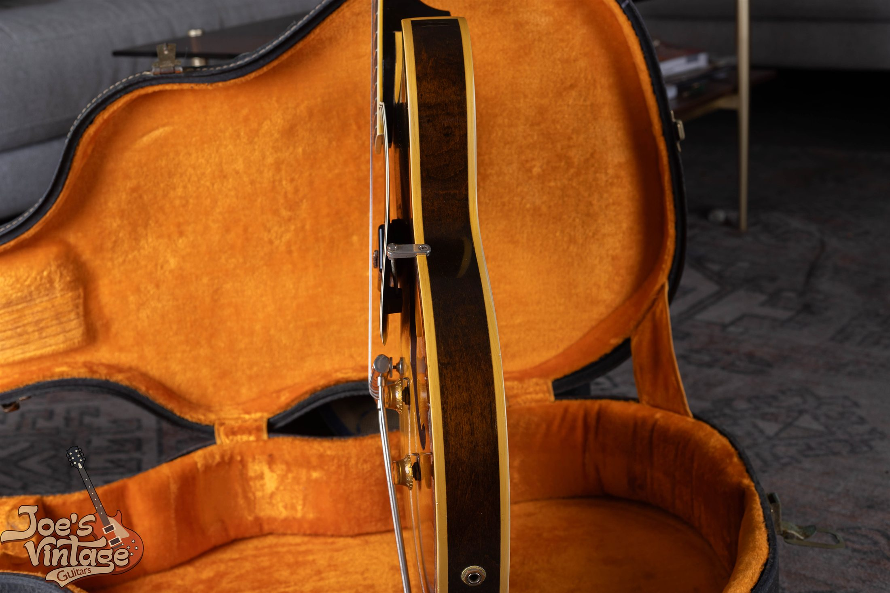

<figcaption>The shallow rim, raised pickguard, and side-mounted output jack in profile.</figcaption>

</figure>

### The cutaway construction clue

From the front, an ES-225 can be confused with an upgraded ES-125 thinline. At the cutaway, however, the 225's top does not simply curl down into the rim. The factory used a maple spacer to carry the top into the pointed cutaway. That detail, together with fingerboard binding, the pearl headstock logo, and individual tuners, is more persuasive than any one removable part.

<h2 id="natural-finish">How to Read an Original Natural Finish</h2>

Natural lacquer makes the construction more visible, but visibility is not certainty. On this 1958 ES-225TN, the laminated maple top, back, and rims show normal changes in grain and color. The mahogany neck provides a contrasting surface for comparison. Look for compatible ambering, checking, edge wear, and ultraviolet response across the body.

A refinished guitar can look convincingly blonde in one carefully balanced photograph. Never authenticate an N-suffix finish from the front alone. Compare the front, back, rims, protected areas, f-hole edges, neck heel, and the clear coat just inside the openings.

<figure>

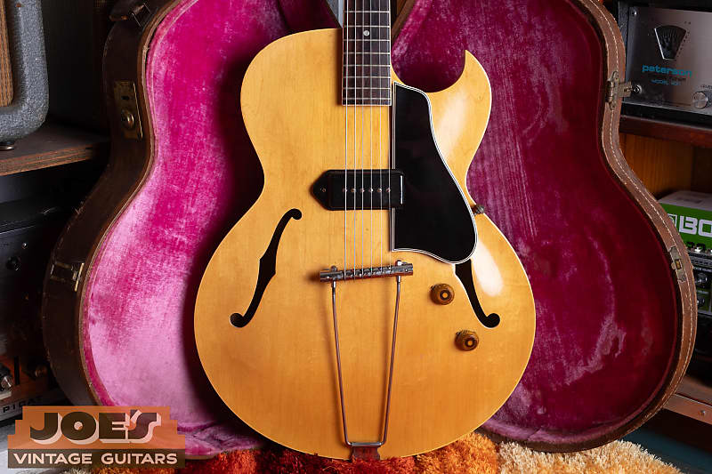

<figcaption><strong>Natural front.</strong> Exposed maple grain, cream binding, black P-90, and amber controls provide several boundaries where masking, overspray, and touch-up can be checked.</figcaption>

</figure>

<figure>

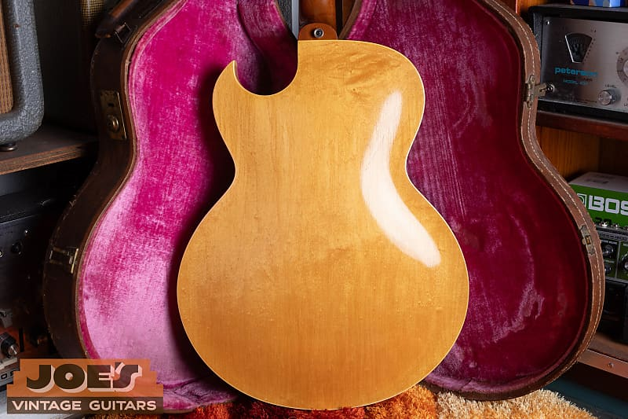

<figcaption><strong>Natural maple back.</strong> Compare ambering and wear with the top and rims. A mahogany-brown body back, large color break, or different surface texture deserves investigation.</figcaption>

</figure>

<figure>

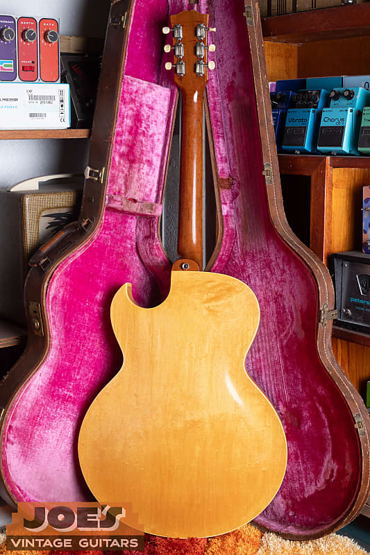

<figcaption>The full rear view separates the blonde maple body from the darker mahogany neck and lets the heel, binding, and tuner layout be evaluated together.</figcaption>

</figure>

<figure>

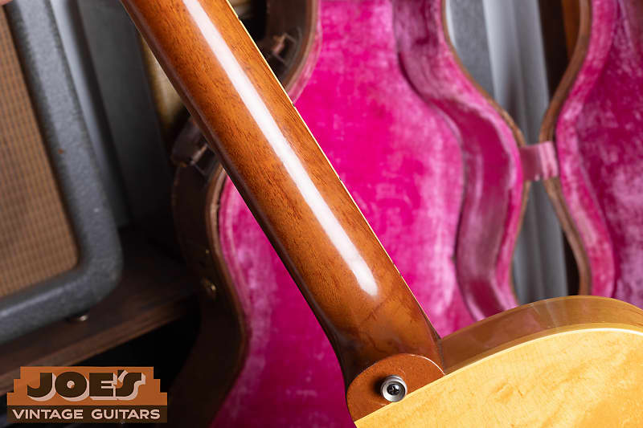

<figcaption>Finish continuity at the heel is especially useful. Look for a coherent transition among the mahogany neck, heel area, rim binding, and clear-coated maple body.</figcaption>

</figure>

<strong>Joe Tip: Natural is not bare wood</strong>The N finish is clear nitrocellulose lacquer over the visible wood, not an unfinished body. Age can warm it toward honey or amber. A very pale appearance may come from lighting, a newer clear coat, or a full refinish, so inspect in neutral light and under ultraviolet before drawing a conclusion.

<h2 id="1959-transition">Long Bridge and Tailpiece Versus the Late-1959 Arrangement</h2>

This is the best-known ES-225 transition and one of the most commonly oversimplified.

<figure>

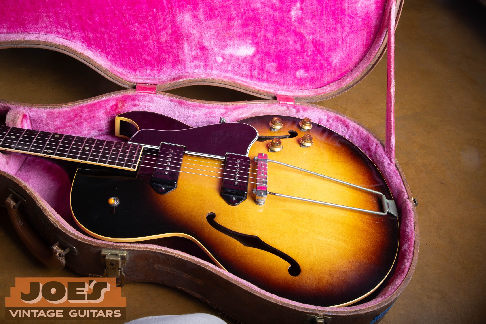

<figcaption><strong>1956 long assembly.</strong> It anchors at the rim and carries a metal bridge bar. Strings pass over the bar, creating the familiar top-wrap geometry.</figcaption>

</figure>

<figure>

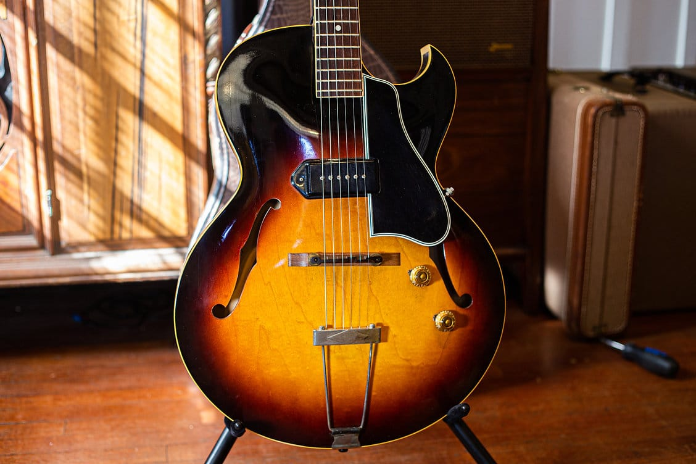

<figcaption><strong>Late 1959 arrangement.</strong> A short trapeze and separate adjustable bridge on a rosewood base improve intonation adjustment.</figcaption>

</figure>

### Long combined unit

- Expected through most of the original run.
- The metal bridge bar is part of the tailpiece structure.
- Strings are normally top-wrapped.
- Individual intonation adjustment is limited.
- Replacement units and compensated reproductions exist.

### Late separate arrangement

- Appears on some 1959 examples.
- A shorter trapeze anchors at the rim.
- The bridge stands independently on the arched top.
- A rosewood base supports an adjustable Tune-o-matic-style bridge.
- The installation must agree with the FON, finish, and undisturbed mounting evidence.

Photograph the rim hinge, screw holes, top beneath the bridge, and the area the long arms would have crossed. Extra holes, witness marks, or mismatched lacquer can reveal a conversion even when the replacement hardware looks period-correct.

<h2 id="authentication">How to Authenticate a Gibson ES-225</h2>

No single stamp authenticates a vintage Gibson. Work from features that are difficult to change toward parts that are easy to replace, and document every conclusion with photographs.

### 1. Confirm the body architecture

Start with the 16¼-inch single-cutaway outline, shallow rim, bound top and back, unbound f-holes, and fully hollow interior. Use an inspection mirror or camera through an f-hole to confirm there is no ES-335-style center block. Examine the cutaway spacer and internal kerfing before relying on the headstock.

### 2. Identify the factory variant

A T should have one center P-90, two controls, and no selector. A TD should have two P-90s, four controls, and a three-way switch. Natural finish adds the N suffix. Check the underside of the top for added routes, plugged holes, or fresh wood that might indicate a T-to-TD conversion.

### 3. Find and interpret the factory order number

The FON is usually ink-stamped inside the body and viewed through the treble-side f-hole. The letter prefix points to the batch year: W for 1955, V for 1956, U for 1957, T for 1958, and S for 1959. Following digits are batch and rack information, not a day-by-day serial sequence.

<figure>

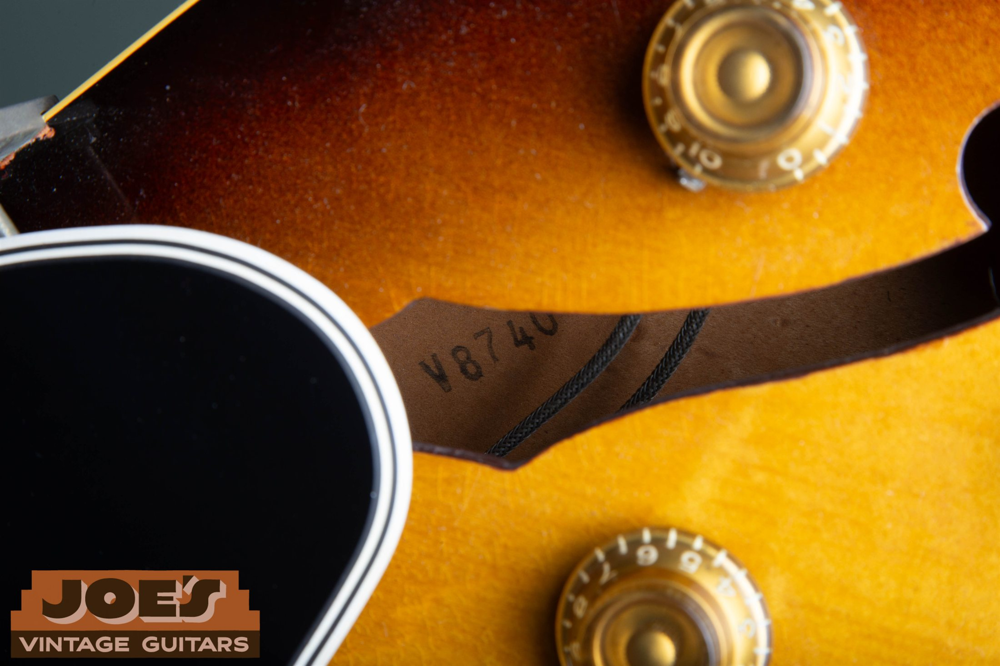

<figcaption><strong>Primary evidence: FON V8740.</strong> The V prefix supports 1956. The remaining digits identify the factory batch and rack position.</figcaption>

</figure>

<figure>

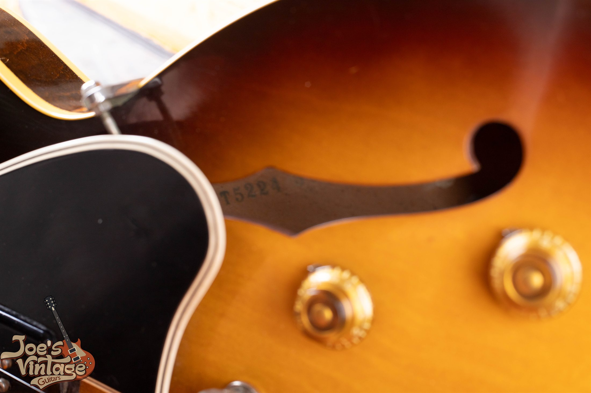

<figcaption><strong>A second real-world FON: T5224.</strong> T is the 1958 prefix. Do not confuse it with the T in the model name.</figcaption>

</figure>

<figure>

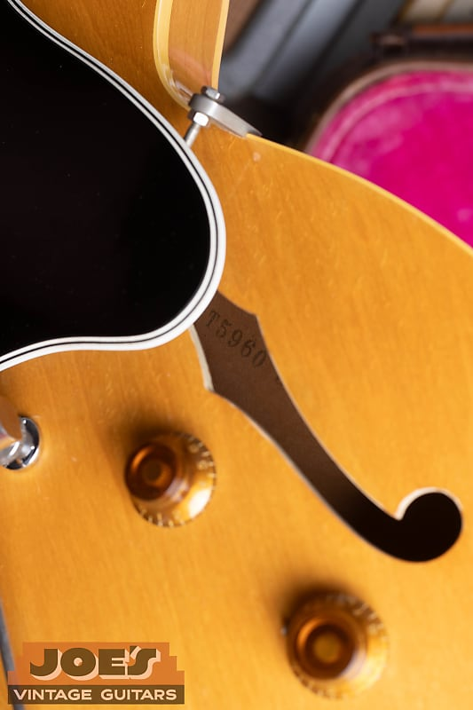

<figcaption><strong>Natural 1958 evidence.</strong> The T-prefix FON supports the year. The finish around the opening also records edge color, lacquer texture, and masking quality.</figcaption>

</figure>

### 4. Read the neck and headstock as a group

Look for a one-piece mahogany neck, bound rosewood fingerboard, pearl dots, pearl Gibson logo, correct open-book outline, bell truss-rod cover, cream nylon nut, and individual Kluson Deluxe tuners. Compare tuner footprints, bushing diameter, and screw holes. Replaced tuners often leave a second outline or enlarged holes.

<figure>

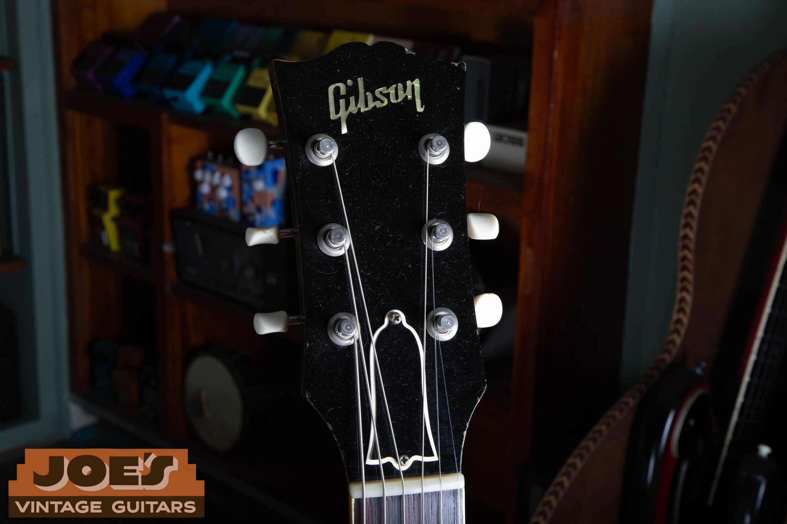

<figcaption>The pearl script logo, open-book crown, and bell cover should be judged together, including wear and finish.</figcaption>

</figure>

<figure>

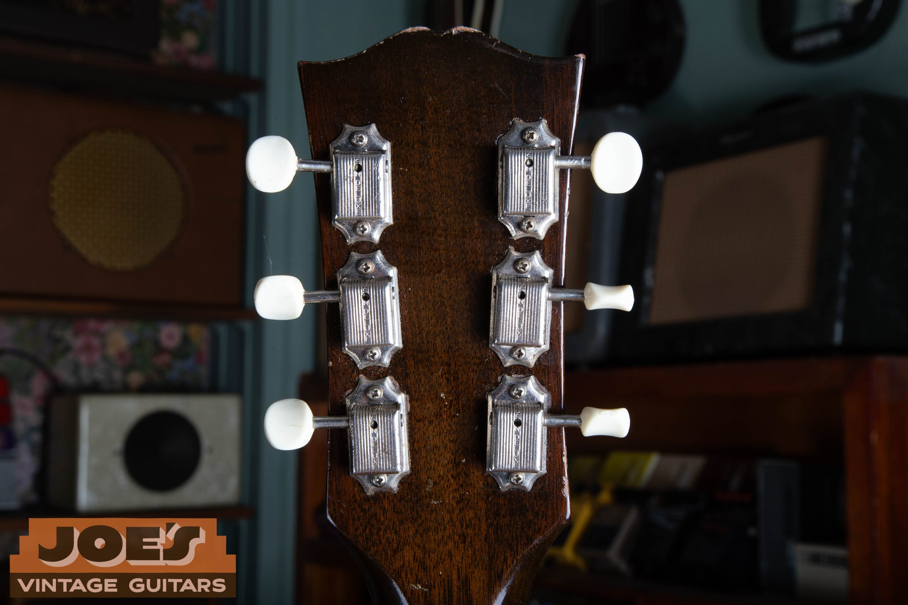

<figcaption>Six individual Kluson Deluxe machines. Look for footprints, extra screw holes, enlarged bushings, and mismatched aging.</figcaption>

</figure>

<figure>

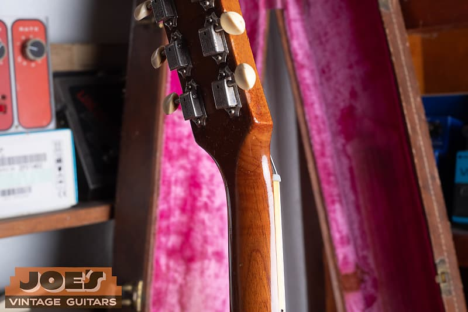

<figcaption>Tuner evidence on a Natural example. Body color does not mean the mahogany neck and headstock back should share the same pale appearance.</figcaption>

</figure>

<figure>

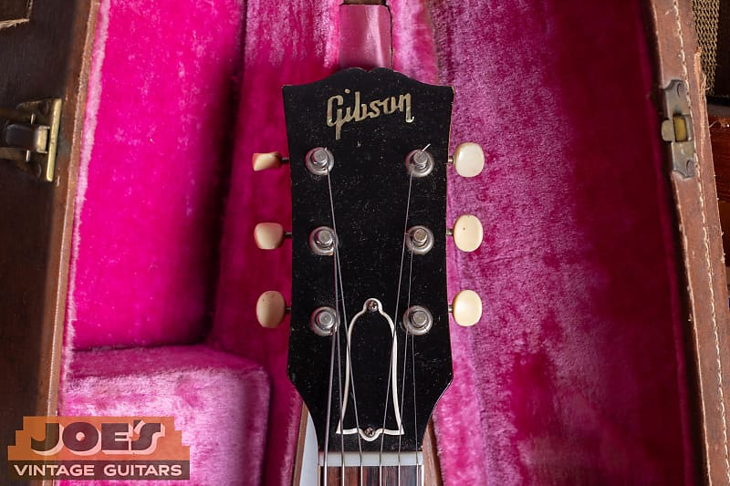

<figcaption>The N suffix changes the body finish, not the expected pearl logo, black headstock face, bell cover, or six individual tuners.</figcaption>

</figure>

### 5. Check hardware against the production phase

Most guitars should carry the long nickel combined bridge and tailpiece. Some late-1959 examples correctly use a short trapeze and separate adjustable bridge. Inspect plating wear, fasteners, underside machining, contact shadows, and the endpin area. A correct-looking part with fresh screw holes is still a replacement.

### 6. Audit the electronics without destroying evidence

Photograph P-90 baseplates, leads, potentiometer codes, capacitors, and every solder joint. EIA pot codes usually combine a maker code with a year and week date. That date is the earliest the assembly could have been completed, not the guitar's final assembly date. Pots can predate a guitar by months. Broken factory solder matters more than a plausible code.

### 7. Evaluate lacquer in normal and ultraviolet light

Original nitro often shows fine checking, edge wear, ambering, and uneven ultraviolet response consistent with touch and exposure. Overspray can fluoresce differently or pool at binding, f-hole edges, and cavities. On a Natural guitar, compare the maple top, back, and rims with one another, then compare those body surfaces with the mahogany neck, the area beneath the pickguard, and the lacquer just inside each f-hole.

Photography and white balance can make old clear lacquer look much paler or yellower than it is. A blacklight is comparative evidence, not a magic truth detector. Some legitimate repair coats and old contaminants also react differently.

<figure>

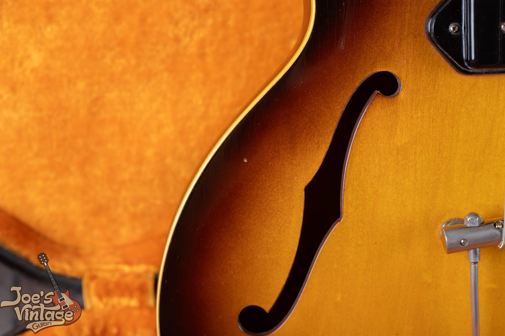

<figcaption>F-hole edges are useful finish evidence. Heavy color, clogged edges, or fresh lacquer inside the opening deserves investigation.</figcaption>

</figure>

### 8. Map repairs and structural risk

Inspect the headstock face and back, tuner-to-tuner grain lines, neck heel, cutaway joint, braces, top sink, tailpiece hinge, and jack area. Use angled light. A stable professional repair can make a fine player, but it must be identified because it affects value and future service decisions.

<figure>

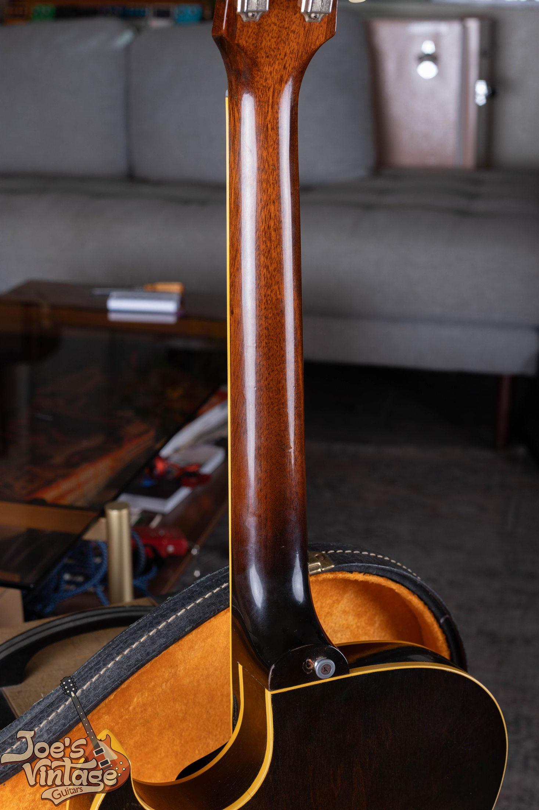

<figcaption>Raking light across the neck and heel reveals repairs, overspray, and grain discontinuity more clearly than a flat front photograph.</figcaption>

</figure>

<figure>

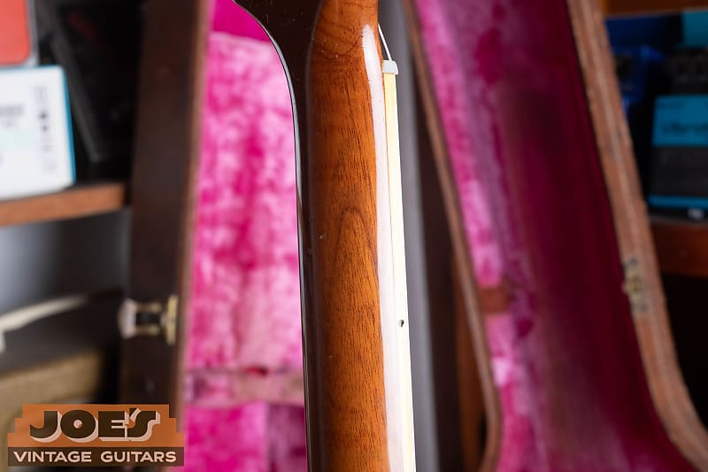

<figcaption>Inspect the continuous reflection along the neck profile for repairs, heavy overspray, and uneven surface preparation.</figcaption>

</figure>

### Serial number versus FON

Many ES-225 inspections begin with the FON because it is stamped into the body batch. If an orange label or A-prefix serial survives, record it too, but reconcile both systems with the hardware and construction. A missing label is a condition issue. It is not proof by itself that the guitar is counterfeit.

Useful A-prefix period ranges are:

| Year | Approximate A-prefix range |
| --- | --- |
| 1955 | A18,666 to A21,910 |
| 1956 | A21,911 to A24,755 |
| 1957 | A24,756 to A26,820 |
| 1958 | A26,821 to A28,880 |
| 1959 | A28,881 to A32,285 |

These ranges are period guides from [Joe's Gibson serial number reference](/how-to-read-gibson-serial-numbers/). Gibson numbering can overlap. Never date an ES-225 from one number alone.

<h2 id="red-flags">Common Changes, Conversions, and Red Flags</h2>

### Added or removed pickup

Fresh routing, filled screw holes, a non-factory control pattern, or disturbed top bracing can reveal a T converted to TD. The same clues may identify a stripped TD returned to single-pickup appearance. This is a high-impact originality issue.

### Refinish or broad overspray

Look at binding edges, f-hole walls, cavities, beneath the pickguard, and around the neck joint. A beautiful sunburst can be non-original if the edge pattern and ultraviolet response do not agree. On Natural examples, the top, back, and rims are maple. Perfectly uniform pale color, obscured checking, mahogany-brown body surfaces, or a sharp change beside protected areas all deserve investigation.

### Harvested 1950s electronics

ES-225 electronics share important traits with more valuable 1950s Gibsons, so pickups, knobs, capacitors, and switches are often transplanted. Period-correct is not the same as factory-installed.

### Changed bridge or tailpiece

The long unit is frequently replaced for better intonation. Reproductions may be excellent for playing, but preserve the original, disclose the change, and inspect for altered holes.

### Replacement tuners

Collapsed cream buttons are common. Re-buttoned originals, period replacements, and modern reproductions have different value implications. The wood tells you whether holes were changed.

### Celluloid pickguard decay

The multi-ply guard can curl, shrink, or off-gas, tarnishing nearby nickel and damaging lacquer. Removal for safe storage may be prudent, but retain every original bracket and screw.

### Heel or headstock repair

Finish touch-up can hide a clean break. Follow the grain under strong angled light, look for a change in pore fill, and compare ultraviolet response above and below the suspect line.

### Old case presented as proof

A brown Lifton-style or black pebble case supports provenance but can be paired later. Fit, wear alignment, odor, and long-term pressure marks are useful. A case never authenticates the guitar.

<figure>

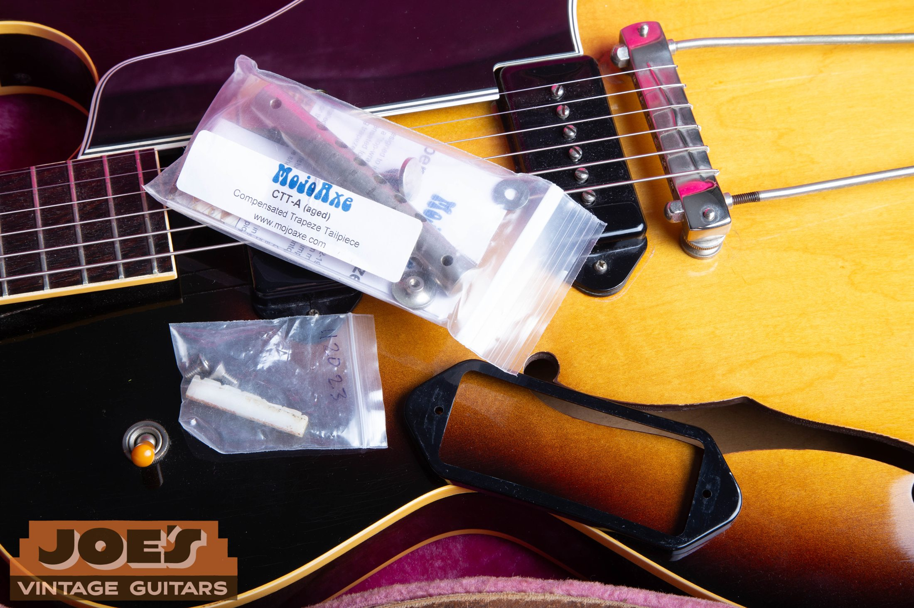

<figcaption>A useful inspection photograph. Removed plastics and a modern compensated-tailpiece package make the change visible. Documentation turns a modification into an understandable condition report.</figcaption>

</figure>

<figure>

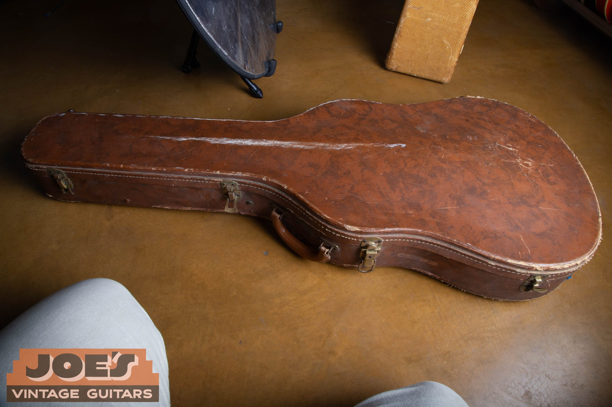

<figcaption>A period-style brown hard case is desirable supporting material, but the guitar must authenticate independently.</figcaption>

</figure>

<h2 id="comparison">How the ES-225 Differs From Similar Gibsons</h2>

| Model | Shared traits | Decisive differences |
| --- | --- | --- |
| **ES-125T / TC / TDC** | Thin fully hollow body, P-90s, related outline | Plainer trim, typically an unbound fingerboard, decal rather than pearl headstock logo, and strip-style tuners. Cutaway construction also differs. |
| **ES-175** | Single Florentine cutaway and related outline | Deeper body, more ornate fingerboard inlays, and a different acoustic and electric platform. An ES-225 should never have full ES-175 depth. |
| **ES-295** | Two P-90s and early long bridge and tailpiece language | Full-depth body, gold finish, and a much more elaborate presentation. |
| **ES-330** | Thin, fully hollow, P-90-equipped construction | Double-cutaway body introduced in 1959. It is the conceptual successor, not a rebadged ES-225. |
| **ES-335** | Similar shallow rim depth and 1950s Gibson appointments | Double cutaway, humbuckers on most originals, and a solid center block. It behaves very differently at stage volume. |

If a seller describes an ES-225 as semi-hollow, ask for an interior photograph. The original ES-225 is fully hollow. The thin silhouette does not imply a center block.

<h2 id="photo-archive">ES-225 Photo Archive</h2>

These photographs from the Joe's Vintage Guitars archive are arranged as evidence sets rather than decoration. Each group records a different year, configuration, or inspection angle.

### 1956 ES-225TD: the expanded model

The dual-pickup version shows the family's full control layout, long top-wrap assembly, dark back, bound neck, and individual tuners. The visible V-prefix FON ties the body to a 1956 batch.

<figure>

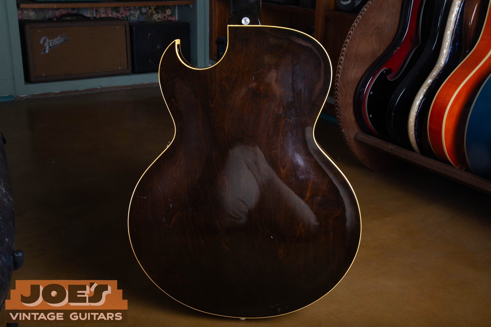

<figcaption>Dark back, cream edge binding, and single Florentine cutaway.</figcaption>

</figure>

<figure>

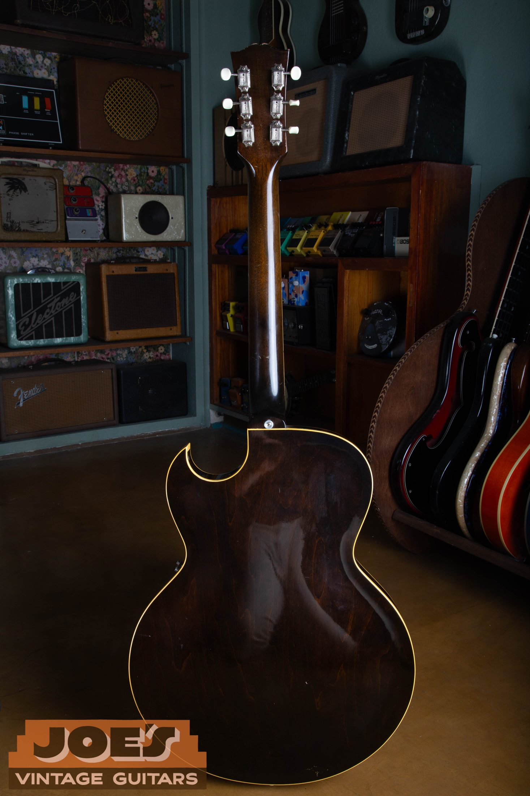

<figcaption>Full rear view showing the mahogany neck, heel joint, and body proportions.</figcaption>

</figure>

### 1958 ES-225T: the mature single-pickup form

A clean single-pickup example makes the center P-90, bound dot-inlaid board, and thin rim easy to study. Its T-prefix FON is visible through the f-hole.

<figure>

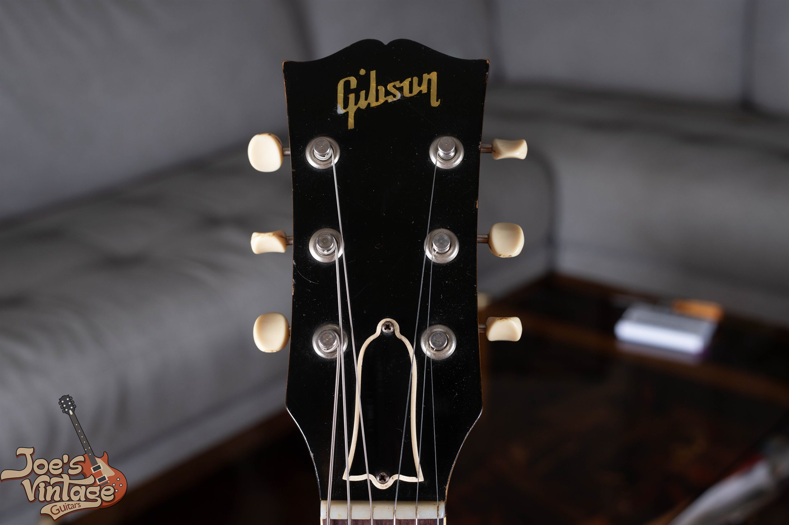

<figcaption>Pearl Gibson logo, bell cover, and aged cream tuner buttons.</figcaption>

</figure>

<figure>

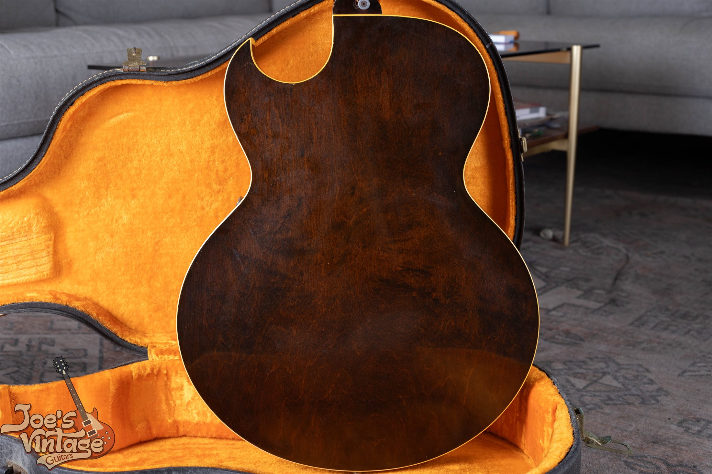

<figcaption>The dark back is bound at the rim, with figure and wear visible through the lacquer.</figcaption>

</figure>

### 1958 ES-225TN: the Natural counterpart

The same center-pickup layout becomes an ES-225TN when ordered in Natural. The pale body exposes grain and finish consistency, while the neck profile, heel, and headstock remain valuable year and originality checks. This set is useful because it records the guitar from both flattering and diagnostic angles.

<figure>

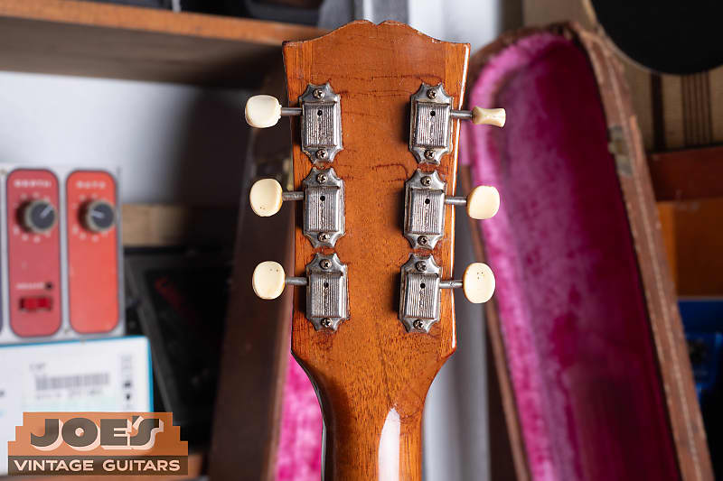

<figcaption>A second rear-headstock view helps compare tuner footprints, aging, screw placement, and the mahogany finish.</figcaption>

</figure>

### 1959 ES-225T: the closing transition

This late single-pickup example carries the separate bridge and short trapeze associated with the end of the run. The rest of the guitar still reads unmistakably as an ES-225.

<figure>

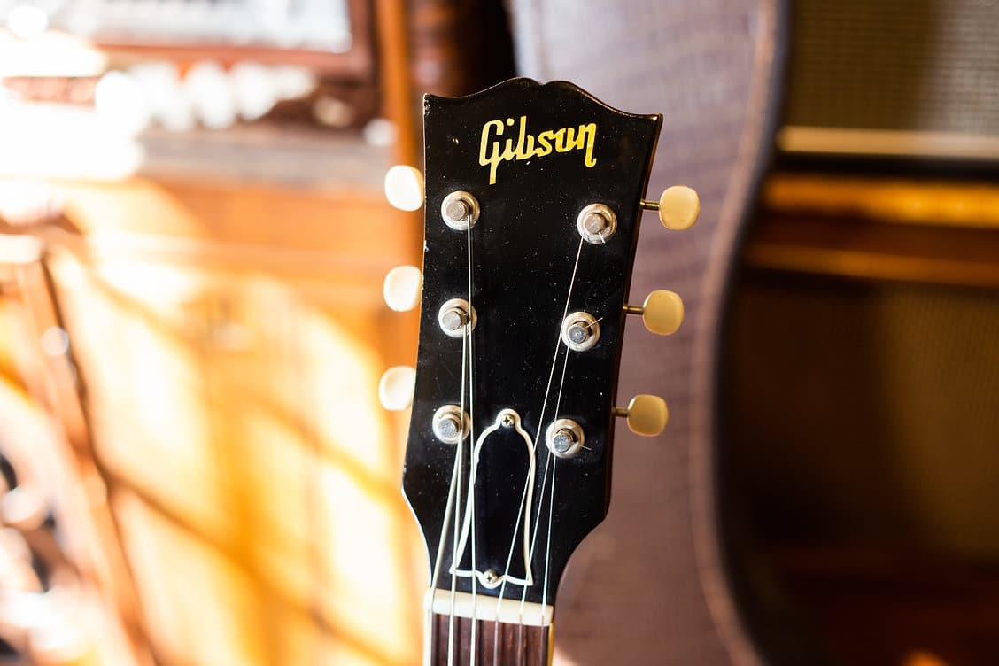

<figcaption>Late-run headstock face and pearl script logo.</figcaption>

</figure>

<figure>

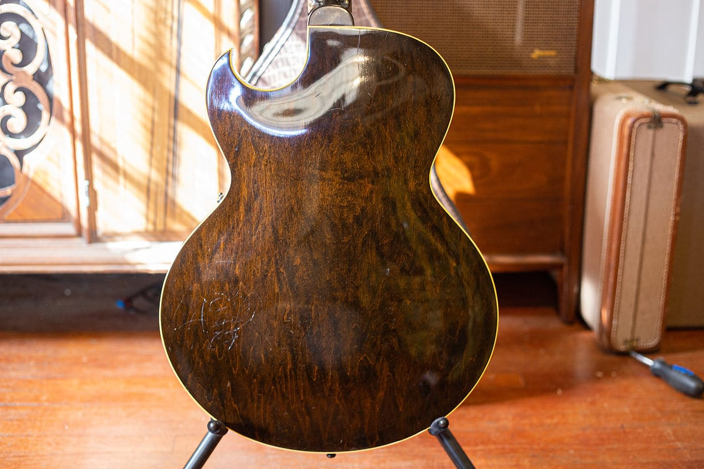

<figcaption>Full rear view for body, heel, and finish evaluation.</figcaption>

</figure>

<figure>

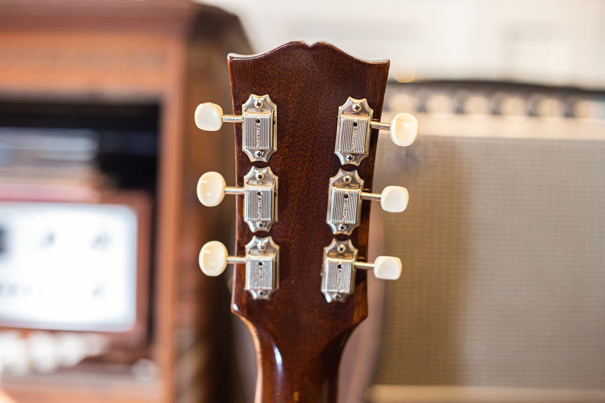

<figcaption>Late-run tuner layout and rear-headstock finish.</figcaption>

</figure>

<figure>

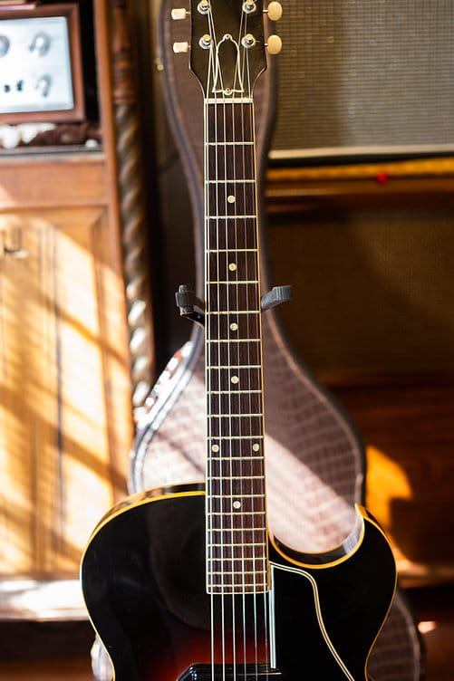

<figcaption>The bound board and pearl dots remain defining ES-225 trim.</figcaption>

</figure>

<figure>

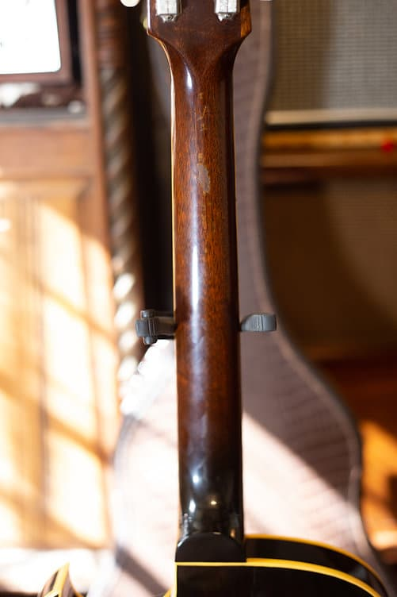

<figcaption>The late-run heel joint is a useful place to inspect grain continuity and finish disturbance.</figcaption>

</figure>

<figure>

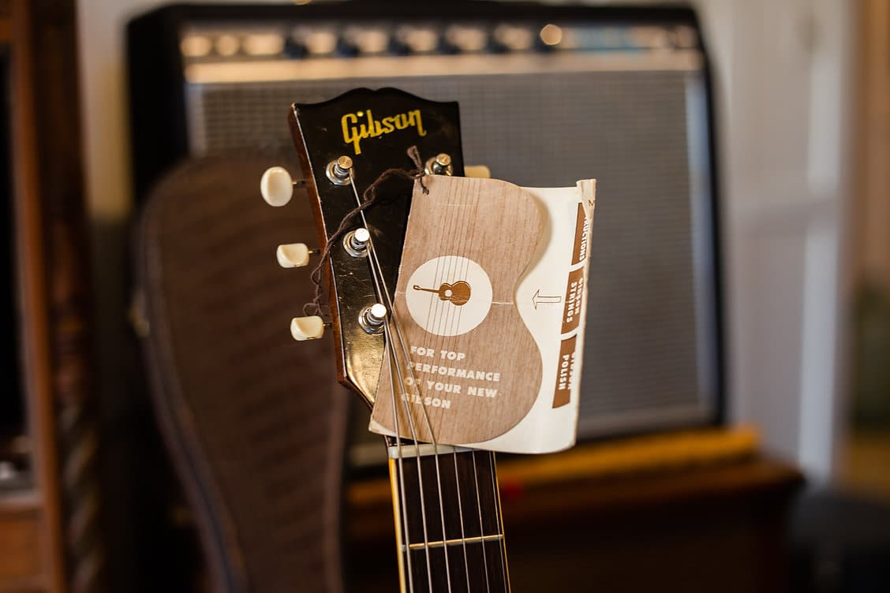

<figcaption>A hangtag can support provenance, but paperwork never replaces physical authentication.</figcaption>

</figure>

<h2 id="sound-and-ownership">What an ES-225 Feels and Sounds Like</h2>

The ES-225 has the immediate attack and midrange detail of a good 1950s P-90, but the fully hollow body softens the edge and adds air around the note. The single center pickup does not behave exactly like a neck pickup or a bridge pickup. It gives up some of the neck position's thickness and some of the bridge position's bite in exchange for a balanced, vocal midrange that works unusually well for jump blues, early rock and roll, roots music, and clear jazz rhythm.

The ES-225TD covers more ground. Its neck pickup can be warm and broad, the bridge pickup has more cut, and the middle switch position combines them. On an original harness, control interaction can be part of the character. P-90 hum is normal. Scratchy pots, intermittent output, and uncontrolled squeal are service issues to diagnose, not inherent vintage tone.

The long bridge and tailpiece can feel lively and direct, but its shared saddle bar limits string-by-string intonation. A well-made compensated replacement can improve playability without drilling the guitar. Keep the original assembly labeled and protected. Late separate-bridge guitars are easier to intonate but still rely on a floating wooden base whose position can shift during string changes.

Because the body is fully hollow, an ES-225 will feed back earlier than an ES-335. Stand placement, speaker direction, and moderate stage volume matter. Controlled resonance can be musical. A loose brace, microphonic pickup, or unsecured hardware can make it unmanageable.

### What drives collector value

Natural finish and the two-pickup configuration usually command a premium, but originality and condition can outweigh the suffix. An untouched sunburst ES-225T may be more desirable than a Natural TD with a refin, routed top, and replaced harness.

Evaluate in this order: structural health, original finish, unmodified body, original electronics, original hardware and plastics, then case and paper provenance. A stable repair or reversible player modification may be acceptable. It must be identified and priced honestly.

<h2 id="modern-reissue">The 2014 to 2016 Gibson Memphis '59 ES-225TD Reissue</h2>

Gibson Memphis revived the shape in 2014 as a 1959-inspired ES-225TD with two P-90s and a VOS-style presentation. Dealer records show a short run extending into 2016. It is a legitimate Gibson model and can be an excellent player, but it is not authenticated with 1950s FON prefixes, old pot-code expectations, or vintage lacquer wear.

An original 1955 to 1959 guitar should show Kalamazoo-era body stamps, 1950s components, age-consistent nitro, and original-run hardware transitions. A Memphis reissue uses a modern serial system, contemporary construction records, and reissue hardware. Judge each against the correct factory specification.

<h2 id="faq">Gibson ES-225 FAQ</h2>

Where does the ES-225 fit among Gibson's first thinlines?

The ES-225T was one of three new Gibson thinlines in 1955, alongside the Byrdland and ES-350T. The Byrdland reached prototype and serial production earlier that year. The ES-225T was the popular-priced member of the group, and Gibson's shipment ledger records 470 ES-225-family shipments versus three Byrdlands in 1955.

Is an ES-225 semi-hollow?

No. The original ES-225 is fully hollow and has no solid center block. Thinline describes body depth, not internal construction.

What is the difference between ES-225T and ES-225TD?

The T has one P-90 in the middle position, one volume, and one tone. The TD has two P-90s, four knobs, and a three-way pickup selector. The D means double pickup.

What does the N suffix mean?

N means Natural finish. ES-225TN is a Natural single-pickup guitar. ES-225TDN is a Natural two-pickup guitar. Sunburst is the standard finish and normally does not add a suffix.

Does every 1959 ES-225 need the short trapeze and separate bridge?

No. The transition occurred during 1959, and the earlier long combined bridge and tailpiece remained in period use. Date and authenticate the guitar as a whole.

Where is the factory order number?

It is typically ink-stamped inside the body and visible through the treble-side f-hole. W, V, U, T, and S correspond to 1955 through 1959 for this era.

How can I tell an ES-225 from an ES-125 thinline?

Use a cluster of clues: bound fingerboard, pearl Gibson headstock logo, individual Kluson tuners, upgraded body binding, and the cutaway spacer construction. Removable parts alone are not enough.

Should I replace the long tailpiece for better intonation?

A reversible compensated unit can make a player more accurate. Avoid drilling, photograph the change, and keep every original part. For collector value, an original undisturbed assembly remains important.

How many ES-225s were made?

Gibson's surviving shipment totals record 7,517 ES-225-family shipments from 1955 through 1959: 6,555 sunburst and 962 Natural. The ledger does not break those totals into T and TD, and shipment counts are not the same as exact production or surviving examples.

<h2 id="appraisal-photos">The 12 Photographs That Make an ES-225 Evaluation Possible</h2>

1. Full front in soft, even light.
2. Full back.
3. Body front with bridge, pickups, and knobs visible.
4. Body rim, endpin, and tailpiece hinge.
5. Headstock face straight-on.
6. Headstock back and every tuner.
7. Neck heel from both sides.
8. FON through the treble-side f-hole.
9. Any orange label or serial number.
10. Pot codes and wiring, without breaking solder.
11. Pickup undersides and leads, if already safely removed.
12. Every repair, changed part, and included case.

Do not dismantle a clean vintage harness only to take a photograph. If access requires force, a repair professional should handle it.

Have an ES-225 to identify or sell? [Request a free, evidence-based appraisal](/free-appraisal/) and send clear photographs plus everything you know about the guitar. Original parts, repairs, and uncertainty are all easier to evaluate when they are documented up front. You can also call Joe at [(602) 900-6635](tel:+16029006635).
