

<nav class="es345-nav-sidebar" id="es345NavSidebar" aria-label="Article section navigation">
  
<strong>ES-345 Guide</strong>

  <a href="#" onclick="window.scrollTo({top:0,behavior:'smooth'});return false;" class="es345-nav-link top">&uarr; Top of Page</a>
  
The Model

  <a href="#history" class="es345-nav-link">History &amp; the ES Line</a>
  <a href="#varitone" class="es345-nav-link">Varitone &amp; Stereo</a>
  
Dating &amp; Serials

  <a href="#dating" class="es345-nav-link">Dating by Features</a>
  <a href="#serial-numbers" class="es345-nav-link">Serial Numbers</a>
  
The Two Guitars

  <a href="#our-1963" class="es345-nav-link">The 1963 Sunburst</a>
  <a href="#our-1966" class="es345-nav-link">The 1966 Cherry</a>
  <a href="#specifications" class="es345-nav-link">Specifications</a>
  
Value &amp; Buying

  <a href="#authentication" class="es345-nav-link">Authentication</a>
  <a href="#value" class="es345-nav-link">What It's Worth</a>
  <a href="#players" class="es345-nav-link">Notable Players</a>
</nav>

<button class="es345-nav-btn" id="es345NavBtn" onclick="toggleEs345Nav()" aria-expanded="false" aria-controls="es345NavPanel" type="button">
  &#9776; Jump To Section
</button>

  
<strong>ES-345 Guide</strong>

  <a href="#" onclick="window.scrollTo({top:0,behavior:'smooth'});closeEs345Nav();return false;" class="es345-nav-link top">&uarr; Top of Page</a>
  
The Model

  <a href="#history" onclick="closeEs345Nav()" class="es345-nav-link">History &amp; the ES Line</a>
  <a href="#varitone" onclick="closeEs345Nav()" class="es345-nav-link">Varitone &amp; Stereo</a>
  
Dating &amp; Serials

  <a href="#dating" onclick="closeEs345Nav()" class="es345-nav-link">Dating by Features</a>
  <a href="#serial-numbers" onclick="closeEs345Nav()" class="es345-nav-link">Serial Numbers</a>
  
The Two Guitars

  <a href="#our-1963" onclick="closeEs345Nav()" class="es345-nav-link">The 1963 Sunburst</a>
  <a href="#our-1966" onclick="closeEs345Nav()" class="es345-nav-link">The 1966 Cherry</a>
  <a href="#specifications" onclick="closeEs345Nav()" class="es345-nav-link">Specifications</a>
  
Value &amp; Buying

  <a href="#authentication" onclick="closeEs345Nav()" class="es345-nav-link">Authentication</a>
  <a href="#value" onclick="closeEs345Nav()" class="es345-nav-link">What It's Worth</a>
  <a href="#players" onclick="closeEs345Nav()" class="es345-nav-link">Notable Players</a>

The **Gibson ES-345** is the guitar that gets overlooked in its own family. It has the same body and the same golden-era build as the famous ES-335, it is dressed up nicer than the 335 with gold hardware and fancy inlays, and it carries a feature neither of its siblings started with: onboard stereo wiring and the six-position **Varitone** tone circuit. For some players that circuit is the whole appeal. For others it is the first thing they rip out. Either way, it is the reason a vintage 345 reads, prices, and authenticates differently from a 335, and it is the reason so many people get the two mixed up.

I buy and sell these regularly, so this guide walks through the whole story: where the ES-345 came from, how to date one by its features, what the stereo and Varitone circuit actually does, and what a vintage example is worth today. To keep it concrete I am using two real guitars that came through the shop, a **1963 ES-345TD in sunburst** and a **1966 ES-345TDC in cherry**, so you can see the details on actual instruments instead of a spec sheet. If you want to date your own guitar as you read, keep our [Gibson Serial Number Decoder](/how-to-read-gibson-serial-numbers/) open in another tab, and if you want to know what yours is worth, reach out for a [free appraisal](/free-appraisal/).

<h2 id="history">History: Where the ES-345 Fits in the Line</h2>

Gibson introduced the ES-345 in the spring of 1959, and the name is not a mystery: it was the list price. In sunburst the guitar sold for $345, which slotted it right where Gibson wanted it, in the middle of the new thinline family. The **ES-335** had arrived in 1958 as the plain, brilliant one. The top-of-the-line **ES-355** followed late in 1958 with an ebony board, big block inlays, and every luxury Gibson could bolt on. The 345 was designed to be the deluxe middle child: the 335's body and construction, dressed up with gold-plated hardware, split-parallelogram inlays, and a pearl crown on the headstock, plus the stereo and Varitone electronics it shared with the 355.

Under the finish it is a 335. Laminated maple top and back, a solid maple center block running down the middle for sustain and feedback resistance, a mahogany neck, a rosewood fingerboard, the 24-3/4" Gibson scale, and 22 frets. What separates the three models is trim and wiring, not construction. The 335 wears nickel or chrome and dot or block markers. The 345 wears gold and parallelograms. The 355 goes further still with an ebony board and multi-ply binding. If you can keep "335 plain, 345 deluxe stereo, 355 fanciest" in your head, you are most of the way to telling them apart across a room.

<figure>

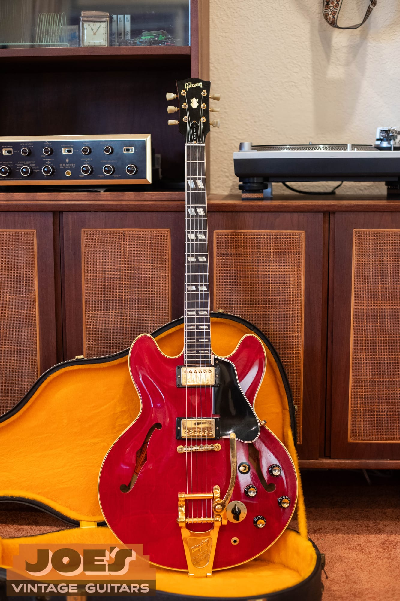

<figcaption><strong>Built for stereo.</strong> Our 1966 ES-345TDC in cherry, posed in front of period stereo gear. That is not just a styling choice: the 345 was wired to feed two amplifier channels at once, and Gibson even sold a matching stereo amp for it.</figcaption>

</figure>

The golden era for the model runs from 1959 to 1969. Norlin took over Gibson at the end of the decade, and the early-1970s guitars start showing the changes that era is known for: a volute behind the nut, a three-piece neck, and a "MADE IN USA" stamp. The original ES-345 stayed in the catalog into the early 1980s, then disappeared for about two decades before Gibson brought it back as a reissue around 2002. Gibson still builds ES-345s today, in both the standard line and the Custom Shop, in stereo and in simplified mono versions.

Production was steady but never huge. Gibson's shipping ledgers show roughly 10,560 ES-345s shipped between 1959 and 1979, with the peak years in the late 1960s (about 1,144 in 1967). The first year, 1959, was tiny by comparison. If you want to see how any given year and finish stacks up against the rest of Gibson's output, our [Gibson shipping totals guide](/post/gibson-shipping-totals-1948-1979/) breaks the numbers down.

<h2 id="varitone">The Varitone: Stereo Wiring and Six-Position Tone</h2>

This is the part that makes an ES-345 an ES-345, so it is worth getting right. A vintage 345 does two unusual things.

First, it is wired for **stereo**. Each pickup is sent to its own output through a shared stereo jack, so with the right cable the neck pickup can go to one amp and the bridge pickup to another. To actually use it in stereo you need a **stereo Y-cord** (a TRS plug that splits into two mono plugs) running into two amps or two channels, or a stereo amp. Gibson even sold a companion stereo amplifier, the GA-88S, to go with it. Plug an ordinary mono guitar cable all the way in and the wiring is unbalanced; depending on the switch settings you can lose a pickup or end up with a thinner sound, which is exactly the surprise that greets a lot of first-time 345 owners.

<figure>

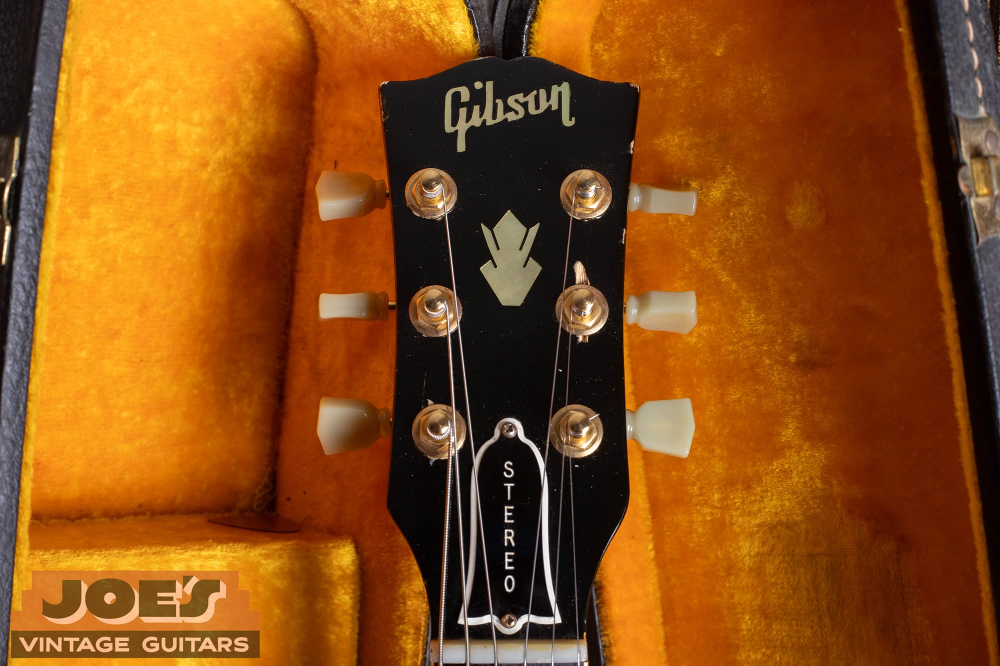

<figcaption><strong>It says so on the headstock.</strong> Gibson labeled the truss-rod cover "STEREO" so there was no confusion. Above it is the pearl crown inlay that marks a 345 (a 355 uses a split-diamond instead).</figcaption>

</figure>

Second, it has the **Varitone**, the six-position rotary knob mounted next to the regular controls. Position 1 is a straight bypass, the pickup's full, unfiltered tone. Positions 2 through 6 each switch a different capacitor into the circuit to create a fixed frequency "notch," scooping out part of the midrange for a range of hollow, almost cocked-wah voices. It is not a normal tone control that just rolls off treble. It uses a **choke** (an inductor) together with the capacitors to make those notches, which is why an original 345 has a choke can tucked inside the body that a plain 335 does not.

<figure>

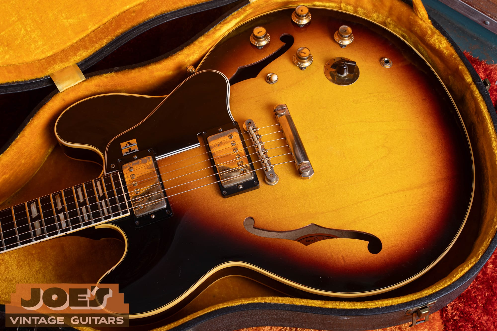

<figcaption><strong>Six positions of onboard EQ.</strong> The extra round dial on the upper bout of our 1963, marked 1 through 6 with a black pointer, is the Varitone. Next to the four gold reflector knobs and the three-way toggle you can also see the stereo output jack. Note the gold ABR-1 and the stop-bar tailpiece, the setup collectors prize most.</figcaption>

</figure>

Players are split on the Varitone, and that split matters for value. Fans, Joe Bonamassa among them, love having instant onboard EQ for funk and rhythm parts and defend keeping it stock. Detractors say it saps volume and warmth, and plenty of them have had the circuit bypassed or the guitar rewired to plain 335 mono spec over the years. A full mono conversion even sheds close to a pound of weight because the stereo harness and its choke come out. None of that is wrong to do if you play the guitar, but it is a modification, and an original stereo Varitone 345 is worth more than one that has been gutted. When you evaluate a 345, the circuit is the first thing to look at, not the last. There is more on how to spot an original versus a converted example in the [authentication](#authentication) section.

One honest note: Gibson never publicly credited a single engineer with the Varitone, and you will see confident-sounding attributions online that do not hold up. It came out of Gibson's engineering department under Ted McCarty around 1959. The exact designer is not reliably documented, so I will not put a name on it.

<h2 id="dating">Dating: Reading an ES-345 by Its Features</h2>

Because Gibson serial numbers from the 1960s are unreliable (more on that below), the features are how you actually date one of these. Here is what changed and roughly when. Treat every date as a transition window, not a hard line, because Gibson used up parts as they had them and guitars cross over.

### Body: "Mickey Mouse Ears" Versus Pointed Horns

Early ES-345s, like early 335s, have rounded, symmetrical cutaway horns that collectors call **"Mickey Mouse ears."** Those rounded horns run from 1959 through about 1963. Around 1963 the body mold changed and the horns became sharper and more pointed, which is the look through the rest of the 1960s. It is a gradual, guitar-by-guitar change, so some 1962s already show slightly pointed ears and some 1963s are still fully round. Our 1963 still has the rounder shape; our 1966 has the sharper, pointed horns.

### Pickguard: Long Versus Short

The 1959 and 1960 guitars use a **long pickguard** that extends past the bridge. Around 1960 to 1961 Gibson shortened it so it no longer reaches past the bridge pickup. A short guard on a claimed 1959 is a red flag for a replacement.

### Neck Profile and Nut Width

Neck depth follows the same curve as the rest of Gibson's line. The 1958 and 1959 necks are the biggest and roundest. They thin out through 1960, hit their slimmest "blade" feel in 1961 and 1962, and then fill back out to a medium, chunkier profile in 1964 and 1965. Nut width is the more useful value tell: it is **1-11/16" from 1959 through early 1965**, then narrows through a brief 1-5/8" to about 1-9/16" by late 1965, and widens back toward 1-11/16" around 1968. The wide-nut, pre-mid-1965 guitars carry a clear premium over the skinny-nut examples.

### Pickups: PAF Versus Patent Number

The earliest 345s carry **PAF humbuckers**, identified by the "Patent Applied For" decal on the underside. Gibson phased in the **"Patent No. 2,737,842"** decal during 1962 and 1963, so guitars from those years often have one of each as the old stock ran out. A useful 345-specific wrinkle: because the model used gold-covered pickups and Gibson made fewer of them, gold PAF stock lasted longer than the nickel stock on 335s, so gold-covered PAFs can turn up on 345s a bit later than you would expect. One caution on that patent number: 2,737,842 is actually Gibson's bridge patent, not the humbucker's, and the later "T-Top" pickups of the mid-1960s wear the same sticker, so a patent-number decal spans a wide range and is not by itself a tight date. For the full story on reading these pickups without taking them apart, see our [PAF and Patent Number pickup guide](/post/gibson-paf-patent-number-pickup-guide/).

<figure>

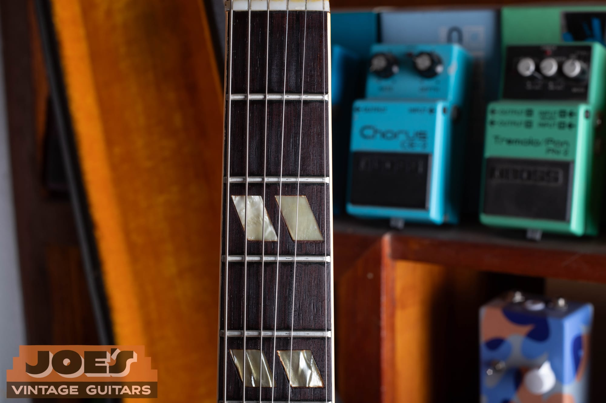

<figcaption><strong>Split-parallelogram inlays.</strong> The 345 wore double-parallelogram markers on a bound rosewood board from day one in 1959. That is a quick way to separate it from a 335, which used dots and then blocks, and from a 355, which used large blocks on ebony.</figcaption>

</figure>

### Hardware, Inlays, and a Common Mistake

Here is a correction worth stating plainly, because people apply the wrong rule to these guitars all the time. On the ES-335, Gibson switched from nickel to chrome hardware around 1965. **The 345 was gold-plated for its entire vintage run, so that nickel-to-chrome change is a 335 tell, not a 345 tell.** On a 345 you are not looking for nickel versus chrome. You are looking at how the gold has worn, and heavy "brassing" where the plating has rubbed through is completely normal and expected on an honest original. A nickel or chrome part on a vintage 345 means a replacement.

The rest of the trim is consistent: split-parallelogram inlays and a pearl crown headstock throughout (the crown is how you separate it from the 355's split-diamond headstock), gold reflector "top-hat" knobs in the classic era giving way to "witch hat" knobs by the late 1960s, and Kluson tulip-button tuners. The Varitone surround ring is a nice micro-detail too: early 1959 guitars often have a black ring, and a gold ring came in around mid-1960 alongside the cherry finish.

### Bridge and Tailpiece

The bridge is the **ABR-1 tune-o-matic** throughout, with a retaining wire added around mid-1962. The tailpiece is where the money is. A **stop-bar tailpiece** was standard from 1959 through early 1965 and is the configuration collectors prize. A factory **Bigsby** was a common order from the start. Gibson also offered the unloved "sideways" Vibrola around 1961 to 1963 and later Maestro/lyre Vibrolas, and a **trapeze tailpiece** became the standard non-vibrato unit around 1965. An added or converted Bigsby means extra holes in the top, which hurts value; a factory Bigsby order has a "Custom Made" plaque covering the pre-drilled stop-tail holes.

### Norlin-Era Tells

From about 1969 to 1970 onward the Norlin changes appear: a **volute** behind the nut, a **three-piece neck**, and the **"MADE IN USA"** stamp on the back of the headstock (which really settles in around mid-1970). The most reliable single tell of the era is the neck tenon, which you can see by looking into the neck-pickup cavity: a long tenon runs into the early 1970s, and a short tenon is the later cost-cutting sign. Walnut finish arrived in 1969, and by the mid-1970s the guitars get heavier and less consistent. Buy those on feel, not on the spec sheet.

<h2 id="serial-numbers">Serial Numbers: Labels, Stamps, and Why They Lie</h2>

The single most important thing to understand about dating a 1960s ES-345 is that **the serial number alone will not give you the year.** Use it to confirm the decade, then let the features pin down the year.

On the 1958 to 1960 guitars, the serial is on the **orange oval label** inside the body, visible through the bass-side f-hole. There is no number stamped on the headstock yet. You will also find a **Factory Order Number (FON)** ink-stamped on the wood inside, which is a batch number. On the 1959 to 1961 guitars the FON starts with a letter that codes the year: S for 1959, R for 1960, Q for 1961. That letter is a genuinely useful cross-check.

From 1961 through 1969, Gibson also pressed a serial number into the back of the headstock, and this is the era that trips everyone up. Gibson reused and randomized these numbers, so the same number can turn up in two or even three different years, and the published range charts overlap by the hundreds. A serial from this period points you to a decade; the components point you to the year. Confirm with pot codes (the date codes stamped on the potentiometers), the pickup decals, the logo, and the neck construction. Starting in 1970, a **"MADE IN USA"** stamp appears below the impressed serial, which is itself the tell that you have left the golden era.

<figure>

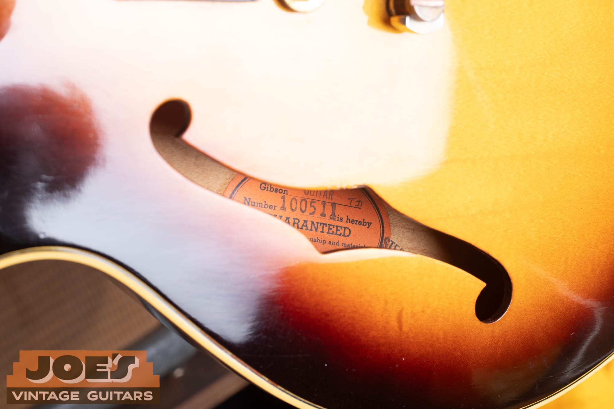

<figcaption><strong>Read the label first.</strong> Through the bass-side f-hole of our 1963 you can read the model, ES-345TD, and the number 100511, which lands in a 1963 range. On a 1960s Gibson that number narrows the field but does not prove the year on its own, which is why the features carry the weight.</figcaption>

</figure>

If you want help walking through the labels, the FON, and the headstock stamp on your own guitar, our standalone [Gibson Serial Number Decoder](/how-to-read-gibson-serial-numbers/) covers all of it, and I am always glad to look at photos.

<h2 id="our-1963">The 1963: A Sunburst ES-345TD Up Close</h2>

Our first example is a **1963 ES-345TD in sunburst**, and it is a textbook golden-era guitar. The guarantee label reads ES-345TD with the number 100511, and the features back up a 1963 date: still-rounded horns from the tail end of the Mickey Mouse window, split-parallelogram inlays on a bound rosewood board, the pearl crown headstock, and a "STEREO" truss-rod cover announcing the wiring before you even plug in.

<figure>

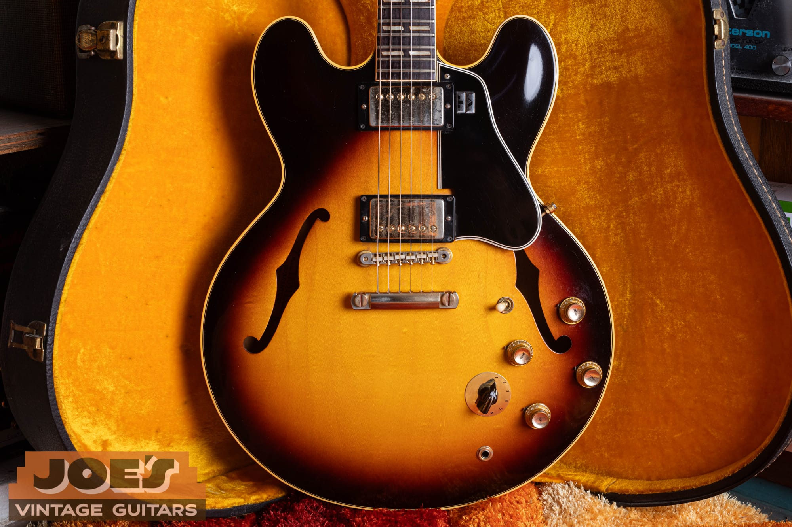

<figcaption><strong>A 1963 in sunburst.</strong> Sunburst was the standard finish and the most-produced, roughly 43 percent of the run. This one shows the deluxe 345 package: gold hardware, split-parallelogram inlays, and the stereo Varitone electronics.</figcaption>

</figure>

The hardware is all gold and correctly worn, with the honest brassing you want to see on an original. It has the gold ABR-1 tune-o-matic with the retaining wire, and, importantly, a **gold stop-bar tailpiece**. That stop-tail is the configuration collectors like best and the one that holds value; there is no Bigsby and no extra holes in the top. The controls are the full 345 arrangement: two volumes, two tones, a three-way toggle, the six-position Varitone, and the stereo output jack.

<figure>

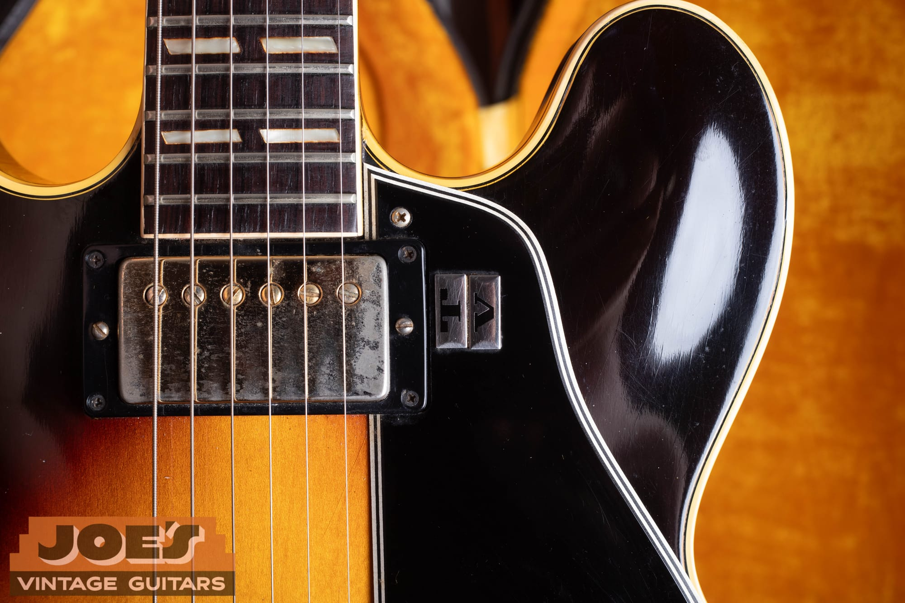

<figcaption><strong>Under the gold covers.</strong> The humbuckers sit under gold covers with period wear. Whether they read "Patent Applied For" or the early Patent Number decal underneath, we leave the covers on. You do not pull a vintage pickup apart just to check a sticker.</figcaption>

</figure>

<figure>

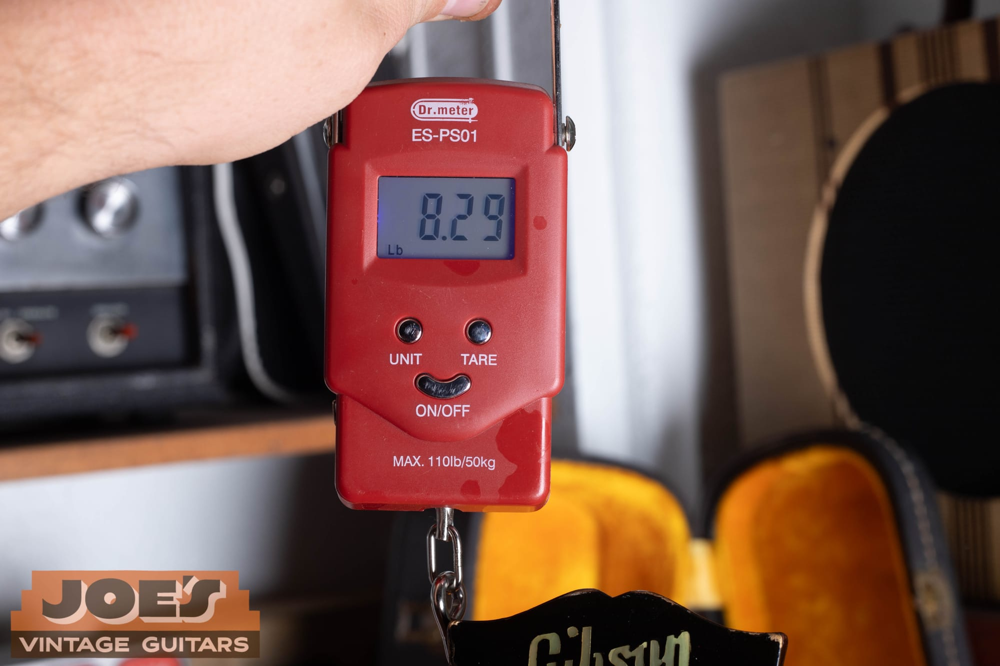

<figcaption><strong>8.29 pounds.</strong> Semi-hollow construction keeps these comfortable to wear. The stereo harness and choke add a little weight over a plain 335, which is exactly the weight a mono conversion removes.</figcaption>

</figure>

One detail I always call out honestly: the tuners. This guitar wears gold, single-ring, tulip-button tuners whose housings read **"Gibson Deluxe."** On a 1963 you would more typically expect them stamped "Kluson Deluxe," so these are worth a close look to confirm they are original to the guitar rather than a period-style replacement. It does not change what the guitar is, but it is the kind of thing an honest evaluation should mention rather than gloss over.

<figure>

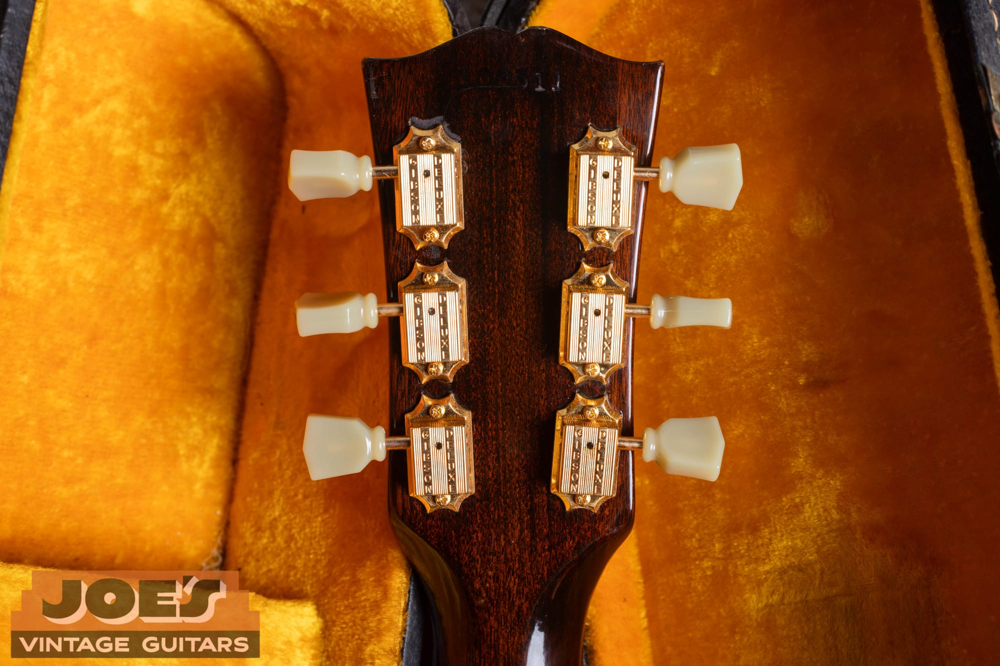

<figcaption><strong>Gold tulip tuners.</strong> The housings on this 1963 read "Gibson Deluxe." That branding is more common on later-1960s Gibsons than on a 1963, so it is a detail to verify when you are checking originality.</figcaption>

</figure>

<h2 id="our-1966">The 1966: A Cherry ES-345TDC With Bigsby</h2>

Our second example is a **1966 ES-345TDC in cherry**, and putting it next to the 1963 shows how the model evolved across a few short years. Same gold-and-parallelogram deluxe package, same crown headstock, same "STEREO" truss-rod cover and Varitone circuit, but now in cherry red with the sharper, pointed mid-1960s horns.

Another 1966 cherry ES-345 came directly from the Connecticut musician who bought it new and kept it with his same-year Ampeg. Read the [one-owner 1966 Gibson ES-345 story](/post/one-owner-1966-gibson-es-345/) for that guitar's photographs and ownership history.

<figure>

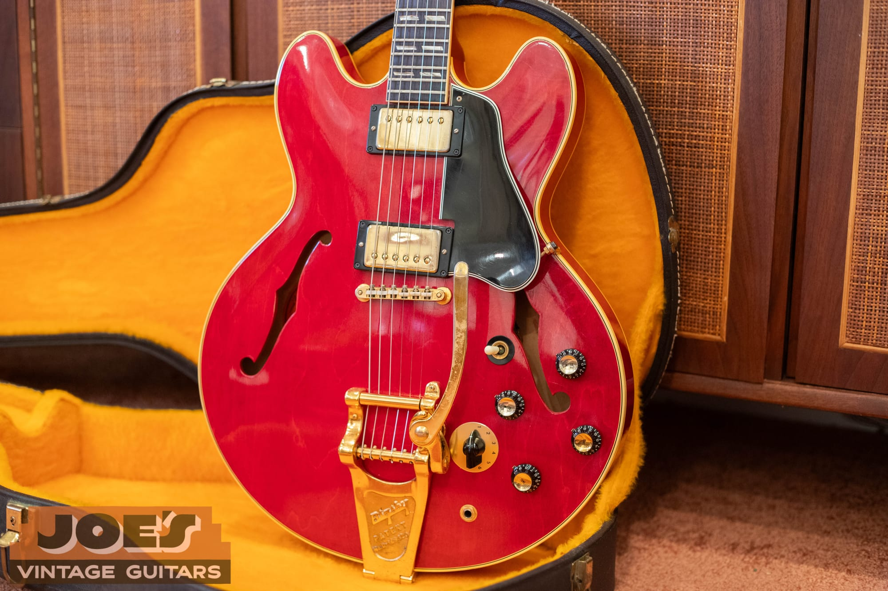

<figcaption><strong>A 1966 in cherry.</strong> Cherry became the common alternative to sunburst in the 1960s. The pointed horns, patent-number pickups, and gold Bigsby all read as mid-decade.</figcaption>

</figure>

The biggest visual difference is the tailpiece. Where the 1963 has a stop bar, the 1966 wears a **gold Bigsby vibrato**, stamped with the Bigsby design patent D-169,120. Whether a Bigsby was factory-ordered or added later matters to value, and the tell is the top under the tailpiece: a factory order has a "Custom Made" plaque over pre-drilled stop-tail holes, while a later conversion leaves extra holes. It is a great-looking and correct period part either way, and the gold plating shows the same honest wear as the rest of the hardware.

<figure>

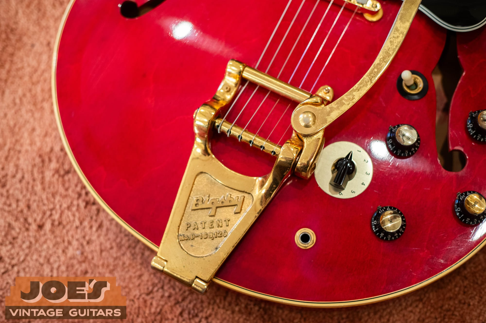

<figcaption><strong>A gold Bigsby.</strong> The Bigsby patent D-169,120 stamp confirms a genuine period unit. To its right you can see the six-position Varitone dial and the stereo jack, the same circuit as the 1963.</figcaption>

</figure>

<figure>

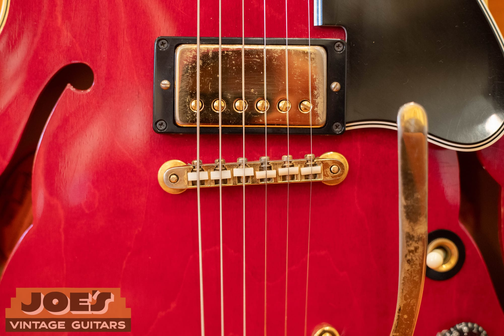

<figcaption><strong>Patent Number pickups.</strong> By 1966 the humbuckers carry the Patent Number decal and are heading into "T-Top" territory. The gold covers here show the heavy brassing that is completely normal on an original gold-hardware guitar.</figcaption>

</figure>

The two guitars make a useful pair. If you learn to read the horns (rounded versus pointed), the tailpiece (stop bar versus Bigsby), and the finish (sunburst versus cherry), you can place most 1960s 345s within a couple of years just by looking, before you ever get to the serial number. For a direct comparison against the plain-Jane mono version of the same body from the same era, see our [1966 Gibson ES-335 authentication guide](/post/1966-gibson-es-335-authentication-guide/) and the [1962 Gibson ES-335 guide](/post/1962-gibson-es-335-guide/).

<figure>

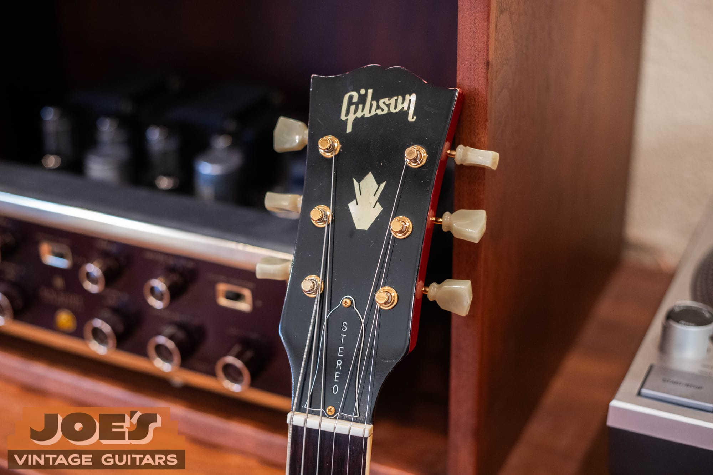

<figcaption><strong>Same headstock, three years on.</strong> The 1966 carries the identical crown inlay and STEREO truss-rod cover as the 1963. The deluxe appointments stayed constant across the decade even as the body horns and pickups changed.</figcaption>

</figure>

<figure>

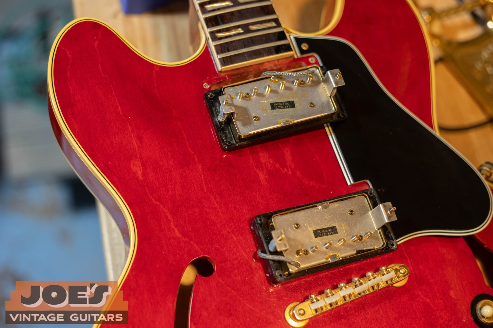

<figcaption><strong>The deluxe package in cherry.</strong> Two humbuckers, gold ABR-1, bound top, and the gold trim that separates a 345 from a 335. Everything above the strings is dressed a grade up.</figcaption>

</figure>

<h2 id="specifications">Specifications: The Full ES-345 Spec Chart</h2>

The chart below covers a classic mid-1960s stereo ES-345TD/TDC like the two guitars above. Earlier and later years vary as noted in the [dating](#dating) section (neck depth, nut width, horn shape, and tailpiece all shift over the run).

| Specification | Detail |
| --- | --- |
| Model | ES-345TD (sunburst), ES-345TDC (cherry); stereo/Varitone version often listed ES-345TDSV |
| Introduced | Spring 1959 |
| Body | Laminated maple top, back, and sides with a solid maple center block |
| Body Style | Thinline semi-hollow, double cutaway; rounded "Mickey Mouse" horns 1959 to ~1963, pointed after |
| Neck Wood | Mahogany, set neck |
| Fingerboard | Rosewood, bound, with split (double) parallelogram inlays |
| Headstock Inlay | Pearl crown |
| Scale Length | 24-3/4" |
| Nut Width | 1-11/16" (1959 to early 1965); narrows to ~1-9/16" late 1965; widens again ~1968 |
| Frets | 22 |
| Pickups | Two humbuckers: PAF early, then "Patent No. 2,737,842" from ~1962 to 1963 |
| Pickup Covers | Gold-plated |
| Electronics | Stereo wiring (each pickup to its own channel) plus six-position Varitone rotary and choke |
| Controls | Two volume, two tone, three-way toggle, six-way Varitone; stereo output jack |
| Knobs | Gold reflector "top-hat" (classic era), "witch hat" by late 1960s |
| Bridge | Gold ABR-1 tune-o-matic (retaining wire added ~mid-1962) |
| Tailpiece | Stop bar (1959 to early 1965), factory Bigsby option, or trapeze (from ~1965) |
| Tuners | Kluson tulip-button, gold-plated |
| Hardware Plating | Gold-plated throughout the vintage run |
| Binding | Bound top, back, and neck (more than a 335, less than a 355) |
| Finishes | Sunburst, Cherry (common from ~1960), rare Natural (~1959 to 1960 only), Walnut (from 1969), plus rare custom colors |
| Weight | Typically ~8 to 9 lbs |

<h2 id="authentication">Authentication: Checklist and Red Flags</h2>

When I evaluate a vintage ES-345, I work through the same list every time. Run these and you will catch most of what separates an investment-grade guitar from a player.

-   **The circuit.** Is it still stereo with an original, working Varitone and its choke inside? Look through the f-holes for the choke can and confirm the Varitone rotary and stereo jack are present and original. A mono conversion, a bypassed or missing Varitone, a modern replacement switch, or a filled Varitone hole all move the guitar down a tier. A reversible conversion with the original parts saved in the case is far less damaging than one where the harness was thrown away.
-   **The pickups.** These are the single biggest hidden value killer. On early guitars the PAFs were often pulled and sold into Les Paul projects and replaced with later pickups. Judge originality from the tops and the solder, and do not remove the covers to chase a decal.
-   **The tailpiece and top.** Stop bar, factory Bigsby, or a later-added Bigsby with extra holes? Extra holes in the top are permanent and they cost real money.
-   **The finish.** An original nitrocellulose finish matters. Watch for an over-sprayed cherry that has faded unevenly, an opaque sunburst hiding filler, or plating overspray. A refinish is one of the largest deductions there is.
-   **The neck and headstock.** Gibson headstocks break. A repaired break, even a clean one, is a major hit. Check for a refret (lost binding "nibs" over the fret ends) and a replaced nut.
-   **The small parts.** Tuners (widened holes from a Grover swap), knobs, pickguard, and the Varitone ring should all be correct and original. Small swaps add up.

<figure>

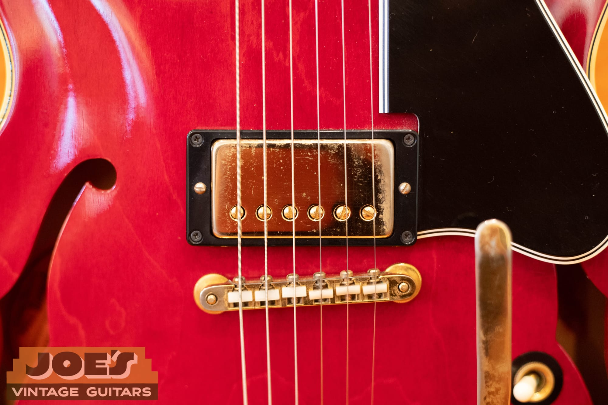

<figcaption><strong>Original hardware matters.</strong> Every gold part, from the ABR-1 down to the ring screws, factors into the appraisal. Correct, consistently aged gold with honest brassing is what you want; a mismatched bright or nickel part is a swap.</figcaption>

</figure>

A quick word on the "do not disassemble" rule, since it comes up on every one of these. The information that tempts people to take a vintage guitar apart, the pickup decals especially, is almost never worth the risk of a slipped screwdriver, a broken coil lead, or a cracked bobbin. If you need to verify pickups or the harness on a valuable 345, have someone who does this for a living do it, or just send me photos.

<h2 id="value">Value: What a Vintage ES-345 Is Worth</h2>

Two things to say up front. First, these are **asking and guide ranges in a thin market**, and right now asking prices are running well ahead of actual sales, so treat them as a starting point and verify against current comps before you buy or sell. Second, every figure below assumes an all-original, excellent, unmodified guitar. The deductions further down are where most real-world 345s land.

| Era | Typical asking range (all-original, excellent) |
| --- | --- |
| 1959 (first year, PAF, sunburst) | ~$22,000 to $45,000+ |
| 1959 Natural / blonde (very rare) | premium, ~$45,000 to $75,000+ |
| 1960 to 1961 (PAF, stop bar, wide nut) | ~$18,000 to $32,000 |
| 1962 to 1964 (early patent number, stop bar, wide nut) | ~$12,000 to $22,000 |
| 1965 (transition: narrow nut and trapeze arrive) | ~$8,000 to $22,000 |
| 1966 to 1969 (patent number, trapeze, Bigsby options) | ~$7,000 to $12,000 |
| Late 1960s to early 1970s (Norlin) | ~$4,500 to $9,000 |

### Deductions From the All-Original Figure

-   **Converted to mono / bypassed Varitone:** roughly minus 10 to 25 percent if the original switch, choke, and harness are kept and the work is reversible. Worse if those parts are gone. A filled Varitone hole is top damage and a bigger, permanent hit.
-   **Refinish:** minus 40 to 50 percent. This is one of the largest deductions there is.
-   **Replaced pickups / PAFs gone:** minus 30 to 50 percent or more on 1959 to 1962 guitars. A genuine PAF pair can be worth $8,000 to $15,000 on its own, which is why this is so often the biggest single hit and the most hidden.
-   **Added Bigsby / extra top holes:** minus 10 to 20 percent, plus the loss of the stop-bar premium.
-   **Headstock break or repair:** roughly minus 30 to 50 percent, even when the repair is clean and stable.
-   **Refret:** minus 5 to 15 percent, minor if the board and inlays are original.

Premiums run the other way for the rare **Natural/blonde** finish, for genuinely **documented factory custom colors** (rare on 345s and a magnet for refinish fraud, so demand documentation), and, more modestly, for the original case and hang tags.

### Is a 345 Worth More or Less Than a 335?

This surprises people: the plainer **ES-335 usually outvalues the fancier ES-345** of the same year. The reason is the stereo Varitone circuit. Most players do not want it, a lot of them rip it out, and the simple mono 335 is the iconic, blue-chip model that the market chases. The gap is widest in the late 1950s and early 1960s, where a dot-neck 335 can run well into the tens of thousands while a comparable 345 sits at maybe half to two-thirds of that, and it narrows toward parity by the late 1960s. The **ES-355** is fancier still, and its value depends heavily on whether it is mono or stereo. None of that makes the 345 a bad buy. It arguably makes it the value play in the family: the same golden-era body and build, dressed up nicer, usually for less money than the 335 next to it.

For contrast, a new USA reissue ES-345 runs around $3,800, and Gibson Custom Historic reissues of the 1959 and 1964 land in the rough $5,000 to $9,000 range depending on the aging. (You may have seen the one-off 2025 "Back to the Future" Custom ES-345 change hands around $40,000. That is a hype anomaly, not a vintage-value reference.)

If you have a vintage ES-345 and want a real number rather than a range, that is exactly what I do. Send photos through the [free appraisal](/free-appraisal/) page and I will tell you what it is and what it is worth.

<h2 id="players">Players: Who Actually Played One</h2>

The ES-345 has a real player history, but it also gets credited with guitars that were actually 335s and 355s, so here are the ones who genuinely played a 345.

-   **Freddie King** is the strongest association. A cherry ES-345 was his main guitar through much of the 1960s. Worth a caveat, though: his signature instrumental "Hide Away" was cut on a Les Paul goldtop, not the 345, and he later moved to a 1973 ES-355.
-   **Elvin Bishop** and his 1959 ES-345 "Red Dog" have been together for about half a century.
-   **Jorma Kaukonen** (Jefferson Airplane) used a sunburst 345 with the Varitone in the band's early years.
-   **Steve Howe** (Yes) played a sunburst ES-345 on "Close to the Edge" in 1972.
-   **Bob Weir** (Grateful Dead) picked up an ES-345TDC in 1967 and made it a primary guitar into the early 1970s.
-   **George Harrison** briefly used a 1964 ES-345 in late 1965.
-   **Joe Bonamassa** is the modern advocate, and one of the few well-known players who defends keeping the Varitone stock.

You will also see the cherry ES-345 with a Bigsby from *Back to the Future*, the guitar "Marty McFly" plays at the 1955 dance. It is a famous anachronism, since the model did not exist until 1959, but it put the shape in front of a lot of people.

One correction, because it comes up constantly: **B.B. King's "Lucille" is an ES-355, not a 345**, and Chuck Berry is a 350T and 355 man. Plenty of otherwise reliable pages list them as 345 players. They are not.

## Thinking of Buying or Selling an ES-345?

The ES-345 rewards knowing the details. The circuit, the tailpiece, the pickups, and the plating are the difference between a modified player and an investment-grade guitar, and they are easy to miss if you do not handle these often. At **Joe's Vintage Guitars**, I do, whether it is a clean stereo original or a well-loved 345 that had its Varitone pulled decades ago.

If you are ready to sell, my [Sell My Gibson Guitar](/sell-my-gibson-guitar/) page lays out how I pay fair, top-of-market prices without the auction fees and the wait. If you just want to know what you have, the [free appraisal](/free-appraisal/) page is the place to start, and you can read more about me on the [About Me](/about-me/) page. Questions about a specific serial number, a Varitone, or whether that Bigsby is factory? [Contact me](/contact-me/) directly. I am always happy to talk vintage Gibsons.

