<nav class="es5-nav-sidebar" id="es5NavSidebar" aria-label="Article section navigation">
  
<strong>ES-5 Guide</strong>

  <a href="#" onclick="window.scrollTo({top:0,behavior:'smooth'});return false;" class="es5-nav-link top">&uarr; Top of Page</a>
  
The Guitar

  <a href="#es5-what" class="es5-nav-link">The Short Version</a>
  <a href="#es5-history" class="es5-nav-link">The First Three-Pickup Gibson</a>
  <a href="#es5-original" class="es5-nav-link">The Original ES-5</a>
  <a href="#es5-switchmaster" class="es5-nav-link">The Switchmaster Arrives</a>
  <a href="#es5-humbuckers" class="es5-nav-link">From P-90s to PAFs</a>
  <a href="#es5-built" class="es5-nav-link">How It Was Built</a>
  <a href="#es5-timeline" class="es5-nav-link">Year by Year</a>
  <a href="#es5-players" class="es5-nav-link">Who Played One</a>
  
Dating &amp; Authentication

  <a href="#es5-dating" class="es5-nav-link">Dating Your ES-5</a>
  <a href="#es5-authenticate" class="es5-nav-link">Reading One Like a Dealer</a>
  <a href="#es5-mods" class="es5-nav-link">Mods and Red Flags</a>
  <a href="#es5-checklist" class="es5-nav-link">The Checklist</a>
  
Value

  <a href="#es5-value" class="es5-nav-link">What It Is Worth</a>
  <a href="#es5-reissue" class="es5-nav-link">Vintage or Reissue</a>
  <a href="#es5-selling" class="es5-nav-link">Thinking of Selling</a>
  <a href="#es5-faq" class="es5-nav-link">FAQ</a>
</nav>

<button class="es5-nav-btn" id="es5NavBtn" onclick="toggleEs5Nav()" aria-expanded="false" aria-controls="es5NavPanel" type="button">
  &#9776; Jump To Section
</button>

  
<strong>ES-5 Guide</strong>

  <a href="#" onclick="window.scrollTo({top:0,behavior:'smooth'});closeEs5Nav();return false;" class="es5-nav-link top">&uarr; Top of Page</a>
  
The Guitar

  <a href="#es5-what" onclick="closeEs5Nav()" class="es5-nav-link">The Short Version</a>
  <a href="#es5-history" onclick="closeEs5Nav()" class="es5-nav-link">The First Three-Pickup Gibson</a>
  <a href="#es5-original" onclick="closeEs5Nav()" class="es5-nav-link">The Original ES-5</a>
  <a href="#es5-switchmaster" onclick="closeEs5Nav()" class="es5-nav-link">The Switchmaster Arrives</a>
  <a href="#es5-humbuckers" onclick="closeEs5Nav()" class="es5-nav-link">From P-90s to PAFs</a>
  <a href="#es5-built" onclick="closeEs5Nav()" class="es5-nav-link">How It Was Built</a>
  <a href="#es5-timeline" onclick="closeEs5Nav()" class="es5-nav-link">Year by Year</a>
  <a href="#es5-players" onclick="closeEs5Nav()" class="es5-nav-link">Who Played One</a>
  
Dating &amp; Authentication

  <a href="#es5-dating" onclick="closeEs5Nav()" class="es5-nav-link">Dating Your ES-5</a>
  <a href="#es5-authenticate" onclick="closeEs5Nav()" class="es5-nav-link">Reading One Like a Dealer</a>
  <a href="#es5-mods" onclick="closeEs5Nav()" class="es5-nav-link">Mods and Red Flags</a>
  <a href="#es5-checklist" onclick="closeEs5Nav()" class="es5-nav-link">The Checklist</a>
  
Value

  <a href="#es5-value" onclick="closeEs5Nav()" class="es5-nav-link">What It Is Worth</a>
  <a href="#es5-reissue" onclick="closeEs5Nav()" class="es5-nav-link">Vintage or Reissue</a>
  <a href="#es5-selling" onclick="closeEs5Nav()" class="es5-nav-link">Thinking of Selling</a>
  <a href="#es5-faq" onclick="closeEs5Nav()" class="es5-nav-link">FAQ</a>

<h2 id="es5-what">The Short Version</h2>

The Gibson ES-5 is one of the great overlooked archtops. It was the top of Gibson's electric line when it arrived in 1949, a full-size, single-cutaway jazz box dressed in the cosmetics of the acoustic L-5 and carrying something no production Spanish electric had offered before: three pickups. Gibson called it the instrument of a thousand voices, and the pitch was that with three pickups and a fistful of controls you could dial in any tone you wanted. A few years later Gibson fixed the one thing players complained about, added a four-way switch, and renamed it the ES-5 Switchmaster. Later still it traded its P-90s for three PAF humbuckers, which is the version collectors chase hardest today.

At Joe's Vintage Guitars we buy and sell these guitars, and we are always glad to get one on the bench. This guide is the same walk-through we do in the shop: where the ES-5 came from, how it changed from the original three-P-90 guitar to the Switchmaster to the humbucker era, how we date one, how we tell an original from a modified one, and what each version is really worth. We are lucky enough to show you real examples throughout, and one point matters enough to put right at the top. Of the guitars in this guide, only the 1958 Switchmaster has been refinished. Our 1953 ES-5, and the natural, or blonde, ES-5 you will also see, both wear their original finish. We show the refinished 1958 on purpose, so that next to the original-finish guitars you can see for yourself what a refinish looks like and what it does to value. The 1953 is the original no-switch design and the 1958 is the three-humbucker Switchmaster, and between them they tell almost the whole story: the eras, the pickups, and the single biggest condition question of all.

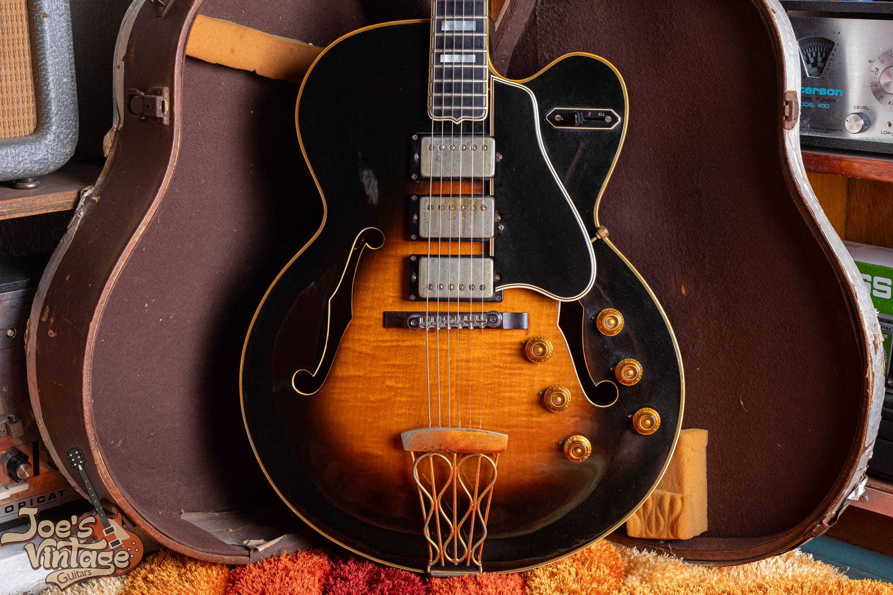

Our 1958 ES-5 Switchmaster, the fully evolved model: three humbuckers, the four-way selector, and six gold knobs. This is also the one guitar in this guide that has been refinished, which is why we lean on it as our before-and-after case study on finish later on. It is a stunning instrument, and we will come back to it often.

<h2 id="es5-history">The First Three-Pickup Gibson</h2>

To understand the ES-5 you have to remember where Gibson was in 1949. Ted McCarty had recently arrived to expand the electric line, and the company wanted a flagship electric that could stand next to its legendary acoustic archtops. The answer was the ES-5, and the name was not an accident. Where the ES-125, ES-150, and ES-300 were named for their price, the ES-5 borrowed the number of the acoustic L-5, Gibson's most famous jazz guitar. A 1950 catalog described it as the supreme electronic version of the famed Gibson L-5, and promised that its three separately controlled pickups made it, in Gibson's words, the instrument of a thousand voices.

Three pickups was the headline. No production Spanish electric had carried three before, and the ES-5 beat the three-pickup Fender Stratocaster to market by five years. This was Gibson's idea of the ultimate electric: take the biggest, most beautiful electric archtop you could build, and give the player more tonal range than anyone had offered. When Gibson electrified the L-5 and the Super 400 into the carved-top L-5CES and Super 400CES in 1951, those cost more and sat above the ES-5, but for years the ES-5 remained the only Gibson with three pickups. If you want to see where the carved-top flagship went, our [Gibson L-5CES value guide](/post/gibson-l5-ces-value-guide/) covers the ES-5's fancier, more expensive cousin.

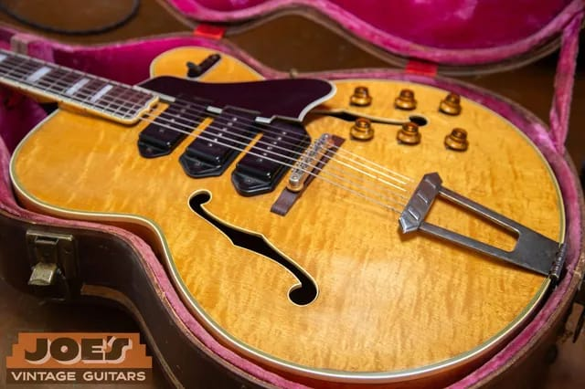

The ES-5 was offered in sunburst or natural, and the natural, or blonde, finish is the rarer and more valuable of the two. About a third of all ES-5s left the factory in natural. It is also the finish of the most famous ES-5 of all: the bluesman T-Bone Walker played a 1949 natural ES-5 for years, one of only about twenty-two built that first year.

<h2 id="es5-original">The Original ES-5</h2>

The first ES-5, built from 1949 to about 1955, is the guitar in our sunburst photos, and its defining feature is what it does not have. There is no pickup selector switch. Instead the three P-90s each get their own volume control down on the lower treble bout, and a single master tone control sits up on the cutaway bout. Four knobs, three pickups, no switch. The idea was that you would blend the three pickups by balancing their volumes, like a little mixing desk built into the guitar.

It is a beautiful idea that turned out to be awkward in practice. Balancing three volume knobs to change sounds is slow, and there is no way to jump from one pickup to another in the middle of a song. As the saying among players goes, pots do not make good switches. That single limitation is the reason the Switchmaster exists, and it is the first thing to understand about the model, because the control layout is how you tell an early ES-5 from a Switchmaster in one glance.

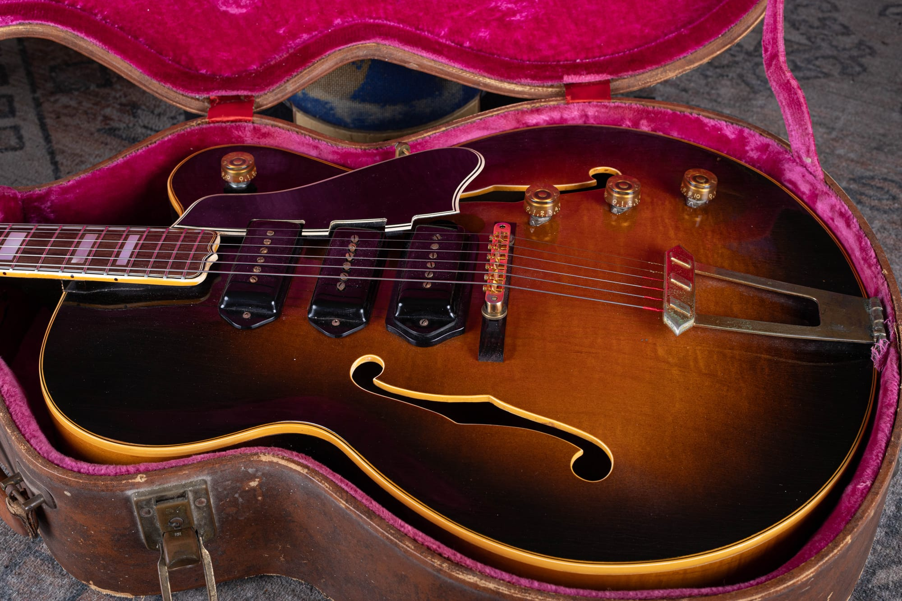

The control layout of the original ES-5, seen on our 1953. Three dog-ear P-90s, a volume knob for each down on the treble bout, and a single master tone up on the cutaway. No switch anywhere. If you see three pickups, four knobs, and no selector, you are looking at the first design, made from 1949 to about 1955.

One detail worth getting right, because people say it wrong all the time, is that the ES-5 uses dog-ear P-90s, not the soapbar kind. On a fully hollow archtop there is no solid wood under the top to screw a soapbar into, so Gibson used the dog-ear cover, whose pointed tabs at each end let the pickup mount straight to the top. You can see the ears clearly on our guitar. It is a small thing, but it is the sort of detail that separates someone who knows the model from someone reading a spec sheet.

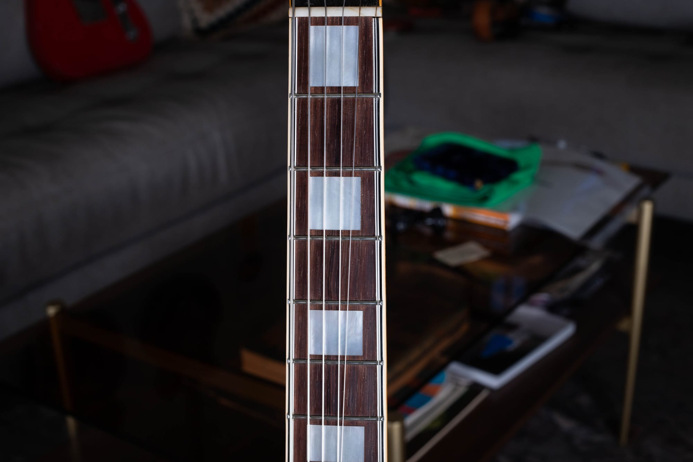

The other half of the ES-5 story is the dress. This is a flagship archtop, so it carries a bound rosewood fingerboard with large mother-of-pearl block inlays, multi-ply binding, and gold hardware, all borrowed from the L-5. The blocks, the binding, and the crown on the headstock are what tell you this is a top-line Gibson and not one of the plainer ES models.

<h2 id="es5-switchmaster">The Switchmaster Arrives</h2>

In 1955 Gibson solved the blending problem and renamed the guitar the ES-5 Switchmaster. The fix was a four-way rotary selector switch mounted on the upper bass bout, next to a redesigned control layout. Where the original had four knobs and no switch, the Switchmaster has six knobs, a volume and a tone for each of the three pickups, plus that switch. Now you could pick a pickup instantly and still fine-tune each one.

The four positions on the switch are the thing to understand, because they are not what most people assume. The switch is engraved 1, 2, 3, and All. It gives you each pickup on its own, or all three together, and that is it. It does not offer the three two-pickup pairs the way a modern three-pickup guitar would. If you want the neck and middle together, you select All and roll the bridge volume off. It is a compromise, but after the no-switch original it felt like a revelation, and the Switchmaster name stuck.

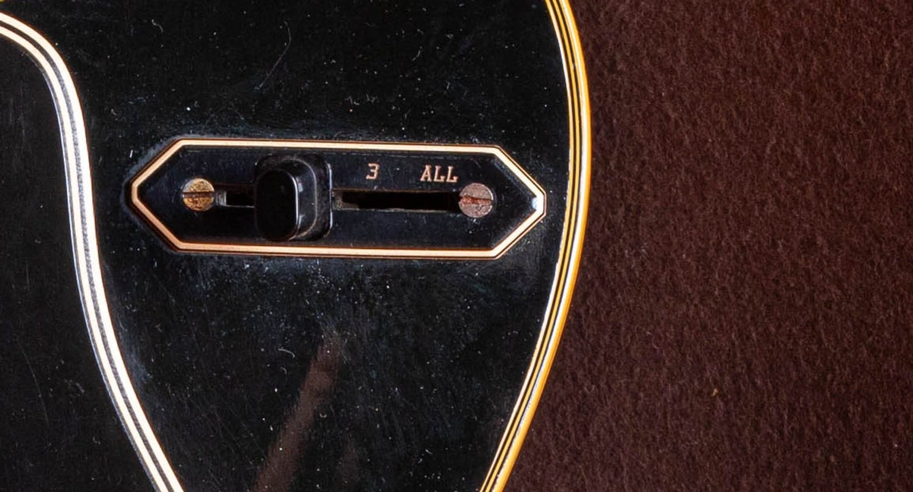

The four-way Switchmaster switch on our 1958, with the engraving reading toward All on the right. Positions one, two, and three select each pickup on its own, and All turns on the whole trio. This switch and the second row of knobs are what separate a Switchmaster from the original ES-5, and they are the fastest way to tell the two apart.

<h2 id="es5-humbuckers">From P-90s to PAF Humbuckers</h2>

The change that matters most to value came during 1957, when the Switchmaster traded its three P-90s for three of Gibson's new PAF humbuckers. This is the same Patent Applied For humbucker that made the late-1950s Les Paul famous, and putting three of them on one guitar turned a refined jazz box into something that could rock. A 1958 like ours, with three humbuckers and the round cutaway, sits right in the sweet spot that collectors want.

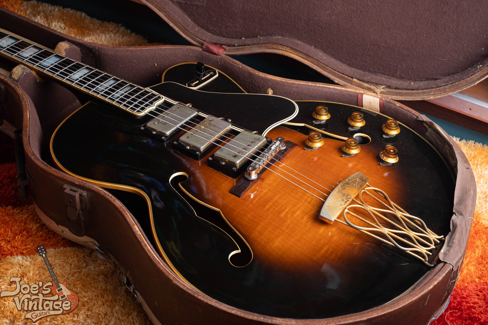

Our 1958 Switchmaster: three humbuckers up top, six gold knobs down on the treble bout, a gold tune-o-matic on a rosewood base, and the wavy wire tailpiece. Three genuine PAFs on one guitar is the single biggest thing driving value on a late-1950s Switchmaster, and it is also, sadly, the reason so many have been taken apart.

There is a hard truth attached to those three humbuckers. Because PAFs are so valuable in a Les Paul, many Switchmasters have been quietly stripped of their pickups over the years, the PAFs sold off to a Les Paul owner and cheaper humbuckers dropped in. Every intact three-PAF Switchmaster that survives with its original pickups is a little rarer than it was the year before. That makes an honest, unmolested example like a real prize, and it makes verifying the pickups the most important job in appraising one. If you want the deep dive on dating and authenticating the pickups themselves, our [Gibson PAF and Patent Number pickup guide](/post/gibson-paf-patent-number-pickup-guide/) is the companion to this section.

For the record, there is a small dispute about what came between the P-90 and the PAF. Gruhn's research notes that some Switchmasters wore Alnico V staple single-coils in the mid-1950s before the humbuckers arrived, while most sources describe a straight jump from P-90 to PAF. Either way, the practical rule holds: P-90s point to 1949 through 1957, and humbuckers point to 1957 and later.

<h2 id="es5-built">How It Was Built</h2>

The ES-5 body is 17 inches across, the same width as an L-5, with a single rounded cutaway and a full depth of about three and three-eighths inches. This is a big, comfortable jazz guitar. The key construction fact, and the reason the ES-5 sits below the L-5CES and Super 400CES in value, is that its top is laminated maple, not a carved solid top. That was a deliberate choice for an electric. A laminated top resists feedback and gives the guitar a tighter, more focused voice, which is exactly what you want when you plug in. The carved solid spruce top belongs to the more expensive L-5CES, and knowing that difference keeps you from overpaying or underselling.

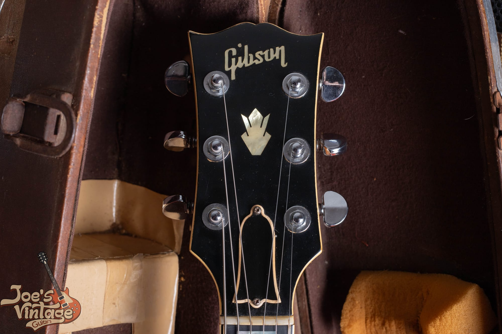

The headstock wears the Gibson logo and a pearl crown inlay, sometimes called the thistle, on a bound peghead. This is the correct ornament for the ES-5, and it is a useful check, because the acoustic L-5 uses a flowerpot inlay instead. If someone tells you an ES-5 should have a flowerpot on the headstock, that is the L-5 they are thinking of.

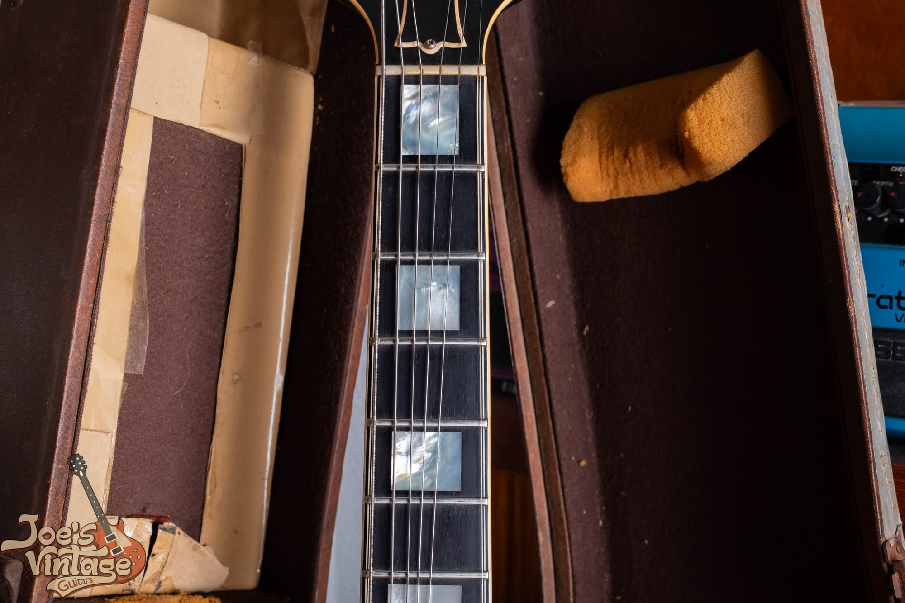

Large pearl block markers on a bound, pointed-end rosewood fingerboard, the same appointments on both our guitars five years apart. Along with the crown headstock, the multi-ply binding, and the gold hardware, these blocks are the L-5-grade dress that made the ES-5 a flagship. The 25.5-inch scale is standard Gibson, and the neck is a three-piece maple design.

<h2 id="es5-timeline">Year by Year</h2>

The ES-5 changed in a handful of clear, datable steps. Knowing them is how you place a guitar in its era and catch one that has been assembled from mismatched parts.

<h3>1949 to 1954: The Original ES-5</h3>

Three dog-ear P-90s, three volume knobs and a master tone, no selector switch, a rounded cutaway, and a rosewood compensated bridge. The earliest guitars, from 1949 into early 1953, used clear or amber barrel knobs with gold number inserts before Gibson moved to gold barrel knobs. This is the design in our 1953 photos.

<h3>1955 to 1957: The Switchmaster, Still With P-90s</h3>

The four-way switch and the six-knob layout arrive, and the guitar becomes the ES-5 Switchmaster. A gold tune-o-matic bridge on a rosewood base appears in this period, and a tubular double-loop tailpiece shows up around 1956. The pickups are still three P-90s. Only about seven Switchmasters shipped in that first year of 1955, which makes an early P-90 Switchmaster genuinely scarce.

<h3>1957 to 1960: Three PAF Humbuckers</h3>

During 1957 the P-90s give way to three PAF humbuckers, the round cutaway continues, and this becomes the configuration collectors want most. Our 1958 lives here.

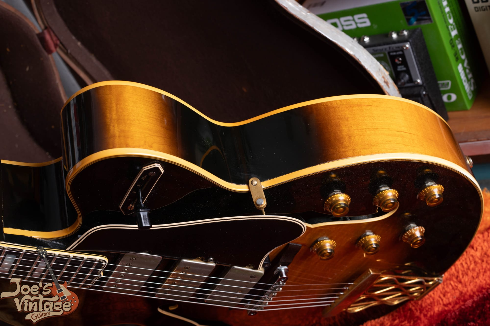

The gold tune-o-matic bridge on a rosewood base and the wavy wire tailpiece on our 1958. A tune-o-matic like this is correct for a Switchmaster and is one of the features that arrived with the model in the mid-1950s. On an earlier ES-5 the same bridge would be a later upgrade, which is a point we will come back to.

<h3>1960 to 1962: The Florentine Cutaway and the End</h3>

Around 1960 into 1961 Gibson changed the cutaway from the rounded Venetian shape to a pointed Florentine one, the same change it made to the L-5CES and Super 400CES, and later guitars drift toward a cherry-tinted sunburst and a slimmer neck. Gibson shipped its last handful of ES-5s in 1961, about fifty-five of them, and the model was gone from the catalog by 1962. Collectors generally rate the pointed-cutaway guitars a step below the round-cutaway humbucker ones, so rarest does not always mean priciest here.

<h2 id="es5-players">Who Played One</h2>

The ES-5's most storied champion is T-Bone Walker, the founding father of electric blues, who played a natural 1949 ES-5 for years and made it part of his sound and his image. B.B. King owned an early blonde ES-5 in his Memphis days, before he settled on the thinline that became Lucille. And Carl Perkins bought a blonde 1956 ES-5 Switchmaster that now lives in the Rock and Roll Hall of Fame.

One bit of folklore is worth correcting, because you will hear it repeated. Carl Perkins did not record Blue Suede Shoes on his Switchmaster. That record was cut on his 1953 Les Paul goldtop, and the Switchmaster came afterward. Plenty of other big names get attached to the ES-5 in passing, and some of those attributions are mix-ups with the L-5CES or the ES-350, so we stick to the three we can stand behind. That is the honest way to talk about a guitar's history.

<h2 id="es5-dating">Dating Your ES-5 or Switchmaster</h2>

You date an ES-5 the way you date any Gibson of the period: with several clocks that all have to agree. The features come first, then the numbers confirm them.

The single most useful feature is the electronics. Three pickups with four knobs and no switch means an original ES-5 from 1949 to about 1955. Six knobs and a four-way switch means a Switchmaster from 1955 on. P-90s mean 1949 to 1957, and humbuckers mean 1957 and later. A rounded cutaway means up to about 1960, and a pointed Florentine cutaway means 1960 to 1962. Those four checks alone will place almost any ES-5 within a couple of years.

For the numbers, Gibson used a paper oval label glued inside the body, readable through the bass-side f-hole, carrying an A-prefix serial number. There is also a factory order number, or FON, ink-stamped on the wood inside, and for this era the FON is the most reliable single clue because a label can be swapped and a stamped number cannot. Our [Gibson serial number guide](/how-to-read-gibson-serial-numbers/) walks through both systems and the year ranges in detail.

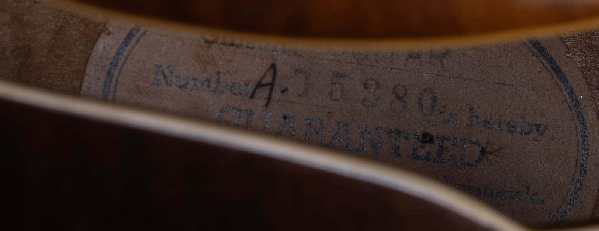

The label on our 1953, serial A-15380, which places it in 1953. Notice the color: this label is white. Gibson used white oval labels only through the very start of 1955, so a white label by itself tells you the guitar is an early, pre-Switchmaster ES-5.

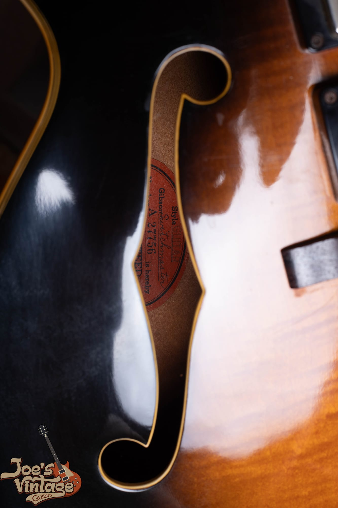

The label on our 1958, and it does two things at once. It is orange, not white, which by itself says 1955 or later, and it actually reads Gibson Switchmaster right on the label. The serial, A-27756, lands squarely in 1958. When the label color, the serial, and the three humbuckers all point to the same window, the guitar is telling a straight story.

<h2 id="es5-authenticate">Reading One Like a Dealer</h2>

Authentication is not a single test. It is the question of whether every part of the guitar tells the same story. An ES-5 has a serial, a set of pickups, a bridge, a tailpiece, a set of tuners, a switch or the absence of one, and a wiring harness, and each of those has a date range. When they all agree, the guitar is honest. When one points somewhere else, you have found either a repair, an upgrade, or a story that does not add up. Neither of our guitars is perfect, and that is exactly why they are useful to show you.

Start with the pickups, because they are the biggest value driver and the most common thing to be changed. On a P-90 ES-5, confirm three correct dog-ear P-90s with clean, un-drilled wood around the ears. On a humbucker Switchmaster, the job is bigger: you want three genuine PAFs whose resistance readings sit in the right range, whose stickers and aging match, and whose lead wires and solder joints look untouched. Because so many Switchmasters have been robbed of their PAFs, a guitar wearing the wrong humbuckers is common, and it is the difference between a five-figure guitar and something far less.

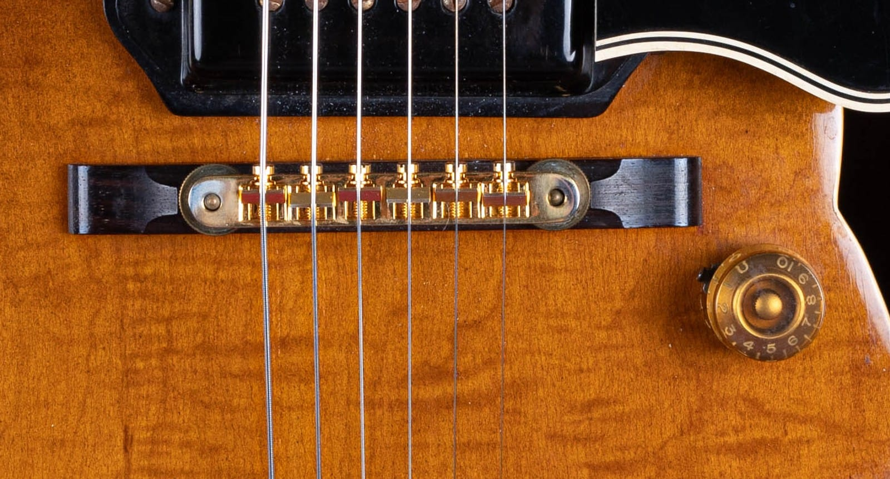

Here is where our 1953 has a story to tell. It wears a gold tune-o-matic bridge, but a tune-o-matic did not arrive on the ES-5 until the Switchmaster of the mid-1950s. On an early guitar like this, the original bridge would have been a plain rosewood compensated one, so this tune-o-matic is almost certainly a later, sympathetic upgrade for better intonation. That is not a knock on the guitar, it is simply part of reading it honestly, and it is exactly the kind of detail a careful buyer notes.

Then read the tailpiece, the tuners, the bridge, and the knobs, and check that each one is right for the year the serial and the electronics claim. A mismatch is not automatically bad, but every one of them is a question you want answered before money changes hands.

<h2 id="es5-mods">Modifications and Red Flags That Change the Value</h2>

Most of the value questions on a vintage ES-5 come down to a short list of changes. None of these makes a guitar worthless, but every one moves the number, and a guitar sold as all original when it is not is the expensive mistake to avoid.

- **Pulled or replaced PAFs.** This is the big one on a humbucker Switchmaster. Reproduction or mismatched humbuckers in place of the original PAFs can erase most of the guitar's premium. Verify all three.
- **Refinish.** A resprayed top or a refinished sunburst is one of the largest single hits to value, often 30 to 50 percent. Look for overspray in the f-holes and under the pickguard, color on the binding, and the absence of the fine finish checking a guitar of this age should show. Watch also for a sunburst that has been stripped and sold as a natural. Our own 1958 Switchmaster is a refinished guitar, and we use it as a side-by-side case study against the original-finish 1953 in the value section below.
- **Replaced tuners.** Original tuners with no extra holes matter, and a swap usually leaves a permanent mark.
- **Added Bigsby or changed tailpiece.** A vibrato or a replaced tailpiece means checking for filled or extra holes and pricing the guitar as a converted example.
- **Non-original bridge.** A tune-o-matic on an early ES-5, or a replaced saddle, as we saw on our own 1953.
- **Over-cleaned gold hardware.** Buffing away sixty-year-old patina or re-plating destroys an originality signal, so honest brassing and wear are actually what you want to see.

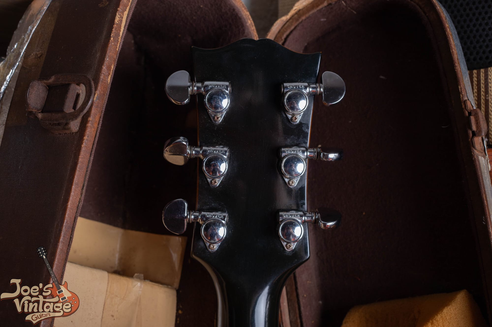

Our 1958 Switchmaster shows a clear example. The back of the headstock wears chrome Grover tuners, but this guitar left the factory with gold Kluson Deluxe tuners to match its gold hardware. The chrome finish alone tells you these are a later swap, and a change to Grovers usually means the original tuner holes were enlarged, which is not reversible. It is a fair, common change on a played guitar, and the honest thing is to price it as an instrument with replaced tuners rather than pretend they are original.

<h2 id="es5-checklist">The ES-5 Authentication Checklist</h2>

Here is the short version you can run through with a flashlight and a screwdriver:

1. **Version.** Four knobs and no switch is the original ES-5. Six knobs and a four-way switch is the Switchmaster. Confirm which one the seller is actually offering.
2. **Pickups.** Three dog-ear P-90s point to 1949 through 1957. Three humbuckers point to 1957 and later. On a humbucker guitar, confirm three real PAFs, not replacements.
3. **Cutaway.** Rounded means up to about 1960. Pointed Florentine means 1960 to 1962.
4. **Serial and label.** Read the oval label through the bass f-hole and find the FON inside. A white label means pre-1955. An orange label means 1955 or later. Do the number and the features agree?
5. **Bridge.** A rosewood compensated bridge is correct on an early ES-5, and a gold tune-o-matic is correct on a Switchmaster. A tune-o-matic on a 1949 to 1954 guitar is an upgrade.
6. **Tuners.** Gold Klusons are correct. Chrome or replaced tuners, and any extra holes, are a change.
7. **Finish.** Check the f-holes and under the pickguard for overspray, and make sure a natural is not a stripped sunburst.
8. **Structure.** Headstock back and neck for any break or repair, plus binding condition.
9. **Solder and wiring.** Original, undisturbed joints, or evidence someone has been inside.
10. **The coherence test.** Every point should tell the same story. One outlier is a question. Several outliers is a modified or assembled guitar.

If you get partway down this list and something stops adding up, that is the moment to get a second opinion before money changes hands.

<h2 id="es5-value">What a Vintage Gibson ES-5 Is Worth</h2>

ES-5 values move with the version, the pickups, the finish, the condition, and above all the originality. The ranges below are for sunburst guitars and reflect current dealer asking prices and price-guide figures for honest examples. Treat them as a starting point for a conversation, not a substitute for looking at your actual guitar, because a single refinish or a set of replaced pickups can move the number by many thousands.

| Version | Modified or refinished | All-original, excellent |
| --- | --- | --- |
| Original ES-5, three P-90s (1949 to 1954) | about $5,000 to $7,500 | about $8,000 to $13,000 |
| ES-5 Switchmaster, three P-90s (1955 to 1957) | about $6,000 to $8,500 | about $9,000 to $14,000 |
| ES-5 Switchmaster, three PAFs (1957 to 1960) | about $9,000 to $13,000 | about $14,000 to $20,000 |
| ES-5 Switchmaster, Florentine cutaway (1960 to 1962) | about $8,000 to $11,000 | about $12,000 to $17,000 |

A few things sit outside the table. The natural, or blonde, finish carries a strong premium over sunburst, often something like 30 to 60 percent, because far fewer were made, and a clean natural PAF Switchmaster can ask into the low twenty thousands. Three original PAFs, an original case, and documented history all push a guitar toward the top of its range, while a refinish, replaced pickups, a converted tailpiece, a headstock repair, or a refret pull it down. One honest caveat: the ES-5 market is thin, asking prices vary widely from dealer to dealer, and those asks generally run ahead of what guitars actually sell for. We have seen comparable 1958 sunburst PAF Switchmasters listed anywhere from twelve to eighteen thousand dollars, which tells you how much the specific guitar matters.

One more honest thing, and this one is about our own guitar. The 1958 Switchmaster in these photos has been refinished. We are showing it on purpose, as a case study, because the best way to learn what a refinish costs is to see one sitting right next to an original finish, which is exactly what our 1953 ES-5 gives you. A refinish does not ruin a guitar, and this is still a real three-humbucker Switchmaster, but it moves our 1958 out of the all-original column in the table above and into the modified or refinished one, which on a guitar like this is a difference of thousands of dollars. That gap, living inside a single instrument, is the whole reason we tell people never to refinish a vintage guitar.

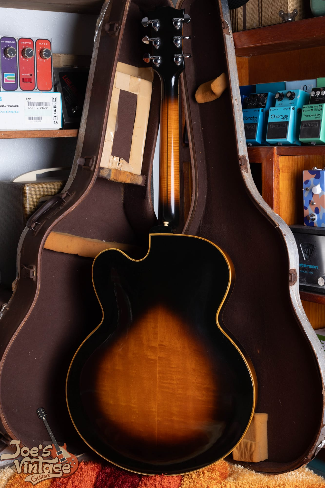

The figured maple back of our refinished 1958. Set its finish against the original nitrocellulose on our 1953 ES-5: a genuine finish of this age shows fine checking, softened color, and honest wear that a fresh refinish almost never reproduces convincingly. Training your eye on that difference is one of the most valuable skills in vintage guitars.

Here is the context that makes the ES-5 so interesting to value. It is the most affordable way into a real three-pickup, gold-hardware, L-5-cosmetic Gibson archtop with genuine PAFs. It sits a clear step below the carved-top L-5CES and Super 400CES, but above the plainer laminated archtops like the [Gibson ES-175](/post/gibson-es-175-evolution-and-specifications/) and the ES-350. Gibson built only around 1,400 ES-5s of all types across the entire 1949 to 1962 run, split roughly two to one between the original and the Switchmaster, which makes any of them genuinely scarce next to the tens of thousands of ES-175s that left Kalamazoo.

<h2 id="es5-reissue">Vintage or Reissue</h2>

Gibson brought the ES-5 back through its Custom Shop in the mid-1990s, around 1995 to 1996, and built it in several forms: a Switchmaster with humbuckers, an ES-5P with P-90s, and an ES-5A with Alnico pickups. These are good guitars, well made, with flamed maple and modern reissue humbuckers, and they turn up on the used market today around five to sixty-five hundred dollars. That is roughly a third to a half of a vintage P-90 original, and a small fraction of a real three-PAF Switchmaster.

Telling a reissue from a vintage guitar is quick once you know what to look for. The reissue carries a modern serial number format, modern pots with recent date codes, modern pickup construction, and none of the genuine nitrocellulose finish checking and aged pearl of a real 1950s guitar. If a guitar's serial, its label, and its parts all read modern, it is a reissue, and it should be priced as one. Do not let anyone sell you a 1996 reissue as a 1958, and do not undersell a real vintage ES-5 because it shares a name with the reissues.

<h2 id="es5-selling">Thinking of Selling Your ES-5</h2>

If you have an ES-5 or a Switchmaster and you are considering selling, the most valuable thing you can do is leave it alone. Do not refinish it, do not swap the pickups for something that sounds better to modern ears, do not convert the tailpiece, and do not have the gold hardware re-plated. Every bit of honest wear and every original part is part of the value, and once an original finish or an original PAF is gone, it does not come back. If your guitar has already been changed, that is fine too, and the right move is simply to describe it honestly.

At Joe's Vintage Guitars we buy vintage Gibson ES-5s, Switchmasters, and the rest of the electric archtop line, and we pay top dollar for clean, original examples. Send us photos through our [free appraisal](/free-appraisal/) page, including the front, the back, the headstock front and back, the serial label through the f-hole, and close-ups of the pickups, the bridge, the tailpiece, and any wear, and we will tell you exactly what you have and what it is worth. You can also [contact us directly](/contact-me/) with questions, and if you have decided to move it, our guide to [selling a vintage Gibson](/sell-my-gibson-guitar/) walks through the process. Whether you sell to us or not, you deserve a straight answer from someone who handles these guitars, and that is what we give.

<h2 id="es5-faq">Frequently Asked Questions</h2>

**What is the difference between a Gibson ES-5 and an ES-5 Switchmaster?**

They are the same model at two stages of its life. The original ES-5, from 1949 to about 1955, has three P-90 pickups, three volume knobs and a master tone, and no pickup selector switch. In 1955 Gibson added a four-way selector switch and a second row of knobs, giving each pickup its own volume and tone, and renamed the guitar the ES-5 Switchmaster. So six knobs and a four-way switch means a Switchmaster, and four knobs with no switch means the earlier ES-5.

**How can I tell what year my Gibson ES-5 is?**

Start with the features. Four knobs and no switch is 1949 to 1955, six knobs and a switch is 1955 and later, P-90s are 1949 to 1957, humbuckers are 1957 and later, and a rounded cutaway is pre-1960 while a pointed one is 1960 to 1962. Then confirm with the A-prefix serial on the oval label inside the body and the factory order number stamped inside. A white label points to before 1955 and an orange label to 1955 or later.

**Does the ES-5 have soapbar or dog-ear P-90s?**

Dog-ear. Because the ES-5 has a fully hollow body with no solid wood under the top, Gibson used dog-ear P-90s, whose extended tabs at each end let the pickup screw straight to the top. Soapbar P-90s mount from below into a routed cavity and are used on solidbodies and semi-hollows, not on a hollow archtop like the ES-5.

**Why is the ES-5 Switchmaster with PAF humbuckers so valuable?**

Because it carries three genuine PAF humbuckers, the same sought-after late-1950s pickup that makes a Les Paul valuable, and three of them on one guitar is rare. Many Switchmasters have been taken apart over the years so their PAFs could be sold into Les Pauls, so an intact, original three-PAF Switchmaster is scarcer every year, which is a big part of why collectors chase it.

**What is my vintage Gibson ES-5 worth?**

A sunburst ES-5 in honest, all-original condition generally runs from about 8,000 dollars for an early three-P-90 guitar to around 20,000 dollars for a round-cutaway three-PAF Switchmaster, with modified or refinished examples selling for less. The rare natural finish adds a strong premium on top. Condition and originality matter more than anything else, and the market is thin, so the only real way to know is to have your specific guitar appraised.

**Is a natural, or blonde, ES-5 worth more than a sunburst?**

Yes. Natural was a lower-production special finish, roughly a third of all ES-5s, so a clean blonde carries a real premium over the same guitar in sunburst, often in the range of 30 to 60 percent. A natural PAF Switchmaster is the most valuable configuration of all.

**Is a modern Gibson ES-5 reissue worth as much as a vintage one?**

No. The Custom Shop reissues from the mid-1990s and later are good guitars, but they sell used for around five to sixty-five hundred dollars, a fraction of a vintage original and a small fraction of a real three-PAF Switchmaster. You can spot a reissue by its modern serial format, modern pots and pickups, and the absence of genuine aged finish and pearl.

