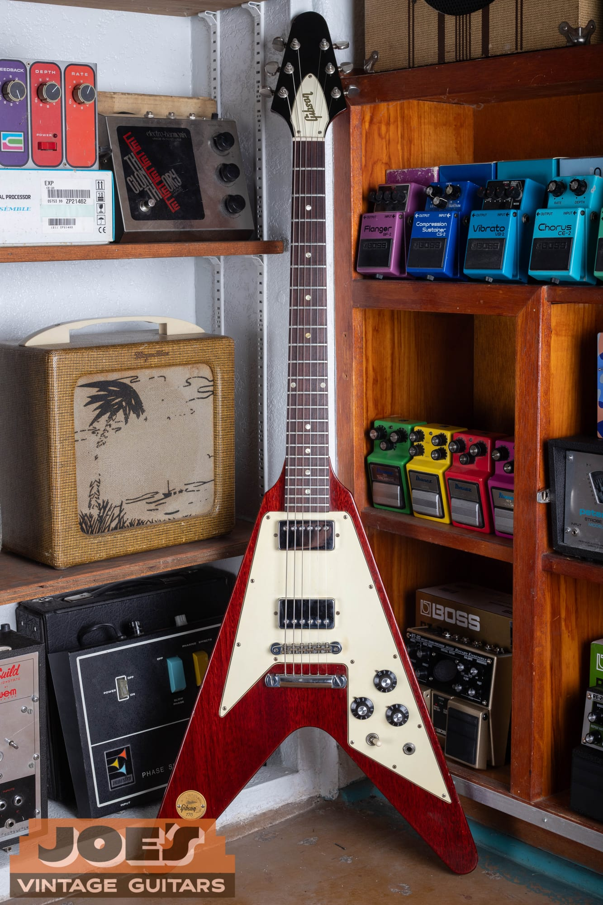
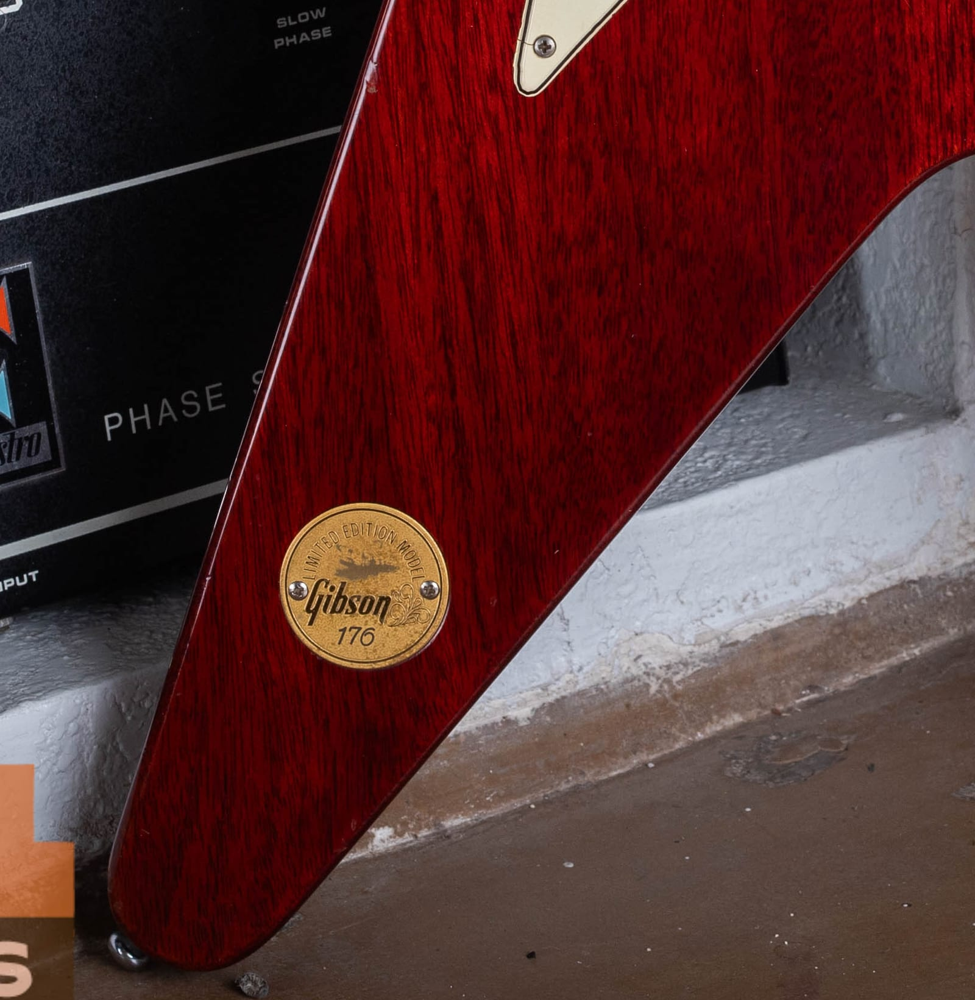
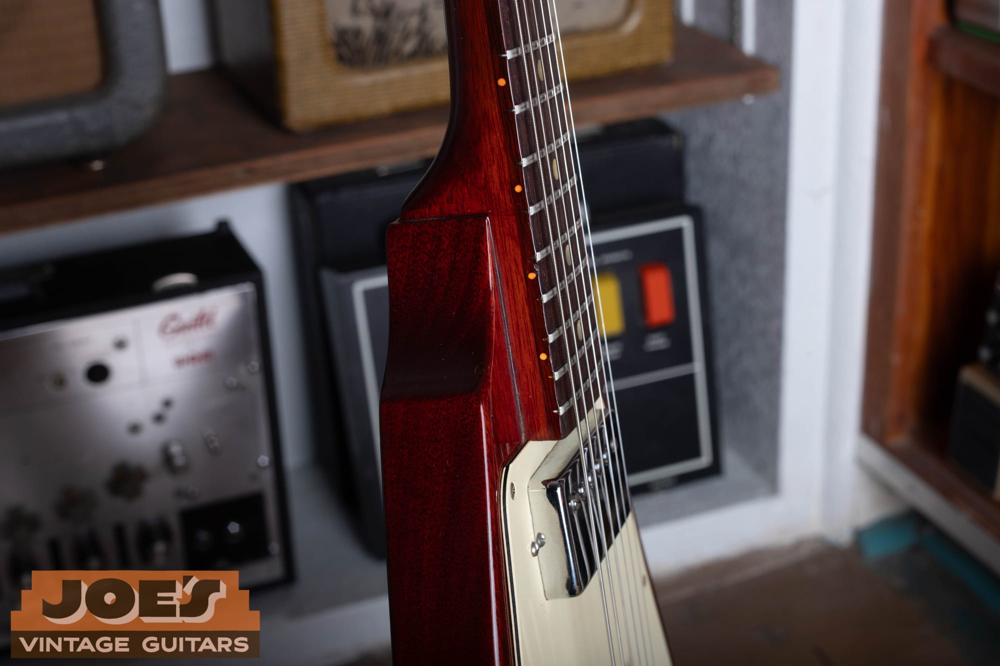
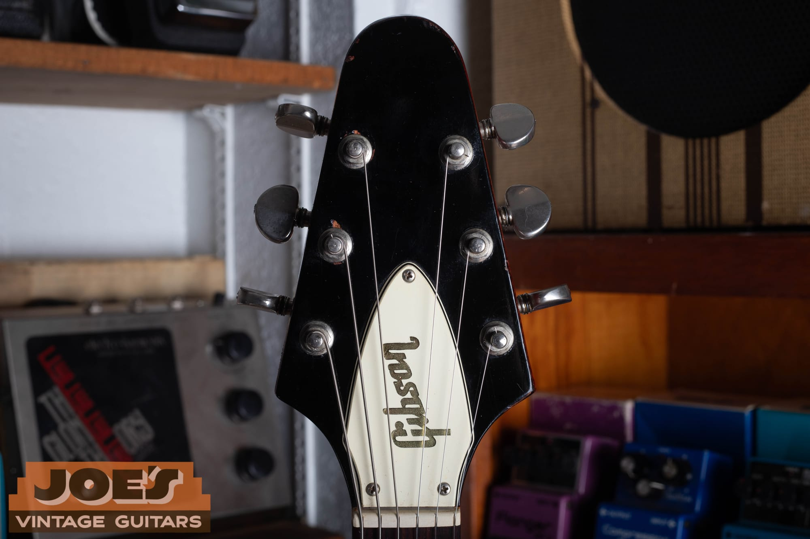
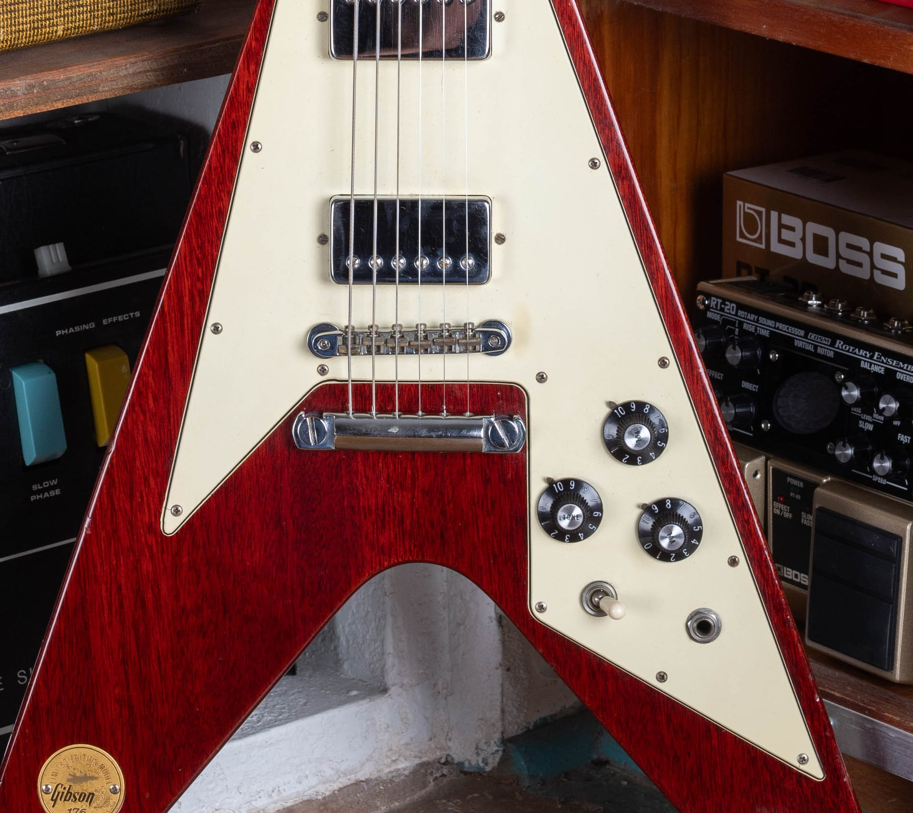
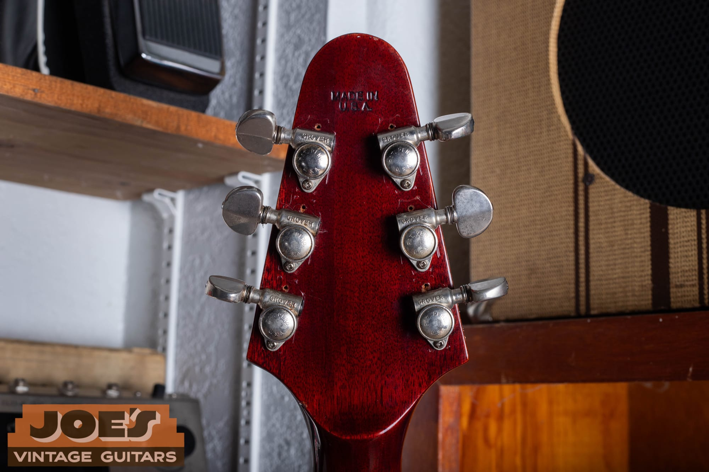
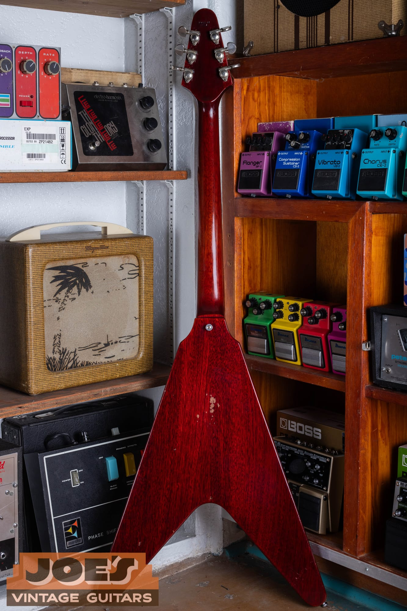
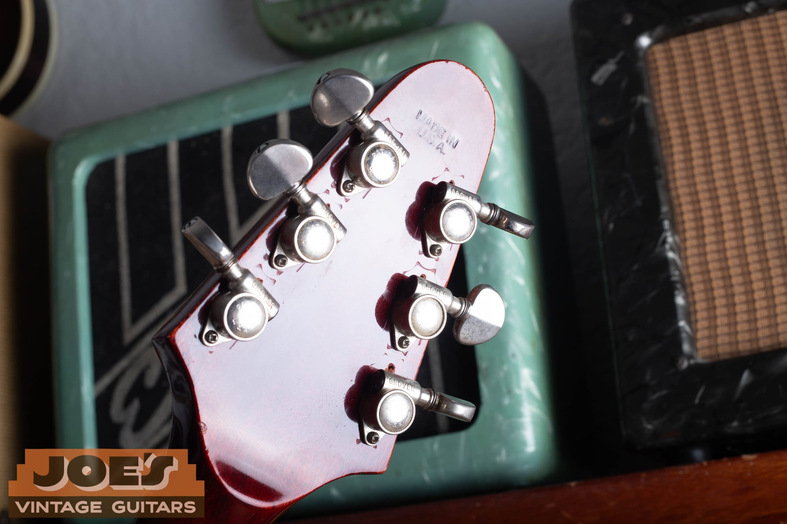
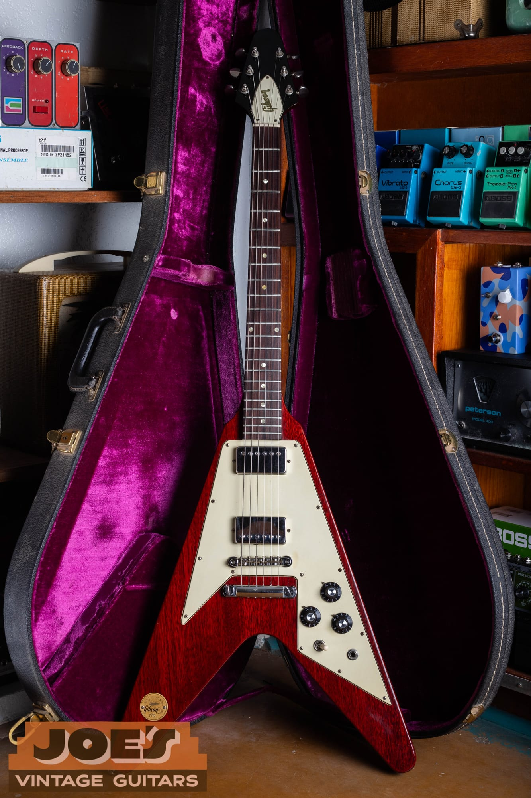

Collector's Reference · Gibson Kalamazoo, 1971

The full story of Gibson's numbered limited-edition Flying V, the specs,
the medallion myth, and how to tell a genuine one

-   [Overview](#overview)
-   [What the Medallion Is](#what-the-medallion-is)
-   [Why Gibson Made It](#why-gibson-made-it)
-   [How Many Were Made](#how-many-were-made)
-   [Flying V Versions: Where the Medallion Fits](#flying-v-versions-where-the-medallion-fits)
-   [Specifications](#specifications)
-   [How to Identify a Genuine Medallion V](#how-to-identify-a-genuine-medallion-v)
-   [A Closer Look at Number 176](#a-closer-look-at-number-176)
-   [What It Is Worth](#what-it-is-worth)
-   [Related Resources](#related-resources)

## Overview

The Flying V is one of the most recognizable shapes in electric guitars, and the 1971 "Medallion" is the version most people have heard about but very few have actually held. It looks, from across the room, like an ordinary early-1970s cherry Flying V: mahogany body, big cream pickguard, two humbuckers, a stop-bar tailpiece. Then you notice the small gold coin set flush into the lower wing, engraved with the words "Limited Edition Model," a Gibson logo, and a hand-stamped number, and you realize you are looking at something Gibson built only a few hundred of.

<figure>

<figcaption>A 1971 Gibson Flying V Medallion in cherry. From a few feet away it reads as a normal early-'70s V. The gold coin in the lower wing is what sets it apart.</figcaption>

</figure>

Gibson made roughly 350 of these in 1971, all finished in cherry, and each one carried its own numbered medallion. That combination of a small production run, a single finish, and a serialized coin is exactly the kind of thing that turns a guitar into a collector's item, and the Medallion V has been one of the more sought-after vintage Gibsons for decades. This guide covers what the guitar actually is, the story behind the medallion (including the part that gets repeated as fact but probably is not), how it fits into the larger Flying V timeline, a full spec breakdown, how to tell a real one, and a close look at the example in these photos, which happens to be number 176.

## What the Medallion Is

The whole model is named for one small part. Set into the lower bass-side wing of the body, in a routed circular recess and held by two tiny screws, is a gold-colored metal coin about an inch and a half across. It is engraved with "Limited Edition Model" arced around the top, a small eagle, the Gibson script logo, and a hand-stamped number at the bottom. That number is the guitar's identity. The coins were stamped in sequence, so each Medallion V carries a different one.

<figure>

<figcaption>The coin that names the model. "Limited Edition Model" around the top, a small eagle, the Gibson logo, and a hand-stamped number, here reading 176. The coin sits flush in a routed recess and is held by two small screws.</figcaption>

</figure>

It is worth knowing that the number on the coin is not the same as a Gibson serial number, and on most of these guitars it is the only number you get. More on that in the identification section below. For now, the useful takeaway is that the medallion is the single feature that defines the model. Everything else about the guitar was shared with the regular Flying V of the period. The coin is what made it a "limited edition," and it is also the first thing a knowledgeable buyer looks at, because a coin is a small thing to reproduce or add to a plain V.

## Why Gibson Made It

Here is where the story usually goes off the rails, so it is worth being careful.

The most repeated explanation, printed on dealer listings and in more than one guitar reference, is that the Medallion V was made to commemorate the 1972 Summer Olympics in Munich. It is a tidy story, and the coin does look a little like a commemorative medal, so it has stuck. The problem is that no Gibson document has ever surfaced to back it up, and the specialists who have spent decades cataloging these guitars do not repeat the Olympic claim. The engraving on the coin is an eagle, not the Olympic rings, which does not fit a commemorative for an international games either. So treat the Olympics angle as folklore. It might be true, but nobody has shown that it is.

The grounded version is simpler. By 1971 Gibson had been making the Flying V again for a few years, the shape was finally selling after its 1958 flop, and dressing a small batch up as a numbered "Limited Edition Model" was a straightforward way to add some interest and move a distinctive guitar. Gibson did the same thing around the same time with a run of Medallion Firebirds. The coin turned an ordinary cherry V into something a little special without changing how the guitar was built. That is the honest explanation, and it takes nothing away from the guitar. A short, serialized run from 1971 is collectible on its own terms, with or without an Olympic legend attached.

## How Many Were Made

The commonly quoted figure is 350, and that is close enough for conversation, but the more precise answer comes from the collector registry that has tracked these guitars for close to thirty years. Gibson built 350 Medallion Flying Vs in 1971, then built and shipped three more in 1973 and 1974, for a total of 353. The coins were numbered in sequence from 1 to 353. That is why you will see the run described as both "about 350" and "353." Both are right. The round number is the marketing figure, and 353 is the actual count once the three stragglers are included.

Not all of them have survived, and fewer still are untouched. The registry has accounted for roughly 176 of the 353 over the years, and by its count only about 27 remain completely original and unmodified. So even among a small run, a clean, all-there example is genuinely uncommon. There is a small coincidence worth a smile here: the guitar in these photos is number 176, and 176 is right around the number of examples the registry has documented. Those are two different things that happen to share a figure, but it is a fun one for this particular guitar.

## Flying V Versions: Where the Medallion Fits

To place the Medallion correctly, it helps to know that there are really three distinct vintage Flying Vs, and people mix them up constantly.

The **1958 to 1959 first version** is the rare and expensive one. It was made of korina, which is a light African wood, not mahogany. It has gold hardware, PAF humbuckers, and a string-through-body design with the strings anchored through a V-shaped plate on the back. Gibson shipped fewer than a hundred of these before the shape flopped, then sold a few leftover bodies into the early 1960s. This is the guitar that brings six figures.

The **1966 to 1970 second version** is where the Flying V came back. Gibson rebuilt it in mahogany with a large pickguard, a shorter headstock, patent-number humbuckers, and, on most examples, a short Maestro Vibrola tremolo tailpiece. This is the era when the V finally caught on, helped along by players like Jimi Hendrix and Albert King.

The **1971 Medallion** is a close cousin of that second version. It is the same mahogany body and neck, the same big pickguard, the same short headstock and patent-number pickups. There are two meaningful differences. First, the Medallion uses a plain stop-bar tailpiece instead of the Vibrola. Second, it carries the numbered coin. So the shortest accurate description of a Medallion V is this: it is the late-1960s reissue, with a stop-bar tailpiece, plus the medallion. If you understand the second-version V, you already understand most of the Medallion.

<figure>

<figcaption>The thin, flat mahogany body. The Medallion shares its construction with the 1966 to 1970 second-version V, which is why it plays and balances the same way.</figcaption>

</figure>

## Specifications

Because these were built in a single short run, the specs are consistent from guitar to guitar, which is a nice change from a lot of vintage models. The list below describes a standard 1971 Medallion V and matches the example in this guide, with one honest exception noted in the tuner row.

| Feature | Specification |
| --- | --- |
| Model | Flying V "Medallion," limited edition of 353 |
| Year | 350 built in 1971, plus 3 more in 1973 to 1974 |
| Body | Two-piece mahogany, unbound |
| Neck | Three-piece mahogany, set, long tenon |
| Fingerboard | Rosewood, 22 frets, dot inlays, unbound |
| Scale | 24.75 inches |
| Nut width | About 1 and 9/16 inches |
| Finish | Cherry, and only cherry, on every example |
| Pickups | Two patent-number "T-top" humbuckers, chrome covers |
| Controls | Two volume, one tone, three-way toggle |
| Bridge | ABR-1 Tune-o-Matic |
| Tailpiece | Separate stop-bar (no Vibrola, not string-through) |
| Pickguard | Large three-ply plastic, cream |
| Hardware finish | Chrome |
| Headstock | Short second-version peghead, black face, gold Gibson logo, bell truss rod cover |
| Tuners | Gibson Deluxe double-ring, as built (this example wears Grovers, see below) |
| Medallion | Gold coin in the lower bass wing, "Limited Edition Model," eagle, Gibson logo, and a stamped number |
| Case | Hardshell |

A few of these are worth a closer look.

<figure>

<figcaption>The short second-version headstock, black face with the gold Gibson logo and a bell-shaped truss rod cover. It is noticeably shorter than the elongated 1958 peghead.</figcaption>

</figure>

The **bridge and tailpiece** are the spec people get wrong most often. The Medallion uses a standard ABR-1 Tune-o-Matic bridge with a separate stop-bar tailpiece behind it. It is not the string-through-body setup of the 1958 original, and it is not the Maestro Vibrola that came on most of the 1966 to 1970 Vs. If you see a 1971-style V with a Vibrola, or with the strings anchored through the back, you are either looking at a different year or at a changed guitar. The stop-bar is one of the quiet tells that you are dealing with a Medallion-era V.

<figure>

<figcaption>ABR-1 bridge, separate stop-bar tailpiece, and the standard Flying V control layout: two volumes, one tone, and a three-way toggle on the big cream guard.</figcaption>

</figure>

The **pickups** are patent-number humbuckers, the "T-top" units Gibson used through this period, wearing chrome covers. They are not PAFs. Real PAFs had ended years earlier, around 1962, so any listing that calls a 1971 V's pickups PAFs is using the word loosely. The **body and neck are mahogany**, which is the other thing that separates the Medallion from the 1958 original. The first-version Vs were korina. From 1966 on, including the Medallion, they were mahogany, which is a heavier, darker wood and reads differently under a cherry finish.

## How to Identify a Genuine Medallion V

Because the value hangs so heavily on that one coin, and because a coin is a small thing to fake or add, the Medallion is a guitar you want to check carefully. Use several of these together rather than leaning on any single point.

**Start with the coin, but do not stop there.** A genuine medallion is a gold-colored coin reading "Limited Edition Model," with the eagle, the Gibson logo, and a stamped number, sitting flush in a clean routed recess in the lower bass wing. One useful detail the registry has documented: the stamping font for the number changed to a thinner style at around number 324, so a very high number in a thick font, or a low number in a thin one, is worth a second look. Reproduction coins do exist, and a coin can be added to an ordinary early-1970s V, so the coin has to be consistent with everything else on the guitar.

**Confirm the finish is cherry.** Every one of the 353 left the factory in cherry. There is no factory sunburst or natural Medallion V, whatever a listing might claim. A non-cherry example is a refinish or a fake, full stop.

**Confirm the tailpiece is a stop-bar.** As covered above, a Vibrola or a string-through body does not belong on a Medallion. This is one of the easier things to check from a photo.

**Understand the serial number situation, because it is unusual.** Gibson stamped "Made in U.S.A." into the back of the headstock starting in 1970, and you will find that stamp on Medallion Vs. What you will often not find is an impressed six-digit serial number. The registry found headstock serials on only about fourteen or fifteen of these guitars, which means most Medallion Vs left the factory with no serial number at all and are identified purely by the coin. Where a serial does appear, documented examples read in the 624xxx range. Because Gibson reused six-digit numbers across the early 1970s, the safest way to confirm the year is not the serial anyway. It is the potentiometer date codes, which on documented examples read 137-71, meaning a CTS pot from 1971. If you are working through a Gibson serial or want to understand the era's numbering, our [Gibson serial number guide](/how-to-read-gibson-serial-numbers/) walks through it.

<figure>

<figcaption>The "Made in U.S.A." stamp impressed into the back of the headstock. On many Medallion Vs this is the only stamped marking, with no six-digit serial, so the coin number becomes the guitar's identity.</figcaption>

</figure>

**Look for a de-medallioned guitar.** Some owners over the years unscrewed the coin, which leaves two small screw holes in the bass wing. A period V with two plugged holes in exactly that spot may be a Medallion that lost its coin, which is a different guitar from one that never had one.

**Be honest about the tuners.** As built, the Medallion V came with Gibson Deluxe double-ring tuners. Grover and Schaller conversions are common, because players upgraded them, and a set of Grovers on one of these is a well-known originality note rather than a sign of a fake. It affects value, but not authenticity. The example in these photos is a case in point, which brings us to it.

## A Closer Look at Number 176

The guitar photographed throughout this guide is number 176, a 1971 Medallion V in cherry that came through the shop. It is an honest, played example, and it wears its history plainly.

The finish is the correct cherry over two-piece mahogany, worn thin in the places a Flying V gets handled, with a spot on the back where the finish has rubbed through to bare wood. The medallion is present and clearly stamped 176. The bridge and tailpiece are the correct ABR-1 and stop-bar. The pickguard is the large three-ply cream guard, and the control layout is the standard two volumes and a tone with the three-way toggle.

<figure>

<figcaption>The back tells the honest story: cherry over two-piece mahogany, with the finish worn through in one spot from decades of playing. Nothing about the wear changes what the guitar is.</figcaption>

</figure>

The one thing that is not factory is the tuners. This one wears Grovers rather than the Gibson Deluxe double-ring units it left Kalamazoo with. That is the single most common change made to these guitars, and it is the kind of thing a serious buyer will note and price in, but it takes nothing away from the fact that this is a genuine, numbered 1971 Medallion V.

<figure>

<figcaption>The Grover tuners on number 176. They replace the Gibson Deluxe double-ring units the guitar was built with, which is the most common change made to a Medallion V and a normal thing to see on one that was actually played.</figcaption>

</figure>

<figure>

<figcaption>Number 176 in its case. The bright magenta plush lining is pure early-1970s, and it makes the cherry finish pop.</figcaption>

</figure>

Guitars like this are the reason the shop is fun to run. It is a genuine short-run Gibson from the Kalamazoo years, it has a story people recognize the second they see the coin, and it is the kind of thing you do not get to hold very often.

## What It Is Worth

Value is the hard part, for the usual vintage reason: so few of these trade that there is not much recent sold data to build on. What you can see are dealer asking prices, and those give a fair picture of the range.

Clean, all-original "survivor" Medallion Vs, the roughly two dozen that have never been touched, sit at the top and have been offered in the mid-$20,000s and up. More typical examples, meaning honest players with a common change or two such as replaced tuners, trade lower, generally in the high teens to low $20,000s. Guitars with bigger issues, a repaired headstock break, a refinish, or a missing coin, drop further from there. Condition, originality, and whether the coin is present and correct move the number more than anything else.

The practical advice is the same as with any vintage guitar at this level. Do not price it off a single old listing or a forum thread. If you own a Medallion V, or think you might have one, the sensible move is to have someone who knows them look at it. You can start with a free, no-obligation [appraisal request](/free-appraisal/), and if you decide to sell, our [sell my Gibson](/sell-my-gibson-guitar/) page explains how we buy them outright.

## Related Resources

More vintage Gibson references from the shop.

-   [How to Read Gibson Serial Numbers](/how-to-read-gibson-serial-numbers/), the full dating guide, including the early-1970s numbering and why pot codes matter.
-   [Gibson Shipping Totals, 1948 to 1979](/post/gibson-shipping-totals-1948-1979/), production and shipping figures for reference on how rare a given model really is.
-   [Sell My Gibson Guitar](/sell-my-gibson-guitar/), how to sell a vintage Gibson to the shop.
-   [Free Vintage Guitar Appraisal](/free-appraisal/), send photos and details for a no-obligation opinion.

This reference is compiled from the Flying V collector registry maintained by longtime enthusiasts, period Gibson history, dealer and auction listings, and the instrument in our own photos. Because Gibson never published detailed records on this run, a few points in its history are genuinely uncertain, and this guide flags those rather than smoothing them over. As always, verify against the physical instrument, and get a hands-on opinion before any high-value purchase.
