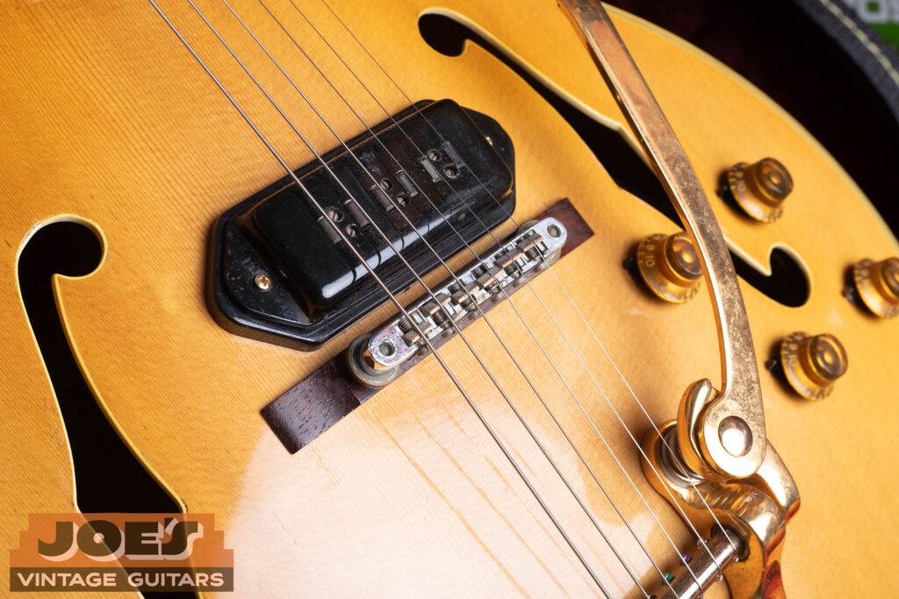
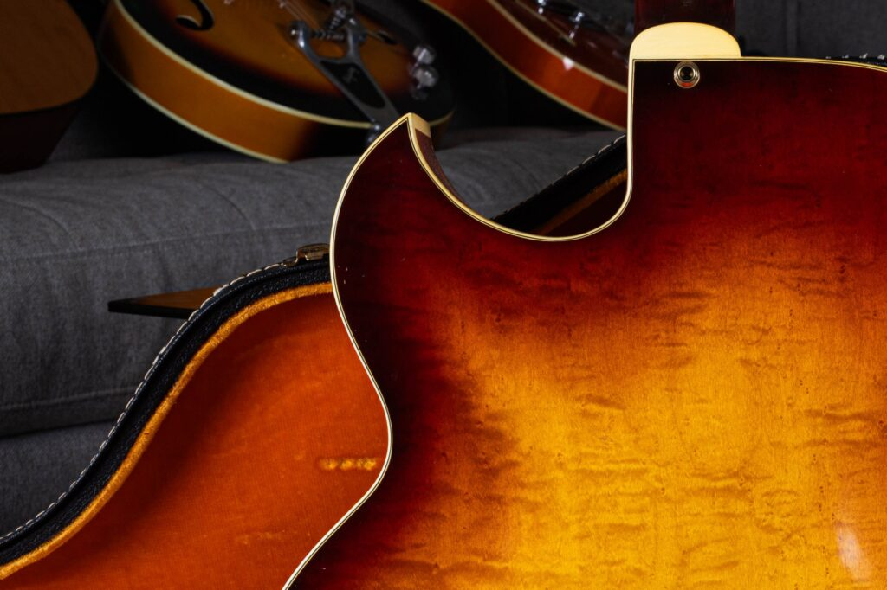
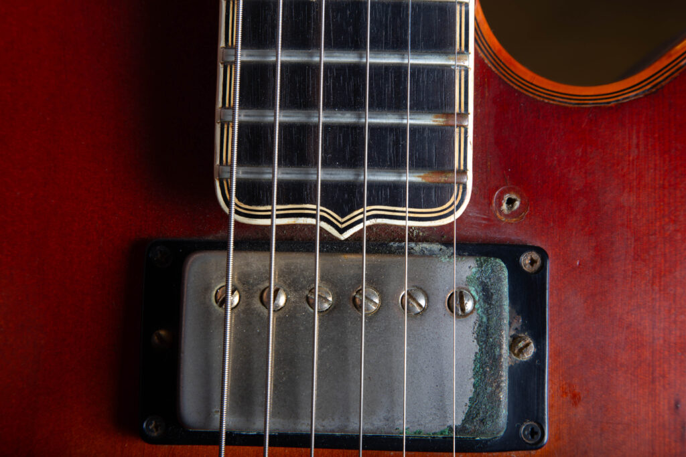
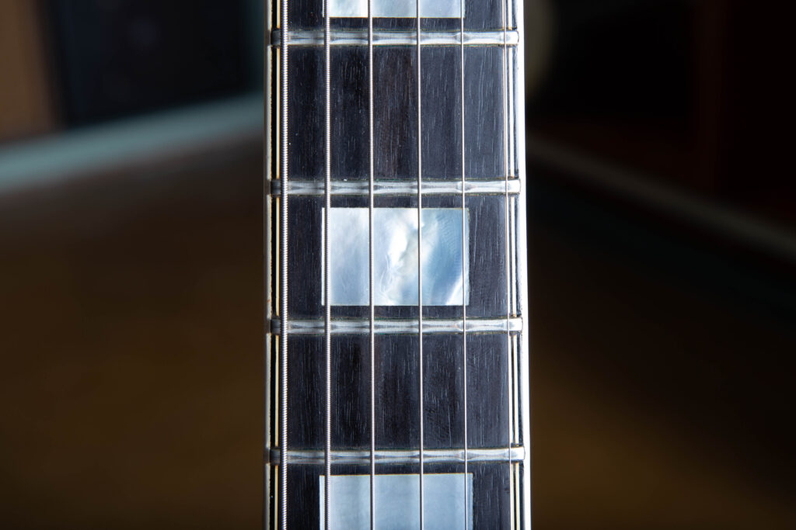
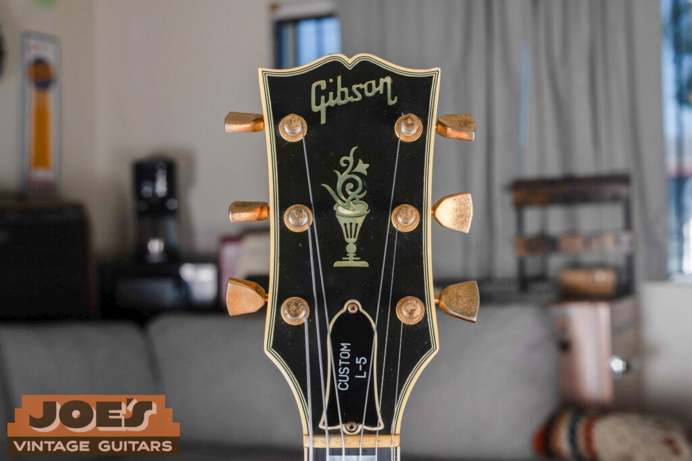

Looking for the value of your Gibson L-5 CES? Need to know its history, features, and how to spot a fake? You’ve come to the right place. Read on for the full story of this instrument, and when you’re ready for a valuation, reach out to us for a [**free appraisal.**](/vintage-guitar-appraisal/)

If the archtop guitar is the top of the guitar world, the Gibson L-5 sits at the head of it. Since its introduction as an acoustic instrument in the 1920s, and its move to the electric L-5 CES in the 1950s, this guitar has been a top choice for jazz, blues, and pop guitarists who want great tone, craftsmanship, and prestige.

In this guide, we will trace the evolution of the L-5 CES, going through everything from its pickups to its changing cutaways, headstock inlays, and finishes. We’ll also cover famous players, how to date and authenticate your L-5, and key factors that influence its value. If you need help dating your Gibson, check out our [**Gibson serial number guide.**](/how-to-read-gibson-serial-numbers/) 

## The Evolution: From L-5 to L-5 CES

To understand the L-5 CES (Cutaway Electric Spanish), we must first look at its predecessor.

### The L-5 (1922-1951): The Acoustic Legend

The L-5 was a big step forward. Introduced in 1922 and credited to Lloyd Loar, it was the first guitar to feature f-holes, a violin-style carved top, and a tap-tuned body. It started out as an acoustic rhythm guitar for big bands, and its tone was hard to beat. Over the decades, it grew in size from a 16-inch body to its classic 17-inch width in 1934. In 1939, the single “Premier” Venetian cutaway was introduced.

While it was primarily an acoustic guitar, many players, including Charlie Christian, added pickups (like the DeArmond “Rhythm Chief”) to amplify their L-5s.

Before the dawn of the “CES” (Electric Spanish) era, the Gibson L-5 reigned supreme as a purely acoustic powerhouse. This L-5C is a good example of the instrument’s original DNA: a master-carved spruce and maple box designed for maximum projection and tonal clarity. Without the added weight of humbuckers or wiring, the top is free to vibrate, offering a glimpse into the acoustic heritage that laid the foundation for the electrified models that would eventually follow in the early 1950s.

### The Birth of the L-5 CES (1951)

The post-war era demanded volume. In 1951, Gibson answered by officially electrifying its premier archtop. The L-5 CES was born. It retained the carved spruce top, maple back and sides, and ornate appointments of the acoustic L-5 but was fitted with two pickups and built-in electronics.

This move made the L-5 CES the top electric archtop, and it has held that spot ever since.

## Key Historical Changes and Specifications

The L-5 CES has seen numerous changes over its long production run. For collectors and players, understanding these variations, especially the pickups and cutaways, is important.

### 1\. The Pickups: The Heart of the L-5 Sound

The pickups define the era of an L-5 CES more than any other feature.

**1951-1953: The P-90 Era** The very first L-5 CES models were equipped with Gibson’s standard single-coil pickup, the P-90. While the P-90 is known today for its raw, gritty blues and rock tone, it provided the rich, warm, and articulate sound required by jazz guitarists of the 1950s.

**1954-1957: The Alnico V “Staple” Pickup** In late 1953/early 1954, Gibson sought to create a premium pickup for its top-tier models (the L-5 CES, the Super 400 CES, and the newly introduced Les Paul Custom). The result was the Alnico V, often called the “Staple” pickup.

A close look at the Alnico V “Staple” pickup on this mid-1950s Gibson L-5 CES. Known for its clear, hi-fi response and individual adjustable pole pieces, this pickup dates to Gibson’s 1950s heyday. It has a punchy, articulate tone that works well with the resonance of a carved spruce top.

This pickup, easily identifiable by its rectangular pole pieces (resembling staples), was brighter, punchier, and had a higher output than the P-90. This combination of a Staple pickup in the neck position and a P-90 in the bridge is iconic for early 1950s Gibson jazz boxes.

**1957-Present: The PAF and the Humbucker Era** The introduction of Seth Lover’s patent-applied-for (PAF) humbucker in 1957 was a seismic shift for Gibson and the L-5 CES. The humbucker, with its rich, creamy tone and inherent noise-canceling properties, became the perfect partner for the L-5, defining the warm, sophisticated sound we now associate with modern jazz guitar.

From 1957 until the late 1960s, these guitars featured PAFs (the holy grail for collectors). After 1961, these are often “Patent Number” humbuckers, which are virtually identical in construction and tone. By the late 1960s, these evolved into the T-Top humbuckers. In the modern era, the L-5 CES uses Gibson’s standard Humbuckers (like the ’57 Classic).

### 2\. The Cutaway: Rounded (Venetian) vs. Sharp (Florentine)

The shape of the cutaway is another key feature that changed over time, affecting both the playability and the vintage value.

-   **Venetian Cutaway (Rounded): 1939-1960 and 1969-Present.** The classic, graceful, rounded cutaway that most people associate with the L-5. It provides easier access to the upper frets.
    
-   **Florentine Cutaway (Sharp): 1960-1969.** In 1960, Gibson switched the L-5 CES (and other archtops like the Super 400 and Byrdland) to a sharp, pointed Florentine cutaway. This was likely an effort to modernize the look.
    

The Florentine cutaway on this 1964 Gibson L-5 is typical of early-60s design, giving it both a sharp look and easier access to the upper frets. Paired with the sunburst finish and multi-ply celluloid binding, it shows the craftsmanship Gibson put into their 17-inch carved-top instruments during this transition period.

> **Rarity Note:** Pre-1960 Venetian L-5s are highly prized. Florentine cutaway models (1960-1969) are rarer in terms of numbers but are sometimes considered less “traditional” by die-hard jazz guitarists.

### 3\. Fretboard, Headstock, and Inlays: The Mark of Premium Craftsmanship

The L-5 has always featured Gibson’s highest level of ornamentation.

-   **Fretboard:** From its inception, the L-5 has featured an ebony fretboard. This premium wood is prized for its smooth feel and contribution to the guitar’s bright, articulate tone. The fretboard comes to an elegant point at the end of the fingerboard extension. 
    

One mark of a high-end Gibson archtop is the pointed fingerboard extension seen here on this 1969 L-5 CES. This detail, paired with the multi-ply binding and dark, high-grade ebony, shows the kind of appointments Gibson saved for its top models. It’s a small touch that sets the L-5 apart from its plainer siblings, and it reflects the hand-work that went into every 17-inch carved-top guitar leaving the Kalamazoo factory in the late 60s.

-   **Fretboard Inlays:** The L-5 is defined by its large, **mother-of-pearl block inlays**. In contrast, the Super 400 used split blocks, and lower-tier models like the ES-175 used split parallelograms.
    

The mother-of-pearl block inlays are a signature of the Gibson L-5 CES and mark it as one of Gibson’s top models. These large markers are set into a dark ebony fingerboard, giving a strong contrast that both helps the player and looks good. Along with the multi-ply neck binding, this is one of the most recognizable features of the L-5.

-   **Headstock:** The L-5 uses a large, “bound” headstock.
    
-   **Headstock Inlay:** This is one of the guitar’s most famous features: the intricate **mother-of-pearl “Flowerpot” (or torch) inlay**. It is a symbol of Gibson’s highest-grade craftsmanship.
    

The “Flower Pot” inlay (often called the torch by collectors) is the centerpiece of the Gibson L-5 CES headstock. This mother-of-pearl design has marked Gibson’s top-grade instruments since the early 20th century. Paired with the multi-bound headstock and gold-plated hardware, it tells you right away that the L-5 is one of Gibson’s top carved-top guitars.

-   **Headstock Logo:**
    
    -   **Block Logo:** “Gibson” block logo (sometimes called the “Gibson Pearl” logo). The style has subtly shifted over decades, but it has remained the standard.
        

### 4\. Finishes: Natural, Sunburst, and Custom Colors

For the first four decades of the L-5 CES, there were really only two options. Custom colors are almost exclusively a feature of the modern era (Gibson Custom Shop).

-   **Sunburst:** The most traditional finish for Gibson archtops, transitioning from a warm amber/yellow in the center to dark brown/black on the edges. **Rarity:** The vast majority of vintage L-5 CES models are Sunburst. It is the most common and “classic” finish.
    
-   **Natural (Blonde):** An option that became very popular in the late 1940s and 1950s. Natural finishes were more difficult to execute, requiring Gibson to use the most flawless pieces of maple and spruce. **Rarity:** While not extremely rare, Natural L-5s are significantly less common than Sunburst and were more expensive new. They generally command a premium in the vintage market.
    
-   **Custom Colors:** Before the 1970s, a custom color on an L-5 was virtually unheard of. Since the 1970s however, Gibson has produced L-5s in high-gloss finishes like:
    
    -   **Black (Ebony)**
        
    -   **White (or Alpine White)**
        
    -   **Wine Red**
        
    -   **Blue (e.g., Trans Blue, Peacock Blue)**
        
-   **Rarity of Custom Colors:** A genuine, factory-original vintage (1950s-1970s) L-5 in a non-standard color would be extremely rare and worth a large premium, but it is very unlikely you will find one. Modern Custom Shop custom color models are rare but available. A **Black (Ebony)** L-5 (like those used by Pat Martino) is one of the more sought-after modern custom colors.
    

### 5\. The Cases: Protecting a Legend

An original vintage L-5 CES *should* come with its original case. These cases are also highly collectible.

-   **1950s (“Brown”):** The most desirable vintage cases are the Lifton “brown” cases with pink or maroon lining. They feature a unique curved handle and are often stamped “Lifton” and “Made in USA.”
    
-   **1960s (“Black”):** Gibson moved to black cases with a bright orange (or gold) plush lining. These cases generally have “GIBSON” embossed on the plastic handle.
    
-   **1970s and 1980s:** Cases were still generally black but sometimes had blue or red lining. They were often less sturdy than the earlier ones.
    
-   **1990s-Present:** The modern Gibson Custom Shop case is typically black (or brown) with a plush interior (often burgundy or purple) and includes a heavy-duty combination lock and the Custom Shop logo.
    

## Famous Users of the Gibson L-5

The roster of L-5 players is a who’s who of music history.

-   **Wes Montgomery:** The L-5 player most people think of first. Wes is closely tied to the L-5, particularly a Florentine cutaway model (which he called his “axe”) with a single pickup installed later in the neck position. His thumb technique and octave playing defined the instrument’s sound for a generation.
    
-   **Pat Martino:** Pat famously used a custom **Ebony (Black)** L-5 CES for many years, creating his signature blazing-fast lines on the dark-looking archtop.
    
-   **George Benson:** Benson used L-5s (along with other Gibson archtops) throughout his jazz-funk career.
    
-   **Herb Ellis:** Ellis was a master of bebop who used his sunburst ES-175 and then a custom L-5 CES throughout his long career.
    
-   **Elvis Presley:** Elvis (or his guitarist Scotty Moore) used several high-end Gibsons, and an L-5 was sometimes pictured with “The King.”
    
-   **Ronnie Wood:** Although known as a Tele and Strat player, the Rolling Stones guitarist has been known to pull out an L-5 for bluesier numbers.
    
-   **Derek Trucks:** Known as a master of slide guitar, primarily using an SG, Trucks is also known to utilize an L-5 CES for its rich, dynamic voice.
    
-   **Bucky Pizzarelli:** Pizzarelli and his son **John Pizzarelli** have both championed the L-5 (though they often play custom versions or Benedict guitars now).
    

## The All-Important Question: Value and Authenticity

You may be reading this because you are wondering, “**What is my vintage Gibson L-5 CES worth?**“

Because a vintage L-5 CES is a high-value item, it is a target for fraud, fakes, and unauthorized modifications. For an instrument of this caliber, providing a dollar figure without seeing it is irresponsible. A price guide cannot capture the nuances that professional collectors demand.

To ensure you get an accurate and legitimate value, you need to know how to identify specific factors.

### 1\. How to Date a Gibson L-5

Dating a Gibson is notoriously difficult because Gibson’s serial number systems have changed several times.

-   **1950s:** The L-5 CES will have an **Orange Label** visible through the f-hole. The serial number on this label should be A-prefixed (e.g., A 12345).
    
-   **1961-1969:** A mixed, inconsistent system. Labels may be orange, and serial numbers are usually 4, 5, or 6 digits. It is common to have serial number duplicates from different years, making features (like the cutaway type) essential for dating.
    
-   **1970-Present:** A slightly more standardized 8-digit system (YYDDDYPPP), where the first two digits signify the year. However, this is still complex and requires confirmation of other specs.
    

The best way to date your L-5 is with our complete guide: [**How to Date a Gibson Guitar**](/how-to-read-gibson-serial-numbers/)

### 2\. How to Spot Fakes and Non-Original Parts

-   **Headstock Flowerpot Inlay:** A common place for fakes to fail. The true Gibson inlay is precise and intricate. Sloppy, misshapen, or overly glossy inlays are a major red flag.
    
-   **Pickups:** The biggest concern. A guitar from 1957-1960 *must* have PAFs. Replacing them with modern humbuckers is a catastrophic hit to the value. A professional must inspect the solder joints and pickup bases.
    
-   **Body Wood:** Real L-5s have a carved spruce top. Cheap fakes use laminated (plywood) tops, which show layers if inspected at the edge of the f-hole.
    
-   **Binding:** Vintage binding will yellow and shrink slightly. If the binding looks too white, too new, or too thick, be wary.
    

## 3\. How to Identify a Refinished L-5

A refinished vintage guitar usually loses 50% or more of its value. For an L-5 CES, this is a difference of thousands of dollars.

-   **Black Light Test:** We use a black light on all vintage instruments. An original lacquer finish will fluoresce with a unique green glow. A non-factory refinish will not (it will look dark or inconsistent).
    
-   **Overspray:** Look for a build-up of lacquer in the crevices (where the neck joins the body, around the binding, inside the f-holes).
    
-   **Color Tone:** An experienced professional can spot a non-factory “incorrect” color (e.g., a Sunburst with too much red or a Natural that is too clear).
    

## 4\. The Gibson L-5 Value and Appraisal

As stated above, we cannot provide an accurate cash value for your guitar in this article. The condition, originality, and specific historical details are everything.

**What We *Can* Do:** Our appraisal service is designed specifically for this scenario. We don’t just give you a number; we provide a certified valuation based on real-time market data, historical significance, and a physical (or digital) inspection of your instrument by a recognized expert.

**The value of an L-5 comes down to its history, its condition, and how original it is.**

## Gibson L5-CES Specifications & Changes Through the Years

on mobile, scroll to see more ----->

| Feature | 1951-1953 (Early P-90) | 1954-1957 (Staple/P-90) | 1957-1960 (PAF Era) | 1960-1969 (Florentine) | 1969-Present (Modern Venetian) |
| --- | --- | --- | --- | --- | --- |
| Model Name | L-5 CES | L-5 CES | L-5 CES | L-5 CES | L-5 CES |
| Body Size | 17" | 17" | 17" | 17" | 17" |
| Cutaway Style | Venetian (Rounded) | Venetian (Rounded) | Venetian (Rounded) | Florentine (Sharp) | Venetian (Rounded) |
| Top Wood | Carved Spruce | Carved Spruce | Carved Spruce | Carved Spruce | Carved Spruce |
| Back/Side Wood | Figured Maple | Figured Maple | Figured Maple | Figured Maple | Figured Maple |
| Neck Pickups | P-90 (Single Coil) | Alnico V (Staple) | Humbucker (PAF) | Humbucker (Pat #/T-Top) | Humbucker ('57 Classic, etc.) |
| Bridge Pickups | P-90 (Single Coil) | P-90 (Single Coil) | Humbucker (PAF) | Humbucker (Pat #/T-Top) | Humbucker ('57 Classic, etc.) |
| Fretboard | Ebony | Ebony | Ebony | Ebony | Ebony |
| Inlays | Block | Block | Block | Block | Block |
| Headstock Inlay | Flowerpot | Flowerpot | Flowerpot | Flowerpot | Flowerpot |
| Finish Options | Natural, Sunburst | Natural, Sunburst | Natural, Sunburst | Natural, Sunburst | Natural, Sunburst, Custom |
| Tuners | Kluson Sealfast (usually) | Kluson Sealfast (usually) | Kluson Sealfast (usually) | Grovers (sometimes) | Gibson branded (often Schaller) |
| Pickguard | Tortoise-bound (usually) | Tortoise-bound | Tortoise-bound | Tortoise-bound | Tortoise-bound |

## A Legacy Worth Preserving

If you are adding a top piece to a collection or trying to find the real market value of a family heirloom, the Gibson L-5 CES is still one of the better guitars to own. A lot of its value comes down to how rare it is, and if you want to dig into the numbers, the [**Gibson shipment totals**](/post/gibson-shipping-totals-1948-1979/) show just how few of certain models actually left the factory. If it is time to part with a high-value archtop, the [**sell my Gibson**](/sell-my-gibson-guitar/) page lays out a direct, expert-led process to help the instrument find its next home. At Joe’s Vintage Guitars, the work is built on decades of experience and a love of preserving musical history. Learn more about our commitment to transparency and honest service on our [**about us**](/about-me/) page.

## Frequently Asked Questions (FAQ)

**Q: Is the L-5 still in production?** A: Yes. The Gibson Custom Shop still makes the L-5 CES (and other L-5 variations, like the non-electric and the L-5 Studio) by special order. It remains one of their highest-end instruments.

**Q: What is the difference between an L-5 and an L-5 CES?** A: The acoustic “L-5” was introduced in 1922 and did not have built-in electronics (though it could have an aftermarket “floating” pickup). The “L-5 CES” was introduced in 1951 as a factory-electric model with pickups mounted directly into the carved top and with a cutaway (though an acoustic L-5C also had a cutaway).

**Q: What is the L-5 Premier?** A: The term “Premier” was Gibson’s original name for an archtop with a cutaway. So, a 1939-1948 “L-5 Premier” (or L-5P) is an acoustic L-5 with a Venetian cutaway. It was renamed the L-5C in 1948.

**Q: Which pickup type is the most desirable?** A: For collectors, an **original 1957-1960 PAF humbucker L-5** is the apex. For many players, the PAF (or Patent Number) humbucker sound is what they think of as the classic L-5 voice. The Alnico V “Staple” pickup model from 1954-1957 also has a huge following, and a Venetian cutaway P-90 model (1951-1953) is extremely rare.

**Q: Are Florentine cutaway L-5s less valuable?** A: Generally, no. While they are sometimes considered non-traditional, their rarity (1960-1969) ensures they have high value. A PAF-equipped Florentine L-5 (1960-1961) is incredibly valuable. However, a traditional player may prefer a Venetian (rounded) cutaway, which can affect market demand.

**Q: How do I know if the finish on my L-5 is original?** A: The absolute best way is to have it professionally examined by someone with a black light and decades of experience. Refinishes destroy the value of vintage archtops. If you are even slightly unsure, get an appraisal before you buy or sell.

**Q: Where can I get an accurate appraisal of my Gibson L-5?** A: Right here. We provide certified, expert appraisals for high-value and vintage guitars.
