1.  [Introduction](#lpj-intro)
2.  [Historical Context](#lpj-context)
3.  [1954: The First Juniors](#lpj-1954)
4.  [1955 to 1956: TV Model & Changes](#lpj-1955-1956)
5.  [1957 to 1958: Final Single-Cutaway](#lpj-1957-1958)
6.  [1958 to 1960: Double-Cutaway](#lpj-1958-1960)
7.  [1961 to 1962: SG Transition](#lpj-1961-1962)
8.  [The P-90 Dog Ear Pickup](#lpj-p90)
9.  [The Wraparound Bridge](#lpj-bridge)
10.  [Finish Analysis](#lpj-finish)
11.  [Authentication Checklists](#lpj-authentication)
12.  [Serial Numbers & Dating](#lpj-serial-numbers)
13.  [Tonal Characteristics](#lpj-tone)
14.  [Rare Variants](#lpj-rare)
15.  [Famous Players](#lpj-players)
16.  [Valuation](#lpj-valuation)
17.  [Modern Reissues](#lpj-reissues)
18.  [Setup & Maintenance](#lpj-setup)
19.  [Buying Guide](#lpj-buying)
20.  [Conclusion](#lpj-conclusion)
21.  [Further Reading](#lpj-resources)
22.  [FAQ](#lpj-faq)

<figure>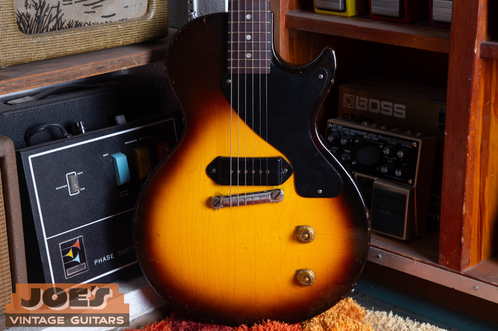</figure>

<h2 id="lpj-intro">Introduction: The Guitar That Outgrew Its Ambitions</h2>

Gibson built the Les Paul Junior in 1954 as a student instrument. The brief was simple: drop the price, drop the appointments, keep the construction honest. No binding, no carved top, no neck pickup. A single P-90 wired to a volume and tone. The list price came in at $99.50 against $225 for the Goldtop, and the entire point was getting a real Gibson solidbody into the hands of beginners who couldn't afford the better instruments.

That was supposed to be the whole story. A starter guitar, played for a year or two and traded in for something better. What actually happened is that working players who could afford anything kept reaching for the Junior, and over the past sixty years the original single-cut and double-cut examples have become some of the most collectible solidbodies Gibson ever made.

Between 1954 and 1962, Gibson rebuilt the Junior twice. The single-cutaway slab ran from mid-1954 through mid-1958. The double-cutaway with the thinner mahogany body took over from late 1958 through 1960. By 1961 the body had morphed again into what we now recognize as the SG shape, though Gibson kept calling it a Les Paul Junior until 1963. Three different guitars share the name, and the differences matter more than most casual buyers realize, both for how they play and for what they're worth.

What follows is a year-by-year walk through the original production run. The focus is on the changes that matter for tone, the changes that matter for value, and the authentication points that catch out buyers who haven't handled enough of these guitars firsthand. If you're trying to date a Junior you already own or evaluate one you're thinking about buying, the spec tables and authentication checklists are written to work as reference rather than read straight through.

<h2 id="lpj-context">Historical Context: Gibson's Market Strategy in the Mid-1950s</h2>

The Junior exists because Gibson had a price problem in 1954. The cheapest solidbody electric in the catalog was the Les Paul Goldtop at $225 list. Federal minimum wage at the time was 75 cents an hour. A teenager working a summer job could expect to save maybe forty or fifty dollars across the whole season, nowhere near enough to walk out of a music store with a Gibson solidbody. The Korean War had ended the year before, the economy was expanding, and electric guitar sales were climbing fast on the back of country radio and the first rumblings of rock and roll. Gibson needed something it could sell to first-time buyers and music school students, and the existing Les Paul lineup was priced out of that market entirely.

Fender was eating Gibson's lunch on the entry-level end. The Telecaster sat at a lower price point and the Stratocaster was about to land. Gibson's answer was the Les Paul Junior, introduced mid-1954 at $99.50 list. Less than half what the Goldtop cost. It used the same body shape as the Goldtop and the same scale length, but stripped of nearly every appointment Gibson normally charged extra for.

The Junior didn't sit alone in the budget lineup for long. By 1955 Gibson had added the Les Paul TV (essentially a Junior in a different finish) and the Les Paul Special (a Junior with two pickups and binding). The result was a tiered budget catalog that gave teachers, school programs, and parents buying first guitars several options at different price points. Every spec on the Junior that's been simplified relative to a Standard or Custom was a cost decision rather than a tonal one, which is worth keeping in mind when somebody tries to sell you on the idea that Gibson set out to build a "pure" instrument. They set out to build a cheap one. The fact that the result has held up for seventy years is partly luck and partly the construction methods Gibson used on everything they made at the time.

## The First Les Paul Juniors

The earliest 1954 Juniors are messier than most reference books admit. Production records from the first half of the year are patchy. The guitars themselves vary in ways that strongly suggest Gibson was still working out which specs would stick. If you handle enough of them you start to see the variation. Body wood that shouldn't be there. Pickup positions that drift by a couple of millimeters. None of this is documented in the original catalogs because most of these changes happened on the factory floor between print cycles.

### Body Construction and Wood

The body material on early 1954 Juniors is the one spec that still causes arguments. Conventional wisdom says mahogany, and conventional wisdom is mostly right. But a small number of instruments from the first months of 1954 appear to have been built with two-piece maple bodies, possibly because mahogany supplies got tight or possibly because some early prototype bodies got mixed into production. The two woods can look very similar under old opaque finishes that have darkened with age, so you can't tell from a quick once-over. You have to pull the pickguard and look at the raw wood inside the control cavity. Maple Juniors play and sound noticeably brighter than mahogany ones, with a harder leading edge to the attack. Maybe two dozen of these have been confirmed in the wild and they trade at a meaningful premium when they surface.

From mid-1954 on, every Junior body is solid mahogany. Most are two pieces joined at the centerline, with the occasional one-piece example turning up. The body itself is a slab. Flat on top, flat on the back, no carved maple cap, no binding around the edge. The mahogany Gibson was using in 1954 was generally Honduras mahogany (*Swietenia macrophylla*), denser and tighter-grained than the African mahogany species that took over decades later. That wood is most of why these guitars sound the way they do.

Body thickness is roughly 1¾ inches and stays consistent across the whole single-cutaway run. The single cutaway on the treble side gets you cleanly to the 14th fret. Past the 16th the neck heel is in the way and most players give up. If you need easy upper-fret access, the double-cut from late 1958 onward solves this problem.

### Neck and Fingerboard

The neck is one-piece mahogany, set into the body with a long glued tenon. That's Gibson's standard set-neck construction and a big part of why every Les Paul sustains the way it does. Scale length is listed as 24¾ inches. If you actually measure the playable string from nut to bridge saddle you usually get something closer to 24-9/16, because the wraparound bridge sits in a compromise position that balances open-string tuning against playable intonation across the fretboard.

The neck profile on a 1954 Junior is what dealers politely call a "full C." Less polite descriptions involve baseball bats and 2x4s. Depth at the first fret typically measures around .92 inches and grows from there. If you've never played pre-1960 Gibsons before, this neck will feel enormous for the first few minutes. Most players who stick with it for a session or two end up preferring the feel. The mass actually reduces hand fatigue on long sessions because your fingers aren't doing micro-corrections to stay on the strings. It's also part of why these necks resist warping seventy years on.

The fingerboard inlays are plain dots, and on a student-grade Junior they are cream-colored celluloid across the entire production run. This is worth stressing because it runs the opposite way from what some sellers will tell you: the Junior and the TV never left Kalamazoo with mother-of-pearl or pearloid dots. Those appointments belonged to the pricier Standard and Custom. If a Junior turns up with iridescent shell inlays that shift color under angled light, the dots have been replaced, or the guitar has been misidentified. Do not let anyone use dot material as a first-year dating tell on these models, because it is not one.

### Headstock and Tuners

Headstock is standard Gibson 3+3 with no binding and a black-painted face. The "Gibson" script and "Les Paul Junior" designation are silk-screened in gold ink rather than inlaid in pearl. Pearl logos were one of the things Gibson stripped to hit the $99.50 price point. Tuners are Kluson strip tuners with three machines on a single mounting strip per side, stamped housings, oval plastic buttons. Original Klusons from this era have brass shafts. Reproductions and later replacements often use pot metal that looks visually identical until you turn the tuner under hand and feel the difference. There's also a fast field check: brass is non-magnetic. If a small magnet picks up on the shafts of "original" tuners, they aren't original.

### Pickup: The P-90 "Dog Ear"

The single pickup is a P-90 in the "dog ear" mounting configuration, named for the two flat tabs that extend out from the sides of the pickup cover. Those tabs screw directly into the body. That meant Gibson didn't have to rout a separate mounting ring cavity, which saved production time. The dog ear cover is also a bit larger than the soapbar P-90 used on Specials and Goldtops, so the two are not interchangeable without modification.

Pickup position on 1954 Juniors sits closer to the bridge than on any later year. It's a small difference, maybe a few millimeters compared to 1956-onward placement, but the tonal effect is real. Closer to the bridge means more upper harmonic content and a sharper leading edge to the note. Gibson was almost certainly trying to add some cut to the otherwise dark mahogany body. Magnets in the earliest examples are typically Alnico 3, which has lower field strength than Alnico 5 and produces a softer, warmer attack with slightly less output. DC resistance on an original 1954 P-90 usually reads between 7.5K and 8.5K ohms. If you're getting 9K+ readings, the pickup has been rewound or replaced.

### Electronics and Hardware

Controls are about as minimal as electric guitar wiring gets: one master volume, one master tone, both running 500K audio-taper potentiometers with "speed" or "hatbox" style knobs. The tone cap is a "Grey Tiger" waxed-paper capacitor. Pull the control cavity cover on a 1954 Junior and you should see one of these. They look like small striped cylinders. If you see anything else, especially a yellow-and-black banded Bumblebee or a modern orange-drop, the electronics have been worked on. The bridge and tailpiece are a single nickel-plated pot-metal wraparound. Strings load through the back of the bar, wrap up and over the saddle ridge, then run to the tuners. That direct coupling between strings and body is where a big part of the sustain comes from.

<figure>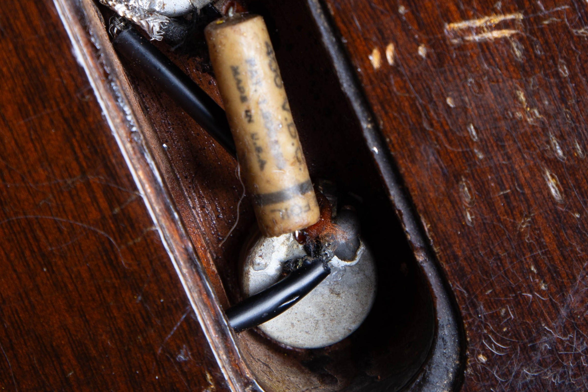</figure>

Bonnet-style knobs (taller, barrel-shaped) on a guitar being sold as a 1954 or early-1955 Junior is a problem. Speed and hatbox knobs are correct for all of 1954 and most of 1955. The switch to bonnet knobs happened in 1956. If the knobs are bonnet style on a guitar being represented as earlier, either the knobs have been swapped or the instrument is being misdated.

### Finish

Standard 1954 finish is a two-tone sunburst in nitrocellulose lacquer. Amber-yellow center fading out to dark brown or near-black at the edges. The very earliest examples sometimes show a deeper, redder burst that's closer to Gibson's acoustic-guitar "Cremona" finish, which suggests the early Juniors were getting sprayed in the same booth as the archtops. By mid-1954 the burst had settled into what most collectors think of as the Junior sunburst: bright yellow center, translucent edges that let the mahogany grain show through clearly. The lacquer ages by checking (those fine spider-web cracks you see on old finishes) and by yellowing as the lacquer oxidizes. Both are normal and expected on an honest 70-year-old guitar.

## Consolidation and the TV Model

### Introduction of the TV Model

1955 also brought the Les Paul TV. Mechanically, a TV is a Junior. Same body, same neck, same pickup, same electronics. The only difference is the finish. Gibson called it "limed mahogany" in the catalog. Everyone else calls it TV Yellow. It's a pale, slightly greenish off-white with warmth underneath. The persistent story is that Gibson developed the finish so it would read as clean neutral white on black-and-white television broadcasts of the era. Whether that's actually true or just good post-hoc marketing is impossible to verify, but the name stuck and the color became iconic.

Gibson built TV Yellow Juniors in much smaller numbers than sunbursts across the entire production run, which makes them more collectible at every era. The finish ages unpredictably depending on how the instrument was stored. Examples kept in cases out of light have deepened to a rich amber. Examples that lived on stands near windows have faded toward near-white. Refinishes are very common on TV models because the original finish is tricky to match. Before paying TV money, get under the pickguard with a UV light and look for overspray creeping into edges that would have been masked at the factory.

### 1956: Pickup Repositioning and Knob Change

1956 brought two changes worth knowing about. First, Gibson repositioned the P-90 slightly farther from the bridge. The shift is small, maybe three or four millimeters, but it's enough to hear. Moving the pickup away from the bridge drops some of the upper harmonic content and lets more of the fundamental through. The result is that 1956-and-later Juniors sound a touch warmer and less metallic than the 1954 examples with the pickup pushed all the way back.

Second, the knobs changed shape. Out went the low, flat "speed" knobs. In came the taller, barrel-shaped "bonnet" knobs with a wider grip area on top. Bonnet knobs stayed on the Junior from 1956 through the end of original production and on into the SG era.

<figure>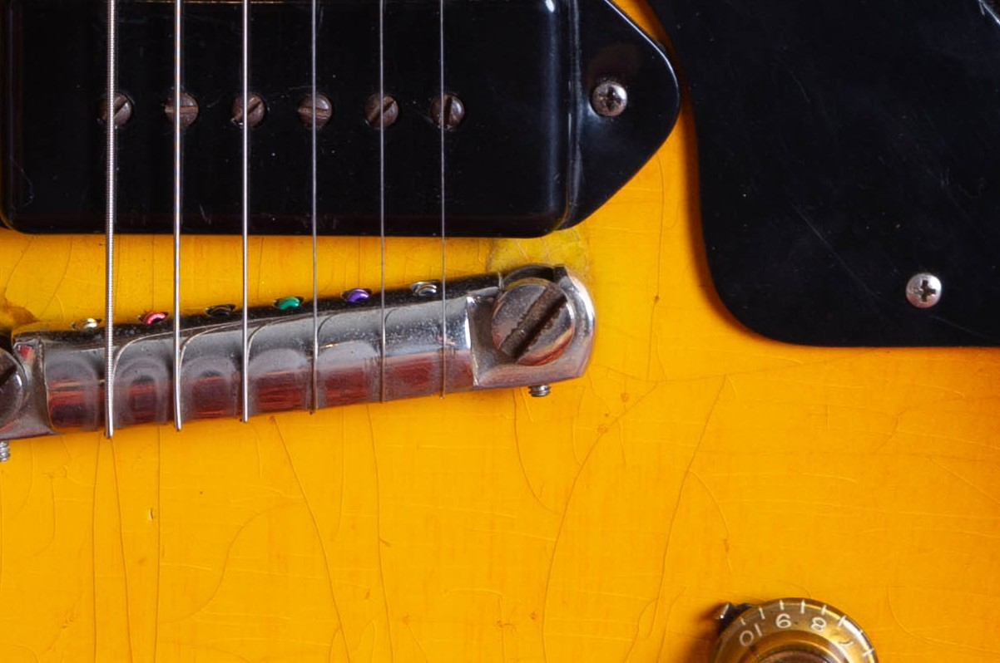</figure>

### The Bumblebee Capacitor

1956 also saw the tone capacitor change from the Grey Tiger waxed-paper unit to the "Bumblebee," named for its yellow-and-black banded body. Original Bumblebees are valuable to collectors for two separate reasons. The obvious one is authentication. The less obvious one is that a meaningful number of players prefer how a Bumblebee responds across the tone control's sweep compared to modern replacement caps. Whether that preference is measurable or psychological is debated, but the demand is real and the parts trade for significant money on their own.

<figure>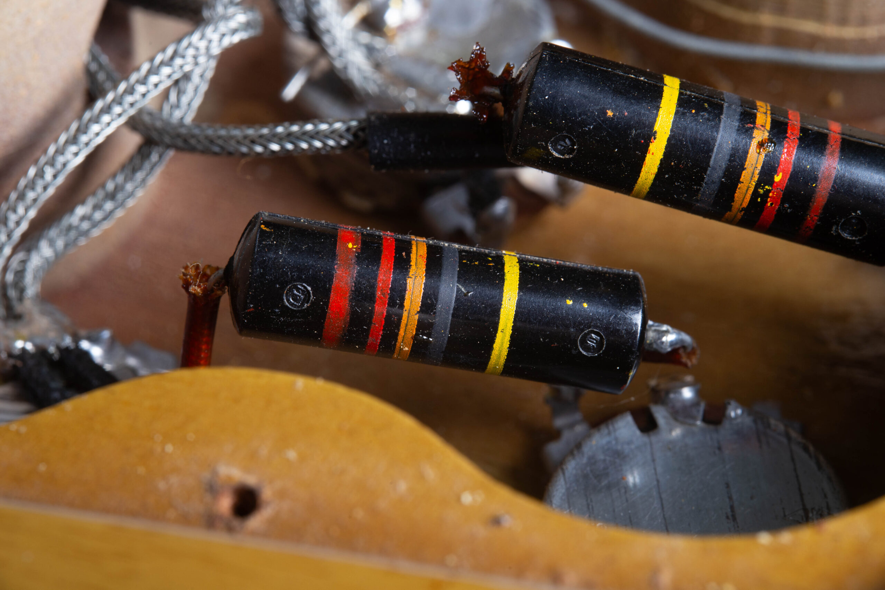</figure>

### Magnet Transition: Alnico 3 to Alnico 5

Across 1956 and 1957, Gibson moved most P-90 production to Alnico 5 magnets, leaving the Alnico 3 magnets of the earliest run behind. Alnico 5 has a stronger field, which increases output and adds some edge to the attack. Gibson wasn't consistent about magnet sourcing during this period and pickups with either magnet type can show up legitimately in a 1956 or 1957 Junior, so finding one or the other isn't on its own diagnostic. That said, an Alnico 3 magnet in a late-1956 or 1957 instrument is unusual enough to warrant a careful look at the rest of the components before signing the check.

## Final Years of the Single-Cutaway

By 1957 the Junior had settled. Three years of production at Kalamazoo had refined the build process, and instruments from this period vary less from one to the next than the early-1954 batch. If you're looking for a single-cutaway with the fewest authentication question marks, late 1957 through early 1958 is where to start.

### Neck Profile Evolution

The neck profile had thinned out slightly from the baseball-bat 1954 dimensions, but it still measures substantial by any modern standard. Players who couldn't get comfortable on a 1954 neck often handle a 1957 or 1958 Junior with no complaints. The full mahogany feel is still there, just a touch less aggressive in the hand.

### Sunburst Evolution

The sunburst itself shifted across the same window. Less of the intense yellow center that defines the 1954 burst, more of an amber-to-brown progression across the body. Some collectors hunt late-period single-cutaway sunbursts specifically for this finish character. It reads as more sophisticated to a lot of eyes, though "better" is in the beholder.

### Price Increase

The list price moved up in 1957 from $99.50 to $120. Material costs were climbing and Gibson had started to figure out that working players, not just students, were buying Juniors. The simplicity the catalog framed as a limitation was being treated as a feature by the people actually using these guitars on stage.

## The Double-Cutaway Redesign

The 1958 double-cutaway redesign is the single biggest change in the Junior's history. The single-cutaway slab had a real limitation that nobody at Gibson seemed willing to admit until 1958: you couldn't actually reach the top frets. The double-cut fixed that without sacrificing anything else worth keeping.

### The Design Change

Body construction stays the same. Slab mahogany. Same overall dimensions. The change is that Gibson cut a second symmetrical cutaway into the bass side of the body and moved the neck joint from roughly the 16th fret position to the 22nd. Suddenly the guitar has clean access to all 22 frets. That sounds incremental written out. Pick up a single-cutaway and then immediately a double-cutaway and the difference is enormous for any lead player.

The body weighs slightly less than the single-cutaway because the second cutaway removes a meaningful chunk of mahogany from the upper bass bout. Double-cut Juniors tend to have slightly less low-mid density and a bit more midrange definition than equivalent single-cut examples. Neither is objectively better. They suit different jobs.

### Color Options

-   **Vintage Sunburst**, a continuation of the single-cutaway burst, warm amber to brown with pronounced edges. Most common finish across the period.
-   **Cherry Red**, new to the double-cutaway. Translucent red over the mahogany grain. The exact shade varied in original production and has continued to drift over decades of UV exposure. Some examples are still a bright fire-engine red. Others have deepened to a rich burgundy. Cherry got steadily more popular through 1959 and 1960.
-   **TV Yellow**, continued from the single-cutaway TV model. Rarer than either cherry or sunburst, and the finish collectors chase hardest among standard production examples of the era.

### The Black Models

A small number of double-cutaway Juniors, maybe a few dozen confirmed in the wild, surface with an opaque black finish. Most documented black-finish examples carry a tortoiseshell pickguard, and the tortoiseshell-on-black pairing is what you should expect when one of these turns up. Whether they were special orders, dealer requests, or some other production category isn't definitively documented. Every example warrants extra authentication scrutiny because nothing about a rare finish on a desirable model encourages honest disclosure from sellers.

One additional pickguard detail worth knowing: black pickguards aren't exclusive to black-finish Juniors. A small number of cherry-finish double-cutaway Juniors, primarily from 1959, are known to have left the factory with original black pickguards rather than the standard configuration. Rare but documented. If you encounter one, authenticate the pickguard against the rest of the instrument rather than rejecting it on sight. The same checks apply: UV response on both finish and pickguard, examination of finish edges under the pickguard for overspray or ghost lines, hardware patina consistent across the whole guitar.

<figure>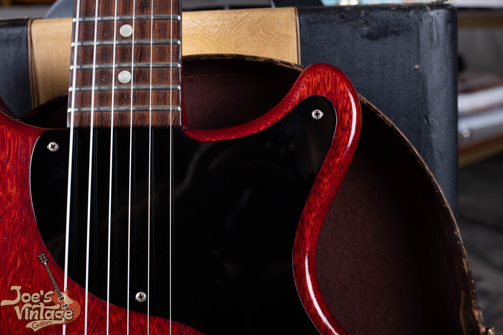</figure>

Most collectors and players land on the 1958 to 1960 double-cutaway as the sweet spot of the Junior's evolution. You get the slab mahogany body and everything that delivers tonally, plus the upper-fret access the single-cutaway lacked. TV Yellow double-cutaways command the highest prices of any standard-production Junior in most market conditions.

## The SG Transition Era

In 1961 Gibson redesigned its entire solidbody line. The new shape, what we now call the SG, was thinner, lighter, and more aggressively contoured than any earlier Gibson solidbody. The double cutaway got sharper, with the pointed horns that became the SG signature. Overall body thickness dropped from roughly 1¾ inches to about 1⅜.

### Tonal Consequences

That body change shifts the Junior's character noticeably. A lighter, thinner mahogany body produces a brighter, more aggressive tone with faster attack and less of the midrange warmth and bass weight you get from the earlier slab. The neck joint moved even further into the body, opening up unrestricted upper-fret access. Lead players generally took to the new design quickly. Players who'd been buying Juniors specifically for the thick, warm slab tone were more divided about the trade.

<figure>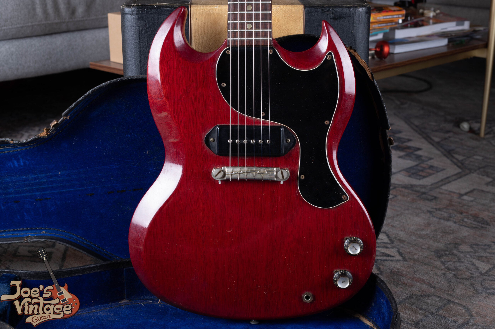</figure>

### Neck Profile Changes

The necks on 1961 to 1962 SG-style Juniors are noticeably slimmer front-to-back than either of the earlier generations. Gibson was responding to the market. Fender's slimmer profiles were selling, and Gibson moved in the same direction. The result is a neck that plays fast and feels easy in modern hands but that some vintage players feel contributes less to the resonance of the instrument than the heavier earlier profiles.

The SG body design has one well-known weakness. The thinner neck heel and the deep cutaways leave the neck joint exposed. A drop, sometimes just a hard knock against a mic stand, can fracture the neck at or near the joint. Repaired neck breaks on 1961 to 1962 Juniors are extremely common. Treat any example as suspect until you've inspected the joint area carefully: look for visible glue lines under the finish, slightly uneven finish texture around the heel, or color mismatch under UV light. A clean repair doesn't disqualify the guitar, but it absolutely changes the price.

### Branding: Still a Les Paul Junior

All through 1961 and 1962, these guitars still wore "Les Paul Junior" on the headstock silk screen. Gibson's relationship with Les Paul had been deteriorating across the late 1950s and early 1960s over financial and contractual disputes, and in 1963 Gibson dropped the Les Paul name from the SG line entirely. That gives the 1961 and 1962 instruments a peculiar status. They have the SG body and the Les Paul branding, and the collector market treats them as Juniors for valuation purposes.

## The P-90 "Dog Ear" Pickup: Technical Analysis

The P-90 is the entire sonic identity of the Les Paul Junior. Every P-90 shares the same basic architecture. A flat coil wound around a bobbin. Six adjustable polepieces (steel screws) running through the coil. Two bar magnets underneath, oriented with opposite poles facing each other. The coil is wound with 42-gauge plain enamel wire, usually 9,500 to 10,500 turns. DC resistance on a vintage example reads in the 7.5K to 9.5K ohm range.

### Era-by-Era Pickup Analysis

#### 1954 to 1955: Extreme Bridge Position, Alnico 3

Pickup position on a 1954 Junior, jammed right up against the bridge saddle, is the defining sonic feature of the earliest examples. At that position the pickup captures more of the string's upper harmonic content and less of its fundamental, which produces a tone that's bright, cutting, and aggressive even into a clean amp. The Alnico 3 magnets in these early pickups exert a weaker pull on the strings than the later Alnico 5 versions, so the strings vibrate more freely and the harmonic content gets richer. Vintage pickup builders pay close attention to this.

#### 1956 to 1957: Repositioned, Alnico 5 Transition

Moving the pickup a few millimeters off the bridge in 1956 shifted the tonal balance away from extreme upper harmonics and toward midrange. Small distance changes at that end of the string produce disproportionately large tonal shifts because the relationship between pickup position and harmonic emphasis isn't linear. The 1956 result is a guitar with a more vocal, less metallic character at the bridge position. Around the same time the magnet move to Alnico 5 added output and sharpened the attack, which partly offset the warmer tone you'd otherwise expect from repositioning the pickup.

#### 1958 to 1960: Consistent Specs, Body-Driven Changes

P-90 specs stayed largely consistent through the double-cutaway era, but the same pickup in a different body sounds different. The reduced body mass of the double-cut shifts emphasis toward the midrange and away from the low-frequency warmth that defines the best single-cutaway examples. Whether that's an improvement depends entirely on what you're playing.

#### 1961 to 1962: New Context, Brighter Results

The P-90 itself didn't change much going into the SG body, but the body change was substantial enough that these guitars sound distinctly different from any earlier Junior. The overall character is brighter and more aggressive, with faster transient response and less of the warm sustained quality that defines the best slab-body examples.

### Pickup Height Recommendations

Measurements given as distance from the bottom of the string (fretted at the highest fret) to the top of the polepiece:

Individual polepiece height is the setup detail most players ignore and most need to address. Wound strings (low E, A, D) vibrate at higher amplitude than the plain strings (G, B, high E), and they generally want lower polepieces. Adjust a quarter-turn at a time. Plug into a clean amp between adjustments. That's the only way to dial in real string-to-string balance on a specific instrument.

## The Wraparound Bridge: Design, Evolution, and Authentication

The wraparound combines bridge and tailpiece functions in a single piece that loops back over a metal anchor bar attached to the body. It's one of the things people argue about. The argument has merit. Direct coupling of strings to body produces the kind of sustain that more elaborate bridge systems can't quite match, and a lot of builders and players prefer the result.

<figure>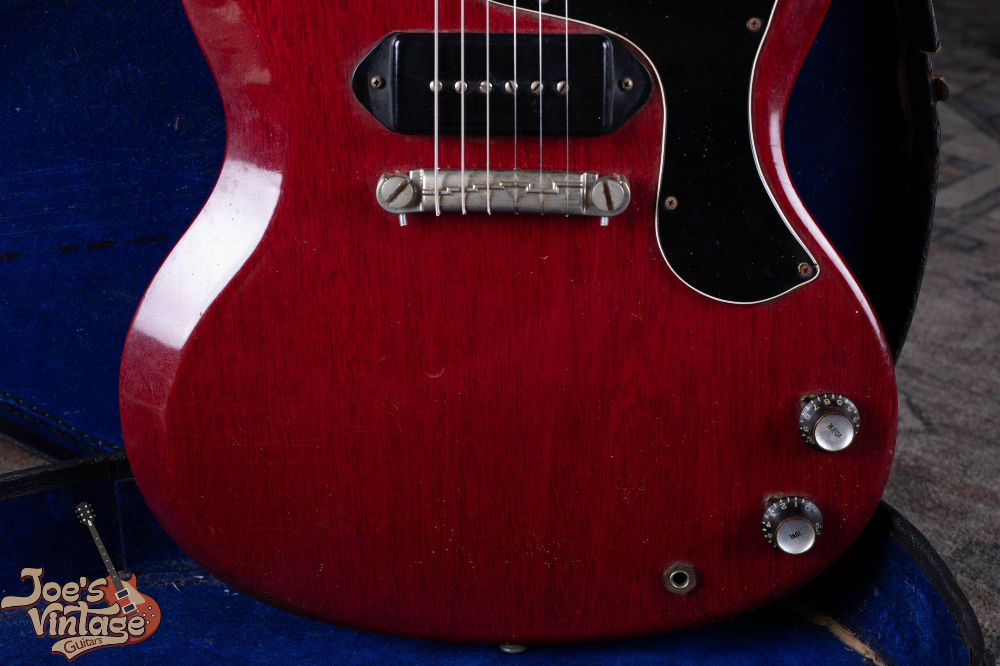</figure>

### Intonation Limitations and Reality

The saddle on an original one-piece wraparound is a single curved bar. There are no individually adjustable saddles, so intonation gets set as a six-string compromise rather than dialed in per string. A Junior with the stock original bridge will never intonate as precisely up and down the neck as a guitar with individual saddle adjustment. For most players, it's close enough. The trade is direct coupling of string to bridge to body, which delivers the percussive attack and sustain that make Juniors sound like Juniors. Most owners decide the trade is worth it.

### Material and Authentication

Original 1954 to 1958 wraparounds are nickel-plated pot metal (zinc alloy). They age in a recognizable way. The nickel plate wears off in spots, and the underlying zinc takes on a grayish, slightly matte surface. Original pot-metal bridges are lighter than the aluminum and brass aftermarket replacements popular with players who want more sustain or different harmonic emphasis. The replacements also resonate differently. Identifying a period-correct original versus a replacement comes down to careful comparison against documented examples from the same production window.

### Compensated Saddle Variants

A small number of Juniors left the factory with compensated saddles. These have a stepped or angled saddle bar that approximates per-string intonation correction without going to fully individual saddles. You'll find them mostly on later single-cutaway and early double-cutaway examples. Their presence isn't a red flag. They're period-correct components. Their absence isn't either.

## Finish Analysis: Reading the Lacquer for Dating and Authentication

The lacquer on a vintage Junior is one of your best authentication and dating tools. Gibson's nitrocellulose ages in predictable ways but never perfectly uniformly. The specific pattern on any given guitar tells you a lot about its history if you know what you're looking at.

### How Nitrocellulose Ages

Nitrocellulose is a thermoplastic. It keeps off-gassing solvents and shrinking very slowly across decades. That shrinkage, combined with the wood expanding and contracting underneath it as humidity moves, eventually develops checking. Those are the fine cracks you see running across the surface of any well-preserved 60-year-old finish. Vintage-correct checking on a 70-year-old Junior is a complex network of fine lines that's tough to fake convincingly. Skilled refinishers can simulate it, so it isn't proof on its own, but the absence of any checking on a guitar that should have plenty of it is a problem.

Under a 365nm UV lamp, original nitrocellulose lacquer fluoresces differently than modern polyester, polyurethane, or water-based finishes. A UV lamp is one of the few authentication tools you genuinely cannot work around. Areas of refinish, overspray, or touch-up fluoresce at a different intensity or color than the surrounding original finish, and those differences are usually invisible under normal room light.

### Cherry Red: The Fading Problem

Cherry Red on double-cutaway and SG-style Juniors is famous for fading, sometimes dramatically. The specific red dyes Gibson used in this period don't tolerate UV well. A Junior that sat in a sunlit display case or near a window for thirty years can fade from cherry to a deep brown or walnut color. Areas protected by the pickguard, control covers, and the player's body during normal use retain more of the original red, which produces a ghost image of brighter red surrounded by faded sections. That patterning is itself authentication evidence. It tells you the guitar got played and saw real light over decades. A cherry Junior in bright, completely uniform cherry condition should be examined carefully under UV before you assume the finish is original.

<figure>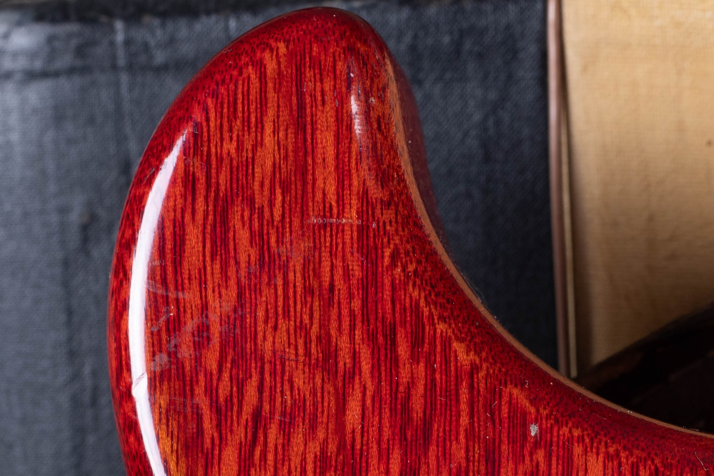</figure>

<figure>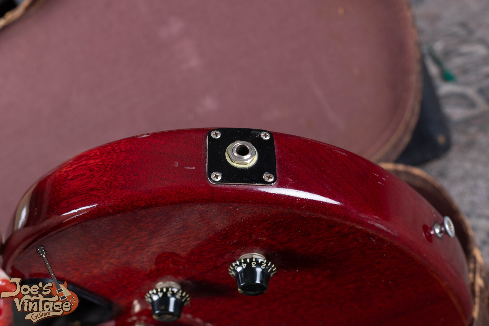</figure>

### Identifying Refinished Guitars

-   **Overspray in cavities**: Pull the pickguard and examine the area underneath. Original finishes show clean, sharp edges where finish meets bare wood. Refinished guitars often show new finish creeping into the cavity, or unnaturally bare wood where the refinisher masked aggressively.
-   **Hardware ghost images**: Under the bridge, pickguard, and control plate, an original finish shows the outline of the hardware in the original color. A noticeably different shade under hardware than on the rest of the guitar usually means refinish.
-   **UV fluorescence mismatch**: Any patch that fluoresces noticeably differently than its surroundings is a different finish material, which almost always means repair or refinish.
-   **Absence of period-correct checking**: A 60-year-old nitro finish kept in reasonable conditions should show some checking. A guitar with perfectly intact, uncracked finish across its entire surface warrants scrutiny.
-   **Finish thickness**: Refinished guitars often have noticeably thicker lacquer, especially around the body contours and edges. Running a fingertip along these areas can sometimes reveal subtle bulging consistent with a new coat sprayed over the original.

## Authentication: Era-by-Era Checklists

No single feature on its own proves or disproves authenticity. Authentication is an accumulation of evidence. Serial number, pot date codes, component styles, finish characteristics, construction details. Each of these in isolation can mislead. Taken together they either support or undermine the instrument's claimed identity. Always cross-reference.

### 1954 Authentication Checklist

-   Serial number headstock stamp font consistent with known 1954 examples
-   Cream-colored celluloid dot inlays (a student-model spec, never mother-of-pearl or pearloid)
-   "Speed" or "hatbox" style knobs, not the later bonnet style
-   Grey Tiger waxed-paper capacitor on tone control
-   Pickup positioned extremely close to bridge, closer than any post-1955 model
-   Dog ear P-90 cover dimensions consistent with early production (fractionally larger)
-   Kluson strip tuners with brass shafts and oval plastic buttons
-   Pot date codes on volume and tone controls consistent with 1954 manufacture
-   Single-ply black pickguard with correct shape for the period
-   If maple body is claimed: verify by inspecting bare wood in the control cavity. Maple is lighter in color with different grain than mahogany.

### 1955 to 1958 Single-Cutaway Checklist

-   Cream-colored celluloid dot inlays, unchanged from the earlier examples
-   Bonnet-style knobs from 1956 onward (earlier 1955 may still have speed knobs)
-   Bumblebee capacitors from 1956 onward
-   P-90 positioned slightly further from bridge than 1954 examples
-   Consistent mahogany body construction, no maple
-   Kluson strip tuners throughout this period
-   Pot date codes and FON consistent with claimed year
-   Sunburst finish showing appropriate aging: warmer, more amber-toned than earliest examples

### 1958 to 1960 Double-Cutaway Checklist

-   Double-cutaway body with correct proportions: rounded horns, not the angular SG horns of 1961+
-   Neck joint at the 22nd fret (not the 16th as on single-cutaway)
-   Correct finish for the period with appropriate aging characteristics
-   If black finish: tortoiseshell pickguard is the most common pairing, but not universal. Evaluate pickguard originality through UV inspection and finish ghost lines rather than color alone.
-   A small number of cherry-finish examples (primarily 1959) are known to have original black pickguards rather than the standard configuration. Rare but documented. Authenticate the pickguard rather than reject it outright.
-   Pot date codes consistent with claimed year
-   Hardware patina consistent with roughly 65 years of aging
-   UV inspection of finish for evidence of refinishing
-   Neck heel profile matches the double-cutaway design, different from single-cutaway heel

### 1961 to 1962 SG-Body Checklist

-   Thin, angular SG-style body. Body thickness approximately 1⅜ inches
-   Pointed horn profile, distinct from the rounded horns of 1958 to 1960 double-cutaway
-   Still labeled "Les Paul Junior" on headstock. "SG Junior" branding came in 1963.
-   Slimmer neck profile than earlier Juniors
-   Neck joint area inspected carefully for evidence of repaired breaks. Extremely common on this design.
-   Cherry Red finish with proper UV response and period-correct fading pattern
-   Pot date codes consistent with claimed year

### Pot Date Codes Explained

Pots from this period came primarily from CTS (manufacturer code 137) and Centralab (code 134). The standard stamp reads: **manufacturer code, two-digit year, two-digit week**. A pot stamped "137 5634" is a CTS pot built in the 34th week of 1956. Important caveat: pots were manufactured and then warehoused before going into a guitar, so pot codes establish the *earliest possible* date of manufacture, not the exact build year. Codes from a year or two before the claimed production date are normal and expected. Codes from several years earlier are a flag worth following up on.

## Serial Numbers, FONs, and Dating Your Junior

Gibson's serial number system and Factory Order Numbers apply across the whole Junior production run, 1954 through 1962. Knowing how to read them and how to cross-reference one against the other is one of the most useful dating tools you have.

### Serial Numbers and Dating

Gibson used an ink-stamped serial number system on the back of the headstock during this period. Numbers were applied sequentially but not always in strict chronological order, because batches of instruments were sometimes assembled from components built at different times. The Factory Order Number, stamped inside the control cavity or visible at the neck joint, gives you a second dating reference. Cross-referencing the two against published Gibson serial number databases can narrow production dates considerably.

<figure>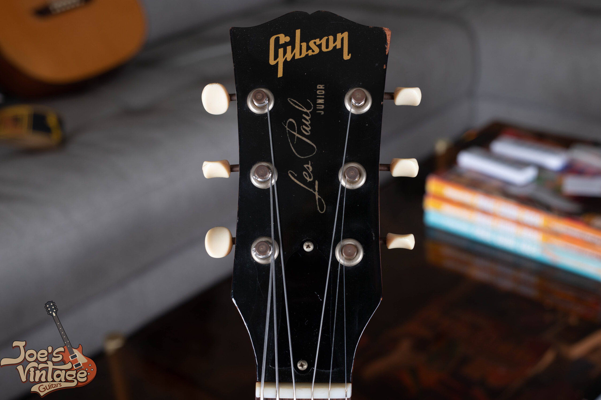</figure>

<figure>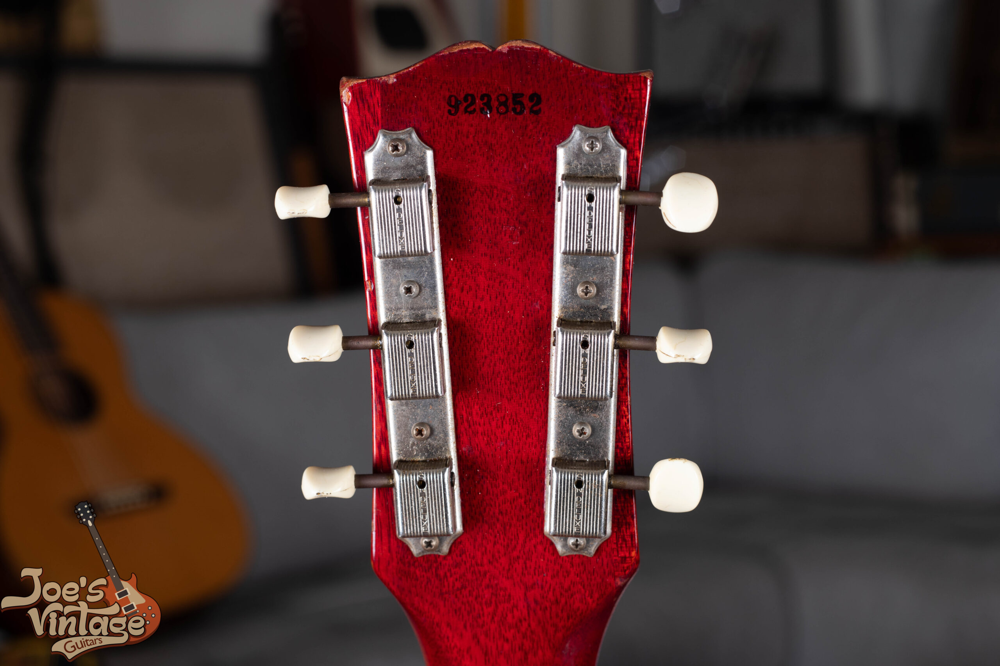</figure>

The principle behind all of this: always cross-reference the headstock serial number with the FON from the control cavity or neck joint. If the two codes suggest inconsistent production dates, that's not necessarily a deal-breaker, but it warrants investigation of components and construction details before you draw any conclusions about the instrument's authenticity.

## Tonal Characteristics: Era-by-Era Comparison

| Era | Bass | Midrange | Treble | Sustain | Overall Character |
| --- | --- | --- | --- | --- | --- |
| 1954 to 1955 Single-Cut | Rich, substantial | Strong upper-mid bark | Bright, cutting | Excellent, complex decay | Warm yet aggressive; thick fundamental with real edge |
| 1956 to 1958 Single-Cut | Full | Vocal, balanced | Present but less metallic | Excellent | More musical; slightly warmer than '54 placement |
| 1958 to 1960 Double-Cut | Slightly reduced | Focused, defined | More articulate | Very good, faster decay | Most versatile era; balanced, punchy, lead-friendly |
| 1961 to 1962 SG-Body | Reduced | Forward, aggressive | Pronounced bite | Shorter, very fast attack | Brightest and most cutting; raw, aggressive presence |

### vs. Les Paul Special

The Special carries the same slab mahogany body but adds a second soapbar P-90 at the neck and a three-way selector. Substantially more tonal flexibility. Players who need range tend to prefer the Special. Players who want a single uncompromised voice that shapes itself entirely through technique and amp settings often prefer the Junior's radical simplicity.

### vs. Les Paul Goldtop

The Goldtop is a fundamentally different instrument. The carved maple top adds clarity, compression, and sustain that the mahogany slab doesn't quite produce. Goldtops are warmer in the low end and have more harmonic complexity through sustained notes. Juniors are more immediate, more aggressive on attack. The Goldtop is the more refined instrument. The Junior is the more elemental one. Neither is a criticism of the other.

### vs. Melody Maker

Gibson introduced the Melody Maker in 1959 as an even cheaper alternative. Thinner body, shorter scale length, a smaller single-coil pickup rather than a P-90. The result is a softer, thinner tone with very little of the aggressive midrange that defines the Junior. Melody Makers have their own following, especially among players who want a light, snappy guitar for specific applications, but as a player's instrument the Junior is the substantially more capable guitar.

## Rare Variants, Special Orders, and Production Anomalies

### Three-Quarter Scale Junior

Gibson built three-quarter scale Juniors in the late 1950s, aimed at younger players or anyone who found the full-size body too large. They use a shorter scale length (approximately 22.75 inches) and a smaller body, but otherwise carry the same construction: slab mahogany, single dog ear P-90, wraparound bridge, the same minimal control layout. Three-quarter Juniors come up rarely and pull significant collector premiums when authenticated examples surface.

### Left-Handed Examples

Left-handed Juniors were built in extremely small numbers throughout the production run. They're mirror images of the standard right-handed configuration with all hardware oriented accordingly. Documented left-handed examples from this period are very rare and typically command substantial premiums over the equivalent right-handed instrument when they surface.

### The Black Finish Models

The black double-cutaway Juniors are the most famous of the non-standard finish variants. A few examples in blue, green, and other off-list colors have surfaced over the years. Treat any Junior presented as an "original factory color" outside the documented sunburst, TV yellow, cherry, and black range with maximum skepticism. The vintage market has seen a steady supply of refinished guitars repositioned as rare original special colors. Authenticate aggressively before believing the story.

### Double-Pickup Conversions

The most common modification you'll see on a surviving Junior is the addition of a second pickup to give it the functionality of a Les Paul Special. A converted Junior carries diminished collector value compared to an unmodified factory original, though the resulting guitar can play and sound very well if the conversion was done by someone competent. The primary tell is evidence of a filled or modified pickup route under the pickguard. Pop the guard and look.

## Famous Players and the Junior's Cultural Trajectory

### Early Professional Adoption

In the Junior's first years on the market, the players actually using them were mostly who Gibson designed them for: students, local players, working musicians without budget for the Goldtop. Professional use at the top end of the industry was limited. The Junior carried a stigma as the lesser alternative. Leslie West, fronting Mountain in the late 1960s and early 1970s, is often cited as the first high-profile professional to embrace the Junior on its own terms rather than as a budget compromise. His recordings demonstrated that the single-pickup, no-frills design could produce thick, massive rock tone with the right amplification behind it.

### The Punk Adoption, Late 1970s

The Junior's biggest cultural moment came in the mid-to-late 1970s, when the New York punk scene discovered that its simple, aggressive design matched the music they were making. Johnny Thunders, first with the New York Dolls and then with the Heartbreakers, became the iconic Junior player of the era. He used double-cutaway examples to build a raw, streetwise rock tone that turned out to be enormously influential. Choosing the Junior was a deliberate rejection of the elaborate, expensive guitars that defined arena rock at the time, and the Junior's identity as a "lesser" instrument made it perfect for what punk was doing aesthetically. Mick Jones with The Clash and Steve Jones with the Sex Pistols pushed the Junior further into punk's canonical sound on some of the most important recordings of the era.

### The Rock and Blues Renaissance

Through the 1980s, 1990s, and into the 2000s, players across multiple genres kept developing the Junior's range. Warren Haynes's use of Juniors in blues-rock contexts established the model well outside punk and hard rock. Billie Joe Armstrong of Green Day brought the Junior to mainstream visibility through both his own use of vintage examples and his Gibson signature model, which introduced the guitar to a generation of younger players who otherwise wouldn't have known it existed. The downstream effect on vintage market demand is measurable. Prices on the configurations Armstrong plays publicly climbed noticeably in the years following his signature deal.

## Valuation: Understanding What Drives the Market

The vintage Les Paul Junior market is active and well-developed. Specific dollar figures move constantly with market conditions, so this section maps the structural factors that determine where any given Junior sits in the value hierarchy rather than quoting prices that will be wrong by the time you read this.

### Collector Valuation Hierarchy

### The Condition Factor

Condition is the single biggest determinant of value within any given configuration. Moving from "good" to "excellent" increases price substantially. Moving from "excellent" to "near mint" can increase price by an equal or greater dollar amount, because pristine vintage Juniors are rare. These were originally student-grade tools, played daily, mostly not stored with care. Survivors in genuinely excellent condition are vastly outnumbered by survivors in honest player condition.

### The Originality Premium

Beyond overall condition, the originality of specific components matters significantly. A Junior with all original hardware, electronics, and finish is worth substantially more than one with replaced tuners, a non-original bridge, or replaced pickups, even if the replacements are high-quality period-correct components. Original pickups matter most. The specific sonic character of a vintage P-90 is genuinely difficult to replicate with new-production pickups, even excellent ones, and the market reflects that.

### The Documentation Premium

Documented provenance pulls real premiums. Original receipts, owner history, photographs of the instrument at a specific moment in its life. Original cases, hang tags, warranty cards, instruction sheets, any period documentation, all of it adds value. Both for the rarity of the materials themselves and for the authentication support they provide. Bring the case to the deal. Bring the paperwork.

<figure>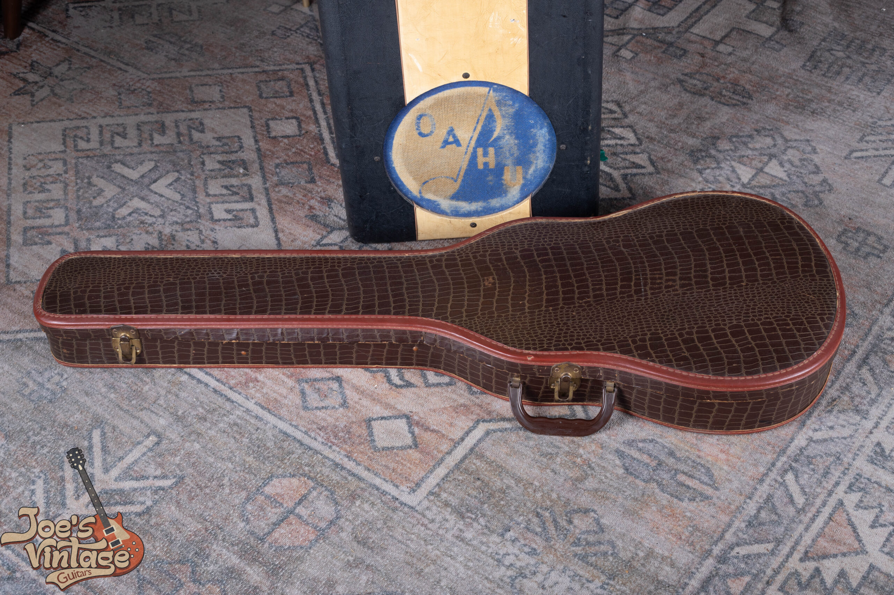</figure>

## Modern Reissues: How They Compare to the Originals

| Feature | Vintage Original | Gibson USA Reissue | Gibson Custom Shop | Epiphone |
| --- | --- | --- | --- | --- |
| Neck Profile | Full C / "baseball bat" | Slimmer modern taper | Historically accurate | Slim, bolt-on construction |
| Pickup | Original wound P-90, Alnico 3 or 5 | Modern P-90, Alnico V | Vintage-spec P-90 | Often humbucker, not P-90 |
| Finish | Thin vintage nitrocellulose | Nitro, thicker application | Thin nitro with aged options | Polyurethane |
| Mahogany Species | Honduras (*Swietenia macrophylla*) | African mahogany (*Khaya*) | African mahogany (*Khaya*) | Asian mahogany |
| Hardware | Nickel pot metal, naturally aged | Modern nickel | Aged vintage-correct hardware | Chrome-plated |
| Electronics | CTS/Centralab pots, bumblebee caps | Modern CTS pots | Vintage-correct components | Generic components |

Gibson Custom Shop Juniors require a significant investment but still fall well below the prices commanded by original vintage examples in good condition. For players who want the genuine vintage feel and sound without the authentication risk and provenance anxiety that come with an original, Custom Shop reissues are worth real consideration. For players who just want the visual look and basic playability of the Junior design at an accessible price, the Epiphone versions do their job. They're a different category of instrument, not a substitute for the original, and they're priced accordingly.

## Setup, Maintenance, and Preservation

### Fretwork

Original nickel-silver frets on surviving vintage Juniors run the gamut from near-new to fully worn out. Restoration options come down to two. Level and recrown, where you remove material from existing frets to restore uniform height. Full refret, where you pull the original wire entirely and install new wire. For collector-grade instruments, fretwork should only ever be done by a technician experienced with vintage instruments. Refret should use vintage-specification wire, medium to medium-tall in nickel-silver, not modern stainless or EVO gold. The wrong wire isn't period-correct and can affect resale value.

### Electronics Preservation

The original electronics (pots, capacitors, pickup) are among the most valuable components on the guitar from a collector standpoint. When something needs work, the approach should preserve original components wherever possible. Dirty pots can usually be cleaned with the right contact cleaner rather than replaced. If a vintage P-90 needs rewinding, get the work done by a specialist who can measure and document the original winding specs before disturbing anything. Once the original coil is unwound, those measurements are gone for good.

### Finish Care

Nitro requires different care than modern finishes. Many commercial guitar polishes contain silicone, which damages nitro over time. Either use products designed specifically for nitrocellulose, or stick to a dry or barely damp cloth for routine cleaning. The finish shouldn't contact rubber, certain plastics, or anything aggressive.

Never put a vintage Junior on a rubber guitar stand or hanger. Rubber reacts chemically with nitrocellulose lacquer and can permanently stain or partially dissolve the finish, sometimes from minimal contact. Use stands and hangers with foam or fabric contact points. Or hang the guitar from its strap. Whatever you do, no rubber against the body.

### Humidity and Temperature

The ideal storage range is 45 to 55 percent relative humidity with stable temperature and small swings. Long-term storage in a hard case with a two-way humidity control system like Boveda packs is best practice. Never store a vintage guitar in a car trunk, an attic, or a basement. Wild temperature and humidity swings cause glue joint failures, finish damage, and cracked wood in instruments that have survived 65+ years in better conditions. Don't be the owner who undoes decades of luck in a single hot summer week.

## A Practical Buying Guide

### Define Your Priorities First

Before you start seriously evaluating instruments, be clear about what you want and why. Different intent leads to different purchases. If you're primarily a player who wants the genuine vintage experience and isn't bothered by some replaced parts or repaired damage, your buying range is wider and your prices are lower. If you're a collector who wants all-original condition and plans to keep the guitar in its case most of the time, your buying range tightens and your prices rise. If the guitar is partly an investment, you'll prioritize examples with clear provenance and the configurations that hold value best. Knowing which of these applies to you changes which guitars you should be looking at, full stop.

### Source Matters

Established vintage dealers with strong reputations have financial and reputational incentives to describe instruments accurately and stand behind what they sell. Auction houses with dedicated vintage guitar specialists provide documentation and expert evaluation that private-party transactions rarely match. Casual marketplace listings from unknown sellers require maximum skepticism and ideally a pre-purchase inspection by an independent expert you trust. The cost of getting that inspection wrong is measured in thousands of dollars per mistake.

### Always Inspect in Person When Possible

No photograph, however well shot, substitutes for hands-on examination. The critical authentication tools, UV light, a DC resistance meter for the pickup, physical examination of finish and hardware, all require the instrument to be present. For any purchase above a modest threshold, insist on in-person inspection or hire an independent expert to perform one on your behalf. The cost of an expert appraisal is trivial against the cost of a five-figure authentication mistake.

### Understand What You're Paying For

The price of a vintage Junior covers more than the physical instrument. It covers its story, its rarity, and its place in guitar history. When you buy an all-original 1958 Cherry Red double-cutaway in excellent condition, you're buying something that cannot be reproduced. A genuine artifact from a specific moment in instrument-making and a specific moment in cultural history. The fact that it can't be reproduced is part of what you're paying for. If that doesn't matter to you, a high-quality reissue will serve your musical needs at a fraction of the cost.

## Conclusion: The Junior's Enduring Legacy

The Gibson Les Paul Junior is one of the great unlikely success stories in electric guitar history. The 1954 to 1962 production run shows continuous refinement broken up by two major redesigns, and each redesign produced a genuinely different instrument while preserving what made the model a Junior in the first place. Slab mahogany body. Single bridge-position P-90. Minimal hardware. No sonic compromise.

For the collector, the Junior is a long study. Specific evolution of specs, finishing techniques, component changes, production variations, across most of a decade of output. Reading the physical evidence each instrument presents takes time and reps. For the player, the Junior is simpler and more immediate. It gets out of the way and lets the music happen.

The Junior's journey from student model to cultural icon shows something that keeps proving true: great tone isn't a function of complexity or cost. Sometimes the stripped-down, elemental choice (one pickup, one volume, one tone, one idea) turns out to be the most powerful choice of all.

## Further Reading and Research Resources

### Reference Books

-   *Gibson Electrics: The Classic Years* by A.R. Duchossoir. The most complete technical reference available for Gibson electric guitars of the 1950s and early 1960s.
-   *The Beauty of the Burst* by Yasuhiko Iwanade. Focused primarily on Les Paul Standards but useful comparative context for the full LP lineup.
-   *The Gibson Les Paul Book* by Tony Bacon and Paul Day. An accessible overview of the full Les Paul lineup with strong photographic documentation across all eras.

### Serial Number and Dating Resources

-   The Guitar Dater Project (online). Maintains databases of Gibson serial numbers and FONs with crowd-sourced verification from experienced collectors.
-   Gibson's own serialization guide. Available through Gibson customer service and various online resources, covering the different numbering systems used across different eras.
-   Pot date code databases. Multiple online resources compile manufacturer codes and date decoding methodologies that allow precise dating of potentiometers.

### Authentication Communities

-   The Les Paul Forum. One of the longest-running and most knowledgeable online communities focused specifically on vintage Gibson Les Paul instruments, with extensive documented example archives and experienced authenticators.
-   Vintage Guitar Magazine. Publishes regular features on specific models and production years with authentication guidance from recognized experts in the field.

## Frequently Asked Questions

Both are P-90 pickups with the same coil construction. They differ in cover design and how they mount. The dog ear, used on the Junior, has extended mounting tabs on its long sides that screw directly into the guitar top. No separate mounting ring needed. The soapbar, used on the Special, Goldtop, and others, has a flush rectangular cover and mounts through a separate frame or directly into the body. The electrical and magnetic specs are essentially identical. Any tonal differences between them come from mounting position and body routing differences, not from the pickup design itself.

UV light is your best tool. Small touch-ups show up as localized patches of different fluorescence intensity surrounded by original finish. Full refinishes typically fluoresce uniformly but at a different color or intensity than original 1950s nitro. The areas under hardware (bridge, pickguard, pickup) give you the best comparison points. If those hardware-protected areas match the visible finish exactly, and both differ from what original 1950s nitro should look like under UV, you're probably looking at a full refinish. If the hardware areas show a "ghost" of an older finish while the exposed surfaces look fresh, that points to partial refinish or heavy touch-up.

Not automatically, but they need careful evaluation. A well-executed repair, hide glue, properly clamped, no remaining flex or gap at the joint, can be structurally sound for the long term and have minimal effect on tone or playability. A poorly executed repair, or a neck that's been broken and repaired multiple times, may be structurally compromised and at risk of failing again. Have any repaired break evaluated by an experienced luthier before purchase. A verified, clean repair on an otherwise desirable Junior should reduce the asking price, but it doesn't have to eliminate the guitar from consideration.

Most experienced players land on the 1958 to 1960 double-cutaway as the best player's Junior. You get the improved upper-fret access, the slab mahogany body and its tonal character, and cleaner authentication compared to the SG era. SG-body 1961 to 1962 examples with well-repaired neck breaks can be excellent players' guitars at lower prices than equivalent double-cutaway examples, but the structural vulnerability of the design requires ongoing awareness and care.

Single-cutaway Juniors typically weigh between 7.5 and 9 pounds. Double-cutaways tend to be slightly lighter, 7 to 8.5 pounds. SG-style Juniors are the lightest, usually 6 to 7.5 pounds. Weight does affect tone but the relationship is complex. More mass generally correlates with more sustain and stronger low-frequency body resonance, but the species, age, and density of the specific piece of wood matter more than raw weight. Weight is a useful proxy. It isn't a definitive tonal indicator on its own.

Original 1950s Gibsons left the factory with heavy strings by modern standards, .013 to .056 or similar. Running heavy gauges on an aging vintage neck puts ongoing stress on the neck joint, the truss rod, and the body. Most technicians advise vintage owners to drop to lighter gauges, typically .010 to .046 or .011 to .048. You give up a small amount of tone for substantially reduced stress on irreplaceable components. If the guitar is currently set up for a specific gauge, changing significantly will require truss rod adjustment and possibly saddle work to keep the setup right.

The Factory Order Number is Gibson's internal production batch code, typically ink-stamped inside the control cavity or visible at the neck joint. FONs were applied when a batch of instruments entered production, and they encode the year and batch sequence in a format that researchers have decoded and published in various reference resources. Cross-referencing the FON against the headstock serial number gives you a more reliable production date range than either number alone. If the two suggest inconsistent dates, that's worth investigating before drawing conclusions about the rest of the instrument.
