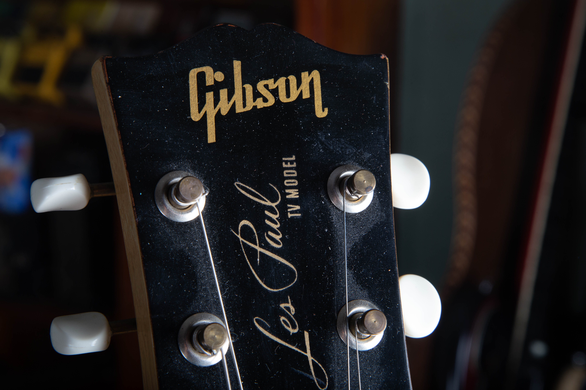
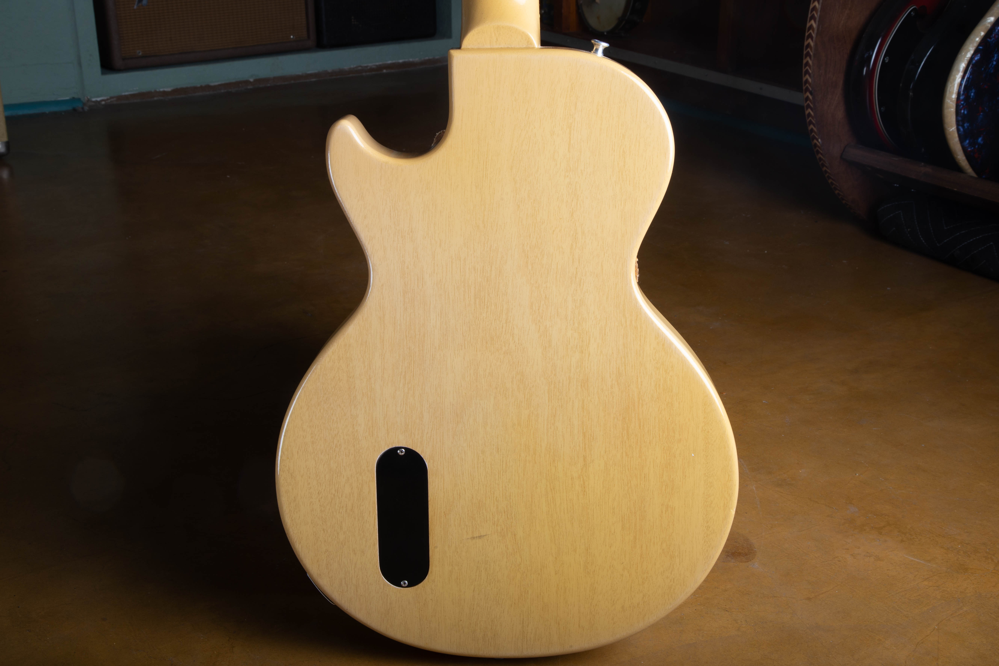
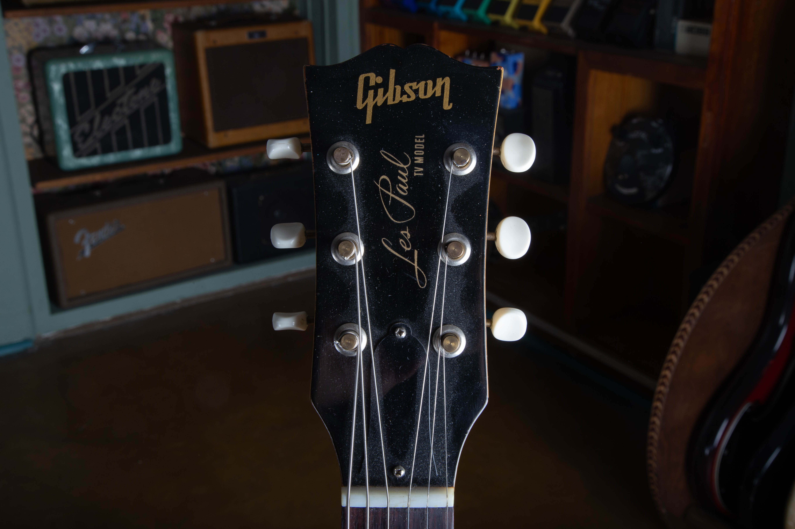
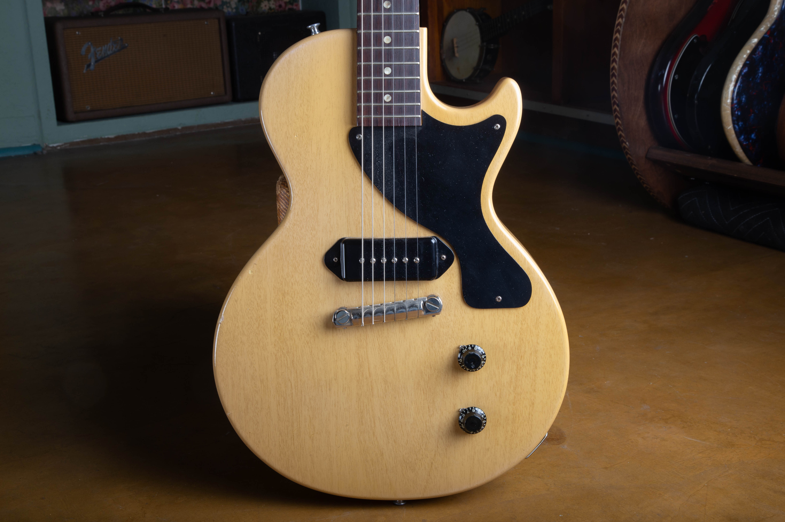
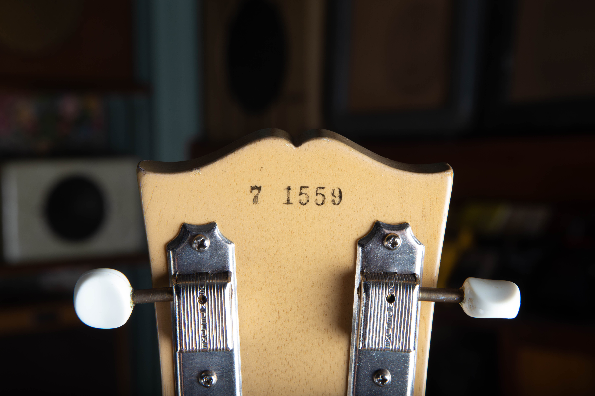

1.  [What the Les Paul TV Model Is](#tvm-what)
2.  [What "TV Model" Means: The Name and the Finish](#tvm-name)
3.  [Where the TV Model Fits in the Les Paul Line](#tvm-history)
4.  [The 1950s TV Model, Year by Year](#tvm-timeline)
5.  [The Limed Mahogany (TV Yellow) Finish Explained](#tvm-finish)
6.  [Gibson Les Paul TV Model Specifications](#tvm-specs)
7.  [Construction and Hardware, Point by Point](#tvm-construction)
8.  [The Single Dog-Ear P-90](#tvm-p90)
9.  [How to Date a 1950s TV Model](#tvm-dating)
10.  [How Rare Is It? TV Model Production Totals](#tvm-production)
11.  [TV Model Authentication Checklist](#tvm-authentication)
12.  [TV Model vs Junior vs Special](#tvm-compare)
13.  [What Drives the Value of a Vintage TV Model](#tvm-value)
14.  [Tone and the Players Who Chased It](#tvm-tone)
15.  [Selling or Appraising Your TV Model](#tvm-sell)
16.  [Frequently Asked Questions](#tvm-faq)

<h2 id="tvm-what">What the Les Paul TV Model Is</h2>

The Gibson Les Paul TV Model is one of the most misunderstood names in the whole Les Paul family, so it is worth being precise from the first sentence. A TV Model is a Les Paul Junior wearing the pale, translucent finish Gibson called limed mahogany and everyone else calls TV Yellow. Same slab mahogany body. Same single dog-ear P-90 in the bridge position. Same wraparound bridge, same set mahogany neck, same one-volume, one-tone control layout. The only thing that separates a TV Model from a standard sunburst Junior is the color, and yet that one difference is what turns an affordable student guitar into one of the rarer and more collectible solidbodies Gibson built in the 1950s.

If you own one, or you think you might, the headstock settles it fast. A genuine TV Model is silk-screened in gold, and under the "Gibson" logo and the "Les Paul" script it reads "TV MODEL." Not "Junior." That small line of gold ink is the difference between a common Junior and a guitar Kalamazoo shipped in the low hundreds per year.

At Joe's Vintage Guitars we buy, authenticate, and appraise these guitars regularly, and the questions we hear most often are the same three: what exactly is a TV Model, how do I know it is real, and what is it worth. This guide answers all three in detail. If you already know what you have and you are ready to move it, you can jump straight to how to [sell your Gibson](/sell-my-gibson-guitar/) or request a [free appraisal](/free-appraisal/). If you want to understand the guitar first, read on.

A 1957 Les Paul TV Model in its original limed mahogany finish. One pickup, one pickguard, a wraparound bridge, and not much else. The simplicity is the point, and the pale finish is the whole reason this guitar has its own name.

<h2 id="tvm-name">What "TV Model" Means: The Name and the Finish</h2>

Gibson never printed the words "TV Yellow" in a 1950s catalog. The official finish name was limed mahogany. So where did "TV" come from, and why is it stamped right there on the headstock? There are three explanations that get repeated, and the honest answer is that the first two are both plausible and the truth is probably a blend of them.

The most popular story is about television itself. In the mid-1950s, network broadcasts were black and white, and studio lighting was harsh. A bright white guitar bloomed and glared on camera, while a dark sunburst disappeared into shadow. A pale, warm, slightly greenish off-white read as a clean, glare-free light gray on screen. In that telling, Gibson built a finish that photographed well under television lights and named the guitar accordingly.

The second explanation is about furniture, and a lot of researchers find it more convincing. "Limed" oak and "limed" mahogany were hugely fashionable furniture finishes in the early 1950s, and the blonde television console cabinet sitting in every modern living room was very often finished exactly this way. Gibson used the same limed process on the guitar, so calling it the TV Model tied the instrument to the most desirable piece of furniture in the American home. The finish name, limed mahogany, supports this reading directly.

The third story simply points at Les Paul and Mary Ford, who had their own television presence in the era, and treats the name as a marketing tie-in to the man whose signature was on the headstock.

Whatever the origin, the name stuck, and the finish became iconic. On the actual guitar, limed mahogany is not paint. Gibson filled the open mahogany grain with a white or off-white filler, then sprayed a thin, translucent yellow-tinted lacquer over it. The white in the grain and the yellow in the topcoat combine into that unmistakable creamy color, and because the topcoat is translucent, you can still see the mahogany grain telegraphing through it. That last point is the single most useful thing to know about a TV finish, and we come back to it in the finish section below.

The proof is in the gold. Under the Gibson logo and the Les Paul script, the headstock reads TV MODEL. On a Junior this line would say Junior, and the two guitars are otherwise built the same way. This silk-screen is the fastest way to confirm you are looking at a TV Model and not a repainted Junior.

<h2 id="tvm-history">Where the TV Model Fits in the Les Paul Line</h2>

To understand why the TV Model exists, you have to look at Gibson's price problem in 1954. The cheapest Les Paul solidbody in the catalog was the Goldtop at 225 dollars. That was real money in 1954, far out of reach for the students and beginners who were driving the electric guitar boom. Fender was already selling to that buyer with the Telecaster, and Gibson had nothing to answer it.

The fix was the Les Paul Junior, introduced in 1954 at 99.50 dollars, roughly half the price of a Goldtop. Gibson kept the body shape and the scale length but stripped away everything that cost money to build: no carved maple top, no binding, no neck pickup, no fancy inlays. One P-90, one volume, one tone, a wraparound bridge, and a slab of mahogany. It was designed as a starter guitar, and it turned into one of the most influential rock and roll instruments ever made.

The TV Model arrived as a companion to the Junior in 1954. Mechanically it was identical, but instead of sunburst it wore the limed mahogany finish. Gibson listed it in the catalog as its own model, the Les Paul TV, even though on the workbench it was a Junior in a different color. In 1955 Gibson finished the tier by adding the Les Paul Special, which took the same slab body and added a second P-90, a bound fingerboard, and an upgraded pickguard.

So the mid-1950s budget lineup broke down cleanly:

-   **Les Paul Junior:** one P-90, sunburst, the entry point.
-   **Les Paul TV Model:** one P-90, limed mahogany finish, a Junior with a coat and tie.
-   **Les Paul Special:** two P-90s, bound neck, the step up before the Goldtop.

That structure matters for authentication and value, because parts and finishes get swapped between these three guitars all the time. Knowing exactly which model you are holding is step one. For a deeper look at the single-pickup sibling, see our full [Gibson Les Paul Junior guide](/post/gibson-les-paul-junior-guide/), and for the two-pickup step up, our [1955 to 1958 TV Yellow Les Paul Special guide](/post/1955-1958-tv-yellow-les-paul-special-guide/).

<h2 id="tvm-timeline">The 1950s TV Model, Year by Year</h2>

The TV Model tracks the Junior almost exactly through the decade, because it was a Junior. The two big events are the same for both guitars: the single-cutaway slab body ran from 1954 through the middle of 1958, and then late in 1958 Gibson redesigned the body into the now-famous double-cutaway shape. Here is how the 1950s TV Model breaks down.

| Period | Body and Key Features | What to Watch For |
| --- | --- | --- |
| 1954 to 1955 | Single-cutaway slab. The earliest limed finishes tend to be more muted and natural, a touch less yellow than the classic look. Cream-colored celluloid dot inlays and flat speed knobs. | Genuine 1954 TV Models are scarce and easy to misdate. The muted, natural finish and the flat speed knobs point to the earliest production. |
| 1955 to 1957 | The classic single-cut TV Model. Limed mahogany matures into the translucent TV Yellow most people picture. Bonnet knobs replace the flat speed knobs in 1956. | This is the sweet spot for the single-cutaway. The guitar pictured in this guide is a 1957. |
| 1958 (early) | The final single-cutaway TV Models. Fully evolved late-fifties specs before the redesign. | The rarest single-cut year. Late in 1958 the body changes underneath the same name. |
| 1958 (late) to 1959 | Double-cutaway body. Two rounded horns, full access to the top frets, slightly lighter body. Same single P-90 and limed finish, now the brighter TV Yellow. | The horns are rounded, not the sharp points of the later SG shape. |
| 1960 to 1961 | Double-cutaway continues, with TV Yellow numbers dropping sharply before the line moves to the SG body. | Very low TV Yellow shipping totals in these last years make late double-cuts genuinely rare. |

The takeaway for buyers is that "1950s TV Model" covers two visually different guitars: the single-cutaway slab that most collectors picture, and the double-cutaway that arrived at the end of 1958. Both are real TV Models. They play differently and they are valued differently, so pin down which one you have before anything else.

<h2 id="tvm-finish">The Limed Mahogany (TV Yellow) Finish Explained</h2>

The finish is the entire reason this guitar has its own name and its own value, so it deserves a close look. Getting comfortable reading a TV finish is the best protection a buyer has, because refinishes are extremely common on these guitars. The original limed mahogany is difficult to match, so a tired or damaged TV Model is a prime candidate for a repaint, and a repaint erases most of the collector premium.

Here is what an original 1950s TV finish should show you:

-   **You can see the grain through the color.** Gibson used a white grain filler and a translucent yellow topcoat. On an original finish the mahogany grain is clearly visible under the yellow. If the color looks thick, flat, and opaque, like it was painted on with a solid coat, treat it as a refinish until proven otherwise.
-   **The color has moved over seventy years.** TV finishes do not stay put. Examples kept in a case in the dark tend to deepen toward a warm amber. Examples that lived on a stand near a window fade toward a pale, washed-out near-white. Either can be correct. A finish that looks factory-fresh and perfectly even is more suspicious than one that has aged unevenly.
-   **Nitrocellulose checks.** The original lacquer is nitrocellulose, which shrinks and cracks over decades into the fine web of lines collectors call checking. A seventy-year-old TV Model with no checking anywhere is a flag worth chasing down.
-   **A blacklight tells the truth.** Under a 365nm ultraviolet lamp, original 1950s nitro fluoresces differently than modern finishes. Overspray, touch-ups, and full refinishes usually show up as a different color or brightness under UV, even when they look perfect in room light. This is the single most useful tool for checking a TV finish, and it is the first thing we reach for.

The back of the body shows the limed finish doing exactly what it should. The mahogany grain reads right through the pale yellow, which is the hallmark of an original translucent limed coat rather than an opaque repaint. Note the single black oval control cover, correct for a one-pickup Junior or TV.

<h2 id="tvm-specs">Gibson Les Paul TV Model Specifications</h2>

The table below covers the classic single-cutaway TV Model of roughly 1955 to 1958. Small details shift year to year, and we call those out in the sections that follow, but these are the core specs you should expect to find on an honest single-cut example.

| Specification | Detail |
| --- | --- |
| **Model name** | Les Paul TV Model (a Les Paul Junior in limed mahogany finish) |
| **Years, single cutaway** | 1954 to mid 1958 |
| **Years, double cutaway** | Late 1958 to 1961 |
| **Body wood** | Solid Honduras mahogany, slab construction, no maple cap |
| **Body style** | Single cutaway, flat top, roughly 1.75 inches thick |
| **Finish** | Limed mahogany (TV Yellow), nitrocellulose lacquer over white grain filler |
| **Neck wood** | One-piece mahogany, set neck with long tenon |
| **Scale length** | 24.75 inches |
| **Nut width** | 1-11/16 inches (1.6875 inches) |
| **Nut material** | Nylon |
| **Fingerboard** | Brazilian rosewood, 22 frets, 12 inch radius |
| **Inlays** | Cream-colored celluloid dot inlays |
| **Neck profile** | Full rounded C, substantial, roughly 0.90 inch and up at the first fret |
| **Pickup** | One P-90 "dog-ear" single coil, bridge position, black cover |
| **Pickup output** | Roughly 7.5k to 8.5k ohms DC resistance |
| **Magnet** | Alnico 3 on the earliest pickups, Alnico 5 from around 1956 to 1957 |
| **Controls** | One volume, one tone, 500k pots |
| **Tone capacitor** | Grey Tiger early, Bumblebee from 1956 |
| **Bridge and tailpiece** | One-piece wraparound, combined bridge and tailpiece |
| **Tuners** | Kluson Deluxe strip tuners, 3 on a strip, brass posts, plastic buttons |
| **Pickguard** | Single-ply black |
| **Knobs** | Black speed knobs early, black bonnet knobs from 1956 |
| **Headstock** | Black face, gold silk-screen: Gibson, Les Paul, and TV MODEL |
| **Serial number** | Ink-stamped on the back of the headstock |
| **Weight** | Roughly 7.5 to 9 pounds |
| **Original case** | Brown chipboard |

<h2 id="tvm-construction">Construction and Hardware, Point by Point</h2>

Everything that makes a Junior sound and feel the way it does is present on a TV Model, because they are the same guitar under the finish. A few details are worth calling out individually, both because they drive the tone and because they are the parts most often swapped or faked.

### The Slab Mahogany Body

The body is a flat slab of solid mahogany, with no carved maple top and no binding. Gibson used dense Honduras mahogany in this period, and the warm, mid-focused voice of a Junior or TV comes largely from that solid slab. There is no maple cap to add brightness or compression, so what you hear is mahogany doing the work.

### The Set Neck and Long Tenon

The one-piece mahogany neck is glued into the body with a long tenon that reaches deep into the body. That glued joint transfers string vibration into the body efficiently and is a big part of why these guitars sustain. When a pickup is out, you can sometimes see the end of that tenon in the route, which is a useful originality check.

### The Single Dog-Ear P-90

One P-90 sits in the bridge position, in the "dog-ear" cover with two flat mounting ears that screw straight into the body. There is no separate mounting ring. More on the pickup below, since it is the sonic heart of the guitar.

### The Wraparound Bridge

The bridge and tailpiece are a single piece of metal that the strings wrap over and around, anchored to the body by two studs. This direct coupling of string to bridge to body is another major source of the Junior and TV sustain and percussive attack. These bars were lightweight aluminium from the start, nickel plated; the heavier zinc castings are a later part, so a noticeably heavy wraparound on a 1950s guitar is a replacement.

### Kluson Strip Tuners

The tuners are Kluson Deluxe units, three on a single strip per side, with plastic buttons and brass posts. Over seventy years the brass posts darken to a deep bronze or near-black. If the tuner posts on a supposed 1950s TV Model are bright and shiny like chrome, they are almost certainly modern replacements.

The headstock face of the 1957, with its gold silk-screen and Kluson strip tuners. The cream buttons have aged the way old plastic does, and the whole panel wears its years honestly. Bright, chrome-looking tuners on a guitar sold as a 1950s TV Model are a reason to look harder.

### The Single-Ply Black Pickguard

The TV and Junior use a simple single-ply black pickguard, unlike the multi-ply guard on the Special. That single-ply guard is one of the quick tells that separates a Junior or TV from a Special at a glance.

The whole layout in one shot: one dog-ear P-90 at the bridge, a single-ply black pickguard, a one-piece wraparound bridge, and two black bonnet knobs for volume and tone. Bonnet knobs like these are correct from 1956 onward; a 1954 or early 1955 example should wear flatter speed knobs.

From the back you can read the whole build: a one-piece mahogany neck, the slab body, the strip tuners, and the single control cavity cover. This is a plain, honest, well-built guitar, which is exactly what Gibson set out to make.

<h2 id="tvm-p90">The Single Dog-Ear P-90</h2>

The one P-90 is the sound of this guitar. It is a single-coil pickup with a flat coil, six adjustable steel pole screws, and two bar magnets underneath, wound to somewhere around 7.5k to 8.5k ohms of DC resistance on an original 1950s example. If a supposedly original pickup reads well above that, it has probably been rewound or replaced.

Two era details are worth knowing. First, the magnet changed. The earliest pickups used Alnico 3 magnets, which have a softer, warmer pull, and Gibson moved most production to the stronger Alnico 5 around 1956 to 1957. Second, the pickup position drifted. The earliest Juniors and TVs placed the pickup very close to the bridge, which gives a bright, cutting attack, and Gibson nudged it slightly away from the bridge in 1956, which warms the voice and brings up the midrange.

What all of this adds up to is a guitar with a single, uncompromised voice. There is no neck pickup to switch to and no blend to hide behind. You shape the whole sound with your hands, your volume knob, and your amp. That directness is exactly why players who could afford anything kept coming back to the one-pickup design.

<h2 id="tvm-dating">How to Date a 1950s TV Model</h2>

Dating a TV Model comes down to three pieces of evidence that should agree with each other: the serial number, the potentiometer date codes, and the Factory Order Number. When all three line up, you can date the guitar with real confidence. When they disagree, that is a signal to slow down and look harder at whether the parts and the body actually belong together.

### The Serial Number

In this era Gibson ink-stamped the serial number onto the back of the headstock, and the format is simple: the first digit is the last digit of the year. A serial that begins with 5 is 1955, one that begins with 6 is 1956, one that begins with 7 is 1957, and one that begins with 8 is 1958. Because the ink sits on top of the lacquer, it often shows a little wear or "haloing," which is a good sign of age. A serial number pressed or stamped into the wood rather than inked on top points to a later guitar or a replaced neck.

The guitar in this guide carries the ink stamp 7 1559. That leading 7 places it firmly in 1957, and the ink sitting on top of the lacquer with slight wear is exactly what a real 1950s stamp should look like. For the full breakdown of every Gibson numbering system, including how these ink stamps overlap year to year, see our [Gibson serial number guide](/how-to-read-gibson-serial-numbers/).

### Potentiometer Codes

The pots inside the control cavity carry their own date stamp. Most are Centralab, whose code starts with 134, or CTS, whose code starts with 137. The digits after the maker code give the year and week the pot was made. A pot is only as old as the guitar at the earliest, since pots were made and then warehoused before assembly, so a pot dated a few weeks or months before the serial year is normal and expected. Pots dated after the claimed year are a problem.

### The Factory Order Number

The Factory Order Number, or FON, is Gibson's internal batch code, usually inked inside the control cavity or under a pickup. In this era the FON often carries a letter prefix that maps to the year, running backward through the alphabet: W for 1955, V for 1956, U for 1957, T for 1958, then S for 1959, R for 1960 and Q for 1961. Cross-referencing the FON against the serial number is the best way to confirm the body and neck came together in the same window.

For a full walk through all of these systems, with the year charts laid out, our [how to read Gibson serial numbers](/how-to-read-gibson-serial-numbers/) guide is the companion piece to this article.

<h2 id="tvm-production">How Rare Is It? TV Model Production Totals</h2>

This is where the TV Model separates itself from a common Junior, and it is the part most sellers underestimate. Because the TV finish was an option most buyers skipped in favor of the cheaper sunburst, Gibson shipped these in small numbers. The figures below come from Gibson's own Kalamazoo shipping ledgers, which log the TV finish as a variant of the Junior line.

| Year | Body Style | TV Yellow Shipped |
| --- | --- | --- |
| 1955 | Single cutaway | 219 |
| 1956 | Single cutaway | 511 |
| 1957 | Single cutaway | 552 |
| 1958 | Single and double cutaway | 429 |
| 1959 | Double cutaway | 543 |
| 1960 | Double cutaway | 419 |
| 1961 | Double cutaway | 29 |

Put those single-cut numbers next to the sunburst Junior and the scarcity jumps out. In 1957, Gibson shipped 552 TV Yellow examples against 2,959 sunburst Juniors. Across the core single-cutaway years of 1955 to 1957, the entire TV Yellow run adds up to fewer than 1,300 guitars. The 1961 double-cutaway TV, with just 29 shipped, is one of the rarest regular-production Gibson solidbodies of the era. These are the kinds of numbers that back up a value, and they are exactly what a serious buyer or appraiser wants to see documented.

For the complete tables covering every model, including how the TV finish appears across the Junior and Special lines and into the SG years, see our full breakdown of [Gibson production totals and shipping numbers from 1948 to 1979](/post/gibson-shipping-totals-1948-1979/). If you want to know how rare your specific guitar really is, that is where the numbers live.

<h2 id="tvm-authentication">TV Model Authentication Checklist</h2>

No single detail proves a guitar. Authentication is about stacking evidence until the whole instrument tells one consistent story. Here is the checklist we run on a single-cutaway TV Model.

-   **Headstock reads TV MODEL,** in gold silk-screen under the Les Paul script, not "Junior" and not a blank or repainted panel.
-   **Serial number** ink-stamped on the back of the headstock, first digit matching the claimed year, sitting on top of the lacquer with honest wear.
-   **Finish is translucent,** with mahogany grain visible through the yellow, and it fluoresces correctly under UV with no hidden overspray or touch-ups.
-   **One dog-ear P-90** at the bridge, reading in the 7.5k to 8.5k range, mounted directly to the body with no filled route from a removed second pickup.
-   **Single-ply black pickguard,** correct for a Junior or TV, not the multi-ply guard of a Special.
-   **Wraparound bridge** with period-correct studs, no extra holes drilled for a later Tune-o-matic conversion.
-   **Kluson strip tuners** with brass posts aged to dark bronze, and no enlarged or extra tuner holes in the headstock.
-   **Knobs match the year:** speed knobs for 1954 to 1955, bonnet knobs from 1956 on.
-   **Pot and FON codes** agree with the serial number, all pointing to the same year or a hair earlier.
-   **No humbucker route.** Carving the body for humbuckers was a common 1970s modification and it permanently hurts value.

The modifications that hurt value most are the irreversible ones: a refinish, a humbucker route, a headstock break, or a bridge conversion that drilled new holes. A guitar can survive any of these and still be a fine player, but each one moves it out of the top collector tier, and each one should be reflected honestly in the price.

<h2 id="tvm-compare">TV Model vs Junior vs Special</h2>

These three guitars share a body and get confused constantly, so here is the clean comparison.

| Feature | Les Paul Junior | Les Paul TV Model | Les Paul Special |
| --- | --- | --- | --- |
| **Pickups** | One P-90 | One P-90 | Two P-90s |
| **Standard finish** | Sunburst | Limed mahogany (TV Yellow) | TV Yellow or cherry |
| **Fingerboard binding** | None | None | Bound |
| **Pickguard** | Single-ply black | Single-ply black | Multi-ply |
| **Headstock silk-screen** | Les Paul Junior | Les Paul TV Model | Les Paul Special |
| **Relative rarity** | Common | Scarce | Between the two |

The key thing to internalize: a TV Model is a Junior. Mechanically they are the same guitar, and the TV name refers to the finish. A TV Yellow Special is not a TV Model, even though people call the color TV Yellow on both. The TV Model designation belongs specifically to the single-pickup Junior in limed mahogany. That distinction matters a great deal when money changes hands.

<h2 id="tvm-value">What Drives the Value of a Vintage TV Model</h2>

We do not publish fixed price figures, because the vintage market moves and any number printed here would be wrong within a year. What does not change is the set of factors that determine where a given TV Model lands. Understanding these is how you make sure you are not underselling a rare guitar or overpaying for a modified one.

-   **Originality.** An all-original TV Model, with its factory finish, pickup, bridge, tuners, and electronics intact, sits at the top. Original P-90s matter most, because their specific voice is hard to replicate and the market knows it.
-   **The finish.** An honest, original limed mahogany finish is a large share of the value on this model specifically, because the finish is the reason the guitar has a name. A refinish typically cuts value sharply.
-   **Single cut versus double cut.** The two body styles are valued differently, and which one is worth more shifts with the market, so identify yours precisely.
-   **Condition and structure.** A clean, unbroken neck and an honest, checked finish beat a repaired headstock or a refinished body. Play wear is fine and expected. Structural repairs are where the real value swings happen.
-   **Rarity of the year.** The production numbers above feed straight into value. A low-shipping year is genuinely rarer, and documentation of that scarcity supports the price.
-   **Completeness.** The original chipboard case, any receipts, and period paperwork all add real money, both for the provenance and for the authentication support they provide.

For a broader look at how the whole Les Paul family is valued, our [vintage Gibson Les Paul market value guide](/vintage-gibson-les-paul-market-value-guide/) puts the TV Model in context with its more expensive siblings. And when you want an actual number on your specific guitar, that is what an appraisal is for.

<h2 id="tvm-tone">Tone and the Players Who Chased It</h2>

The TV Model sounds like a Junior, which is to say it sounds like one honest P-90 bolted to a slab of mahogany. The voice is warm, thick, and mid-focused, with a percussive attack and long sustain from the set neck and wraparound bridge. Roll the volume back and it cleans up; dig in through a cranked amp and the single P-90 growls and cuts through a band in a way that more complicated guitars struggle to match.

That directness is why the single-pickup design outgrew its student-guitar origins. Leslie West built huge, thick rock tone out of a single-cutaway Junior with Mountain, proving the no-frills design could carry a professional. The limed TV finish in particular became a visual signature of the New York punk and glam scenes of the 1970s, where the guitar's plain, anti-glamour identity was exactly the point. The guitar Gibson built to be the cheapest thing in the catalog turned out to be one of its most enduring designs, and the TV finish is the rarest and most striking way it ever came.

<h2 id="tvm-sell">Selling or Appraising Your Les Paul TV Model</h2>

If you have a TV Model, or a Junior, or anything you think might be one, the most valuable thing in the transaction is an accurate identification. The difference between a common Junior and a genuine TV Model, or between a dead-original example and a clean refinish, can be enormous, and it comes down to details that are easy to miss without handling a lot of these guitars.

At Joe's Vintage Guitars we have spent years buying and authenticating 1950s Gibson solidbodies, and we evaluate every guitar on its own evidence: the finish under UV, the pot and FON codes, the routes and the solder, the hardware and the wear. That is how you arrive at an honest value rather than a guess.

When you are ready, here is where to start:

-   **[Sell your Gibson](/sell-my-gibson-guitar/):** how our buying process works and what to expect.
-   **[Free appraisal](/free-appraisal/):** send us details and photos and we will tell you what you have and what it is worth.
-   **[Gibson serial number guide](/how-to-read-gibson-serial-numbers/):** date your guitar yourself before you reach out.
-   **[Gibson production totals](/post/gibson-shipping-totals-1948-1979/):** confirm how rare your specific year and finish really is.

<h2 id="tvm-faq">Frequently Asked Questions</h2>

**What is a Gibson Les Paul TV Model?** It is a Les Paul Junior finished in Gibson's limed mahogany, the pale finish collectors call TV Yellow. It has a single dog-ear P-90, a slab mahogany body, and a wraparound bridge. Gibson listed it in the catalog as its own model, the Les Paul TV, but mechanically it is a Junior in a different color.

**Why is it called the TV Model?** Two explanations are most credible and probably both contributed. The pale limed finish photographed cleanly on black-and-white television without the glare a white guitar produced, and limed finishes were also the height of fashion on the television console furniture in every 1950s living room. Gibson's official finish name was limed mahogany, and the headstock simply reads TV MODEL.

**Is a TV Model the same as a Les Paul Junior?** Mechanically, yes. Same body, neck, pickup, and hardware. The only difference is the finish and the headstock silk-screen. A TV Model is a Junior in limed mahogany, and the headstock says so.

**Is a TV Yellow Les Paul Special a TV Model?** No. The TV Model name belongs to the single-pickup Junior. A Special in TV Yellow is a TV Yellow Special, which is a different, two-pickup guitar. The color name gets shared, but the model name does not.

**How do I date my TV Model?** Start with the serial number ink-stamped on the back of the headstock. The first digit is the last digit of the year, so a serial beginning with 7 is 1957. Then confirm it against the pot date codes and the Factory Order Number inside the control cavity. Our Gibson serial number guide walks through all three.

**How rare is a TV Model?** Rare. Gibson shipped 219 TV Yellow examples in 1955, 511 in 1956, and 552 in 1957, against thousands of sunburst Juniors in the same years. The 1961 double-cutaway TV, with 29 shipped, is one of the rarest regular-production Gibson solidbodies of its era.

**Does a refinish hurt the value of a TV Model?** Significantly. The limed mahogany finish is the reason this model has its own name and much of its value, so an original finish matters more here than on almost any other Junior-family guitar. A repaint, even a good one, typically cuts the value sharply.

**What is the finish actually made of?** Gibson filled the mahogany grain with a white filler and sprayed a thin, translucent yellow-tinted nitrocellulose lacquer over it. Because the topcoat is translucent, you should be able to see the wood grain through the color. An opaque, painted-looking finish is usually a sign of a refinish.

**How can I tell a real TV Model from a repainted Junior?** Check the headstock silk-screen for TV MODEL, look for mahogany grain showing through a translucent finish, and inspect the finish under a UV light for overspray or touch-ups. A repainted Junior will often have an opaque finish and may show finish under the hardware that does not match the rest of the guitar.

**Where can I sell a Les Paul TV Model?** We buy them. You can start with our sell your Gibson page or request a free appraisal, and we will identify the guitar precisely and give you an honest value based on hands-on experience with these instruments.

