<nav class="paf-nav-sidebar" id="pafNavSidebar" aria-label="Article section navigation">
  
<strong>PAF Guide</strong>

  <a href="#" onclick="window.scrollTo({top:0,behavior:'smooth'});return false;" class="paf-nav-link top">&uarr; Top of Page</a>
  
The Pickup

  <a href="#paf-what" class="paf-nav-link">The Short Version</a>
  <a href="#paf-warning" class="paf-nav-link">Do Not Open It</a>
  <a href="#paf-history" class="paf-nav-link">The Invention</a>
  <a href="#paf-timeline" class="paf-nav-link">PAF to T-Top Timeline</a>
  <a href="#paf-anatomy" class="paf-nav-link">What Is Inside</a>
  <a href="#paf-sound" class="paf-nav-link">Why They Sound Special</a>
  <a href="#paf-players" class="paf-nav-link">The Legend Makers</a>
  
Authentication

  <a href="#paf-guitar" class="paf-nav-link">Start with the Guitar</a>
  <a href="#paf-covers" class="paf-nav-link">Covers and Solder</a>
  <a href="#paf-sticker" class="paf-nav-link">Reading the Sticker</a>
  <a href="#paf-base" class="paf-nav-link">Baseplate and Screws</a>
  <a href="#paf-rings" class="paf-nav-link">Rings and Stamps</a>
  <a href="#paf-electric" class="paf-nav-link">Meter and Magnet</a>
  <a href="#paf-open" class="paf-nav-link">Already-Open Pickups</a>
  <a href="#paf-fakes" class="paf-nav-link">Fakes and Re-Stickers</a>
  <a href="#paf-checklist" class="paf-nav-link">The Checklist</a>
  
Value

  <a href="#paf-value" class="paf-nav-link">What They Are Worth</a>
  <a href="#paf-factors" class="paf-nav-link">What Moves the Price</a>
  <a href="#paf-selling" class="paf-nav-link">Thinking of Selling</a>
  <a href="#paf-faq" class="paf-nav-link">FAQ</a>
</nav>

<button class="paf-nav-btn" id="pafNavBtn" onclick="togglePafNav()" aria-expanded="false" aria-controls="pafNavPanel" type="button">
  &#9776; Jump To Section
</button>

  
<strong>PAF Guide</strong>

  <a href="#" onclick="window.scrollTo({top:0,behavior:'smooth'});closePafNav();return false;" class="paf-nav-link top">&uarr; Top of Page</a>
  
The Pickup

  <a href="#paf-what" onclick="closePafNav()" class="paf-nav-link">The Short Version</a>
  <a href="#paf-warning" onclick="closePafNav()" class="paf-nav-link">Do Not Open It</a>
  <a href="#paf-history" onclick="closePafNav()" class="paf-nav-link">The Invention</a>
  <a href="#paf-timeline" onclick="closePafNav()" class="paf-nav-link">PAF to T-Top Timeline</a>
  <a href="#paf-anatomy" onclick="closePafNav()" class="paf-nav-link">What Is Inside</a>
  <a href="#paf-sound" onclick="closePafNav()" class="paf-nav-link">Why They Sound Special</a>
  <a href="#paf-players" onclick="closePafNav()" class="paf-nav-link">The Legend Makers</a>
  
Authentication

  <a href="#paf-guitar" onclick="closePafNav()" class="paf-nav-link">Start with the Guitar</a>
  <a href="#paf-covers" onclick="closePafNav()" class="paf-nav-link">Covers and Solder</a>
  <a href="#paf-sticker" onclick="closePafNav()" class="paf-nav-link">Reading the Sticker</a>
  <a href="#paf-base" onclick="closePafNav()" class="paf-nav-link">Baseplate and Screws</a>
  <a href="#paf-rings" onclick="closePafNav()" class="paf-nav-link">Rings and Stamps</a>
  <a href="#paf-electric" onclick="closePafNav()" class="paf-nav-link">Meter and Magnet</a>
  <a href="#paf-open" onclick="closePafNav()" class="paf-nav-link">Already-Open Pickups</a>
  <a href="#paf-fakes" onclick="closePafNav()" class="paf-nav-link">Fakes and Re-Stickers</a>
  <a href="#paf-checklist" onclick="closePafNav()" class="paf-nav-link">The Checklist</a>
  
Value

  <a href="#paf-value" onclick="closePafNav()" class="paf-nav-link">What They Are Worth</a>
  <a href="#paf-factors" onclick="closePafNav()" class="paf-nav-link">What Moves the Price</a>
  <a href="#paf-selling" onclick="closePafNav()" class="paf-nav-link">Thinking of Selling</a>
  <a href="#paf-faq" onclick="closePafNav()" class="paf-nav-link">FAQ</a>

<h2 id="paf-what">The Short Version</h2>

A PAF is the pickup that made the Gibson sound. It is the humbucker Seth Lover designed for Gibson in 1955, the pickup that shipped on the late 1950s Les Pauls, ES-335s, Flying Vs, and archtops, and it takes its name from the little black decal on the underside that reads "PATENT APPLIED FOR." A single original PAF now sells for more than a good used car, and a matched pair of the rarest versions can cost more than some of the guitars they came out of. Right behind them come the patent number pickups of 1962 to 1965, which are nearly identical inside and sell for a fraction of the money.

Because the value lives in details the eye cannot see through a nickel cover, the PAF is also the most faked, tampered with, and misrepresented part in the vintage guitar market. At Joe's Vintage Guitars we buy, sell, and appraise these pickups and the guitars that carry them, and this guide is the same process we use on the bench: the history, the construction, every external tell we check, what the meter can and cannot prove, how the fakes work, and what real examples bring today. Every photo in this guide is a real pickup that came through our shop.

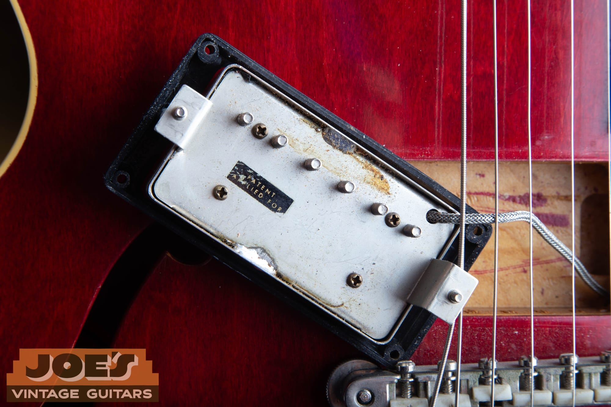

A PAF from a 1962 Gibson ES-335 in our shop, flipped over with its harness still attached. The decal is worn but readable, the solder is old and dull, and nothing has been disturbed. That is exactly what you want to see, and this one photo previews half the lessons in this guide.

<h2 id="paf-warning">Do Not Take Your Pickup Apart</h2>

<strong>Read this before you reach for a screwdriver or a soldering iron.</strong> Do not unsolder the cover, do not remove the baseplate screws, and do not unwrap anything to "check if it is real." Collectors pay a strong premium for pickups that have never been opened, because undisturbed factory solder is the single best piece of evidence that a pickup is what it claims to be. The moment the cover comes off, that evidence is gone forever. A resoldered joint can never be original again, an opened pickup invites damage to fifty year old coil wire that breaks like a cobweb, and a clumsy opening can turn a five figure pickup into a rewind candidate in one slip. Every internal detail a buyer needs can be documented by a qualified professional, in person, without guesswork on your part. If you want to know what you have, photograph the outside and <a href="/free-appraisal/">send us the pictures</a>. Leave the iron in the drawer.

We will come back to this warning in the authentication sections, because it changes how you should read the rest of the guide. Everything below is organized so that the checks that need no tools come first, the checks that need a meter come second, and the internal details come last, presented so you can understand them without creating the damage yourself. The interior photos in this article come from pickups that arrived at our shop already opened, or that required legitimate repair work. We photograph them so you do not have to open yours.

<h2 id="paf-history">The Invention of the Humbucker</h2>

The story starts with a problem every 1950s guitarist knew by heart. The P-90 single coil pickups on Gibson's electrics sounded great and hummed like a refrigerator. Single coils act as antennas for the 60 cycle hum thrown off by stage lighting, amplifier transformers, and building wiring, and the louder bands played, the worse it got.

Gibson's president Ted McCarty put the problem in front of Seth Lover, a radio and electronics engineer who had moved between Gibson and Navy electronics work before settling in Kalamazoo. Lover knew that electric organs and amplifiers used choke coils wound in opposing pairs to cancel hum in their power supplies, and he applied the same idea to a guitar pickup: two coils side by side, wound and wired so their electrical polarities oppose, with a single bar magnet underneath energizing both. Interference from the room hits both coils equally and cancels itself. The string signal, driven by the magnet's field, survives. The pickup "bucks" the hum, and the name followed.

Gibson filed Lover's patent application on June 22, 1955. The new pickup reached production on Gibson's console steel guitars during 1956, and by early 1957 it was on the Spanish electrics that matter to collectors: the Les Paul Goldtop and Custom, the ES-175, the Byrdland, the ES-5, and the rest of the electric line. Our [1957 Les Paul Goldtop guide](/post/1957-les-paul-goldtop-guide/) covers the first year the Les Paul wore them.

There is a wrinkle collectors love. Gretsch was chasing the same idea at the same time. Ray Butts, an amp builder in Cairo, Illinois, developed his own humbucking pickup for Chet Atkins, and Gretsch put it into production as the Filter'Tron. The two men worked independently, and the paper trail ended up delightfully crossed: Lover filed his application a year and a half before Butts filed his, yet the patent office granted Butts his patent first, in the summer of 1959, weeks before Lover's came through. Gibson had been shipping humbuckers for over two years by then, all of them wearing the sticker that gave the pickup its name.

That sticker is the whole reason for the terminology. While the application sat at the patent office from 1955 to 1959, Gibson marked the baseplates with a small black decal reading "PATENT APPLIED FOR." Guitarists shortened it to PAF. The patent, US 2,896,491, was finally granted on July 28, 1959, but Gibson kept using the same decal for more than three years after, which is why 1960, 1961, and many 1962 pickups are still true PAFs.

<h2 id="paf-timeline">From PAF to Patent Number to T-Top</h2>

Gibson never treated the humbucker as a collector's item. It was a mass produced part that evolved whenever a supplier changed, a process improved, or a material ran short. Those small changes are exactly what lets us date a pickup today, so it pays to know the sequence cold.

- **1956: steel guitars first.** The earliest humbuckers ship on console steels. Spanish guitar production follows within months.
- **February 1957 into the fall: no sticker at all.** The first stretch of Spanish guitar humbuckers has a bare baseplate. A genuine early 1957 pickup with no decal is real, and proving it takes expert eyes, because a missing sticker is also what a stripped later pickup looks like.
- **Late 1957 to late 1962: the PAF decal.** Black water slide decal, gold lettering, "PATENT" over "APPLIED FOR." This is the golden era, and inside it the details kept moving: the roughly two and a half inch long magnet gave way during 1961 to a bar about an eighth of an inch shorter, alnico grades settled toward alnico five around the same time, and the famous white bobbin window opened and closed between 1959 and 1960.
- **Late 1962: the sticker changes, the pickup does not.** Gibson swaps the decal for one reading "PATENT NO 2,737,842." Everything inside stays the same for a while: same purple enamel wire, same short alnico five magnet, same nickel silver hardware. The earliest patent number pickups are PAFs in every way except the label, and plenty of guitars built across the change wear one of each. Our [1962 ES-335 guide](/post/1962-gibson-es-335-guide/) shows exactly that kind of transition instrument.
- **Here is the famous detail: the number is wrong.** US patent 2,737,842 is not the humbucker patent. It is Les Paul's own patent for the combination trapeze bridge and tailpiece of the early 1950s. Collectors love the story that Gibson planted the wrong number to send competitors chasing a tailpiece, but Seth Lover's own explanation was less romantic: somebody grabbed the wrong decals out of the stock room, and nobody ever bothered to fix it. Either way, Gibson left the wrong number on its pickups for well over a decade, and it is one of the fastest ways to catch a fantasy fake: a vintage Gibson pickup sticker should never show the real humbucker patent number, 2,896,491.
- **During 1963: the wire changes.** Plain enamel magnet wire, which reads purple brown to the eye, gives way to polyurethane coated wire with an orange red cast, and old stock stretched the changeover across a year or two in true Gibson fashion. Winding machines get reliable automatic stops around the same time, so resistance readings tighten from the wild PAF spread into a consistent band around 7.5k ohms, give or take a quarter. This is the first change you can actually measure from outside. Gold cover PAFs are the long tail of the era: gold plated stock moved slowly on low volume models like the ES-345 and ES-355, so factory PAF stickers kept appearing on gold pickups into 1964 and 1965.
- **Around 1965: nickel gives way to chrome.** Cover plating follows the rest of Gibson's hardware. Chrome looks bluer, whiter, and shinier than the soft warm grey of aged nickel. A chrome cover on a pickup sold as a 1950s PAF is a red flag you can spot from across the room.
- **1966 to 1967: the T-top.** A new bobbin mold adds a raised letter T on top of each bobbin, and the collector name follows. T-tops keep the patent number sticker into the mid 1970s, then get the number stamped straight into the baseplate, and finally give way to embossed "Gibson" pickups by the early 1980s. T-tops are good pickups and honest vintage parts, but they are ordinary, made for years in big numbers. The 1971 Flying V Medallion in our [Medallion guide](/post/gibson-flying-v-medallion-guide/) wears them, which is factory correct for that guitar.

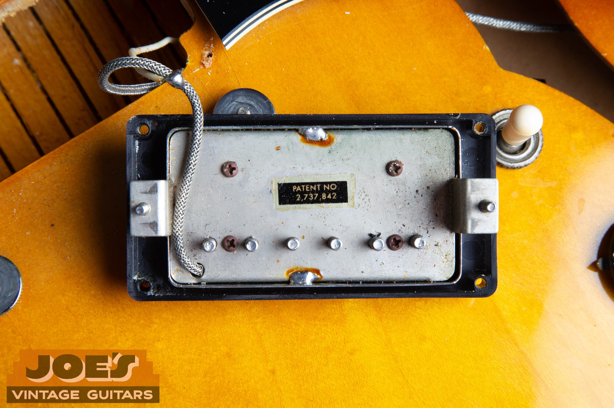

A patent number pickup on the bench. Same nickel silver baseplate, same braided lead, same construction as a late PAF. The only visible difference is the sticker, and the number on it belongs to a tailpiece patent, not the pickup patent. Gibson never corrected it.

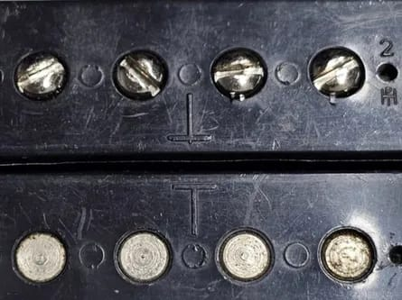

The raised T on the bobbin tops that names the T-top era, roughly 1966 into the late 1970s. You can only see it with the cover off, which is one more reason the sticker and the guitar around the pickup carry so much of the dating work.

One more piece of context worth having: the same era that ended the PAF also ended the first golden age of Gibson production. The [shipping totals](/post/gibson-shipping-totals-1948-1979/) tell that story in numbers, and they explain why pickups from a few narrow years carry so much of the market's attention.

<h2 id="paf-anatomy">What Is Inside a PAF</h2>

You should never open a sealed pickup, so here is the next best thing: the full tour, photographed from examples that were already apart when they reached us. Knowing the anatomy is not trivia. Every authentication tell in the sections that follow traces back to one of these parts.

Start from the bottom. The foundation is a **baseplate** stamped from nickel silver, an alloy of copper, nickel, and zinc that machines cleanly, solders beautifully, and stays magnetically transparent so it does not choke the pickup's field. The plate carries two threaded **legs** at the ends for the height adjustment screws, and on top of it sit two **bobbins** molded from butyrate plastic. One coil carries six adjustable **pole screws** with slotted fillister heads, threaded 5-40. The other carries six solid steel **slugs** pressed into the bobbin. Under the bobbins lies a single **bar magnet**, sand cast alnico, rough as a sidewalk on its faces because Gibson never polished them. A steel **keeper bar** ties the screw coil's poles into the magnet's field, and a strip of **maple** spaces the assembly, actual wood inside the most valuable pickup on earth. Each coil is wound with roughly five thousand turns of hair fine 42 gauge magnet wire, the coil tails exit through black sleeving, the joint to the braided output lead is wrapped in cloth, and a nickel silver **cover** closes over everything, tacked to the baseplate with two solder joints.

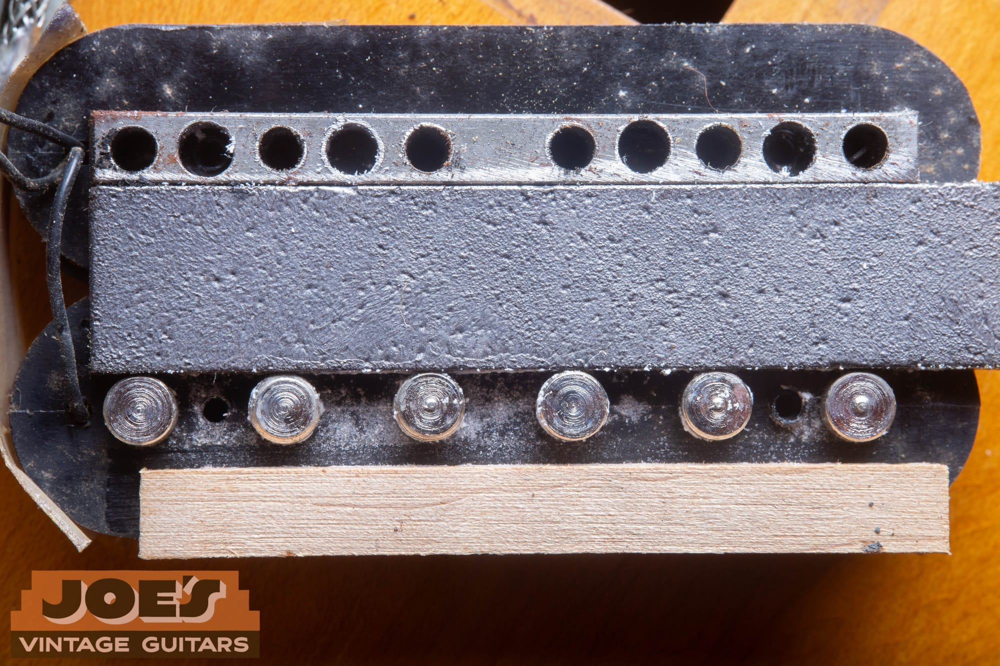

The heart of the pickup, photographed on a unit that came to us already apart. The long grey bar with the rough, pitted surface is the sand cast alnico magnet. Above it sits the drilled steel keeper bar, below it the pole screws coming through the screw bobbin, and at the bottom edge the maple spacer strip. That rough magnet face and that piece of raw wood are exactly what the factory shipped.

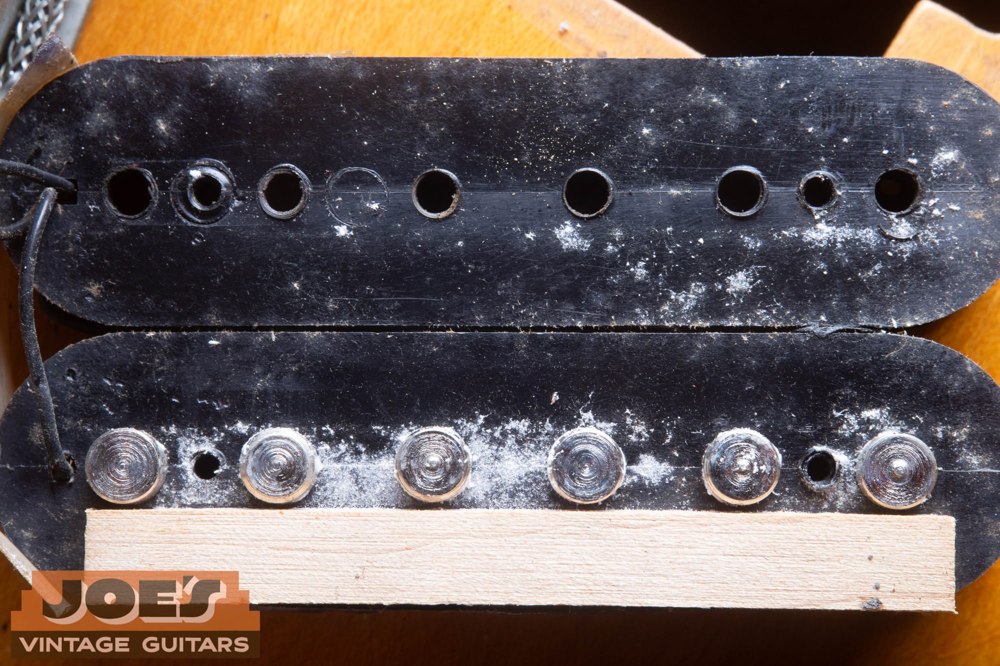

The two coils of the same pickup seen from below, slug coil above and screw coil below, still joined by their black sleeved leads, with the maple spacer along the bottom. Note the small extra tooling holes between the pole positions. Details like these date a bobbin at a glance for someone who has handled hundreds of them.

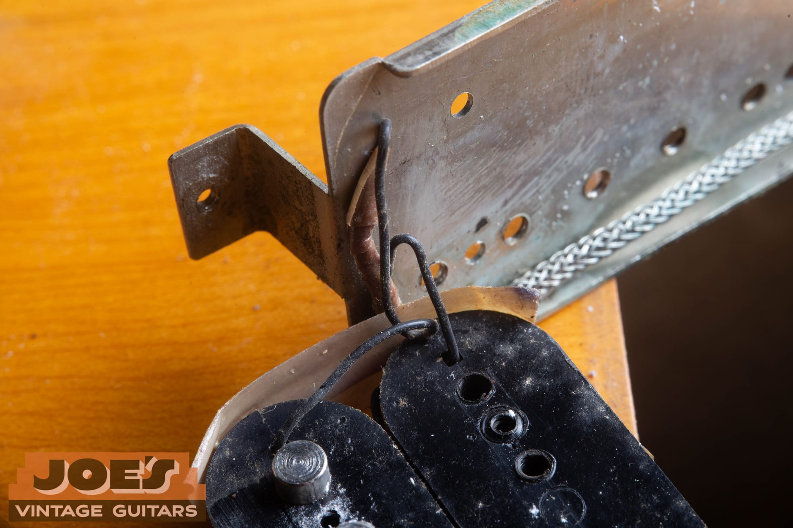

The wiring side of an opened example. The single conductor braided shield lead solders to the plate, the splice to the coil tails hides under that brown cloth wrap, and the black coil lead passes through a hole in the bobbin corner as a strain relief. Fragile, simple, and completely distinctive. A four conductor lead or plastic insulated hookup wire has no business on a vintage Gibson humbucker.

Two constructions details matter enough to call out on their own. First, PAFs were never wax potted. Gibson did not dip these coils, so an original pickup shows no wax residue anywhere, and a "vintage" pickup with wax bloom around the bobbins has been serviced or is not what it claims to be. Second, nothing inside was matched or sorted. Magnet grades, coil turns, and wire tension all drifted unit to unit, which is why no two PAFs measure alike and why the myth of one single "PAF sound" does not survive contact with a pile of real ones.

<h2 id="paf-sound">Why PAFs Sound the Way They Do</h2>

The PAF mystique is real, but it is not magic. It is a short list of physical facts, and most of them were accidents.

The coils were wound on Leesona winding machines whose automatic stops were unreliable, so operators eyeballed it. Coils came out anywhere from underwound to visibly overstuffed, and the two coils in one pickup rarely match. A mismatched humbucker cancels a little less hum and a little less signal, which leaves more high end and a more open, vocal midrange than a perfectly matched pickup. The magnets were whatever sand cast alnico Gibson's suppliers delivered, grades two through five mixed freely in the PAF years before settling on alnico five, and each grade pushes the attack and compression a different direction. The plain enamel wire has slightly different insulation thickness than modern coatings, which changes the coil's capacitance, which moves the resonant peak the ear reads as "airy." No potting means the cover and coils can flutter microscopically with the string, adding a touch of liveliness potted pickups do not have. And the magnets often read weaker than modern fully charged bars, though not for the reason the folklore gives. Measurements on surviving examples suggest old alnico holds its charge remarkably well, and the softness collectors hear traces mostly to Gibson's own charging rig, which regularly left bars short of full saturation on the day they were made. Time gets the credit. The factory earned it.

Add it up and you get the practical truth we tell customers: PAFs range from good to spectacular, patent numbers overlap them almost completely, and the label on the bottom has far more effect on the price than on the tone.

<h2 id="paf-players">The Players Who Made the Legend</h2>

The reason a wire coil costs five figures is the records it made. Eric Clapton's 1966 Bluesbreakers sessions with a sunburst Les Paul into a Marshall defined the rock guitar sound and sent every serious player hunting for a PAF Les Paul. Mike Bloomfield did the same for American players once his own sunburst Les Paul arrived in 1967. Jimmy Page cut most of the first Led Zeppelin record on a Telecaster, then spent the rest of the catalog on the PAF loaded Les Paul the whole world pictures him with. Duane Allman's slide voice and Paul Kossoff's vibrato were PAF humbuckers into loud amps, and by the mid 1970s the pickups had a reputation, a nickname, and a market of their own. Allman even moved his favorite set from one Les Paul to the next when he traded guitars, which tells you players knew exactly where the sound lived. Players pulled them out of unfashionable archtops to stuff into Les Pauls, which is why so many loose examples exist at all, and why so many big hollow bodies from the era now wear replacements. That history lives on in a legal footnote too: the trademark on the term "PAF" for pickups has belonged to DiMarzio since the late 1970s, which is why Gibson's own reissue pickups carry names like Burstbucker and 57 Classic rather than the name everyone actually uses. Gibson has been challenging that registration in recent years, so sixty years on, even the name is still being fought over.

<h2 id="paf-guitar">Start with the Guitar, Not the Pickup</h2>

Now the bench work. The first rule of pickup authentication is that a pickup almost never walks in alone. It arrives in a guitar, and the guitar is a witness with a long memory. Before we look at the pickup at all, we read everything around it.

Does the guitar's year match the pickup story? PAFs belong on Gibsons from 1957 into 1962, with leftovers stretching into 1963 and gold cover examples lingering a bit later on low volume models. Our [Gibson serial number guide](/how-to-read-gibson-serial-numbers/) dates the guitar itself. Then the harness: are the pot codes period correct, and is the solder at the pots undisturbed? A pickup can be swapped in thirty minutes, but the trip leaves tracks at the switch, the pots, and the pickup cavity, and fresh solder anywhere in the signal path means the burden of proof goes up. Are the pickup rings correct and unswapped? Are the height screws and springs old? Does the routing show extra holes, chisel marks, or oversized cavities? On a 335 style guitar, does the harness look like it has ever been fished out through the f-hole?

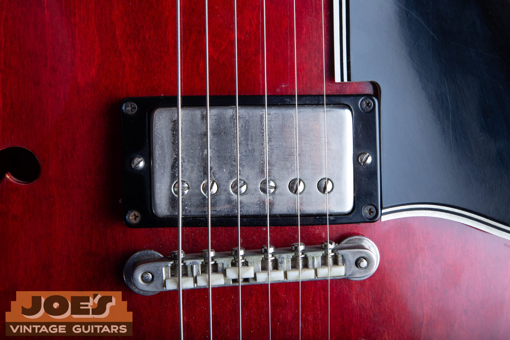

The view we start from: the pickup sitting in its guitar, cover on, everything in context. Soft grey nickel plating, correct ring, correct hardware around it, and a guitar whose serial number and features all agree. Most authentication work happens right here, before anyone touches a screwdriver.

A pickup with no guitar can absolutely be authenticated, but it starts with one strike against it, because provenance is evidence and a loose pickup has none. That is also why we tell sellers never to part a guitar out. An original guitar is worth more than the sum of its harvested pieces, and the pickups themselves are worth more with the guitar vouching for them.

<h2 id="paf-covers">Covers, Solder, and Patina</h2>

The cover is the pickup's face and its seal. Original covers are nickel silver, drawn and formed, then nickel plated in the PAF and early patent years, gold plated on gold hardware guitars, and chrome plated from around 1965. Each finish ages its own way, and the aging is the tell.

Old nickel goes soft, warm, and slightly grey, hazing rather than mirror shining. Chrome stays hard, bright, and blue tinted for decades. Gold wears through at the pick zone and shows the silvery nickel silver beneath it. That last detail matters more than it sounds: cheap reproduction covers are stamped from brass, and when their plating wears, the metal peeking through is yellow. Yellow wear through on a "nickel" cover is a two second fake catch. Real nickel silver wears through silver into silver.

Then turn the pickup over, or better, look at it in the guitar with a mirror, and study the two solder joints that tack the cover to the baseplate.

Sixty year old factory solder. It is dull, grey, slightly grainy, and ringed with a halo of brown flux that has darkened with age. Solder oxidizes slowly and evenly, and this look cannot be faked convincingly, only imitated badly with heat and dirt.

Factory joints were quick production tacks: modest blobs, sometimes a little sloppy, applied by someone doing hundreds a day. What they are not is shiny. Fresh solder is bright silver and smooth, and stays visibly newer than its surroundings for many years. Shiny joints, doubled joints where new solder sits on old, heat rainbow discoloration on the plate, or flux that looks wet all say the cover has been off. The hero photo at the top of this article shows the other extreme, a baseplate wearing heavy oxidation and even green verdigris around the joints. That green bloom is copper corrosion from the nickel silver alloy, it takes decades of case humidity to grow, and to a dealer it reads as a wax seal on an envelope: nobody has been in here.

Be honest about what an opened cover means, in both directions. It is not proof of fraud. Players resoldered covers after coil taps, repairs, and simple curiosity for decades, and plenty of genuine PAFs have been opened. It simply removes the best evidence and moves the whole authentication onto the remaining tells, and it takes the sealed premium off the price. What an opened cover should always do is slow the purchase down.

<h2 id="paf-sticker">Reading the Sticker</h2>

The decal is the most famous authentication point and the least trustworthy one, because it is the easiest to fake. Reproduction PAF decals cost a few dollars, and any pickup, vintage or modern, can wear one in thirty seconds. So we read the sticker the way a document examiner reads a signature: less for what it says than for how it sits.

Originals are water slide decals, not vinyl stickers. The black rectangle carries gold lettering, "PATENT" over "APPLIED FOR" on the PAF version, "PATENT NO" over "2,737,842" on the patent number version, and the printed rectangle rides on a thin clear carrier film that extends past the black edge. Age yellows and dulls that clear film, so on an original you can usually see a faint amber halo around the black, with the film edge going ragged or lifting in tiny flakes at the corners. A repro tends to sit proud, glossy, and perfect, with edges that look cut rather than aged, black that reads jet black instead of softened charcoal, and gold that sparkles. Two specifics catch most modern fakes. Original lettering was silkscreened through a coarse mesh, so the gold sits slightly raised and the loops of letters like A, P, D, and R often fill in partway, a flaw the factory never fixed. And the original border is nothing but that aged clear film, so a decal printed with a tidy gold border frame is a reproduction, full stop.

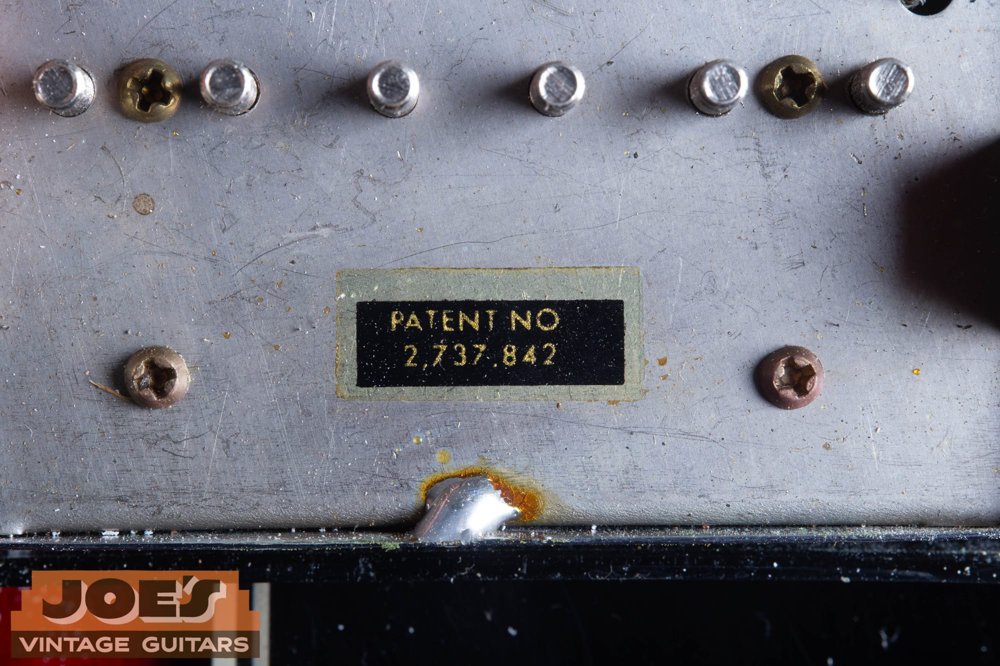

An original patent number decal under the macro lens. Look at the aged clear film extending around the black rectangle, the soft edges, and the way six decades of grime have settled evenly across sticker and plate alike. On the originals that cross our bench, the second separator in the number reads as a period rather than a comma, one of those tiny typographic quirks that a fake printed from a modern retype often gets wrong.

Placement tells a story too. These decals were applied by hand at production speed, so originals sit a little off center, a little crooked, sometimes crowding the screws or the sticker of a neighboring era. Perfectly squared placement is not proof of anything, but combined with a too fresh look it leans the wrong way. The other detail we check is what the sticker sits on. A decal applied at the factory in 1959 has the same dirt on top of it as the plate around it. A decal applied last year sits on top of sixty years of grime, and under magnification that layering is visible: clean under the sticker's edges, dirty around it, or a sticker surface suspiciously cleaner than the plate one millimeter away.

Remember the two structural facts from the history section, because they filter fantasy fakes instantly. No genuine Gibson decal shows the humbucker's real patent number, 2,896,491, and no genuine PAF decal wording deviates from "PATENT APPLIED FOR." And remember the era logic: a PAF decal on a pickup whose every other feature says 1964 is not a bonus, it is a contradiction, and contradictions on the bench almost always resolve to a re-sticker.

<h2 id="paf-base">The Baseplate, Screws, and Legs</h2>

Flip the pickup, or study seller photos of the underside, and the baseplate offers a whole second layer of tells that are much harder to fake than a decal.

The plate itself should be nickel silver, with the soft grey look of the covers and the same honest aging: haze, fine scratches from a lifetime of height adjustments, oxidation in the corners, sometimes that green verdigris bloom. The surface carries long, even, parallel brushing marks from the factory's metal finishing, running the length of the plate, aged to the same patina as everything else. Do not panic when you see them.

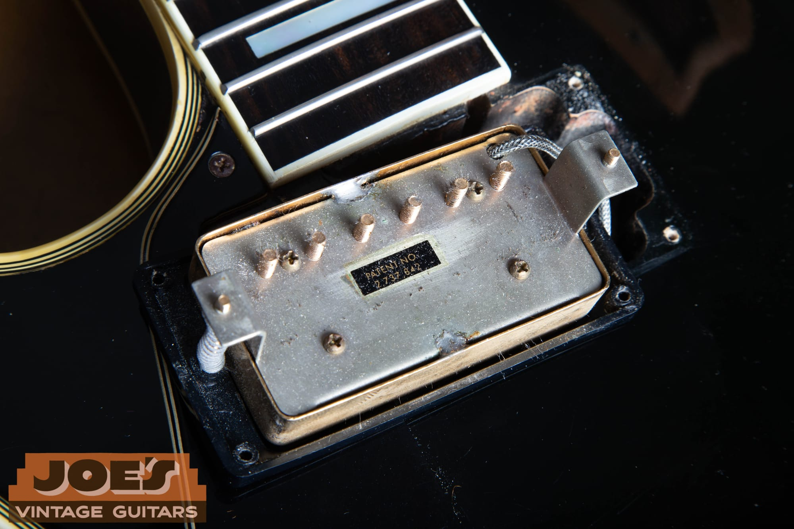

A gold cover patent number pickup off a black Les Paul Custom. The long parallel lines across the plate are factory surface finishing, applied before the parts were assembled and aged evenly ever since. What you never want to see is the other kind of abrasion: fresh, bright, localized grinding, especially in the center of the plate where a later Gibson embossing would sit. That is the signature of someone erasing a pickup's real identity before applying a fake sticker.

The screws deserve a close look, and here is a detail that surprises people who learned their lore from forums: on genuine examples the four small screws that clamp the bobbins to the plate are Phillips head, and that is factory, brass on the earliest pickups because brass is magnetically invisible, steel from around 1961. The six adjustable pole screws on the face are another matter. Those are slotted fillister head screws, threaded 5-40, on every vintage Gibson humbucker from this era, with nickel or gold plating to match the cover. Phillips or hex pole screws, metric threads, or pole spacing far from Gibson's roughly 49 millimeter E to E spread all point to an import or a replacement, with one caveat: a few vintage archtop models used a slightly narrower spread, so an odd measurement on a jazz box deserves research before judgment.

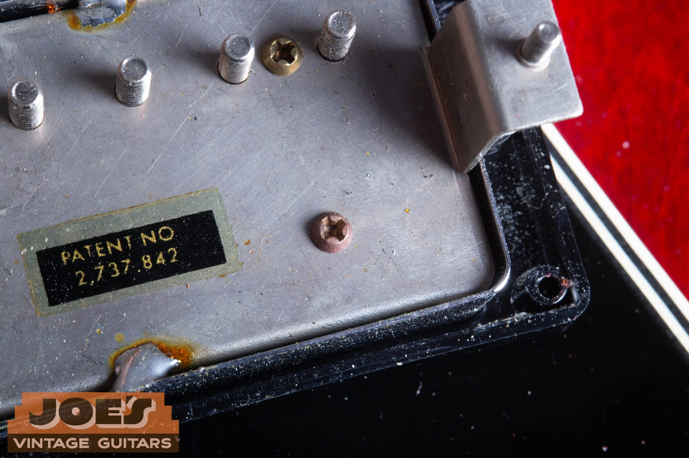

The underside forest: pole screw ends coming through, the small Phillips bobbin screws in their factory positions, and the threaded mounting leg at the edge. Screw plating varies and ages, and replacement screws betray themselves with bright threads in old holes.

The legs, the L shaped brackets at each end that carry the height screws, hold two lessons. First, the Kalamazoo stamping jigs left small L shaped die marks and rough shear texture on genuine plates, and collectors treat those little scars as a recognized authentication point. Second, originals are long legged. The short leg baseplates sold today are a modern adaptation for shallow routed guitars, so a short leg plate under a claimed vintage pickup means a repro or a reworked base. Either way, the legs should carry the same age as the plate they extend from.

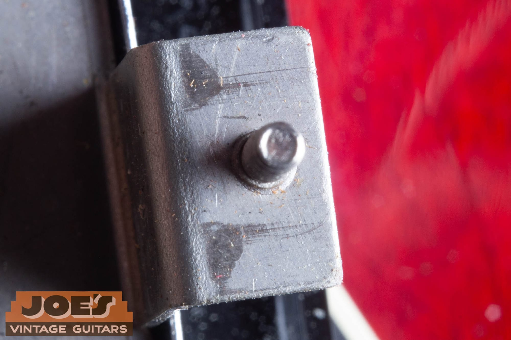

A mounting leg under the macro lens. Rough shear texture, honest scratches, and the small die marks Kalamazoo's stamping tools left behind. Vintage Gibson metalwork is production work, and its imperfection is part of its fingerprint. A plate with no tool marks at all is usually a modern part wearing an old story.

Finally, the lead wire. Original output leads are single conductor with a stranded core inside a woven metal braid shield, cloth and enamel era construction all the way. The braid should be dull silver grey with age, and the lead should be long enough to reach the controls it was born to reach: roughly a foot or more on most models, longer on big archtops. Cut short leads mean a pickup was removed from something, spliced leads mean service history, and a modern plastic jacketed or four conductor lead means the pickup is not wearing its original wiring at all.

<h2 id="paf-rings">Mounting Rings and Their Stamps</h2>

The cream and black plastic rings that frame these pickups are collectible in their own right, they carry their own forensic details, and they are one more place where the parts around a pickup can vouch for it or contradict it.

Vintage Gibson humbucker rings from this era are butyrate plastic, and the classic cream rings collectors call M-69s carry that name molded right into the plastic. Turn a ring over and the underside is a little museum of production marks.

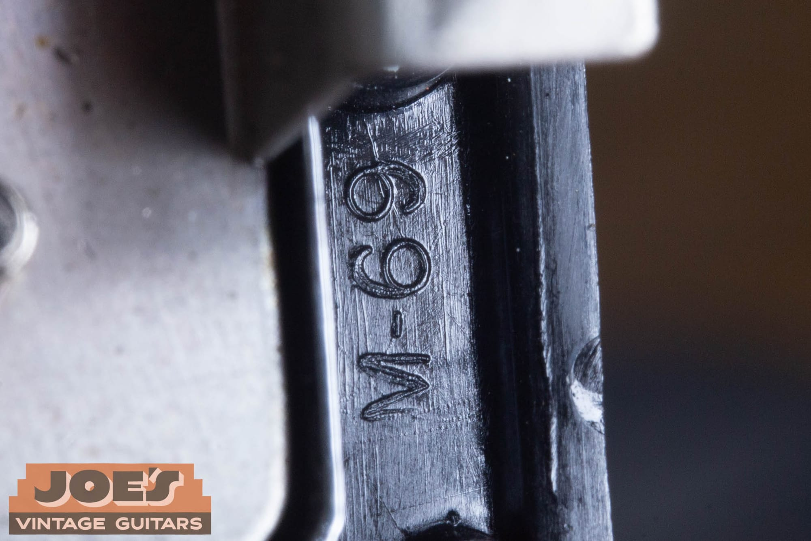

The M-69 designation molded into the underside of an original ring. The mold texture, the lettering, and the aged plastic around it are all part of the read, and on genuine rings the left leg of the M is characteristically weak or broken in the mold, a factory flaw that took the fakers years to notice. Reproductions of this exact marking exist, so the M-69 alone proves nothing, but a fake ring rarely gets the whole underside right.

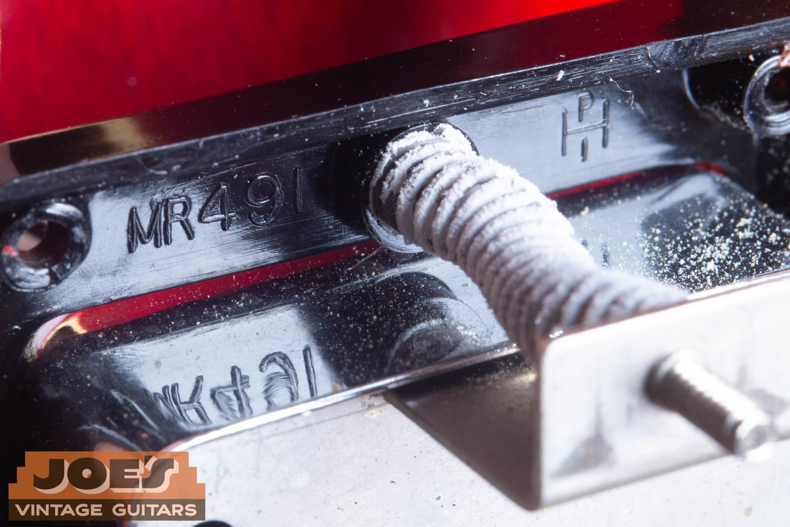

MR 491 molded inside another original ring. MR 491 identifies the thinner neck ring and MR 490 the taller bridge ring, and finding each where it belongs, with matching age, is one more quiet confirmation that a guitar's parts grew old together.

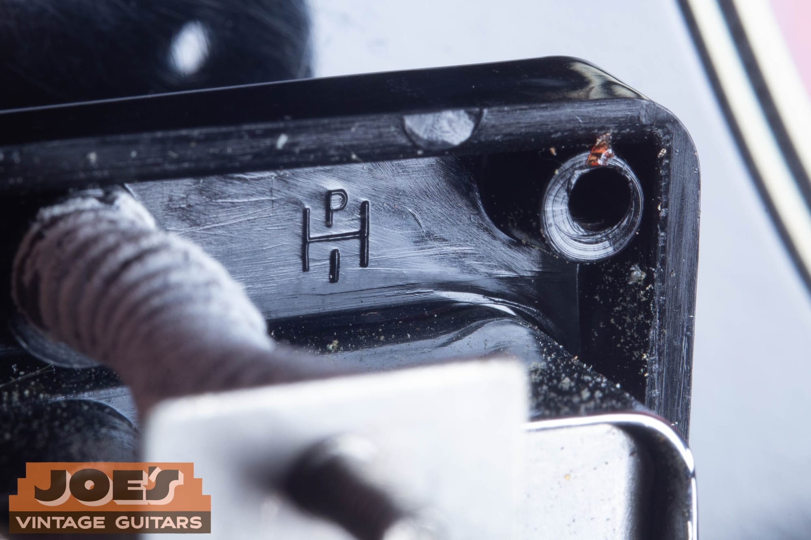

Small molded letters inside a ring underside. Mold cavity and inspection marks like these were never meant for customers to see, which is exactly why they help: fakers copy what buyers look for, and these are details most buyers never look for.

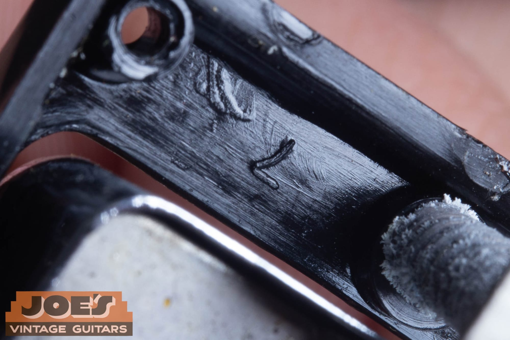

A single stamped figure on a ring underside, reading as a 7 from this side. Individual cavity numbers vary ring to ring, and that variety is normal. What should not vary is the aging: the plastic, the stamps, and the screw holes should all look like they have spent the same sixty years together.

Beyond the markings, read the rings the way you read the covers. Butyrate shrinks and goes brittle with age, so original rings often show shrink cracks at the corners and around the screw holes, and their cream color deepens unevenly. Old butyrate also fluoresces differently under a blacklight than modern plastic, which is one of the quiet tools of the expert trade. Bright, uniform, flexible rings on a claimed 1959 guitar deserve a question. So do ring screws: originals age like every other screw on the guitar, and a ring full of bright screws has been off recently, which is not damning but belongs in the story the seller tells you.

<h2 id="paf-electric">The Meter and the Magnet: Tests with No Screwdriver</h2>

Two tools take the authentication further without touching a solder joint: a multimeter and something that senses magnetic polarity. Both are safe, and both are routinely oversold, so here is what they actually prove.

**DC resistance.** With the pickup's leads accessible at the pots or switch, or with the pickup unplugged from the harness by a tech who knows what they are doing, a meter reads the coils' total resistance. PAF era coils, wound to no consistent count, read anywhere from about 7.0k to 9.5k ohms, with most falling between 7.5k and 8.5k and the outliers earning bragging rights. Early patent numbers read in the same band. Once the poly wire and reliable winder stops arrive during 1963, readings tighten to a narrow band around 7.4k to 7.8k, and a pickup that reads dead on 7.5k with its mates reading the same is telling you it comes from the consistent era, not the wild one. Temperature moves these numbers, meters differ, and a rewound coil can be wound to any target a faker likes, so DCR can support a story but can never prove one. What it can do is catch problems: a reading of zero or infinity means a dead coil, and a claimed PAF reading 13k was rewound for somebody's hot rod project decades ago.

**Polarity and strength.** A compass, a polarity tester app, or a cheap magnetometer held over the poles tells you which way the magnet points and roughly how strong the field is, all through the cover. Vintage Gibson humbuckers follow known polarity conventions, and a pair that fights itself when combined has a story to tell. A gauss reading meaningfully hotter than vintage norms suggests a replaced modern magnet even when everything else looks right. Treat these as expert corroboration tools: useful data points, never a verdict.

And this is the natural place to repeat the warning, because the next test people reach for after the meter is the screwdriver. The magnet's length, its grade, the wire color, and the coil condition are all real evidence, and every one of them lives behind those two solder joints. Opening the pickup to check them trades a permanent chunk of value for information a professional can establish in context without you taking the risk. Do not do it. If a buyer insists a pickup must be opened before sale, that is a conversation for a qualified dealer or luthier to handle, documented, with the owner's informed consent, not a Tuesday night project.

<h2 id="paf-open">If the Covers Are Already Off</h2>

Plenty of vintage Gibsons lost their covers in the 1960s and 1970s, when players chased treble and Clapton's uncovered look, and plenty of loose pickups come to market open. On those, and only on those, the bobbin details become readable without anyone disturbing anything, and they are wonderfully specific.

**Bobbin color.** Black is standard across all eras. For a stretch from the spring of 1959 into mid 1960, Gibson's bobbin supplier ran short of black material and shipped cream colored butyrate instead, mixed into production as it came. On zebras the cream bobbin is almost always the slug coil, one of those patterns you only learn from handling a lot of them. A pickup with two cream bobbins is a double white, one of each is a zebra, and the combination was pure chance on the assembly bench. The cream should look like sixty year old plastic: warm, unevenly mellowed, often grubby in the corners. Chalk white, uniform bobbins are modern. This tiny pigment hiccup is the single most expensive cosmetic accident in guitar history, as the value section will show.

**The tooling marks.** From 1957 through the early patent number years, the bobbin tops carry a small square tooling hole with a molded circle around it, the circle in a square that collectors treat as the signature of PAF style bobbins. Around 1965 the molds change to a flatter bobbin with no tooling hole at all, and by 1966 or 1967 they change again to carry the raised T of the T-top. The sequence circled square, plain top, T is one of the most reliable bobbin dating tools there is, precisely because nobody at Gibson ever thought a customer would care.

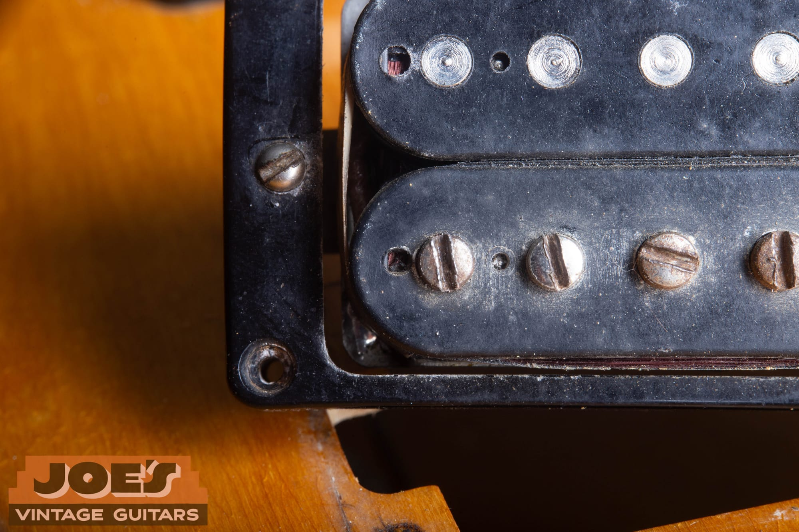

An uncovered pickup in a guitar, no disassembly required. On the slug coil you can see the small square tooling hole with the faint molded circle around it, the classic circle in a square of PAF style bobbins. On the screw coil, the slotted fillister pole screws sit in their aged plating, and the slug faces show the concentric bull's eye machining rings of vintage steel slugs. Details like these are why an already open pickup is not a tragedy: it trades its seal for a window.

**The wire itself.** Through the tooling holes and along the coil edges, the winding wire shows its color. Plain enamel, used through the PAF years and into about 1963, reads dark purple brown, the famous purple windings. Polyurethane wire reads orange red. The wire should look hand tensioned and slightly irregular, and it should show no wax. A dead even, machine perfect coil glistening with potting wax was wound recently, whatever the sticker on the bottom claims.

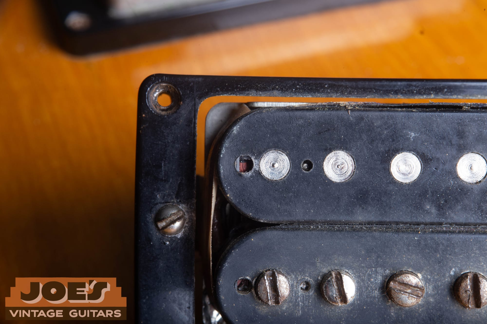

Purple where it counts. Through the square tooling hole you can glimpse the plain enamel wire's purple brown color, the PAF and early patent signature. Orange wire in this window moves the pickup to 1963 or later, and no amount of paperwork argues with the wire.

Two more open pickup details earn their keep. The coil tails leave the bobbins in black sleeving on both coils in the PAF years, and a white sleeved tail points to the mid 1960s or later. And old butyrate has a smell, a sour note collectors compare to spoiled milk, that modern bobbin plastic does not have. Nobody should buy a pickup by nose, but on the bench, every consistent detail counts.

Treat an open pickup's evidence with respect and its condition with more. Those coils are unprotected, the wire breaks at a touch, and the right move with an uncovered vintage humbucker is to look, photograph, and leave it alone. Do not poke the windings, do not test fit covers on it, and do not ship it loose in a parts bag.

<h2 id="paf-fakes">Fakes, Re-Stickers, and Franken-PAFs</h2>

Everything above describes honest pickups. Here is what dishonest ones look like, in rough order of how often we see them.

- **The re-sticker.** The classic, because it is cheap and hard to catch. Take a later Gibson pickup, a patent number or a T-top, and apply a reproduction PAF decal. The pickup is genuinely vintage Gibson, the parts genuinely old, and the sticker adds thousands of dollars of lie. Early patent numbers re-stickered as PAFs are nearly perfect fakes, since the pickups really are nearly identical, which is why undisturbed solder and coherent aging around the decal matter so much. Check for ghosts too: residue, a rectangular clean patch, or the corner of an older patent sticker peeking from under a fresh PAF decal, and always read a pair together, because fakers rarely fake two pickups equally well. T-tops re-stickered as PAFs fail faster: chrome covers, orange wire at the coils, white bobbin leads, and T molds if the cover ever comes off.
- **The erased base.** Later Gibson pickups with stamped or embossed baseplates get their markings ground off before the fake sticker goes on. The grinding leaves fresh abrasion in a specific place, the center of the plate, cutting through decades of patina. This is why the factory brushing marks photo above matters: learn what honest factory texture looks like, and the eraser's work jumps out.
- **The boutique pass-off.** Modern PAF replicas from respected makers are honest products, sold as replicas, often astonishingly faithful, sometimes with aged covers and period style decals of their own design. In dishonest hands, one becomes a "vintage PAF" with a price to match. Tells: metalwork that is too clean under superficial aging, artificial patina that sits on top of surfaces instead of growing out of them, modern machine consistency in the coils, and paperwork that starts and ends with a story.
- **The rewind.** A real PAF shell around freshly wound coils. Sometimes it is honest repair history disclosed up front, and priced accordingly. Sometimes it is silent. Fresh coil wire color, new coil tape, disturbed lead splices, wax where no wax belongs, and DCR readings that fit modern taste better than vintage chance are the flags, and several of them are only visible because the cover is off or the pickup was documented during service. A rewound PAF is worth a fraction of an original one, which is also worth remembering as a warning: a botched home opening is how originals become rewind candidates.
- **The full counterfeit.** Import humbuckers dressed in repro stickers and aged covers. These fail on everything: brass baseplates that pull a magnet or wear through yellow, metric threads, wrong pole spacing, wrong lead wire, decals with wrong fonts or the humbucker's real patent number, weights and dimensions that miss the originals. They fool buyers who check only the sticker, which is the whole reason this guide keeps repeating that the sticker is the least reliable tell on the pickup.
- **The franken-pair.** Two real pickups, or one real and one fake, sold as an original matched set from one guitar. Real matched pairs show consistent aging, both leads uncut at sensible lengths, and complementary polarity. Mismatched grime, one bright lead and one dark, or two pickups that hum together in the middle switch position tell you the "pair" met each other last month.

The unifying defense is the one this whole guide teaches: never authenticate on one feature. A real pickup tells one coherent story across the cover, the solder, the sticker, the plate, the screws, the lead, the rings, the meter, and the guitar around it. Fakes always contradict themselves somewhere, because faking every detail at once, coherently, is nearly impossible. Your job is not to be a metallurgist. Your job is to notice when the story breaks.

<h2 id="paf-checklist">The PAF Authentication Checklist</h2>

Here is the bench sequence in one list you can run with a flashlight, a mirror, and a camera, in the order that risks nothing:

1. **The guitar.** Serial, features, and pot codes all match a 1957 to 1965 story. Harness solder undisturbed. No extra routing or holes under the pickups.
2. **The cover.** Nickel or gold for PAF and early patent years, chrome only from around 1965. Warm grey aging, no yellow wear through, dents honest, plating consistent with the guitar.
3. **The two tack joints.** Dull, grey, aged solder with darkened flux halos. No shine, no doubled blobs, no heat rainbows.
4. **The sticker.** Correct wording for the claimed era, water slide film halo, aged edges, dirt layered over it rather than under it, placement human rather than perfect.
5. **The baseplate.** Nickel silver with even factory brushing and honest patina. No localized fresh grinding, especially center plate. Verdigris and oxidation welcome.
6. **The screws.** Slotted fillister pole screws in 5-40 thread, factory Phillips bobbin screws underneath, aged plating throughout, roughly 49 millimeter pole spread.
7. **The lead.** Single conductor braided shield, aged braid, full length, no splices.
8. **The rings.** Correct type for the guitar, molded markings where they belong, shrinkage and aging consistent with the story.
9. **The meter.** DCR in the vintage band, sensible pair behavior, polarity as expected. Corroboration, not proof.
10. **The coherence test.** Every detail tells the same story. One contradiction is a question. Two is a problem. Three is a different pickup than advertised.

And the rule that stands over the whole list: nothing on it requires opening the pickup, because opening the pickup destroys evidence and value at the same time. When a situation genuinely calls for internal verification, that is a job for a professional, performed with documentation and the owner's consent, not a curiosity project.

<h2 id="paf-value">What PAF and Patent Number Pickups Are Worth</h2>

Now the money. The ranges below are our honest read of the current market for verified original pickups sold on their own, based on dealer asking prices, auction results, and what we see actually change hands. Asking prices on the open market run higher than sale prices, single exceptional examples break every rule, and a written range is a starting point rather than an appraisal. For what it does to a whole guitar, our [Les Paul market value guide](/vintage-gibson-les-paul-market-value-guide/) shows the same pickups moving five and six figure instruments.

| Pickup | Honest player example | Strong verified example |
| --- | --- | --- |
| PAF, double black, sticker intact | about $2,500 to $3,500 | about $3,500 to $5,500 |
| PAF, zebra | about $4,000 to $5,500 | about $5,500 to $7,000 |
| PAF, double white | about $6,000 to $8,000 | about $8,000 to $10,000 and up |
| 1957 no decal humbucker, expert verified | about $2,000 to $3,000 | about $3,000 to $4,000 |
| Patent number, 1962 to 1964, enamel wire | about $1,000 to $1,500 | about $1,500 to $2,200 |
| Patent number, 1964 to 1967, poly wire | about $500 to $800 | about $800 to $1,200 |
| T-top, sticker era, 1966 to mid 1970s | about $300 to $500 | about $500 to $800 |
| T-top, stamped base, 1970s | about $200 to $350 | about $350 to $550 |

A few notes that the table cannot carry. Long magnet PAFs from 1957 to early 1961 bring a premium over short magnet examples when the magnet status is documented, though for sealed pickups that documentation usually rests on the guitar's date rather than anyone looking inside. Matched pairs from one documented guitar bring more than two loose singles, often ten to twenty percent more. A clean double black pair, especially with its original harness, typically lands between eight and twelve thousand dollars, and a documented double white pair is the blue chip of the whole market, trading in the mid teens with dealer asks that can pass twenty thousand dollars. Gold cover examples track their nickel siblings, with clean gold earning a bump and heavy wear read as character rather than damage. Bobbin color, remember, is paint on the lily: a double white sounds like whatever it sounds like, exactly as a double black does, and the entire premium is rarity and looks.

The parts trade is real too, and one corner of it has gone wild. Original nickel covers sell for several hundred dollars on their own. Original cream M-69 mounting rings have become a market of their own, with singles trading in the low thousands and clean pairs asking five figures, while black rings bring far less but still real money. Even original braided lead wire finds buyers. That is worth knowing as a seller so nobody strips your pickup's value off in pieces, and as a buyer so you understand how easily a franken-PAF gets assembled from genuine parts.

On the downside, every alteration subtracts. An opened and resoldered but otherwise original pickup typically gives up ten to twenty five percent against a sealed equivalent. A missing cover costs less than people fear, five to ten percent on an otherwise honest pickup. Later wax potting costs ten to fifteen percent. Cut or spliced leads cost real money and slow the sale. A rewound PAF, honest shell and magnet around new coils, generally trades at half an original's price or less, softened somewhat when a respected rewinder did the work and documented it. And a pickup with a story that does not hold together sells for parts value, because that is what it is.

For the market's direction, the arc is simple. A loose PAF was a used part in the 1970s, a hot rod upgrade in the 1980s, and a four figure collectible by the 2000s. A decade and a half ago a good double black traded around two thousand dollars. Since the post 2020 vintage boom the market has roughly doubled, with asking prices running well ahead of documented sales the whole way up, which is exactly why we quote from real transactions rather than from the most optimistic listing on the internet. The long trend has run one direction for fifty years, driven by a supply that only shrinks. Every year more PAFs get opened, rewound, parted, or lost, and the sealed survivors get rarer.

<h2 id="paf-factors">What Moves the Price</h2>

When we appraise one of these pickups, the questions behind the number are always the same:

- **Is it sealed?** Undisturbed factory solder is the single biggest premium on the pickup market. It cannot be restored once lost, which is the financial half of the do not open rule.
- **What do the bobbins look like?** Double white, zebra, double black, in that order, purely on rarity and demand.
- **Long magnet or short?** Earlier construction brings more when the dating supports it.
- **Sticker present and honest?** A worn real decal beats a perfect suspicious one every time. On otherwise identical pickups the market treats the decal itself as a four figure feature, which is exactly why fakers chase it. A missing decal on a verified early pickup is survivable but costs ten to twenty percent.
- **What does the meter say?** Fair or not, hotter resistance readings bring stronger prices, and a documented reading taken at the lead, with nothing opened, helps a sale.
- **Full length original lead?** Length is originality you can measure with a ruler.
- **Pair or single?** Documented pairs from one guitar carry a premium. Singles are the normal market.
- **Provenance?** The guitar it came from, old photos, receipts, repair records with dates. Paper turns a good story into a strong price.
- **Condition of the unseen.** Dead coil, rewind, or repair history all move a pickup from the collector market to the player market at a fraction of the price.

<h2 id="paf-selling">Thinking of Selling</h2>

If you have one of these pickups, or a guitar that carries them, the most valuable thing you can do costs nothing: leave everything exactly as it is. Do not open the covers to peek at bobbin colors. Do not clean the baseplate, polish the cover, or straighten the sticker. Do not test fit it in another guitar. Every one of those helpful ideas subtracts money, and the pickup is worth the most exactly as it sits.

Then photograph it well and get a real appraisal. We buy PAF and patent number pickups and the guitars that carry them, we pay top dollar for honest examples, and we are straight with people about what they have, including when the news is not what a forum thread promised. Send photos through our [free appraisal page](/free-appraisal/): the pickup in the guitar, the underside if it is already accessible, the sticker, the solder joints, the lead, and the guitar's serial number. If you are weighing the bigger decision, our [sell my Gibson page](/sell-my-gibson-guitar/) walks through how we handle whole instruments, and the same honest process applies either way. You will get a number and the reasoning behind it, not a lowball and a hurry.

<h2 id="paf-faq">Frequently Asked Questions</h2>

**What does PAF stand for on a Gibson pickup?**

PAF stands for Patent Applied For, from the black and gold decal Gibson put on the underside of its humbucking pickups between about 1957 and late 1962, while Seth Lover's 1955 patent application was pending and for years after it was granted in 1959. The nickname became the collector name for the whole first generation of Gibson humbuckers.

**How can I tell if my pickup is a real PAF without taking it apart?**

Read the outside evidence as one story: the guitar's year and undisturbed harness, a nickel or gold cover with honest aging, dull grey factory solder at the two cover joints, a water slide decal with an aged clear film halo, a nickel silver baseplate with even factory brushing, slotted 5-40 pole screws, a braided single conductor lead at full length, and correct rings. A multimeter reading in the roughly 7.0k to 9.5k ohm vintage band supports the story. If every detail agrees, you very likely have the real thing, and a professional appraisal can confirm it from photos and an in person inspection without opening anything.

**Should I open my pickup to check the magnet or bobbin color?**

No. Unsoldering the cover permanently destroys the undisturbed factory solder that collectors pay the biggest premium for, it risks breaking coil wire that is thinner than a hair and sixty years old, and it converts a sealed collector pickup into an opened one at a real cost, often ten to twenty percent of its value. Magnet length, bobbin color, and wire color are expert questions that can be resolved in context, or documented professionally when there is a genuine reason. Curiosity is not a genuine reason.

**What is the difference between a PAF and a patent number pickup?**

The sticker, and eventually the details. In late 1962 Gibson replaced the Patent Applied For decal with one reading Patent No 2,737,842, which is actually the number of Les Paul's bridge and tailpiece patent, not the humbucker patent. The earliest patent number pickups are identical to late PAFs inside, with the same purple enamel wire and short alnico five magnet. During 1963 the coil wire changed to orange poly coated wire with consistent winding, around 1965 covers went from nickel to chrome, and by 1966 or 1967 the T-top bobbin arrived. Early patent number pickups deliver most of the PAF recipe for a fraction of the price.

**What is a real PAF worth today?**

As a broad current range for verified originals sold individually: double black PAFs run about $2,500 to $5,500, zebras about $4,000 to $7,000, and double whites about $6,000 to $10,000 and beyond, with sealed, undisturbed, documented examples at the top of each range and matched pairs bringing a premium over singles. Patent number pickups run from several hundred dollars for later examples to about $2,200 for the best early ones. Condition details move these numbers a lot, which is why a specific appraisal beats any table.

**Are patent number and T-top pickups worth anything?**

Yes. Early patent number pickups from 1962 to 1964 are the smart money of this market, PAF construction at $1,000 to $2,200. Mid 1960s poly wire examples bring roughly $500 to $1,200. T-tops from 1966 into the 1970s are honest vintage Gibson pickups in the $200 to $800 range and are factory correct for many valuable late 1960s and 1970s Gibsons, so they matter for restoration even when they are not the star.

**My pickup has no sticker. Is it fake?**

Not necessarily. The very first humbuckers of early 1957 left the factory with no decal at all, stickers on later pickups sometimes fell away or were removed, and a missing sticker on an otherwise coherent pickup is a discount rather than a disqualification. It does mean the rest of the evidence has to carry the whole case, so expert verification matters more, not less.

**Do double white or zebra PAFs sound different from double black ones?**

No. The bobbin color was a pigment supply accident at Gibson's plastics vendor around 1959 and 1960, and it has no effect on the magnetics or the coil. The enormous price difference is rarity and visual drama, full stop. Buy bobbin color with your eyes open: you are paying for looks and scarcity, and a double black can be the better sounding pickup on any given day.

