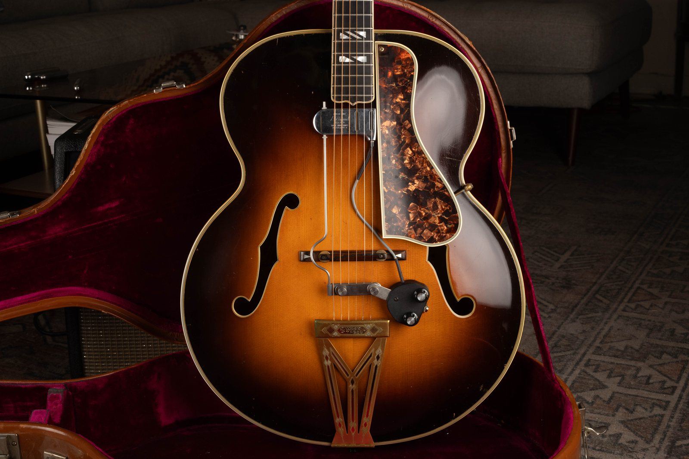
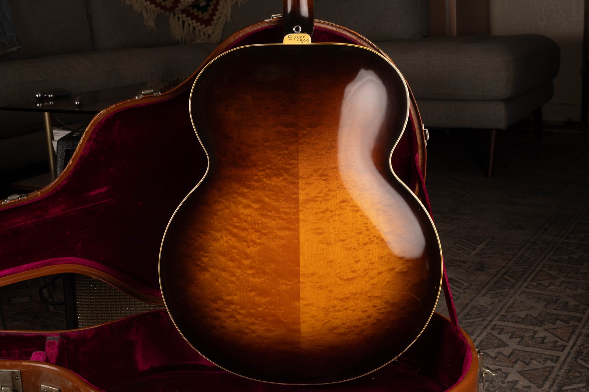
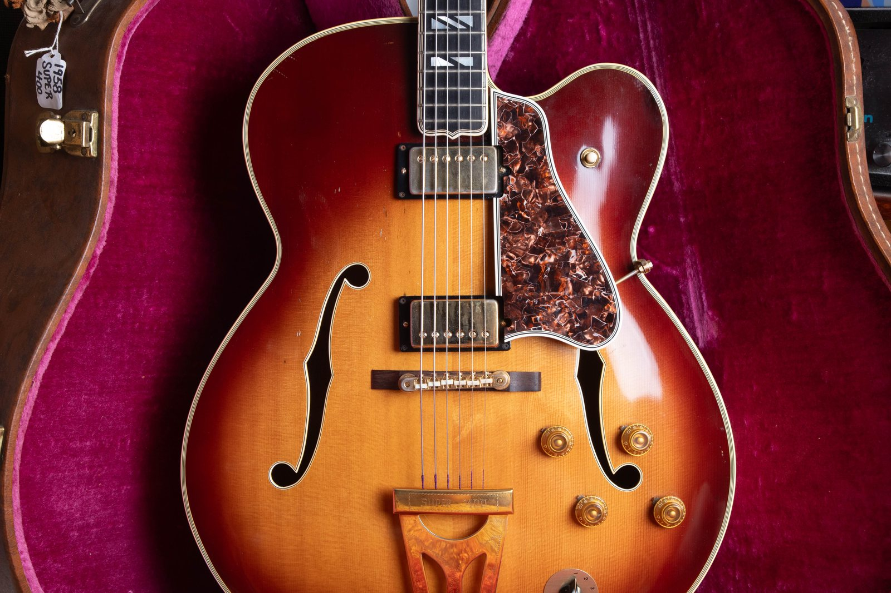
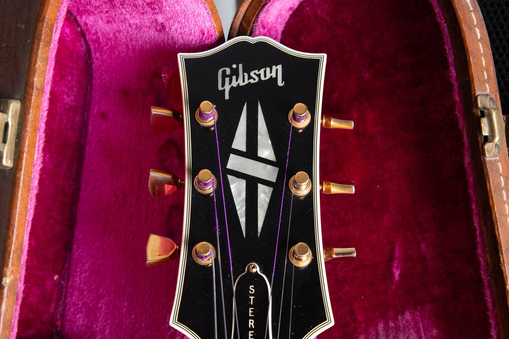
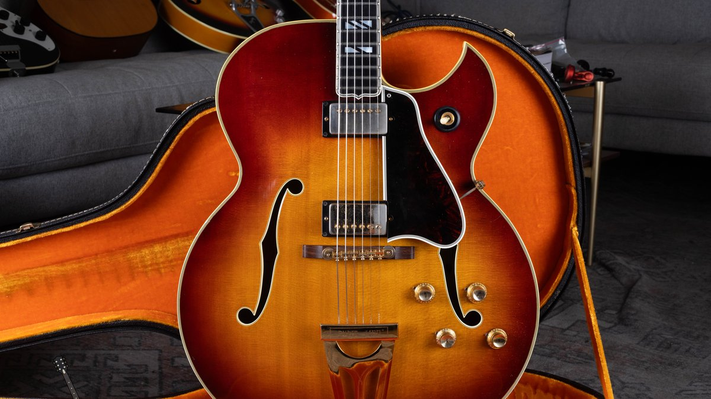
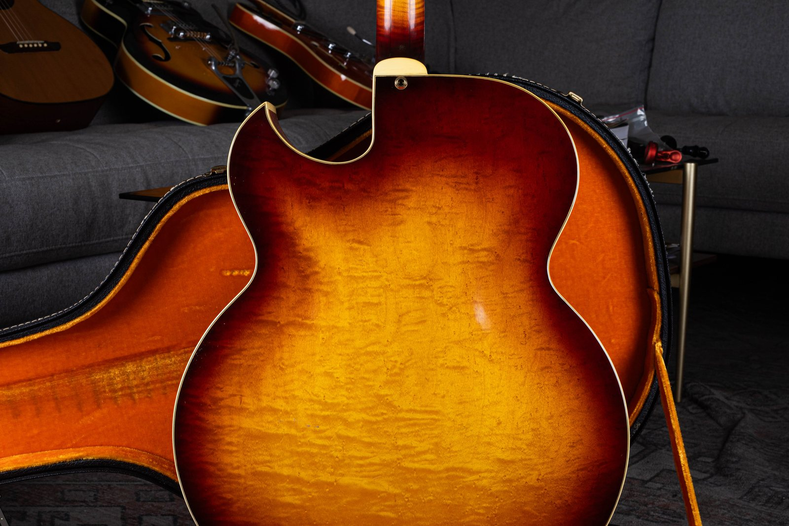
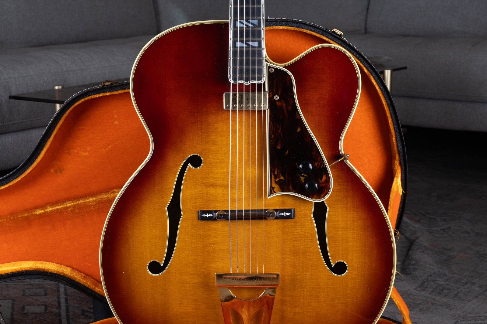
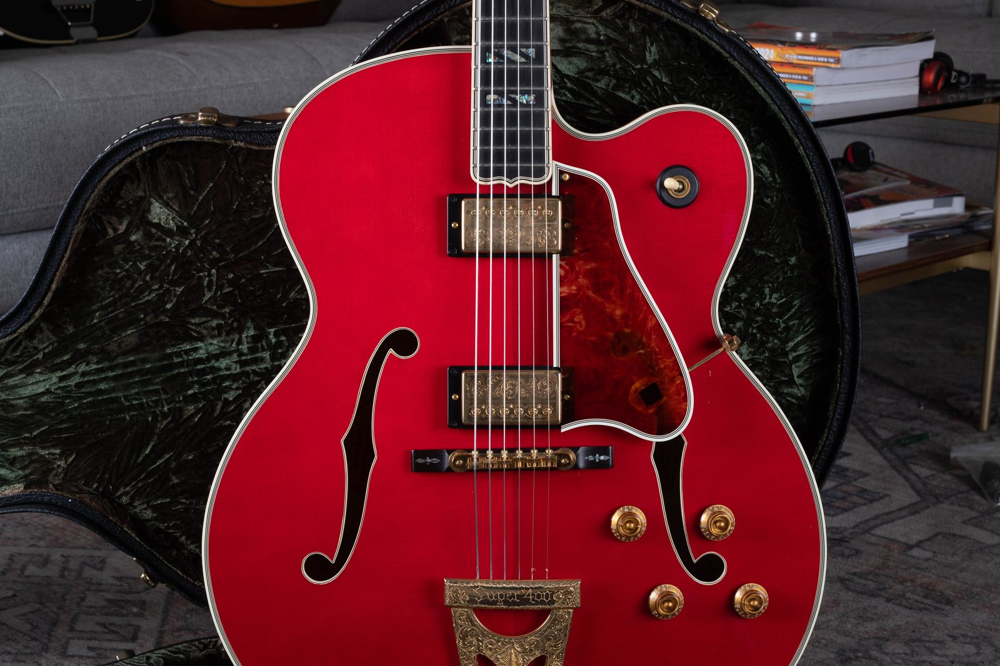
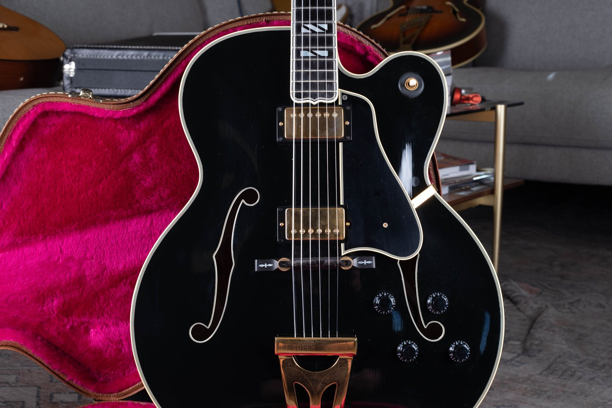

The Gibson Super 400 is an 18 inch carved archtop, named for its $400 list price when Kalamazoo introduced the acoustic in 1934. The Super 400 CES (Cutaway Electric Spanish) followed in 1951 with two factory pickups, and our [Gibson shipping totals](/post/gibson-shipping-totals-1948-1979/) show how scarce that first electric year was: 2 sunburst Super 400CES guitars, and no natural.

I buy Super 400s, L-5s, and ES-355s on purpose. The [Sell My Gibson Guitar](/sell-my-gibson-guitar/) page says so because these carved-tops are the top of the catalog, from anywhere in the country. This post stays on the Super 400 and Super 400 CES: history, year-by-year changes, how to date one, how to check yours, and dealer value as ranges. The photos below are guitars that came through the shop.

<figure>

<figcaption><strong>A 1938 Super 400</strong> with a floating DeArmond pickup. Those were popular in the early days of electric guitars, when players wanted to amplify an acoustic.</figcaption>
</figure>

If you want a year on the guitar in front of you while you read, keep the [Gibson serial number guide](/how-to-read-gibson-serial-numbers/) open. If you want a number on yours, send photos through the [free appraisal](/free-appraisal/) form.

<h2 id="quick-answer">The Short Version</h2>

If you only read one section, read this one.

| Question | Answer |
| --- | --- |
| **Introduced** | Acoustic Super 400 in 1934, named for the $400 list. Super 400 CES in 1951. |
| **Built where** | Kalamazoo, Michigan in the vintage years covered here. |
| **Body** | 18 inch lower bout. Gibson Custom lists 18 x 21 3/4 x 3 3/8 inches. Carved spruce top, maple back and sides. |
| **Scale** | 25 1/2 inches on Gibson Custom spec sheets and on a measured 1956 CES. |
| **Cutaway** | Non-cutaway acoustic last appears in our 1955 shipping column. Venetian (rounded) into about 1960. Florentine (pointed) from 1960. Venetian returns about 1969. |
| **CES pickups** | P-90s in 1951. Alnico V staple pickups from about 1953 until November 1957, when humbuckers start. |
| **Bridge** | Tune-o-matic first appears on the Super 400 CES in 1953 on Gibson Custom's history page. Some 1956 examples still left with a preset rosewood bridge. |
| **First year CES output** | 2 sunburst Super 400CES shipped in 1951. |
| **The year to know** | 1960, when the pointed Florentine cutaway lands on the Super 400 CES (same change as the L-5 CES, Byrdland, and ES-5 Switchmaster). |
| **The other year to know** | 1969: 120 sunburst and 45 natural Super 400CES shipped, the peak in our 1951 to 1969 table. |
| **2026 value** | Documented sold CES examples run about $7,400 to $18,500 depending on year and condition. Public asking often sits higher. See the value section for dated comps. |

<h2 id="history">What The Super 400 Is And Why 1934 Mattered</h2>

Kalamazoo put the Super 400 at the top of the archtop line in 1934 and priced it at $400, which is how the model got the name. It was the largest production guitar Gibson had built, 18 inches across the lower bout, with a carved spruce top, maple back and sides, an ebony board, and gold hardware. Early examples used a hand-engraved tailpiece, a hand-engraved finger rest support, and an "L-5 Super" truss rod cover before the cover reading changed to Super 400.

Gibson Custom's Super 400 CES history page lists a 1939 update that still shows up on later guitars: enlarged upper bout, enlarged f-holes, a new tailpiece closer to the L-5, and a Venetian cutaway option. That cutaway acoustic is the Super 400 Premier in period language, later sold as the Super 400c (C for cutaway). Our shipping tables first split Super 400c as its own line in 1950 (14 sunburst, 7 natural).

Gibson paused Super 400 production during World War II. Our Kalamazoo shipping ledgers resume in 1948 with 64 sunburst and 27 natural acoustic Super 400s. The non-cutaway acoustic then shrinks fast: 2 sunburst and 1 natural in 1955, which is the last year that column appears. The cutaway acoustic Super 400c keeps shipping after that, into the 1970s.

The Super 400 sits one inch wider than the [L-5 CES](/post/gibson-l5-ces-value-guide/), which is a 17 inch carved archtop with block inlays and a flowerpot headstock. That one-inch gap, plus split-block fingerboard markers and a split-diamond headstock inlay, is how you tell the two flagships apart across a room.

<figure>

<figcaption><strong>Same 1938 Super 400, maple back.</strong> Figured maple, Super 400 on the heel cap.</figcaption>
</figure>

<h2 id="ces-1951">The Super 400 CES Arrives In 1951</h2>

Gibson introduced the Super 400 CES in 1951 as a cutaway electric with two pickups mounted in the carved top, individual volume and tone for each pickup, and a three-way toggle. CES is Cutaway Electric Spanish. Gibson Custom's page calls this the first dual-pickup production model in the Gibson line with that control layout. A few Super 400s had been special-ordered with P-90s before the CES existed.

Our shipping table for Super 400CES starts in 1951 at 2 sunburst and a blank natural column. 1952 is the first year natural CES numbers appear: 7 sunburst and 11 natural. That is still tiny next to the L-5CES the same years (31 sunburst and 8 natural in 1951). The electric Super 400 stayed a low-volume guitar for most of the 1950s and early 1960s, then jumped in 1968 and 1969.

Gibson Custom describes a slightly thicker CES top than the acoustic, built to cut feedback under amplification. Wikipedia repeats the thicker-top point. I haven't measured the shop examples against an acoustic Super 400 on the bench for this draft, so treat "slightly thicker" as the published spec, then measure yours if the distinction matters to a sale.

The CES never dropped out of the line the way the non-cutaway acoustic did in 1955. Our CES shipping table runs through 1969. Gibson Custom still builds a late-1950s-style Super 400 CES (Venetian cutaway, two humbuckers, 18 x 21 3/4 x 3 3/8 inches, 25 1/2 inch scale, five-piece maple neck with walnut center strips). Wikipedia states the full acoustic Super 400 is no longer in the catalog.

<figure>

<figcaption><strong>A 1957 Super 400 CES.</strong> This one went back to the factory in the early 1960s to be refinished and converted to stereo.</figcaption>
</figure>

<figure>

<figcaption><strong>Same 1957 Super 400 CES.</strong> The STEREO truss rod cover is from that early-1960s factory conversion.</figcaption>
</figure>

<h2 id="evolution">Year By Year: What Changed And When</h2>

Treat every date as a window. Gibson used leftover parts, and mixed-spec guitars exist. Shipping numbers below are copied from our [Gibson shipping totals, 1948 to 1979](/post/gibson-shipping-totals-1948-1979/).

<h3 id="ces-shipping">Super 400CES Shipping Totals (1951 To 1969)</h3>

Copied from the live JVG table. These are shipping totals. They are the ledger, not a promise that every guitar built that year is in the ledger.

| Year | Sunburst | Natural |
| --- | ---: | ---: |
| Super 400CES 1951 | 2 |  |
| Super 400CES 1952 | 7 | 11 |
| Super 400CES 1953 | 16 | 11 |
| Super 400CES 1954 | 17 | 6 |
| Super 400CES 1955 | 5 | 16 |
| Super 400CES 1956 | 20 | 19 |
| Super 400CES 1957 | 24 | 15 |
| Super 400CES 1958 | 15 | 15 |
| Super 400CES 1959 | 22 | 8 |
| Super 400CES 1960 | 24 | 7 |
| Super 400CES 1961 | 30 | 15 |
| Super 400CES 1962 | 24 | 16 |
| Super 400CES 1963 | 29 | 14 |
| Super 400CES 1964 | 29 | 13 |
| Super 400CES 1965 | 31 | 1 |
| Super 400CES 1966 | 24 | 4 |
| Super 400CES 1967 | 28 | 22 |
| Super 400CES 1968 | 52 | 11 |
| Super 400CES 1969 | 120 | 45 |

Add the filled cells and you get 768 Super 400CES guitars shipped from 1951 through 1969 (the 1951 natural cell is blank, so it is left out of that sum). 1965 natural is 1 guitar. 1969 is 165 guitars, more than 1951 through 1955 combined (91).

<h3 id="acoustic-shipping">Acoustic Super 400 And Super 400c Shipping Totals (1948 To 1979)</h3>

Copied from the same live page. Super 400 is the non-cutaway column through 1955. Super 400c is the cutaway acoustic. From 1972 the table returns to a Super 400 heading without the c.

| Year | Sunburst | Natural |
| --- | ---: | ---: |
| Super 400 1948 | 64 | 27 |
| Super 400 1949 | 31 | 13 |
| Super 400 1950 | 12 | 13 |
| Super 400 1951 | 10 | 8 |
| Super 400 1952 | 19 | 11 |
| Super 400 1953 | 10 | 1 |
| Super 400 1954 | 6 | 6 |
| Super 400 1955 | 2 | 1 |
| Super 400c 1950 | 14 | 7 |
| Super 400c 1951 | 5 | 17 |
| Super 400c 1952 | 10 | 7 |
| Super 400c 1953 | 5 |  |
| Super 400c 1954 | 17 | 7 |
| Super 400c 1955 | 6 | 6 |
| Super 400c 1956 | 11 | 3 |
| Super 400c 1957 | 11 | 14 |
| Super 400c 1958 | 11 | 9 |
| Super 400c 1959 | 16 |  |
| Super 400c 1960 | 10 | 9 |
| Super 400c 1961 | 13 | 6 |
| Super 400c 1962 | 16 | 5 |
| Super 400c 1963 | 14 | 9 |
| Super 400c 1964 | 12 | 2 |
| Super 400c 1965 | 16 | 4 |
| Super 400c 1966 | 3 | 2 |
| Super 400c 1967 | 25 | 3 |
| Super 400c 1968 | 24 | 3 |
| Super 400c 1969 | 33 | 22 |
| Super 400c 1970 | 9 | 4 |
| Super 400c 1971 | 4 | 5 |
| Super 400 1972 | 5 | 10 |
| Super 400 1973 | 3 |  |
| Super 400 1974 | 2 |  |
| Super 400 1975 | 14 | 8 |
| Super 400 1976 | 15 | 13 |
| Super 400 1977 | 21 | 13 |
| Super 400 1978 | 12 | 5 |
| Super 400 1979 | 5 |  |

<h3 id="thirties">1934 To 1939: Acoustic Flagship, Then A Cutaway Option</h3>

1934: Super 400 acoustic, 18 inch lower bout, $400 list, gold hardware, split-diamond headstock, split-block board. Early truss rod covers can read L-5 Super.

1939: enlarged upper bout, enlarged f-holes, updated tailpiece, Venetian cutaway option (Premier / later Super 400c).

<h3 id="postwar">1948 To 1955: Postwar Acoustic, Then The Non-Cutaway Ends</h3>

1948: shipping resumes, 64 sunburst and 27 natural Super 400s.

1950: Super 400c column opens at 14 sunburst and 7 natural.

1955: non-cutaway Super 400 ships 2 sunburst and 1 natural, then that column stops. Cutaway acoustic continues.

<h3 id="p90">1951 To 1953: P-90 CES</h3>

1951: Super 400 CES introduced. 2 sunburst shipped. Two P-90s, two volumes, two tones, three-way toggle.

1952: first natural CES totals, 7 sunburst and 11 natural.

1953: Gibson Custom dates the Tune-o-matic's first appearance on the Super 400 CES to this year, and dates the Alnico pickup upgrade to about two years after the 1951 launch, with leftover P-90s used until stock ran out.

<h3 id="alnico">1953 To November 1957: Alnico V Staple Pickups</h3>

Late 1953 into 1954, Gibson put the Alnico V "staple" pickup on the top archtops: Super 400 CES, L-5 CES, and the new Les Paul Custom. Rectangular pole pieces through a flat cover are the tell. Staples stay the CES pickup until November 1957, when humbuckers start. Our [PAF pickup guide](/post/gibson-paf-patent-number-pickup-guide/) covers the humbucker that replaced them. Fretted Americana, citing Thomas A. Van Hoose, counts 126 sixth-model Super 400 CES guitars with Alnico V pickups from 1954 through mid 1958 (73 golden sunburst, 53 natural). That 126 includes leftover Alnico guitars after humbuckers started, not a staple era that runs past November 1957. It won't match our year-by-year shipping table, because 1954 to 1958 CES shipping adds to 152.

1956 list prices on a documented CES: $650 golden sunburst, $675 natural, plus $60 for the case (Fretted Americana). A 1956 example they described still had (or had replaced) a preset rosewood bridge, so don't assume every 1954 to 1956 CES wears a Tune-o-matic.

<h3 id="humbuckers">November 1957 To 1960: Humbuckers, Still Venetian</h3>

Gibson Custom dates humbuckers on the Super 400 CES to November 1957. Early CES humbuckers are [PAF](/post/gibson-paf-patent-number-pickup-guide/) units under gold covers. Gold-cover PAF stock moved slowly on low-volume models, so a PAF sticker can show up later on a gold-hardware archtop than on a nickel Les Paul. You don't need to pull the covers to chase other authentication features. Photograph the guitar, the label, and the solder you can see, then send pictures.

Venetian (rounded) cutaway remains the CES shape through 1959 and into 1960.

<h3 id="florentine">1960 To 1968: Florentine Cutaway</h3>

In 1960 Gibson pointed the cutaway on the Super 400 CES, the L-5 CES, the [Byrdland](/post/gibson-byrdland-authentication-guide/), the [ES-5 Switchmaster](/post/gibson-es-5-switchmaster-history-value/), and the ES-350T. Vintage Guitar magazine's Florentine article is the source for that family change. Rounded horns before this window, a sharp point after, with leftover bodies crossing the calendar.

1961 to 1969 serials on the headstock overlap, so the cutaway, pickups, pots, and FON do the dating work. See the dating section.

1962: patent-number humbucker stickers begin replacing PAF decals in the Gibson line (late 1962). ABR-1 retaining wire appears around mid 1962 on Gibson electrics.

1965: Vintage Guitar dates a nut-width cut from 1 11/16 inches to 1 9/16 inches and a headstock-pitch change from 17 degrees to 14 degrees on Florentine archtops. Measure the nut. Some 1966 Super 400s were ordered with a wider nut (Vintage Guitar cites Wayne Carson's 1966 custom-order Super 400, serial 407757, closer to 1 10/16). One documented exception does not make 1 11/16 the 1966 default.

1968: CES shipping jumps to 52 sunburst and 11 natural.

Kenny Burrell's well-photographed 1964 Super 400 CES is a Florentine. Vintage Guitar notes that guitar had PAFs, a laminated back, and a factory refinish in a teardrop black and yellow sunburst. That is one documented 1964. I won't mark every 1964 CES as laminated or refinished off that one example.

<figure>

<figcaption><strong>A 1964 Super 400 CES</strong> with the sharp Florentine cutaway.</figcaption>
</figure>

<figure>

<figcaption><strong>Same 1964 Super 400 CES, maple back.</strong> Sharp Florentine cutaway.</figcaption>
</figure>

<h3 id="nineteen-sixty-nine">1969 To The Custom Shop: Venetian Returns, Output Peaks, Then Norlin Tells</h3>

1969: Super 400CES shipping hits 120 sunburst and 45 natural. The rounded Venetian cutaway returns around 1969 on this family, the same year the Byrdland and L-5 CES go back to Venetian. Look for a volute, a MADE IN USA stamp, and a three-piece neck as Norlin-era tells from about 1970 (see the serial guide). I don't have Super 400CES shipping totals after 1969 on our page, so I won't invent 1970s CES counts.

Thomas A. Van Hoose wrote that the Super 400 CES was Gibson's flagship until the Citation arrived in 1969 (quoted in Guitar Player). The Super 400 CES stayed in production after that. Gibson Custom's current recreation is the late-1950s Venetian, two-humbucker spec.

<figure>

<figcaption><strong>A 1969 Super 400 acoustic</strong> with an added Johnny Smith pickup.</figcaption>
</figure>

<h2 id="dating">How To Date A Super 400 Or Super 400 CES</h2>

Read the guitar first. Use the serial to confirm the decade. Our [How To Read Gibson Serial Numbers](/how-to-read-gibson-serial-numbers/) decoder is the lookup. The short version for this model:

<h3 id="date-body">1. Decide Acoustic, Cutaway Acoustic, Or CES</h3>

No pickup rings and no jack: acoustic Super 400 or Super 400c. Two pickup rings, four knobs, and a three-way: CES. A floating aftermarket pickup on an acoustic is a modification. Price it as an acoustic with extra holes, then look up the CES table only if the pickups are factory-mounted in the top.

<h3 id="date-cutaway">2. Read The Cutaway</h3>

No cutaway: acoustic Super 400, and our table ends that version in 1955.

Rounded Venetian: 1939 to about 1960 on cutaway models, and again from about 1969.

Pointed Florentine: about 1960 through 1968, with 1960 to 1961 and 1968 to 1969 as overlap years.

<h3 id="date-pickups">3. Read The Pickups On A CES</h3>

P-90 soapbar covers: 1951 into the Alnico change, with leftovers after.

Alnico V staple poles: about 1953 until November 1957, when humbuckers start. Mixed leftover P-90s and leftover staples exist around the change.

Gold-covered humbuckers: from November 1957. PAF stickers into the early 1960s (later possible on gold stock). Patent No. 2,737,842 stickers from late 1962. T-top construction from about 1965 to 1967. Leave the covers on. Send photos. The [PAF guide](/post/gibson-paf-patent-number-pickup-guide/) is the pickup-level checklist.

<h3 id="date-serials">4. Read The Label, FON, And Headstock Stamp</h3>

Hollow-body Super 400s carry an interior label, white oval into 1947, orange oval from 1947. A-prefix serials on those labels run 1947 to 1961. Example ranges from our decoder: 1951 is A 6597 to A 9420, 1957 is A 24756 to A 26820, 1960 is A 32286 to A 34645. A one-year miss between the A number and the features is normal.

Factory order numbers are ink-stamped on interior wood, visible through an f-hole. 1952 to 1961 prefix letters: Z 1952, Y 1953, X 1954, W 1955, V 1956, U 1957, T 1958, S 1959, R 1960, Q 1961. The FON is the batch-start year. The serial is closer to ship year. Both can be right and still differ by a year.

From 1961, a serial is also pressed into the back of the headstock. 1961 to 1969 numbers were reused. A 1960s Super 400 CES can't be dated from that stamp alone. Use cutaway, pickups, pot codes, and the FON.

Pot codes: CTS is 137, then year, then week. A pot stamped 137 64 42 was made by CTS in 1964, week 42. The guitar can't have been finished before that week. Centralab is 134.

1970 onward: MADE IN USA under the headstock serial. Volute on the back of the neck joint from about 1969 to 1970 into the early 1980s. 1975 to 1977: gold decal serials (99 prefix 1975, 00 prefix 1976, 06 prefix 1977). From 1977: eight-digit split-year system (first and fifth digits are the year).

Custom Shop carved-tops such as the Super 400 use that same split-year format, with the first digit reading 2 from year 2000 on, per our serial guide.

<h3 id="date-nut">5. Measure The Nut And Sight The Headstock Pitch</h3>

1 11/16 inches points to 1964 and earlier on the Florentine-era rule Vintage Guitar published. 1 9/16 points to 1965 through 1969 on that same rule. 17 degree pitch is the earlier spec, 14 degrees from 1965. Measure both. A 1969 Venetian with a wide nut is the configuration the Byrdland family returned to that year. Confirm on the Super 400 in front of you rather than assuming the Byrdland nut chart copies over without a ruler.

<h2 id="specs">Specifications</h2>

Classic CES spec, with the year windows from the dating section. Acoustic Super 400s share the body, neck, and trim, minus the pickups and onboard electronics.

| Spec | Detail |
| --- | --- |
| **Model names** | Super 400 (acoustic, non-cutaway), Super 400c / Premier (acoustic cutaway), Super 400 CES (cutaway electric) |
| **List at intro** | $400 in 1934. 1956 CES: $650 sunburst, $675 natural, case $60 |
| **Body width** | 18 inch lower bout |
| **Body (Gibson Custom, current CES recreation)** | 18 (W) x 21 3/4 (L) x 3 3/8 (D) |
| **Top** | Carved spruce |
| **Back and sides** | Figured maple |
| **Neck** | Five-piece maple with walnut strips on the CES Gibson Custom describes. Scale 25 1/2 inches |
| **Fingerboard** | Ebony, split-block pearl inlays, pointed extension, bound |
| **Headstock** | Bound, pearl Gibson logo, pearl split-diamond inlay (five-piece on documented 1950s CES examples) |
| **Cutaway** | None (non-cutaway acoustic to 1955). Venetian to about 1960 and from about 1969. Florentine about 1960 to 1968 |
| **Pickups (CES)** | Two P-90s (1951), Alnico V staples (about 1953 until November 1957), two gold-covered humbuckers from November 1957 |
| **Controls (CES)** | Two volume, two tone, three-way toggle |
| **Bridge** | Preset rosewood into the mid 1950s on some. Tune-o-matic (ABR-1) from 1953 per Gibson Custom, on an ebony or rosewood base |
| **Tailpiece** | Engraved Super 400 tailpiece, gold-plated on CES examples. Postwar examples can include a mechanical adjuster at the end of the tailpiece. That is a tailpiece part, separate from the six-position Varitone circuit on an [ES-345](/post/gibson-es-345-history-value/) |
| **Tuners** | Gold Kluson Sealfast with tulip buttons on vintage CES examples. Grovers are a common later swap |
| **Hardware plating** | Gold on CES and on the high-trim acoustic |
| **Finishes in the shipping tables** | Sunburst and natural. Other colors exist in shop photos and in later Custom Shop runs. See shop examples and the open questions in the notes file |
| **Case (typical vintage, from our L-5 CES notes)** | 1950s Lifton brown with pink or maroon lining. 1960s black with orange or gold lining |

<figure>

<figcaption><strong>A 2010s custom-ordered Super 400 thinline</strong> from Gibson Custom Shop, with engraved pickups.</figcaption>
</figure>

<h2 id="check">How To Check Yours: Cutaway, Pickups, Label, And Hardware</h2>

Run this list on the guitar you already own. It is a check of originality, not a recipe for building a copy.

1. **Photograph the label through the bass f-hole.** Model write-in should read Super 400, Super 400c, or S-400-CES / Super 400 CES. Match that number to the headstock stamp when both exist. A mismatch means a replaced label, a replaced neck, or both.

2. **Photograph the FON** on the interior wood. Letter prefix 1952 to 1961 should agree with the features within a year.

3. **Name the cutaway out loud.** Rounded, pointed, or none. Then see whether that shape exists in the claimed year.

4. **Name the pickups without opening them.** Soapbar, staple poles, or gold humbucker covers. Gold wear-through should show silvery nickel silver, not yellow brass.

5. **Look at the top around the pickups, jack, and tailpiece.** Extra holes from a converted acoustic, a moved jack, or an added Bigsby are permanent. A factory CES has pickup routes in the carved top from new.

6. **Check tuners.** Kluson Sealfast housings and even aging across all six. Round Grover Rotomatics on a claimed 1950s CES are a swap unless you have paperwork.

7. **Check the bridge base.** A Super 400 CES ABR-1 sits on a base fitted to that top. A base that sits flat on a table was not carved to this guitar.

8. **Blacklight the finish** if you can, or send the guitar to someone who can. Original nitro fluoresces in a way a later spray does not. Overspray in f-holes, around the binding, and in the neck joint is the usual refinish tell. A refinish is one of the largest deductions on a carved archtop.

9. **Do not unsolder pickup covers.** Undisturbed solder is evidence. Opening a PAF or patent-number pickup to "check the sticker" destroys the best evidence and the sealed premium. The PAF guide explains why.

10. **Keep the case and the paper.** A Lifton brown case with pink or maroon lining supports a 1950s date. A black case with orange lining supports a 1960s date. Hang tags and the original strings box travel with the guitar when you sell it.

Red flags I actually use: a Florentine body with a long Venetian-era pickguard, nickel or chrome hardware on a gold-spec CES, a pointed cutaway on a claimed 1956, staple pickups on a claimed 1964, a MADE IN USA stamp on a claimed 1963, a volute on a claimed 1959, a serial that only works if you ignore the cutaway.

<h2 id="versus">Super 400 CES Versus The L-5 CES</h2>

The [L-5 CES](/post/gibson-l5-ces-value-guide/) is the 17 inch sister, same pickup eras, same Venetian-to-Florentine-to-Venetian cutaway clock. The [Byrdland](/post/gibson-byrdland-authentication-guide/) is the 17 inch thinline with a 23 1/2 inch scale, built for Billy Byrd and Hank Garland.

| | Super 400 / Super 400 CES | L-5 CES |
| --- | --- | --- |
| **Lower bout** | 18 inches | 17 inches |
| **Scale** | 25 1/2 inches | 25 1/2 inches on the L-5 CES spec sheet |
| **Fingerboard markers** | Split blocks | Solid blocks |
| **Headstock inlay** | Split diamond | Flowerpot (torch) |
| **Pickup path (CES)** | P-90, Alnico V, then humbucker | Same path, same years |
| **1951 CES shipping** | 2 sunburst | 31 sunburst, 8 natural |
| **1969 CES shipping** | 120 sunburst, 45 natural | 170 sunburst, 55 natural |

Short version: the Super 400 is the 18 inch guitar with split-block markers and a split-diamond headstock. The L-5 CES is the 17 inch guitar with solid blocks and a flowerpot inlay. I want both. The Super 400 CES is the one this page is for.

<h2 id="value">What A Vintage Super 400 Is Worth</h2>

These are **asking and documented-sold ranges**, not a quote and not a promise yours will bring the top number. Asking prices on public sites run ahead of completed sales. Condition, originality, cutaway, pickup era, and finish move the figure more than the serial. A refinish, replaced pickups, a headstock repair, or extra top holes take the guitar out of the clean column and into a player-grade number. For how year-of-manufacture works across Gibson as a brand, see [Vintage Gibson Guitar Value By Year](/post/how-the-year-of-manufacture-of-your-vintage-gibson-guitar-affects-its-price/).

<h3 id="comps">Documented Sold CES Comps (Reverb Price Guide Pages, Retrieved 2026)</h3>

Reverb's Super 400CES 1954 to 1956 price-guide page lists completed sales of $5,780 (Very Good, December 20, 2019), $7,415 (Good, September 13, 2022), and $15,000 (Excellent, May 31, 2024).

Reverb's Super 400CES 1961 to 1968 page lists $6,699 (Very Good, September 20, 2018), $7,500 (Good, April 12, 2019), $10,500 (Excellent, April 5, 2019), and $18,500 (Excellent, July 16, 2021). A current asking example on that same product page was $19,500.

Reverb's Super 400 acoustic 1934 to 1955 bucket showed an estimated sold range of $6,204 to $11,573 based on 19 orders in Good to Mint. That bucket mixes years and conditions. Public asking on individual pre-war acoustics sits higher: a 1938 listed at $15,000 (Very Good), a 1939 with case at $18,990, a 1936 at $19,995 (Excellent). A 1942 Super 400 Premier was listed at $47,900 (Excellent) and a 1942 Premier Natural at $41,099. Those Premier numbers are asking, not sold.

I previously listed a 1937 Super 400 Sunburst at $19,000. That product page now 404s, so I'm not linking it as live inventory.

<h3 id="ranges">Dealer-Style Ranges I Would Start From In 2026</h3>

Use this as a map, then check current comps before you buy or sell. Clean, original, structurally sound, original finish.

| What you have | How I would talk about it | Anchors |
| --- | --- | --- |
| **Pre-war acoustic Super 400, non-cutaway** | Public asking on clean examples recently clustered around $15,000 to $20,000. Reverb's mixed 1934 to 1955 sold estimate is lower ($6,204 to $11,573), which is where played or problem guitars often land. | Reverb estimate plus 1936 / 1938 / 1939 askings cited above |
| **Pre-war Premier / cutaway acoustic** | Asking on the two 1942 examples above was $41,099 to $47,900. I don't have a matching sold pair in front of me, so I won't pretend those asks are completed money. | 1942 Premier listings |
| **Postwar acoustic Super 400 / Super 400c** | Scarcer in some years than the CES (look at 1955: 3 non-cutaway acoustics shipped). Price off recent comps for that exact cutaway and year. I won't invent a band. | Shipping table plus a photo appraisal |
| **1951 to 1953 P-90 CES** | First-electric-year scarcity (2 shipped in 1951). I don't have a dated sold comp in the Reverb extracts above for this exact window. | Shipping table. Get photos to me. |
| **1954 to 1956 Alnico CES** | Reverb sold $7,415 (Good, 2022) to $15,000 (Excellent, May 2024). | Reverb 1954 to 1956 guide |
| **1957 to 1960 PAF Venetian CES** | This is the window collectors chase. I don't have a clean Reverb sold row for 1957 to 1960 in the extracts above, so I won't invent one. Expect it to sit above the 1954 to 1956 Excellent $15,000 sold and in the neighborhood of the later $18,500 1961 to 1968 Excellent sold, then adjust for Venetian vs Florentine and for original PAFs. | Needs a current comp check |
| **1961 to 1968 Florentine CES** | Reverb sold $6,699 to $18,500 (2018 to 2021). 2021 Excellent at $18,500 is the strongest dated sold I can cite. | Reverb 1961 to 1968 guide |
| **1969 CES** | 165 shipped, the high-output year. Public asking examples in a 2026 guitar-list scrape included a 1969 natural at $12,599. That is asking. | Shipping peak plus asking, not sold |
| **1970s CES and later Custom Shop** | Public asking examples included a 1974 at $13,619 and 1990s Custom Shop pieces around $9,900 to $14,139. Again, asking. | guitar-list / Reverb asks |

<h3 id="moves-up">What Moves The Number Up</h3>

- Original PAF pair still in a 1957 to early-1960s CES, with undisturbed solder.
- Natural finish in a low-shipping year (1965 CES natural: 1 shipped).
- Original Lifton case and case candy.
- Documented provenance (receipts, period photos, a named player). Kenny Burrell and Scotty Moore are the two Super 400 CES names the published sources above support (Burrell in Vintage Guitar, Scotty Moore's 1963 Florentine on the 1968 Elvis Comeback Special in Wikipedia).
- First-year CES (2 shipped in 1951) and pre-war Premier cutaways.

<h3 id="deductions">What Takes The Number Down</h3>

- **Refinish.** On vintage Gibsons I appraise, a refinish commonly cuts collector value by about 40 to 50 percent (see the [free appraisal](/free-appraisal/) page and the sell-Gibson FAQ).
- **Replaced pickups.** On a PAF-era CES this is the hidden hit. Do not pull covers to prove it. Look at solder, leads, and routing.
- **Headstock break or repair.** Same 40 to 50 percent neighborhood on a Gibson, even when the repair is clean.
- **Extra holes** from a converted acoustic, an added jack, or a later Bigsby.
- **Replacement tuners, bridge, tailpiece, or pickguard.** Each one is smaller than a refinish. They add up.
- **Narrow nut, 1965 to 1969**, on player demand. Measure before you argue the year.

I don't guarantee a future price. I don't call a Super 400 an investment. Send photos and I will give you a present-tense range.

<h2 id="shop">Shop Examples In These Photos</h2>

Every photo on this page is a guitar that came through the shop.

**1938 Super 400.** Floating DeArmond pickup.

**1957 Super 400 CES.** Went back to the factory in the early 1960s for a refinish and a stereo conversion.

**1964 Super 400 CES.** Sharp Florentine cutaway.

**1969 Super 400 acoustic.** Added Johnny Smith pickup.

**2010s Super 400 thinline.** Custom-ordered from Gibson Custom Shop, with engraved pickups.

**1990s Super 400.** Black finish.

<figure>

<figcaption><strong>A 1990s Super 400</strong> in black.</figcaption>
</figure>

**Chet Atkins Super 4000.** Drive folder "gibson super 4000". The certificate in that set reads as a limited run of 25 Chet Atkins Super 4000 guitars from Gibson Custom, Art, and Historic in Nashville, with a certificate number 7099714 visible in the photo OCR. That is a related limited run, not a vintage Kalamazoo Super 400 CES. One sentence is the right amount of space here.

<h2 id="faq">Frequently Asked Questions</h2>

**How much is a vintage Gibson Super 400 CES worth?**

Documented Reverb sold comps in the extracts above run from $5,780 (a Very Good 1954 to 1956 in 2019) to $18,500 (an Excellent 1961 to 1968 in 2021). Asking prices cluster in the teens of thousands for many 1960s CES examples and can run much higher on pre-war Premier acoustics. Year, originality, and condition decide where yours sits. Send photos for a range on the actual guitar.

**When did Gibson introduce the Super 400 and the Super 400 CES?**

The acoustic Super 400 arrived in 1934 at a $400 list. The Super 400 CES arrived in 1951. Our shipping table shows 2 sunburst CES guitars that first year.

**What does CES mean?**

Cutaway Electric Spanish. Factory pickups in a cutaway Super 400, as opposed to an acoustic Super 400 or Super 400c.

**How do I tell what year my Super 400 is?**

Cutaway shape, pickup type, label, FON, pot codes, nut width, and headstock pitch first. Serial number second. 1960s headstock serials overlap. Use the [serial number guide](/how-to-read-gibson-serial-numbers/).

**How do I tell a Super 400 from an L-5?**

18 inch body, split-block markers, and a split-diamond headstock on the Super 400. 17 inch body, solid blocks, and a flowerpot on the L-5. Full L-5 CES notes are in the [L-5 CES guide](/post/gibson-l5-ces-value-guide/).

**Did the Super 400 CES use P-90s, staples, or humbuckers?**

All three, in that order. P-90s from 1951, Alnico V staples from about 1953 until November 1957, then humbuckers. Mixed leftover stock exists.

**When did the cutaway go from rounded to pointed?**

About 1960, the same year Gibson pointed the L-5 CES, Byrdland, and ES-5 Switchmaster. Rounded Venetian returns about 1969.

**Is a 1969 Super 400 CES less collectible because Gibson shipped 165 of them?**

It is the high-output year in our 1951 to 1969 CES table (120 sunburst, 45 natural). Collectors still want original examples. Price it as a 1969, not as a 1951.

**Should I open the pickups to see if they are PAFs?**

No. Photograph the guitar and send the pictures. Opening the covers costs you the sealed-solder premium and risks the coil wire. Details are in the [PAF guide](/post/gibson-paf-patent-number-pickup-guide/).

**My Super 400 has Grovers. Is that factory?**

Vintage CES examples used gold Kluson Sealfast tuners. Grovers are a common later swap. Look for extra holes, mixed screw aging, and a finish shadow from the original housings.

**Do you want to buy Super 400s?**

Yes. The [Sell My Gibson Guitar](/sell-my-gibson-guitar/) page lists Super 400, L-5, and ES-355 as models I especially want.

<h2 id="sell">Selling A Super 400 To Joe's Vintage Guitars</h2>

I buy Super 400s and Super 400 CES guitars nationwide out of Mesa, Arizona. I pay cash. I date the guitar from the features above, not from a serial chart alone. If we can't meet in person, I cover insured shipping and send the label.

Start with photos: front, back, headstock front and back, both f-holes (label and FON), pickups in the guitar, bridge, tailpiece, tuners, and the case. Use the [free appraisal](/free-appraisal/) form, email joesvintageguitars94@gmail.com, or call or text (602) 900-6635. The [Sell My Gibson Guitar](/sell-my-gibson-guitar/) page is the process if you already know you want to sell.

Leave the guitar as it sits. Do not polish the nitro. Do not swap the tuners back to "look original" the week before you call. Do not open the pickups. The as-found guitar is the one I can price.

Joe's Vintage Guitars, 47 N Fraser Dr E, Mesa, AZ 85203.

<h2 id="keep-reading">Keep Reading</h2>

- [The Gibson L-5 CES: A Guide To Gibson's Top Archtop](/post/gibson-l5-ces-value-guide/)
- [Gibson Byrdland: How To Date And Identify Any Example](/post/gibson-byrdland-authentication-guide/)
- [Gibson PAF And Patent Number Pickups](/post/gibson-paf-patent-number-pickup-guide/)
- [Gibson Guitar Production Numbers: Shipping Totals (1948 To 1979)](/post/gibson-shipping-totals-1948-1979/)
- [Vintage Gibson Guitar Value By Year](/post/how-the-year-of-manufacture-of-your-vintage-gibson-guitar-affects-its-price/)
- [How To Read Gibson Serial Numbers](/how-to-read-gibson-serial-numbers/)
- [The Gibson ES-5 And ES-5 Switchmaster](/post/gibson-es-5-switchmaster-history-value/)
