The 1957 to 1959 Fender Precision Bass is what most collectors mean when they talk about the **Golden Era** of the electric bass. This three-year window, defined by the gold anodized aluminum pickguard, marked the P-Bass's transition from its Tele-style roots into the silhouette that still sets the industry standard.

What follows is a full breakdown: the engineering choices behind the gold guard, the year-by-year construction changes, the authenticity markers serious collectors look for, and why a clean example can run anywhere from the price of a mid-size sedan to a small house.

1.  [The Historical Context: The 1957 Transition](#historical-context)
2.  [Technical Specifications & Construction](#specs-construction)
3.  [Hardware & Appointments](#hardware)
4.  [Chronological Evolution](#evolution)
5.  [Identification & Authenticity Markers](#authenticity)
6.  [Tone and Collectibility](#tone-collectibility)
7.  [Why They Still Matter](#why-matter)

<h2 id="historical-context">1. The Historical Context: The 1957 Transition</h2>

In 1957, Leo Fender rebuilt the Precision Bass from the ground up. The [original *slab* body](/post/1952-fender-precision-bass-guide/) with its single-coil pickup gave way to a contoured body and a hum-canceling split-coil pickup. The gold anodized guard was the visual centerpiece of that redesign, and it only lasted until mid-1959. As a dating feature, the anodized guard is one of several visual tells; see our guide to [dating a Fender by its parts](/fender-physical-features/).

### Why Gold Aluminum?

Switching to anodized aluminum wasn't a cosmetic decision. It solved several engineering problems at once.

-   **Shielding:** The metal guard worked as a shield against 60-cycle hum and radio frequency interference, which was a real problem in the early days of tube amplification.
-   **Durability:** The early white plastic (PVC/nitrate) guards warped, shrank, and cracked over time. Anodized aluminum stayed flat and rigid for decades.
-   **Wear character:** Over time the gold anodization wears off where the player's thumb rests, revealing the silver aluminum underneath. That worn-through patch is impossible to fake convincingly, and serious buyers look for it.

<figure>

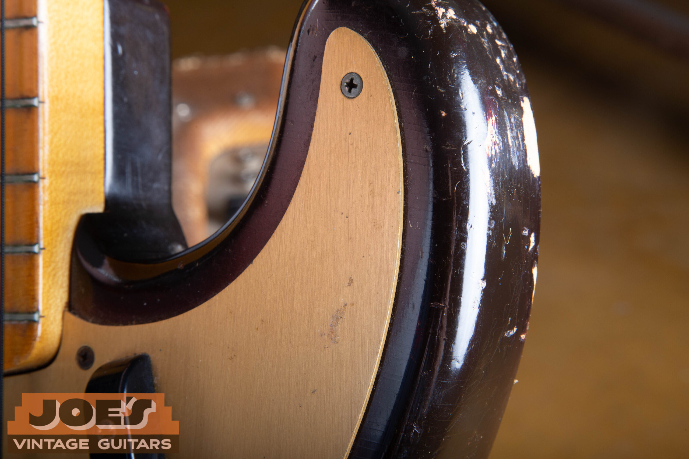

<figcaption>The Gold Anodized Aluminum Pickguard</figcaption>

</figure>

<h2 id="specs-construction">2. Technical Specifications & Construction</h2>

### The Body

<figure>

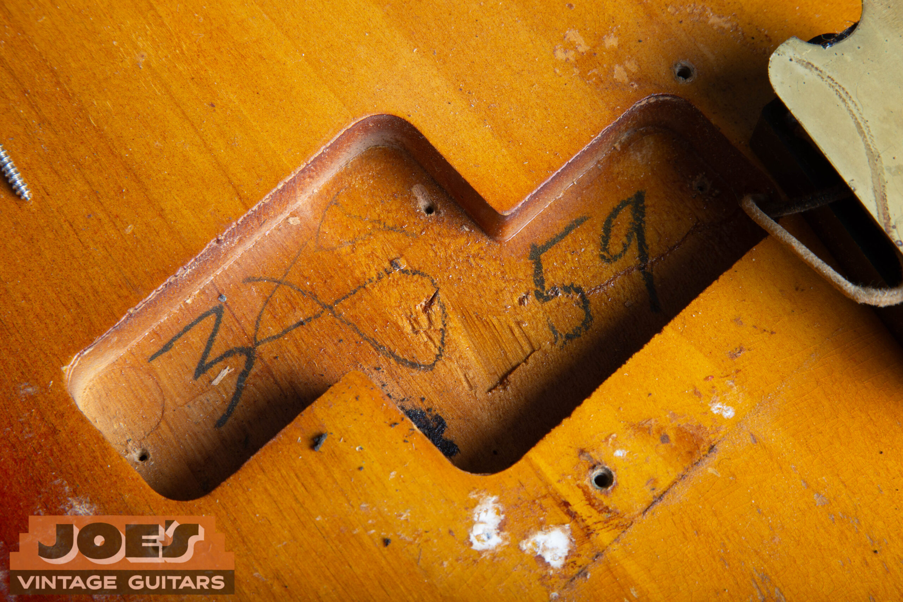

<figcaption>1959 Body Cavity Date Stamp</figcaption>

</figure>

### The Neck & Fingerboard

The neck was a single piece of maple with a walnut *skunk stripe* running down the back. That construction method stuck around on Fender maple-neck basses for decades. The profile itself changed noticeably across this three-year window.

-   **Early 1957:** Soft "V" profile inherited from the outgoing slab-body era.
-   **1958:** Moves into a very thick, wide "C" shape. One of the chunkiest necks Fender ever produced.
-   **Nut width:** A generous 1.75" (44.5 mm) across the entire run, substantial compared to any modern slim-neck reissue.
-   **Radius:** 7.25" with 20 vintage-style tall/thin frets.
-   **Position markers:** Small black dot inlays on the maple fingerboard.

<figure>

<figcaption>Black Dot Inlays on Maple Board</figcaption>

</figure>

<figure>

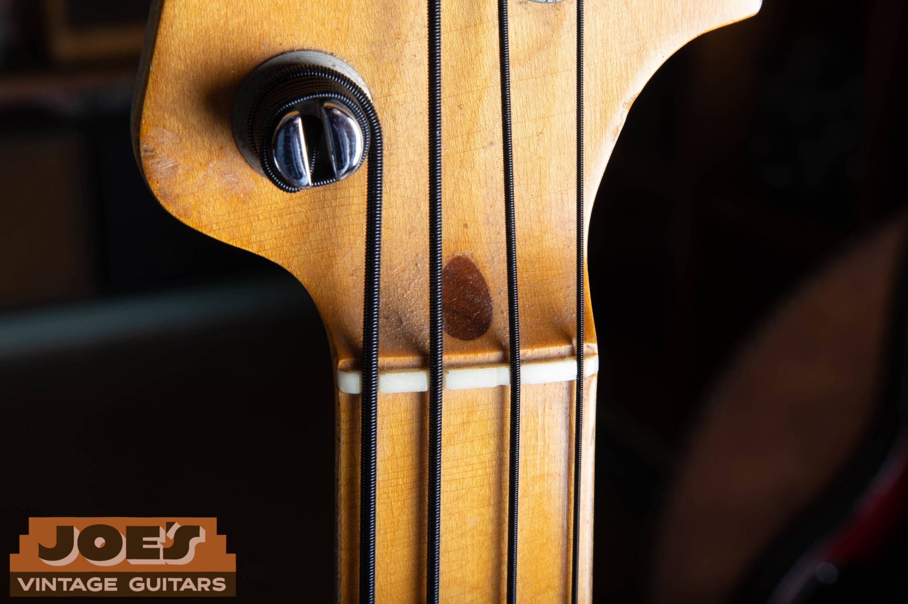

<figcaption>Walnut Truss Rod Plug</figcaption>

</figure>

### The Electronics

The 1957 redesign is where bass-building changed for good. The new split-coil pickup used two separate coils wired in series and out of phase with each other, which canceled hum and delivered a fatter, more focused tone than the original single-coil. Each coil sat on its own metal baseplate that doubled as a mounting and grounding surface.

#### The Raised A-String Pole Pieces

On 1957 and early 1958 models, the magnets sitting under the A-string are noticeably **taller** than the others. That staggered layout compensated for the string radius and gauges of the era. Fender leveled the poles out later in 1958, so raised A's are a reliable year indicator on otherwise unmarked pickups.

-   **Potentiometers:** 250k CTS pots.
-   **Capacitor:** Large .1uF "phone book" cap. Produces a very dark, thumpy tone with the tone knob rolled fully off.
-   **Wiring:** Cloth-covered pushback wire throughout.

<figure>

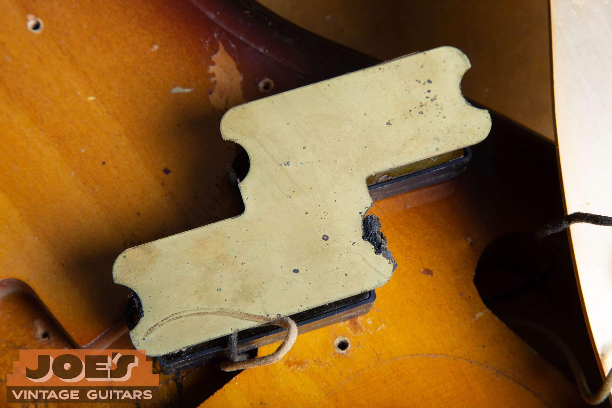

<figcaption>Metal Pickup Mounting Baseplate</figcaption>

</figure>

<h2 id="hardware">3. Hardware & Appointments</h2>

Every metal part on a Gold Guard P-Bass was chosen for function first, with visual appeal as a welcome side effect. Here's what to expect on an original example.

| Component | Detail |
| --- | --- |
| Bridge | Steel base plate with four threaded steel saddles, allowing adjustable string spacing. |
| Tuners | Reverse-wind nickel-plated tuners that tighten clockwise. Long-stem design. |
| Knobs | Heavy knurled chrome-plated brass flat-top knobs. |
| Finger Rest | Black plastic "tug bar" mounted below the strings, designed for thumb-plucking above the pickup. |
| Covers | Large chrome "ashtray" covers over the pickup and bridge. The bridge cover typically houses an internal foam mute. |

<figure>

<figcaption>Headstock & Spaghetti Logo</figcaption>

</figure>

<figure>

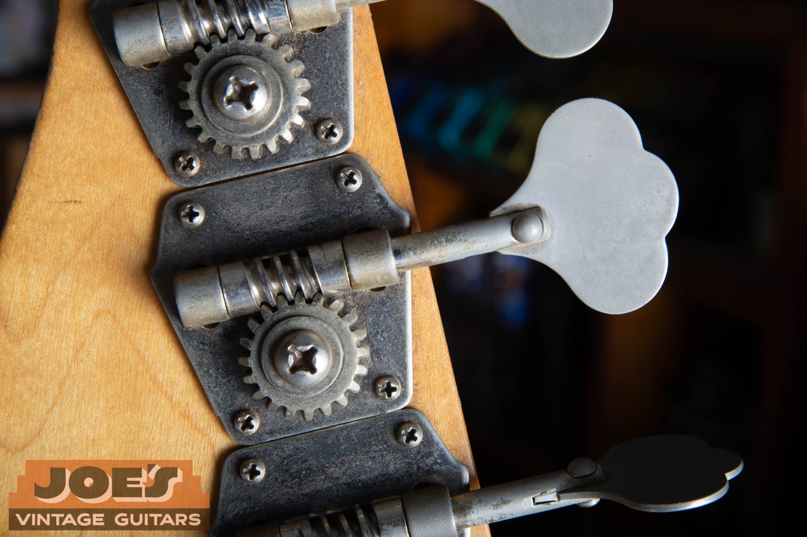

<figcaption>Reverse-Wind Tuner</figcaption>

</figure>

<figure>

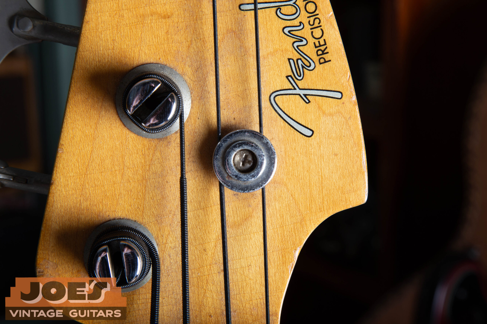

<figcaption>String Tree</figcaption>

</figure>

<figure>

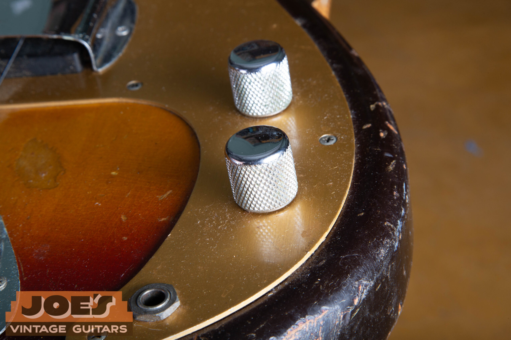

<figcaption>Chrome Knurled Knobs</figcaption>

</figure>

<figure>

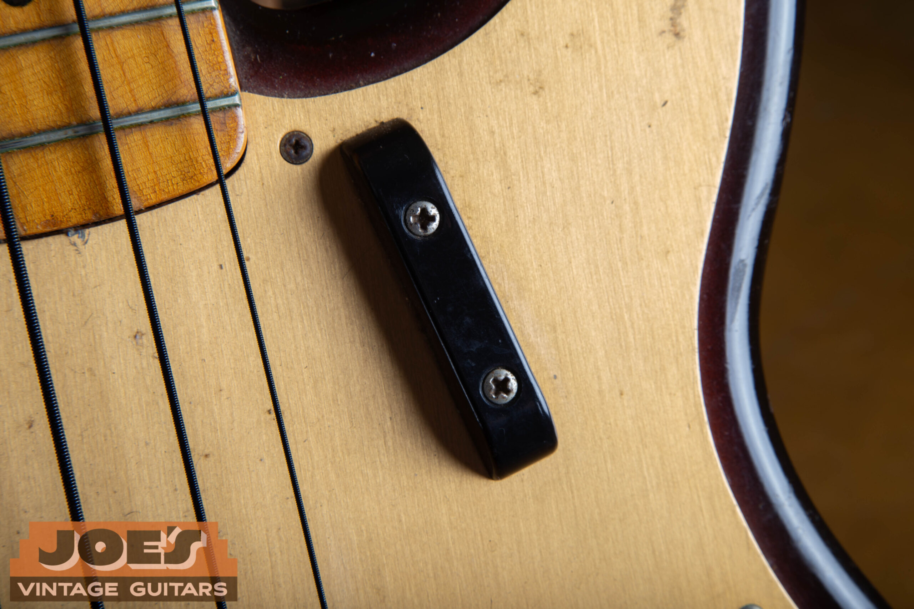

<figcaption>Black Tug Bar Finger Rest</figcaption>

</figure>

<figure>

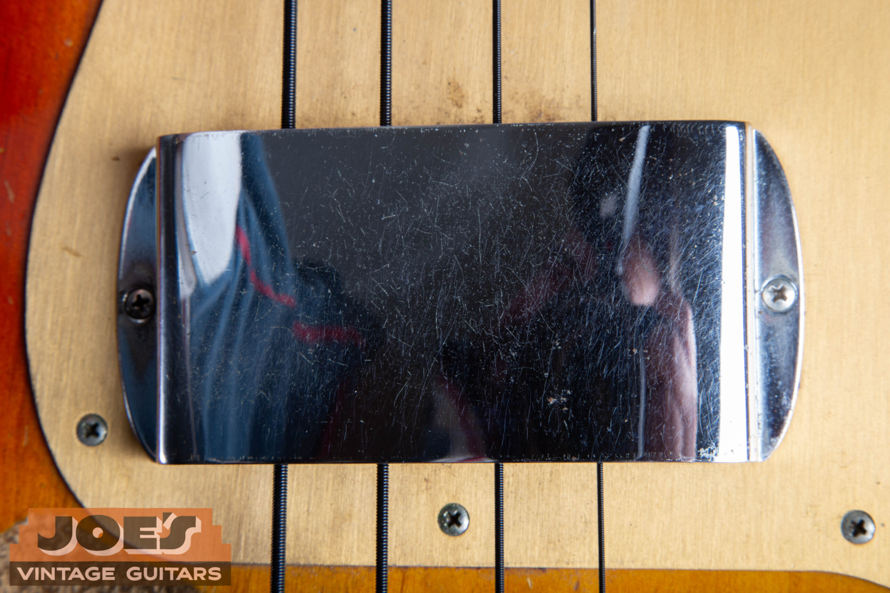

<figcaption>Chrome Pickup Cover</figcaption>

</figure>

The bridge cover is easy to overlook. Flip it upside down and you'll find a small piece of foam bonded to the underside. It isn't debris. It's an intentional mute that presses lightly against the strings when the cover is installed, and it's what gives the bass that classic palm-muted thump.

<figure>

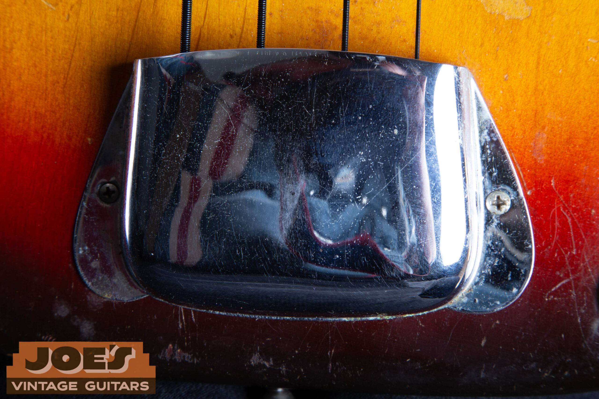

<figcaption>Chrome Bridge Cover</figcaption>

</figure>

<figure>

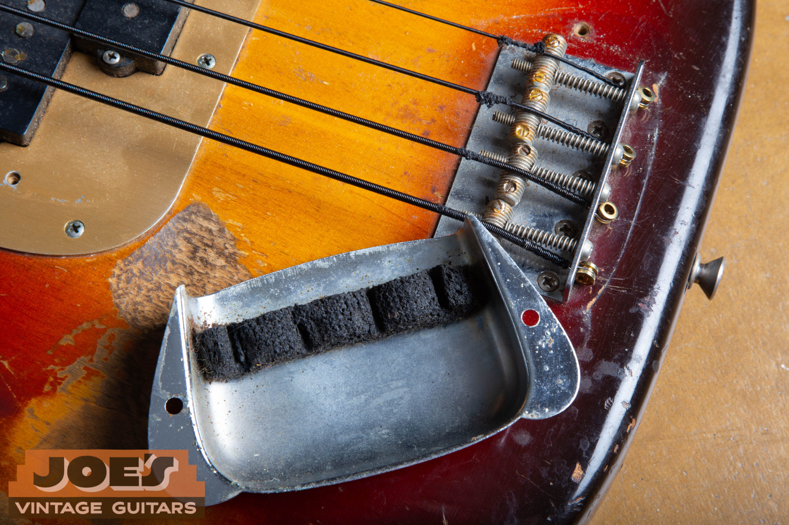

<figcaption>Bridge & Internal Foam Mute</figcaption>

</figure>

<h2 id="evolution">4. Chronological Evolution</h2>

Three short years, but meaningful changes within them. If you're trying to date one of these basses by features rather than paperwork, these are the milestones that matter.

-   Mid-1957 **The transition occurs.** A handful of extremely rare "hybrid" basses exist from this window. They carry the new split-coil pickup but still wear the old-style Telecaster-shaped headstock, carried over from the [1952 Fender Telecaster](/post/1952-fender-telecaster-authentication-guide/). True unicorns.
-   1958 **The sunburst evolves.** Fender added red to the finish between the black and yellow, creating a 3-tone burst. The red dye of that era was highly UV-sensitive and often faded out completely, leaving what looks like a 2-tone burst today. Collectors call it the *unburst*.
-   Mid-1959 **The end of the anodized guard.** Fender switched to rosewood slab fingerboards and 4-ply tortoise shell celluloid pickguards. The gold-guard maple-neck P-Bass was done.

<figure>

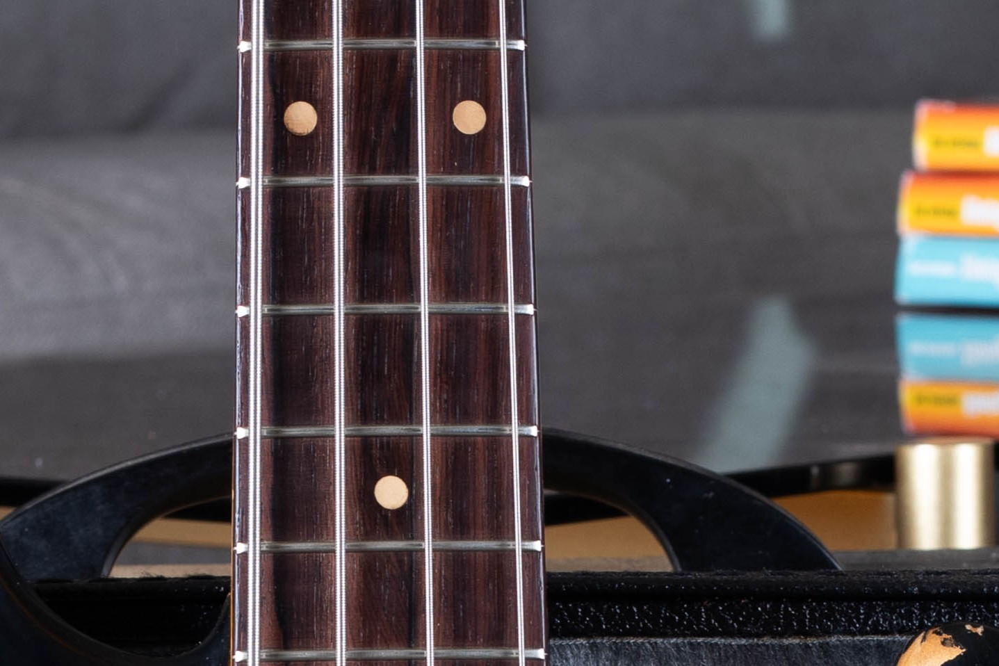

<figcaption>Late '59 Transition: Rosewood Slab Board with Clay Dots</figcaption>

</figure>

<h2 id="authenticity">5. Identification & Authenticity Markers</h2>

Gold Guard P-Basses are prime targets for parts-casters and outright fakes. If you're inspecting one for purchase or appraisal, these are the details that separate a real one from a very expensive mistake.

### What to Verify

-   **Serial number:** Stamped on the neck plate. For full decoding across Fender's serial number schemes, see our [Fender serial number guide](/fender-guitars-serial-number-guide/).
-   **Pencil dates:** Handwritten date on the end of the neck heel (e.g. *6-57*), and often in the middle pickup cavity or under the bridge. Note that some basses, especially 1959 examples, left the factory with **no heel date at all**. A missing heel date isn't automatically a red flag on a bass from that year. In those cases, rely on the body cavity markings, pot codes, and other construction details to confirm the year.
-   **Guard underside:** Original anodized guards are gold on **both** sides, though the underside looks cleaner and fresher than the top.
-   **Spaghetti logo decal:** Thin silver "Fender" with "Precision Bass" in smaller black lettering below. Early 1957 decals carry no patent numbers.
-   **Solder joints:** Original solder on the pots and pickup leads should look old, slightly dull, and undisturbed.

<figure>

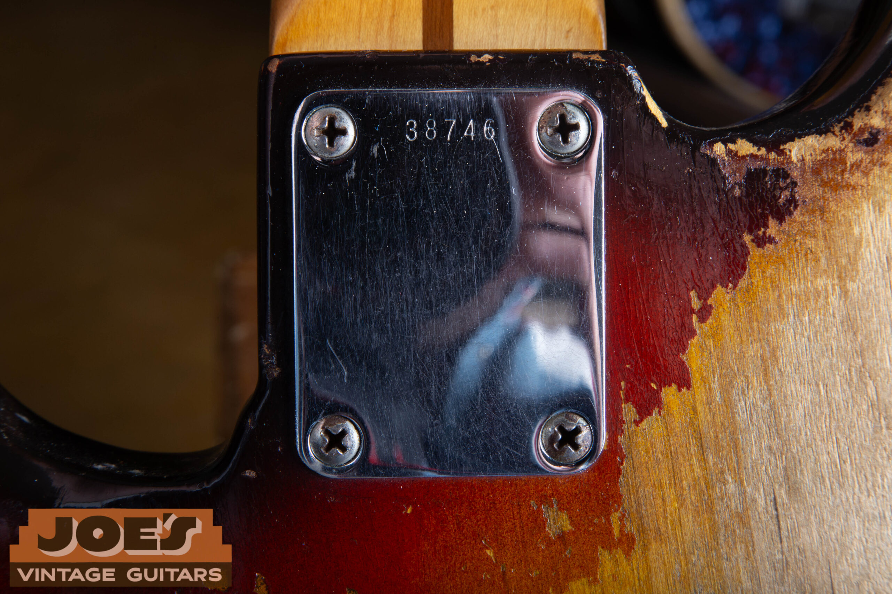

<figcaption>Neck Plate Serial Number</figcaption>

</figure>

<figure>

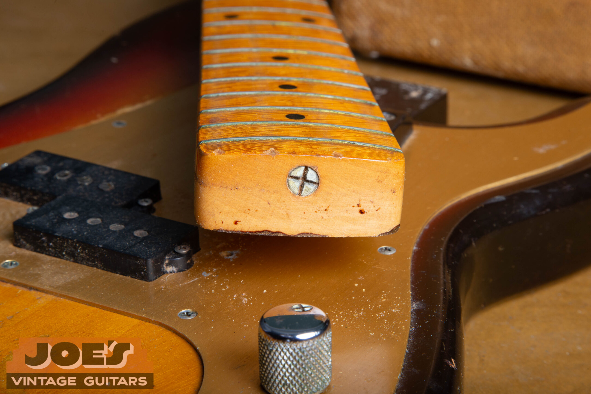

<figcaption>Factory-Original '59 Heel: No Date</figcaption>

</figure>

### Red Flags

-   Pristine bright-gold guard with no wear pattern whatsoever on a bass otherwise showing play wear.
-   Mismatched pencil dates between the neck and body where both exist. (A completely missing heel date isn't automatically suspect on a 1959, but the body cavity should still carry markings.)
-   Patent numbers on the headstock decal on a bass claimed to be pre-1961.
-   Phillips-head screws anywhere original slotted screws should be.
-   Fresh solder on the pickup, pots, or output jack.

#### A Note On "Refin" vs. "Parts"

A period-correct bass with a later refinish is a legitimate collectible, typically valued at 40 to 60% of all-original. A "parts bass" assembled from genuine components of different instruments is a much harder call and should be priced closer to the sum of its parts. Always ask.

<h2 id="tone-collectibility">6. Tone and Collectibility</h2>

These basses growl. The resonant one-piece maple neck, the high-output split-coil pickup, and the natural compression of a well-aged nitro-finished alder body together produce a punchy, mid-forward voice that sits in a dense mix without fighting for room.

It's the sound you hear on countless Motown, Stax, and early rock recordings. Not because those bassists were all playing Gold Guards specifically, but because the pickup design and the construction method became the template every later P-Bass was built against.

"Built across three years. Copied for the next sixty."

### Current Market Value

Condition, originality, and provenance drive the spread. A bass that still has its original case candy, hang tag, and documented history can push well past the top of these ranges at auction. The original tweed case with its gold interior is a non-trivial piece of that documentation.

<figure>

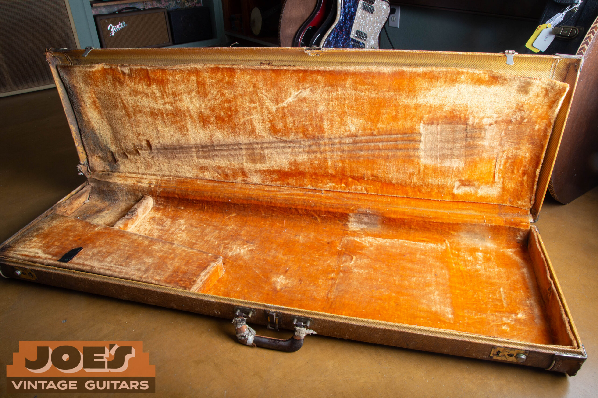

<figcaption>Original Tweed Case with Gold Interior</figcaption>

</figure>

<h2 id="why-matter">7. Why They Still Matter</h2>

The Gold Guard Precision Bass is the first fully modern electric bass. Contoured body, split-coil pickup, 4-string layout, long scale, all of it arrived fully formed in 1957. The bass world has been refining that design ever since rather than starting over.

For collectors, these are blue-chip pieces. Finite supply, real historical weight, and they actually play as well as the mystique suggests. For players who can afford one, the instrument still does the job it was designed to do sixty-plus years later. That's more than you can say for most mid-century engineering.

If you're looking to buy, sell, or just figure out what you have, **the details matter**. A bass that checks every authenticity box is a different object, both economically and historically, than one with a replaced guard, a reissue pickup, or a re-dated neck. If you're not sure, get a [qualified appraisal](/free-appraisal/) before money changes hands.

<figure>

<figcaption>1959 Precision Bass: Full Body</figcaption>

</figure>

#### Have a Gold Guard Bass?

Got a late-50s Precision Bass you're thinking about selling? Or just want an honest opinion on what you own? [Joe's Vintage Guitars](/) sees instruments like these every week. Reach out about [selling a Fender](/sell-my-fender-guitar/), whether it's a single piece or [an entire collection](/post/how-to-sell-a-large-guitar-collection-every-option-honestly-explained/). 1957 to 1959 basses are always of interest, in any condition.
