<nav class="gdj-nav-sidebar" id="gdjNavSidebar" aria-label="Article section navigation">
  
<strong>Duo Jet Guide</strong>

  <a href="#" onclick="window.scrollTo({top:0,behavior:'smooth'});return false;" class="gdj-nav-link top">&uarr; Top of Page</a>
  
The Guitar

  <a href="#gdj-what" class="gdj-nav-link">The Short Version</a>
  <a href="#gdj-family" class="gdj-nav-link">The Jet Family</a>
  <a href="#gdj-built" class="gdj-nav-link">How It Was Built</a>
  <a href="#gdj-timeline" class="gdj-nav-link">Year by Year</a>
  <a href="#gdj-harrison" class="gdj-nav-link">George Harrison</a>
  
Dating &amp; Authentication

  <a href="#gdj-dating" class="gdj-nav-link">Dating by Serial</a>
  <a href="#gdj-authenticate" class="gdj-nav-link">Authentication</a>
  <a href="#gdj-mods" class="gdj-nav-link">Mods and Fakes</a>
  <a href="#gdj-condition" class="gdj-nav-link">Condition Issues</a>
  <a href="#gdj-checklist" class="gdj-nav-link">The Checklist</a>
  
Value

  <a href="#gdj-reissue" class="gdj-nav-link">Vintage or Reissue</a>
  <a href="#gdj-value" class="gdj-nav-link">What It Is Worth</a>
  <a href="#gdj-selling" class="gdj-nav-link">Thinking of Selling</a>
  <a href="#gdj-faq" class="gdj-nav-link">FAQ</a>
</nav>

<button class="gdj-nav-btn" id="gdjNavBtn" onclick="toggleGdjNav()" aria-expanded="false" aria-controls="gdjNavPanel" type="button">
  &#9776; Jump To Section
</button>

  
<strong>Duo Jet Guide</strong>

  <a href="#" onclick="window.scrollTo({top:0,behavior:'smooth'});closeGdjNav();return false;" class="gdj-nav-link top">&uarr; Top of Page</a>
  
The Guitar

  <a href="#gdj-what" onclick="closeGdjNav()" class="gdj-nav-link">The Short Version</a>
  <a href="#gdj-family" onclick="closeGdjNav()" class="gdj-nav-link">The Jet Family</a>
  <a href="#gdj-built" onclick="closeGdjNav()" class="gdj-nav-link">How It Was Built</a>
  <a href="#gdj-timeline" onclick="closeGdjNav()" class="gdj-nav-link">Year by Year</a>
  <a href="#gdj-harrison" onclick="closeGdjNav()" class="gdj-nav-link">George Harrison</a>
  
Dating &amp; Authentication

  <a href="#gdj-dating" onclick="closeGdjNav()" class="gdj-nav-link">Dating by Serial</a>
  <a href="#gdj-authenticate" onclick="closeGdjNav()" class="gdj-nav-link">Authentication</a>
  <a href="#gdj-mods" onclick="closeGdjNav()" class="gdj-nav-link">Mods and Fakes</a>
  <a href="#gdj-condition" onclick="closeGdjNav()" class="gdj-nav-link">Condition Issues</a>
  <a href="#gdj-checklist" onclick="closeGdjNav()" class="gdj-nav-link">The Checklist</a>
  
Value

  <a href="#gdj-reissue" onclick="closeGdjNav()" class="gdj-nav-link">Vintage or Reissue</a>
  <a href="#gdj-value" onclick="closeGdjNav()" class="gdj-nav-link">What It Is Worth</a>
  <a href="#gdj-selling" onclick="closeGdjNav()" class="gdj-nav-link">Thinking of Selling</a>
  <a href="#gdj-faq" onclick="closeGdjNav()" class="gdj-nav-link">FAQ</a>

<h2 id="gdj-what">The Short Version</h2>

The Gretsch Duo Jet, model 6128, is the guitar Gretsch built in 1953 to answer the Fender Telecaster and the Gibson Les Paul. It looks like a solidbody, it wears a glossy black top, and it has been the coolest guitar in the room for seventy years. George Harrison bought a used one in 1961 and called it his first good American guitar. Cliff Gallup cut the Gene Vincent records on one. It is a piece of rock and roll history that most people can still identify from across a room.

At Joe's Vintage Guitars we buy and sell vintage Gretsch Jets, and we are always looking to add clean 1950s and 1960s examples to the collection. If you have one you are thinking about selling, we give straight [nationwide appraisals](/free-appraisal/) and pay top dollar for original guitars. This guide is the same walk-through we do on the bench: what the Jet family is, how the guitar changed from year to year, how we tell an original from a modified one, how to read the serial number, and what a real Duo Jet is worth in today's market. Every photo below is a guitar that came through our shop.

<h2 id="gdj-family">The Jet Family</h2>

The Duo Jet did not arrive alone. Gretsch built a whole family on the same chambered body, and the models differ mostly in the finish on the top. Knowing the family matters, because these guitars get confused for one another constantly, and a seller who calls a Silver Jet a Duo Jet, or does not know a Jet Fire Bird from a red Duo Jet, is leaving money and credibility on the table.

- **Duo Jet (6128).** The baseline model and the one everybody pictures: a gloss black top over a mahogany body. "Duo" is the two pickups. It arrived in 1953.
- **Silver Jet (6129).** A Duo Jet with a silver sparkle top. The sparkle is not paint. It is the same silver drum-wrap material Gretsch used on its drum kits, and it is the reason this finish exists at all. Introduced in 1954.
- **Jet Fire Bird (6131).** A Duo Jet with a red top over a dark body, from around 1955. Do not confuse it with the later Gibson Firebird, which is an unrelated guitar with a similar name.
- **Round-Up (6130).** The western-themed Jet: a transparent orange top, a branded steer on the headstock, a "G" cattle brand burned into the top, longhorn and cactus inlays, and tooled-leather trim around the sides. From 1954.
- **White Penguin (6134).** The rare one. Take the gold hardware and snow-white finish of the hollow-body White Falcon and put it on a Jet body, and you have the Penguin. Original examples are counted in the dozens, and it is one of the true grail guitars of the era.

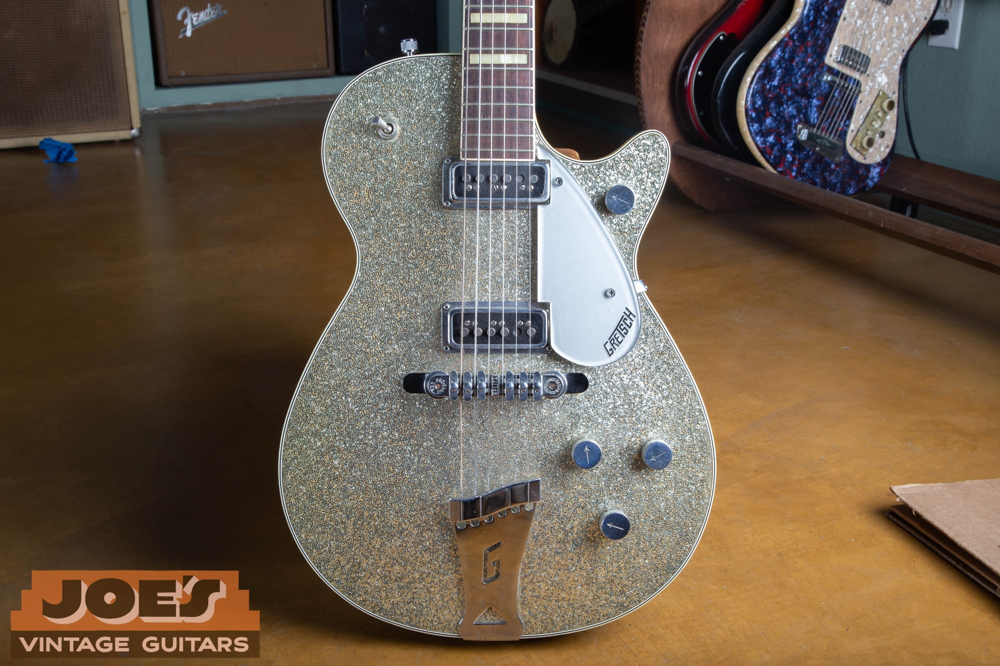

A mid-1950s Silver Jet 6129 from our shop. That sparkle top is Gretsch drum-covering material, the same celluloid the company wrapped around its snare drums, applied to a guitar. It is the single most Gretsch idea in the whole catalog: use what you already make.

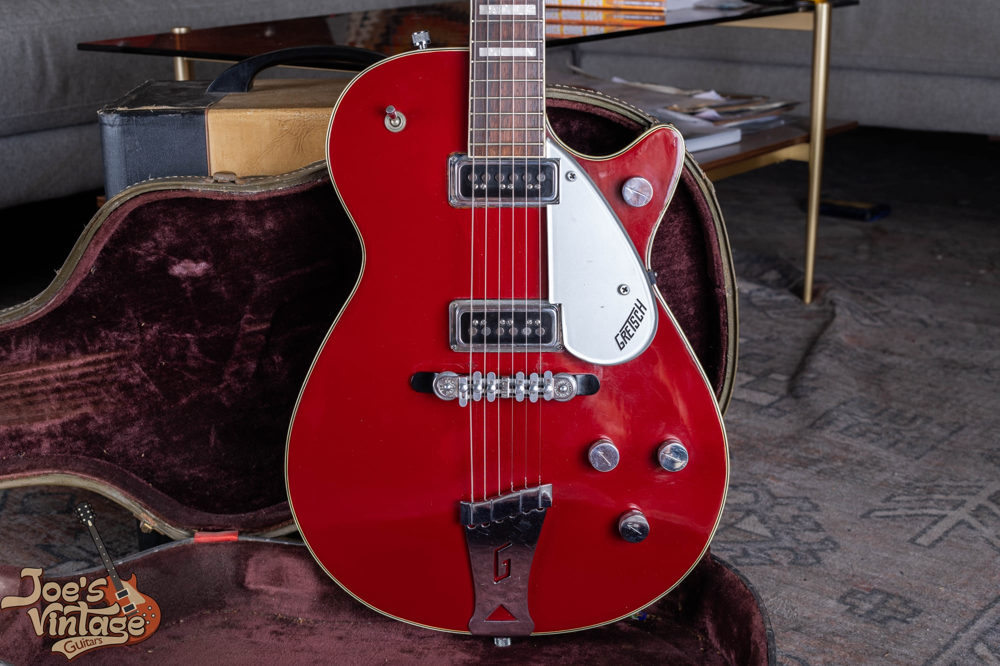

A 1956 Jet Fire Bird 6131, the red-topped sibling. Under the color it is the same chambered mahogany Jet as the black Duo Jet, with the same DeArmond pickups and the same Melita bridge for the year. The family resemblance is the whole point.

<h2 id="gdj-built">How It Was Built</h2>

Here is the fact that surprises most owners, and the one that separates people who know these guitars from people who do not: the Duo Jet is not a solid body. It looks like a slab, but the mahogany body is routed and chambered inside, with hollow pockets left in the wood before the arched top goes on. Gretsch built it this way for a reason. The chambering makes the guitar lighter and more comfortable than a Les Paul, and it gives the Jet its own voice, a more open, resonant, semi-hollow tone rather than the dense sustain of a true solidbody.

The top is a bound, slightly arched cap over that chambered body. On the standard Duo Jet it is gloss black. On the Silver Jet, the Jet Fire Bird, and the sparkle-finish Jets, the top is that drum-wrap celluloid, which is why those finishes have a depth and a texture that paint cannot copy. The back, sides, and neck are mahogany.

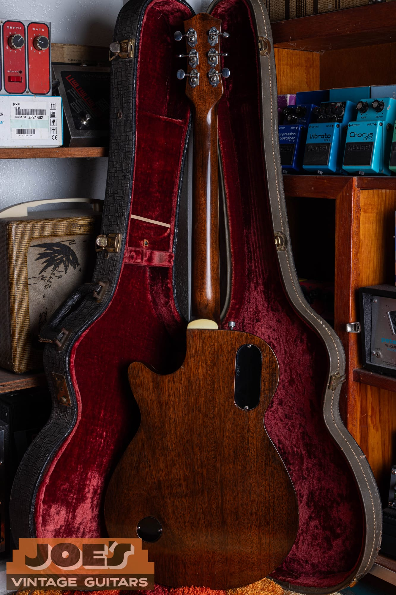

The back of a single-cut Duo Jet. That is solid mahogany, and behind it sit the routed chambers you never see. A real Jet feels lighter in the lap than its Gibson rival, and that weight, or the lack of it, is one of the first things an experienced hand notices.

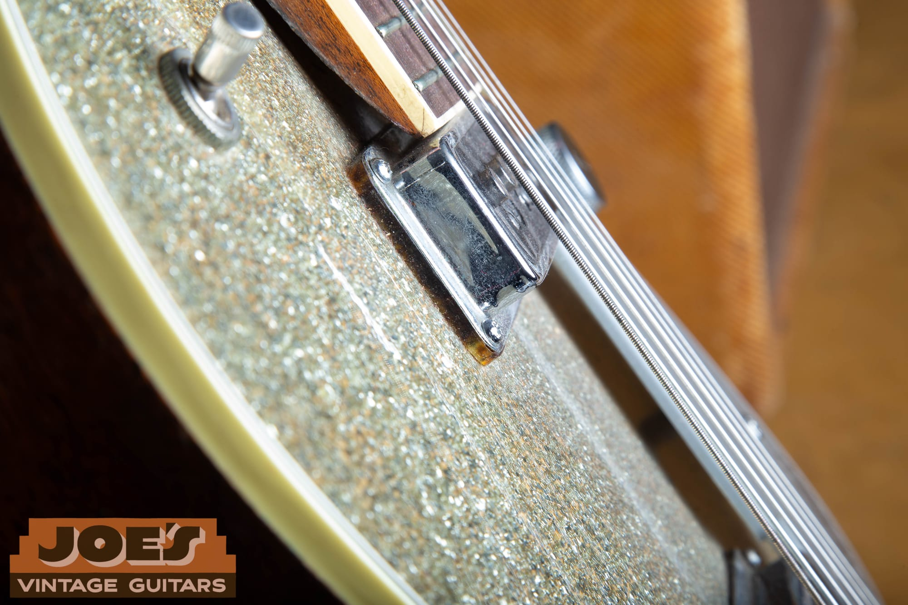

The bound edge of a Silver Jet. Notice the multi-ply binding and the shallow body. That binding is period celluloid, and it is both a beauty mark and a warning label, because celluloid is exactly the material that causes the biggest condition problem on vintage Gretsches. More on that below.

<h2 id="gdj-timeline">Year by Year</h2>

Gretsch changed the Jet in small, datable steps, and learning those steps is how you place a guitar in its year and how you catch one that has been put together from the wrong parts. Here is the walk from the first 1953 guitars to the double-cutaway years.

<h3>1953: The First Jets</h3>

The earliest Duo Jets are the collector's prize, and they are easy to spot once you know the tells. The first-year guitars, sometimes called "Scripty Jets," wear a script logo on the headstock instead of the later block logo, have plain knobs with no arrow markings, and have no inlay at the first fret. Under the hood they carry DeArmond single-coil pickups and a Melita bridge. The very first batch was only about 150 guitars, and their potentiometers are dated to the summer of 1953, which lines up with the guitar's launch that fall. If you find one of these, you are holding the beginning of the whole story, and it is worth a serious premium over a later Jet.

<h3>1954 to 1957: The DeArmond Years</h3>

In 1954 the Jet took the form most people picture. The streamlined block "Gretsch" logo appears on the headstock, a matching logo goes on the pickguard, the knobs are the Gretsch arrow style, a metal knob with an engraved pointer, and a block marker fills in at the first fret. The pickups through this whole stretch are DeArmond Dynasonics, and the bridge is the Melita Synchro-Sonic.

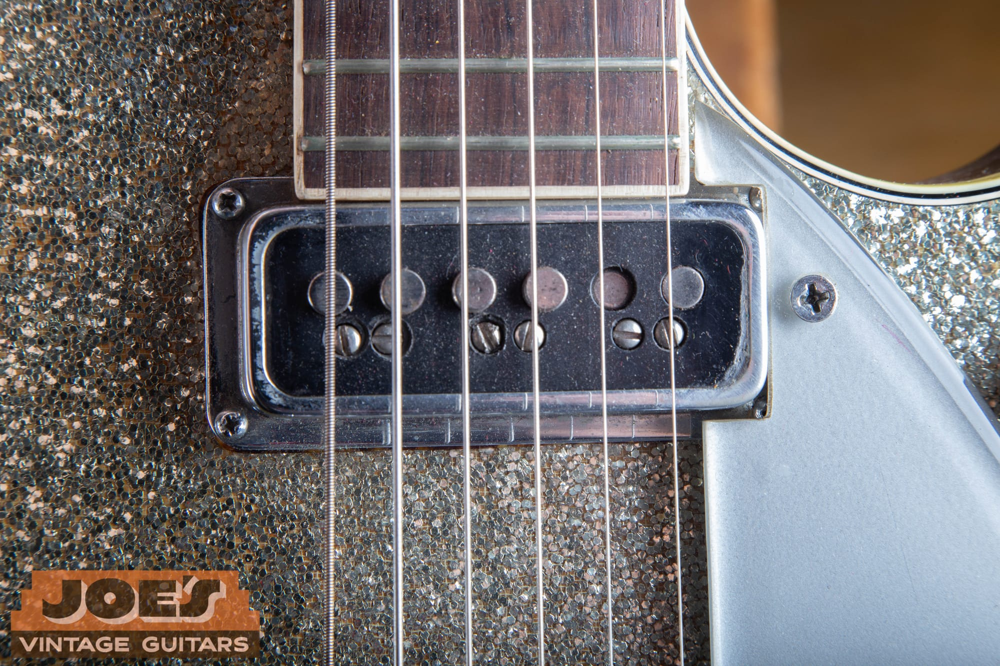

A DeArmond Dynasonic, the correct pickup for a 1953 to 1957 Jet. One row of adjustable pole-piece screws, a bright and glassy voice, and it is a true single coil, so it hums a little the way single coils do. If a guitar sold as a 1955 Duo Jet has humbuckers, either the year is wrong or the pickups have been changed.

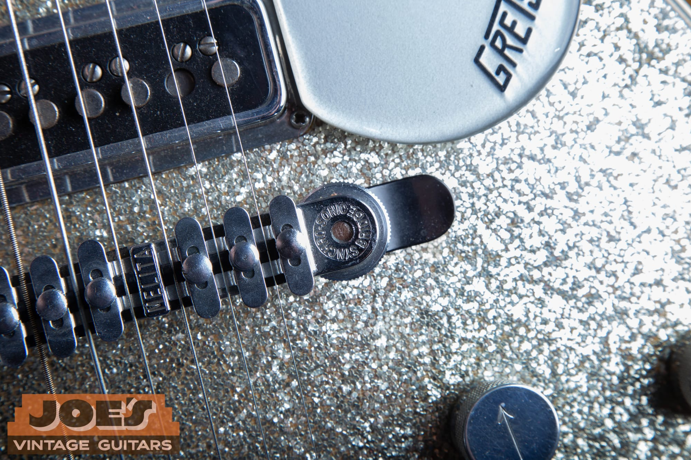

The Melita Synchro-Sonic bridge, stamped MELITA right on the base. Johnny Melita built these for Gretsch, and it was the first bridge that let a player set the intonation of each string individually. It is the correct bridge for the DeArmond years, and finding the right bridge for the year is half of dating a Jet.

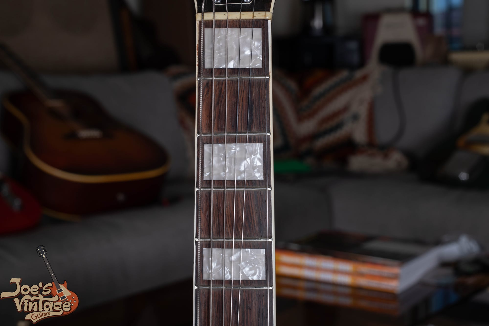

Pearloid block inlays on a bound board, correct for the mid-1950s Jets. The markers changed later in the decade, so the inlay shape is another quick year check. These blocks say 1950s; the half-moon "thumbnail" markers below say later.

<h3>1957 to 1958: The Filter'Tron Arrives</h3>

The biggest change in the Jet's tone came at the end of the 1950s. Working with Chet Atkins, Ray Butts designed the Filter'Tron, a humbucking pickup that was quiet where the single coils hummed, and Gretsch patented it. It reached the top of the line first and became standard on the Duo Jet generally around 1958, so expect some transitional guitars in 1957 and 1958 that can go either way. Around the same time the Space Control bar bridge started to replace the Melita. Call the Filter'Tron one of the first humbuckers rather than the first, because Gibson was developing its own on the same timeline, but there is no argument about the sound: the Filter'Tron is the classic Gretsch twang.

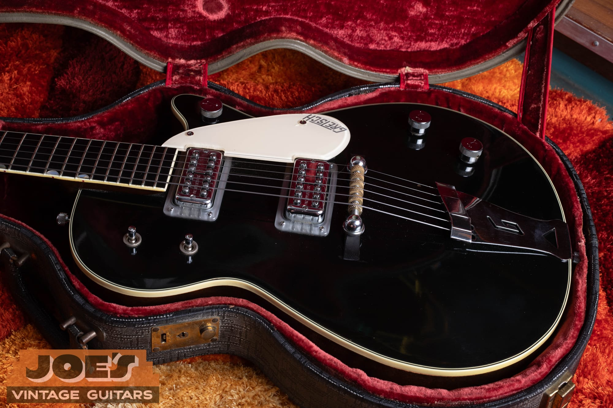

Two Filter'Trons on a single-cut Duo Jet, with the covers reading "Patent Applied For," which dates the pickups to the late 1950s before the patent number was assigned. Two rows of pole pieces instead of one, and a quiet, focused voice. This is the sound most people mean when they say "Gretsch."

<h3>1958 to 1961: The Classic Single-Cut</h3>

By 1958 the Jet settled into the form that many players consider the classic: Filter'Tron humbuckers, the bar bridge, and Neo-Classic "thumbnail" inlays, the half-moon markers set into the edge of the fingerboard. The control layout also matured. Gretsch put the master volume up on the cutaway bout, a signature Gretsch touch, with the other controls on the lower bout, and in 1958 dropped one knob and added a tone switch. A zero fret sits up at the nut on the late-decade guitars. Everything about a good 1958 to 1961 single-cut says "finished design," and these are wonderful guitars to own and to play.

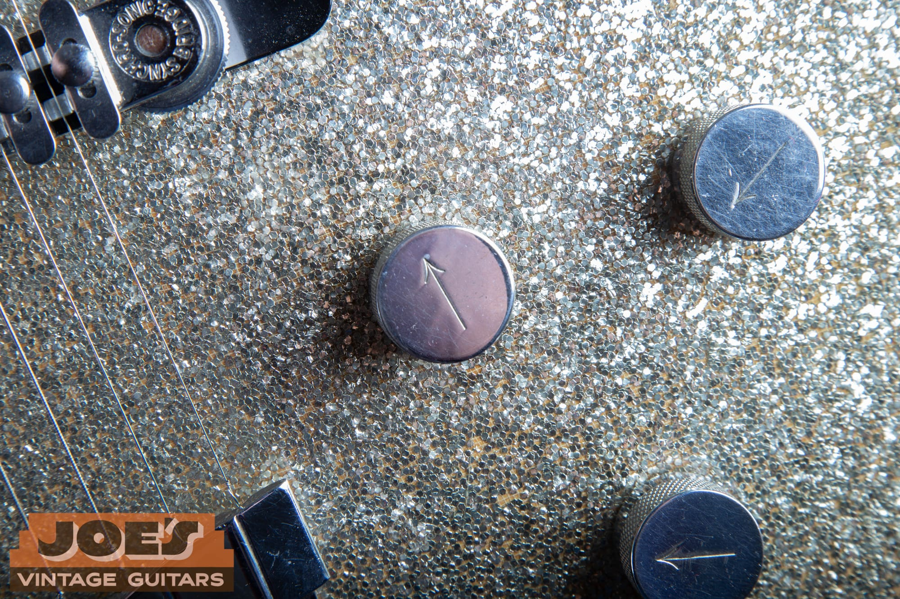

The arrow knobs on this Silver Jet: a metal knob with an engraved pointer and no "G" on the cap. This plain arrow style is correct for a 1950s Jet, while the first-batch 1953 guitars wore plain knobs with no arrow at all. Small parts like these carry real dating weight, which is exactly why they get swapped to dress up a guitar.

<h3>1961 Onward: The Double-Cut</h3>

Late in 1961, and into 1962, Gretsch redrew the Jet as a symmetrical double-cutaway, giving up the single-cut shape that had defined it since 1953. The restyle brought other changes over the next couple of years, including a gold pickguard with a black block logo, gold hardware on some examples, a slightly different scale, and a factory vibrato. The double-cut Jets are the more affordable way into a real 1960s Gretsch today, and they have their own following, but the single-cut is the shape most collectors chase.

The original Duo Jet ran until about 1971, when the Baldwin era and a move away from Brooklyn brought the classic run to a close. We will come back to what happened next in the reissue section.

<h2 id="gdj-harrison">George Harrison and the Duo Jet</h2>

You cannot tell the Duo Jet story without George Harrison. In the summer of 1961, before the Beatles were the Beatles, Harrison answered an ad in the Liverpool Echo and bought a used 1957 Duo Jet from a sailor named Ivan Hayward for about seventy-five pounds. The guitar had originally been carried back from New York, where a Duo Jet listed for around two hundred and ten dollars new. Harrison called it his first good American guitar, and he played it on the early Beatles sessions, including "Please Please Me," "I Saw Her Standing There," and "Twist and Shout."

He retired the Jet around 1963 in favor of a Gretsch Country Gentleman, gave the Duo Jet to his friend Klaus Voormann, reacquired it in the mid-1980s, and then put it on the cover of his 1987 album Cloud Nine. That guitar has never been sold. It stays with the Harrison family, and it is effectively priceless.

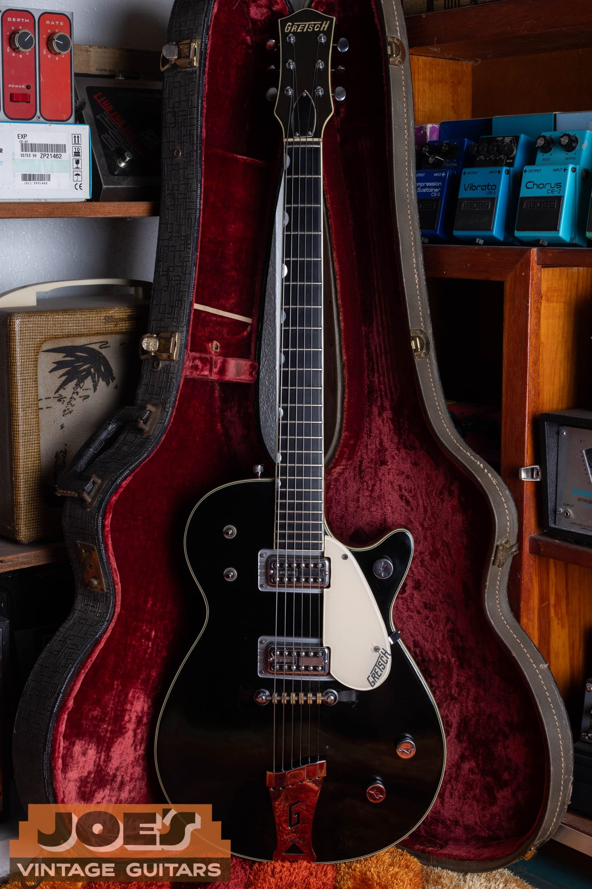

A black single-cut Duo Jet like the one Harrison played, though his was a 1957 with the earlier DeArmond pickups and hump-block inlays. Here is the part sellers need to hear clearly: the Harrison connection is what makes his guitar priceless, and it does not transfer. A regular 1957 Duo Jet is worth its own market value, not Beatle money, no matter how similar the model.

<h2 id="gdj-dating">How to Date Your Duo Jet</h2>

Before 1966, Gretsch serial numbers were plain sequential numbers with no date code built in. You date the guitar by matching the serial to a known range and then confirming it with the features and the pot codes. The serial by itself is the weakest single piece of evidence, because a number can be transplanted or faked, so it never gets the final word.

On a solidbody Jet the serial number label lives inside the control cavity, under the rear cover, not on a label you can read through an f-hole the way you can on a hollow Gretsch. In 1957, around serial 25001, the paper label changed to an orange oval design.

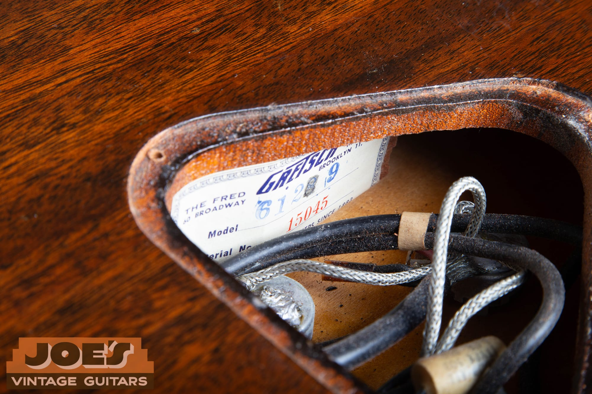

The label inside our Silver Jet, reading model 6129 and serial number 15045. This is the birth certificate: the model number tells you it is a Silver Jet, and the serial places it in the mid-1950s, which the DeArmond pickups, Melita bridge, and block inlays all confirm. When the label, the serial, and the features agree, you have a coherent guitar.

Here are rough serial ranges for the single-cut years. Treat them as approximate, because Gretsch numbering was never tidy:

| Year | Approximate serial range |
| --- | --- |
| 1953 (first batch) | 11900 to 12049 |
| 1954 to 1956 | 12000s to 21000s |
| 1957 | 22000 to 26000 |
| 1958 | 27000 to 30000 |
| 1959 | 30000 to 34000 |
| 1960 | 34000 to 39000 |
| 1961 | 39000 to 45000 |

There is one famous trap every Gretsch buyer should know. Around 1957 a batch of roughly a thousand serial labels went missing, then turned up and got used again in 1965. That means a serial in the low-to-mid 20,000s can be either a 1957 or a 1965 guitar, and the only way to settle it is by the features. George Harrison's Duo Jet, serial 21947, sits right in that band and is confirmed a 1957 by its parts. For a deeper walk through Gretsch numbers, use our [Gretsch serial number lookup](/gretsch-serial-number-lookup/), and you can cross-check against the factory [dating information on the Gretsch website](https://www.gretschguitars.com/support/product-dating).

<h2 id="gdj-authenticate">Reading a Duo Jet Like a Dealer</h2>

Authentication is not one test. It is the question of whether every part of the guitar tells the same story. A Duo Jet has a serial, a set of pickups, a bridge, a tailpiece, a logo, a set of knobs, inlays, and a wiring harness, and each of those has a date range. When they all point to the same window, the guitar is honest. When one points somewhere else, you have found either a repair or a story that does not add up.

The strongest independent check beyond the serial is the potentiometer date code. Vintage pots carry a stamped source-date code: the first three digits identify the maker (137 is CTS), and the digits after that give the year and week the pot was made. The first Duo Jets have pots dated to the 33rd week of 1953. A pot only dates the part, so it gives you the earliest the guitar could have been built, not proof of the exact year, but two pots with matching dates that agree with the serial and the features are a strong sign of an untouched guitar.

Then look at the solder. Original factory solder joints are even, flowed, and consistent from one connection to the next. Fresh, blobby, or re-melted joints on a pickup lead, a pot, or the jack mean someone has been inside, and that is your cue to ask what was changed and why. Even famous guitars get reworked; Harrison's own Jet was rewired in the 1980s. The goal is not to find a museum piece with zero history. It is to know exactly what you are looking at.

<h2 id="gdj-mods">Modifications and Fakes That Hurt Value</h2>

Most of the value questions on a vintage Jet come down to a short list of common changes. None of these makes a guitar worthless, but every one of them changes the number, and a guitar sold as all original when it is not is the expensive mistake to avoid.

- **Refinished top.** The black Duo Jet finish gets resprayed often. Look for overspray in the control cavity and under the pickup mounts, color on the binding, a logo that looks drowned or soft, orange-peel texture, and the absence of the fine finish checking a sixty-year-old nitro top should show. A refinish is one of the largest single hits to value.
- **Converted pickups.** Dropping Filter'Trons into a guitar that left the factory with DeArmonds is the classic Gretsch modification, and it is not a clean swap. Filter'Trons are taller and need routing into the top, so look for enlarged cavities, filled DeArmond mounting holes, wrong or replaced mounting rings, and pickup covers from the wrong era.
- **Added or replaced Bigsby.** A Bigsby vibrato was an option and an aftermarket add-on, not standard equipment, so a Bigsby on a 1950s Jet almost always means extra screw holes where the original "G" tailpiece was mounted. Check the top edge and under the tailpiece for filled holes.
- **Reproduction parts sold as original.** Modern pickups, most often TV Jones units, stand in for real Filter'Trons or DeArmonds. Confirm the covers, baseplates, and wiring match the period.
- **Parts guitars.** A Jet assembled from Silver Jet, Jet Fire Bird, and Duo Jet parts is common. Make sure the top finish, the pickups, and the features all agree with the model and serial the seller is claiming.
- **A reissue sold as vintage.** A Japanese-made or Custom Shop reissue described as an original is the one that costs a buyer real money. The tells are in the next section but two, and they are not subtle once you know them.

All three of the Jets in this guide wear their original "G" tailpiece with no extra holes, their original pickups for the year, and their original finishes. That is what we look for, and it is why they are worth what they are worth.

<h2 id="gdj-condition">Binding Rot and the Gretsch Condition Issues</h2>

Vintage Gretsches have one condition problem that stands above the rest, and every buyer and seller should understand it. The binding and the pickguard are made of celluloid, a cellulose-nitrate plastic, and as it ages it can break down. It gives off gas, shrinks, yellows, cracks, and in bad cases crumbles. This is often called binding rot, and it does two things: it destroys the binding itself, and the gas it releases can corrode the guitar's metal hardware and attack anything else stored in the case. Gretsch, Guild, and other East Coast makers of the era are the ones you see it on most, and it tends to show up on the later guitars, though it is not limited to them.

How you read it matters for value. Light shrinkage and some checking in the binding is common on a seventy-year-old guitar and is not a crisis. Active, spreading rot with crumbling binding is a real hit, because the cure is a full rebinding, which is expensive skilled work. The same goes for the pickguard: an original, intact guard adds value, and a gassing one should be kept away from the metal parts.

A few other things we always check: cracks around the angled headstock, especially near the nut and the truss-rod area; the neck angle, since the floating bar bridge can be jacked up high to hide a neck that needs resetting; and the bound top for any separation along the edge. Honest playwear, buckle rash on the back, and light finish checking are all normal and do not scare us. Refinishes, converted pickups, headstock breaks, and heavy binding rot are the things that move the price.

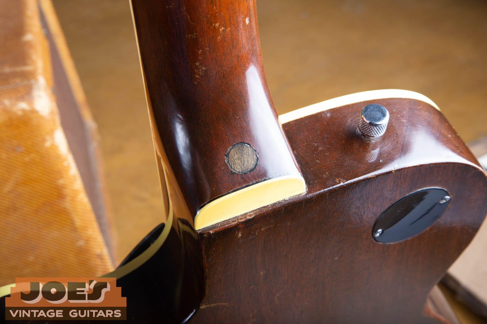

The set-neck heel on a Silver Jet. This is a glued neck joint, so a neck reset is real work, and a bridge sitting unusually high is the clue that one may be needed. Clean, tight, and original here, with the binding intact, is exactly what you want to see.

<h2 id="gdj-checklist">The Duo Jet Authentication Checklist</h2>

Here is the short version you can run through with a screwdriver and a flashlight:

1. **Serial number.** Find the label in the control cavity. Does the number fit the claimed year? If it is in the low-to-mid 20,000s, settle the 1957-versus-1965 question with the features.
2. **Pickups.** DeArmond single coils (one row of poles, and they hum) point to 1953 through 1957. Filter'Trons (two rows, quiet) point to 1958 and later. Are the cavities un-routed and the mounting holes unfilled?
3. **Bridge.** Melita with individually adjustable saddles for the early years, Space Control or bar bridge from 1958 on. Correct for the year?
4. **Tailpiece.** The "G" trapeze is standard. Any Bigsby means you look for extra or filled screw holes.
5. **Logo, knobs, inlays.** Script logo, blank knobs, and no first-fret inlay is a 1953 first batch. Block logo, arrow knobs, and a first-fret marker is 1954 and later. Half-moon thumbnail inlays are mid-1958 and later.
6. **Pot codes and solder.** Do the pot date codes agree with the serial, and is the solder original and undisturbed?
7. **Finish.** Check the cavity and under the pickup mounts for overspray, and look for age-appropriate checking on the top.
8. **Structure.** Binding condition, headstock cracks, neck angle, and the bound top.
9. **Hardware.** Original tuners with no extra holes, correct mounting rings.
10. **The coherence test.** Every point should tell the same story. One outlier is a question. Several outliers is a modified or assembled guitar.

If you get partway down this list and something stops adding up, that is the moment to get a second opinion before money changes hands.

<h2 id="gdj-reissue">Vintage or Reissue: Telling Them Apart</h2>

Gretsch never really let the Jet die. After the original run ended, Fred W. Gretsch bought the family company back in the mid-1980s, brought the model line back starting in 1989, and had the high-end guitars built in Japan by Terada, where the best modern Gretsches are still made. A partnership with Fender in 2002 pushed quality and the range further. Today a "Duo Jet" or "Jet" can be any of several very different guitars, and the price gap between them is enormous:

- **Electromatic Jet.** The import budget line, built in Asia. Fun guitars, and used ones typically run a few hundred dollars.
- **Players Edition and Professional Collection Jets.** Japanese-built, including the Vintage Select models that copy the 1950s specs closely. New, they run a few thousand dollars, and used ones fall well below that.
- **George Harrison Signature (G6128T-GH).** A Japanese-made tribute to Harrison's 1957, with DynaSonic-style pickups. A great guitar, and still a modern instrument at a modern price.
- **USA Custom Shop.** Hand-built in small numbers in California, and the priciest of the modern Jets.

None of these is a vintage guitar, and the tells are quick: a modern serial format, a "Made in Japan" or "Made in Korea" stamp, modern pots with recent date codes, TV Jones or other modern pickups, and Professional Collection or Players Edition branding. A two-thousand-dollar Japanese reissue and a twelve-thousand-dollar 1950s original are different animals, and confusing the two is how people overpay. If you are not sure which one you have, that is exactly what an appraisal is for.

<h2 id="gdj-value">What a Gretsch Duo Jet Is Worth</h2>

Vintage Duo Jet values move with the year, the pickups, the condition, and above all the originality. The ranges below reflect current dealer asking prices and price-guide figures for guitars in honest, all-original condition. They are a starting point for a conversation, not a substitute for looking at your actual guitar, because a single modification or a refinish can move the number by thousands.

| Segment | Player or modified | All-original, excellent |
| --- | --- | --- |
| DeArmond era single-cut, 1953 to 1957 | about $4,000 to $7,000 | about $8,000 to $14,000 |
| Filter'Tron era single-cut, 1958 to 1961 | about $4,000 to $7,000 | about $7,000 to $13,000 |
| Double-cut, early to mid 1960s | about $3,000 to $5,000 | about $5,000 to $9,000 |

A few things sit outside the table. The 1953 first-batch "Scripty Jet" is a category of its own and commands a clear premium over a standard early Jet, often well into five figures for a clean one. The Silver Jet, Jet Fire Bird, and the western Round-Up each carry their own collector interest, and the White Penguin is a grail guitar that trades in a different world entirely.

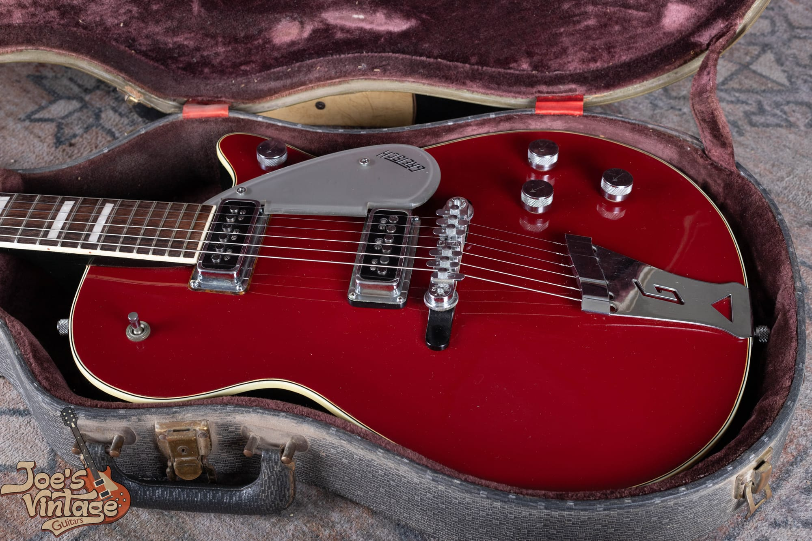

A 1956 Jet Fire Bird in its original case. The red-topped and sparkle-topped Jets bring their own premiums over a standard black Duo Jet, because far fewer were built, and condition and originality drive those numbers just as hard.

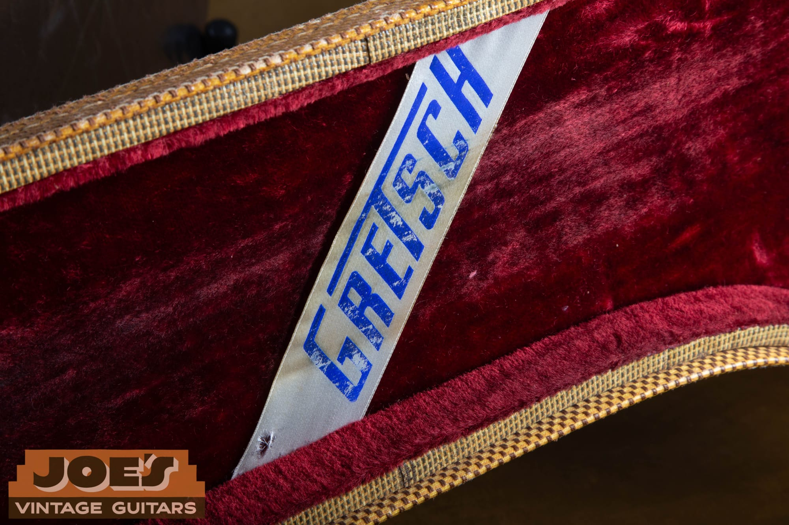

The original case matters more than people expect. A correct period case, with its case candy, is part of the package a collector wants, and it protects the guitar from the very binding-rot gas we talked about earlier.

What drives a Duo Jet up: all-original parts, an unrefinished original finish, the correct pickups for the year, a first-batch 1953, an original case, intact binding, light honest wear, and any documented history. What drives it down: a refinish, converted or replaced pickups, an added Bigsby, replaced tuners or knobs, a refret or neck reset, active binding rot, and a headstock repair.

For context on where these guitars sit in the market, a comparable 1950s Gibson Les Paul runs many times the price of a Duo Jet. A late-fifties P-90 goldtop is a multiple of a DeArmond Jet, and a 1958 to 1960 Standard "Burst" is in another universe. That gap is the Duo Jet's best argument: it is a genuine 1950s American guitar with real rockabilly and Beatle pedigree at a fraction of Les Paul money. If you want to see how we think about condition and pricing on a related Gretsch, our [Gretsch 6120 history and value guide](/post/gretsch-6120-history-value/) walks through the hollow-body side of the family, and the [Blue Book and price-guide overview](/post/blue-book-of-guitar-values-and-vintage-guitar-price-guide/) explains how to use published values without leaning on them too hard.

<h2 id="gdj-selling">Thinking of Selling Your Duo Jet</h2>

If you have a Gretsch Jet and you are considering selling it, the most valuable thing you can do is resist the urge to "clean it up." Do not refinish it, do not swap the pickups for something that sounds better to modern ears, and do not fix a worn original into a shiny fake. Every bit of honest wear and every original part is part of the value, and once an original finish or an original pickup is gone, it does not come back.

At Joe's Vintage Guitars we buy vintage Gretsch Duo Jets, Silver Jets, Jet Fire Birds, and the rest of the family, and we pay top dollar for clean, original examples. Send us photos through our [free appraisal](/free-appraisal/) page, including the front, the back, the headstock, the control cavity label, and any close-ups of the pickups and hardware, and we will tell you exactly what you have and what it is worth. You can also [contact us directly](/contact-me/) with questions. Whether you decide to sell to us or not, you deserve a straight answer from someone who handles these guitars, and that is what we give.

<h2 id="gdj-faq">Frequently Asked Questions</h2>

**What is a Gretsch Duo Jet?**

The Gretsch Duo Jet, model 6128, is an electric guitar Gretsch introduced in 1953 to compete with the Fender Telecaster and the Gibson Les Paul. It has a chambered mahogany body with an arched, bound top, usually gloss black, and two pickups, which is where the "Duo" in the name comes from. It is one of the most recognizable guitars of the rock and roll era.

**Is the Gretsch Duo Jet a solid body guitar?**

No, and this surprises a lot of owners. The Duo Jet looks like a solidbody, but the mahogany body is routed and chambered inside before the arched top goes on. That chambering makes the guitar lighter than a Les Paul and gives it a more open, resonant tone.

**How can I tell what year my Gretsch Duo Jet is?**

Start with the serial number label inside the control cavity and match it to a known range, then confirm the year with the features: the logo style, the knobs, the inlay shape, the pickups (DeArmond single coils for the early years, Filter'Trons from around 1958), and the bridge. Because a batch of serial labels was reused in 1965, a serial in the low-to-mid 20,000s could be 1957 or 1965, so the features decide it. Our Gretsch serial number lookup and a professional appraisal can confirm it.

**What is my vintage Gretsch Duo Jet worth?**

An all-original single-cut Duo Jet from the 1950s generally falls in the range of about $8,000 to $14,000 in excellent condition, with 1958 to 1961 Filter'Tron guitars a bit under that and double-cut 1960s examples lower still. A first-batch 1953 is worth a strong premium, and any refinish, converted pickups, or added Bigsby lowers the number. Condition and originality matter more than anything else, so the only way to know is to have it appraised.

**What is the difference between DeArmond and Filter'Tron pickups?**

DeArmond Dynasonics are single-coil pickups with one row of adjustable pole pieces and a bright, glassy voice, and they were standard on the Duo Jet from 1953 to about 1957. Filter'Trons are humbuckers with two rows of poles and a quieter, more focused tone, designed by Ray Butts and standard on the Jet from around 1958. Swapping one for the other requires modifying the guitar, so mismatched pickups are a value and originality question.

**Did George Harrison play a Duo Jet?**

Yes. George Harrison bought a used 1957 Duo Jet in 1961, called it his first good American guitar, and played it on early Beatles recordings including "Please Please Me" and "I Saw Her Standing There." He later put it on the cover of his 1987 album Cloud Nine. That specific guitar remains with the Harrison family and has never been sold, and its value does not transfer to other 1957 Duo Jets.

**Is a Gretsch Duo Jet with a Bigsby worth more?**

Not automatically. A Bigsby was an option and a common aftermarket addition, not standard equipment, so on a 1950s Jet it usually means extra screw holes where the original "G" tailpiece was mounted. An original factory tailpiece with no added holes is generally preferred by collectors, and an added Bigsby with drilled holes can lower value.

**What is binding rot, and does it ruin the value?**

Binding rot is the breakdown of the celluloid binding and pickguard that Gretsch used, which can shrink, crack, crumble, and give off a gas that corrodes the guitar's hardware. Light shrinkage and checking are common and tolerable. Active, spreading rot is a real value hit because it requires expensive rebinding, so it is one of the first things to check on any vintage Gretsch.

**Is a modern Gretsch Duo Jet reissue worth anything?**

Modern reissues are good guitars, but they are worth a fraction of a vintage original. Japanese-built Professional Collection and George Harrison Signature Jets sell used in the low thousands, Electromatic imports for a few hundred dollars, and USA Custom Shop pieces for more. You can spot a reissue by its modern serial format, its country-of-origin stamp, modern pots, and modern pickups. Do not confuse a two-thousand-dollar reissue with a twelve-thousand-dollar 1950s original.

