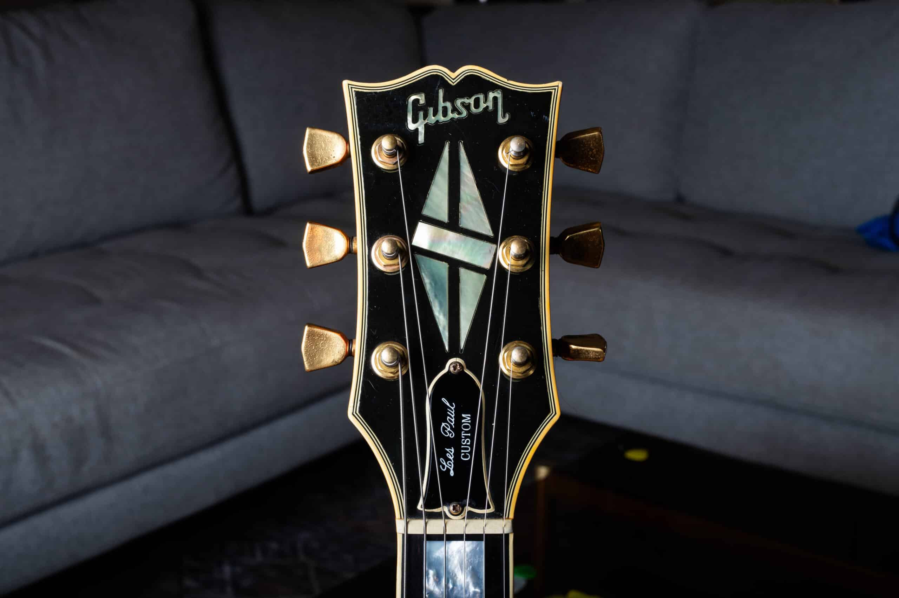
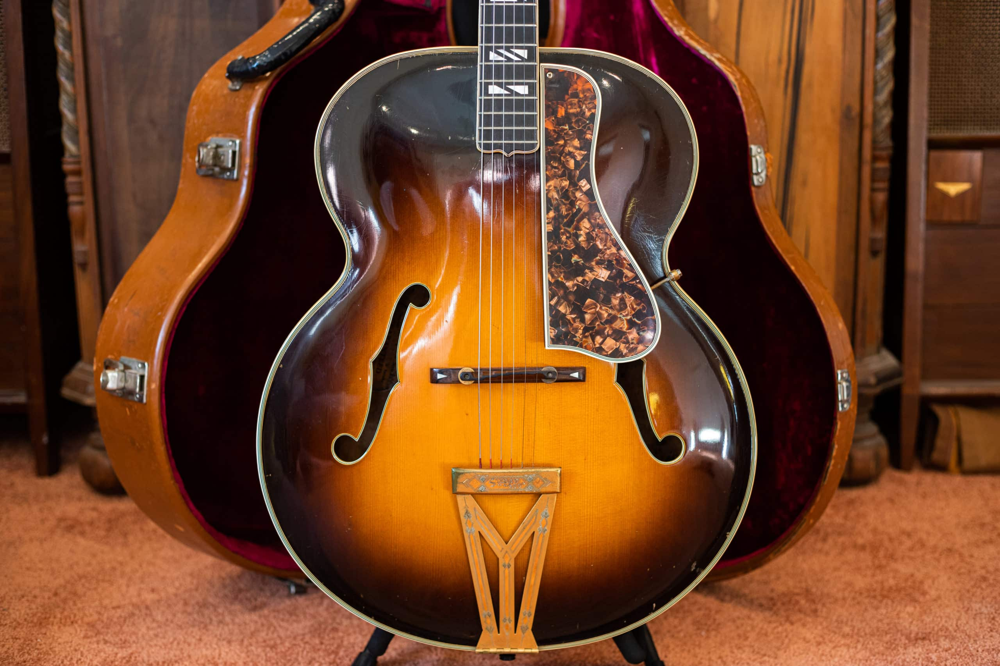
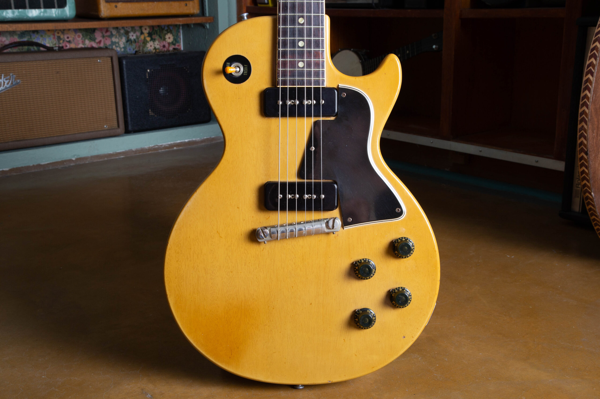
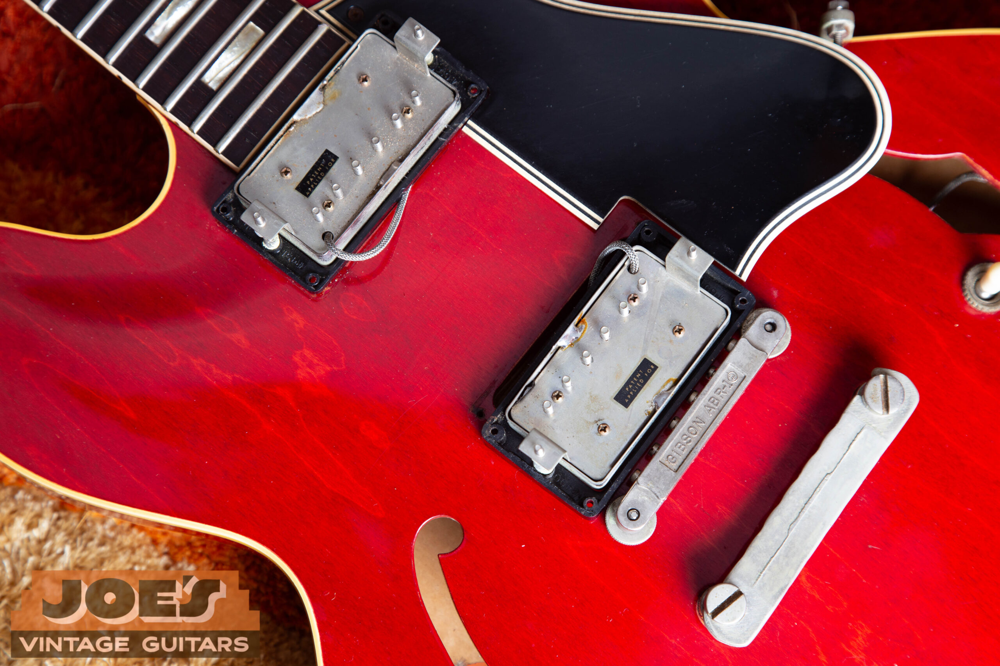
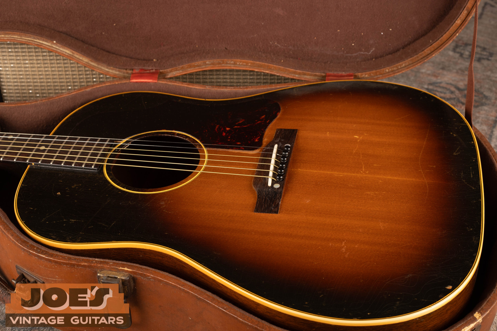
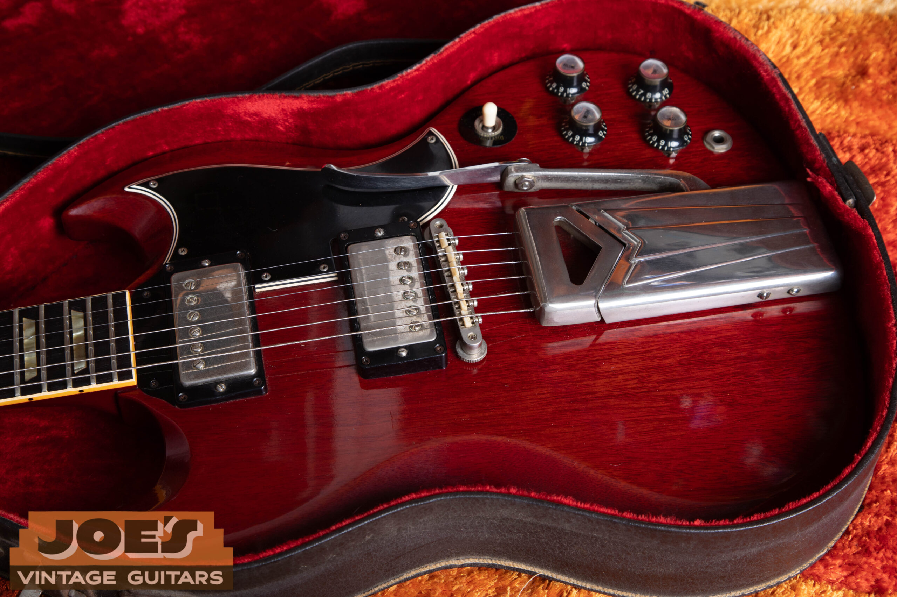
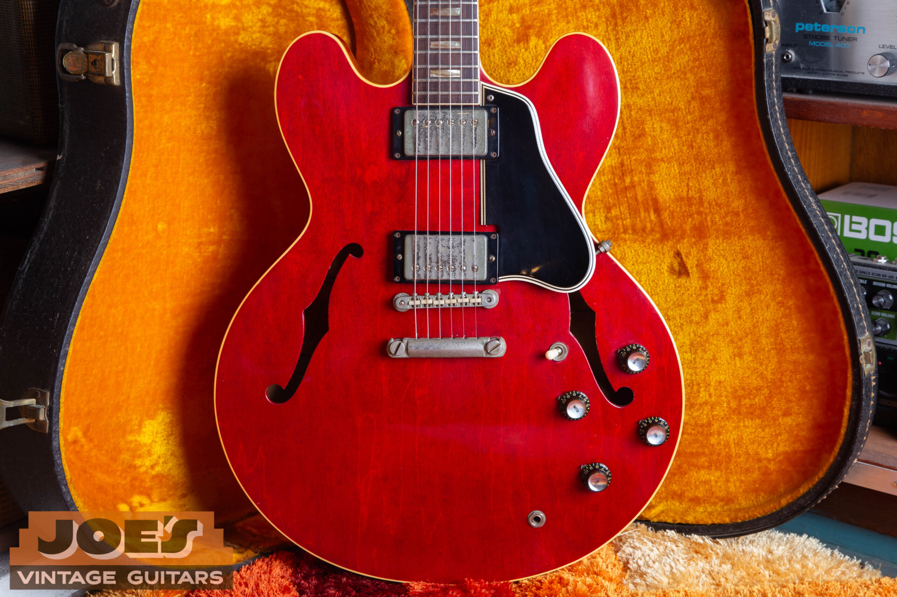
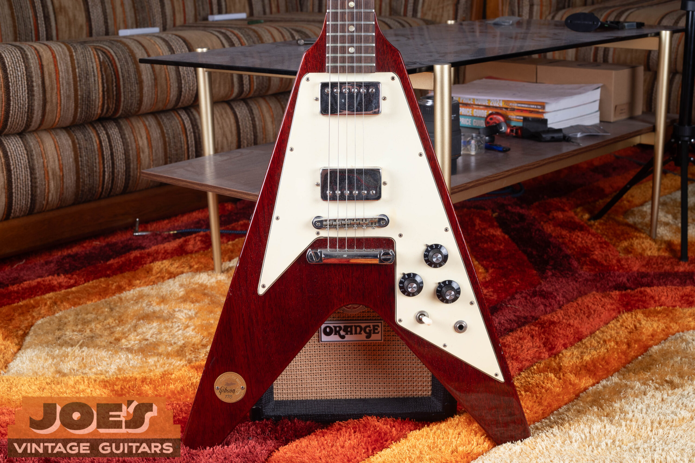

<figure></figure>

If you own a vintage Gibson guitar, the year it was built is one of the most important factors in determining what it's worth. Not all Gibsons are created equal. A Les Paul from 1959 and a Les Paul from 1975 can differ in value by tens of thousands of dollars, even if they look nearly identical on the surface. Understanding **how Gibson guitar value changes by year of manufacture** matters if you're looking to sell, insure, or simply understand what you have.

In this guide, I'll walk you through the key eras of Gibson production, explain why certain years command premium prices, show you how to date your guitar using its serial number, and answer the most common questions I hear from sellers every week at [Joe's Vintage Guitars](/) in Mesa, Arizona.

## Table of Contents

1.  [Gibson Value by Era: A Quick Reference](#jvg-eras)
2.  [The Golden Age: Pre-1960 Gibsons](#jvg-golden)
3.  [The Transition Years: 1961 to 1969](#jvg-transition)
4.  [The Norlin Era: 1970 to 1985](#jvg-norlin)
5.  [The Revival Era: 1986 to Present](#jvg-revival)
6.  [How to Date Your Gibson Using the Serial Number](#jvg-serial)
7.  [Other Factors That Affect Gibson Value](#jvg-factors)
8.  [Frequently Asked Questions](#jvg-faq)
9.  [Ready to Sell Your Vintage Gibson?](#jvg-sell)

<h2 id="jvg-eras">Gibson Value by Era: A Quick Reference</h2>

The table below is a general guide based on current market conditions. Values assume all-original condition with no major repairs or replaced parts. Actual prices vary significantly by model, color, and provenance.

| Era | Years | Collector Value | Why It Matters |
| --- | --- | --- | --- |
| **Pre-War Golden Age** | 1920s to 1940 | Very High | Rare archtops, early flat-tops, handmade craftsmanship |
| **Post-War Golden Age** | 1945 to 1960 | Highest | Les Paul Standards, original PAF humbuckers, sunburst finishes |
| **Transition Years** | 1961 to 1969 | High | SG era, ES-335, still strong build quality |
| **Norlin Era** | 1970 to 1985 | Moderate | Mixed quality; certain models remain highly sought after |
| **Nashville Revival** | 1986 to 2000 | Moderate | Quality improved; early in collectability curve |
| **Modern Era** | 2001 to Present | Moderate | Playable instruments; limited vintage premium |

<h2 id="jvg-golden">The Golden Age: Pre-1960 Gibsons</h2>

The years between roughly 1935 and 1960 represent the peak of Gibson's collectibility. Instruments from this era were built with hand-selected tonewoods and careful workmanship, and the build quality holds up against anything made since. If you're holding a pre-war archtop or a late-1950s solid-body electric, you've got an instrument at the very top of the vintage market.

### Pre-War Gibsons (Before 1942)

<figure>

<figcaption>A pre-war Gibson Super 400, one of the most collectible archtops ever built.</figcaption>

</figure>

Archtop guitars like the [L-5](/post/gibson-l5-ces-value-guide/) and L-7 from the 1930s and early 1940s are among the most collectible acoustic instruments you'll find. Flat-top models such as the early Advanced Jumbo are similarly sought after by serious collectors. These instruments are genuinely rare, Gibson's production volumes were tiny compared to today, and the combination of scarcity and quality routinely drives values into five-figure territory even for well-played examples.

### The Post-War Peak: 1945 to 1960

This is the era most collectors think of when they hear "vintage Gibson." Production ramped up after World War II, and Gibson released some of the most iconic instrument designs in history during this window. Key highlights include:

-   **1952 to 1960 Les Paul Standards.** Widely considered the most valuable production solid-body electrics ever made. A **1958 to 1960 Les Paul Standard in sunburst finish** with original PAF humbuckers routinely sells for $200,000 to $500,000+. The 1959 in particular is the one most collectors want above all others, and has exceeded $1 million at auction for exceptional examples. Earlier goldtop models are also highly collectible. See our guides on the [1957 Les Paul Goldtop](/post/1957-les-paul-goldtop-guide/) and the [1956 Les Paul Goldtop](/post/1956-les-paul-goldtop-authentication-guide/).
-   **Les Paul Specials and Les Paul Juniors.** These have been among the fastest-appreciating Gibsons in the vintage market over the last several years. Both were produced in single-cutaway and double-cutaway versions. The single-cut models typically date from the mid-1950s, while the double-cut versions came toward the end of the decade. Stripped-down by design, with P-90 pickups and slab mahogany bodies, they deliver a raw, punchy tone that players love. A clean, all-original 1957 Les Paul Special or 1958 Junior can command $8,000 to $20,000+ depending on condition and configuration. For a deep dive, see our [1955 to 1958 TV Yellow Les Paul Special guide](/post/1955-1958-tv-yellow-les-paul-special-guide/).

<figure>

<figcaption>A 1958 Gibson Les Paul Special in TV Yellow, one of the most appreciating models in the current vintage market.</figcaption>

</figure>

-   **Original PAF Humbuckers (1957 to 1962).** The patent-applied-for (PAF) humbucker pickups installed in this era have a tonal character that has never been precisely duplicated. Their presence on a guitar is one of the single most significant value drivers in the vintage Gibson market.

<figure>

<figcaption>Original PAF pickups in a 1962 ES-335. The presence of unmolested PAFs is one of the most significant value factors in the vintage Gibson market.</figcaption>

</figure>

-   **ES-335 (1958 to 1964).** The first production semi-hollow electric guitar. Early dot-neck examples (1958 to 1962) are extremely desirable, with all-original examples regularly selling in the $30,000 to $80,000+ range. See our [1959 ES-335 authentication guide](/post/1959-gibson-es-335-authentication-guide/) and [1962 ES-335 guide](/post/1962-gibson-es-335-guide/) for model-specific detail.
-   **J-45 and Southern Jumbo acoustics.** These workhorse flat-tops from the late 1940s and 1950s are the backbone of the vintage Gibson acoustic market. The J-45 has a loyal following among players and collectors alike. The Southern Jumbo, introduced in 1942, is often overlooked relative to its quality and represents excellent value for attentive collectors. See our [guide to identifying vintage Gibson J-45, J-50, and Southern Jumbo guitars](/post/identify-vintage-gibson-j45-j50-sj/).
-   **J-200.** Gibson's flagship acoustic, the J-200 is one of the most recognizable guitars ever made. Pre-1970 examples with their distinctive mustache bridges and flowerpot headstock inlays are highly collectible.

<figure>

<figcaption>A 1950s Gibson J-45 in its original case, a cornerstone of the vintage Gibson acoustic market.</figcaption>

</figure>

<h2 id="jvg-transition">The Transition Years: 1961 to 1969</h2>

Gibson made significant design changes in the early 1960s, most notably phasing out the single-cutaway Les Paul shape in favor of the double-cutaway SG design in 1961, but overall build quality remained high throughout the decade. Instruments from this era are firmly in "vintage" territory and command strong prices across almost every model line.

### SG Models (1961 to 1969)

The SG introduced a thinner, lighter, double-cutaway mahogany body that gave players easier access to the upper frets. It became iconic in the hands of players like Tony Iommi and Angus Young, and original 1960s examples are among the most player-friendly vintage electrics available. Early SG Standards and SG Specials with original PAF or "Patent Number" pickups are highly collectible. The SG Junior from this period has been steadily appreciating as players discover how good a simple, stripped-down Gibson can sound.

<figure>

<figcaption>A 1962 Gibson SG Standard with original nickel hardware. Early SG examples are among the most player-friendly vintage Gibsons available.</figcaption>

</figure>

### ES-335 and Semi-Hollow Models (1961 to 1969)

The switch from dot inlays to block inlays happened around 1962 on the ES-335. While slightly less valuable than the earliest dot-neck examples, block-neck 335s from the 1960s remain serious collector instruments. See our dedicated [1962 Gibson ES-335 guide](/post/1962-gibson-es-335-guide/) for a full breakdown of what to look for. The ES-345 and ES-355 from this era are also collectible, though they trade at a slight discount to the 335 in most cases.

<figure>

<figcaption>A 1962 Gibson ES-335 in cherry. Block-neck 335s from the 1960s remain serious collector instruments.</figcaption>

</figure>

### Flying V and Explorer (1966 to 1969)

Gibson originally introduced the Flying V and Explorer in 1958, but the radical designs were commercial failures and production was halted quickly. Gibson reissued both in 1966. Original late-1960s reissue examples are quite rare and command strong prices. Players and collectors compete equally for them.

Guitars from the late 1960s can vary somewhat in quality as Gibson's production volumes increased during the guitar boom of that decade, but this era still sits well above the Norlin era in collector esteem and build consistency.

<h2 id="jvg-norlin">The Norlin Era: 1970 to 1985</h2>

In 1969, Gibson was sold to the ECL Group (later renamed Norlin Musical Instruments), a brewing and electronics conglomerate with limited background in instrument manufacturing. Over the next 15 years, a combination of cost-cutting measures, material changes, and management decisions led to widely documented inconsistency in build quality. Norlin-era Gibsons are a complicated subject in the vintage market. They are not the equal of 1950s and 1960s instruments, but they are absolutely not without merit.

### What Changed Under Norlin

Collectors and players who are skeptical of Norlin-era Gibsons typically point to a handful of specific changes:

-   **Three-piece maple necks.** Gibson moved away from single-piece mahogany necks on many models, using laminated maple construction that some players feel lacks the resonance of the original.
-   **Volute on the headstock joint.** A reinforcing bump was added to the back of the headstock. Intended to address headstock breaks, it is widely disliked aesthetically.
-   **TP-6 tailpiece.** Replaced the traditional stop-bar tailpiece on many models.
-   **Inconsistent weight and finish quality.** Some Norlin-era Les Pauls are extremely heavy due to denser wood selection, and finish application was less consistent than in earlier periods.
-   **Pancake body construction.** In certain years, Gibson used a laminated "pancake" body design on Les Pauls that differs structurally from the solid mahogany construction of earlier models.

### How the Market Views Norlin Gibsons

While Norlin-era Gibsons don't command the same prices as their 1950s and 1960s counterparts, they remain legitimate vintage instruments with real value. Quality control during this period was genuinely inconsistent, which means the variation between individual instruments is wider than in other eras. The best examples play and sound excellent. These guitars are not lesser instruments than modern Gibsons; they're simply a different chapter in the company's history, and many players specifically seek them out because they can acquire a genuine vintage Gibson at a more accessible price point.

### Standout Norlin-Era Models

Despite the era's general reputation, certain Norlin-era Gibsons are among the most desirable instruments the company ever produced:

-   **White Les Paul Custom.** A clean, all-original white Les Paul Custom from the early-to-mid 1970s is a genuinely striking instrument that commands strong prices. These are harder to find in good condition because the white finish shows wear and yellowing dramatically.
-   **Silverburst Les Paul Custom.** Introduced in 1979 and produced in limited numbers, the Silverburst is one of the most visually distinctive Gibsons ever made. Collector demand for clean examples has climbed steadily.
-   **Flying V (1970s).** The Norlin-era Flying V has developed a cult following, particularly among hard rock and metal players. Early 1970s examples with mahogany construction are especially sought after.
-   **Les Paul Deluxe.** One of the more consistently built guitars of the Norlin period, featuring mini-humbuckers. Players who love the mini-humbucker sound seek these out actively.
-   **Les Paul Recording and Professional models.** Designed for direct studio recording, these low-impedance guitars never caught on commercially and were discontinued, making them genuinely rare and undervalued today.

<figure>

<figcaption>A 1971 Gibson Flying V Medallion, a prime example of a Norlin-era Gibson that commands serious collector interest.</figcaption>

</figure>

The bottom line on Norlin: these guitars occupy a middle ground in the market. They are not the equal of 1950s and 1960s Gibsons, but they are real vintage instruments with real character. If you own one, don't assume the worst. Get it properly appraised.

<h2 id="jvg-revival">The Revival Era: 1986 to Present</h2>

When Henry Juszkiewicz and David Berryman purchased Gibson in 1986, they immediately set about restoring the brand's reputation. Production was consolidated in Nashville and Memphis, quality controls improved dramatically, and Gibson began issuing historically accurate reissues of its most beloved models. The Historic Collection program, launched in the early 1990s, specifically targeted the golden-age specifications that collectors had been chasing in the vintage market.

Guitars from the late 1980s and 1990s are not yet widely considered "vintage" by strict definitions, but well-preserved examples, particularly limited runs and Custom Shop instruments, are beginning to appreciate meaningfully. The **1990s Historic reissues**, especially early Les Paul Standards and "R9" (1959 reissues), have developed a dedicated collector following and trade at significant premiums over standard production models of the same period.

Modern Gibsons (2001 to present) are the most consistently built instruments in the company's history from a quality-control standpoint, but they carry no vintage premium and compete in the used market primarily on playability and condition rather than collectibility.

<h2 id="jvg-serial">How to Date Your Gibson Using the Serial Number</h2>

Before you can know what your guitar is worth, you need to know when it was made. Gibson has used several different serial number systems across its history. For a complete breakdown with a free decoder tool, see our dedicated [Gibson serial number guide](/how-to-read-gibson-serial-numbers/). Below is an overview of the major systems.

### Pre-1953: Ink-Stamped Numbers

Early Gibson serial numbers were ink-stamped on a label inside the guitar or on the back of the headstock. These numbers are not sequential in a simple way and require cross-referencing with factory shipping logs and model-specific production records. Our [Gibson shipping totals guide (1948 to 1979)](/post/gibson-shipping-totals-1948-1979/) is a useful companion resource for dating and authenticating instruments from this era. Dating pre-war and early post-war Gibsons accurately often requires consulting specialized resources or an experienced appraiser, as labels can be missing, faded, or in rare cases swapped.

### 1953 to 1961: Single-Line Impressed Numbers

Gibson used a series of impressed (stamped into the wood) serial numbers during this period. These run roughly sequentially but have significant overlaps and gaps, meaning the same number can occasionally appear on instruments from different years. Confirming the date often requires examining pot codes, the date codes stamped on the volume and tone potentiometers inside the guitar, alongside the serial number.

### 1961 to 1969: Ink on Headstock Era

Numbers during this period were stamped on a label inside the guitar and sometimes on the headstock. This era includes some of the most collectible instruments Gibson ever produced, and accurate dating is critical for valuation. Pot codes are again very useful for confirming manufacture dates.

### 1970 to 1975: Eight-Digit Impressed Numbers

Gibson began using an 8-digit impressed serial number system in the early 1970s, stamped into the back of the headstock. The system encodes the year within the digits, but was applied inconsistently in the early years and duplicates are known to exist.

### 1975 to 1977: Decal Serial Numbers

During this transitional period, Gibson printed serial numbers on a paper decal affixed to the back of the headstock. These are also 8 digits. The first two digits indicate the year:

-   99 = 1975
-   00 = 1976
-   06 = 1977

### 1977 to Present: The Standardized 8-Digit System

In 1977, Gibson standardized on an 8-digit serial number stamped on the back of the headstock, with "MADE IN USA" below it. The format is:

Y   D D D   Y   R R R

| Digits | Meaning |
| --- | --- |
| **1st digit (Y)** | Last digit of the production year |
| **2nd to 4th digits (DDD)** | Day of the year (001 = Jan 1, 365 = Dec 31) |
| **5th digit (Y)** | Last digit of the production year (repeated) |
| **6th to 8th digits (RRR)** | Factory and production sequence number |

**Example:** A serial number of 70108276 means the guitar was built on the 10th day of 1978 (January 10, 1978) at the Kalamazoo plant, and was the 276th instrument stamped that day.

**Factory codes (6th to 8th digits):**

-   **001 to 499:** Kalamazoo, Michigan (used through 1984 when the Kalamazoo plant closed)
-   **500 to 999:** Nashville, Tennessee
-   After 1989, all Gibson electrics and acoustics were produced in Nashville or Memphis. Bozeman (acoustic) production runs begin at 001 each day.

For any serial number system prior to 1977, or to cross-check your results, use our [free Gibson serial number decoder](/how-to-read-gibson-serial-numbers/).

<h2 id="jvg-factors">Other Factors That Affect Vintage Gibson Value</h2>

Year of manufacture matters a great deal, but it is only one part of the equation. When I appraise a vintage Gibson, I look carefully at all of the following before arriving at a value:

-   **Originality.** Replaced tuners, pickups, bridges, nuts, or pickguards can significantly reduce value. An all-original guitar with honest player wear is almost always worth more than a cosmetically cleaner guitar with replaced parts. Even small changes (a replaced pickup cover, a non-original knob) matter to serious collectors.
-   **Finish color.** On Les Pauls and ES models especially, certain finishes command dramatic premiums. A 1959 Les Paul Standard in Cherry Sunburst is worth multiples of the same guitar in a less desirable finish. On many vintage Gibsons, natural aging and checking of the original finish actually adds authenticity and value rather than detracting from it.
-   **Condition.** Player wear is expected and acceptable. Structural issues are a different matter. Headstock breaks, even clean professional repairs, reduce value. Body cracks, significant binding shrinkage, and heavily worn or refretted instruments all need to be disclosed and factored into price.
-   **Provenance.** A guitar with documented history commands a premium. Original receipts, case candy (hang tags, warranty cards, original strap), and photographs of the original owner playing the instrument can all add meaningfully to value.
-   **Rarity.** Limited production runs, factory variations, and unusual features push values above standard examples from the same year. Knowing whether you have a standard model or a variant requires familiarity with production records for that specific model and year. Our guides on specific models, such as the [Gibson LG series](/post/joesvintageguitarsaz-com-identify-gibson-lg-series/) and the [Gibson ES-175](/post/gibson-es-175-evolution-and-specifications/), are good examples of how much detail matters when identifying exactly what you have.

For a deeper dive into all the variables, see our guide on the [7 factors that determine vintage guitar value](/post/is-your-vintage-guitar-valuable-7-factors-that-determine-its-value/).

<h2 id="jvg-faq">Frequently Asked Questions</h2>

What year Gibson Les Paul is most valuable?

The 1959 Les Paul Standard is widely considered the most valuable production Gibson ever made. All-original examples in sunburst finish with original PAF humbuckers regularly sell for $200,000 to $500,000, and exceptional examples have exceeded $1 million at auction. The years 1958 and 1960 are also extremely desirable. Among more affordable models, 1950s Les Paul Specials and Juniors, both single-cut and double-cut versions, have been among the strongest appreciating Gibsons in recent years.

Are Norlin-era Gibsons (1970 to 1985) worth buying or selling?

Yes, with the right expectations. Norlin-era Gibsons are not the equal of 1950s and 1960s instruments in terms of collector demand or price, but they are real vintage guitars with real value. Certain models from this period, including the white Les Paul Custom, the Silverburst Les Paul Custom, and specific Flying V configurations, are actively sought by collectors. If you own one, don't assume the worst. Have it appraised properly before making any decisions.

What is the difference between a Les Paul Special and a Les Paul Junior?

Both are simplified versions of the Les Paul platform introduced in the 1950s. The Les Paul Junior featured a single P-90 pickup and an unbound slab mahogany body. The Les Paul Special added a second P-90 and slightly more refined appointments. Both were made in single-cutaway versions through the mid-1950s and double-cutaway versions toward the end of the decade. Both have become serious collector instruments, with prices climbing steadily as players rediscover how good a simple, lightweight P-90-equipped Gibson can sound.

How do I find out what year my Gibson was made?

The most reliable starting point is the serial number on the back of the headstock. For guitars made after 1977, the 8-digit number encodes both the year and day of manufacture. For older guitars, the system is more complex and may require cross-referencing pot codes and model-specific production records. Use our [free Gibson serial number decoder](/how-to-read-gibson-serial-numbers/) or contact us directly and we'll help you date it at no charge.

Does a Gibson serial number prove authenticity?

Serial numbers are an important authentication tool, but they are not foolproof on their own. The same serial number was sometimes applied to multiple instruments in certain periods, and forgeries exist for the most valuable models. A thorough appraisal, examining construction details, hardware, electronics, finish characteristics, and serial number, is the only reliable way to confirm a guitar's authenticity and production date with confidence.

What is a PAF pickup and why does it affect Gibson value so much?

PAF stands for "patent applied for", a reference to the sticker Gibson placed on the underside of the humbucking pickups introduced in 1957 while the patent was pending. These original pickups, wound by hand with slight variations between units, are widely regarded as having a tonal character that modern reproductions have never fully captured. The presence of original, unmolested PAF pickups on a vintage Gibson is one of the most significant value-adding factors in the entire vintage market. Guitars with replaced or rewound pickups lose a substantial portion of their value compared to all-original examples.

Why are 1950s Gibsons so much more expensive than 1970s Gibsons?

Several factors converge. The 1950s instruments were built with superior materials, tighter quality control, and design specifications that were refined without the cost-cutting pressures of the Norlin era. Additionally, 1950s instruments are now 65 to 75 years old, making truly clean examples increasingly scarce, which drives prices further. Scarcity plus quality plus cultural cachet equals the current market.

Is a vintage Gibson a good investment?

Pre-1960 Gibsons, particularly Les Paul Standards and original PAF-equipped models, have historically appreciated significantly over time. That said, like any collectible market, values fluctuate, and guitars that have been modified, repaired, or refinished rarely keep pace with all-original examples. If you're holding a vintage Gibson as an investment, the single best thing you can do is preserve its originality: don't replace the tuners, don't have the frets leveled unless absolutely necessary, and don't polish off the natural checking in the finish.

Where is the best place to sell a vintage Gibson guitar?

The best place is wherever you can find a buyer who understands exactly what the guitar is and can pay accordingly. Auction houses, Reverb, and dedicated vintage guitar dealers are all legitimate channels. The risk with generalist platforms and guitar centers is that staff may not have the depth of knowledge to accurately identify a valuable variant or correctly assess originality, which can mean a lowball offer that doesn't reflect true market value. Working with a specialist who can properly appraise the instrument before the sale is always advisable. You can [sell your Gibson guitar directly to Joe's Vintage Guitars](/sell-my-gibson-guitar/), or start with a [free vintage guitar appraisal](/free-appraisal/) if you're not sure what you have.

Does a refin (refinished guitar) hurt the value of a vintage Gibson?

Yes, significantly. A refin, a guitar that has been stripped of its original finish and repainted, can reduce the value of a vintage Gibson by 50% or more compared to an all-original example. Original finish is one of the most important markers of authenticity and one of the factors most closely scrutinized by serious collectors. Even a skilled refin by a professional luthier is a permanent reduction in value.

What does "all original" mean when describing a vintage Gibson?

All original means every component on the guitar is the factory-installed part: pickups, tuners, bridge, tailpiece, nut, pickguard, knobs, switch tip, and strap buttons. Even one replaced part technically disqualifies a guitar from being called all original, though the market weighs some replacements (a missing strap button) far less heavily than others (replaced pickups or a refret with oversized frets). All-original instruments command a meaningful premium over guitars with any replaced hardware.

<h2 id="jvg-sell">Ready to Sell Your Vintage Gibson?</h2>

**Get a free appraisal from Joe's Vintage Guitars.**

Knowing the year of your guitar is just the starting point. At Joe's Vintage Guitars in Mesa, AZ, I provide free, thorough appraisals that account for model, condition, originality, color, provenance, and current market demand, not just the year on the serial number.

📧 Send photos to [joesvintageguitars94@gmail.com](mailto:joesvintageguitars94@gmail.com)  
📱 Call or text: [(602) 900-6635](tel:6029006635)  
📍 47 N Fraser Dr E, Mesa, AZ 85203

I buy individual guitars, full collections, and other stringed instruments. If you're ready to sell, I make the process straightforward and pay fair prices. [Learn more about selling your Gibson →](/sell-my-gibson-guitar/) or get a [free appraisal →](/free-appraisal/)
