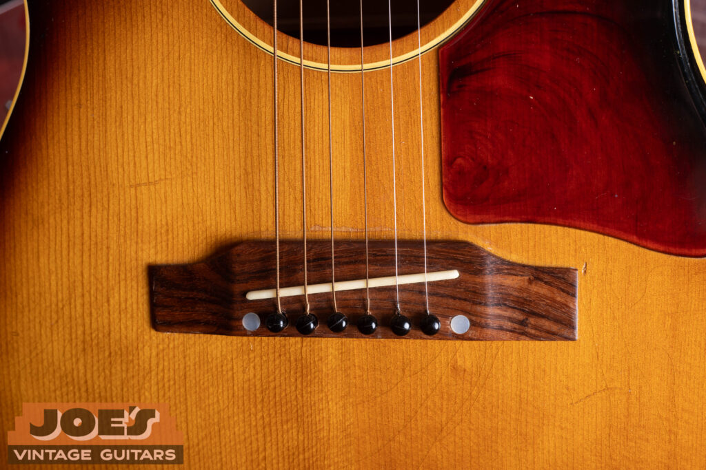
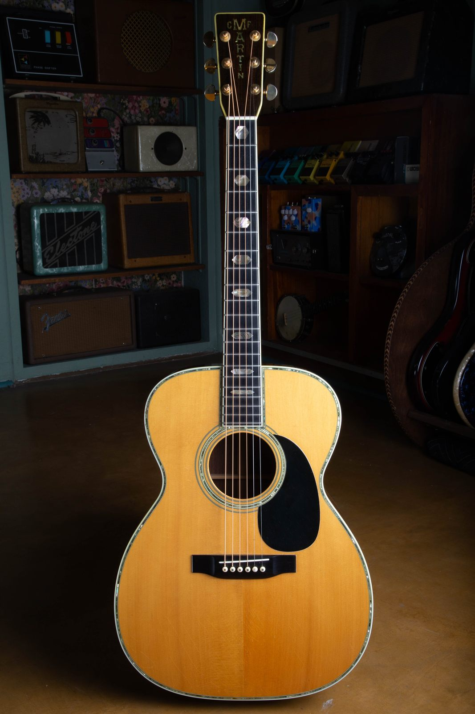

Almost every vintage acoustic I buy will need a neck reset at some point. That isn't a knock on the guitar. A flat-top carries something like 180 pounds of string tension across a thin spruce top, year after year, and over fifty or sixty years the wood slowly gives. The top rises a little behind the bridge, the neck tips forward, and the geometry the factory set in 1948 stops being the geometry you have today.

The good news is you don't need a repair shop to find out where you stand. You need a straightedge and about two minutes.

<h2 id="the-test">The Straightedge Test</h2>

Tune the guitar to pitch first. String tension is part of what you're measuring, so a slack guitar gives you a reading you can't use.

Then lay a straightedge flat along the center of the fretboard, running down the strings and out over the soundhole toward the bridge. It should rest on the frets, not on the fretboard wood, and it needs to be long enough to reach the bridge. A machinist's rule works. So does a metal yardstick, a level, or a stiff piece of cardboard cut straight, which is what I use in the shop when I'm checking a guitar someone just carried through the door.

Now look at where the far end of that straightedge meets the bridge.

  <lite-youtube videoid="5vG9ug5XhTI" params="rel=0&modestbranding=1" title="How to Tell If Your Acoustic Guitar Needs a Neck Reset (Simple 2-Minute Test!)"></lite-youtube>

Three minutes, one straightedge, and a Martin with a filed down bridge as the example. The test itself starts at 1:53.

<h3 id="reading-it">Reading The Result</h3>

There are only two answers, and you can see which one you've got from three feet away.

| Where the straightedge lands | What it means |
| --- | --- |
| **Flush on top of the bridge**, skimming the bridge wood and running to the saddle | The neck angle is healthy. Nothing to do. |
| **Into the front face of the bridge**, hitting the wood below the top surface | The neck has tipped forward. The guitar is due for a reset. |

That's the whole test. If the straightedge is colliding with the front of the bridge instead of lying across the top of it, the neck angle has dropped, and no amount of truss rod adjustment or saddle filing is going to put it back. Those are fixes for other problems.

The deeper the straightedge lands below the top of the bridge, the further the angle has gone. A hair low means you've got some time. Landing halfway down the front face of the bridge means the guitar has been living on borrowed geometry for a while.

<h2 id="why">Why This Happens</h2>

An acoustic guitar is a structure under permanent load. The strings pull the neck toward the bridge and rotate the top around the bridge at the same time, and the only things resisting that are a glued neck joint, a spruce top a tenth of an inch thick, and some braces.

Builders have to keep that structure light. A heavier top with more bracing would hold its shape longer, and it would also sound like a cigar box. So the tone you love and the slow collapse you're measuring come from exactly the same design decision, and every maker from Martin to Gibson to Guild made it the same way.

Give that structure five or six decades and the numbers move. The top bellies slightly behind the bridge. The neck block rotates a fraction of a degree. Neither one is visible on its own, and together they push the strings up away from the frets until the guitar plays like a bow saw above the seventh fret.

Nobody built it wrong. It's the same reason a house settles.

<h2 id="other-signs">The Other Signs</h2>

The straightedge is the direct measurement, but a guitar usually tells you it's heading this way long before anyone puts a rule on it. These show up in a rough order, and they're worth knowing because they're also the trail of evidence a previous owner leaves behind.

**The action climbs.** Not at the first fret, where a nut controls things, but from the seventh fret up, where the neck angle does. The guitar still plays open chords fine and fights you everywhere else.

**Someone lowers the saddle.** This is the correct first move and it buys real time. On a guitar with healthy geometry the saddle stands roughly 2.5mm to 4mm proud of the bridge, which leaves a repair person room to take a little off and hand you back a playable guitar.

<h3 id="saddle">A Saddle Filed To Nothing</h3>

Eventually the room runs out. When the saddle is sitting nearly flush with the bridge and the action is still high, the saddle has been asked to solve a problem it can't reach, and you're looking at the reset.

<figure>

<figcaption>Look at how far the saddle stands above the bridge. That exposed height is the adjustment budget a repair person has to work with, and once it's gone, filing further just kills the string break angle and takes volume with it.</figcaption>
</figure>

There's a second reason a filed-down saddle matters beyond playability. The strings need to press down over the saddle at an angle to drive the top properly. Take the saddle too low and you lose that break angle, and the guitar goes quiet and thin. Players often describe this as the guitar "losing its voice" with age. Usually the guitar hasn't lost anything. Its geometry drifted, someone chased the action down with a file, and the tone went with it.

<h3 id="shaved-bridge">A Shaved Bridge</h3>

Past the saddle, the next thing people do is sand or plane down the bridge itself. That's the one I look for hardest on a guitar I'm buying, and it's the guitar in the video above.

A factory Martin bridge has a known thickness and a known profile. When it's been shaved, the proportions go wrong: the bridge looks thin and flat, the string ramps behind the pins get shallow or disappear, and the edges lose their crisp bevel. It's permanent, it's removing original wood, and it doesn't fix the neck angle either. It just buys another year or two before the same conversation comes back around.

If you find a shaved bridge on a vintage guitar, you've found two jobs instead of one. The neck still needs resetting, and the bridge now needs replacing to put the guitar back where it started.

<h2 id="which-guitars">Which Guitars This Applies To</h2>

Any steel string flat-top with a glued neck joint is a candidate, and that covers most of what people bring me: Martin, Gibson, Guild, Epiphone, Harmony, Kay, and the rest of the American acoustic output from the 1930s through the 1970s.

<figure>

<figcaption>A Martin 000-45. Guitars at this level get reset when they need it and nobody blinks, because the alternative is an instrument nobody can play.</figcaption>
</figure>

A few things change the picture:

- **Dovetail joints** are what Martin, Gibson, and Guild used through the vintage era. Resetting one means steaming or heating the joint apart, so this is the expensive version.
- **Bolt-on necks**, which Taylor built its reputation on and which Martin adopted on many models, come apart with a wrench. Resetting one is a fraction of the cost and time.
- **Classical and nylon string guitars** run much lower string tension, so they drift far more slowly.
- **Archtops** carry the load differently, through a floating bridge and a tailpiece, and the adjustable bridge absorbs a lot of movement a flat-top can't.

Age alone doesn't decide it. I've had 1960s guitars with perfect angles and 1990s guitars that were already done. How hard it was played, what gauge strings lived on it, and how it was stored all matter. A guitar that sat in a hot attic under heavy strings for thirty years ages differently than one that lived in its case.

<h2 id="cost">Cost And Turnaround</h2>

A dovetail neck reset is a full day of skilled bench work spread over several days of glue and finish curing. The neck comes off, the heel gets recut to a new angle measured for that specific guitar, the joint gets shimmed to fit tight, and the whole thing goes back together and gets set up.

Published shop price lists put a glued neck reset in the range of roughly $400 to $1,000 as of 2025, with the spread coming down to where the shop is, how backed up it is, and whether the guitar needs anything else while it's apart. A bolt-on neck reset runs far less. Add a new saddle, and add more if the bridge was shaved and needs replacing or the frets are done.

Turnaround is the part that surprises people. Good acoustic repair people are booked out, and this isn't a job to rush or to hand to whoever is cheapest. Plan on weeks, not days, and ask for the shop's actual queue before you drop the guitar off.

For what it's worth, on a guitar worth keeping this is money well spent. A reset returns the instrument to the geometry it was designed around, which usually means it plays better and sounds better than it has in decades.

<h2 id="value">What It Does To Value</h2>

Three different situations get confused with each other, so here's how each one actually lands.

**A guitar that has already been reset properly.** Almost no penalty. On a sixty year old flat-top, a competent reset is expected maintenance, the same way you'd expect a refret. Collectors care about original finish, original parts, and original bracing. A reset touches none of those. This is not the same category as a refinish.

**A guitar that needs one now.** Discounted, roughly by what the work costs, sometimes a little more because the buyer is also absorbing the wait and the risk. If you're selling, you don't have to fix it first. Price it accordingly and say so plainly, because any buyer who knows the market is going to run the same straightedge test you just read about.

**A guitar somebody tried to shortcut.** This is where real money disappears. A shaved bridge, a sanded-down bridge plate, or a reset done badly enough to leave gaps in the joint or finish damage at the heel all cost more to unwind than the original job would have. On a valuable Martin or Gibson, that can be a serious number.

If you're trying to put a figure on a specific guitar, the model and the year drive far more of it than the neck angle does. Our [Martin value guide](/post/how-to-determine-the-value-of-your-old-martin-acoustic-guitar/) and the [Martin D-28, D-18, and D-45 dreadnought guide](/martin-d-28-d-18-d-45-dreadnought-value-guide/) both cover that side of it, and if you don't know what year your guitar is yet, start with the [Martin serial number guide](/martin-serial-and-model-numbers/).

<h2 id="faq">Frequently Asked Questions</h2>

**Can I fix a neck reset with the truss rod?**

No. A truss rod bends the neck to control relief, the small amount of forward curve along the fretboard. A neck reset changes the angle at which the whole neck meets the body. They're separate adjustments for separate problems, and cranking the truss rod to chase high action usually leaves you with a back-bowed neck that buzzes and still plays high.

**Does my guitar need a reset if the action is high?**

Not necessarily. High action can come from neck relief, a saddle that's too tall, a nut cut high, a lifting bridge, or a bellied top. Run the straightedge test first, because that's the one that separates a neck angle problem from everything else.

**Is a neck reset permanent?**

It should last decades. It isn't literally forever, because the same string tension keeps working on the same wood, and a guitar reset in the 1980s can be ready for another one now. A well done reset on a guitar that gets normal use and reasonable storage is a once in a generation job.

**Should I get a reset before I sell my vintage guitar?**

Usually not. A buyer who's paying vintage money often has a specific repair person they trust, and a reset done to your taste isn't worth more to them than the discount would have been. Take the straightedge photo, describe what you see, and let the price reflect it.

**Can I do it myself?**

I'd point you somewhere else on this one. A dovetail reset means getting steam or heat into a glued joint on an instrument that's sixty years old, and the failure modes are cracked heels, lifted fretboard extensions, and finish damage that costs more than the reset. Bolt-on necks are far more approachable, but on a dovetail this belongs with someone who does them regularly.

<h2 id="help">Not Sure What You're Looking At?</h2>

Run the test, take a photo down the length of the straightedge so the bridge is in frame, and send it over. I look at vintage acoustics all day and I'll tell you what I see. That goes for a guitar you inherited and can't place, and for one you're weighing up before you buy it.

If it's the value side you're after, our [free appraisal](/free-appraisal/) covers Martin, Gibson, Guild, and the rest, and [the seven factors that drive a vintage guitar's value](/post/is-your-vintage-guitar-valuable-7-factors-that-determine-its-value/) explains where a repair like this actually sits in the picture. Owners of smaller Martins can also use the [vintage Martin 0, 00, and 000 guide](/post/martin-0-00-000-history-authentication-value-guide/) to identify the model family and understand how a neck reset fits into the guitar's larger condition story.

