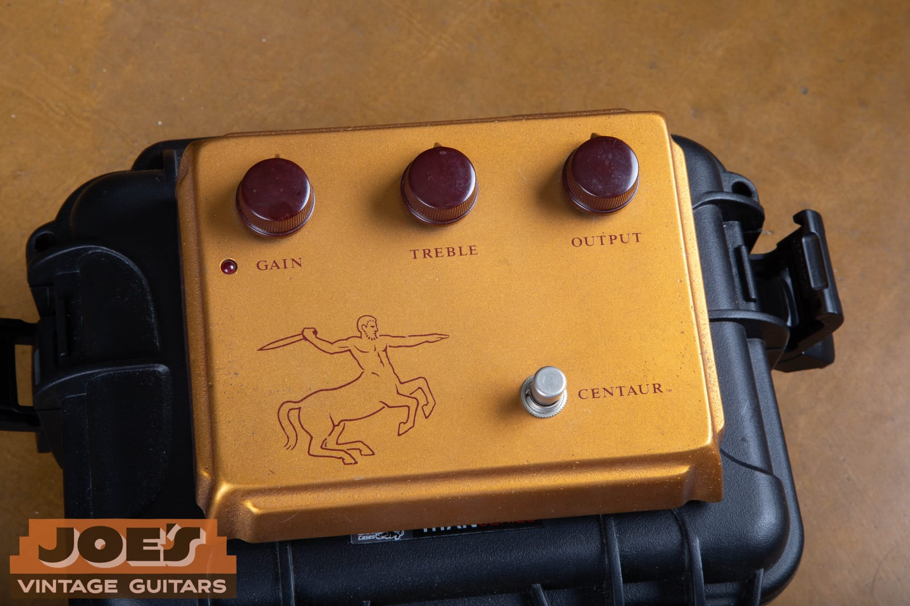
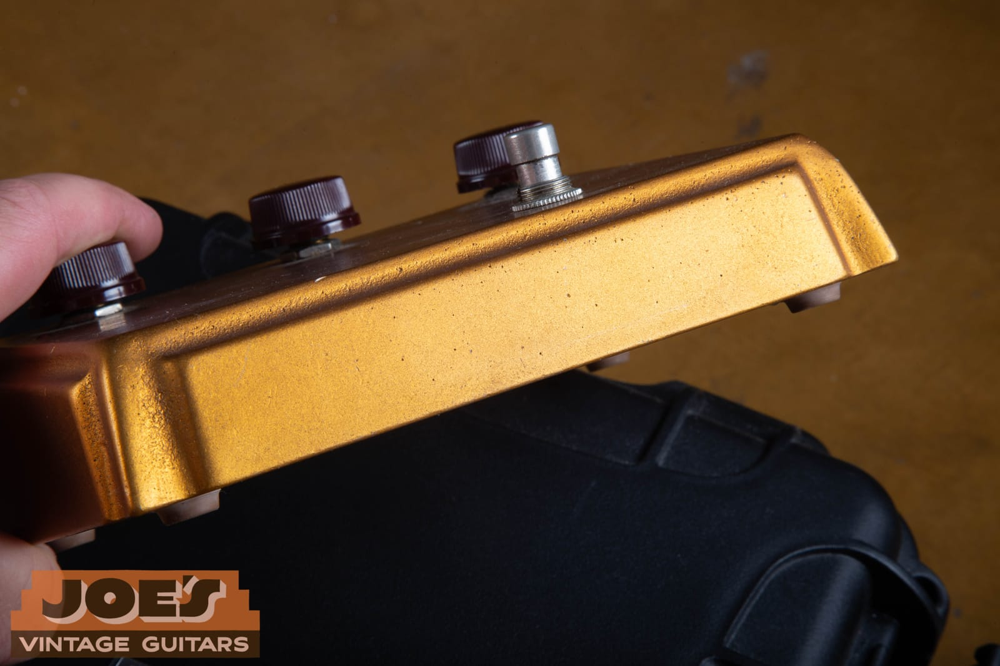
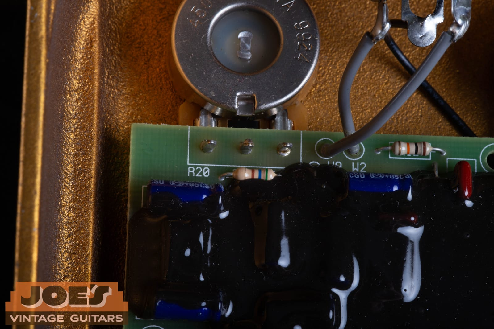
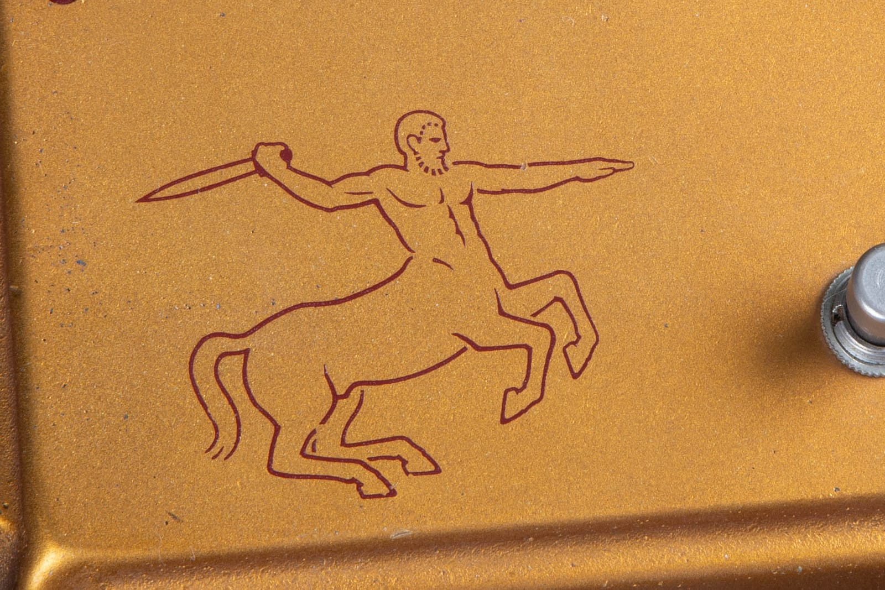
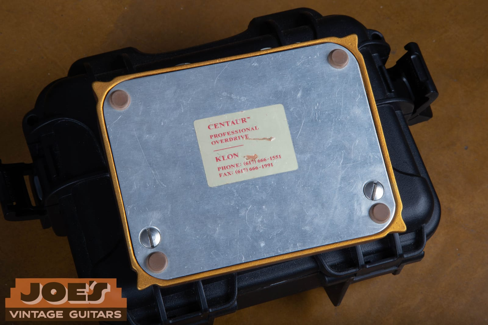
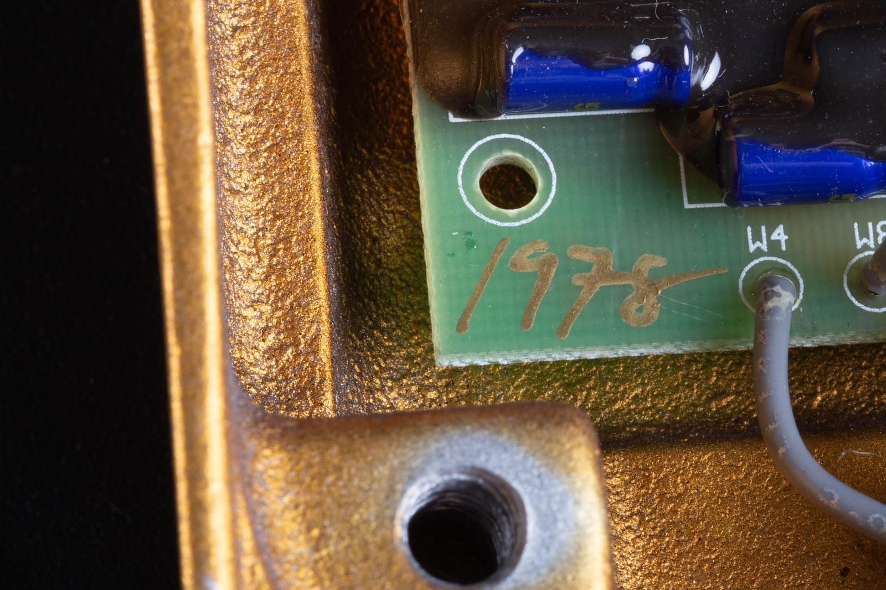
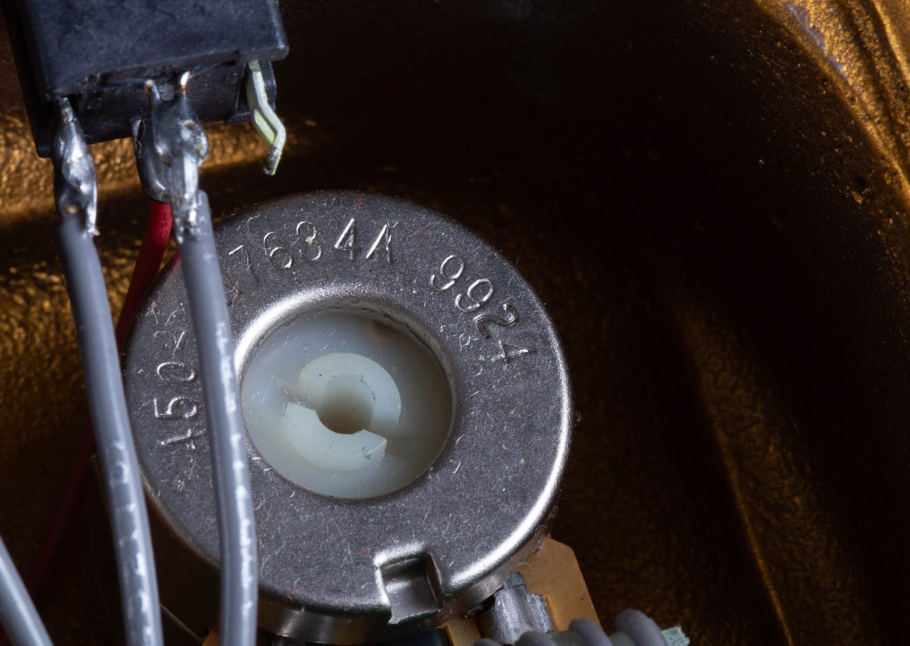
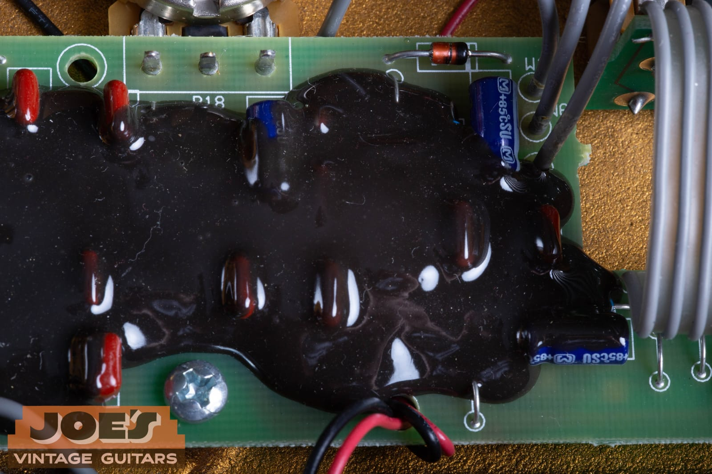
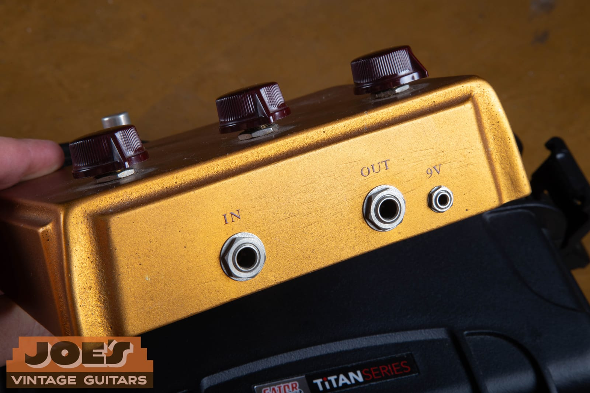
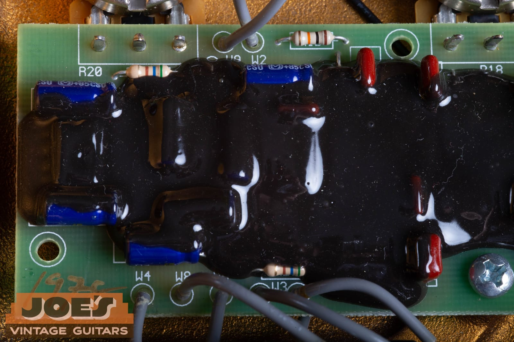

A Klon Centaur is a three-knob overdrive pedal that a guy named Bill Finnegan built by hand, one at a time, on a card table in Massachusetts. It sold for a couple hundred dollars in the 1990s. Today a genuine one is a four-figure item, sometimes a five-figure item, and the market has enough convincing fakes in it that Finnegan himself has gone public with what to look for.

This guide covers three things. What actually makes the circuit sound the way it does, how to tell a real Centaur from a counterfeit, and what one is honestly worth right now. At the end there's a straight comparison against the modern clones, because for most players a clone is the correct answer and there's no shame in saying so.

Everything below is shown on a gold Centaur that came through the shop. We photographed it inside and out, and the details in those photos are what let us date it. If you've inherited one, or you're staring at a listing and trying to work out whether it's real, this is the same process we'd run on the bench.

<figure>

<figcaption><strong>The whole pedal, right there.</strong> Three knobs, one footswitch, one LED. Gain, Treble, Output. Everything the Klon is famous for happens inside a box with no switches, no toggles, and no options. The oxblood Dakaware knobs have no set screws and no white pointer line, which is correct for an original.</figcaption>
</figure>

<h2 id="quick-answer">The Short Version</h2>

If you only read one section, read this one.

| Question | Answer |
| --- | --- |
| **Who made it** | Bill Finnegan, hand-built in the Boston area |
| **Production run** | Late 1994 to roughly 2009, about 8,000 units total |
| **Original price** | Around $225 new, drifting up to about $329 by the end |
| **What it does** | Transparent overdrive that blends a clean path with a clipped path |
| **Key circuit trick** | An internal charge pump running the audio circuit at 18V off a 9V supply |
| **Clipping** | A pair of germanium diodes, hidden under black epoxy |
| **Serial number** | Hand-written by Finnegan on the circuit board, in ink matching the enclosure |
| **Variants** | Gold and silver enclosures, long-tail horse, short-tail horse, and no horse |
| **2026 value** | Roughly $3,000 to $6,500 depending on variant, condition, and completeness |
| **The official successor** | The Klon KTR, 2014, surface-mount, same circuit, a fraction of the price |

<h2 id="history">What The Klon Centaur Actually Is</h2>

Bill Finnegan spent the early 1990s trying to build an overdrive that did what a Tube Screamer wouldn't. He wanted the midrange push, but without the wooly, compressed, mid-humped voice that a Tube Screamer stamps onto everything. He worked on it with two engineers for something like four years before he was happy with it. The pedal went on sale in late 1994.

He built them himself. Not "designed them and had a factory assemble them," but sat down and built them, roughly a pedal and a half a day, for fifteen years. That's the whole story behind the scarcity. There was never a production line to scale up. By the time he stopped around 2009, he'd made somewhere in the neighborhood of 8,000 of them, split roughly evenly between gold and silver enclosures.

The name and the artwork come from Greek mythology. "Klon" is a nod to the Greek word for a shoot or a branch, and the archer on the face is a centaur. The graphic is the single most recognizable thing about the pedal, and as you'll see below, it's also a dating tool.

<figure>

<figcaption><strong>It's a big pedal.</strong> The Centaur takes up serious pedalboard real estate, and that's part of why so many players eventually moved to a clone in a smaller box. The enclosure is cast, not folded sheet metal, and it's heavier in the hand than you'd expect.</figcaption>
</figure>

<h2 id="tone">Why It Sounds The Way It Does</h2>

There's a lot of mysticism around this circuit. There doesn't need to be. The schematic has been public for years, and the reasons it behaves the way it does are all explainable.

**It runs at 18V internally.** The pedal takes a normal 9V supply and uses a charge pump chip to double it, so the audio circuit is working with 18V of headroom. That's the biggest single reason it feels like an amp rather than a pedal. There's room for the signal to move before anything clips, so picking dynamics survive instead of getting squashed flat.

**The gain knob is really two knobs.** It's a dual-gang pot, and it's doing something clever. As you turn it up, one section brings in more of the clipped, distorted signal while the other section adjusts the clean signal blended alongside it. Your dry tone is always present underneath. That's the mechanism behind "transparency." It isn't magic, it's a deliberate clean blend baked into the gain control.

**The clipping is germanium.** Two germanium diodes do the clipping work. Germanium clips softer and rounder than the silicon diodes used in most overdrives, and it contributes to the pedal's less abrasive top end. Those diodes are the components sitting under the black epoxy, and we'll come back to that.

**The treble control is active.** It isn't a passive tone knob that only removes highs. It's an active filter that can cut *or* boost above roughly 400Hz. That's why the Klon can add air and cut on a dark amp instead of just rolling everything off.

**The bypass is buffered.** This is the thing people either love or complain about. When the Centaur is off, your signal still passes through its input buffer. A lot of players think that buffer is half of why a Klon "improves" a rig, particularly with long cable runs. Others hate that it's always in the path. The later KTR added a switch so you can choose.

Put those together and you get the pedal's actual character: a mid-forward push with a lot of headroom underneath it, more open on top than a Tube Screamer, and a gain range that starts as a nearly clean boost and never quite gets to real distortion. It is very good at pushing an already-cooking amp, and it stacks beautifully in front of another dirt pedal. It is not a metal pedal and it never was.

<h2 id="authentication">Authenticating A Real Centaur</h2>

Counterfeits are the reason this section exists. As values climbed past a few thousand dollars, fakes got good enough that Finnegan started publicly posting tells. Some of the newer ones use potentiometers that closely resemble the correct CTS parts, so the old shortcuts don't hold up on their own anymore.

Here's the important framing: **no single check proves a Klon is real.** You want several independent details to agree with each other. A serial number, a pot date code, a graphic style, and a bottom label that all point at the same window is strong evidence. One of them agreeing and the rest not is a warning.

<h3 id="enclosure">The Enclosure Is The Strongest Tell</h3>

This is Finnegan's own dead giveaway, and it's the first thing to check. Genuine Centaurs use **sand-cast** enclosures. Many counterfeits use **die-cast** enclosures, and die-casting leaves evidence.

Two specific things to look for inside the box:

- **Circular flash impressions.** Die-cast enclosures often show three round marks on the inside from the ejector pins. Those do not appear on a genuine sand-cast Centaur.
- **A raised portion of the fin forming the battery compartment.** Finnegan has said flatly that this raised section doesn't exist on any of the sand-cast enclosures he used.

A sand-cast interior looks rough and grainy. It has visible texture, like coarse stone, not the smooth machined-looking surface of a die-cast part. On the pedal in these photos, that texture is exactly what you see once the plate comes off.

<figure>

<figcaption><strong>Look at the walls, not the board.</strong> The interior surface on ours is coarse and grainy all the way around, with no circular ejector marks. That rough cast texture is the single most useful authentication detail on the whole pedal, and it's the one thing counterfeiters have the hardest time faking.</figcaption>
</figure>

<h3 id="graphic">The Horse Graphic Dates The Pedal</h3>

The centaur artwork changed twice over the production run, which gives you three broad eras:

| Graphic | Roughly | Description |
| --- | --- | --- |
| **Long tail horsie** | 1994 to 1998 | Larger centaur, longer sweeping tail |
| **Short tail horsie** | 1998 to 2003 | Smaller figure, shortened tail, redrawn legs |
| **No horsie** | 2003 onward | Graphic removed entirely |

Gold and silver enclosures both exist across the graphic eras, and silver arrived partway through the run. Collectors treat gold horsie units as the desirable ones, but the circuit inside is the same. Anyone telling you a gold one sounds better than a silver one is selling something.

<figure>

<figcaption><strong>The short-tail centaur.</strong> On ours the tail is a short three-strand wisp hanging straight down, ending around the hock rather than sweeping out behind. That's the second-era graphic, which puts the pedal after the 1998 redraw and before the graphic disappeared entirely.</figcaption>
</figure>

<h3 id="label">The Bottom Plate And Label</h3>

Flip it over. A genuine Centaur has an aluminum bottom plate held on with slotted screws, brown rubber bumper feet on the gold pedals (black on the silvers), and a small cream label with red text.

The contact information on that label changed over the years, which makes it another dating anchor. Early pedals carry a fax number only. Middle-era pedals carry a phone number *and* a fax number. Later pedals carry a phone number and a website.

<figure>

<figcaption><strong>CENTAUR, Professional Overdrive, KLON.</strong> Ours carries both a phone and a fax number in the 617 area code, which is the middle of the three label types. The brown 3M bumper feet are correct for a gold pedal. Note the plate is plain brushed aluminum with no printing of its own.</figcaption>
</figure>

<h3 id="serial">Serial Numbers Are Hand-Written</h3>

There's no stamped plate and no sticker with a number on it. Finnegan wrote the serial number **by hand, on the circuit board**, in ink that matches the enclosure. Gold ink on a gold pedal, silver ink on a silver pedal. It's usually near the bottom left corner of the board, which means you have to open the pedal to read it.

Gold units run in a plain numeric sequence. Silver units carry an "S" prefix. A handful of later reissue-era units carry "RG" or "RS" prefixes.

Because the number is handwritten, the handwriting itself is part of the evidence. Finnegan's numerals are consistent across thousands of units, and a shaky or stylistically wrong hand is a red flag on an otherwise convincing pedal.

<figure>

<figcaption><strong>Serial 1978, in gold marker.</strong> This is what a real Klon serial number looks like: written on the board by the man who built it, in ink matched to the enclosure color. You can also see the coarse cast texture of the enclosure wall on the left of this shot.</figcaption>
</figure>

<h3 id="pots">Pot Date Codes Are The Best Cross-Check</h3>

Finnegan used custom CTS potentiometers, and like most CTS pots they carry a date code in YYWW format. Four digits: the last two of the year, then the week.

Treble and Output are single-gang pots. Gain is the dual-gang one described earlier. If a pedal has three identical single-gang pots inside, something is wrong.

Pot codes won't tell you the exact build date, because Finnegan bought parts in batches and worked through them. What they *will* do is set a floor. The pedal cannot have been built before its newest component was manufactured. If a "1995" Centaur has pots dated 2004, walk away.

<figure>

<figcaption><strong>9924.</strong> The date code on ours reads 9924, which is the 24th week of 1999. That's a documented Klon pot code, and it lines up with everything else on this pedal.</figcaption>
</figure>

<h3 id="goop">The Black Goop, And Why You Leave It Alone</h3>

The famous part. Finnegan covered a section of the board in thick black epoxy specifically so people couldn't see which parts he was using. It worked for a while. The circuit was eventually reverse-engineered anyway, but the goop stayed, and it's now one of the pedal's signatures.

What's under there is the clipping section, including the germanium diodes. On a genuine pedal the goop is a glossy black layer that flows over the components and follows their contours, with the tops of resistors and capacitors visible as bumps through the surface. Early units have a duller finish than later ones.

**Do not scrape it off.** We'll say that plainly, because people do. There is no information under that epoxy worth the damage. You cannot get it off cleanly, you will lift pads and break component legs, and a Centaur with disturbed goop takes a serious hit in value because a buyer can no longer tell what was done in there. If you need to verify the pedal, verify the enclosure, the serial, the pots, and the label. Those four are enough.

<figure>

<figcaption><strong>The goop.</strong> Glossy black epoxy poured over the clipping section, with component bodies showing through as ridges. The germanium diodes are under there. The blue Panasonic electrolytics and the striped zener at the top edge are left exposed, which is correct.</figcaption>
</figure>

<h3 id="other-tells">The Rest Of The Checklist</h3>

A few more details worth confirming, all of which are visible without any disassembly beyond removing the bottom plate:

- **The power jack is a 3.5mm mini jack, not a barrel connector.** This one is easy and it's a fast filter. Look at the rear panel: the "9V" hole is a tiny 1/8-inch jack, noticeably smaller than a standard pedal power input. If you see a normal barrel jack on a "Centaur," it isn't one.
- **The jack panel is engraved and filled in red**, reading IN, OUT, and 9V. It's understated. The lettering should match the red of the graphic on the face.
- **The knobs are oxblood Dakaware**, USA-made, with no set screws and no white pointer line.
- **The footswitch is a Carling DPDT**, with its own date stamp on it, which gives you yet another cross-check.
- **The feet are 3M bumpers**, brown on gold pedals and black on silvers.

<figure>

<figcaption><strong>That tiny 9V jack.</strong> IN and OUT are standard quarter-inch jacks. The power input is a 3.5mm mini jack, which is why Klon owners always seem to be hunting for the right adapter cable. It's also one of the quickest ways to sanity-check a photo in a listing.</figcaption>
</figure>

<h2 id="dating-ours">Dating The One In These Photos</h2>

Here's the process run end to end on the pedal above, because a worked example is more useful than a checklist.

Four independent details, and what each one says:

1. **Serial 1978**, hand-written in gold marker on the board. Places it in the middle of the numeric gold sequence. For reference, documented units around #171 are 1994 and around #1169 are 1997.
2. **Pot date code 9924.** The 24th week of 1999. The pedal cannot have been built before mid-1999.
3. **Short-tail centaur graphic.** The 1998-to-2003 window.
4. **Phone and fax label.** The middle of the three label variants, not the earliest and not the latest.

All four converge on the same answer: **a gold short-tail Centaur built in or shortly after mid-1999.** No single item proves it. The fact that four unrelated details agree is what makes the conclusion solid, and the fact that none of them contradict each other is what tells you nobody has assembled this pedal out of parts.

One honest caveat. Finnegan is the only person who can definitively confirm a serial number against his own records, and he has historically been willing to answer that question for owners. If you're buying at the top of the market, that confirmation is worth chasing. What we're describing here is bench-level verification, which is what you can do yourself with a screwdriver and good light.

<figure>

<figcaption><strong>A hand-built board.</strong> Through-hole parts, hand-soldered joints, hand-dressed grey wire, and a proper silkscreen with reference designators. The build quality is tidy but it is unmistakably one person working at a bench, not a machine.</figcaption>
</figure>

<h2 id="value">What A Real Klon Is Worth In 2026</h2>

Let's be honest about how wide the spread is. Original Centaurs generally trade somewhere between $2,000 and north of $5,000, with clean, complete, desirable-variant examples pushing higher and the occasional headline sale going far past that. The eye-watering five-figure numbers you see quoted are outliers: first-year pedals, very low serials, or units with unusual provenance.

Here's where the market sits in broad strokes:

| Variant | Typical 2026 range | Notes |
| --- | --- | --- |
| **Gold, long-tail horsie** | $4,500 to $6,500+ | Earliest and most collected. Low serials go higher |
| **Gold, short-tail horsie** | $4,000 to $5,500 | The middle-era pedal, like the one shown here |
| **Silver horsie** | $3,500 to $5,000 | Same circuit, generally a step behind gold |
| **No horsie (gold or silver)** | $3,000 to $4,500 | Latest units, usually the cheapest way into a real one |
| **Klon KTR** | $650 to $1,600 | Sold for $269 new in 2014. Averages near $900 used |

Treat those as a working range, not a quote. Pedal values move faster than guitar values, and a single high-profile sale can drag an entire variant's asking prices up for months.

**What moves the number within a range:**

- **Originality.** Untouched goop, original knobs, original feet, no added true-bypass mod. Any internal modification is a real deduction.
- **The box and paperwork.** Klon boxes and manuals survive at a much lower rate than the pedals. A complete package is worth meaningfully more.
- **Cosmetics.** The gold finish scuffs and dulls with pedalboard use, and heavy velcro residue on the bottom plate is common. Clean examples command a premium.
- **Verification.** A pedal that has been confirmed by Finnegan, or that comes with a documented ownership history, sells faster and higher.
- **Working condition.** Obvious, but worth stating. These are thirty-year-old electronics with electrolytic capacitors in them.

If you've inherited one, or you're clearing out a collection that has one in it, the same advice applies as with a guitar: find out what it is before you list it. We do [free appraisals](/free-appraisal/), and we [buy amps and effects](/sell-an-amplifier-or-effect/) as well as guitars.

<h2 id="clones">The Klon vs The Clones</h2>

Now the part that matters to most players, because most players are not going to spend five thousand dollars on an overdrive pedal.

The Centaur circuit has been public for years. There are dozens of pedals built on it, and a fair number of them get genuinely close. ToneIsland put together a solid roundup of the leading options, and rather than duplicate their work we'd point you at it directly: [their guide to the best Klon Centaur clones](https://toneisland.com/best-klon-centaur-clones-pedals/). Below is our take on the same nine pedals, with the emphasis on how each one relates to the original.

| Pedal | Rough street price | How it relates to a real Centaur |
| --- | --- | --- |
| **Wampler Tumnus** | $150 to $200 | Widely considered one of the closest. USA-built, tiny enclosure, and the Deluxe adds a full EQ the original never had |
| **J. Rockett Archer Ikon** | ~$200 | Germanium diodes, tank-like build. The gold version is voiced closer to an original than the silver |
| **PRS Horsemeat** | Mid-range | Adds voice and bass controls. Richer midrange, more flexible, further from a straight copy |
| **MXR Sugar Drive** | ~$120 | Close, direct recreation in a mini box, with a switch for true bypass or buffered |
| **Way Huge Conspiracy Theory** | Mid-range | Jeorge Tripps design in the compact Smalls format. Well-built and faithful |
| **Keeley Oxblood** | ~$200 | An interpretation rather than a clone. A "phat" switch and a clipping toggle take it past the original's range |
| **EHX Soul Food** | ~$85 | Silicon diodes instead of germanium, so a slightly harder edge. Wider gain range. The bargain benchmark for years |
| **Tone City Bad Horse** | ~$50 | No-frills, no options, surprisingly good for the money |
| **Mosky Silver Horse** | $30 to $40 | The cheapest way to hear the general idea. Component quality and reliability are what you're giving up |

**Where the clones genuinely differ from an original.** A few honest observations from having both on the bench:

- **Diode choice is the biggest audible variable.** The germanium-equipped clones (Archer Ikon, Tumnus) sit closer to the original's softer clipping. Silicon-diode versions like the Soul Food have a harder edge as you push them. Neither is wrong, but they aren't the same.
- **Bypass behavior matters more than people expect.** The original is always buffered. Several clones let you choose. If you liked what a Klon did to your rig when it was *off*, a true-bypass clone will not do that.
- **Extra controls change the pedal's job.** The original's three knobs are a constraint, and part of its charm is that it does one thing. A clone with a bass control and a voicing switch is a more useful pedal and a less faithful one. Decide which you actually want.
- **Enclosure size is a practical difference.** The Centaur is large. The Tumnus, Sugar Drive, and Conspiracy Theory all do a similar job in a fraction of the board space.

**A note on the Behringer situation.** In 2025 Finnegan sued Behringer's parent company over its $69 Centaur Overdrive, calling it a counterfeit rather than a clone. Behringer redesigned the graphic and renamed the pedal, first to Centara and then to Zentara, and the suit was dismissed. It's worth knowing about, because a lot of the original-graphic Behringer units got flipped online at absurd markups during the dispute.

<h2 id="which">Should You Buy The Original Or A Clone?</h2>

Straight answer, split by who's asking.

**Buy a clone if you want the sound.** This isn't a compromise position. A good Klon clone gets you most of the way there for two percent of the money, in a smaller box, with a warranty and a return window. If your goal is to plug in and hear that mid-forward push in front of a cooking amp, buy the Tumnus or the Archer Ikon and stop thinking about it.

**Buy a KTR if you want the sound from the source.** Finnegan designed it, it uses the same circuit, and he's on record saying it sounds identical to a vintage gold or silver Centaur. It's surface-mount, it's smaller, and it has a bypass switch the original doesn't. Used prices have climbed well past its $269 launch price, but it's still a fraction of an original.

**Buy an original if you want the object.** That's the honest framing. You're buying a hand-built artifact with a hand-written serial number on it, made by one person over fifteen years, and the market has decided that's worth several thousand dollars. It is a collectible first and a tool second. Nothing wrong with that, as long as you know that's the trade you're making.

**Sell an original if you inherited one and don't play.** A Centaur sitting in a drawer is several thousand dollars sitting in a drawer, and it's one of the few pieces of gear where the resale market is genuinely liquid. Just get it identified properly first, and don't let anyone talk you into a "quick offer" before you know which variant you have.

<h2 id="faq">Frequently Asked Questions</h2>

**Why is the Klon Centaur so expensive?**

Scarcity plus reputation. Roughly 8,000 were ever made, all by one person, over fifteen years, and production stopped in 2009. Then a string of well-known players put them on their boards and the pedal became the reference point for an entire category of overdrive. Supply is fixed and demand isn't.

**Does the gold one sound better than the silver one?**

No. The circuit and component values are the same. The price difference is collector preference, not tone.

**Can I tell if a Klon is real from photos in a listing?**

Partly. You can check the graphic era, the label style, the jack panel, and whether the power input is a 3.5mm jack. You cannot check the enclosure casting, the serial, or the pots without interior photos. Ask the seller for shots of the inside with the bottom plate off. A legitimate seller will not object.

**What's under the black epoxy?**

The clipping section, including the two germanium diodes. The circuit was reverse-engineered years ago, so there's no secret left. Leave the goop alone anyway.

**Is the buffer really that good?**

It's a well-designed buffer and it does what a buffer does, which is drive long cable runs without losing high end. Whether it "improves" your tone depends entirely on your rig. The mythology around it outruns the engineering.

**Will removing the goop or modding it hurt the value?**

Yes, significantly. Any internal alteration on a pedal whose value rests on originality is a deduction, and disturbed epoxy specifically makes a buyer suspicious about what else was done in there.

**How do I get a Klon officially verified?**

Finnegan has historically been willing to check a serial number against his records for owners who reach out. Short of that, a thorough interior inspection against the tells in this guide is what you can do yourself.

<h2 id="closing">Closing Thoughts</h2>

The Klon Centaur is a genuinely well-designed overdrive that got swept up in a collector market, and both of those things can be true at once. The circuit does something real: 18V of headroom, a clean blend built into the gain control, and soft germanium clipping. It earned its reputation before the price got silly.

If you own one, know what you have. Take the bottom plate off, read the serial, read the pot codes, look at the casting texture, and photograph all of it. Those photos are what a serious buyer will ask for, and having them ready is the difference between a fast sale at a fair number and a month of back-and-forth.

If you're buying one, make the seller show you the inside. Every meaningful authentication detail on this pedal lives under that plate.

We buy, sell, and appraise vintage gear, including amps and effects, out of our shop in Mesa, Arizona. If you've got a Klon and you want to know what it is and what it's worth, [get in touch](/contact-me/) or start with a [free appraisal](/free-appraisal/). If you're clearing out a whole rig, we handle [amps and effects](/sell-an-amplifier-or-effect/) alongside the guitars.
