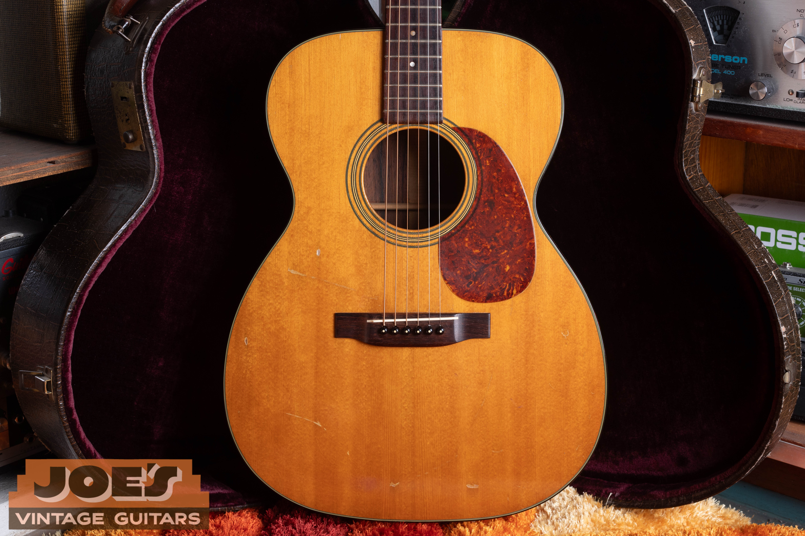
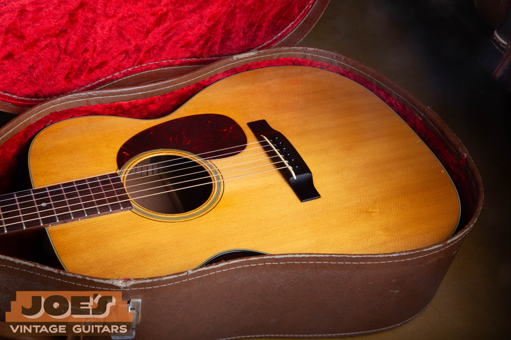
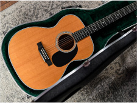

Every guitar has a story, but a Martin model stamp only tells you the first sentence. A 1929 12-fret 000-28, a 1935 14-fret 000-28, and a 1965 000-28 all share the same basic model name. They do not share the same body geometry, bracing, neck reinforcement, top wood, tuners, response, scarcity, or market value.

That is why I never identify or price an old Martin from the model number alone. I start with the stamp and serial number, then work outward: body measurements, neck joint, scale length, wood, trim, bracing, bridge plate, bridge, finish, frets, tuners, repairs, and provenance. Each detail has to make sense for the year.

This guide covers the historically important production families in Martin’s 0, 00, and 000 sizes. Martin also built prototypes, employee guitars, special orders, and one-off combinations that never appeared as regular catalog models. Those instruments have to be judged on their own evidence and, when possible, factory records.

## How Martin Model Numbers Work

Martin’s model names are compact specification labels. The number before the hyphen identifies the body size. The number after the hyphen identifies the style, which traditionally controlled the wood combination and level of ornament.

In **00-28**, for example:

- **00** means the Grand Concert body family.
- **28** means Style 28 appointments and, in the classic periods collectors care about most, a spruce top with rosewood back and sides.

The style number began as a price. In the 1850s, a Style 27 guitar cost $27. Over time, those numbers stopped being literal prices and became a durable vocabulary for construction and trim.

Suffixes matter. **K** generally identifies koa construction. **H** identifies a Hawaiian setup. **G** and **C** identify gut-string and classical families. **NY** means New Yorker. **S** can mean special or custom, and on some later models it is associated with 12-fret construction. **E** identifies factory electronics in later periods. Treat the entire stamp as the model.

## Martin 0 vs. 00 vs. 000

The three body sizes form a useful progression, but the measurements can vary by period and by 12-fret or 14-fret construction. Measure the guitar in front of you instead of assuming every example follows one modern chart.

| Size | Traditional Name | Approximate Lower Bout | General Character |
| --- | --- | --- | --- |
| 0 | Concert | About 13 1/2 inches | Focused, immediate, and surprisingly deep for its width |
| 00 | Grand Concert | About 14 1/8 inches | Balanced, responsive, and often the “just right” small Martin |
| 000 | Auditorium | About 15 inches | Broader bass, more top area, and greater headroom |

An 0 tends to give notes a quick, centered attack. A 00 adds air without losing the intimacy that makes a small Martin so useful. A 000 offers more spread and low-end reach, particularly for a player who wants a small-body feel with enough room for a stronger right hand.

Those are tendencies, not guarantees. A lightly built 12-fret 00 can sound larger than a later, more heavily built 000. Bracing, bridge plate, top stiffness, repairs, and setup can outweigh the outline.

A 1956 Martin 000-21 from my archive. Style 21 delivers the rosewood voice with plainer trim than Style 28.

## The 12-Fret and 14-Fret Divide

The neck-to-body joint changes more than upper-fret access.

A **12-fret Martin** joins the body at the 12th fret. Most have a longer body, sloped shoulders, and a slotted headstock. The bridge sits closer to the acoustical center of the lower bout. That geometry often produces a warmer, more open response with strong fundamental bloom.

A **14-fret Martin** joins at the 14th fret and usually has a solid headstock. The body and bridge relationship changed as Martin moved toward the modern silhouette. These guitars generally give easier access above the 12th fret and can feel quicker and more direct.

Do not treat slotted versus solid headstock as a rule without exceptions. Special orders and later reissues can blur the usual pattern. Confirm the body length, scale, nut width, neck joint, and model stamp together.

### OM Versus 000

The classic OM and 14-fret 000 share the same basic body outline, which causes endless confusion. A traditional early OM combines the 000-size body with a 25.4-inch scale, 14 frets clear of the body, and a wider nut. Most later standard 000 models use a shorter scale near 24.9 inches. Modern special editions can mix these specifications, so measure before labeling.

## Martin 0, 00, and 000 Model Families

Not every size and style was available in every year. The list below covers the documented families and historically important variants collectors are most likely to encounter.

| Style | Important 0, 00, and 000 Models | Traditional Identity |
| --- | --- | --- |
| Style 15 | 0-15, 00-15, 000-15 | All mahogany, minimal ornament, dry and direct response |
| Style 17 | 0-17, 00-17, 000-17 | All-mahogany economy family, sometimes dark or black finished |
| Style 18 | 0-18, 00-18, 000-18 | Spruce over mahogany, restrained trim, benchmark workhorse |
| Style 18K | 0-18K, 00-18K, 000-18K | Koa construction; early examples may have Hawaiian setup |
| Style 21 | 0-21, 00-21, 000-21, 00-21NY | Rosewood body with plainer trim than Style 28 |
| Style 28 | 0-28, 00-28, 000-28 | Spruce over rosewood; pre-1947 examples are associated with herringbone top trim |
| Gut/Classical 28 | 00-28G, 00-28C, 000-28C | Gut-string or classical construction, not steel-string equivalents |
| Styles 30 and 34 | 0-30, 0-34, and scarce early combinations | Elaborate 19th-century marquetry and pearl vocabulary |
| Style 40 and 40H | 00-40H and rare early Style 40 instruments | Pearl-trim family; 00-40H was built for Hawaiian playing |
| Style 42 | 0-42, 00-42, 000-42 | Pearl around the top and fingerboard-extension area |
| Style 45 | 0-45, 00-45, 000-45 | Martin’s flagship trim, with extensive pearl on top, sides, and back |

### Styles 15 and 17

The all-mahogany Martins have fewer decorative distractions, which makes construction and condition especially easy to read. Good examples can be light, dry, and exceptionally responsive. Their simpler appointments generally keep them below equivalent Style 18, 21, or 28 guitars in price, but clean prewar examples have a serious following.

### Style 18 and the Koa Variants

Style 18 is the small-body Martin benchmark: spruce top, mahogany back and sides, and restrained black-and-white trim. The 0-18, 00-18, and 000-18 each have their own following. The K-suffix instruments require closer attention because koa construction and Hawaiian setup can change both identity and value. A Hawaiian guitar converted for standard Spanish playing should be evaluated for the quality and reversibility of the work.

This 1960 000-18 shows why the model remains a practical vintage benchmark: simple materials, clean response, and no ornament added just for show.

### Style 21

Style 21 gives you rosewood construction without the top-border treatment associated with Style 28. Depending on the period, details can include a herringbone rosette and understated fingerboard appointments. The long-running 12-fret 00-21 is a connoisseur’s model. The later 00-21NY is a distinct New Yorker variant and should be evaluated by its exact specifications rather than treated as an ordinary 00-21.

### Style 28

For many collectors, Style 28 is the center of the rosewood Martin market. Before 1947, the herringbone top border is one of its most recognizable features. Herringbone alone does not authenticate a guitar. The rosette, binding, backstrip, fingerboard inlay, bridge, bracing, bridge plate, and serial-era construction all have to agree.

The 00-28G, 00-28C, and 000-28C are gut or classical families. Their necks, bracing, bridges, and intended string tension differ from steel-string models. Converting one or fitting it with inappropriate strings can cause permanent damage.

### Styles 40, 42, and 45

Pearl-trim small Martins sit near the top of the market, but each style has its own trim map. Style 42 carries pearl around the top and fingerboard-extension area. Style 45 extends the treatment to the back and sides. Prewar 000-45 guitars are among the most desirable Martins ever made.

The 00-40H, built from 1928 through 1939, was intended for Hawaiian playing. Before pricing a converted example, I want to know exactly what was changed at the nut, saddle, bridge, frets, neck angle, and fingerboard.

## Woods and Trim Levels

### Top Woods

Red spruce, commonly called Adirondack spruce in the vintage market, is associated with the most desirable pre-1946 steel-string Martins. It can be stiff, dynamic, and visually variable. Sitka spruce became normal during 1946. A distinctive group of 1953 tops is often identified as Engelmann or government-surplus spruce.

Do not identify spruce from color alone. Aging, finish, oxidation, grain width, runout, and lighting can mislead even experienced eyes. When the species materially affects value, compare the individual guitar with documented examples and construction records.

### Back and Side Woods

- **Mahogany** defines the traditional Styles 15, 17, and 18. It tends to sound immediate, clear, and less reflective than rosewood.
- **Brazilian rosewood** defines the classic Style 21, 28, 42, and 45 families through 1969 standard production. Figure and color vary widely.
- **East Indian rosewood** replaced Brazilian rosewood in regular production after 1969.
- **Koa** appears in K models and special runs. Early koa guitars may also carry Hawaiian construction details.
- Early Martin production can include maple, Gonçalo Alves, veneered bodies, and other period materials. These need period-specific research.

### Trim as Evidence

Trim should be read as a system. Count the top purfling lines. Examine the rosette pattern, binding material and color, backstrip, end graft, fingerboard inlay, headstock treatment, and pearl boundaries. Replacement binding and refinished surfaces can make a guitar look cleaner while erasing evidence collectors need.

## Bracing Changes by Era

Bracing is one of the most important parts of the guitar, and one of the easiest areas to misrepresent in a sale listing. Use a mirror, light, or internal camera. Look at the X position, scalloping, tone bars, brace ends, glue residue, bridge plate, and any added patches.

| Era | Bracing and Structural Features | Collector View |
| --- | --- | --- |
| Before 1898 | Pre-serial, often built for gut; construction varies by period and style | Rare and historically important, but condition and string safety are critical |
| 1898 to 1915 | Serial era begins; most guitars remain gut-string designs | Delicate tops and small bridge plates demand conservative setup |
| 1916 to 1929 | Steel first appears through Hawaiian orders; Spanish steel regulation spreads by style | Transitional guitars require individual inspection |
| 1929 to 1934 | OM development and 14-fret transition; bar frets and ebony reinforcement are important markers | Light construction and early modern geometry drive demand |
| 1934 to 1938 | T-frets and steel T-bars arrive; forward-positioned scalloped X-bracing defines much of the peak period | Among the most desirable steel-string Martins |
| 1939 to 1944 | Rear-shifted X-bracing remains scalloped; wartime substitutions appear | Still extremely desirable, with year-specific features |
| Late 1944 to 1946 | Scalloping ends; tapered braces appear; red spruce gives way to Sitka during 1946 | Transitional examples vary and should not be described loosely |
| 1947 to 1964 | Sitka becomes standard and construction gradually grows more robust | Excellent working vintage guitars, generally below comparable prewar values |
| 1965 to 1969 | Short saddle transition; maple bridge plate arrives in 1968; Brazilian rosewood ends in 1969 | Late Brazilian examples remain desirable, but originality is decisive |
| 1970s and Later | Larger bridge plates and heavier builds appear; later vintage-style reissues return to older specifications | Judge exact specifications, not silhouette or marketing name |

Steel-string regulation did not happen to every style on one date. Style 17 was regulated for steel around 1922, Style 18 around 1923, and Style 28 around 1926. Those dates are useful guideposts, not permission to install modern medium strings. Top thickness, bridge plate, repairs, neck angle, and distortion matter more than a date printed in a chart.

The X-brace position also changed at different times by body size. On 0 and 00 models, the shift occurs around 1935 to 1936. On 000 models, the important change comes around the middle of 1938. Production transitions can overlap, so the individual guitar wins every argument.

## Tuners, Bridges, and Other Dating Details

Tuners are useful because replacements often leave footprints. Look for extra screw holes, altered post holes, finish shadows, bushings that do not match, and plate outlines under the current machines.

Early instruments may have engraved plates with ivory or pearl buttons. Later guitars can carry Waverly or Grover open gears, wartime Kluson variants, and postwar enclosed machines. Button material, plate shape, gear orientation, screw spacing, plating, and stamped markings all matter. Clean tuners are not automatically original, and tarnished tuners are not automatically old.

Bridges changed too. Early guitars may use ebony or ivory pyramid bridges. Belly bridges became normal in the 1930s. A long through-saddle is expected through the classic and early postwar periods, with the short drop-in saddle arriving in the mid-1960s. Check the footprint, thickness, belly orientation, pin spacing, saddle angle, and tool marks. A shaved bridge or oversized replacement can lower both tone and value.

The bridge plate deserves the same attention. A small, original rosewood plate is very different from an oversized repair plate. Martin changed to a maple bridge plate in 1968, and later plates grew larger. Added wood, plugged pin holes, or heavy glue can signal repair work that is invisible from the outside.

## How to Authenticate a Vintage Martin

I inspect an old Martin in a fixed order so one exciting feature does not distract from a larger problem.

1. **Read the model and serial stamps.** On many later vintage Martins, these are on the neck block. Earlier instruments may use a serial stamp, backstrip stamp, headstock stamp, or label.
2. **Measure the body and neck geometry.** Confirm lower bout, body length, depth, scale, nut width, 12-fret or 14-fret joint, slotted or solid headstock, and heel shape.
3. **Identify the woods carefully.** Check the top, back, sides, neck, fingerboard, and bridge. Do not identify Brazilian rosewood or red spruce from one photograph.
4. **Inspect the bracing and bridge plate.** Confirm X position, scalloped, tapered, or straight carving, tone-bar count, plate wood, and plate size.
5. **Read the finish under strong light.** Black-light response, pore fill, lacquer checking, overspray, color under the tuners, and protected edges can reveal refinishing or touch-up.
6. **Inspect the bridge and pickguard.** Check footprints, thickness, pin spacing, saddle slot, shrinking, curling, and finish disturbance.
7. **Check the neck reinforcement and frets.** Bar frets versus T-frets, ebony rod versus steel T-bar, neck carve, nut, and evidence of a neck reset should agree with the year.
8. **Check the tuners and hardware.** Match the machines, bushings, buttons, pins, nut, saddle, and endpin to known period patterns.
9. **Map every repair.** Record cracks, cleats, patches, replaced braces, top distortion, neck work, finish work, and altered wood.
10. **Reconcile the history.** Receipts, photographs, the case, family accounts, and factory records should support the physical evidence, not override it.

> Never choose string tension by model name alone. A 1920s Martin may be gut-braced, built for Hawaiian steel, or converted later. Have its top, bracing, bridge plate, bridge, and neck angle evaluated before stringing it.

## Which Eras and Years Are Most Desirable

The highest collector demand generally centers on original prewar steel-string examples. The late 1920s through 1938 combine light construction, red spruce, hide glue, scalloped bracing, and the development of modern 14-fret geometry. Pearl-trim 42 and 45 models sit at the top, while prewar herringbone Style 28 guitars carry a major premium.

The years 1939 through 1944 remain exceptionally desirable. The bracing is rear-shifted but still scalloped, and wartime guitars can have distinctive neck reinforcement and tuner combinations. Late 1944 through 1946 is a transition that deserves careful description because scalloping ends, tapered bracing appears, and top wood changes.

Postwar 1947 to 1964 Martins are often excellent instruments and can offer a more accessible path into vintage ownership. Pre-1969 Brazilian rosewood guitars remain desirable, but a clean 1950s or 1960s guitar does not automatically outrank an earlier guitar with honest professional maintenance. Condition, originality, and sound still matter.

The 1970s are usually valued below comparable earlier examples because of heavier construction and larger bridge plates, although an exceptional guitar can outperform the stereotype. Later Authentic, Vintage Series, New Yorker, Custom Shop, and limited models need to be judged by their actual specifications. A vintage-looking name is not the same thing as vintage construction.

## What a Vintage Martin Is Worth

There is no honest single price for “a Martin 00” or “an old 000.” I begin with recent sold examples from the same model, size, year band, and condition. Active asking prices can show seller expectations, but they do not prove market value.

I then adjust for:

- **Era and rarity:** prewar steel-string construction, documented scarce variants, pearl styles, and short production runs.
- **Originality:** finish, bridge, bridge plate, tuners, pickguard, nut, saddle, and unaltered wood.
- **Structural condition:** cracks, top distortion, loose or replaced braces, neck angle, bridge condition, and repair quality.
- **Maintenance:** a well-executed neck reset or refret is often value-preserving maintenance. Poor work is not.
- **Sound and playability:** collectors care about originality, but musicians still need the guitar to function.
- **Provenance:** documentation matters most when it is specific, credible, and consistent with the instrument.
- **Market timing:** buyer demand and the number of comparable guitars available can move quickly.

A refinish, retop, oversized bridge plate, shaved bridge, changed pearl, or serious structural distortion can create a substantial discount. A correct-looking replacement is still a replacement. The right way to describe one is plainly, without hiding behind words such as “restored” or “period correct.”

The model name gets you into the right neighborhood. The year, structure, originality, repairs, and sound determine the address.

## The Rule I Come Back To

Buy the guitar in front of you, not the legend attached to it.

The best small Martins combine honest structure, period-correct details, and a voice worth preserving. A serial number gives me a starting year. The wood, bracing, bridge plate, finish, hardware, and tool marks tell me the rest.

If you have a Martin 0, 00, or 000 that you would like identified, appraised, or sold, send me a few clear photographs through the [free appraisal page](/free-appraisal/). You can also learn more about [selling a vintage Martin](/sell-my-martin-guitar/) or check the site’s [Martin serial and model number guide](/martin-serial-and-model-numbers/).
