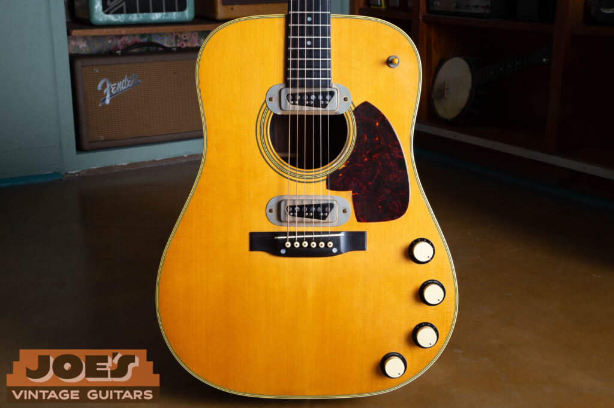
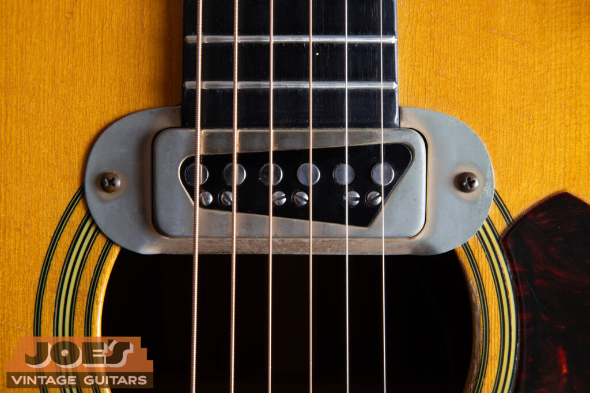
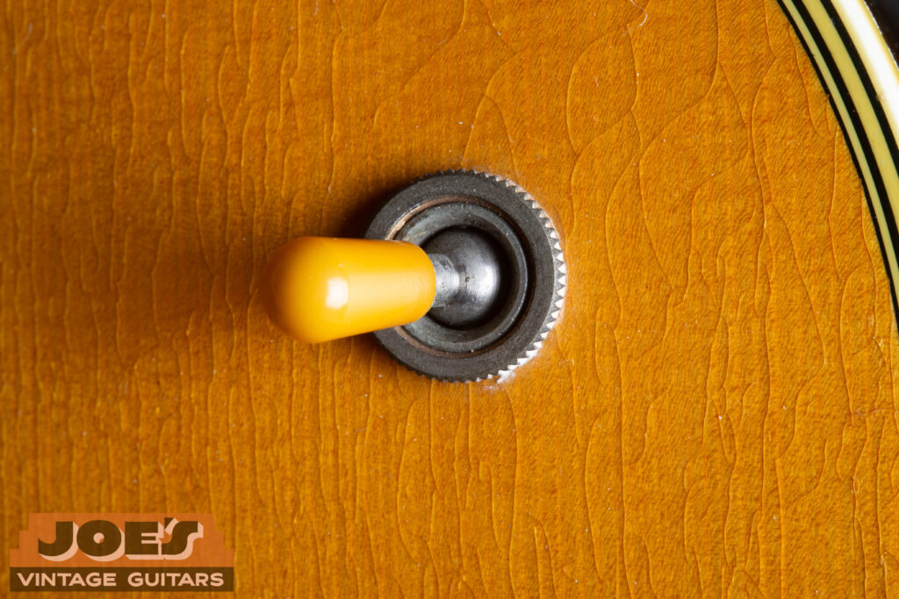
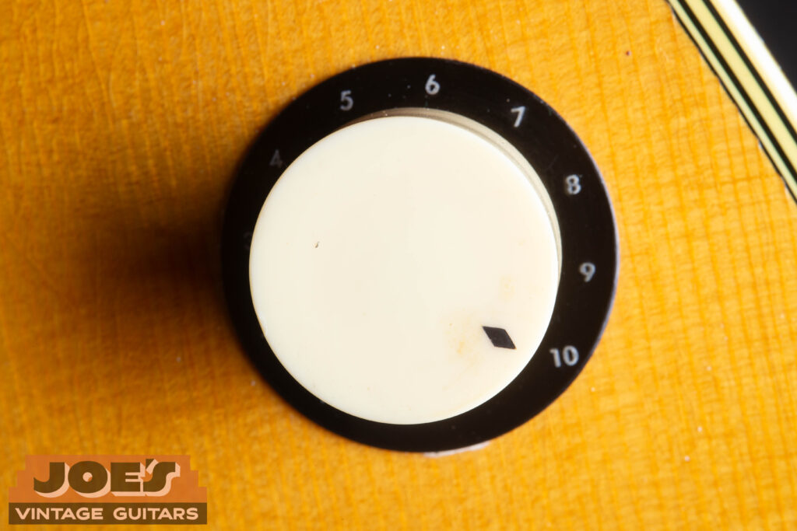
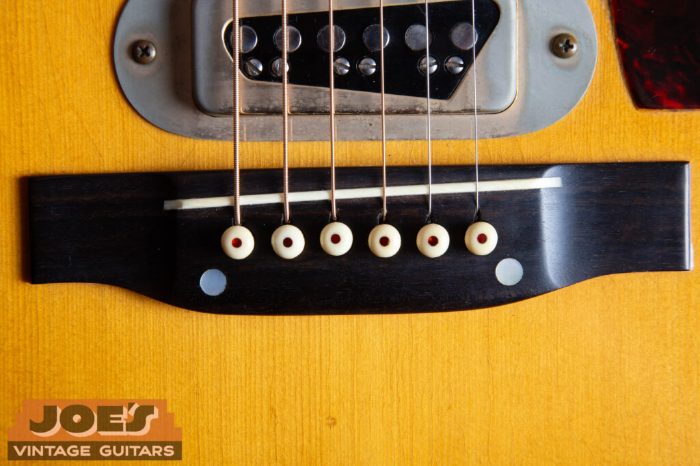
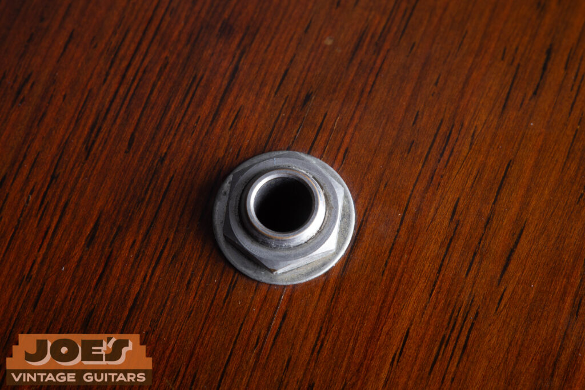
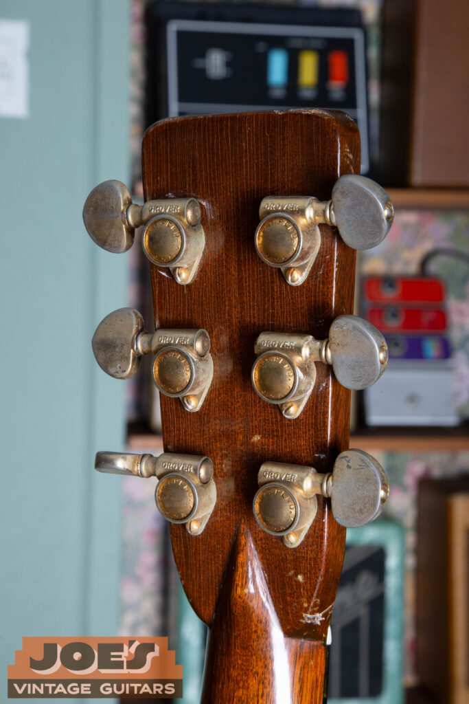
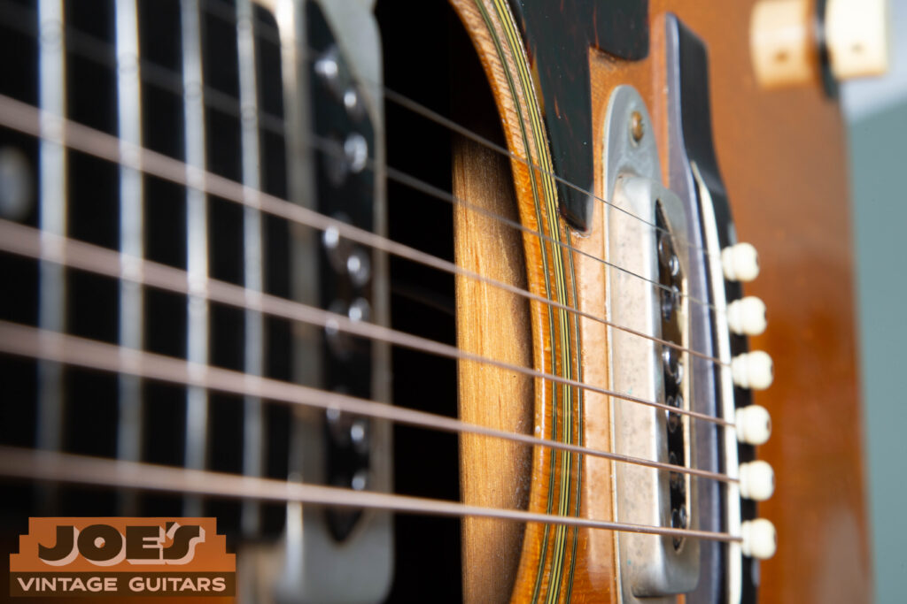
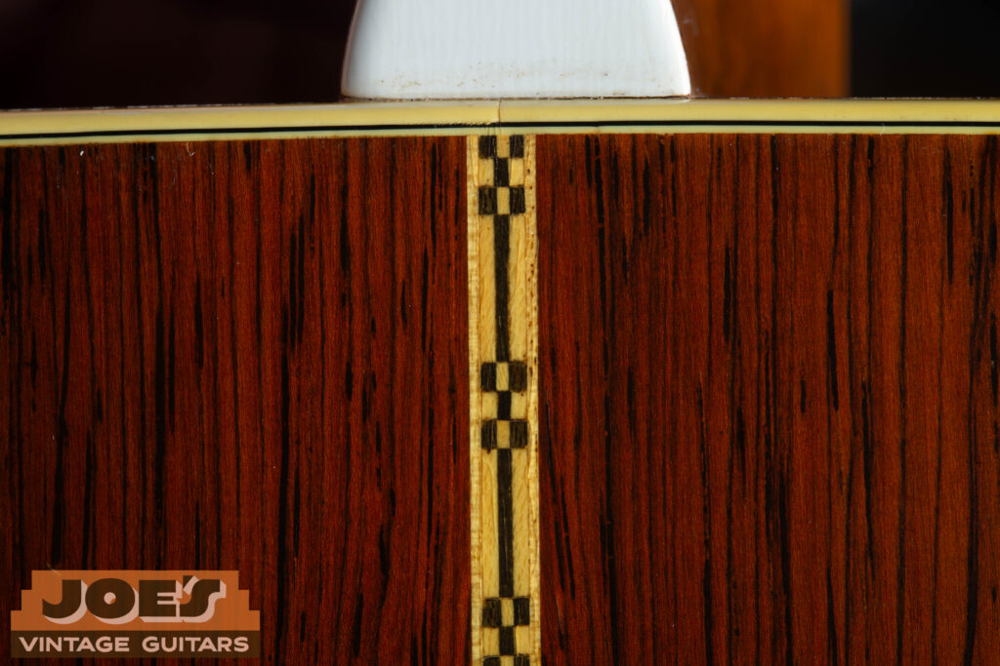
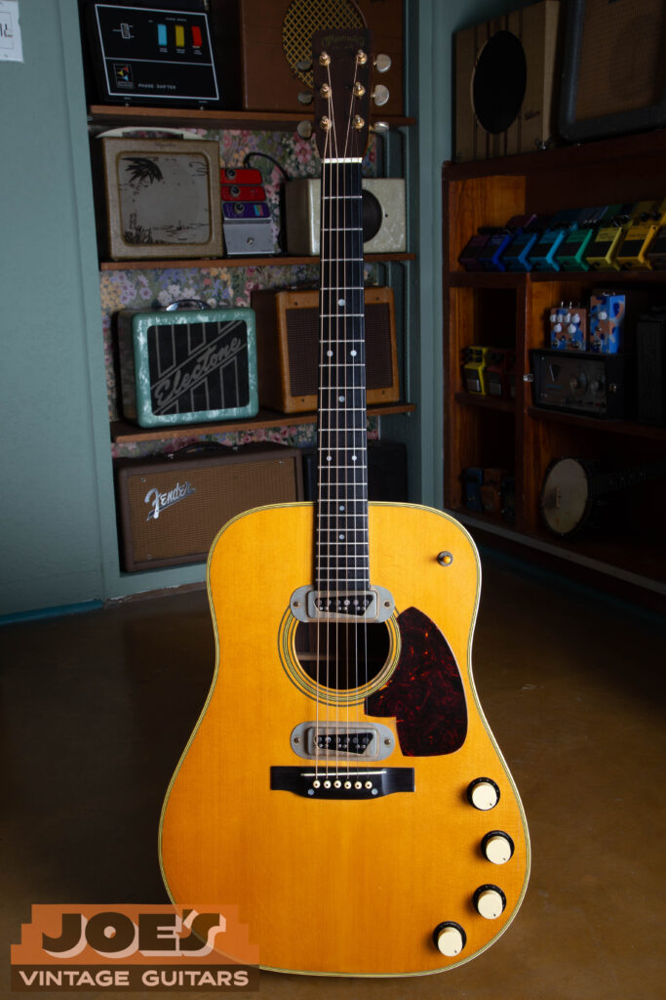

A rare factory-original 1959 Martin D-28E. Note the distinctive dual DeArmond pickups and the iconic gold-plated hardware that set this Brazilian Rosewood guitar apart.

In the late 1950s, the acoustic world was facing a “volume crisis.” As rock and roll took over, acoustic guitars were being drowned out by drums and electric amps. Martin’s response was the “E” series: the D-18E and D-28E. Produced only between 1958 and 1959, these guitars were initially considered a commercial failure, with only a few hundred made. Today, they are among the most discussed and polarizing vintage Martins in existence, thanks to a mix of quirky engineering and a massive surge in pop-culture relevance. This guide will take you through the similarities and differenced between the D-18e and the D-28e. In addition, we will ocver authentication tips and model specifications. If you need help finding the year of your Martin, check out our [Martin serial number lookup](/post/martin-serial-and-model-numbers/). If you’d like to sell a guitar, visit our [“sell my Martin”](/sell-my-martin-guitar/) page.

## Shared Specs: The “DeArmond” DNA

While their tonewoods differ, the “E” (Electric) components remain the core of these models’ identity.

-   **The Pickups:** Both models are equipped with two **DeArmond** single-coil pickups mounted directly into the top. These give the guitars a unique, almost “jazz box” amplified tone that sounds more like a hollow-body electric than a natural acoustic.
    

The heart of the “E” series: a close-up of the DeArmond pickup. These single-coils are the primary feature used to identify a factory-original Martin acoustic-electric from the late 1950s.

-   **The Controls:** They feature a three-way toggle switch and three control knobs.
    

The original 3-way toggle switch on this D-18E allows players to select between the bridge and neck DeArmond pickups, a layout more commonly seen on electric archtops of the era than flat-top acoustics.

-   **The Knobs:** You will find two distinct styles. The early versions often featured **“White Cup” knobs**, while later or varied runs used the **transparent “Bell” or “UFO” knobs** with a reflective metal plate underneath (often called “reflector” knobs).
    

The classic white “cup” knob found on earlier E-series models. These are one of the two primary knob styles collectors look for when authenticating an original 1950s Martin D-28E or D-18E.

-   **The Bridge:** Unlike standard Martins of the era, these bridges have **two pearl dots**. These aren’t just for show; they hide screws that bolt the bridge to the top to compensate for the added tension and weight of the electronics.
    

A tell-tale sign of an original E-series: the two pearl dots on the bridge. These conceal the bolts Martin used to secure the bridge to the top, compensating for the extra weight of the DeArmond electronics.

-   **The Output:** Both models feature an output jack mounted on the side of the lower bout.
    

Unlike modern acoustics with endpin jacks, the D-28E features a dedicated output jack mounted on the side of the body. This factory-drilled placement is a key indicator of an original “E” series build.

-   **Nut Material:** These came standard with traditional bone nuts, matching the high-quality appointments of the era.

## D-18E vs. D-28E: Key Differences

The distinction between these two follows the classic Martin hierarchy, but with a few “electric” twists.

## Martin E-Series Comparison

| Feature | Martin D-18E | Martin D-28E |
| --- | --- | --- |
| Back & Sides | Genuine Mahogany | Brazilian Rosewood |
| Hardware | Nickel / Chrome | Gold-Plated |
| Bracing | Ladder Braced | Ladder Braced |
| Pickups | 2x DeArmond Single Coils | 2x DeArmond Single Coils |
| Knob Style | White Cup or "UFO" Reflector | White Cup or "UFO" Reflector |
| Binding | Black or Tortoise Shell | White / Antique White |
| Fretboard | Rosewood | Ebony |
| Backstrip | None | Checkerboard / Z-Pattern |
| Bridge | Screwed-down (2 Pearl Dots) | Screwed-down (2 Pearl Dots) |

The **Gold Hardware** on the D-28E is a major visual giveaway. While the D-18E looks like a “workhorse” with its nickel DeArmond covers and mahogany grain, the D-28E looks like a flagship luxury instrument with its dark, figured Brazilian Rosewood and gold accents.

A touch of gold: The D-28E was the “luxury” model of the E-series, featuring gold-plated hardware throughout. Even with the soft, honest wear seen on these original tuners, the gold plating is a definitive way to tell a factory 28-style build apart from the nickel-appointed D-18E.

## The Interior Secret: Ladder vs. X-Bracing

If you want to authenticate a real “E” series Martin, you have to look inside.

To support the heavy DeArmond pickups and the weight of the control harness, Martin dropped their usual X-bracing for these models. Instead, they used **Ladder Bracing**.

> **Expert Tip:** This is the #1 way to spot a “Conversion.” Many people take a standard 1950s D-18 or D-28 and add the pickups later to chase the “E” look. However, a standard D-18/28 will be X-braced. If you see X-bracing through the soundhole of an “E” model, it is almost certainly a conversion, not a factory original.

Genuine E-series Martins feature ladder bracing (seen here running straight across) to support the weight of the electronics. If you see a “V” or “X” pattern, the guitar is likely a conversion rather than a factory original.

## The D-28E “Checkerboard” Strip

Specific to the D-28E is the decorative “Checkerboard” or “Z-pattern” backstrip. This wood mosaic runs down the center of the Brazilian Rosewood back. While standard D-28s of this era also had backstrips, the combination of this aesthetic with the ladder bracing and the factory-drilled holes for the volume/tone pots is what defines an original D-28E.

The intricate “checkerboard” backstrip is a signature aesthetic of the D-28E’s Brazilian Rosewood back. When authenticating, remember that while this is standard for the 28, the D-18E features a clean, mahogany back with no center striping.

## Authentication Checklist

1.  **Check the Bracing:** Look for ladder bracing through the soundhole.
    
2.  **Inspect the Bridge:** Look for the two pearl dots indicating the bridge is screwed down.
    
3.  **The Side Jack:** Ensure the output jack is side-mounted and professionally finished.
    
4.  **The Labels:** Check for the “E” designation on the neck block stamp.
    
5.  **Pot Dates:** If possible, check the dates on the potentiometers; they should date to 1958 or 1959.
    

## Ready to Discover the Value of Your Vintage Martin?

Whether you’ve inherited a rare “E” series Martin or you’re looking to clear space in your collection, it helps to know what these guitars are actually worth. Because these models are so often faked or converted, it’s worth having someone who knows them check the bracing and electronics before you buy or sell. If you’re ready to find out what your guitar is worth, visit our [appraisal page](/vintage-guitar-appraisal/) for an evaluation, or if you’re looking for a fair, straightforward offer from someone who knows the history of these ladder-braced guitars, head over to our [sell my guitar](/) page today.

The 1959 Martin D-28E. A rare mix of Martin’s craftsmanship and early electric experimentation, this Brazilian Rosewood guitar is one of the more unusual dreadnoughts the company ever built.
