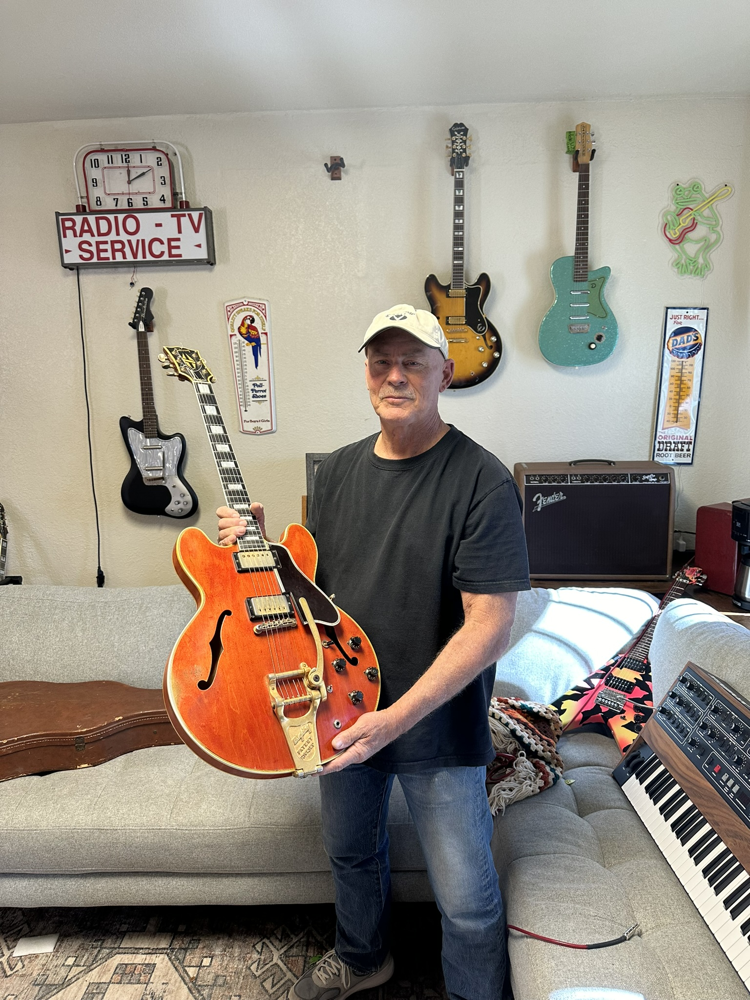
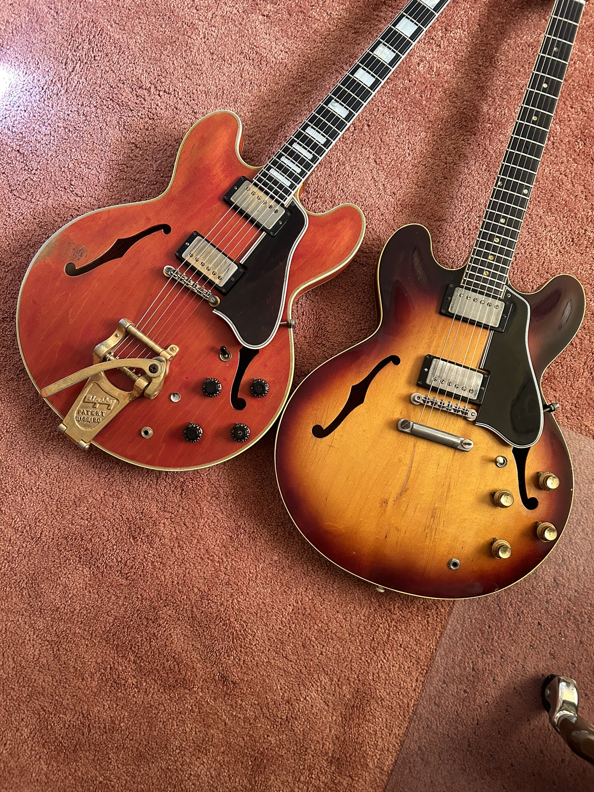
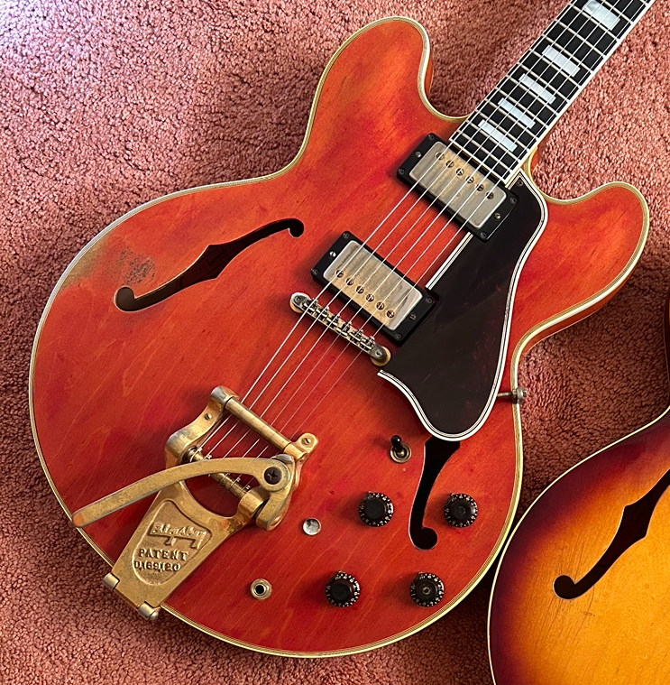
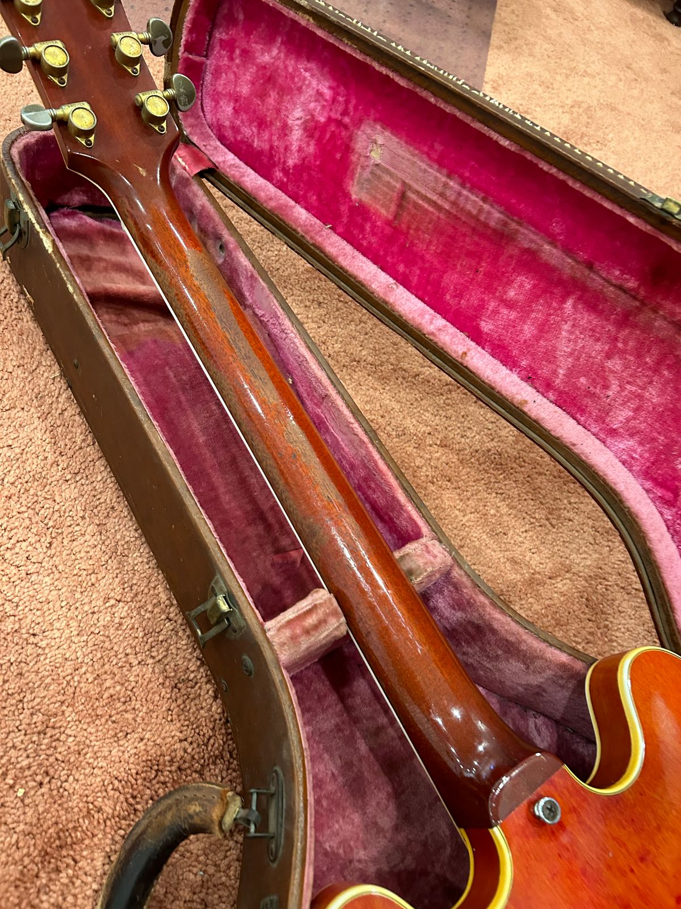
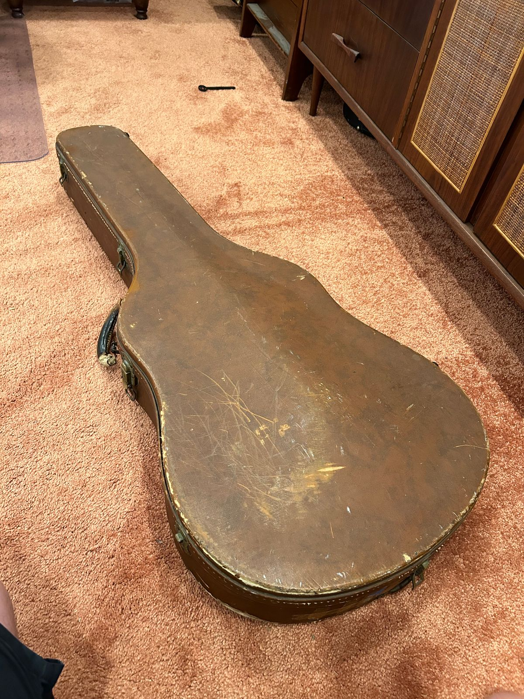
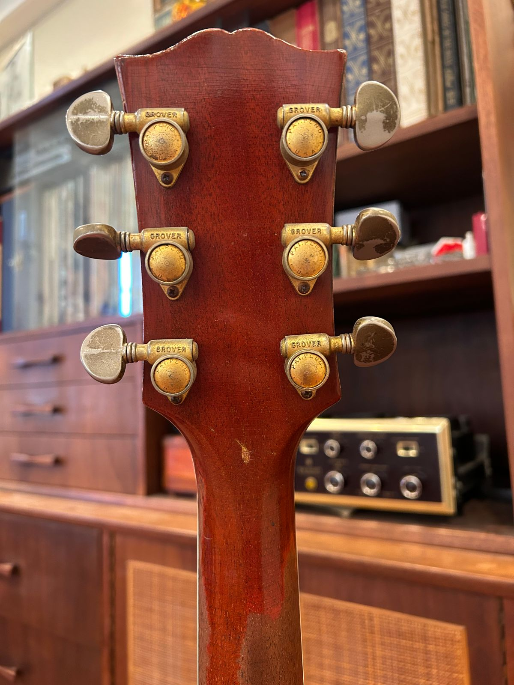
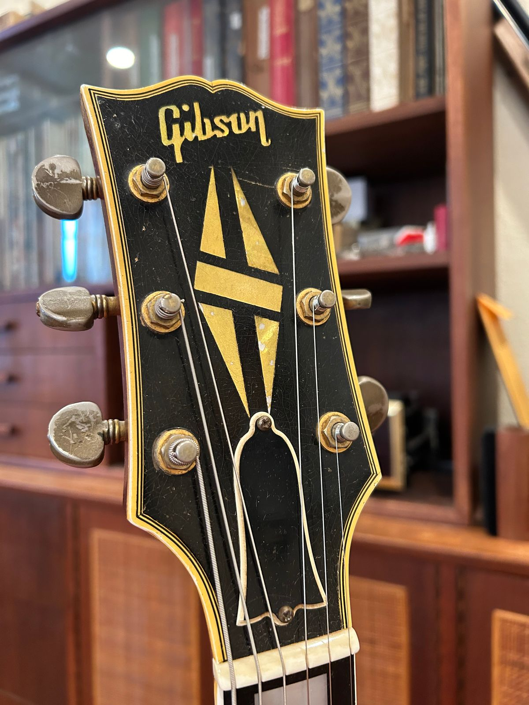
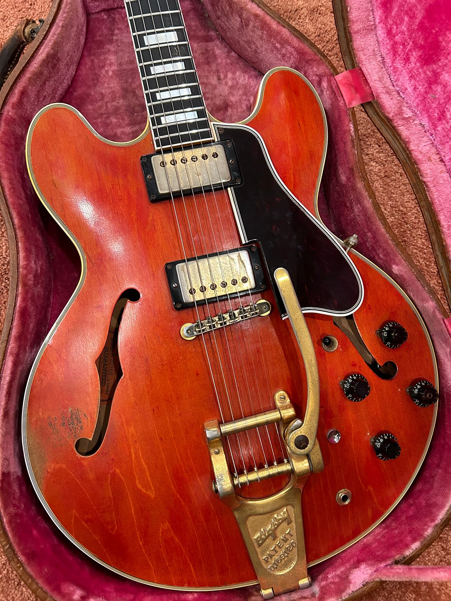

We get a lot of guitars through the shop. Every now and then, one arrives with its whole life still attached to it. This [1959 Gibson ES-355](/post/1959-gibson-es-355-history-value/) is one of those guitars.

I bought it from the son of the original owner. His father purchased it new and gave it to him when he was a teenager. He did what a good guitar owner is supposed to do. He played it regularly and kept it in the family.

<figure>

<figcaption>The original owner's son with the 1959 ES-355 his family kept and played for decades.</figcaption>

</figure>

## The Marks of a Guitar That Was Played

The checking, wear and softened gold plating tell the same story. None of it was added later to make the guitar look old. These are the marks left by one family playing the same instrument for decades.

<figure>

<figcaption>The 1959 ES-355 beside another vintage semi-hollow guitar.</figcaption>

</figure>

<figure>

<figcaption>Checking, wear and softened plating earned over decades of playing.</figcaption>

</figure>

## Converted From Stereo to Mono

The factory stereo wiring was converted to mono at some point. It was a practical change that made the guitar easier to use with a standard amplifier. The [guide to mono and stereo ES-355 wiring](/post/1959-gibson-es-355-history-value/#es355-mono-stereo) explains the two factory setups.

Other than that conversion, the guitar has stayed original. The finish, hardware and character are still here.

<figure>

<figcaption>The controls, pickups and gold hardware remain with the guitar.</figcaption>

</figure>

<figure>

<figcaption>Original gold hardware with the softened look that comes from years of use.</figcaption>

</figure>

## One Family From New

That direct ownership history is what makes this one special. A father bought it new. His son grew up playing it. Now the guitar has come to us with the story intact, and we will keep that story with it.

<figure>

<figcaption>The back carries the same honest evidence of age and careful use.</figcaption>

</figure>

<figure>

<figcaption>The neck and headstock remain part of the guitar's continuous family history.</figcaption>

</figure>

<figure>

<figcaption>The bound headstock, split-diamond inlay and gold tuners identify Gibson's top thinline model.</figcaption>

</figure>

You can find more guitars with documented family histories in the [JVG Museum and Original Owners archive](/category/museum-original-owners/).
