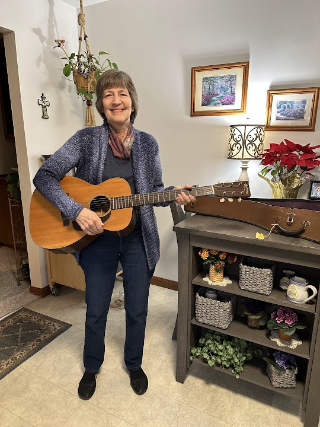
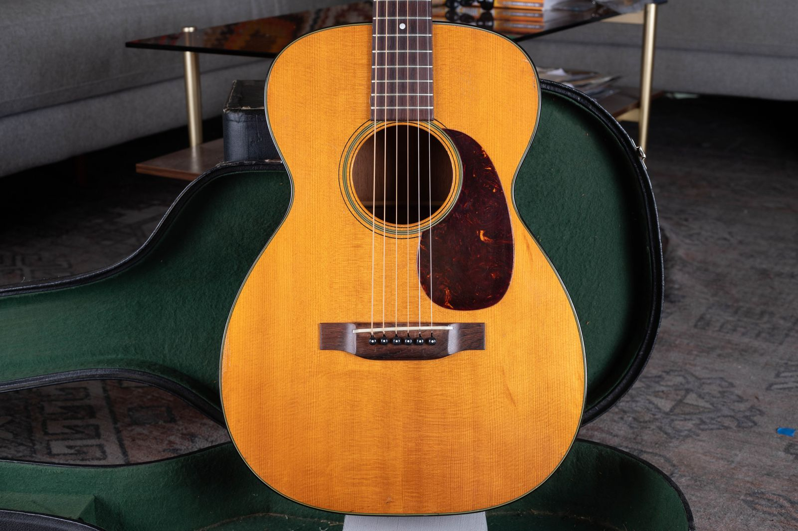
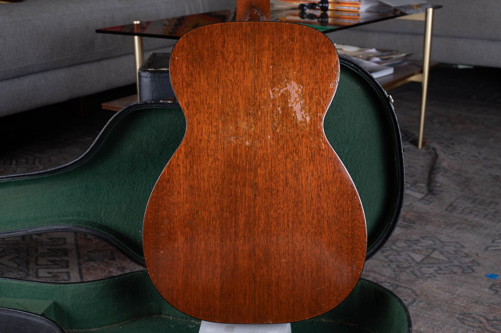
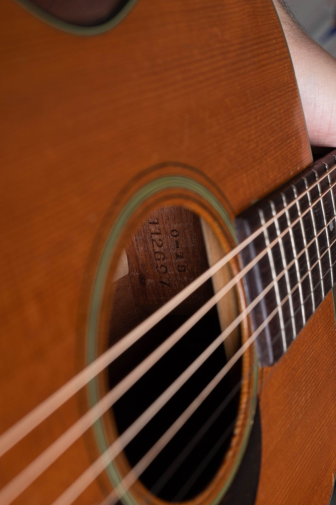

I purchased this lovely 1949 Martin 0-18 from the niece of its original owner, Linda Gayle. Linda was a country western musician from Iowa who toured around the state and played regularly on several local radio stations from an early age. She stepped back from performing when she started her family, but she kept playing and singing throughout her life.

Her niece did more than pass along a guitar. She preserved the name, photographs, and family account that connect this instrument to the woman who played it. That direct line gives the wear on the guitar a clear history.

### At a Glance

- Model: Martin 0-18
- Year: 1949
- Original owner: Linda Gayle
- Home: Iowa
- Musical life: Touring and local radio
- Provenance: One playing owner

## A Martin Kept in One Family

The early publicity photograph shows Linda during her performing years. A later family photograph closes the gap between that part of her life and the guitar today. The same compact body, spruce top, mahogany back and sides, and restrained Style 18 trim remain easy to recognize.

The size number and style number each tell part of the story. Joe’s [guide to vintage Martin 0, 00, and 000 guitars](/post/martin-0-00-000-history-authentication-value-guide/) explains how these numbers identify the body family and trim level.

<figure>

<figcaption>Linda Gayle’s niece with the 1949 Martin 0-18 before it left the family.</figcaption>

</figure>

## Linda Gayle on Iowa Radio

Linda began performing young. She traveled around Iowa as a country western musician and became a regular voice on several local radio stations. Her publicity photograph records that part of her life in a way a serial number never could. She sits with a guitar across her lap, ready for the next introduction or song.

Starting a family changed the public side of her musical life. Linda stepped away from regular performances, but she did not stop playing or singing. The Martin remained part of her life instead of becoming a forgotten souvenir from her radio years.

> She stepped back from performing when she started her family, but she kept playing and singing throughout her life.

## The 0-18 She Played for a Lifetime

A 0-18 is a concert size Martin, smaller than a 00 or 000. Style 18 pairs a spruce top with mahogany back and sides and simple appointments centered on the instrument rather than decoration. The front photograph shows a well defined spruce grain, a dark tortoise pattern pickguard, understated soundhole rings, and the small body that made the model comfortable for singing and radio work.

The back carries the clearest signs of long use. There are scratches, worn finish, and a broad patch of surface wear where the guitar met its player. Those marks belong to Linda’s years with the instrument. They are part of the ownership record.

<figure>

<figcaption>The spruce top, compact size 0 body, and restrained Style 18 trim.</figcaption>

</figure>

<figure>

<figcaption>The mahogany back records years of handling and play.</figcaption>

</figure>

## What the Neck-Block Stamp Confirms

Martin placed the model and serial stamps on the neck block inside the soundhole. The close photograph reads 0-18 above the serial number, so the model is recorded on the guitar itself. The serial number falls within Martin’s 1949 production range.

Owners can use Joe’s [Martin serial number and model guide](/martin-serial-and-model-numbers/) to locate the stamp and determine a production year. The stamp dates the guitar, but it cannot tell us who tuned it before a radio broadcast, who carried it across Iowa, or why it remained in one family for decades. Linda’s photographs and her niece’s account supply that history.

<figure>

<figcaption>The neck block is stamped 0-18 above the serial number.</figcaption>

</figure>

## Why One Owner Provenance Carries Weight

Clear provenance gives every mark a place in the story. The back wear came from Linda. The old photograph shows her as a working musician. Her niece kept the connection intact and shared it when the guitar changed hands.

That record also makes the guitar useful beyond this one story. It gives collectors and players a documented example of a postwar 0-18 that stayed with the same musician through a performing life, family life, and many later years of music at home. More instruments with direct family histories appear in the [Museum and Original Owners archive](/category/museum-original-owners/).

Condition, originality, repairs, and provenance all affect an appraisal. Joe’s guide to [determining the value of an old Martin acoustic guitar](/post/how-to-determine-the-value-of-your-old-martin-acoustic-guitar/) explains how those factors work together.

## Have a Vintage Martin With a Story?

If a Martin has stayed in your family, send Joe clear photographs of the front, back, headstock, neck-block stamp, case, and any old pictures or paperwork. The [free vintage guitar appraisal](/free-appraisal/) is a good place to start, or you can read how to [sell a vintage Martin directly to Joe](/sell-my-martin-guitar/).

The photographs identify the instrument. The old pictures, receipts, letters, and family memories identify the life it lived.
