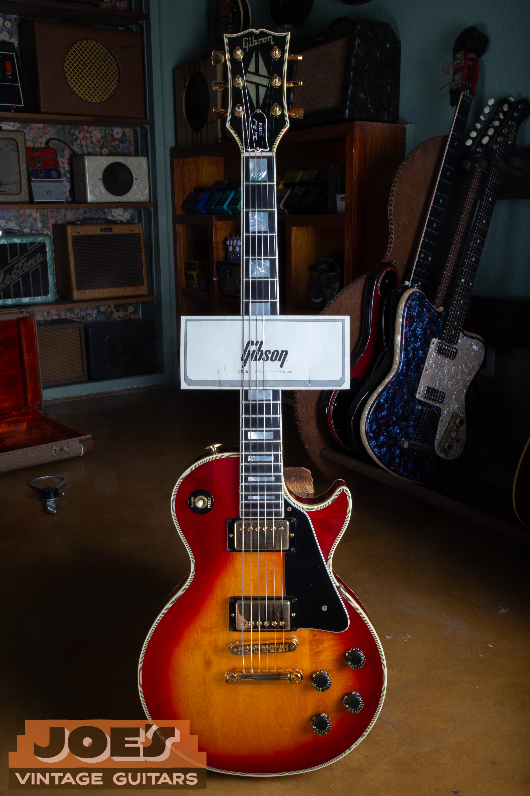
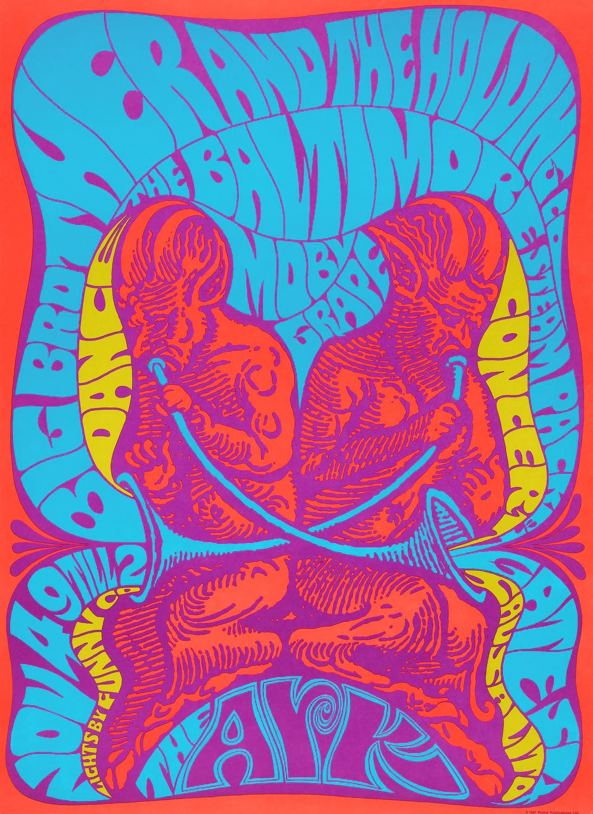
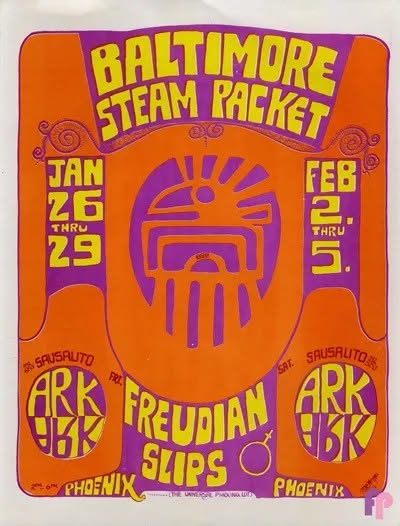
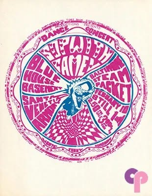
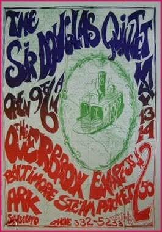
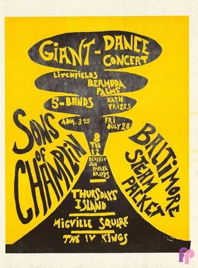
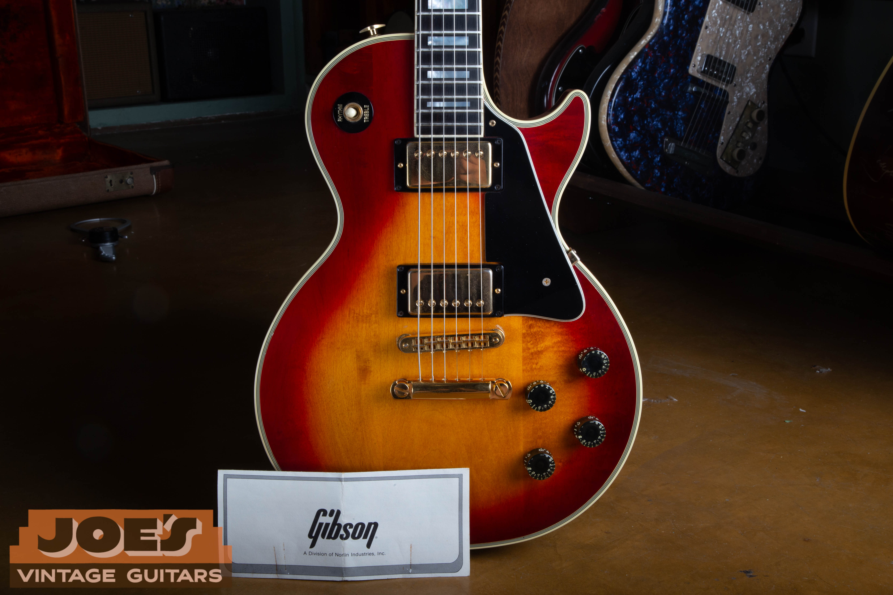
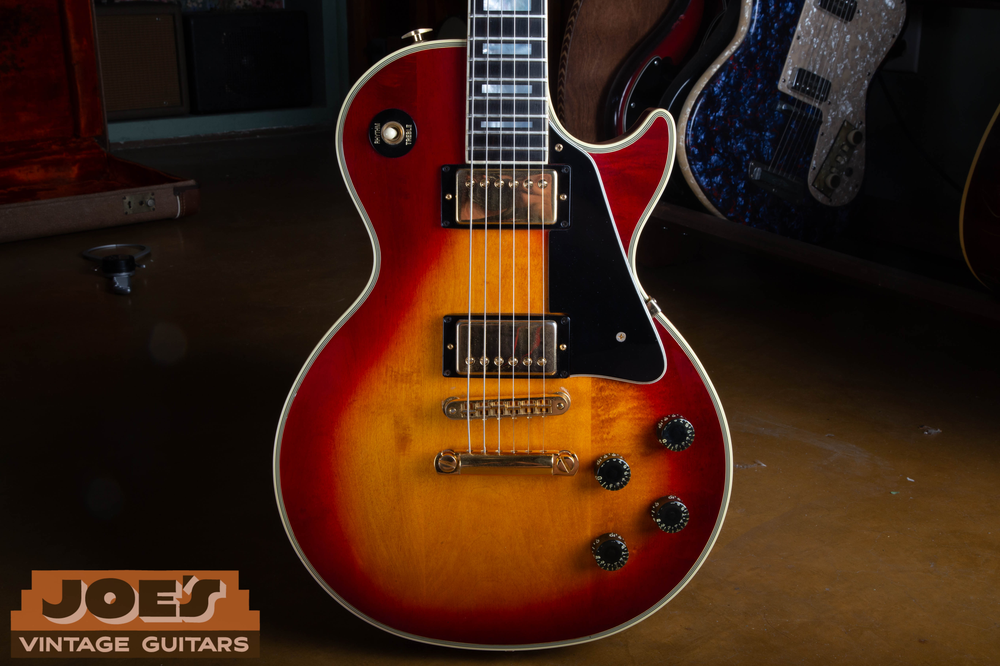
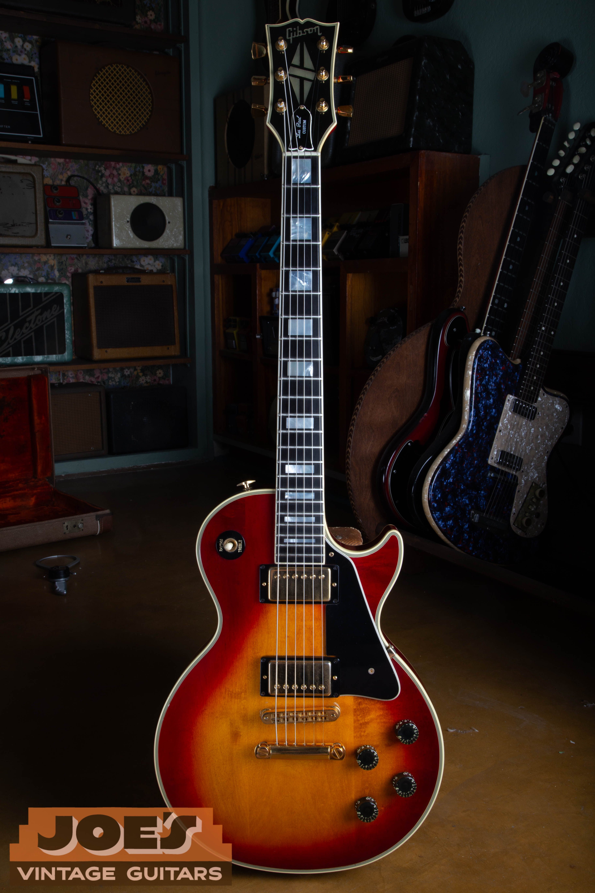
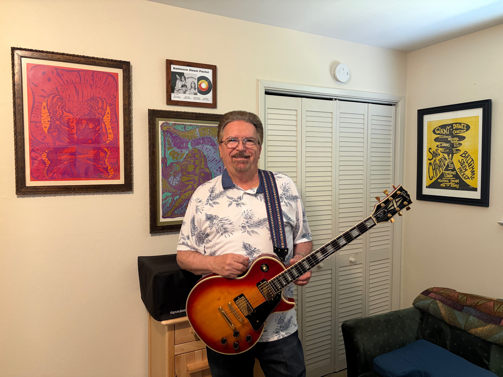

Dennis Hiatt bought this 1983 Gibson Les Paul Custom new from a guitar shop in San Rafael, California. He kept it for more than four decades, played it at home and during a few recording sessions, and protected it in its case whenever it was not in use.

The guitar is now with a new owner who is playing it and loving it. Before it moved on, Dennis shared the story of the music that came before it and why this Les Paul became the guitar he kept at home.

<figure>

<figcaption>The 1983 Gibson Les Paul Custom in cherry sunburst.</figcaption>

</figure>

#### On This Page

1. [The Baltimore Steam Packet](#the-baltimore-steam-packet)
2. [The Capitol Records Album That Was Never Released](#the-capitol-records-album-that-was-never-released)
3. [A Return to Playing](#a-return-to-playing)
4. [The 1983 Les Paul Custom](#the-1983-les-paul-custom)
5. [A New Owner and a New Chapter](#a-new-owner-and-a-new-chapter)

## The Baltimore Steam Packet

In 1966 Dennis was the lead guitarist in a Marin County rock band called the Baltimore Steam Packet. The group was coming up during the San Francisco Bay Area psychedelic movement and reached its peak during the Summer of Love in 1967.

The band played throughout California and shared stages with many of the leading rock groups of the period. Dennis was playing a 1965 Fender Jazzmaster that he had purchased new before joining the band. That guitar still carries too much personal history for him to sell.

The surviving concert posters give a sense of the places the Baltimore Steam Packet played and the company they kept.

<figure>

<figcaption>A colorful Baltimore Steam Packet poster from 1967.</figcaption>

</figure>

<figure>

<figcaption>A Baltimore Steam Packet concert bill for the Ark in Phoenix.</figcaption>

</figure>

<figure>

<figcaption>The Baltimore Steam Packet on a period psychedelic dance concert bill.</figcaption>

</figure>

<figure>

<figcaption>A surviving Baltimore Steam Packet concert poster.</figcaption>

</figure>

<figure>

<figcaption>The Baltimore Steam Packet on a Giant Dance concert bill.</figcaption>

</figure>

## The Capitol Records Album That Was Never Released

The Baltimore Steam Packet signed a recording contract with Capitol Records during the summer of 1967. The band later recorded an album of original material, but the record never reached the public.

After the sessions, the band's manager died from a heart attack and its drummer was drafted into the Army. The musicians were young and received no real direction from Capitol Records or anyone else. The group came to an end, and the completed Capitol album was never released.

Dennis chose a different path. He went to college and entered the corporate world, leaving professional music behind for a time.

## A Return to Playing

By the late 1970s, Dennis wanted to play again. He got together with other musicians for informal jam sessions, mostly to have fun. The group eventually began playing parties, weddings and social events. What started casually turned into more than 20 years of weekend performances.

In the early 1980s the band kept its equipment in a studio where it also held live auditions. Dennis had an acoustic guitar at home, but he wanted an electric guitar there for practice.

That search led him to a guitar shop in San Rafael.

## The 1983 Les Paul Custom

Dennis saw a new Gibson Les Paul Custom in cherry sunburst and thought it was the best looking guitar he had ever seen. He bought it immediately.

> I thought it was the nicest looking guitar I had ever seen. I bought it as soon as I saw it.

<figure>

<figcaption>Cherry sunburst finish, gold hardware and Custom appointments.</figcaption>

</figure>

This Les Paul lived a very different life from the Jazzmaster Dennis used during his band years. It stayed primarily at home for practice and appeared in only a few recording sessions. Dennis never took it on the road for gigs. When he was not playing it, he kept it in its case.

<figure>

<figcaption>Careful ownership preserved the guitar for more than four decades.</figcaption>

</figure>

That direct ownership history matters. Anyone researching a similar instrument can start with our guide to [dating a Gibson Les Paul](/how-to-read-gibson-serial-numbers/), then use the [vintage Gibson Les Paul value guide](/vintage-gibson-les-paul-market-value-guide/) to see how model, year, originality and condition affect the market.

<figure>

<figcaption>A true one owner Les Paul Custom, purchased new in 1983.</figcaption>

</figure>

## A New Owner and a New Chapter

Dennis retired in 2016 and now plays only for his own enjoyment. He no longer needed two electric guitars, and the 1965 Jazzmaster was never going to be the one that left. Its connection to the Baltimore Steam Packet and the Summer of Love was simply too personal.

He wanted the Gibson to go to someone who would appreciate a fine guitar. That is exactly what happened.

<figure>

<figcaption>Dennis Hiatt with the Les Paul Custom he owned from new.</figcaption>

</figure>

The guitar has been sold and is now being played and loved by its new owner. Dennis preserved it carefully for more than 40 years. Its next caretaker gets to enjoy the guitar while carrying its story forward.

If you have a vintage guitar with an ownership story worth preserving, we would like to hear it. You can begin with a [free vintage guitar appraisal](/free-appraisal/) or learn more about [selling a vintage Gibson to Joe](/sell-my-gibson-guitar/).
