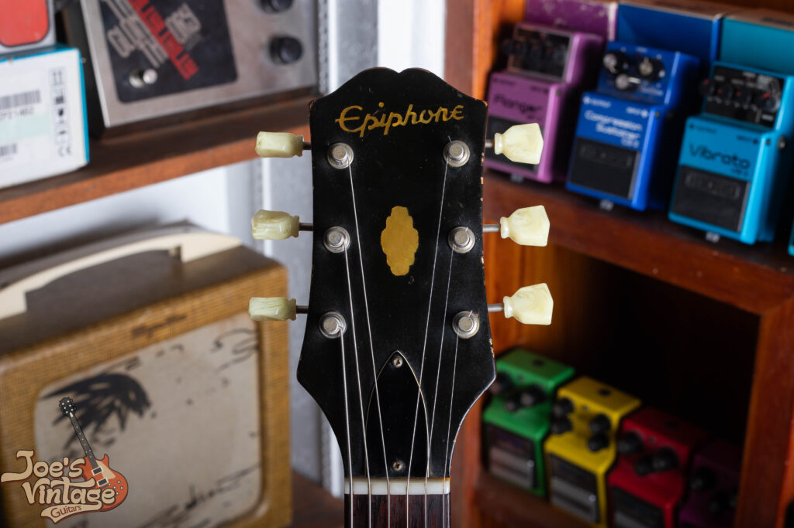
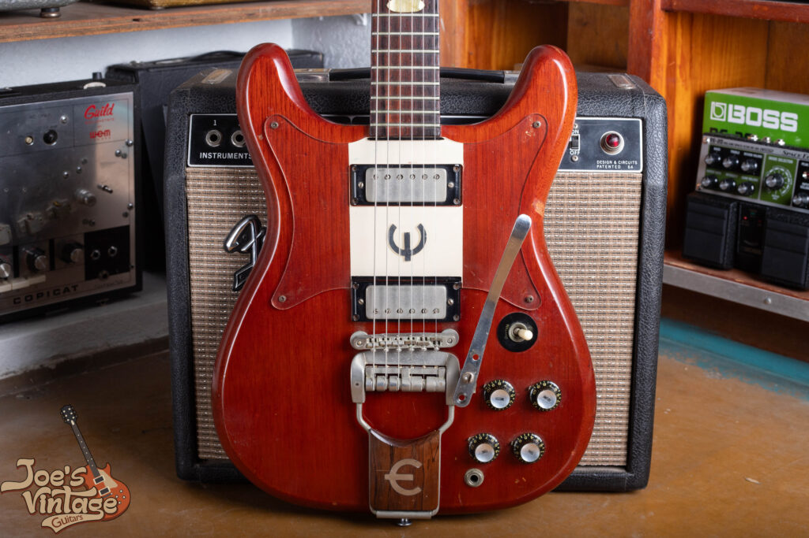
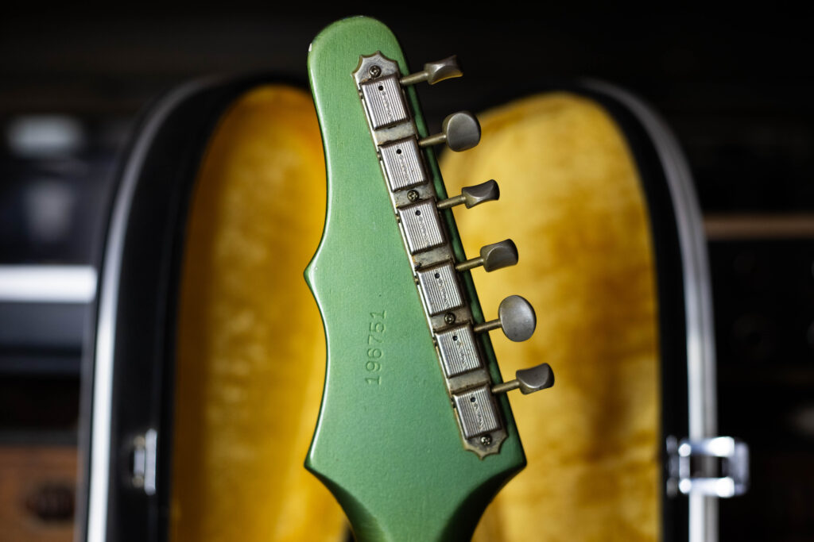

The Gibson SG and Les Paul usually get all the attention, but the **Epiphone Crestwood** is worth a close look if you care about mid-century solid-body electrics. It was built in the Kalamazoo factory during the “Golden Era” of guitar manufacturing, and it was Epiphone’s flagship original design. It was more than a Gibson alternative; it had technical features and a sound that stood on its own against the more expensive SGs. We’re always looking to add nice vintage USA-made Epiphone guitars to our collection. Contact us to sell or for a [free appraisal!](/free-appraisal/)

The 1961 “short” headstock design, which maintained the symmetrical shape common in the early Kalamazoo production years before the transition to the asymmetrical “Batwing” style.

## 1\. The Heritage of the Kalamazoo Epiphone

In 1957, Gibson’s parent company, Chicago Musical Instruments (CMI), acquired Epiphone. This wasn’t a move to create a “budget” line; it was a strategic move to allow CMI to sell professional-grade instruments to dealers who weren’t authorized Gibson franchises.

The Crestwood debuted in **1958** as a bold new silhouette. It featured a solid mahogany body, a symmetrical double-cutaway, and a set-neck construction that used the same high-quality lumber found in the ’58 Bursts.

## 2\. The Evolution of the Crestwood Custom

From 1958 to 1969, the Crestwood underwent several design shifts that drastically changed its market appeal and playability.

### The Slab-Body Era (1958 to 1960)

The earliest Crestwoods featured thick, un-contoured mahogany slabs. These early models often utilized leftover “New York” style single-coil pickups, providing a gritty, biting tone that predated the cleaner sounds of the 1960s. These are exceptionally rare. Only a handful were produced each year, which makes them some of the hardest early Epiphones to find.

### The “Batwing” and the Mini-Humbucker (1961 to 1963)

In 1961, the edges were contoured for comfort, and the model became the **Crestwood Custom**. This era introduced the **Mini-Humbucker**, designed by Seth Lover. These pickups offer a “snappier” attack and more top-end shimmer than a full-sized PAF, which is why a lot of players like them when they want clarity without giving up the “muscle” of a humbucker.

The 1961 body shows the symmetrical mahogany slab and the move toward deeper contours, making it one of the most recognizable designs of the Kalamazoo era.

### The Deluxe and the Tremotone (1963 to 1969)

The final iteration of the vintage Crestwood saw the introduction of the 6-on-a-side **“Batwing” headstock** and the **Tremotone vibrato**. The Crestwood Deluxe, with its three pickups and ebony fretboard, sat at the top of the line, a “tuxedo” guitar meant to compete with the most expensive instruments on the market.

The back of the 1964 “Batwing” headstock. This six-on-a-side tuner arrangement was a big change from the earlier symmetrical designs and is a key identifier for mid-60s Kalamazoo production.

## 3\. Determining Market Value: What is an Epiphone Crestwood Worth?

When you are figuring out the **fair market value of a vintage Epiphone Crestwood**, keep in mind that “list prices” on the internet rarely tell the whole story. Because these guitars were hand-built during a period of rapid transition, two guitars from the same year can have significantly different valuations based on small, technical nuances.

### The “Golden Era” Premium

The **worth of a Crestwood** is heavily dictated by its production year. The transition from nickel to chrome hardware, the shift from “Wide” to “Slim Taper” neck profiles, and the specific pickup variations (Patent Pending vs. Patent Number) can swing a valuation by thousands of dollars. Collectors often pay a big premium for the “pre-batwing” 3-on-a-side headstock models, though the 1963-64 “Batwing” models are seeing a sharp jump in demand.

### Originality vs. “Player Grade”

Unlike many vintage Gibsons, the Crestwood’s proprietary parts, like the **Tremotone tailpiece** and the specific bridge saddles, are nearly impossible to replace with original period-correct parts today. If a guitar has been “modded” for modern hardware, its **collector value** takes a significant hit. However, for a gigging musician, a professionally “player-graded” Crestwood can offer some of the best vintage tones per dollar in the industry.

### The Complexity of Condition

Condition is the factor that moves a **Crestwood valuation** the most. Because the mahogany used in this era was so resonant and thin, these guitars are susceptible to the classic “Kalamazoo” headstock break. Furthermore, the finish on early 60s Epiphones often shows beautiful weather checking, but an amateur “overspray” or refinish can strip away the historical significance and the value of the instrument.

## 4\. Why an Expert Appraisal Helps

The market for vintage Epiphones is specific. Unlike a mass-produced modern guitar, a **vintage Crestwood valuation** takes knowing the 1960s Kalamazoo factory details and a physical inspection of the electronics and solder joints.

If you are looking for an [**accurate appraisal for insurance**](/free-appraisal/) or are considering [**selling your vintage Epiphone**](/), leaning on forum hearsay or generic price guides often means leaving money on the table. The best way to know what your instrument is worth is to have it inspected by someone who knows the difference between a New York leftover and a Seth Lover original.
