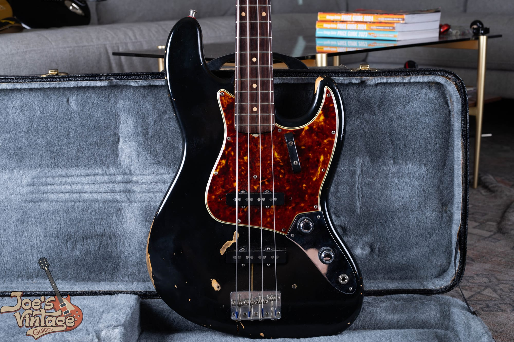
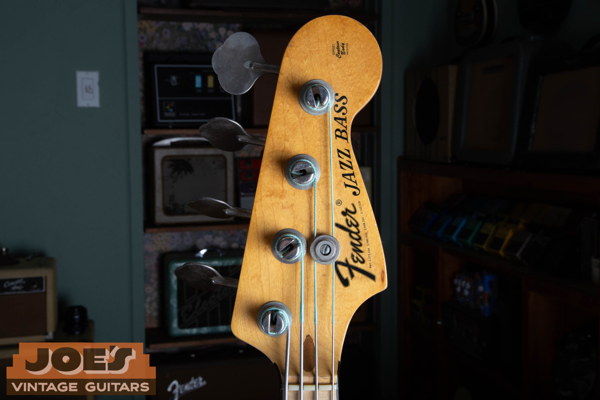
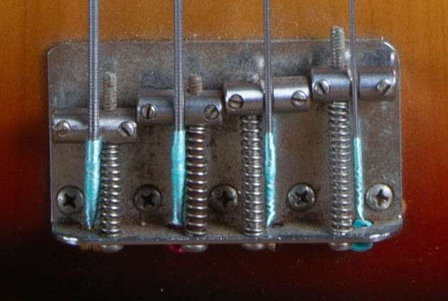
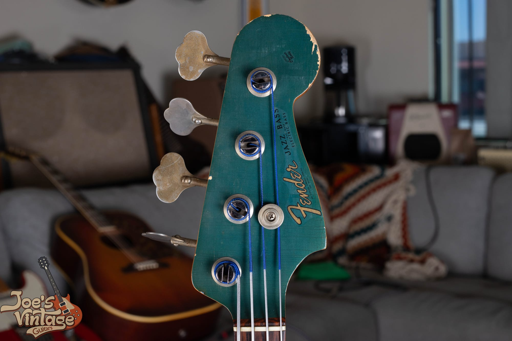
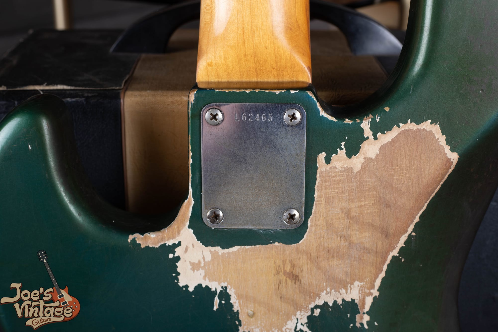

The Jazz Bass arrived in the summer of 1960 as the expensive one. Fender already had the Precision, so the Jazz was built to sit above it: two pickups instead of one, a narrower nut, an offset body, and a control layout nobody else was building. It has been in production ever since, which is exactly why dating one properly matters. A stack knob from 1961 and a three-bolt from 1975 are both "a vintage Fender Jazz Bass," and there is a very large number between them.

This guide covers every meaningful change from the 1960 launch through 1975, in the order you would actually check them. If you are looking to [sell a vintage Fender bass](/sell-my-fender-guitar/) or you have inherited one and need a *vintage guitar appraisal*, these are the same details a serious buyer will use to price it.

One warning before you start, because it sends more people wrong on this model than any other single thing: **do not start at the headstock**. Covered below.

If you want the compact version, our [guide to dating a Fender Jazz Bass](/fender-jazz-bass-dating-guide/) runs the same timeline as a single year-by-year table with the fastest visual check for each change.

1.  [Why the Year Matters](#why-the-year-matters)
2.  [Year by Year Quick Reference](#year-by-year)
3.  [The Stack Knob Years: 1960 to 1962](#stack-knob)
4.  [Why the Logo Will Not Date Your Jazz Bass](#headstock)
5.  [Fingerboard, Inlays, and Binding](#fingerboard)
6.  [Pickguards and Finish Pairing](#pickguards)
7.  [Pickups and the 1970s Bridge Move](#pickups)
8.  [Tuners](#tuners)
9.  [Neck Heel Dates](#neck-dates)
10.  [What the Serial Number Will Not Tell You](#serial)
11.  [The 1970s: Three Bolts, Maple, and Blocks](#seventies)
12.  [Custom Color Authentication](#custom-colors)
13.  [Red Flags and Common Problems](#red-flags)
14.  [Value Drivers](#value)
15.  [Frequently Asked Questions](#faq)

<h2 id="why-the-year-matters">Why the Year Matters</h2>

The Jazz Bass value curve is steep at the front and flat at the back. A clean, all original stack knob from 1960 or 1961 lives in a completely different price world than a 1974 sunburst, and the gap is measured in five figures rather than percentages. The market sorts these first by era (stack knob, three knob pre-CBS, CBS, 1970s), then by spec (slab or veneer, clay or pearloid, bound or unbound, dots or blocks), then by condition and originality.

That sorting is why so many "1962" Jazz Basses on the open market turn out to be a year or two later than advertised, and why a single detail can move the number by thousands. The good news is that the Jazz Bass hands you an unusually clean sequence of changes. Work through them in order and you can place most examples inside a two year window before you pick up a screwdriver.

<h2 id="year-by-year">Year by Year Quick Reference</h2>

The orientation table. Every row is unpacked in detail below.

| Year | Controls | Fingerboard | Inlays | Pickguard | Notes |
| --- | --- | --- | --- | --- | --- |
| **1960** | Stack knob (dual concentric) | Slab rosewood | Clay dots | 4 ply tortoiseshell | Launch year, summer 1960 |
| **1961** | Stack knob to late in the year | Slab rosewood | Clay dots | 4 ply tortoiseshell | Three knob layout arrives late 1961 |
| **1962** | Three knob (leftover stack knobs early) | Slab to veneer, July to August | Clay dots | 4 ply tortoiseshell | Both control layouts correct in early 1962 |
| **1963** | Three knob | Veneer rosewood | Clay dots | 4 ply tortoiseshell | No headline change, date from the heel and pots |
| **1964** | Three knob | Veneer rosewood | Clay to pearloid, late in the year | 4 ply tortoiseshell | Pickup bottoms go black to grey mid year |
| **1965** | Three knob | Veneer rosewood, binding late in the year | Pearloid dots | Nitrate to vinyl, early to mid year | CBS completes the purchase in January |
| **1966** | Three knob | Bound rosewood | Dots to pearloid blocks, mid year | 3 ply | The bound-dot window runs into mid year |
| **1967 to 1971** | Three knob | Bound rosewood, maple option | Pearloid blocks | 3 ply | Black CBS logo from 1968, F tuners from 1968, black bound black blocked maple option from 1969 |
| **1972 to 1974** | Three knob | Bound rosewood or one piece maple | Pearloid or black blocks | 3 ply | Black blocked maple standard from 1972; back to white binding and pearloid blocks by mid-to-late 1973 or 1974 |
| **1975** | Three knob | Bound rosewood or maple | Pearloid blocks | 3 ply | Three bolt neck and bullet truss rod, from late 1974 |

<figure>

<figcaption><strong>A 1964, with the man who bought it new.</strong> The mid 1960s spec set in one photograph: four ply tortoiseshell guard, unbound rosewood board with dots, the three knob plate that replaced the stack knobs, and reverse wind Klusons on the headstock. Provenance like this is worth having in writing, because an original owner story is the one thing a parts guitar can never assemble.</figcaption>

</figure>

Two things to hold in mind reading down that table. Fender never made a clean cutover, so a change dated to mid year means both versions turn up on instruments from that year and a transition example is genuinely correct either way. And parts sat in bins before they went into an instrument, so a feature dates the part rather than the bass, which makes the bass that year **or later**.

<h2 id="stack-knob">The Stack Knob Years: 1960 to 1962</h2>

The first Jazz Basses did not have the volume, volume, tone layout everybody pictures. They had **dual concentric "stack knob" controls**: two stacked knobs, each one a volume and a tone for a single pickup. Four controls in two positions.

Fender phased the layout out in **late 1961** in favour of the simpler three knob arrangement. That is the headline date, but it comes with a caveat that matters commercially: **concentric Jazz Basses legitimately exist into early 1962**. Leo Fender did not throw away usable stock, so pre-drilled control plates and bodies already routed for the concentric layout kept going out the door for months after the official change. An early 1962 stack knob is factory correct. It is uncommon, and it is worth real money, but it is not a red flag. By the middle of 1962 everything leaving Fullerton was three knob.

<figure>

<figcaption><strong>A 1961 stack knob, and a lesson.</strong> The stacked concentric controls are correct and original. The black finish is not: the wear breaks straight from paint to bare wood with no undercoat and no sealer line. Original controls on a refinished body is a common combination, and it is worth far less than the same bass with its finish intact.</figcaption>

</figure>

Stack knob basses are the most collectible Jazz Basses there are, which means the controls are worth faking. The plate is four screws. Before you pay stack knob money, confirm the neck heel date, the body date, and the pot codes all land in the 1960 to early 1962 window, and check that the control plate holes match the body routing with no filled or extra holes underneath.

<h2 id="headstock">Why the Logo Will Not Date Your Jazz Bass</h2>

On a Stratocaster the headstock decal is one of the fastest era checks you have. On a Jazz Bass it is close to useless, and this is where most people go wrong.

**The Jazz Bass wore the gold transition logo from 1960 straight through 1967**, then switched to the thick black CBS logo in 1968. That is the only change. One decal covers the entire pre-CBS era *and* the first three years of CBS ownership, so a 1962 and a 1967 wear the same logo. The decal splits the run at 1968 and nowhere else, and 1968 is not the split anybody is asking about.

<figure>

<figcaption><strong>The black CBS logo on a 1973.</strong> This decal is the one piece of headstock information that means something: black logo is 1968 or later, full stop. The gold transition logo that preceded it covers everything from 1960 to 1967 and cannot separate a pre-CBS bass from an early CBS one.</figcaption>

</figure>

So the dating work on a Jazz Bass falls to the board, the controls, the pickguard, the hardware, and the dates written inside. If a listing leans on the headstock to justify a pre-CBS price, that is the point to start asking questions.

<h2 id="fingerboard">Fingerboard, Inlays, and Binding</h2>

The neck is where a Jazz Bass actually gives up its year, and it does it in four separate stages.

### Slab Versus Veneer

Look along the side of the neck at fret level, where the rosewood meets the maple. A **slab** board shows a flat seam, with rosewood of even thickness glued to a flat topped neck. A **veneer** board shows a curved seam, thinner rosewood following the radius of the maple beneath it.

The Jazz Bass changed over in **July to August 1962**. Worth being precise about this rather than reaching for a rule of thumb: the Stratocaster made the same change around the same time, but the Jazzmaster moved to veneer in the spring of 1962, several months earlier. Fender's changes did not all land on one date, so read each model against its own timeline.

### Clay Versus Pearloid Dots

Clay dots ran from the launch to **late 1964**, roughly October to December, and pearloid dots followed. Clay is not actually clay, it is a plastic compound, and it reads matte and chalky and ages toward tan or cream. Pearloid is brighter, whiter, and visibly reflective. It is one of the easiest calls to make from a photograph, and it is the same window as the rest of the Fender line.

### Binding, Then Blocks

Here is the sequence that catches people, because the two changes are usually spoken of as one and they are six months apart.

**White fingerboard binding arrived in late 1965**, around December. **Pearloid block inlays did not follow until the middle of 1966**, around June or July. That leaves a genuine factory window from late 1965 into mid 1966 where a Jazz Bass carries a **bound board with dot inlays**.

Those "bound-dot" necks are correct. They are not parts guitars, they are not refretted replacements, and they are not fakes. The same binding-before-blocks gap shows up on the [Jaguar](/post/vintage-fender-jaguar-guide/) and the [Jazzmaster](/post/fender-jazzmaster-evolution-guide-1958-1971/), so it is a Fender-wide pattern rather than a quirk of this model. If somebody tells you a bound board with dots must be wrong, they are working from a rule that skipped a step.

<figure>

<figcaption><strong>Blocks and binding on a 1973 maple board.</strong> Pearloid blocks on bound rosewood arrived mid 1966. This black-block-on-maple combination is the later look, rare as an option in the late 1960s and common from 1972 once one piece maple necks arrived.</figcaption>

</figure>

<h2 id="pickguards">Pickguards and Finish Pairing</h2>

Hold the guard edge up to a strong light and count the layers. Jazz Bass guards moved from **nitrate to vinyl and laminate in early to mid 1965**, with leftover nitrate stock overlapping into the change. Tortoiseshell guards are **four ply**, a nitrocellulose top over white, black and white. White, parchment and black guards are **three ply**.

The pairing rule is the part worth knowing, because it answers a question people ask constantly:

-   **Sunburst** basses came with the four ply **tortoiseshell** guard.
-   **Custom colors** came with a three ply **white or parchment** guard.

So a white guard on a custom color Jazz Bass is correct and original, not somebody's later swap. Tortoiseshell does turn up on selected custom finishes such as Olympic White by special order, which is a real exception rather than an excuse, and it needs the rest of the bass to back it up.

The nitrate guards also age in a way reproductions do not manage. They shrink, they cup, they crack at the screw ears, and they outgas an acidic vapour you can smell the moment you open a case that has been shut a while. That vinegar tang is a genuine authentication tool. The vinyl guards that replaced them do not shrink, do not smell, and have no mint green underside.

<h2 id="pickups">Pickups and the 1970s Bridge Move</h2>

### Black Bottoms Versus Grey

Pull a pickup and look at the flatwork. Fender used **black fibreboard from 1960 to about the middle of 1964**, roughly March to July, then switched to **grey** for the rest of the run.

One detail that saves arguments: during the 1964 changeover it is completely normal to find **one black bottom and one grey bottom in the same bass**. The factory was working through stock, and a mixed pair on a 1964 is correct rather than evidence that somebody replaced a pickup. The same overlap shows up on Stratocasters and Precision Basses of the period.

Original black bottoms in an early bass carry a premium, so on anything being sold as 1960 to early 1964, this is the check worth making before you agree a price.

### The 1970s Bridge Pickup Move

This one explains a tonal difference people hear long before they know why.

On 1960s Jazz Basses the two pickups sit about **3.6 inches apart**, centre to centre. In the early 1970s Fender moved the **bridge pickup about 0.4 inch closer to the bridge**, taking the spacing out to roughly **4.0 inches**. Fender returned to the earlier placement in the early 1980s.

That shift is a large part of why a 1970s Jazz Bass sounds brighter and more cutting than a 1960s one, and it is the reason "60s spacing" and "70s spacing" are still options you pick when buying a replacement pickup set today. Measure it before you assume: it is a small move on paper and an obvious one in the hands.

<figure>

<figcaption><strong>The bridge on a 1973.</strong> Measuring from the bridge pickup pole pieces to the saddles is the fastest way to tell 1960s spacing from 1970s spacing on an unmarked instrument.</figcaption>

</figure>

<h2 id="tuners">Tuners</h2>

Three eras, and the transitions are clean enough to be useful.

| Era | Tuner | What to look for |
| --- | --- | --- |
| 1960 to early 1966 | Reverse wind Kluson | Open gear, clover leaf pad, turns clockwise to tighten |
| Early 1966 to 1968 | Non reverse Kluson | Same clover leaf pad, turns the standard direction |
| 1968 to 1975 | Fender "F" stamped | Large stylized F on the back plate, made by Schaller for Fender |

The reverse wind tuners on the early basses are the ones that surprise players who have only handled modern instruments, because they tighten the "wrong" way. They are correct on a pre-1966 Jazz Bass and worth keeping. Tuner replacement is one of the most common modifications on any vintage Fender, usually because fifty year old gears develop slop, so check the peg holes for enlargement or filled secondary holes from a different gear ratio.

<h2 id="neck-dates">Neck Heel Dates</h2>

Take the neck plate off and the heel carries the date. On a Jazz Bass this is the most defensible build date on the instrument, because it records when the neck was actually shaped and finished.

The stamp runs a model code, then the month, then the year, then a letter for the nut width. **The Jazz Bass model code is 7** from 1962 to 1965. Fender renumbered the model codes at the end of 1965, and the Jazz Bass moved to **15** from 1966, so the code itself is a useful cross check on which side of that line a neck sits. Ignore the code for the actual dating and read the month and year.

The body date, marked inside a cavity, corroborates rather than decides: bodies sat in the warehouse before being matched to necks, so a body date and a neck date a few months apart is the normal result on an untouched bass. Pot codes are downstream of both, since the potentiometer was made before the bass was wired. Our guides to [reading Fender pot codes](/fender-pot-codes/) and [neck heel dates](/fender-neck-dates/) cover the formats in detail.

<h2 id="serial">What the Serial Number Will Not Tell You</h2>

The number stamped in the neck plate gets you a rough production year and nothing tighter. Fender stamped plates in batches, stored them, and pulled them off the stack in no particular order, so a plate could sit on a shelf for months and a higher number could go on a bass built before a lower one. Published ranges overlap year to year and disagree between sources.

<figure>

<figcaption><strong>The neck plate on a 1973.</strong> Read the plate as one vote among several. The style of plate tells you more than the digits do, and it is four screws away from being somebody else's.</figcaption>

</figure>

Read it alongside the features rather than instead of them, and treat a mismatch as the interesting part. An L series plate on a bass with a bound block inlay neck deserves a hard look, because the L series had finished well before the blocks arrived. Full charts by era live on our [Fender serial number guide](/fender-guitars-serial-number-guide/); there is no Jazz Bass specific chart because Fender serials are not model specific. A 1963 plate reads the same whether it ended up under a Jazz Bass, a Stratocaster, or a Jaguar.

<h2 id="seventies">The 1970s: Three Bolts, Maple, and Blocks</h2>

Three changes define the last stretch of the original run.

Fender first introduced the maple fingerboard with **black binding and black block inlays** as an option in **1969**. **One piece maple necks arrived in 1972**, and the black-on-maple look most people picture on a 1970s Jazz Bass became a standard production option. It did not run to the end of the decade: by **mid-to-late 1973 or 1974** Fender transitioned back to **white binding and pearloid block inlays** across all necks. So the trim itself dates the neck. Black blocks on maple sit inside 1969 to about 1974, pearloid blocks on maple run from the transition onward, and both are factory correct rather than a later refinish or a replacement neck.

**The three bolt Micro-Tilt neck joint arrived in late 1974**, for the 1975 model year, together with the **bullet truss rod** adjuster at the headstock. Fender went back to a four bolt joint in 1983. A handful of 1975 and 1976 basses did leave with four bolt necks from leftover stock, so a four bolt bass from those two years is not automatically wrong, just worth checking against the neck date.

The three bolt joint has a reputation it only partly deserves. Early collectors disliked it on the theory that three bolts could not hold a neck stable, and plenty of neglected examples do have sloppy pockets. A well maintained three bolt bass is a different instrument, and the 1970s Jazz Bass has its own strong following now, helped along by that brighter bridge pickup placement.

<figure>

<figcaption><strong>A 1973 Jazz Bass.</strong> Maple board, black blocks, black binding, and the four bolt neck that ran until late 1974. The black trim window runs from its 1969 introduction to about 1974, when every neck went back to white binding and pearloid blocks.</figcaption>

</figure>

<h2 id="custom-colors">Custom Color Authentication</h2>

The Jazz Bass was available in Fender's full custom color palette, and an authenticated original custom color bass is among the most valuable versions of the model. A refinish costs a large share of that value, so this is where careful checking pays for itself.

<figure>

<figcaption><strong>A matching headstock on a 1966 Lake Placid Blue.</strong> Two things to study. The checking runs through the color and the clear coat together, and the headstock has shifted toward teal exactly as far as the body has. Matching means matching in age, not just in color.</figcaption>

</figure>

The single most useful custom color check is the wear pattern. On an original finish the color sits over a sealer layer and, on many colors, an undercoat; where the finish wears through you should see those layers in sequence rather than a clean break from color to wood.

<figure>

<figcaption><strong>The white undercoat showing through on the same 1966.</strong> Lake Placid Blue is a metallic and needed a bright base to read correctly, so the white undercoat under the blue is exactly right. A custom color that wears straight from paint to bare wood, with no undercoat and no sealer line, is telling you it was sprayed outside the factory.</figcaption>

</figure>

Compare that to the refinished 1961 stack knob near the top of this page: black over bare wood, no undercoat, no sealer, and a tortoiseshell guard that does not belong on a custom color in the first place. Any one of those invites a question. All three together is an answer. Our [Fender custom color authentication guide](/post/fender-custom-color-authentication-guide/) covers the binder chemistry, the DuPont color codes, and the neck pocket tells in full.

<h2 id="red-flags">Red Flags and Common Problems</h2>

-   A stack knob control plate on a body whose routing or screw holes do not match it
-   A "1962" with pearloid dots, which is two years early for that inlay
-   A bass sold as 1963 with grey bottom pickups, which points at a replacement pair, a parts mix, or a misdated instrument
-   A pre-1966 bass with non reverse or F stamped tuners, which is a later replacement set
-   Block inlays on an unbound board, or binding claimed as evidence of a pre-CBS build
-   A custom color that wears straight to bare wood with no undercoat or sealer layer
-   A tortoiseshell guard on a custom color bass with nothing else to support it
-   An L series plate on a bass whose features all say 1967 or later
-   A headstock decal used as the justification for a pre-CBS price

<h2 id="value">Value Drivers</h2>

In rough order of how much they move the number on a vintage Jazz Bass:

1.  **Era.** Stack knob first, then three knob pre-CBS, then the 1965 to 1966 transition, then CBS, then the 1970s.
2.  **Originality of the finish.** A refinish is the single largest deduction, and it is larger on a custom color than on a sunburst.
3.  **Originality of the parts.** Pickups, tuners, pots, and the control plate. Original black bottom pickups in an early bass are worth real money on their own.
4.  **Custom color, authenticated.** A verified original custom color is a large premium. An unverified one is a liability.
5.  **Condition.** Neck relief, fret life, and whether the truss rod still moves.
6.  **The case and the story.** Original case, receipts, and a documented first owner all help.

Any specific figure depends on the individual instrument, so treat the list as the order to inspect in rather than a formula. If you want a real number on a specific bass, that is what an appraisal is for.

<h2 id="faq">Frequently Asked Questions</h2>

**What year is my Fender Jazz Bass?**
Work it in three passes. Start with the controls and the fingerboard: stack knob or three knob, slab or veneer, clay or pearloid, bound or unbound, dots or blocks. Then read the pickguard layers, the tuners, and the serial number together, treating the serial as one vote rather than the answer. Then open it up for the neck heel date, the body date, and the pot codes, which are the only places Fender wrote an actual date. Do not start at the headstock.

**Is my Jazz Bass pre-CBS?**
CBS completed the purchase in January 1965, but the instruments did not change on that date. The useful markers land later: the pickguard moves from nitrate to vinyl in early to mid 1965, binding arrives around December 1965, and blocks arrive mid 1966. A bass with clay dots, an unbound board, a four ply nitrate guard and black bottom pickups is comfortably pre-CBS. An early 1965 with those same features is a pre-CBS instrument in everything but the paperwork, and it is worth substantially more than a late 1965 that has the binding and the three ply guard.

**What is a stack knob Jazz Bass and why does it cost so much?**
It is one of the first ones. From the 1960 launch until late 1961 the Jazz Bass used dual concentric controls, a stacked volume and tone for each pickup, before Fender moved to the three knob layout. That is roughly eighteen months of production out of a run that is still going, which is what drives the price. Concentric basses built in early 1962 from leftover plates are also correct, and are rarer still.

**My Jazz Bass has a bound fingerboard with dot inlays. Is that wrong?**
No, that is a factory build. Binding arrived around December 1965 and block inlays did not follow until the middle of 1966, so there is a real window where a bound board still wears dots. The same gap shows up on the Jaguar and the Jazzmaster.

**Why does my 1970s Jazz Bass sound brighter than a 1960s one?**
Mostly the bridge pickup. In the early 1970s Fender moved it about 0.4 inch closer to the bridge, widening the gap between the pickups from about 3.6 inches to about 4.0 inches, and returned to the earlier placement in the early 1980s. That placement is a large part of the cutting 1970s Jazz Bass voice, and it is why pickup makers still sell "60s spacing" and "70s spacing" sets.

**One of my pickups has a black bottom and the other is grey. Has one been replaced?**
Probably not, if the bass is a 1964. Fender changed from black to grey fibreboard around the middle of that year and worked through existing stock as it went, so a mixed pair on a 1964 is correct. On a 1962 or a 1968 it is a different conversation.

**Does the headstock logo tell me if my Jazz Bass is pre-CBS?**
No, and this is the most common mistake on the model. The gold transition logo ran from 1960 through 1967, so it covers the whole pre-CBS era and the first three CBS years. A black logo means 1968 or later. Everything else has to come from the neck, the controls, the hardware and the dates inside.

**Are three bolt necks a problem?**
Not inherently. The three bolt Micro-Tilt joint arrived in late 1974 with the bullet truss rod, and it earned a poor reputation from neglected examples with worn neck pockets. A well maintained one is stable and the 1970s basses have a real following now. Check the pocket fit and the neck angle rather than dismissing it on principle.

<h2 id="closing">Closing Thoughts</h2>

The Jazz Bass rewards patience. Its changes are unusually well spaced, and if you read them in order (controls, board, inlays, binding, guard, pickups, hardware, then the dates inside) you can place most examples within a couple of years without guessing. The one thing it will not do is date itself from the headstock, and knowing that puts you ahead of most of the people you will be buying from.

If you have a vintage Jazz Bass you are thinking about selling, or you have inherited one and want to know what it actually is before anybody makes you an offer, send me photos of the front, the back, the headstock, and the neck heel if you can get to it. I will tell you what you have. That is a [free appraisal](/free-appraisal/), and there is no obligation attached to it.
