

Gibson had been building flat-tops for thirty years before the Hummingbird, and every one of them had round shoulders. Then in 1960 Kalamazoo put out a square shouldered dreadnought with a hand engraved pickguard, gold tuners, and a cherry sunburst finish, and priced it near the top of the acoustic line. It looked like nothing else they made.

Sixty-some years later it is still in production, which puts it in a very short list with the J-45 and the SJ-200. It also means the name covers an enormous spread of guitars. A 1961 and a 1979 share a shape, a pickguard, and almost nothing else that matters to the way they sound or what they sell for.

This guide covers the whole run: what the first ones were, every spec change worth knowing through the end of the seventies, how to work out what year yours is, and what the different eras actually bring. All of the photos are guitars that came through the shop. Five of them, a 1961, a mid sixties example, a 1964, a 1965, and a 1979, and between them they show almost every change Gibson made.

<figure>

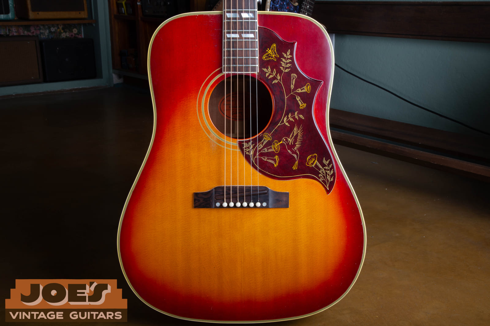

<figcaption><strong>A 1961, the second year of production.</strong> Gibson shipped 595 Hummingbirds that year. The cherry in the burst has held up better than most, and you can see the wide, deep red edge that Kalamazoo was spraying before the finish recipe drifted lighter later in the decade.</figcaption>
</figure>

<h2 id="quick-answer">The Short Version</h2>

If you only read one section, read this one.

| Question | Answer |
| --- | --- |
| **Introduced** | 1960, Gibson's first square shoulder dreadnought |
| **Built where** | Kalamazoo, Michigan |
| **List price** | $250 in 1962, with the plush lined case another $50 |
| **Body** | Spruce top, mahogany back and sides, 16 1/4 inch lower bout |
| **Scale** | Measure it. Sixties examples turn up at both 24 3/4 and 25 1/2 inches |
| **Bridge** | Fixed saddle at first, adjustable rosewood bridge standard from 1961 |
| **Fretboard** | Bound rosewood with double parallelogram inlays |
| **Finish** | Cherry sunburst only until natural arrived in 1963 |
| **First year output** | 156 guitars shipped in 1960 |
| **The big year to know** | 1965, when the nut got narrower and values step down |
| **The other big year** | 1970, when the adjustable saddle, gold hardware, and one piece neck all went away |
| **2026 value** | Roughly $1,600 for a late seventies example to $12,000 for a clean early one |

<h2 id="history">What the Hummingbird Is and Why 1960 Mattered</h2>

By the late fifties Martin was selling every dreadnought it could build and Gibson was watching it happen. Gibson's own big flat-tops, the J-45 and the Southern Jumbo, had the sloped shoulder shape they had used since the thirties. Good guitars, but they looked like the past sitting next to a D-28.

So Gibson built a square shouldered guitar. The body outline moved closer to Martin's, the top got X bracing, and then Kalamazoo did the thing Kalamazoo always did, which was decorate it. Bound body, bound neck, split parallelogram pearl inlays, gold tuners, a cherry sunburst, and a pickguard engraved with a hummingbird feeding at trumpet flowers with a butterfly up in the corner. At $250 it landed as the second most expensive flat-top Gibson made, behind only the J-200.

The catalog pitched it at singers. Gibson described the sound as big and round with the deep bass players wanted, and sold it as an accompaniment guitar rather than a bluegrass cannon. That was an accurate read on what the thing actually does.

It found the right decade. Within a few years the Hummingbird was on stages and in studios with Keith Richards, Gram Parsons, Jimmy Page, and John McLaughlin. Richards and Jagger are both playing them in the Godard footage of the Stones writing Sympathy for the Devil in 1968. That association is a real part of what a sixties example is worth today, and there is no point pretending otherwise.

<figure>

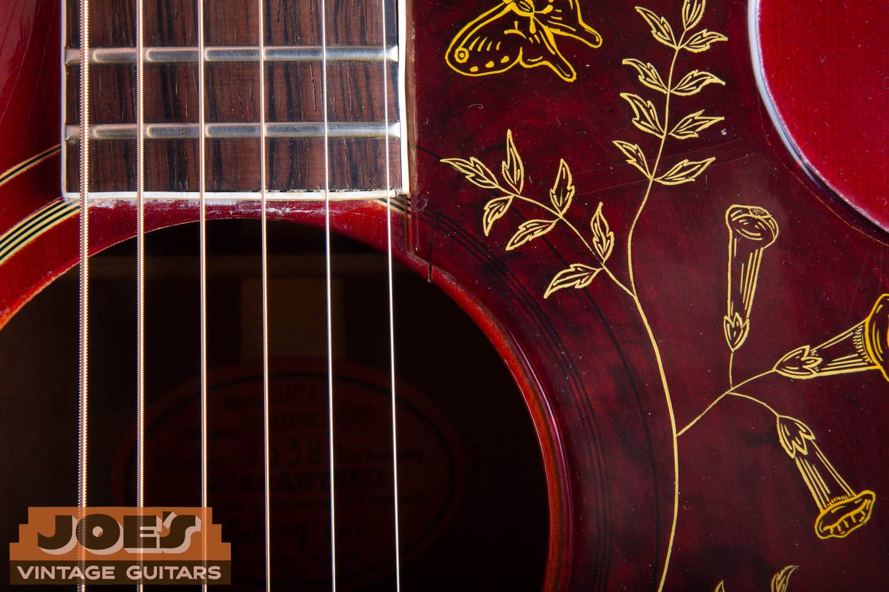

<figcaption><strong>The guard is engraved, then filled.</strong> The design is cut into the plastic and the lines are filled with gold, which is why the artwork sits below the surface and picks up light differently than a printed guard would. On sixties guitars the gold wears thin at the pick area first. This one still has crisp fill on the butterfly.</figcaption>
</figure>

<h2 id="specs">The 1960 Spec Sheet</h2>

What Gibson actually built at the start, before the specs began drifting:

- **Top.** Solid spruce, X braced, in cherry sunburst. No other finish was offered.
- **Back and sides.** Honduras mahogany, finished in cherry.
- **Neck.** One piece Honduras mahogany with an adjustable truss rod and a 1 11/16 inch nut.
- **Fretboard.** Bound rosewood, 20 frets, large split parallelogram pearl inlays.
- **Headstock.** Gibson logo in gold, crown inlay below it, gold single line Kluson tuners with white plastic buttons, pitched back 17 degrees.
- **Bridge.** Rectangular rosewood. The first ones had a fixed saddle. The adjustable saddle became standard during 1961, with ceramic and rosewood saddles both in use.
- **Guard.** Large engraved plastic guard with the hummingbird, trumpet flower vine, and butterfly.
- **Binding.** Multi ply on the top, single ply on the back, bound neck.

<figure>

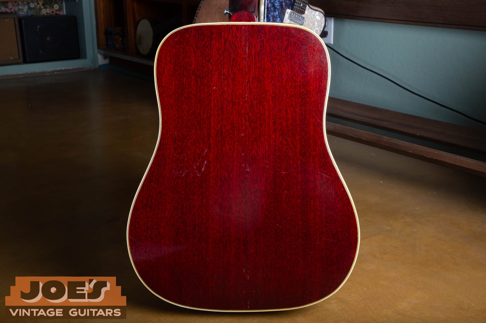

<figcaption><strong>Mahogany, finished in cherry.</strong> The back and sides on every standard Hummingbird are mahogany, not maple. That is the single most common spec mix up on this model, because the Dove that followed in 1962 is a maple guitar and the two get talked about together.</figcaption>
</figure>

You will notice one spec missing from that list, and its absence is deliberate. **Scale length on a vintage Hummingbird is the one number you should never assume.** The modern one is a 24 3/4 inch short scale and Gibson standardized on that in 1976, so most spec sheets you find online just repeat 24 3/4 back at you for the sixties guitars too. The dealer listings do not agree with that. Measured sixties examples turn up at 24 3/4 and at 25 1/2, sometimes a year or two apart, and a few land in between.

So measure the guitar in front of you. Nut to the center of the twelfth fret, doubled. It takes fifteen seconds and it changes what strings you buy, how the thing feels under your hand, and what you tell a buyer. A short scale Hummingbird is looser and warmer with less tension at pitch. A long scale one is tighter and louder and asks more of your fretting hand. Both left Kalamazoo.

<h2 id="evolution">Year by Year: What Changed and When</h2>

| Year | What changed |
| --- | --- |
| **1960** | Introduced. Cherry sunburst only. Fixed saddle bridge. Factory order number inked on the neck block, no headstock serial. 156 shipped. |
| **1961** | Headstock serial numbers begin. The adjustable saddle bridge becomes standard during the year. 595 shipped. |
| **1962** | List price $250. 503 shipped. |
| **1963** | Maple back and sides offered as an option. Pickguard shrinks slightly. Natural finish appears. 1,461 shipped, 97 of them natural. |
| **1964** | 991 shipped. |
| **1965** | Nut width narrows. 1,161 shipped. |
| **1966** | Headstock pitch changes from 17 degrees to 14. 794 shipped. |
| **1967** | 884 shipped. |
| **1968** | Bridge starts moving from belly up to belly down, bracing gets heavier. 1,311 shipped. |
| **1969** | Belly down bridge becomes the norm. 1,024 shipped. |
| **1970** | Norlin era. Adjustable saddle dropped. Chrome replaces gold. Neck becomes three piece laminated mahogany. 879 shipped. |
| **1971** | Double X bracing comes in and stays until the mid eighties. 848 shipped. |
| **early 1970s** | Label changes to Hummingbird Custom with no change to the guitar. |
| **1973** | Block fretboard inlays replace the parallelograms. |

Shipping totals come from the Kalamazoo records. We keep the full set in our [Gibson production numbers guide](/post/gibson-shipping-totals-1948-1979/) if you want to see how the Hummingbird compares to the rest of the line.

<h3 id="early">1960 to 1962: The First Run</h3>

These are the ones collectors chase and they are genuinely scarce. Add up 1960, 1961, and 1962 and Gibson shipped about 1,250 Hummingbirds total in three years, which is fewer than they shipped in 1963 alone. Sixty-five years of attic storage, house fires, and firewood have taken their cut since.

Cosmetically these are the boldest looking ones. Deep red in the burst, a big guard, thick gold in the engraving, and gold plating on the tuners that had not yet been value engineered. Tonally they are the most open of the bunch, which is partly the lighter bracing and partly six decades of playing in.

<figure>

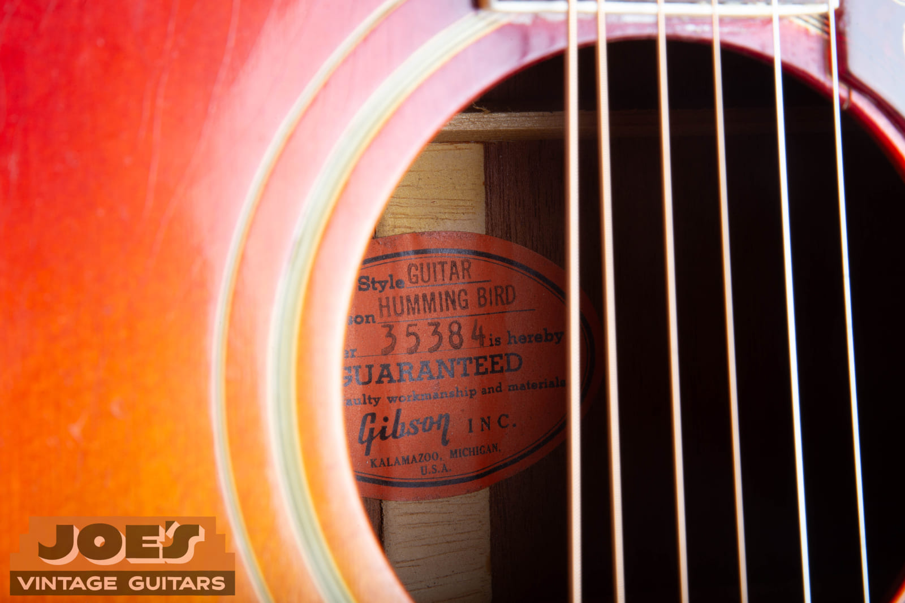

<figcaption><strong>Two words on the early labels.</strong> This 1961 label reads HUMMING BIRD as two words, written in by hand at the factory along with the number. That 35384 is the same number stamped into the back of the headstock. When those two disagree, something has been apart.</figcaption>
</figure>

<h3 id="sixtythree">1963: Maple, a Smaller Guard, and Natural Tops</h3>

Three changes in one year. Gibson started offering maple back and sides as an option, the pickguard came down slightly in size, and natural finish appeared alongside the sunburst. Only 97 of the 1,461 guitars shipped in 1963 were natural, so a genuine natural early Hummingbird is a real rarity. A maple one is rarer still and almost nobody knows they exist.

The guard change is subtle and hard to call from a photo. Comparing a 1961 to a 1965 side by side you can see it, but do not try to date a guitar off guard size alone.

<figure>

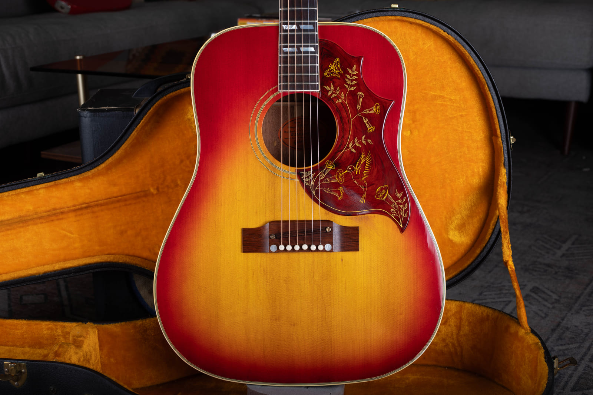

<figcaption><strong>The best preserved of the five.</strong> A mid sixties example, serial 150277, in its original case. The burst still runs a hard red at the edge into a clean yellow center, which is how they left Kalamazoo and how few of them look now.</figcaption>
</figure>

<h3 id="sixtyfive">1965: The Nut Gets Narrow</h3>

The most consequential year in the whole run for value. In 1965 Gibson narrowed the nut on its flat-tops from 1 11/16 inches down to somewhere between 1 5/8 and 1 9/16, depending on the guitar. Players call the narrow ones pencil necks. Fingerstyle players hate them. Strummers with average hands often do not notice. But the market has decided, and a 1965 is worth meaningfully less than a 1964 that is otherwise identical.

This is also where you learn to stop trusting anything but a ruler. The change did not happen on January 1. Late 1964 guitars with narrow nuts exist, and so do early 1965s with the wide one. Measure it.

<figure>

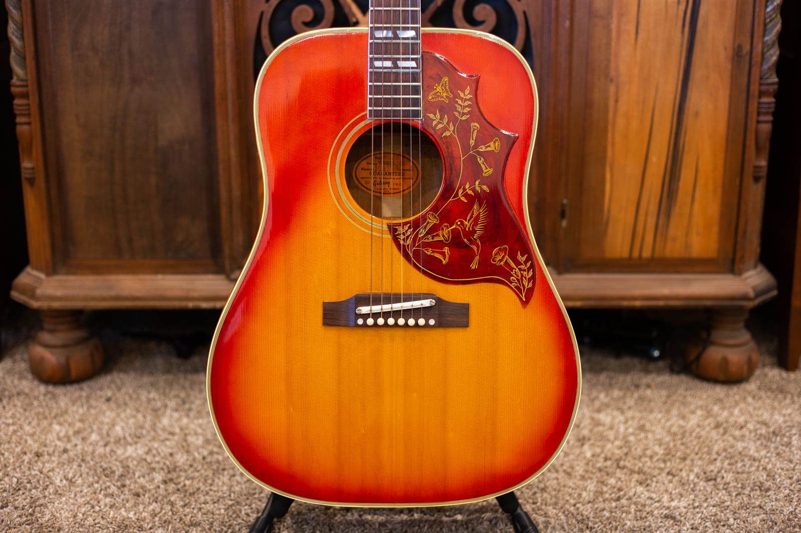

<figcaption><strong>A 1965, serial 308580.</strong> Same guitar as a 1964 to look at, and priced a full step below it because of the nut. The white ceramic saddle sitting up on its two adjuster screws is the giveaway for the adjustable bridge era.</figcaption>
</figure>

<h3 id="sixtyeight">1968: Heavier Bracing, Squarer Bridge</h3>

The bridge shape gets blockier and the braces get bulkier. Neither change helps the guitar. This is the start of the long slide in Gibson acoustic build quality that runs through the seventies, and 1968 is roughly where the vintage market stops paying a premium.

<h3 id="seventy">1970: The Adjustable Saddle Goes Away</h3>

A cluster of changes landed at once under new corporate ownership. The adjustable saddle was dropped for a fixed one, the gold hardware became chrome, and the one piece mahogany neck became a three piece laminate. If you have a Hummingbird with a plain fixed saddle, chrome tuners, and two glue lines running up the back of the neck, you are looking at 1970 or later, and no serial number is required.

<h3 id="seventies">1971 to 1979: Double X Bracing and the Custom Label</h3>

From 1971 Gibson went to double X bracing, which is exactly what it sounds like and does exactly what you would expect: it makes the top stiff. Seventies Hummingbirds are famously tight and quiet compared to sixties ones. They are also overbuilt in a way that means very few of them have bellied up or cracked, so they turn up in better structural shape than the guitars people actually want.

Somewhere in the early seventies the label started reading Hummingbird Custom. The specs did not change. It was a name on a label, and it does not mean you have a special order guitar.

Then in 1973 the parallelogram inlays were replaced with plain rectangular blocks. They came back in the early eighties. If your Hummingbird has block inlays it is a seventies guitar, full stop.

<figure>

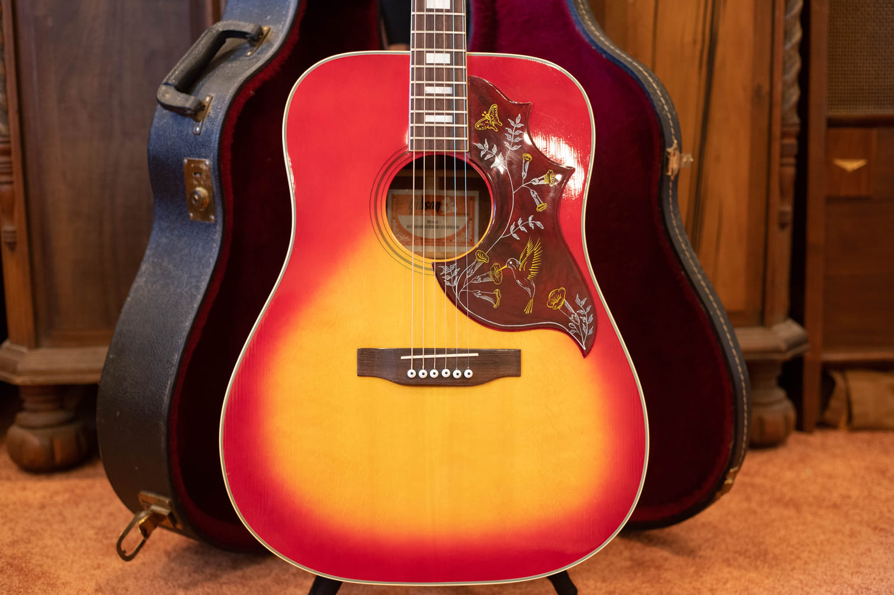

<figcaption><strong>The end of the run, 1979.</strong> Same outline, same artwork, different guitar. Note the plain fixed saddle with no adjuster screws, the narrower burst that fades to a hot red edge, and the pickguard engraving filled in white rather than all gold. It is a good, stout guitar. It is not an early sixties Hummingbird and it does not price like one.</figcaption>
</figure>

<figure>

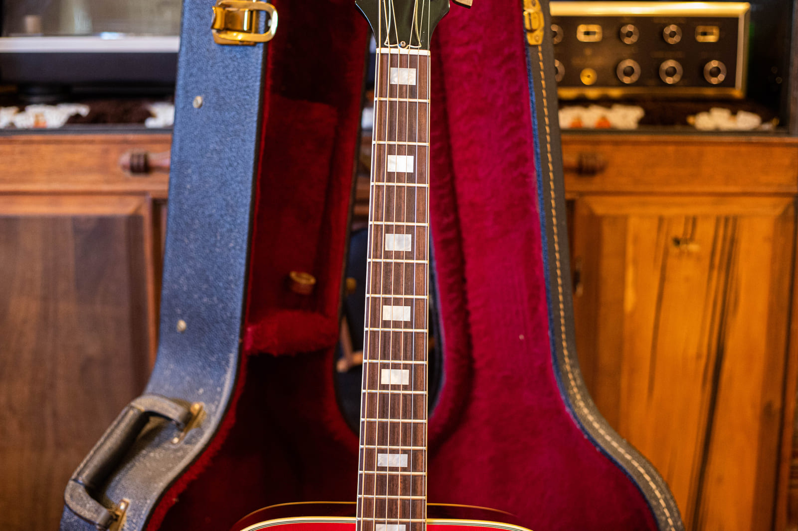

<figcaption><strong>Blocks, not parallelograms.</strong> The single fastest era check on the whole guitar. Gibson ran plain rectangular inlays from 1973 into the early eighties. Anything with the split parallelograms is either pre 1973 or post 1980, and the rest of the hardware sorts out which.</figcaption>
</figure>

<h2 id="bridge">The Adjustable Bridge, Explained</h2>

More argument surrounds this part than any other on the guitar, so here is what is actually going on.

Gibson's adjustable bridge is a rosewood bridge with a saddle that rides on two threaded posts. Turn the screws and the action goes up or down without touching the neck or filing anything. Gibson used ceramic saddles and rosewood saddles both, and you find each of them on sixties Hummingbirds.

One thing to get straight, because plenty of sources get it wrong: **the Hummingbird did not launch with the adjustable bridge.** The first ones had a fixed saddle. Gibson brought the adjustable saddle in and made it standard across the flat-top line during 1961, and it stayed until the fixed saddle came back in 1970. Gibson's own Custom Shop still builds the 1960 reissue in both configurations, which tells you how real the split is. If you have a 1960 or a very early 1961 with a plain fixed saddle, do not let anybody tell you the bridge has been swapped.

The complaint is that it costs you volume and low end, because instead of the strings driving the top through a solid saddle glued into a solid bridge, the energy passes through two little metal posts. There is something to that. Whether it is a problem depends on the guitar and on what you want from it.

What we tell people: **do not convert a clean, original, early Hummingbird.** A period correct adjustable bridge is part of what a collector is buying, and filling the slot is not something you undo. If the guitar is already a player, already been refinished, or already had work, converting it is a defensible choice and a good tech can do it well. On an all original 1962, leave it alone.

<figure>

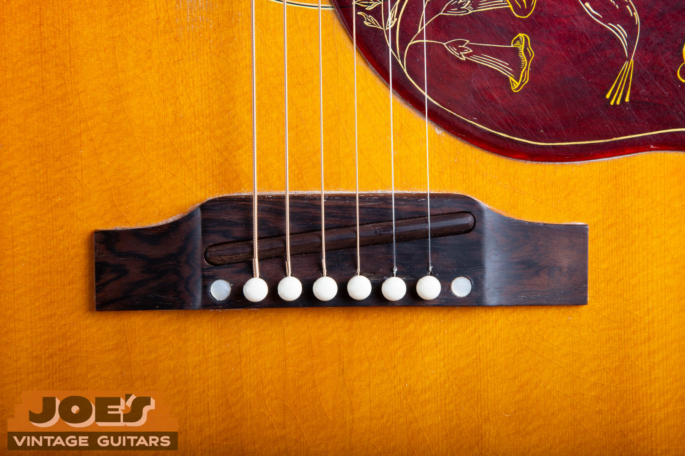

<figcaption><strong>Here is what to look for.</strong> The 1961 has a wide routed saddle channel with a rosewood saddle sitting down in it and no adjuster screws at either end. Given that 1961 is the exact year the adjustable saddle came in, this one could be a transitional guitar or it could be an adjustable bridge that lost its hardware. That is a question worth settling with the guitar in your hands before you agree a number.</figcaption>
</figure>

<figure>

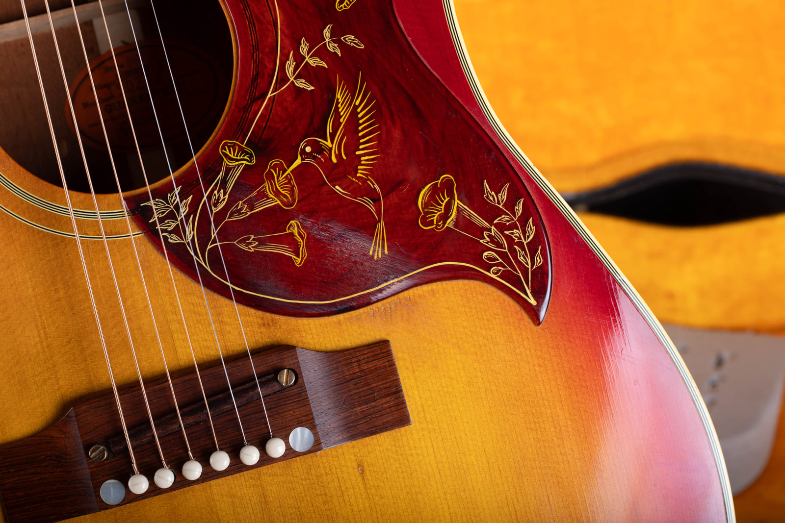

<figcaption><strong>Rosewood saddle version.</strong> The two slotted screws at either end are the height adjusters. This guitar has the rosewood saddle rather than the white ceramic one, and both are correct for the period. Players tend to prefer the rosewood.</figcaption>
</figure>

<figure>

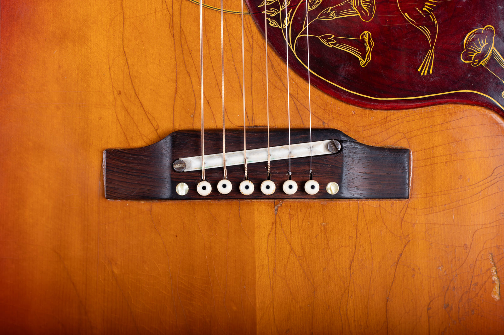

<figcaption><strong>Ceramic saddle version, on a well used 1964.</strong> Same hardware, different saddle material. Look past the bridge at the top: that web of fine lines is finish checking, and on a Kalamazoo nitro finish from 1964 it is normal, expected, and not a value problem on its own.</figcaption>
</figure>

<h2 id="dating">How to Date a Hummingbird</h2>

<h3 id="serials">Serial Numbers and Factory Order Numbers</h3>

**If there is no number on the headstock, look inside.** A 1960 Hummingbird will not have a headstock serial, because Gibson had not started stamping them on flat-tops yet. What it has instead is a factory order number inked onto the neck block, visible through the soundhole with a light and a mirror. The letter in front is the year code: **R is 1960 and Q is 1961.** Gibson retired the FON system during 1961, so a Q number is genuinely uncommon. If you find an R, you are holding a first year guitar and it should be priced like one.

From 1961 through 1969 Gibson stamped the serial into the back of the headstock and wrote the same number on the label inside. Those numbers are a starting point and nothing more. Gibson duplicated numbers in this period, ran them out of sequence, and reused blocks. Two guitars built four years apart can carry the same serial. Anybody who dates a sixties Gibson off the number alone and stops there is guessing.

<figure>

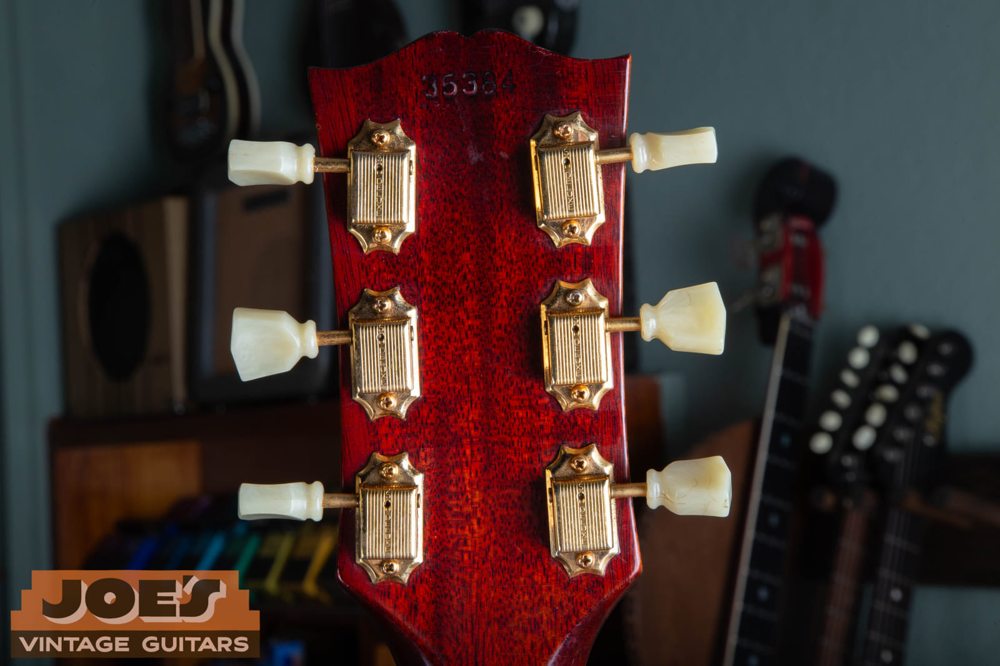

<figcaption><strong>Stamped, not stickered.</strong> The 35384 on the back of this 1961 headstock is pressed into the wood under the finish. It matches the label inside, which is what you want. Also visible: gold plated single line Klusons with white buttons, correct for the early sixties.</figcaption>
</figure>

1970 through 1975 is worse. Six digit numbers, largely meaningless, with a MADE IN USA stamp added.

From 1977 the system finally makes sense. Eight digits, where the first and fifth give you the year and digits two, three, and four give you the day of that year. The 1979 in these photos is stamped 71369072. First digit 7, fifth digit 9, so 1979. Digits two through four are 136, the 136th day, which is May 16. Our full [Gibson serial number guide](/how-to-read-gibson-serial-numbers/) walks through every era including the ones above.

<figure>

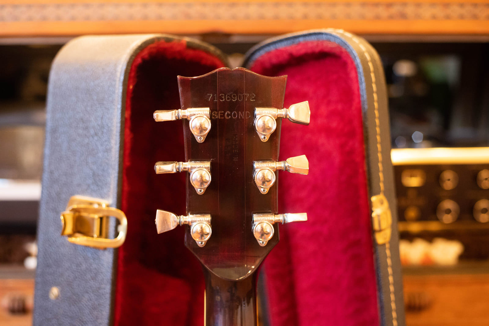

<figcaption><strong>Serial 71369072, and the word underneath it matters.</strong> SECOND is a factory stamp meaning the guitar failed Gibson's cosmetic inspection and was sold at a discount through a different channel. Structurally it is a normal Hummingbird. For value it is a real deduction, and any honest listing says so up front.</figcaption>
</figure>

<h3 id="label">The Soundhole Label</h3>

The label tells you more than the number on it does.

- **Orange oval label, model name written in by hand, HUMMING BIRD as two words.** Sixties. All three of the sixties guitars here read that way, including the 1964.
- **Rectangular orange and white label, model name printed, HUMMINGBIRD CUSTOM.** Seventies.

Check that the number on the label matches the stamp on the headstock. On the 1961 above, both read 35384. On the mid sixties example both read 150277. When they do not match, either the label has been replaced or the neck has, and you want to know which before money moves.

<figure>

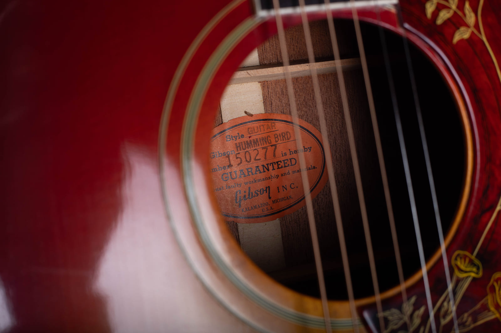

<figcaption><strong>Same label, different guitar.</strong> Serial 150277, and it matches the stamp on the headstock of this one too. Shine a light in there and photograph it before you list a guitar. It is the first thing any experienced buyer will ask for.</figcaption>
</figure>

<figure>

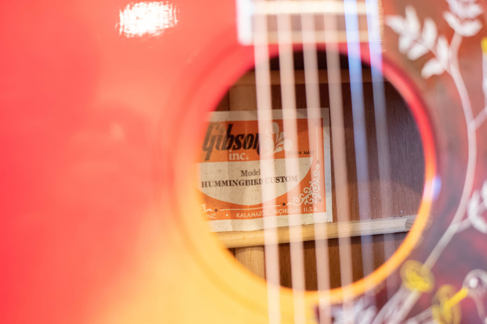

<figcaption><strong>The seventies label.</strong> Rectangular, not oval, and it says HUMMINGBIRD CUSTOM. That word Custom throws people constantly. It was a rename, not an upgrade, and it does not add a dollar to the guitar.</figcaption>
</figure>

<h3 id="features">Reading the Features</h3>

This is how you actually date one, and it takes about a minute:

1. **Look at the fretboard inlays.** Blocks means 1973 to about 1980. Parallelograms means everything else.
2. **Look at the bridge.** Adjustable saddle on two screws means 1961 to 1969. Plain fixed saddle means either a first year guitar or 1970 and later, and the rest of the list tells you which.
3. **Look at the bridge shape.** Belly up through most of the sixties, moving to belly down across 1968 and 1969.
4. **Look at the tuner plating.** Gold means the sixties. Chrome means 1970 or later.
5. **Look at the back of the neck.** One piece mahogany, no glue lines, means the sixties. Two visible glue lines means 1970 or later.
6. **Measure the nut.** 1 11/16 inches points to 1964 or earlier. Anything from 1 5/8 down to 1 9/16 points to 1965 or later.
7. **Sight the headstock pitch.** A steep 17 degree tilt back is 1965 and earlier. A shallower 14 degrees is 1966 through 1972.
8. **Read the label.** Handwritten HUMMING BIRD on an orange oval is the sixties. Printed HUMMINGBIRD CUSTOM on a rectangle is the seventies.

Run all eight and the answer usually converges on a two or three year window. Then use the serial to narrow it, not the other way around.

<h2 id="sound">How a Vintage Hummingbird Actually Sounds</h2>

Mahogany back and sides and a big square shouldered box. That combination gives you a warm midrange, a soft top end, and a bass that is round rather than tight. It is not a flat-picking guitar and it never claimed to be. Put a D-28 next to it and the Martin will out-project it and out-define it on single notes.

What the Hummingbird does that the Martin does not is sit under a voice without fighting it. Strum it and the whole thing blooms into a chord instead of six separate strings. That is exactly what Gibson advertised in 1960 and it is still the reason people buy them.

The eras really do sound different. An early sixties one with light bracing and sixty years on it is open, loud for a mahogany guitar, and quick to respond. A 1968 is noticeably stiffer. A 1975 with double X bracing is a different instrument, tight and polite, and no amount of playing in is going to loosen it much, because the bracing is the reason.

<h2 id="versus">Hummingbird vs J-45 vs Dove</h2>

The three questions we get asked most, answered together.

| | Hummingbird | J-45 | Dove |
| --- | --- | --- | --- |
| **Shoulders** | Square | Round | Square |
| **Back and sides** | Mahogany | Mahogany | Maple |
| **Scale** | 24 3/4 in modern, but measure a vintage one | 24 3/4 in | 25 1/2 in |
| **Trim** | Bound neck, parallelograms, engraved guard | Plain, dot inlays | Bound neck, engraved guard, dove bridge |
| **Voice** | Warm, mid forward, blooms | Woodier, drier, more compressed | Brighter, tighter bass, more cut |
| **Best at** | Singing over it | Recording, roots, anything | Big strumming, cutting through a band |

Short version: the J-45 is the workhorse and the better recording guitar, the Dove is the loud one, and the Hummingbird is the one you reach for when you are singing. If you want the full breakdown on the round shouldered family, we have a separate guide on [identifying a J-45, J-50, and Southern Jumbo](/post/identify-vintage-gibson-j45-j50-sj/).

<h2 id="value">What a Vintage Hummingbird Is Worth</h2>

Ballpark retail for a clean, all original, structurally sound guitar in 2026. These are asking numbers at a dealer, not what a private seller nets and not what a shop pays on a cash offer.

| Era | What you have | Typical retail |
| --- | --- | --- |
| **1960 to 1962** | Cherry sunburst, wide nut, first run scarcity | $8,000 to $12,000 |
| **1963 to 1964** | Cherry sunburst, wide nut, adjustable saddle | $6,500 to $9,750 |
| **1965** | Narrow nut, otherwise unchanged | $5,000 to $6,750 |
| **1966 to 1968** | Heavier build from 1968 on | $3,750 to $5,500 |
| **1969 to 1972** | Fixed saddle, chrome, three piece neck | $2,200 to $3,400 |
| **1973 to 1979** | Block inlays, double X bracing, Custom label | $1,600 to $2,800 |

The published price guides put a 1960 through 1964 cherry sunburst at roughly $7,500 to $9,750 and a 1965 at $5,250 to $6,750, which lines up with the table above. Where book values and reality part company is at the top and the bottom. A documented 1960 or 1961 in honest original condition can beat the book, because there are only so many of them. A rough seventies guitar can sit unsold at book all year.

Things that move the number up:

- **Original hard case, and case candy.** The 1961 and the mid sixties example here both have their cases. One still has its Gibson strings box and the case key in the accessory compartment. That is worth real money to the right buyer, and it costs nothing to keep.
- **Natural finish, early.** 97 of them in 1963. Do the math.
- **Maple back and sides.** Unusual enough that the price is a negotiation rather than a lookup.
- **Original owner history and paperwork.** Always.
- **An unmolested bridge.** More on that below.

<figure>

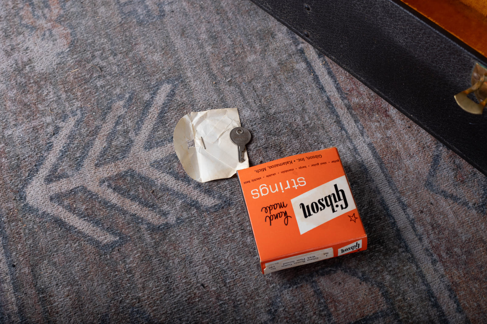

<figcaption><strong>Do not throw this out.</strong> An unopened Gibson strings box and the original case key from the accessory compartment of the mid sixties guitar. Small stuff, but a collector notices, and it is evidence the guitar has not been through six owners and a pawn shop.</figcaption>
</figure>

<h2 id="deductions">What Takes the Value Down</h2>

In rough order of how much damage each one does.

**A refinish.** The largest single deduction on any vintage Gibson, commonly 40 to 60 percent. Cherry sunburst is also the hardest finish to fake convincingly, which cuts both ways: refins on these are usually obvious once you know to look at the binding edges and inside the soundhole.

**A bridge that is not original.** Check the footprint. A bridge that does not sit exactly on the original glue outline, or one in the wrong shape for the year, is a red flag on an expensive guitar. Gibson bridges do come off, so a correct replacement done well is survivable. A modern belly bridge glued onto a 1963 is not.

**A converted adjustable bridge.** On a player grade guitar, minor. On an otherwise all original early sixties example, real money. The tell is a filled slot where the adjuster posts used to be, visible if you look straight down the saddle line.

**A neck reset that has not been done.** Not fatal, and most sixties Gibsons are due for one by now, but it is a $700 to $1,200 job and a buyer will price it in.

**Top cracks, especially through the bridge or along the seam.** Cleanly repaired and cleated cracks are livable. Open cracks and a bellied top are not, and a badly bellied Gibson top usually means the bridge plate is chewed up too.

**Added holes.** Pickup jacks in the rim, strap buttons through the heel, tuner screw holes that do not match. Each one is small. They add up.

**A SECOND stamp.** Expect a deduction. How big depends on why it was a second, which Gibson never wrote down.

**Cherry fade.** Not a deduction. Almost every sixties Hummingbird has lost some red, and the ones that turned a warm amber are prized by plenty of buyers. Do not let anybody talk you down over it.

<figure>

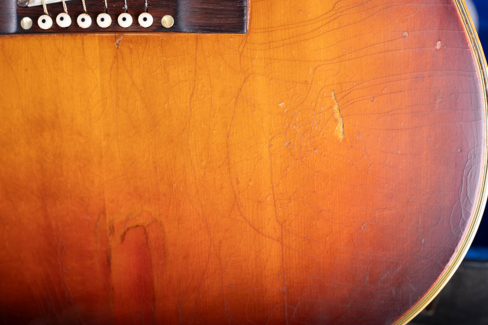

<figcaption><strong>This is what sixty years looks like.</strong> Heavy checking, a faded burst, and honest playing wear on the 1964. None of that is damage. It is a nitro finish that has shrunk at a different rate than the wood underneath it, and buyers who understand vintage guitars read it as a good sign rather than a bad one.</figcaption>
</figure>

<h2 id="five">The Five Guitars in These Photos</h2>

For the record, since every photo above is one of these:

**The 1961, serial 35384.** Two word HUMMING BIRD label matching the headstock stamp, gold Klusons with white buttons, deep original cherry on the mahogany. The bridge on this one has a rosewood saddle sitting in the slot with no adjuster screws present, so at some point somebody dealt with the adjustable hardware. Worth knowing about, and exactly the kind of thing to check before you agree a price.

**The mid sixties example, serial 150277.** Two word label, gold tuners, adjustable bridge with the rosewood saddle, and the best preserved burst of the five. Complete with its case, the case key, and an unopened box of Gibson strings.

**The 1964.** The player of the group. Ceramic adjustable saddle, heavy checking, a faded top that has gone amber in the middle, and the original blue lined case. This is what a Hummingbird looks like when somebody actually used it for sixty years.

<figure>

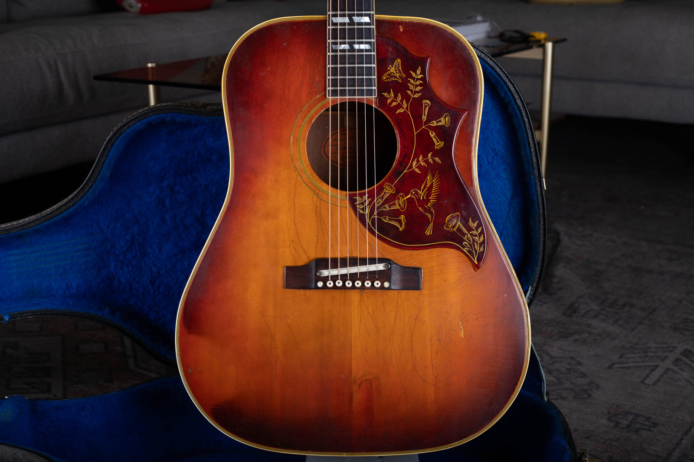

<figcaption><strong>Sixty years of use looks like this.</strong> The 1964 has lost most of its red, checked all over, and picked up wear around the guard and the lower bout. It also plays and sounds better than any of the others, which is not a coincidence. Guitars that get played loosen up.</figcaption>
</figure>

**The 1965, serial 308580.** Ceramic saddle, gold tuners, brown alligator grain case, and a very clean top. The nut change year, which is the only reason a clean 1965 prices below a clean 1964.

<figure>

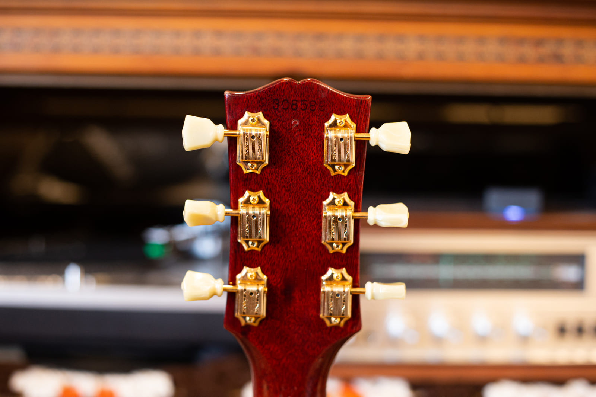

<figcaption><strong>Serial 308580 on the 1965.</strong> The number itself is nearly useless on its own, because Gibson repeated and rearranged them all through the sixties. What dates this guitar is the nut, the bridge, the tuner plating, and the one piece neck, all of which agree with each other.</figcaption>
</figure>

**The 1979 Hummingbird Custom, serial 71369072.** Block inlays, chrome Grover tuners, fixed saddle, rectangular Custom label, decorative marquetry strip down the back, and SECOND stamped under the serial. Every seventies change on one guitar.

<figure>

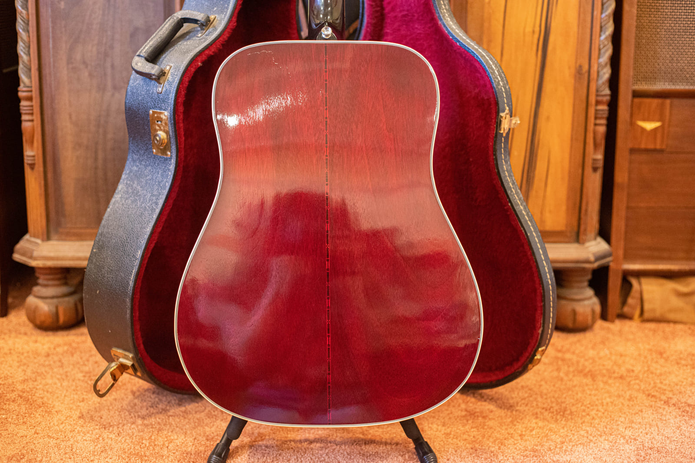

<figcaption><strong>Seventies details on the back.</strong> Decorative center strip, very dark cherry, and the blue and red case that dates the guitar as surely as the label does. Structurally these late ones are usually excellent, because Gibson built them heavy.</figcaption>
</figure>

<h2 id="faq">Frequently Asked Questions</h2>

**How much is a vintage Gibson Hummingbird worth?**

Anywhere from about $1,600 to $12,000 depending almost entirely on year and originality. Early sixties guitars with the wide nut and original finish sit at the top. Seventies guitars with block inlays sit at the bottom. Condition can move either of those by half in both directions.

**What year did Gibson start making the Hummingbird?**

1960. It was Gibson's first square shouldered dreadnought, and 156 shipped that first year.

**How do I tell what year my Hummingbird is?**

Read the features before the serial. Fretboard inlays, bridge type and shape, tuner plating, neck construction, nut width, headstock pitch, and label style will get you to a two or three year window. Gibson's sixties serial numbers were duplicated and run out of order, so the number confirms your answer rather than producing it. If there is no headstock number at all, look for an inked factory order number on the neck block: R is 1960, Q is 1961.

**What is the scale length of a vintage Gibson Hummingbird?**

Measure yours. Gibson settled on the 24 3/4 inch short scale in 1976 and every modern spec sheet repeats that number, but sixties examples are documented at both 24 3/4 and 25 1/2 inches. Nut to the center of the twelfth fret, doubled, and you have your answer in fifteen seconds.

**Did the first Hummingbirds have an adjustable bridge?**

No. The earliest ones have a fixed saddle. Gibson made the adjustable saddle standard during 1961 and it ran until 1970. So a plain fixed saddle on a 1960 is correct and original, while a plain fixed saddle on a 1965 usually means somebody converted it.

**Is the adjustable bridge bad? Should I convert mine?**

It gives up some volume and low end compared to a fixed saddle. On a guitar that has already been worked on, converting is a reasonable choice with a good tech. On a clean, all original early example, do not do it. You will take more off the value than you gain in tone.

**What is the difference between a Hummingbird and a J-45?**

Square shoulders versus round, and trim. Both are mahogany with a spruce top. The Hummingbird is dressier and blooms more under a voice. The J-45 is plainer, drier, and the better all around recording guitar. One warning on the spec sheets: the J-45 is a reliable 24 3/4 inch short scale, while sixties Hummingbirds turn up at both 24 3/4 and 25 1/2. Measure before you assume they play the same.

**Are seventies Hummingbirds any good?**

They are solid, well built guitars that sound tight because of the double X bracing, and they are the cheapest way into a real Kalamazoo Hummingbird. Buy one to play, not to invest.

**What does the SECOND stamp on the headstock mean?**

The guitar failed Gibson's cosmetic inspection at the factory and was sold as a factory second at a lower price. It is not a structural rejection. It does reduce the value, and it should always be disclosed.

**What is a Hummingbird Custom?**

A name Gibson put on the label in the early seventies. The guitar underneath is a standard Hummingbird. It is not a custom order and it is not a higher grade model.

**My Hummingbird's finish has faded from red to orange. Is that a problem?**

No. Gibson's cherry was fugitive and nearly all of them have lost some red. Plenty of buyers prefer the faded ones. What matters is that the finish is original.

**Are natural finish Hummingbirds worth more?**

The early ones are, because they are rare. 97 of the 1,461 guitars Gibson shipped in 1963 were natural. Later natural examples are more common and price closer to the sunbursts.

**Should I get the top crack repaired before selling?**

Ask first. A clean repair by a good luthier usually pays for itself. A cheap repair costs more than the crack did, and it cannot be undone. We will tell you honestly which one your guitar needs.

<h2 id="closing">Closing Thoughts</h2>

The Hummingbird is one of the few guitars where the decorative version turned out to be the serious one. Gibson dressed up a dreadnought to compete with Martin on looks, and accidentally built an instrument that does something specific and does it better than anything else in the catalog.

If you own one, spend ten minutes with the eight checks above before you talk to anybody about value. Know the year, know whether the bridge is original, know whether the nut is wide or narrow, and take photos of the label, the headstock stamp, the bridge, and the back of the neck. Those four photos answer most of what a serious buyer is going to ask, and having them ready is the difference between a straight offer and three weeks of back and forth.

If you inherited one and have no idea what it is, that is fine too. Send us the photos and we will tell you what you have.

We buy, sell, and appraise vintage acoustics out of our shop in Mesa, Arizona. If you have a Hummingbird and want to know what it is worth, start with a [free appraisal](/free-appraisal/), or read how we handle a [Gibson sale](/sell-my-gibson-guitar/) if you are ready to move it. You can also just [get in touch](/contact-me/) and ask.
