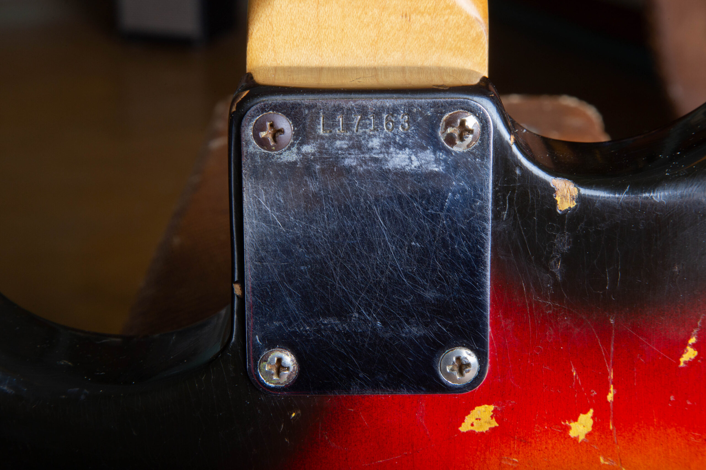
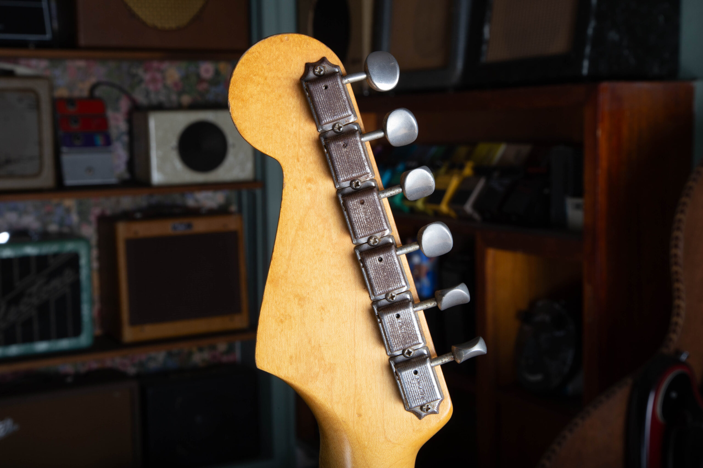
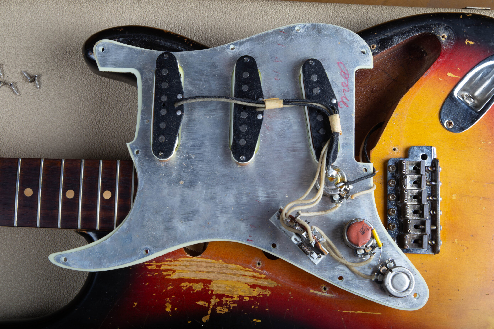
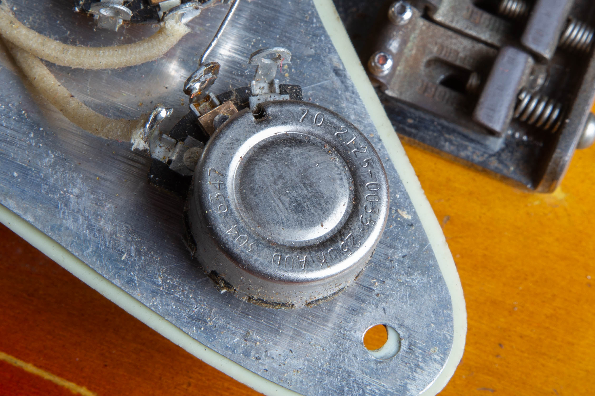
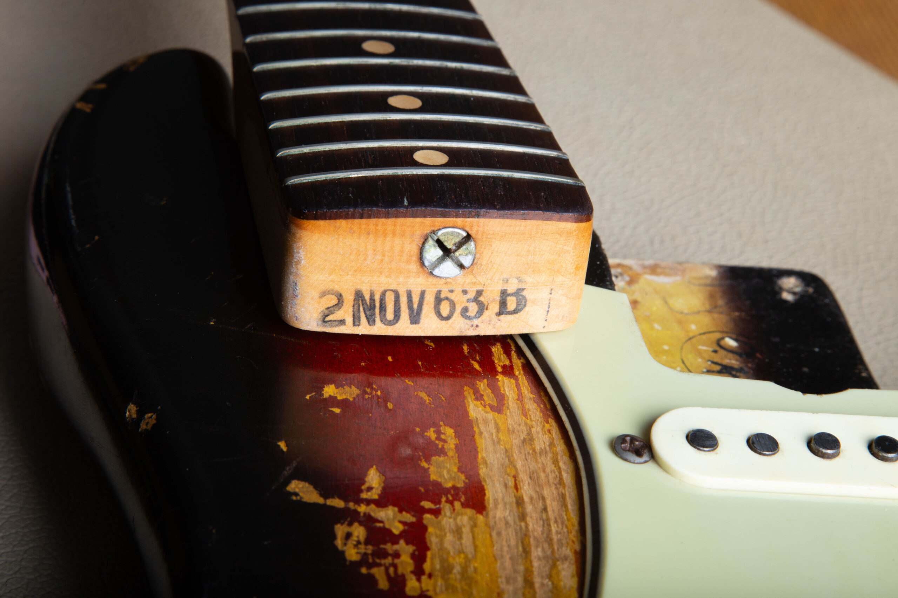

A serial number dates a guitar. It cannot prove the finish, the parts, or whether the instrument is original. A real number can sit on the wrong guitar. I treat the serial as a claim, then I check whether the rest of the guitar agrees with it. The longer argument is in my [Vintage Verified essay](https://www.vintageverified.com/joes-vintage).

<nav class="post-toc-inline" aria-label="Table of contents">

-   [What A Serial Number Actually Proves](#what-a-serial-number-actually-proves)
-   [What All Original Actually Means](#what-all-original-actually-means)
-   [The Bench Sequence](#the-bench-sequence)
-   [The Escalation Ladder](#the-escalation-ladder)
-   [What Changes Hands With The Answer](#what-changes-hands-with-the-answer)
-   [Frequently Asked Questions](#frequently-asked-questions)
-   [Send Me Photos And I Will Read The Guitar](#send-me-photos-and-i-will-read-the-guitar)

</nav>

<h2 id="what-a-serial-number-actually-proves">What A Serial Number Actually Proves</h2>

A serial number is a factory tracking mark. On a good day it points at a year range. It does not prove the finish is factory, the pickups never left, or the neck and body left the same bench together.

Each brand asks the number to do a different job, and none of them ask it to certify originality.

On a vintage Fender, the serial is a rough guide, not an exact date. Before the mid-1970s, Fender mixed stockpiled parts, so the number only narrows the window. Neck-heel stamps and pot codes are tighter clues, and even those date the part, not the finished guitar. I wrote that out in the [Fender serial number guide](/fender-guitars-serial-number-guide/).

<figure>

<figcaption>L-series neck plate on this 1963 Strat. The L prefix is a late 1962 through early 1965 window. The heel stamp and pots have to close the year.</figcaption>

</figure>

On a Gibson from about 1961 to 1969, the serial is weaker still. The company reused and duplicated ranges, so one number can point at two, three, or even four years. You corroborate with pot codes, pickups, tuners, logo, and hardware. The [Gibson serial number guide](/how-to-read-gibson-serial-numbers/) is the lookup. The guitar in your hands is the proof.

Martin is the cleanest of the three on year. Since 1898 the company has used one continuous serial run, and the number alone pins the production year against the published year-end chart. Look through the soundhole: the serial is stamped on the neck block, with the model stamp above it on most guitars after 1930. Year is not originality. A correct Martin serial still sits on a refinished top or a swapped bridge. The [Martin serial and model number guide](/martin-serial-and-model-numbers/) gets you the year. The rest of this page is what the year cannot do.

A real serial is also not proof of a real guitar.

> A real serial number is not proof of a real guitar. Numbers get re-stamped, and neck plates get swapped.

Joe Dampt. From the [GuitarNiche guest post](https://guitarniche.com/buying-a-vintage-guitar-online-9-red-flags-to-check/).

I will put it the same way I did there. If the number and the guitar disagree, the guitar wins, and the number becomes a question, not an answer.

If you already have photos and you want a person to read them, skip the rest of the page and use the [free appraisal](/free-appraisal/). I work out of Mesa. I do most appraisals remotely from photos.

<h2 id="what-all-original-actually-means">What All Original Actually Means</h2>

"All original" is three separate claims stacked into two words. People search it as if it were one yes-or-no switch. It is not.

All original means the finish, pickups, tuners, bridge, frets, and electronics are as the factory built them, with nothing replaced and nothing refinished. It is one of the hardest conditions to find on a vintage instrument. Even a refret can cost a guitar that label.

Treat those as three checks, not one slogan.

**Original finish.** The nitrocellulose that left the spray booth, aged in place. Nitro dries thin and glossy, then yellows and checks into fine hairline cracks. A later paint job, even a careful one, is a refin. Collectors pay for the original film, not a perfect respray.

**Original parts.** Tuners, pickups, bridge, pots, knobs, pickguard, tailpiece. A period-correct replacement is still a replacement. Tuner stamps date the tuners, not the guitar. Because tuners come off with four screws, a correct-era stamp only helps when it agrees with the headstock, the finish, the pots, and the serial.

**Untouched electronics.** The solder, the cloth or braid, the pots, and the pickup leads still sitting where a factory iron left them. A pickup can be swapped in half an hour. The trip leaves tracks at the pots, the switch, and the cavity.

A guitar can have an original finish and replaced tuners. It can have original pickups and a refin. It can be all original and still have a later refret, which takes it off the strict all-original list even though the work kept it playable. Say the actual sentence: original finish, replaced tuners, refretted. Do not flatten that into "all original" because the serial decoded cleanly.

The original hard-shell case (OHSC in listings) is a nice extra. The case does not prove the guitar.

<h2 id="the-bench-sequence">The Bench Sequence</h2>

This is the order I actually run when a guitar is in front of me. I start with what I can see without a screwdriver, then I go inside. Each step can support a claim. No step can close the whole guitar by itself.

<h3 id="finish-and-wear">Finish And Wear</h3>

I look at the finish before I trust the number. Nitrocellulose was the standard film on most vintage Fender and Gibson electrics in the 1950s and 1960s. It checks as it ages. Wear should cluster where a player's arm, belt, and pick actually land. Wear that is even, theatrical, or copied onto edges that never see a shirt is a question, not a vibe.

Relic'ing is the intentional aging of a new guitar: worn finish, lacquer checking, tarnished hardware, dents. A relic is distressed on purpose. That is the opposite of earned wear. A convincing relic still has to survive pot codes, neck dates, and cavity paint, which is why the finish is step one and not the last word.

Under UV blacklight, aged original nitro usually glows greenish or yellowish, so touch-ups and overspray can show as dark or contrasting patches. That is a screening aid. It is not a stamp of originality. Old refinishes can hide. Poly and many later paints glow inconsistently. Fresh nitro has not aged enough to glow yet. A clean blacklight pass does not prove an original finish, and a glow does not confirm the guitar.

On a Fender custom color, the factory tells (nail holes, paint-stick shadow, Fullerplast, the blacklight procedure) live on the [custom color authentication guide](/post/fender-custom-color-authentication-guide/). I will not repeat that page here. One line is enough: if the money is in the color, read that guide, then send photos.

<h3 id="hardware-footprints-and-extra-holes">Hardware Footprints And Extra Holes</h3>

Hardware leaves a footprint. Extra screw holes around the tuners, a neck plate that does not sit in old lacquer witness lines, a bridge post that has been opened up, a pickguard with a later screw pattern: those are records of work.

On a 1962 Gibson ES-335 I appraised in person, I checked that the single-line, double-ring Kluson tuners were original with no added or enlarged holes. That is a typical pass: the tuners are period-correct, and the wood has not been opened up for a later set. The reverse is also useful. Extra holes behind modern tuners usually mean someone converted from Klusons, or converted back.

<figure>

<figcaption>Single-line Kluson Deluxe tuners on this 1963 Strat. No extra or enlarged screw holes behind them. A typical pass: period tuners, wood not opened up.</figcaption>

</figure>

A correct-era tuner does not prove the guitar is all original. It proves the tuners are the right vintage for the claim. Pair them with the rest of the guitar or they are just good parts.

<h3 id="cavities-routes-and-pot-codes">Cavities, Routes, And Pot Codes</h3>

Open the control cavity when you can do it without fighting vintage screws. On a suspected counterfeit Gibson, the cavity is one of the better tells. Factory instruments usually show clean routing, neat solder, full-size CTS or Gibson-branded pots, and braided pickup wire. Many fakes show rough routing, messy solder, tiny generic pots, and plastic-coated colored wire. Those are warning signs, not proof on their own.

A pot code is the EIA stamp on the back of a potentiometer. The first three digits name the maker: 137 is CTS, 134 is Centralab, 304 is Stackpole. The digits after that are year and week of the pot, not of the guitar. A code like 137 76 24 is a CTS pot from week 24 of 1976.

A pot date only tells you the earliest the guitar could have been built. Factories bought pots in bulk. Fender bought a large batch in 1966 and used them for years, so a guitar can be newer than its pots. It cannot be older than its latest original part. If one pot is ten years off from the others, that pot is the story. Read the [Fender pot code guide](/fender-pot-codes/) for the decoder. The same EIA logic is how I read Gibson pots when a 1960s serial is sitting on two possible years.

<figure>

<figcaption>Pickguard flipped on this 1963 Strat. Cloth wire, three 250k pots, and the codes on the back of the cans. This is where the serial stops being the whole story.</figcaption>

</figure>

<figure>

<figcaption>Stackpole code 304 6347 on this guitar. 304 is Stackpole. 6347 is 1963, week 47. That dates the pot, not the finished Strat.</figcaption>

</figure>

Paint in a route, overspray that stops at a later pickguard line, or a cavity that has been opened up with a different bit than the factory used: those are finish and routing questions. On Fender custom colors, the factory paint in the cavities is part of the color check, and that procedure stays on the custom color page.

<h3 id="solder-that-has-not-been-moved">Solder That Has Not Been Moved</h3>

Untouched solder is dull and grey. Rework is usually shinier, and it often sits on a joint that already has a blob underneath it. I am not going to write a tutorial on how to fake age into solder. I will tell you what I look for.

<figure>

<figcaption>Factory solder that has sat for decades is dull grey, with old flux around the joint. Later work is usually shinier and sits on top of an older blob.</figcaption>

</figure>

On Fender, untouched solder joints are one of the checks I use when a custom color is on the table. On a 1966 Jaguar in Lake Placid Blue, I asked for electronics photos specifically to read the solder, alongside the paint-stick mark in the neck pocket. The solder was not the whole proof. It was one more check that the harness had not been pulled for a refin.

On a Gibson PAF-era guitar, factory cover solder is grey. Fresh solder anywhere in the signal path raises the burden of proof on the pickups. The [PAF and patent-number pickup guide](/post/gibson-paf-patent-number-pickup-guide/) is the spoke for that. Charlie from es-335.com has written for years that original solder got turned into a stand-in for "the pickups never came out," and that a carefully redone ground can be hard to call. I agree with the caution. Solder is a witness. It is not a verdict. ([Take Off A Buck](https://www.es-335.com/2015/10/26/take-off-a-buck/), es-335.com.)

<h3 id="pickups-and-whether-they-belong">Pickups And Whether They Belong</h3>

Pickups have to match the guitar's claimed year, and they have to look like they have lived in that guitar. A PAF is Gibson's original Patent Applied For humbucker, fitted from 1957, with the small PATENT APPLIED FOR decal on the baseplate from late 1957 until the patent-number sticker around 1962. A pickup from the wrong decade, a baseplate that is too clean for the covers, or a harness that has been fished and put back, is a parts story.

<figure>

<figcaption>PAF baseplate with the PATENT APPLIED FOR sticker still on it, and grey oxidized cover solder. Fresh solder anywhere in that path raises the burden of proof on the pickup.</figcaption>

</figure>

A swapped pickup leaves tracks at the rings, the height screws, the cavity, and the solder. On a 335-style guitar, ask whether the harness has ever been pulled through an f-hole.

A correct pickup date still does not prove the guitar is all original. It proves that pickup is in the right era.

<h3 id="cross-dating-every-date-has-to-agree">Cross-Dating: Every Date Has To Agree</h3>

The serial is one date. The neck is another. The pots are another. The pickups, the tuners, the logo, and the hardware are more. I want those dates to tell the same story, or I want a reason they do not.

On a Fender, the [neck date](/fender-neck-dates/) is a production mark on the heel of the bolt-on neck, under the truss-rod nut. Fender marked them from the earliest solidbodies until about 1976, penciled until March 1962. The neck date dates the neck. It can differ from the body date by weeks or months on a perfectly original guitar, because Fender pulled finished necks from a bin. A neck dated well after the rest of the guitar is the usual red flag for a swap. A neck a year older than the body is often leftover stock.

<figure>

<figcaption>Heel stamp 2 NOV 63 B on the same Strat as the L-series plate and the Stackpole pots. The 2 is Stratocaster. NOV 63 is the neck. B is the nut width. This dates the neck, not the whole guitar.</figcaption>

</figure>

On a Gibson from 1961 to 1969, you already know the serial will not pin a single year. The pots, the pickup type, the tuner stamp (no-line, single-line, double-line), the logo, and the presence or absence of a volute have to close the range. No Gibson should be dated on the serial alone in any era, because numbers can be re-stamped, refinished over, or faked.

When two dates disagree, I do not average them. I ask which part moved.

<h2 id="the-escalation-ladder">The Escalation Ladder</h2>

You do not need a lab to read a serial. You do need a stopping rule for when the bench, or a set of photos, is no longer enough.

**Free self-check.** Decode the serial with the brand guide. Read the pots if you can see them. Compare the logo, tuners, and hardware to the claimed year. If the dates agree and the money is modest, that may be the whole job. If you want a second set of eyes, send me photos through the [free appraisal](/free-appraisal/). That is a photo read and a market number, not a laminated certificate.

**Paid dealer appraisal.** This is a written valuation, sometimes with an originality opinion attached, and the two are not the same document. [Carter Vintage](https://cartervintage.com/appraisals) publishes two packages: $150 for an online-only appraisal from photos, and $250 for an in-person appraisal. Carter's own page says they do not recommend an online appraisal as a certification of originality, because issues that are not in the photos can undo the write-up. That caveat is the right one. I will say the same about any photo job, including mine. A hands-on inspection can change the conclusion.

**Independent lab analysis.** When the price lives in the finish (custom colors, bursts, six-figure instruments), chemistry and comparative data can answer questions a light and a loupe cannot. Premier Guitar covered how Vintage Verified does that work in Nashville, with spectrometers and a reference set, in [Under The Microscope](https://www.premierguitar.com/features/gear-features/how-vintage-verified-is-revolutionizing-guitar-authentication). In the [Vintage Verified essay](https://www.vintageverified.com/joes-vintage) I already wrote that a finish analysis there starts at around five hundred dollars. That figure is theirs, as of that essay, and it is an estimate of cost, not a quote I can issue. A lab report tells you whether materials are consistent with the claimed year. It does not tell you what to sell the guitar for, and it is not a substitute for looking at solder and screw holes.

Use the ladder in that order. Do not pay lab money to answer a serial-chart question. Do not treat a free photo appraisal as a finish certification on a custom color Strat.

<h2 id="what-changes-hands-with-the-answer">What Changes Hands With The Answer</h2>

Originality is the biggest value factor in this market. As a general ordering, all-original instruments tend to bring the most, then correct-period replacement parts, then refinished, then modified or worn-out player examples. A faded original finish often beats a perfect modern refinish on the same model. Any specific dollar figure should be checked against the actual guitar.

A refin is a guitar that has been repainted after the factory. Even excellent refinish work commonly reduces a vintage guitar's value by roughly 40 to 50 percent versus the same model with its original finish, because collectors put real weight on original nitro and patina. That is a range, not a law. On the [free appraisal](/free-appraisal/) FAQ I have also described a golden-era Fender or Gibson refin as cutting collector value by about half, with a clean headstock repair in the same 40 to 50 percent neighborhood. Player-grade demand can soften those hits. It does not erase them.

A refret replaces worn frets. It is normal, often essential maintenance. Because the original frets are gone, it still takes the guitar off the strict all-original list. It does not ruin the instrument.

Replaced pickups, tuners, and a refin do not all cost the same. I am not going to publish a universal percentage table in this post. Model, year, and how clean the work is all move the number. The [seven factors that determine vintage guitar value](/post/is-your-vintage-guitar-valuable-7-factors-that-determine-its-value/) is the value spoke. If you are selling, read [mistakes to avoid when selling a vintage guitar](/post/mistakes-to-avoid-when-selling-a-vintage-guitar/) before you write "all original" in a listing.

This is an estimate of market value, not an offer to buy and not a promise. Market values fluctuate. Have your specific guitar appraised.

<h2 id="frequently-asked-questions">Frequently Asked Questions</h2>

<h3 id="can-a-guitar-serial-number-be-faked">Can A Guitar Serial Number Be Faked?</h3>

Yes. Numbers get re-stamped, and neck plates get swapped. A serial that decodes to a real year only proves the number is in a real range. It does not prove that number left the factory on that body. If the serial and the features disagree, trust the features and get a hands-on read before you pay vintage money.

<h3 id="if-the-serial-number-checks-out-is-the-guitar-original">If The Serial Number Checks Out, Is The Guitar Original?</h3>

No. A serial that matches a published range dates the claim. Originality is a whole-guitar judgment: finish, parts, solder, pots, pickups, and whether those dates agree. Fender serials before the mid-1970s and Gibson serials from 1961 to 1969 often cannot even pin a single year. A clean decode is step one, not the last step.

<h3 id="what-does-all-original-mean-on-a-vintage-guitar">What Does All Original Mean On A Vintage Guitar?</h3>

All original means the finish, pickups, tuners, bridge, frets, and electronics are as the factory built them, with nothing replaced or refinished. It is three claims (finish, parts, electronics) and it is hard to find on a guitar that has been played for sixty years. A refret alone can take the guitar off that list. Say what is original. Do not use the phrase as a blanket.

<h3 id="how-do-you-tell-if-a-vintage-guitar-has-been-refinished">How Do You Tell If A Vintage Guitar Has Been Refinished?</h3>

Start with wear, checking, cavity paint, and blacklight as a screen, not as proof. On a Fender custom color, use the factory tells on the [custom color guide](/post/fender-custom-color-authentication-guide/) rather than this page. Old refinishes can fool a blacklight. A later poly over original wood is a different problem than a full strip. When the money is in the film, send photos or take the guitar to a bench.

<h3 id="does-a-blacklight-prove-a-finish-is-original">Does A Blacklight Prove A Finish Is Original?</h3>

No. Aged original nitro usually glows greenish or yellowish, so later work can show as a dark patch. Old refinishes can go undetected, poly glows inconsistently, and new nitro has not aged enough to glow. A clean pass is not proof. A glow is not proof. Treat UV as one tool among several.

<h3 id="how-much-value-does-a-refinish-cost-you">How Much Value Does A Refinish Cost You?</h3>

Even excellent refinish work commonly reduces a vintage guitar's value by roughly 40 to 50 percent versus a comparable original-finish example. Collectors pay for original nitro and patina. That is a range, not a fixed haircut, and player-grade demand can narrow it. Get a number on the actual guitar before you price a sale or an insurance rider.

<h3 id="what-do-replaced-parts-do-to-value">What Do Replaced Parts Do To Value?</h3>

Originality ranks ahead of most other factors. All-original tends to bring the most, then correct-period parts, then refinished, then modified player-grade. A single replaced tuner drops a guitar into a different tier than a true all-original example. Pickup swaps, extra routing, and refinishes do not all cost the same percentage. Price the guitar you have, not the guitar in the catalog.

<h3 id="does-a-refret-take-a-guitar-off-all-original-status">Does A Refret Take A Guitar Off All Original Status?</h3>

Yes, on the strict definition. A refret replaces the original frets, so the guitar is no longer all original even when the work is clean and necessary. It is routine maintenance that keeps a vintage guitar playable. It is not the same class of hit as a refin or a pickup rout. Disclose it. Do not hide it under "all original."

<h3 id="what-does-untouched-solder-look-like">What Does Untouched Solder Look Like?</h3>

Factory solder that has sat for decades is usually dull grey. Later work is often shinier and sits on top of an older joint. On Fender, untouched joints support a claim that the harness was not pulled. On a PAF-era Gibson, grey cover solder is the factory look. Solder is a witness that parts were or were not moved. It is not a certificate.

<h3 id="what-if-the-pot-codes-do-not-match-the-serial">What If The Pot Codes Do Not Match The Serial?</h3>

A pot code dates the pot. It is the earliest the guitar could have been built, not the build day. Pots a few months older than the serial are normal. One pot years later than the others usually means a replacement. If the latest original pot is newer than the year the serial claims, the serial claim is wrong or the pot is not original. Read all of them.

<h3 id="what-if-the-neck-date-and-the-body-date-do-not-match">What If The Neck Date And The Body Date Do Not Match?</h3>

On a Fender, that can be factory. The neck date dates the neck. Finished necks sat in bins, so a neck weeks or months older than the body is common on an original guitar. A neck dated well after the body is the usual sign of a swap. Confirm with pot codes, the serial range, and whether the finish in the pocket matches the rest of the guitar.

<h3 id="does-a-certificate-of-authenticity-prove-originality">Does A Certificate Of Authenticity Prove Originality?</h3>

No. A certificate is paperwork. It is only as strong as the inspection behind it and the person who signed it. Carter Vintage states that an online appraisal should not be treated as a certification of originality. I treat photo reads the same way. Originality is assessed from the information in hand. A bench inspection can change the conclusion.

<h2 id="send-me-photos-and-i-will-read-the-guitar">Send Me Photos And I Will Read The Guitar</h2>

If you want the short version on your guitar, send photos. Front, back, headstock, and anything inside you can shoot without forcing screws: pots, solder, neck heel if the neck is already off. I will date it, tell you what the parts are doing, and give you a current market read. Use the [free appraisal form](/free-appraisal/), or text me at (602) 900-6635.

I am Joe Dampt. I buy, sell, and appraise vintage instruments in Mesa, Arizona. I have been doing this full-time for more than twelve years. The serial guide is where the year starts. This page is what the year cannot finish. If you want the market argument for third-party lab work, that is the [Vintage Verified essay](https://www.vintageverified.com/joes-vintage). If you want me to look at the guitar in the case, that is the appraisal form.

Who I am and how I work is on the [about page](/about-me/).

<h3 id="disclaimer">Disclaimer</h3>

**Value estimate.** This is an estimate of market value, not an offer to buy and not a guarantee. Market values fluctuate. Have your specific item appraised.

**Originality judgment.** Originality is assessed from the information provided. A hands-on inspection can change the conclusion.

**Results vary.** Past results do not guarantee a similar outcome. Each guitar depends on its own facts.

<!--
## Citation Ledger

| Claim (As Written In Draft) | FactID | Authority | Jurisdiction | publicFacingSafe | verifyWithExpert | lastVerified | Status |
|---|---|---|---|---|---|---|---|
| A vintage Fender serial number is a rough guide, not an exact date. Before the mid-1970s, Fender mixed stockpiled parts, so the number only narrows the window. | VG-0050 | Vintage Guitars Info / standard Fender dating | GLOBAL | true | false | 2026-06-21 | OK |
| Neck-heel stamps and pot codes date the part, not necessarily the finished guitar. | VG-0050 | Vintage Guitars Info | GLOBAL | true | false | 2026-06-21 | OK |
| Gibson serials from about 1961 to 1969 were reused and duplicated; one number can point at two, three, or four years. | VG-0011 | Gruhn's Guide; Reverb dating reference | GLOBAL | true | false | 2026-06-21 | OK |
| For Gibsons made roughly 1961 to 1969, the serial alone usually cannot pin an exact year; dating relies on specs, pot codes, and hardware. Expect a range. | VG-0033 | Standard Gibson 1960s serial references | GLOBAL | true | false | 2026-06-21 | OK |
| Gibson 1961-1969 serials were widely duplicated and most Fender serials run out of order, so neither usually pins down one year alone. | VG-0111 | guitarhq.com; Gruhn / Duchossoir | GLOBAL | true | false | 2026-06-21 | OK |
| No Gibson should be dated on the serial alone. Confirm with features, pot codes, pickups, tuners, logo, volute, and hardware. Numbers can be re-stamped, refinished over, or faked. | VG-0014 | Reverb News; Mahar's; Gruhn's Guide | GLOBAL | true | true | 2026-06-21 | PENDING SIGN-OFF |
| Since 1898 Martin has used one continuous serial run; the number alone pins the production year. | VG-0082 | Martin factory year-end serial chart | GLOBAL | true | false | 2026-06-21 | OK |
| Martin serial is stamped on the neck block; model stamp sits above it on most post-1930 guitars. | VG-0077 | Martin factory marking practice | GLOBAL | true | false | 2026-06-21 | OK |
| A real serial number is not proof of a real guitar. Numbers get re-stamped, and neck plates get swapped. | LIVE-PAGE | GuitarNiche guest post (Joe Dampt) | GLOBAL | true | n/a | 2026-07 | OK |
| All original: finish, pickups, tuners, bridge, frets, electronics as the factory built them; even a refret can cost that label. | VG-0106 | Reverb Vintage Guitars FAQ | GLOBAL | true | true | 2026-06-21 | PENDING SIGN-OFF |
| Nitrocellulose dries thin and glossy, then yellows and checks. Standard on 1950s-60s Fender and Gibson. | VG-0104 | Guitar.com nitro guide | GLOBAL | true | false | 2026-06-21 | OK |
| Relic'ing is intentional aging of a new guitar; opposite of earned wear. | VG-0103 | Wikipedia Relic'ing; Guitar World | GLOBAL | true | false | 2026-06-21 | OK |
| Tuner stamps date the tuners, not the guitar. | VG-0002 | guitarhq.com Kluson reference | GLOBAL | true | false | 2026-06-21 | OK |
| OHSC is the original factory case; it does not by itself prove the guitar. | VG-0098 | Listing-term definition | GLOBAL | true | false | 2026-06-21 | OK |
| Aged original nitro usually glows greenish or yellowish under UV; screening aid, not proof. | VG-0017 | Guitar Quarter UV guide | GLOBAL | true | true | 2026-06-21 | PENDING SIGN-OFF |
| Blacklight limits: old refinishes can hide; poly glows inconsistently; new nitro has not aged enough to glow. | VG-0018 | Guitar Quarter UV guide | GLOBAL | true | true | 2026-06-21 | PENDING SIGN-OFF |
| Extra / enlarged tuner holes as a non-original tell on a 1962 ES-335 appraisal. | LIVE-PAGE | https://www.joesvintageguitarsaz.com/free-appraisal/ | GLOBAL | true | n/a | live | OK |
| Gibson cavity: clean routing, neat solder, full-size CTS/Gibson pots, braided wire vs rough routing, messy solder, tiny generic pots, plastic-coated wire. Warning signs, not proof. | VG-0001 | Killer Guitar Rigs; guitar.com | GLOBAL | true | true | 2026-06-21 | PENDING SIGN-OFF |
| Pot code is EIA maker + date; 137=CTS, following digits year and week of the pot. | VG-0099 | guitarhq.com/pots.html | GLOBAL | true | false | 2026-06-21 | OK |
| EIA prefixes: 134 Centralab, 137 CTS, 304 Stackpole. | VG-0101 | Vintage Guitar and Bass pot codes | GLOBAL | true | false | 2026-06-21 | OK |
| A pot code is the earliest the guitar could have been built, not the build date. Fender 1966 stockpile example. | VG-0100 | Vintage Guitar and Bass; guitarhq.com | GLOBAL | true | false | 2026-06-21 | OK |
| Pot codes are terminus post quem; parts stockpiled or later replaced. | VG-0048 | EIA source-date practice | GLOBAL | true | false | 2026-06-21 | OK |
| To resolve an ambiguous Gibson year, read pot codes; pots slightly older than the build, not years older. | VG-0009 | Still Kickin Music; Vintage Guitar and Bass | GLOBAL | true | false | 2026-06-21 | OK |
| Untouched Fender solder as a finish/harness check on a 1966 Jaguar. | LIVE-PAGE | https://www.joesvintageguitarsaz.com/free-appraisal/ | GLOBAL | true | n/a | live | OK |
| PAF-era grey factory solder; fresh solder raises burden of proof. | LIVE-PAGE | https://www.joesvintageguitarsaz.com/post/gibson-paf-patent-number-pickup-guide/ | GLOBAL | true | n/a | live | OK |
| PAF: Patent Applied For humbucker, fitted 1957, decal late 1957 until patent-number sticker around 1962. | VG-0003 | Wikipedia PAF; Guitar HQ | GLOBAL | true | false | 2026-06-21 | OK |
| Fender neck date: heel mark, earliest solidbodies to about 1976, penciled until March 1962; dates the neck only; can differ from body by weeks or months. | VG-0051 | Fender neck-date practice | GLOBAL | true | false | 2026-06-21 | OK |
| Neck dated well after the rest of the guitar is the usual swap flag; a year older can be leftover stock. | LIVE-PAGE | https://www.joesvintageguitarsaz.com/fender-neck-dates/ | GLOBAL | true | n/a | live | OK |
| Carter Vintage online appraisal $150; in-person $250; they do not recommend an online appraisal as a certification of originality. | LIVE-PAGE | https://cartervintage.com/appraisals | GLOBAL | true | n/a | 2026-08-26 | OK |
| Vintage Verified finish analysis starts at around five hundred dollars. | LIVE-PAGE | https://www.vintageverified.com/joes-vintage | GLOBAL | true | n/a | live | CONFIRM OR STRIKE (essay, not JVG / not VG_FACTS) |
| Originality is the biggest value factor; all-original, then period parts, then refin, then modified player; faded original often beats perfect refin. | VG-0112 | Gruhn Guide methodology; trade consensus | GLOBAL | true | true | 2026-06-21 | PENDING SIGN-OFF |
| Refin commonly reduces value by roughly 40 to 50 percent vs original finish. | VG-0107 | Reverb Vintage Guitars FAQ | GLOBAL | true | true | 2026-06-21 | PENDING SIGN-OFF |
| Golden-era Fender or Gibson refin about half; headstock repair usually 40 to 50 percent. | LIVE-PAGE | https://www.joesvintageguitarsaz.com/free-appraisal/ | GLOBAL | true | n/a | live | OK |
| A refret is normal maintenance; removes strict all-original status. | VG-0110 | Premier Guitar Vintage Vault; Reverb FAQ | GLOBAL | true | false | 2026-06-21 | OK |
| Joe Dampt, Mesa, more than twelve years full-time. | LIVE-PAGE | https://www.joesvintageguitarsaz.com/about-me/ | GLOBAL | true | n/a | live | OK |
| I do most appraisals remotely from photos. | LIVE-PAGE | https://www.joesvintageguitarsaz.com/free-appraisal/ | GLOBAL | true | n/a | live | OK |
-->
