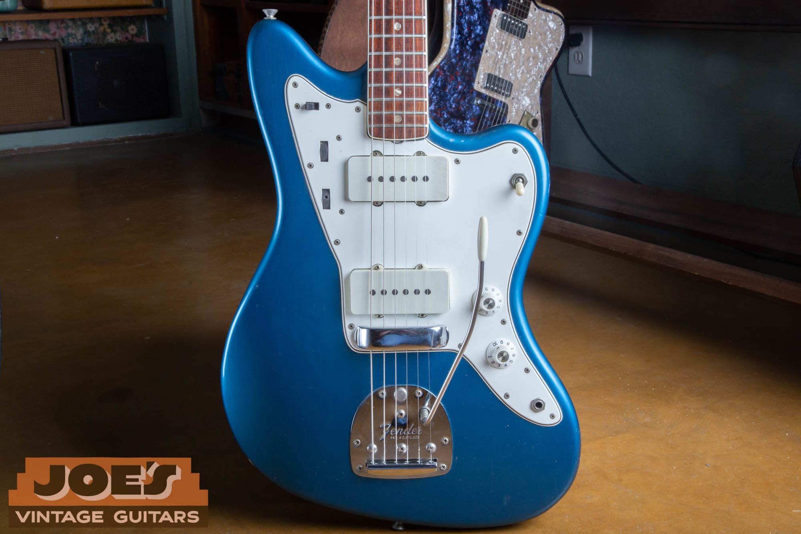
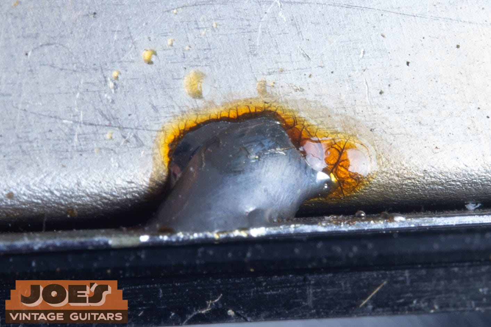
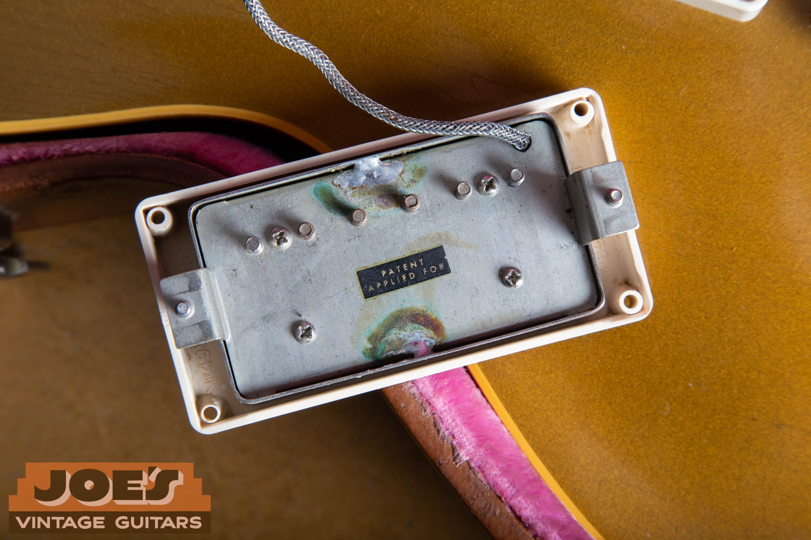

This Strat is Candy Apple Red, a 1965, and a Fender serial from that stretch only gets you a range, late L-series into the early F plates. Chips on the horn break to silver, and checking runs off the neck plate into a pocket that still shows the paint-stick yellow. If a serial shows up on a listing, those are the facts I still have to see. The longer argument is in my [Vintage Verified essay](https://www.vintageverified.com/joes-vintage).

<nav class="post-toc-inline" aria-label="Table of contents">

-   [What A Serial Number Actually Proves](#what-a-serial-number-actually-proves)
-   [What All Original Actually Means](#what-all-original-actually-means)
-   [The Bench Sequence](#the-bench-sequence)
-   [The Escalation Ladder](#the-escalation-ladder)
-   [What Changes Hands With The Answer](#what-changes-hands-with-the-answer)
-   [Frequently Asked Questions](#frequently-asked-questions)
-   [Send Me Photos And I Will Read The Guitar](#send-me-photos-and-i-will-read-the-guitar)

</nav>

<h2 id="what-a-serial-number-actually-proves">What A Serial Number Actually Proves</h2>

A Fender serial from the mid-sixties only gets you a window. Before the mid-1970s they mixed stockpiled parts, so the number on the plate is late L-series into the early F plates, and the heel stamp and the pots are what close the year. The year ranges live in the [Fender serial number guide](/fender-guitars-serial-number-guide/).

<figure>

<figcaption>Checking in the Candy Apple Red coming off the neck plate on this 1965 Strat.</figcaption>

</figure>

Gibson, from about 1961 to 1969, reused serial ranges, so one number can land on two, three, or four years. You finish it with pots, pickups, tuners, logo, and hardware. I walk those overlapping years in the [Gibson serial number guide](/how-to-read-gibson-serial-numbers/).

Martin is the cleanest of the three on year. Since 1898 the company has used one continuous serial run, and the number alone pins the production year against the published year-end chart. Look through the soundhole: the serial is stamped on the neck block, with the model stamp above it on most guitars after 1930. A correct Martin serial still sits on a refinished top or a swapped bridge. Look it up on the [Martin serial and model number guide](/martin-serial-and-model-numbers/).

> A real serial number is not proof of a real guitar. Numbers get re-stamped, and neck plates get swapped.

Joe Dampt. From the [GuitarNiche guest post](https://guitarniche.com/buying-a-vintage-guitar-online-9-red-flags-to-check/).

If the number and the guitar disagree, I trust the guitar.

If you already have photos and you want a person to read them, use the [free appraisal](/free-appraisal/). I work out of Mesa. I do most appraisals remotely from photos.

<h2 id="what-all-original-actually-means">What All Original Actually Means</h2>

Listings use "all original" like a switch. On a guitar that's been played sixty years, I have to say the actual sentence: original finish, original pickups, original tuners, original bridge, original frets, original electronics. A refret knocks it off that strict list even when the work kept it playable.

The nitrocellulose that left the spray booth is what collectors pay for. It dries thin and glossy, then yellows and checks into fine hairline cracks, and a later paint job, even a careful one, is a refin. Tuners, pickups, bridge, pots, knobs, pickguard, and tailpiece get the same test: a period-correct replacement is still a replacement. Untouched electronics means the solder, the cloth or braid, the pots, and the pickup leads still sitting where a factory iron left them, because a pickup can be swapped in half an hour and the trip leaves tracks at the pots, the switch, and the cavity.

This Strat can be original nitro with later tuners, or original pickups with a refin. On this Candy Apple Red Strat the chips break to silver and the pocket still looks factory, which is the start of an originality argument, not the whole list. Don't flatten that into "all original" because a 1965 serial decoded.

The original hard-shell case (OHSC in listings) is a nice extra. I've seen original cases on refinished guitars.

<h2 id="the-bench-sequence">The Bench Sequence</h2>

This is the order I run when a guitar is in front of me, eyes first and screwdriver second. Each step can support a claim, and none of them close the whole instrument by themselves.

<h3 id="finish-and-wear">Finish And Wear</h3>

I look at the finish before I trust the number. Nitrocellulose was the standard on most vintage Fender and Gibson electrics in the 1950s and 1960s, and it checks as it ages, which on this 1965 Candy Apple Red Strat means the horn chip and the checking that runs off the neck plate.

Candy Apple Red from 1963 into 1965 sat on a metallic silver base, typically Inca Silver, under translucent red. Chips on this 1965 break to bright silver, the pre-CBS recipe. After the 1965 CBS transition through 1973 the base shifts to gold.

<figure>

<figcaption>Chips on the horn of this 1965 Candy Apple Red Strat break to bright silver.</figcaption>

</figure>

Lake Placid Blue was a 1958 Cadillac color, on the Fender chart from 1960 to 1973. The rest of the color chart and the factory tells are in the [custom color guide](/post/fender-custom-color-authentication-guide/).

<figure>

<figcaption>A 1966 Jazzmaster in Lake Placid Blue with a white pickguard.</figcaption>

</figure>

White undercoat sat under most sixties custom colors.

<figure>

<figcaption>A pickguard screw hole on this 1966 Lake Placid Blue Jazzmaster. The chipped rim breaks to white.</figcaption>

</figure>

Relic'ing is the intentional aging of a new guitar: worn finish, lacquer checking, tarnished hardware, dents. A convincing relic still has to survive pot codes, neck dates, and cavity paint.

Under UV blacklight, aged original nitro usually glows greenish or yellowish, so touch-ups and overspray can show as dark or contrasting patches. I use it as a screen. The downside is real: old refinishes can hide, poly and a lot of later paints glow inconsistently, and fresh nitro hasn't aged enough to glow yet. I wouldn't call a finish original from a blacklight photo alone.

If the money is in the color, the factory tells are in the [custom color guide](/post/fender-custom-color-authentication-guide/). Send photos if you want a second set of eyes.

<h3 id="hardware-footprints-and-extra-holes">Hardware Footprints And Extra Holes</h3>

Hardware leaves a footprint. Extra screw holes around the tuners, a neck plate that doesn't sit in old lacquer witness lines, a bridge post that's been opened up, a pickguard with a later screw pattern: those are records of work.

On a 1962 Gibson ES-335 I appraised in person, I checked that the single-line, double-ring Kluson tuners were original, with no added or enlarged holes. Tuners come off with four screws, so a period stamp dates the tuners, and it only helps when it agrees with the headstock, the finish, the pots, and the serial. I'd still open the cavity before I called that 335 original.

<h3 id="cavities-routes-and-pot-codes">Cavities, Routes, And Pot Codes</h3>

Open the control cavity when you can do it without fighting vintage screws. On a suspected counterfeit Gibson, the cavity is one of the better tells: factory instruments usually show clean routing, neat solder, full-size CTS or Gibson-branded pots, and braided pickup wire, while a lot of fakes show rough routing, messy solder, tiny generic pots, and plastic-coated colored wire. Those are warning signs, and I still want the rest of the guitar before I hang a conclusion on the cavity alone.

Pots are the part I trust most when the serial is only a window. Three 250k cans sit under that guard, and the stamp on the side of each can dates the part. Fender bought them in bulk, including a 1966 batch they used for years, so a guitar can be newer than its pots. It can't be older than its latest original part. If one can is ten years off from the others, that can is usually a replacement. How to read the stamp is in the [Fender pot code guide](/fender-pot-codes/). The same stamp is useful on a 1960s Gibson when the serial is sitting on two possible years.

<figure>

<figcaption>Guard off this 1965 Candy Apple Red Strat. Color coats cover the face, get thin and dusty in the routes, and the neck pocket goes yellow where the paint stick sat.</figcaption>

</figure>

<figure>

<figcaption>Neck pocket of the same 1965 Candy Apple Red Strat. Yellow-sealed floor, red overspray feathering across it, dust at the edge.</figcaption>

</figure>

Paint in a route, overspray that stops at a later pickguard line, or a cavity that's been opened up with a different bit than the factory used: those are finish and routing questions. On Fender custom colors, the factory paint in the cavities is part of the color check. The [custom color guide](/post/fender-custom-color-authentication-guide/) covers how that paint should sit in the routes.

<h3 id="solder-that-has-not-been-moved">Solder That Has Not Been Moved</h3>

The joint in the photo is dull grey, with old amber flux crazed around it. That's what decades-old factory work looks like on a bench. Later work is often shinier, and it often sits on a joint that already has a blob underneath it.

<figure>

<figcaption>Dull grey solder with old flux around the joint. Later work is often shinier and sits on top of an older blob.</figcaption>

</figure>

On Fender, I read solder when a custom color is on the table so I know the harness wasn't pulled for a refin. On this 1966 Lake Placid Blue Jazzmaster, the pocket is the color check that sits next to that harness read: paint-stick yellow stripe, JM in marker, original red-brown fiber shim.

<figure>

<figcaption>Neck pocket of the 1966 Lake Placid Blue Jazzmaster. Paint-stick yellow down the center, JM in marker, blue overspray at the edges, original fiber shim at the end of the pocket.</figcaption>

</figure>

On a Gibson PAF-era guitar, factory cover solder is grey. Fresh solder anywhere in the signal path raises the burden of proof on the pickups. I wrote that up in the [PAF and patent-number pickup guide](/post/gibson-paf-patent-number-pickup-guide/). Charlie from es-335.com has written for years that original solder got turned into a stand-in for "the pickups never came out," and that a carefully redone ground can be hard to call. I agree with the caution. ([Take Off A Buck](https://www.es-335.com/2015/10/26/take-off-a-buck/), es-335.com.)

<h3 id="pickups-and-whether-they-belong">Pickups And Whether They Belong</h3>

Pickups have to match the guitar's claimed year, and they have to look like they've lived in that guitar. A PAF is Gibson's original Patent Applied For humbucker, fitted from 1957, with the small PATENT APPLIED FOR decal on the baseplate from late 1957 until the patent-number sticker around 1962. A pickup from the wrong decade, a baseplate that's too clean for the covers, or a harness that's been fished and put back, is a parts story.

<figure>

<figcaption>PAF baseplate with the PATENT APPLIED FOR sticker still on it, and grey oxidized cover solder. Fresh solder in that path is why I'd pull the rest of the guitar apart.</figcaption>

</figure>

A swapped pickup leaves tracks at the rings, the height screws, the cavity, and the solder. On a 335-style guitar, ask whether the harness has ever been pulled through an f-hole.

<h3 id="cross-dating-every-date-has-to-agree">Cross-Dating: Every Date Has To Agree</h3>

On a Fender, the [neck date](/fender-neck-dates/) is a production mark on the heel of the bolt-on neck, under the truss-rod nut, and Fender marked them from the earliest solidbodies until about 1976, penciled until March 1962. That stamp dates the neck, and it can differ from the body date by weeks or months on a perfectly original guitar because Fender pulled finished necks from a bin. A neck dated well after the rest of the guitar is the usual red flag for a swap; a neck a year older than the body is often leftover stock. On the Jazzmaster, the body side of that match is the pocket already shown: the paint-stick yellow, the JM in marker, and the original shim have to agree with whatever the heel says when you pull the neck.

On a Gibson from 1961 to 1969, the pots, the pickup type, the tuner stamp (no-line, single-line, double-line), the logo, and the presence or absence of a volute have to close the range. I don't date any Gibson from the serial alone, in any era. Numbers get re-stamped, refinished over, or faked.

<h2 id="the-escalation-ladder">The Escalation Ladder</h2>

You can decode a serial from a published chart in a couple of minutes. Finishing a six-figure burst, or even calling the nitro on this Candy Apple Red Strat, takes the rest of the guitar.

**Free self-check.** Decode the serial with the brand guide. Read the pots if you can see them. Compare the logo, tuners, and hardware to the claimed year. If the dates agree and the money is modest, that may be the whole job. If you want a second set of eyes, send me photos through the [free appraisal](/free-appraisal/). That's a photo read and a market number, not a laminated certificate, and it misses whatever isn't in the frame.

**Paid dealer appraisal.** This is a written valuation, sometimes with an originality opinion attached, and those are two different documents. [Carter Vintage](https://cartervintage.com/appraisals) publishes two packages: $150 for an online-only appraisal from photos, and $250 for an in-person appraisal. Carter's own page says they don't recommend an online appraisal as a certification of originality, because issues that aren't in the photos can undo the write-up. I'll say the same about any photo job, including mine. A hands-on inspection can change the conclusion.

**Independent lab analysis.** When the price lives in the finish (custom colors, bursts, six-figure instruments), chemistry and comparative data can answer questions a light and a loupe can't. Premier Guitar covered how Vintage Verified does that work in Nashville, with spectrometers and a reference set, in [Under The Microscope](https://www.premierguitar.com/features/gear-features/how-vintage-verified-is-revolutionizing-guitar-authentication). In the [Vintage Verified essay](https://www.vintageverified.com/joes-vintage) I already wrote that a finish analysis there starts at around five hundred dollars. That figure is theirs, as of that essay, and it's an estimate of cost, not a quote I can issue. A lab report tells you whether materials are consistent with the claimed year. It doesn't price the guitar, and it doesn't replace looking at solder and screw holes.

Don't pay lab money to answer a serial-chart question, and don't treat a free photo appraisal as a finish certification on a custom color Strat.

<h2 id="what-changes-hands-with-the-answer">What Changes Hands With The Answer</h2>

Originality is the biggest value factor in this market. All-original instruments tend to bring the most, then correct-period replacement parts, then refinished, then modified or worn-out player examples. A faded original finish often beats a perfect modern refinish on the same model. Any specific dollar figure should be checked against the actual guitar.

A refin is a guitar that has been repainted after the factory. Even excellent refinish work commonly reduces a vintage guitar's value by roughly 40 to 50 percent versus the same model with its original finish, because collectors put real weight on original nitro and patina. That's a range. On the [free appraisal](/free-appraisal/) FAQ I have also described a golden-era Fender or Gibson refin as cutting collector value by about half, with a clean headstock repair in the same 40 to 50 percent neighborhood. Player-grade demand can soften those hits without erasing them.

A refret replaces worn frets. It's normal, often essential maintenance. Because the original frets are gone, it still takes the guitar off the strict all-original list. It doesn't ruin the instrument.

Replaced pickups, tuners, and a refin don't all cost the same. Model, year, and how clean the work is all move the number, which is why there isn't a universal percentage table. I go through those pieces in [seven factors that determine vintage guitar value](/post/is-your-vintage-guitar-valuable-7-factors-that-determine-its-value/). If you're selling, read [mistakes to avoid when selling a vintage guitar](/post/mistakes-to-avoid-when-selling-a-vintage-guitar/) before you write "all original" in a listing.

This is an estimate of market value, not an offer to buy and not a promise. Market values fluctuate. Have your specific guitar appraised.

<h2 id="frequently-asked-questions">Frequently Asked Questions</h2>

<h3 id="can-a-guitar-serial-number-be-faked">Can A Guitar Serial Number Be Faked?</h3>

Yes. Re-stamped numbers and swapped neck plates show up often enough that I only believe a year when the heel, the pots, and the finish agree with the plate.

<h3 id="if-the-serial-number-checks-out-is-the-guitar-original">If The Serial Number Checks Out, Is The Guitar Original?</h3>

No. A serial that decodes is not originality. Check the finish and the parts.

<h3 id="what-does-all-original-mean-on-a-vintage-guitar">What Does All Original Mean On A Vintage Guitar?</h3>

Use it only when nothing has been replaced or refinished, including the frets. Otherwise say the parts that are still factory.

<h3 id="how-do-you-tell-if-a-vintage-guitar-has-been-refinished">How Do You Tell If A Vintage Guitar Has Been Refinished?</h3>

Start with wear, checking, cavity paint, and blacklight as a screen. On a Fender custom color, the factory tells are in the [custom color guide](/post/fender-custom-color-authentication-guide/). When the money is in the finish, send photos or take the guitar to a bench. I can't call a finish from one photo.

<h3 id="does-a-blacklight-prove-a-finish-is-original">Does A Blacklight Prove A Finish Is Original?</h3>

No. I use UV as a screen and I don't close a finish on it. Old refinishes, poly, and new nitro all fool a lamp.

<h3 id="how-much-value-does-a-refinish-cost-you">How Much Value Does A Refinish Cost You?</h3>

Even excellent refinish work commonly reduces a vintage guitar's value by roughly 40 to 50 percent versus a comparable original-finish example. That's a range. Get a number on the actual guitar before you price a sale or an insurance rider.

<h3 id="what-do-replaced-parts-do-to-value">What Do Replaced Parts Do To Value?</h3>

A replaced tuner, a pickup swap, extra routing, and a refin don't share a percentage. Price the guitar in the case.

<h3 id="does-a-refret-take-a-guitar-off-all-original-status">Does A Refret Take A Guitar Off All Original Status?</h3>

Yes, on the strict definition. Disclose it, because a clean, necessary refret is still a refret.

<h3 id="what-does-untouched-solder-look-like">What Does Untouched Solder Look Like?</h3>

Dull grey with old flux around the joint. If it's shiny and sitting on an older blob, I treat the harness as moved until the rest of the guitar says otherwise.

<h3 id="what-if-the-pot-codes-do-not-match-the-serial">What If The Pot Codes Do Not Match The Serial?</h3>

Pots a few months older than the serial are normal factory stock. One pot years later than the others is usually a replacement. Read every can you can see.

<h3 id="what-if-the-neck-date-and-the-body-date-do-not-match">What If The Neck Date And The Body Date Do Not Match?</h3>

Weeks or months of slack is often leftover stock. A neck dated well after the body is the usual swap. Confirm with the pots, the serial range, and the finish in the pocket.

<h3 id="does-a-certificate-of-authenticity-prove-originality">Does A Certificate Of Authenticity Prove Originality?</h3>

A certificate is paperwork. It's only as strong as the inspection behind it and the person who signed it. Carter Vintage states that an online appraisal shouldn't be treated as a certification of originality. I treat photo reads the same way. Originality is assessed from the information in hand. A bench inspection can change the conclusion.

<h2 id="send-me-photos-and-i-will-read-the-guitar">Send Me Photos And I Will Read The Guitar</h2>

If you want the short version on your guitar, send photos. Front, back, headstock, and anything inside you can shoot without forcing screws: pots, solder, neck heel if the neck is already off. I'll date it, say what the parts are doing, and give you a current market read. Use the [free appraisal form](/free-appraisal/), or text me at (602) 900-6635.

I'm Joe Dampt. I buy, sell, and appraise vintage instruments in Mesa, Arizona. I've been doing this full-time for more than twelve years. If you want the market argument for third-party lab work, that's the [Vintage Verified essay](https://www.vintageverified.com/joes-vintage). If you want me to look at the guitar in the case, that's the appraisal form.

Who I am and how I work is on the [about page](/about-me/).

<h3 id="disclaimer">Disclaimer</h3>

**Value estimate.** This is an estimate of market value, not an offer to buy and not a guarantee. Market values fluctuate. Have your specific item appraised.

**Originality judgment.** Originality is assessed from the information provided. A hands-on inspection can change the conclusion.

**Results vary.** Past results do not guarantee a similar outcome. Each guitar depends on its own facts.

<!--
## Citation Ledger

| Claim (As Written In Draft) | FactID | Authority | Jurisdiction | publicFacingSafe | verifyWithExpert | lastVerified | Status |
|---|---|---|---|---|---|---|---|
| A Fender serial from the mid-sixties only gets you a window. Before the mid-1970s they mixed stockpiled parts, so the number on the plate is late L-series into the early F plates. | VG-0050 | Vintage Guitars Info / standard Fender dating | GLOBAL | true | false | 2026-06-21 | OK |
| The heel stamp and the pots close the year; they date the part, not necessarily the finished guitar. | VG-0050 | Vintage Guitars Info | GLOBAL | true | false | 2026-06-21 | OK |
| Gibson, from about 1961 to 1969, reused serial ranges, so one number can land on two, three, or four years. | VG-0011 | Gruhn's Guide; Reverb dating reference | GLOBAL | true | false | 2026-06-21 | OK |
| For Gibsons made roughly 1961 to 1969, the serial alone usually cannot pin an exact year; dating relies on specs, pot codes, and hardware. Expect a range. | VG-0033 | Standard Gibson 1960s serial references | GLOBAL | true | false | 2026-06-21 | OK |
| Gibson 1961-1969 serials were widely duplicated and most Fender serials run out of order, so neither usually pins down one year alone. | VG-0111 | guitarhq.com; Gruhn / Duchossoir | GLOBAL | true | false | 2026-06-21 | OK |
| No Gibson should be dated on the serial alone. Confirm with features, pot codes, pickups, tuners, logo, volute, and hardware. Numbers can be re-stamped, refinished over, or faked. | VG-0014 | Reverb News; Mahar's; Gruhn's Guide | GLOBAL | true | true | 2026-06-21 | PENDING SIGN-OFF |
| Since 1898 Martin has used one continuous serial run; the number alone pins the production year. | VG-0082 | Martin factory year-end serial chart | GLOBAL | true | false | 2026-06-21 | OK |
| Martin serial is stamped on the neck block; model stamp sits above it on most post-1930 guitars. | VG-0077 | Martin factory marking practice | GLOBAL | true | false | 2026-06-21 | OK |
| A real serial number is not proof of a real guitar. Numbers get re-stamped, and neck plates get swapped. | LIVE-PAGE | GuitarNiche guest post (Joe Dampt) | GLOBAL | true | n/a | 2026-07 | OK |
| All original: finish, pickups, tuners, bridge, frets, electronics as the factory built them; even a refret can cost that label. | VG-0106 | Reverb Vintage Guitars FAQ | GLOBAL | true | true | 2026-06-21 | PENDING SIGN-OFF |
| Nitrocellulose dries thin and glossy, then yellows and checks. Standard on 1950s-60s Fender and Gibson. | VG-0104 | Guitar.com nitro guide | GLOBAL | true | false | 2026-06-21 | OK |
| Relic'ing is intentional aging of a new guitar; opposite of earned wear. | VG-0103 | Wikipedia Relic'ing; Guitar World | GLOBAL | true | false | 2026-06-21 | OK |
| Tuner stamps date the tuners, not the guitar. | VG-0002 | guitarhq.com Kluson reference | GLOBAL | true | false | 2026-06-21 | OK |
| OHSC is the original factory case; it does not by itself prove the guitar. | VG-0098 | Listing-term definition | GLOBAL | true | false | 2026-06-21 | OK |
| Aged original nitro usually glows greenish or yellowish under UV; screening aid, not proof. | VG-0017 | Guitar Quarter UV guide | GLOBAL | true | true | 2026-06-21 | PENDING SIGN-OFF |
| Blacklight limits: old refinishes can hide; poly glows inconsistently; new nitro has not aged enough to glow. | VG-0018 | Guitar Quarter UV guide | GLOBAL | true | true | 2026-06-21 | PENDING SIGN-OFF |
| Extra / enlarged tuner holes as a non-original tell on a 1962 ES-335 appraisal. | LIVE-PAGE | https://www.joesvintageguitarsaz.com/free-appraisal/ | GLOBAL | true | n/a | live | OK |
| Gibson cavity: clean routing, neat solder, full-size CTS/Gibson pots, braided wire vs rough routing, messy solder, tiny generic pots, plastic-coated wire. Warning signs, not proof. | VG-0001 | Killer Guitar Rigs; guitar.com | GLOBAL | true | true | 2026-06-21 | PENDING SIGN-OFF |
| Pot code is EIA maker + date; 137=CTS, following digits year and week of the pot. | VG-0099 | guitarhq.com/pots.html | GLOBAL | true | false | 2026-06-21 | OK |
| EIA prefixes: 134 Centralab, 137 CTS, 304 Stackpole. | VG-0101 | Vintage Guitar and Bass pot codes | GLOBAL | true | false | 2026-06-21 | OK |
| A pot code is the earliest the guitar could have been built, not the build date. Fender 1966 stockpile example. | VG-0100 | Vintage Guitar and Bass; guitarhq.com | GLOBAL | true | false | 2026-06-21 | OK |
| Pot codes are terminus post quem; parts stockpiled or later replaced. | VG-0048 | EIA source-date practice | GLOBAL | true | false | 2026-06-21 | OK |
| To resolve an ambiguous Gibson year, read pot codes; pots slightly older than the build, not years older. | VG-0009 | Still Kickin Music; Vintage Guitar and Bass | GLOBAL | true | false | 2026-06-21 | OK |
| 1965 CAR Strat chips to silver metallic undercoat (1963-1965 silver-base recipe). | LIVE-PAGE | https://www.joesvintageguitarsaz.com/post/fender-custom-color-authentication-guide/ | GLOBAL | true | n/a | live | OK |
| 1966 LPB Jazzmaster pickguard screw hole chips to white undercoat. | LIVE-PAGE | https://www.joesvintageguitarsaz.com/post/fender-custom-color-authentication-guide/ | GLOBAL | true | n/a | live | OK |
| 1966 LPB Jazzmaster neck pocket: paint-stick stripe, JM marker, fiber shim. | LIVE-PAGE | https://www.joesvintageguitarsaz.com/post/fender-custom-color-authentication-guide/ | GLOBAL | true | n/a | live | OK |
| 1965 CAR under pickguard: full red on the face, thin/dusty in routes, yellow pocket. | LIVE-PAGE | https://www.joesvintageguitarsaz.com/post/fender-custom-color-authentication-guide/ | GLOBAL | true | n/a | live | OK |
| 1965 CAR neck pocket: yellow-sealed floor, red overspray feathering, dust at the edge. | LIVE-PAGE | https://www.joesvintageguitarsaz.com/post/fender-custom-color-authentication-guide/ | GLOBAL | true | n/a | live | OK |
| Checking in the Candy Apple Red coming off the neck plate on this 1965 Strat. | LIVE-PAGE | https://www.joesvintageguitarsaz.com/post/fender-custom-color-authentication-guide/ | GLOBAL | true | n/a | live | OK |
| Lake Placid Blue was a 1958 Cadillac color, on the Fender chart 1960-1973. White undercoat under most sixties custom colors. | LIVE-PAGE | https://www.joesvintageguitarsaz.com/post/fender-custom-color-authentication-guide/ | GLOBAL | true | n/a | live | OK |
| Candy Apple Red after the 1965 CBS transition through 1973 uses a gold metallic base. | LIVE-PAGE | https://www.joesvintageguitarsaz.com/post/fender-custom-color-authentication-guide/ | GLOBAL | true | n/a | live | OK |
| Jazzmaster heel from spring 1962 onward is a rubber-stamped code like 4JAN63B (model, month, year, nut width). | LIVE-PAGE | https://www.joesvintageguitarsaz.com/post/fender-jazzmaster-evolution-guide-1958-1971/ | GLOBAL | true | n/a | live | OK |
| PAF-era grey factory solder; fresh solder raises burden of proof. | LIVE-PAGE | https://www.joesvintageguitarsaz.com/post/gibson-paf-patent-number-pickup-guide/ | GLOBAL | true | n/a | live | OK |
| PAF: Patent Applied For humbucker, fitted 1957, decal late 1957 until patent-number sticker around 1962. | VG-0003 | Wikipedia PAF; Guitar HQ | GLOBAL | true | false | 2026-06-21 | OK |
| Fender neck date: heel mark, earliest solidbodies to about 1976, penciled until March 1962; dates the neck only; can differ from body by weeks or months. | VG-0051 | Fender neck-date practice | GLOBAL | true | false | 2026-06-21 | OK |
| Neck dated well after the rest of the guitar is the usual swap flag; a year older can be leftover stock. | LIVE-PAGE | https://www.joesvintageguitarsaz.com/fender-neck-dates/ | GLOBAL | true | n/a | live | OK |
| Carter Vintage online appraisal $150; in-person $250; they do not recommend an online appraisal as a certification of originality. | LIVE-PAGE | https://cartervintage.com/appraisals | GLOBAL | true | n/a | 2026-08-26 | OK |
| Vintage Verified finish analysis starts at around five hundred dollars. | LIVE-PAGE | https://www.vintageverified.com/joes-vintage | GLOBAL | true | n/a | live | CONFIRM OR STRIKE (essay, not JVG / not VG_FACTS) |
| Originality is the biggest value factor; all-original, then period parts, then refin, then modified player; faded original often beats perfect refin. | VG-0112 | Gruhn Guide methodology; trade consensus | GLOBAL | true | true | 2026-06-21 | PENDING SIGN-OFF |
| Refin commonly reduces value by roughly 40 to 50 percent vs original finish. | VG-0107 | Reverb Vintage Guitars FAQ | GLOBAL | true | true | 2026-06-21 | PENDING SIGN-OFF |
| Golden-era Fender or Gibson refin about half; headstock repair usually 40 to 50 percent. | LIVE-PAGE | https://www.joesvintageguitarsaz.com/free-appraisal/ | GLOBAL | true | n/a | live | OK |
| A refret is normal maintenance; removes strict all-original status. | VG-0110 | Premier Guitar Vintage Vault; Reverb FAQ | GLOBAL | true | false | 2026-06-21 | OK |
| Joe Dampt, Mesa, more than twelve years full-time. | LIVE-PAGE | https://www.joesvintageguitarsaz.com/about-me/ | GLOBAL | true | n/a | live | OK |
| I do most appraisals remotely from photos. | LIVE-PAGE | https://www.joesvintageguitarsaz.com/free-appraisal/ | GLOBAL | true | n/a | live | OK |
-->
