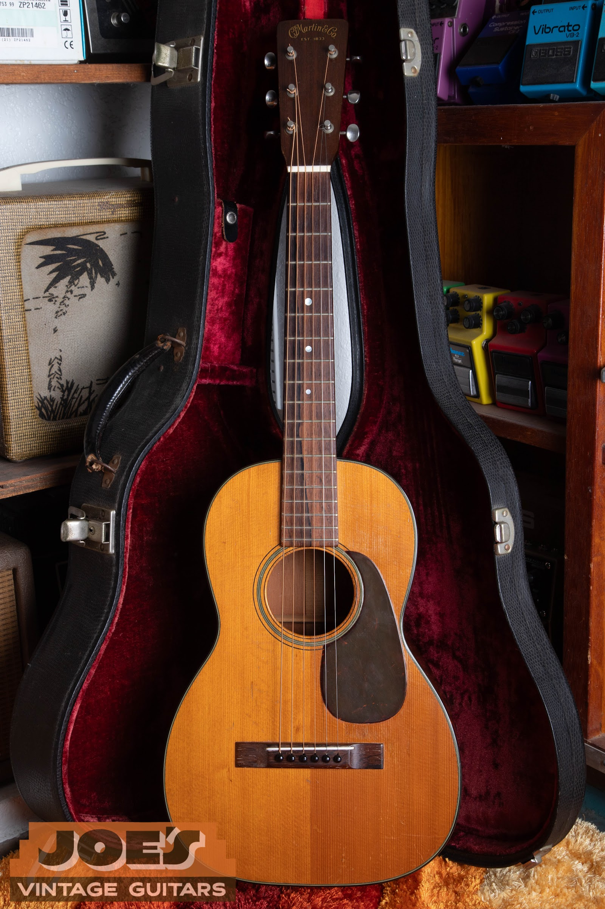
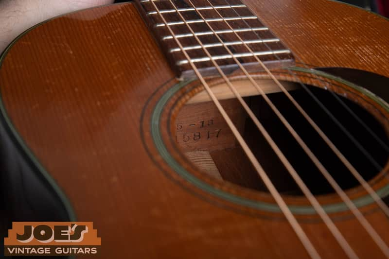
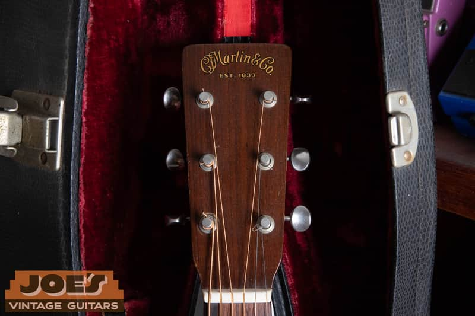
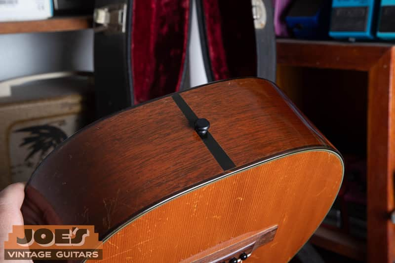

I'm Joe Dampt. I buy vintage Martins nationwide from Mesa, Arizona, and I have a 1950 Martin 5-18 Terz on the bench. The neck block is stamped 5-18 over serial 115817. Martin's year-end chart, the same one on my [Martin serial and model number guide](/martin-serial-and-model-numbers/), puts 112962 through 117961 in 1950. Size 5 is the smallest guitar Martin put in the catalog, the one people mean when they say baby Martin.

<nav class="post-toc-inline" aria-label="Table of contents">

-   [The Short Answer](#short-answer)
-   [What A Martin 5-18 Actually Is](#what-it-is)
-   [How To Tell A 5-18 From A 0-18](#vs-0-18)
-   [What A Vintage 5-18 Is Worth](#worth)
-   [If You Inherited One](#inherited)
-   [Frequently Asked Questions](#frequently-asked-questions)
-   [Send Me Photos](#send-me-photos)

</nav>

<h2 id="short-answer">The Short Answer</h2>

This 5-18 is the guitar in the photos: Size 5 terz, Style 18 spruce and mahogany, solid peghead, serial 115817.

Uncle Lewis gave Dolly Parton a small Martin when he saw she was serious. "It was my treasure," she told Reverb in 2017. She left it in the loft when she went to Nashville at 18, planning to have it fixed. The loft burned. She kept the neck. That interview never names a catalog number. She said she spent years collecting baby Martins.

[Guitar World](https://www.guitarworld.com/lessons/dolly-parton-guitar-style) and [Guitar Player](https://www.guitarplayer.com/guitarists/dolly-parton-on-the-little-martin-that-launched-her-music-career-and-the-country-star-behind-her-big-break) both say she performed with a Martin 5-18 Terz. In July 2026, [Martin listed Dolly Parton](https://www.martinguitar.com/blog-categories/from-the-factory/blog-071626-four-new-martin-guitars-arrive-5-28-terz-OM-35-Inception-custom-shop-0-18-0-28.html) among the players who have used Size 5 Martins, the same family as this 5-18.

On later stages she often used a small, heavily decorated [Taylor GS Mini](https://www.taylorguitars.com/guitars/acoustic/gs-mini).

Little Martin LX guitars are modern Mexico-made travel instruments with their own serial sequence. LX dating lives on the [Martin serial number guide](/martin-serial-and-model-numbers/).

<h2 id="what-it-is">What A Martin 5-18 Actually Is</h2>

Martin's Size 5 is a terz guitar: 11.25 inches across the lower bout, about 16 inches of body length, and a scale around 21.4 inches. Those measurements are from Vintage Guitar magazine (June 2014), and they match the 1950 on my bench.

Terz means it was designed to be tuned a minor third higher than standard, three frets up. This one still plays in standard E. The short scale is the terz spec.

Style 18 is a spruce top, mahogany back and sides, simple dot inlays, and a tortoise-style pickguard. This 1950 has a solid peghead with the C.F. Martin decal. Slotted 5-18s are earlier; the slotted headstock left the line in the late 1940s.

<figure>

<figcaption>A 1950 Martin 5-18 Terz from the shop. Serial 115817. This is the baby Martin.</figcaption>

</figure>

<h2 id="vs-0-18">How To Tell A 5-18 From A 0-18</h2>

A 0-18 is concert size. It looks small next to a dreadnought, and next to a 5-18 it looks huge. If it looks like a toy until you pick it up, you might have a 5. If you inherited a small Martin, the [Martin buying page](/sell-my-martin-guitar/) is where I take 0-18s and 5-18s alike.

Don't guess from a photo of the front alone. Look through the soundhole. Martin stamps the model and serial number on the neck block. You should see 5-18 over the serial, or the serial under the model, depending on the year. That stamp is the ID. Use the [Martin serial number lookup](/martin-serial-and-model-numbers/) to date it.

<figure>

<figcaption>Model and serial are on the neck block, visible through the soundhole. This guitar reads 5-18 over 115817.</figcaption>

</figure>

<figure>

<figcaption>Solid peghead and C.F. Martin decal on this 1950 5-18, serial 115817.</figcaption>

</figure>

<h2 id="worth">What A Vintage 5-18 Is Worth</h2>

Vintage 5-18s trade in a thinner market than 0-18s and 00-18s. Originality, cracks, a neck reset, and a proper small case move the number more than the year does. A player-grade 5-18 with typical cracks, a later case, or a neck reset still to do usually sits around $2,800 to $4,000 in public asking and sold-out dealer pages. A clean original that is playing, with original finish and preferably an original case, is more like $4,000 to $5,800.

A worn original finish usually beats a pretty refinish. Cracks and old repairs don't make it unsellable. Don't clean it, don't polish it, and don't have anyone touch it up before you send photos. I wrote the same thing on the [Martin buying page](/sell-my-martin-guitar/) because I mean it.

If you want a number on your guitar, send me photos. The [appraisal is free](/free-appraisal/) and there is no obligation to sell.

<h2 id="inherited">If You Inherited One</h2>

You might have the same Size 5 model Dolly Parton spent years collecting, and I buy vintage 5-18s. The loft fire took her first little Martin; she kept the neck. I buy vintage Martins in all 50 states from Mesa, including 5-18s, 0-18s, and 00-18s. Text or email a few photos plus the neck-block stamp if you can get it. I'll date the stamp, say whether it is a 5-18, a 0-18, a 00-18, or a Little Martin LX, and give you a market read. I handle packing and insured shipping if we can't meet in Mesa.

Call or text (602) 900-6635 or email joesvintageguitars94@gmail.com.

<figure>

<figcaption>11.25 inches at the lower bout on this 1950 5-18, per the Vintage Guitar (June 2014) measurements.</figcaption>

</figure>

<h2 id="frequently-asked-questions">Frequently Asked Questions</h2>

<h3 id="what-guitar-did-dolly-parton-play">What Guitar Did Dolly Parton Play?</h3>

Small acoustics, almost always. Her first was a little Martin her uncle Lewis gave her. Later she collected baby Martins and performed with a Martin 5-18 Terz and a custom Taylor GS Mini.

<h3 id="was-dolly-partons-first-guitar-a-martin-5-18">Was Dolly Parton's First Guitar A Martin 5-18?</h3>

She called it a little Martin. She didn't publish a serial number. Guitar World, Guitar Player, and Martin all connect her to Size 5 / 5-18 guitars as a player. Treat "the loft guitar was a 5-18" as the likely match, not a factory letter on that specific instrument.

<h3 id="what-is-a-baby-martin">What Is A Baby Martin?</h3>

In this context it means Martin's smallest regular guitar, the Size 5, usually a 5-18. It is not a Little Martin LX from Mexico.

<h3 id="is-a-5-18-the-same-as-a-parlor-guitar">Is A 5-18 The Same As A Parlor Guitar?</h3>

People call it a parlor. Martin called Size 5 a terz. A 0-18 is the small guitar most sellers actually have. Measure the lower bout or read the neck-block stamp.

<h3 id="how-do-i-date-a-martin-5-18">How Do I Date A Martin 5-18?</h3>

Read the serial on the neck block and look it up on the [Martin serial number guide](/martin-serial-and-model-numbers/). Serial 115817 on this guitar falls in 1950, 112962 through 117961.

<h3 id="will-you-buy-my-5-18">Will You Buy My 5-18?</h3>

Yes, if the neck-block stamp is a 5-18. Send photos of the guitar and the stamp for a [free appraisal](/free-appraisal/).

<h2 id="send-me-photos">Send Me Photos</h2>

If you want the short version on your guitar, send photos. Front, back, headstock, and the neck-block stamp through the soundhole. I'll date it, say whether it's a 5-18, and give you a current market read. Use the [free appraisal form](/free-appraisal/), or text me at (602) 900-6635.

I'm Joe Dampt. I buy, sell, and appraise vintage instruments in Mesa, Arizona. I've been doing this full-time for more than twelve years. If you want me to look at the guitar in the case, that's the appraisal form.

Who I am and how I work is on the [about page](/about-me/).

<h3 id="disclaimer">Disclaimer</h3>

**Value estimate.** This is an estimate of market value, not an offer to buy and not a guarantee. Market values fluctuate. Have your specific item appraised. The $2,800 to $5,800 figures above are public-market asking and sold ranges on vintage 5-18s, not a bid on your guitar.

**Originality judgment.** Originality is assessed from the information provided. A hands-on inspection can change the conclusion. A photo read is not a certificate that a guitar belonged to a named player.

**Results vary.** Past results do not guarantee a similar outcome. Each guitar depends on its own facts.

<!--
## Citation Ledger

Scope Firewall: Martin 5-18 / Size 5 terz only. No Strat, no Gibson, no Fender facts on this post.

| Claim (As Written In Draft) | FactID | Authority | Jurisdiction | publicFacingSafe | verifyWithExpert | lastVerified | Status |
|---|---|---|---|---|---|---|---|
| Since 1898 Martin has used one continuous serial run; the number pins the production year against the published year-end chart. | VG-0082 | Martin factory year-end serial chart | GLOBAL | true | false | 2026-08-26 | OK |
| Serial 115817 falls in 1950 (112962 through 117961) on the shop Martin serial guide. | VG-0082 | /martin-serial-and-model-numbers/ year-end chart | GLOBAL | true | false | 2026-08-26 | OK |
| Martin serial is stamped on the neck block; model stamp sits above it on most post-1930 guitars. This guitar: 5-18 over 115817. | VG-0077 | Martin factory marking practice; shop photo | GLOBAL | true | false | 2026-08-26 | OK |
| Size 5 terz: 11.25 in lower bout, about 16 in body length, scale around 21.4 in. | VG-MAG-2014-06 | Vintage Guitar magazine, June 2014 | GLOBAL | true | false | 2026-08-26 | OK |
| Terz: designed to be tuned a minor third higher than standard (three frets up). | VG-MAG-2014-06 | Vintage Guitar magazine, June 2014; Martin Size 5 spec | GLOBAL | true | false | 2026-08-26 | OK |
| Style 18: spruce top, mahogany back and sides, simple dot inlays, tortoise-style pickguard. | MARTIN-STYLE-18 | Martin Style 18 catalog spec | GLOBAL | true | false | 2026-08-26 | OK |
| Post-war 5-18 (this 1950) uses a solid peghead with the C.F. Martin decal; slotted 5-18s are earlier. | LIVE-PHOTO | Shop headstock photo of serial 115817 | GLOBAL | true | false | 2026-08-26 | OK |
| Uncle Lewis gave Dolly a small Martin; "It was my treasure." Left in the loft at 18; loft burned; she kept the neck. No catalog number. She collected baby Martins. | REVERB-2017 | Reverb interview, 2017 | GLOBAL | true | false | 2026-08-26 | OK |
| Guitar World and Guitar Player: she performed with a Martin 5-18 Terz. | GW-GP-5-18 | Guitar World; Guitar Player | GLOBAL | true | false | 2026-08-26 | OK |
| July 2026 Martin listed Dolly Parton among Size 5 players. | MARTIN-2026-07 | Martin Size 5 player list, July 2026 | GLOBAL | true | false | 2026-08-26 | OK |
| Later stages: Taylor GS Mini. | TAYLOR-GS-MINI | Guitar World / Guitar Player performance reports; one-sentence scope | GLOBAL | true | false | 2026-08-26 | OK |
| This shop 5-18 is the same model family, not Dolly's loft guitar. | LIVE-PHOTO | Reverb 2017 (loft burned; she kept the neck) plus shop serial 115817 | GLOBAL | true | false | 2026-08-26 | OK |
| Little Martin LX: modern Mexico-made travel guitar, different serial sequence. | LIVE-PAGE | /martin-serial-and-model-numbers/ | GLOBAL | true | false | 2026-08-26 | OK |
| 0-18 is concert size; ID a 5-18 by measuring the lower bout or reading the neck-block stamp. | VG-0077 | Neck-block stamp; Size 5 vs Size 0 | GLOBAL | true | false | 2026-08-26 | OK |
| Player-grade vintage 5-18s about $2,800 to $4,000; clean original playing examples about $4,000 to $5,800 in public asking and sold-out dealer pages. Not a shop offer. | PUBLIC-MARKET | Public listings / sold dealer pages; Joe-checked 2026-08-26 | GLOBAL | true | true | 2026-08-26 | RANGE, NOT A BID |
| Don't clean, polish, or touch up before photos. | LIVE-PAGE | /sell-my-martin-guitar/ | GLOBAL | true | false | 2026-08-26 | OK |
| Joe buys vintage Martins nationwide / all 50 states from Mesa, packing and insured shipping. | LIVE-PAGE | /sell-my-martin-guitar/ | GLOBAL | true | false | 2026-08-26 | OK |
| Joe Dampt, Mesa, more than twelve years full-time. | LIVE-PAGE | /about-me/ | GLOBAL | true | n/a | live | OK |
-->
