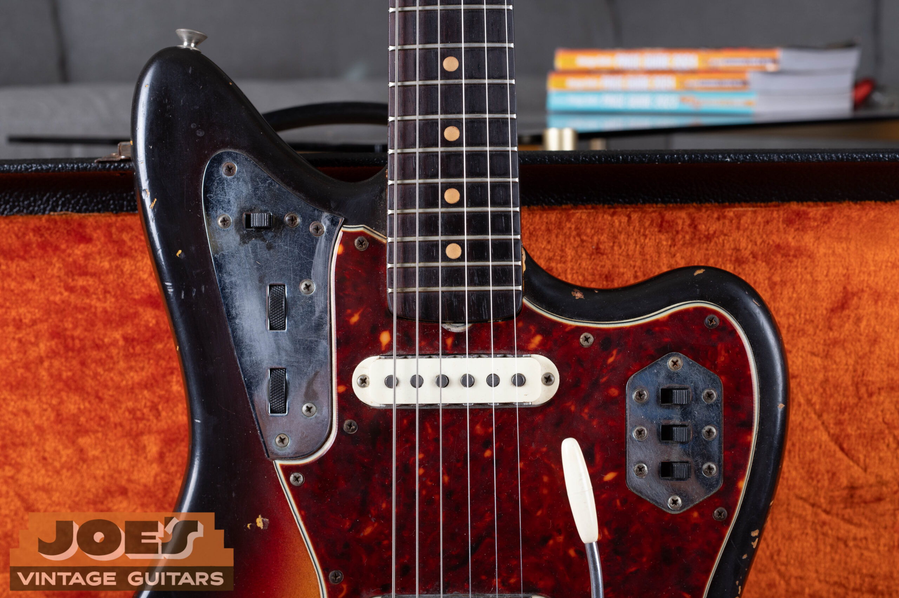

I'm Joe Dampt. I buy vintage guitars nationwide from Mesa, Arizona, and the bench guitar this week is a 1959 Gibson ES-355 in cherry with a gold Bigsby. It's the same model everyone is about to see in the news, because [Christie's is selling Johnny Marr's collection](https://www.christies.com/en/auction/auction-24434-cks/overview) in London on 17 September 2026, and the sale's highest-estimated lot is the cherry ES-355 Seymour Stein bought him in 1984.

<nav class="post-toc-inline" aria-label="Table of contents">

-   [The Short Answer](#short-answer)
-   [The 1982 Rickenbacker 330](#rickenbacker)
-   [The This Charming Man Telecaster](#charming-man)
-   [The Cherry ES-355](#es-355)
-   [The 1984 Les Paul Standard](#les-paul)
-   [The Green Giffin Telecaster](#giffin)
-   [The 1971 Martin D-28](#martin)
-   [The Jaguars, Old And New](#jaguar)
-   [The Sale Itself](#auction)
-   [What His Name Adds To The Price](#provenance)
-   [If One Of These Is In Your Closet](#your-guitar)
-   [Frequently Asked Questions](#faq)
-   [Send Me Photos](#send-me-photos)

</nav>

<h2 id="short-answer">The Short Answer</h2>

There's no single Johnny Marr guitar. Five did most of the work, and all five are in the Christie's sale:

-   **1982 Rickenbacker 330 Jetglo.** The Smiths' debut album and the early tours. Estimate £60,000 to £80,000.
-   **Cherry Gibson ES-355.** The 1984 gift from Sire Records founder Seymour Stein. He wrote the music for Heaven Knows I'm Miserable Now on it the day he got it. Estimate £100,000 to £150,000, the highest in the sale.
-   **1984 Gibson Les Paul Standard, Cherry.** *Meat Is Murder* and, by Marr's own count, more records than any other guitar he owns. Estimate £80,000 to £120,000.
-   **1971 Martin D-28.** The acoustic under There Is a Light That Never Goes Out. Estimate £30,000 to £50,000.
-   **Fender Johnny Marr Signature Jaguar.** The modern one. The sale has his 2017 one-off in Comet Sparkle, the guitar on the *No Time To Die* recordings. Estimate £8,000 to £12,000.

The famous exception is the This Charming Man intro, which mostly wasn't any of these. I'll get to that.

If one of these models is sitting in your closet, the [free appraisal](/free-appraisal/) is the shortcut, and the rest of this post is the long version: what each guitar actually played, and what a regular example trades for without his name on the headstock.

<h2 id="rickenbacker">The 1982 Rickenbacker 330</h2>

Marr bought the 330 in 1983 with money from his first publishing deal, and it carried the first year of The Smiths. Christie's puts it on What Difference Does It Make?, This Charming Man, Still Ill, and Accept Yourself, plus the early tours. That jangle is the sound most people mean when they say "the Smiths guitar."

The same guitar has an Oasis story. Marr lent it to Noel Gallagher during the early *Definitely Maybe* sessions, and in 1994 it landed on the cover of the Supersonic single. One black Rickenbacker, two bands' history, which is a big part of the £60,000 to £80,000 estimate.

If a Rickenbacker came down to you and you don't know the year, don't guess from the color. The serial does the work, and my [Rickenbacker serial number guide](/rickenbacker-serial-numbers/) reads every era of them.

<h2 id="charming-man">The This Charming Man Telecaster</h2>

The intro riff on This Charming Man came mostly from a Telecaster, and it wasn't even Marr's. He told [Guitar World](https://www.guitarworld.com/features/johnny-marr-telecasters) the first Tele he ever used belonged to producer John Porter, a refinished '53 or maybe '54, and that the intro everyone assumed was a Rickenbacker was that guitar, tracked alongside his 330. [The Guardian](https://www.theguardian.com/music/2026/jun/22/johnny-marr-auction-guitars-smiths-this-charming-man-christies-london) retold it when the sale was announced.

Porter's Tele isn't in the auction. So if you came here from a headline about "the This Charming Man guitar," the lot you're picturing is the Rickenbacker, and the Telecaster half of that sound stayed with the producer.

<figure>

<figcaption>A 1958 Telecaster from my shop, worn red over ash. Marr remembered Porter's as a refinished '53 or '54, a few years older than this one.</figcaption>

</figure>

<h2 id="es-355">The Cherry ES-355</h2>

The Stein 355 comes with the story everyone retells. In early 1984 Marr joked that The Smiths would sign to Sire if Seymour Stein bought him a new guitar. Stein walked him down New York's 48th Street and bought the cherry ES-355, and Christie's says Marr wrote the music for Heaven Knows I'm Miserable Now and its B-side Girl Afraid that same day. He then put it all over Top of the Pops and The Tube, which is why Noel Gallagher and Bernard Butler both ended up with red 355s of their own. Christie's catalogues Marr's as a 1960 and estimates £100,000 to £150,000, the highest estimate in the whole sale.

The guitar in these photos is the shop 355, a 1959 in cherry. Same model, same color, no famous fingerprints. A 355 is the fancy one in Gibson's thinline family: ebony board, pearl blocks, split-diamond headstock, gold hardware, and usually a Bigsby. Late-'50s and early-'60s examples look nearly identical from a few feet away, so the year comes from the orange label inside the bass f-hole and the factory order number, not the styling. My [1959 ES-355 guide](/post/1959-gibson-es-355-history-value/) walks through all of it, and the serial charts live on my [Gibson serial number page](/how-to-read-gibson-serial-numbers/).

<figure>

<figcaption>The shop 1959 ES-355 in its brown case. Cherry was the standard finish, which is why Marr's, mine, and every copycat 355 all wear the same red.</figcaption>

</figure>

<figure>

<figcaption>Ebony board and pearl blocks. On a 335 you'd see dots or small blocks on rosewood; this trim level is how you spot a 355 across the room.</figcaption>

</figure>

<h2 id="les-paul">The 1984 Les Paul Standard</h2>

Marr bought the cherry Les Paul Standard in autumn 1984 for *Meat Is Murder*, put a Bigsby on it, and then never really retired it. Christie's credits it on The Headmaster Ritual, That Joke Isn't Funny Anymore, and What She Said, plus the 1985 tour, and it played the final song of the last Smiths concert in December 1986.

The list keeps going after The Smiths. Marr says this guitar has been on more records than any other he owns, with The The, The Cribs, and Noel Gallagher's High Flying Birds. Bernard Sumner borrowed it to record New Order's Regret in 1993, and its latest credit is the 2026 Gorillaz album *The Mountain*. That forty-year resume is what the £80,000 to £120,000 estimate is buying.

If you're keeping score, Christie's credits The Headmaster Ritual to both this Les Paul and the green Giffin below. Multitracked records are like that, and it's a good reminder that "the guitar on the song" is usually plural.

<h2 id="giffin">The Green Giffin Telecaster</h2>

The green burst Telecaster-style guitar is the personal one. British luthier Roger Giffin built it around 1984, korina body with a green bird's-eye maple top and brass hardware, and Marr's wife Angie gave it to him as an engagement gift. It's the guitar on Top of the Pops in May 1984 for Heaven Knows I'm Miserable Now, on the February 1985 Old Grey Whistle Test special about the *Meat Is Murder* sessions, and on the album's title track, The Headmaster Ritual, and Nowhere Fast. Estimate £20,000 to £30,000.

One-off builds like this are their own market. There's no "book price" on a Giffin green burst; there's whatever the story is worth to the two people still bidding.

<h2 id="martin">The 1971 Martin D-28</h2>

The acoustic under the late Smiths records is a 1971 Martin D-28. Marr bought it in 1984, chasing the writers he grew up on, Joni Mitchell, Neil Young, and Bert Jansch, and Christie's calls it his principal six-string acoustic of the band's heyday: There Is a Light That Never Goes Out, Well I Wonder, and Cemetry Gates. Estimate £30,000 to £50,000.

Without his name, a 1971 D-28 is a working player's Martin, not a collector trophy. The D-28s collectors pay up for are the earlier Brazilian-rosewood guitars; by 1971 Martin had moved to Indian rosewood. So that estimate is nearly all provenance, and it's real money for songs that earned it.

<figure>

<figcaption>A 1959 D-28 from my shop, the Brazilian-rosewood era. Marr's 1971 is the later Indian-rosewood spec. Same shape, different wood, very different market.</figcaption>

</figure>

<h2 id="jaguar">The Jaguars, Old And New</h2>

Ask someone under forty what Johnny Marr plays and they'll say a Jaguar, because Fender has built his signature model since 2012. The one in the sale is the 2017 one-off in Comet Sparkle, a finish Fender created for him during the *Call The Comet* sessions. He toured it through 2018 and used it to record the James Bond Theme on Hans Zimmer's *No Time To Die* soundtrack, plus the film's Oscar-winning theme with Billie Eilish. Estimate £8,000 to £12,000.

A signature Jaguar is a modern guitar with a famous name on it. The vintage Jaguars are the 1962 to 1975 Fenders, and those get valued on originality, finish, and dates, guitar by guitar. My [Fender Jaguar guide](/post/vintage-fender-jaguar-guide/) covers that whole run, year by year.

<figure>

<figcaption>A 1960s Jaguar from my shop, clay dots and chrome switch plates. This is the vintage family; Marr's signature model borrows the shape, not the year.</figcaption>

</figure>

<h2 id="auction">The Sale Itself</h2>

The sale is Marr's Guitars: The Johnny Marr Collection, Christie's London, Thursday 17 September 2026. The [press release](https://press.christies.com/wp-content/uploads/2026/06/6c7d2a4700a9977f095fab77370d60df.pdf) describes roughly 80 guitars plus amps and gear, around 95 lots with estimates from £1,000 to £150,000, and the online catalogue had grown to 111 lots when I checked this week. The pre-sale exhibition at Christie's in London runs 9 to 16 September, free and open to anyone; the New York preview came and went in early July.

Two details from the release that the headlines skipped. Marr is donating 100 percent of the hammer price on ten lots to the Guide Dogs for the Blind Association and the National Autistic Society. And the collection is the same one he gathered up for his 2023 book *Marr's Guitars*; he says it's "bittersweet to be parting with these guitars," and several of them were just recorded again on his new album *The Age Of Everything*, out 2 October. These aren't display pieces that sat in a vault. Most of them were working last month.

<h2 id="provenance">What His Name Adds To The Price</h2>

Christie's estimates are provenance prices. Here's what the gap looks like against a no-name example, using the model I handle most.

A regular vintage 355 trades on its wiring. On my [1959 ES-355 page](/post/1959-gibson-es-355-history-value/), an all-original mono runs about 30,000 to 45,000 dollars while the stereo Vari-tone version runs about 22,000 to 38,000, because players see the stereo electronics as gimmicky and a lot of them got converted out. Marr's 355 will trade on none of that. Nobody bidding in September is paying for a wiring harness. They're paying for Heaven Knows I'm Miserable Now, and that's why the estimate starts at roughly double the top of the normal retail range.

I don't know what it will hammer for. Nobody does. A celebrity sale needs exactly two people in the room who want the same story, and estimates can look conservative or silly by the end of the afternoon.

You could wait for the September results and price your own guitar off the hammers. I wouldn't. A result with a famous name attached tells you almost nothing about a no-name guitar, and sellers who anchor on auction headlines tend to sit unsold for years. Price yours against regular dealer asking and sold comps, or send me photos and I'll do that part for you.

One more thing his lots have that yours needs too: proof. Ownership is the one thing a serial number can't establish, which is the whole subject of [what a serial number can't tell you](/post/what-a-serial-number-cant-tell-you/). If your guitar has a story, the story is only worth what you can document.

<figure>

<figcaption>Covers on the shop 1959, factory gold worn down to the nickel underneath. This guitar has the mono wiring, the version players pay more for on a no-name 355.</figcaption>

</figure>

<h2 id="your-guitar">If One Of These Is In Your Closet</h2>

Match your guitar to its market, not to his.

A vintage ES-355, ES-345, or ES-335 is a guitar I buy. Date it from the label and serial with the [Gibson serial number guide](/how-to-read-gibson-serial-numbers/), then start at the [Gibson buying page](/sell-my-gibson-guitar/). Leave the wiring, the gold plating, and the Bigsby exactly as you found them.

A Rickenbacker 330 dates from its serial; the [Rickenbacker guide](/rickenbacker-serial-numbers/) reads them, and the [Rickenbacker buying page](/sell-my-rickenbacker-guitar/) is the door. A 1960s example and a 1982 like Marr's sit in separate markets, so pin the year before you think about a number.

A vintage Jaguar or a 1950s Telecaster is Fender territory: the [Jaguar guide](/post/vintage-fender-jaguar-guide/) for dating, the [Fender buying page](/sell-my-fender-guitar/) to sell. A Marr signature Jaguar is a modern guitar, and I don't buy modern signatures as vintage.

A D-28 goes through the [Martin buying page](/sell-my-martin-guitar/). Fair warning on windows: a 1971 D-28, a 1982 330, and a 2017 Jaguar all sit outside the vintage ranges I usually buy. Send photos anyway if you're unsure what you have. Naming your guitar costs you nothing, and I'd rather you hear "that's a 1974, here's its real market" from me than a made-up number from a pawn counter.

I buy in all 50 states from Mesa, and I handle packing and insured shipping when we can't meet in person. Call or text (602) 900-6635 or email joesvintageguitars94@gmail.com.

<h2 id="faq">Frequently Asked Questions</h2>

<h3 id="what-guitar-did-johnny-marr-play-in-the-smiths">What Guitar Did Johnny Marr Play In The Smiths?</h3>

Four electrics did most of it: the 1982 Rickenbacker 330 on the debut album, then the cherry ES-355, the 1984 Les Paul Standard, and the green Giffin from 1984 onward. His main acoustic was a 1971 Martin D-28.

<h3 id="was-this-charming-man-recorded-with-a-rickenbacker">Was This Charming Man Recorded With A Rickenbacker?</h3>

Partly. Marr has said the intro came mostly from producer John Porter's refinished 1950s Telecaster, tracked alongside his Rickenbacker 330. Porter's Telecaster is not in the Christie's sale.

<h3 id="what-is-johnny-marrs-es-355-worth">What Is Johnny Marr's ES-355 Worth?</h3>

Christie's estimates £100,000 to £150,000, the highest in the sale. A comparable vintage 355 without his name runs about 22,000 to 45,000 dollars depending on wiring and condition, per my 1959 ES-355 guide.

<h3 id="when-is-the-johnny-marr-guitar-auction">When Is The Johnny Marr Guitar Auction?</h3>

Thursday 17 September 2026 at Christie's in London, with a free public viewing there from 9 to 16 September. The online catalogue listed 111 lots as of late August.

<h3 id="do-any-of-the-marr-lots-benefit-charity">Do Any Of The Marr Lots Benefit Charity?</h3>

Yes. Marr is donating 100 percent of the hammer price on ten lots to the Guide Dogs for the Blind Association and the National Autistic Society, per the Christie's press release.

<h3 id="did-noel-gallagher-use-johnny-marrs-guitars">Did Noel Gallagher Use Johnny Marr's Guitars?</h3>

Yes. Marr lent him the 1982 Rickenbacker 330 during early Definitely Maybe sessions, and that guitar appears on the cover of Oasis's Supersonic single. The 1984 Les Paul has also been recorded with Noel Gallagher's High Flying Birds.

<h3 id="is-johnny-marrs-jaguar-a-vintage-guitar">Is Johnny Marr's Jaguar A Vintage Guitar?</h3>

No. It's his Fender signature model, introduced in 2012; the sale guitar is a 2017 in Comet Sparkle. The vintage Jaguars are the 1962 to 1975 guitars covered in my Jaguar guide.

<h2 id="send-me-photos">Send Me Photos</h2>

If this post put a model name on the guitar in your closet, the next step is photos: front, back, headstock, and the label or serial. I'll confirm what it is, date it, and give you a current market read. Use the [free appraisal form](/free-appraisal/), or text me at (602) 900-6635.

I'm Joe Dampt. I buy, sell, and appraise vintage instruments in Mesa, Arizona, and I've been doing it full-time for more than twelve years. Who I am and how I work is on the [about page](/about-me/).

<h3 id="disclaimer">Disclaimer</h3>

**Value estimate.** This is an estimate of market value, not an offer to buy and not a guarantee. Market values fluctuate. Have your specific item appraised. The dollar figures above are public-market ranges for guitars without Marr provenance, from my own published guides, not a bid on your guitar. The pound figures are Christie's pre-sale estimates, which exclude the buyer's premium.

**Originality judgment.** Originality is assessed from the information provided. A hands-on inspection can change the conclusion. A photo read is not a certificate that a guitar belonged to a named player. None of the shop guitars pictured here are Johnny Marr's instruments.

**Results vary.** Past results do not guarantee a similar outcome. Each guitar depends on its own facts. The Christie's sale had not happened when this was written, and estimates are not results.

<!--
## Citation Ledger

Scope Firewall: Johnny Marr auction lots + the shop comparison guitars only. Auction facts trace to the Christie's press release (22 June 2026) and the live sale page; no lot-card claims beyond those two sources. Guitar model facts and all dollar values trace to Joe's own live pages.

| Claim (As Written In Draft) | FactID | Authority | Jurisdiction | publicFacingSafe | verifyWithExpert | lastVerified | Status |
|---|---|---|---|---|---|---|---|
| Sale = Marr's Guitars: The Johnny Marr Collection, Christie's London, 17 September 2026. | CHR-PR-2026-06-22 | Christie's press release PDF | GLOBAL | true | false | 2026-08-28 | OK |
| Roughly 80 guitars plus amps, around 95 lots, estimates £1,000 to £150,000. | CHR-PR-2026-06-22 | Christie's press release | GLOBAL | true | false | 2026-08-28 | OK |
| Online catalogue listed 111 lots. | CHR-SALE-24434 | christies.com auction 24434 browse page, checked 2026-08-28 | GLOBAL | true | false | 2026-08-28 | OK |
| London viewing 9 to 16 September, free; NY preview 25 June to 1 July. | CHR-PR-2026-06-22 | Christie's press release | GLOBAL | true | false | 2026-08-28 | OK |
| Ten lots: 100% of hammer to Guide Dogs for the Blind Association + National Autistic Society. | CHR-PR-2026-06-22 | Christie's press release | GLOBAL | true | false | 2026-08-28 | OK |
| Estimates exclude buyer's premium. | CHR-PR-2026-06-22 | Christie's press release, footnote | GLOBAL | true | false | 2026-08-28 | OK |
| 330: 1982 Jetglo, bought 1983 after first publishing deal, debut album + early tours, WDDIM / This Charming Man / Still Ill / Accept Yourself, £60,000 to £80,000. | CHR-PR-2026-06-22 | Christie's press release | GLOBAL | true | false | 2026-08-28 | OK |
| 330 lent to Noel Gallagher, early Definitely Maybe sessions, on Supersonic single cover 1994. | CHR-PR-2026-06-22 | Christie's press release | GLOBAL | true | false | 2026-08-28 | OK |
| ES-355: Stein bought it on 48th Street early 1984 after the sign-to-Sire joke; Heaven Knows + Girl Afraid music written same day; TOTP + The Tube; Noel Gallagher + Bernard Butler got red 355s; catalogued 1960; £100,000 to £150,000, top of sale. | CHR-PR-2026-06-22 | Christie's press release | GLOBAL | true | false | 2026-08-28 | OK |
| This Charming Man intro mostly John Porter's refinished '53/'54 Telecaster, tracked with the Rickenbacker; Porter's Tele not in the sale. | GW-MARR-TELE | Guitar World Marr Telecasters feature; Guardian 2026-06-22 | GLOBAL | true | false | 2026-08-28 | OK |
| Les Paul: cherry 1984 Standard, bought autumn 1984 for Meat Is Murder; Headmaster Ritual / That Joke / What She Said; Bigsby added; 1985 tour; final song of last Smiths concert Dec 1986; most-recorded per Marr (The The, Cribs, NGHFB); Sumner borrowed for Regret 1993; 2026 Gorillaz album The Mountain; £80,000 to £120,000. | CHR-PR-2026-06-22 | Christie's press release | GLOBAL | true | false | 2026-08-28 | OK |
| Giffin: Roger Giffin korina Telecaster-style, green bird's-eye maple top, brass hardware, c. 1984, engagement gift from Angie; TOTP May 1984; OGWT Feb 1985; Meat Is Murder title track / Headmaster Ritual / Nowhere Fast; £20,000 to £30,000. | CHR-PR-2026-06-22 | Christie's press release | GLOBAL | true | false | 2026-08-28 | OK |
| D-28: 1971, bought 1984, Joni Mitchell / Neil Young / Bert Jansch influence, principal six-string acoustic, There Is a Light / Well I Wonder / Cemetry Gates, £30,000 to £50,000. | CHR-PR-2026-06-22 | Christie's press release | GLOBAL | true | false | 2026-08-28 | OK |
| Jaguar: signature since 2012; 2017 Comet Sparkle one-off made during Call The Comet; 2018 shows; Bond Theme on No Time To Die + Oscar-winning Eilish theme; £8,000 to £12,000. | CHR-PR-2026-06-22 | Christie's press release | GLOBAL | true | false | 2026-08-28 | OK |
| Book Marr's Guitars 2023; "bittersweet" quote; several guitars on The Age Of Everything, out 2 October. | CHR-PR-2026-06-22 | Christie's press release, Marr statement | GLOBAL | true | false | 2026-08-28 | OK |
| Shop 355 = 1959 cherry mono with gold Bigsby; 355 trim = ebony board, pearl blocks, split-diamond, gold hardware; dating via orange label + FON. | LIVE-PAGE | /post/1959-gibson-es-355-history-value/ + shop photos | GLOBAL | true | false | 2026-08-28 | OK |
| All-original 1959 mono about $30,000 to $45,000; stereo Vari-tone about $22,000 to $38,000; stereo electronics unpopular with players, many converted. | LIVE-PAGE | /post/1959-gibson-es-355-history-value/ | GLOBAL | true | true | 2026-08-28 | RANGE, NOT A BID |
| Vintage Jaguar window 1962 to 1975. | LIVE-PAGE | /post/vintage-fender-jaguar-guide/ | GLOBAL | true | false | 2026-08-28 | OK |
| Collectible D-28s = earlier Brazilian-rosewood era; 1971 = Indian rosewood. | LIVE-PAGE | Joe's Martin value content; shop 1959 D-28 | GLOBAL | true | true | 2026-08-28 | OK |
| Shop comparison guitars: 1958 Telecaster (worn red over ash), 1959 D-28, 1960s clay-dot Jaguar (photo shared with the Jaguar guide), none Marr's. All six inline photos viewed and matched to captions this session; the original photo set's "1965 Jaguar" file was a Jazzmaster and was replaced. | LIVE-PHOTO | Shop photos on this post | GLOBAL | true | false | 2026-08-28 | OK |
| Joe buys in all 50 states from Mesa; packing + insured shipping; twelve-plus years full-time. | LIVE-PAGE | /about-me/ + sell pages | GLOBAL | true | n/a | live | OK |
-->
